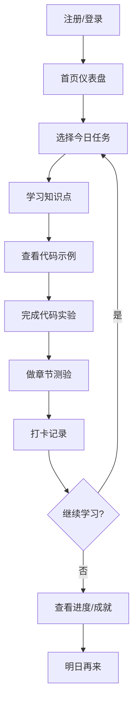
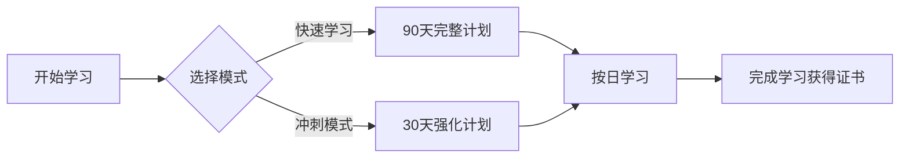

# CISP零基础学习平台 - 产品需求文档

## 1. 产品概述

**CISP零基础学习平台** 是一款专为网络安全小白打造的沉浸式学习平台，通过游戏化机制、每日学习计划、互动代码实验室和趣味测验，让CISP认证学习变得轻松有趣。

- **核心目标**：帮助零基础学员在90天内系统掌握CISP知识体系
- **目标用户**：网络安全初学者、IT转行人员、对信息安全感兴趣的学生
- **核心价值**：将枯燥的认证考试内容转化为生动有趣的学习体验

## 2. 核心功能

### 2.1 用户角色

| 角色 | 注册方式 | 核心权限 |
|------|----------|----------|
| 学员 | 邮箱/手机注册 | 学习课程、做测验、写代码实验 |
| 管理员 | 后台分配 | 管理课程内容、查看学习数据 |

### 2.2 功能模块

1. **首页/仪表盘** - 今日任务、学习进度概览、热门知识点
2. **学习路径** - 90天详细学习计划、每日学习任务
3. **知识点详解** - CISP十大知识域、内容精讲、代码示例
4. **代码实验室** - 交互式代码编辑器、安全实验环境
5. **测验中心** - 章节测验、模拟考试、错题本
6. **成就系统** - 学习徽章、等级称号、排行榜
7. **社区交流** - 学习笔记、问题讨论、技术分享

## 3. 核心页面详情

### 3.1 首页仪表盘

**模块组成：**
- **Hero区域**：欢迎语、当前学习天数、今日目标
- **今日任务卡片**：今日需要学习的3-4个知识点
- **进度环形图**：整体学习进度可视化
- **学习 streak 连续打卡**：显示连续学习天数
- **快捷入口**：继续学习、代码实验室、测验中心
- **每日名言**：网络安全励志语录

### 3.2 学习路径页面

**90天学习计划结构：**

| 周数 | 主题 | 天数 | 核心内容 |
|------|------|------|----------|
| 第1周 | 信息安全基础 | Day 1-7 | 基本概念、信息安全定义、威胁分类 |
| 第2周 | 信息安全法规 | Day 8-14 | 法律法规、政策标准、合规要求 |
| 第3周 | 访问控制 | Day 15-21 | 身份认证、权限管理、访问控制模型 |
| 第4周 | 安全运营 | Day 22-28 | 安全运维、日志分析、事件响应 |
| 第5周 | 漏洞与攻击 | Day 29-35 | 常见漏洞、攻击类型、渗透测试基础 |
| 第6周 | 加密技术 | Day 36-42 | 对称加密、非对称加密、哈希函数、数字签名 |
| 第7周 | 网络安全 | Day 43-49 | 网络协议、防火墙、入侵检测、VPN |
| 第8周 | 应用安全 | Day 50-56 | Web安全、数据库安全、代码审计 |
| 第9周 | 物理安全 | Day 57-63 | 物理防护、环境安全、灾备恢复 |
| 第10周 | 安全工程 | Day 64-70 | 安全评估、风险管理、安全架构 |
| 第11周 | 业务安全 | Day 71-77 | 隐私保护、数据安全、业务连续性 |
| 第12周 | 模拟考试 | Day 78-90 | 综合复习、模拟测试、考前冲刺 |

**每日学习卡片内容：**
- 今日主题标题
- 学习目标（3个要点）
- 知识点详细内容
- 代码示例（可运行）
- 练习题（3-5道）
- 今日打卡按钮

### 3.3 知识点详解页

**每个知识点包含：**
- 知识点标题和概述
- 详细讲解文字
- 重点标记和高亮
- 代码示例（带语法高亮）
- 图示说明（流程图、架构图）
- 常见问题和解答
- 相关知识点链接

### 3.4 代码实验室

**功能特性：**
- 在线代码编辑器（Monaco Editor）
- 预设安全实验模板
- 代码高亮和自动补全
- 实验指导步骤
- 预期结果对比
- 实验报告生成

**实验项目示例：**
1. SQL注入实验
2. XSS跨站脚本实验
3. 密码暴力破解模拟
4. 防火墙规则配置
5. 日志分析练习
6. 加密解密实践

### 3.5 测验中心

**测验类型：**
- **章节测验**：每章结束后的小测试（20题）
- **每日闯关**：每天学习后的趣味测验
- **模拟考试**：完整CISP模拟题（100题）
- **错题本**：记录所有做错的题目

**测验特性：**
- 计时功能
- 分数统计
- 答案解析
- 知识点关联
- 进度保存

### 3.6 成就系统

**徽章类型：**
- 🌱 初学者 - 完成第一天学习
- 📚 好学生 - 连续学习7天
- 🔥 坚持者 - 连续学习30天
- 💻 黑客小子 - 完成所有代码实验
- 🏆 模拟大师 - 模拟考试90分以上
- 📖 知识渊博 - 学习完所有知识点
- ⚡ 速成选手 - 30天内完成基础学习

**等级称号：**
1. 安全小白（0-10天）
2. 安全学员（11-30天）
3. 安全爱好者（31-60天）
4. 安全工程师（61-90天）
5. 安全专家（90天+ 且通过模拟考试）

### 3.7 社区交流

**功能：**
- 学习笔记发布
- 问题提问
- 经验分享
- 点赞和评论
- 精华帖推荐

## 4. 用户流程

### 4.1 学习流程



### 4.2 学习路径选择流程



## 5. 用户界面设计

### 5.1 设计风格

**主题：网络安全/黑客风格**
- **主色调**：深空黑 #0a0e17，配以霓虹绿 #00ff88和电光蓝 #00d4ff
- **辅助色**：暗紫色 #1a1a2e，警示红 #ff3366
- **字体**：
  - 标题：Orbitron（科技感）
  - 正文：Noto Sans SC（中文清晰）
  - 代码：Fira Code（等宽易读）
- **布局**：卡片式布局，左侧导航，右侧内容区
- **动效**：渐变流动、发光效果、粒子背景
- **图标**：线性图标风格，配合网络安全元素

### 5.2 页面视觉

| 页面 | 主色调 | 特色元素 |
|------|--------|----------|
| 首页仪表盘 | 霓虹绿渐变 | 粒子背景、进度动画 |
| 学习路径 | 深空黑 | 横向时间轴、节点发光 |
| 知识点 | 暗紫蓝 | 代码块高亮、流程图 |
| 代码实验室 | 全黑主题 | 终端风格、代码发光 |
| 测验中心 | 电光蓝 | 倒计时、答题卡 |
| 成就系统 | 金色主题 | 徽章发光、动画解锁 |

### 5.3 响应式设计

- **桌面端**：三栏布局（导航+内容+侧边栏）
- **平板端**：两栏布局（折叠导航+内容）
- **移动端**：单栏布局，底部导航

### 5.4 视觉效果增强

- 背景：动态粒子/网格动画
- 卡片：玻璃态效果 + 发光边框
- 按钮：渐变背景 + 悬停发光
- 进度条：流动渐变动画
- 徽章：3D旋转 + 光晕效果

## 6. 技术架构

### 6.1 技术栈

| 类别 | 技术 |
|------|------|
| 前端框架 | React 18 + Vite |
| 样式方案 | Tailwind CSS |
| 路由管理 | React Router |
| 状态管理 | Zustand |
| 代码编辑器 | Monaco Editor |
| 图表库 | Recharts |
| 动画方案 | Framer Motion |
| 图标库 | Lucide React |
| Markdown渲染 | React Markdown |

### 6.2 项目结构

```
cisp-learning/
├── public/
│   └── favicon.ico
├── src/
│   ├── assets/          # 静态资源
│   ├── components/       # 通用组件
│   │   ├── Layout/       # 布局组件
│   │   ├── UI/           # UI基础组件
│   │   └── Learning/     # 学习相关组件
│   ├── pages/            # 页面组件
│   ├── data/             # 学习内容数据
│   ├── hooks/            # 自定义hooks
│   ├── store/            # 状态管理
│   ├── styles/           # 全局样式
│   ├── utils/            # 工具函数
│   ├── App.jsx
│   └── main.jsx
├── index.html
├── package.json
├── vite.config.js
└── tailwind.config.js
```

## 7. 内容数据

### 7.1 学习数据

每个知识点包含：
```javascript
{
  id: "day-01",
  day: 1,
  title: "信息安全的定义",
  objectives: [
    "理解信息安全的概念",
    "了解信息安全的三要素",
    "掌握安全威胁分类"
  ],
  content: "详细讲解内容...",
  codeExample: {
    language: "python",
    code: "# 代码示例",
    description: "代码说明"
  },
  quiz: [
    {
      question: "题目",
      options: ["A", "B", "C", "D"],
      answer: 0,
      explanation: "解析"
    }
  ],
  resources: ["相关链接"]
}
```

## 8. 验收标准

1. ✅ 首页仪表盘完整显示学习进度和今日任务
2. ✅ 90天学习路径完整呈现，可按日学习
3. ✅ 每个知识点包含详细内容、代码示例、练习题
4. ✅ 代码实验室可运行预设的安全实验
5. ✅ 测验系统支持章节测验和模拟考试
6. ✅ 成就系统包含徽章和等级称号
7. ✅ 社区功能支持笔记发布和交流
8. ✅ 界面美观，具有网络安全主题特色
9. ✅ 响应式设计，支持多设备访问
10. ✅ 数据持久化，学习进度不丢失
