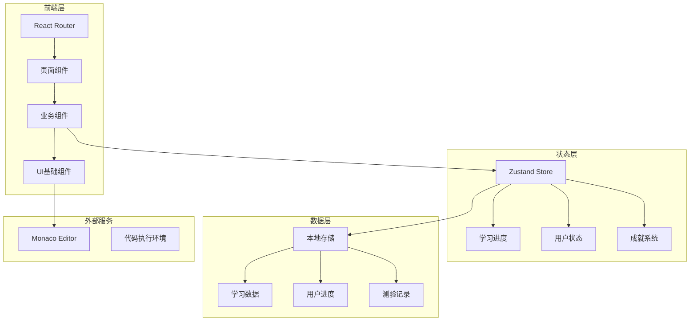
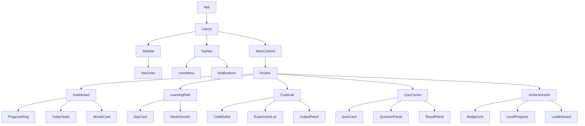

# CISP零基础学习平台 - 技术架构文档

## 1. 架构设计



## 2. 技术描述

| 类别 | 技术 | 版本 |
|------|------|------|
| 前端框架 | React | 18.x |
| 构建工具 | Vite | 5.x |
| 样式方案 | Tailwind CSS | 3.x |
| 路由管理 | React Router DOM | 6.x |
| 状态管理 | Zustand | 4.x |
| 代码编辑器 | Monaco Editor | 0.45.x |
| 图表库 | Recharts | 2.x |
| 动画库 | Framer Motion | 10.x |
| 图标库 | Lucide React | 最新 |
| Markdown | React Markdown | 9.x |

## 3. 路由定义

| 路由 | 页面 | 功能 |
|------|------|------|
| / | Dashboard | 首页仪表盘 |
| /learning | LearningPath | 学习路径总览 |
| /learning/:dayId | DailyLearning | 每日学习详情 |
| /knowledge/:topicId | KnowledgeDetail | 知识点详解 |
| /lab | CodeLab | 代码实验室 |
| /lab/:experimentId | Experiment | 实验室详情 |
| /quiz | QuizCenter | 测验中心 |
| /quiz/:quizId | Quiz | 测验答题 |
| /achievements | Achievements | 成就系统 |
| /community | Community | 社区交流 |
| /profile | Profile | 个人中心 |

## 4. 状态管理

### 4.1 Store 结构

```typescript
// userStore - 用户状态
{
  user: { name, email, avatar, joinDate },
  isLoggedIn: boolean,
  settings: { theme, notifications }
}

// learningStore - 学习进度
{
  currentDay: number,
  completedDays: number[],
  streak: number,
  lastStudyDate: string,
  mode: 'full' | 'intensive'
}

// achievementStore - 成就系统
{
  badges: Badge[],
  level: number,
  points: number,
  unlockedBadges: string[]
}
```

## 5. 数据模型

### 5.1 学习数据模型

```typescript
interface LearningDay {
  id: string;
  day: number;
  week: number;
  title: string;
  objectives: string[];
  content: string;
  codeExample: CodeExample;
  quiz: QuizQuestion[];
  completed: boolean;
  completedAt?: string;
}

interface CodeExample {
  language: string;
  code: string;
  description: string;
  expectedOutput?: string;
}

interface QuizQuestion {
  id: string;
  question: string;
  options: string[];
  correctIndex: number;
  explanation: string;
  relatedDayId: string;
}

interface Badge {
  id: string;
  name: string;
  description: string;
  icon: string;
  unlockedAt?: string;
  condition: string;
}
```

## 6. 组件架构



## 7. 页面详细设计

### 7.1 首页仪表盘组件树

```
Dashboard
├── ParticleBackground
├── DashboardHeader
│   ├── Greeting
│   └── StudyStreak
├── ProgressOverview
│   ├── CircularProgress
│   └── StatsCards
├── TodayTasks
│   ├── TaskCard (x3-4)
│   └── ContinueButton
├── QuickActions
│   ├── CodeLabButton
│   ├── QuizButton
│   └── CommunityButton
└── DailyQuote
```

### 7.2 学习路径页面组件树

```
LearningPath
├── PathHeader
│   ├── Title
│   └── ModeSelector
├── TimelineView
│   ├── WeekSection (x12)
│   │   ├── WeekHeader
│   │   └── DayCard (x7)
│   └── ProgressLine
└── CurrentDayHighlight
```

### 7.3 代码实验室页面组件树

```
CodeLab
├── LabHeader
├── ExperimentGrid
│   └── ExperimentCard (x10+)
└── LabConsole

Experiment
├── ExperimentHeader
├── InstructionPanel
├── CodeEditor
│   ├── MonacoEditor
│   └── EditorToolbar
├── OutputPanel
│   ├── ConsoleOutput
│   └── ExpectedOutput
└── ExperimentActions
    ├── RunButton
    ├── ResetButton
    └── SubmitButton
```

## 8. 动画设计

| 元素 | 动画类型 | 触发时机 |
|------|----------|----------|
| 粒子背景 | 持续漂浮 | 页面加载 |
| 进度环 | 填充动画 | 进入视口 |
| 卡片悬停 | 上浮+发光 | 鼠标悬停 |
| 徽章解锁 | 缩放+闪光 | 达成成就 |
| 打卡成功 | 爆炸粒子 | 点击打卡 |
| 页面切换 | 淡入滑动 | 路由切换 |

## 9. 本地存储策略

| 数据类型 | 存储键 | 过期策略 |
|----------|--------|----------|
| 用户信息 | cisp_user | 永久 |
| 学习进度 | cisp_progress | 永久 |
| 成就数据 | cisp_achievements | 永久 |
| 测验记录 | cisp_quiz_results | 永久 |
| 笔记数据 | cisp_notes | 永久 |
| 应用设置 | cisp_settings | 永久 |

## 10. 性能优化

- React.lazy 路由懒加载
- 组件按需加载
- 图片资源压缩
- 代码分割
- Tailwind CSS purge
- 动画 GPU 加速
