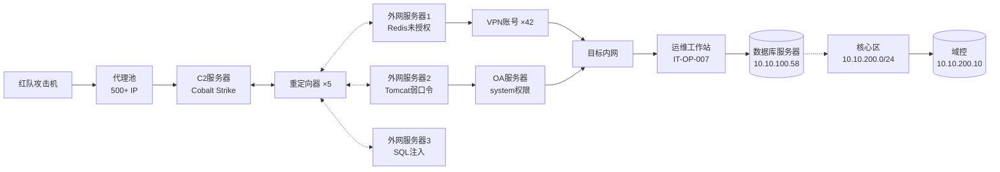
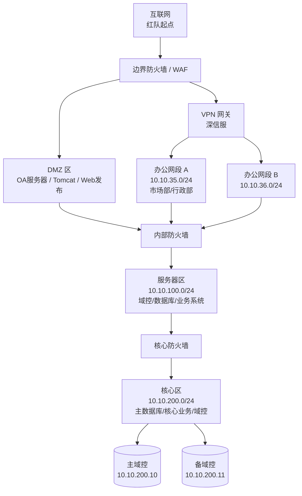
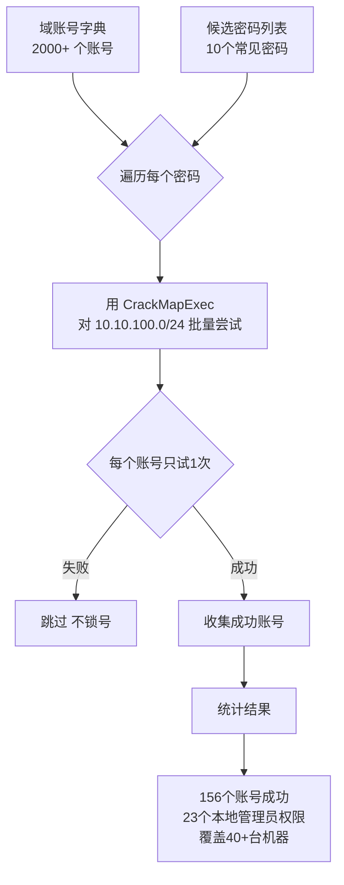

# 第2章 护网红队行动全记录（下）

> **难度等级：⭐ 开胃菜**
>
> **预计阅读时间：120分钟**
>
> **本章看点：钓鱼突破、横向移动、域控攻坚战、战绩盘点**
>
> ::: tip 说明
> 本章承接第1章的故事，继续讲护网行动的后半程。
> 文中提到的技术细节，后续对应章节会有更深入的讲解。
> 标注"（详见第X章）"的内容，可以翻到对应章节学习具体操作方法。
> :::

---

## 📖 本章概述

::: tip 写在前面
上一章我们讲到，行动第一天上午，我们就拿到了5台外网服务器的权限，还通过撞库拿到了42个VPN账号。
内网组也已经成功进入内网，摸到了办公网段。

但是，这才只是开始。
真正的硬仗，在下午，在后面的几天。

这一章，你会看到：
- 钓鱼攻击是怎么一步步实施的
- 内网横向移动的完整过程
- 域渗透的经典攻击路径
- 拿下域控的那一刻有多爽
- 蓝队的反击和我们的应对
- 最终战绩盘点和经验总结
:::

---

## 🎯 学习目标

读完本章，你将了解：

- [x] 红队钓鱼攻击的完整流程
- [x] 内网横向移动的常用方法
- [x] 域渗透的经典攻击路径
- [x] 红队和蓝队的攻防对抗
- [x] 护网行动的最终战绩如何盘点

---

## ⚔️ 行动第一天下午：钓鱼+内网初探

### 4.1 下午第一战：试探性钓鱼

吃完饭，情报组的老K就开始准备钓鱼了。

> "下午先发一波试探性的钓鱼邮件，摸摸底。
> 不要发太多，先发20封试试水。
> 目标就选市场部、行政部的普通员工，警惕性低一点。
> 钓鱼内容就用最常见的：'【紧急通知】您的邮箱密码将于24小时内过期'。
> 看看有多少人会上钩，也看看蓝队的反应速度。"

小林（情报组的）已经把钓鱼邮件模板改好了，拿给老K看：

```
📧 钓鱼邮件内容（第一版）：

发件人：IT运维部 <it-support@xxenergy-mail.com>
收件人：xxx@xxenergy.com
主题：【紧急通知】您的邮箱密码将于24小时内过期

尊敬的同事：

您好！

由于公司邮件系统升级，您的邮箱密码将于24小时内过期。
为避免影响您的正常工作，请尽快点击以下链接修改密码：

👉 点击修改邮箱密码：https://mail.xxenergy-mail.com/update

请注意：
1. 请在24小时内完成修改，逾期账号将被锁定
2. 修改密码需要验证您的当前密码
3. 如有疑问，请联系IT运维部：分机号 8888

感谢您的配合！

IT运维部
2024年X月X日
```

老K看了看，摇摇头：

> "不行，太假了。
> 第一，发件人域名不对，用的是我们注册的钓鱼域名，明眼人一看就知道。
> 第二，内容太生硬了，不像公司内部的通知。
> 第三，链接太明显了。
>
> 改一改，改成这样：
> 1. 发件名字改成'王XX'（就是那个运维部主任的名字），用他的名义发
> 2. 内容改得口语化一点，像真实的内部通知
> 3. 链接放正文里，不要搞得那么显眼
> 4. 加个公司logo，看起来更正规
> 5. 落款加上公司的标准格式"

小林改了一版，老K又提了几点意见。来来回回改了五六版，最终版出来了：

```
📧 钓鱼邮件最终版（第五版）：

发件人：王XX <wangxx@xxenergy-mail.com>
收件人：xxx@xxenergy.com
主题：【重要通知】邮件系统安全升级，请及时验证账号

各位同事：

大家好！

接集团信息安全部通知，近期发现有外部人员尝试暴力破解公司邮箱账号。
为保障大家的账号安全，邮件系统将进行一次安全升级。

升级期间，需要大家验证一下自己的邮箱账号，确认账号归属本人。
验证流程很简单，大概1分钟就能完成。

验证链接：https://portal.xxenergy-mail.com/verify?user={收件人邮箱}

⚠️ 重要提醒：
- 请在今天18:00前完成验证，未验证的账号将临时冻结
- 验证时请使用公司邮箱账号和密码
- 不要把链接转发给其他人
- 如有问题，请直接回复此邮件，或者打我分机8001

给大家添麻烦了，感谢配合！

王XX
IT运维部 主任
XX能源集团有限公司
电话：0XXX-88888888 转 8001
邮箱：wangxx@xxenergy.com
```

**图2-1 钓鱼邮件原文（脱敏版）**


老K满意地点点头：

> "嗯，这版像那么回事了。
> 用王主任的名义发，可信度高很多。
> 内容也说得过去，'安全升级验证账号'，理由挺正当的。
> 链接里还带了收件人邮箱，点开之后用户名都自动填好了，用户只需要输密码，更省事。
>
> 行了，就用这版。
> 先发20封试试，选市场部和行政部的。
> 分批次发，不要一下子全发出去，容易被反垃圾邮件系统拦。"

下午1点半，第一波钓鱼邮件发出去了。

然后就是等。

钓鱼这种事，发出去之后就只能等了。

老K倒是不急，泡了杯茶，慢悠悠地刷着钓鱼平台的后台。

> "钓鱼这个事，急不得。
> 一般发出去之后，前半个小时是高峰期。
> 然后陆陆续续还会有人点。
> 转化率一般在5%-20%之间，看钓鱼内容的质量。"

13:45，第一个上钩的来了。

> "哟，这么快？才15分钟就有人点了。
> 市场部的，姓张，密码也输入了。
> 可以可以，开门红。"

14:00，已经有8个人上钩了。

14:30，一共12个人提交了账号密码。

> "20封邮件，12个上钩，60%的转化率，不错不错。
> 看来这版钓鱼邮件写得挺好的。
> 不过... 怎么蓝队一点反应都没有？
> 按说12个账号在同一个IP登录失败，应该会告警啊？
> 还是说他们的监控没那么严？
> 或者... 他们还没发现？"

飞哥想了想，说：

> "先别急着下结论。
> 说不定蓝队已经发现了，但是在放长线钓大鱼。
> 先看看再说。
>
> 情报组，把钓到的账号整理一下，发给内网组。
> 内网组用这些号再试试，看看有没有权限更高的。
> 另外，注意观察，看看蓝队有没有什么动作。"

> 💡 **钓鱼攻击详解？**（详见第66-68章：社会工程学与钓鱼攻击）
> 钓鱼这一块的内容，后面有专门的三章来讲。
> 从社会工程学基础，到钓鱼邮件制作，再到高级钓鱼和水坑攻击。
> 还有Gophish、Evilginx2这些工具的详细使用教程。
> 感兴趣的话，可以提前翻到第66章开始看。

### 4.2 内网组的发现：一个运维工作站

下午2点多，内网组那边传来了消息。

飞哥他们用普通员工的VPN号进去之后，一直在办公网段里逛，收集信息。

逛着逛着，发现了一台有意思的机器。

> "兄弟们，有发现。
> 10.10.35.67 这台机器，主机名是 IT-OP-007。
> 从名字看，是运维部的机器。
> 我扫了一下这台机器的端口，开了3389（远程桌面）。
> 而且，我用刚才钓到的一个运维的账号试了试...
> 居然能登录！"

阿豪（Web组组长）一下子就精神了：

> "运维的机器？那可太值钱了！
> 运维的机器上一般都存着各种密码、密钥、服务器列表...
> 运气好的话，直接就能拿到一大堆服务器的权限。"

飞哥继续说：

> "我已经登进去看了一眼。
> 确实是运维的机器，桌面上有好多工具。
> 有Xshell、SecureCRT、Navicat、mstsc...
> 浏览器里存了一大堆管理后台的密码。
> 还有个密码本的Excel文件，不过有密码，打不开。
>
> 最关键的是，这台机器是用本地管理员账号登录的。
> 我提一下权限，把密码抓出来看看。"

又过了十几分钟，飞哥的声音都带着笑意了：

> "兄弟们，大丰收！
> mimikatz跑出来了，这台机器上存了好几个账号的明文密码。
> 其中有一个域管理员账号！
> 虽然可能只是这台机器的登录缓存，但好歹是域管啊！
> 我先试试能不能用这个域管账号登录其他机器。"

所有人都屏住了呼吸。

域管理员账号啊！这可是内网渗透的圣杯！

如果这个域管账号能用，那基本上整个域就拿下了。

过了几分钟，飞哥的声音传来，带着一点遗憾：

> "唉，不行。
> 这个域管账号的密码过期了。
> 应该是之前的域管用这台机器登过，密码缓存还在，但是后来改了密码。
> 不过没关系，有缓存就有希望。
> 我们可以用哈希传递（Pass-the-Hash）试试，说不定还能用。"

又过了一会儿：

> "哈希传递也不行，密码确实改了。
> 不过没关系，我们已经前进了一大步。
> 这台运维机器上有很多宝贝，慢慢挖。
>
> 我在这台机器的Xshell里找到了100多台服务器的连接配置。
> 虽然密码是加密的，但是我们有这台机器的权限，可以想办法导出来。
> 还有，浏览器里保存的密码，也都能导出来。
> 这些都是突破口。"

**图2-2 红队进入内网的跳板架构图**



> 💡 **mimikatz抓密码是什么？**（详见第49章：哈希传递与票据传递）
> mimikatz是内网渗透的神器，能从Windows系统里抓出明文密码、哈希、Kerberos票据等等。
> 哈希传递（Pass-the-Hash）也是内网渗透的经典技术。
> 这些在第49章会详细讲，还有实操演示。

### 4.3 第一个高危漏洞：OA系统 getshell

下午3点多，Web组的阿豪那边也传来了好消息。

> "兄弟们，OA系统搞下来了！
> 泛微e-cology的一个漏洞，具体哪个洞就不说了，懂的都懂。
> 拿到Shell了，是Windows服务器，权限是system。
> 这台服务器在DMZ区，但是和内网是通的！
> 我们又多了一个进入内网的跳板！"

整个会议室都振奋了一下。

OA系统 getshell，这可是大进展。

OA系统一般都在内网边缘，而且权限通常不低，是很好的跳板。

飞哥马上问：

> "能直接连内网吗？能访问哪些网段？
> 服务器上有什么有用的信息吗？
> 数据库权限怎么样？"

阿豪噼里啪啦敲了一会儿，回复：

> "网络方面：
> - 能访问 10.10.100.0/24（服务器区）
> - 能访问 10.10.35.0/24（办公网）
> - 核心区 10.10.200.0/24 访问不了
> 比VPN的权限还大一点！
>
> 服务器上：
> - OA的数据库账号密码找到了，是sa权限（MSSQL的最高权限）
> - 服务器上有一些运维脚本，里面有几个其他系统的账号密码
> - 还在翻，应该还有更多
>
> 数据库方面：
> - 已经连上MSSQL了，sa权限
> - OA的所有数据都能看
> - 包括用户表、流程表、文档...
> - 我正在导出用户表，看看里面的密码"

老K插嘴：

> "OA的用户表！这个太重要了！
> OA里有全公司所有人的账号，几万人呢！
> 赶紧把密码导出来，能解多少解多少。
> 有了这些账号，我们在内网里横着走！"

阿豪：

> "正在导了，用户表有5万多条数据。
> 密码是加密的，不是简单的MD5，泛微自己的加密算法。
> 不过没关系，网上有解密脚本。
> 我跑一下，估计能解出来不少。"

> 💡 **泛微OA漏洞有哪些？**（详见第22-25章：文件上传漏洞 + 基础篇）
> OA系统漏洞是红队的常客，泛微、致远、通达... 这些OA都出过很多漏洞。
> 文件上传、SQL注入、命令执行... 各种类型都有。
> 后面的Web渗透模块会详细讲各种常见CMS和OA的漏洞。

### 4.4 蓝队的反击：第一次告警

下午4点多，正当我们打得顺风顺水的时候，情报组的阿飞突然喊了一声：

> "不好！蓝队有动作了！
> 我们的钓鱼域名被标记了！
> 而且，我发现我们的几个IP被拉黑了。
> 看来蓝队终于反应过来了。"

飞哥一下子坐直了：

> "具体什么情况？
> 哪些IP被拉黑了？
> 钓鱼那边怎么样了？
> VPN那边呢？"

阿飞：

> "情况是这样的：
> 1. 我们发钓鱼邮件的那个域名，已经被目标的邮件网关拦了
>    后面再发的邮件都进不去了
> 2. 我们用来扫Web的那几个代理IP，有3个被WAF拉黑了
>    访问目标网站返回403
> 3. VPN那边，有几个账号被锁了
>    应该是登录失败次数太多触发了告警
> 4. 但是我们已经登进去的那几个VPN号，目前还正常
>
> 好消息是：我们已经拿到的Shell、已经进去的内网机器，都还没被发现。
> 蓝队目前应该只是发现了外围的扫描和钓鱼，还没意识到我们已经进内网了。"

飞哥松了一口气：

> "还好还好，还在可控范围内。
> 蓝队反应不算慢，但也不算快。
> 从我们发钓鱼到现在，快3个小时了才反应过来。
>
> 接下来调整策略：
> 1. Web组，换一批代理IP继续扫，注意控制频率，不要太猛
> 2. 情报组，钓鱼域名暂时不用了，换个方式
>    先不急着发第二波，等风头过了再说
> 3. 内网组，注意隐蔽！
>    动作小一点，不要搞出大动静
>    尽量用正常的工具和协议，不要用太可疑的
>    我们已经进来了，不急，稳扎稳打
> 4. 支援组，把C2的流量再伪装一下
>    尽量混在正常流量里
>
> 记住，我们现在是在敌人的腹地，一定要小心。
> 被发现了没关系，但是被踢出去了就麻烦了。
> 隐蔽第一，速度第二。"

会议室里的气氛稍微紧张了一点。

这就是真实的攻防对抗，不是单方面的碾压。
蓝队也在行动，也在找我们。
就看谁技高一筹了。

---

## 🌙 行动第二天：横向移动

### 5.1 早上的战果汇总

第二天早上8点，行动继续。

经过一晚上的"挂机"（有些扫描和爆破任务是连夜跑的），各组都有了一些新进展。

飞哥主持了晨会：

> "兄弟们，早上好。
> 先汇总一下昨天的战果，以及昨晚的新进展。
> 情报组先来。"

老K：

> "情报组这边：
> 1. 子域名：287个 → 312个，又找到25个
> 2. 账号密码：
>    - 从OA数据库里导出来了5万多条用户数据
>    - 破解了大概8000多个密码
>    - 其中有效账号大概3000个
>    - 域账号大概2000个
> 3. 社工画像：又补充了几个人
> 4. 钓鱼那边：暂时停了，等风声过了再说
>
> 重点：从OA的数据库里，我们拿到了2000多个域账号！
> 虽然都是普通员工的权限，但量大啊！
> 有了这些账号，我们在内网里能干的事就多了。"

飞哥点点头：

> "不错，2000个域账号，这是大收获。
> Web组呢？"

阿豪：

> "Web组这边：
> 1. 外网服务器：5台 → 8台，又拿了3台
>    都是一些边缘系统、测试系统
> 2. OA系统已经稳定下来了，权限还在
>    从OA服务器上又挖到了不少其他系统的账号密码
> 3. 高危漏洞：又发现了5个，其中2个能getshell
>    正在打
> 4. 核心业务系统还在啃，比较难，防护做得不错
>
> 重点：从OA服务器上找到的运维脚本里，有几个数据库的账号密码。
> 其中一个是HR系统的数据库，权限还不低。
> HR系统的数据可比OA的还值钱。"

飞哥：

> "可以，继续挖。
> 内网组呢？"

飞哥自己就是内网组的，他自己汇报：

> "内网组这边：
> 1. 目前有3个进入内网的通道：
>    - VPN账号（5个能用的）
>    - OA服务器跳板（这个最稳）
>    - 那台Tomcat服务器（也能用）
> 2. 运维工作站（IT-OP-007）已经拿下了
>    从里面挖出了100多台服务器的连接信息
>    密码正在破解中（Xshell的密码加密了）
> 3. 已经用普通域账号逛了办公网段和服务器区
>    内网大概有 300+ 台机器
>    域控确认了，在核心区
> 4. 核心区目前还是进不去，防火墙拦得很死
>    正在想办法
>
> 重点：我们发现了一个文件服务器，上面有好多共享文件夹。
> 很多部门的共享资料都在上面。
> 里面说不定能找到不少有用的东西。
> 正在翻。"

**图2-3 目标单位内网网络拓扑图**



飞哥（自己总结）：

> "总的来说，开局不错。
> 我们已经成功进入内网，拿到了不少账号和机器。
> 但是核心区还没进去，域控还没拿到。
> 今天的目标很明确：
> 1. 扩大内网战果，多拿几台服务器
> 2. 想办法进核心区
> 3. 争取摸到域控
>
> 大家都注意隐蔽，蓝队已经警觉了。
> 不要用太猛的扫描，不要搞出大动静。
> 稳扎稳打，步步为营。
>
> 好了，开工！"

### 5.2 密码喷洒：批量尝试登录

有了2000多个域账号，内网组第一件事就是做"密码喷洒"（Password Spraying）。

什么是密码喷洒？
就是用一堆用户名，去试同一个密码。
跟暴力破解不一样，暴力破解是一个账号试很多密码，容易锁号。
密码喷洒是很多账号试同一个密码，每个账号只试一次，不容易触发告警。

> 💡 **密码喷洒详解**（详见第48章：内网信息收集）
> 密码喷洒是内网渗透中非常常用的技术。
> 用一个常见的密码（比如公司名+年份），去试一堆账号。
> 命中率虽然不高（一般2%-5%），但是账号多了，总能中几个。
> 关键是不容易被发现，因为每个账号只失败一次。

飞哥他们选了几个最可能的密码：
- Xxny@2024（公司名+年份，最常见的）
- Xxny2024
- 123456
- password
- Qwerty123
- ...一共选了10个最常见的

**图2-4 密码喷洒（Password Spraying）原理流程图**



然后用 CrackMapExec 工具，对着内网里的机器开始喷。

```bash
# 密码喷洒命令（示例，不是真实命令）
cme smb 10.10.100.0/24 -u users.txt -p 'Xxny@2024' --continue-on-success
```

> 💡 **CrackMapExec是什么？**（详见第50章：横向移动技术大全）
> CME（CrackMapExec）是内网渗透的瑞士军刀，功能非常强大。
> 密码喷洒、远程执行、哈希传递、枚举... 什么都能干。
> 第50章会详细讲这个神器。

喷了大概半个小时，结果出来了：

```
📊 密码喷洒结果：

【第一波：Xxny@2024】
- 测试账号：2000个
- 成功登录：87个
- 成功率：4.35%
- 其中管理员权限的：5个
- 其中服务器本地管理员的：12个

【一共10个密码】
- 总共成功：156个账号
- 其中有本地管理员权限的：23个
- 覆盖机器：40+台
```

飞哥兴奋地一拍桌子：

> "可以可以，156个账号，还有23个有本地管理员权限。
> 这下发财了！
> 有了这些账号，我们在内网里就灵活多了。
>
> 先把这些有管理员权限的机器登进去看看。
> 每台都翻一遍，看看有没有什么宝贝。
> 服务器列表、密码本、配置文件... 什么都要。
> 重点找运维的机器、开发的机器、财务的机器。
> 这些机器上的东西最值钱。"

整个上午，内网组都在一台一台地登进去看。

一台一台地翻，一台一台地挖。

每台机器都可能藏着惊喜。

### 5.3 惊喜不断：从一台数据库服务器到核心区边缘

上午10点多，内网组的阿斌喊了一声：

> "飞哥，快来看！
> 10.10.100.58 这台机器，是台数据库服务器。
> 我用刚才喷到的一个账号登进去了，是本地管理员。
> 这台机器上装了Oracle数据库，而且...
> 数据库的sys密码就写在一个脚本里！
> 还是明文的！"

飞哥赶紧凑过去：

> "什么数据库？核心业务的吗？
> 权限多大？能访问什么？"

阿斌噼里啪啦敲了一通：

> "是生产数据库的一个从库。
> 主库在核心区（10.10.200.x），这台是从库，在服务器区。
> 数据库权限是sys，最高权限。
> 数据量很大，几百个G。
> 而且... 这台服务器能访问核心区！
> 虽然只能访问核心区的数据库端口，但是能通！
> 这是我们目前找到的第一个能到核心区的跳板！"

整个内网组都激动了。

核心区！终于摸到核心区的边了！

虽然只能访问数据库端口，但这是一个重大突破。

飞哥马上冷静下来：

> "别急，先确认一下。
> 这台机器能访问核心区的哪些IP？哪些端口？
> 是不是只有数据库端口？
> 还有没有其他的？"

阿斌又测试了一下：

> "测过了：
> - 能ping通核心区的部分IP（大概10台）
> - 能访问的端口：1521（Oracle）、22（SSH）、3389（RDP）
> - 其他端口都被防火墙拦了
> - 核心区的域控（10.10.200.10）也能ping通，但是端口访问不了
>
> 重点：核心区有一台Oracle数据库（10.10.200.20），这台从库能连上去。
> 而且，用这台从库的数据库账号... 好像也能登主库？
> 我试试..."

又过了几分钟，阿斌的声音都变调了：

> "我靠！真的能登！
> 用同一个账号密码，能直接登录核心区的主库！
> 权限还不低，DBA权限！
> 这可是核心区的生产库啊！"

飞哥深吸一口气：

> "稳住，稳住。
> 这是大进展，但是我们不能急。
> 数据库权限虽然高，但是要拿系统权限还得想办法。
> 而且，核心区的监控肯定更严。
> 我们先不急着动核心区的库，先观察观察。
>
> 当务之急是：
> 1. 利用这台数据库服务器当跳板，看看核心区还有什么
> 2. 想办法从数据库权限提升到系统权限
> 3. 看看能不能通过数据库打到域控
>
> 阿斌，你继续研究这台数据库。
> 其他人继续横向，多拿几台服务器，多找几个突破口。
> 不要把鸡蛋放在同一个篮子里。"

> 💡 **数据库提权有哪些方法？**（详见第44-45章：Windows提权进阶/高级）
> 拿到数据库权限之后，怎么拿到系统权限？
> 方法有很多：
> - MSSQL：xp_cmdshell、sp_oacreate、CLR...
> - Oracle：Java存储过程、外部表、UDF...
> - MySQL：UDF提权、MOF提权...
> 这些提权技术，后面的提权模块会详细讲。

### 5.4 蓝队的第二次动作：开始清场

下午2点多，情报组又有动静了。

> "飞哥，蓝队又有动作了。
> 他们开始清理外围了：
> 1. 昨天我们拿下的那几台外网服务器，有2台已经被加固了
>    （Redis加了密码，Tomcat后台关了）
> 2. OA系统也打补丁了，那个漏洞已经用不了了
>    不过我们的Shell还在，他们还没发现我们已经进去了
> 3. VPN那边又锁了一批账号
>    我们的VPN号又废了3个，还剩2个能用的
> 4. 我感觉蓝队已经开始全面排查了
>    估计很快就会查到内网"

飞哥皱了皱眉：

> "蓝队反应过来了，动作还挺快。
> 没关系，外围丢了就丢了，我们已经进来了。
> 只要内网的据点还在，就不怕。
>
> 通知各组：
> 1. Web组，外围差不多就行了，重点转向内网
>    已经拿到的Shell看好，别被蓝队踢了
> 2. 情报组，把所有外围扫描都停了
>    不要继续给蓝队送人头了
> 3. 内网组，注意！注意！注意！
>    蓝队很快就会查到内网
>    所有的C2马都换个通信方式
>    所有的动作都放慢，频率降低
>    尽量在上班时间活动，混在正常流量里
>    不要半夜搞大动作，太显眼了
> 4. 支援组，准备几个备用C2
>    万一主C2被发现了，马上切换
>
> 现在开始，进入静默期。
> 不要搞大动作，悄悄挖宝。
> 等蓝队的这波排查过去，我们再动。"

整个会议室安静了下来。
键盘敲击声都变小了。
大家都知道，最关键的时刻来了。

这就像打仗，冲锋的时候可以大喊大叫。
但是潜入敌后的时候，就要悄无声息。

---

## 🏰 行动第三天：域渗透攻坚战

### 6.1 BloodHound：画出域的攻击路径

第三天，蓝队的排查还在继续。
我们也没闲着，趁这个时间，好好梳理了一下内网的信息。

内网组用普通域账号，收集了域里的各种信息。
然后把数据导入了 BloodHound。

> 💡 **BloodHound是什么？**（详见第53-55章：活动目录 + Kerberos + 域渗透）
> BloodHound是域渗透的神器。
> 它能把域里的所有用户、计算机、组、权限关系都画成图。
> 然后自动帮你找出最短攻击路径：从当前用户，怎么一步步拿到域管理员。
> 用了BloodHound，域渗透就像开了挂一样。
> 这个工具我们在第53章会详细讲，非常非常重要。

阿斌把数据导入BloodHound之后，搜索了一下：

> "飞哥，你快来看！
> BloodHound找到了几条攻击路径！
> 其中有一条，只要三步就能到域管！"

飞哥赶紧凑过去：

> "什么路径？快说！"

阿斌指着屏幕上的图：

> "你看：
> 第一步：我们现在有个普通域用户 userA
> 第二步：userA 对 服务器S 有 GenericAll 权限
>         意思就是，我们可以完全控制这台服务器
>         可以在这台服务器上执行任意命令，以system权限
> 第三步：服务器S 的计算机账户 对 域管组 有 WriteDacl 权限
>         意思就是，我们可以修改域管组的权限
>         把我们自己加到域管组里！
>
> 只要三步！我们就能从普通域用户，变成域管理员！"

**图2-5 BloodHound 发现的域渗透三步攻击路径**


飞哥盯着屏幕看了半天，一拍大腿：

> "我靠，真的假的？
> 这么简单？那域管也太好拿了吧？
> 你没看错吧？这个权限关系对吗？"

阿斌又确认了一遍：

> "没错，BloodHound不会错的。
> 这个权限关系是AD里真实存在的。
> 应该是当年部署的时候图省事，给了这台服务器过高的权限。
> 这种配置错误在企业里太常见了。
> 很多管理员都不知道这些权限意味着什么。"

飞哥深吸一口气：

> "好！那我们就按这个路径打！
> 先拿下服务器S，然后通过服务器S的计算机账户权限，把我们加到域管组。
>
> 但是等等，服务器S在哪？我们能访问吗？
> 那台机器在哪个网段？"

阿斌查了一下：

> "服务器S的IP是 10.10.100.88。
> 在服务器区，我们能访问。
> 而且... 这台机器我们还没碰过。
> 上面有什么服务还不知道。"

飞哥：

> "好，那我们现在就去打这台机器。
> 既然我们对它有GenericAll权限，那方法就多了。
> 可以直接在上面执行命令，不用找漏洞。
>
> 但是要注意！
> 这台服务器可能是重要的服务器，上面可能有监控。
> 我们动作要轻，不要搞出大动静。
> 最好用正常的管理协议，不要用太可疑的工具。"

> 💡 **GenericAll是什么权限？**（详见第53章：活动目录基础）
> GenericAll是AD对象的一个权限，字面意思就是"完全控制"。
> 如果你对一个计算机对象有GenericAll权限，你可以：
> - 修改这台计算机的属性
> - 重置这台计算机的密码
> - 在这台计算机上执行代码（通过各种方式）
> - ...等等，基本上想干什么干什么
>
> 这是域渗透中非常值钱的一个权限关系。
> BloodHound就是专门找这种东西的。

### 6.2 拿下关键服务器

既然知道了攻击路径，那就开始干。

因为对这台服务器有GenericAll权限，所以方法很多。
飞哥选择了最稳妥的一种方式：通过计算机账户的权限，创建一个服务，执行命令。

具体操作过程就不细说了（后面第53-55章会详细讲），总之...

下午2点多，阿斌压低声音喊了一句：

> "成了！
> 服务器S拿到了！system权限！
> 这是台应用服务器，上面跑着一个重要的业务系统。
> 我已经种了马，权限稳定。"

飞哥：

> "好！
> 那下一步，用这台服务器的计算机账户权限，去修改域管组的DACL。
> 把我们的用户加进去。
> 注意，动作要快，改完马上改回来。
> 不要留痕迹。"

又过了十几分钟：

> "飞哥，成了！
> 我已经把我们的测试用户加到域管理员组里了！
> 现在这个用户就是域管了！"

飞哥：

> "真的？！
> 赶紧试试，能不能登录域控？
> 能不能访问核心区？"

阿斌试了一下，声音里抑制不住的激动：

> "能！能！能！
> 域控能登录！3389直接登进去了！
> 核心区也能访问了！域管权限就是不一样！
> 我靠，这就拿了？
> 三天就拿域控了？
> 是不是太顺利了？"

**图2-6 第三天域控攻坚战时间线**

```mermaid
gantt
    title 第三天 域控攻坚战时间线
    dateFormat X
    axisFormat %s时

    section 侦察阶段
    BloodHound 数据收集        :a1, 8, 2
    攻击路径分析               :a2, after a1, 1

    section 利用阶段
    准备利用工具               :b1, after a2, 1
    拿下服务器S system权限     :b2, after b1, 2
    修改域管组 DACL            :b3, after b2, 1

    section 验证阶段
    添加域管用户               :c1, after b3, 1
    登录域控验证               :c2, after c1, 1
    导出 ntds.dit              :c3, after c2, 2

    section 关键里程碑
    发现攻击路径               :milestone, m1, 11, 0
    拿下服务器S                :milestone, m2, 14, 0
    拿下域控                   :milestone, m3, 16, 0
```



飞哥也很激动，但还是保持着冷静：

> "先别急，确认一下。
> 是不是真的域管权限？
> 能做域管做的事吗？
> 比如创建用户、修改组策略...
> 还有，域控上有什么监控吗？
> 别高兴太早，说不定是个蜜罐。"

阿斌又检查了一遍：

> "确认了，是真的域管权限。
> 能创建用户，能修改组策略，能访问域控上的所有文件。
> 这台域控是真实的，不是蜜罐。
> 上面有ntds.dit，我们可以把域里所有账号的哈希都导出来。
> 有了所有哈希，整个域我们就完全控制了。"

飞哥深吸一口气，缓缓地说：

> "好。
> 我们... 拿下域控了。
>
> 三天。
> 从开始行动，到拿下域控，只用了三天。
>
> 但是，先不要声张。
> 这个域管账号我们先用着，但是不要搞大动作。
> 先把域里的信息都收集一遍，看看还有什么值钱的。
> 核心区的系统，一个一个摸过去。
> 等我们把核心区都摸清楚了，再考虑扩大战果。
>
> 还有，刚才加的那个域管账号，过一会儿就删掉。
> 不要留痕迹。
> 我们已经拿到域控了，后面想加多少加多少。
> 但是现在，隐蔽第一。"

会议室里一片压抑的兴奋。
拿下域控，这是护网行动中的"斩首行动"。
一般来说，拿下域控就意味着这场仗已经赢了一大半了。

但是大家都不敢太声张，怕乐极生悲。
毕竟蓝队还在找我们呢。

> 💡 **域渗透的完整流程？**（详见第53-56章：活动目录 + Kerberos + 域渗透 + 总结）
> 域渗透是内网渗透的终极目标。
> 从信息收集，到找攻击路径，到横向移动，到拿下域控。
> 整个过程有一套成熟的方法论和工具链。
> 我们用了整整四章来讲域渗透，从基础到高级，从理论到实战。
> 如果你对域渗透感兴趣，一定要看第53到56章。

### 6.3 核心区大扫荡

有了域管权限，核心区就像敞开了大门。

接下来的一天多，内网组就在核心区里扫荡。

一台一台服务器地看，一个一个系统地摸。

```
📊 核心区资产盘点（部分）：

【服务器数量】
- 核心区总共有服务器：80+台
- 其中Windows服务器：50+台
- Linux服务器：30+台

【重要系统】
- 域控 ×2（主备，已拿下）
- 生产数据库 ×3（Oracle，已拿下DBA权限）
- 核心业务系统 ×5（已拿到服务器权限）
- 财务系统 ×1（已拿下，数据非常敏感）
- HR系统 ×1（已拿下，全公司员工信息）
- 邮件系统 ×2（Exchange，已拿下）
- 文件服务器 ×2（已拿下，海量文件）
- 备份系统 ×1（已拿下，这个最值钱）
- 安全设备管理平台 ×1（还在想办法）

【数据量】
- 数据库数据：几个TB
- 文件服务器数据：几十TB
- 各种敏感信息：不计其数
```

老K看着这些成果，感叹道：

> "说实话，比我预想的顺利多了。
> 我本来以为至少要一周才能摸到域控。
> 结果三天就拿下了。
> 这家能源集团的防护，看起来严，实际上到处都是漏洞。
> 一个配置错误，直接就被我们打穿了。"

飞哥点点头：

> "是啊，很多单位都是这样。
> 看起来什么安全设备都有，防火墙、WAF、IDS、EDR...
> 但是真正的问题往往出在内部。
> 配置错误、权限过大、弱密码、安全意识差...
> 这些才是最大的漏洞。
>
> 不过话说回来，我们也不能掉以轻心。
> 蓝队还没发现我们呢，这不正常。
> 我们都拿了域控了，他们怎么一点反应都没有？
> 是不是有什么猫腻？
>
> 我总觉得哪里不对。
> 太顺利了，顺利得有点假。"

阿豪插嘴：

> "会不会是蓝队太菜了？
> 很多企业的安全团队都是摆设，根本不会玩。"

飞哥摇摇头：

> "不会。能源行业的护网，一般都比较重视。
> 他们的安全团队不至于这么菜。
> 而且，他们前几天还封了我们的IP、加固了服务器，说明他们不是完全不动。
> 为什么内网这边一点动静都没有？
>
> 我有一种不好的预感...
> 该不会是... 蓝队在放长线钓大鱼吧？
> 他们早就发现我们了，但是故意不吭声。
> 等我们把所有动作都做完了，人赃并获，直接一锅端？"

大家都沉默了。

这个可能性... 不是没有。

护网行动中，蓝队"放长线钓大鱼"是常规操作。
故意放红队进来，然后全程监控，最后等红队搞得差不多了，再收网。
这样既能看到红队的完整攻击路径，又能拿到充分的证据。

过了一会儿，飞哥说：

> "不管怎么样，我们按我们的节奏来。
> 该收集的信息继续收集，该拿的权限继续拿。
> 但是注意：
> 1. 所有操作都要留好后手，随时准备撤
> 2. 重要动作，先在测试机器上试，再去域控上操作
> 3. 痕迹清理随时做
> 4. C2多准备几个备用通道
>
> 就算真的是钓鱼，我们也要把鱼食吃完了再走。
> 来都来了，总不能空着手回去。"

---

## 🏆 行动最后两天：扩大战果 + 收网

### 7.1 第四天：拿分！拿分！拿分！

到了第四天，该拿的权限都拿得差不多了。
接下来就是"刷分"阶段。

护网行动是有计分规则的。
不同的成果有不同的分值。
拿的分越多，排名越高。

飞哥开了个短会：

> "兄弟们，域控我们已经拿下了。
> 核心区也差不多摸清楚了。
> 接下来这两天，主要任务就是拿分。
> 把能拿的分都拿到手。
>
> 我看了一下计分规则，大概是这样的：
> - 普通服务器：50分/台
> - 重要业务服务器：200分/台
> - 域控：500分
> - 获取指定目标数据：300分/个
> - 拿到工作站：20分/台
> - 管理后台：100分/个
>
> 我们现在有多少分了？大概估一下。"

老K算了算：

> "大概估一下：
> - 外网服务器：8台 × 50 = 400分
> - 内网服务器：40台 × 50 = 2000分
> - 重要业务系统：5个 × 200 = 1000分
> - 域控：500分
> - 各种管理后台：20个 × 100 = 2000分
> - 工作站：几十台，算500分吧
> - 数据的话，还没具体统计，估计不少
>
> 加起来... 大概7000分左右？"

飞哥：

> "7000分，应该能进前十了。
> 但是我们的目标是前三，甚至第一。
> 7000分还不够。
>
> 接下来重点搞这几块：
> 1. **数据获取**：这个分值高，也最容易拿高分
>    - 指定的几个目标数据，都想办法拿到
>    - 财务数据、员工信息、核心业务数据...
> 2. **扩大覆盖**：能拿的服务器都拿了
>    - 服务器区还有没拿下的，继续拿
>    - 办公网的工作站，能拿的也拿
>    - 蚊子再小也是肉
> 3. **供应链扩展**：看看能不能打他们的下游单位
>    - 通过域信任关系，看看能不能打到其他域
>    - 这个分值最高，但是难度也最大
>
> 最后两天，全力冲刺！
> 能拿多少分拿多少分！"

接下来的两天，所有人都在疯狂"刷分"。

内网组到处拿服务器、拿数据。
Web组在外围查漏补缺。
情报组整理数据、写报告素材。

整个会议室只有键盘敲击声，没有人说话。
大家都在赶时间。

护网行动的最后两天，是最疯狂的两天。

### 7.2 有惊无险：蓝队终于动了

第五天下午，蓝队终于有大动作了。

情报组的阿飞突然喊道：

> "飞哥！不对！
> 我们的几台C2，通信突然异常了！
> 好像被干扰了！
> 还有，我们的几个跳板机，好像被发现了！"

飞哥一下子站起来：

> "什么情况？慢慢说！"

阿飞：

> "情况是这样的：
> 1. 我们的主力C2，刚才有十几分钟连不上了
>    现在又恢复了，但是延迟很高，不稳定
> 2. 我们放在OA服务器上的马，下线了
>    那台服务器好像被重启了，或者被重装了
> 3. 核心区的几台机器，也有两台下线了
>    不知道是被发现了，还是正常的维护
> 4. 我发现我们的几个IP，正在被扫描
>    好像蓝队在溯源我们"

飞哥眉头紧锁：

> "终于来了。
> 蓝队这反应速度... 说快不快，说慢不慢。
> 第五天才发现我们进内网了。
> 也可能是早就发现了，现在才收网。
>
> 没关系，早有准备。
> 按预案来：
> 1. 主C2马上切备用通道
> 2. 暴露的跳板机全部放弃，不要了
> 3. 核心区的操作先停一停，先观望
> 4. 重要数据赶紧备份出来
> 5. 痕迹清理工作加快
>
> 我们还有备用C2，还有其他跳板。
> 就算这几个被端了，我们还有的玩。
>
> 对了，我们拿到的那些数据、截图，都备份好了吗？
> 这些是我们的战果，绝对不能丢。"

老K：

> "放心，都备份好了。
> 重要的截图、数据、日志，都在我们自己的服务器上。
> 就算内网的机器全丢了，战果也丢不了。"

飞哥点点头：

> "好。
> 那就好。
> 接下来，我们就跟蓝队玩玩捉迷藏。
> 他们找他们的，我们玩我们的。
> 最后两天，能多拿一分是一分。
> 就算被踢出去了，我们的分也够了。"

接下来的一天多，就是你追我赶的攻防战。
蓝队到处找我们，我们到处躲，顺便还能再拿点分。

就像猫捉老鼠。
只不过这只老鼠，有点太肥了。

### 7.3 最终战绩

第七天下午5点，护网行动正式结束。

裁判组宣布时间到，所有队伍停止攻击。

飞哥瘫在椅子上，长出了一口气：

> "结束了。
> 兄弟们，辛苦了。
>
> 来，最后统计一下战果。
> 看看我们这一周，到底拿了多少分。"

各组开始统计数据。
一个小时后，最终的战绩表出来了：

```
🏆 最终战绩统计：

【服务器/主机】
- 外网服务器：12台
- 内网服务器：68台（占目标总数的约60%）
- 工作站/办公机：156台
- 域控：2台（主备全拿）
- 核心业务系统：7个（全部拿下）

【数据获取】
- 域内所有账号哈希：5万+个（完整控制整个域）
- 员工个人信息：5万+条（姓名、手机、身份证、部门...）
- 财务数据：3年的财务报表
- 核心业务数据：多个业务系统的完整数据
- 邮件数据：100+个重要人物的邮件
- 其他各种数据：不计其数

【权限等级】
- 域管理员权限 ✓
- 企业管理员权限 ✓
- 根域控制 ✓
- 核心系统最高权限 ✓

【估分】
- 服务器得分：约4000分
- 数据得分：约5000分
- 其他得分：约2000分
- 总计：约11000分
```

**图2-7 最终战绩统计仪表盘**


看着这个战绩表，所有人都笑了。

一周的辛苦，值了。

老K拍了拍飞哥的肩膀：

> "可以啊飞哥，11000分。
> 这成绩，拿第一都有可能。
> 我参加了这么多护网，从没拿过这么高的分。"

飞哥笑着摇摇头：

> "不是我厉害，是大家厉害。
> 这是所有人一起努力的结果。
>
> 说真的，这次能这么顺利，我也没想到。
> 主要是开局好，情报收集做得足，OA拿得快，域渗透路径也找得巧。
> 当然，也跟目标的防护水平有关。
> 看起来挺严，实际上到处都是漏洞。
>
> 行了，收拾东西，准备撤了。
> 晚上我请客，大家好好吃一顿！"

会议室里一片欢呼。

---

## 📚 案例讲解

### 案例1：钓鱼攻击的完整流程

**背景**：红队通过钓鱼邮件，成功获取了大量员工的邮箱账号密码。

**钓鱼攻击的标准流程**：
```
第一步：情报收集
  - 收集目标公司的员工邮箱
  - 了解目标公司的组织架构、IT系统、常用术语
  - 给关键人物做社工画像

第二步：钓鱼准备
  - 注册钓鱼域名（跟目标域名相似的）
  - 搭建钓鱼网站（仿冒目标的登录页面）
  - 准备钓鱼邮件（内容、发件人、格式...）
  - 配置邮件服务器（提高送达率）

第三步：试探性钓鱼
  - 先发一小部分（几十封）试试水
  - 看看转化率怎么样
  - 看看蓝队的反应速度
  - 根据反馈调整钓鱼内容

第四步：大规模钓鱼
  - 如果效果好，就大批量发
  - 分批次发，不要一下子全发
  - 多准备几个模板，轮换着用
  - 多准备几个域名，防止被封

第五步：收获成果
  - 收集钓到的账号密码
  - 用这些账号去撞其他系统（VPN、OA、内网...）
  - 扩大战果
```

**为什么钓鱼的成功率这么高？**
1. 人的安全意识差，是最大的漏洞
2. 钓鱼邮件做得越来越逼真，普通人很难分辨
3. 利用了人的恐慌心理（"账号要被锁了！""有紧急邮件！"）
4. 利用了人的好奇心（"这张照片里有你！""工资单出来了！"）
5. 利用了人的信任心理（"领导发的邮件""IT部门的通知"）

**防御方法**：
1. 定期做员工安全意识培训
2. 定期做钓鱼演练（自己钓自己的员工）
3. 邮件网关过滤（SPF、DKIM、DMARC、反钓鱼）
4. 重要系统开启双因素认证（2FA）
5. 异常登录检测和告警

> 💡 **更多钓鱼技术？**（详见第66-68章）
> 钓鱼是一门大学问，从简单的群发邮件，到高级的鱼叉式钓鱼、水坑攻击、商业邮件诈骗（BEC）...
> 后面有专门的三章来讲，非常精彩。

---

### 案例2：BloodHound + 配置错误 = 三天拿域控

**背景**：红队通过BloodHound发现了一条攻击路径，利用一个配置错误，三步就拿到了域管权限。

**攻击路径详解**：
```
我们的起点：普通域用户 userA（通过撞库/钓鱼拿到的）

第一步：userA → 服务器S（GenericAll权限）
  - 什么是GenericAll？就是对这个计算机对象有完全控制权限
  - 有了这个权限，我们可以：
    * 重置服务器的计算机账户密码
    * 利用Resource-Based Constrained Delegation（基于资源的约束委派）
    * 或者直接在上面执行代码
    * ...等等，方法很多
  - 结果：拿到服务器S的system权限

第二步：服务器S$ → 域管理员组（WriteDacl权限）
  - 什么是WriteDacl？就是可以修改对象的DACL（自由访问控制列表）
  - 也就是说，我们可以修改域管理员组的权限
  - 可以把我们自己的用户加到域管理员组里
  - 结果：我们的用户变成了域管理员

第三步：域管理员 → 域控 → 整个域
  - 有了域管理员权限，域控随便登
  - 整个域就完全在我们的控制之下了
```

**为什么会有这种配置错误？**
- 很多管理员不理解AD权限的真正含义
- 为了图省事，给了过高的权限
- 历史遗留问题，以前的配置没人管
- 第三方软件安装的时候，自动加的权限
- 总之，企业的AD里，这种配置错误非常常见

**BloodHound的威力**：
- 以前域渗透靠经验，靠猜
- 现在有了BloodHound，直接给你画出路径
- 只要导入数据，点几下鼠标，最短攻击路径就出来了
- 域渗透的门槛大大降低了
- 所以现在域渗透，BloodHound是必备神器

**防御方法**：
1. 定期审计AD的权限配置，清理不必要的权限
2. 遵循最小权限原则
3. 保护好高权限的账号和组
4. 监控敏感权限的变更
5. 定期用BloodHound自己扫自己，提前发现问题

> 💡 **域渗透完整教程？**（详见第53-56章）
> 域渗透是红队的高阶技能，也是最有成就感的部分。
> 我们用了整整四章来讲，从AD基础，到Kerberos协议，到各种域渗透攻击技术，再到实战总结。
> 一定不要错过。

---

### 案例3：密码喷洒 — 用一个密码打穿内网

**背景**：红队拿到了2000个域账号之后，用密码喷洒技术，成功登录了156个账号，其中23个有本地管理员权限。

**什么是密码喷洒（Password Spraying）？**
```
暴力破解（Brute Force）：
  一个账号 → 试1000个密码 → 容易锁号，容易被发现
  缺点：太暴力，目标太大

密码喷洒（Password Spraying）：
  1000个账号 → 试1个密码 → 每个账号只失败一次，不容易被发现
  优点：隐蔽，不容易触发告警
  缺点：命中率低（一般2%-5%）
  但是架不住账号多啊！1000个账号，3%命中率，就是30个！
```

**密码喷洒的操作步骤**：
```
1. 收集大量用户名（域账号、邮箱账号...）
2. 挑选几个最可能的密码（一般是公司名+年份、季节、常见弱密码...）
3. 用工具对着目标机器批量试
4. 每次只试一个密码，间隔一段时间，再试下一个
5. 收集成功的账号密码
6. 用这些账号继续扩大战果
```

**常用工具**：
- CrackMapExec（CME）：强推，功能最全
- Hydra：老牌密码爆破工具，也支持喷洒
- kerbrute：专门针对Kerberos的密码喷洒，更隐蔽
- MSF里也有相应的模块

**防御方法**：
1. 强制用户使用强密码（不要用公司名+年份这种）
2. 密码策略（长度、复杂度、定期更换）
3. 登录失败锁定策略（但是不要锁太久，容易被DoS）
4. 异常登录检测（大量账号登录失败、异地登录...）
5. 最重要的：开启双因素认证（2FA）

---

### 案例4：红队和蓝队的攻防博弈

**背景**：整个护网行动，就是红队和蓝队的一场攻防博弈。

**攻防时间线**：
```
Day 1 上午：
  红队：大规模扫描、外围打点
  蓝队：还没反应过来（或者说还在监控）

Day 1 下午：
  红队：钓鱼攻击、进入内网
  蓝队：发现钓鱼和扫描，开始封IP、加固外围

Day 2：
  红队：内网横向移动、扩大战果
  蓝队：继续清理外围，开始内网排查（但是没找到红队）

Day 3：
  红队：域渗透，拿下域控
  蓝队：还在排查... （可能还没找到突破口）

Day 4-5：
  红队：核心区扫荡、疯狂刷分
  蓝队：终于发现内网被入侵了，开始紧急排查

Day 6-7：
  红队：边躲边打，继续拿分
  蓝队：到处找红队，清理后门，加固系统
  （猫捉老鼠游戏）

Day 7 下午：
  行动结束，盘点战果
```

**图2-8 护网7天红蓝攻防博弈时间线**

```mermaid
gantt
    title 护网7天红蓝攻防博弈时间线
    dateFormat X
    axisFormat D%s

    section 红队行动
    外围打点 + 情报收集       :r1, 0, 1
    钓鱼 + 进入内网           :r2, 1, 1
    横向移动 + 密码喷洒       :r3, 2, 1
    域渗透 + 拿下域控         :r4, 3, 1
    核心区扫荡 + 刷分         :r5, 4, 2
    边躲边打 + 痕迹清理       :r6, 6, 1

    section 蓝队行动
    监控 / 未反应             :b1, 0, 1
    封IP + 加固外围           :b2, 1, 2
    内网排查 未发现红队       :b3, 3, 1
    发现内网入侵              :b4, 4, 1
    紧急排查 + 清理后门       :b5, 5, 2

    section 关键节点
    红队进入内网              :milestone, m1, 1, 0
    红队拿下域控              :milestone, m2, 3, 0
    蓝队发现入侵              :milestone, m3, 4, 0
    行动结束                  :milestone, m4, 7, 0
```



**红队的优势**：
- 暗处，可以选择攻击的时间和地点
- 只需要找到一个突破口
- 攻击成本低，防守成本高
- 可以用各种工具和技术

**蓝队的优势**：
- 主场，对自己的环境更熟悉
- 有各种安全设备和监控
- 可以随时断网、封IP、重装系统
- 人多，资源多

**为什么大部分时候红队占优？**
- 攻易守难，这是网络安全的基本规律
- 防守方要堵住所有漏洞，攻击方只要找到一个
- 很多单位的安全建设都是"重外轻内"，外网严，内网松
- 人的安全意识差，是最大的漏洞
- 很多安全设备都是摆设，不会用，没人看

> 💡 **蓝队怎么防守？**
> 虽然我们这本书主要讲红队，但是了解蓝队的思路也很重要。
> 知己知彼，才能更好地攻击。
> 后面的章节里，我们也会提到各种攻击的防御方法。
> 毕竟，最好的防守就是了解攻击。

---

### 案例5：一次护网红队行动的成本和收益

**背景**：很多人好奇，参加一次护网行动，要花多少钱？能赚多少钱？

**成本明细（大概估算）**：
```
💰 成本（7天）：

1. 人力成本
   - 12个人 × 7天 × 日薪（假设每人每天2000）
   - = 168,000 元
   - （这是最大的成本）

2. 服务器/基础设施成本
   - C2服务器 × 10台：约 500元/天 = 3500元
   - 钓鱼服务器 × 3台：约 100元/天 = 700元
   - 其他服务器若干：约 500元/天 = 3500元
   - 合计：7700元

3. 域名/证书/工具授权
   - 域名注册：几百元
   - SSL证书：几百元
   - 商业工具授权（如果有的话）：几千到几万不等
   - 合计：约5000-50000元（浮动大）

4. 代理池/其他服务
   - 代理IP：约2000元
   - 云沙箱/免杀测试：约1000元
   - 其他杂项：约1000元
   - 合计：约4000元

5. 办公场地/吃住
   - 7天吃住：约10000元
   - 场地：约5000元
   - 合计：15000元

【总成本】：约 20万 - 25万 元
```

**收益（奖金）**：
```
🏆 奖金（不同级别比赛不一样，大致范围）：

- 第一名：50万 - 200万 不等
- 第二名：30万 - 100万
- 第三名：20万 - 50万
- 前十：5万 - 20万
- 参与奖：1万 - 5万

（有的比赛奖金高，有的低，差别很大）
```

**所以值得吗？**
- 如果能拿前三，那肯定值得，利润很高
- 如果只能拿前十，也不亏，还能赚点
- 如果拿不到名次，那可能就赔本了
- 但是除了奖金，还有其他收益：
  * 技术提升
  * 团队锻炼
  * 名气/口碑
  * 后续的合作机会
  * ...等等

> 💡 **怎么加入红队？**
> 很多人问，怎么才能参加护网，怎么加入红队。
> 这个我们在附录的职业发展指南里会讲。
> 简单说：先学好技术，多练，多打CTF，多挖SRC，积累经验，然后自然就有机会了。

---

## ✏️ 课后习题

### 选择题（15道）

1. 钓鱼攻击中，"鱼叉式钓鱼"是什么意思？
   - A. 大规模群发钓鱼邮件
   - B. 针对特定目标的定制化钓鱼
   - C. 用钓鱼网站钓鱼
   - D. 用U盘钓鱼

2. 以下哪个工具可以做密码喷洒？
   - A. sqlmap
   - B. CrackMapExec
   - C. nmap
   - D. dirsearch

3. BloodHound在渗透测试中的主要作用是？
   - A. 扫描漏洞
   - B. 可视化域内权限关系，找出攻击路径
   - C. 破解密码
   - D. 抓包分析

4. Pass-the-Hash（哈希传递）是什么意思？
   - A. 把哈希值传过去加密
   - B. 不用明文密码，直接用密码哈希登录
   - C. 传递哈希值来破解密码
   - D. 以上都不对

5. 域渗透的终极目标通常是？
   - A. 拿到一台服务器权限
   - B. 拿到数据库权限
   - C. 拿到域管理员权限/拿下域控
   - D. 拿到员工信息

6. 红队基础设施中，"重定向器"的作用是？
   - A. 重定向网页
   - B. 隐藏真实C2的IP，被控机先连重定向器再转C2
   - C. 加速网络
   - D. 过滤流量

7. 以下哪种钓鱼方式成功率最高？
   - A. 广撒网式群发钓鱼
   - B. 鱼叉式钓鱼（针对特定目标定制）
   - C. 随便发的钓鱼邮件
   - D. 都差不多

8. 密码喷洒和暴力破解的主要区别是？
   - A. 用的工具不一样
   - B. 密码喷洒是多账号试一个密码，暴力破解是一个账号试多个密码
   - C. 密码喷洒更快
   - D. 没有区别

9. "放长线钓大鱼"在护网行动中通常指什么？
   - A. 红队慢慢打，不急
   - B. 蓝队故意放红队进来，全程监控，最后收网
   - C. 用钓鱼打长期的
   - D. 以上都不对

10. mimikatz最主要的功能是什么？
    - A. 扫描漏洞
    - B. 从Windows内存中抓取密码、哈希、票据
    - C. 提权
    - D. 横向移动

11. GenericAll权限在AD中是什么意思？
    - A. 读权限
    - B. 写权限
    - C. 完全控制权限
    - D. 删除权限

12. WriteDacl权限可以用来做什么？
    - A. 修改对象的访问控制列表（可以给自己加权限）
    - B. 写文件
    - C. 删除对象
    - D. 读取密码

13. 护网行动中，拿下域控一般得多少分？
    - A. 50分
    - B. 200分
    - C. 500分
    - D. 1000分

14. 以下哪项是红队最大的优势？
    - A. 人多
    - B. 资源多
    - C. 在暗处，可以选择攻击时机和位置
    - D. 设备好

15. 以下哪项是企业内网最大的安全隐患？
    - A. 防火墙没配好
    - B. 人的安全意识差和配置错误
    - C. 没有杀毒软件
    - D. 没有IDS

### 填空题（15道）

1. 钓鱼攻击按目标分类，可以分为______和______两种。

2. 密码喷洒的英文是______，它的特点是______。

3. 域渗透神器BloodHound的主要作用是______。

4. 哈希传递的英文是______，它的原理是______。

5. AD中，GenericAll权限的意思是______，WriteDacl的意思是______。

6. 红队基础设施中，用来隐藏真实C2 IP的是______。

7. 内网渗透中，被称为"瑞士军刀"的工具是______，简称______。

8. 护网行动的三种角色是______、______、______。

9. 红队攻击的一般流程是：情报收集 → ______ → ______ → ______ → ______。

10. mimikatz是______国人写的工具，主要用来______。

11. 常见的两种Kerberos攻击是______和______。

12. 拿到数据库权限后，常见的提权方式有：MSSQL的______、Oracle的______、MySQL的______。

13. 蓝队"放长线钓大鱼"的意思是______。

14. 护网行动中，"刷分"的意思是______。

15. 一次完整的护网行动，通常持续______天左右。

### 简答题（8道）

1. 简述钓鱼攻击的完整流程（至少写5步）。

2. 什么是密码喷洒？它和暴力破解有什么区别？为什么更隐蔽？

3. BloodHound的工作原理是什么？为什么它是域渗透的神器？

4. 简述红队和蓝队各自的优势和劣势。

5. 什么是哈希传递（Pass-the-Hash）？它为什么能成功？

6. 从一个普通域用户，到拿下域控，常见的攻击路径有哪些？（至少写3种）

7. 为什么说"人的安全意识是最大的漏洞"？你怎么理解这句话？

8. 如果你是一家企业的安全负责人，你会怎么防护域渗透？（至少写5条措施）

### 实操题（5道）

1. 自己搭建一个钓鱼网站（仿冒一个登录页面），练习一下钓鱼网站的制作。
   （**注意：只能在自己的测试环境中做，禁止用来攻击他人！**）
   （提示：可以用Gophish或者直接手写HTML）

2. 如果你有自己搭建的AD域环境，试试用BloodHound分析一下域内的权限关系。
   （提示：用SharpHound收集数据，然后导入BloodHound查看）
   （没有环境也没关系，先去看看BloodHound的官方文档）

3. 思考一下：你自己收到过钓鱼邮件吗？你是怎么判断的？
   写一份"钓鱼邮件识别指南"，至少写10条识别要点。

4. 找一个你常用的网站，想想如果要对它做钓鱼，你会怎么设计钓鱼页面？
   （只是思考练习，不要真的去做！）

5. 假设你是一个企业的安全管理员，你发现公司内网可能被入侵了。
   你会怎么排查？怎么处置？写一个简单的应急响应流程。

---

## 📝 本章小结

- 钓鱼攻击是红队的重要武器，成功率往往比技术攻击还高
- 钓鱼不是随便发邮件，有一套完整的流程和方法论（详见第66-68章）
- 密码喷洒是内网扩张的利器，量大好使还隐蔽（详见第48章）
- BloodHound是域渗透神器，能帮你找出最短攻击路径（详见第53-55章）
- AD配置错误是企业内网最常见的漏洞，也是红队最喜欢的突破口
- 拿下域控只是开始，不是结束，后面还有一大堆数据要拿
- 护网行动是红队和蓝队的攻防博弈，斗智斗勇
- 蓝队可能在"放长线钓大鱼"，红队要随时做好撤离准备
- 攻易守难，这是网络安全的基本规律
- 两天的故事讲完了，但技术细节还没展开，后面的章节一个一个讲透

---

## 🔗 相关链接

- [⬅️ 上一章：---](/redteam/day002-story-护网红队行动全记录上)
- [➡️ 下一章：---](/redteam/day004-story-SQL注入到控制整个内网)
- [📖 返回全书目录](/redteam/day118-toc-全书目录)
