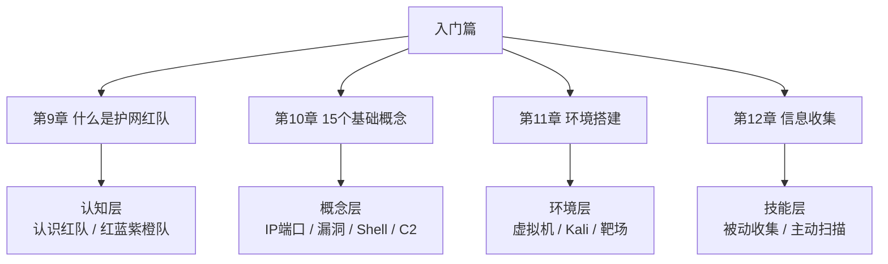
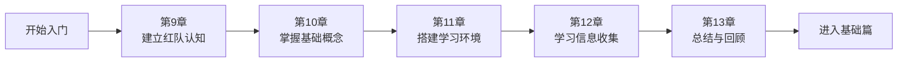
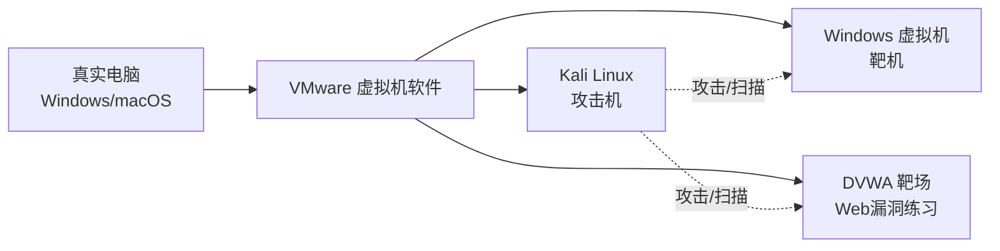

# 第0章 入门篇总览

> **难度等级：🟢 简单级**
>
> **预计学习时间：60-90分钟**

---

## 📖 本章概述

::: tip 本章内容
这里是第0章《入门篇总览》的内容。
:::

**图I-1 入门篇知识结构图**



---

## 🎯 学习目标

学完本章，你将能够：

- [ ] 目标1：掌握核心概念
- [ ] 目标2：理解基本原理
- [ ] 目标3：动手实操练习
- [ ] 目标4：看懂真实案例
- [ ] 目标5：完成课后习题

**图I-2 入门篇四章学习路径图**



---

## 📚 知识导图

> 🗺️ **知识导图**：知识导图示例，建议自己动手绘制学习路线图

---

## 🔍 正文内容

### 1. 核心概念

**图I-3 红队学习环境架构示意图**



### 2. 原理解析

### 3. 实操演示

### 4. 注意事项

---

## 💻 代码实例

```python
# 示例代码
print("Hello, 红队!")
```

---

## 📚 案例讲解

### 案例1：

### 案例2：

### 案例3：

### 案例4：

### 案例5：

---

## ✏️ 课后习题

### 选择题

1. 问题1？
   - A. 选项A
   - B. 选项B
   - C. 选项C
   - D. 选项D

2. 问题2？
   - A. 选项A
   - B. 选项B
   - C. 选项C
   - D. 选项D

### 填空题

1. _______ 是红队的第一步。

2. SQL注入的三种类型是 _______、_______、_______。

### 简答题

1. 简述XX的原理？

2. 如何防御XX攻击？

### 实操题

1. 动手完成XX实验。

2. 尝试XX绕过技巧。

---

## 📝 本章小结

- 要点1
- 要点2
- 要点3

**图I-4 入门篇学习路线甘特图**

```mermaid
gantt
    title 入门篇学习路线（4周计划）
    dateFormat X
    axisFormat 第%s周

    section 第9章
    认识护网红队         :a1, 0, 1

    section 第10章
    15个基础概念         :a2, 1, 2

    section 第11章
    环境搭建             :a3, 3, 2

    section 第12章
    信息收集             :a4, 5, 2

    section 第13章
    总结回顾             :milestone, m1, 7, 0
```



---

## 🔗 相关链接

- [⬅️ 上一章：---](/redteam/day010-story-总结看了大神案例你悟了吗)
- [➡️ 下一章：---](/redteam/day012-beginner-什么是护网红队)
- [📖 返回全书目录](/redteam/day118-toc-全书目录)
