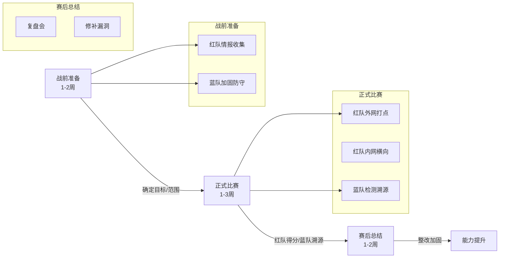
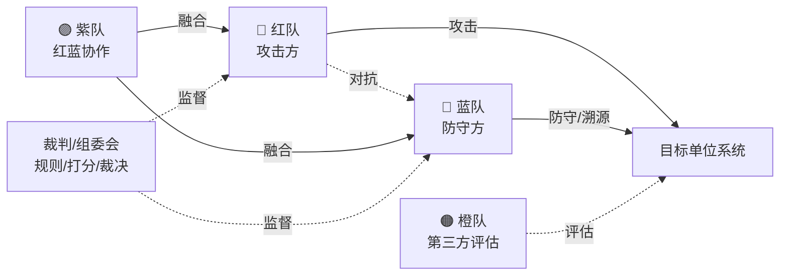
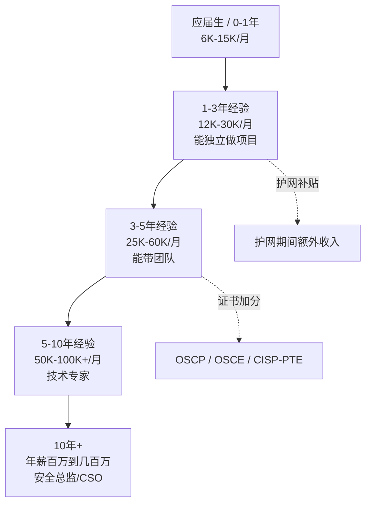
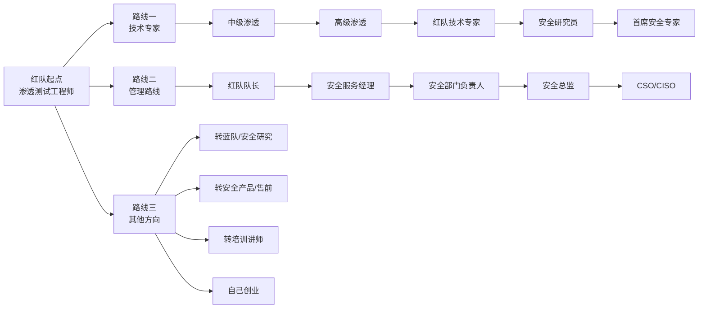
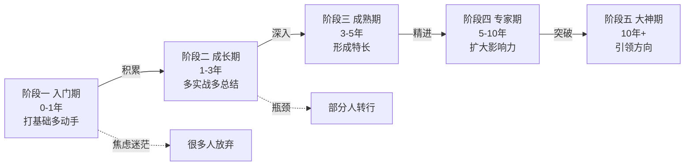
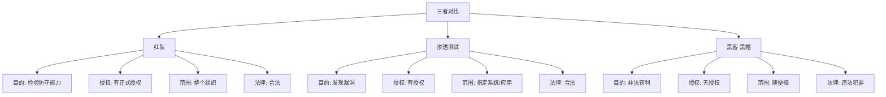

# 第9章 什么是护网红队？

> **难度等级：🟢 简单级**
>
> **预计学习时间：60分钟**
>
> **本章看点：护网行动全解析、红队蓝队紫队区别、红队的一天、职业发展路径**
>
> ::: tip 说明
> 很多人刚接触的时候，
> 都会有一堆问号：
>
> "护网是什么？"
> "红队是干什么的？是黑客吗？"
> "蓝队、紫队又是什么鬼？"
> "学红队能找什么工作？赚钱吗？"
>
> 这一章，
> 我就用最通俗易懂的方式，
> 给你把这些问题讲明白。
>
> 放心，都是大白话，
> 保证你看完就懂。
> :::

---

## 📖 本章概述

::: tip 写在前面
在正式开始学习技术之前，
我们得先搞清楚一件事：
> **我们学的到底是什么？**

别笑，
很多人学了大半年，
连"红队"到底是干什么的都说不清楚。

有人说红队就是黑客，
有人说红队就是做渗透测试的，
还有人说红队就是搞破坏的...

都不对，或者说都不全对。

这一章，
我就给你把这些概念掰扯清楚。
什么是护网？什么是红队？
红队和蓝队有什么区别？
红队的一天是怎样的？
学红队能找什么工作？

看完这一章，
你心里就有数了。
:::

---

## 🎯 学习目标

读完本章，你将了解：

- [x] 什么是护网行动，为什么要搞护网
- [x] 什么是红队，红队是干什么的
- [x] 红队、蓝队、紫队、橙队的区别
- [x] 红队的日常工作是怎样的
- [x] 学好红队能找什么工作，薪资怎么样
- [x] 红队的职业发展路径
- [x] 红队和渗透测试、黑客的区别

---

## 🤔 护网行动是啥？为啥每年都要搞？

### 1.1 什么是护网行动？

先问你个问题：
> 你有没有听过"护网行动"这个词？

如果你关注网络安全，
肯定听过。
每年都要搞那么一两次，
动静还挺大。

那护网到底是什么呢？

用大白话讲：
**护网就是网络安全演习。**

就像军队要搞军事演习一样，
网络安全领域也要搞演习。
目的是什么？
**检验一下大家的网络安全防护能力到底行不行。**

```
护网行动的参与者：
├──── 甲方单位（被攻的一方）
│   ├── 政府单位
│   ├── 国企央企
│   ├── 金融机构
│   ├── 能源、交通、医疗...
│   └── 关键信息基础设施运营者
│
├──── 红队（攻击方）
│   ├── 安全公司的红队
│   ├── 甲方自己的红队
│   └── 专门的攻防演练队伍
│
├──── 蓝队（防守方）
│   ├── 甲方的安全团队
│   ├── 安全厂商的驻场人员
│   └── 负责防守和溯源
│
└──── 裁判/组委会
    ├── 负责制定规则
    ├── 负责打分
    └── 负责裁决争议
```

简单说就是：
- 红队负责"打"
- 蓝队负责"守"
- 组委会负责"当裁判"

跟打比赛一样。

### 1.2 为什么要搞护网？

很多人会问：
"好好的，为什么要搞这种演习？
劳民伤财的。"

这你就不懂了。
护网的意义大了去了。

```
为什么要搞护网？

1. 检验真实防护能力
   - 平时觉得自己安全做得挺好
   - 真被打了才知道行不行
   - 是骡子是马，拉出来遛遛

2. 发现问题，及时修补
   - 演习中发现的漏洞
   - 赶紧补上
   - 免得真被黑客打了才后悔

3. 锻炼队伍
   - 蓝队在实战中成长
   - 平时练一百遍，不如真打一次
   - 打过仗的兵，才是好兵

4. 提升安全意识
   - 让领导重视安全
   - 让员工有安全意识
   - 从上到下都重视起来
   - 安全才能真正做好

5. 合规要求
   - 等保2.0要求
   - 关键信息基础设施保护要求
   - 很多行业是必须参加的
```

> 老K说：
> **"平时多流汗，战时少流血。
> 护网就是让你在'和平时期'
> 把该踩的坑都踩了，
> 真遇上事了，
> 才不会手忙脚乱。"**

### 1.3 护网是怎么打的？

护网具体怎么打呢？
我给你简单讲讲流程。

```
护网的大致流程：

1. 战前准备（1-2周）
   ├── 确定目标和范围
   ├── 红队领任务、做情报收集
   ├── 蓝队加固防守、部署设备
   └── 各种准备工作

2. 正式比赛（1-3周）
   ├── 红队从外网开始打
   ├── 目标是打进内网、拿域控、拿核心系统
   ├── 蓝队负责防守、检测、溯源、反制
   ├── 红队拿到权限就得分
   ├── 蓝队防住了、溯源到了也得分
   └── 看最后谁分高

3. 赛后总结（1-2周）
   ├── 复盘会
   ├── 红队讲攻击路径
   ├── 蓝队讲防守思路
   ├── 总结问题，制定整改方案
   └── 修补漏洞，加强防护
```

听起来是不是挺刺激的？
确实挺刺激的。
打护网的时候，
跟打仗似的，
紧张得不行。

**图9-1 护网行动整体流程图**



---

## 🎭 红队是干什么的？黑客吗？

### 2.1 什么是红队？

讲完了护网，
再来说说红队。

**红队，就是在攻防演练中扮演攻击方的队伍。**

他们的任务，
就是模拟真实的黑客攻击，
想尽一切办法打进目标内部，
检验目标的真实防护能力。

```
红队的目标：
├── 从外网打点，拿到第一个Shell
├── 进入内网，横向移动
├── 提升权限，拿到高权限账号
├── 拿下域控/核心系统
├── 拿到敏感数据
├── 总之，越深入越好，拿的权限越高越好
└── 当然，所有操作都是在授权范围内的
```

### 2.2 红队 = 黑客吗？

这是很多人都会问的问题：
"红队是不是就是黑客？"

这个问题，
得这么看：

```
红队 vs 黑客：

相同点：
├── 都懂攻击技术
├── 都会找漏洞、打漏洞
├── 都能打进系统
└── 技术栈差不多

不同点：
├── 目的不同
│   ├── 红队：帮你发现问题，让你更安全
│   └── 黑客：为了利益搞破坏、偷数据、敲诈勒索
│
├── 授权不同
│   ├── 红队：有正式授权，合法合规
│   └── 黑客：没授权，违法犯罪
│
└── 底线不同
    ├── 红队：有规矩，不搞破坏，保护数据
    └── 黑客：没底线，怎么赚钱怎么来
```

> 一句话总结：
> **红队是有授权的、合法的、帮你变好的"白帽子黑客"。**

技术是中性的，
关键看用技术的人。
用技术做好事，就是红队、就是白帽子；
用技术做坏事，就是黑帽、就是罪犯。

### 2.3 红队和渗透测试有什么区别？

还有人会问：
"红队和渗透测试是不是一回事？"

不是一回事。
有联系，但不一样。

```
渗透测试 vs 红队：

渗透测试：
├── 范围比较明确
├── 一般是针对某个系统、某个应用
├── 时间比较短（几天到几周）
├── 目标是发现漏洞、验证漏洞
├── 更偏向"技术验证"
└── 告诉你哪里有问题

红队：
├── 范围更大，整个企业都是目标
├── 时间更长（几周甚至几个月）
├── 目标是"模拟真实攻击"
├── 不局限于技术，社工、物理都可以
├── 更偏向"实战对抗"
├── 不仅告诉你哪里有问题
└── 还告诉你"我们是怎么打进来的，你怎么防"
```

简单说：
- 渗透测试是**单点突破**
- 红队是**体系化对抗**

渗透测试更像"体检"，
给你查查有什么毛病；
红队更像"实战演习"，
全方位检验你的战斗力。

---

## 🔵🔴🟣 红队、蓝队、紫队、橙队，傻傻分不清楚？

### 3.1 各种颜色的队，都是啥？

刚入行的人，
最晕的就是各种颜色的队：
红队、蓝队、紫队、橙队...

都是什么啊？
开彩虹战队呢？

别晕，
我一个一个给你讲。

```
各种"队"的解释：

🔴 红队（Red Team）
├── 角色：攻击方
├── 任务：想尽办法打进去
├── 目标：找到防守的薄弱点
└── 相当于"进攻方"

🔵 蓝队（Blue Team）
├── 角色：防守方
├── 任务：防守、检测、溯源、反制
├── 目标：把红队挡住，甚至反杀
└── 相当于"防守方"

🟣 紫队（Purple Team）
├── 角色：红队+蓝队一起
├── 任务：红队攻，蓝队守，边打边优化
├── 目标：红队帮蓝队提升防守能力
└── 相当于"红蓝对抗演练，共同进步"

🟠 橙队（Orange Team）
├── 角色：第三方安全评估
├── 任务：从第三方角度做安全评估
├── 目标：客观评估安全状况
└── 这个说法不常见，了解一下就行

🟢 绿队（Green Team）
├── 角色：负责建设和改进的
├── 任务：根据红队蓝队的发现
├── 做安全加固、修漏洞、建体系
└── 这个说法也不常见
```

是不是清晰多了？

**图9-2 红蓝紫橙四方对抗示意图**



### 3.2 红蓝对抗是怎么回事？

经常听到"红蓝对抗"这个词，
是什么意思呢？

很简单：
**就是红队攻，蓝队守，两边对着干。**

```
红蓝对抗的过程：

1. 准备阶段
   ├── 确定目标、范围、时间、规则
   ├── 红队准备攻击武器和思路
   └── 蓝队加固防守，部署检测设备

2. 对抗阶段
   ├── 红队发起攻击
   ├── 蓝队检测和响应
   ├── 红队想办法绕过检测
   ├── 蓝队溯源和反制
   ├── 你来我往，见招拆招
   └── 看最后谁赢

3. 总结阶段
   ├── 红蓝双方复盘
   ├── 红队讲攻击思路
   ├── 蓝队讲防守思路
   ├── 一起分析哪里做得好，哪里需要改进
   └── 制定改进计划
```

> 老K说：
> **"红蓝对抗不是为了分出输赢，
> 是为了共同进步。
> 红队越厉害，
> 蓝队成长得越快；
> 蓝队越厉害，
> 红队的水平也会被推着提高。
> 良性循环。"**

### 3.3 紫队为什么叫紫队？

红是红，蓝是蓝，
那紫队为什么叫紫队？

哈哈哈，
这个问题有点意思。

因为——
**红色 + 蓝色 = 紫色啊！**

紫队就是红队和蓝队混在一起，
大家一起协作，
红队帮蓝队发现问题，
蓝队帮红队了解防守思路，
共同提升安全能力。

是不是挺形象的？

---

## ⏰ 红队的一天是怎样度过的？

### 4.1 护网期间的一天

很多人好奇，
红队的一天是怎样的？
是不是天天对着电脑敲代码，酷得不行？

我给你讲讲护网期间，
红队队员的一天是什么样的。

```
护网期间红队的一天：

07:30 - 起床、洗漱、吃早饭
       （护网期间起得都比较早）

08:30 - 到作战室，开早会
       ├── 昨天的战果汇报
       ├── 遇到的问题讨论
       ├── 今天的任务分配
       └── 队长安排今天的打法

09:00 - 上午工作时间
       ├── 各小组分头行动
       ├── 侦察组：继续做信息收集
       ├── 攻击组：打漏洞、试各种思路
       ├── 钓鱼组：发钓鱼邮件、等鱼上钩
       └── 后渗透组：已拿到的权限继续深入

12:00 - 午饭+午休
       （有时候忙起来就随便吃点）

13:30 - 下午工作时间
       ├── 继续上午的工作
       ├── 有进展了大家一起讨论
       ├── 遇到瓶颈了头脑风暴
       └── 打累了就互相吹吹牛

18:00 - 晚饭时间
       （边吃边讨论今天的进展）

19:00 - 晚上工作时间
       ├── 黄金时间！
       ├── 蓝队下班了，防守松懈
       ├── 加班的人少，钓鱼成功率高
       ├── 很多重要的操作都是晚上做
       └── 夜深人静，效率最高

22:00 - 晚汇报
       ├── 今天战果汇总
       ├── 遇到的问题和解决方案
       ├── 明天的计划
       └── 队长总结

23:00 - 下班回酒店
       （有时候打嗨了就通宵了...）

00:00 - 睡觉
       （睡几个小时，明天继续）
```

是不是跟你想的不太一样？
护网期间其实挺累的，
起早贪黑，
强度很大。
但是也很刺激，
很有成就感。

**图9-3 红队工程师护网期间一日时间表**

```mermaid
gantt
    title 红队工程师护网期间一日作息
    dateFormat X
    axisFormat %H:00

    section 早晨
    起床洗漱早饭    :a1, 0, 1
    早会/任务分配   :a2, 1, 1

    section 上午
    侦察组信息收集  :b1, 2, 3
    攻击组打漏洞    :b2, 2, 3
    钓鱼组发邮件    :b3, 2, 3

    section 中午
    午饭+午休       :c1, 5, 1

    section 下午
    继续攻击/头脑风暴 :d1, 6, 4

    section 晚上
    晚饭            :e1, 10, 1
    黄金时段攻击    :e2, 11, 3
    晚汇报          :e3, 14, 1
    回酒店/通宵     :e4, 15, 2
```



### 4.2 平时不打护网的时候呢？

不打护网的时候，
红队都在干嘛？
总不能天天打护网吧？

当然不是。
平时的工作也挺多的。

```
平时红队的工作内容：

1. 渗透测试项目
   ├── 给客户做渗透测试
   ├── Web渗透、主机渗透、APP渗透...
   ├── 出渗透测试报告
   └── 给修复建议

2. 漏洞研究
   ├── 研究新出的漏洞
   ├── 写POC、写EXP
   ├── 挖漏洞
   └── 研究新技术新手法

3. 工具开发
   ├── 写自动化工具
   ├── 提升效率
   ├── 内部武器库建设
   └── 造轮子

4. 技术培训
   ├── 内部培训
   ├── 给客户做安全培训
   ├── 分享技术
   └── 带新人

5. 护网准备
   ├── 护网前几个月就开始准备
   ├── 准备工具、准备武器库
   ├── 做模拟演练
   └── 各种准备工作
```

总的来说，
红队的工作内容还是挺丰富的，
不会太枯燥。
而且一直在接触新技术，
不容易职业倦怠。

---

## 💰 学好红队能找什么工作？薪资怎么样？

### 5.1 能找什么工作？

很多人最关心的问题来了：
**学红队出来，能找什么工作？**

其实能做的工作挺多的，
我给你列列：

```
红队相关岗位：

1. 渗透测试工程师
   ├── 最常见的岗位
   ├── 做Web渗透、主机渗透、APP渗透
   ├── 写渗透测试报告
   └── 入门级岗位

2. 红队工程师
   ├── 专门做红队项目
   ├── 参加护网、攻防演练
   ├── 比渗透测试要求更高
   └── 需要更全面的技术

3. 安全服务工程师
   ├── 什么都做一点
   ├── 渗透、评估、加固、应急响应
   ├── 比较综合
   └── 适合新人成长

4. 漏洞挖掘工程师
   ├── 专门挖漏洞
   ├── SRC、漏洞赏金
   ├── 需要较强的漏洞研究能力
   └── 挖到大漏洞就发财了

5. 安全研究员
   ├── 研究前沿安全技术
   ├── 漏洞研究、 malware分析
   ├── 偏技术深度
   └── 学历要求一般比较高

6. 安全顾问
   ├── 给客户做安全咨询
   ├── 安全体系建设、风险评估
   ├── 需要懂技术，还要懂业务懂管理
   └── 越老越吃香

7. 其他相关岗位
   ├── 蓝队工程师（防守方向）
   ├── 安全运营工程师
   ├── SOC分析师
   ├── 应急响应工程师
   └── 安全培训讲师
```

红队学的东西比较综合，
所以就业面还是挺广的。
很多安全岗位都能胜任。

### 5.2 薪资怎么样？

大家最关心的问题：
**学红队能赚多少钱？**

我给你一个大概的参考（一线城市，2024年行情）：

```
薪资参考（一线城市）：

应届生 / 0-1年经验
├── 月薪：6K - 15K
├── 年薪：8W - 20W
├── 看基础、看能力、看学历
└── 能力强的应届生也能拿很高

1-3年经验
├── 月薪：12K - 30K
├── 年薪：15W - 40W
├── 能独立做项目的话20K+没问题
└── 护网期间还有额外补贴

3-5年经验
├── 月薪：25K - 60K
├── 年薪：30W - 80W
├── 能带团队、能负责大项目的更高
└── 年薪50W+很常见

5-10年经验
├── 月薪：50K - 100K+
├── 年薪：60W - 150W+
├── 技术专家 / 团队负责人级别
└── 看个人能力和机遇

10年以上
├── 年薪百万到几百万不等
├── 安全总监 / CSO / 技术专家
├── 或者自己创业，就没上限了
└── 看个人发展
```

> 注意：
> 这只是大概的范围，
> 具体薪资跟很多因素有关：
> - 个人能力（最重要）
> - 工作经验
> - 学历背景
> - 所在城市
> - 公司类型（大厂、国企、私企、创业公司...）
> - 证书（OSCP、OSCE、CISP-PTE...）
> - 机遇运气
> - ...
>
> **能力才是硬道理。**

**图9-4 网络安全岗位薪资与发展路线图**



---

## 📈 红队的职业发展路径

### 6.1 三条发展路线

红队的职业发展，
大概有三条路可以走。

```
路线一：技术专家路线
│
├── 初级渗透测试工程师
├── 中级渗透测试工程师
├── 高级渗透测试工程师
├── 红队技术专家
├── 安全研究员
└── 首席安全专家
    │
    └── 特点：一路钻研技术，成为技术大牛
        适合喜欢技术、想深耕技术的人

路线二：管理路线
│
├── 渗透测试工程师
├── 红队队长
├── 安全服务经理
├── 安全部门负责人
├── 安全总监
└── CSO / CISO
    │
    └── 特点：带团队、做管理
        适合沟通能力强、有领导力的人

路线三：其他方向
│
├── 转蓝队（防守方向）
├── 转安全研究
├── 转安全产品
├── 转售前/售后
├── 转培训讲师
├── 自己创业
└── ...
    │
    └── 特点：根据兴趣和机遇灵活选择
        安全行业机会很多
```

没有最好的路线，
只有最适合你的路线。
根据你自己的性格和兴趣来选。

**图9-5 红队职业发展三条路径图**



### 6.2 技术成长的五个阶段

从零基础到红队大佬，
一般要经历这五个阶段：

```
阶段一：入门期（0-1年）
├── 什么都不懂，觉得什么都新鲜
├── 学基础、学工具、学常见漏洞
├── 跟着教程做能做出来
├── 自己动手就蒙
├── 感觉要学的东西太多了，很焦虑
└── 这个阶段最重要的是：打基础，多动手

阶段二：成长期（1-3年）
├── 常见漏洞都懂了，工具也用得溜了
├── 能独立做一些简单的项目
├── 但是遇到复杂场景还是不行
├── 开始接触内网、域渗透这些
├── 感觉进步很快，每天都有新收获
└── 这个阶段最重要的是：多实战，多总结

阶段三：成熟期（3-5年）
├── 技术比较全面了
├── 能独立负责完整的项目
├── Web、内网、域渗透都能搞
├── 有自己的一套思路和方法论
├── 能带新人了
└── 这个阶段最重要的是：深入某一方向，形成自己的特长

阶段四：专家期（5-10年）
├── 在某个方向上是专家级别
├── 有自己的研究成果
├── 能解决复杂的、疑难的问题
├── 能带团队、能做技术决策
├── 在圈内小有名气
└── 这个阶段最重要的是：保持学习，扩大影响力

阶段五：大神期（10年+）
├── 技术大牛，圈内知名
├── 什么都懂，而且都很深入
├── 有自己的方法论和体系
├── 能引领方向
└── 这个阶段...就不是光靠努力能达到的了
    还需要天赋和机遇
```

你现在在哪个阶段？
没关系，
不管你在哪个阶段，
只要方向对，肯努力，
就一定能进步。

**图9-6 红队技术成长五阶段图**



---

## 🆚 红队 vs 渗透测试 vs 黑客，有啥区别？

### 7.1 一张图看懂区别

很多人搞不清这三者的区别，
我给你整理了一个对比表：

```
对比项      红队              渗透测试           黑客（黑帽）
────────────────────────────────────────────────────────
目的        检验防守能力        发现漏洞           非法获利
授权        有正式授权          有授权             无授权，违法
范围        整个组织            指定系统/应用      随便搞
时间        几周到几个月        几天到几周         不确定
手法        技术+社工+物理      以技术为主         不择手段
目标        拿到核心权限        发现并验证漏洞     偷数据/搞破坏/敲诈
底线        有规矩，不搞破坏    有规矩             没底线
结果        帮你提升安全        告诉你哪里有问题   造成损失
法律性质    合法                合法               违法犯罪
```

这下清楚了吧？

**图9-7 红队 vs 渗透测试 vs 黑客三者对比图**



### 7.2 最重要的区别：合法 vs 违法

最后，
我必须强调一点：
**合法和违法的区别。**

> ⚠️ 重要提醒：
> **技术是中性的，但人要有底线。**
>
> 学红队技术，
> 是用来保护网络安全的，
> 不是用来搞破坏的。
>
> 没有授权，
> 就不要去碰别人的系统。
> 哪怕你只是"想试试"，
> 哪怕你"没有恶意"，
> 那也是违法的。
>
> 严重的，
> 是要坐牢的。

这不是开玩笑。
我见过太多人，
因为不懂法，
因为一时好奇，
把自己的前途毁了。

**学法懂法，守法用法。**
这是每一个安全从业者的必修课。

（关于法律法规的详细内容，详见附录：网络安全法律法规必读）

---

## 📚 案例讲解

### 案例1：某国企护网行动真实场景还原

某大型国企，每年都参加护网。
第一年参加的时候，
他们的安全团队特别自信，
觉得自己的安全做得很好，
肯定没问题。

结果呢？
**红队只用了3天，就拿下了域控。**

怎么拿下的？
说出来你可能不信——
**通过食堂的订餐系统。**

对，就是员工用来订饭的那个系统。
那个系统是外包做的，
安全性很差，
有SQL注入漏洞。
而且那个系统在内网里，
跟域是通的。

红队通过SQL注入拿了webshell，
然后从订餐系统的服务器开始，
一步步横向移动，
最后拿下了域控。

国企的人都懵了。
"我们核心系统做得那么好，
怎么会从食堂订餐系统打进来？"

后来复盘的时候，
他们的安全负责人说：
> "原来我们的安全就是个木桶，
> 最长的板有多长没用，
> 最短的板决定了水位。
> 以前只重视核心系统，
> 忽视了这些'不重要'的系统。
> 这次真是给我们上了一课。"

从那以后，
他们全面加强了安全建设，
所有系统都纳入了安全管理范围。
第二年护网，
红队打了两周才打进去，
而且只拿到了低权限。
进步非常大。

> 这个案例告诉我们：
> **护网最大的意义，
> 不是输赢，
> 而是发现问题、解决问题，
> 让自己变得更强。**

### 案例2：一个红队新手的成长故事

小杨是个刚毕业的大学生，
学的是计算机，
但是对安全一窍不通。
毕业的时候，
误打误撞进了一家安全公司，
做渗透测试工程师。

刚去的时候，
他什么都不会。
连Burp Suite都不会用。
SQL注入是什么都不知道。
同事们讨论技术，
他跟听天书似的。

他很焦虑，
觉得自己不适合干这个。
甚至想过辞职。

但是他没有放弃。
他是怎么做的呢？

```
小杨的学习计划：
├── 每天提前1小时到公司，学习
├── 每天下班后再学2小时
├── 周末全天学习
├── 从最基础的开始学
├── 边学边做笔记
├── 打靶场，从最简单的开始打
├── 遇到不懂的就问同事
├── 每周末总结这周学了什么
└── 坚持，坚持，再坚持
```

就这么坚持了半年，
小杨从一个什么都不懂的小白，
变成了能独立做项目的渗透测试工程师。

一年之后，
他第一次参加护网，
虽然只是打打下手，
但是已经能帮上忙了。

两年之后，
他已经成了队里的主力。
护网的时候，
他一个人就拿了好几个shell。

现在的小杨，
工作三年了，
已经是红队小队的队长了。
月薪两万多。

> 小杨说：
> **"我不是什么天才，
> 我就是比别人多花了点时间。
> 基础差没关系，
> 只要肯学，
> 谁都能学会。"**

### 案例3：知名护网行动战绩大盘点

近几年护网行动的一些"名场面"：

```
1. 最快记录：2小时拿下域控
   某护网行动，红队刚开场2小时
   就通过一个0day漏洞拿下了域控
   蓝队都还没反应过来
   （当然，这种情况比较少见）

2. 最惨记录：一周没拿到一个Shell
   某支队伍水平一般
   打了一周，一个Shell都没拿到
   最后得了0分
   （也是挺丢人的）

3. 最骚操作：把蓝队的机器黑了
   某红队打进内网之后
   顺手把蓝队用来做监控的服务器给黑了
   蓝队的监控全失效了
   还能看到蓝队在干什么
   相当于开了挂
   （太秀了）

4. 最隐蔽：潜伏30天没被发现
   某红队行动特别隐蔽
   打进去之后一直潜伏
   慢慢悠悠地横向移动
   直到护网结束，蓝队都没发现
   （真正的幽灵）

5. 最反转：从倒数第一追到前三
   某队伍前半程打得很差
   一直倒数
   后半程突然发力
   一路逆袭，最后拿了第三
   （不到最后一刻不要放弃）
```

护网这东西，
真的什么情况都能遇到。
也正是因为这样，
才有意思嘛。

### 案例4：红队 vs 黑客，到底有啥不一样？

有一次护网，
某红队打进了目标内网，
还拿到了域管权限。
按照规则，
这已经是高分了。

这时候，
队里有个小伙子说：
> "队长，我们要不要把他们的数据都下载下来？
> 这样得分更高吧？"

队长摇摇头说：
> "不行。
> 规则里说了，
> 不能碰真实业务数据。
> 我们是红队，不是黑客。
> 点到为止就够了。"

小伙子有点不甘心：
> "可是...我们费了那么大劲打进来，
> 就拿个域管权限，
> 是不是太亏了？"

队长说：
> **"不亏。
> 我们的目的是检验他们的防护能力，
> 不是真的要偷他们的数据。
> 我们是来帮忙的，不是来搞破坏的。
> 这是底线。
> 红队和黑客的区别，就在这里。"**

> 这个案例告诉我们：
> **技术决定你能走多快，
> 底线决定你能走多远。
> 做安全，
> 技术重要，
> 人品更重要。**

### 案例5：从外卖小哥到红队工程师的逆袭之路

这个案例是真事。
小周，25岁。
高中毕业，没考上大学。
出来打工，
干过服务员，干过快递，
后来送外卖。

他对黑客技术特别感兴趣，
平时送外卖之余，
就自己看教程学技术。
买不起好电脑，
就用二手笔记本。
没人教，就自己摸索。

学了两年，
虽然基础不扎实，
但是Web渗透玩得挺溜的。
还在漏洞平台提交过不少漏洞，
拿过一些奖金。

后来，
他看到一家安全公司招人，
就抱着试试的心态投了简历。
HR一看，高中学历，
本来想直接pass的。
但是技术主管看了他的简历，
觉得挺有意思，
就让他来面试了。

面试的时候，
技术主管给他出了几道题，
他居然都做出来了。
虽然基础差点，
但是动手能力很强，
思路也灵活。

技术主管当场就决定要他了。
说：
> "学历不重要，
> 能力才重要。
> 这小子是个好苗子。"

现在小周已经工作三年了，
从最基础的渗透测试工程师做起，
现在已经是红队的主力了。
护网的时候经常拿MVP。
月薪也从最开始的八千，
涨到了现在的两万多。

> 小周说：
> **"起点低没关系，
> 只要你真的热爱，
> 真的肯努力，
> 就一定有机会。
> 我一个送外卖的都能做到，
> 你为什么不行？"**

---

## ✏️ 课后习题

### 选择题

1. 护网行动中，扮演攻击方的是？
   - A. 红队
   - B. 蓝队
   - C. 紫队
   - D. 橙队

2. 护网行动中，扮演防守方的是？
   - A. 红队
   - B. 蓝队
   - C. 紫队
   - D. 以上都不是

3. 红队和黑客最根本的区别是什么？
   - A. 技术高低不同
   - B. 用的工具不同
   - C. 是否有授权、是否合法
   - D. 攻击的目标不同

4. 以下关于红队的说法，哪个是正确的？
   - A. 红队就是黑客，是违法的
   - B. 红队是有授权的、合法的安全测试
   - C. 红队的目标是搞破坏
   - D. 红队只需要懂Web漏洞就行了

5. 紫队是什么意思？
   - A. 穿紫色衣服的队伍
   - B. 红队和蓝队协作，共同提升安全能力
   - C. 负责裁判的队伍
   - D. 负责后勤的队伍

6. 刚入门的新人，最适合的岗位是？
   - A. 安全研究员
   - B. 渗透测试工程师
   - C. 安全总监
   - D. CSO

7. 红队职业发展的三条主要路线不包括哪个？
   - A. 技术专家路线
   - B. 管理路线
   - C. 财务路线
   - D. 其他方向（转产品、转培训等）

8. 以下哪项不是红队平时的工作内容？
   - A. 做渗透测试项目
   - B. 研究新漏洞
   - C. 未经授权攻击别人的网站
   - D. 开发安全工具

9. 护网行动的意义不包括以下哪项？
   - A. 检验真实防护能力
   - B. 发现问题及时修补
   - C. 锻炼队伍
   - D. 故意搞垮目标系统

10. 从零基础到红队大佬，一般经历的第一个阶段是？
    - A. 成长期
    - B. 入门期
    - C. 成熟期
    - D. 专家期

### 填空题

1. 护网行动中，攻击方叫______，防守方叫______。

2. 红队和黑客最根本的区别是：是否有______，是否______。

3. 红队 + 蓝队一起协作，共同提升安全能力，叫做______队。

4. 红队职业发展的三条主要路线是：______路线、______路线、其他方向。

5. 技术决定你能走多快，______决定你能走多远。

6. 护网就是网络安全______。

7. 渗透测试更像"体检"，红队更像"______"。

8. 平时多流汗，______。

9. 护网最大的意义不是输赢，而是______。

10. 木桶能装多少水，取决于______的那块板。

### 简答题

1. 用自己的话解释一下：什么是护网行动？为什么要搞护网？

2. 红队是干什么的？红队和黑客有什么区别？

3. 红队、蓝队、紫队分别是什么角色？他们之间是什么关系？

4. 红队和渗透测试有什么区别和联系？

5. 红队的一天大概是什么样的？（护网期间和平常）

6. 学好红队能找什么工作？你最感兴趣的是哪个岗位？

7. 红队的职业发展路线有哪些？你最想走哪条路？为什么？

8. 为什么说"技术是中性的"？做安全为什么要有底线？

9. 从零基础到红队大神，一般要经历哪几个阶段？你现在在哪个阶段？

10. 看完这一章，你最大的感受是什么？你为什么想学红队？

### 实操题

1. 做一次自我评估：
   - 你现在的基础怎么样？
   - 你为什么想学红队？
   - 你有多少时间可以用来学习？
   - 你的短期目标是什么？
   - 把这些写下来。

2. 查一查：
   - 最近的一次护网行动是什么时候？
   - 有哪些单位参加？
   - 结果怎么样？
   - （看看新闻、公众号之类的，了解一下）

3. 找几个安全招聘信息看看：
   - 渗透测试工程师要求什么技能？
   - 红队工程师要求什么技能？
   - 薪资大概是多少？
   - 看看跟你想象的一不一样。

4. 制定一个你的学习计划：
   - 第一个月打算学什么？
   - 每周花多少时间学？
   - 怎么检验学习成果？
   - 把计划写下来，贴在你能看到的地方。

5. 去了解一下网络安全法：
   - 什么行为是违法的？
   - 做渗透测试需要注意什么？
   - 简单了解一下，心里有个数。

---

## 📝 本章小结

这一章，
我们聊了"什么是护网红队"这个话题。

总结一下重点：

1. **什么是护网行动？**
   - 护网就是网络安全演习
   - 红队攻，蓝队守，组委会当裁判
   - 目的是检验防护能力、发现问题、锻炼队伍

2. **什么是红队？**
   - 红队是攻防演练中的攻击方
   - 有授权、合法、帮目标提升安全
   - 红队 ≠ 黑客（黑客是违法的）

3. **各种颜色的队**
   - 🔴 红队：攻击方
   - 🔵 蓝队：防守方
   - 🟣 紫队：红蓝协作，共同进步

4. **红队的日常**
   - 护网期间：起早贪黑，紧张刺激
   - 平时：渗透测试、漏洞研究、工具开发、培训

5. **就业与薪资**
   - 能做的工作很多：渗透测试、红队、安全服务、漏洞挖掘...
   - 薪资跟能力挂钩，上限很高
   - 能力才是硬道理

6. **职业发展路径**
   - 技术专家路线
   - 管理路线
   - 其他方向

7. **最重要的事**
   - 技术是中性的，人要有底线
   - 合法合规，不能碰的别碰
   - 技术决定你能走多快，底线决定你能走多远

> 最后送你一句话：
> **"选择了安全这条路，
> 就选择了终身学习。
> 路虽远，行则将至；
> 事虽难，做则必成。
> 加油！"**

---

## 🔗 相关链接

- [⬅️ 上一章：---](/redteam/day011-beginner-入门篇总览)
- [➡️ 下一章：---](/redteam/day013-beginner-15个基础概念)
- [📖 返回全书目录](/redteam/day118-toc-全书目录)
