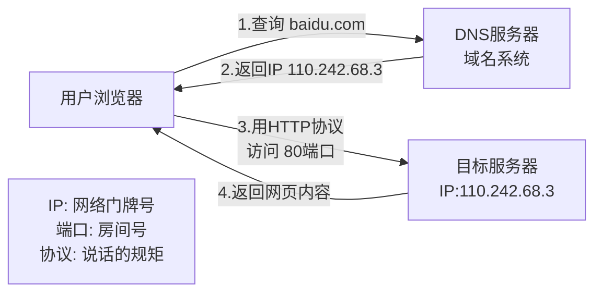
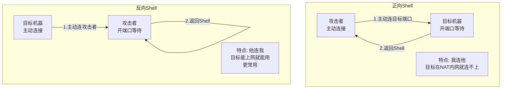
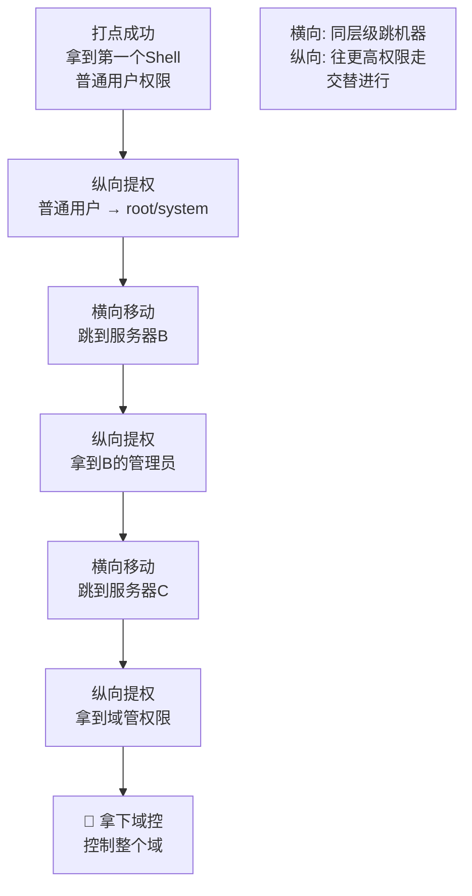
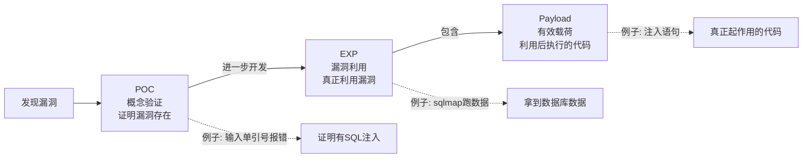
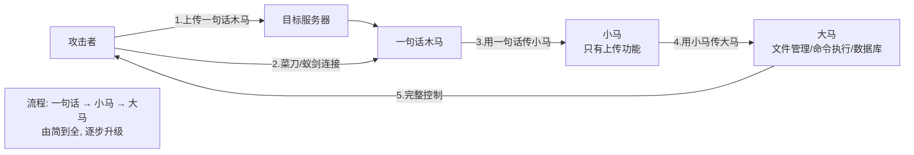
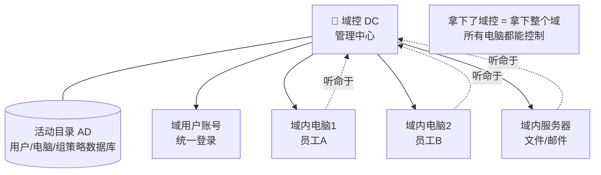
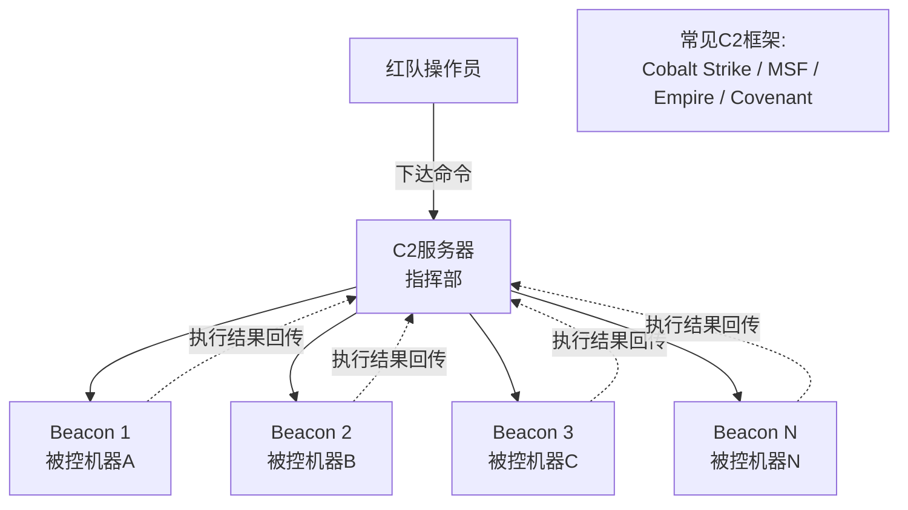

# 第10章 红队入门必备的15个基础概念

> **难度等级：🟢 简单级**
>
> **预计学习时间：90分钟**
>
> **本章看点：15个红队必知必会的基础概念、大白话讲解、生活中的例子、看完就能用**
>
> ::: tip 说明
> 学红队，
> 首先得搞懂那些"黑话"。
>
> 什么Shell、Payload、EXP、POC、
> WebShell、提权、横向、C2、免杀...
> 刚入门的人听了，
> 跟听天书似的。
>
> 别慌，
> 这一章，
> 我就用最通俗易懂的方式，
> 给你把红队最常用的15个基础概念讲明白。
>
> 都是大白话，
> 保证你看完就懂。
> :::

---

## 📖 本章概述

::: tip 写在前面
刚入行的时候，
最怕的就是听不懂别人在说什么。

同事们讨论技术，
一堆术语往外蹦，
你坐在旁边，
一脸懵逼，
跟听外语似的。

那种感觉，
太难受了。

这一章，
我就把红队最常用、最基础的15个概念，
一个一个给你讲清楚。
每个概念都用大白话讲，
再给你举几个生活中的例子，
保证你看完就能懂。

学完这一章，
再听别人聊技术，
你就不会一头雾水了。
:::

---

## 🎯 学习目标

读完本章，你将了解：

- [x] IP地址、端口、协议是什么
- [x] 域名和DNS是什么
- [x] HTTP/HTTPS是怎么回事
- [x] 漏洞、CVE、CNVD是什么
- [x] Shell是什么，正向Shell vs 反向Shell
- [x] 提权、横向、纵向这些"黑话"
- [x] 打点、水坑、挂马都是啥
- [x] Payload、EXP、POC的区别
- [x] WebShell、大马、小马、一句话木马
- [x] 域环境、域控、活动目录
- [x] 免杀、Bypass、绕过
- [x] C2是什么
- [x] 跳板、代理、隧道
- [x] 痕迹清理、权限维持、后门
- [x] ATT&CK是什么

---

## 🧠 事前铺垫：网络通信的本质是什么？

在讲具体概念之前，
我们先想一个问题：

**两台电脑是怎么"说话"的？**

假设你在北京，
朋友在广州。
你发了一条微信给他。
你以为只是"消息发出去了"，
但其实底层发生了很多事：

```
你的手机
  ↓ (数据变成电信号，WiFi发送)
路由器
  ↓ (数据被包装成"数据包")
运营商网络
  ↓ (经过十几个中间节点，路由转发)
朋友的路由器
  ↓ (数据包到达，拆包)
朋友的手机
  ↓ (数据还原，显示消息)
```

在这个过程中，
你的数据经过了无数个环节。
每个环节都需要遵循"规矩"，
否则就乱套了。

这些"规矩"就是协议。
数据的"目的地地址"就是IP。
数据到了之后给哪个程序处理，就是端口。

下面我们一个一个来拆解。

---

## 🌐 概念一：IP地址、端口、协议

### 1.1 什么是IP地址？

**IP地址，就是网络世界的门牌号。**

就像你家有地址一样，
每台联网的电脑，
也有一个"地址"，
这个地址就是IP地址。

有了IP地址，
数据才能找到要发给谁。

```
生活中的类比：
- 你家地址：北京市朝阳区XX路XX号
- 电脑IP：192.168.1.100

都是用来定位的。
```

IP地址长什么样？
像这样：`192.168.1.1`
四个数字，用点隔开，
每个数字0-255。

### 1.2 什么是端口？

光有IP地址还不够。
一台电脑上可能跑着很多服务，
比如网站、邮件、远程桌面...
数据来了，
给谁呢？

这时候就需要**端口**了。

**端口，就像你家的房门号。**
IP是小区地址，
端口是你家的门牌号。

```
生活中的类比：
- 小区地址：XX小区（相当于IP）
- 门牌号：3单元502（相当于端口）

找到小区（IP），
再找到门牌号（端口），
才能找到具体的人。
```

常见的端口号：
- 80端口：网页服务（HTTP）
- 443端口：加密网页（HTTPS）
- 22端口：远程登录（SSH）
- 3389端口：Windows远程桌面
- 3306端口：MySQL数据库
- 6379端口：Redis数据库

一共有65535个端口，
够用了。

### 1.3 什么是协议？

**协议，就是说话的规矩。**

两个人说话，
得用同一种语言，
不然鸡同鸭讲，
谁也听不懂谁。

网络通信也是一样，
两台电脑通信，
得遵守同样的"规矩"，
这个规矩就是协议。

```
生活中的类比：
- 两个人都说普通话，才能交流（这就是协议）
- 一个说中文，一个说英文，听不懂（协议不匹配）
```

常见的协议：
- TCP协议：可靠的传输（打电话，确保对方收到）
- UDP协议：不可靠但快的传输（发短信，发了就不管了）
- HTTP协议：网页传输用的
- HTTPS协议：加密的HTTP
- DNS协议：域名解析用的
- SSH协议：远程登录用的
- ...

---

## 🌍 概念二：域名和DNS

### 2.1 什么是域名？

IP地址是一串数字，
不好记。
比如 `110.242.68.3`，
你记得住吗？

记不住怎么办？
给它起个名字啊！
这个名字，就是**域名**。

比如：
- `baidu.com` 就是百度的域名
- `google.com` 就是谷歌的域名
- `qq.com` 就是腾讯的域名

好记多了吧？

```
生活中的类比：
- IP地址：110.242.68.3（手机号）
- 域名：baidu.com（通讯录里的名字"百度"）

你记不住手机号，
但是你能记住名字。
```

### 2.2 什么是DNS？

有了域名，
电脑怎么知道这个域名对应的IP是多少呢？

这就需要**DNS**了。

**DNS，就是域名系统（Domain Name System）。**
它的作用就是：
**把域名翻译成IP地址。**

就像通讯录一样，
你查"百度"，
它告诉你对应的手机号是多少。

```
DNS解析过程：
1. 你在浏览器输入 baidu.com
2. 电脑问DNS服务器："baidu.com的IP是多少？"
3. DNS服务器回答："是110.242.68.3"
4. 电脑去连接 110.242.68.3
```

就这么简单。

**图10-1 IP/端口/协议/DNS关系图**



---

## 📄 概念三：HTTP/HTTPS

### 3.1 什么是HTTP？

**HTTP，就是超文本传输协议。**
说人话就是：
**网页是怎么传输的规矩。**

你在浏览器里打开一个网站，
浏览器怎么跟服务器要网页？
服务器怎么把网页发给你？
就是用HTTP协议。

```
HTTP的过程：
1. 浏览器（客户端）说："给我首页"（请求）
2. 服务器说："好的，给你"（响应）
3. 浏览器把网页显示出来
```

HTTP默认用80端口。

### 3.2 什么是HTTPS？

HTTP有个问题：
**传输的内容是明文的。**
什么意思呢？
就是你传的东西，
中间经过的路由器、运营商，
都能看到。

如果传的是密码、银行卡号，
被人看到了怎么办？

所以就有了**HTTPS**。

**HTTPS = HTTP + SSL/TLS加密**
说人话就是：
**加密的HTTP。**

传输的内容都是加密的，
就算中间被截获了，
也看不懂是什么。

HTTPS默认用443端口。

现在正规的网站，
基本都是HTTPS了。
地址栏前面有个小锁头，
就是HTTPS的标志。

---

## 🐛 概念四：漏洞、CVE、CNVD

### 4.1 什么是漏洞？

**漏洞，就是系统的安全缺陷。**

就像房子有个破窗户，
小偷可以从窗户钻进来。
电脑系统、软件也会有"破窗户"，
黑客可以利用这些"破窗户"攻击系统。
这些"破窗户"，就是漏洞。

```
生活中的类比：
- 门没锁 → 漏洞
- 窗户没关 → 漏洞
- 围墙太矮 → 漏洞

有漏洞，就容易被人闯进来。
```

漏洞的种类很多：
- SQL注入漏洞
- XSS跨站脚本漏洞
- 文件上传漏洞
- 命令执行漏洞
- 缓冲区溢出漏洞
- ...

### 4.2 什么是CVE？

漏洞太多了，
怎么管理呢？
得给每个漏洞编个号吧？

**CVE，就是通用漏洞披露（Common Vulnerabilities & Exposures）。**
你可以理解成：
**漏洞的身份证号。**

每个公开的漏洞，
都会有一个唯一的CVE编号。
格式是：`CVE-年份-编号`

比如：
- `CVE-2021-44228`（Log4j漏洞）
- `CVE-2017-0144`（永恒之蓝）
- `CVE-2014-6271`（破壳漏洞）

有了CVE编号，
大家讨论漏洞的时候，
一说编号就知道说的是哪个了，
不会搞混。

### 4.3 什么是CNVD？

CVE是国际通用的，
那中国有没有自己的？
有！就是**CNVD**。

**CNVD，就是国家信息安全漏洞共享平台（China National Vulnerability Database）。**
相当于中国版的CVE。

格式是：`CNVD-年份-编号`

比如：
- `CNVD-2021-30167`
- `CNVD-2020-10487`

国内的漏洞，
很多会先报给CNVD。

---

## 💻 概念五：Shell、正向Shell、反向Shell

### 5.1 什么是Shell？

**Shell，就是命令行界面。**

你打开Linux的终端，
敲命令，那个就是Shell。
Windows的CMD、PowerShell，
也是Shell。

红队说的"拿Shell"，
就是拿到了目标的命令行权限，
可以在目标机器上敲命令了。

```
生活中的类比：
- 你拿到了别人家的钥匙，可以进他家了
- 不仅能进去，还能在他家里随便翻东西、操作
- 这就是拿到了Shell
```

### 5.2 正向Shell vs 反向Shell

这两个概念，
新手最容易搞混。
我给你好好讲讲。

#### 正向Shell

**正向Shell：我主动去连目标。**

就像你去朋友家，
你主动上门。

```
正向Shell的流程：
1. 目标机器开了个端口，等着你连
2. 你去连接这个端口
3. 连上之后就能敲命令了

特点：
- 你主动，目标被动
- 目标有公网IP的话比较方便
- 但是如果目标在 NAT 后面（内网），你就连不上了
```

#### 反向Shell

**反向Shell：目标主动来连我。**

就像你朋友主动来找你。

```
反向Shell的流程：
1. 你的机器开个端口，等着目标来连
2. 目标机器执行命令，主动连接你的端口
3. 连上之后你就能敲命令了

特点：
- 目标主动，你被动
- 目标在内网也能用（只要目标能上网）
- 绕过防火墙（防火墙一般拦进来的，不拦出去的）
```

> 一句话总结：
> **正向是我连他，反向是他连我。**

为什么反向Shell用得更多？
因为大多数目标在内网里，
没有公网IP，
你连不进去。
但是目标能访问外网，
所以让目标主动来连你，
就方便多了。

> 💡 **深入理解：TCP连接的"方向性"**
>
> 为什么正向Shell连不上内网的机器？
> 这涉及到TCP连接的一个底层原理。
>
> TCP建立连接需要"三次握手"：
> ```
> 你：在吗？（SYN）
> 目标：在！（SYN+ACK）
> 你：好的！（ACK）
> ```
>
> 如果是正向Shell：
> 你要主动发SYN包给目标的端口。
> 但目标在内网（NAT后面），
> 它的IP是`192.168.x.x`这种内网地址，
> 在公网上是"不可见"的。
> 你的SYN包根本到不了它！
> 就像你无法给一个没有门牌号的房子送快递。
>
> 如果是反向Shell：
> 目标主动发SYN包给你的公网VPS。
> 目标虽然在内网，但它能通过NAT网关上网。
> SYN包先到NAT网关，
> NAT网关把它转发到外网，
> 最终到达你的VPS。
> 像房子里的人自己走出来，
> 你就能见到他了。
>
> **这就是为什么反向Shell更常用：
> 不是选择问题，是物理限制！**

**图10-2 正向Shell vs 反向Shell对比图**



---

## ⬆️ 概念六：提权、横向、纵向（红队黑话上）

### 6.1 什么是提权？

**提权，就是提升权限。**

你刚拿到的Shell，
可能只是个普通用户的权限，
很多事情干不了。
比如：
- 不能看管理员的文件
- 不能改系统配置
- 不能安装软件
- ...

这时候你就想办法，
把自己的权限提高，
最好提到管理员权限（root / system）。
这个过程，就是**提权**。

```
生活中的类比：
- 你混进了一栋大楼，但是只是个访客
- 只能在大厅转转，很多楼层去不了
- 然后你想办法搞到了管理员的门禁卡
- 现在你哪都能去了
- 这就是提权
```

### 6.2 什么是横向移动？

**横向移动，就是同一权限级别，从一台机器跳到另一台机器。**

比如你拿到了A服务器的普通用户权限，
然后用A服务器当跳板，
拿下了B服务器、C服务器、D服务器...
都是差不多的权限级别。
这就叫**横向移动**。

```
生活中的类比：
- 你进了小区的一户人家
- 然后从阳台爬到隔壁家
- 再爬到下一家
- 一层楼都被你逛遍了
- 这就是横向移动
```

横向移动的目的：
- 扩大战果
- 找更高权限的机器
- 找核心数据
- ...

### 6.3 什么是纵向渗透？

跟横向相对的，
就是**纵向**。

**纵向渗透，就是往更高权限走。**
从普通用户 → 管理员 → 域管理员...
一步一步往上爬。

```
生活中的类比：
- 横向：同一层楼，从这家到那家
- 纵向：从一楼到二楼，再到顶楼
```

一般红队的思路是：
**先纵向提权，再横向移动；
横向移动中，再找机会纵向提权。**
交替进行，一步步深入。

**图10-3 红队攻击：提权/横向/纵向关系图**



---

## 🎯 概念七：打点、水坑、挂马（红队黑话下）

### 7.1 什么是打点？

**打点，就是找到突破口，拿到第一个Shell。**

护网刚开始的时候，
红队在外面，
目标在里面，
中间隔着防火墙。
红队需要找个口子打进去，
拿到第一个Shell。
这个过程，就叫**打点**。

```
生活中的类比：
- 一座城池，城墙很高，防守很严
- 你要找个地方攻进去
- 找到一个突破口，攻进去了
- 这就是打点
```

打点是红队的第一步，
也是最关键的一步。
打不进去，后面什么都白搭。

常见的打点方式：
- Web漏洞
- 钓鱼邮件
- 漏洞利用
- 社会工程学
- ...

### 7.2 什么是水坑攻击？

**水坑攻击，就是在目标必经之路上"挖坑"，等目标掉进来。**

就像猎人在动物常去的水坑边挖陷阱，
动物去喝水的时候，
就掉进陷阱里了。

水坑攻击也是一样：
红队先摸清楚目标常去的网站，
然后把那个网站黑了，
或者在网站上挂马，
等目标去访问的时候，
就中招了。

```
生活中的类比：
- 你知道小明每天都去楼下咖啡店喝咖啡
- 你提前在咖啡里下了药
- 小明去喝咖啡，喝完就晕了
- 这就是水坑攻击
```

水坑攻击成功率很高，
因为是目标主动来访问的，
警惕性比较低。

### 7.3 什么是挂马？

**挂马，就是在网站上植入木马。**

"马"就是木马的意思。
在网站上放个木马，
访问网站的人就会中毒。
这就叫挂马。

```
生活中的类比：
- 你在公共场所的椅子上抹了胶水
- 谁坐上去谁倒霉
- 这就叫"挂胶水"
- 挂马是一个道理
```

---

## 📦 概念八：Payload、EXP、POC

这三个概念，
新手最容易搞混。
我给你掰扯清楚。

### 8.1 什么是POC？

**POC，就是概念验证（Proof of Concept）。**
说人话就是：
**证明这个漏洞存在的代码/脚本。**

POC的作用就是：
"看，这个漏洞真的存在，我证明给你看。"
一般就是弹个窗、返回个特殊字符串，
能证明漏洞存在就行。

```
生活中的类比：
- 有人说："这扇门有问题，一推就开"
- 你不信，他走过去轻轻一推，门开了
- 他这个"推一下门"的动作，就是POC
- 只是证明门有问题，并没有进去偷东西
```

POC = 证明漏洞存在

### 8.2 什么是EXP？

**EXP，就是漏洞利用（Exploit）。**
说人话就是：
**利用漏洞搞事情的代码/脚本。**

如果说POC是"证明门有问题"，
那EXP就是"利用这个问题，进门去偷东西"。

EXP的作用是：
**真正利用漏洞，拿到权限、执行命令、获取数据...**

```
生活中的类比：
- POC：推一下门，证明门没锁
- EXP：推开门，进去把值钱的都拿走
```

EXP = 真正利用漏洞搞事情

### 8.3 什么是Payload？

**Payload，就是有效载荷。**
说人话就是：
**漏洞利用成功之后，你想让目标执行的代码。**

比如：
- 执行命令
- 弹个Shell
- 新建个用户
- 下载个文件
- ...

这些都是Payload。

```
生活中的类比：
- 你扔了个炸弹（EXP）到敌人阵地
- 炸弹爆炸（漏洞利用成功）
- 爆炸产生的碎片和冲击波（Payload）造成伤害
- Payload就是真正起作用的那个部分
```

Payload = 漏洞利用成功后执行的代码

### 8.4 三者的关系

一张图看懂三者关系：

```
POC → 证明漏洞存在
  ↓
EXP → 利用漏洞
  ↓
Payload → 漏洞利用成功后执行的代码
```

```
举个栗子：
- 某SQL注入漏洞
- POC：输入个单引号，报错了，证明有注入
- EXP：用sqlmap跑，拿到数据库数据
- Payload：sqlmap里执行的那些注入语句
```

这下清楚了吧？

**图10-4 POC/EXP/Payload三者关系图**



---

## 🕷️ 概念九：WebShell、大马、小马、一句话木马

### 9.1 什么是WebShell？

**WebShell，就是通过Web方式管理的Shell。**

说人话：
**一个网页版的命令行/文件管理器。**

你把一个WebShell文件传到目标网站上，
然后用浏览器访问这个文件，
就能在网页上执行命令、
上传下载文件、
管理数据库...
就像远程控制一样。

```
生活中的类比：
- 你偷偷配了一把别人家的钥匙
- 但是你不用亲自去
- 你在网页上就能操控他家的一切
- 这就是WebShell
```

为什么叫WebShell？
因为它是通过Web（网页）访问的Shell。

### 9.2 什么是一句话木马？

**一句话木马，就是只有一句话的WebShell。**

特别短，
就一行代码，
所以叫"一句话木马"。

比如PHP的一句话木马：
```php
<?php eval($_POST['x']);?>
```

就这一行。
怎么用呢？
你把这行代码保存成 `shell.php`，
传到目标服务器上，
然后用菜刀、蚁剑这些工具连接，
就能管理服务器了。

```
为什么叫"一句话"？
因为真的就只有一句话。
短小精悍，容易隐藏。
```

### 9.3 什么是小马？什么是大马？

根据功能多少、体积大小，
WebShell分为**小马**和**大马**。

**小马：**
- 体积小，功能少
- 一般只有上传功能
- 用来"过渡"
- 先传个小马上去，再用小马传大马

**大马：**
- 体积大，功能多
- 文件管理、命令执行、数据库管理、提权...
- 啥都能干
- 功能很全

```
生活中的类比：
- 小马：一把小螺丝刀，只能拧螺丝
- 大马：一个工具箱，啥工具都有

先拿小螺丝刀撬开锁，
再把工具箱拎进去。
```

**图10-5 WebShell大小马工作流程图**



---

## 🏢 概念十：域环境、域控、活动目录

### 10.1 什么是域环境？

在企业里，
电脑少则几十台，
多则成千上万台。
每台电脑单独管理的话，
太麻烦了。
比如：
- 要给每个员工建账号？
- 改个密码要一台一台改？
- 装个软件要一台一台装？

累死了。

所以就有了**域（Domain）**。

**域，就是把一堆电脑集中管理的一种机制。**
所有电脑加入一个域，
由一个中心统一管理。
改密码、装软件、设权限...
在中心改一次，
所有电脑都生效。

```
生活中的类比：
- 工作组（没有域）：每个家庭自己管自己，各自为政
- 域：一个小区，有个物业统一管理
  - 物业（域控）统一管门禁、监控、水电...
  - 所有住户（域内电脑）都归物业管
```

企业里一般都是域环境。
所以红队打内网，
最终目标一般都是拿下域。

> 💡 **深入理解：域环境是怎么"认证"你的？——Kerberos协议简介**
>
> 很多人只记住了"域控集中管理"，但不理解域里
> 员工登录Windows到底发生了什么。这很重要，
> 因为后面学的黄金票据、白银票据攻击，都针对的是这个认证过程。
>
> 域里用户登录，用的是 **Kerberos协议**。
> 用一个生活化的例子来理解：
>
> ```
> 场景：你要进一个高级写字楼参加重要会议
>
> 1. 你先去前台（域控）证明身份：
>    前台核查你的身份证（用户名密码），确认是你本人。
>    然后给你一张"临时通行卡"（TGT - Ticket Granting Ticket）
>
> 2. 你拿着通行卡，想去5楼会议室（服务器/资源）：
>    你把通行卡给前台看，说"我要去5楼会议室D"
>    前台再给你一张"会议室准入券"（ST - Service Ticket）
>
> 3. 你拿着准入券到5楼会议室D，刷卡：
>    会议室门禁验证准入券有效，门开了
>    你能用会议室的投影仪、电脑了
>
> 在整个过程中：
> - 你的真实密码只在第1步用了一次，之后靠票据
> - 票据是有有效期的（默认10小时），过期作废
> - 票据是用域控的特殊密钥加密的，无法伪造
> ```
>
> 这就是Kerberos的"票据机制"。
> 理解了这个，你就明白：
> - **黄金票据** = 攻击者直接伪造了"通行卡"（TGT），
>   因为拿到了域控的最高密钥（krbtgt hash），
>   可以签发任意用户的通行卡！
> - **白银票据** = 攻击者伪造了"会议室准入券"（ST），
>   虽然只能进特定会议室，但也能偷数据。
>
> 所以域控是整个域安全的核心——它的密钥泄露了，
> 整个域的安全体系就崩溃了。这就是为什么"拿下域控=拿下整个域"。
>
> ### 10.2 什么是域控？

**域控，就是域控制器（Domain Controller）。**

刚才说的那个"中心"、"物业"，
就是域控。

域控是一台服务器，
里面存了所有域用户、电脑的信息。
域里的所有电脑，
都听域控的。

**拿下了域控，就等于拿下了整个域。**
域里所有电脑，
你想干嘛干嘛。

所以护网的时候，
红队的终极目标，
往往就是拿下域控。

### 10.3 什么是活动目录？

**活动目录，就是Active Directory，简称AD。**

你可以理解成：
**域控里的数据库。**

里面存了什么？
- 所有用户账号
- 所有电脑账号
- 所有组
- 所有组策略
- ...

域控就是靠活动目录来管理域的。

平时说的"打域"、"域渗透"，
其实就是针对活动目录的攻击。

常见的域渗透工具：
- Mimikatz（抓密码神器）
- BloodHound（域内关系可视化）
- Impacket（各种域攻击工具）
- ...

（域渗透的详细内容，后面会专门讲）

**图10-6 域环境架构示意图**



---

## 🛡️ 概念十一：免杀、Bypass、绕过

### 11.1 什么是免杀？

**免杀，就是躲过杀毒软件的检测。**

杀毒软件（杀软）会查杀病毒和木马。
你的木马如果不免杀，
一传到目标机器上，
就被杀软干掉了。
白搭。

所以你需要把木马"包装"一下，
让杀软认不出来它是木马。
这个过程，就叫**免杀**。

```
生活中的类比：
- 你是个小偷，想进小区
- 小区门口有保安（杀软），会查身份证
- 你整了个容，换了身衣服
- 保安认不出你了，就放你进去了
- 这就是免杀
```

### 11.2 什么是Bypass？

**Bypass，就是绕过的意思。**

绕过什么呢？
绕过安全设备的检测。
比如：
- Bypass WAF（绕过WAF的检测）
- Bypass 杀软（绕过杀软的检测）
- Bypass 防火墙（绕过防火墙的规则）
- ...

跟免杀的意思差不多，
但Bypass的范围更广，
不光是绕过杀软，
绕过各种安全设备都叫Bypass。

### 11.3 常见的免杀/Bypass手法

```
常见的免杀手法：
1. 加壳
   - 给程序加个"壳"
   - 改变程序的特征
   - 让杀软认不出来

2. 花指令
   - 加一些没用的代码
   - 干扰杀软的特征码匹配
   - 就像给人化个妆，亲妈都认不出来

3. 代码混淆
   - 把代码搞得乱七八糟
   - 功能不变，但是样子变了
   - 杀软认不出来

4. 内存加载
   - 不写硬盘，直接在内存里运行
   - 杀软扫硬盘扫不到
   - "无文件攻击"

5. 分离免杀
   - 把木马拆成好几块
   - 运行的时候再拼起来
   - 每一块单独看都没问题
   - ...
```

免杀是个技术活，
也是红队的基本功。
后面会专门讲。

---

## 🎮 概念十二：C2

### 12.1 什么是C2？

**C2，就是命令与控制（Command and Control）。**

红队打进内网之后，
可能拿下了几十台上百台机器。
怎么管理这些机器呢？
一台一台SSH连过去？
累死了。

所以就有了C2框架。
**C2框架，就是用来管理一堆被控机器的工具。**

你有一个C2服务器，
所有被控的机器（叫Beacon/Session/僵尸主机）
都会连到你的C2服务器上。
你在C2服务器上发命令，
所有被控机器都能执行。

```
生活中的类比：
- 你是个将军（C2服务器）
- 你有很多士兵（被控机器）
- 士兵们都听你的指挥
- 你在指挥部发号施令
- 士兵们在前线执行
- 这就是C2
```

### 12.2 常见的C2框架

```
常用的C2框架：

1. Cobalt Strike（CS）
   - 最有名的C2框架
   - 功能强大，界面友好
   - 团队协作方便
   - 红队必备神器
   - （但是收费，还不便宜）

2. Metasploit Framework（MSF）
   - 开源免费
   - 漏洞利用工具，也有C2功能
   - 功能很全
   - 入门必学

3. Empire
   - 开源
   - PowerShell和Python的后渗透框架
   - 免杀效果不错

4. Covenant
   - .NET的C2框架
   - 开源
   - 越来越流行

5. 其他
   - 还有很多很多
   - 有能力的可以自己写
```

C2是红队的核心工具之一，
后面会详细讲怎么用。

> 💡 **深入理解：C2的"心跳"机制——beacon是怎么工作的？**
>
> 你可能会好奇：
> 被控机器多久和C2服务器联系一次？怎么联系的？
>
> 这其实是C2框架最核心的机制——**beacon（信标）**。
>
> 被控机器上运行着一个小程序（叫beacon payload），
> 它会定期"回家看看"——每隔一段时间就给C2服务器发个请求，
> 问："有什么新命令吗？"
>
> 这个过程很像一个间谍的联络方式：
> ```
> 间谍（beacon）每隔一天去公园长椅下看有没有藏纸条（命令）
> 如果有，就按纸条上的指示行动
> 执行完后，写个汇报放回长椅下（回传结果）
> 然后继续等下一次
> ```
>
> beacon的"心跳间隔"可以设置：
> - **Sleep=5秒**：每5秒联系一次C2，响应快但容易被流量分析发现
> - **Sleep=60秒**：每60秒联系一次，更隐蔽但实时性差
> - **Sleep=3600秒**（1小时）：极其隐蔽，适合长期潜伏
>
> 有些高级C2框架还会用"jitter"（抖动）：
> 不是精确每60秒，而是55-65秒之间随机，
> 模仿真实的网络流量，更难被检测。
>
> 这就是C2的基本工作方式——不是C2服务器"主动指挥"beacon，
> 而是beacon"主动回家"问有没有任务。
> 这样做的好处是：
> 出站流量一般防火墙不拦（员工要上网啊），
> 所以beacon主动连C2比C2主动连beacon更容易穿透防火墙。
>
> **本质上，C2用反向连接的思维来管理大量机器，这和反向Shell的思路一脉相承！**

**图10-7 C2命令与控制架构图**



---

## 🚇 概念十三：跳板、代理、隧道

### 13.1 什么是跳板？

**跳板，就是中间的"中转站"。**

红队攻击目标，
不会直接用自己的电脑去打。
为什么？
容易被溯源啊！

所以会找很多台"跳板机"，
先打下来一台机器，
用这台机器当跳板，
去打下一台。
一层一层跳过去。

就算被发现了，
溯源也只能追到最后一台跳板，
追不到你。

```
生活中的类比：
- 你想给某人寄个匿名包裹
- 你不会直接从你家寄
- 你先寄到A城市，让A转寄到B城市
- B再转寄到C城市，最后才到目标手里
- 对方查寄件人，只能查到C城市
- 这些中间的A、B、C，就是跳板
```

### 13.2 什么是代理？

**代理，就是中间人。**

你想访问目标，
但是你直接访问不了，
或者不想让目标知道是你访问的，
你就找个代理服务器，
你访问代理，
代理帮你访问目标，
然后把结果返回给你。

```
生活中的类比：
- 你想买个东西，但是不想让商家知道你是谁
- 你找个朋友帮你买
- 你把钱给朋友，朋友帮你买了寄给你
- 商家只知道是你朋友买的，不知道是你
- 你这个朋友，就是代理
```

常见的代理：
- HTTP代理
- Socks代理
- VPN（也算一种代理）
- ...

### 13.3 什么是隧道？

**隧道，就是把一种协议包装在另一种协议里传输。**

为什么要这么做？
因为防火墙可能拦了某些协议，
但是没拦另一些。
你把数据包装在没被拦的协议里，
就能穿过去了。

```
生活中的类比：
- 公司不让带零食进去
- 但是允许带书
- 你把零食藏在书里带进去
- 零食（被包装的协议）藏在书里（包装协议）
- 这就是隧道
```

常见的隧道：
- HTTP隧道（把数据藏在HTTP里）
- DNS隧道（把数据藏在DNS请求里）
- ICMP隧道（把数据藏在ping包里）
- SSH隧道
- ...

> 💡 **深入理解：DNS隧道凭什么能穿防火墙？**
>
> DNS隧道是内网穿透中非常经典的技术。
> 它的原理利用了防火墙的一个"无奈"：
>
> **任何网络都几乎不可能封禁DNS！**
>
> 为什么？因为员工要上网啊。
> 你打开浏览器输入 `www.baidu.com`，
> 电脑第一步就是发DNS请求去查百度IP。
> 如果封了DNS，整个公司就上不了网了！
>
> DNS隧道就是利用这个"必须放行"的通道来传输数据：
>
> ```
> 正常DNS请求：
> 你的电脑 → DNS服务器："www.baidu.com 的IP是多少？"
> DNS服务器 → 你的电脑："是 110.242.68.3"
>
> DNS隧道：
> 被控机器 → 攻击者DNS服务器：
>   "dGhpcyBpcyBzZWNyZXQuYXR0YWNrZXIuY29t 的IP是多少？"
>    ↑ base64编码的秘密数据，伪装成"域名前缀"
>
> 攻击者DNS服务器 → 被控机器："命令收到了，把结果也编码成域名发回来"
> ```
>
> 攻击者自己搭建一台DNS服务器（或使用现成工具如dnscat2），
> 被控机器把要传输的数据先加密/编码，伪装成域名前缀，
> 包装成DNS查询请求发到攻击者的DNS服务器。
>
> 防火墙看到的是什么？
> "一台内网电脑在查一个奇怪的域名" ——
> 虽然可疑但一般不会拦，因为如果拦错了，员工就上不了合法网站了！
>
> 这就是DNS隧道的精髓：
> **利用防火墙"不敢拦DNS"的心理，把数据偷运出去。**

---

## 🚪 概念十四：痕迹清理、权限维持、后门

### 14.1 什么是痕迹清理？

你去别人家偷东西，
走的时候是不是得把脚印、指纹擦掉？
不然警察一查就查到你了。

红队也是一样。
你在目标机器上操作了，
会留下日志、留下痕迹。
如果不清理，
蓝队一查日志，
就知道你干了什么，
甚至能溯源到你。

所以走之前，
要把你的操作痕迹都清掉。
这就叫**痕迹清理**。

```
要清理的痕迹：
- Web日志
- 系统日志
- 命令历史记录
- 登录记录
- 上传的文件
- ...
```

### 14.2 什么是权限维持？

你好不容易拿下一台服务器，
总不能打一次就再也进不去了吧？
万一管理员改了密码、
补了漏洞、
重启了系统...
你就进不去了。

所以你得想办法，
就算漏洞修了、密码改了，
你还能进来。
这就叫**权限维持**，也叫**持久化**。

```
生活中的类比：
- 你配了别人家的钥匙
- 但是人家换锁了，你的钥匙就没用了
- 怎么办？
- 你偷偷在窗户上留个缝
- 或者再配一把别的门的钥匙
- 就算这个锁换了，你还能从别的地方进
- 这就是权限维持
```

### 14.3 什么是后门？

**后门，就是权限维持的方法。**

就是偷偷留个"后门"，
以后还能进来。

```
常见的后门手法：
- 新建个隐藏用户
- 留个WebShell
- 种个木马
- 改注册表启动项
- 加计划任务
- 留SSH密钥
- 黄金票据、白银票据（域内）
- ...
```

> ⚠️ 提醒：
> 留后门是有风险的，
> 而且一定要记得清后门！
> 测试结束了，
> 就把后门都清掉，
> 不要给客户留隐患。
> 这是职业操守。

---

## 📊 概念十五：ATT&CK

### 15.1 什么是ATT&CK？

**ATT&CK，全称是 Adversarial Tactics, Techniques, and Common Knowledge。**
翻译过来就是：**对手战术、技术和通用知识。**

说人话：
**一个黑客攻击的"知识库"。**

它把黑客的攻击手法，
整理分类，
形成了一个大矩阵。
从侦察、武器化、交付、利用、
安装、命令与控制、行动...
每个阶段有哪些攻击手法，
都整理得清清楚楚。

```
ATT&CK就像一本"黑客百科全书"。
- 黑客有哪些攻击手法？
- 每种手法怎么用？
- 怎么检测和防御？
- 都给你列出来了
```

### 15.2 ATT&CK有什么用？

**对红队来说：**
- 学习攻击手法
- 查漏补缺，看看还有什么手法不会
- 做红队评估的时候对照着用

**对蓝队来说：**
- 对照着检测和防御
- 看看自己哪些攻击手法防不住
- 针对性地加强防护

现在红蓝对抗，
基本都是参照ATT&CK框架来的。

后面我们讲红队技术的时候，
也会参考ATT&CK的框架。

---

## 🧩 十五个概念全景串联：一张图记住所有关系

在进入案例之前，
我们把15个概念串起来，
看看它们之间是什么关系。

```
红队攻击的完整流程（每个阶段对应哪几个概念）：

🔍 侦察阶段          攻击阶段           后渗透阶段
┌──────────┐      ┌──────────┐      ┌──────────┐
│概念一：IP/端口│  →  │概念八：    │  →  │概念六：提权│
│概念二：域名/DNS│    │POC/EXP/   │      │概念六：横向│
│概念三：HTTP/   │    │Payload    │      │概念十：域  │
│       HTTPS   │      │概念四：漏洞  │      │概念十三：  │
└──────────┘      │概念五：Shell│      │跳板/代理/ │
                  │概念九：    │      │隧道       │
                  │WebShell   │      │概念十二：C2│
                  │概念七：打点│      │概念十四：  │
                  └──────────┘      │痕迹清理/  │
                                    │权限维持   │
                                    └──────────┘
                                    
防御贯穿始终：
概念十一：免杀/Bypass（绕过安全设备）
概念十五：ATT&CK（整个攻击框架的参考）
```

### 十五个概念的速记口诀

为了方便你记忆，我把15个概念编成了口诀：

```
IP端口是地址，域名DNS翻译它，
HTTP明文HTTPS加密，漏洞CVE来编号。
Shell就是命令行，反向他连我等着，
提权往上走，横向同层溜，纵向往高处。
打点破城门，水坑设陷阱，挂马埋雷等。
POC只证明，EXP真利用，Payload是弹药。
WebShell网页管，一句话短小精悍，
大马功能全，小马当跳板。
域环境集中管，域控是老大，AD存数据。
免杀躲杀软，Bypass绕设备，手段不嫌多。
C2指挥部，被控机全听它，
跳板是驿站，代理是中间人，隧道暗度陈仓。
痕迹清理擦屁股，权限维持留后门，后门就是暗道。
ATT&CK知识库，红蓝队都参照。
```

多念几遍，
十五个概念的自然就记住了。

---

### 案例1：一次完整攻击中的概念串讲

我们用一个完整的攻击过程，
把今天学的概念串一遍。

```
攻击过程：
1. 信息收集
   - 找到目标的域名：target.com
   - DNS解析出IP：1.2.3.4

2. 端口扫描
   - 扫到80端口开着，有HTTP服务
   - 扫到22端口开着，有SSH服务
   - 扫到6379端口开着，有Redis服务

3. 漏洞发现
   - Redis有未授权访问漏洞（CVE-xxxx-xxxx）
   - 写了个POC验证了一下，漏洞确实存在

4. 漏洞利用
   - 用EXP利用Redis漏洞
   - 写入SSH公钥
   - 拿到了目标的Shell

5. 后渗透
   - 当前是普通用户权限
   - 想办法提权，拿到了root权限
   - 在内网做横向移动，拿下了好几台机器
   - 发现是域环境
   - 继续打，最后拿下了域控

6. 权限维持
   - 在每台机器上都留了后门
   - 做了痕迹清理

7. C2管理
   - 所有被控机器都连到C2服务器
   - 通过C2统一管理
```

你看，
一次完整的攻击，
包含了我们今天学的大部分概念。
以后听别人说攻击过程，
你就能对号入座了。

### 案例2：用生活中的例子理解网络概念

再用生活中的例子，
把网络相关的概念串一遍。

```
场景：你去XX酒店参加会议

- 酒店地址：XX市XX路88号
  → 相当于IP地址

- 会议室：3楼5号会议室
  → 相当于端口号

- 酒店名字：XX大酒店
  → 相当于域名

- 你问前台："请问XX大酒店在哪？"
  前台告诉你地址
  → 相当于DNS解析

- 进门的时候需要刷房卡
  房卡信息是加密传输的
  → 相当于HTTPS

- 酒店有个侧门没锁，人人都能进
  → 相当于漏洞

- 这个侧门的编号：CVE-2024-XXXX
  → 相当于CVE编号

- 你从侧门进去了，能在酒店里随便走
  → 相当于拿到了Shell

- 你本来只能在大厅，后来搞到了万能房卡
  → 相当于提权

- 你从这个房间走到那个房间
  → 相当于横向移动

- 你为了下次还能进来，偷偷配了把钥匙
  → 相当于留后门
```

是不是一下子就清晰了？

### 案例3：为什么反向Shell更常用？

很多新手问：
"为什么要用反向Shell？正向不行吗？"

我给你举个真实的例子。

有一次护网，
我们的目标是一家企业。
目标的Web服务器在内网里，
通过Nginx反向代理对外提供服务。
Web服务器本身没有公网IP。

我们通过Web漏洞，
拿到了WebShell。
但是想拿个更方便的Shell怎么办？

如果用正向Shell：
- 我们连Web服务器的某个端口
- 但是Web服务器在内网，没有公网IP
- 我们根本连不上
- 正向Shell用不了

如果用反向Shell：
- 我们的VPS有公网IP，开个端口等着
- Web服务器主动来连我们的VPS
- 因为Web服务器能访问外网（要更新、要同步数据...）
- 一下就连上了
- 搞定！

所以说，
**反向Shell在实际场景中用得更多。**
特别是目标在内网的情况下，
正向Shell根本用不了。

### 案例4：POC和EXP的区别——一个真实的故事

刚入行的时候，
我也分不清POC和EXP。
直到发生了一件事...

那时候我刚学SQL注入，
在一个测试网站上发现了一个注入点。
我特别开心，
跑去跟老K说：
> "K哥K哥，我发现了个SQL注入漏洞！
> 我写了个EXP，能把数据库拖下来！"

老K看了看，
笑着说：
> "你这哪是EXP啊，
> 你这就是个POC。"

我懵了：
> "啊？这不是能拿到数据吗？
> 怎么会是POC？"

老K说：
> **"EXP是能完整利用漏洞、
> 拿到服务器权限的，才叫EXP。
> 你这只是拿到了数据库的数据，
> 还没拿到服务器权限，
> 只能算POC，或者叫'漏洞利用代码'，
> 还算不上完整的EXP。"**

从那以后，
我就把这俩概念分得清清楚楚了。

> 简单粗暴的区分方法：
> - 能拿Shell的，叫EXP
> - 只能证明漏洞存在/拿点数据的，叫POC
> （当然这不是绝对的，只是个大概的区分）

### 案例5：免杀的重要性——一次惨痛的教训

我刚入行的时候，
觉得免杀不重要。
"能用就行，管它杀不杀呢。"

直到有一次...

那次我们打一个目标，
费了好大劲，
终于拿到了一个WebShell。
我特别开心，
想传个mimikatz上去抓密码。

我直接把mimikatz.exe传上去了。
刚传完，
还没来得及运行，
"啪"，没了。

被杀软删了。

我不信邪，
又传了一遍。
又被删了。

我换了个目录传，
还是被删了。

后来我才知道，
目标装了某知名杀软，
mimikatz的特征码早就被拉黑了。
传上去就是送人头。

那次因为没做免杀，
我们耽误了好几天时间。
最后还是用PowerShell版本的mimikatz，
做了免杀，
才把密码抓下来。

从那以后我就明白了：
**免杀是红队的基本功。
工具做得再好，
过不了杀软，
等于白搭。**

---

## ✏️ 课后习题

### 选择题

1. IP地址的作用是什么？
   - A. 网络世界的门牌号，用来定位电脑
   - B. 电脑的名字
   - C. 电脑的型号
   - D. 以上都不对

2. 网页服务（HTTP）默认用哪个端口？
   - A. 22
   - B. 80
   - C. 443
   - D. 3389

3. DNS的作用是什么？
   - A. 传输网页
   - B. 把域名翻译成IP地址
   - C. 远程登录
   - D. 发送邮件

4. HTTPS相比HTTP，主要多了什么？
   - A. 速度更快
   - B. 加密传输，更安全
   - C. 更省流量
   - D. 页面更美观

5. 漏洞的"身份证号"是什么？
   - A. CVE编号
   - B. IP地址
   - C. 端口号
   - D. 域名

6. 目标主动来连我的Shell，叫什么？
   - A. 正向Shell
   - B. 反向Shell
   - C. WebShell
   - D. 以上都不是

7. 从一台机器跳到另一台同权限的机器，叫什么？
   - A. 提权
   - B. 横向移动
   - C. 纵向渗透
   - D. 打点

8. POC的作用是什么？
   - A. 证明漏洞存在
   - B. 完整利用漏洞拿权限
   - C. 漏洞利用成功后执行的代码
   - D. 管理被控机器

9. 只有一句话的WebShell叫什么？
   - A. 大马
   - B. 小马
   - C. 一句话木马
   - D. 木马上传

10. 企业里集中管理电脑的机制叫什么？
    - A. 工作组
    - B. 域
    - C. 局域网
    - D. 互联网

11. 躲过敏杀软件的检测，叫什么？
    - A. 挂马
    - B. 免杀
    - C. 提权
    - D. 打点

12. C2的作用是什么？
    - A. 扫描漏洞
    - B. 管理一堆被控机器
    - C. 做免杀
    - D. 清日志

13. 以下哪个属于权限维持？
    - A. 扫描端口
    - B. 提权
    - C. 留后门
    - D. 清日志

14. ATT&CK是什么？
    - A. 一个漏洞编号
    - B. 黑客攻击的知识库/框架
    - C. 一个C2工具
    - D. 一种免杀技术

15. 红队找到突破口、拿到第一个Shell的过程叫什么？
    - A. 提权
    - B. 横向移动
    - C. 打点
    - D. 权限维持

### 填空题

1. 网络世界的门牌号是______，房间号是______。

2. 把域名翻译成IP地址的系统叫______。

3. 加密的HTTP协议叫______，默认端口是______。

4. 漏洞的国际通用编号是______，中国的是______。

5. 我主动连目标的Shell叫______Shell，目标主动连我的叫______Shell。

6. 提升权限的过程叫______。

7. 同一权限级别，从一台机器跳到另一台，叫______。

8. 证明漏洞存在的代码叫______，完整利用漏洞的叫______，漏洞利用后执行的代码叫______。

9. 企业里集中管理电脑的机制叫______，管理中心叫______。

10. 躲过杀毒软件检测叫______，绕过各种安全设备叫______。

### 简答题

1. 用自己的话解释：什么是IP地址？什么是端口？什么是协议？

2. 正向Shell和反向Shell有什么区别？为什么反向Shell用得更多？

3. POC、EXP、Payload分别是什么？有什么区别和联系？

4. 什么是WebShell？一句话木马、小马、大马有什么区别？

5. 什么是域环境？什么是域控？为什么红队都想拿域控？

6. 什么是免杀？常见的免杀手法有哪些？

7. 什么是C2？C2有什么用？

8. 跳板、代理、隧道分别是什么？它们有什么异同？

9. 痕迹清理、权限维持、后门分别是什么意思？

10. ATT&CK是什么？有什么用？

### 实操题

1. 查一下你自己电脑的IP地址：
   - Windows：打开CMD，输入 ipconfig
   - Linux：打开终端，输入 ifconfig 或 ip addr
   - 看看你的IP是多少

2. 试一下DNS解析：
   - Windows：打开CMD，输入 nslookup baidu.com
   - Linux：打开终端，输入 nslookup baidu.com 或 dig baidu.com
   - 看看百度的IP是多少

3. 用浏览器访问一个网站，按F12打开开发者工具：
   - 看看Network标签页
   - 观察一下HTTP请求和响应
   - 看看都有什么内容

4. 去CVE官网或者CNVD官网看看：
   - 最近有什么新漏洞？
   - 找一个你感兴趣的漏洞看看
   - 简单了解一下这个漏洞是干嘛的

5. 画一张图，把今天学的15个概念的关系画出来：
   - 用你自己的方式画
   - 怎么好记怎么画
   - 画完之后，你就真的记住了

---

## 📝 本章小结

这一章，
我们学习了红队入门必备的15个基础概念。

总结一下：

1. **IP地址、端口、协议**
   - IP：网络门牌号
   - 端口：房间号
   - 协议：说话的规矩

2. **域名和DNS**
   - 域名：好记的名字
   - DNS：把域名翻译成IP

3. **HTTP/HTTPS**
   - HTTP：明文传输的网页协议
   - HTTPS：加密的，更安全

4. **漏洞、CVE、CNVD**
   - 漏洞：系统的安全缺陷
   - CVE：国际通用漏洞编号
   - CNVD：中国的漏洞编号

5. **Shell、正向Shell、反向Shell**
   - Shell：命令行界面
   - 正向：我连他
   - 反向：他连我（更常用）

6. **提权、横向、纵向**
   - 提权：提升权限
   - 横向：同级别跳机器
   - 纵向：往更高权限走

7. **打点、水坑、挂马**
   - 打点：找到突破口
   - 水坑：在目标必经之路设陷阱
   - 挂马：在网站上植木马

8. **Payload、EXP、POC**
   - POC：证明漏洞存在
   - EXP：完整利用漏洞
   - Payload：漏洞利用后执行的代码

9. **WebShell、大马、小马、一句话木马**
   - WebShell：网页版的Shell
   - 一句话木马：只有一句话，短小精悍
   - 小马：功能少，体积小
   - 大马：功能全，体积大

10. **域环境、域控、活动目录**
    - 域：集中管理电脑的机制
    - 域控：域的管理中心
    - AD：活动目录，存数据的

11. **免杀、Bypass、绕过**
    - 免杀：躲过杀软
    - Bypass：绕过安全设备

12. **C2**
    - 命令与控制
    - 用来管理一堆被控机器

13. **跳板、代理、隧道**
    - 跳板：中转站
    - 代理：中间人
    - 隧道：把数据藏在另一个协议里

14. **痕迹清理、权限维持、后门**
    - 痕迹清理：擦屁股
    - 权限维持：以后还能进来
    - 后门：权限维持的方法

15. **ATT&CK**
    - 黑客攻击的知识库/框架
    - 红队蓝队都在用

> 记住：
> **概念是基础，
> 先把概念搞懂，
> 后面学技术才不会懵。**
>
> 这15个概念，
> 一定要搞清楚、记牢。
> 后面我们会反复用到。

---

## 🔗 相关链接

- [⬅️ 上一章：---](/redteam/day012-beginner-什么是护网红队)
- [➡️ 下一章：---](/redteam/day014-beginner-学习环境搭建)
- [📖 返回全书目录](/redteam/day118-toc-全书目录)
