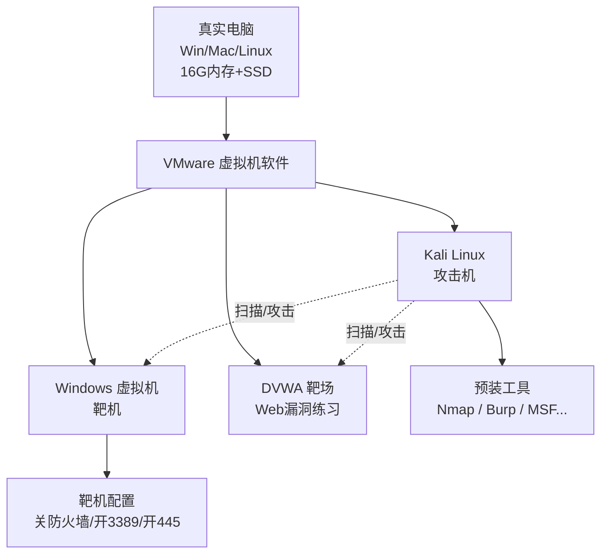
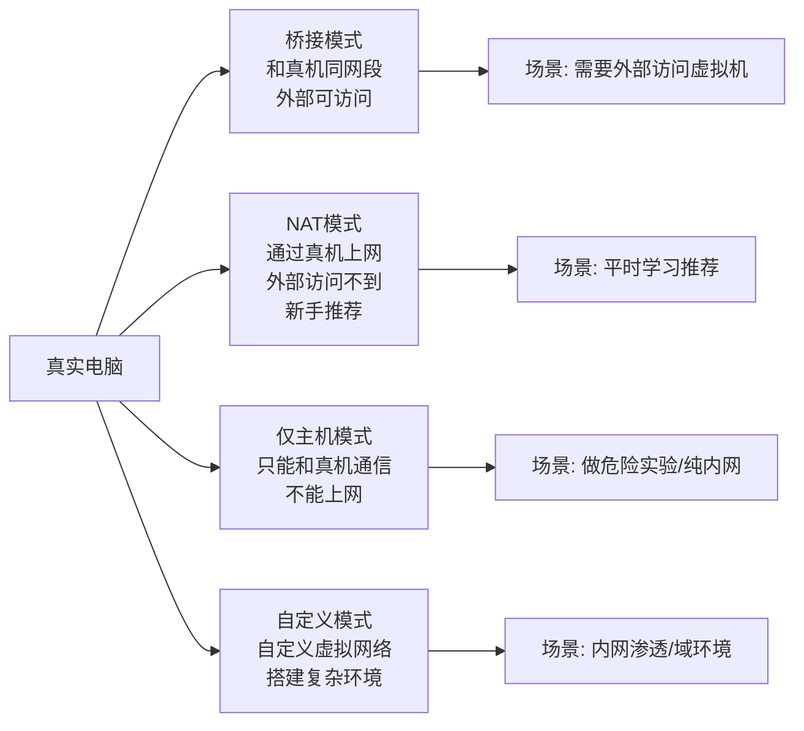
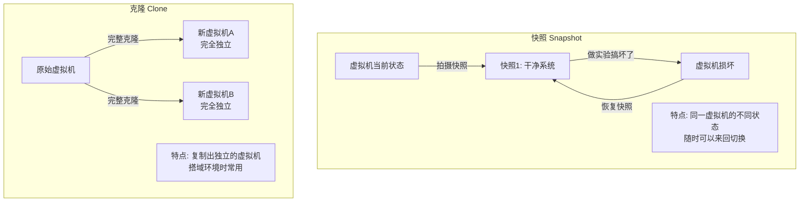
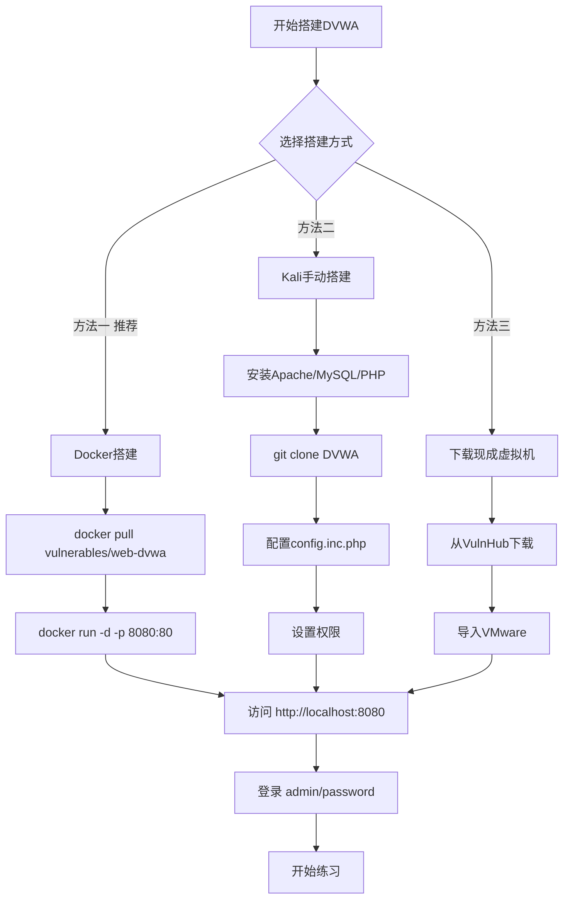
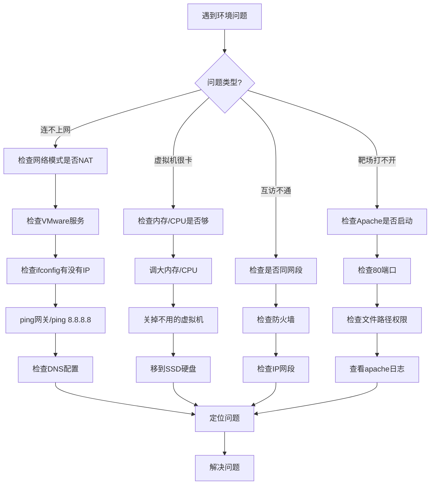

# 第11章 红队学习环境搭建

> **难度等级：🟢 简单级**
>
> **预计学习时间：120分钟**
>
> **本章看点：VMware安装、Kali Linux配置、Windows虚拟机、网络模式详解、DVWA靶场搭建、环境排错指南**
>
> ::: tip 说明
> 工欲善其事，必先利其器。
>
> 学红队，
> 首先得有个学习环境。
> 总不能拿真实网站练手吧？
> 那是违法的。
>
> 所以我们得自己搭个环境，
> 在自己的机器上随便折腾，
> 搞坏了也没关系，
> 大不了重装。
>
> 这一章，
> 我就一步一步教你，
> 怎么把学习环境搭起来。
> 从虚拟机软件到Kali Linux，
> 从Windows到靶场，
> 全给你讲得明明白白。
> :::

---

## 📖 本章概述

::: tip 写在前面
很多新手最容易卡在这一步：
环境搭不起来。

要么虚拟机装不上，
要么网络不通，
要么靶场跑不起来...
折腾了好几天，
环境还没搭好，
信心都没了。

别担心，
这一章，
我带着你一步一步搭。
只要跟着做，
肯定能搭好。

搭环境虽然是基础，
但是很重要。
以后你所有的学习和实验，
都要在这个环境里做。
所以这一步一定要做好。
:::

---

## 🎯 学习目标

读完本章，你将能够：

- [x] 知道你的电脑配置够不够
- [x] 安装VMware虚拟机软件
- [x] 安装Kali Linux（红队必备系统）
- [x] 安装Windows虚拟机
- [x] 理解虚拟机的四种网络模式
- [x] 会用虚拟机快照和克隆
- [x] 安装常用工具（Python、Nmap等）
- [x] 搭建你的第一个靶场DVWA
- [x] 解决常见的环境问题

---

## 💻 你的电脑配置够吗？

### 1.1 最低配置要求

很多人问我：
"老K，我这电脑能学红队吗？"

我给你列个最低配置，
你对照着看看。

```
最低配置要求：
├── CPU：双核以上，最好四核
├── 内存：8G以上（越多越好）
├── 硬盘：至少50G空闲空间
│   （虚拟机很占空间）
├── 系统：Windows 10/11 或 macOS 或 Linux
└── 网络：能上网就行
```

如果你的电脑连这个都达不到，
那可能有点吃力。
但是也不是完全不能学，
就是会卡一点。

### 1.2 推荐配置

如果想学习体验好一点，
推荐配置是这样的：

```
推荐配置：
├── CPU：四核以上，六核八核更好
├── 内存：16G以上（32G最好）
├── 硬盘：SSD固态硬盘，200G以上空闲
├── 系统：Windows 10/11 或 macOS
└── 网络：稳定的网络
```

为什么内存要大？
因为你要同时开好几个虚拟机：
- 一个Kali（攻击机）
- 一个Windows（靶机）
- 可能还要开个域环境
- ...

每个虚拟机都要占内存，
开得多了内存不够就会卡。

> 建议：
> 如果你现在电脑内存是8G，
> 能升级的话最好升到16G。
> 16G是学习红队的黄金配置。
> 32G就更爽了。

**图11-1 红队学习环境整体架构图**



### 1.3 笔记本还是台式机？

都可以。
看你个人习惯。

- **笔记本**：方便携带，可以随时随地学
- **台式机**：性能更强，散热更好，性价比更高

各有优劣，
根据自己的情况选就行。

---

## 📦 虚拟机软件安装

### 2.1 什么是虚拟机？

**虚拟机，就是在你电脑里模拟出来的电脑。**

就像你有一台电脑，
然后在这台电脑里，
再装好几台"假电脑"。
这些"假电脑"互相独立，
各有各的系统，
想干嘛干嘛，
搞坏了也不影响你真实的电脑。

学安全必须用虚拟机，
原因很简单：
- 可以随便折腾，不怕搞坏系统
- 可以同时开多个系统（攻击机+靶机）
- 可以随时快照还原
- 安全，不会影响真实环境

> 💡 **虚拟机是怎么"骗"你的？**
>
> 你有没有想过：
> 一台真实电脑只有一个CPU、一块内存，
> 怎么能同时跑好几个"假电脑"？
>
> 其实虚拟机的原理不复杂。
> 真实电脑里装了一个叫 **Hypervisor（虚拟化管理程序）** 的软件，
> 它负责"切分"物理资源：
>
> ```
> 真实电脑：
> CPU: 8核
> 内存: 16GB
> 硬盘: 1TB
>
> VMware（Hypervisor）把它们切成：
> ┌─────────────────┐
> │  Kali虚拟机      │ ← 分到2核CPU + 4G内存 + 50G硬盘
> ├─────────────────┤
> │  Windows虚拟机   │ ← 分到2核CPU + 4G内存 + 50G硬盘
> ├─────────────────┤
> │  真实系统继续用   │ ← 剩下4核CPU + 8G内存 + 900G硬盘
> └─────────────────┘
> ```
>
> 虚拟机里的Kali以为自己独占了整台电脑，
> 其实只是"租"了一部分。
> 就像你租了个房子，
> 你以为整栋楼都是你的，
> 其实只是其中一间。
>
> Hypervisor负责在多个虚拟机之间"切换"CPU时间——
> 这一刻Kali在用CPU，下一刻Windows在用，
> 切换得特别快（每秒几千次），
> 所以你感觉不出来，以为是同时在跑。
>
> 这就是虚拟化的魔法。

### 2.2 用什么虚拟机软件？

常用的虚拟机软件有两个：
- **VMware Workstation**（Windows/Linux）/ **VMware Fusion**（macOS）
- **VirtualBox**（免费开源）

我推荐用VMware。
为什么？
- 功能更强大
- 稳定性更好
- 用的人多，遇到问题好查资料
- 快照、克隆这些功能更方便

当然VirtualBox也可以，
免费的，也够用。
看你个人选择。

这一章我们以VMware为例来讲。

### 2.3 VMware下载和安装

VMware怎么获取？
自己去官网下载就行。

- Windows版：VMware Workstation Pro
- macOS版：VMware Fusion

官网地址：`https://www.vmware.com/`

安装过程很简单，
下一步下一步就行。
跟装普通软件一样。

**图11-2 VMware Workstation 软件界面**


> ⚠️ 提醒：
> VMware Workstation Pro是收费软件，
> 但是可以免费试用30天。
> 学习的话，试用版也够用。
> 当然，有条件的话建议支持正版。
> 学生的话也可以申请教育优惠。

---

## 🐉 Kali Linux安装配置

### 3.1 什么是Kali Linux？

**Kali Linux，就是专门做渗透测试的Linux系统。**

它里面预装了几百个安全工具，
从信息扫描到漏洞利用，
从密码破解到无线网络，
什么工具都有。
不用你一个一个装，
开箱即用。

红队基本都用Kali，
或者基于Kali改装的系统。

所以学红队，
第一步就是装个Kali。

### 3.2 下载Kali镜像

Kali是免费的，
直接去官网下载就行。

官网地址：`https://www.kali.org/get-kali/`

下载的时候注意：
- 选 **Installer Images**（安装版）
- 或者选 **Virtual Machines**（虚拟机版，推荐新手用）

> 💡 新手建议：
> 直接下载虚拟机版（Virtual Machines），
> 下载下来直接导入VMware就能用，
> 不用自己一步步安装，
> 省事！

### 3.3 导入Kali虚拟机（推荐）

如果你下载的是虚拟机版，
那就简单了。

```
导入步骤：
1. 下载Kali的VMware版本
   （文件一般是 .7z 或 .zip 格式）

2. 解压文件
   解压后会有一堆文件，
   其中有个 .vmx 后缀的文件

3. 打开VMware，点击"打开虚拟机"
   或者直接双击 .vmx 文件

4. 虚拟机就导入好了！

5. 点击"开启此虚拟机"
   就能启动Kali了
```

是不是很简单？

默认的用户名密码是：
- 用户名：`kali`
- 密码：`kali`

登录进去，
就可以开始用了。

**图11-3 Kali Linux 桌面环境**


### 3.4 手动安装Kali（可选）

如果你下载的是安装版ISO镜像，
那就需要自己一步步安装。

我简单说一下步骤：

```
手动安装步骤：
1. 打开VMware，点击"创建新的虚拟机"

2. 选择"典型"，下一步

3. 选择"安装程序光盘映像文件(iso)"
   浏览，选择你下载的Kali ISO文件

4. 下一步，给虚拟机起个名字
   比如：Kali Linux

5. 选择安装位置
   选一个空间大的盘

6. 指定磁盘大小
   建议至少60G
   选择"将虚拟磁盘拆分成多个文件"

7. 点击"自定义硬件"
   内存：建议至少2G，能4G更好
   处理器：至少2核
   网络适配器：NAT模式（后面会讲）

8. 点击"完成"，然后开启虚拟机

9. 按照安装向导一步步装
   跟装普通Linux系统一样
   语言选中文（英文也可以）
   分区选"使用整个磁盘"
   剩下的默认就行
```

安装过程可能需要几十分钟，
耐心等一下。

### 3.5 Kali基本配置

装好Kali之后，
先做几个基本配置。

#### 3.5.1 改密码

默认密码是kali，
建议改成你自己的密码。

```bash
# 修改当前用户密码
passwd
# 输入旧密码，再输入两次新密码
```

#### 3.5.2 更新系统

Kali经常更新，
装完先更一下。

```bash
# 更新软件源
sudo apt update

# 更新系统
sudo apt upgrade -y

# （更新可能需要很久，耐心等）
```

#### 3.5.3 安装中文输入法（可选）

如果你用中文系统，
建议装个中文输入法。

```bash
# 安装fcitx和搜狗输入法（或者ibus）
sudo apt install fcitx fcitx-googlepinyin -y

# 装完重启一下
reboot
```

#### 3.5.4 装几个常用工具

Kali虽然工具多，
但有时候还需要自己装一些。

```bash
# 比如：
sudo apt install git -y       # Git版本控制
sudo apt install python3-pip -y  # Python包管理
sudo apt install vim -y       # Vim编辑器
# ...需要什么装什么
```

---

## 🪟 Windows虚拟机安装

### 4.1 为什么要装Windows？

光有Kali还不够，
你还得有靶机啊。
不然你攻击谁去？

Windows是最常见的靶机，
而且内网渗透、域渗透，
主要都是针对Windows的。

所以最好装个Windows虚拟机，
用来当靶机。

### 4.2 下载Windows镜像

Windows的镜像，
可以去微软官网下载：
`https://www.microsoft.com/zh-cn/software-download/`

推荐装这几个版本：
- Windows 10 或 Windows 11（桌面版）
- Windows Server 2019 或 2022（服务器版，学域环境用）

新手的话，
先装个Windows 10就行。

### 4.3 安装Windows虚拟机

安装步骤跟装Kali差不多：

```
安装步骤：
1. 打开VMware，创建新虚拟机

2. 选择Windows的ISO镜像

3. 下一步，设置虚拟机名字和位置

4. 磁盘大小：建议至少60G

5. 自定义硬件：
   - 内存：至少2G，4G更好
   - 处理器：至少2核
   - 网络：NAT模式

6. 开启虚拟机，开始安装

7. 按照安装向导一步步来
   跟装普通Windows一样
   密钥可以选"我没有产品密钥"
   （可以试用，后面再激活）
   版本选专业版或企业版
```

安装过程可能比较久，
耐心等。

### 4.4 Windows基本配置

装好Windows之后，
也做几个配置。

#### 4.4.1 安装VMware Tools

VMware Tools是VMware的增强工具，
装了之后：
- 虚拟机更流畅
- 可以和主机拖拽文件
- 可以复制粘贴
- 分辨率可以自适应

一定要装！

```
安装方法：
1. VMware菜单栏 → 虚拟机 → 安装VMware Tools
2. 打开Windows里的光驱
3. 双击setup.exe安装
4. 安装完重启虚拟机
```

#### 4.4.2 关闭防火墙（靶机用）

如果是当靶机用，
建议把防火墙关了，
不然很多攻击打不进去。

> ⚠️ 注意：
> 只有靶机可以关防火墙！
> 你自己的真实电脑千万不要关！

```
关闭防火墙步骤：
1. 控制面板 → Windows Defender 防火墙
2. 点击"启用或关闭Windows Defender防火墙"
3. 专用网络和公用网络都选"关闭"
4. 确定
```

#### 4.4.3 开启一些服务（靶机用）

为了方便做实验，
可以开启一些服务：

```
开启远程桌面（3389）：
1. 右键"此电脑" → 属性
2. 远程设置
3. 勾选"允许远程连接到此计算机"
4. 确定

开启SMB服务（445）：
1. 控制面板 → 程序和功能
2. 启用或关闭Windows功能
3. 勾选"SMB 1.0/CIFS 文件共享支持"
4. 确定，重启
```

这些服务开了之后，
就可以拿来当靶机练手了。

---

## 🌐 虚拟机网络模式详解

### 5.1 四种网络模式

VMware有四种网络模式，
新手经常搞混。
我给你讲清楚。

```
四种网络模式：
1. 桥接模式（Bridged）
2. NAT模式（网络地址转换）
3. 仅主机模式（Host-Only）
4. 自定义模式
```

一个一个讲。

### 5.2 桥接模式

**桥接模式：虚拟机和真实电脑在同一个网络里。**

就像在你家的路由器上，
又接了一台真实的电脑一样。
虚拟机和你的真实电脑地位平等。

```
桥接模式特点：
├── 优点：
│   ├── 虚拟机和真实电脑在同一网段
│   ├── 可以互相访问
│   ├── 其他电脑也能访问虚拟机
│   └── 可以上网
│
└── 缺点：
    ├── 占用一个真实IP
    ├── 换个网络环境（比如从家拿到公司）IP会变
    └── 不太安全（其他电脑也能访问你的虚拟机）
```

什么时候用桥接？
- 需要其他真实电脑访问虚拟机的时候
- 做一些需要真实IP的实验的时候

### 5.3 NAT模式

**NAT模式：虚拟机通过真实电脑上网。**

虚拟机相当于在真实电脑后面，
真实电脑相当于路由器。
虚拟机可以上网，
可以访问真实电脑，
但是外面的电脑访问不到虚拟机。

```
NAT模式特点：
├── 优点：
│   ├── 安全性好（外面访问不到）
│   ├── 不占用额外IP
│   ├── 换环境不受影响
│   └── 可以上网
│
└── 缺点：
    ├── 其他真实电脑访问不到虚拟机
    └── 网络结构稍微复杂一点
```

什么时候用NAT？
- 平时学习推荐用NAT
- 只需要虚拟机上网，不需要外部访问

### 5.4 仅主机模式

**仅主机模式：虚拟机只能和真实电脑通信，不能上网。**

相当于一个独立的内网，
只有虚拟机和你的真实电脑，
连不上外网。

```
仅主机模式特点：
├── 优点：
│   ├── 最安全，完全隔离
│   └── 不会影响外部网络
│
└── 缺点：
    ├── 不能上网
    └── 只有真实电脑能访问
```

什么时候用仅主机？
- 做危险实验的时候
- 不需要上网的实验
- 搭建纯内网环境的时候

### 5.5 自定义模式

**自定义模式：自己定义虚拟网络。**

你可以创建多个虚拟网络，
把不同的虚拟机放在不同的网络里，
模拟真实的网络环境。

比如：
- VMnet1：仅主机
- VMnet8：NAT
- VMnet2：自定义内网1
- VMnet3：自定义内网2
- ...

这个功能很强大，
后面学内网渗透、域环境的时候，
会经常用到。

### 5.6 四种模式底层原理：数据包到底走了什么路？

很多同学只记住了四种模式的名字，
但不理解它们底层在做什么。
我们来看看真实的数据包流向：

**桥接模式的底层：**
```
真实网络：路由器 192.168.1.1
├── 真实电脑：192.168.1.10
└── Kali虚拟机：192.168.1.20 (桥接获取)
```
数据包从Kali发出后，
直接进入你家的真实局域网。
路由器把它当一台真实的电脑来对待。
**这就是为什么桥接模式需要占用一个真实IP。**

**NAT模式的底层：**
```
真实网络：路由器 192.168.1.1
└── 真实电脑：192.168.1.10 (也是NAT网关)
    └── 虚拟NAT网络：192.168.109.0/24
        └── Kali虚拟机：192.168.109.128
```
数据包从Kali（192.168.109.128）发出，
先到VMware的虚拟NAT网关（192.168.109.2），
然后被"翻译"成从真实电脑（192.168.1.10）发出的包，
发送到外网。
外面的回复再被"翻译"回来，发给Kali。

**这就是NAT（网络地址转换）的原理：**
像一个"翻译官"，
把虚拟机的内网地址翻译成真实的外网地址。

外面的人看到的永远是真实电脑的IP，
根本不知道后面还藏着一台虚拟机。
这也是为什么NAT模式更安全。

**仅主机模式的底层：**
```
真实电脑：虚拟网卡 VMnet1，IP 192.168.56.1
虚拟网络：VMnet1
Kali虚拟机：192.168.56.128
```
这个网络和外界的路由器没有任何连接，
是一个完全封闭的网络。
数据包永远只在真实电脑和虚拟机之间流动。
**就像你和虚拟机之间拉了一根网线，其他什么都没有。**

明白了底层原理，
再选网络模式就心里有数了。

### 5.7 新手用哪个？

**新手建议用NAT模式。**

理由：
- 可以上网（方便下载东西）
- 比较安全
- 足够满足大部分学习需求
- 不容易出问题

等你对网络熟悉了，
再尝试其他模式。

**图11-4 虚拟机四种网络模式对比图**



---

## 📸 虚拟机快照与克隆

### 6.1 什么是快照？

**快照，就是给虚拟机拍个照片，保存当前状态。**

以后虚拟机搞坏了，
随时可以恢复到拍快照时的状态。
就像游戏存档一样。

这个功能太重要了！
学安全的，
搞坏虚拟机是家常便饭。
有了快照，
就不怕搞坏了，
大不了恢复一下。

### 6.2 怎么拍快照？

```
拍快照步骤：
1. 虚拟机关机状态或者运行状态都可以
2. VMware菜单栏 → 虚拟机 → 快照 → 拍摄快照
3. 给快照起个名字
   比如："刚装好的干净系统"
4. 写点描述（可选）
5. 点击"拍摄快照"
```

就这么简单。

> 💡 **深入理解：快照为什么这么快？——"写时复制"机制**
>
> 你有没有好奇过：为什么拍快照、恢复快照只需要几秒钟，
> 但一个完整的虚拟机可能有几十GB？
>
> 这背后的原理叫做 **COW（Copy-On-Write，写时复制）**。
>
> 用一个比喻来理解：
>
> 假设你有一本1000页的教科书，你想"存档"：
> - **全量备份** = 复印整本书，需要1000页纸和很长时间
> - **COW快照** = 只记录"原书1-1000页"，然后给你一本新封面
>   当你想在第500页写笔记时：
>   系统才发现"哦，你要改第500页？那我只复印第500页，
>   把新内容写在这个复印件上，其他999页仍然引用原书"
>
> 在虚拟机的实现中：
> ```
> 1. 拍快照时：
>    - 不复制任何数据！
>    - 只是"冻结"了当前虚拟磁盘文件的引用
>    - 创建一个新的"差分磁盘"来记录后续的变化
>
> 2. 拍完快照后，你对虚拟机做任何操作：
>    - 要修改某个数据块时
>    - 系统先把原始数据块复制到差分磁盘
>    - 然后在差分磁盘中修改
>    - 原始数据块保持不变（留给快照用）
>
> 3. 恢复快照时：
>    - 直接丢弃差分磁盘（后面改的东西全扔掉）
>    - 重新引用冻结时的原始数据块
>    - 瞬间完成，因为只是删了几个指针！
> ```
>
> 这就是为什么：
> - **拍快照很快** — 只是创建了一个"标记点"，没复制数据
> - **恢复快照很快** — 只是删掉了后续的"变化记录"
> - **快照多了会占空间** — 每个快照之间的"变化"会累积
> - **快照不是备份！** — 原始磁盘文件坏了，快照也废了
>
> 理解了COW，你就明白：
> 快照适合"短期回退点"，真正长期保存还是要用克隆或导出。

建议：
- 装好系统、配好环境，拍一个快照
- 做实验之前，拍一个快照
- 实验成功了，拍一个快照
- ...
- 多拍几个没坏处

### 6.3 怎么恢复快照？

```
恢复快照步骤：
1. VMware菜单栏 → 虚拟机 → 快照 → 恢复到快照
   或者在快照管理器里选要恢复的快照
2. 确认一下，点"是"
3. 等一会儿就恢复好了
```

几秒钟就能恢复，
非常方便。

### 6.4 什么是克隆？

**克隆，就是复制一个一模一样的虚拟机。**

快照是同一个虚拟机的不同状态，
克隆是完全独立的另一个虚拟机。

什么时候用克隆？
- 需要多个相同的虚拟机的时候
- 比如搭建域环境，需要好几台Windows
- 一台一台装太麻烦，装一台，然后克隆

### 6.5 怎么克隆？

```
克隆步骤：
1. 虚拟机必须是关机状态
2. VMware菜单栏 → 虚拟机 → 管理 → 克隆
3. 下一步，选择"从当前状态克隆"
   或者从某个快照克隆
4. 选择"创建完整克隆"
   （链接克隆也可以，但完整克隆更独立）
5. 给新虚拟机起名字，选位置
6. 等待克隆完成
```

克隆出来的虚拟机，
跟原来的一模一样，
但是是完全独立的，
怎么折腾都不影响原来的。

**图11-5 快照与克隆工作流程对比图**



---

## 🔧 基础工具安装与配置

### 7.1 Python

Python是必须的，
很多工具都是Python写的。

Kali里一般自带Python3，
确认一下：

```bash
# 查看Python版本
python3 --version

# 查看pip版本
pip3 --version
```

如果没有的话，
安装一下：

```bash
sudo apt install python3 python3-pip -y
```

### 7.2 Git

Git是版本控制工具，
很多工具都要从GitHub上下载，
所以Git是必须的。

```bash
# 安装Git
sudo apt install git -y

# 查看版本
git --version
```

### 7.3 Nmap

Nmap是端口扫描神器，
红队必备。

Kali里一般自带了：

```bash
# 查看版本
nmap --version
```

如果没有的话：

```bash
sudo apt install nmap -y
```

（Nmap的详细用法，后面章节会专门讲）

### 7.4 其他常用工具

```bash
# 其他常用工具，按需安装

# 文本编辑器
sudo apt install vim -y

# 网络工具
sudo apt install net-tools -y   # ifconfig等
sudo apt install curl -y        # curl
sudo apt install wget -y        # wget
sudo apt install netcat -y      # nc（瑞士军刀）

# 浏览器（Kali自带Firefox，够用了）

# 等等...
```

工具不用一下子全装，
用到什么装什么就行。

---

## 🎯 你的第一个靶场：DVWA

### 8.1 什么是DVWA？

**DVWA，全称Damn Vulnerable Web Application。**
翻译过来就是："该死的脆弱Web应用"。

它是一个专门用来练手的Web漏洞靶场，
里面包含了各种常见的Web漏洞：
- SQL注入
- XSS
- CSRF
- 文件上传
- 命令执行
- ...

非常适合新手练习。

### 8.2 搭建DVWA

DVWA怎么搭呢？
有几种方法。

#### 方法一：用Docker搭（推荐，最简单）

如果你会用Docker的话，
一条命令就能搞定。

```bash
# 拉取DVWA镜像
docker pull vulnerables/web-dvwa

# 运行
docker run -d -p 8080:80 vulnerables/web-dvwa

# 然后浏览器访问 http://localhost:8080
```

#### 方法二：在Kali里手动搭

如果不用Docker，
手动搭也不难。

需要先搭Web环境：
- Apache/Nginx（Web服务器）
- MySQL/MariaDB（数据库）
- PHP

Kali里可以用XAMPP，
或者用apt装LAMP环境。

```bash
# 安装Apache、MySQL、PHP
sudo apt install apache2 mariadb-server php php-mysql -y

# 启动服务
sudo systemctl start apache2
sudo systemctl start mariadb

# 设置MySQL
sudo mysql_secure_installation
# 跟着提示来，设置root密码

# 下载DVWA
cd /var/www/html/
sudo git clone https://github.com/digininja/DVWA.git
sudo mv DVWA dvwa

# 配置DVWA
cd dvwa/config
sudo cp config.inc.php.dist config.inc.php
sudo vim config.inc.php
# 把数据库密码改成你设置的MySQL密码

# 设置权限
sudo chmod -R 777 /var/www/html/dvwa/hackable/uploads
sudo chmod -R 777 /var/www/html/dvwa/external/phpids/0.6/lib/IDS/tmp
sudo chmod -R 777 /var/www/html/dvwa/config

# 浏览器访问 http://127.0.0.1/dvwa
# 点击底部的 Create / Reset Database
# 然后就可以登录了
# 默认账号：admin  密码：password
```

#### 方法三：下载现成的虚拟机

嫌麻烦的话，
可以直接下载别人做好的DVWA虚拟机，
导入VMware就能用。

去 VulnHub 搜DVWA，
下载下来导入就行。

**图11-6 DVWA靶场搭建流程图**



### 8.3 DVWA基本使用

打开DVWA，
用 `admin / password` 登录。

进去之后，
左边是菜单，
有各种漏洞的练习：
- Brute Force（暴力破解）
- Command Injection（命令注入）
- CSRF
- File Inclusion（文件包含）
- File Upload（文件上传）
- SQL Injection（SQL注入）
- SQL Injection (Blind)（SQL盲注）
- XSS (Reflected)（反射型XSS）
- XSS (Stored)（存储型XSS）
- ...

右下角可以设置难度：
- Low（低）
- Medium（中）
- High（高）
- Impossible（不可能，就是有防护的）

建议从Low难度开始，
一个一个练，
慢慢提升难度。

---

## 🔍 环境排错指南

### 9.1 常见问题一：虚拟机连不上网

这是最常见的问题。

```
排查步骤：
1. 检查虚拟机的网络模式
   是不是NAT模式？
   不是的话改成NAT试试

2. 检查VMware的服务
   Windows的话，看看服务里VMware的服务有没有启动
   （Win+R，输入 services.msc）

3. 检查虚拟机里的网络设置
   ifconfig / ip addr 看看有没有IP
   没有的话试试 dhclient 自动获取

4. 试试能不能ping通网关
   ping 网关IP（NAT模式一般是 .2 结尾）
   ping不通的话检查网络模式

5. 试试能不能ping通8.8.8.8
   ping得通说明网是通的，可能是DNS的问题

6. 检查DNS
   cat /etc/resolv.conf
   看看有没有DNS服务器
   没有的话加上：nameserver 8.8.8.8
```

一般按这个步骤排查，
都能找到问题。

### 9.2 常见问题二：虚拟机很卡

如果虚拟机特别卡，

```
可能的原因和解决方法：
1. 内存给少了
   → 关机，把内存调大一点
   （但也别超过真实电脑内存的一半）

2. CPU给少了
   → 关机，把处理器核数调多一点

3. 开的虚拟机太多了
   → 关几个不用的

4. 虚拟机放在机械硬盘上
   → 放到SSD固态硬盘上，速度会快很多

5. 虚拟机里跑了耗资源的程序
   → 关掉一些不用的程序
```

### 9.3 常见问题三：真实机和虚拟机不能互相访问

```
排查步骤：
1. 看看网络模式对不对
   桥接和NAT模式一般都可以互访
   仅主机模式也可以

2. 看看IP对不对
   是不是在同一个网段？

3. 看看防火墙
   真实机和虚拟机的防火墙都看看
   是不是被防火墙拦住了

4. ping一下试试
   ping得通说明网络是通的
   ping不通再查网络
```

### 9.4 常见问题四：靶场打不开

如果搭建的靶场访问不了，

```
排查步骤：
1. 看看Web服务启动了没有
   service apache2 status
   没启动的话启动一下

2. 看看端口对不对
   默认是80端口
   有没有改端口？

3. 看看防火墙
   是不是被防火墙拦了？

4. 看看文件路径对不对
   文件是不是放对地方了？
   权限对不对？

5. 看看日志
   /var/log/apache2/ 下面的日志
   一般能找到报错信息
```

排错是个技术活，
也是必须掌握的技能。
遇到问题不要慌，
一步一步排查，
总能找到原因的。

**图11-7 环境排错思路流程图**



---

## 📚 案例讲解

### 案例1：小白第一次装虚拟机踩坑记

小于是个纯小白，
第一次装虚拟机。
跟着教程一步步来，
结果装完Kali之后，
发现上不了网。

他急坏了，
找了半天原因，
后来发现——
**他把网络适配器给删了。**

原来他自定义硬件的时候，
觉得"网络适配器"没用，
就给移除了。
结果自然上不了网。

后来把网络适配器加上，
选NAT模式，
就好了。

> 给新手的提醒：
> **不知道是什么的东西，
> 不要乱删乱改。
> 默认的配置一般都是没问题的，
> 先默认用着，
> 等懂了再改。**

### 案例2：快照救了他一命

小周刚学SQL注入，
在DVWA上练手。
练着练着，
想试试"拖库"，
结果操作失误，
把DVWA的数据库给删了。

DVWA直接打不开了。
他急得满头汗，
心想："完了，又得重新搭了。"

突然他想起，
刚搭好DVWA的时候，
拍了个快照。

他赶紧恢复快照，
几秒钟，
DVWA就恢复了。
跟新的一样。

从那以后，
小周养成了习惯：
**做任何危险操作之前，
先拍个快照。**

> 老K说：
> **"快照这个功能，
> 是虚拟机最好用的功能，没有之一。
> 用好了，
> 你就可以放心大胆地折腾，
> 搞坏了大不了重来。
> 学技术，
> 就要有'敢折腾'的精神。
> 反正有快照兜底嘛。"**

### 案例3：网络模式选错导致的悲剧

小吴做实验，
需要两台虚拟机互相对打。
一台Kali，一台Windows。

他发现两台机器ping不通，
折腾了半天也没解决。
后来问我，
我一看——
**一台是NAT模式，一台是仅主机模式。**

那当然ping不通啊！
都不在一个网络里。

后来把两台都改成NAT模式，
马上就通了。

> 新手常见错误：
> **虚拟机的网络模式不一样，
> 肯定不通啊。
> 要让虚拟机之间互相访问，
> 它们得在同一个网络里才行。**

### 案例4：一台物理机搭出整个实验环境

很多人问我：
"老K，我只有一台电脑，
能学红队吗？
需要买好几台电脑吗？"

当然不用！
一台电脑就够了。

我见过最厉害的，
用一台笔记本，
开了10台虚拟机，
搭了一整套域环境：
- 1台Kali（攻击机）
- 2台域控
- 3台成员服务器
- 4台客户端
- ...

当然，
那台笔记本配置也挺高的，
32G内存，i7处理器。

但是也说明：
**一台物理机，
完全可以搭出很复杂的实验环境。**

只要你内存够大，
想开几台开几台。

> 所以别担心设备不够，
> 先把技术练好。
> 设备不够的时候，
> 想办法用现有的设备创造条件。
> 办法总比困难多。

### 案例5：环境搭了三天才搭好的故事

我刚学安全的时候，
环境搭了整整三天。

第一天：装VMware，装Kali。
装完了上不了网，
折腾了一天才搞定。

第二天：装Windows，
装完之后发现跟Kali ping不通，
又折腾了一天。

第三天：搭DVWA靶场，
PHP配不对，
数据库连不上，
各种报错。
又折腾了一天。

三天之后，
环境终于搭好了。
虽然花了很多时间，
但是这三天学到的东西，
比看一周教程都多。

因为排错的过程，
就是学习的过程。

所以新手朋友们，
**搭环境遇到问题很正常，
不要灰心，不要放弃。
一个问题一个问题地解决，
解决的问题多了，
你自然就厉害了。**

---

## ✏️ 课后习题

### 选择题

1. 学红队，推荐的虚拟机软件是？
   - A. VMware
   - B. QQ
   - C. Word
   - D. Excel

2. 红队最常用的Linux系统是？
   - A. Ubuntu
   - B. CentOS
   - C. Kali Linux
   - D. Windows

3. 虚拟机的四种网络模式不包括哪个？
   - A. 桥接模式
   - B. NAT模式
   - C. 仅主机模式
   - D. 飞行模式

4. 新手学习推荐用哪种网络模式？
   - A. 桥接模式
   - B. NAT模式
   - C. 仅主机模式
   - D. 都一样

5. 快照的作用是什么？
   - A. 保存虚拟机当前状态，以后可以恢复
   - B. 复制一个新的虚拟机
   - C. 给虚拟机拍照
   - D. 备份文件

6. DVWA是什么？
   - A. 一个Web漏洞靶场
   - B. 一种编程语言
   - C. 一个操作系统
   - D. 一个黑客工具

7. 安装VMware Tools的好处不包括？
   - A. 虚拟机更流畅
   - B. 可以和主机复制粘贴
   - C. 可以拖拽文件
   - D. 可以让虚拟机变好看

8. Kali Linux的默认用户名密码是？
   - A. root / root
   - B. admin / admin
   - C. kali / kali
   - D. test / test

9. 端口扫描神器是？
   - A. Nmap
   - B. Photoshop
   - C. Office
   - D. 浏览器

10. 以下哪个不是DVWA里的漏洞？
    - A. SQL注入
    - B. XSS
    - C. 文件上传
    - D. 蓝屏漏洞

### 填空题

1. 学红队推荐用的虚拟机软件是______。

2. 红队专用的Linux系统是______。

3. 虚拟机的四种网络模式是：______、______、______、自定义模式。

4. 新手学习推荐用______网络模式。

5. 保存虚拟机当前状态，以后可以恢复的功能叫______。

6. 复制一个一模一样的虚拟机，叫______。

7. 新手推荐的第一个Web漏洞靶场是______。

8. DVWA的默认管理员账号是______，密码是______。

9. 端口扫描神器叫______。

10. 版本控制工具，用来从GitHub下载代码的是______。

### 简答题

1. 为什么学红队要用虚拟机？用真实电脑不行吗？

2. VMware和VirtualBox各有什么优缺点？你推荐用哪个？

3. 虚拟机的四种网络模式分别是什么？各有什么特点？

4. 快照和克隆有什么区别？分别在什么时候用？

5. 什么是DVWA？为什么推荐新手用DVWA练手？

6. 搭建学习环境，最低配置要求是什么？推荐配置是什么？

7. Kali Linux为什么适合做渗透测试？

8. 为什么建议靶机关闭防火墙？真实机关闭行不行？

9. 虚拟机连不上网，应该怎么排查？（说说你的思路）

10. 搭环境遇到问题了怎么办？应该放弃还是自己琢磨？

### 实操题

1. 动手安装VMware（或VirtualBox）：
   - 下载安装包
   - 一步步安装
   - 安装成功后截个图

2. 安装Kali Linux：
   - 下载Kali的虚拟机版
   - 导入VMware
   - 启动，登录进去
   - 看看里面都有什么工具

3. 安装Windows虚拟机：
   - 下载Windows镜像
   - 安装Windows虚拟机
   - 安装VMware Tools
   - 关闭防火墙（靶机用）

4. 配置网络：
   - 把Kali和Windows都设置成NAT模式
   - 试试两台虚拟机能不能ping通
   - 试试能不能上网

5. 搭建DVWA靶场：
   - 任选一种方法搭建DVWA
   - 搭建成功后用浏览器访问
   - 用admin/password登录
   - 随便点几个菜单看看
   - 成功后拍个快照

---

## 📝 本章小结

这一章，
我们学习了怎么搭建红队学习环境。

总结一下重点：

1. **配置要求**
   - 最低：双核CPU、8G内存、50G硬盘
   - 推荐：四核以上、16G内存、SSD硬盘

2. **虚拟机软件**
   - 推荐用VMware
   - 功能强大，稳定好用

3. **Kali Linux**
   - 红队专用系统，预装几百个安全工具
   - 推荐下载虚拟机版，导入就能用
   - 默认账号密码：kali / kali

4. **Windows虚拟机**
   - 当靶机用，练习Windows相关的攻击
   - 记得装VMware Tools
   - 靶机可以关防火墙（真机别关！）

5. **网络模式**
   - 桥接：和真机在同一网络
   - NAT：通过真机上网，外面访问不到（推荐新手用）
   - 仅主机：只能和真机通信，不能上网
   - 自定义：自己定义虚拟网络

6. **快照和克隆**
   - 快照：存档，随时可以恢复（非常重要！）
   - 克隆：复制一个独立的虚拟机

7. **基础工具**
   - Python、Git、Nmap...
   - 用到什么装什么

8. **DVWA靶场**
   - 新手必练的Web漏洞靶场
   - 从Low难度开始，一个一个练

9. **环境排错**
   - 遇到问题不要慌
   - 一步一步排查
   - 排错的过程就是学习的过程

> 最后送你一句话：
> **"环境搭好了，
> 就等于成功了一半。
> 大胆去折腾，
> 反正有快照兜底。
> 搞坏了大不了重装，
> 怕什么呢？"**

---

## 🔗 相关链接

- [⬅️ 上一章：---](/redteam/day013-beginner-15个基础概念)
- [➡️ 下一章：---](/redteam/day015-beginner-信息收集)
- [📖 返回全书目录](/redteam/day118-toc-全书目录)
