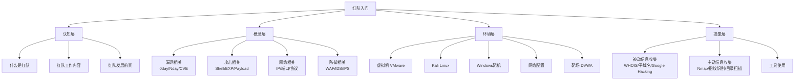
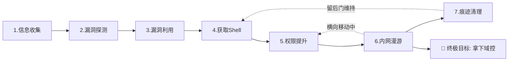
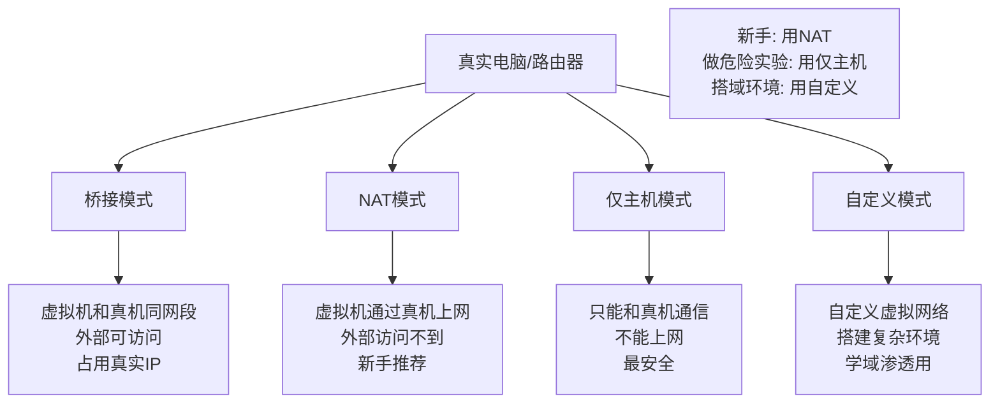
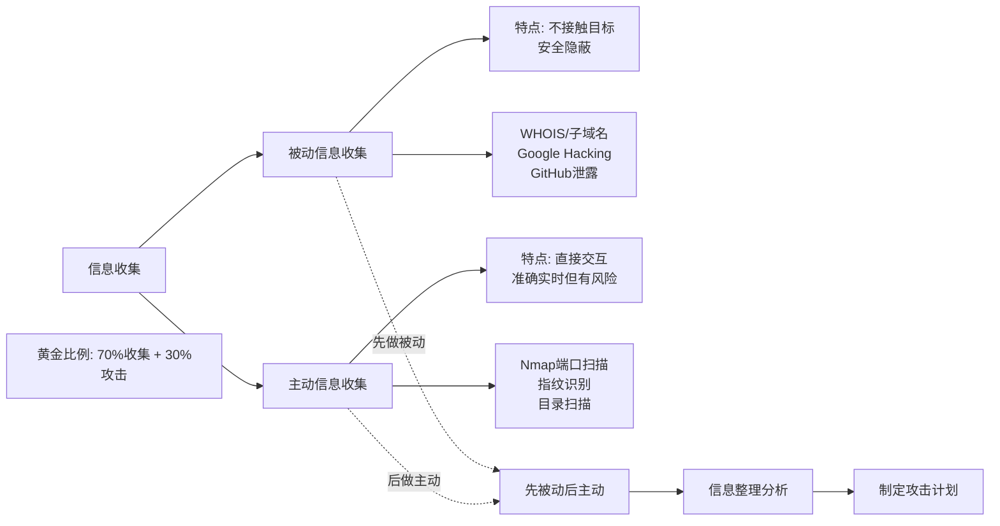
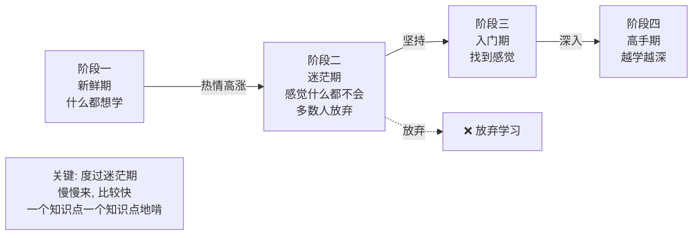
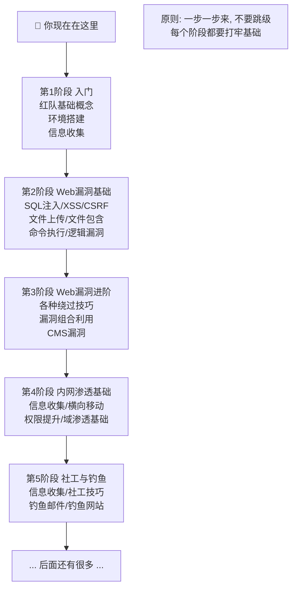
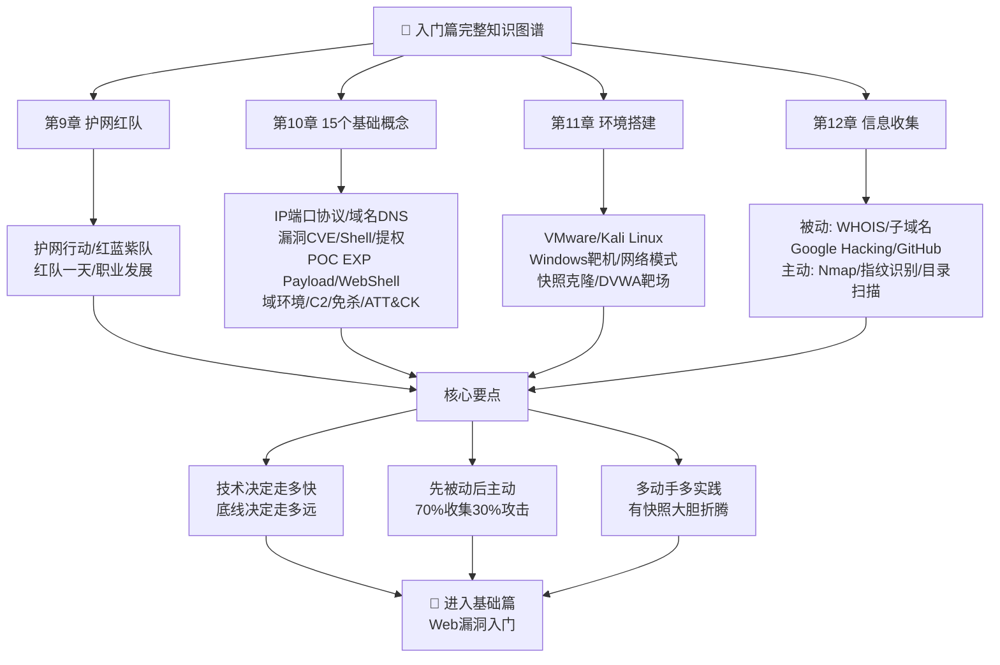

# 第13章 总结与回顾：入门篇收尾

> **难度等级：🟢 简单级**
>
> **预计学习时间：90分钟**
>
> **本章看点：入门篇知识回顾、重点知识梳理、学习路径建议、常见问题解答、入门阶段学习方法**
>
> ::: tip 说明
> 恭喜你！
>
> 入门篇到这里就结束了。
>
> 这一章，
> 我们来做个总结，
> 把前面几章的内容串起来，
> 帮你梳理一下思路，
> 也给你一些后续的学习建议。
>
> 学完这一章，
> 你就算是真正入门了。
> 接下来，
> 就可以进入基础篇，
> 学习更深入的内容了。
> :::

---

## 📖 本章概述

::: tip 写在前面
入门篇四章内容，
说多不多，说少不少。

从什么是红队，
到基础概念，
到环境搭建，
再到信息收集...

不知道你都吸收了多少？

这一章，
我们就来好好回顾一下，
把这些知识串起来，
形成一个完整的知识体系。

同时，
我也会给你一些学习建议，
告诉你接下来该怎么学，
怎么才能学得又快又好。

让我们开始吧！
:::

---

## 🎯 学习目标

读完本章，你将能够：

- [x] 回顾入门篇的所有知识点
- [x] 梳理知识体系，形成完整框架
- [x] 知道自己接下来该学什么
- [x] 掌握红队的学习方法
- [x] 解决入门阶段的常见问题

---

## 📚 入门篇知识总览

### 1.1 入门篇学了什么？

入门篇一共四章，
我们来快速回顾一下：

```
入门篇（第1篇）
├── 第9章：什么是护网红队？一张图给你讲明白
│   ├── 什么是护网行动
│   ├── 什么是红队、蓝队、紫队
│   ├── 红队的工作流程
│   ├── 红队需要掌握的技能
│   └── 红队的职业发展
│
├── 第10章：红队入门必备的15个基础概念
│   ├── 漏洞、0day、Nday
│   ├── CVE、CNVD、CNNVD
│   ├── 渗透测试、漏洞利用、Payload
│   ├── Shell、Webshell、反弹Shell
│   ├── C/S、B/S架构
│   ├── 端口、协议、IP、域名
│   ├── WAF、IDS、IPS
│   └── 社工、钓鱼、免杀
│
├── 第11章：红队学习环境搭建
│   ├── 电脑配置要求
│   ├── VMware虚拟机软件
│   ├── Kali Linux安装配置
│   ├── Windows虚拟机安装
│   ├── 虚拟机网络模式详解
│   ├── 快照与克隆
│   ├── 基础工具安装
│   ├── DVWA靶场搭建
│   └── 环境排错指南
│
└── 第12章：信息收集 —— 红队的侦察兵
    ├── 什么是信息收集
    ├── 被动信息收集
    │   ├── WHOIS查询
    │   ├── 子域名收集
    │   ├── Google Hacking
    │   ├── GitHub信息泄露
    │   └── 其他被动收集方式
    ├── 主动信息收集
    │   ├── 端口扫描基础
    │   ├── Nmap详解
    │   ├── 指纹识别
    │   └── 目录扫描
    ├── 信息收集工具汇总
    └── 信息收集思路
```

### 1.2 知识体系图

如果用一张图来表示入门篇的知识体系，
大概是这样的：

```
红队入门
├── 认知层
│   ├── 什么是红队
│   ├── 红队的工作内容
│   └── 红队的发展前景
│
├── 概念层
│   ├── 漏洞相关概念
│   ├── 攻击相关概念
│   ├── 网络相关概念
│   └── 防御相关概念
│
├── 环境层
│   ├── 虚拟机软件
│   ├── Kali Linux
│   ├── Windows靶机
│   ├── 网络配置
│   └── 靶场搭建
│
└── 技能层
    ├── 被动信息收集
    ├── 主动信息收集
    └── 工具使用
```

是不是很清晰？

**图13-1 入门篇知识体系思维导图**



---

## 🧠 重点知识回顾

### 2.1 核心概念回顾

#### 什么是红队？

**红队，就是模拟真实攻击的团队。**

护网行动中，
红队扮演"攻方"，
想尽办法打进目标内部；
蓝队扮演"守方"，
想尽办法防守。

红队的目标不是搞破坏，
而是发现目标的安全弱点，
帮助目标提升安全防护能力。

#### 红队的一般流程

```
1. 信息收集 → 2. 漏洞探测 → 3. 漏洞利用
                          ↓
     7. 痕迹清理 ← 6. 内网漫游 ← 5. 权限提升
                                         ↓
                                     4. 获取Shell
```

这是一个简化的流程，
实际情况可能会更复杂。

**图13-2 红队一般攻击流程图**



#### 什么是漏洞？

**漏洞，就是系统的安全弱点。**

就像房子有个破洞，
小偷可以从这个洞钻进去。

漏洞的分类：
- **0day**：还没有公开的漏洞，最值钱
- **Nday**：已经公开有补丁的漏洞，最常用
- **1day**：刚公开不久的漏洞

### 2.2 环境搭建回顾

#### 为什么要用虚拟机？

- 可以随便折腾，不怕搞坏系统
- 可以同时开多个系统（攻击机+靶机）
- 可以随时快照还原
- 安全，不会影响真实环境

#### 网络模式

| 模式 | 特点 | 适用场景 |
|------|------|----------|
| 桥接 | 和真机在同一网络 | 需要外部访问 |
| NAT | 通过真机上网，外面访问不到 | **新手推荐** |
| 仅主机 | 只能和真机通信，不能上网 | 做危险实验 |
| 自定义 | 自己定义虚拟网络 | 搭建复杂环境 |

**图13-3 虚拟机四种网络模式对比图**



#### 快照和克隆

- **快照**：给虚拟机"存档"，随时可以恢复
- **克隆**：复制一个一模一样的虚拟机

**一定要养成拍快照的好习惯！**
做实验之前拍一个，
实验成功了拍一个，
反正多拍没坏处。

### 2.3 信息收集回顾

#### 被动 vs 主动

```
被动信息收集：不直接接触目标，安全隐蔽
├── WHOIS查询
├── 子域名收集
├── 搜索引擎语法
├── GitHub信息泄露
├── 社交媒体
├── 招聘网站
└── ...

主动信息收集：直接和目标交互，有被发现的风险
├── 端口扫描（Nmap）
├── 指纹识别（whatweb）
├── 目录扫描（dirsearch）
└── ...
```

**原则：先被动，后主动。**

**图13-4 信息收集被动vs主动对比图**



#### Nmap常用参数

记住这几个最常用的：
- `-sS`：SYN半开扫描
- `-sV`：探测服务版本
- `-O`：探测操作系统
- `-p`：指定端口
- `-p-`：扫描所有端口
- `-T4`：较快的扫描速度
- `-A`：全面扫描

#### 信息收集的思路

1. 从域名入手，收集WHOIS、子域名
2. 用搜索引擎挖信息
3. 查GitHub、代码托管平台
4. 查社交媒体、招聘网站
5. 端口扫描、服务识别
6. 指纹识别、目录扫描
7. 整理信息，分析突破口

---

## 📝 入门阶段常见问题

### 3.1 问题一：我是纯小白，能学会吗？

**当然能！**

谁都是从纯小白过来的。

我见过很多人，
一开始连什么是IP都不知道，
后来也成了大神。

红队这个领域，
门槛没有你想象的那么高。
只要你：
- 有兴趣
- 肯动手
- 能坚持

就一定能学会。

> 💡 给你的建议：
> 不要怕，
> 也不要急。
> 一步一步来，
> 跟着教程做，
> 多动手，多实践。
>
> 遇到问题是正常的，
> 解决问题的过程就是成长的过程。

### 3.2 问题二：需要什么基础？

说实话，
有基础肯定学得更快。
但是没有基础也没关系，
可以边学边补。

需要的基础大概有这些：
- 计算机基础（知道什么是操作系统、什么是文件...）
- 网络基础（知道什么是IP、什么是端口...）
- 一点英语基础（能看懂报错信息就行）
- 一点Linux基础（会用基本的命令）

如果这些你都不会，
也没关系，
我们后面的章节都会讲到。
遇到不懂的就查，
慢慢就会了。

### 3.3 问题三：学红队要学编程吗？

**最好会一点，但不是必须。**

不会编程也能做红队，
用现成的工具也能打很多站。

但是会编程的话，
你的上限会高很多。
比如：
- 可以自己写工具
- 可以看懂漏洞原理
- 可以写EXP
- 可以做免杀
- ...

所以如果有时间，
还是建议学一门编程语言。
推荐先学Python，
简单易学，
在安全领域用得也多。

### 3.4 问题四：学了能找工作吗？

**能！**

现在安全行业人才缺口很大，
找工作还是比较容易的。

但是有几点要说明：
1. 刚入门工资不会太高，要慢慢来
2. 护网行动是短期项目，长期还是要找正式工作
3. 这个行业看重能力，不怎么看重学历（当然有学历更好）
4. 持续学习很重要，技术更新很快

### 3.5 问题五：我学了几天怎么感觉什么都不会？

太正常了！

安全这个领域，
知识点又多又杂，
入门阶段很容易迷茫。

这是一个正常的过程：
```
阶段一：觉得什么都新鲜，什么都想学
阶段二：学了一堆，感觉什么都不会
阶段三：慢慢找到感觉，开始入门
阶段四：越学越深，成为高手
```

大部分人都卡在第二阶段，
然后就放弃了。

只要你坚持过去，
到了第三阶段，
就豁然开朗了。

**图13-5 红队学习四阶段心态变化图**



> 老K的经验：
> **不要追求一口吃成胖子。
> 先把基础打牢，
> 一个知识点一个知识点地啃。
> 慢慢来，比较快。**

### 3.6 自检清单：入门篇你到底学没学会？

别光说"我感觉学会了"，
拿出纸笔，
对着下面的清单一个个打勾：

```
☐ 我能向一个完全不懂的人，解释清楚"什么是红队"
☐ 我能说出IP、端口、协议是什么，并给出生活案例
☐ 我知道正向Shell和反向Shell的区别，理解为什么反向更常用
☐ 我能区分POC、EXP、Payload，并用一个实际例子说明
☐ 我能在CMD里用ipconfig查出自己的IP
☐ 我的VMware里装好了Kali，能正常开机使用
☐ 我的Kali和Windows靶机能互相ping通
☐ 我至少拍过一次虚拟机快照，并且恢复过
☐ DVWA靶场能正常访问，用admin/password能登录
☐ 我能用Nmap扫描局域网里的设备，看懂输出结果
☐ 我能用whois查一个域名的注册信息
☐ 我知道"先被动、后主动"是什么意思
☐ 我试过Google Hacking中的 site: 语法
☐ 我至少成功收集过一次完整的子域名列表
☐ 我知道接下来要学SQL注入、XSS、文件上传
```

如果15个勾了10个以上 → 🎉 入门篇扎实通过，进入基础篇！
如果15个勾了7-10个 → 📖 还不错，有些地方再回头看看
如果15个勾了不到7个 → 🔄 别急，把薄弱环节再过一遍

> 💡 **真实建议：**
> 不要为了赶进度而"假装学完"。
> 基础不牢，地动山摇。
> 后面的SQL注入可是要你亲手写SQL语句的，
> 如果现在连IP和端口都搞不清，
> 后面会非常痛苦。
>
> 慢慢来，比较快。

---

## 🚀 后续学习建议

### 4.1 学习路线

入门篇学完之后，
接下来该学什么？

给你一个大致的路线：

```
第1阶段：入门（你现在在这里）
├── 红队基础概念
├── 环境搭建
└── 信息收集

第2阶段：Web漏洞基础（接下来学这个）
├── SQL注入
├── XSS跨站脚本
├── CSRF
├── 文件上传
├── 文件包含
├── 命令执行
└── 逻辑漏洞

第3阶段：Web漏洞进阶
├── 各种绕过技巧
├── 漏洞组合利用
└── CMS漏洞

第4阶段：内网渗透基础
├── 信息收集
├── 横向移动
├── 权限提升
└── 域渗透基础

第5阶段：社工与钓鱼
├── 信息收集
├── 社工技巧
├── 钓鱼邮件
└── 钓鱼网站

...后面还有很多...
```

一步一步来，
不要跳级。

**图13-6 红队完整学习路线图**



### 4.2 学习方法

#### 方法一：多动手实践

**这是最重要的！**

安全是一门实操性很强的学科，
光看教程没用，
一定要自己动手做。

看十遍教程，
不如自己动手做一遍。

做实验的时候：
- 不要怕搞坏环境（大不了恢复快照）
- 遇到报错不要急着问，先自己琢磨
- 成功了要想想为什么成功
- 失败了要想想为什么失败

#### 方法二：多做笔记

好记性不如烂笔头。

学过的东西，
最好记下来。
不然过一段时间就忘了。

怎么记笔记？
- 可以用笔记软件（Obsidian、Notion、语雀...）
- 可以写博客
- 可以用思维导图
- 怎么方便怎么来

记笔记的过程，
也是整理思路的过程。

#### 方法三：多打靶场

光看教程学不会攻击，
得多打靶场。

推荐几个适合新手的靶场：
- DVWA（入门必练）
- Pikachu（国产，适合新手）
- Upload-Labs（专门练文件上传）
- SQLi-Labs（专门练SQL注入）
- VulnHub（各种虚拟机靶场）

从简单的开始，
一个一个打，
打得多了自然就会了。

#### 方法四：加入社区

一个人学习容易走弯路，
可以加一些社区、交流群，
和大家一起学。

但是要注意：
- 不要当伸手党，遇到问题先自己查
- 不要在群里问"怎么黑网站"这种问题
- 多分享，多帮助别人
- 谦虚一点，大神很多

#### 方法五：持续学习

安全这个行业，
技术更新很快。
新漏洞、新工具、新方法层出不穷。

所以，
要保持持续学习的习惯。

比如：
- 每天看点技术文章
- 每周打一个靶场
- 每月学一个新技术

不用多，
但要坚持。

### 4.3 学习资源推荐

#### 网站

- **先知社区**：`https://xz.aliyun.com/`
- **FreeBuf**：`https://www.freebuf.com/`
- **安全客**：`https://www.anquanke.com/`
- **CSDN**：`https://www.csdn.net/`
- **GitHub**：`https://github.com/`

#### 靶场

- **DVWA**：入门必练
- **Pikachu**：国产，适合新手
- **VulnHub**：各种虚拟机靶场
- **HackTheBox**：国外知名靶场平台
- **BUUCTF**：国内CTF平台

#### 书籍

入门阶段不用看太多书，
先把基础打牢再说。

如果想看的话，
推荐几本：
- 《白帽子讲Web安全》
- 《Web安全深度剖析》
- 《Metasploit魔鬼训练营》

---

## 🧪 入门篇综合练习

### 5.1 选择题（综合）

1. 护网行动中，扮演攻击方的是？
   - A. 红队
   - B. 蓝队
   - C. 紫队
   - D. 白队

2. 以下哪个是"已经公开有补丁的漏洞"？
   - A. 0day
   - B. 1day
   - C. Nday
   - D. 以上都是

3. 新手学习虚拟机，推荐用哪种网络模式？
   - A. 桥接模式
   - B. NAT模式
   - C. 仅主机模式
   - D. 都一样

4. 以下哪个工具是端口扫描神器？
   - A. Nmap
   - B. whatweb
   - C. dirsearch
   - D. subfinder

5. 信息收集的黄金比例是？
   - A. 30%收集，70%攻击
   - B. 50%收集，50%攻击
   - C. 70%收集，30%攻击
   - D. 10%收集，90%攻击

6. 以下哪个属于被动信息收集？
   - A. 端口扫描
   - B. 目录扫描
   - C. WHOIS查询
   - D. 漏洞扫描

7. Redis的默认端口是？
   - A. 3306
   - B. 6379
   - C. 8080
   - D. 3389

8. 什么是CMS？
   - A. 内容管理系统
   - B. 数据库
   - C. Web服务器
   - D. 操作系统

9. 以下哪个不是常用的子域名收集工具？
   - A. subfinder
   - B. amass
   - C. Nmap
   - D. sublist3r

10. 学红队最重要的是什么？
    - A. 聪明的头脑
    - B. 厉害的工具
    - C. 动手实践
    - D. 好的电脑

### 5.2 填空题（综合）

1. 护网行动中，攻击方叫______，防守方叫______。

2. 还没有公开的漏洞叫______，已经公开有补丁的漏洞叫______。

3. 红队专用的Linux系统是______。

4. 虚拟机的四种网络模式是：______、______、______、自定义模式。

5. 保存虚拟机当前状态，随时可以恢复的功能叫______。

6. 信息收集分为______和______两大类。

7. 查询域名注册信息的工具叫______。

8. Nmap中，SYN扫描的参数是______，探测服务版本的参数是______。

9. 新手推荐的第一个Web漏洞靶场是______。

10. 红队的一般流程是：信息收集 → ______ → 漏洞利用 → 获取Shell → ______ → 内网漫游 → 痕迹清理。

### 5.3 简答题（综合）

1. 用自己的话说说，什么是红队？红队是做什么的？

2. 为什么学红队要用虚拟机？用真实电脑不行吗？

3. 被动信息收集和主动信息收集有什么区别？为什么要"先被动，后主动"？

4. 什么是信息收集？为什么说信息收集很重要？

5. 快照和克隆有什么区别？分别在什么时候用？

6. Nmap有哪些常用的功能？（至少说3个）

7. 什么是指纹识别？为什么要做指纹识别？

8. 子域名收集有哪些方法？（至少说3种）

9. 你觉得学红队，最重要的是什么？为什么？

10. 学完入门篇，你有什么收获？接下来打算怎么学？

### 5.4 实操题（综合）

1. 环境检查：
   - 确认你的Kali虚拟机可以正常启动
   - 确认你的Windows靶机可以正常启动
   - 确认两台虚拟机可以互相ping通
   - 确认都可以上网
   - 给两个虚拟机各拍一个快照

2. 信息收集综合练习：
   - 选一个目标（可以用DVWA或者授权的目标）
   - 按照"先被动，后主动"的原则
   - 做一次完整的信息收集
   - 包括：WHOIS、子域名、搜索引擎、端口扫描、指纹识别、目录扫描
   - 把收集到的信息整理成文档

3. 搭建第二个靶场：
   - 除了DVWA，再搭建一个其他靶场
   - 比如Pikachu、Upload-Labs等
   - 搭建成功后截个图
   - 拍个快照保存

4. 学习计划制定：
   - 根据你自己的情况
   - 制定一个简单的学习计划
   - 比如：每周学几章、每周打几个靶场
   - 写下来，贴在显眼的地方
   - 尽量坚持完成

---

## 📝 本章小结

这一章，
我们对入门篇做了一个全面的总结和回顾。

主要内容包括：

1. **知识总览**
   - 回顾了入门篇四章的所有内容
   - 梳理了知识体系框架

2. **重点回顾**
   - 核心概念回顾
   - 环境搭建回顾
   - 信息收集回顾

3. **常见问题**
   - 小白能学会吗？
   - 需要什么基础？
   - 要学编程吗？
   - 能找工作吗？
   - 学了感觉什么都不会怎么办？

4. **学习建议**
   - 学习路线规划
   - 学习方法（多动手、多记笔记、多打靶场...）
   - 学习资源推荐

5. **综合练习**
   - 选择题、填空题、简答题、实操题
   - 检验你入门篇的学习成果

**图13-7 入门篇完整知识图谱**



> 最后，
> 恭喜你完成了入门篇的学习！
>
> 这只是一个开始，
> 后面还有更多精彩的内容等着你。
>
> 记住：
> **"安全之路，道阻且长。
> 行则将至，做则必成。"**
>
> 我们下一篇再见！

---

## 🔗 相关链接

- [⬅️ 上一章：---](/redteam/day015-beginner-信息收集)
- [➡️ 下一章：---](/redteam/day017-basic-基础篇总览)
- [📖 返回全书目录](/redteam/day118-toc-全书目录)
