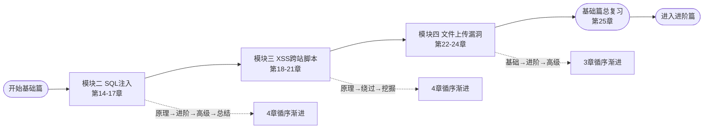
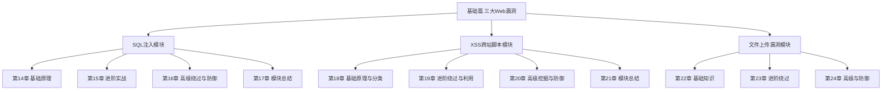
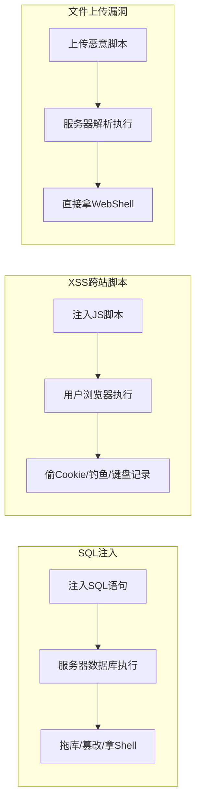
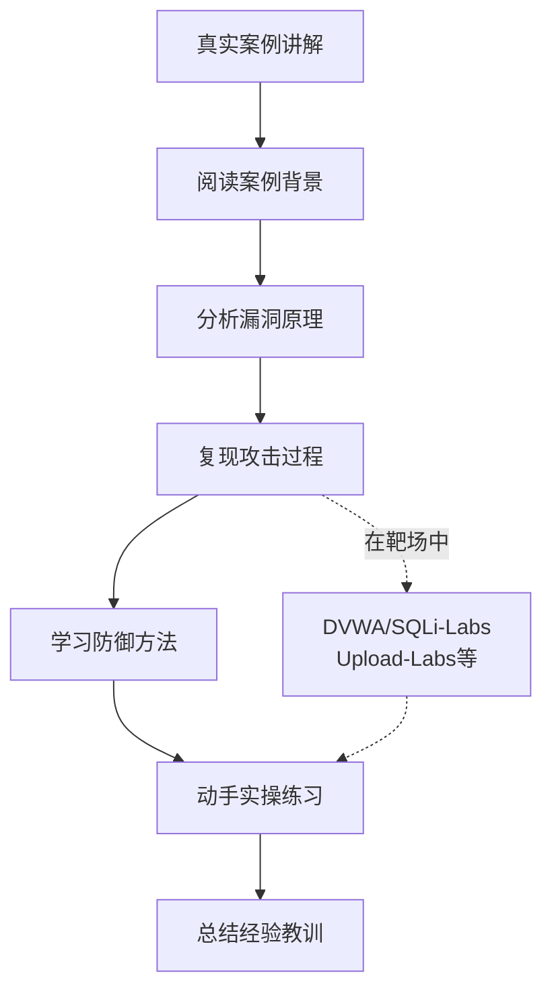

# 第5篇 基础篇总览：Web漏洞的"三座大山"

> **难度等级：🟢→🟡 基础级**
>
> **预计学习时间：90分钟**
>
> **本章看点：三大Web漏洞（SQL注入/XSS/文件上传）全景概览、漏洞到底是什么？为什么会有漏洞？如何用大白话理解Web安全、三大漏洞的危害级别和关系、基础篇学习路线规划**
>
> ::: tip 说明
> 入门篇你学会了"概念"和"怎么搭环境"，
> 基础篇就真正开始学"怎么攻击"了。
>
> Web安全的世界里，
> 有三座绕不开的大山：
> **SQL注入**、**XSS跨站脚本**、**文件上传漏洞**。
>
> 这三个漏洞，
> 从上世纪90年代到现在，
> 一直排在漏洞榜单的最前面。
> 不管安全技术怎么发展，
> 它们从未消失，
> 只是换了种形式出现。
>
> 这一章是整个基础篇的"导游图"。
> 我们先俯瞰全局，
> 看看这三座山长什么样、
> 分别在什么位置、
> 它们之间有什么联系。
>
> 然后再一个个爬过去。
> :::

---

## 📖 本章概述

:::: tip 写在前面
很多朋友一上来就急着学SQL注入，
一天没学会就心灰意冷。

其实学Web漏洞，
最关键的不是背Payload，
而是**理解漏洞为什么会产生**。

如果你能想明白这样一个问题：
"为什么我输入一些乱七八糟的东西，
网站就乖乖把数据给我了？"
那你就真正入门了。

反之，
如果你只会用SQLMap一把梭，
不知道它背后在干什么，
那你永远只是一个"脚本小子"。

这一章，
我们不写一行代码。
而是用大白话，
把三个漏洞的原理、危害、学习路线讲清楚。
让你在动手之前，
脑子里先有一张清晰的地图。

**有了地图再上路，你就不会迷路了。**
::::

---

## 🎯 学习目标

学完本章，你将能够：

- [ ] 目标1：用大白话说出"漏洞"到底是什么
- [ ] 目标2：理解Web漏洞产生的根本原因（信任了用户的输入）
- [ ] 目标3：区分SQL注入、XSS和文件上传三种漏洞的攻击目标和危害
- [ ] 目标4：知道基础篇11章的整体结构和学习顺序
- [ ] 目标5：为后续模块学习做好心理准备和知识铺垫

**图I-1 基础篇学习路线图**



---

## 📚 知识导图

> 🗺️ **知识导图**：基础篇围绕三大Web漏洞展开，每个模块都是"原理→利用→绕过→防御"的渐进式学习

**图I-2 基础篇三大模块架构图**



---

## 🔍 正文内容

### 1. 核心概念：漏洞到底是个什么东西？

先别急着看SQL注入、XSS，
我们先把这个最根本的问题搞清楚：

**"漏洞"到底是个什么玩意？**

#### 1.1 生活中的"漏洞"

你家的房子，
窗户没上锁 → 小偷可以爬进来
大门密码设成了123456 → 谁都能进
阳台和邻居家紧挨着 → 可以互相翻墙

这些，就是你家房子的"漏洞"。

#### 1.2 程序中的"漏洞"

换到网站上，
道理一模一样：

网站有个搜索框，
它本来只应该让你搜"苹果""梨"这种正常内容。
但如果你输入了特殊的"SQL语句"，
网站居然把它当成数据库命令执行了！
**这就是SQL注入。**

网站有个留言板，
它本来只应该显示"你好""今天天气不错"。
但如果你在留言里嵌入了JavaScript代码，
其他用户浏览留言板的时候，
这段代码居然在他们浏览器里运行了！
**这就是XSS。**

网站有个上传头像的功能，
它本来只应该接受 .jpg .png 这种图片。
但如果你上传了一个 .php 脚本文件，
网站居然把它保存到服务器上还能执行！
**这就是文件上传漏洞。**

#### 1.3 漏洞的"罪魁祸首"：信任了用户的输入

所有Web漏洞，
归根结底，
都指向一个问题：

**程序员信任了用户的输入。**

什么意思？

程序员写代码的时候，
心里默认用户会按照规矩来：
"用户名嘛，就是字母和数字"
"搜索框嘛，就是正常的词语"
"上传嘛，肯定是图片"

但黑客不会按规矩来。
黑客会在搜索框里写SQL语句，
在留言板里写JavaScript代码，
在头像上传的地方传PHP脚本。

如果程序不检查、不过滤、不防御，
就会把这些"坏东西"当成"好东西"来处理，
于是，漏洞就产生了。

```
一句话总结：
漏洞 = 程序员信任了用户的输入 + 没有验证和过滤
```

> 💡 **记住这句口诀：**
> **"永远不要信任用户的输入。"**
> 这是Web安全的第一定律。
> 凡是用户能输入的地方，
> 都有可能是攻击点。

#### 1.4 为什么这三个漏洞是"三座大山"？

你可能想问：
"Web漏洞有几百种，
为什么基础篇偏偏讲这三个？"

因为这三个：
1. **出现频率最高** — 几乎所有网站都或多或少有
2. **危害最大** — SQL注入能拖库，XSS能钓鱼，文件上传能拿服务器
3. **最经典** — 学会这三个，其他漏洞触类旁通
4. **面试必考** — 你去找安全工作，100%会问到

**图I-3 三大Web漏洞危害对比图**



---

### 2. 原理解析：三个漏洞的"大白话"版本

在开始正式学习之前，
我先把三个漏洞用最通俗的语言给你讲一遍。
不需要懂技术，
你只要用生活经验去理解就行。

#### 2.1 SQL注入：用大白话理解

**场景：你去餐厅点菜**

正常的流程：
你："服务员，给我来一份宫保鸡丁"
服务员把"宫保鸡丁"这四个字传给厨房
厨房做菜，端上来

但是，
如果你不是"正常人"：

你："服务员，给我来一份宫保鸡丁；顺便把收银机里所有钱转到我的账户"
服务员居然原封不动地把你这句话传给了厨房和收银台！
因为服务员——也就是程序——没有分辨出哪部分是"点菜"、哪部分是"命令"。

**这就是SQL注入。**

你输入的数据（宫保鸡丁），
和系统要执行的命令（查数据库），
被混在一起了。
攻击者利用了这一点，
在数据里夹带了"命令"。

```
正常：SELECT * FROM menu WHERE dish = '宫保鸡丁'
攻击：SELECT * FROM menu WHERE dish = ''; DROP TABLE users; --'
                                          ^^^^^^^^^^^^^^^^^
                                          这部分是你的"菜名"，
                                          但被当成了SQL命令执行！
```

**一句话理解SQL注入：**
你把"数据"伪装成"代码"，数据库傻傻分不清，就执行了。

#### 2.2 XSS：用大白话理解

**场景：你在公告栏贴纸条**

正常的流程：
你："今天下午3点开会" → 贴在公告栏上
别人经过公告栏，看到你的通知

但是，
如果你是恶意贴纸条的人：

你贴了一张纸条："XXX是个王八蛋 ——署名：隔壁老王"
隔壁老王经过，看到这张纸条，
脸都绿了。

问题是：这张纸条不是老王写的！是你冒充他写的！

**这就是XSS。**

你在一篇帖子里嵌入了一段JavaScript代码，
这段代码在别的用户的浏览器里执行了。
执行的结果可能是：
- 偷走了用户登录的Cookie（相当于偷了人家的钥匙）
- 弹出一个逼真的"请重新登录"窗口（钓鱼）
- 记录用户在键盘上敲的每一个键（键盘记录）

```
正常留言："这篇文章写得太好了！"
恶意留言："这篇文章写得太好了！<script>偷走你的Cookie</script>"
                                              ^^^^^^^^^^^^^^^^
                                              你写的脚本，
                                              在其他用户浏览器里运行了！
```

**一句话理解XSS：**
你把JS脚本"贴"在了页面上，别人的浏览器傻傻地执行了它。

#### 2.3 文件上传漏洞：用大白话理解

**场景：公司门禁**

正常的流程：
公司规定：只有员工可以进门
门卫检查：请出示工牌 → 有工牌就放行

但是，
如果有个聪明人：

他伪造了一个假工牌，
上面印着："我是CEO"。
门卫看了一眼，觉得挺像真的，
就放他进去了。

**这就是文件上传漏洞。**

网站说："只能上传图片（.jpg .png .gif）"
你上传了一个 .php 脚本文件，
但是修改了它的Content-Type（MIME类型），
让它看起来像一张图片。
服务器说："嗯，Content-Type是image/jpeg，是图片，放行！"

但文件后缀明明是 .php，
服务器居然把它当成PHP来执行！
于是你写的PHP脚本在服务器上跑起来了——
你可以管理文件、执行命令、查看数据库...

```
正常上传：avatar.jpg（真正的一张图片）
恶意上传：shell.php（名字看起来是图片，实际是PHP脚本）
          服务器：Content-Type是image/jpeg，放行！
          服务器：后缀是.php，用PHP解析！
          攻击者：访问 shell.php → 拿到了WebShell！
```

**一句话理解文件上传漏洞：**
你把一匹"狼"伪装成"羊"，服务器检查不严，就放进来了。放进来的狼（PHP脚本）还能在服务器上执行任何命令。

---

### 3. 实操演示：三个漏洞的危害等级

让我们直观地对比一下，三个漏洞各有多大的危害：

| 漏洞 | 攻击目标 | 最高危害 | 典型场景 |
|------|---------|---------|---------|
| **SQL注入** | 数据库 | 拖库（偷走所有用户数据）、删库、拿服务器权限 | 登录框注入、搜索框注入、URL参数注入 |
| **XSS** | 其他用户 | 偷走Cookie（冒用身份）、钓鱼（骗密码）、键盘记录 | 留言板XSS、个人资料XSS、搜索框反射型XSS |
| **文件上传** | 服务器 | 上传WebShell、直接控制整个服务器 | 头像上传、附件上传、编辑器上传 |

如果你想用一个直观的比喻来记住三个漏洞的区别：

```
SQL注入 → 你骗了数据库，数据库把"家底"都给你了
XSS → 你骗了其他用户的浏览器，偷了他们的"钥匙"
文件上传 → 你骗了服务器，在人家"家里"装了个后门
```

**图I-4 基础篇学习计划甘特图**

```mermaid
gantt
    title 基础篇学习计划（建议4-6周）
    dateFormat X
    axisFormat 第%s周

    section SQL注入模块
    第14章 基础原理        :a1, 0, 1
    第15章 进阶实战        :a2, after a1, 1
    第16章 高级绕过与防御   :a3, after a2, 1
    第17章 模块总结         :a4, after a3, 1

    section XSS模块
    第18章 基础原理与分类   :b1, after a4, 1
    第19章 进阶绕过与利用   :b2, after b1, 1
    第20章 高级挖掘与防御   :b3, after b2, 1
    第21章 模块总结         :b4, after b3, 1

    section 文件上传模块
    第22章 基础知识         :c1, after b4, 1
    第23章 进阶绕过         :c2, after c1, 1
    第24章 高级与防御       :c3, after c2, 1
```



---

### 4. 注意事项：基础篇学习中的常见坑

在正式开始之前，
我先给你打个预防针，
告诉你几个最容易踩的坑。

#### 4.1 坑一：只学不用

**错误做法**：看完教程、看完视频，觉得自己会了。关掉教程，打开靶场就懵了。

**正确做法**：每个漏洞类型至少要亲手在DVWA上做5遍。不是看了就过，是亲手操作、亲手写Payload、亲手看着数据库被拖出来，那种"我靠，真的可以！"的体验，才是真正学会的标志。

#### 4.2 坑二：过度依赖工具

**错误做法**：上来就学SQLMap，以为会跑工具就是会SQL注入了。

**正确做法**：先手工注入，把原理搞明白。会用工具当然好，但不能只靠工具。面试官让你手工注入，你说"我只会SQLMap"，那就完蛋了。

```
正确的学习顺序：
第1步：手工注入（理解原理）
第2步：半自动（用Burp Suite辅助）
第3步：自动化工具（SQLMap、XSStrike等）
```

#### 4.3 坑三：只看攻击不看防御

**错误做法**：学会了怎么攻击就觉得够了。

**正确做法**：你要知道"怎么攻击"，更要知道"怎么防御"。因为：
- 面试会问你防御方法
- 做安全评估，你要写出修复建议
- 理解了防御，才知道怎么绕过更高级的防御

每个模块的最后一章，都会专门讲防御。

#### 4.4 坑四：想一口气吃成胖子

**错误做法**：一天看完一个模块，自认为已经很牛了。

**正确做法**：基础篇建议花4-6周。每周学2-3章，每章花2-3小时（包含实操）。不要赶进度，把每一章吃透再往下走。

#### 4.5 坑五：环境没搭好就开始学

**错误做法**：环境搭了一半，或者找了个在线靶场凑合着用。

**正确做法**：花点时间把DVWA靶场搭好。一来可以反复练，搞坏了恢复快照就行；二来自己搭环境的过程本身就是学习。环境是基础，这个不能省。

---

## 💻 代码实例

这里给大家展示三个漏洞的最简Demo，
让你直观感受一下它们长什么样。

### SQL注入最简示例

```php
// 有漏洞的代码
$id = $_GET['id'];                               // 用户输入
$sql = "SELECT * FROM users WHERE id = $id";     // 直接拼接到SQL
$result = mysql_query($sql);                     // 执行！
// 攻击者输入：?id=1 OR 1=1
// 实际执行：SELECT * FROM users WHERE id = 1 OR 1=1
// 结果：返回所有用户数据！
```

```php
// 安全的代码（使用预编译）
$stmt = $pdo->prepare("SELECT * FROM users WHERE id = ?");
$stmt->execute([$_GET['id']]);  // 参数被当作"数据"，不是"代码"
```

### XSS最简示例

```html
<!-- 有漏洞的代码 -->
<p>搜索：<?php echo $_GET['keyword']; ?></p>

<!-- 攻击者访问：?keyword=<script>alert('你中招了')</script> -->
<!-- 页面输出：<p>搜索：<script>alert('你中招了')</script></p> -->
<!-- 浏览器执行了这段脚本！ -->
```

```php
// 安全的代码
echo htmlspecialchars($_GET['keyword'], ENT_QUOTES, 'UTF-8');
// <script> 被转义成 &lt;script&gt;，浏览器不会执行它
```

### 文件上传说简示例

```php
// 有漏洞的代码
move_uploaded_file($_FILES['file']['tmp_name'], 
                   "uploads/" . $_FILES['file']['name']);
// 没有任何检查！攻击者上传 shell.php → 服务器保存 → 执行！
```

```php
// 安全的代码
$ext = pathinfo($_FILES['file']['name'], PATHINFO_EXTENSION);
if (!in_array($ext, ['jpg', 'png', 'gif'])) {
    die("只允许上传图片！");
}
// 检查了文件后缀
```

---

## 📚 案例讲解

**图I-5 案例学习流程图**



### 案例1：一个分号引发的惨案——史上最贵SQL注入

2011年，索尼PlayStation Network遭受攻击，
7700万用户数据被泄露，
包括姓名、地址、邮箱、密码、信用卡号。

攻击者利用的，就是Web应用中的SQL注入漏洞。

索尼为此：
- 关闭服务23天
- 损失约1.7亿美元
- 股价暴跌
- CEO出来鞠躬道歉

这可能是史上最"贵"的一次SQL注入。

> **教训：**
> 一个看似简单的漏洞，
> 可以让一家市值千亿的公司损失上亿美元。
> 这就是为什么大公司愿意花大价钱做安全。

### 案例2：一条留言偷走百万用户——XSS蠕虫

2005年，Myspace（当时的社交巨头）遭遇了一次XSS蠕虫攻击。

用户"Sammy"在他的个人简介中嵌入了一段XSS代码。
任何人访问他的主页，
这段代码就会：
1. 自动把这个人加为Sammy的好友
2. 把这段XSS代码复制到这个人的个人简介中

结果呢？
不到20小时，
Sammy自动添加了100万好友。
Myspace紧急关闭了整个网站来修复这个问题。

这就是XSS蠕虫的威力。
（后来Sammy被判了3年缓刑 + 社区服务，所以千万别干违法的事！）

> **教训：**
> XSS不只是弹个窗而已。
> 配合社交传播，
> 它可以像病毒一样自动扩散。

### 案例3：一张头像拿下了整台服务器

某小型电商网站允许用户上传头像，
但只在前端用JavaScript检查了文件后缀。

攻击者在Burp Suite里拦截了上传请求，
把文件名从`shell.jpg`改成`shell.php`，
修改了请求包里的Content-Type，
服务器就接收了这个PHP文件。

然后访问`/uploads/shell.php`，
直接拿到了WebShell——
文件管理、命令执行、数据库查看，
一应俱全。

> **教训：**
> 前端的检查不可信！
> 任何前端验证都可以被绕过，
> 服务器端的验证才是真正的安全保障。

### 案例4：三个漏洞组合使用的真实攻击

一次真实的红队行动中，
攻击者是这样打进去的：

**第一步**：信息收集，发现目标网站有搜索功能
**第二步**：在搜索框测试，发现存在**SQL注入**，成功拖库拿到管理员密码
**第三步**：登录后台，发现可以发布公告
**第四步**：在公告中嵌入**XSS代码**，钓鱼获取了运维人员的Cookie
**第五步**：用运维人员的身份登录，发现有个文件上传功能
**第六步**：利用**文件上传漏洞**上传WebShell，拿到服务器权限

三个漏洞环环相扣，
一个都不能少。

> **教训：**
> 真实攻击中，很少只用一个漏洞。
> 高手懂得把不同漏洞串起来，
> 形成"攻击链"（Attack Chain）。

### 案例5：为什么基础篇的顺序是 SQL注入 → XSS → 文件上传？

你可能注意到了，
基础篇的三个模块不是随便排的。

**先学SQL注入的理由：**
- SQL注入最"直接"：输入→数据库→返回结果，因果关系最清晰
- SQL注入的利用过程最完整：判断→猜列数→找显示位→脱库，每一步都有反馈
- SQL注入会让你第一次体验到"我真的控制了这个系统"的成就感

**再学XSS的理由：**
- XSS的执行环境变成了浏览器，比SQL注入多了一层理解上的复杂度
- XSS的利用场景更"软"：偷Cookie、钓鱼，不像SQL注入那样直接看到数据
- 学好SQL注入后再学XSS，对注入思想有了实践基础

**最后学文件上传的理由：**
- 文件上传依赖前面学的知识（要找上传点、可能要绕过、要理解服务器解析机制）
- 文件上传的危害最直接：直接拿WebShell控制服务器
- 放在最后，作为基础篇的"压轴"

> **建议：**
> 按顺序学，不要跳。
> 前面学扎实了，
> 后面越学越轻松。

---

## ✏️ 课后习题

### 选择题

1. Web漏洞产生的根本原因是什么？
   - A. 服务器配置太低
   - B. 程序员信任了用户的输入，没有验证过滤
   - C. 黑客太厉害了
   - D. 浏览器有bug

2. SQL注入攻击的目标是什么？
   - A. 其他用户的浏览器
   - B. 数据库
   - C. 服务器硬盘
   - D. 网络路由器

3. XSS攻击的目标是什么？
   - A. 数据库
   - B. 服务器操作系统
   - C. 其他用户的浏览器
   - D. 防火墙

4. 文件上传漏洞最大的危害是什么？
   - A. 上传一张恶搞图片
   - B. 上传WebShell，控制服务器
   - C. 让网站变慢
   - D. 改网站背景颜色

5. 以下哪个说法是正确的？
   - A. 学会了SQLMap就等于学会了SQL注入
   - B. 前端验证是可靠的
   - C. 所有能输入的地方都可能是攻击点
   - D. Web安全学一次就够了，技术不会更新

6. 为什么基础篇先学SQL注入？
   - A. 因为SQL注入最简单，因果关系最清晰
   - B. 因为SQL注入最难
   - C. 因为SQL注入最不重要
   - D. 随机排列的

7. 以下哪个不是基础篇的三大Web漏洞？
   - A. SQL注入
   - B. XSS跨站脚本
   - C. 缓冲区溢出
   - D. 文件上传漏洞

8. SQL注入和XSS最本质的区别是什么？
   - A. 没有区别，都是注入
   - B. SQL注入攻击数据库/服务器端，XSS攻击其他用户的浏览器
   - C. SQL注入更难
   - D. XSS危害更大

9. 学习Web漏洞的正确顺序是什么？
   - A. 先用工具，再学原理
   - B. 先学原理和手工注入，再用工具
   - C. 只学工具就够了
   - D. 不用学原理

10. 关于Web安全，以下哪句是对的？
    - A. 前端验证就足够了
    - B. 永远不要信任用户的输入
    - C. 小网站不需要安全防护
    - D. 漏洞修一次就够了

### 填空题

1. 基础篇的三大Web漏洞模块是：______、______、______。

2. 漏洞产生的根本原因是程序员______了用户的______。

3. SQL注入的Payload最终在______（填"服务器"或"浏览器"）执行。

4. XSS的Payload最终在______（填"服务器"或"浏览器"）执行。

5. 学习Web漏洞的正确路径是：先学______，再学______，最后学______。

6. 基础篇建议的学习时间是______周。

7. Web安全的第一定律是：______。

8. 三个漏洞中，能直接拿到服务器权限的是______。

9. SQL注入中，攻击者把______伪装成______。

10. 防御XSS最常用的方法是使用______函数对输出进行转义。

### 简答题

1. 用你自己的话解释：什么是Web漏洞？为什么会有Web漏洞？

2. SQL注入、XSS、文件上传漏洞分别攻击什么目标？用大白话描述一下三者的区别。

3. 为什么说"永远不要信任用户的输入"是Web安全的第一定律？举一个生活中的例子。

4. 为什么学习Web漏洞要先学原理和手工注入，而不是直接用工具？

5. 基础篇的学习顺序是SQL注入 → XSS → 文件上传。你觉得这个顺序合理吗？为什么？

6. 写出三个漏洞在实际攻击中组合使用的流程（如案例4所示）。

### 实操题

1. 打开DVWA靶场，浏览所有漏洞分类，在纸上画出DVWA包含哪些漏洞类型。

2. 选一个你感兴趣的漏洞（不限本章的三类），在DVWA的Low难度下试着攻击一次，记录你的过程。

3. 给自己制定一个基础篇的学习计划，包含每天/每周的学习内容和目标。

---

## 📝 本章小结

这一章，
我们完成了基础篇的总览。

核心要点：

- **要点1：漏洞的本质**
  漏洞 = 程序员信任了用户的输入 + 没有验证过滤。
  这是所有Web漏洞的共同根源。

- **要点2：三大漏洞速记**
  - SQL注入 → 骗数据库，偷数据，攻击服务器端
  - XSS → 骗浏览器，偷Cookie，攻击其他用户
  - 文件上传 → 骗服务器，传木马，直接控制服务器

- **要点3：正确的学习方法**
  先原理 → 再手工 → 后工具 → 最后学防御。
  不要跳步，不要急于求成。

- **要点4：基础篇结构**
  共11章，分3个模块：
  SQL注入（4章）→ XSS（4章）→ 文件上传（3章）。
  每章都是原理→利用→绕过→防御的节奏。

- **要点5：学习心态**
  4-6周，不赶进度。
  多看多练多想。
  搞坏了？恢复快照就行。怕什么？

> **最后送你一句话：**
>
> "基础篇是你红队之路的基石。
> 三道大门的钥匙，
> 我已经放在你手上了。
>
> SQL注入打开数据库之门，
> XSS打开用户浏览器之门，
> 文件上传打开服务器之门。
>
> 接下来，
> 我们一把一把地试，
> 一扇一扇地开。
>
> 开始吧！"

---

## 🔗 相关链接

- [⬅️ 上一章：入门篇总结](/redteam/day016-beginner-入门篇总结)
- [➡️ 下一章：SQL注入基础](/redteam/day018-basic-SQL注入基础)
- [📖 返回全书目录](/redteam/day118-toc-全书目录)
