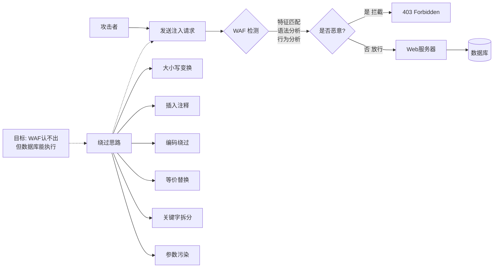
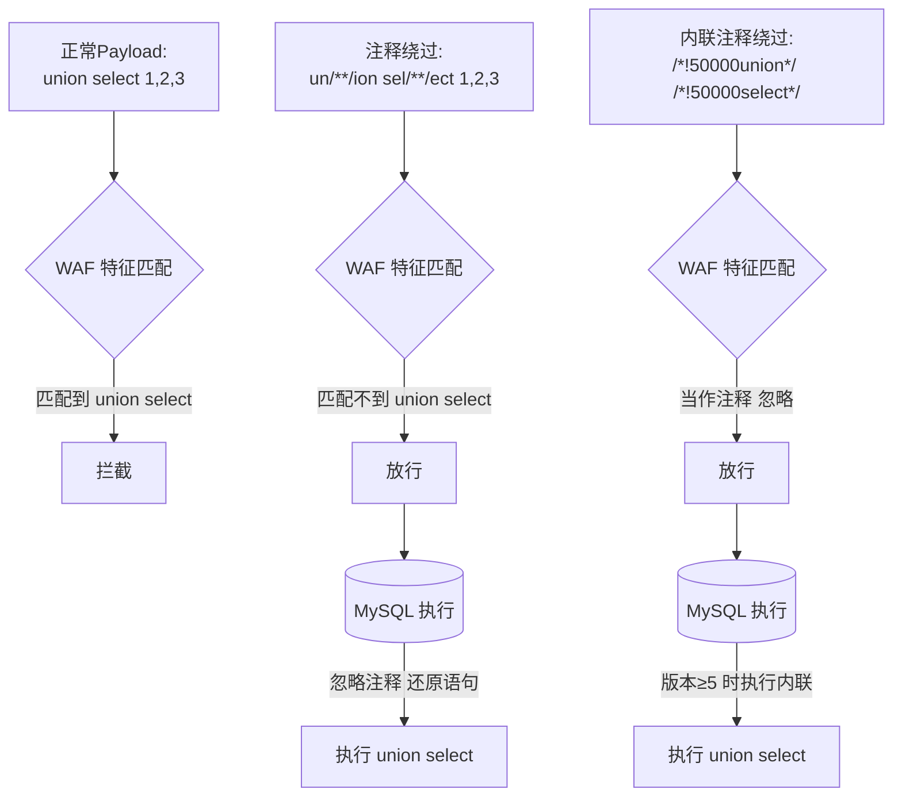
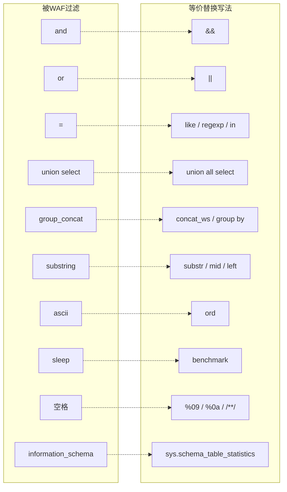
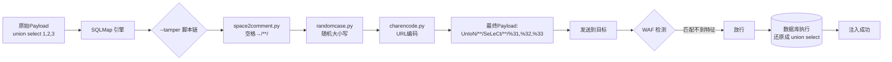
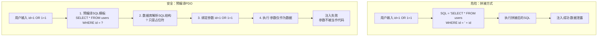
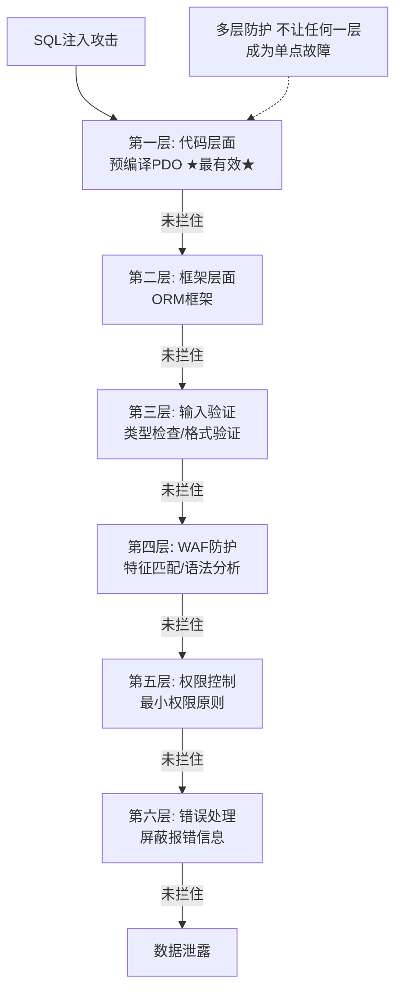
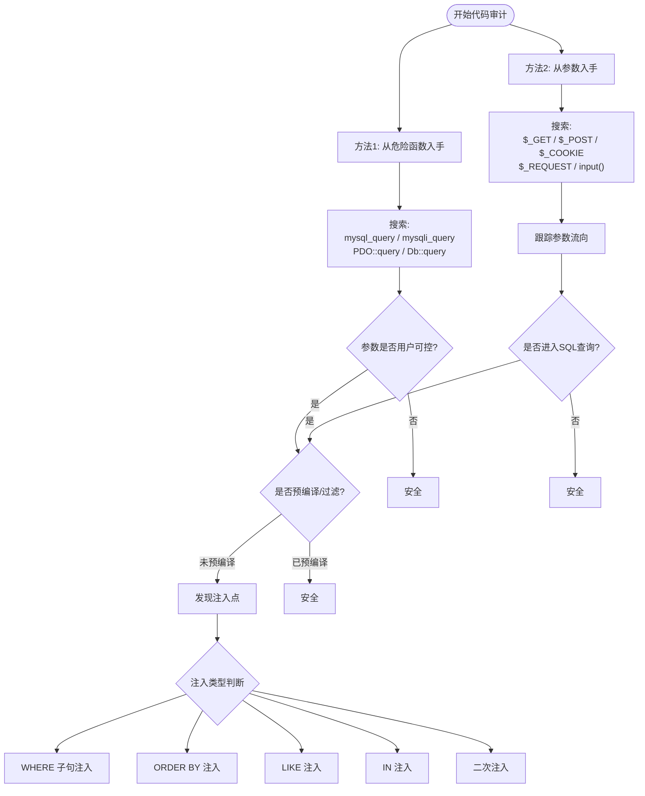

# 第16章 SQL注入高级：绕过与防御

> **难度等级：🟠 高等级**
>
> **预计学习时间：150分钟**
>
> **本章看点：WAF与绕过原理、注释符绕过、大小写绕过、编码绕过、内联注释绕过、等价函数绕过、SQLMap Tamper脚本、SQL注入防御方法、预编译PDO、代码审计找注入**
>
> ::: tip 说明
> 前面两章，
> 我们学了SQL注入的基础和进阶。
>
> 但是真实环境中，
> 很多网站都有防护，
> 比如WAF（Web应用防火墙）。
> 你一用union select，
> 就被拦截了。
>
> 这时候怎么办？
> 这就需要绕过技巧了。
>
> 这一章，
> 我们来讲讲SQL注入的绕过技巧，
> 还有SQL注入该怎么防御。
>
> 知己知彼，
> 百战不殆。
> 知道怎么防御，
> 才能更好地理解攻击。
> :::

---

## 📖 本章概述

::: tip 写在前面
很多新手觉得，
SQL注入不就是union select吗？
找个注入点，
拖库就完事了。

其实不是。
真实环境中，
你会遇到各种各样的防护：
- 关键字过滤
- 特殊字符过滤
- WAF防火墙
- 各种安全设备...

这时候，
你直接输`union select`，
要么被拦截，
要么返回403，
根本打不进去。

所以，
绕过技巧就很重要了。

这一章，
我们就来讲讲常见的绕过方法，
还有SQL注入该怎么防御。

学完这一章，
你对SQL注入的理解会更上一层楼。
:::

---

## 🎯 学习目标

读完本章，你将能够：

- [x] 理解WAF的工作原理和检测方式
- [x] 掌握常见的SQL注入绕过技巧
- [x] 会用注释符、大小写、编码绕过
- [x] 了解内联注释绕过
- [x] 知道等价函数和等价写法
- [x] 会使用SQLMap的Tamper脚本
- [x] 理解SQL注入的防御方法
- [x] 知道什么是预编译PDO
- [x] 有基本的代码审计思路

---

## 🛡️ WAF与绕过原理

### 1.1 什么是WAF？

**WAF，全称Web Application Firewall，
Web应用防火墙。**

简单说，
WAF就是网站的"保安"，
专门拦截恶意请求。

它工作在Web应用的前面，
所有发往Web服务器的请求，
都要先经过WAF检测。
如果WAF觉得这个请求是恶意的，
就会把它拦截下来。

WAF有两种：
- **硬件WAF**：一台专门的硬件设备，比较贵，大企业用
- **软件WAF**：软件形式的，比如安全狗、云锁、阿里云盾...

### 1.2 WAF怎么检测SQL注入？

WAF检测SQL注入，
主要有几种方式：

**1. 特征匹配**
最常见的方式。
WAF有一个规则库，
里面有各种SQL注入的特征。
比如：
- `union select`
- `or 1=1`
- `xp_cmdshell`
- `sleep(`
- `and 1=1`
- ...

如果你的请求里包含这些特征，
就会被拦截。

**2. 语法分析**
比较高级的WAF会解析SQL语法，
判断是不是SQL注入。
这种更难绕过。

**3. 行为分析**
通过分析请求的行为模式，
判断是不是攻击。
比如：
- 请求频率异常
- 请求参数异常
- 扫描行为
- ...

### 1.3 绕过的基本思路

绕过WAF的基本思路：
**让WAF认不出来这是SQL注入，
但是数据库还能正常执行。**

说简单点就是：
**骗过WAF，
但是对数据库要有效。**

> 💡 **深入理解：为什么绕过是可能的？**
>
> 这本质上是一个"不对等"的游戏：
>
> WAF（防守方）在"猜"你是不是攻击。
> 它只能看到HTTP请求的原始文本，
> 它不知道这段文本到了数据库之后会变成什么样。
>
> 而数据库（执行方）不管你是不是攻击，
> 它只管执行SQL语句。
>
> **这中间的"理解差异"就是绕过的空间。**
>
> 举个例子：
> ```
> 你发送：?id=1 UniOn SelEct 1,2,3
> 
> WAF看到的是："UniOn SelEct" — 大小写不对，但包含这些字母
>    → 如果WAF的规则是精确匹配小写"union select"，就检测不到
>    → 如果WAF做了大小写不敏感的匹配，就能检测到
>
> 数据库看到的是：UniOn SelEct
>    → MySQL不区分SQL关键字的大小写，照样正常执行！
> ```
>
> 你看，WAF的"识别能力"和数据库的"容错能力"之间有差异。
> 攻击者就是利用这些差异来绕过。
>
> 一个类比：
> WAF像一个看门大爷，
> 他的工作手册上写着："见到'张三'就拦下"。
> 你改了名字叫"張三"（繁体），
> 看门大爷翻了翻手册，没有"張三"这个人，放行了。
> 但你进去之后，跟里面的人说"我就是张三"，
> 里面的人认识你（数据库引擎不挑这种细节）。
>
> **绕过的本质 = 找到WAF规则和数据库解析之间的差异点。**

常见的绕过方向：
1. 变换大小写
2. 插入注释
3. 编码绕过
4. 等价替换
5. 拆分关键字
6. 利用参数污染
7. 利用HTTP参数污染
8. ...

**图16-1 WAF工作原理与绕过思路图**



---

## 🔄 常见绕过技巧

### 2.1 大小写绕过

有些WAF只匹配小写或者大写，
这时候我们可以用混合大小写来绕过。

比如：
```sql
-- 被拦截
union select

-- 换成混合大小写
UnIoN SeLeCt
UNION SELECT
Union Select
```

如果WAF只匹配小写的`union select`，
那混合大小写就能绕过。

> ⚠️ 注意：
> MySQL对关键字是大小写不敏感的，
> 所以`union`和`UNION`和`Union`都是一样的。
> 只要数据库不敏感，
> 我们就可以用大小写变换来绕过。

### 2.2 注释符绕过

在SQL语句里，
注释是不执行的。
我们可以在关键字中间插入注释，
来绕过WAF的特征匹配。

**常见注释符：**
- `-- `：单行注释（注意后面有个空格）
- `#`：单行注释（MySQL）
- `/*...*/`：多行注释

**绕过示例：**

```sql
-- 正常写法（被拦截）
union select

-- 插入注释
union/*fack*/select
union/**/select
union/*abc123*/select

-- 更多变体
un/**/ion sel/**/ect
u/**/nion s/**/elect
```

WAF匹配的是`union select`，
但是我们在中间插了注释，
WAF可能就认不出来了。
但是数据库执行的时候，
注释会被忽略，
还是正常的`union select`。

### 2.3 空格绕过

有些WAF会检测空格，
或者关键字之间必须有空格才匹配。
这时候我们可以用其他字符代替空格。

**可以代替空格的字符：**
- `%09`：Tab（水平制表符）
- `%0a`：换行
- `%0b`：垂直制表符
- `%0c`：换页
- `%0d`：回车
- `%a0`：空格（某些字符集）
- `/**/`：注释

**示例：**

```sql
-- 正常写法
union select 1,2,3

-- 用换行代替空格
union%0aselect%0a1,2,3

-- 用Tab代替空格
union%09select%091,2,3

-- 用注释代替空格
union/**/select/**/1,2,3
```

这样WAF可能就匹配不到了。

### 2.4 URL编码绕过

有些WAF在URL解码之前检测，
这时候我们可以用URL编码来绕过。

**一次URL编码：**
```sql
-- 正常
union select

-- URL编码
%75%6e%69%6f%6e%20%73%65%6c%65%63%74
```

**双重URL编码：**
有些WAF只解码一次，
那我们可以编码两次。

```sql
-- u的一次编码：%75
-- 二次编码：%%37%35 （因为%的编码是%25，7是%37，5是%35）
-- 不对，二次编码应该是对%75再编码
-- 正确：u -> %75 -> %25%37%35
```

**也可以只编码部分关键字：**
```sql
uni%6fn select
union sel%65ct
```

只编码一两个字符，
有时候也能绕过。

### 2.5 内联注释绕过（/*!...*/）

MySQL有个特殊的注释：
**内联注释** `/*!...*/`。

普通的`/*...*/`是注释，
里面的内容不会执行。
但是`/*!...*/`不一样，
里面的内容MySQL会执行，
但是其他数据库会把它当注释。

这是MySQL的一个特性。

**怎么用？**

```sql
-- 正常
union select

-- 内联注释
/*!union*//*!select*/

-- 更复杂
/*!union select*/

-- 带版本号的
/*!50000union*/ /*!50000select*/
```

`/*!50000xxx*/`的意思是：
如果MySQL版本大于等于5.00.00，
就执行里面的内容，
否则当注释。

很多WAF会忽略`/*!...*/`里面的内容，
觉得是注释，
但是MySQL会执行。
所以这是一个很常用的绕过方法。

**图16-2 注释符与内联注释绕过原理图**



### 2.6 等价函数和写法绕过

有些WAF过滤了某些关键字或函数，
这时候我们可以用等价的写法来代替。

**常见等价替换：**

| 被过滤 | 等价写法 |
|--------|----------|
| `and` | `&&` |
| `or` | `\|\|` |
| `=` | `like`、`regexp`、`in` |
| `space` | `%09`、`%0a`、`%0b`... |
| `union select` | `union all select` |
| `group_concat` | `concat_ws`、`group by` |
| `substring` | `substr`、`mid`、`left` |
| `ascii` | `ord` |
| `sleep` | `benchmark` |
| `information_schema` | `sys.schema_table_statistics` |
| `-- ` | `#` |

**示例：**

```sql
-- 被过滤了and
id=1 and 1=1

-- 换成&&
id=1 && 1=1

-- 被过滤了=
id=1 and user()='root'

-- 换成like
id=1 and user() like 'root%'

-- 被过滤了sleep
id=1 and sleep(5)

-- 换成benchmark
id=1 and benchmark(10000000, md5(1))
```

只要思想不滑坡，
方法总比困难多。

**图16-3 等价函数绕过对照图**



### 2.7 缓冲区溢出绕过

有些WAF有缓冲区大小限制，
如果请求特别长，
可能会绕过检测。

原理就是：
往请求里塞一大堆垃圾数据，
把WAF的检测缓冲区撑满，
后面的攻击Payload就检测不到了。

比如：
```
?id=1 and (select 1)=(Select 0xAAAAAAAAAAAAAAAAAAAAA...很多A...[这里放真正的注入语句])
```

不过这个方法现在不太好用了，
新的WAF一般都修复了这个问题。

### 2.8 HTTP参数污染（HPP）

HTTP参数污染，
就是同时传多个同名参数。

比如：
```
?id=1&id=2&id=3
```

不同的服务器处理方式不一样：
- 有些取第一个值
- 有些取最后一个值
- 有些把所有值拼起来

如果WAF和Web服务器的处理方式不一样，
就可能产生绕过。

比如：
WAF只检查第一个参数，
但是Web服务器用的是第二个参数。

那我们就可以：
```
?id=正常内容&id=注入语句
```

WAF检测到第一个参数是正常的，
就放行了。
但是服务器用的是第二个参数，
注入就成功了。

这个方法在某些特定环境下有用。

---

## 🛠️ SQLMap Tamper脚本

### 3.1 什么是Tamper脚本？

SQLMap有个很强大的功能：
**Tamper脚本。**

Tamper脚本就是用来修改Payload的，
可以自动对Payload做各种变换，
用来绕过WAF。

SQLMap自带了很多Tamper脚本，
存放在`tamper/`目录下。

Kali里的路径一般是：
`/usr/share/sqlmap/tamper/`

### 3.2 常用Tamper脚本

我给你列一些常用的：

| 脚本名 | 作用 |
|--------|------|
| `apostrophemask.py` | 把单引号编码成UTF-8 |
| `apostrophenullencode.py` | 把单引号替换成%00%27 |
| `base64encode.py` | Base64编码 |
| `between.py` | 用between替换>和= |
| `bluecoat.py` | 用%09代替空格，用like代替= |
| `chardoubleencode.py` | 双重URL编码 |
| `charencode.py` | URL编码 |
| `charunicodeencode.py` | Unicode编码 |
| `commalesslimit.py` | 用offset代替逗号（LIMIT的） |
| `commalessmid.py` | 用from for代替逗号（MID的） |
| `commentbeforeparentheses.py` | 在括号前加注释 |
| `concat2concatws.py` | 用CONCAT_WS代替CONCAT |
| `equaltolike.py` | 用like代替= |
| `greatest.py` | 用greatest代替> |
| `halfversionedmorekeywords.py` | 内联注释绕过 |
| `ifnull2casewhenisnull.py` | 用CASE WHEN IS NULL代替IFNULL |
| `ifnull2ifisnull.py` | 用IF IS NULL代替IFNULL |
| `informationschemacomment.py` | information_schema里加注释 |
| `least.py` | 用least代替< |
| `lowercase.py` | 全小写 |
| `modsecurityversioned.py` | 内联注释绕过（版本号） |
| `modsecurityzeroversioned.py` | 内联注释绕过（0版本号） |
| `multiplespaces.py` | 加很多空格 |
| `nonrecursivereplacement.py` | 双重替换绕过 |
| `overlongutf8.py` | 超长UTF-8编码 |
| `overlongutf8more.py` | 更多的超长UTF-8编码 |
| `percentage.py` | 在每个字符前加% |
| `plus2concat.py` | 用+号拼接字符串（MSSQL） |
| `plus2fnconcat.py` | 用ODBC函数拼接（MSSQL） |
| `randomcase.py` | 随机大小写 |
| `randomcomments.py` | 随机插入注释 |
| `securesphere.py` | 特殊的绕过脚本 |
| `sp_password.py` | 结尾加sp_password（MSSQL） |
| `space2comment.py` | 用/**/代替空格 |
| `space2dash.py` | 用-- 代替空格 |
| `space2hash.py` | 用#代替空格 |
| `space2morecomment.py` | 用/**_**/代替空格 |
| `space2morehash.py` | 用#代替空格（更多变体） |
| `space2mssqlblank.py` | MSSQL的空格替换 |
| `space2mssqlhash.py` | MSSQL的#替换 |
| `space2mysqlblank.py` | MySQL的空格替换 |
| `space2mysqldash.py` | MySQL的-- 替换 |
| `space2plus.py` | 用+代替空格 |
| `space2randomblank.py` | 随机空白字符代替空格 |
| `substring2leftright.py` | 用left和right代替substring |
| `symboliclogical.py` | 用&&和||代替and和or |
| `unionalltounion.py` | 用union select代替union all select |
| `unmagicquotes.py` | 宽字节注入（%df%27） |
| `uppercase.py` | 全大写 |
| `varnish.py` | Varnish防火墙绕过 |
| `versionedkeywords.py` | 关键字用内联注释包起来 |
| `versionedmorekeywords.py` | 更多的内联注释绕过 |
| `xforwardedfor.py` | 加XFF头绕过 |

### 3.3 怎么用Tamper脚本？

用`--tamper`参数指定脚本。

**用单个脚本：**
```bash
sqlmap -u "http://example.com/?id=1" --tamper space2comment.py
```

**用多个脚本：**
```bash
sqlmap -u "http://example.com/?id=1" --tamper space2comment.py,randomcase.py,charencode.py
```

多个脚本用逗号分隔，
按顺序依次处理。

**常用组合：**
```bash
-- tamper=space2comment.py
-- tamper=randomcase.py
-- tamper=charencode.py
-- tamper=versionedkeywords.py
-- tamper=space2comment.py,randomcase.py
-- tamper=space2comment.py,versionedmorekeywords.py
-- tamper=apostrophemask.py,equaltolike.py,base64encode.py
```

### 3.4 使用建议

1. **先判断有没有WAF**
   可以手工试试，
   输入`and 1=1`、`union select`之类的，
   看会不会被拦截。
   如果被拦截了，
   再考虑用Tamper。

2. **从简单的开始试**
   先试试`randomcase.py`、`space2comment.py`这些简单的，
   不行再试更复杂的。

3. **多个脚本组合用**
   有时候一个脚本不够，
   需要多个组合起来用。
   但是也不要加太多，
   不然Payload太长，
   反而容易出问题。

4. **了解原理**
   最好能理解每个Tamper脚本的原理，
   这样遇到问题才能自己调整。
   不要只会复制粘贴。

**图16-4 Tamper脚本工作流程图**



---

## 🛡️ SQL注入防御方法

### 4.1 为什么会有SQL注入？

SQL注入的根本原因：
**代码和数据没有分离。**

用户输入的数据，
被当成了代码执行。

所以防御的核心思路就是：
**把代码和数据分开。**

怎么分？
用预编译。

### 4.2 最有效的防御：预编译（PDO）

**预编译，就是SQL语句模板化。**

把SQL语句和参数分开：
- SQL语句用占位符（`?`或`:name`）代替参数
- 参数单独传递，不参与SQL语句的拼接

这样，
不管用户输入什么，
都只是"数据"，
不会被当成"代码"执行。

**PHP PDO示例：**

```php
<?php
// 连接数据库
$pdo = new PDO('mysql:host=localhost;dbname=test', 'user', 'pass');

// 有SQL注入的写法（危险！）
$id = $_GET['id'];
$sql = "SELECT * FROM users WHERE id = $id";  // 直接拼接，危险！
$stmt = $pdo->query($sql);

// 预编译写法（安全！）
$id = $_GET['id'];
$sql = "SELECT * FROM users WHERE id = ?";  // 用?占位
$stmt = $pdo->prepare($sql);  // 预编译
$stmt->execute([$id]);  // 传入参数
$user = $stmt->fetch();
?>
```

看，
预编译的写法，
SQL语句和参数是分开的，
参数不会被拼接到SQL语句里，
自然就不会有注入了。

**再看一个字符型的例子：**

```php
<?php
// 有注入的写法
$username = $_POST['username'];
$sql = "SELECT * FROM users WHERE username = '$username'";

// 预编译写法
$username = $_POST['username'];
$sql = "SELECT * FROM users WHERE username = :username";
$stmt = $pdo->prepare($sql);
$stmt->execute([':username' => $username]);
?>
```

不管用户输入什么，
都只是参数值，
不会影响SQL语句的结构。

预编译是目前为止
**最有效、最推荐**的SQL注入防御方法。

> 💡 **深入理解：预编译到底在数据库里做了什么？**
>
> 很多同学记住了"用PDO防注入"，但不理解它为什么能防。
> 这背后涉及数据库处理SQL的两个阶段：
>
> ```
> 普通查询（拼接方式）：
> ┌─────────────────────────────────────────────────┐
> │  SQL字符串来了 → 数据库一次性处理               │
> │  1. 解析（parse）：分析语法，区分关键字和数据    │
> │  2. 优化（optimize）：生成执行计划               │
> │  3. 执行（execute）：跑结果                      │
> │                                                  │
> │  问题：解析时，用户输入和SQL混在一起，           │
> │        数据库分不清哪个是"代码"哪个是"数据"      │
> └─────────────────────────────────────────────────┘
>
> 预编译查询：
> ┌─────────────────────────────────────────────────┐
> │  第一步：PREPARE（准备阶段）                     │
> │  SQL模板来了："SELECT * FROM users WHERE id = ?"│
> │  数据库解析它、优化它、生成执行计划               │
> │  关键：数据库已经完全确定了SQL的"骨架"结构        │
> │        ? 占位符被标记为"参数位置"，不是"代码位置" │
> │                                                  │
> │  第二步：EXECUTE（执行阶段）                      │
> │  参数来了："1 OR 1=1"                           │
> │  数据库把它当成"参数值"，填回?的位置              │
> │  关键：这时候SQL的"骨架"已经固定了！             │
> │        "1 OR 1=1"只是一个字符串值，               │
> │        数据库不会对它做第二次解析！               │
> └─────────────────────────────────────────────────┘
> ```
>
> **核心要点：**
> 预编译把SQL的处理分成了两个阶段。
> 在PREPARE阶段，SQL的"结构"就确定了。
> 到EXECUTE阶段，即使传进来的参数里包含 `OR 1=1`，
> 数据库也只会把它当作一个字段值，不会再"重新解析"为SQL关键字。
>
> 用生活中的例子来理解：
> - **拼接方式** = 你给秘书一张纸，上面写着"把张三的所有记录给我"，秘书照做。但万一有人偷偷加了一句"顺便把数据库删掉"在上面，秘书也照做！
> - **预编译** = 你先告诉秘书一个固定模板"我要查_某个人_的所有记录"，秘书记下来。然后你再告诉她"查张三"。秘书只会把"张三"填到"某个人"的位置。即使你说"查'张三;顺便删除数据库'"，秘书也只会把这个奇怪的短语当成一个名字去查，不会执行"删除数据库"。
>
> **所以预编译不是"过滤"了注入语句，而是从根本上杜绝了注入的可能性——它让SQL的结构和参数在时间上彻底分离了。**

**图16-5 预编译PDO原理图**



### 4.3 其他防御方法

除了预编译，
还有一些其他的防御方法，
可以作为补充。

#### 4.3.1 输入验证和过滤

对用户输入进行验证和过滤，
比如：
- 数字类型的参数，检查是不是数字
- 字符串类型的参数，过滤危险字符
- 限制输入长度
- 限制输入格式（比如邮箱、手机号）

但是单纯的过滤是不可靠的，
因为绕过方法太多了。
只能作为辅助手段。

#### 4.3.2 使用ORM框架

ORM（对象关系映射）框架，
比如：
- PHP的Laravel Eloquent、ThinkPHP ORM
- Java的MyBatis、Hibernate
- Python的SQLAlchemy、Django ORM

这些框架底层一般都是用预编译的，
只要正确使用，
就能避免SQL注入。

但是要注意：
如果ORM里用了原生SQL，
并且拼接了用户输入，
还是会有注入。

#### 4.3.3 部署WAF

WAF可以拦截大部分常见的SQL注入攻击，
是很好的防护手段。

但是WAF也不是万能的，
高级的攻击还是可能绕过。
所以WAF是"锦上添花"，
不能代替代码层面的防御。

#### 4.3.4 最小权限原则

数据库账号的权限不要太大，
比如：
- Web应用的数据库账号，只给SELECT、INSERT、UPDATE权限
- 不要用root账号连接数据库
- 不同的业务用不同的数据库账号

这样就算被注入了，
危害也会小很多。

#### 4.3.5 错误信息屏蔽

不要把数据库的报错信息直接显示给用户，
不然会泄露很多信息，
方便攻击者进行报错注入。

生产环境应该关闭错误显示，
把错误记录到日志里。

### 4.4 防御误区

有些常见的防御方法其实不靠谱，
我给你列一下：

**1. 只过滤单引号**
很多人觉得把单引号过滤掉就安全了，
其实不是。
数字型注入根本不需要单引号。
还有各种编码绕过。

**2. 用addslashes()转义**
`addslashes()`会把单引号、双引号、反斜杠、NULL转义。
但是：
- 数字型注入没用
- 宽字节注入可以绕过
- 其他编码也可能绕过

**3. 用黑名单过滤关键字**
比如过滤`union`、`select`、`and`、`or`...
但是：
- 可以用大小写绕过
- 可以用注释绕过
- 可以用等价写法绕过
- 黑名单永远列不全

**4. 觉得有WAF就安全了**
WAF只是辅助，
不是万能的。
代码层面的安全才是根本。

> 💡 记住：
> **预编译是最好的防御，
> 没有之一。
> 其他都是辅助。**

**图16-6 SQL注入防御层次图**



---

## 🔍 代码审计找SQL注入

### 5.1 什么是代码审计？

**代码审计，就是检查代码里有没有漏洞。**

找SQL注入，
就是找"用户可控的参数"
有没有被"带入数据库查询"。

只要满足这两个条件，
就可能有SQL注入。

### 5.2 怎么找？

找SQL注入的基本思路：
1. 找所有数据库查询的地方
2. 看查询语句里的参数是不是用户可控的
3. 看有没有做过滤或预编译

**从危险函数入手：**

PHP里常见的数据库查询函数：
- `mysql_query()`
- `mysqli_query()`
- `PDO::query()`
- `$db->query()`
- `M()->query()`（ThinkPHP）
- `Db::query()`（ThinkPHP5+）
- ...

全局搜索这些函数，
一个个看。

**从参数入手：**
找所有`$_GET`、`$_POST`、`$_COOKIE`、`$_REQUEST`...
看这些参数最后传到哪里去了，
有没有被带入数据库查询。

### 5.3 常见的注入点

代码审计中，
常见的SQL注入点：

**1. 直接拼接SQL**
```php
$id = $_GET['id'];
$sql = "SELECT * FROM users WHERE id = $id";
mysql_query($sql);
```
最明显的注入。

**2. 用单引号拼接**
```php
$username = $_POST['username'];
$sql = "SELECT * FROM users WHERE username = '$username'";
```
字符型注入。

**3. in/order by/limit等位置**
```php
$order = $_GET['order'];
$sql = "SELECT * FROM users ORDER BY $order";
```
order by后面的参数，
预编译搞不定，
容易出问题。

**4. like查询**
```php
$keyword = $_GET['keyword'];
$sql = "SELECT * FROM users WHERE username LIKE '%$keyword%'";
```
like语句里的变量，
也要注意。

**5. 数组参数**
```php
$ids = $_GET['ids'];
$sql = "SELECT * FROM users WHERE id IN ($ids)";
```
in里面的参数，
如果是用户可控的，
也可能有注入。

**6. 二次注入**
先存到数据库，
取出来再用的时候没过滤。
这种比较隐蔽。

### 5.4 审计工具

手工审计比较慢，
可以用工具辅助：

**PHP：**
- RIPS
- Seay源代码审计系统
- X-Scan

**Java：**
- FindBugs
- Fortify
- 阿里云效代码审计

**Python：**
- Bandit
- py-find-injection

**通用：**
- SonarQube
- CodeQL

工具可以提高效率，
但是不能完全依赖工具。
工具只能发现一些明显的问题，
复杂的逻辑漏洞还是得靠人。

**图16-7 代码审计找SQL注入流程图**



---

## 📚 案例讲解

### 案例1：从被WAF拦截到绕过成功

小郑做渗透测试，
遇到一个网站，
有SQL注入，
但是有WAF。

他一开始输入`1 and 1=1`，
直接返回403 Forbidden。
WAF拦截了。

他试了试`1'`，
也被拦截了。

看来常规的注入语句都不行。

怎么办？
试试绕过吧。

他先试了试大小写：
```
1 AnD 1=1
```
还是被拦截。

又试了试注释：
```
1 /*!and*/ 1=1
```
还是被拦。

再试试URL编码：
```
1 %61nd 1=1
```
也不行。

这WAF还挺严的。

他想了想，
试试内联注释加关键字拆分：
```
1 /*!50000and*/ 1=1
```
还是不行。

又试了试HTTP参数污染：
```
?id=1&id=2 and 1=1
```
也不行。

就在他快要放弃的时候，
他想到了一个方法：
**把所有空格都换成注释，
关键字用内联注释包起来，
再混合大小写。**

他构造了这样的Payload：
```
?id=1%0a/*!UnIoN*/%0a/*!SeLeCt*/%0a1,2,3
```

诶，
这次没被拦截！
页面正常返回了，
而且有注入结果！

成功绕过了WAF！

> 老K说：
> **"绕过WAF就像解谜游戏，
> 你得不断尝试，
> 找出WAF的规则盲点。
>
> 没有万能的绕过方法，
> 也没有万能的WAF。
> 就看谁更有耐心，
> 谁的思路更开阔。"**

### 案例2：只过滤了单引号的"安全"代码

小王是个PHP开发者，
他觉得自己写的代码很安全。
为什么？
因为他把所有用户输入的单引号都转义了。

他的代码是这样的：

```php
<?php
$id = $_GET['id'];
$id = addslashes($id);  // 转义特殊字符

$sql = "SELECT * FROM news WHERE id = $id";
$result = mysql_query($sql);
?>
```

他觉得，
我都用`addslashes()`转义了，
肯定安全了吧？

但是他忽略了一个问题：
**这是数字型的参数，
根本不需要单引号。**

比如输入：
```
?id=1 and 1=2
```

SQL语句变成：
```sql
SELECT * FROM news WHERE id = 1 and 1=2
```

根本没有单引号，
`addslashes()`完全没用！

所以这个"自认为安全"的代码，
其实有很明显的SQL注入。

> 给开发者的提醒：
> **不要想当然地觉得"我过滤了就安全了"。
> 你得先搞清楚漏洞的原理。
>
> 数字型注入根本不需要单引号，
> 你转义单引号有什么用？
>
> 最靠谱的方法还是预编译，
> 不要自己瞎过滤。**

### 案例3：Order By注入的巧妙利用

小林做代码审计，
看到这样一段代码：

```php
<?php
$order = $_GET['order'];
$sort = $_GET['sort'];

// 白名单验证
$allow_orders = ['id', 'name', 'date'];
if (!in_array($order, $allow_orders)) {
    $order = 'id';
}

$sql = "SELECT * FROM users ORDER BY $order $sort";
?>
```

`$order`有白名单，
看起来很安全。
那`$sort`呢？
`$sort`是排序方式，
应该是`asc`或`desc`。

但是代码里没有验证`$sort`！
那是不是可以注入？

`$order`是白名单，没问题。
但是`$sort`直接拼进去了。

如果输入：
```
?sort=desc, (select case when (1=1) then 1 else 2 end)
```

SQL变成：
```sql
SELECT * FROM users ORDER BY id desc, (select case when (1=1) then 1 else 2 end)
```

这样就能做布尔盲注了！
根据排序结果的不同，
来判断条件是否成立。

这就是`ORDER BY`注入。

> 经验之谈：
> **不是只有WHERE后面才有注入。
> ORDER BY、LIMIT、GROUP BY...
> 这些地方也可能有注入。
>
> 而且这些位置的注入，
> 预编译也不好处理，
> 只能靠白名单。
>
> 做代码审计的时候，
> 不要只看WHERE后面的参数，
> 其他地方也要检查。**

### 案例4：ThinkPHP框架注入漏洞

小周做代码审计，
目标是一个用ThinkPHP 5.x开发的网站。

他觉得用了框架应该很安全吧？
框架不是都用预编译吗？

但是他还是发现了注入。
在哪里呢？
在`order()`方法里。

代码是这样的：
```php
$order = input('get.order');
$list = Db::name('users')->order($order)->select();
```

`order()`方法的参数，
如果直接传入用户可控的变量，
是会有注入的！

因为ThinkPHP的`order()`方法，
底层是直接拼接到SQL里的，
没有用预编译。

（当然，新版本已经修复了，
但是老版本还是有问题的。）

所以就算用了框架，
也不能掉以轻心。
不是用了框架就一定安全，
还得看你怎么用。

> 送给新手的话：
> **框架只是工具，
> 能不能用好不在于框架，
> 而在于人。
>
> 就算是最安全的框架，
> 你瞎写也会有漏洞。
>
> 不要过度依赖框架，
> 安全意识才是最重要的。**

### 案例5：一次真实的SQL注入挖洞经历

小吴是个漏洞挖掘爱好者，
平时喜欢挖SRC赚点外快。

有一次他盯上了一个企业网站，
是个招聘网站。

他先测了搜索功能，
输入单引号，
页面没报错，
看起来没什么问题。

又测了各种GET参数，
也都没发现注入。

就在他准备换下一个目标的时候，
他注意到URL里有个参数：
```
?sort=salary
```

这是排序参数！
排序参数经常容易出问题。

他试了试：
```
?sort=salary desc
```
正常。

```
?sort=salary asc
```
也正常。

他又试了试报错：
```
?sort=(select 1 from (select count(*),concat(database(),floor(rand(0)*2))x from information_schema.tables group by x)a)
```

诶，
页面报错了！
而且报错信息里有数据库名！

有注入！
是floor报错注入！

他利用这个注入点，
把数据库整个拖了下来。
里面有几万条求职者信息，
还有企业用户的账号密码。

他提交了漏洞，
拿到了一笔五位数的奖金。

> 老K说：
> **"挖漏洞就像寻宝，
> 你得有耐心，
> 还得有思路。
>
> 不要只盯着那些明显的参数，
> 有时候突破口就在那些不起眼的地方。
>
> sort、order、page、limit...
> 这些参数都要测一测。
>
> 多思考，
> 多尝试，
> 说不定下一个挖到高危漏洞的就是你。"**

---

## ✏️ 课后习题

### 选择题

1. WAF的中文全称是？
   - A. Web应用防火墙
   - B. 网络防火墙
   - C. 入侵检测系统
   - D. 数据库防火墙

2. 以下哪个不是常见的绕过方法？
   - A. 大小写变换
   - B. 插入注释
   - C. URL编码
   - D. 增加参数

3. MySQL的内联注释是？
   - A. `-- `
   - B. `#`
   - C. `/*...*/`
   - D. `/*!...*/`

4. 以下哪个可以代替空格？
   - A. `%09`
   - B. `%0a`
   - C. `%0b`
   - D. 以上都可以

5. SQLMap中使用Tamper脚本的参数是？
   - A. `--script`
   - B. `--tamper`
   - C. `--bypass`
   - D. `--waf`

6. 防御SQL注入最有效的方法是？
   - A. 过滤单引号
   - B. 用addslashes()
   - C. 预编译PDO
   - D. 部署WAF

7. 以下哪个是预编译的占位符？
   - A. `*`
   - B. `?`
   - C. `$`
   - D. `%`

8. ORDER BY注入属于什么类型？
   - A. WHERE子句注入
   - B. ORDER BY子句注入
   - C. LIMIT子句注入
   - D. INSERT注入

9. 以下哪种防御方法最不可靠？
   - A. 预编译
   - B. 最小权限
   - C. 黑名单过滤关键字
   - D. 错误信息屏蔽

10. HTTP参数污染的英文缩写是？
    - A. XSS
    - B. CSRF
    - C. HPP
    - D. SSRF

### 填空题

1. WAF的全称是______。

2. MySQL的内联注释格式是______。

3. SQL注入绕过的基本思路是：骗过______，但对______有效。

4. 可以代替空格的字符有______、______、______等。（至少写3个）

5. SQLMap中使用Tamper脚本的参数是______。

6. 防御SQL注入最有效的方法是______。

7. PDO中，预编译用______方法，执行用______方法。

8. 二次注入的特点是：先______，后______的时候触发。

9. 代码审计找SQL注入，主要找______和______两个条件。

10. ORM框架的中文叫______。

### 简答题

1. WAF是怎么检测SQL注入的？有哪几种方式？

2. SQL注入绕过的基本思路是什么？

3. 列举至少5种SQL注入绕过的方法。

4. 什么是内联注释？怎么用来绕过WAF？

5. SQLMap的Tamper脚本是什么？有什么用？

6. 防御SQL注入最有效的方法是什么？原理是什么？

7. 只过滤单引号为什么不安全？

8. 为什么说WAF不能代替代码层面的防御？

9. 代码审计中，怎么找SQL注入？有什么思路？

10. 用了ORM框架就一定安全吗？为什么？

### 实操题

1. 绕过练习：
   - 搭建一个有简单过滤的环境（比如过滤了union和select）
   - 试试用各种方法绕过
   - 大小写、注释、编码、内联注释...
   - 看看哪些方法有效

2. Tamper脚本练习：
   - 在DVWA上测试（可以加个简单的WAF规则模拟）
   - 试试SQLMap的各种Tamper脚本
   - 看看每个脚本生成的Payload是什么样的
   - 理解每个脚本的原理

3. 安全代码编写：
   - 写一个有SQL注入漏洞的PHP页面
   - 然后用PDO预编译改写成安全的版本
   - 测试一下注入还能不能用
   - 理解为什么预编译能防注入

4. 代码审计练习：
   - 找一套开源的PHP程序（比如老版本的CMS）
   - 试试手工审计找SQL注入
   - 或者用代码审计工具辅助
   - 看能不能找到漏洞

5. WAF测试：
   - 如果条件允许，装一个软件WAF（比如安全狗、云锁）
   - 测试它的拦截规则
   - 试试各种绕过方法
   - 看看哪些能绕过，哪些不能

---

## 📝 本章小结

这一章，
我们学习了SQL注入的绕过与防御。

总结一下重点：

1. **WAF与绕过原理**
   - WAF是Web应用防火墙，拦截恶意请求
   - 检测方式：特征匹配、语法分析、行为分析
   - 绕过思路：骗过WAF，对数据库有效

2. **常见绕过技巧**
   - 大小写绕过
   - 注释符绕过
   - 空格绕过
   - URL编码绕过
   - 内联注释绕过（/*!...*/）
   - 等价函数和写法绕过
   - HTTP参数污染
   - 缓冲区溢出绕过

3. **SQLMap Tamper脚本**
   - 什么是Tamper脚本
   - 常用的Tamper脚本有哪些
   - 怎么使用Tamper脚本
   - 使用建议

4. **SQL注入防御**
   - 最有效：预编译PDO
   - 其他方法：输入验证、ORM、WAF、最小权限、错误屏蔽
   - 防御误区：只过滤单引号、addslashes、黑名单、有WAF就安全

5. **代码审计**
   - 什么是代码审计
   - 怎么找SQL注入
   - 常见的注入点
   - 审计工具

> 最后送你一句话：
> **"攻击和防御是一体两面。
> 懂攻击才能更好地防御，
> 懂防御才能更好地攻击。
>
> 不要只学攻击不学防御，
> 也不要只学防御不学攻击。
> 两者都懂，
> 你才能成为真正的高手。"**

---

## 🔗 相关链接

- [⬅️ 上一章：---](/redteam/day019-basic-SQL注入进阶)
- [➡️ 下一章：---](/redteam/day021-basic-SQL注入模块总结)
- [📖 返回全书目录](/redteam/day118-toc-全书目录)
