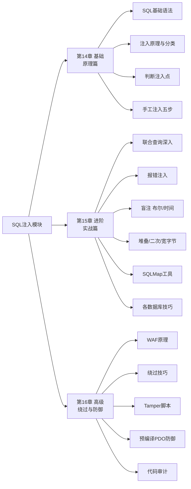
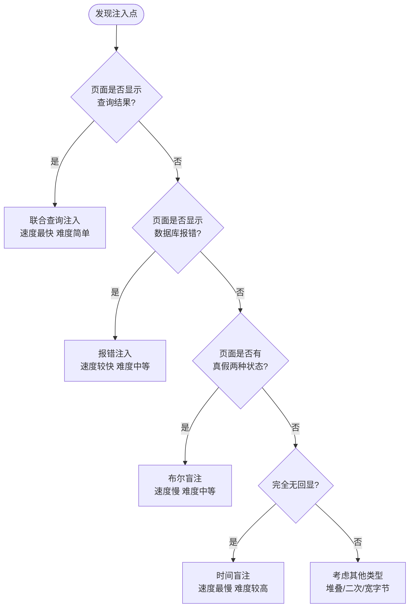
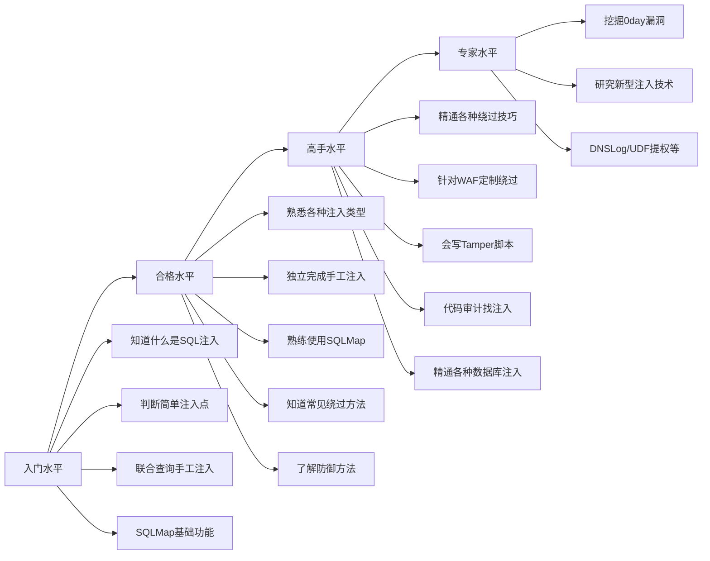
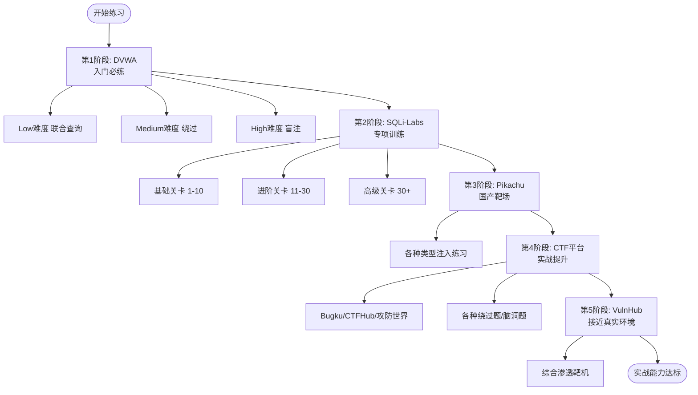

# 第17章 总结与回顾：SQL注入模块

> **难度等级：🟢 简单级**
>
> **预计学习时间：60分钟**
>
> **本章看点：SQL注入知识体系梳理、核心知识回顾、常见问题解答、学习路线建议、综合练习与测试**
>
> ::: tip 说明
> 恭喜你！
>
> SQL注入模块到这里就结束了。
>
> 这一章，
> 我们来做个总结，
> 把前三章的内容串起来，
> 帮你梳理知识体系，
> 也解答一些常见问题。
>
> 学完这一章，
> 你对SQL注入就有了一个完整的认识。
> 接下来，
> 我们就进入下一个模块：XSS。
> :::

---

## 📖 本章概述

::: tip 写在前面
SQL注入三章内容，
从基础到进阶到高级绕过，
内容还是挺多的。

不知道你吸收了多少？

这一章，
我们就来好好回顾一下，
把这些知识串起来，
形成一个完整的知识体系。

同时，
我也会给你一些学习建议，
告诉你SQL注入学到什么程度算合格，
接下来该怎么继续深入。

让我们开始吧！
:::

---

## 🎯 学习目标

读完本章，你将能够：

- [x] 梳理SQL注入的完整知识体系
- [x] 回顾核心知识点，查缺补漏
- [x] 知道SQL注入的学习路径
- [x] 了解SQL注入常见问题
- [x] 检验自己的学习成果

---

## 🗺️ SQL注入知识体系

### 1.1 三章内容总览

SQL注入模块一共三章：

```
SQL注入模块
├── 第14章：SQL注入基础 —— 原理篇
│   ├── SQL基础语法
│   ├── 什么是SQL注入
│   ├── SQL注入的分类
│   ├── 如何判断注入点
│   └── 手工注入基本步骤
│
├── 第15章：SQL注入进阶 —— 实战篇
│   ├── 联合查询深入
│   ├── 报错注入详解
│   ├── 盲注详解（布尔+时间）
│   ├── 其他注入类型（堆叠/二次/宽字节）
│   ├── 各种位置的注入
│   ├── SQLMap从入门到精通
│   └── 各数据库注入技巧
│
└── 第16章：SQL注入高级 —— 绕过与防御
    ├── WAF与绕过原理
    ├── 常见绕过技巧
    ├── SQLMap Tamper脚本
    ├── SQL注入防御方法
    └── 代码审计找注入
```

**图17-1 SQL注入模块三章知识体系图**



### 1.2 知识体系图

如果用一张图来表示SQL注入的知识体系：

```
SQL注入
├── 基础
│   ├── SQL语法（增删改查、常用函数、information_schema）
│   ├── 注入原理（代码与数据未分离）
│   ├── 注入条件（参数可控 + 带入查询）
│   └── 注入危害（拖库、篡改、提权）
│
├── 分类
│   ├── 按位置分：GET/POST/Cookie/Header...
│   ├── 按数据类型分：数字型/字符型
│   └── 按返回结果分
│       ├── 显注
│       │   ├── 联合查询注入
│       │   └── 报错注入
│       └── 盲注
│           ├── 布尔盲注
│           └── 时间盲注
│
├── 利用
│   ├── 联合查询注入
│   │   ├── 判断注入
│   │   ├── ORDER BY猜列数
│   │   ├── UNION找显示位
│   │   └── 脱库：库→表→列→数据
│   ├── 报错注入（extractvalue/updatexml/floor）
│   ├── 盲注（布尔盲注/时间盲注）
│   ├── 其他类型（堆叠/二次/宽字节）
│   └── 工具使用（SQLMap）
│
├── 绕过
│   ├── 大小写绕过
│   ├── 注释绕过
│   ├── 空格绕过
│   ├── 编码绕过
│   ├── 内联注释绕过
│   ├── 等价函数绕过
│   ├── HPP参数污染
│   └── Tamper脚本
│
└── 防御
    ├── 预编译PDO（最有效）
    ├── 输入验证
    ├── ORM框架
    ├── WAF
    ├── 最小权限
    └── 错误信息屏蔽
```

是不是很清晰？

**图17-2 SQL注入完整知识体系思维导图**

```mermaid
flowchart TD
    Root[SQL注入完整知识体系]

    Root --> Base[基础]
    Root --> Class[分类]
    Root --> Use[利用]
    Root --> Bypass[绕过]
    Root --> Def[防御]

    Base --> B1[SQL语法]
    Base --> B2[注入原理]
    Base --> B3[注入条件]
    Base --> B4[注入危害]

    Class --> C1[按位置:GET/POST/Cookie/Header]
    Class --> C2[按类型:数字型/字符型]
    Class --> C3[按返回:显注/盲注]

    Use --> U1[联合查询]
    Use --> U2[报错注入]
    Use --> U3[布尔盲注]
    Use --> U4[时间盲注]
    Use --> U5[堆叠/二次/宽字节]
    Use --> U6[SQLMap工具]

    Bypass --> P1[大小写/注释/空格]
    Bypass --> P2[URL编码]
    Bypass --> P3[内联注释]
    Bypass --> P4[等价函数]
    Bypass --> P5[HPP参数污染]
    Bypass --> P6[Tamper脚本]

    Def --> D1[预编译PDO ★最有效★]
    Def --> D2[ORM框架]
    Def --> D3[输入验证]
    Def --> D4[WAF]
    Def --> D5[最小权限]
    Def --> D6[错误屏蔽]
```



---

## 🧠 核心知识回顾

### 2.1 SQL注入原理

**一句话记住：**
> 用户输入的数据被当成SQL代码执行了。

**两个条件：**
1. 参数用户可控
2. 参数被带入数据库查询

**根本原因：**
代码和数据没有分离。

### 2.2 手工注入五步走

联合查询注入的基本步骤：

```
1. 判断注入点
   - 加单引号看报错
   - and 1=1 / and 1=2 看变化

2. 猜列数
   - ORDER BY 1,2,3...

3. 找显示位
   - UNION SELECT 1,2,3...

4. 查信息
   - database()、version()、user()...

5. 脱库
   - 库名（information_schema.schemata）
   - 表名（information_schema.tables）
   - 列名（information_schema.columns）
   - 数据
```

### 2.3 四种常用注入类型对比

| 类型 | 特点 | 适用场景 | 速度 | 难度 |
|------|------|----------|------|------|
| 联合查询 | 有显示位，直接看结果 | 页面显示查询结果 | 快 | 简单 |
| 报错注入 | 无显示位，有报错 | 页面显示数据库错误 | 较快 | 中等 |
| 布尔盲注 | 无显示无报错，页面有真假 | 页面有两种状态 | 慢 | 中等 |
| 时间盲注 | 完全无回显，靠延迟判断 | 所有方式都不行 | 最慢 | 较难 |

**图17-3 四种注入类型选择决策图**



### 2.4 information_schema三件套

MySQL 5.0+的信息_schema里，
最重要的三个表：

| 表名 | 存的内容 | 关键字段 |
|------|----------|----------|
| `information_schema.schemata` | 所有数据库 | `schema_name` |
| `information_schema.tables` | 所有表 | `table_name`、`table_schema` |
| `information_schema.columns` | 所有列 | `column_name`、`table_name`、`table_schema` |

记住这三个表，
脱库全靠它们。

### 2.5 常用函数速查

| 函数 | 作用 |
|------|------|
| `database()` | 当前数据库名 |
| `version()` | 数据库版本 |
| `user()` | 当前用户名 |
| `@@datadir` | 数据库路径 |
| `concat(a,b)` | 拼接a和b |
| `group_concat(col)` | 把列的多行拼成一行 |
| `substring(str, pos, len)` | 截取字符串 |
| `ascii(str)` | 转ASCII码 |
| `length(str)` | 字符串长度 |
| `sleep(n)` | 延迟n秒 |
| `if(cond, a, b)` | 条件判断 |
| `extractvalue()` | 报错注入用 |
| `updatexml()` | 报错注入用 |
| `load_file()` | 读文件 |
| `into outfile` | 写文件 |

### 2.6 绕过技巧汇总

| 绕过方法 | 原理 | 适用场景 |
|----------|------|----------|
| 大小写绕过 | WAF只匹配固定大小写 | WAF规则简单 |
| 注释绕过 | 在关键字中间插注释 | 特征匹配WAF |
| 空格绕过 | 用其他字符代替空格 | 检测空格的WAF |
| URL编码绕过 | 编码后特征变了 | WAF不解码或解码不全 |
| 内联注释 | MySQL特性/*!*/ | 忽略注释内容的WAF |
| 等价替换 | 用等价函数/写法 | 过滤了特定关键字 |
| HPP参数污染 | 同名参数多传 | WAF和服务器处理方式不同 |
| 缓冲区溢出 | 塞满垃圾数据绕过检测 | 有缓冲区限制的WAF |

### 2.7 防御方法对比

| 防御方法 | 效果 | 推荐度 | 说明 |
|----------|------|--------|------|
| 预编译PDO | 很好 | ⭐⭐⭐⭐⭐ | 最有效，推荐使用 |
| ORM框架 | 好 | ⭐⭐⭐⭐ | 正确使用的话很安全 |
| 输入验证/白名单 | 较好 | ⭐⭐⭐ | 辅助手段，不能单独用 |
| WAF | 一般 | ⭐⭐ | 辅助，容易被绕过 |
| 最小权限 | 好 | ⭐⭐⭐⭐ | 降低被入侵后的危害 |
| 错误信息屏蔽 | 一般 | ⭐⭐ | 防止报错注入，辅助手段 |
| 黑名单过滤 | 差 | ⭐ | 不可靠，容易绕过 |
| addslashes() | 差 | ⭐ | 只能防部分字符型注入 |

### 2.8 SQLMap常用参数

| 参数 | 作用 |
|------|------|
| `-u URL` | 指定目标URL |
| `-r 文件` | 从请求文件加载 |
| `-p 参数` | 指定测试参数 |
| `--data 数据` | POST数据 |
| `--cookie cookie` | Cookie值 |
| `--dbs` | 列所有数据库 |
| `-D 库名` | 指定数据库 |
| `--tables` | 列所有表 |
| `-T 表名` | 指定表 |
| `--columns` | 列所有列 |
| `-C 列名` | 指定列 |
| `--dump` | 导出数据 |
| `--current-db` | 当前数据库 |
| `--current-user` | 当前用户 |
| `--is-dba` | 是否是DBA |
| `--os-shell` | 获取系统Shell |
| `--sql-shell` | 获取SQL Shell |
| `--file-read 文件` | 读文件 |
| `--file-write 本地文件 --file-dest 目标路径` | 写文件 |
| `--tamper 脚本` | 使用Tamper脚本 |
| `--batch` | 自动确认，不用交互 |
| `--threads N` | 多线程 |
| `--level N` | 测试等级1-5 |
| `--risk N` | 风险等级1-3 |

---

## ❓ 常见问题解答

### 3.1 SQL注入学到什么程度算合格？

这个问题没有标准答案，
但是可以给你一个参考：

**入门水平：**
- 知道什么是SQL注入
- 能判断简单的注入点
- 会用联合查询手工注入
- 会用SQLMap基础功能

**合格水平：**
- 熟悉各种注入类型（联合、报错、盲注）
- 能独立完成手工注入
- 能熟练使用SQLMap
- 知道常见的绕过方法
- 了解SQL注入的防御方法

**高手水平：**
- 精通各种绕过技巧
- 能针对不同WAF定制绕过方案
- 会写SQLMap Tamper脚本
- 能做代码审计找注入
- 精通各种数据库的注入

对于新手来说，
达到合格水平就可以了。
后面可以在实战中慢慢提升。

**图17-4 SQL注入学习成长路径图**



### 3.2 手工注入重要还是工具重要？

**都重要，但是先学手工，再用工具。**

为什么？
- 手工注入帮你理解原理
- 工具帮你提高效率
- 工具跑不出来的时候，还得靠手工

就像学数学，
你得先会手算，
再用计算器。
不然计算器算出来的结果对不对，
你都不知道。

**建议：**
- 新手阶段：多练手工注入，把原理搞懂
- 熟练之后：用工具提高效率
- 遇到问题：回到手工，分析原因

### 3.3 SQL注入现在还有用吗？

当然有用！

虽然现在大家安全意识提高了，
但是SQL注入依然是OWASP Top 10里的常客，
真实环境中还是经常能遇到。

而且：
- 老系统、老网站很多还有SQL注入
- 新系统也可能因为开发者不注意出现注入
- CMS、框架也时不时爆出SQL注入漏洞
- 护网行动中，SQL注入还是常见的突破口

所以SQL注入还是很值得学的。

### 3.4 SQL注入和XSS哪个更重要？

都重要。
都是Web安全的核心漏洞。

如果非要比的话：
- **SQL注入**：危害更大，直接拖库，但是相对少一些了
- **XSS**：更普遍，出现频率更高，但是利用起来麻烦一些

都是必学的，
没有哪个更重要之说。
两个都得会。

### 3.5 打CTF对学SQL注入有帮助吗？

**非常有帮助！**

CTF里的SQL注入题，
各种类型、各种绕过都有，
非常锻炼人。

做CTF题的好处：
- 巩固基础知识
- 学习各种绕过技巧
- 锻炼思路和耐心
- 提高手工注入能力

建议：
学完基础之后，
去做一些CTF的SQL注入题，
进步会非常快。

### 3.6 怎么练习SQL注入？

推荐的练习路径：

1. **DVWA**：入门必练，从Low到High难度
2. **SQLi-Labs**：专门的SQL注入靶场，几十关，各种类型都有
3. **Pikachu**：国产靶场，也有SQL注入练习
4. **CTF平台**：Bugku、CTFHub、攻防世界...
5. **VulnHub**：虚拟机靶场，更接近真实环境

从简单到难，
一个一个练，
练得多了自然就会了。

**图17-5 SQL注入练习路径推荐图**



---

## 🚀 深入学习建议

### 4.1 下一步学什么？

SQL注入模块学完之后，
建议接下来学XSS。
XSS也是Web漏洞里的大头，
而且和SQL注入一样，
都是经典中的经典。

学完XSS之后，
再学文件上传、文件包含、命令执行、CSRF、SSRF...
把常见的Web漏洞都过一遍。

然后再学内网渗透、社工钓鱼...
一步一步来。

### 4.2 SQL注入怎么继续深入？

如果还想继续深入SQL注入，
可以往这几个方向：

1. **绕过研究**
   - 研究各种WAF的绕过
   - 学习新的绕过技巧
   - 自己写Tamper脚本

2. **代码审计**
   - 学习各种CMS的SQL注入
   - 审计框架的注入漏洞
   - 学习找0day的思路

3. **各数据库注入**
   - MSSQL注入深入
   - Oracle注入深入
   - PostgreSQL注入
   - NoSQL注入（MongoDB、Redis...）

4. **高级注入技术**
   - DNSLog外带注入
   - 注入写Shell的各种姿势
   - UDF提权、MOF提权
   - ...

### 4.3 学习资源推荐

**靶场：**
- DVWA：入门必练
- SQLi-Labs：SQL注入专项
- Pikachu：国产靶场
- CTFHub、Bugku、攻防世界：CTF平台

**文章/教程：**
- SQL注入天书
- SQL注入天书2
- 各种CTF Writeup

**工具：**
- SQLMap：注入神器
- BurpSuite：抓包改包
- 海蜘蛛、御剑：辅助工具

---

## 🧪 SQL注入综合测试

学了这么多，
来测一测你掌握了多少吧！

### 选择题（综合）

1. SQL注入的根本原因是？
   - A. 数据库有漏洞
   - B. 代码和数据没有分离
   - C. 网站用了PHP
   - D. 服务器不安全

2. 以下哪种注入类型速度最快？
   - A. 联合查询注入
   - B. 报错注入
   - C. 布尔盲注
   - D. 时间盲注

3. information_schema中，存储所有表名的表是？
   - A. schemata
   - B. tables
   - C. columns
   - D. databases

4. 以下哪个是MySQL的内联注释？
   - A. `-- `
   - B. `#`
   - C. `/*...*/`
   - D. `/*!...*/`

5. 防御SQL注入最有效的方法是？
   - A. 过滤单引号
   - B. 部署WAF
   - C. 预编译PDO
   - D. 用addslashes()

6. 时间盲注常用的函数是？
   - A. `sleep()`
   - B. `wait()`
   - C. `delay()`
   - D. `pause()`

7. SQLMap中，指定数据库的参数是？
   - A. `-T`
   - B. `-D`
   - C. `-C`
   - D. `-d`

8. 以下哪个不是常见的绕过方法？
   - A. 大小写变换
   - B. 插入注释
   - C. URL编码
   - D. 增加参数

9. 以下哪个位置一般不会有SQL注入？
   - A. GET参数
   - B. POST参数
   - C. Cookie
   - D. 页面标题

10. 二次注入的特点是？
    - A. 注入两次
    - B. 先存后取触发
    - C. 两个参数都有注入
    - D. 需要两个人配合

### 填空题（综合）

1. SQL注入的两个条件是：______和______。

2. 手工联合查询注入的五步是：判断注入点 → ______ → ______ → 查信息 → ______。

3. information_schema的三个重要表是：______、______、______。

4. 盲注分为______和______两种。

5. 报错注入常用的三个函数/方法是：______、______、______。

6. MySQL内联注释的格式是______。

7. 防御SQL注入最有效的方法是______。

8. SQLMap中，使用Tamper脚本的参数是______。

9. SQLMap中，导出数据的参数是______。

10. SQLMap中，从文件加载请求包的参数是______。

### 简答题（综合）

1. 用自己的话说说，什么是SQL注入？

2. 联合查询注入的基本步骤是什么？

3. 什么是盲注？布尔盲注和时间盲注有什么区别？

4. 什么是报错注入？原理是什么？

5. 列举至少5种SQL注入绕过的方法。

6. SQLMap有哪些常用功能？（至少说5个）

7. 防御SQL注入的方法有哪些？哪个最有效？

8. 为什么只过滤单引号不能防SQL注入？

9. 手工注入和工具注入各有什么优缺点？

10. 学完SQL注入模块，你有什么收获？接下来打算怎么学？

### 实操题（综合）

1. **DVWA通关挑战**
   - 打开DVWA，SQL Injection模块
   - 用手工注入的方式通关Low、Medium、High三个难度
   - 每个难度都用至少两种方法（联合、报错、盲注...）
   - 把过程和结果整理成笔记

2. **SQLi-Labs闯关**
   - 搭建SQLi-Labs靶场
   - 至少闯过前10关
   - 每一关都用手工注入做一遍
   - 然后再用SQLMap跑一遍
   - 对比差异

3. **SQLMap综合练习**
   - 选一个靶场（DVWA、SQLi-Labs都可以）
   - 用SQLMap完成：检测注入 → 查库 → 查表 → 查列 → 拖库
   - 试试不同的参数和功能
   - 试试Tamper脚本
   - 把常用参数整理成笔记

4. **绕过练习**
   - 自己写一个简单的WAF（比如过滤union、select、空格）
   - 然后尝试用各种方法绕过
   - 看看你能想到多少种绕过方法
   - 记录下来

5. **安全代码编写**
   - 写一个有SQL注入的登录页面
   - 然后用PDO预编译改写成安全版本
   - 测试注入是否还能用
   - 理解为什么预编译能防注入

---

## 📝 本章小结

这一章，
我们对SQL注入模块做了一个全面的总结和回顾。

主要内容包括：

1. **知识体系梳理**
   - 三章内容总览
   - 完整的知识体系图

2. **核心知识回顾**
   - SQL注入原理
   - 手工注入五步走
   - 四种注入类型对比
   - information_schema三件套
   - 常用函数速查
   - 绕过技巧汇总
   - 防御方法对比
   - SQLMap常用参数

3. **常见问题解答**
   - 学到什么程度算合格
   - 手工还是工具重要
   - SQL注入现在还有用吗
   - 和XSS哪个更重要
   - 怎么练习

4. **深入学习建议**
   - 下一步学什么
   - 怎么继续深入
   - 学习资源推荐

5. **综合测试**
   - 选择题、填空题、简答题、实操题
   - 检验学习成果

> 最后送你一句话：
> **"SQL注入是Web安全的入门必修课，
> 但是学完SQL注入只是开始。
> Web安全的世界很大，
> 还有更多精彩的内容等着你。
>
> 继续加油，
> 我们下一章见！"**

---

## 🔗 相关链接

- [⬅️ 上一章：---](/redteam/day020-basic-SQL注入高级)
- [➡️ 下一章：---](/redteam/day022-basic-XSS基础)
- [📖 返回全书目录](/redteam/day118-toc-全书目录)
