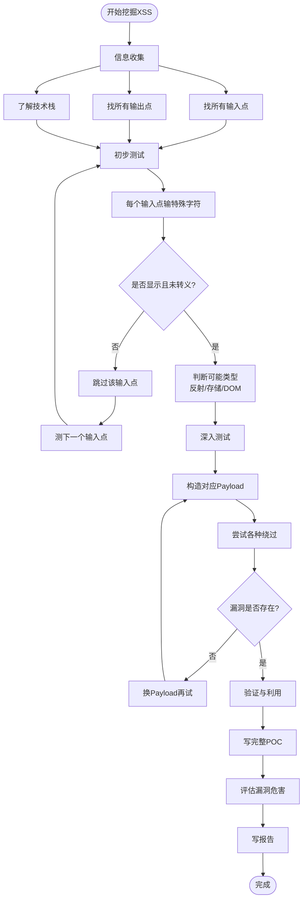
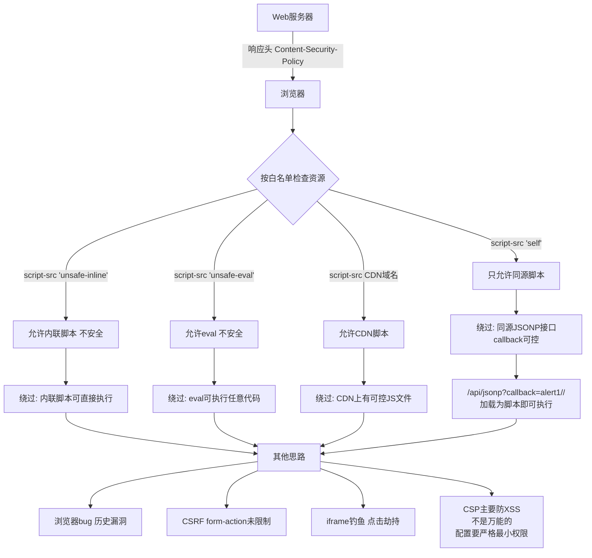
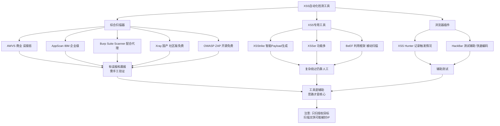
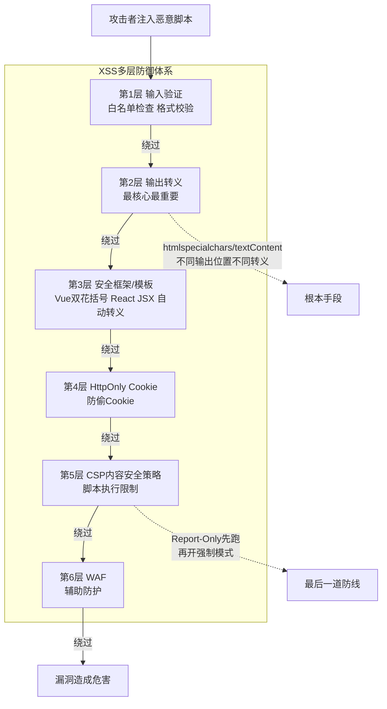

# 第20章 XSS高级：挖掘与防御

> **难度等级：🟡 中等级**
>
> **预计学习时间：150分钟**
>
> **本章看点：XSS漏洞挖掘思路、黑盒测试方法、代码审计找XSS、DOM型XSS深入、CSP详解与绕过、XSS自动化检测、XSS防御最佳实践**
>
> ::: tip 说明
> 前面两章我们学了XSS的原理和绕过，
> 这一章我们来讲讲更高阶的内容：
> 怎么挖掘XSS漏洞，
> 以及怎么防御XSS。
>
> 挖掘XSS，
> 就是从一个网站里找出XSS漏洞。
> 知道怎么挖，
> 才能知道怎么防。
>
> 防御XSS，
> 就是从开发者的角度，
> 知道怎么写代码才不会有XSS。
>
> 知己知彼，
> 攻防兼备。
>
> 让我们开始吧！
> :::

---

## 📖 本章概述

::: tip 写在前面
学完了原理和绕过，
很多同学可能会问：
"我怎么在真实网站里找XSS漏洞呢？"

这就是挖掘的艺术了。
XSS漏洞藏在网站的各个角落，
需要你有敏锐的观察力，
系统的测试方法，
还要有耐心。

这一章我们会讲：
- XSS漏洞挖掘的整体思路
- 黑盒测试怎么找XSS
- 代码审计怎么找XSS
- DOM型XSS的深入分析
- CSP的详解与绕过
- XSS自动化检测工具
- XSS防御的最佳实践

学完这一章，
你对XSS的理解会更上一层楼，
不但会利用，
还会挖掘，
更懂得怎么防御。
:::

---

## 🎯 学习目标

读完本章，你将能够：

- [x] 掌握XSS漏洞挖掘的整体思路
- [x] 掌握黑盒测试找XSS的方法
- [x] 掌握代码审计找XSS的方法
- [x] 深入理解DOM型XSS
- [x] 理解CSP的原理和配置
- [x] 了解常见的CSP绕过方法
- [x] 知道XSS自动化检测工具
- [x] 掌握XSS防御的最佳实践
- [x] 能写出安全的代码

---

## 🕵️ XSS漏洞挖掘思路

### 1.1 挖掘XSS的整体流程

挖掘XSS不是瞎试，
是有一套系统的方法的。

整体流程大概是这样的：

```
1. 信息收集
   ├── 找所有输入点（参数、表单、头...）
   ├── 找所有输出点（页面上显示的地方）
   └── 了解网站的技术栈（前端框架、后端语言...）

2. 初步测试
   ├── 每个输入点输入特殊字符
   ├── 看页面上有没有显示
   ├── 看有没有被过滤/转义
   └── 判断可能的类型（反射/存储/DOM）

3. 深入测试
   ├── 构造各种Payload
   ├── 尝试各种绕过方法
   ├── 确认漏洞是否存在
   └── 评估漏洞危害

4. 验证与利用
   ├── 写一个完整的POC
   ├── 测试实际能做什么
   └── 写报告
```

一步一步来，
不要漏过任何一个输入点。

**图20-1 XSS漏洞挖掘整体流程图**



### 1.2 找输入点

XSS的前提是用户输入能输出到页面上。
所以第一步，
就是找出所有用户可控的输入点。

**常见的输入点：**

1. **URL参数**
   - GET参数：`?id=1&name=xxx`
   - URL路径：`/user/123`
   - Fragment：`#xxx`

2. **表单输入**
   - 文本框、密码框
   - 文本域、富文本编辑器
   - 单选框、复选框
   - 下拉菜单
   - 隐藏域

3. **HTTP头**
   - Cookie
   - User-Agent
   - Referer
   - X-Forwarded-For
   - 其他自定义头

4. **其他**
   - 文件上传（文件名、文件内容）
   - 第三方内容（评论、留言、帖子）
   - 导入的数据
   - 本地存储（localStorage、sessionStorage）

**原则：所有用户可控的地方都要测。**

### 1.3 找输出点

光有输入点还不够，
还要看输入在哪里输出。

**常见的输出位置：**

1. **HTML标签之间**
   ```html
   <div>用户输入</div>
   ```
   最常见，一般插标签就行。

2. **HTML属性中**
   ```html
   <input value="用户输入">
   
   <a href="用户输入">
   ```
   这种要闭合属性，加事件。

3. **JavaScript代码中**
   ```html
   <script>
   var name = "用户输入";
   </script>
   ```
   这种要闭合引号，加代码。

4. **CSS中**
   ```html
   <style>
   .box { color: 用户输入; }
   </style>
   ```
   比较少见，但也可能有。

5. **URL中**
   ```html
   <a href="用户输入">
   
   <iframe src="用户输入">
   ```
   可以用`javascript:`伪协议。

不同的输出位置，
利用方式不一样。
先搞清楚输出在哪里，
再构造对应的Payload。

### 1.4 判断类型

根据输出的位置和方式，
判断是哪种类型的XSS：

- **反射型**：输入立刻在页面上显示，不存数据库
- **存储型**：输入存到数据库，下次访问还在
- **DOM型**：输出是前端JS做的，不经过服务器

怎么判断？
看源代码（右键查看源码）：
- 源码里有：服务器输出的（反射/存储）
- 源码里没有，审查元素里有：DOM型

---

## 📦 黑盒测试找XSS

黑盒测试，
就是不知道源码，
纯从外面测。

### 2.1 第一步：输入特殊字符测试

每个输入点，
先输一串特殊字符试试：

```
'"<>()javascript:onerror=alert
```

然后看页面上：
- 这些字符有没有显示出来？
- 有没有被转义？（比如`&lt;`代替`<`）
- 有没有被过滤掉？（直接没了）
- 页面有没有报错？

根据返回的结果，
判断过滤的情况。

### 2.2 第二步：根据输出位置构造Payload

根据输出的位置，
选择不同的测试方法。

**情况1：输出在HTML标签之间**
```html
<div>这里显示用户输入</div>
```
测试：
```html
<script>alert(1)</script>

<svg onload=alert(1)>
```

**情况2：输出在属性值中（双引号）**
```html
<input value="用户输入">
```
测试：
```
" onmouseover=alert(1) x="
">
" autofocus onfocus=alert(1) x="
```

**情况3：输出在属性值中（单引号）**
```html
<input value='用户输入'>
```
测试：
```
' onmouseover=alert(1) x='
'>
```

**情况4：输出在href/src等URL属性中**
```html
<a href="用户输入">点我</a>
```
测试：
```
javascript:alert(1)
data:text/html,<script>alert(1)</script>
```

**情况5：输出在JavaScript代码中**
```html
<script>
var name = "用户输入";
</script>
```
测试：
```
";alert(1);//
</script><script>alert(1)</script>
```

不同的场景用不同的Payload，
对症下药。

**图20-2 XSS输出位置与Payload对应关系图**

```mermaid
flowchart TD
    Input[用户输入输出到页面]
    Input --> Out1[HTML标签之间]
    Input --> Out2[HTML属性中-双引号]
    Input --> Out3[HTML属性中-单引号]
    Input --> Out4[href/src等URL属性]
    Input --> Out5[JavaScript代码中]
    Input --> Out6[CSS中]

    Out1 --> P1["<script>alert1</script><br/>"]
    Out2 --> P2["\" onmouseover=alert1 x=\"<br/>\"> "]
    Out3 --> P3["' onmouseover=alert1 x='<br/>'> "]
    Out4 --> P4["javascript:alert1<br/>data:text/html,..."]
    Out5 --> P5["\";alert1;//<br/></script><script>..."]
    Out6 --> P6["expression(alert1) 仅老IE<br/>尽量不让用户输入到CSS"]

    P1 --> Tip1[闭合标签 注入新标签]
    P2 --> Tip2[闭合引号 注入事件属性]
    P3 --> Tip3[闭合单引号 注入事件属性]
    P4 --> Tip4[利用javascript伪协议]
    P5 --> Tip5[闭合引号 注入JS代码]
    P6 --> Tip6[严格限制格式]
```

### 2.3 第三步：绕过过滤

如果有过滤，
就用上一章学的绕过技巧：
- 大小写
- 编码
- 拼接
- 换标签
- 换事件
- ...

一个一个试，
总有一款适合你。

### 2.4 黑盒测试的检查清单

给大家一个检查清单，
测的时候对照着来，
不要漏：

**所有输入点都测了吗？**
- [ ] GET参数
- [ ] POST参数
- [ ] Cookie
- [ ] User-Agent
- [ ] Referer
- [ ] X-Forwarded-For
- [ ] URL路径
- [ ] Fragment（#后面的）

**所有输出位置都考虑了吗？**
- [ ] HTML标签之间
- [ ] 属性值中（双引号）
- [ ] 属性值中（单引号）
- [ ] 属性值中（无引号）
- [ ] JavaScript代码中
- [ ] CSS中
- [ ] href/src等URL属性

**各种类型都试了吗？**
- [ ] 反射型
- [ ] 存储型
- [ ] DOM型

**各种绕过方法都试了吗？**
- [ ] 大小写
- [ ] HTML实体编码
- [ ] URL编码
- [ ] Unicode编码
- [ ] 拼接
- [ ] 换标签
- [ ] 换事件
- [ ] 不用script标签
- [ ] 不用括号
- [ ] 不用引号

按这个清单来，
大部分XSS都能挖出来。

---

## 🔍 代码审计找XSS

如果有源码，
那代码审计是找XSS的好方法。

### 3.1 代码审计的思路

代码审计找XSS，
核心就是找：
**用户输入 → 输出到页面** 的路径。

**两种思路：**

1. **从输入找输出（正向）**
   找所有接收用户输入的地方，
   跟踪数据流向，
   看最后输出到哪里，
   中间有没有过滤。

2. **从输出找输入（反向）**
   找所有输出到页面的地方，
   看输出的变量是哪来的，
   用户能不能控制，
   中间有没有过滤。

两种方法结合用。

### 3.2 找输出函数

先找输出的地方。

**PHP中常见的输出函数：**
- `echo`
- `print`
- `printf`
- `print_r`
- `var_dump`
- `die()`/`exit()`
- 模板输出（`{$var}`、`<?=$var?>`）

**Java中常见的输出：**
- `out.print()`
- `<%= %>`
- 模板引擎的输出（Thymeleaf、JSP...）

**Python/Flask：**
- `render_template`中的变量
- `{{ var }}`（Jinja2模板）

**Node.js/Express：**
- `res.send()`
- `res.render()`
- 模板引擎输出

找到所有输出的地方，
一个一个看。

### 3.3 找输入来源

然后看输出的变量是哪来的，
用户能不能控制。

**常见的输入来源：**
- `$_GET`、`$_POST`、`$_REQUEST`（PHP）
- `$_COOKIE`、`$_SERVER`（PHP）
- `request.getParameter()`（Java）
- `request.args.get()`（Python/Flask）
- 数据库里读出来的
- 第三方API返回的
- 文件内容
- ...

只要用户能间接或直接控制的，
都可能有问题。

### 3.4 看中间有没有过滤

找到了输入和输出，
还要看中间有没有做过滤或转义。

**常见的过滤函数：**
- `htmlspecialchars()`（PHP）
- `htmlentities()`（PHP）
- `strip_tags()`（PHP）
- `addslashes()`（PHP）
- 各种自定义的过滤函数

**注意：**
- 过滤了吗？
- 过滤的是什么？
- 能不能绕过？
- 是在输入时过滤还是输出时过滤？
- 所有输出的地方都过滤了吗？

很多时候，
开发只在某些地方过滤了，
或者过滤得不严，
就会有漏洞。

### 3.5 DOM型XSS的代码审计

DOM型XSS是前端的问题，
所以要看JavaScript代码。

**找什么？**
找前端JS中，
把用户可控的数据，
用不安全的方式插到页面上的地方。

**危险的函数/属性：**
- `innerHTML`
- `outerHTML`
- `document.write()`
- `document.writeln()`
- `insertAdjacentHTML()`
- `eval()`
- `setTimeout()` / `setInterval()`
- `new Function()`
- `location.href` / `location.replace`
- `document.cookie`的赋值
- ...

**用户可控的数据源（Source）：**
- `location.href`
- `location.hash`
- `location.search`
- `document.URL`
- `document.referrer`
- `window.name`
- `localStorage`
- `sessionStorage`
- `postMessage`
- `cookie`
- ...

**危险的操作（Sink）：**
- `innerHTML = ...`
- `document.write(...)`
- `eval(...)`
- `setTimeout(...)`
- `new Function(...)`
- ...

审计DOM型XSS，
就是找从Source到Sink的路径。

**图20-3 DOM型XSS Source到Sink数据流图**

```mermaid
flowchart LR
    subgraph Source[Source 用户可控的数据源]
        direction TB
        S1[location.href]
        S2[location.hash]
        S3[location.search]
        S4[document.URL]
        S5[document.referrer]
        S6[window.name]
        S7[localStorage]
        S8[postMessage]
        S9[cookie]
    end

    Data[用户可控数据] -.->|流入| Sink

    subgraph Sink[Sink 危险的输出/执行点]
        direction TB
        K1["innerHTML / outerHTML"]
        K2["document.write / writeln"]
        K3["insertAdjacentHTML"]
        K4[eval]
        K5["setTimeout / setInterval"]
        K6["new Function"]
        K7["location.href = data"]
        K8["element.src = data"]
    end

    Source --> Data
    Data --> Sink
    Sink --> XSS{XSS触发<br/>脚本执行}
    XSS --> NoServer[服务器无参与<br/>查看源码看不到]
    NoServer --> Audit[审计: 找Source到Sink路径]
```



### 3.6 常见的框架问题

现在很多网站用框架，
框架一般默认是安全的，
但如果用得不对，
也会有XSS。

**Vue.js：**
- 正常的`{{ }}`是安全的（会转义）
- 但是`v-html`是危险的！
- `v-bind:href`如果用户可控，可能有`javascript:`问题

**React：**
- 正常的JSX是安全的
- 但是`dangerouslySetInnerHTML`是危险的
- `href`/`src`等属性用户可控也可能有问题

**Angular：**
- 默认是安全的
- 但是`bypassSecurityTrustHtml`等方法是危险的

所以审计的时候，
看到这些危险的用法，
就要注意了。

---

## 🌳 DOM型XSS深入分析

DOM型XSS比较特殊，
也越来越常见，
我们单独拿出来讲一讲。

### 4.1 什么是DOM型XSS？

再复习一下：
**DOM型XSS，就是完全发生在前端的XSS，
不经过服务器处理，
由前端JavaScript直接把用户可控的数据插入到页面中导致的。**

特点：
- 服务器返回的HTML里没有恶意代码
- 是前端JS运行时动态插进去的
- 右键查看源码看不到
- 要用审查元素才能看到

### 4.2 Source和Sink

讲DOM型XSS，
一定要讲Source和Sink。

**Source（源）：**
用户可控的数据源。

**Sink（汇/漏点）：**
把数据插入到页面/执行代码的危险地方。

DOM型XSS的本质就是：
**Source的数据，流到了Sink。**

### 4.3 常见的Source

```javascript
// URL相关
location.href
location.hash
location.search
location.pathname
document.URL
document.documentURI
document.URLUnencoded

// 导航相关
document.referrer
window.name

// 存储相关
localStorage
sessionStorage
cookie

// 消息相关
postMessage

// 其他
window.opener
history
...
```

这些都是用户可能控制的。

### 4.4 常见的Sink

**HTML相关（直接插入HTML）：**
```javascript
element.innerHTML = data
element.outerHTML = data
document.write(data)
document.writeln(data)
element.insertAdjacentHTML(position, data)
...
```

**代码执行相关：**
```javascript
eval(data)
setTimeout(data, 100)
setInterval(data, 100)
new Function(data)()
execScript(data)  // IE
...
```

**URL/位置相关：**
```javascript
location.href = data
location.replace(data)
location.assign(data)
window.open(data)
element.src = data
element.href = data
...
```

**JavaScript全局变量执行：**
```javascript
window[data]()
this[data]()
...
```

### 4.5 DOM XSS的例子

**例子1：innerHTML**

```javascript
// 从URL的hash取名字
var name = location.hash.split('=')[1];
// 直接用innerHTML插到页面
document.getElementById('user').innerHTML = '你好，' + name;
```

Source：`location.hash`
Sink：`innerHTML`

Payload：
```
http://example.com/#name=
```

**例子2：document.write**

```javascript
var query = location.search.split('=')[1];
document.write('<h1>搜索结果：' + query + '</h1>');
```

Source：`location.search`
Sink：`document.write`

**例子3：eval**

```javascript
var callback = location.hash.slice(1);
eval(callback + '()');
```

Source：`location.hash`
Sink：`eval`

**例子4：location.href跳转**

```javascript
var url = location.hash.slice(1);
location.href = url;
```

这个看起来只是跳转，
但是如果跳转到`javascript:`呢？

Payload：
```
http://example.com/#javascript:alert(1)
```

也是XSS。

### 4.6 Self-XSS

什么是Self-XSS？
**就是只能自己打自己的XSS。**

比如：
- 用户在自己的个人资料里插XSS，只有自己能看到
- 要用户自己复制粘贴代码到控制台才能触发
- 需要用户手动做一些操作才能触发

这种危害相对小一些，
但是如果能诱导用户操作，
也是可以利用的。

而且有时候Self-XSS可以升级，
比如配合CSRF，
让用户自己给自己发XSS代码。

---

## 🛡️ CSP详解与绕过

CSP是防御XSS的重要手段，
也是高级XSS必须面对的。
我们来深入讲一讲。

### 5.1 CSP是什么？

再复习一下：
**CSP（Content Security Policy，内容安全策略），
是一种安全策略，
通过白名单的方式告诉浏览器，
哪些资源可以加载，
哪些脚本可以执行。**

> 💡 **通俗理解CSP——网站给浏览器的"行为守则"**
>
> 想象一个场景：
>
> 你（浏览器）被派去一个陌生城市办事。
> 出发前，你老板（网站服务器）给了你一张纸条（CSP策略），上面写着：
>
> "在这个城市里，你只能：
> - 从我们公司食堂吃饭（script-src 'self'）
> - 从我们公司饮水机喝水（style-src 'self'）
> - 从任何正规渠道拍照（img-src *）
> - 其他地方的食物和水全都不能碰！"
>
> 你到了陌生城市后，
> 虽然当地餐馆老板（攻击者）热情招呼你"来吃点吧"，
> 但你看了看纸条上的规定，
> 摇了摇头："不行，老板说了只能吃公司的。"
>
> 这就是CSP的工作原理！
>
> **CSP不是"阻挡攻击"，而是"制定规则"：**
> - 浏览器忠实地遵守CSP规则
> - 即使攻击者成功注入了 `<script>恶意代码</script>`
> - 但CSP规定 `script-src 'self'` —— 只执行来自本域名的脚本
> - 而内联的恶意代码既不是来自本域名文件，也没有nonce标记
> - 浏览器说："这条脚本没有通行证，我不执行！"
>
> 所以CSP相当于给了浏览器一份"白名单"。
> 即使XSS注入成功了，
> 只要恶意脚本不在白名单里，
> 浏览器就不会执行它。
>
> **这为什么比"过滤"更好？**
> - 过滤是"猜哪些是攻击"，永远有遗漏（黑名单思维）
> - CSP是"只允许明确允许的"，天然安全（白名单思维）
> - 就像：过滤是说"不准带刀、不准带枪、不准带棍子..."
>   CSP是说"除了你自己，其他什么都不准带进来"
>
> 当然，CSP也不是万能的，配置不当可以被绕过（后面会讲）。

通过HTTP响应头设置：
```
Content-Security-Policy: script-src 'self'
```

或者meta标签：
```html
<meta http-equiv="Content-Security-Policy" content="script-src 'self'">
```

### 5.2 CSP指令详解

**常用指令：**

| 指令 | 作用 |
|------|------|
| `default-src` | 默认策略，其他指令没设置时用这个 |
| `script-src` | 脚本来源 |
| `style-src` | 样式来源 |
| `img-src` | 图片来源 |
| `font-src` | 字体来源 |
| `frame-src` | iframe来源 |
| `object-src` | 插件来源（Flash等） |
| `media-src` | 媒体来源（audio/video） |
| `connect-src` | AJAX/WebSocket等连接来源 |
| `worker-src` | Web Worker来源 |
| `child-src` | 子上下文来源（iframe/worker） |
| `form-action` | 表单提交地址 |
| `base-uri` | base标签的href |
| `manifest-src` | manifest来源 |
| `prefetch-src` | 预加载资源来源 |
| `webrtc-src` | WebRTC来源 |
| `plugin-types` | 允许的插件类型 |
| `sandbox` | 沙箱模式 |
| `upgrade-insecure-requests` | 把HTTP升级成HTTPS |
| `block-all-mixed-content` | 阻止混合内容 |
| `report-uri` / `report-to` | 违规报告地址 |

### 5.3 源的写法

**常用的源值：**

| 值 | 含义 |
|----|------|
| `*` | 允许所有来源（不安全） |
| `'none'` | 不允许任何来源 |
| `'self'` | 允许同源 |
| `'unsafe-inline'` | 允许内联脚本/样式 |
| `'unsafe-eval'` | 允许eval等动态执行 |
| `'unsafe-hashes'` | 允许特定的内联脚本（哈希） |
| `'nonce-xxx'` | 允许特定nonce的内联脚本 |
| `'sha256-xxx'` | 允许特定哈希的脚本 |
| `example.com` | 允许这个域名 |
| `*.example.com` | 允许这个域名的所有子域名 |
| `https://example.com` | 允许这个特定URL |
| `https:` | 允许所有HTTPS来源 |
| `data:` | 允许data:协议 |
| `blob:` | 允许blob:协议 |
| `filesystem:` | 允许filesystem:协议 |

> 💡 **深入理解：nonce是怎么防XSS的？——"一次性通行证"原理**
>
> nonce（Number used ONCE，一次性随机数）是CSP中
> 一个非常聪明的设计。它的工作原理是这样：
>
> ```
> 每次浏览器请求页面时：
>
> 服务器生成一个随机字符串作为nonce：
>   nonce = "a8r3k2xn9m4q"  （真随机，每次请求都不同）
>
> 服务器在HTTP响应头里加上：
>   Content-Security-Policy: script-src 'nonce-a8r3k2xn9m4q'
>
> 同时在HTML里的合法脚本标签上加上同样的nonce：
>   <script nonce="a8r3k2xn9m4q">
>       var user = "<?php echo $username; ?>";
>   </script>
> ```
>
> 浏览器收到响应后：
> 1. 读取CSP头，记录："只允许 nonce='a8r3k2xn9m4q' 的脚本"
> 2. 扫描HTML中所有 `<script>` 标签
> 3. 对于每个script标签：
>    - 如果有 nonce 属性且值匹配 → 允许执行 ✅
>    - 如果没有 nonce 或值不匹配 → 拒绝执行 ❌
>
> 为什么nonce比unsafe-inline安全得多？
>
> 假设攻击者成功注入了：
> ```html
> <script nonce="???">恶意代码</script>
> ```
>
> 攻击者不知道nonce值是什么！
> 因为nonce是每次请求随机生成的，
> 不可预测，且只出现在HTTP响应头和合法的script标签上。
> 攻击者的注入点在HTML内容里（比如留言板），
> 他无法"预知"服务器这次会用什么nonce。
> 所以他注入的script标签上没有正确的nonce → 浏览器不执行！
>
> **nonce就像一张"一次性通行证"：**
> - 服务器每次发一个新通行证（随机字符串）
> - 只发给"自己人"（合法的脚本标签，在服务器生成时就知道nonce值）
> - 入侵者（注入的脚本）没有通行证，即使进来了也进不了"脚本执行区"
>
> 这就是CSP nonce的精妙之处：
> **不是"拦着不让恶意脚本进来"（过滤做不到），
> 而是"恶意脚本进来了也没用，因为它没有通行证"。**

### 5.4 CSP的等级

CSP有两个级别：CSP Level 1 和 CSP Level 2/3。

Level 1 是基础的，
Level 2/3 增加了很多新特性。

现在主流浏览器都支持Level 2，
部分支持Level 3。

### 5.5 CSP绕过思路

CSP不是万能的，
配置不当的CSP是可以绕过的。

下面讲一些常见的绕过思路。

**注意：**
这里只是讲原理和思路，
让大家了解CSP的局限性，
更好地配置CSP。
不要用来做违法的事情！

#### 绕过思路1：利用允许的域名

如果CSP允许了某个域名，
而那个域名上有可控的内容，
就可以利用。

比如CSP是：
```
script-src 'self' *.google.com
```

如果在google.com上有一个JSONP接口，
或者有可控的JS，
就可以用。

或者更常见的，
允许了CDN域名，
而CDN上可以上传JS文件...

#### 绕过思路2：利用不安全的配置

如果CSP配置了`'unsafe-inline'`，
那内联脚本就可以执行，
基本等于没防。

如果配置了`'unsafe-eval'`，
那eval类的也能用。

#### 绕过思路3：利用浏览器的bug

历史上有过一些CSP绕过的浏览器漏洞，
不过这些一般都会被修复。

#### 绕过思路4：利用其他类型的攻击

就算脚本执行不了，
还可以做别的：
- 利用CSRF（如果form-action没限制）
- 钓鱼（iframe嵌入钓鱼页面）
- 点击劫持
- ...

CSP主要防XSS，
不是万能的。

**图20-4 CSP工作原理与绕过思路图**



### 5.6 安全的CSP配置

怎么配置CSP才安全？

**推荐的严格配置：**
```
default-src 'none';
script-src 'self';
style-src 'self';
img-src 'self';
connect-src 'self';
font-src 'self';
object-src 'none';
base-uri 'self';
form-action 'self';
frame-ancestors 'none';
upgrade-insecure-requests;
```

**原则：**
- 默认拒绝一切（default-src 'none'）
- 最小权限原则，只开需要的
- 不要用`'unsafe-inline'`和`'unsafe-eval'`
- 尽量用哈希或nonce代替unsafe-inline
- 只信任必要的域名

---

## 🤖 XSS自动化检测工具

手工测XSS太慢了，
可以用工具辅助。

### 6.1 扫描器

**AWVS（Acunetix Web Vulnerability Scanner）：**
- 知名的Web漏洞扫描器
- XSS检测能力强
- 误报率相对低
- 商业软件，收费

**AppScan：**
- IBM的产品
- 功能强大
- 企业级
- 收费

**Burp Suite Scanner：**
- Burp的主动/被动扫描功能
- 配合代理使用很方便
- 专业版收费

**Xray：**
- 国产的Web漏洞扫描器
- 功能强大，更新快
- 社区版免费，高级版收费
- 命令行工具，适合自动化

**OWASP ZAP：**
- 开源免费
- 功能也不错
- 适合学习用

### 6.2 XSS专用工具

**XSStrike：**
- 专门的XSS扫描工具
- Python写的
- 功能很强，有智能Payload生成
- 支持GET/POST
- 开源免费

**XSSer：**
- 也是专门的XSS工具
- 功能很多
- 开源

**BeEF：**
- 不是扫描器，是利用框架
- 但是有个被动扫描的功能
- 可以检测页面上有没有XSS

### 6.3 浏览器插件

**XSS Hunter：**
- 找XSS的工具
- 可以记录XSS触发的情况

**HackBar：**
- 不是专门扫XSS的
- 但是测试XSS很方便
- 可以快速修改参数、编码

### 6.4 工具使用的注意事项

工具虽然方便，
但是：

1. **不能完全依赖工具**
   工具有误报和漏报，
   一定要手工验证。

2. **工具是辅助，思路才是核心**
   工具只能跑常见的Payload，
   复杂的绕过还是要靠人。

3. **注意法律风险**
   扫描别人的网站可能违法，
   只能扫自己授权的。

4. **注意速度**
   扫描太快可能被封IP，
   或者把网站搞挂。

**图20-5 XSS自动化检测工具分类图**



---

## 🛡️ XSS防御最佳实践

最后讲一下怎么防御XSS。
作为开发者，
怎么写代码才不会有XSS？

### 7.1 核心原则：输入验证 + 输出转义

**核心原则：永远不要相信用户的输入。**

两个关键点：
1. **输入验证**：检查用户输入是否符合格式要求
2. **输出转义**：输出到页面时，根据输出位置做对应的转义

### 7.2 输出转义（最重要）

输出转义是防御XSS最有效的方法。
根据输出的位置，
做不同的转义。

#### 输出在HTML标签之间

转义这些字符：
- `&` → `&amp;`
- `<` → `&lt;`
- `>` → `&gt;`
- `"` → `&quot;`
- `'` → `&#x27;` 或 `&#39;`

**PHP：**
```php
echo htmlspecialchars($str, ENT_QUOTES, 'UTF-8');
```

**Java/JSP：**
```jsp
<c:out value="${str}" />
```
或
```java
StringEscapeUtils.escapeHtml(str)
```

**Python/Flask + Jinja2：**
```jinja2
{{ str }}  <!-- 默认就会转义 -->
```
（不要用`|safe`！）

**JavaScript（前端插入文本）：**
```javascript
// 用textContent，不用innerHTML
element.textContent = str;
```

#### 输出在HTML属性中

也要转义，
特别是引号。

确保属性值用引号括起来，
然后转义引号和特殊字符。

#### 输出在JavaScript代码中

输出到JS变量里，
要做JS转义，
或者输出JSON。

```javascript
// 不好的做法
var name = "<?php echo $name; ?>";

// 好的做法：输出JSON
var name = <?php echo json_encode($name); ?>;
```

#### 输出在URL中

输出到href、src等属性，
要确保URL是安全的。

- 检查协议，只允许http/https
- 禁止javascript:、data:等危险协议
- 做URL编码

#### 输出在CSS中

尽量不要让用户输入直接到CSS里。
如果一定要，
严格限制格式。

### 7.3 输入验证

输入验证是辅助手段，
不能代替输出转义，
但是可以降低风险。

**怎么做：**
- 用白名单，不用黑名单
- 检查数据类型、格式、长度
- 不符合的直接拒绝，不要试图"修复"

**例子：**
- 手机号：检查是不是11位数字
- 邮箱：检查邮箱格式
- 用户名：限制字符范围（字母数字下划线）
- URL：检查是不是http/https开头

**注意：**
输入验证是辅助，
输出转义才是根本。
不要以为输入验证了就安全了。

### 7.4 使用安全的框架/模板引擎

尽量用自带转义的模板引擎，
并且正确使用。

**Vue.js：**
- 用`{{ }}`（自动转义）
- 尽量不用`v-html`
- 如果一定要用v-html，确保内容是安全的

**React：**
- 正常的JSX是安全的
- 尽量不用`dangerouslySetInnerHTML`

**PHP模板（Twig、Smarty等）：**
- 用默认的输出（自动转义）
- 不要轻易关闭转义

框架和模板引擎已经帮你做了很多安全工作，
正确使用的话，
XSS会少很多。

### 7.5 设置HttpOnly Cookie

给Cookie加上HttpOnly标志，
防止XSS偷Cookie。

```php
// PHP设置HttpOnly
setcookie("user", $value, time()+3600, "/", "", true, true);
// 最后一个参数是HttpOnly
```

Java、Python等也有对应的设置方式。

注意：
HttpOnly只是防偷Cookie，
不能防XSS本身。
XSS还可以做钓鱼、键盘记录等。

### 7.6 部署CSP

部署CSP，
可以大大降低XSS的危害。
就算有XSS漏洞，
脚本也执行不了。

怎么配置？
参考上面讲的CSP最佳实践。

建议：
- 先开Report-Only模式，看有什么问题
- 没问题了再开强制模式
- 尽量严格配置

### 7.7 其他安全措施

- **验证码**：敏感操作加验证码，防自动化攻击
- **Token/CSRF防护**：配合XSS的CSRF
- **WAF**：辅助手段，能挡住一些基础攻击
- **安全编码规范**：团队制定规范，code review
- **安全培训**：提高开发人员的安全意识

### 7.8 XSS防御的层次

XSS防御不是单点防御，
而是多层防御：

```
第1层：输入验证（白名单检查）
第2层：输出转义（最核心、最重要）
第3层：安全的框架和模板（自动转义）
第4层：HttpOnly Cookie（防偷Cookie）
第5层：CSP内容安全策略（脚本执行限制）
第6层：WAF（辅助防护）
```

多层防御，
就算某一层被绕过了，
还有下一层。

**图20-6 XSS防御多层体系图**



---

## 📚 案例讲解

### 案例1：某大型网站XSS挖掘实录

老周做渗透测试，
目标是一个大型电商网站。

信息收集阶段，
他发现网站有个搜索功能，
搜索关键词会显示在页面上：
"您搜索的关键词：xxx"

他试了试`'"><>`，
结果页面上显示的是：
`'"><>`
没有被转义！

"有戏！"
老周心里一喜。

他输入：
```html
<script>alert(1)</script>
```
结果被过滤了，
关键词变成了空的。

看来过滤了script标签。

他又试了试img标签：
```html

```
也被过滤了。

"嗯... 过滤了标签？"

他仔细看了看，
发现只要有尖括号的，
都被去掉了。
尖括号被过滤了。

那怎么办？
他看了看输出的位置，
是在一个div里面，
尖括号被过滤了，
那标签就插不进去了。

但是...等等，
他又看了看页面，
发现搜索关键词不仅显示在页面上，
还显示在了input的value属性里：

```html
<input type="text" class="search-input" value="用户输入的关键词">
```

而且！
在value里，
尖括号没被过滤！
只是双引号被转义了吗？

他试了试输入`"`，
结果value里变成了`\"`。
双引号被加了反斜杠转义。

"只转义了双引号？"
老周想。

那单引号呢？
他输入了`'`，
结果发现单引号没被转义！

但是value用的是双引号啊...
等等，不对，
他再仔细一看，
有些地方的value用的是单引号？

不，不是。
但是... 他又想到了一件事：
如果HTML属性的引号被转义了，
但还有没有其他方法？

比如...
如果输入的是HTML实体编码呢？

因为在属性值里，
HTML实体是会被解码的。

他试了试：
```
&#34; onmouseover=alert(1) x=&#34;
```
（`&#34;`是双引号的实体编码）

结果...
不行，双引号实体被原样显示了，
说明后端做了HTML实体编码转换？
不对，应该是后端把&也转义了。

那怎么办？

老周又想到了一个地方：
网站的搜索结果页，
URL里的关键词也会显示在页面上。

他看了看URL：
```
/search?q=关键词
```

他又测试了其他参数，
比如page、sort、category...

测了十几个参数，
都没有XSS。

"难道这个站就没有XSS了？"
老周不甘心。

他又去看了看其他功能：
- 用户注册
- 用户登录
- 个人资料
- 商品评论
- 商品详情
- 购物车
- ...

一个一个测。

终于，
在商品评论这里，
他发现了一个存储型XSS！

评论的内容有富文本编辑器，
可以设置字体颜色、大小之类的。
看起来是做了XSS过滤的。

但是老周测试了各种标签、各种属性，
最后发现，
`<a>`标签的`href`属性可以用`javascript:`伪协议！

```html
<a href="javascript:alert(1)">点我</a>
```

提交评论，
显示成功了！
然后点评论里的链接，
弹窗了！

一个存储型XSS就这么挖到了。

虽然需要用户点击，
但是存储型的，
影响还是很大。

而且老周发现，
商家回复评论的功能也有这个问题。
如果商家回复里有XSS，
所有看这个商品的人都能看到。

危害更大。

> 挖洞心得：
> **1. 不要只测一个地方，所有输入点都要测**
> **2. 不要因为有过滤就放弃，想办法绕过**
> **3. 富文本编辑器是XSS的重灾区**
> **4. href/src等URL属性的javascript:也是XSS**
> **5. 耐心很重要，一个一个试，总会有收获**

### 案例2：从代码审计发现DOM型XSS

小林做代码审计，
看一个前端项目的代码。

他搜索`innerHTML`，
看看哪里用了这个危险的属性。

搜到了这么一段：

```javascript
// 解析URL参数
function getQuery(name) {
    var reg = new RegExp('(^|&)' + name + '=([^&]*)(&|$)');
    var r = window.location.search.substr(1).match(reg);
    if (r != null) return unescape(r[2]);
    return null;
}

// 显示错误信息
var errorMsg = getQuery('error');
if (errorMsg) {
    document.getElementById('error-box').innerHTML = errorMsg;
    document.getElementById('error-box').style.display = 'block';
}
```

Source：`location.search`（通过getQuery函数）
Sink：`innerHTML`

典型的DOM型XSS！

小林构造了URL：
```
http://example.com/login?error=
```

访问，
弹窗了！

一个DOM型反射XSS就这么找到了。

再往下看，
他又发现了一个：

```javascript
// 跳转
var redirect = getQuery('redirect');
if (redirect) {
    location.href = redirect;
}
```

这个是跳转，
但是可以用`javascript:`：
```
http://example.com/login?redirect=javascript:alert(1)
```

也是XSS。

再往下翻，
又有一个：

```javascript
// 从localStorage读用户设置，显示用户名
var user = JSON.parse(localStorage.getItem('user') || '{}');
if (user.username) {
    document.getElementById('username').innerHTML = user.username;
}
```

这个也是DOM XSS，
但是是Self-XSS，
因为localStorage里的值是用户自己存的。
除非有其他地方能修改别人的localStorage。

一个下午，
小林就找到了3个DOM型XSS。

> 代码审计心得：
> **1. 搜关键字（innerHTML、eval、document.write...）**
> **2. 找到Sink之后，回溯数据源**
> **3. 看数据源用户能不能控制**
> **4. 前端代码也要审计，DOM XSS越来越多**
> **5. 框架也不是绝对安全的，v-html、dangerouslySetInnerHTML要重点看**

### 案例3：CSP绕过实战

小张做CTF，
遇到一道题，
有个反射型XSS，
但是开了CSP。

CSP是这样的：
```
Content-Security-Policy: script-src 'self' 'unsafe-inline'; object-src 'none';
```

有`unsafe-inline`，
那内联脚本应该可以执行啊？
但是为什么他的`<script>alert(1)</script>`不行？

哦，不对，
他再仔细一看，
CSP是：
```
script-src 'self'
```
没有`unsafe-inline`！

那内联脚本执行不了。
但是`script-src 'self'`，
可以加载同源的脚本。

那怎么绕过？
他想了想：
如果能找到同源的一个JS文件，
里面的内容可控？
或者...

等等，
他发现网站有个JSONP接口：
```
/api/jsonp?callback=foo
```

返回：
```javascript
foo({"code":0,"data":{}})
```

callback参数可控！
而且是同源的！

那这样就可以用了！

构造Payload：
```
/?search=<script src="/api/jsonp?callback=alert(1)//"></script>
```

不对，
因为script.src是加载脚本，
脚本内容是`alert(1)//({"code":0...})`，
这样会执行吗？

等等，
JSONP的格式是`callback(data)`，
如果callback是`alert(1)//`，
那返回的就是：
```javascript
alert(1)//({"code":0,"data":{}})
```

这样加载这个脚本，
就会执行`alert(1)`！

完美！

但是等等，
script标签被过滤了吗？
他去测试了一下，
没有过滤script标签。
那为什么之前的内联脚本不行？
因为CSP禁止了内联脚本。

但是加载同源的脚本是可以的。
而这个JSONP接口是同源的，
而且内容可控。
所以就可以绕过CSP执行JS。

小张试了一下，
成功弹窗！

CSP绕过！

> 思路总结：
> **CSP绕过的思路很多，
> 关键是看CSP的配置有没有漏洞。**
>
> 常见的绕过点：
> 1. 允许的域名上有没有可控的JS
> 2. 有没有JSONP接口
> 3. 有没有上传文件的地方
> 4. 配置是不是太宽松了
>
> 配置CSP的时候要小心，
> 只信任绝对可信的源。

### 案例4：Self-XSS升级到存储型XSS

小王做渗透测试，
在一个网站上发现了一个Self-XSS。

怎么回事呢？
用户可以设置自己的昵称，
昵称有XSS，
但是只有自己能看到。

典型的Self-XSS。

一般来说，
Self-XSS危害不大。
但是小王想，
能不能升级一下？

他到处看，
看看有没有地方可以让管理员查看用户的昵称。

找啊找，
终于找到了！
后台的用户管理页面，
管理员可以看到所有用户的昵称。

如果用户把昵称改成XSS代码，
管理员在后台查看用户列表的时候，
就会触发XSS！

那这样就从Self-XSS变成了针对管理员的存储型XSS！

小王立刻测试：
他把自己的昵称改成了：
```html

```

然后登录管理员账号（测试环境有管理员账号），
去后台看用户列表，
"叮"的一声，
弹窗了！

成功了！
一个Self-XSS，
就这么升级成了高危的存储型XSS。

而且打到了管理员，
危害更大。

> 经验之谈：
> **不要小看Self-XSS。**
>
> 很多时候，
> 用户自己输入的内容，
> 管理员也会看到。
> 比如：
> - 用户名/昵称
> - 个人简介
> - 订单备注
> - 反馈内容
> - 举报内容
> - ...
>
> 只要管理员后台没过滤，
> 就可以打管理员。
>
> 挖洞的时候，
> 要站在不同角色的角度看问题。
> 用户觉得是Self-XSS，
> 但对管理员来说就是存储型XSS。

### 案例5：从源头修复XSS漏洞

某公司的网站被检测出有XSS漏洞，
找老K去做代码审计和修复。

老K看了代码，
发现问题很多：
- 输出的时候基本都没转义
- 到处是echo直接输出变量
- 前端大量用innerHTML
- 没有CSP
- Cookie也没开HttpOnly

老K给他们做了一个全面的修复方案：

**第一步：输出转义（最核心）**

所有输出到HTML的地方，
都做HTML实体转义。

PHP的模板里：
```php
// 原来
echo $username;

// 改成
echo htmlspecialchars($username, ENT_QUOTES, 'UTF-8');
```

建议他们用Twig模板引擎，
默认自动转义。

**第二步：前端修复**

前端的innerHTML改成textContent：
```javascript
// 原来
element.innerHTML = data;

// 改成
element.textContent = data;
```

如果一定要用HTML，
先做过滤（用DOMPurify等库）。

Vue项目里：
- 检查所有v-html的地方
- 能不用就不用
- 必须用的话，先净化内容

**第三步：输入验证**

给重要的输入加上白名单验证：
- 用户名：字母数字下划线，3-20位
- 邮箱：邮箱格式
- 手机号：11位数字
- URL：只允许http/https

**第四步：HttpOnly Cookie**

给所有Cookie都加上HttpOnly和Secure标志。

**第五步：部署CSP**

先开Report-Only模式，
跑了一周，
修复了所有违规的地方，
然后开了强制模式：
```
default-src 'none';
script-src 'self';
style-src 'self';
img-src 'self' data:;
font-src 'self';
connect-src 'self';
object-src 'none';
base-uri 'self';
form-action 'self';
frame-ancestors 'none';
upgrade-insecure-requests;
```

**第六步：安全编码规范和培训**

给开发团队做了XSS安全培训，
制定了安全编码规范，
code review的时候要检查安全问题。

修复完之后，
再测了一遍，
原来的XSS漏洞都没了。
而且有了多层防御，
就算以后哪里漏了，
也有CSP和HttpOnly兜底。

> 修复建议：
> **XSS防御不是改一个地方就完事了，
> 要从多个层面入手：**
>
> 1. 输出转义（最根本）
> 2. 输入验证（辅助）
> 3. 安全的框架/模板（减少人为失误）
> 4. HttpOnly（防偷Cookie）
> 5. CSP（最后一道防线）
> 6. 安全意识（从源头避免）
>
> 多层防御，
> 才能真正把XSS的风险降到最低。

---

## ✏️ 课后习题

### 选择题

1. 挖掘XSS的第一步是？
   - A. 直接输`<script>alert(1)</script>`
   - B. 找输入点和输出点
   - C. 用扫描器扫
   - D. 看源码

2. 以下哪个不是XSS的输入点？
   - A. URL参数
   - B. 表单输入
   - C. Cookie
   - D. 服务器时间

3. 输出在HTML属性中（双引号），正确的测试Payload是？
   - A. `<script>alert(1)</script>`
   - B. `" onmouseover=alert(1) x="`
   - C. `javascript:alert(1)`
   - D. `';alert(1);//`

4. 代码审计找XSS的核心是？
   - A. 找所有echo
   - B. 找所有用户输入
   - C. 找从用户输入到输出的路径
   - D. 找所有函数

5. 以下哪个是DOM型XSS的Source？
   - A. `location.hash`
   - B. `innerHTML`
   - C. `eval`
   - D. `document.write`

6. 以下哪个是DOM型XSS的Sink？
   - A. `location.href`
   - B. `textContent`
   - C. `innerHTML`
   - D. `appendChild`

7. 防御XSS最根本的方法是？
   - A. WAF
   - B. 输入验证
   - C. 输出转义
   - D. CSP

8. 以下哪个可以防止XSS偷Cookie？
   - A. HttpOnly
   - B. Secure
   - C. SameSite
   - D. Domain

9. 以下哪个CSP指令用来限制脚本来源？
   - A. `default-src`
   - B. `script-src`
   - C. `style-src`
   - D. `img-src`

10. 以下哪种做法是不安全的？
    - A. 用`textContent`插入文本
    - B. 用`htmlspecialchars`转义输出
    - C. 用`v-html`渲染用户输入
    - D. 模板引擎自动转义

### 填空题

1. 挖掘XSS的整体流程是：______ → ______ → ______ → ______。

2. 用户输入的输出位置有：______、______、______、______、______。

3. DOM型XSS的两个核心概念是______和______。

4. 请写出三个常见的Source：______、______、______。

5. 请写出三个常见的Sink：______、______、______。

6. CSP的全称是______。

7. 防御XSS的核心原则是______ + ______。

8. PHP中常用的HTML转义函数是______。

9. 给Cookie加______标志可以防止被JS读取。

10. XSS防御的层次中，最核心、最重要的是______。

### 简答题

1. 黑盒测试找XSS的步骤是什么？

2. 不同输出位置的XSS怎么测试？分别举例子。

3. 代码审计找XSS有什么思路？

4. 什么是Source和Sink？DOM型XSS的本质是什么？

5. 什么是Self-XSS？能不能升级？怎么升级？

6. 什么是CSP？它怎么防XSS？

7. CSP有哪些常见的绕过思路？（至少说3种）

8. 防御XSS的方法有哪些？哪个最有效？

9. 为什么说输入验证不能代替输出转义？

10. 说说XSS的多层防御体系。

### 实操题

1. **黑盒测试练习：**
   - 选一个靶场（DVWA、Pikachu等）
   - 系统地测试每个输入点
   - 用检查清单一个一个对照
   - 找出所有的XSS漏洞
   - 记录下来

2. **代码审计练习：**
   - 找一个开源的Web应用（或者靶场的源码）
   - 用代码审计的方法找XSS
   - 找输出点 → 看输入来源 → 看有没有过滤
   - 至少找出3个XSS
   - 记录漏洞位置和利用方式

3. **DOM型XSS练习：**
   - 找一个有DOM型XSS的靶场题
   - 分析Source和Sink
   - 构造Payload
   - 理解DOM型XSS的原理

4. **CSP练习：**
   - 自己写一个简单的页面，设置CSP
   - 试试不同的CSP配置
   - 看看哪些能执行，哪些不能
   - 理解CSP的作用

5. **安全代码编写练习：**
   - 写一个有XSS漏洞的登录页面
   - 然后用正确的方法修复
   - 对比修复前后的区别
   - 理解为什么输出转义能防XSS

---

## 📝 本章小结

这一章，
我们学习了XSS的挖掘和防御。

总结一下重点：

1. **XSS挖掘思路**
   - 信息收集：找所有输入点和输出点
   - 初步测试：输特殊字符，看反应
   - 深入测试：根据输出位置构造Payload，尝试绕过
   - 验证利用：写POC，评估危害

2. **黑盒测试**
   - 所有输入点都要测（GET/POST/Cookie/Header...）
   - 根据不同输出位置用不同Payload
   - 各种绕过方法都试试
   - 要有检查清单，不要漏

3. **代码审计**
   - 找从用户输入到页面输出的路径
   - 正向跟踪（从输入到输出）
   - 反向跟踪（从输出到输入）
   - 注意DOM型XSS的审计
   - 框架的危险用法也要注意

4. **DOM型XSS深入**
   - Source：用户可控的数据源
   - Sink：危险的输出/执行点
   - DOM XSS的本质：Source的数据流到了Sink
   - Self-XSS及其升级

5. **CSP详解**
   - CSP是内容安全策略，通过白名单限制资源加载
   - 常用指令和源的写法
   - 常见的绕过思路
   - 安全配置最佳实践

6. **XSS自动化工具**
   - 扫描器：AWVS、AppScan、Xray、ZAP
   - 专用工具：XSStrike、XSSer
   - 工具是辅助，思路才是核心

7. **XSS防御**
   - 核心原则：输入验证 + 输出转义
   - 输出转义是最根本的
   - 不同输出位置有不同的转义方式
   - 使用安全的框架和模板
   - HttpOnly Cookie防偷Cookie
   - CSP是最后一道防线
   - 多层防御体系

> 最后送你一句话：
> **"知道怎么攻击，
> 才知道怎么防御。
> 攻防是一体的，
> 站在攻击者的角度想问题，
> 才能写出真正安全的代码。
>
> XSS看似简单，
> 但水很深。
> 多练、多想、多总结，
> 你也能成为XSS高手。"**

---

## 🔗 相关链接

- [⬅️ 上一章：---](/redteam/day023-basic-XSS进阶)
- [➡️ 下一章：---](/redteam/day025-basic-XSS模块总结)
- [📖 返回全书目录](/redteam/day118-toc-全书目录)
