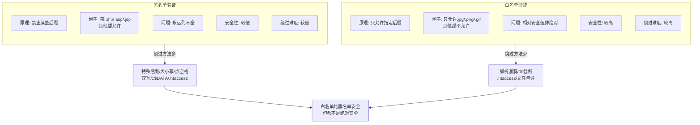
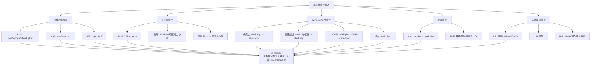
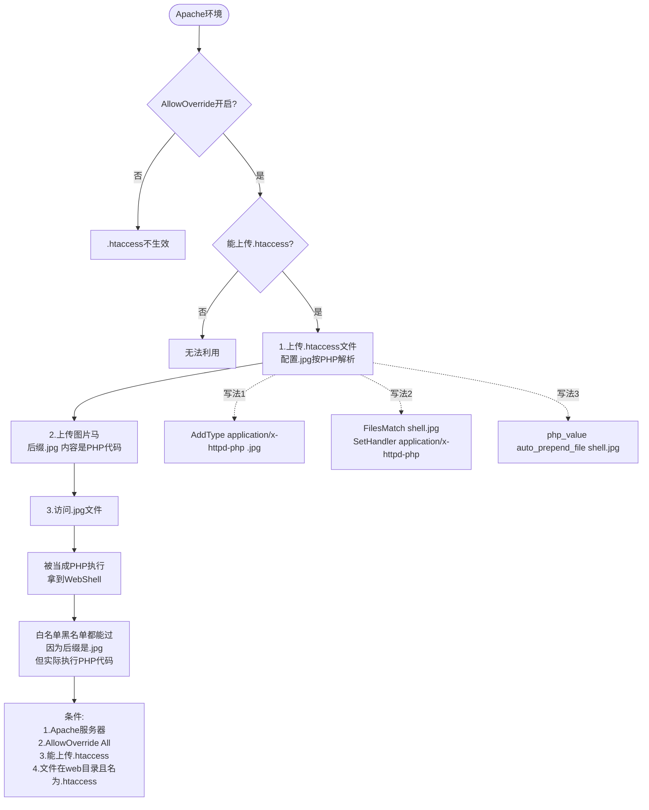
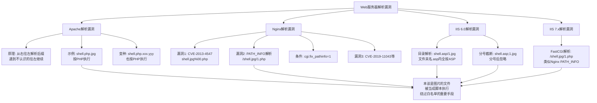
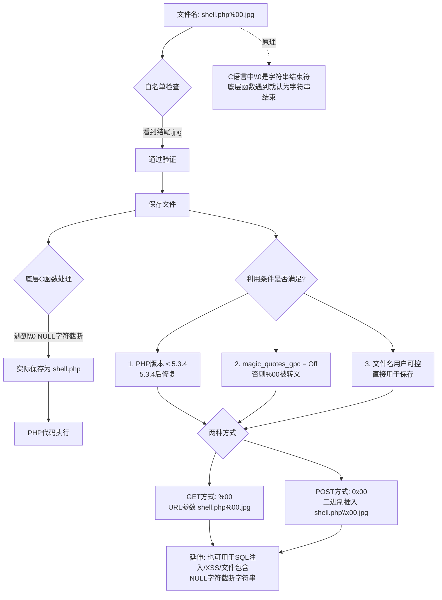
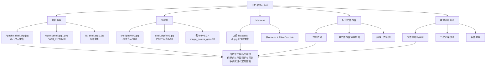
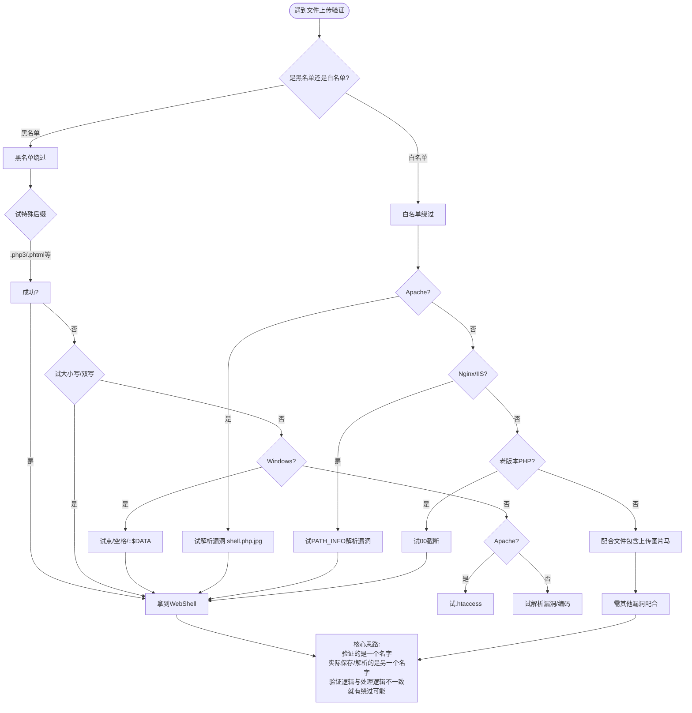

# 第23章 文件上传漏洞进阶

> **难度等级：🟡 中等级 → 🟠 高等级**
>
> **预计学习时间：180分钟**
>
> **本章看点：后缀名绕过、.htaccess、解析漏洞、00截断、双写绕过、大小写绕过、点+空格绕过、::$DATA绕过、特殊后缀绕过**
>
> ::: tip 说明
> 上一章我们讲了文件上传的基础，
> 包括前端验证绕过、MIME绕过、文件头绕过。
>
> 这一章，
> 我们来聊更核心的：
> **后缀名绕过**。
>
> 后缀名验证是文件上传里最常见的验证方式，
> 也是绕过方法最多的。
> 黑名单绕过、白名单绕过、
> 解析漏洞、00截断、
> .htaccess、双写、大小写、点空格...
>
> 各种姿势，
> 眼花缭乱。
>
> 这一章内容比较多，
> 也比较重要，
> 打起精神来！
>
> 让我们开始吧！
> :::

---

## 💡 先搞明白：为什么会有文件上传绕过？

在开始学具体方法之前，
我们先把这个"为什么能绕过"的核心原理搞明白。

**用一个生活例子来理解：**

想象你是一个小区的保安，
你的工作是检查进出的人是不是业主。

你手上有两种名单：
- **黑名单模式**："张三、李四、王五不准进，其他人随便进。"
- **白名单模式**："只有1号楼的业主能进，其他人都不能进。"

黑名单的问题是：小区有几百号人，你不可能把"坏人"都列全。
漏了一个，就有人能混进来。
白名单看起来安全，但如果你检查的时候看到的是"身份证"，
进门的时候却看的是"人脸"——这两者不一致，
就有人可能拿假身份证混进去。

**文件上传绕过的本质就是这个：**

```
验证阶段看到的名字 ≠ 实际保存/解析的文件名
```

具体来说有三种情况：

1. **验证和保存之间产生了差异**
   比如：验证时看到 `shell.php.jpg`，觉得后缀是 `.jpg`，安全，放行。
   但保存时，Windows 自动去掉了末尾的点 → 变成了 `shell.php`。

2. **保存和解析之间产生了差异**
   比如：保存的是 `shell.php.jpg`，后缀确实是 `.jpg`。
   但Apache解析时从右往左看，看到 `.jpg` 不认识（或者没配置），
   继续往左看到 `.php`，认识！于是按 PHP 执行。

3. **服务器配置被我们控制了**
   比如：上传一个 `.htaccess`，告诉 Apache："`.jpg` 也给我按 PHP 执行"。
   保存的文件确实是 `.jpg`，但服务器按我们的配置来解析。

**所以所有绕过技巧，本质上都是在制造这种"不一致"：**

黑名单绕过 → 让验证认不出来是危险文件，但服务器最终会执行它
白名单绕过 → 让验证以为是安全的，但实际执行时变成了危险的

带着这个核心理解去看后面的内容，
你会发现所有的绕过方法，
万变不离其宗。

> 记住这个公式：
> **"验证的是一个名字，实际保存/解析的是另一个名字"**
> 这就是文件上传绕过的核心奥义。

---

## 📖 本章概述

::: tip 写在前面
上一章我们讲了三种基础的绕过：
- 前端验证绕过
- MIME类型绕过
- 文件头验证绕过

但是光靠这三个还不够，
因为大部分网站都会验证文件后缀名。

后缀名验证才是文件上传绕过的重头戏。
这一章，
我们就来系统地讲一讲后缀名绕过的各种姿势。

后缀名绕过的方法非常多，
我们一个一个来：
- 黑名单绕过（特殊后缀、.htaccess、解析漏洞...）
- 白名单绕过（00截断、解析漏洞...）
- 各种系统特性绕过（点、空格、::$DATA...）
- 双写绕过、大小写绕过...

内容很多，
也很有意思。
准备好你的脑洞，
让我们开始！
:::

---

## 🎯 学习目标

读完本章，你将能够：

- [x] 理解黑名单和白名单的区别
- [x] 掌握常见的黑名单绕过方法
- [x] 掌握.htaccess的利用方法
- [x] 理解各种Web服务器的解析漏洞
- [x] 掌握00截断的原理和利用条件
- [x] 掌握双写绕过、大小写绕过
- [x] 掌握Windows系统特性绕过（点、空格、::$DATA）
- [x] 知道更多特殊后缀绕过方法
- [x] 能在靶场上练习各种绕过
- [x] 建立文件上传绕过的知识体系

---

## 🚫 黑名单 vs 白名单

在讲绕过之前，
先搞清楚两个概念：
**黑名单**和**白名单**。

### 1.1 黑名单验证

**黑名单，就是列出不允许的后缀名。**
比如：
- 不允许.php、.asp、.jsp
- 不允许.exe、.bat、.sh
- 其他都允许

简单说：
**"这些不能传，其他随便传。"**

黑名单的问题：
- 永远列不全
- 总有漏掉的后缀
- 各种特殊后缀、解析漏洞可以绕过

**黑名单相对容易绕过。**

### 1.2 白名单验证

**白名单，就是只允许指定的后缀名。**
比如：
- 只允许.jpg、.png、.gif
- 其他都不允许

简单说：
**"只有这些能传，其他都不行。"**

白名单的问题：
- 相对安全一些
- 但也不是绝对安全
- 00截断、解析漏洞、文件包含等可能绕过

**白名单比黑名单安全，
但也不是万无一失。**

### 1.3 对比总结

| 验证方式 | 原理 | 安全性 | 绕过难度 |
|---------|------|--------|----------|
| 黑名单 | 禁止某些后缀 | 较低 | 较低 |
| 白名单 | 只允许某些后缀 | 较高 | 较高 |

记住：
**白名单比黑名单安全，
但都不是绝对安全。**

### 1.4 通俗理解：黑名单和白名单

**黑名单就像：**
你在酒吧门口，老板给了你一张纸条："这几个人不准进"。
但纸条上只有3个人名，酒吧每天来几百人。
总有人不在名单上却能闹事。

—— **黑名单的本质问题是"永远列不全"**，
因为攻击者可以不断地换新后缀、新手法。

**白名单就像：**
你说，"只准穿蓝色衣服的人进"。
这看起来严格多了，但你有没有想过——
如果有人穿了蓝色外套、但里面藏了武器呢？
如果有人拿了别人的蓝色衣服（伪装）呢？

—— **白名单的本质问题是"通过了验证的东西，不一定无害"**，
因为.jpg文件可以被Apache当成PHP执行（解析漏洞），
或者.htaccess可以改变服务器的行为。

**打个比方来理解两者的差异：**

| 维度 | 黑名单（禁xx） | 白名单（只许xx） |
|------|---------------|-----------------|
| 类比 | "不禁止的就是允许" | "不允许的就是禁止" |
| 风险 | 漏网之鱼 | 通过的鱼可能有毒 |
| 突破思路 | 找没被禁的 | 让合法的变危险 |
| 典型方法 | 特殊后缀、大小写、双写 | 解析漏洞、00截断、.htaccess |

理解了这个本质，你就能灵活运用各种绕过了。

**图23-1 黑名单 vs 白名单对比图**



---

## 🎯 黑名单绕过方法

先讲黑名单的绕过，
因为方法最多，
也最常见。

### 2.1 特殊后缀绕过

黑名单一般会列一些常见的危险后缀，
比如.php、.asp、.jsp。
但是总有一些不常见的后缀会被漏掉。

**PHP的特殊后缀：**
- .php3
- .php4
- .php5
- .php7
- .phtml
- .phps
- .pht
- .phar
- ...

只要Apache的httpd.conf里有配置：
```
AddType application/x-httpd-php .php .php3 .php4 .php5 .phtml
```
这些后缀都会被当成PHP解析。

如果黑名单只禁了.php，
没禁.php3、.phtml，
那就可以用这些后缀绕过。

**ASP的特殊后缀：**
- .asa
- .cer
- .cdx
- ...

**ASPX的特殊后缀：**
- .ashx
- .asmx
- .aspx.cs
- ...

**JSP的特殊后缀：**
- .jspx
- .jspf
- .jsw
- .jsv
- ...

思路：
**黑名单没禁什么，我就用什么。**

> **通俗理解：为什么PHP有这么多后缀？**
>
> 你可能会奇怪：PHP为什么要有 `.php3`、`.php4`、`.php5`、`.phtml` 这些后缀？
>
> 这其实是**历史遗留问题**。
> 想象一下，PHP从诞生到现在已经经历了很多版本：
> - PHP 3 时代，网站用的是 `.php3`
> - PHP 4 时代，改成了 `.php4`
> - PHP 5 才是现在的 `.php`
>
> 但问题是，老网站怎么办？它们还是 `.php3` 呢！
> 如果Apache升级后不再解析 `.php3`，这些老网站就全挂了。
>
> 所以Apache（和其他Web服务器）为了**向后兼容**，
> 默认就支持了很多后缀。比如Apache里常见的配置：
> ```
> AddType application/x-httpd-php .php .php3 .php4 .php5 .phtml
> ```
> 这意味着 `.php`、`.php3`、`.php4`、`.php5`、`.phtml` 都会被当成 PHP 执行。
>
> **这就是"黑名单永远列不全"的根本原因**——
> 服务器本身就为了兼容性支持很多后缀，
> 开发者写黑名单的时候可能只知道 `.php`，
> 忘了 `.php3`、`.phtml` 这些"历史遗留"后缀。

### 2.2 大小写绕过

有些黑名单是大小写敏感的，
只禁了小写的.php，
没禁.PHP、.Php、.pHP...

这时候就可以用大小写绕过。

比如：
- .PHP
- .Php
- .pHp
- .phP
- .PHp
- .pHP
- .PhP

只要黑名单没做大小写转换，
就有可能绕过。

**适用场景：**
- Windows系统（不区分大小写）
- 黑名单验证没做strtolower
- Apache等服务器不区分大小写解析

**不适用场景：**
- Linux系统（区分大小写）
- 白名单验证（一般会转成小写再比）

### 2.3 点绕过（Windows特性）

在Windows系统下，
文件名末尾的点会被自动去掉。

比如：
- `shell.php.` → 实际保存为 `shell.php`

如果黑名单检查的是用户提交的文件名，
看到末尾是`.`，
不匹配`.php`，
就放过去了。
但是Windows保存的时候会自动去掉末尾的点，
还是`.php`。

这就绕过了。

**原理：**
Windows文件系统的特性，
不允许文件名以点结尾，
会自动去掉。

**适用场景：**
- Windows服务器
- 黑名单验证没处理末尾的点

### 2.4 空格绕过（Windows特性）

和点绕过类似，
Windows下文件名末尾的空格也会被自动去掉。

比如：
- `shell.php `（末尾加个空格）→ 实际保存为 `shell.php`

原理也是Windows文件系统的特性。

如果黑名单只判断字符串结尾是不是`.php`，
那加个空格就不一样了，
但是保存后空格会被去掉，
还是`.php`。

**适用场景：**
- Windows服务器
- 黑名单验证没trim末尾空格

### 2.5 ::$DATA绕过（Windows NTFS特性）

这个比较冷门，
但也是Windows的特性。

在Windows下，
`文件名.php::$DATA` 等价于 `文件名.php`。

因为NTFS文件系统的数据流特性，
`::$DATA`表示默认数据流。

比如：
- `shell.php::$DATA` → 实际就是 `shell.php`

如果黑名单检查的是完整的文件名，
看到`::$DATA`，
不匹配`.php`结尾，
就放过了。
但是实际保存的时候还是`shell.php`。

**适用场景：**
- Windows服务器 + NTFS
- 黑名单验证没处理`::$DATA`
- PHP等语言的move_uploaded_file有这个特性

### 2.6 点+空格+点 组合绕过

有时候可以组合使用，
比如：
- `shell.php. .`（点+空格+点）
- `shell.php .`（空格+点）
- `shell.php..`（两个点）

原理也是利用Windows处理文件名的特性，
最后可能会被处理成`shell.php`。

这个要看具体情况，
有时候需要多试试。

> **通俗理解：Windows文件系统为什么会有这些"怪癖"？**
>
> 你可能觉得 Windows 很傻：文件名末尾的点、空格怎么会被自动去掉？
>
> 其实这不是bug，是**有意设计的兼容性行为**。
>
> 早期的Windows（DOS时代）文件名规则是 `8.3` 格式（比如 `MYFILE.TXT`），
> 不支持点开头或空格结尾。后来为了兼容老程序，
> Windows在保存文件时，如果文件名末尾有点或空格，
> 系统会认为"这不合理"，自动帮你删掉。
>
> **点绕过**的原理：
> - 你上传 `shell.php.`
> - 验证程序检查：`endsWith(".php.")` → 不以 `.php` 结尾 → 安全！
> - Windows保存文件：去掉末尾的点 → `shell.php`
> - 结果：绕过了验证，得到了 `.php` 文件
>
> **空格绕过**的原理一模一样：
> - 你上传 `shell.php `（加个空格）
> - 验证程序检查：`endsWith(".php ")` → 不以 `.php` 结尾 → 安全！
> - Windows保存文件：去掉末尾空格 → `shell.php`
>
> **`::$DATA` 绕过的原理**稍微复杂一点：
> - NTFS文件系统支持"备用数据流"（Alternate Data Streams），
>   一个文件可以有多个数据流。`::$DATA` 表示默认数据流。
> - 你上传 `shell.php::$DATA`
> - 验证程序看到的文件名包含 `::$DATA`，不匹配 `.php`
> - 但操作系统处理时，会把它等同于 `shell.php`
>
> **核心道理**：验证程序和处理程序对"文件名"的理解不一样。
> 验证程序按字面处理，操作系统按自己的规则处理。
> 两者之间有了差距，就有了绕过的空间。

### 2.7 双写绕过

有些黑名单会把危险后缀替换掉（或者删掉），
比如把`.php`替换成空字符串。

这时候就可以用双写绕过。

比如：
如果程序会把`.php`替换成空，
那你提交：
`shell.pphphp`
替换后变成：
`shell.php`
（因为中间的`php`被替换掉了，两边的`p`和`hp`拼起来还是`php`）

或者：
`shell.phtml.php`
如果只替换第一个`.php`，
替换后是`shell.phtml`
（如果.phtml也能解析的话就成功了）

**适用场景：**
- 黑名单用替换/删除的方式过滤
- 只过滤一次，没有循环过滤

### 2.8 其他黑名单绕过思路

还有一些其他的思路：

- **URL编码绕过**：把后缀名URL编码，比如`.php`编码成`.%70%68%70`
- **二次编码绕过**：URL编码两次
- **Unicode绕过**：用Unicode字符
- **换行符绕过**：文件名里加换行
- **超长文件名绕过**：利用文件名长度限制截断
- ...

具体能不能用，
要看目标环境。
多试试，
总有一款适合你。

**图23-2 黑名单绕过方法总览图**



---

## ⚙️ .htaccess 文件利用

这个单独拿出来讲，
因为太重要了。
**这是黑名单绕过里的大杀器。**

### 3.1 什么是.htaccess？

`.htaccess`是Apache的分布式配置文件。
简单说，
就是一个目录级的配置文件，
放在网站目录下，
可以覆盖Apache的全局配置。

它能做什么？
- URL重写
- 目录访问控制
- 自定义错误页
- MIME类型设置
- **添加Handler，让某个后缀被PHP解析**
- ...

### 3.2 怎么用.htaccess绕过？

如果服务器是Apache，
并且允许.htaccess，
而黑名单又没禁.htaccess，
那就好办了。

**思路：**
1. 上传一个.htaccess文件
2. 在里面配置，让.jpg（或者其他任意后缀）被PHP解析
3. 上传图片马（后缀是.jpg，内容是PHP代码）
4. 访问这个.jpg文件，就会被当成PHP执行

完美绕过！
因为后缀是.jpg，
白名单黑名单都能过，
但是实际执行的是PHP代码。

### 3.3 .htaccess的写法

**写法1：用AddHandler**
```apache
AddType application/x-httpd-php .jpg
```
意思是：
把.jpg文件当成PHP来解析。

或者：
```apache
AddHandler php5-script .jpg
```
或者：
```apache
AddHandler application/x-httpd-php .jpg
```

**写法2：用FilesMatch**
```apache
<FilesMatch "shell.jpg">
    SetHandler application/x-httpd-php
</FilesMatch>
```
意思是：
匹配到shell.jpg这个文件，
就用PHP解析。

这样只有指定的文件会被解析，
更隐蔽。

**写法3：用php_value（如果PHP是mod_php模式）**
```apache
php_value auto_prepend_file shell.jpg
```
意思是：
所有PHP文件执行前，
先包含shell.jpg。
这也能执行图片马里的代码。

还有很多写法，
不一一列举了。

### 3.4 利用条件

.htaccess的利用需要满足几个条件：

1. **服务器是Apache**
   （或者LiteSpeed等支持.htaccess的服务器）

2. **AllowOverride All**
   Apache的配置里，
   AllowOverride不能是None，
   否则.htaccess不生效。

3. **能上传.htaccess文件**
   黑名单没禁.htaccess，
   或者能绕过验证上传.htaccess。

4. **上传的.htaccess文件能生效**
   文件在web目录下，
   文件名就是.htaccess。

满足这几个条件，
.htaccess就是大杀器。

### 3.5 注意事项

- .htaccess只对当前目录和子目录生效
- 上传的.htaccess文件名必须是`.htaccess`（开头有点）
- Nginx不支持.htaccess
- IIS也不支持
- 主要是Apache环境用

> 经验之谈：
> **遇到Apache环境，
> 先试试能不能传.htaccess。
> 只要能传并且生效，
> 基本就稳了。**

> **通俗理解：.htaccess为什么是大杀器？**
>
> 打个比方：你是一个小区的保安（文件上传验证），
> 你的工作是不让危险的东西进小区。
>
> 正常情况下：
> - 一个 `.php` 文件，你觉得危险，拦下来 ✓
> - 一个 `.jpg` 图片，你觉得安全，放行 ✓
>
> 但 `.htaccess` 就像一个**遥控器的说明书**。
> 它不是武器本身，但它能**改变规则**。
>
> 你上传了 `.htaccess`，等于告诉Apache：
> "从今以后，`.jpg` 文件也给我按 PHP 执行！"
>
> Apache 看到了 `.htaccess`，照做了。
> 然后你再传一个后缀是 `.jpg` 的文件（内容是PHP代码），
> 验证程序一看：后缀 `.jpg`，安全！放行！
>
> 但到了执行的时候，Apache说："不对啊，你之前让我把 `.jpg` 也按 PHP 解析的，
> 好，那给你执行吧。"
>
> `.htaccess` 之所以是大杀器，
> 就是因为它**改变了服务器的工作方式**，
> 让"安全的"变成了"危险的"。
>
> **这就是为什么白名单也防不住**——
> 白名单说只许 `.jpg`，好，我传的就是 `.jpg`。
> 但 `你说了` 算吗？`.htaccess` 说了才算。

**图23-3 .htaccess利用流程图**



---

## 🌐 Web服务器解析漏洞

除了后缀名本身，
Web服务器的解析漏洞也是重要的绕过手段。

什么是解析漏洞？
简单说，
就是服务器在解析文件的时候，
因为某种特性或者bug，
把本该是图片的文件当成脚本执行了。

常见的解析漏洞有这些：

### 4.1 Apache解析漏洞

Apache有个著名的解析特性（也叫漏洞）：
**从右往左解析后缀名，遇到不认识的就往左继续。**

什么意思？
比如有个文件叫：
`shell.php.jpg`

Apache会从右往左看：
- 先看.jpg，认识，是图片
- 不对，再往左看.php，认识，是PHP
- 那好，按PHP解析

所以`shell.php.jpg`会被当成PHP文件执行！

这就是Apache的解析漏洞（其实是个特性，不是bug）。

**利用方式：**
如果白名单只允许.jpg，
那你传个`shell.php.jpg`，
后缀是.jpg能通过白名单，
但是Apache会把它当PHP执行。

完美！

**注意：**
- 这个特性在老版本的Apache比较常见
- 新版本可能已经修复或者配置不同了
- 需要看具体的Apache配置

### 4.2 Nginx解析漏洞

Nginx也有解析漏洞，
而且有好几个。

**漏洞1：文件名解析漏洞（CVE-2013-4547）**

老版本的Nginx有这个问题：
访问`/shell.jpg%00.php`，
Nginx会认为这是个PHP文件，
交给PHP处理，
但是PHP拿到的是`shell.jpg`。
（因为%00截断了）

这样就执行了图片马。

**漏洞2：PATH_INFO解析漏洞**

有些Nginx配置有问题，
比如：
```nginx
location ~ \.php$ {
    fastcgi_pass unix:/run/php/php7.4-fpm.sock;
    ...
}
```

如果访问：
`/shell.jpg/1.php`
或者
`/shell.jpg/abc.php`

Nginx一看URL最后是.php，
就交给PHP处理。
PHP一看文件不存在，
就往前找，
找到`shell.jpg`，
就把它当PHP执行了。

这就是PATH_INFO解析漏洞。

**利用条件：**
- Nginx配置有问题
- php.ini里`cgi.fix_pathinfo=1`（默认是1）
- 存在一个可上传的图片路径

很多老的Nginx配置都有这个问题。

**漏洞3：其他Nginx解析漏洞**
- CVE-2019-11043
- 空字节代码执行漏洞
- ...

不同版本有不同的漏洞，
遇到Nginx环境可以多试试。

### 4.3 IIS解析漏洞

IIS也有解析漏洞，
而且分版本。

**IIS 6.0 解析漏洞：**

IIS 6.0有两个著名的解析漏洞：

1. **目录解析漏洞**：
   文件夹名是`xxx.asp`的话，
   这个文件夹里的所有文件都会被当成ASP解析。
   比如：
   `/shell.asp/1.jpg` → 按ASP执行

2. **文件解析漏洞**：
   文件名里有`;`的话，
   `;`后面的会被截断。
   比如：
   `shell.asp;1.jpg` → 按ASP执行
   （因为;后面的被忽略了，前面是.asp）

IIS 6.0虽然老，
但是很多政府、企业的老网站还在用。

**IIS 7.0/7.5 解析漏洞：**

IIS 7.0/7.5在FastCGI模式下，
也有类似Nginx的解析漏洞。
访问`/shell.jpg/1.php`，
可能会被当成PHP执行。

和Nginx的PATH_INFO漏洞类似。

### 4.4 解析漏洞总结

| 服务器 | 解析漏洞类型 | 示例 |
|--------|-------------|------|
| Apache | 从右往左解析 | `shell.php.jpg` 按PHP执行 |
| Nginx | PATH_INFO / 00截断 | `/shell.jpg/1.php` 按PHP执行 |
| IIS 6.0 | 目录解析 / 分号截断 | `shell.asp/1.jpg`、`shell.asp;1.jpg` |
| IIS 7.x | FastCGI解析 | `/shell.jpg/1.php` 按PHP执行 |

> 思路：
> **遇到不同的服务器，
> 试试对应的解析漏洞。
> 这是绕过白名单的重要手段。**

> **通俗理解：为什么会有解析漏洞？**
>
> 让我们用一个比喻来理解：
>
> 假设你去一家餐厅点菜。
> 服务员（Web服务器）和厨师（PHP解释器）之间需要沟通。
>
> **Apache 的解析漏洞**：
> 服务员看着你的订单："客人说想吃 `php.jpg`。我不认识 `php.jpg` 这道菜，
> 但我认识 `php`！好的，我去告诉厨师，这道菜要用 PHP 的方式来做。"
> —— 服务员太"智能"了，碰到不认识的就往左看，找到认识的就按认识的来。
>
> **Nginx 的 PATH_INFO 漏洞**：
> 这个稍微复杂一点。你的URL是 `/shell.jpg/1.php`。
> Nginx一看：URL里以 `.php` 结尾 → 交给 PHP 处理！
> PHP拿到请求：要执行 `/shell.jpg/1.php`，但 `1.php` 不存在。
> 不过 PHP 会说："前面的 `shell.jpg` 在啊，那我就拿它当PHP执行吧。"
> —— 这就像快递员看到快递单上写了"北京市/朝阳区/某某小区"，
> 但"某某小区"不存在，快递员说："前面写的朝阳区是对的，我就送到朝阳区吧。"
>
> **IIS 的分号截断**：
> 文件名是 `shell.asp;1.jpg`。
> IIS看到";"，认为这是参数分隔符，
> 真正的文件名是前面的 `shell.asp`，后面的 `;1.jpg` 是参数。
> —— 就像你在路边看到一个牌子"酒店→"，你看懂了箭头前面是目的地，
> 就直奔酒店去了，没管箭头后面还有没有别的字。
>
> **核心道理**：这些解析漏洞都是**不同软件组件之间的协作问题**。
> Web服务器、FastCGI、PHP解释器……它们之间的"交接"过程中，
> 可能因为各自的逻辑不同，导致最终执行的和对验证的预期不一样。
>
> 打个比方：你让一个人（验证程序）检查包裹，
> 让另一个人（解析程序）拆包裹。
> 检查的人看到包裹上写着"玩具"，放行了。
> 拆包裹的人打开一看，说明书上写着"这是炸弹"——
> 但说明书用的语言检查的人看不懂。

**图23-4 Web服务器解析漏洞对比图**



---

## ✂️ 00截断绕过

00截断，
也是一个经典的绕过方法。
主要用来绕白名单。

### 5.1 什么是00截断？

00截断，
就是用`%00`（也就是NULL字符，ASCII码为0）来截断字符串。

原理：
在C语言里，
`\0`是字符串结束符。
一些底层函数处理字符串的时候，
遇到`\0`就认为字符串结束了。

比如：
`shell.php%00.jpg`
如果程序底层用了C语言的字符串处理函数，
读到`%00`就截断了，
实际认为文件名是`shell.php`。

这样：
- 白名单检查的时候，看到后缀是.jpg，通过
- 实际保存的时候，被00截断，保存为shell.php

完美绕过白名单！

### 5.2 00截断的类型

00截断有两种：

**1. %00截断（GET方式）**

在URL参数里用`%00`，
比如：
`upload.php?filename=shell.php%00.jpg`

程序获取filename参数，
做白名单检查，
看到结尾是.jpg，通过。
但是保存的时候，
遇到%00截断，
保存为shell.php。

**2. 0x00截断（POST方式）**

在POST请求的二进制数据里，
在文件名中间插入一个0x00字节（NULL字节），
比如：
`shell.php\x00.jpg`

原理和%00一样，
只是传递方式不同。

因为POST是multipart/form-data，
是二进制传输的，
可以直接插入0x00字节。

在BurpSuite里，
可以在Hex视图里插入00字节。

### 5.3 00截断的利用条件

00截断不是什么时候都能用的，
需要满足一些条件：

1. **PHP版本 < 5.3.4**
   PHP 5.3.4之后修复了这个问题，
   move_uploaded_file等函数不再受00截断影响。
   （但也不是绝对，要看具体情况）

2. **magic_quotes_gpc = Off**
   如果magic_quotes_gpc开着，
   %00会被转义，
   就截断不了了。

3. **程序的逻辑允许**
   比如文件名是用户可控的，
   并且直接用来保存文件。

**适用场景：**
- 老版本的PHP（5.3以下）
- 白名单验证
- 文件名可控

### 5.4 怎么测试？

如果目标是老版本PHP，
可以试试：

**GET方式：**
```
/upload.php?name=shell.php%00.jpg
```

**POST方式：**
在Burp里找到filename，
改成`shell.php.jpg`，
然后在Hex视图里，
在.php和.jpg之间插入一个00字节。

然后放包，
看看上传后的文件名是不是shell.php。

### 5.5 00截断的延伸

00截断不只用在文件上传，
还可以用在很多地方：
- SQL注入（截断注释）
- XSS（截断）
- 文件包含（截断）
- 各种字符串处理的地方

原理都是一样的：
**NULL字符截断字符串。**

> 注意：
> **00截断比较老了，
> 现在新的系统基本都修了。
> 但是遇到老系统、老版本，
> 还是有可能遇到的。
> 知道有这么个东西就行。**

> **通俗理解：00截断——计算机里的"假句号"**
>
> 让我们用一个非常简单的比喻来理解00截断：
>
> 想象你和朋友玩传话游戏。
> 你先说了一句话："我今天去超市买了牛奶，然后回家了。"
>
> 传到第三个人时，他只听到了"我今天去超市买了牛奶"，
> 为什么？因为中间有人打了个喷嚏（`\0`），
> 打喷嚏之后的内容，第三个人都没听到。
>
> 在计算机底层（C语言），`\0`（NULL字符，ASCII码为0）就是这样一个
> "喷嚏"——**它是字符串结束标志**。
>
> 正常情况下：
> ```
> 文件名: "shell.php\x00.jpg"
> ```
>
> PHP程序用 `strlen()` 函数计算长度，会一直数到 `\0` 就停下，
> 它认为文件名是 `shell.php`（后面是另一个字符串了）。
>
> 但在HTTP传输和验证阶段，
> 不同的函数处理方式不同：
> - 白名单检查用的函数，可能忽略 `\0`，看到完整串 `shell.php\x00.jpg`
> → 后缀是 `.jpg` ✓ 安全
> - 底层保存文件用的C函数，遇到 `\0` 就截断
> → 保存为 `shell.php` ✓ 危险
>
> **本质还是那个公式**：
> 验证阶段和处理阶段对"文件名是什么"的理解不一样。
>
> 为什么PHP 5.3.4之后修复了？
> 因为PHP更新了文件操作函数，不再用有 `\0` 截断问题的底层C函数了，
> 而是先检查文件名里有没有 `\0`，有的话直接报错。

**图23-5 00截断原理与利用条件图**



---

## 🎯 白名单绕过方法总结

白名单比黑名单难绕，
但也不是完全没办法。

常见的白名单绕过方法：

1. **解析漏洞**
   - Apache解析漏洞：`shell.php.jpg`
   - Nginx解析漏洞：`/shell.jpg/1.php`
   - IIS解析漏洞：`shell.asp;1.jpg`等

2. **00截断**
   - `shell.php%00.jpg`
   - 需要老版本PHP

3. **.htaccess**
   - 上传.htaccess，让.jpg被PHP解析
   - 需要Apache + AllowOverride

4. **配合文件包含**
   - 上传图片马
   - 用文件包含漏洞包含图片马
   - 这个就不是纯上传的问题了

5. **其他**
   - 文件重命名漏洞
   - 二次渲染绕过
   - 条件竞争
   - ...

（后面高级篇会讲）

> 经验之谈：
> **白名单虽然比黑名单安全，
> 但也不是绝对安全。
> 配合解析漏洞、.htaccess、00截断等，
> 还是有可能绕过的。
>
> 做渗透测试的时候，
> 不要因为是白名单就放弃，
> 多试试，
> 说不定就有惊喜。**

**图23-6 白名单绕过方法总结图**



---

## 🧭 实战方法论：拿到一个上传点，怎么分析？

学完了这么多绕过方法，你可能有点晕：
"这么多方法，我该先用哪个？"

这里总结一个**实战分析流程**，
每次遇到文件上传，按这个思路走：

### 第一步：确定验证类型

先传一个正常的 `.jpg` 文件，确定基线。然后传 `.php` 看返回什么：
- 如果 `.php` 被拦、`.jpg` 能传 → 黑名单或白名单都可能
- 尝试传 `.php3`、`.phtml` 等特殊后缀：
  - 能传 → **黑名单**（而且没禁全）
  - 不能传 → 还需继续判断

### 第二步：判断黑名单还是白名单

尝试传一个完全不在已知列表里的后缀，比如 `.abc123xyz`：
- 能传 → **黑名单**（只禁了特定的，这个不在黑名单就放行）
- 不能传 → **很可能是白名单**（只允许特定的）

### 第三步：根据类型选择方法

**如果是黑名单（按顺序试）：**
1. 特殊后缀（`.php3`, `.php5`, `.phtml`...）
2. 大小写（`.PHP`, `.Php`...）
3. Windows特性（点、空格、`::$DATA`）
4. 双写（如果检测到替换行为）
5. `.htaccess`（如果可以）

**如果是白名单（按顺序试）：**
1. 判断服务器类型 → Apache试 `shell.php.jpg`
2. Nginx/IIS → 试解析漏洞
3. 老版本PHP → 试00截断
4. `.htaccess`（Apache环境）
5. 配合文件包含上传图片马

### 第四步：看服务器类型定突破口

不同服务器有不同的"捷径"：
- **Apache**：`.htaccess` 是最大突破口
- **Nginx**：PATH_INFO 解析漏洞
- **IIS**：分号截断、目录解析
- **Windows**：点绕过、空格绕过

### 💡 核心心法

无论多少个绕过方法，它们的本质永远是一条：
> **验证的是一个名字，实际保存/解析的是另一个名字。**

当你在琢磨一个绕过方法时，就问自己：
"验证程序看到的名字，和实际执行时的名字，一样吗？"
不一样？那就可能绕过！

---

## 📚 案例讲解

### 案例1：特殊后缀绕过黑名单

小明做CTF题，
一道文件上传的题。

他测试了一下：
- 传.php → 不行
- 传.jpg → 可以

是黑名单验证，
禁了.php。

"黑名单？那我试试特殊后缀。"

他试了：
- shell.php3 → 上传成功！
- 访问一下，PHP代码执行了！

"这么简单？"
小明没想到这么顺利。

原来黑名单只禁了`.php`，
没禁`.php3`。
而Apache配置里.php3是会被PHP解析的。

一个特殊后缀，
轻松绕过。

然后他用蚁剑连上去，
拿到了flag。

> 经验总结：
> **黑名单永远列不全。**
>
> PHP的后缀有.php、.php3、.php4、.php5、.php7、.phtml、.pht...
> ASP的后缀有.asp、.asa、.cer、.cdx...
>
> 黑名单漏了一个，
> 就可能被绕过。
>
> 这就是为什么白名单比黑名单安全。

### 案例2：.htaccess 大杀器

小李做渗透测试，
目标是一个Apache搭建的网站。

上传功能挺严的：
- 白名单，只允许.jpg、.png、.gif
- MIME类型检查
- 文件头检查

"白名单啊，有点难搞..."

小李想了想，
"Apache环境，试试.htaccess？"

他先试了试上传`.htaccess`文件，
内容是：
```
AddType application/x-httpd-php .jpg
```

结果...
上传成功了！

白名单检查.jpg、.png、.gif，
但是没检查.htaccess啊！
因为.htaccess没有后缀（或者说后缀是htaccess），
不在白名单里，
但是也不在黑名单里？
不对，白名单的话应该只允许那三个啊...

哦，
原来这个网站的逻辑是：
**如果后缀在黑名单里就拒绝，
如果后缀在白名单里就通过，
如果都不在呢？
也通过！**

（什么奇葩逻辑...）

总之.htaccess传上去了。

然后小李上传了一个图片马，
后缀是.jpg，
里面有PHP代码。
白名单验证通过，
文件头验证也通过（加了GIF头）。

访问这个.jpg文件，
PHP代码成功执行！

因为.htaccess里配置了.jpg按PHP解析。

一个.htaccess，
直接把白名单变摆设。

"这就是.htaccess的威力。"
小李得意地说。

然后他用哥斯拉连上去，
拿到了WebShell。

> 老K说：
> **".htaccess是Apache环境下的大杀器，
> 遇到Apache先试试能不能传.htaccess。"**
>
> 当然，
> 前提是：
> - 服务器是Apache
> - AllowOverride开着
> - 能上传.htaccess文件
>
> 满足这几个条件，
> 基本就稳了。

### 案例3：Apache解析漏洞绕过白名单

小王做CTF题，
又是一道文件上传。

白名单，
只允许.jpg、.png、.gif。
其他都不让传。

"白名单？那试试解析漏洞？"

服务器是Apache，
他试了试`shell.php.jpg`：
- 后缀是.jpg，白名单通过
- 上传成功

然后访问`shell.php.jpg`，
页面空白，
PHP成功执行了！

因为Apache的解析特性，
从右往左解析，
遇到不认识的往左，
看到.php就按PHP解析。

"Apache解析漏洞，好用！"

然后他用蚁剑连上去，
拿到了flag。

但是他又试了试`shell.jpg`（纯图片马），
不行，
不执行。
因为没有.php在文件名里，
Apache认为就是图片。

所以关键是文件名里要有.php，
同时后缀又要是白名单里的。
`xxx.php.jpg` 刚好满足。

> 知识点：
> **Apache解析漏洞（特性）：**
> 文件名从右往左解析，
> 遇到不认识的后缀就往左找，
> 直到找到认识的。
>
> 所以`shell.php.jpg`会被当成PHP执行。
> `shell.php.xxx.yyy`也会被当成PHP执行。
>
> 这是Apache的一个特性，
> 不是bug，
> 但是经常被用来绕过白名单。

### 案例4：00截断绕过白名单

小张做渗透测试，
目标网站比较老，
PHP版本是5.2.x。

上传功能是白名单，
只允许图片后缀。

"老版本PHP？试试00截断？"

他用BurpSuite抓包，
在文件名那里改成：
`shell.php.jpg`
然后切到Hex视图，
在`.php`和`.jpg`之间插入了一个`00`字节。

也就是文件名变成了：
`shell.php\x00.jpg`

然后放包。

上传成功！
返回的路径显示是`shell.php`！

00截断生效了！

因为：
- 白名单检查的时候，完整文件名是shell.php.jpg，后缀是.jpg，通过
- 保存文件的时候，move_uploaded_file遇到00字节截断，保存为shell.php

完美！

然后他访问了`shell.php`，
PHP成功执行。

"00截断，经典！"

然后他用冰蝎连上去，
拿到了WebShell。

> 注意：
> **00截断的利用条件：**
> - PHP版本 < 5.3.4
> - magic_quotes_gpc = Off
> - 文件名可控
>
> 现在新的PHP版本已经修复了这个问题，
> 但是一些老系统可能还存在。
> 遇到老版本PHP可以试试。

### 案例5：Windows特性组合绕过

老周做渗透测试，
目标是一台Windows服务器。

上传功能是黑名单验证，
禁了.asp、.php等后缀。

"Windows服务器？试试Windows的那些特性。"

他试了试：
1. `shell.asp` → 不行，被拦截
2. `shell.asp.` → 末尾加点，上传成功！
   访问一下，ASP成功执行！

"这么简单？点绕过就成了？"

但是他又试了试其他的：
- `shell.asp `（空格）→ 也成功
- `shell.asp::$DATA` → 也成功
- `shell.asp. .` → 也成功

各种姿势都成功。

因为这个黑名单判断逻辑太简单了，
就是判断文件名结尾是不是`.asp`，
加个点、加个空格就不一样了。
但是Windows保存的时候会自动处理掉，
还是.asp。

"Windows的特性真是多啊..."

老周又试了几个变种，
都成功了。

然后他上传了一个ASP的WebShell，
拿下了服务器。

> 经验总结：
> **Windows系统特性绕过：**
> - 末尾的点会被自动去掉：`shell.asp.` → `shell.asp`
> - 末尾的空格会被自动去掉：`shell.asp ` → `shell.asp`
> - `::$DATA`表示默认数据流：`shell.asp::$DATA` → `shell.asp`
> - 还有各种组合：`shell.asp. .`、`shell.asp .`...
>
> 遇到Windows服务器，
> 这些都可以试试。
> 有时候一个简单的点就能绕过。

---

## ✏️ 课后习题

### 选择题

1. 以下关于黑名单和白名单的说法，哪个是正确的？
   - A. 黑名单比白名单安全
   - B. 白名单比黑名单安全
   - C. 两者一样安全
   - D. 两者都绝对安全

2. 以下哪个不是PHP的特殊后缀？
   - A. .php3
   - B. .phtml
   - C. .phar
   - D. .jpg

3. 大小写绕过适用于什么系统？
   - A. Linux
   - B. Windows
   - C. Mac OS
   - D. Unix

4. 文件名末尾加点绕过利用的是？
   - A. Linux特性
   - B. Windows特性
   - C. Apache特性
   - D. Nginx特性

5. ::$DATA绕过利用的是什么文件系统的特性？
   - A. FAT32
   - B. NTFS
   - C. ext4
   - D. xfs

6. .htaccess是哪个服务器的配置文件？
   - A. Nginx
   - B. Apache
   - C. IIS
   - D. Tomcat

7. Apache解析漏洞中，`shell.php.jpg`会被怎么解析？
   - A. 按图片解析
   - B. 按PHP解析
   - C. 报错
   - D. 不解析

8. Nginx PATH_INFO解析漏洞中，哪个URL可能触发？
   - A. /shell.jpg
   - B. /shell.jpg/1.php
   - C. /1.php/shell.jpg
   - D. /shell.php

9. 00截断需要PHP版本大概是？
   - A. PHP 5.3.4以下
   - B. PHP 5.3.4以上
   - C. PHP 7以上
   - D. 所有版本

10. IIS 6.0的分号截断中，`shell.asp;1.jpg`会被怎么解析？
    - A. 按图片解析
    - B. 按ASP解析
    - C. 报错
    - D. 不解析

### 填空题

1. 文件后缀名验证分为两种：______和______。

2. 请写出三个PHP的特殊后缀：______、______、______。

3. Windows系统特性绕过的三种方法：______、______、______。

4. .htaccess文件是______服务器的分布式配置文件。

5. Apache解析漏洞的原理是从______往______解析后缀名。

6. Nginx PATH_INFO解析漏洞的典型URL是______。

7. 00截断中的00指的是ASCII码为______的字符。

8. 00截断有两种方式：______和______。

9. 双写绕过适用于黑名单用______方式过滤的场景。

10. IIS 6.0有两个著名的解析漏洞：______和______。

### 简答题

1. 黑名单和白名单有什么区别？哪个更安全？

2. 常见的黑名单绕过方法有哪些？（至少写5个）

3. 什么是.htaccess？怎么利用它绕过文件上传验证？

4. Apache解析漏洞的原理是什么？怎么利用？

5. Nginx有哪些常见的解析漏洞？

6. IIS 6.0有哪些解析漏洞？

7. 什么是00截断？原理是什么？利用条件是什么？

8. 大小写绕过的原理是什么？适用于什么场景？

9. Windows系统特性有哪些可以用来绕过文件上传验证？

10. 白名单验证有哪些绕过方法？

### 实操题

1. **Upload-Labs练习（1-5关）：**
   - 搭建Upload-Labs靶场
   - 过第1关（前端验证绕过）
   - 过第2关（MIME绕过）
   - 过第3关（特殊后缀绕过）
   - 过第4关（.htaccess绕过）
   - 过第5关（大小写绕过）
   - 记录每一关的绕过方法

2. **Windows特性绕过练习：**
   - 如果有Windows环境的靶场
   - 试试点绕过、空格绕过、::$DATA绕过
   - 理解Windows文件系统的特性
   - 记录你的发现

3. **解析漏洞练习：**
   - 找一个有解析漏洞的环境
   - 试试Apache解析漏洞
   - 试试Nginx解析漏洞
   - 理解解析漏洞的原理
   - 注意：解析漏洞和服务器版本、配置有关，需要对应环境

4. **.htaccess利用练习：**
   - 搭建Apache环境
   - 确保AllowOverride All
   - 上传.htaccess文件
   - 配置.jpg按PHP解析
   - 上传图片马测试
   - 体验.htaccess的威力

5. **综合练习：**
   - 找一个综合的文件上传靶场
   - 用学到的各种方法尝试绕过
   - 记录你的思路和过程
   - 总结哪些方法最常用
   - 建立自己的文件上传绕过思维导图

---

## 📝 本章小结

这一章，
我们学习了文件上传进阶的各种绕过技巧。

内容很多，
我们来梳理一下：

1. **黑名单 vs 白名单**
   - 黑名单：禁止某些后缀，容易绕过
   - 白名单：只允许某些后缀，相对安全
   - 白名单比黑名单安全，但都不是绝对安全

2. **黑名单绕过方法**
   - 特殊后缀绕过：.php3、.php5、.phtml...
   - 大小写绕过：.PHP、.Php...（Windows）
   - 点绕过：`shell.php.`（Windows）
   - 空格绕过：`shell.php `（Windows）
   - ::$DATA绕过：`shell.php::$DATA`（Windows NTFS）
   - 双写绕过：`shell.pphphp`
   - 其他：URL编码、Unicode、换行符...

3. **.htaccess利用**
   - Apache的分布式配置文件
   - 可以配置让任意后缀被PHP解析
   - 大杀器，能传就能基本稳了
   - 需要Apache + AllowOverride

4. **Web服务器解析漏洞**
   - Apache：从右往左解析，`shell.php.jpg`按PHP执行
   - Nginx：PATH_INFO漏洞，`/shell.jpg/1.php`
   - IIS 6.0：目录解析、分号截断
   - IIS 7.x：FastCGI解析漏洞

5. **00截断绕过**
   - 原理：NULL字符截断字符串
   - 方式：GET方式%00、POST方式0x00
   - 条件：PHP < 5.3.4、magic_quotes_gpc=Off
   - 主要用来绕白名单

6. **白名单绕过思路**
   - 解析漏洞
   - 00截断
   - .htaccess
   - 配合文件包含
   - 其他高级方法（后面讲）

**图23-7 文件上传绕过核心思路决策图**



> 最后送你一句话：
> **"文件上传绕过的方法非常多，
> 核心思路就是：
> 验证的是一个名字，
> 实际保存/解析的是另一个名字。**
>
> 不管是黑名单还是白名单，
> 只要验证逻辑和实际处理逻辑不一致，
> 就有绕过的可能。
>
> 做渗透测试的时候，
> 要脑洞大开，
> 多试试各种姿势。
> 说不定哪一个就成了。
>
> 下一章，
> 我们会讲更高级的文件上传技巧和防御方法。
> 继续加油！"**

---

## 🔗 相关链接

- [⬅️ 上一章：---](/redteam/day026-basic-文件上传基础)
- [➡️ 下一章：---](/redteam/day028-basic-文件上传高级)
- [📖 返回全书目录](/redteam/day118-toc-全书目录)
