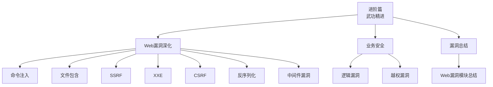
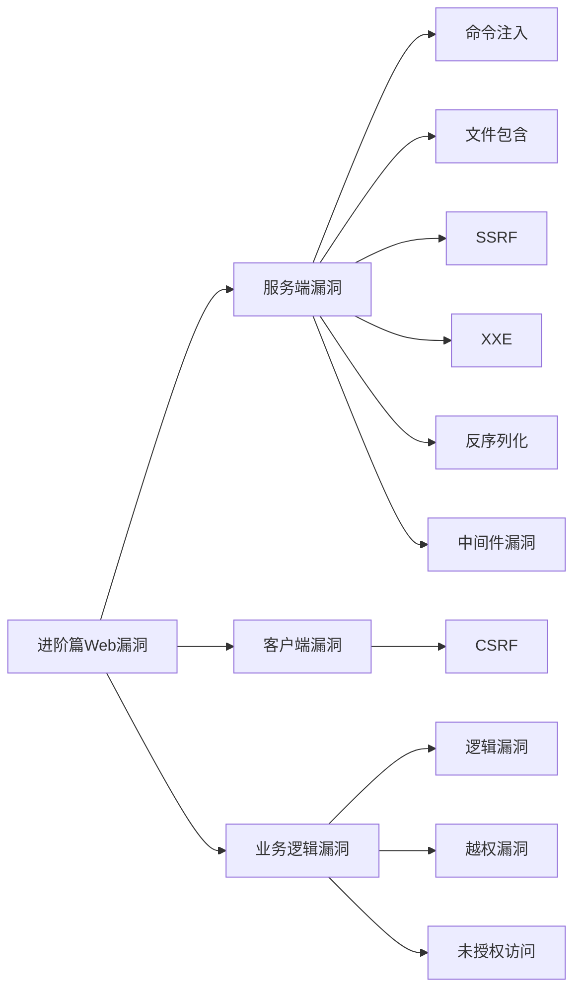
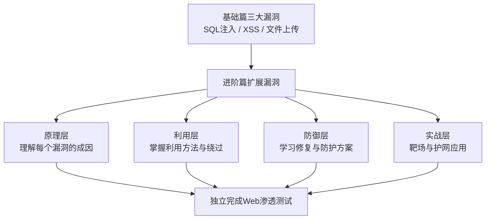

# 第0章 进阶篇总览

> **难度等级：🟡 中等级**
>
> **预计学习时间：60-90分钟**

---

## 📖 本章概述

::: tip 本章内容
恭喜你完成了基础篇的学习！

基础篇我们学习了三大漏洞：
- **SQL注入**：用户输入进了SQL语句
- **XSS**：用户输入进了HTML页面
- **文件上传**：用户上传了恶意文件

从这一章开始，我们正式进入**进阶篇**。

**基础篇和进阶篇有什么区别？**

打个比方：
- 基础篇 = 学开车的基本操作（方向盘、油门、刹车）
- 进阶篇 = 学复杂路况驾驶（高速、夜路、雨雪天）

基础篇学的是"是什么"和"怎么用"，
进阶篇学的是"为什么"和"怎么绕"。

**进阶篇要学什么？**

在基础篇的基础上，进阶篇会展开更多Web漏洞类型：

| 模块 | 漏洞 | 核心问题 |
|------|------|---------|
| 模块一 | 命令执行 | 用户输入进了系统命令 |
| 模块二 | 文件包含 | 用户控制了包含的文件路径 |
| 模块三 | CSRF | 用户身份被冒用发请求 |
| 模块四 | SSRF | 服务器帮用户访问了不该去的地方 |
| 模块五 | 逻辑漏洞 | 业务规则被绕过了 |

这些漏洞在真实渗透测试中非常常见，
而且经常多个漏洞组合利用。

这一章是一个**导航和地图**，帮你建立进阶篇的全局认知。
时间不长，但很重要——看完了，你就知道后面路怎么走了。
:::

---

## 🎯 学习目标

读完本章，你将能够：

- [x] 清楚进阶篇要学哪些内容
- [x] 理解基础篇和进阶篇的区别
- [x] 知道每个漏洞的核心原理（一句话概括）
- [x] 了解进阶篇各模块之间的关系
- [x] 明确进阶篇的学习路线和时间规划
- [x] 知道每个漏洞在实际渗透中的角色

---

## 📚 知识导图

**图I-1 进阶篇学习路线图**


> 🗺️ **知识导图**：知识导图示例，建议自己动手绘制学习路线图

---

## 🔍 进阶篇正文：各模块详解

在正式进入每个模块之前，先用最短的语言把每个漏洞讲清楚，
让你知道"这个漏洞到底是怎么回事"。

### 模块一：命令执行（day031-033）

**一句话理解：** 用户在输入框里输入了系统命令，服务器傻傻地执行了。

**类比：** 你去银行柜台说"查询余额"，柜员查了。但如果你说"查询余额；删除账户"，
聪明的柜员会拒绝，不聪明的就真删了。

**为什么危险？** 一旦能执行系统命令，整台服务器就在你手里了。
你可以在上面干任何事——查看文件、下载木马、反弹Shell、横向移动...

**典型漏洞代码：**
```php
// 开发者以为用户只会输入一个IP地址
$ip = $_GET['ip'];
system("ping -c 1 " . $ip);
// 用户输入: 127.0.0.1; cat /etc/passwd
// 实际执行: ping -c 1 127.0.0.1; cat /etc/passwd
```

### 模块二：文件包含（day034-036）

**一句话理解：** 用户控制了程序要加载的文件，服务器去加载了不该加载的文件。

**类比：** 你去图书馆说"我想看《计算机网络》"，管理员拿来给你。
但如果你说"我想看 /etc/passwd"（密码文件），管理员居然也去拿了！

**为什么危险？** 可以通过文件包含读取敏感文件（如密码文件、数据库配置），
甚至可以远程加载恶意代码执行，直接拿Shell。

**基本分两类：**
- **LFI（本地文件包含）**：只能包含本服务器的文件
- **RFI（远程文件包含）**：可以包含其他服务器上的文件

### 模块三：CSRF 跨站请求伪造（day037）

**一句话理解：** 攻击者伪造了一个看起来很正常的请求，用户在不知情的情况下"帮"攻击者执行了操作。

**类比：** 你登录了银行网站（浏览器里有你的登录Cookie）。
你收到一封钓鱼邮件，里面有一张"可爱猫咪"的图片。
但你不知道的是，这张"图片"实际上是一个转账请求——
你一看图片，浏览器就自动用你的登录态向银行发了个转账请求。
（因为浏览器看到你登录过银行，自动带着Cookie）

**为什么危险？** 用户完全不知情，看起来什么都没干，但实际上已经"操作"了。

### 模块四：SSRF 服务端请求伪造（day038）

**一句话理解：** 攻击者让服务器代替自己去访问一些敏感的内部地址。

**类比：** 你去公司前台说"帮我去这家店取个外卖"。
前台帮你取回来了。但如果你说"帮我去总裁办公室拿份文件"，
聪明的会拒绝，不聪明的真去拿了。

**为什么危险？** 服务器通常有权限访问内网资源（数据库、缓存、内部API），
而攻击者从外部无法直接访问这些。通过SSRF，攻击者可以利用服务器当"跳板"，
探测和攻击内网。

### 模块五：逻辑漏洞（day040）

**一句话理解：** 业务逻辑设计有缺陷，攻击者用"合法"的方式做了"不合法"的事。

**类比：** 商场搞活动"满100减50"。
正常逻辑：你买100块东西，付款50。
漏洞逻辑：你下单100块，用优惠券减了50，然后退货——
系统退了你100块钱（忘记你用了优惠券），你白赚50块。

**为什么危险？** 逻辑漏洞往往不需要什么技术含量，但影响很大。
而且每个业务的逻辑都是独特的，自动化扫描工具很难发现，
需要人工分析和脑洞。

**这几个漏洞的关系图如下：**

**图I-2 进阶篇章节组织架构图**



### 进阶篇漏洞分类：服务端 vs 客户端 vs 逻辑

所有Web漏洞可分为三大类。
理解这个分类，比单独记每个漏洞更有用：

**服务端漏洞**（攻击目标在服务器上）：
- 命令执行：直接控制服务器命令
- 文件包含：读取/执行服务器文件
- SSRF：利用服务器访问内网

**客户端漏洞**（攻击目标在用户浏览器上）：
- CSRF：冒用用户身份进行操作

**逻辑漏洞**（攻击目标是业务规则）：
- 越权：看到不该看的，做不该做的
- 支付漏洞：少付钱多拿东西
- 验证码绕过：绕过人机验证

> 💡 分类的意义：服务端漏洞→打服务器；客户端漏洞→打用户；逻辑漏洞→打业务。

**图I-3 进阶篇核心漏洞类型全景图**



### 学习路径与时间规划

进阶篇大约需要**8-10周**的时间。
建议按照下面的节奏来，不要跳，每个模块之间是有依赖关系的：

1. **先学命令执行** → 这是最"直接"的漏洞，能让你体会到"控制服务器"的快感
2. **再学文件包含** → 和命令执行有很多相似之处（都是输入处理问题），有对比学得更快
3. **接着学CSRF和SSRF** → 这两个名字很像，放一起对比学，避免混淆
4. **最后学逻辑漏洞** → 最考验脑洞，也最需要前面积累的Web知识

建议每周4-5小时，2周搞定一个模块。

**图I-4 进阶篇学习时间规划甘特图**

```mermaid
gantt
    title 进阶篇学习时间规划（约8-10周）
    dateFormat X
    axisFormat 第%s周

    section 命令注入
    原理与函数学习           :a1, 0, 1
    绕过与利用实战           :a2, 1, 1

    section 文件包含
    LFI与伪协议              :b1, 2, 1
    日志/Session包含         :b2, 3, 1

    section SSRF与XXE
    SSRF原理与利用           :c1, 4, 1
    XXE漏洞利用              :c2, 5, 1

    section CSRF与逻辑漏洞
    CSRF与越权               :d1, 6, 1
    逻辑漏洞挖掘             :d2, 7, 1

    section 反序列化与中间件
    反序列化漏洞             :e1, 8, 1
    中间件漏洞               :e2, 9, 1

    section 总结
    Web漏洞总结复习          :milestone, m1, 10, 0
```



### 4. 注意事项

**图I-5 进阶篇知识体系框架图**



---

## 💡 进阶篇学习心法

在进入正式学习之前，送大家几条建议，这些建议是前人的经验总结：

### 心法一：从"大一统视角"看漏洞

我们在基础篇总复习里说过了：
> **所有Web漏洞的本质都是：用户的输入进入了不该去的地方。**

在进阶篇，你会反复验证这个公式。每学一个新漏洞，套进去：
- 用户输入了什么？（文件、URL、参数、请求体...）
- 输入去了哪里？（命令行、文件系统、HTTP请求、业务逻辑...）
- 造成了什么后果？（代码执行、信息泄露、身份冒用、越权操作...）

### 心法二：善用对比学习

进阶篇的几个漏洞很容易混淆，特别是：
- **SSRF vs CSRF**：名字差一个字母，原理完全不同！
  - SSRF：S=Server，服务器端发请求 → 打内网
  - CSRF：C=Cross，客户端跨站请求 → 打用户
- **命令执行 vs 代码执行**：经常被混为一谈
  - 命令执行：执行的是系统命令（whoami、ls、cat...）
  - 代码执行：执行的是编程语言代码（eval、assert...）

建议你把容易混淆的放在一起对比，一眼看出区别。

### 心法三：先理解"为什么能绕过"

进阶篇有很多绕过技巧。不要死记硬背每一个Payload，
先理解"为什么能绕过"——通常是验证逻辑和实际处理逻辑不一致。
理解了这个本质，你甚至能自己发明绕过方法。

---

## 📚 场景案例：一个真实的渗透链条

在开始学习具体的漏洞之前，先让你们感受一下，
这些漏洞在真实的渗透场景中是怎么组合使用的。

假设你是一个渗透测试人员，目标是某公司的内部OA系统。

**阶段一：信息收集**
你发现OA系统有一个上传头像的功能。
→ 涉及漏洞：**文件上传**

**阶段二：GetShell**
头像上传只有前端验证，你用Burp绕过，上传了一个PHP WebShell。
但问题是——文件后缀是.jpg，怎么执行？
你发现服务器是Nginx，而且 `cgi.fix_pathinfo=1`。
你访问 `/upload/avatar.jpg/1.php`，PHP代码执行了！
→ 涉及漏洞：**解析漏洞 + 文件上传**

**阶段三：内网探测**
拿到WebShell后，你在服务器上执行 `ifconfig`，发现有两个网卡——
一个对外（公网），一个对内（192.168.x.x）。
你从外部无法直接访问内网，但你已经在这台服务器上了。
→ 涉及漏洞：**命令执行**

**阶段四：横向移动**
你发现服务器上有一个内部API的配置文件，里面有数据库密码。
你用这个密码连上了内网的MySQL，发现了一个管理员账号表。
→ 涉及漏洞：**文件包含**（读取了配置文件）

**阶段五：权限提升**
你用管理员账号登录了OA系统，但发现还有个"系统管理员"角色才有最高权限。
你试着把 `role=user` 改成 `role=admin` 发送请求——居然成功了！
→ 涉及漏洞：**逻辑漏洞（越权）**

**这个例子说明什么？**
> **真实渗透中，没有哪个漏洞是独立存在的。**
> 它们像链条一样，一环扣一环——上一个漏洞给你提供了新的入口，
> 你用新的入口再挖掘新的漏洞，最终渗透整个系统。

进阶篇要学的这些漏洞，就是你们在这条"渗透链"上的每一个环节。

---

## ✏️ 课后习题

### 选择题

1. 以下哪个属于服务端漏洞？
   - A. CSRF
   - B. XSS
   - C. 命令执行
   - D. 逻辑漏洞

2. SSRF和CSRF的区别是什么？
   - A. 前者攻击服务器，后者攻击客户端
   - B. 前者攻击客户端，后者攻击服务器
   - C. 两者完全一样
   - D. 两者都没有危害

3. "用户输入进了系统命令"描述的是哪个漏洞？
   - A. 文件包含
   - B. 命令执行
   - C. CSRF
   - D. SSRF

4. 文件包含漏洞中，LFI指的是？
   - A. 远程文件包含
   - B. 本地文件包含
   - C. 任意文件读取
   - D. 文件上传

5. SQL注入和命令执行有什么共同点？
   - A. 都是攻击客户端
   - B. 都涉及用户输入进入了不该去的地方
   - C. 都只能读取数据
   - D. 都没什么危害

### 填空题

1. 进阶篇的五大模块分别是：______、______、______、______、______。

2. 所有Web漏洞的本质可以概括为：用户的______进入了不该去的______。

3. 文件包含分两类：______和______。

4. CSRF全称是______，SSRF全称是______。

5. 逻辑漏洞最常见的三种是：______、______、______。

### 简答题

1. 基础篇和进阶篇有什么区别？请用自己的话概括。

2. 用一句话解释每个漏洞的核心原理（命令执行、文件包含、CSRF、SSRF、逻辑漏洞）。

3. 为什么说"漏洞组合利用"比单个漏洞更有威力？请举例说明。

4. 你如何看待"攻击"和"防御"的关系？

---

## 📝 本章小结

这一章是整个进阶篇的**导航地图**。
虽然没有讲具体的漏洞技术，但帮你在脑海中建立了一个大框架：

1. **进阶篇五大模块**：命令执行 → 文件包含 → CSRF → SSRF → 逻辑漏洞
2. **每个漏洞一句话理解**：用户输入去了不该去的地方
3. **漏洞分类**：服务端、客户端、逻辑
4. **学习心法**：大一统视角、对比学习、理解本质

> 记住，安全学习不是因为聪明才能学会，
> 而是因为**坚持**才能学会。
>
> 进阶篇比基础篇更难一些，但这恰恰是拉开差距的地方。
> 别人在放弃的时候，你在坚持——
> 你就已经赢了。
>
> 准备好了吗？
> 下一章，命令执行！
> 让我们开始进阶篇的第一站。

---

## 🔗 相关链接

- [⬅️ 上一章：---](/redteam/day029-basic-基础篇总复习)
- [➡️ 下一章：---](/redteam/day031-advanced-命令执行基础)
- [📖 返回全书目录](/redteam/day118-toc-全书目录)
