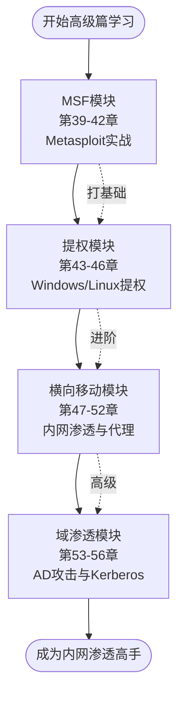
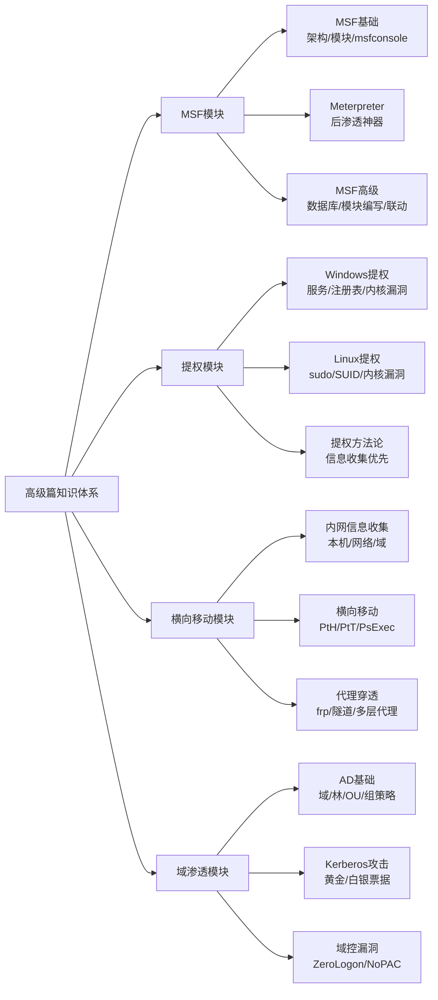

# 第39章 高级篇总览

> **难度等级：🟠 高等级**
>
> **预计学习时间：60-90分钟**

---

## 📖 本章概述

::: tip 本章内容
恭喜你，完成了进阶篇的学习！

进阶篇你学会了什么？SQL注入、XSS、文件上传、命令执行、CSRF、SSRF、逻辑漏洞...这些都是**单个漏洞的攻防**。你学会的是"怎么挖一个洞"、"怎么打一个点"。

但高级篇不一样。**高级篇教你的不是"怎么打一个点"，而是"怎么打一场仗"。**

在真实的红队行动中：你不是在打一个网站，你是在打一个**企业网络**。你拿到了一个WebShell，这只是**万里长征第一步**。真正的挑战是：怎么从这台机器打到另一台？怎么从普通用户变成SYSTEM？怎么从一台服务器控制整个内网？

这些就叫**后渗透（Post Exploitation）**。高级篇覆盖的就是：MSF/Meterpreter万能后渗透平台、Windows/Linux提权、横向移动、域渗透。

一句话总结：**进阶篇学的是"挖洞"，高级篇学的是"打仗"。**
:::

**图I-1 高级篇学习路线图**



---

## 🎯 学习目标

读完本章，你将能够：

- [x] 理解高级篇和进阶篇的本质区别
- [x] 从整体上把握高级篇四大模块的脉络
- [x] 理解红队攻击链的完整流程（从外网到域控）
- [x] 知道每个模块解决什么问题、学到什么技能
- [x] 掌握内网渗透的正确学习方法论
- [x] 对后续学习有清晰的预期和规划

**图I-2 高级篇四大模块知识体系架构图**



---

## 📚 知识导图

> 🗺️ **高级篇四大模块 + 它们分别解决什么问题：**

| 模块 | 解决的问题 | 典型场景 |
|------|-----------|---------|
| **MSF模块**（第39-42章） | 我拿到一个Shell后，用什么工具来操控？怎么优雅地管理后渗透全过程？ | 用msfconsole管理session、用Meterpreter做文件操作/抓密码/传文件、用msfvenom生成Payload |
| **提权模块**（第43-46章） | 我现在是普通用户（www-data/IIS AppPool），怎么变成SYSTEM或root？ | Windows找服务配置错误/注册表漏洞，Linux找SUID/sudo配置问题，内核漏洞一击必杀 |
| **横向移动模块**（第47-50章） | 我已经控制了一台机器，怎么跳到下一台？内网怎么穿代理？ | 哈希传递(PtH)、票据传递(PtT)、PsExec/WMI远程执行、frp/chisel代理穿透 |
| **域渗透模块**（第51-54章） | 目标在内网有Windows域环境，怎么拿下域控？ | Kerberos攻击（黄金/白银票据）、Kerberoasting、AS-REP Roasting、域内提权到域管 |

---

## 🔍 正文内容：高级篇四大模块详解

### 1. 模块一：MSF（Metasploit Framework）—— 第39-42章

> "MSF是红队人员的瑞士军刀，你可以不会用菜刀，但必须会用MSF。"

**为什么先学MSF？**

MSF是整个后渗透操作的"操作系统"级别的平台。它提供了：
- **统一的Payload生成**：msfvenom，告别自己编译exe
- **统一的Session管理**：同时控制N台机器，一键切换
- **丰富的后渗透模块**：抓密码、传文件、键盘记录、截图...几百个模块
- **数据库支持**：记录所有扫描结果、主机信息，形成内网地图
- **模块化架构**：Ruby写的，你可以自己写模块扩展

**大白话说**：MSF就像一个"遥控器"，你通过它可以远程操控被你"攻破"的电脑。遥控器上有很多按钮：截图、偷文件、记录键盘输入、偷密码...你想做什么按对应的按钮就行。

**学习重点**：
- msfconsole界面的使用（别被命令行吓到，其实很好用）
- msfvenom生成各种Payload（不同平台、不同编码）
- Meterpreter这个"高级遥控器"（比普通Shell好用100倍）
- 和Cobalt Strike的联动（CS是更高级的红队平台）

### 2. 模块二：提权 —— 第43-46章

> "拿到一个低权限Shell就像进了大楼大厅，你还上不了顶楼。"

**为什么提权这么重要？**

你通过Web漏洞拿到一个Shell，大概率是低权限的：
- IIS网站 → IIS AppPool\DefaultAppPool（基本什么都不能干）
- Apache/Nginx → www-data（也是受限用户）
- 甚至可能是docker容器里（更受限）

低权限你能做什么？几乎什么都不能：
- 抓不到密码（需要管理员/SYSTEM权限才能读SAM文件）
- 装不了软件（没权限写系统目录）
- 端口转发受限（很多工具需要管理员权限）

**所以提权是后渗透的第一个关键步骤。**

**学习重点**：
- **Windows提权**：内核漏洞（最直接）、服务配置错误（最常见）、计划任务、AlwaysInstallElevated、Potato系列、UAC绕过
- **Linux提权**：sudo配置问题（最经典）、SUID文件利用、计划任务、通配符注入、内核漏洞、容器逃逸
- **方法论**：信息收集永远是第一步！先搞清楚"我是谁、我在哪、我有什么权限、系统有什么版本"

### 3. 模块三：横向移动 —— 第47-50章

> "你已经占了一座楼，现在是时候打通整个城市了。"

**什么是横向移动？**

你已经控制了一台内网机器（比如Web服务器），现在要"跳到"其他机器：
- 从Web服务器跳到数据库服务器
- 从数据库服务器跳到文件服务器
- 从文件服务器跳到域控制器（最终目标）

**为什么能"跳"？**

因为在Windows内网里，很多机器用着相同的账号密码（或者类似的）。
只要你能从一台机器上"偷"到管理员密码/哈希值，
就可以用这个凭证去登录其他机器。

**学习重点**：
- **哈希传递（Pass-the-Hash）**：不破解密码，直接用NTLM哈希登录其他机器
- **票据传递（Pass-the-Ticket）**：在域环境中，用Kerberos票据来证明身份
- **远程执行工具**：PsExec、WMI、WinRM、DCOM
- **代理穿透**：内网机器不出网怎么办？frp、chisel、nps帮你建立隧道

> 💡 **大白话理解横向移动**
>
> 横向移动就像病毒传播：
> 你感染了第一台电脑 → 在这台电脑上找到"通讯录"（内网其他机器地址）
> → 偷到"钥匙"（密码/哈希值/票据）→ 用这把钥匙去开其他门的锁
> → 感染第二台 → 重复这个过程 → 直到你找到最终目标（域控）。

### 4. 模块四：域渗透 —— 第51-54章

> "域控是整个内网的王座，谁控制了域控，谁就控制了整个内网。"

**什么是域？**

Windows域就像一个公司的"中央管理系统"：
- 所有员工的电脑都加入一个"域"
- 域控制器(Domain Controller, DC)管理所有账号、密码、权限
- 登录某台电脑时，实际是去DC"打卡验证"

**域渗透的目标**：拿下域控制器（DC），拿到域管理员权限（Domain Admin）。

**学习重点**：
- **Kerberos协议**：域认证的核心协议，理解了它才能理解各种票据攻击
- **凭据收集**：Mimikatz抓内存中的密码、LSASS dump、SAM文件
- **Kerberoasting**：破解服务账号的密码
- **黄金票据/白银票据**：伪造Kerberos票据，想进哪台进哪台
- **DCSync**：从DC同步所有用户的哈希值
- **域信任关系利用**：跨域攻击


## 🔗 红队攻击链：高级篇全景视角

> 💡 **大白话说"从打Web到打内网"的关键转变**
>
> 很多同学学完进阶篇会有一个困惑：
> "我已经会用SQL注入拿网站数据库了，为什么还要学MSF、提权、横向移动？"
>
> 答案是：因为真实世界里的目标不是"一个网站"，而是"一个企业网络"。
>
> 用战争来比喻：
> - **进阶篇** = 你学会了"攻城"——用大炮轰开城门（SQL注入/文件上传拿到WebShell）
> - **高级篇** = 你学会了"打一场完整的战役"——进城之后呢？怎么占领全城？
>
> 具体来说：
> - **进城之后，你只是个小兵**（低权限的WebShell）→ 需要**提权**当将军
> - **你占领了城门，但城里还有内城、皇宫**（内网其他服务器）→ 需要**横向移动**
> - **城市有中央指挥系统管理所有士兵**（域控制器）→ 需要**域渗透**
>
> 而MSF是什么呢？是你的**全副武装**——没有枪你只能肉搏，有了MSF你就有了坦克飞机。
>
> 所以高级篇的核心不是教你打更多种"城门"（那些进阶篇已经学过了），
> 而是教你：**进了城之后怎么把整座城拿下**。
> 这才是红队真正的工作内容！

高级篇所有模块不是孤立的，它们串成了一条完整的**红队攻击链**：

```
[外网打点] → [MSF接管] → [提权] → [凭据收集] → [横向移动] → [域渗透] → [最终目标]
    ↑                                          ↓
    └────────── [代理穿透 往复循环] ────────────┘
```

1. **外网打点**：通过进阶篇学到的Web漏洞（SQL注入、文件上传等）拿到第一个Shell
2. **MSF接管**：用MSF接收Shell，生成更稳定的Meterpreter会话
3. **提权**：从低权限提升到SYSTEM/root，解锁所有操作能力
4. **凭据收集**：Mimikatz抓密码、导出哈希值、获取Kerberos票据
5. **横向移动**：用偷到的凭据跳板到内网其他机器
6. **域渗透**：利用域环境的特性，拿下域控制器
7. **权限维持+清理痕迹**：留后门、清日志

这就像下棋，每一步都为下一步铺路。

---

## 💻 高级篇学习方法论

### 1. 环境准备

高级篇需要**实验环境**，不可能在别人网站上学：
- **搭建本地靶场**：用虚拟机搭建Windows域环境（如果有条件）
- **在线靶场**：HackTheBox、TryHackMe的内网渗透系列
- **至少需要**：1台Kali攻击机 + 1-2台Windows靶机 + 1台Linux靶机

### 2. 学习节奏建议

- MSF模块：边学边操作，msfconsole命令要形成肌肉记忆
- 提权模块：先在靶机上把每种提权方法都试一遍
- 横向移动：必须在域环境中才能体会，单机学不会
- 域渗透：最复杂，建议安排较长时间

### 3. 常见坑和提醒

> ⚠️ **高级篇最容易踩的坑：**
>
> 1. **"看了就是会了"**：高级篇必须动手！不动手绝对学不会！
> 2. **环境没搭好就硬学**：内网渗透没有环境等于纸上谈兵
> 3. **只记命令不理解原理**：不知道为什么这样能提权，换个场景就不会了
> 4. **急于求成**：提权需要耐心，收集信息充分再动手，不要上来就试内核exp

---

## 📚 案例讲解

### 案例1：一条完整的红队攻击链

**场景**：某企业有一个对外Web应用，内网有域环境。

**攻击过程**：
1. **外网打点**：Web应用存在文件上传漏洞 → 上传WebShell → 拿到IIS的低权限Shell
2. **MSF接管**：生成Meterpreter Payload → 用WebShell下载执行 → 获得Meterpreter会话
3. **提权**：主机存在UAC绕过漏洞 → 从IIS AppPool提升到SYSTEM
4. **信息收集**：`ipconfig`发现双网卡 → 192.168.x.x段有大量存活主机 → 是内网！
5. **凭据收集**：Mimikatz导出内存中的密码 → 拿到一个域用户账号
6. **横向移动**：用PsExec以该域用户身份执行 → 成功登录文件服务器
7. **蛛网扩张**：在文件服务器上又抓到管理员Hash → 传递到更多机器
8. **域渗透**：最终在一台机器上发现了域管登录痕迹 → 抓到域管Hash → DCSync拿域控
9. **目标达成**：域控被完全控制。

**启示**：整个攻击链环环相扣，每一步都是下一步的基础。

### 案例2：提权的重要性

如果你不提权，下面的事情都没法做：
- Mimikatz抓密码 → 需要SYSTEM/管理员权限
- 安装持久化后门 → 需要写系统目录
- 端口转发/代理 → 部分工具需要管理员权限
- 访问其他服务 → 有时候需要更高权限

**这就是为什么"提权"是高级篇的第二个模块。**

---

## ✏️ 课后习题

### 选择题

1. 高级篇的核心主题是什么？
   - A. Web漏洞挖掘（SQL注入、XSS等）
   - B. 后渗透技术（提权、横向移动、域渗透）
   - C. 网络扫描与信息收集
   - D. 逆向工程与二进制安全

2. 以下哪个不属于高级篇的四大模块？
   - A. MSF模块
   - B. 提权模块
   - C. XSS模块
   - D. 域渗透模块

3. Meterpreter是什么？
   - A. 一个Web漏洞扫描器
   - B. MSF中的高级Payload，提供丰富的后渗透功能
   - C. 一个密码破解工具
   - D. 一个内网代理工具

4. 横向移动中，PtH是什么的缩写？
   - A. Pass-the-Handle
   - B. Pass-the-Hash（哈希传递）
   - C. Pass-the-Host
   - D. Pass-the-HTTP

5. Windows域环境中，管理所有用户账号和权限的核心服务器叫什么？
   - A. Web Server
   - B. Domain Controller（域控制器）
   - C. File Server
   - D. DNS Server

6. "从普通用户变成SYSTEM/root"这个操作叫？
   - A. 横向移动
   - B. 域渗透
   - C. 提权
   - D. 免杀

### 填空题

1. 高级篇的四大模块是：_______、_______、_______、_______。
2. MSF全称是 _______。
3. 后渗透（Post Exploitation）指的是拿到Shell之后的操作，主要包括 _______、_______、_______ 等。
4. 在红队攻击链中，拿到第一个Shell之后的第一步通常是 _______。
5. Mimikatz是一个用来从Windows内存中抓取 _______ 的工具。

### 简答题

1. 高级篇和进阶篇的核心区别是什么？用你自己的话描述。
2. 简述红队攻击链的完整流程（从外网到域控）。
3. 为什么提权是后渗透的第一个关键步骤？
4. 横向移动的核心思路是什么？
5. 你准备用什么环境来练习高级篇的内容？

---

## 📝 本章小结

这一章我们了解了高级篇的全貌：

### 高级篇的本质
- **进阶篇**：学"怎么进来"（Web漏洞利用）
- **高级篇**：学"进来之后怎么办"（后渗透）
- 从打一个点变成打一张网

### 四大模块
1. **MSF模块**：后渗透万能平台，生成Payload、管理Session、跑后渗透模块
2. **提权模块**：从低权限到高权限，解锁所有操作能力
3. **横向移动模块**：在内网中扩张控制范围，一台一台地拿下
4. **域渗透模块**：最终目标——控制域控，拿下整个域

### 学习建议
- **必须动手**：只看不练等于白学
- **搭好环境**：虚拟机靶场是刚需
- **理解原理**：不要只记命令，要懂为什么
- **循序渐进**：从MSF开始，先把基础工具用熟

准备好了吗？
让我们正式开始高级篇的征程！
第一个模块：**Metasploit实战**。
MSF是整个后渗透的基石，
学会了它，
你才算真正踏入了红队的大门。

我们下一章见！

---

## 🔗 相关链接

- [⬅️ 上一章：进阶篇总复习](/redteam/day043-advanced-进阶篇总复习)
- [➡️ 下一章：MSF基础入门](/redteam/day045-senior-MSF基础入门)
- [📖 返回全书目录](/redteam/day118-toc-全书目录)
