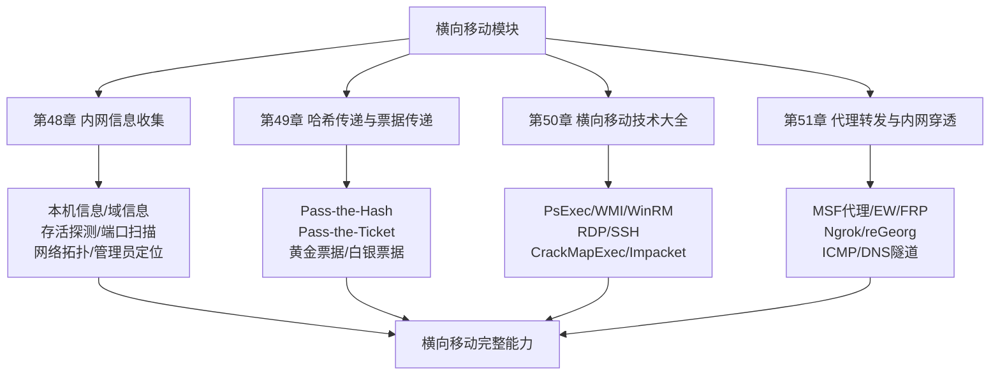
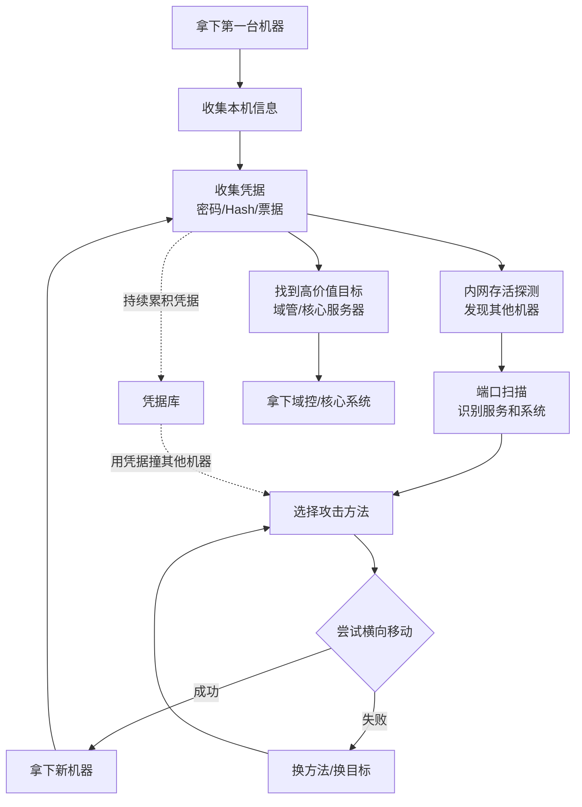
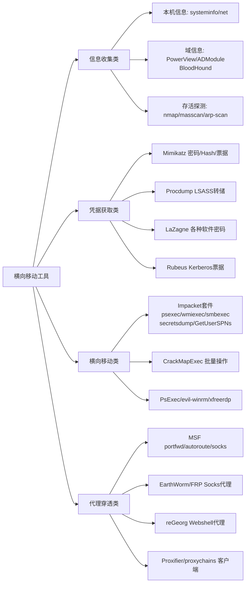
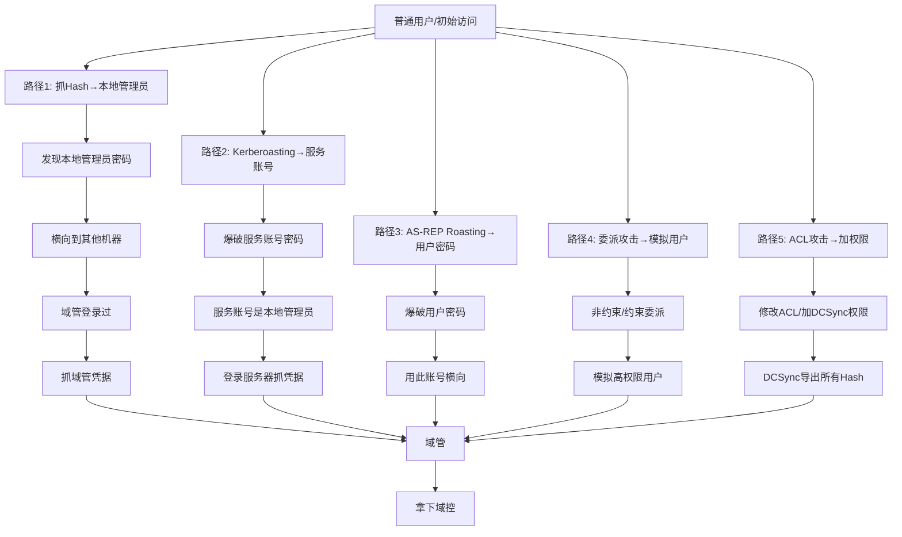
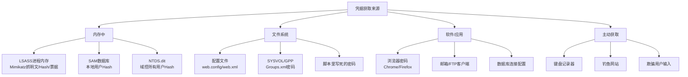
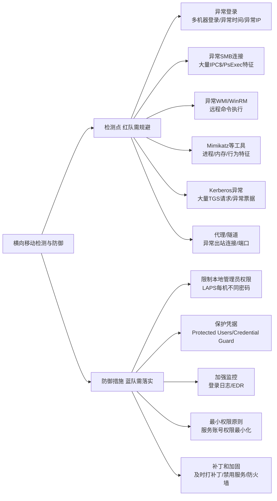

# 第52章 总结与回顾：横向移动模块

> **难度等级：🟠 高等级**
>
> **预计学习时间：90分钟**
>
> **本章看点：横向移动知识图谱、横向移动路径总结、工具汇总、面试题精选、护网实战经验、5个综合案例**

::: tip 说明
恭喜你！
横向移动模块我们就学完了。

这四章的内容非常多：
- 第48章：内网信息收集
- 第49章：哈希传递与票据传递
- 第50章：横向移动技术大全
- 第51章：代理转发与内网穿透

这一章我们来做一个
全面的总结和回顾，
把知识点串起来，
形成完整的知识体系。

同时也会分享一些
面试题和实战经验，
帮你更好地掌握和应用。

准备好了吗？
开始！
:::

---

## 📖 本章概述

::: tip 写在前面
横向移动是内网渗透的核心，
也是护网红队的基本功。

为什么叫"横向移动"呢？
因为内网里的机器
大多是同一权限级别的，
比如都是普通用户机器，
我们从一台跳到另一台，
就像横着走一样，
所以叫"横向移动"。

对应的还有"纵向移动"，
也就是提权，
从低权限升到高权限，
是往上走的。

这一章我们会从以下几个方面
来做总结：

1. **知识图谱** — 整体框架
2. **核心概念** — 必背知识点
3. **工具汇总** — 常用工具大全
4. **路径总结** — 常见的攻击路径
5. **检测与防御** — 蓝队视角
6. **面试题精选** — 常见面试题
7. **实战经验** — 护网中的经验
8. **综合案例** — 5个完整案例

内容比较多，
建议大家慢慢看，
好好消化。
:::

---

## 🎯 学习目标

学完本章，你将能够：

- [x] 建立横向移动的完整知识体系
- [x] 掌握横向移动的核心概念和技术
- [x] 熟悉常用的横向移动工具
- [x] 理解常见的横向移动路径
- [x] 了解横向移动的检测与防御
- [x] 能够回答常见的面试题
- [x] 为域渗透学习打下基础

---

## 🧠 横向移动知识图谱

### 1.1 整体框架

横向移动模块的整体框架：

```
横向移动
├── 第一步：信息收集
│   ├── 本机信息收集
│   ├── 域信息收集
│   ├── 内网存活探测
│   ├── 端口扫描与服务识别
│   ├── 网络拓扑绘制
│   └── 管理员定位
│
├── 第二步：凭据获取
│   ├── Hash抓取
│   │   ├── Mimikatz
│   │   ├── Procdump
│   │   ├── 注册表导出
│   │   ├── LSASS内存
│   │   └── SAM数据库
│   ├── 票据获取
│   │   ├── Kerberos票据
│   │   ├── 黄金票据
│   │   └── 白银票据
│   ├── 密码抓取
│   │   ├── 明文密码
│   │   ├── 浏览器密码
│   │   ├── 无线网络密码
│   │   └── 各种软件密码
│   └── 其他凭据
│       ├── SSH密钥
│       ├── 数据库密码
│       ├── 配置文件密码
│       └── GPP密码
│
├── 第三步：横向移动技术
│   ├── 基于Hash的
│   │   ├── Pass-the-Hash（哈希传递）
│   │   ├── Pass-the-Ticket（票据传递）
│   │   └── Overpass-the-Hash
│   ├── 远程执行
│   │   ├── PsExec
│   │   ├── WMI
│   │   ├── WinRM
│   │   ├── DCOM
│   │   ├── SCM服务控制
│   │   ├── 计划任务
│   │   └── 注册表远程操作
│   ├── 远程连接
│   │   ├── RDP远程桌面
│   │   ├── SSH
│   │   └── Telnet/VNC等
│   ├── 数据库横向
│   │   ├── MSSQL
│   │   ├── MySQL
│   │   └── Redis
│   ├── SMB相关
│   │   ├── IPC$共享
│   │   ├── SMBexec
│   │   └── 文件共享
│   └── 其他
│       ├── WMI事件订阅
│       ├── NTLM Relay
│       └── ...
│
└── 第四步：代理与穿透
    ├── 端口转发
    ├── Socks代理
    ├── 正向代理
    ├── 反向代理
    ├── 多层代理
    ├── Webshell代理
    └── 协议隧道（ICMP/DNS）
```

**图52-1 横向移动模块四章知识体系图**



### 1.2 核心流程图

典型的横向移动流程：

```
拿下第一台机器
    ↓
收集本机信息
    ↓
收集凭据（密码/Hash/票据）
    ↓
内网存活探测 → 发现其他机器
    ↓
端口扫描 → 识别服务和系统
    ↓
选择攻击方法 → 尝试横向移动
    ↓
成功？→ 是 → 拿下新机器 → 继续收集 → 继续横向
        ↓ 否
    换方法/换目标
    ↓
...
    ↓
找到高价值目标（域管、核心服务器等）
```

**图52-2 横向移动核心循环流程图**



---

## 📚 核心概念速记

### 2.1 必背概念

**1. Pass-the-Hash（PtH，哈希传递）**
- 不用明文密码，用NTLM Hash直接认证
- 原理：Windows认证时用的就是Hash，不是明文
- 条件：需要目标的用户名和NTLM Hash
- 工具：Mimikatz、Impacket、CrackMapExec等

**2. Pass-the-Ticket（PtT，票据传递）**
- 用Kerberos票据来认证
- 把别人的票据导入到自己的内存里
- 条件：需要有效的Kerberos票据
- 工具：Mimikatz、Rubeus等

**3. 黄金票据（Golden Ticket）**
- 伪造的TGT（票据授权票据）
- 用krbtgt的Hash来生成
- 拥有域内最高权限，可以访问任何服务
- 有效期：krbtgt改密码之前一直有效

**4. 白银票据（Silver Ticket）**
- 伪造的ST（服务票据）
- 用服务账号的Hash来生成
- 只能访问特定的服务
- 更隐蔽，因为不需要和DC通信

**5. Kerberoasting**
- 请求服务票据，然后离线爆破
- 只要有域用户权限就能做
- 目标是服务账号（有SPN的账号）
- 因为服务账号密码通常是固定的，而且权限高

**6. AS-REP Roasting**
- 针对没有预认证的用户
- 直接向KDC请求AS-REP
- AS-REP可以离线爆破
- 条件：用户设置了"不需要Kerberos预身份验证"

### 2.2 常见端口速记

横向移动中常见的端口：

| 端口 | 协议 | 服务 | 用途 |
|------|------|------|------|
| **22** | TCP | SSH | Linux远程连接 |
| **80/443** | TCP | HTTP/HTTPS | Web服务 |
| **135** | TCP | RPC | WMI、DCOM等 |
| **139** | TCP | NetBIOS | SMB、文件共享 |
| **445** | TCP | SMB | 文件共享、PsExec等 |
| **3389** | TCP | RDP | 远程桌面 |
| **5985** | TCP | WinRM HTTP | PowerShell远程 |
| **5986** | TCP | WinRM HTTPS | PowerShell远程 |
| **3306** | TCP | MySQL | 数据库 |
| **1433** | TCP | MSSQL | 数据库 |
| **6379** | TCP | Redis | 缓存数据库 |
| **21** | TCP | FTP | 文件传输 |
| **23** | TCP | Telnet | 远程终端 |
| **53** | UDP/TCP | DNS | 域名解析 |
| **88** | TCP/UDP | Kerberos | 域认证 |
| **389** | TCP/UDP | LDAP | 目录服务 |
| **636** | TCP | LDAPS | LDAP over SSL |
| **464** | TCP/UDP | Kerberos密码更改 | |

### 2.3 常见工具分类

**信息收集类：**
- 本机信息：systeminfo、ipconfig、net等
- 域信息：PowerView、ADModule、BloodHound
- 存活探测：nmap、masscan、arp-scan
- 端口扫描：nmap、masscan、naabu

**凭据获取类：**
- Mimikatz：密码、Hash、票据抓取
- Procdump：转储LSASS进程
- LaZagne：各种密码抓取
- Mimikittenz：明文密码抓取
- Rubeus：Kerberos票据操作

**横向移动类：**
- Impacket套件：wmiexec、psexec、smbexec等
- CrackMapExec：综合横向工具
- PsExec：Sysinternals工具
- wmiexec.py：WMI远程执行
- evil-winrm：WinRM远程管理
- xfreerdp：RDP连接

**代理穿透类：**
- MSF：portfwd、autoroute、socks_proxy
- EarthWorm：Socks代理
- FRP：内网穿透
- reGeorg：Webshell代理
- Proxifier/proxychains：代理客户端

**图52-3 横向移动工具分类与用途全览图**



---

## 🛠️ 工具汇总详解

### 3.1 Impacket套件

**Impacket** 是Python写的一套
网络协议工具集，
里面有很多横向移动的神器。

**常用工具：**

| 工具 | 功能 |
|------|------|
| **psexec.py** | PsExec的Python实现，远程执行命令，返回交互式Shell |
| **wmiexec.py** | 通过WMI远程执行命令，半交互式Shell |
| **smbexec.py** | 通过SMB远程执行命令 |
| **atexec.py** | 通过计划任务远程执行命令 |
| **dcomexec.py** | 通过DCOM远程执行命令 |
| **secretsdump.py** | 转储SAM、LSA、NTDS.dit等，抓Hash |
| **GetNPUsers.py** | AS-REP Roasting |
| **GetUserSPNs.py** | Kerberoasting |
| **lookupsid.py** | SID枚举 |
| **smbclient.py** | SMB客户端 |
| **ticketer.py** | 生成黄金/白银票据 |
| **mssqlclient.py** | MSSQL客户端 |

**例子：**
```bash
# 用wmiexec远程执行命令（用Hash）
wmiexec.py -hashes aad3b435b51404eeaad3b435b51404ee:5fbc3d5fec82052ec409a62e1b5d8252 administrator@192.168.1.10

# 用secretsdump转储Hash
secretsdump.py -hashes ... administrator@192.168.1.10
```

Impacket是渗透测试必备神器，
功能非常强大，
建议深入学习。

### 3.2 CrackMapExec（CME）

**CrackMapExec（简称CME）** 是一个
后渗透工具，
主要用于大型网络的
横向移动和凭据验证。

**功能：**
- 批量SMB密码/Hash验证
- 批量WMI/WinRM执行命令
- 抓取密码、Hash
- 枚举域信息
- 等等...

**特点：**
- 支持批量操作，速度快
- 协议支持多：SMB、WinRM、MSSQL、SSH
- 功能丰富
- 红队常用

**例子：**
```bash
# 批量验证SMB密码
crackmapexec smb 192.168.1.0/24 -u administrator -p 'Password123'

# 批量执行命令
crackmapexec smb 192.168.1.0/24 -u administrator -H 'NTLM Hash' -x 'whoami'

# 抓取SAM
crackmapexec smb 192.168.1.10 -u admin -p pass --sam
```

### 3.3 Mimikatz

**Mimikatz** 不用多说了，
密码抓取神器，
内网渗透必备。

**常用功能：**
```
# 抓取明文密码、Hash、票据
privilege::debug
sekurlsa::logonpasswords

# 哈希传递
sekurlsa::pth /user:admin /domain:corp /ntlm:hash

# 票据操作
kerberos::list          # 列出票据
kerberos::ptt ticket.kirbi  # 导入票据
kerberos::golden ...    # 生成黄金票据

# 转储SAM
lsadump::sam

# 转储LSA
lsadump::secrets

# DCSync
lsadump::dcsync /domain:corp.com /user:krbtgt
```

Mimikatz功能太多了，
这里列的只是冰山一角。

### 3.4 BloodHound

**BloodHound** 是域渗透神器，
用图数据库可视化展示
域内的关系和攻击路径。

**功能：**
- 展示域内用户、组、计算机、OU等的关系
- 自动分析攻击路径
- 找到从普通用户到域管的最短路径
- 展示委派、ACL、会话等信息
- 非常直观，一目了然

**使用方法：**
1. 用SharpHound收集域内数据
2. 把数据导入BloodHound
3. 在界面上分析攻击路径

**常用查询：**
- Find Shortest Paths to Domain Admins
- Find Computers where Domain Users are Local Admin
- Find All Kerberoastable Users
- Find Principals with DCSync Rights
- ...

域渗透中，
BloodHound是必备神器，
能节省大量时间。

### 3.5 其他工具

**Rubeus：**
- C#写的Kerberos工具
- 功能：请求票据、传递票据、生成黄金票据等
- 比Mimikatz更专注于Kerberos
- 可以用.NET运行，免杀效果好一些

**PowerView：**
- PowerShell脚本，域信息收集
- 功能：枚举用户、组、计算机、OU、ACL等
- PowerSploit套件的一部分
- 现在也有C#版本（SharpView）

**LaZagne：**
- 各种密码抓取工具
- 支持浏览器、邮件、WiFi、数据库等
- 跨平台

**mimipenguin：**
- Linux版的Mimikatz
- 抓取Linux系统的明文密码

---

## 🛤️ 常见横向移动路径总结

### 4.1 从低到高的路径

**路径1：普通用户 → 本地管理员 → 域管**
```
普通用户机器
    ↓
抓Hash/密码 → 发现本地管理员密码
    ↓
用本地管理员横向到其他机器
    ↓
某台机器上有域管登录 → 抓域管凭据
    ↓
用域管凭据 → 登录域控
```

**路径2：普通用户 → Kerberoasting → 服务账号 → 域管**
```
普通域用户
    ↓
Kerberoasting → 爆破服务账号密码
    ↓
服务账号权限高 → 可能是本地管理员
    ↓
登录服务器 → 抓更高权限的凭据
    ↓
... → 域管
```

**路径3：普通用户 → AS-REP Roasting → 用户密码 → 横向**
```
普通域用户
    ↓
发现没有预认证的用户
    ↓
AS-REP Roasting → 爆破密码
    ↓
用这个用户的密码横向
    ↓
...
```

**路径4：普通用户 → 委派攻击 → 模拟其他用户**
```
普通用户/机器
    ↓
发现有约束委派或非约束委派
    ↓
利用委派 → 模拟其他用户
    ↓
模拟高权限用户 → 提权
```

**路径5：普通用户 → ACL攻击 → 给用户加权限**
```
普通用户
    ↓
发现对某个对象有写权限
    ↓
修改ACL → 给自己加权限
    ↓
比如：给自己加DCSync权限 → 直接DCSync
```

**图52-4 常见横向移动攻击路径汇总图**



### 4.2 凭据获取路径

**从哪里获取凭据？**

1. **内存中**
   - LSASS进程内存 → Mimikatz抓
   - 明文密码、NTLM Hash、Kerberos票据

2. **SAM数据库**
   - C:\Windows\System32\config\SAM
   - 本地用户的Hash
   - 注册表导出或者Mimikatz转储

3. **NTDS.dit**
   - 域控上的数据库
   - 所有域用户的Hash
   - DCSync或者直接拿文件

4. **配置文件**
   - 应用配置文件里的数据库密码
   - Web.config、web.xml等
   - 脚本里写死的密码

5. **SYSVOL / GPP**
   - 组策略首选项里的密码
   - SYSVOL共享里的Groups.xml
   - 有公开的解密方法

6. **浏览器/软件密码**
   - Chrome、Firefox保存的密码
   - 邮箱客户端、FTP客户端
   - 各种管理工具

7. **键盘记录 / 钓鱼**
   - 键盘记录器
   - 钓鱼网站
   - 欺骗用户输入

**图52-5 凭据获取来源分类图**



---

## 🔒 检测与防御（蓝队视角）

### 5.1 横向移动的检测

作为红队，
了解蓝队怎么检测，
才能更好地隐藏自己。

**常见的检测点：**

**1. 异常登录**
- 一个账号在很多台机器上登录
- 不常见的登录时间
- 不常见的登录来源IP
- 失败登录次数过多

**2. 异常SMB连接**
- 大量IPC$连接
- 一个IP扫描很多机器的445端口
- PsExec的特征（服务创建、命名管道）

**3. 异常WMI/WinRM连接**
- 大量WMI查询
- 远程WMI执行命令
- WinRM的异常连接

**4. Mimikatz等工具检测**
- 进程特征
- 内存特征
- 行为特征（debug权限、读取LSASS）

**5. Kerberos异常**
- 大量TGS请求（Kerberoasting）
- 异常的票据
- 黄金票据/白银票据的特征

**6. 代理/隧道检测**
- 异常的出站连接
- 异常的端口
- 流量特征异常

### 5.2 防御建议

**从蓝队的角度，怎么防御横向移动？**

1. **限制本地管理员权限**
   - 不要让域用户是本地管理员
   - 每台机器的本地管理员密码不一样（LAPS）

2. **保护凭据**
   - 不要用域管登录普通机器
   - 启用Protected Users组
   - 启用Credential Guard
   - 限制管理员登录的机器

3. **加强监控**
   - 登录日志监控
   - 异常行为检测
   - 端点检测与响应（EDR）

4. **最小权限原则**
   - 用户只给必要的权限
   - 服务账号权限最小化
   - 定期清理无用账号

5. **补丁和加固**
   - 及时打补丁
   - 禁用不必要的服务
   - 防火墙限制内网访问

**图52-6 横向移动检测点与防御措施对照图**



---

## 💼 面试题精选

### 6.1 基础题

**Q1：什么是哈希传递（Pass-the-Hash）？原理是什么？**

> A：哈希传递是一种攻击技术，攻击者不用明文密码，直接用用户的NTLM Hash来进行身份认证，从而访问目标系统。
>
> 原理：Windows的NTLM认证过程中，客户端发送给服务器的就是密码的NTLM Hash（经过挑战响应），而不是明文密码。所以只要拿到了Hash，就可以用来认证，不需要知道明文密码。
>
> 条件：需要目标用户名和对应的NTLM Hash。

**Q2：黄金票据和白银票据有什么区别？**

> A：
> | 对比项 | 黄金票据（Golden Ticket） | 白银票据（Silver Ticket） |
> |--------|--------------------------|--------------------------|
> | **票据类型** | TGT（票据授权票据） | ST（服务票据） |
> | **生成用的Hash** | krbtgt用户的Hash | 服务账号的Hash |
> | **权限** | 域内最高权限，想访问什么服务都行 | 只能访问特定的服务 |
> | **是否需要和DC通信** | 第一次需要，之后不用 | 不需要，直接用 |
> | **隐蔽性** | 相对容易被检测 | 更隐蔽 |
> | **有效期** | krbtgt改密码前都有效 | 服务账号改密码前都有效 |

**Q3：Kerberoasting攻击的原理是什么？怎么防御？**

> A：Kerberoasting是一种针对Kerberos认证的攻击技术。
>
> 原理：
> 1. 攻击者有一个普通域用户账号
> 2. 攻击者向KDC请求某个服务账号的服务票据（TGS-REQ）
> 3. KDC返回用服务账号密码Hash加密的服务票据（TGS-REP）
> 4. 攻击者拿到票据后，离线爆破服务账号的密码
>
> 为什么能这么做？因为任何域用户都可以请求任何服务的票据，票据是用服务账号的密码Hash加密的，爆破成功就得到了服务账号的明文密码。
>
> 防御：
> - 服务账号用强密码，越长越好
> - 定期更换服务账号密码
> - 监控异常的TGS请求
> - 尽量减少服务账号的权限
> - 启用Kerberos预认证（不对，Kerberoasting不需要绕过预认证）

**Q4：AS-REP Roasting和Kerberoasting有什么区别？**

> A：
> | 对比项 | AS-REP Roasting | Kerberoasting |
> |--------|-----------------|---------------|
> | **攻击目标** | 没有预认证的用户账号 | 有SPN的服务账号 |
> | **请求的票据** | AS-REP（认证服务响应） | TGS-REP（服务票据） |
> | **加密用的密钥** | 用户密码的Hash | 服务账号密码的Hash |
> | **前提条件** | 用户设置了"不需要预身份验证" | 账号有SPN |
> | **爆破的对象** | 用户密码 | 服务账号密码 |

**Q5：什么是Pass-the-Ticket？和Pass-the-Hash有什么区别？**

> A：Pass-the-Ticket（票据传递）是把别人的Kerberos票据导入到自己的内存中，然后用这个票据来访问服务。
>
> 和Pass-the-Hash的区别：
> | 对比项 | Pass-the-Hash | Pass-the-Ticket |
> |--------|---------------|-----------------|
> | **用的凭据** | NTLM Hash | Kerberos票据 |
> | **认证协议** | NTLM | Kerberos |
> | **适用范围** | NTLM认证的服务 | Kerberos认证的服务 |
> | **是否需要Hash** | 需要 | 不需要，用票据就行 |
> | **有效期** | Hash不改就一直能用 | 票据有有效期，过期就失效 |

### 6.2 进阶题

**Q6：横向移动中，你常用的工具有哪些？分别在什么场景下用？**

> A：常用的工具和场景：
>
> 1. **Impacket套件** — 功能最全，各种协议都有，Linux下常用
>    - wmiexec.py：WMI执行命令，留下的日志少一些
>    - psexec.py：PsExec，功能强，但特征明显
>    - secretsdump.py：抓取Hash，DCSync
>    - GetUserSPNs.py：Kerberoasting
>
> 2. **CrackMapExec** — 批量操作，大网段好用
>    - 批量密码/Hash验证
>    - 批量执行命令
>    - 批量抓Hash
>
> 3. **Mimikatz** — 凭据抓取和操作
>    - 抓明文密码、Hash、票据
>    - 哈希传递、票据传递
>    - 生成黄金/白银票据
>    - DCSync
>
> 4. **BloodHound** — 域渗透分析
>    - 分析攻击路径
>    - 找最短路径到域管
>    - 可视化展示域内关系
>
> 5. **MSF** — 综合工具
>    - 漏洞利用
>    - 后渗透操作
>    - 端口转发、代理
>
> 6. **EarthWorm / FRP** — 内网代理和穿透
>    - 搭建Socks代理
>    - 访问内网

**Q7：如果目标机器杀软很严，Mimikatz一运行就被杀，你怎么办？**

> A：有几种方法：
>
> 1. **免杀处理**
>    - 对Mimikatz做免杀，比如加壳、混淆、修改特征
>    - 或者用其他语言重写的版本，比如C#的Rubeus
>
> 2. **不用Mimikatz，用其他方法抓密码**
>    - 用Procdump转储LSASS内存，然后拖回本地用Mimikatz分析
>    - 用注册表导出SAM和SYSTEM，然后本地解析
>    - 从配置文件、浏览器等地方找密码
>
> 3. **无文件执行**
>    - 直接在内存中加载，不落地文件
>    - 比如用PowerShell直接从内存加载Mimikatz
>    - 或者用.NET程序集反射加载
>
> 4. **用系统自带工具**
>    - 尽量用系统自带的工具，减少被杀的概率
>    - 比如用reg save导出注册表
>    - 用rundll32、mshta等执行代码
>
> 5. **绕过思路**
>    - 先尝试关闭或者禁用杀软（如果权限够）
>    - 或者利用杀软的漏洞绕过
>    - 换个思路，不一定要抓密码，用其他方法横向

**Q8：怎么判断内网有没有域环境？怎么找域控？**

> A：判断有没有域环境的方法：
>
> 1. **看本机信息**
>    - `systeminfo` 看"域"那一栏，如果是域名而不是工作组，就是域环境
>    - `ipconfig /all` 看DNS后缀、DNS服务器
>    - `whoami` 看用户名格式，如果是域名\用户名，就是域用户
>    - `net config workstation` 看工作站域
>
> 2. **找域控的方法**
>    - 看DNS服务器，域控通常也是DNS服务器
>    - `nltest /dsgetdc:域名` 可以查询域控
>    - `net time /domain` 看时间服务器，通常是域控
>    - 查SRV记录，比如_ldap._tcp.dc._msdcs.域名
>    - 用PowerView的Get-DomainController
>    - 扫描389、636、88端口，这些是域控常用端口

---

## 🔥 护网实战经验

### 7.1 横向移动的注意事项

**1. 不要贪多，稳扎稳打**
- 不要一上来就扫整个C段
- 容易触发告警，被蓝队发现
- 先扫一小部分，看看情况

**2. 尽量用系统自带工具**
- 少上传工具，减少被发现的概率
- 能用cmd、powershell、wmic就用自带的
- 必要的时候再上传工具

**3. 注意清理日志**
- 登录日志、事件日志
- 工具留下的痕迹
- 但不要乱删日志，容易引起怀疑

**4. 选择合适的横向方法**
- 不同的环境用不同的方法
- 有些环境WMI监控严，就换WinRM
- 有些环境SMB严，就换其他协议

**5. 保护好你的跳板机**
- 不要在跳板机上做太危险的操作
- 跳板机挂了就失去了内网入口
- 多留几个跳板，互为备份

### 7.2 常见的坑

**坑1：时间不同步导致Kerberos失败**
- Kerberos对时间很敏感，差太久就会失败
- 解决：先同步时间，或者调整自己的时间

**坑2：中文乱码**
- Windows CMD的编码问题
- 执行命令前先 `chcp 65001` 或者用其他编码

**坑3：UAC限制远程连接**
- Windows Vista及以后，本地管理员远程连接
  默认是普通权限，不是完整管理员
- 这叫LocalAccountTokenFilterPolicy
- 解决：需要改注册表，或者用域账号

**坑4：防火墙拦截**
- 有些机器开了防火墙，Ping不通但端口可能开着
- 不要只靠Ping判断存活
- 直接扫端口更靠谱

**坑5：工具被杀**
- 上传的工具被杀毒软件杀了
- 解决：免杀、无文件、换工具

> 💡 **深入思考：横向移动为什么是红蓝对抗的"主战场"？——攻防博弈视角**
>
> 学完横向移动整个模块，你应该能从更高维度理解这意味着什么：
>
> **红队眼中的横向移动：**
> 横向移动是扩大战果、寻找高价值目标的必经之路。
> 红队追求的是：
> - 速度快（在蓝队发现之前完成所有操作）
> - 痕迹少（日志越少越好，蓝队追溯时找不到线索）
> - 备用通道多（一条路被封了还能走另一条）
> - 凭据多（滚雪球，越多越好）
>
> **蓝队眼中的横向移动：**
> 横向移动是最容易被发现的环节之一！
> 蓝队部署的检测重点就放在这里：
> - 监控SMB/WMI/WinRM等远程管理协议的异常使用
> - 监控异常的网络连接（非IT人员→服务器、非工作时间大量扫描）
> - 监控凭据异常（同一个账号短时间登录多台机器）
> - 监控进程异常（PsExec创建的PSEXESVC服务、wmic调用cmd）
>
> **这就是横向移动检测与反检测的博弈：**
> ```
> 红队用什么        蓝队怎么发现
> ─────────────────────────────────
> PsExec            → PSEXESVC服务、Admin$共享访问
> WMI/wmiexec       → 大量WMI事件日志
> WinRM/evil-winrm  → WinRM连接日志、PowerShell远程会话
> PsExec over SMB   → SMB签名审计、网络流量分析
> Pass-the-Hash     → 事件ID 4624 LogonType=3 + 非域控NTLM认证
> CrackMapExec批量  → 短时间内大量SMB连接不同目标
> ```
>
> 实战经验：越是公开的攻击工具（PsExec、Mimikatz），越容易被检测。
> 所以高级红队会：
> - 用Cobalt Strike的内置模块替代公开工具
> - 自定义横向移动的方法（比如用COM对象的非常用方法）
> - 用合法的管理工具（sysinternals等）替代攻击工具
> - 控制在低峰时段（凌晨2-4点）操作

---

## 📚 综合案例

### 案例1：从WebShell到内网漫游

**场景：**
通过Web漏洞拿到了一台Web服务器的WebShell，
这台服务器在域内，
想进一步渗透内网。

**步骤：**

**第一步：信息收集**
```cmd
# 看系统信息
systeminfo

# 看网络配置
ipconfig /all
# 发现内网IP：10.0.0.20
# DNS服务器：10.0.0.1（可能是域控）

# 看域信息
net config workstation
# 确认是域环境：corp.com
```

**第二步：尝试抓凭据**
```cmd
# 先看当前权限
whoami /priv
# 有debug权限，好的

# 上传Mimikatz（或者用PowerShell版本）
# 执行抓密码
mimikatz.exe "privilege::debug" "sekurlsa::logonpasswords" "exit"

# 抓到了几个用户的Hash
```

**第三步：内网探测**
```bash
# 上传代理工具，搭Socks代理
# 用代理扫内网
nmap -sT 10.0.0.0/24 -p 445,3389,80,22
# 发现了20多台机器
```

**第四步：哈希传递横向**
```bash
# 用抓到的Hash试试能不能登录其他机器
crackmapexec smb 10.0.0.0/24 -u user1 -H '抓到的Hash'
# 发现有3台机器可以登录

# 选一台进去
wmiexec.py -hashes ... user1@10.0.0.25
# 进去了！
```

**第五步：继续收集，继续横向**
- 在新机器上继续抓密码
- 发现了更多的账号
- 继续横向
- ...
- 最终找到了域管的凭据，拿下域控

**总结：**
- 信息收集 → 抓凭据 → 探测 → 横向 → 重复
- 一步一步，稳扎稳打
- 每拿下一台机器，就多一些凭据
- 凭据多了，能访问的机器就多了

---

### 案例2：Kerberoasting拿下服务账号

**场景：**
只有一个普通域用户的权限，
想提权。
发现了几个服务账号，
尝试Kerberoasting。

**步骤：**

**第一步：找SPN（服务主体名称）**
```powershell
# 用PowerView找有SPN的用户
Get-DomainUser -SPN
# 发现了几个服务账号，比如mssql_svc、iis_svc等
```

**第二步：请求服务票据**
```bash
# 用Impacket的GetUserSPNs
GetUserSPNs.py -request corp.com/user1:password123 -outputfile tickets.txt
# 请求了所有服务账号的票据，保存到文件
```

**第三步：离线爆破**
```bash
# 用Hashcat爆破
hashcat -m 13100 tickets.txt wordlist.txt
# 爆破成功，得到了mssql_svc的密码
```

**第四步：用服务账号登录**
```bash
# mssql_svc权限很高
# 登录数据库服务器
psexec.py corp/mssql_svc:password@10.0.0.30
# 拿到了System权限！
```

**第五步：继续提权**
- 在数据库服务器上抓凭据
- 发现有域管登录过
- 拿到域管的Hash
- 拿下域控

**总结：**
- Kerberoasting是域渗透中非常有效的方法
- 只要有一个域用户账号就能做
- 服务账号往往权限很高
- 密码强度不够的话，很容易被爆破

---

### 案例3：BloodHound找到最短路径

**场景：**
刚进内网，信息不多，
不知道从哪里下手。
用BloodHound分析攻击路径。

**步骤：**

**第一步：收集数据**
```powershell
# 上传SharpHound
# 执行收集
SharpHound.exe -c All
# 生成一个zip文件
```

**第二步：导入BloodHound**
- 把zip文件拖进BloodHound
- 等待导入完成

**第三步：分析攻击路径**
- 查询"Find Shortest Paths to Domain Admins"
- 发现路径：
  ```
  我们的用户 → 是一个组的成员 → 这个组对某台机器有GenericAll权限
  → 那台机器上有域管会话 → 可以提权到域管
  ```

**第四步：按照路径攻击**
- 利用GenericAll权限
- 在那台机器上创建服务或者计划任务
- 执行代码，拿到那台机器的权限
- 抓域管的Hash/票据
- 用域管权限访问域控

**总结：**
- BloodHound是域渗透神器
- 能快速找到攻击路径
- 不用瞎猜，按图索骥就行
- 大大提高渗透效率

---

### 案例4：多层内网穿透

**场景：**
目标网络有三层：
- 第一层：DMZ区，能直接访问
- 第二层：办公区，只有DMZ能访问
- 第三层：核心区，只有办公区能访问

拿下了DMZ区的一台机器，
想访问核心区。

**网络拓扑：**
```
我们
  ↓
DMZ区（192.168.1.0/24）
  ↓
办公区（10.0.0.0/24）
  ↓
核心区（10.0.1.0/24）
```

**步骤：**

**第一步：访问DMZ → 搭第一层代理**
- 在DMZ的机器上搭Socks代理
- 我们能访问DMZ了

**第二步：从DMZ到办公区 → 搭第二层代理**
- 通过第一层代理，访问办公区的机器
- 拿下办公区的一台机器
- 在办公区机器上搭第二层Socks代理
- 通过第一层代理转发，我们能连到第二层代理

**第三步：从办公区到核心区 → 搭第三层代理**
- 类似的，再搭一层
- 最终能访问核心区

**实际操作：**
- 用EW的多级级联功能
- 或者用FRP的多级代理
- 层数越多，速度越慢
- 但至少能访问了

**总结：**
- 多层内网需要多层代理
- 可以用工具的级联功能
- 也可以手动一层一层搭
- 速度会越来越慢，要有耐心

---

### 案例5：护网行动中的横向移动策略

**场景：**
护网行动，目标是大型企业，
内网机器很多，几千台。
怎么高效地横向移动，
同时不被蓝队发现？

**策略：**

**1. 信息收集阶段**
- 不要一上来就全网段扫描
- 先从已控机器收集信息
- 用BloodHound分析路径
- 找高价值目标，不要乱打

**2. 凭据收集阶段**
- 每拿下一台机器，优先抓凭据
- 密码、Hash、票据都要
- 建立凭据库，不断丰富
- 用凭据库去撞其他机器

**3. 横向移动阶段**
- 优先用抓到的凭据去试
- 不要用漏洞打，动静大
- 选择监控少的协议和方法
- 批量操作要限速，不要太猛

**4. 代理和隐藏**
- 多搭几个代理，不同出口
- 不要所有流量都走一个IP
- 重要操作走不同的跳板
- 减少被溯源的风险

**5. 目标选择**
- 优先打高价值目标
- 域控、核心服务器、管理终端
- 不要在不重要的机器上浪费时间
- 直奔目标，速战速决

**6. 反检测**
- 尽量用系统自带工具
- 少上传工具，免杀做好
- 操作不要太异常
- 模拟正常用户的行为

**总结：**
- 护网中，隐蔽性很重要
- 不要为了多拿几台机器而暴露自己
- 拿下域控、核心系统才是关键
- 稳、准、狠

---

## ✏️ 综合练习

### 一、选择题（15道）

1. 以下哪种攻击方法利用的是Kerberos票据？
   A. Pass-the-Hash
   B. Pass-the-Ticket
   C. SQL注入
   D. XSS

2. 黄金票据需要哪个用户的Hash？
   A. administrator
   B. krbtgt
   C. guest
   D. 任意用户

3. Kerberoasting攻击的目标是？
   A. 所有域用户
   B. 有SPN的服务账号
   C. 域管理员
   D. 禁用的账号

4. AS-REP Roasting的前提条件是？
   A. 用户有SPN
   B. 用户是域管理员
   C. 用户没有启用Kerberos预身份验证
   D. 用户密码很弱

5. 以下哪个工具不是Impacket套件里的？
   A. wmiexec.py
   B. psexec.py
   C. mimikatz.py
   D. secretsdump.py

6. BloodHound主要用来做什么？
   A. 抓密码
   B. 端口扫描
   C. 可视化分析域内攻击路径
   D. 漏洞利用

7. 以下哪个端口是SMB协议常用的？
   A. 22
   B. 80
   C. 445
   D. 3306

8. WinRM的HTTP默认端口是？
   A. 80
   B. 443
   C. 5985
   D. 5986

9. 以下哪种横向移动方法不需要在目标上安装服务？
   A. PsExec
   B. WMI执行命令
   C. 都不需要
   D. 都需要

10. RDP的默认端口是？
    A. 21
    B. 22
    C. 3389
    D. 8080

11. 以下关于白银票据的说法，错误的是？
    A. 用服务账号的Hash生成
    B. 只能访问特定服务
    C. 需要和域控通信验证
    D. 比黄金票据更隐蔽

12. CrackMapExec的简称是？
    A. CME
    B. CMD
    C. CME
    D. KFC

13. 以下哪个不是横向移动的目的？
    A. 访问更多机器
    B. 收集更多凭据
    C. 找到高价值目标
    D. 修复漏洞

14. 在多层内网环境中，访问更深层网络需要用到什么技术？
    A. 多层代理/级联
    B. 端口扫描
    C. 密码爆破
    D. SQL注入

15. 以下哪种行为最容易被蓝队检测到？
    A. 正常登录后执行命令
    B. 短时间内扫描大量端口
    C. 用WMI执行单条命令
    D. 用RDP登录

### 二、填空题（5道）

1. NTLM Hash的长度是 ______ 位（十六进制字符数）。

2. Kerberos协议中的TGT中文名叫 ______，ST中文名叫 ______。

3. Impacket中用来通过WMI远程执行命令的工具是 ______。

4. 列出三种横向移动的方法：______、______、______。

5. BloodHound的数据收集工具叫 ______。

### 三、简答题（5道）

1. 简述横向移动的一般流程。
2. Pass-the-Hash和Pass-the-Ticket有什么区别？
3. 什么是Kerberoasting？它的原理是什么？
4. 列举至少5种横向移动的方法或工具。
5. 在内网渗透中，为什么代理和穿透技术很重要？

---

## 📖 本章小结

::: tip 总结一下
这一章我们对
横向移动模块做了
全面的总结和回顾。

**重点回顾：**

1. **知识图谱**
   - 信息收集 → 凭据获取 → 横向移动 → 代理穿透
   - 完整的流程和体系

2. **核心概念**
   - Pass-the-Hash、Pass-the-Ticket
   - 黄金票据、白银票据
   - Kerberoasting、AS-REP Roasting
   - 这些都是必背的

3. **工具汇总**
   - Impacket套件
   - CrackMapExec
   - Mimikatz
   - BloodHound
   - 各种代理工具
   - 工具不在多，在于精

4. **攻击路径**
   - 常见的从低到高的路径
   - 凭据获取的各种来源
   - 思路要开阔，不要死磕一种方法

5. **检测与防御**
   - 了解蓝队怎么检测
   - 才能更好地隐藏自己
   - 红蓝对抗，知己知彼

6. **面试题精选**
   - 常见的面试问题
   - 不仅要会做，还要会说

7. **实战经验**
   - 护网中的注意事项
   - 常见的坑
   - 经验之谈

8. **五个综合案例**
   - 从WebShell到内网漫游
   - Kerberoasting提权
   - BloodHound找路径
   - 多层内网穿透
   - 护网行动策略

横向移动是内网渗透的核心，
内容多，技术杂，
需要多练习、多总结。

接下来我们要进入
**域渗透**的学习，
域渗透是内网渗透的重头戏，
也是护网红队的核心技能。

准备好了吗？
下一章开始，
我们深入活动目录的世界！

继续加油！
:::

---

## 🔗 相关链接

- [⬅️ 上一章：---](/redteam/day057-senior-代理转发与内网穿透)
- [➡️ 下一章：---](/redteam/day059-senior-活动目录基础)
- [📖 返回全书目录](/redteam/day118-toc-全书目录)
