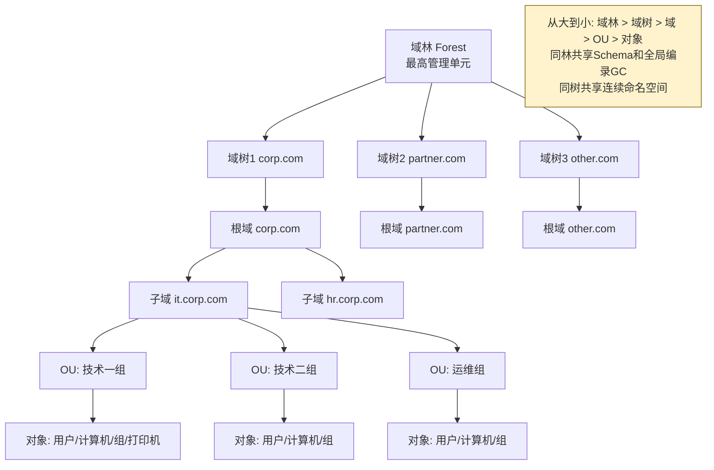
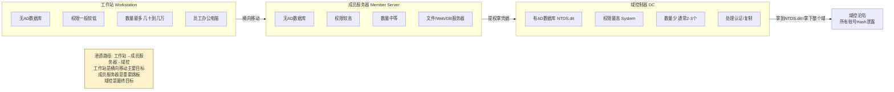
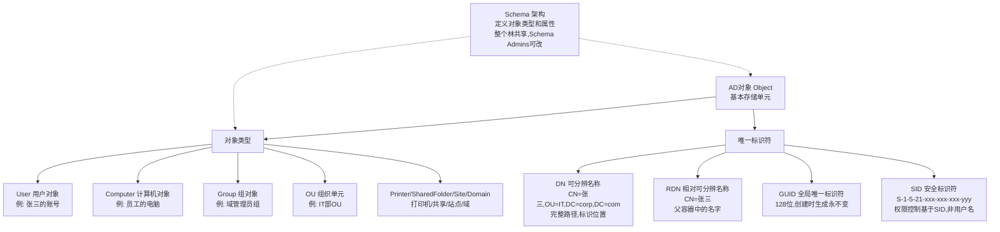
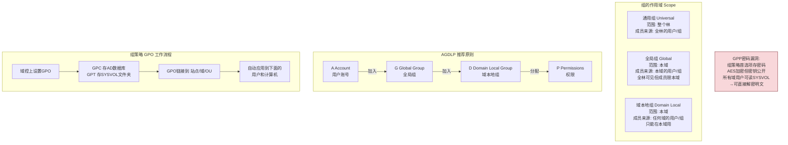
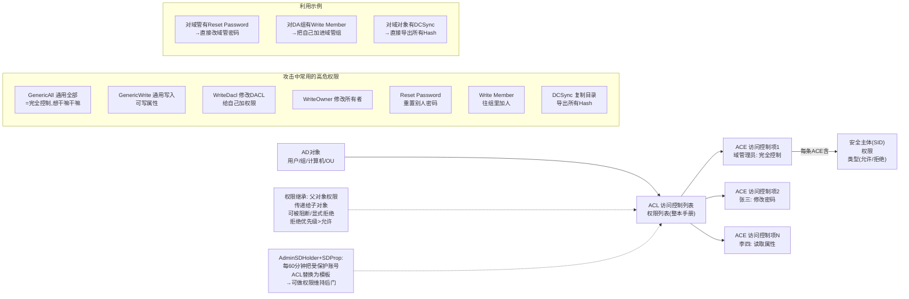
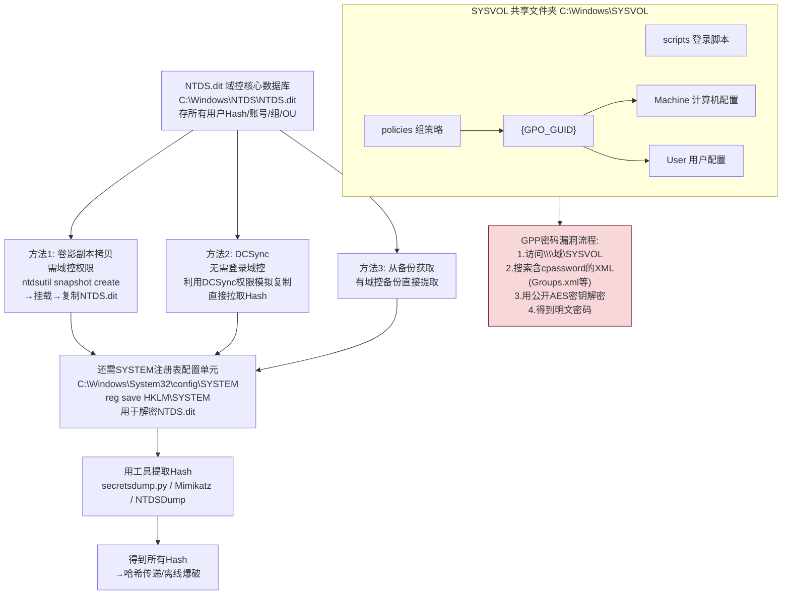
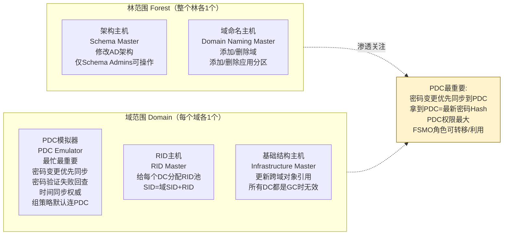

# 第53章 活动目录基础

> **难度等级：🟠 高等级**
>
> **预计学习时间：150分钟**
>
> **本章看点：什么是活动目录、域/域树/域林/OU、域控制器/成员服务器/工作站、AD对象与属性、组与组策略、域权限体系、NTDS.dit与SYSVOL、FSMO角色、站点与复制、5个实战案例**

::: tip 说明
恭喜你进入域渗透的世界！

前面我们学习了内网渗透的基础，
从这一章开始，
我们要深入学习
**活动目录（Active Directory，简称AD）**
和**域渗透**技术。

为什么要学域渗透？
因为在企业环境中，
90%以上的Windows网络
都在用活动目录。
不了解AD，
就不算真正懂内网渗透。

这一章我们从零开始，
学习活动目录的基础知识：
- 什么是活动目录？
- 域、域树、域林是什么关系？
- 域控制器是干嘛的？
- AD里有哪些对象？
- 组策略是什么？
- 权限怎么管理的？
- ...

基础打牢了，
后面的攻击技术才能理解。

准备好了吗？
开始！
:::

---

## 📖 本章概述

::: tip 写在前面
很多人一听到"活动目录"就头大，
觉得概念太多、太复杂。

其实没那么可怕，
活动目录说白了就是：
**微软搞的一套企业网络管理系统，
用来管人和管电脑。**

你想想，
一个公司有几千台电脑、
几千个员工，
怎么管理？
- 每个人一个账号，总不能每台电脑都建一遍吧？
- 共享文件、打印机，怎么统一管理？
- 给某些人某些权限，怎么批量设置？
- 电脑要装软件、改配置，总不能一台一台来吧？

活动目录就是干这些事的。
它把所有的用户、电脑、组、
打印机、共享文件等等，
都放在一个"目录"里统一管理。

这一章我们先不讲攻击，
先把基础概念搞懂。
概念懂了，
后面的攻击技术
就水到渠成了。

**学习建议：**
- 不要死记硬背，理解为主
- 有条件的话搭个实验环境，亲手操作
- 结合后面的攻击技术来理解
:::

---

## 🎯 学习目标

读完本章，你将能够：

- [x] 理解什么是活动目录（AD）
- [x] 掌握域、域树、域林、OU的概念
- [x] 理解域控制器、成员服务器、工作站的区别
- [x] 了解AD中的对象和属性
- [x] 理解组和组策略（GPO）
- [x] 掌握域内权限体系（ACL/ACE）
- [x] 了解NTDS.dit和SYSVOL
- [x] 理解FSMO五大角色
- [x] 了解活动目录站点与复制
- [x] 知道AD的常用管理工具
- [x] 为后续域渗透攻击打下基础

---

## 🔍 什么是活动目录？

### 1.1 基本概念

**活动目录（Active Directory，简称AD）**
是微软开发的
**目录服务**，
用于Windows网络环境中
管理网络资源。

说人话：
**活动目录就是一个大数据库，
里面存着企业里所有的
用户、电脑、组、打印机、
共享文件夹等等信息，
方便统一管理。**

你可以把它理解成：
**企业的"通讯录"+"管理员"。**

**活动目录能做什么？**

1. **用户管理**
   - 统一创建、删除、管理用户账号
   - 一个账号可以登录所有域内机器
   - 设置密码策略、登录时间等

2. **计算机管理**
   - 统一管理所有加入域的电脑
   - 批量部署软件、系统配置
   - 补丁管理

3. **权限管理**
   - 给用户或组分配合适的权限
   - 谁能访问什么文件、谁能改配置
   - 基于角色的权限控制

4. **资源管理**
   - 打印机、共享文件夹、应用程序
   - 统一发布和管理

5. **组策略（GPO）**
   - 批量配置计算机和用户
   - 比如：统一桌面背景、统一安全策略
   - 一台域控上设置，所有机器自动生效

**为什么企业都用它？**
- **集中管理**：不用一台一台机器去配置
- **统一认证**：一个账号到处用（单点登录）
- **可扩展性强**：从几十台到几万台都能管
- **安全可控**：完善的权限和审计机制

### 1.2 活动目录的历史

简单了解一下历史，
帮助理解：

- **1996年**：微软提出活动目录概念
- **2000年**：Windows 2000 Server 正式推出AD
- **2003年**：Windows Server 2003 增强功能
- **2008年**：Windows Server 2008 引入R2、只读域控等
- **2012年**：Windows Server 2012 进一步增强
- **2016年/2019年/2022年**：持续更新，加入新功能

从Windows 2000到现在，
活动目录已经发展了二十多年，
是企业Windows环境的标准配置。

### 1.3 相关概念

和AD相关的几个概念：

**1. 目录服务（Directory Service）**
- 存储网络资源信息的服务
- AD就是一种目录服务
- 类似的还有LDAP、Novell eDirectory等

**2. LDAP（轻量级目录访问协议）**
- 访问目录服务的标准协议
- AD支持LDAP协议
- 我们可以通过LDAP来查询、修改AD的数据

**3. DNS（域名系统）**
- AD和DNS紧密结合
- 域的名字就是用DNS域名来表示的
- 域控通常也是DNS服务器

**4. Kerberos**
- AD默认的认证协议
- 域内用户登录用的就是Kerberos
- 下一章会详细讲

---

## 🏢 域、域树、域林

### 2.1 域（Domain）

**什么是域？**

**域（Domain）** 是活动目录的
基本管理单元。
一个域就是一个
**独立的管理边界**。

你可以把域理解成：
**一个公司或一个部门的网络，
里面的所有用户和电脑
都由这个域来管理。**

比如：
- 一个公司叫"corp.com"，
  整个公司就是一个域
- 域的名字就叫 corp.com
- 所有员工的账号都在这个域里
- 所有电脑都加入这个域

**域的特点：**
1. **有唯一的域名**：比如 corp.com
2. **有域控制器**：管理这个域的服务器
3. **集中认证**：所有账号由域控验证
4. **独立的管理边界**：每个域有自己的管理员

### 2.2 域树（Domain Tree）

**什么是域树？**

当一个公司很大，
有多个部门，
每个部门一个域，
这些域共享一个连续的命名空间，
就组成了一棵**域树**。

比如：
```
corp.com（根域）
├── it.corp.com（IT部）
├── hr.corp.com（人事部）
└── sales.corp.com（销售部）
```

这就是一棵域树，
根域是 corp.com，
下面有三个子域。

**域树的特点：**
1. **共享连续的命名空间**：子域的名字是父域的子域名
2. **共享 Schema（架构）**：整个树的对象定义是一样的
3. **双向可传递信任**：父域和子域之间自动建立信任关系
4. **一个域树有一个根域**：最顶层的那个域

### 2.3 域林（Forest）

**什么是域林？**

**域林（Forest）** 是
最高级别的管理单元，
由一棵或多棵域树组成。

比如一个大集团，
有好几个子公司，
每个子公司有自己的域名，
不共享连续命名空间，
但它们是一个整体，
这就是一个域林。

比如：
```
corp.com（主公司）
partner.com（收购的公司）
other-company.com（另一个子公司）
```
这三棵域树组成一个域林。

**域林的特点：**
1. **一个或多棵域树**组成
2. **共享Schema（架构）**：整个林的对象定义一致
3. **共享全局编录（GC）**：可以查询整个林的信息
4. **林根域**：创建的第一个域就是林根域
5. **域树之间自动建立信任**：林内的域树之间有双向可传递信任

### 2.4 信任关系（Trust）

**什么是信任关系？**

两个域之间
要想互相访问资源，
就需要建立**信任关系**。

比如A域的用户
要访问B域的资源，
B域得"信任"A域的用户，
这就是信任。

**信任的方向：**
- **单向信任**：A信任B → B的用户可以访问A的资源
- **双向信任**：A信任B，B也信任A → 两边用户可以互访

**信任的传递性：**
- **可传递信任**：A信任B，B信任C → A也信任C
- **不可传递信任**：A信任B，B信任C → A不信任C

**常见的信任类型：**

| 类型 | 说明 |
|------|------|
| **父-子信任** | 父域和子域之间，自动建立，双向可传递 |
| **树-根信任** | 域树和林根之间，自动建立，双向可传递 |
| **外部信任** | 两个不同林的域之间手动建立，不可传递 |
| **林信任** | 两个林之间建立，双向可传递 |
| **领域信任** | AD和非Kerberos目录之间 |
| **快捷信任** | 同一林内两个域之间手动建立，减少认证路径 |

**域渗透中的信任攻击：**
- 利用信任关系，可以从一个域打到另一个域
- 特别是林信任，可能导致整个林沦陷
- 这也是域渗透的一个重要攻击路径

### 2.5 组织结构图

用一张图来理解：

```
                    域林（Forest）
                         |
          ┌──────────────┼──────────────┐
          ↓              ↓              ↓
      域树1          域树2          域树3
    corp.com      partner.com    other.com
       |
   ┌───┴───┐
   ↓       ↓
子域1    子域2
it.corp  hr.corp
   |
   ├── OU：技术一组
   ├── OU：技术二组
   └── OU：运维组
```

从大到小：
**域林 > 域树 > 域 > OU > 对象**

**图53-1 活动目录逻辑层级结构图**



---

## 💻 域控制器与域成员

### 3.1 域控制器（Domain Controller）

**什么是域控制器？**

**域控制器（简称DC）**
就是安装了活动目录服务的服务器。
它是整个域的"大脑"。

**域控制器的作用：**
1. **存储AD数据库**：所有用户、电脑等信息都存在这里
2. **处理认证请求**：用户登录、资源访问都要经过DC验证
3. **管理域配置**：组策略、权限等都由DC管理
4. **复制同步**：多个DC之间同步数据

**一个域可以有多个域控制器**，
它们之间互相复制数据，
提高可用性和容错能力。
一个挂了，还有其他的。

**活动目录数据库在哪里？**
- 数据库文件：`C:\Windows\NTDS\NTDS.dit`
- 这是AD的核心数据库文件
- 所有用户的Hash都存在这里面
- 拿到这个文件就等于拿到了整个域的所有账号

> 💡 **深入理解：NTDS.dit 里面到底有什么？——域控制的"心脏"**
>
> NTDS.dit 是 Active Directory 的核心数据库文件，
> 就像域控的"超级密码库"。
>
> 这个数据库用的是微软的 ESE（Extensible Storage Engine）引擎，
> 也是 Exchange Server 的数据库引擎。
>
> NTDS.dit 里存了三张最关键的"表"：
> ```
> 1. 数据表（datatable）—— 存储所有AD对象数据
>    - 所有用户名和密码Hash（NTLM + Kerberos密钥）
>    - 所有组信息（谁属于什么组）
>    - 所有计算机信息（机器名、SID、OS版本）
>    - 所有OU、GPO、ACL信息
>
> 2. 链接表（link_table）—— 存储对象之间的关系
>    - user1 是 GroupA 的成员
>    - admin 对 server01 有管理员权限
>    - GPO-A 链接到 OU-Technology
>
> 3. 安全描述符表（sd_table）—— 存储访问控制信息
>    - 谁可以读这个对象
>    - 谁可以修改这个对象
>    - 谁有完全控制权限
> ```
>
> 为什么域控要不断同步NTDS.dit？
> 因为通常一个域有多个域控（冗余+负载均衡），
> 任何一个域控的 NTDS.dit 被改了，都要同步给其他域控。
> 这就是"AD复制"机制，保证数据一致性。
>
> **这就是 DCSync 攻击的原理**：
> DCSync 不是"读文件"（不需要直接碰到 NTDS.dit），
> 而是伪装成一台域控，请求"兄弟，把最新的数据同步给我！"
> 其他域控以为它是正常的新DC，就乖乖把全部数据（包括Hash）发过来了。
>
> DCSync 需要的权限是：
> - `DS-Replication-Get-Changes`（读取复制数据）
> - `DS-Replication-Get-Changes-All`（读取所有复制数据，包括密码Hash）
> 默认 Domain Admins 和 Enterprise Admins 有这个权限。

**SYSVOL文件夹：**
- 路径：`C:\Windows\SYSVOL`
- 存储组策略模板、脚本等
- 在域内所有DC之间自动同步
- 所有域用户都可以读取
- 里面可能有密码（组策略首选项等）

### 3.2 成员服务器（Member Server）

**什么是成员服务器？**

**成员服务器**就是
加入了域的服务器，
但它不是域控制器。

比如：
- 文件服务器
- Web服务器
- 数据库服务器
- 邮件服务器
- 等等...

这些服务器加入域后，
- 可以用域账号登录
- 受域策略管理
- 可以访问域内资源
- 但不存储AD数据库

**成员服务器的特点：**
- 加入域，但没有安装AD服务
- 有本地管理员账号
- 也有域用户权限
- 是域渗透的重要目标

### 3.3 工作站（Workstation）

**什么是工作站？**

**工作站**就是
员工用的电脑，
加入了域的普通计算机。

比如：
- 员工办公用的台式机
- 笔记本电脑
- 等等...

**工作站的特点：**
- 数量最多
- 用户通常是普通域用户
- 可能有本地管理员权限
- 是横向移动的主要目标

### 3.4 对比总结

| 角色 | 是否有AD数据库 | 权限级别 | 数量 |
|------|---------------|----------|------|
| **域控制器（DC）** | 是 | 最高（System） | 少量（通常2-3个） |
| **成员服务器** | 否 | 较高 | 中等 |
| **工作站** | 否 | 一般较低 | 最多（几十到几万） |

**域渗透的目标：**
从工作站 → 成员服务器 → 域控制器
一步步提升权限，
最终拿下域控。

**图53-2 域控制器/成员服务器/工作站角色对比与渗透路径图**



---

## 📦 AD中的对象与属性

### 4.1 什么是对象？

**对象（Object）** 是活动目录中的
基本存储单元。
AD里的每一个"东西"
都是一个对象。

比如：
- 用户是一个对象
- 计算机是一个对象
- 组是一个对象
- 打印机是一个对象
- OU是一个对象
- ...

每个对象都有：
- **唯一的标识**：GUID、SID、DN等
- **各种属性**：名字、描述、密码等

### 4.2 常见的对象类型

AD中的对象类型很多，
常见的有：

| 对象类型 | 说明 | 例子 |
|----------|------|------|
| **User** | 用户对象 | 张三的账号 |
| **Computer** | 计算机对象 | 员工的电脑 |
| **Group** | 组对象 | 域管理员组 |
| **OU** | 组织单元 | IT部OU |
| **Contact** | 联系人 | 外部联系人 |
| **Printer** | 打印机 | 网络打印机 |
| **Shared Folder** | 共享文件夹 | 文件共享 |
| **Site** | 站点 | 北京站点 |
| **Domain** | 域 | corp.com |

### 4.3 什么是属性？

**属性（Attribute）** 就是
对象的各种信息。
每个对象有很多属性，
描述这个对象的特征。

比如一个用户对象，
有这些属性：
- **cn**：通用名称（全名）
- **sAMAccountName**：登录名（旧版）
- **userPrincipalName**：用户主体名称（like email）
- **displayName**：显示名
- **mail**：邮箱
- **telephoneNumber**：电话号码
- **objectSid**：SID（安全标识符）
- **userAccountControl**：用户账户控制（账号状态等）
- **lastLogon**：最后登录时间
- **memberOf**：属于哪些组
- ...

每个属性有一个类型，
比如字符串、数字、日期等。

### 4.4 几个重要的概念

**Distinguished Name（DN，可分辨名称）**
- 对象在AD中的完整路径
- 比如：`CN=张三,OU=IT部,DC=corp,DC=com`
- 格式：CN=名字,OU=组织单元,DC=域名部分
- 唯一标识对象的位置

**Relative Distinguished Name（RDN，相对可分辨名称）**
- 对象在父容器中的名字
- 比如上面的例子中，`CN=张三`就是RDN

**GUID（全局唯一标识符）**
- 128位的唯一标识符
- 对象创建时生成，永远不变
- 即使对象移动了，GUID也不变

**SID（安全标识符）**
- 用于权限控制的标识符
- 用户、组、计算机都有SID
- 格式：`S-1-5-21-xxxx-xxxx-xxxx-yyy`
- 前面是域的SID，后面是相对ID（RID）
- 权限是基于SID的，不是名字

**为什么SID很重要？**
因为Windows的权限控制
是基于SID的，
不是基于用户名的。
所以有了SID，
就可以用来做权限验证。

### 4.5 Schema（架构）

**什么是Schema？**

**Schema（架构）** 定义了
AD中可以有哪些对象类型，
每种对象有哪些属性。

就像数据库的"表结构"，
定义了有哪些表、
每张表有哪些字段。

Schema的特点：
- **整个林共享**：一个林里所有域的Schema都一样
- **Schema管理员**：只有Schema Admins组的成员能修改
- **可以扩展**：比如安装Exchange会扩展Schema

Schema一般不用管，
了解概念就行。

**图53-3 AD对象类型与标识符体系图**



---

## 👥 组与组策略

### 5.1 组（Group）的概念

**什么是组？**

**组（Group）** 是用户、
计算机等对象的集合。
用来批量管理权限。

比如：
- 把所有IT部的人加入"IT组"
- 给"IT组"分配文件服务器的权限
- 这样所有IT部的人都有了权限
- 不用一个一个人设置

**组的作用：**
1. **方便权限管理**：批量分配权限
2. **简化管理**：人员变动只要改组成员
3. **邮件分发**：安全组也可以当邮件组用

### 5.2 组的类型

AD中的组有两种类型：

| 类型 | 说明 |
|------|------|
| **安全组（Security Group）** | 用于权限控制，也可以用于邮件 |
| **通讯组（Distribution Group）** | 只用于邮件分发，不能设置权限 |

渗透测试中，
主要关注**安全组**，
因为和权限有关。

### 5.3 组的作用域

安全组有三个作用域：

| 作用域 | 范围 | 成员来源 |
|--------|------|----------|
| **通用组（Universal）** | 整个林 | 整个林的用户、组 |
| **全局组（Global）** | 本域 | 本域的用户、组 |
| **域本地组（Domain Local）** | 本域 | 任何域的用户、组 |

**怎么记？**
- **通用组**：全林通用，成员来自全林
- **全局组**：全林可见，但成员只能来自本域
- **域本地组**：只能在本域用，成员可以来自任何地方

**AGDLP原则：**
这是微软推荐的组策略：
- **A**ccount（用户账号）加入
- **G**lobal group（全局组），全局组加入
- **D**omain Local group（域本地组），给域本地组分配
- **P**ermissions（权限）

也就是：
用户 → 全局组 → 域本地组 → 权限

这样设计的好处是
跨域管理方便。

### 5.4 常见的内置组

AD有很多内置的组，
这些是默认就有的。
以下几个很重要：

| 组名 | 说明 | 权限 |
|------|------|------|
| **Domain Admins** | 域管理员组 | 域内最高权限，对所有域机器有管理员权限 |
| **Enterprise Admins** | 企业管理员组 | 林根域才有，整个林的最高权限 |
| **Schema Admins** | 架构管理员组 | 可以修改Schema |
| **Domain Users** | 域用户组 | 所有域用户默认都在这个组 |
| **Domain Computers** | 域计算机组 | 所有加入域的计算机 |
| **Domain Controllers** | 域控制器组 | 所有域控 |
| **Administrators** | 本地管理员组 | 每台机器上都有，本地最高权限 |
| **Account Operators** | 账号操作员 | 可以管理域账号 |
| **Backup Operators** | 备份操作员 | 可以备份和还原文件 |
| **Server Operators** | 服务器操作员 | 可以管理域控服务器 |
| **Print Operators** | 打印操作员 | 可以管理打印机 |
| **Remote Desktop Users** | 远程桌面用户组 | 可以远程桌面登录 |

**重点关注：**
- **Domain Admins**：域管理员，拿到这个组的权限基本就拿下域了
- **Enterprise Admins**：林管理员，跨域渗透很重要
- **各种Operators组**：虽然不是域管，但权限也不小，可以利用

### 5.5 组策略（Group Policy）

**什么是组策略？**

**组策略（Group Policy，简称GP）**
是AD中非常重要的功能，
用来**批量配置**
用户和计算机的设置。

比如：
- 所有电脑统一桌面背景
- 统一密码策略（长度、复杂度等）
- 统一安装软件
- 统一安全设置
- 开机/关机脚本
- 登录/注销脚本
- ...

只要在域控上设置好，
自动应用到所有相关的
用户和计算机上。

**组策略对象（GPO）**
- 组策略的设置存在GPO里
- GPO可以链接到站点、域、OU
- 链接后，下面的用户和计算机就会应用

**SYSVOL和GPO的关系：**
- GPO的设置存在两部分：
  1. **GPC（组策略容器）**：存在AD数据库里
  2. **GPT（组策略模板）**：存在SYSVOL文件夹里
- SYSVOL在所有DC之间自动同步
- 所有域用户都可以读取SYSVOL

**为什么渗透测试关注GPO？**
1. **GPP密码**：组策略首选项里可能存着密码
2. **权限配置**：通过GPO推送的脚本、配置
3. **攻击面**：如果能修改GPO，可以植入后门
4. **信息收集**：从GPO里了解域内的配置

**GPP（组策略首选项）密码：**
- 以前的GPP可以保存密码（比如本地管理员密码）
- 这些密码加密后存在SYSVOL里
- 但加密的密钥是公开的！
- 所以可以直接解密得到明文密码
- 虽然微软补了，但老环境里还有

这就是著名的**SYSVOL密码**漏洞，
也是域渗透中常见的一个攻击点。

**图53-4 组作用域/AGDLP原则与GPO工作流程图**



---

## 🔐 域内权限体系

### 6.1 ACL与ACE

**什么是ACL？**

**ACL（Access Control List，访问控制列表）**
是对象的权限列表，
定义了谁对这个对象
有什么权限。

比如一个用户对象，
它的ACL里可能写着：
- 域管理员：完全控制
- 张三：可以修改密码
- 李四：可以读取属性
- ...

**什么是ACE？**

**ACE（Access Control Entry，访问控制项）**
是ACL中的一条。
一个ACL由很多条ACE组成。

每条ACE包含：
- **安全主体**：谁（用户、组、计算机等，用SID标识）
- **权限**：什么权限（读、写、完全控制等）
- **类型**：允许还是拒绝

**简单说：**
- ACL = 权限列表（整本手册）
- ACE = 列表中的一条（一页）

### 6.2 常见的权限

AD对象的权限有很多，
常见的有：

| 权限 | 说明 |
|------|------|
| **Full Control** | 完全控制，所有权限 |
| **Read** | 读取属性 |
| **Write** | 修改属性 |
| **Create Child** | 创建子对象 |
| **Delete Child** | 删除子对象 |
| **Reset Password** | 重置密码 |
| **Write Member** | 修改组成员 |
| **Change Password** | 修改自己的密码 |
| **Send As** | 发送邮件身份 |
| **Receive As** | 接收邮件身份 |
| **DCSync** | 复制目录同步（导出Hash） |
| **GenericAll** | 通用全部（相当于完全控制） |
| **GenericWrite** | 通用写入 |
| **WriteDacl** | 修改DACL（修改权限列表） |
| **WriteOwner** | 修改所有者 |

**重点关注（攻击中常用的）：**
- **GenericAll**：完全控制，想干嘛干嘛
- **GenericWrite**：可以写属性
- **WriteDacl**：可以修改权限，给自己加权限
- **WriteOwner**：可以修改所有者
- **Reset Password**：可以重置别人的密码
- **Write Member**：可以往组里加人
- **DCSync**：可以复制AD数据（导出所有Hash）

**为什么这些权限重要？**
因为如果你控制的用户
对某个高权限对象有这些权限，
就可以利用它来提权。

比如：
- 对域管理员有Reset Password权限 → 直接改域管密码
- 对Domain Admins组有Write Member权限 → 把自己加进域管组
- 对域对象有DCSync权限 → 直接导出所有Hash

### 6.3 权限继承

AD中的权限是可以继承的。
比如：
- OU的权限会继承给下面的所有对象
- 域的权限会继承给下面所有OU和对象
- 父对象的权限会传递给子对象

这样设计的好处是
不用给每个对象单独设置权限，
在父对象设置一次，
下面的都继承了。

**继承可以被阻断**，
也可以**显式拒绝**。
拒绝的优先级高于允许。

### 6.4 AdminSDHolder与SDProp

这是一个比较特殊的机制。

**什么是AdminSDHolder？**

AD中有一个特殊的对象
叫AdminSDHolder，
它是一个"模板"。
所有受保护的组和用户
（比如Domain Admins、
Enterprise Admins等）
的ACL会被定期
替换成AdminSDHolder的ACL。

**什么是SDProp？**

SDProp（Security Descriptor Propagator）
是一个进程，
每60分钟运行一次，
检查受保护的组和用户的ACL，
如果和AdminSDHolder不一样，
就改回去。

**为什么有这个机制？**
防止高权限账号的权限
被意外修改，
保护它们的安全。

**渗透中的利用：**
- 如果能修改AdminSDHolder的ACL，
  给我们的用户加权限，
  等SDProp运行后，
  所有受保护的账号
  都会有我们的权限！
- 这也是一种域内权限维持的方法
- 叫做AdminSDHolder后门

### 6.5 权限总结

域内的权限体系非常复杂，
核心就是：
**谁对什么对象有什么权限。**

域渗透的很多攻击方法，
本质上就是
**找权限配置错误**，
然后利用这些错误
提升自己的权限。

比如：
- 普通用户对某个服务器有管理员权限 → 拿服务器
- 普通用户对某个组有写权限 → 把自己加进高权限组
- 普通用户对某个用户有重置密码权限 → 改密码
- 普通用户有DCSync权限 → 直接导出所有Hash

所以信息收集的时候，
收集ACL信息非常重要。
BloodHound能帮我们
快速找到这些权限配置错误。

**图53-5 ACL权限体系与攻击权限利用图**



---

## 📂 NTDS.dit与SYSVOL

### 7.1 NTDS.dit

**什么是NTDS.dit？**

**NTDS.dit** 是活动目录的
**核心数据库文件**。
AD的所有数据
都存在这个文件里。

**位置：**
```
C:\Windows\NTDS\NTDS.dit
```

**里面存了什么？**
- 所有用户账号和密码Hash
- 所有计算机账号
- 所有组
- 所有OU
- 所有对象的属性
- ...

简单说：
**拿到了NTDS.dit，
就等于拿到了整个域的所有账号密码。**

**怎么获取NTDS.dit？**

方法有很多：

**方法1：直接拷贝（需要域控权限）**
- 但这个文件正在被使用，不能直接复制
- 需要用ntdsutil或者vssown等工具
- 创建卷影副本，然后从副本里复制

```cmd
# 用ntdsutil创建快照
ntdsutil snapshot "activate instance ntds" create quit quit

# 挂载快照
ntdsutil snapshot "mount {快照GUID}" quit quit

# 复制文件
copy 挂载路径\Windows\NTDS\NTDS.dit C:\temp\

# 卸载快照
ntdsutil snapshot "unmount {快照GUID}" quit quit
```

**方法2：DCSync**
- 不用登录域控
- 利用DCSync权限，模拟域控之间的复制
- 直接从域控拉取数据
- 后面会详细讲

**方法3：从备份中获取**
- 如果有域控的备份
- 直接从备份里提取

**拿到NTDS.dit之后呢？**
需要用工具提取Hash，
比如：
- secretsdump.py（Impacket里的）
- Mimikatz
- NTDSDump
- ...

提取出所有用户的Hash后，
就可以用来哈希传递、
离线爆破等等。

### 7.2 SYSTEM文件

光有NTDS.dit还不够，
还需要SYSTEM注册表配置单元，
用来解密NTDS.dit。

**位置：**
```
C:\Windows\System32\config\SYSTEM
```

**怎么获取：**
```cmd
# 用reg保存
reg save HKLM\SYSTEM C:\temp\SYSTEM.hive
```

有了NTDS.dit和SYSTEM，
就可以提取所有Hash了。

### 7.3 SYSVOL

**什么是SYSVOL？**

**SYSVOL（System Volume）**
是域中的共享文件夹，
存储组策略模板、
脚本等公共文件。

**位置：**
```
C:\Windows\SYSVOL\
```

**共享名：**
`\\corp.com\SYSVOL`

**特点：**
- 在所有域控之间自动同步
- 所有域用户都可以读取
- 存储组策略模板（GPT）
- 存储登录脚本等

**SYSVOL里有什么？**
```
SYSVOL
└── corp.com
    ├── scripts          # 登录脚本等
    └── policies         # 组策略
        ├── {GPO的GUID}
        │   ├── Machine  # 计算机配置
        │   └── User     # 用户配置
        └── ...
```

### 7.4 SYSVOL密码（GPP密码）

**什么是SYSVOL密码？**

在Windows Server 2008及以前，
**组策略首选项（GPP）**
可以保存密码。
比如：
- 映射网络驱动器的密码
- 创建本地用户的密码
- 计划任务的密码
- ...

这些密码经过AES加密后，
存在SYSVOL里的XML文件中，
比如`Groups.xml`、`ScheduledTasks.xml`等。

**问题来了：**
加密的密钥是微软公开的！
在MSDN上就能查到。

所以：
**所有域用户都能读SYSVOL →
都能拿到这些加密的密码 →
用公开的密钥解密 →
得到明文密码！**

这就是著名的
**SYSVOL密码/GPP密码**漏洞。

**虽然微软在2014年就发布了补丁，**
但很多老环境里还有，
因为没人去清理旧的GPP。

**怎么找？**
1. 访问SYSVOL共享
2. 搜索.xml文件
3. 找含有`cpassword`属性的
4. 解密cpassword得到明文密码

**解密工具：**
- Get-GPPPassword（PowerShell）
- gpp-decrypt
- mimikatz
- 很多工具都支持

**这也是域渗透中
非常经典的攻击方法，
简单、有效。**

**图53-6 NTDS.dit获取方法与SYSVOL/GPP攻击流程图**



---

## 👑 FSMO角色

### 8.1 什么是FSMO？

**FSMO（Flexible Single Master Operations，
灵活单主机操作）**，
也叫**操作主机角色**。

为什么要有FSMO？
因为AD是多主复制的，
多个DC之间互相同步。
但有些操作
不能同时在多个DC上做，
会冲突，
所以指定某台DC来做，
这就是FSMO角色。

**一共有5个FSMO角色：**

| 角色 | 简称 | 范围 | 作用 |
|------|------|------|------|
| **架构主机** | Schema Master | 整个林 | 修改AD架构 |
| **域命名主机** | Domain Naming Master | 整个林 | 添加/删除域 |
| **PDC模拟器** | PDC Emulator | 每个域 | 密码验证、时间同步等 |
| **RID主机** | RID Master | 每个域 | 分配RID池 |
| **基础结构主机** | Infrastructure Master | 每个域 | 处理跨域引用 |

两个林范围的（整个林只有一个）：
- Schema Master
- Domain Naming Master

三个域范围的（每个域有一个）：
- PDC Emulator
- RID Master
- Infrastructure Master

### 8.2 五大角色详解

**1. 架构主机（Schema Master）**
- 整个林只有一个
- 负责修改AD架构（Schema）
- 只有Schema Admins组的成员能操作
- 一般用不到，除非要扩展Schema（比如装Exchange）

**2. 域命名主机（Domain Naming Master）**
- 整个林只有一个
- 负责添加和删除域
- 负责添加和删除应用程序分区
- 一般也很少动

**3. PDC模拟器（PDC Emulator）**
- **每个域有一个**
- 最忙的FSMO角色，最重要
- 功能：
  - 密码变更优先同步到PDC
  - 密码验证失败了，会去PDC再查一次
  - 时间同步的权威（域内时间以PDC为准）
  - 组策略编辑默认连PDC
  - 兼容旧系统（NT4）
- **PDC的权限很高，拿下PDC很重要**

**4. RID主机（RID Master）**
- 每个域有一个
- 负责给每个DC分配RID池
- RID是SID的最后一段，相对ID
- 每个DC创建新用户/组时，从自己的RID池里取RID
- RID池用完了，向RID主机申请新的

**5. 基础结构主机（Infrastructure Master）**
- 每个域有一个
- 负责更新跨域对象引用
- 比如本域的组里有另一个域的用户，
  它负责更新这些引用
- 如果所有DC都是GC（全局编录），这个角色就没用了

### 8.3 怎么查看FSMO角色？

命令行查看：

```cmd
# 查看域范围的三个角色（PDC、RID、基础结构）
netdom query fsmo

# 或者用dsquery
dsquery server -hasfsmo schema
dsquery server -hasfsmo name
dsquery server -hasfsmo pdc
dsquery server -hasfsmo rid
dsquery server -hasfsmo infr
```

PowerShell查看：
```powershell
# 林范围
Get-ADForest | Select-Object SchemaMaster,DomainNamingMaster

# 域范围
Get-ADDomain | Select-Object PDCEmulator,RIDMaster,InfrastructureMaster
```

### 8.4 为什么渗透测试关注FSMO？

1. **PDC模拟器很重要**
   - 密码变更优先同步到PDC
   - 拿到PDC就能拿到最新的密码Hash
   - PDC的权限最大

2. **知道哪台DC是什么角色**
   - 有针对性地攻击

3. **FSMO角色可以转移**
   - 正常情况下可以转移角色
   - 攻击中也可以利用

不过FSMO角色
在渗透测试中
了解概念就行，
用得不是特别多。

**图53-7 FSMO五大角色按作用范围分布图**



---

## 🌐 站点与复制

### 9.1 站点（Site）

**什么是站点？**

**站点**代表
**物理位置**，
比如一个城市、
一个办公楼、
一个机房。

为什么要有站点？
因为AD的复制
要考虑物理网络的情况。
同一个站点内的DC之间
复制要快一些、频繁一些；
不同站点之间
因为网络带宽有限，
复制要慢一些、节省带宽。

**站点的特点：**
- 基于IP子网划分
- 一个站点包含一个或多个IP子网
- 一个站点可以有多个DC
- 站点间有站点链接，控制复制频率

**比如：**
```
北京站点（IP段：10.0.1.0/24）
  ├── DC1
  └── DC2

上海站点（IP段：10.0.2.0/24）
  ├── DC3
  └── DC4

广州站点（IP段：10.0.3.0/24）
  └── DC5
```

### 9.2 复制（Replication）

**什么是复制？**

AD是多主模式的，
每个域控都有一份完整的AD数据库。
当一个DC上的数据变了，
要同步到其他DC，
这就是**AD复制**。

**复制的类型：**

**1. 站点内复制**
- 同一个站点内的DC之间
- 速度快，频率高
- 变更后15秒内开始复制
- 用RPC协议

**2. 站点间复制**
- 不同站点的DC之间
- 可以配置复制时间和频率
- 默认3小时一次
- 可以用IP或SMTP协议
- 会压缩数据，节省带宽

**复制协议：**
- **RPC over IP**：最常用，站点内和站点间都可以用
- **SMTP**：站点间用，适合网络不稳定的情况
  （只能复制Schema、配置、全局编录，不能复制域内数据）

### 9.3 全局编录（Global Catalog）

**什么是全局编录（GC）？**

**全局编录** 是一台特殊的DC，
它存储了**整个林**中
所有对象的**部分属性**。

为什么需要GC？
因为如果只有一个域，
你要查用户直接查本域DC就行。
但如果有很多个域、
很多棵域树，
你要查整个林的用户，
总不能一个域一个域去查吧？

有了GC就方便了，
直接查GC，
就能知道整个林的对象。

**GC存了什么？**
- 不是所有属性，只是常用的属性
- 叫"部分属性集"（PAS）
- 比如名字、邮箱、账号名等
- 可以配置哪些属性存在GC里

**GC的作用：**
1. **林内查询**：查找整个林的对象
2. **UPN登录验证**：用user@domain.com登录时需要查GC
3. **通用组成员身份**：通用组的成员存在GC里

**一个林可以有多台GC**，
通常每个站点至少有一台GC。

---

## 🛠️ AD常用管理工具

### 10.1 图形化工具

Windows Server自带了
很多AD管理工具：

| 工具名 | 说明 |
|--------|------|
| **Active Directory用户和计算机** | 最常用的，管理用户、组、计算机、OU |
| **Active Directory域和信任关系** | 管理域、信任关系 |
| **Active Directory站点和服务** | 管理站点、复制 |
| **组策略管理控制台（GPMC）** | 管理组策略 |
| **ADSI编辑器** | 低级编辑工具，直接操作AD对象 |
| **Active Directory管理中心** | 新版的管理工具，功能更强 |

这些都是MMC（微软管理控制台）
的管理单元，
在域控上默认安装，
普通机器可以安装RSAT工具。

### 10.2 命令行工具

**cmd命令：**
```cmd
net user /domain          # 查看域用户
net group /domain         # 查看域组
net accounts /domain      # 查看域密码策略
net view /domain          # 查看域内机器
net time /domain          # 查看时间服务器（通常是PDC）
nltest /dsgetdc:域名      # 查找域控
dsquery user              # 查询用户
dsquery computer          # 查询计算机
dsget user 用户名 -memberof  # 查看用户所属组
netdom query fsmo         # 查看FSMO角色
```

**PowerShell模块：**
- **ActiveDirectory模块**：官方的PowerShell模块，功能最全
- 需要安装RSAT-AD-PowerShell

常用命令：
```powershell
Get-ADUser                # 获取用户
Get-ADComputer            # 获取计算机
Get-ADGroup               # 获取组
Get-ADGroupMember         # 获取组成员
Get-ADOrganizationalUnit  # 获取OU
Get-ADDomain              # 获取域信息
Get-ADForest              # 获取林信息
New-ADUser                # 创建用户
Set-ADAccountPassword     # 重置密码
Add-ADGroupMember         # 添加组成员
...
```

### 10.3 其他工具

**PowerView：**
- PowerSploit套件里的
- 域信息收集神器
- 不用安装模块，直接加载脚本
- 渗透测试中非常常用

**BloodHound：**
- 可视化分析域内关系和攻击路径
- 域渗透必备神器

**SharpHound：**
- BloodHound的数据收集端
- C#写的，免杀效果好

**Mimikatz：**
- 抓取密码、Hash、票据
- 哈希传递、票据传递
- DCSync
- 等等...

这些工具后面会详细讲。

---

## 🎯 真实案例

### 案例1：搭建一个简单的域环境

**场景：**
学习域渗透，
首先得有一个测试环境。
我们来搭一个最简单的域环境。

**需要的机器：**
- 1台Windows Server（域控）
- 1台Windows 10/11（客户端）
- 都能互相通信

**步骤：**

**第一步：安装域控**
1. 安装Windows Server（推荐2019或2022）
2. 设置静态IP
3. 服务器管理器 → 添加角色和功能
4. 勾选"Active Directory域服务"
5. 安装完成后，点击"将此服务器提升为域控制器"
6. 添加新林，根域名：比如 testlab.local
7. 设置目录服务还原模式密码
8. 其他默认，下一步，安装
9. 重启后就是域控了

**第二步：创建用户和组**
1. 打开"Active Directory用户和计算机"
2. 创建几个OU，比如IT、HR、Sales
3. 在每个OU里创建几个用户
4. 创建一些组，把用户加进去
5. 创建一个域管理员测试账号

**第三步：加入客户端**
1. 安装Windows 10/11
2. 设置DNS为域控的IP
3. 右键此电脑 → 属性 → 更改设置 → 更改
4. 选择"域"，输入域名：testlab.local
5. 输入域管理员账号密码
6. 重启
7. 用域账号登录

**第四步：测试**
- 用域账号登录客户端
- 能访问域控的共享
- 基本的域功能正常

这样一个最简单的域环境就搭好了，
可以用来学习和测试。

---

### 案例2：查找域控和收集基本信息

**场景：**
刚拿到一台域内机器的Shell，
想了解一下这个域的基本情况。

**收集步骤：**

**第一步：判断是否是域环境**
```cmd
# 看域名
systeminfo | findstr /B /C:"域"

# 或者
net config workstation

# 看用户名格式
echo %username%
whoami
```
如果"域"那一栏是域名而不是工作组，
那就是域环境。

**第二步：找域控**
```cmd
# 方法1：看DNS服务器（通常域控就是DNS）
ipconfig /all

# 方法2：查询域控
nltest /dsgetdc:testlab.local

# 方法3：看时间服务器
net time /domain

# 方法4：查SRV记录
nslookup -type=SRV _ldap._tcp.dc._msdcs.testlab.local
```

**第三步：收集域基本信息**
```cmd
# 域用户列表
net user /domain

# 域组列表
net group /domain

# 域管理员组的成员
net group "domain admins" /domain

# 企业管理员组
net group "enterprise admins" /domain

# 域密码策略
net accounts /domain

# 域内的计算机
net view /domain
```

**第四步：用PowerView收集（如果能用PowerShell）**
```powershell
# 导入PowerView
Import-Module .\PowerView.ps1

# 域信息
Get-NetDomain

# 域控信息
Get-NetDomainController

# 所有用户
Get-NetUser

# 所有计算机
Get-NetComputer

# 所有组
Get-NetGroup

# 域管理员
Get-NetGroupMember "Domain Admins"

# 当前用户的组
Get-NetGroup -UserName 当前用户名
```

信息收集是域渗透的第一步，
了解的信息越多，
后面攻击的思路就越广。

---

### 案例3：通过SYSVOL获取密码

**场景：**
刚进内网，只有一个普通域用户权限，
想找更高的权限。
从SYSVOL里找GPP密码。

**步骤：**

**第一步：访问SYSVOL**
```cmd
# 访问SYSVOL共享
dir \\testlab.local\SYSVOL
```

**第二步：搜索XML文件**
在SYSVOL里搜索
包含`cpassword`的XML文件。

可以用PowerShell搜索：
```powershell
# 搜索SYSVOL里所有xml文件中的cpassword
Get-SysvolGPPPassword
# （这是PowerView里的函数）
```

或者手动找：
- 进入`\\testlab.local\SYSVOL\testlab.local\Policies\`
- 逐个GPO文件夹找
- 找这些文件：
  - Groups.xml
  - ScheduledTasks.xml
  - Services.xml
  - Drives.xml
  - Printers.xml
- 看里面有没有`cpassword`字段

**第三步：解密密码**

找到了cpassword之后，
解密得到明文。

用工具解密：
```bash
# 用gpp-decrypt
gpp-decrypt 加密的字符串

# 或者用PowerView
Get-GPPPassword
```

**第四步：用拿到的密码继续攻击**
- 密码可能是本地管理员密码
- 也可能是服务账号密码
- 用来横向移动
- 或者进一步提权

**总结：**
- SYSVOL密码是非常经典的攻击方法
- 简单、有效、不需要特殊权限
- 只要是域用户就能读SYSVOL
- 老环境中命中率很高

---

### 案例4：BloodHound分析域环境

**场景：**
拿到了普通域用户权限，
不知道从哪里下手，
用BloodHound分析一下。

**步骤：**

**第一步：收集数据**
在域内机器上运行SharpHound：
```cmd
SharpHound.exe -c All
```
会生成一个zip文件。

**第二步：导入BloodHound**
- 把zip文件拖到BloodHound里
- 等待导入完成

**第三步：分析攻击路径**

运行一些预定义查询：

**1. 找最短路径到域管理员**
- 查询："Shortest Paths to Domain Admins"
- 看看从我们的用户到域管有没有直接的路径
- 比如：我们的用户 → 某个组 → 某台机器的本地管理员 → 那台机器有域管登录 → 抓凭据

**2. 找Kerberoastable用户**
- 查询："All Kerberoastable Users"
- 看看有哪些服务账号可以Kerberoasting

**3. 找AS-REP Roasting的用户**
- 查询："AS-REP Roastable Users"
- 看看有哪些用户没有预认证

**4. 找DCSync权限的用户**
- 查询："Principals with DCSync Rights"
- 看看谁有DCSync权限

**5. 找我们能控制的高价值对象**
- 查询各种权限关系
- 比如GenericAll、WriteDacl、Reset Password等

**第四步：选择攻击路径**
根据BloodHound的分析结果，
选择最容易的路径去攻击。

**总结：**
- BloodHound是域渗透神器
- 能快速找到攻击路径
- 不用瞎猜，按图索骥
- 大大提高效率

---

### 案例5：利用组错误配置提权

**场景：**
通过BloodHound发现，
我们控制的用户
对Domain Admins组
有**WriteMember**权限。
也就是说，
我们可以往域管理员组里加人！

**步骤：**

**第一步：确认权限**
```powershell
# 用PowerView查看Domain Admins的ACL
Get-ObjectAcl -SamAccountName "Domain Admins" -ResolveGUIDs | ?{$_.ActiveDirectoryRights -match 'WriteMember'}
```
确认我们的用户确实有这个权限。

**第二步：把自己加进域管理员组**
```powershell
# 方法1：用PowerView
Add-DomainGroupMember -Identity "Domain Admins" -Members "我们的用户名"

# 方法2：用net命令
net group "Domain Admins" 我们的用户名 /add /domain

# 方法3：用PowerShell AD模块
Add-ADGroupMember -Identity "Domain Admins" -Members "我们的用户名"
```

**第三步：验证**
```cmd
net group "Domain Admins" /domain
```
看看我们是不是已经在组里了。

**第四步：享受域管理员权限**
- 现在我们就是域管理员了
- 可以登录域控
- 可以DCSync导出所有Hash
- 整个域都拿下了！

**总结：**
- 这就是ACL攻击的一个例子
- 配置错误非常危险
- 一个小的权限配置错误
  可能导致整个域沦陷
- BloodHound能快速发现这类问题

---

## ✏️ 课后习题

### 一、选择题（15道）

1. 活动目录的英文缩写是？
   A. AD
   B. LDAP
   C. DNS
   D. DHCP

2. AD的基本管理单元是？
   A. 域林
   B. 域树
   C. 域
   D. OU

3. 以下哪个范围最大？
   A. 域
   B. 域树
   C. 域林
   D. OU

4. 存储AD核心数据库的文件是？
   A. system32.dll
   B. NTDS.dit
   C. SAM
   D. SYSVOL

5. SYSVOL文件夹的默认路径是？
   A. C:\Windows\System32\SYSVOL
   B. C:\Windows\SYSVOL
   C. C:\SYSVOL
   D. C:\Program Files\SYSVOL

6. 以下哪个不是FSMO角色？
   A. 架构主机
   B. PDC模拟器
   C. RID主机
   D. DNS主机

7. 每个域有几个PDC模拟器角色？
   A. 1个
   B. 2个
   C. 3个
   D. 每个DC一个

8. 以下哪个组的权限最高？
   A. Domain Users
   B. Domain Admins
   C. Guests
   D. Remote Desktop Users

9. GPP密码存在哪里？
   A. NTDS.dit
   B. SYSVOL里的XML文件
   C. SAM数据库
   D. 注册表

10. 什么是ACL？
    A. 访问控制列表
    B. 访问控制项
    C. 活动目录
    D. 组策略

11. 以下哪个权限可以直接修改对象的权限列表？
    A. Read
    B. Write
    C. WriteDacl
    D. Reset Password

12. AdminSDHolder多久更新一次？
    A. 10分钟
    B. 30分钟
    C. 60分钟
    D. 24小时

13. 全局编录（GC）的作用是？
    A. 存储整个林的部分属性，方便查询
    B. 存储整个林的完整数据
    C. 只存储本域的数据
    D. 备份用的

14. 以下哪个命令可以查看FSMO角色？
    A. net user /domain
    B. netdom query fsmo
    C. net view /domain
    D. net group /domain

15. BloodHound的作用是？
    A. 抓密码
    B. 端口扫描
    C. 可视化分析域内关系和攻击路径
    D. 漏洞扫描

### 二、填空题（5道）

1. AD的五大FSMO角色是：______、______、______、______、______。

2. AD核心数据库文件名叫 ______，默认路径是 ______。

3. 组策略的模板文件存储在 ______ 文件夹中。

4. SID的中文名叫 ______，它的格式是 ______。

5. 写出三个域内的内置高权限组：______、______、______。

### 三、简答题（5道）

1. 什么是活动目录？它有什么作用？
2. 域、域树、域林有什么区别和联系？
3. 什么是组策略（GPO）？它有什么作用？
4. 什么是NTDS.dit？里面存了什么？为什么渗透测试中很重要？
5. 什么是ACL和ACE？它们有什么关系？

### 四、实操题（3道）

1. 如果有条件，搭建一个简单的域环境（1台域控 + 1台客户端）。
2. 在域环境中，练习使用基本命令收集域信息（net user、net group等）。
3. 如果有条件，安装BloodHound，练习导入和基本查询。

---

## 📖 本章小结

::: tip 总结一下
这一章我们学习了
活动目录的基础知识，
内容比较多，
概念也比较杂，
但都是非常重要的基础。

**重点回顾：**

1. **基本概念**
   - 什么是活动目录
   - 目录服务、LDAP、Kerberos
   - AD的作用和历史

2. **域的层级结构**
   - 域（Domain）
   - 域树（Domain Tree）
   - 域林（Forest）
   - 信任关系
   - OU（组织单元）

3. **域中的角色**
   - 域控制器（DC）
   - 成员服务器
   - 工作站

4. **AD对象和属性**
   - 对象类型：用户、计算机、组、OU等
   - 属性：DN、SID、GUID等
   - Schema架构

5. **组和组策略**
   - 安全组和通讯组
   - 组的作用域：通用、全局、域本地
   - 常见内置组
   - 组策略（GPO）
   - SYSVOL和GPP密码

6. **权限体系**
   - ACL和ACE
   - 常见权限：GenericAll、WriteDacl、DCSync等
   - 权限继承
   - AdminSDHolder和SDProp

7. **核心文件**
   - NTDS.dit：AD核心数据库
   - SYSTEM：解密用的注册表配置单元
   - SYSVOL：组策略和脚本

8. **FSMO角色**
   - 五大角色：Schema Master、Domain Naming Master、
     PDC Emulator、RID Master、Infrastructure Master
   - 林范围2个，域范围3个

9. **站点与复制**
   - 站点：物理位置
   - 复制：多主同步
   - 全局编录（GC）

10. **管理工具**
    - 图形化工具
    - 命令行工具
    - PowerShell模块
    - 渗透测试工具

11. **五个实战案例**
    - 搭建域环境
    - 收集基本信息
    - SYSVOL密码
    - BloodHound分析
    - ACL配置错误利用

活动目录的概念确实比较多，
但不要死记硬背，
理解了就好。
后面学习攻击技术的时候，
会不断用到这些概念，
用着用着就记住了。

下一章我们学习
**Kerberos协议与攻击**，
这是域渗透中最重要的协议，
也是攻击方法最多的地方。

继续加油！
:::

---

## 🔗 相关链接

- [⬅️ 上一章：---](/redteam/day058-senior-横向移动模块总结)
- [➡️ 下一章：---](/redteam/day060-senior-Kerberos协议与攻击)
- [📖 返回全书目录](/redteam/day118-toc-全书目录)
