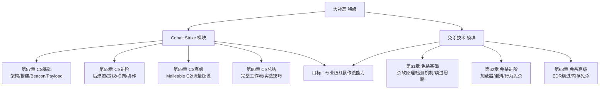

# 第56章 大神篇总览

> **难度等级：🔴 特等级**
>
> **预计学习时间：60-90分钟**
>
> **本章看点：大神篇学习路线图、Cobalt Strike与免杀的关系、从高级到专家的跨越、护网红队真实工作流、学习心态与方法**

::: tip 说明
恭喜你！学完前面所有内容，
你已经掌握了：
- 入门篇：基础概念、环境搭建、信息收集
- 基础篇：SQL注入、XSS、文件上传
- 高级篇：提权、内网渗透、横向移动、域渗透

从这一章开始，
我们正式进入 **大神篇**。

大神篇的内容是最接近
**真实护网红队工作实战** 的：
- Cobalt Strike（红队必会神器）
- 免杀技术（对抗杀软和EDR）
- 攻防实战演练

准备好了吗？
让我们看看大神篇要学什么！
:::

---

## 📖 本章概述

::: tip 写在前面
很多同学学完高级篇后会有个疑问：

"我已经会SQL注入、XSS、提权、域渗透了，
是不是就算大神了？"

其实还差最后一步——**实战工具和对抗能力**。

高级篇教了你 **"怎么打"**，
大神篇教你 **"怎么打得漂亮、打得稳"**：

- 高级篇 = 你知道了各种攻击手法
- 大神篇 = 你会用专业工具（CS）把这些手法系统化执行
- 大神篇 = 你知道怎么对抗杀软/EDR（免杀），让攻击不被发现

**简单说：**
入门篇 → 你知道"这是什么"
基础篇 → 你知道"怎么找漏洞"
高级篇 → 你知道"怎么打进去、怎么在内网里走"
大神篇 → 你知道"怎么用专业工具打得系统化、怎么不被蓝队发现"
:::

---

## 🎯 学习目标

学完本章，你将能够：

- [x] 了解大神篇的整体学习路线
- [x] 理解为什么需要学 Cobalt Strike
- [x] 理解免杀在红队作战中的位置
- [x] 了解护网红队的真实工作流程
- [x] 建立正确的学习心态和方法

---

## 📚 大神篇知识体系

### 1.1 大神篇学什么？

大神篇分为两大模块：

```
大神篇
│
├── 模块一：Cobalt Strike（第57-60章）
│   ├── CS基础：搭建、Beacon、监听器、Payload生成
│   ├── CS进阶：后渗透模块、团队协作、脚本扩展
│   ├── CS高级：Malleable C2流量隐匿、对抗检测
│   └── CS总结：完整工作流、实战技巧
│
└── 模块二：免杀技术（第61-63章）
    ├── 免杀基础：杀软原理、检测机制、绕过思路
    ├── 免杀进阶：Shellcode加载器、代码混淆、行为免杀
    └── 免杀高级：EDR绕过、内存免杀、静态+动态对抗
```

**图56-1 大神篇知识体系全景图**



---

## 🏗️ Cobalt Strike 概览

### 2.1 什么是Cobalt Strike？

Cobalt Strike（简称CS）是红队行动中最核心的
**指挥控制（C2）平台**。

如果用一句话概括：
**CS就是红队作战的"总指挥部"。**

在没有CS的时代，红队队员需要：
- 手动生成各种Payload
- 用不同的工具完成不同操作
- 手动管理多个被控端
- 各自独立操作，无法协作

有了CS之后：
- 一键生成各种Payload（exe、dll、powershell、shellcode...）
- 在一个界面里完成提权、哈希抓取、横向移动、文件管理...
- 直观地看到所有在线Beacon（被控端）
- 多人同时操作、实时共享信息、分工协作
- 自定义通信协议、流量伪装、对抗蓝队检测

**CS vs Metasploit（MSF）：**

| 对比维度 | Metasploit | Cobalt Strike |
|---------|-----------|---------------|
| 定位 | 渗透测试框架 | 红队作战平台 |
| 团队协作 | 不支持 | 多人实时协作 |
| 后渗透 | 有但较弱 | 强大且系统化 |
| 流量隐匿 | 基本无 | Malleable C2高度可定制 |
| 界面 | 命令行为主 | 图形化+命令行 |
| 费用 | 免费开源（社区版） | 商业付费 |
| 入门难度 | 中等 | 较高 |

**CS在护网红队中的地位：几乎是必备工具！**

### 2.2 Cobalt Strike的核心概念大白话

> 💡 **大白话理解CS的核心概念**
>
> 用打仗来类比理解CS：
>
> - **Team Server（团队服务器）** = 指挥部（指挥所）
>   - 部署在你的VPS上，24小时运行
>   - 所有Beacon都向这里汇报
>
> - **Client（客户端）** = 参谋/指挥官的工作台
>   - 连上Team Server才能操作
>   - 多人可以同时连，像参谋们在指挥部开会
>
> - **Listener（监听器）** = 指挥部开的"秘密电台"
>   - Beacon通过这个"电台"和指挥部联系
>   - 不同频率（端口）可以开多个电台
>
> - **Beacon（信标/后门）** = 打入敌后的"间谍"
>   - 定期向"电台"发暗号，看有没有新命令
>   - sleep时间 = 间谍每隔多久汇报一次
>
> - **Payload** = 派间谍的方式
>   - 可以伪装成word文档（钓鱼）
>   - 可以伪装成exe文件（伪装软件）
>   - 可以伪装成PowerShell脚本
>
> - **Malleable C2** = 间谍的"伪装术"
>   - 让间谍的通信看起来像正常的网页浏览
>   - 让蓝队（敌人）的流量检测设备看不出来

---

## 🛡️ 免杀技术概览

### 3.1 为什么需要免杀？

前面学的内容，生成的Payload基本都会被
杀毒软件（AV）和EDR（端点检测与响应）拦截。

比如你用MSF生成一个reverse_tcp的exe，
传到目标机器上，Windows Defender立刻报毒。
这样你还怎么打？

**免杀就是让你的Payload不被杀软检测到的技术。**

### 3.2 杀软怎么检测恶意软件？

> 💡 **大白话理解杀软检测机制**

杀软检测恶意软件主要有三种方式：

**1. 静态检测（看长相）：**
```
就像警察按"通缉令"抓人：
- 杀软有一个巨大的"特征库"（通缉令）
- 每个文件都算一个Hash（指纹）
- 如果Hash命中特征库 → 报毒！
- 如果有已知的恶意代码片段 → 报毒！
```

**2. 动态检测（看行为）：**
```
就像监控拍到可疑行为：
- 一个Word文档为什么要执行shellcode？
- 一个记事本为什么要连接外部C2服务器？
- 一个程序为什么要注入到其他进程？
- 行为可疑 → 报毒或上报EDR分析！
```

**3. 启发式检测（看可疑程度）：**
```
就像AI分析"这个人是不是小偷"：
- 这个文件结构和正常程序不一样
- 这个程序用了混淆技术
- 这个程序的API调用模式很可疑
- 综合评分超过阈值 → 报毒！
```

### 3.3 免杀的基本思路

```
绕过静态检测 → 改"长相"
  ├── 加密/混淆代码
  ├── 修改特征字符串
  ├── 分块加载shellcode
  └── 使用少见的加载方式

绕过动态检测 → 改"行为"
  ├── 不直接执行shellcode，用间接方式
  ├── 在白名单进程里执行（进程注入）
  ├── 模拟正常程序的行为模式
  └── 延迟执行（对抗沙箱）

对抗EDR → 更高级的对抗
  ├── 卸载EDR的Hook（回调函数）
  ├── 系统调用直接绕过用户层Hook
  ├── 内存加密
  └── 分段执行、无文件落地
```

---

## 💼 护网红队真实工作流

::: tip 护红实战工作流
真实的护网行动中，红队的工作流程一般是：

**Day 1-2：准备工作**
- 搭建C2服务器（CS Team Server）
- 配置Malleable C2（流量伪装）
- 准备各种Payload（免杀处理过的）
- 准备钓鱼邮件/钓鱼页面

**Day 3-5：外网突破**
- 信息收集（子域名、端口、服务版本）
- 漏洞利用（Web漏洞、弱口令等）
- 钓鱼攻击（邮箱钓鱼、水坑攻击）
- 获得初始访问 → 上线第一个Beacon

**Day 5-10：内网渗透**
- 内网信息收集（网络拓扑、域信息、凭据）
- 提权 → 哈希抓取 → 横向移动
- BloodHound分析攻击路径
- 定位域控 → 拿下域控
- 打开第二个、第三个Beacon（备用通道）

**Day 10-14：权限维持与收尾**
- 安装持久化后门
- 清理操作日志
- 生成攻击报告
:::

---

## 🧠 学习心态与方法

### 4.1 大神篇的学习特点

大神篇和前几篇最大的不同：

1. **工具驱动**：CS是大神篇的核心，要先会用工具
2. **实战导向**：很多内容需要动手搭环境、亲自操作
3. **对抗思维**：免杀是"猫鼠游戏"，需要理解双方视角
4. **系统化**：大神篇的内容串起了之前所有的知识

### 4.2 学习建议

1. **先搭环境再学**：CS需要VPS+Windows目标机，先搭好
2. **边看边操作**：不要光看文档，跟着操作每一步
3. **理解原理为本**：免杀不要死记命令，理解为什么这样能绕过
4. **保持耐心**：CS和免杀都是有一定难度的，不要急
5. **安全合法**：只在授权的实验环境里练习！

---

## ✏️ 课后习题

### 选择题

1. Cobalt Strike的核心架构是？
   - A. 单体架构
   - B. 客户端-服务器架构
   - C. 微服务架构
   - D. P2P架构

2. Beacon的默认通信模式是？
   - A. 同步模式（实时通信）
   - B. 异步模式（定时回连）
   - C. 广播模式
   - D. 轮询模式

3. 杀毒软件检测恶意软件不包含以下哪种方式？
   - A. 静态检测
   - B. 动态检测
   - C. 人际关系检测
   - D. 启发式检测

4. Malleable C2的主要作用是？
   - A. 加快通信速度
   - B. 伪装流量特征
   - C. 减少Payload体积
   - D. 增强加密算法

### 简答题

1. 简述Cobalt Strike相比Metasploit的主要优势。

2. 杀软检测恶意软件的三种主要方式是什么？各自原理是什么？

3. 护网红队的典型工作流程分为哪几个阶段？

---

## 📝 本章小结

- 大神篇是全书最接近实战的部分
- 主要学习两大块：Cobalt Strike（C2平台）+ 免杀技术（对抗）
- CS是红队作战的总指挥部，几乎所有操作都通过它完成
- 免杀是让你的攻击不被杀软检测到的技术，是与蓝队对抗的核心
- 大神篇的学习需要实战环境，光看文档是不够的

---

## 🔗 相关链接

- [⬅️ 上一章：域渗透高级篇总复习](/redteam/day062-senior-域渗透高级篇总复习)
- [➡️ 下一章：Cobalt Strike基础](/redteam/day064-expert-CS基础)
- [📖 返回全书目录](/redteam/day118-toc-全书目录)
