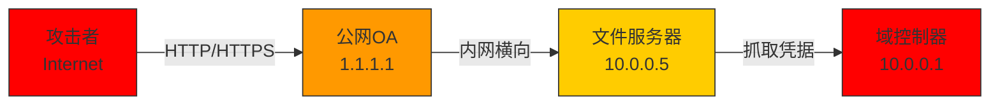
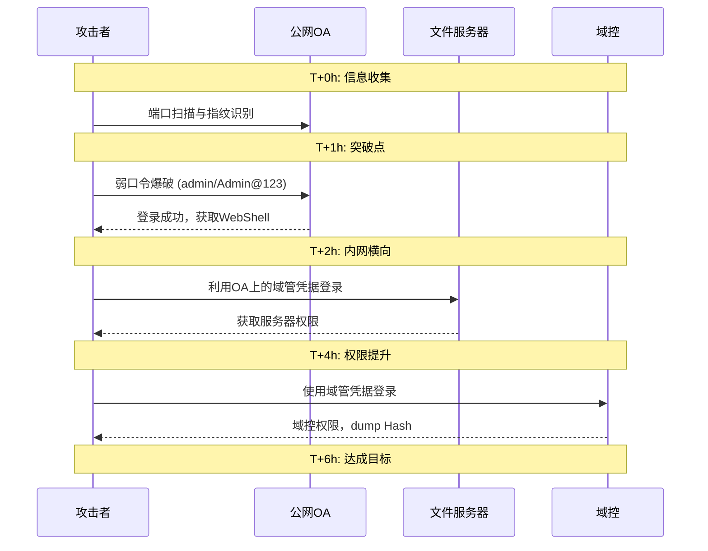
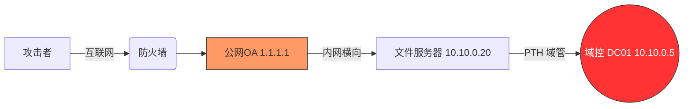
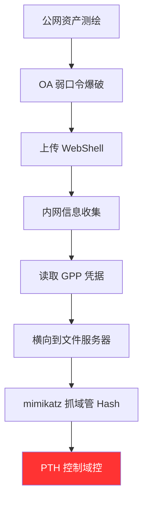
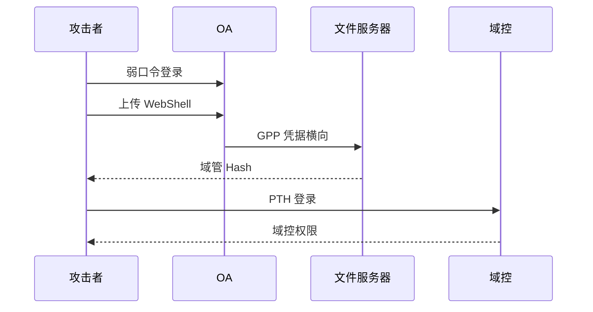

# 第75章 红队报告撰写与汇报

> **难度等级**：🟡 中等
>
> **预计学习时间**：5 小时
>
> **前置知识**：
> - 熟悉红队攻击链全流程（信息收集→打点→内网→权限维持→痕迹清理）
> - 掌握常见漏洞原理（Web 漏洞、域漏洞、提权漏洞等）
> - 了解 CVSS 评分体系与企业安全管理流程
> - 具备基本的文档写作能力，能使用 Markdown / Word 撰写技术文档
> - 建议先学习第 72、73、74 章，理解红队后渗透与权限维持
> - 了解护网行动/攻防演练的组织形式与总结汇报要求
>
> **学习目标**：
> - 理解红队报告在整个安全评估项目中的战略地位与价值
> - 掌握一份完整红队报告的标准结构（执行摘要 / 技术详情 / 修复建议 / 附录）
> - 能够撰写面向管理层的"执行摘要"，做到一页纸讲清风险与结论
> - 能够按"原理 / 复现 / 影响 / 修复"四要素规范描述每一个漏洞
> - 掌握攻击路径复现的画图与叙述方法，把复杂攻击链讲成故事
> - 学会使用 CVSS、DREAD 等方法进行风险评级与业务影响分析
> - 能够从技术、管理、流程三个层面给出可落地的修复建议
> - 掌握报告配图技巧（截图标注、拓扑图、流程图、时序图）
> - 掌握向领导口头汇报与书面提交的核心技巧
> - 能够独立撰写护网行动总结报告

---

## 75.1 红队报告的重要性

> 💡 **大白话说报告——为什么"会打"不如"会写"？**
>
> 很多红队新手都有一个误区：以为本事就是"打进去"。拿到域控、窃取数据、控制核心系统——这才叫"技术"。
>
> 但残酷的现实是：**客户花钱买的是报告，不是你的攻击过程。**
>
> 用一个比喻来理解：
> - 红队攻击 = 医生给病人做**全面体检**
> - 红队报告 = 医生交给病人的**体检报告**
>
> 病人只关心报告上写了什么——"我哪里有问题？严重吗？怎么治？"
> 至于医生用什么仪器检查的、检查了多少项目，病人不在乎。
>
> 所以你打了100个漏洞，报告写成渣 → 客户只看到10个，而且不知道怎么办。
> 你打了20个漏洞，报告写得漂亮 → 客户全部理解，马上推动整改，你的项目通过验收，拿到尾款。
>
> **报告是攻击成果到客户价值的"转换器"**。在乙方安全公司，报告质量直接决定项目验收、尾款结算和续约。
>
> 更关键的是——报告要同时给三类人看：
> - **老板（CEO/CISO）**：只看一页摘要，关心"花多少钱能解决"
> - **技术主管**：看攻击路径和风险等级，关心"先修哪个"
> - **一线工程师**：看漏洞详情和修复代码，关心"怎么修"
>
> 一份好报告，让三个人都满意。这就是本章要教你的。

### 75.1.1 报告是红队项目的"最终交付物"

很多新人误以为红队的价值在于"打进去"——拿到域控、窃取数据、控制核心系统。但从客户和项目的角度看，**攻击只是手段，报告才是交付物**。客户花钱请红队，买的不是"你打赢了"，而是"你帮我发现了什么问题、有多严重、该怎么改"。

一个完整的红队项目生命周期通常是这样的：

```
┌──────────┐   ┌──────────┐   ┌──────────┐   ┌──────────┐   ┌──────────┐
│ 授权立项  │ → │ 信息收集  │ → │ 攻击实施  │ → │ 报告撰写  │ → │ 汇报交付  │
└──────────┘   └──────────┘   └──────────┘   └──────────┘   └──────────┘
     ↑                                              ↓
     └────────────── 复测与整改跟进 ←───────────────┘
```

可以看到，**报告是攻击成果到客户价值的"转换器"**。你打了 100 个漏洞，如果报告写得一塌糊涂，客户看到的可能只有 10 个；你打了 20 个漏洞，但报告写得到位，客户能完整理解全部 20 个的风险，并据此推动整改。

> 💡 **行业箴言**：攻击能力决定你能发现多少问题，报告能力决定客户能理解多少问题。在乙方安全公司，报告质量直接影响项目验收、尾款结算和续约。

### 75.1.2 报告的三大受众

红队报告不是写给同行看的，它要同时服务三类截然不同的读者：

| 受众 | 关注什么 | 不关注什么 | 占比 |
|------|---------|-----------|------|
| **管理层**（CISO/CEO/董事会） | 业务影响、整体风险、投入产出比、合规风险 | 漏洞技术细节、Payload、利用代码 | ~30% |
| **技术负责人**（安全总监/运维主管） | 攻击路径、风险等级、修复优先级、资源分配 | 每行代码、每条命令 | ~30% |
| **一线工程师**（开发/运维/安全） | 漏洞原理、复现步骤、修复方案、验证方法 | 商业影响、合规条文 | ~40% |

一份好的报告必须**分层表达**：让管理层 5 分钟读懂结论，让技术负责人 30 分钟理清全局，让一线工程师照着就能改。

### 75.1.3 报告质量差的后果

报告写不好，会带来一系列连锁问题：

1. **客户看不懂** → 不知道问题多严重 → 不推动整改 → 漏洞继续存在 → 真被黑了 → 红队背锅
2. **修复优先级混乱** → 工程师按报告顺序修，先修了低危、漏了高危 → 风险依旧
3. **复现失败** → 工程师按报告操作复现不出来 → 怀疑报告造假 → 项目扯皮
4. **修复建议不可落地** → "请加强安全防护"这种废话 → 无法执行 → 整改流于形式
5. **暴露敏感信息** → 报告里写了真实账号密码、业务数据 → 报告本身成泄密源

> ⚠️ **真实案例**：某红队报告中将获取的数据库中 5 万条用户明文密码原样附在附录里，报告在客户内部流转过程中泄露，最终被监管处罚。报告本身的数据脱敏与访问控制同样重要。

### 75.1.4 优秀报告的五个评价维度

| 维度 | 说明 | 评判标准 |
|------|------|---------|
| **完整性** | 漏洞是否全部覆盖、要素是否齐全 | 无遗漏、四要素齐全 |
| **准确性** | 原理、复现、评级是否正确 | 可复现、评级合理 |
| **可读性** | 结构、排版、语言是否清晰 | 领导能懂、工程师能用 |
| **可操作性** | 修复建议能否直接落地 | 给代码、给配置、给流程 |
| **专业性** | 术语、配图、格式是否规范 | 符合行业惯例 |

---

## 75.2 报告结构与内容（执行摘要/技术详情/修复建议）

### 75.2.1 标准报告骨架

一份规范的红队评估报告通常包含以下部分，建议严格遵循这个骨架：

```
封面（项目名称、评估方、被评估方、密级、版本、日期）
├── 1. 评估概述（背景、范围、时间、方法、团队、授权声明）
├── 2. 执行摘要（给领导看：整体结论、风险概览、核心问题、整改建议）
├── 3. 风险统计与分析（漏洞分布、风险矩阵、攻击面统计）
├── 4. 攻击路径复现（重点攻击链的完整叙述）
├── 5. 漏洞详情（每个漏洞：原理/复现/影响/修复）
├── 6. 修复建议（技术/管理/流程三个层面，含优先级）
├── 7. 复测结果（如有）
└── 附录（工具列表、原始数据、脱敏证据、参考资料）
```

### 75.2.2 各部分内容要点

**1. 评估概述**——交代"做了什么"

```markdown
## 1. 评估概述

### 1.1 评估背景
受 XX 公司委托，对其互联网暴露面与内部核心系统开展红队安全评估，
模拟真实攻击者视角，检验现有安全防护体系的有效性。

### 1.2 评估范围
- 互联网资产：3 个公网 IP 段、12 个 Web 业务系统、2 套 API 网关
- 内网范围：办公网（192.168.10.0/24）、生产网（10.10.0.0/16）
- 测试账号：A 类（无账号）、B 类（普通员工账号 1 个）
- 排除范围：财务结算系统（生产关键业务，不可中断）

### 1.3 评估时间
2026 年 5 月 10 日 — 5 月 24 日（共 15 天，含 3 天复测）

### 1.4 评估方法
参照 MITRE ATT&CK 框架与 PTES（渗透测试执行标准），
采用黑盒/灰盒结合的方式，从外部打点至内网纵深直至核心目标。

### 1.5 评估团队
队长：张三（CISP-PTE/OSCP）
成员：李四（Web 方向）、王五（内网方向）、赵六（域安全方向）

### 1.6 授权声明
本次评估依据《XX 公司红队评估授权书》（编号 AUTH-2026-0512）开展，
所有操作均在授权范围内进行，已对全部过程留痕备份。
```

**2. 执行摘要**——见 75.3 节详述

**3. 风险统计与分析**——用图表说话

风险分布通常用表格 + 柱状图 + 风险矩阵三件套呈现：

```markdown
## 3. 风险统计与分析

### 3.1 漏洞等级分布

| 风险等级 | 数量 | 占比 |
|---------|------|------|
| 严重（Critical） | 4 | 11% |
| 高危（High） | 9 | 25% |
| 中危（Medium） | 14 | 39% |
| 低危（Low） | 9 | 25% |
| 合计 | 36 | 100% |

### 3.2 漏洞类型分布

| 漏洞类型 | 数量 | 主要风险等级 |
|---------|------|-------------|
| 弱口令 | 8 | 高危 |
| 未授权访问 | 6 | 高危 |
| SQL 注入 | 3 | 严重 |
| 反序列化 | 2 | 严重 |
| 越权访问 | 5 | 中危 |
| 信息泄露 | 7 | 低危 |
| 其他 | 5 | 中低危 |
```

**4-6 章** 见后续小节详述。

**附录**——证据归档

附录不是"垃圾桶"，而是报告的"证据链"。建议包含：
- A. 测试工具与版本列表
- B. 漏洞清单（含编号、URL、参数、等级）
- C. 关键证据截图（脱敏后）
- D. 攻击流量 PCAP（可单独打包加密交付）
- E. 修复验证 checklist
- F. 参考资料（CVE 链接、厂商公告、行业标准）

### 75.2.3 报告模板（可直接套用）

下面给出一个可直接套用的 Markdown 报告模板骨架：

```markdown
# XX 公司红队安全评估报告

| 项目 | 内容 |
|------|------|
| 报告标题 | XX 公司红队安全评估报告 |
| 评估单位 | XX 安全实验室 |
| 委托单位 | XX 公司 |
| 密级 | 秘密（仅限项目相关方阅读） |
| 版本 | V1.0 |
| 发布日期 | 2026-05-26 |

## 1. 评估概述
（背景/范围/时间/方法/团队/授权）

## 2. 执行摘要
（整体结论 + 风险概览 + 核心问题 + 整改建议，控制在 1-2 页）

## 3. 风险统计与分析
（漏洞分布表 + 风险矩阵 + 攻击面分析）

## 4. 攻击路径复现
（2-3 条典型攻击链的完整叙述 + 拓扑图）

## 5. 漏洞详情
### 5.1 [严重] SQL 注入 - 用户登录接口
（编号 / 等级 / 资产 / 类型 / 原理 / 复现 / 影响 / 修复 / 证据）

### 5.2 [高危] ……

## 6. 修复建议
### 6.1 技术层面
### 6.2 管理层面
### 6.3 流程层面
（每条建议标注：对应漏洞编号、优先级、责任部门、预计工期）

## 7. 复测结果
（已修复 / 未修复 / 部分修复）

## 附录
A. 工具列表  B. 漏洞清单  C. 证据截图  D. 参考资料
```

> 💡 **建议**：把上述模板存为公司标准模板库，每个项目基于模板填写，可显著提升报告一致性与撰写效率。

---

## 75.3 执行摘要怎么写（给领导看的部分）

### 75.3.1 执行摘要的定位

执行摘要是整份报告的"电梯演讲"——**领导可能只看这一页**。它必须满足：

- **一页纸**讲清楚（A4 一页，最多两页）
- **不用专业术语**，用业务语言
- **先结论后过程**，先风险后细节
- **可决策**，让领导看完知道"要不要花钱、花多少、怎么花"

### 75.3.2 执行摘要的四段式结构

推荐使用"**结论 → 概览 → 核心问题 → 建议**"四段式：

```
┌─────────────────────────────────────────────┐
│ 第一段：整体结论（2-3 句话，给定性判断）       │
├─────────────────────────────────────────────┤
│ 第二段：风险概览（数字 + 矩阵，量化呈现）      │
├─────────────────────────────────────────────┤
│ 第三段：核心问题（3-5 条，最该关注的）         │
├─────────────────────────────────────────────┤
│ 第四段：整改建议（优先级 + 资源投入估算）      │
└─────────────────────────────────────────────┘
```

### 75.3.3 执行摘要标准模板

下面是一个可直接套用的执行摘要模板，所有方括号 `[ ]` 内容为占位符，填写时替换为实际内容：

```markdown
## 2. 执行摘要

### 2.1 整体结论

本次红队评估历时 [X] 天，模拟 [攻击者视角，如：外部攻击者/内部威胁/供应链攻击]，
对 [公司名称] [评估范围，如：互联网暴露面及核心内网] 进行了深度安全检验。

评估结果表明：[公司名称] 整体安全防护能力处于 [行业水平，如：行业中等偏下/中等/中等偏上]，
存在 [核心结论，如：可被外部攻击者直接利用并控制核心业务系统的攻击路径/多个高危风险点，但未形成完整攻击链]。
在测试时间内，红队 [关键成果，如：成功从互联网攻入内网并控制域控，获取了包含 X 万用户信息的数据库访问权限/发现 X 个高危漏洞，但未能攻入核心内网]，
若被真实攻击者利用，将造成 [最高级别影响，如：重大数据泄露与业务中断风险/敏感信息泄露风险/业务系统不可用风险]。

### 2.2 风险概览

本次共发现安全问题 [X] 个，其中：
- 🔴 严重 [X] 个（[简要说明，如：可导致核心系统被控、敏感数据泄露]）
- 🟠 高危 [X] 个（[简要说明，如：可导致内网横向、权限提升]）
- 🟡 中危 [X] 个（[简要说明，如：可导致信息泄露、越权访问]）
- 🟢 低危 [X] 个（[简要说明，如：配置缺陷、信息暴露]）

最严重的攻击链为：**[攻击链一句话总结，如：公网 OA 弱口令 → 内网横向 → 域控失陷]**，
全程仅耗时 [X 小时/天]，[是否触发告警，如：未触发任何安全告警/触发了 X 次告警但未有效处置]。

### 2.3 核心问题

1. **[问题1标题]**：[一句话说明，如：互联网暴露面过大，公网开放 X 个系统，其中 X 个存在可直接利用的高危漏洞]
2. **[问题2标题]**：[一句话说明，如：弱口令问题普遍，OA/VPN/数据库/域账号均存在弱口令]
3. **[问题3标题]**：[一句话说明，如：内网缺乏隔离与监测，办公网与生产网无有效隔离]
4. **[问题4标题]**：[一句话说明，如：域安全配置薄弱，未启用 LDAP 签名、未部署 LAPS]
5. **[问题5标题]**：[一句话说明，如：应急响应能力不足，红队维持权限 X 天未被发现]

（核心问题控制在 3-5 条，多了领导记不住）

### 2.4 整改建议

建议按以下优先级推进整改：

| 优先级 | 整改方向 | 关键措施 | 预计工期 | 预计投入 |
|-------|---------|---------|---------|---------|
| P0（立即） | [方向，如：阻断攻击路径] | [措施，如：修复 X 个严重漏洞、关闭暴露面] | [时间] | [投入] |
| P1（1月内） | [方向，如：补齐关键防御] | [措施，如：部署 EDR、内网分段] | [时间] | [投入] |
| P2（3月内） | [方向，如：体系化建设] | [措施，如：SOC 建设、SDL 落地] | [时间] | [投入] |
| P3（6月+） | [方向，如：持续运营] | [措施，如：红蓝对抗常态化] | [时间] | [投入] |

**建议决策事项**：[明确请领导拍板的事项，如：批准 P0+P1 阶段安全建设预算 XX 万元]
```

> 💡 **模板使用技巧**：先填"整体结论"和"最严重攻击链"，这两部分决定了领导的第一印象。核心问题从漏洞中提炼，不要超过 5 条。整改建议要给出具体数字（工期、投入），让领导能直接决策。

### 75.3.4 执行摘要范文

下面是一份可参考的执行摘要范文（模板填写后的实际效果）：

```markdown
## 2. 执行摘要

### 2.1 整体结论

本次红队评估历时 15 天，模拟外部攻击者与内部威胁两个视角，
对 XX 公司互联网暴露面及核心内网进行了深度检验。

评估结果表明：XX 公司整体安全防护能力处于**行业中等偏下水平**，
存在**可被外部攻击者直接利用并控制核心业务系统的攻击路径**。
在测试时间内，红队成功从互联网攻入内网并控制域控，
获取了包含 12 万用户信息的数据库访问权限，
若被真实攻击者利用，将造成重大数据泄露与业务中断风险。

### 2.2 风险概览

本次共发现安全问题 36 个，其中：
- 🔴 严重 4 个（可导致核心系统被控、敏感数据泄露）
- 🟠 高危 9 个（可导致内网横向、权限提升）
- 🟡 中危 14 个（可导致信息泄露、越权访问）
- 🟢 低危 9 个（配置缺陷、信息暴露）

最严重的攻击链为：**公网 OA 弱口令 → 内网横向 → 域控失陷**，
全程仅耗时 6 小时，未触发任何安全告警。

### 2.3 核心问题

1. **互联网暴露面过大**：公网开放 12 个 Web 系统，其中 4 个存在可直接利用的高危漏洞；
2. **弱口令问题普遍**：OA、VPN、数据库、域账号均存在弱口令，是本次失陷的直接原因；
3. **内网缺乏隔离与监测**：办公网与生产网无有效隔离，横向移动无告警、无阻断；
4. **域安全配置薄弱**：未启用 LDAP 签名、未限制 NTLM、未部署 LAPS，导致域控快速失陷；
5. **应急响应能力不足**：红队在域控维持权限 7 天，客户安全团队未发现任何异常。

### 2.4 整改建议

建议按以下优先级开展整改：

| 优先级 | 措施 | 预计投入 | 周期 |
|-------|------|---------|------|
| P0 立即 | 修复 4 个严重漏洞、强制密码策略 | 内部资源 | 1 周 |
| P1 短期 | 内网分段、部署 EDR、启用域安全基线 | 50 万 | 1 月 |
| P2 中期 | 建设 SOC、完善应急响应流程 | 200 万 | 3 月 |
| P3 长期 | 安全体系建设、常态化红蓝对抗 | 持续投入 | 6 月+ |

详见第 6 章修复建议。
```

### 75.3.5 执行摘要的常见错误

| 错误 | 反面示例 | 正确做法 |
|------|---------|---------|
| 堆砌术语 | "利用 CVE-2024-XXXX 的反序列化链 RCE" | "通过一个漏洞可直接控制服务器" |
| 只列漏洞不结论 | "发现 36 个漏洞，其中严重 4 个……" | "存在可被外部攻击者直接控制核心系统的路径" |
| 模糊风险 | "存在一定安全风险" | "可导致 12 万用户数据泄露" |
| 建议空洞 | "建议加强安全防护" | "建议 1 周内修复 4 个严重漏洞，1 月内完成内网分段" |
| 篇幅失控 | 执行摘要写了 8 页 | 控制在 1-2 页，细节放正文 |

> 💡 **检验标准**：把执行摘要单独打印出来给一个不懂技术的领导看，如果他能在 5 分钟内理解"有多严重、要做什么"，就合格了。

---

## 75.4 漏洞详情描述（原理/复现/影响/修复）

### 75.4.1 漏洞详情的"四要素"模型

每一个漏洞详情都应包含**原理、复现、影响、修复**四个要素，缺一不可。这就是业内常说的"四要素法"：

```
┌──────────┐  ┌──────────┐  ┌──────────┐  ┌──────────┐
│  原理    │  │  复现    │  │  影响    │  │  修复    │
│  为什么  │→ │  怎么打  │→ │  多严重  │→ │  怎么改  │
└──────────┘  └──────────┘  └──────────┘  └──────────┘
```

> 💡 **大白话说四要素——用"看病"来理解**
>
> 如果你是医生，给病人写病历，你会怎么写？
>
> **原理（病因）**：这个病是怎么得的？→ "长期高盐高脂饮食导致动脉粥样硬化"
> **复现（症状印证）**：怎么检查出来的？→ "做了CT，血管堵塞85%，附图如下"
> **影响（后果）**：不治会怎样？→ "随时可能心梗猝死"
> **修复（治疗方案）**：怎么治？→ "立即放支架 + 长期服用阿司匹林"
>
> 四要素缺一个，客户就不知道："这是什么问题？怎么发现？严重吗？怎么办？"
>
> **最致命的错误就是跳过了"原理"环节直接贴Payload**——客户（甚至是内部工程师）看不懂为什么这个Payload能成功，下次换了个参数格式就不知道怎么测了。讲清楚原理，你的报告就从"一次性体检"变成了"防病手册"。

### 75.4.2 漏洞详情标准模板

```markdown
### 5.X [风险等级] 漏洞名称 - 资产/接口

| 项目 | 内容 |
|------|------|
| 漏洞编号 | VUL-2026-001 |
| 风险等级 | 严重 |
| 漏洞类型 | SQL 注入 |
| 影响资产 | https://oa.xx.com/login |
| 漏洞接口 | POST /api/auth/login |
| 发现时间 | 2026-05-12 |
| CVSS 3.1 | 9.8（AV:N/AC:L/PR:N/UI:N/S:U/C:H/I:H/A:H） |
| CVE 编号 | 无（0day / 配置类不适用） |

#### 漏洞原理
（解释漏洞是怎么产生的，根因是什么，一两段话讲清楚）

#### 漏洞复现
（步骤化、可复制，含请求/响应、Payload、截图）

#### 漏洞影响
（利用此漏洞能做什么，结合业务说明实际危害）

#### 修复建议
（给具体代码、配置、方案，分临时与长期）

#### 修复验证
（修复后如何验证，给出验证方法）

#### 参考资料
（CVE 链接、OWASP、厂商公告）
```

### 75.4.3 漏洞原理：讲清"为什么"

原理部分要回答三个问题：
1. **漏洞机制**：这个漏洞在技术上是怎么发生的？
2. **根因**：为什么会产生？（代码缺陷 / 配置不当 / 架构设计 / 流程缺失）
3. **触发条件**：什么情况下可被利用？

**示例（SQL 注入）**：

```markdown
#### 漏洞原理

登录接口 `/api/auth/login` 在拼接 SQL 查询时未对 `username`
参数进行参数化处理，直接将其拼入 SQL 语句：

  String sql = "SELECT * FROM users WHERE name='" + username + "'";

当攻击者构造 `username = admin' OR '1'='1` 时，SQL 变为：

  SELECT * FROM users WHERE name='admin' OR '1'='1'

该语句恒真，可绕过登录校验。进一步可利用 UNION 注入读取
任意表数据，或通过堆叠注入执行写操作。

根因：开发未使用预编译语句（PreparedStatement），且未启用
输入校验与 WAF 防护。
```

### 75.4.4 漏洞复现：讲清"怎么打"

复现部分必须**步骤化、可复制**。建议按"环境 → 请求 → 响应 → 结果"四步写。

**示例**：

```markdown
#### 漏洞复现

**步骤 1：构造登录请求**

  POST /api/auth/login HTTP/1.1
  Host: oa.xx.com
  Content-Type: application/x-www-form-urlencoded

  username=admin&password=123456

**步骤 2：注入 Payload**

将 username 替换为注入语句：

  username=admin' UNION SELECT 1,user(),version(),4-- -&password=x

**步骤 3：观察响应**

响应体返回数据库账户与版本：

  {"code":0,"data":{"id":1,"name":"root@localhost","email":"8.0.28"}}

**步骤 4：进一步利用**

使用 sqlmap 自动化 dump 用户表：

  sqlmap -u "https://oa.xx.com/api/auth/login" \
         --data "username=*&password=x" \
         --batch -D users -T account --dump

结果获取到 12 万条用户记录（含手机号、密码哈希）。

> 截图见附录 C-1 至 C-3。
```

> ⚠️ **复现必须真实可重现**。所有 Payload、请求、响应都应是评估时实际记录的，不要为了"好看"而编造。如果复现需要特定条件（如时间窗口、特定账号），必须注明。

### 75.4.5 漏洞影响：讲清"多严重"

影响部分要**从技术危害推到业务危害**：

```
技术危害（能做什么操作）
    ↓
数据危害（能拿/改/删什么数据）
    ↓
业务危害（对业务造成什么后果）
    ↓
合规危害（违反什么法规、面临什么处罚）
```

**示例**：

```markdown
#### 漏洞影响

- 技术层面：攻击者可执行任意 SQL，读写数据库全部数据，
  在 MySQL 8.0 且具备 FILE 权限时可通过 INTO OUTFILE 写 WebShell；
- 数据层面：可获取 users 库下 12 万条用户记录，含手机号、
  身份证号、密码哈希（MD5 未加盐，可秒破）；
- 业务层面：用户数据泄露将直接导致 OA 系统停摆，
  且 OA 与 HR 系统共享数据库，HR 数据同步泄露；
- 合规层面：违反《个人信息保护法》第 51 条，可处违法所得
  1-5 倍罚款（最高 5000 万），并需向网信部门报告。
```

### 75.4.6 修复建议：讲清"怎么改"

修复建议要**分层给方案**，至少包含临时修复与长期修复：

```markdown
#### 修复建议

**临时修复（24 小时内）**：
1. 在 WAF 添加规则，拦截该接口的 SQL 注入特征；
2. 临时下线该接口或限制仅内网访问。

**长期修复（1 周内）**：
1. 将登录接口改为预编译语句：

   // Java 示例
   PreparedStatement ps = conn.prepareStatement(
       "SELECT * FROM users WHERE name=? AND password=?");
   ps.setString(1, username);
   ps.setString(2, passwordHash);

2. 对所有用户输入做白名单校验；
3. 数据库账户降权，回收 FILE、PROCESS 等高危权限；
4. 密码存储改为 bcrypt + 盐值，废弃 MD5。

**修复验证**：
- 使用 sqlmap 复测：`--batch --level=5`，应返回"not injectable"；
- 代码审计确认全量接口已使用预编译语句。
```

### 75.4.7 常见漏洞的速查描述模板

| 漏洞类型 | 原理一句话 | 典型影响 | 修复方向 |
|---------|-----------|---------|---------|
| SQL 注入 | 拼接 SQL 未参数化 | 拖库 / 写 Shell / 提权 | 预编译 + WAF |
| XSS | 输出未编码 | 盗 Cookie / 钓鱼 / 打内网 | 输出编码 + CSP |
| 文件上传 | 类型校验不严 | 上传 WebShell / RCE | 白名单 + 重命名 + 隔离 |
| 反序列化 | 反序列化不可信数据 | RCE | 升级 + 白名单 + 禁用 |
| 弱口令 | 默认/简单密码 | 直接登录 / 横向 | 强制策略 + MFA |
| 越权 | 仅前端鉴权 | 越权读写他人数据 | 后端鉴权 + ID 不可枚举 |
| 未授权 | 接口缺失鉴权 | 信息泄露 / 操作他人资源 | 统一鉴权网关 |
| SSRF | 服务端请求未限制 | 打内网 / 读云元数据 | URL 白名单 + 禁协议 |

---

## 75.5 攻击路径复现（从起点到终点）

### 75.5.1 为什么要把攻击路径单独成章

单个漏洞描述是"点"，攻击路径是"线"。客户最关心的往往不是"你发现了 36 个漏洞"，而是**"你是怎么一步步打进来的"**——这条路径暴露的是体系性的防御缺口，修复一条路径往往能阻断一类攻击。

> 💡 **核心价值**：攻击路径复现是报告中最有"故事感"的部分，也是最能推动管理层投入整改的部分。

> 💡 **大白话说攻击路径——把漏洞串成"故事链"**
>
> 单独列36个漏洞，客户看起来像一本"字典"——每个词都认识，但连在一起不知道在说什么。
>
> 攻击路径复现就是把漏洞串成**一个完整的入侵故事**：
> ```
> 1. 我在公网上找到了你们的OA系统（资产测绘）
> 2. 用admin/123456登录成功了（弱口令）→ 这是第一个漏洞
> 3. 在OA里发现了一个文件上传功能，上传了木马（上传漏洞）→ 这是第二个漏洞
> 4. 通过木马看到了内网文件服务器（内网漫游）→ 这是配置缺陷
> 5. 在文件服务器内存里找到了域管密码（凭据泄露）→ 这是第三个漏洞
> 6. 用域管密码登录域控 → 全公司沦陷
> ```
> **这就是一条攻击链**：6个步骤，3个漏洞，若干配置缺陷——串成一个6小时的入侵故事。客户听完一身冷汗："原来我的安全防护这么多缺口！"
>
> **攻击路径写得好不好，看一个简单标准**：你能不能把它讲给你妈听，她也能听懂大致上的攻击过程？如果能，你的攻击路径就写到位了。

### 75.5.1 为什么要把攻击路径单独成章

### 75.5.2 攻击路径的叙述结构

推荐用"**起点 → 突破点 → 横向 → 提权 → 终点**"五段式：

```
[起点]      公网暴露面 / 钓鱼 / 物理入侵 / 供应链
   │
[突破点]    第一个落地的漏洞（打点成功）
   │
[横向]      内网移动、凭据获取、跳板机
   │
[提权]      本地提权 / 域提权
   │
[终点]      域控 / 核心数据库 / 生产控制 / 敏感数据
```

### 75.5.3 攻击路径标准模板

下面是一个可直接套用的攻击路径复现模板，所有方括号 `[ ]` 内容为占位符：

```markdown
## 4. 攻击路径复现

### 4.X 攻击链X：[攻击链名称，如：从公网OA到域控失陷]

**路径概述**：[一句话总结攻击链，如：红队通过公网 OA 系统弱口令获得初始访问权限，
经内网横向移动获取域管凭据，最终控制整个 AD 域，全程耗时 X 小时。]

**严重等级**：[严重/高危/中危]
**涉及漏洞数**：[X] 个
**攻击时长**：[X 小时/天]
**是否触发告警**：[是/否，如：触发 2 次低危告警，均未有效处置]

#### 攻击拓扑



> 图 4-X：攻击链 X 拓扑图（红色=已失陷，橙色=突破口）

#### 攻击时序



> 图 4-X：攻击链 X 时序图

#### 详细步骤

**阶段一：信息收集与突破（T+0h ~ T+1h）**

1. **[步骤名称]**
   - 操作：[具体操作，如：对目标 IP 段进行端口扫描]
   - 工具/命令：[命令，如：nmap -sV -p- 1.1.1.1]
   - 结果：[发现了什么，如：发现 80、443、8080 端口开放，运行 OA 系统]
   - 证据：见图 4-X-X
   - 防御缺口：[为什么没防住，如：公网暴露面管理不严，非必要端口对外开放]

**阶段二：[阶段名称，如：内网横向]（T+Xh ~ T+Yh）**

2. **[步骤名称]**
   - 操作：[具体操作]
   - 工具/命令：[命令]
   - 结果：[结果]
   - 证据：见图 4-X-X
   - 防御缺口：[防御缺口分析]

（按阶段展开，每个阶段 2-5 个步骤）

#### 关键节点分析

| 节点 | 漏洞/缺陷 | 防御缺口 | 应有检测措施 | 修复优先级 |
|------|----------|---------|-------------|-----------|
| [公网OA] | [弱口令] | [公网暴露+无爆破防护] | [WAF + 登录风控] | P0 |
| [文件服务器] | [凭据明文存储] | [内网无隔离] | [EDR + 内网流量监测] | P1 |
| [域控] | [域安全基线缺失] | [特权账号使用不规范] | [域安全监控 + LAPS] | P0 |

#### 体系性问题与改进建议

1. **[问题1，如：资产台账不清]**：[说明，如：公网暴露面缺乏统一管理，存在遗留系统未下线]
   - 改进：[具体措施]
   - 责任部门：[部门]
   - 工期：[时间]

2. **[问题2]**：[说明]
   - 改进：[具体措施]
   - 责任部门：[部门]
   - 工期：[时间]
```

> 💡 **模板使用技巧**：攻击路径要像讲故事一样有起承转合，让读者跟着走一遍就能理解整个攻击过程。拓扑图 + 时序图 + 文字描述三者配合效果最佳。关键节点分析是"从点到面"的升华，体现红队的体系性思考能力。

### 75.5.4 攻击路径范文

下面是一条典型攻击链的完整叙述范文（模板填写后的实际效果）：

```markdown
## 4. 攻击路径复现

### 4.1 攻击链一：从公网 OA 到域控失陷

本条攻击链是本次评估中最严重的路径，红队仅用 6 小时即从互联网
攻入并控制整个 AD 域，全程未触发任何安全告警。

#### 攻击拓扑

  [攻击者] --互联网--> [公网OA 1.1.1.1] --内网--> [文件服务器]
                                                  │
                                                  v
                                              [域控 DC01]

#### 步骤 1：信息收集与资产测绘（T+0h）

通过子域名爆破与证书透明度查询，发现 oa.xx.com 指向 1.1.1.1，
访问确认为某 OA 系统 V3.2（存在已知历史漏洞）。

  # 子域名收集
  subfinder -d xx.com -all -o subs.txt
  # 端口与服务识别
  nmap -sV -p- 1.1.1.1

#### 步骤 2：弱口令突破（T+1h）

OA 登录页未启用验证码与账号锁定，使用常见用户名 + 弱口令字典
爆破，5 分钟内获得账号 admin / admin@123：

  hydra -L users.txt -P pass.txt oa.xx.com http-post-form \
    "/login:user=^USER^&pass=^PASS^:F=login fail"

#### 步骤 3：OA 漏洞利用获取 WebShell（T+2h）

利用该版本 OA 的附件上传漏洞绕过校验，上传 jsp 木马：

  # 上传冰蝎马
  curl -X POST https://oa.xx.com/upload \
    -F "file=@shell.jsp"

通过冰蝎连接，获得 tomcat 权限 WebShell。

#### 步骤 4：内网信息收集（T+3h）

在 OA 服务器执行内网探测，发现同网段存在文件服务器，
且 tomcat 账号在本地组策略中保存了文件服务器凭据：

  # 读取组策略凭据
  findstr /S /I "password" C:\Windows\sysvol\*.xml
  # 解密 GPP 密码
  gpp-decrypt <加密串>

得到文件服务器管理员凭据 fileadmin / P@ssw0rd!

#### 步骤 5：横向移动到文件服务器（T+4h）

利用获得凭据通过 PsExec 横向到文件服务器：

  psexec.py fileadmin:P@ssw0rd!@10.10.0.20

在文件服务器发现域管账号曾登录，内存中存在域管 Hash。

#### 步骤 6：提权至域管（T+5h）

使用 mimikatz 抓取内存凭据，获得域管 Hash：

  mimikatz # sekurlsa::logonpasswords

得到域管 admin@xx.com 的 NTLM Hash。

#### 步骤 7：控制域控（T+6h）

使用 PTH 方式直接以域管身份登录域控：

  wmiexec.py -hashes <NTLM> xx.com/admin@10.10.0.5

成功获取域控 shell，dump 全域账号 Hash：

  mimikatz # lsadump::dcsync /user:krbtgt

至此完成"互联网 → 域控"全链路突破。

#### 关键节点分析

| 节点 | 防御缺口 | 应有检测 |
|------|---------|---------|
| 步骤2 弱口令 | 无锁定/无验证码 | 登录失败阈值告警 |
| 步骤3 上传 | 校验可绕过 | WAF + 文件类型校验 |
| 步骤4 GPP | GPP 中存明文密码 | 域基线检查 |
| 步骤5 横向 | 内网无监测 | EDR + 流量审计 |
| 步骤6 抓凭据 | 域管登录普通机 | 域管登录白名单 |
| 步骤7 控域控 | 无 PTH 检测 | EDR + 蜜罐账号 |
```

### 75.5.5 攻击路径的画图技巧

攻击路径图建议用以下三种形式呈现，配合文字叙述：

**① 拓扑图**：标注资产位置、网络分段、攻击路径箭头
```
  Internet ──> [FW] ──> DMZ(OA) ──> [FW] ──> 办公网 ──> 核心区(DC)
                  │        │                    │          │
                  ✗        ✗                    ✗          ✗
               未拦截    弱口令              无监测      无告警
```

**② 时序图**：标注每个步骤的时间点，体现攻击速度
```
T+0h ─── T+1h ─── T+2h ─── T+3h ─── T+4h ─── T+5h ─── T+6h
  │        │        │        │        │        │        │
 资产     爆破     上传     探测     横向     抓取     控DC
 测绘     弱口令   WebShell 内网    到FS     域管
```

**③ 流程图**：用箭头连接每个漏洞节点，体现"链式利用"

> 💡 工具推荐：拓扑图用 draw.io / diagrams.net，时序图用 PlantUML / Mermaid，截图标注用 Snipaste / Greenshot。

---

## 75.6 风险评级与影响分析

### 75.6.1 为什么需要客观的风险评级

风险评级决定了修复优先级和资源投入。如果评级主观随意，会导致：
- 高危评成低危 → 被忽视 → 真被利用
- 低危评成高危 → 浪费资源 → 工程师疲于奔命
- 同类漏洞评级不一致 → 客户质疑专业性

> 💡 **大白话说CVSS评分——给漏洞打分的"统一尺子"**
>
> 你发现了两个漏洞：一个是前台网站的SQL注入（谁都能访问），一个是需要登录后台才能用的XSS。哪个更严重？
>
> 如果没有评分标准，你可能会凭感觉说"SQL注入很严重，XSS一般"。但客户需要的是**数据支撑的判断**。
>
> CVSS就是这么一个"统一尺子"。它用8个问题来评估每个漏洞：
> - **攻击途径**：只能物理接触电脑才能攻击（Local），还是从互联网就能打（Network）？→ 互联网可打的更严重
> - **攻击复杂度**：需要非常复杂的条件（High），还是很简单（Low）？→ 简单的更严重
> - **要不要权限**：不需要任何账号就能打（None），还是得先登录（High）？→ 不需要的更严重
> - **要不要用户点击**：需要用户点链接（Required），还是自动触发（None）？→ 自动的更严重
> - **影响范围**：只影响被攻击的系统（Unchanged），还是能跳转到其他系统（Changed）？→ 跳转的更严重
> - **C/I/A影响**：能读什么（机密性）、能改什么（完整性）、能让什么不能用（可用性）？→ 三项都高的最严重
>
> 这样打完分，SQL注入是9.8（严重），XSS是5.4（中危）——数字说话，没人能质疑。
>
> **但CVSS只评"技术危害"，不评"业务危害"**。一个对测试系统的9.8分SQL注入，可能不如一个对核心交易系统的5.4分信息泄露严重。所以你还得补充业务影响分析（BIA）：这个系统在业务中有多重要？上面存了多敏感的数据？

### 75.6.1 为什么需要客观的风险评级

### 75.6.2 CVSS 3.1 评分体系

CVSS（通用漏洞评分系统）是国际通用的漏洞评分标准，分基础分（0-10）、时间分、环境分三部分，红队报告主要使用**基础分**。

CVSS 3.1 基础分由 8 个维度计算：

| 维度 | 含义 | 可选值 |
|------|------|--------|
| Attack Vector (AV) | 攻击途径 | Network / Adjacent / Local / Physical |
| Attack Complexity (AC) | 攻击复杂度 | Low / High |
| Privileges Required (PR) | 所需权限 | None / Low / High |
| User Interaction (UI) | 用户交互 | None / Required |
| Scope (S) | 影响范围 | Unchanged / Changed |
| Confidentiality (C) | 机密性影响 | None / Low / High |
| Integrity (I) | 完整性影响 | None / Low / High |
| Availability (A) | 可用性影响 | None / Low / High |

**示例向量**：`CVSS:3.1/AV:N/AC:L/PR:N/UI:N/S:U/C:H/I:H/A:H` = 9.8（严重）

**等级对照**：

| 分数 | 等级 | 颜色 |
|------|------|------|
| 9.0 - 10.0 | 严重 Critical | 🔴 |
| 7.0 - 8.9 | 高危 High | 🟠 |
| 4.0 - 6.9 | 中危 Medium | 🟡 |
| 0.1 - 3.9 | 低危 Low | 🟢 |
| 0.0 | 无影响 | ⚪ |

### 75.6.3 DREAD 评级法

DREAD 是另一种轻量级评级法，适合内部快速评估，五个维度各 1-10 分，取平均：

| 维度 | 含义 | 示例（SQL 注入） |
|------|------|----------------|
| Damage | 造成损害 | 10（可拖库） |
| Reproducibility | 可复现性 | 9（每次必现） |
| Exploitability | 利用难度 | 8（工具自动化） |
| Affected Users | 影响用户 | 10（全部用户） |
| Discoverability | 可发现性 | 7（容易发现） |
| **平均** | | **8.8 → 高危** |

### 75.6.4 业务影响分析（BIA）

CVSS 评的是"技术严重性"，但红队报告还要补充"业务影响"，两者结合才能定优先级。建议从四个维度：

```
┌────────────────────────────────────────────┐
│             业务影响分析 (BIA)              │
├──────────┬──────────┬──────────┬──────────┤
│ 资产价值 │ 数据敏感 │ 业务依赖 │ 合规影响 │
│  1-5分   │  1-5分   │  1-5分   │  1-5分   │
└──────────┴──────────┴──────────┴──────────┘
        ↓ 综合计算
   修复优先级 = CVSS × 0.6 + BIA × 0.4
```

**资产价值**：核心业务 > 一般业务 > 测试系统
**数据敏感**：个人敏感信息 > 业务数据 > 公开信息
**业务依赖**：不可中断 > 可短时中断 > 可长时中断
**合规影响**：强监管（金融/医疗）> 一般 > 无强监管

### 75.6.5 风险矩阵

风险矩阵是给领导看的最直观工具，横轴"可能性"、纵轴"影响"，把漏洞标到格子里：

```
影响 ↑
 高  │  中危    │  高危    │  严重   │  严重
     │──────────┼──────────┼─────────┤
 中  │  低危    │  中危    │  高危   │  高危
     │──────────┼──────────┼─────────┤
 低  │  低危    │  低危    │  中危   │  中危
     └──────────┴──────────┴─────────┴──→ 可能性
        低         中        高      极高
```

修复顺序遵循"**严重 → 高危 → 中危 → 低危**"，同级里"影响高"的优先。

> 💡 实操建议：用 Excel 或 Python 生成风险矩阵热力图，比纯文字表格更有冲击力。

---

## 75.7 修复建议（技术/管理/流程）

### 75.7.1 修复建议的三层结构

很多报告的修复建议只写"技术措施"（升级补丁、改代码），但只靠技术解决不了体系问题。一份专业的报告应该从**技术、管理、流程**三个层面给出建议：

```
┌──────────────────────────────────────────────┐
│  技术层  →  解决"漏洞"本身（补丁/配置/代码）  │
├──────────────────────────────────────────────┤
│  管理层  →  解决"人"的问题（组织/职责/考核）  │
├──────────────────────────────────────────────┤
│  流程层  →  解决"事"的问题（流程/制度/标准）  │
└──────────────────────────────────────────────┘
```

> 💡 **大白话说修复建议的三层结构——为什么光修漏洞不够？**
>
> 用一个公司考勤问题的比喻：
>
> **技术层**：你发现员工打卡机坏了，换了台新的打卡机。→ 解决了"打卡设备"的问题。
> **管理层**：但你发现坏的根本原因是**没人负责维护打卡机**。于是指定行政小张"打卡机就归你管"。
> **流程层**：光有人管还不够。你制定了制度：新员工入职当天就录指纹、每月1号检查机器、打卡异常24小时内处理。
>
> 安全修复也一样：
> - 你修复了一个SQL注入（技术）——但下次新系统上线又出现SQL注入，为什么？因为**开发人员不知道怎么防御SQL注入**。
> - 于是你规定所有开发人员要通过安全编码考试（管理）——但如果项目赶工期，还是会跳过安全检查。
> - 最终你需要把安全测试嵌入到开发流程中，不通过安全门禁就不准上线（流程）。
>
> **如果只给技术层面的修复建议，你等于告诉病人"吃药"但没告诉他"为什么要吃药"和"怎么保证持续吃药"。** 这就是无效修复建议和有效修复建议的本质区别。

### 75.7.2 技术层修复建议

技术层建议要**具体到配置/代码**，避免"加强防护"这类废话。

```markdown
### 6.1 技术层面修复建议

#### 6.1.1 P0 立即修复（1 周内）

| 编号 | 漏洞 | 修复方案 | 责任部门 |
|------|------|---------|---------|
| VUL-001 | OA SQL 注入 | 登录接口改预编译，见 5.1 | 研发部 |
| VUL-002 | 文件上传 RCE | 白名单校验 + 重命名，见 5.2 | 研发部 |
| VUL-003 | VPN 弱口令 | 强制密码策略 + MFA | 运维部 |
| VUL-004 | 域未启用 LAPS | 部署 LAPS 管理员密码 | 域管团队 |

#### 6.1.2 P1 短期修复（1 月内）

1. **互联网暴露面收敛**
   - 关停 4 个无用公网服务，下线 2 个测试系统
   - 公网入口统一收敛至 WAF 后端
2. **内网分段与隔离**
   - 办公网 / 生产网 / 核心区三层隔离
   - 生产区部署 jumpserver，禁止直连
3. **端点防护**
   - 全量部署 EDR，覆盖 1200 台终端与 200 台服务器
   - 启用进程行为审计与阻断
4. **域安全基线**
   - 启用 LDAP 签名与 Channel Binding
   - 限制 NTLM，推行 Kerberos
   - 域管账号仅在域控登录，禁止登录普通机

#### 6.1.3 P2 中长期建设（3-6 月）

- 建设 SOC（安全运营中心），7×24 监测
- 部署蜜罐与欺骗防御
- 实施零信任架构改造
```

### 75.7.3 管理层修复建议

管理层建议聚焦**组织、人员、考核**：

```markdown
### 6.2 管理层面修复建议

1. **明确安全责任主体**
   - 设立专职 CISO，向 CEO 直接汇报
   - 各业务线设立"安全接口人"，对接安全需求
   - 将安全 KPI 纳入业务负责人考核（占比不低于 10%）

2. **人员与能力建设**
   - 安全团队从 3 人扩至 8 人，新增应急响应、安全开发岗
   - 全员每年至少 8 小时安全培训，研发需通过安全编码考试
   - 关键岗位（运维、DBA）实施背景审查与权限分离

3. **第三方与供应链管理**
   - 供应商合同增加安全条款与违约责任
   - 外包代码强制安全审计后才可上线
   - 第三方接入网络前进行安全评估
```

### 75.7.4 流程层修复建议

流程层建议聚焦**制度、规范、闭环**：

```markdown
### 6.3 流程层面修复建议

1. **安全开发生命周期（SDL）**
   - 需求阶段：安全需求评审
   - 设计阶段：威胁建模
   - 编码阶段：静态代码扫描（SAST）
   - 测试阶段：动态扫描（DAST）+ 渗透测试
   - 上线阶段：安全验收门禁，未通过不准上线

2. **漏洞管理闭环**
   - 建立漏洞工单系统，全流程可追踪
   - SLA：严重 24h / 高危 7d / 中危 30d / 低危 90d
   - 超期自动升级至上级，与绩效挂钩
   - 每月漏洞复盘，分析根因与重复发生原因

3. **应急响应流程**
   - 编制应急响应预案，明确 P0-P4 分级与响应时限
   - 每季度开展一次桌面推演，每年一次实战演练
   - 建立 7×24 值班与上报机制
   - 事件后必须输出复盘报告并落实改进

4. **常态化红蓝对抗**
   - 每季度组织一次内部红蓝对抗
   - 每年至少 2 次外部红队评估
   - 攻防成果反哺安全建设优先级
```

### 75.7.5 修复建议的"可落地"检查清单

每条建议写完后，用以下清单自检：

- [ ] 是否对应到具体漏洞编号？
- [ ] 是否给出可执行的代码 / 配置 / 命令？
- [ ] 是否标注了优先级（P0/P1/P2）？
- [ ] 是否明确了责任部门？
- [ ] 是否给出了预计工期？
- [ ] 是否说明了验证方法？
- [ ] 是否区分了临时修复与长期修复？

> ⚠️ **避坑**：永远不要写"建议加强安全意识培训""建议提高安全重视程度"这种无法验证、无法考核的废话。要么具体到"全员每年 8 小时培训，考试通过率 100%"，要么删掉。

---

## 75.8 报告配图技巧（截图/拓扑/流程图）

### 75.8.1 配图的价值

"一图胜千言"。在报告里，好的配图能：
- 让领导 3 秒看懂整体风险（风险矩阵热力图）
- 让工程师照着复现（带标注的请求响应截图）
- 把复杂攻击链讲清楚（拓扑图 + 时序图）

### 75.8.2 截图规范

截图是漏洞证据的核心，必须规范：

| 规范点 | 要求 |
|-------|------|
| 清晰度 | 原始分辨率，不模糊、不拉伸 |
| 完整性 | 包含 URL、参数、响应、时间戳 |
| 标注 | 用红框 / 箭头标出关键信息 |
| 脱敏 | 账号、密码、手机号、身份证号必须打码 |
| 编号 | 每张图编号（图 5-1），正文引用 |
| 说明 | 图下加一句图注，说明看什么 |

**反面示例**（不要这样）：
```
（一张全屏截图，没有任何标注，看不出重点）
图：漏洞截图
```

**正面示例**：
```
（截图，红框圈出响应中的数据库版本字段）
图 5-1：UNION 注入返回数据库版本 8.0.28
```

> 💡 工具推荐：Snipaste（截图+贴图）、Greenshot（标注）、ShareX（截图+录制）。Linux 下用 Flameshot。

### 75.8.3 拓扑图绘制

拓扑图要体现**网络结构、资产位置、攻击路径**三要素。

用 Mermaid 语法可以直接在 Markdown 中画拓扑图：



### 75.8.4 流程图与时序图

**攻击流程图**（用 Mermaid flowchart）：



**时序图**（用 Mermaid sequenceDiagram）：



### 75.8.5 数据可视化

漏洞统计建议用图表，比纯表格直观。Python 生成柱状图示例：

```python
import matplotlib.pyplot as plt
import matplotlib
matplotlib.rcParams['font.sans-serif'] = ['SimHei']  # 中文

types = ['弱口令', '未授权', 'SQL注入', '反序列化', '越权', '信息泄露', '其他']
counts = [8, 6, 3, 2, 5, 7, 5]
colors = ['#ff4444', '#ff8800', '#ff4444', '#ff4444', '#ffcc00', '#88cc00', '#ffcc00']

plt.figure(figsize=(10, 5))
bars = plt.bar(types, counts, color=colors)
plt.title('漏洞类型分布')
plt.ylabel('数量')

# 在柱子上标注数值
for bar in bars:
    h = bar.get_height()
    plt.text(bar.get_x() + bar.get_width()/2, h, str(h),
             ha='center', va='bottom')

plt.tight_layout()
plt.savefig('vuln_stats.png', dpi=150)
```

### 75.8.6 配图的常见问题

| 问题 | 后果 | 改进 |
|------|------|------|
| 截图未脱敏 | 泄露真实数据 | 打码账号/密码/手机号 |
| 截图无标注 | 看不出重点 | 红框 + 箭头 |
| 图无编号 | 正文无法引用 | 图 X-Y 编号 |
| 图模糊 | 看不清内容 | 用原始分辨率 |
| 图过多 | 报告臃肿 | 关键证据保留，次要的放附录 |
| 图无说明 | 不知所云 | 图下加图注 |

---

## 75.9 报告提交与汇报技巧

### 75.9.1 报告提交的规范

报告撰写完成后，提交环节同样有讲究：

1. **版本管理**：报告文件命名含版本号与日期
   - `XX公司红队评估报告_V1.0_20260526.docx`
   - 每次修订递增版本，保留修改记录

2. **密级与水印**：
   - 标注密级（秘密/机密）
   - 加阅读人水印（防止外传溯源）
   - 加"仅限项目相关方阅读"声明

3. **加密传输**：
   - 报告压缩加密，密码单独通道发送
   - 禁止用微信/邮件明文传报告
   - 建议用加密文件传输平台或当面交付

4. **签署确认**：
   - 提交时填写《报告交付确认单》
   - 客户签收，留存证据
   - 明确保密义务与使用范围

### 75.9.2 口头汇报的准备

报告提交后通常要开汇报会，**口头汇报 ≠ 念报告**。准备要点：

**① 汇报材料分层**
- 给领导：10 页 PPT，讲结论与决策
- 给技术：详细报告，讲细节与方案
- 切忌把详细报告直接做成 PPT 念

**② 汇报结构（推荐 30 分钟版）**

```
开场（2 min）   → 项目背景、范围、团队
结论（3 min）   → 整体判断、风险定性
路径（8 min）   → 最严重的 1-2 条攻击链（讲故事）
漏洞（5 min）   → 风险统计 + 严重漏洞速览
建议（7 min）   → 整改优先级 + 资源投入
答疑（5 min）   → 现场提问
```

**③ PPT 设计原则**
- 一页一个观点，标题即结论
- 多图少字，能用图不用表，能用表不用段落
- 颜色统一：严重红、高危橙、中危黄、低危绿
- 字号：标题 32pt，正文 20pt，最小不低于 16pt

### 75.9.3 汇报现场的表达技巧

| 技巧 | 说明 |
|------|------|
| **先结论后过程** | 开场就给结论，不要铺垫半天 |
| **用业务语言** | "可获取 12 万用户数据"比"可执行任意 SQL"更打动领导 |
| **讲故事** | 攻击链用"我发现→然后→最后"的叙事，比罗列步骤有感染力 |
| **数字说话** | "6 小时攻破""0 告警""1200 台终端"比"很快""很多"有力 |
| **留余地** | 不要夸大，"可获取数据库权限"比"可控制全国电网"诚实 |
| **控节奏** | 领导关心结论，慢讲；工程师关心细节，会后单独沟通 |
| **预案答疑** | 提前准备 10 个可能的刁钻问题及答案 |

### 75.9.4 应对质疑

汇报时客户可能质疑，要从容应对：

| 质疑 | 应对 |
|------|------|
| "这个漏洞我们不知道啊" | 出示证据截图、时间戳、PCAP |
| "这个能利用吗？证明一下" | 现场演示（需授权）或播放录屏 |
| "评级是不是太高了" | 解释 CVSS 向量与业务影响依据 |
| "修复建议太理想化" | 区分临时/长期方案，说明可分阶段实施 |
| "你们是不是用了 0day" | 说明所用漏洞均来自公开 CVE 或配置缺陷 |
| "为什么没发现 XX 问题" | 说明测试范围限制，可补充测试 |

> 💡 **核心原则**：汇报不是炫耀"我多厉害"，而是帮助客户"理解风险、做出决策"。始终站在客户视角表达。

### 75.9.5 汇报后的跟进

汇报结束不是项目终点，跟进才是：

1. **会议纪要**：24 小时内发出，明确待办事项与责任人
2. **答疑补充**：客户后续提问 48 小时内书面回复
3. **修复跟踪**：建立修复进度跟踪表，定期同步
4. **复测验证**：客户修复后进行复测，出具复测报告
5. **复盘总结**：内部复盘本次项目的得失，沉淀方法库

---

## 75.10 优秀报告案例赏析

### 75.10.1 优秀报告的共性特征

分析业内多份高分红队报告，可总结出以下共性：

1. **结构清晰**：严格遵循"概述-摘要-详情-建议"骨架
2. **分层表达**：执行摘要给领导看，技术详情给工程师看
3. **证据充分**：每个漏洞都有截图、请求响应、PCAP
4. **路径完整**：至少 1-2 条完整攻击链复现
5. **评级客观**：用 CVSS + BIA 双维度，不主观拍脑袋
6. **建议可落地**：给代码、给配置、给流程、给责任部门
7. **配图专业**：拓扑图、时序图、热力图配合使用
8. **脱敏规范**：敏感数据全部打码
9. **格式统一**：编号、字体、表格风格一致
10. **语言精炼**：不堆术语，不说废话

### 75.10.2 报告质量自评 checklist

写完报告后，用以下清单自评（满分 100）：

```markdown
## 报告质量自评表

### 结构（20 分）
- [ ] 封面信息完整（标题/双方/密级/版本/日期） 5
- [ ] 评估概述齐全（背景/范围/时间/方法/团队/授权） 5
- [ ] 执行摘要 1-2 页，含结论/概览/核心问题/建议 5
- [ ] 附录完整（工具/清单/证据/参考） 5

### 内容（40 分）
- [ ] 漏洞四要素齐全（原理/复现/影响/修复） 10
- [ ] 至少 1 条完整攻击路径复现 8
- [ ] 风险评级使用 CVSS + BIA 双维度 8
- [ ] 修复建议分技术/管理/流程三层 8
- [ ] 修复建议含代码/配置/责任部门/工期 6

### 表达（20 分）
- [ ] 执行摘要领导能 5 分钟读懂 5
- [ ] 技术详情工程师能照着复现 5
- [ ] 无错别字、无格式错误 5
- [ ] 语言精炼，无废话套话 5

### 配图（10 分）
- [ ] 关键漏洞有标注清晰的截图 4
- [ ] 有拓扑图/时序图说明攻击链 3
- [ ] 有风险统计图表 3

### 合规（10 分）
- [ ] 敏感数据全部脱敏 4
- [ ] 标注密级与阅读范围 2
- [ ] 含授权声明与免责声明 2
- [ ] 含修复验证方法 2
```

> 💡 **建议**：90 分以上可交付，80-89 分需修订，80 分以下返工。

### 75.10.3 反面教材：糟糕报告长什么样

```markdown
# 渗透测试报告

## 测试结果
经过测试，发现网站存在以下问题：
1. 有 SQL 注入
2. 有 XSS
3. 密码太简单

## 修复建议
1. 修复 SQL 注入
2. 修复 XSS
3. 改密码

建议加强安全防护，提高安全意识。
```

**问题诊断**：
- 无封面、无概述、无授权声明
- 无执行摘要，领导无法快速理解
- 漏洞描述只有一句话，无原理/复现/影响/修复
- 无风险评级、无优先级
- 修复建议是废话，无法落地
- 无配图、无证据
- 无脱敏、无合规声明

### 75.10.4 优秀报告逐页赏析

下面我们以一份获得客户高度评价的红队报告为例，逐页解析它的优秀之处：

**第 1 页：封面**

```
┌─────────────────────────────────────────────────────┐
│                                                     │
│           XX 银行核心系统红队安全评估报告             │
│                                                     │
│                                                     │
│  评估单位：XX 安全实验室        密级：秘密           │
│  委托单位：XX 银行                版本：V1.0         │
│  报告日期：2026 年 5 月 26 日    编号：RT-2026-005   │
│                                                     │
└─────────────────────────────────────────────────────┘
```

赏析要点：
- 信息完整：双方单位、密级、版本、日期、编号一应俱全
- 专业大气：排版简洁规范，体现乙方专业形象
- 编号管理：报告编号便于客户归档与追溯

**第 2-3 页：评估概述**

赏析要点：
- 范围清晰：明确界定了评估的资产、时间、方法、排除项
- 授权声明：放在显眼位置，既是合规要求，也是项目的法律依据
- 团队介绍：列出成员资质，增强客户信任感

**第 4-5 页：执行摘要**

赏析要点：
- 一页结论 + 一页数据，控制在 2 页内
- 开头第一句话就给定性结论："存在可被外部攻击者 6 小时内控制核心系统的路径"
- 用数字说话：4 严重 / 9 高危 / 14 中危 / 9 低危，6 小时，0 告警
- 核心问题 5 条，每条一句话，不展开
- 整改建议按 P0/P1/P2 分级，含工期与预算估算
- 结尾明确"建议决策事项"，给领导留出拍板空间

**第 6-8 页：风险统计与分析**

赏析要点：
- 表格 + 柱状图 + 饼图 + 风险矩阵，多种可视化方式
- 按等级、类型、业务系统三个维度统计，便于不同视角理解
- 风险矩阵图（影响 × 可能性）直观呈现重点风险

**第 9-15 页：攻击路径复现**

赏析要点：
- 拓扑图用颜色标注失陷程度（红=严重，橙=突破，黄=横向）
- 时序图标注每个关键节点的时间，突出"6 小时"的冲击感
- 文字分阶段叙述，像讲故事一样有节奏感
- 每个步骤都有"防御缺口"分析，不只讲攻击，更讲防御哪里缺了
- 末尾有"关键节点分析表"和"体系性问题总结"，从点到面升华

**第 16-60 页：漏洞详情**

赏析要点：
- 按严重程度从高到低排序，优先呈现最关键的问题
- 每个漏洞严格遵循四要素结构，格式统一
- 复现步骤编号化，含原始请求响应（用代码块）
- 修复建议给代码示例、给配置片段，不只给方向
- 每张截图都有编号、图注、红框标注、敏感信息打码
- 漏洞之间有交叉引用（"此漏洞与 VUL-007 配合可进一步提权"）

**第 61-70 页：修复建议**

赏析要点：
- 分技术 / 管理 / 流程三层，不只讲技术修复
- 每条建议标注：对应漏洞编号、优先级、责任部门、预计工期
- 有整改路线图（甘特图形式），直观呈现各阶段工作
- 区分临时缓解措施与长期根治方案
- 附复测验收标准，便于客户验证修复效果

**第 71-80 页：附录**

赏析要点：
- 工具列表含版本号，便于复现
- 漏洞清单 Excel 格式（单独文件），便于跟踪整改进度
- 证据截图按漏洞编号归档，便于查阅
- PCAP 流量包单独加密存储，提供 SHA256 校验值
- 参考资料附 CVE 链接、OWASP 指南、行业标准

> 💡 **赏析总结**：一份优秀的红队报告，不是漏洞的简单堆砌，而是一个有逻辑、有层次、有故事、有方案的完整交付物。它从"结论"开始，到"数据"支撑，到"故事"展开，到"细节"深入，到"方案"落地，形成一个完整的闭环。读者从前往后读，越读越细；不同层级的读者各取所需，都能找到自己关心的内容。

---

## 75.11 护网总结报告怎么写

### 75.11.1 护网总结报告与普通红队报告的区别

护网行动（国家级/行业级攻防演练）的总结报告与普通红队报告有显著差异：

| 维度 | 普通红队报告 | 护网总结报告 |
|------|------------|------------|
| 视角 | 单一攻击方 | 攻防双方 |
| 周期 | 通常 1-2 周 | 通常 2-4 周 |
| 重点 | 漏洞与修复 | 攻防全过程、战法、能力评估 |
| 受众 | 客户方 | 演练组织方 + 本单位领导 |
| 内容 | 漏洞详情为主 | 战果统计、防守分析、能力提升 |
| 输出 | 评估报告 | 总结报告 + 战报 + 改进计划 |

### 75.11.2 护网总结报告的结构

护网总结报告通常包含以下部分：

```
封面
├── 1. 演练概述（背景/目标/规则/时间/双方编成）
├── 2. 防守方成果（防守战绩、拦截统计、应急响应）
├── 3. 攻击方战果（攻击路径、得分点、典型攻击）
├── 4. 双方战法分析（攻击手法、防守手法、对抗亮点）
├── 5. 暴露问题与不足（防守短板、漏洞根因、流程缺陷）
├── 6. 能力评估（人员/工具/流程/协同 四维评估）
├── 7. 改进计划（短期/中期/长期建设路线图）
└── 附录（每日战报、攻击清单、防守清单、典型日志）
```

### 75.11.3 防守方视角的成果统计

护网总结要突出防守成果，统计维度要全：

```markdown
## 2. 防守方成果统计

### 2.1 总体战绩
- 演练时间：2026-06-01 至 2026-06-14（共 14 天）
- 攻击方攻击次数：38,720 次
- 成功拦截：38,698 次（拦截率 99.94%）
- 失分事件：3 起（合计扣分 220 分）
- 最终得分：780 分（防守评级：优秀）

### 2.2 拦截统计

| 攻击类型 | 攻击次数 | 拦截次数 | 拦截率 |
|---------|---------|---------|-------|
| Web 漏洞利用 | 12,450 | 12,450 | 100% |
| 弱口令爆破 | 8,930 | 8,930 | 100% |
| 端口扫描 | 9,200 | 9,200 | 100% |
| 钓鱼邮件 | 320 | 318 | 99.4% |
| 社工电话 | 48 | 48 | 100% |
| 物理入侵 | 12 | 11 | 91.7% |
| 供应链攻击 | 5 | 3 | 60% |

### 2.3 应急响应
- 共响应告警 1,250 起
- 平均响应时间：8 分钟（SLA 15 分钟）
- 平均处置时间：32 分钟
- 误报率：12%（已优化规则）
```

### 75.11.4 攻击方战果与失分分析

护网总结中要客观分析失分原因，这是改进的关键：

```markdown
## 3. 攻击方战果与失分分析

### 3.1 失分事件清单

| 时间 | 失分点 | 攻击路径 | 扣分 | 根因 |
|------|--------|---------|------|------|
| D3 | 门户未授权 | 公网接口无鉴权 | 80 | 上线未过安全门禁 |
| D7 | 内网横向 | 钓鱼获取终端 | 80 | 终端无 EDR |
| D11 | 测试库泄露 | 测试库公网暴露 | 60 | 资产台账不准 |

### 3.2 典型失分路径复盘

#### 失分事件 D7：钓鱼导致终端失陷

攻击路径：
  钓鱼邮件 → 员工点击 → 木马落地 → 内网横向 → 获取数据库

根因分析：
1. 防御层：钓鱼邮件绕过网关沙箱（变种免杀）
2. 终端层：30% 终端未部署 EDR，落地未拦截
3. 人员层：员工点击钓鱼链接（培训覆盖率不足）
4. 监测层：内网横向流量未监测，0 告警
5. 响应层：从失陷到发现耗时 6 小时

改进措施：
1. 网关升级沙箱，增加 detonation 时间
2. 2 周内全量部署 EDR
3. 开展全员钓鱼演练，覆盖率 100%
4. 部署内网流量分析（NTA）
5. 优化应急响应 SOP，缩短发现时间
```

### 75.11.5 能力评估与改进路线图

```markdown
## 6. 能力评估

### 6.1 四维能力雷达图

| 维度 | 当前得分 | 行业标杆 | 差距 |
|------|---------|---------|------|
| 人员能力 | 75 | 85 | -10 |
| 工具能力 | 60 | 85 | -25 |
| 流程能力 | 70 | 85 | -15 |
| 协同能力 | 65 | 85 | -20 |

### 6.2 改进路线图

| 阶段 | 时间 | 目标 | 关键举措 | 投入 |
|------|------|------|---------|------|
| 短期 | 1-3 月 | 补齐短板 | EDR 全覆盖、资产台账、应急 SOP | 80 万 |
| 中期 | 3-6 月 | 体系成型 | SOC 建设、NTA、安全开发门禁 | 300 万 |
| 长期 | 6-12 月 | 持续运营 | 自动化响应、威胁狩猎、红蓝常态化 | 500 万 |
```

> 💡 **护网总结的核心**：不在于"我们失了几分"，而在于"我们学到了什么、怎么改进"。一份好的护网总结，本身就是一份安全建设规划书。

### 75.11.6 每日战报模板

护网期间每日输出战报，便于及时调整，模板如下：

```markdown
# 护网日报 - 2026-06-05（D5）

## 一、今日态势
- 攻击次数：3,250 次（环比 +12%）
- 高危告警：18 起（已处置 18 起）
- 失分事件：0
- 当前累计得分：560 / 1000

## 二、今日重点攻击
1. 14:30 针对 OA 系统的 SQL 注入尝试（已拦截）
2. 16:00 钓鱼邮件 320 封（3 人点击，已隔离终端）
3. 22:00 端口扫描暴增（疑似自动化扫描器）

## 三、防守亮点
- 钓鱼邮件 5 分钟内识别并全员预警
- 终端 EDR 自动隔离木马，未扩散

## 四、暴露问题
- 员工点击率 0.9%，需加强培训
- 夜间值班响应略慢（平均 12 分钟）

## 五、明日计划
- 全员反钓鱼培训
- 优化夜间值班排班
- 复测 D3 失分点修复情况
```

---

## 案例分析

### 案例 1：一份优秀的红队报告

**背景**：某金融科技公司委托红队对其核心交易系统开展评估，红队需交付一份高质量报告。

**目标**：撰写一份让管理层和技术团队都满意的报告。

**报告亮点**：

1. **执行摘要一页纸讲清风险**

```markdown
本次评估发现核心交易系统存在可直接被外部攻击者控制
的严重风险。红队用时 4 小时即从公网攻入并获取交易
数据库读写权限，影响 80 万客户资金数据。

共发现安全问题 28 个，其中严重 3、高危 7、中危 11、
低危 7。核心问题集中在公网暴露面过大、鉴权缺失、
内网无监测三方面。

建议立即修复 3 个严重漏洞（1 周内），1 月内完成
内网监测部署，3 月内建立 SDL 流程。
```

2. **攻击路径用拓扑图 + 时序图双重呈现**

报告用一张拓扑图标出攻击路径箭头，再用时序图标出每步时间点，让客户一眼看出"攻击有多快、防御有多缺"。

3. **漏洞详情四要素齐全**

每个漏洞都含编号、CVSS 向量、原理、复现步骤（含原始请求响应）、业务影响、修复代码、验证方法，工程师照着就能改。

4. **修复建议分三层 + 含责任部门**

```markdown
| 优先级 | 措施 | 责任部门 | 工期 |
|-------|------|---------|------|
| P0 | 修复交易接口 SQL 注入 | 研发一部 | 3 天 |
| P0 | 修复鉴权缺失 | 研发二部 | 5 天 |
| P1 | 部署 WAF | 运维部 | 1 周 |
| P1 | 内网部署 EDR | 安全部 | 2 周 |
```

5. **配图专业、脱敏到位**

所有截图打码账号密码，每张图编号 + 图注，关键漏洞用红框标注。

6. **附录含完整证据链**

附录提供 PCAP、原始日志、工具版本、漏洞清单，可溯源可复现。

**结果**：报告一次通过客户验收，客户据此推动成立了专项整改小组，3 个月内完成全部高危修复，并在次年护网中实现零失分。

**关键收获**：
- 优秀报告 = 结构清晰 + 证据充分 + 建议可落地 + 配图专业
- 执行摘要决定领导的第一印象
- 修复建议的可落地性决定报告的工程价值
- 脱敏与合规是报告的底线

---

### 案例 2：护网总结报告怎么写

**背景**：某大型企业参加行业级护网演练，14 天结束后需撰写总结报告上报集团。

**目标**：撰写一份能反映攻防全过程、暴露问题、规划改进的总结报告。

**报告结构**：

```markdown
# 2026 年行业护网演练防守总结报告

## 1. 演练概述
- 背景：响应行业监管要求，参加 2026 年度行业护网演练
- 时间：2026-06-01 至 2026-06-14
- 编成：防守队 12 人，分监测组、处置组、溯源组
- 规则：百分制，失分扣分，攻击方得分即防守方失分

## 2. 总体战绩
- 最终得分：780 分（优秀）
- 排名：行业内第 8 / 42
- 失分：3 起，合计 220 分

## 3. 攻防全过程
### 3.1 攻击方战果（按时间线）
### 3.2 防守方拦截统计
### 3.3 典型对抗复盘（3 个失分 + 5 个成功拦截）

## 4. 能力评估
### 4.1 四维雷达图
### 4.2 与行业标杆对比

## 5. 问题与改进
### 5.1 暴露问题清单
### 5.2 根因分析
### 5.3 改进路线图（短中长期）

## 6. 经验沉淀
### 6.1 战法库
### 6.2 工具库
### 6.3 案例 Library

## 附录
A. 每日战报汇总
B. 失分事件复盘
C. 典型攻击日志
```

**核心章节节选**：

```markdown
### 3.3 典型对抗复盘：D7 钓鱼攻防

**攻击方**：16:00 投递伪装成"年终奖通知"的钓鱼邮件 320 封，
附件为免杀木马，绕过网关沙箱。

**防守方**：
- 16:05 监测组发现异常邮件，标记并撤回
- 16:10 全员预警发出，提示勿点击
- 16:30 发现有 3 名员工已点击，EDR 自动隔离终端
- 17:00 溯源组定位 C2，封禁 IP
- 18:00 完成终端取证与清理

**结果**：未失分（终端隔离及时，未横向）

**经验**：
1. 钓鱼识别 SOP 有效，5 分钟内响应
2. EDR 自动隔离是关键，避免人工延误
3. 全员预警机制重要，减少后续点击
4. 不足：仍有 3 人点击，培训需加强
```

**结果**：报告上报集团后获高层认可，据此获批 800 万安全建设预算，推动 SOC 建设与 EDR 全覆盖。

**关键收获**：
- 护网总结要"攻防双视角"，不能只写防守
- 失分复盘是重点，根因分析要深挖到流程层
- 能力评估要用数据说话，雷达图直观
- 改进路线图要落地，含时间、举措、投入
- 每日战报是总结报告的素材库，日常积累很重要

---

### 案例 3：漏洞报告撰写技巧

**背景**：新人小王提交的第一份漏洞报告被退回，原因是不规范、不可复现。本案例复盘问题并示范正确写法。

**问题报告（反面）**：

```markdown
## 漏洞：SQL 注入

网站 https://shop.xx.com 有 SQL 注入，可以注入，
建议修复。
```

**问题诊断**：
- 无漏洞编号、无等级、无 CVSS
- 无接口、无参数、无 Payload
- 无复现步骤、无请求响应
- 无影响分析、无修复方案
- 无证据截图

**改写后的报告（正面）**：

```markdown
### 5.3 [严重] SQL 注入 - 商品搜索接口

| 项目 | 内容 |
|------|------|
| 编号 | VUL-2026-003 |
| 等级 | 严重 |
| CVSS | 9.8 (AV:N/AC:L/PR:N/UI:N/S:U/C:H/I:H/A:H) |
| 资产 | https://shop.xx.com |
| 接口 | GET /search?keyword= |
| 发现时间 | 2026-05-15 14:30 |

#### 漏洞原理
商品搜索接口 keyword 参数未参数化，直接拼入 SQL：
  SELECT * FROM goods WHERE name LIKE '%keyword%'
攻击者可闭合单引号注入任意 SQL。

#### 漏洞复现
步骤 1：正常请求
  GET /search?keyword=phone HTTP/1.1
  Host: shop.xx.com

步骤 2：注入测试
  GET /search?keyword=phone'-- HTTP/1.1
  返回正常，确认存在注入

步骤 3：获取数据库版本
  GET /search?keyword=phone' UNION SELECT 1,version(),3-- HTTP/1.1
  响应包含 "8.0.28"

步骤 4：sqlmap 自动化
  sqlmap -u "https://shop.xx.com/search?keyword=phone" \
         --batch --dbs
  获取到 shop、users、orders 三个库

（截图见图 5-3 至 5-5）

#### 漏洞影响
- 可读取全部商品、用户、订单数据（约 80 万条）
- users 库含手机号、地址、密码哈希（MD5）
- 数据库账户为 root，可写文件部署 WebShell
- 违反《个人信息保护法》，面临监管处罚

#### 修复建议
1. 临时：WAF 拦截该接口注入特征
2. 长期：改用预编译语句
   PreparedStatement ps = conn.prepareStatement(
       "SELECT * FROM goods WHERE name LIKE ?");
   ps.setString(1, "%" + keyword + "%");
3. 数据库账户降权，回收 FILE 权限
4. 密码改 bcrypt 存储

#### 修复验证
修复后用 sqlmap 复测应返回 not injectable
```

**关键收获**：
- 四要素（原理/复现/影响/修复）缺一不可
- 复现要步骤化，含原始请求响应
- 影响要推到业务与合规层面
- 修复要给代码，不只给方向
- 证据截图要标注、要脱敏

---

### 案例 4：向领导汇报的技巧

**背景**：红队队长小李需向某银行 CISO 汇报红队评估结果，CISO 是技术出身但已转管理 5 年，关心业务影响与投入产出。

**目标**：30 分钟内让 CISO 理解风险并批准整改预算。

**汇报准备**：

1. **材料分层**
- 给 CISO 的 PPT：12 页，结论 + 路径 + 建议 + 预算
- 详细报告：会后留存，供技术团队查阅

2. **PPT 大纲**

```
P1  封面
P2  评估背景与范围（1 页）
P3  整体结论：存在可被外部控制核心系统的路径（1 页）
P4  风险概览：4 严重/9 高危/14 中危/9 低危（1 页，矩阵图）
P5  攻击链：公网→域控 6 小时（1 页，拓扑+时序）
P6  核心问题：5 条（1 页）
P7  最严重漏洞速览：3 个（1 页，截图标注）
P8  整改优先级与资源投入（1 页，表格）
P9  短期建议（1 月内，P0+P1）
P10 中期建议（3 月内，P2）
P11 长期规划（6 月+，P3）
P12 下一步行动与待决策事项
```

3. **汇报现场**

小李开场："张总您好，本次评估历时 15 天，结论是：**目前存在一条可被外部攻击者 6 小时内控制全行核心系统的路径，建议立即修复**。"

CISCO 立即重视："6 小时？怎么打进来的？"

小李用拓扑图讲解攻击链，强调"全程 0 告警"。

CISO："最严重的是什么？"

小李展示 3 个严重漏洞截图，每个用业务语言说明影响。

CISO："修复要多少钱、多久？"

小李展示优先级表："P0 一周内、内部资源；P1 一月内、50 万；P2 三月内、200 万。建议先批 P0+P1，共 50 万。"

CISO 当场批准 P0+P1 预算，要求 P2 一个月内出详细方案。

**汇报技巧总结**：

| 技巧 | 小李的做法 |
|------|----------|
| 先结论 | 开场就给"6 小时可控"的结论 |
| 用业务语言 | "控制核心系统"而非"获取域控" |
| 数字说话 | "6 小时""0 告警""80 万客户" |
| 讲故事 | 用攻击链叙事，而非罗列漏洞 |
| 留余地 | 不夸大，证据支撑每个结论 |
| 给决策 | 明确预算、周期、回报 |

**关键收获**：
- 汇报 ≠ 念报告，要重新组织成"决策视角"
- 开场 30 秒决定领导是否认真听
- 领导关心"多严重、怎么办、花多少"，少讲技术细节
- 准备好被质疑，用证据回应
- 汇报目标是"拿到决策"，不是"展示能力"

---

### 案例 5：报告常见错误与避坑

**背景**：梳理业内红队报告常见错误，帮助新人避坑。

**常见错误清单**：

**错误 1：执行摘要写成了技术报告**

```markdown
# 反面
本次评估利用 CVE-2024-XXXX 反序列化漏洞，通过 ysoserial
生成 CommonsCollections1 链，绕过 WebLogic 黑名单……

# 正面
本次评估发现核心业务系统存在可直接被控制的风险，
攻击者可远程执行任意命令，影响业务连续性。
```

**错误 2：漏洞复现步骤缺失**

```markdown
# 反面
存在 SQL 注入，payload 是 admin' or 1=1--。

# 正面
步骤 1：GET /login?user=admin
步骤 2：GET /login?user=admin' OR '1'='1'--
步骤 3：观察响应，登录成功
（含完整请求头与响应体）
```

**错误 3：修复建议不可落地**

```markdown
# 反面
建议加强安全防护，提高安全意识。

# 正面
1. 登录接口改预编译语句（见代码示例）
2. 部署 WAF，拦截该接口注入特征
3. 数据库账户降权，回收 FILE 权限
责任部门：研发一部，工期 3 天
```

**错误 4：风险评级主观随意**

```markdown
# 反面
这个漏洞很严重，定为高危。

# 正面
CVSS 3.1: 9.8 (AV:N/AC:L/PR:N/UI:N/S:U/C:H/I:H/A:H)
BIA: 资产价值 5 + 数据敏感 5 + 业务依赖 5 + 合规 5 = 20
综合评级：严重
```

**错误 5：敏感信息未脱敏**

```markdown
# 反面（泄露真实数据）
账号：admin / 密码：Admin@123
用户数据：13800138000, 110101199001011234

# 正面（脱敏后）
账号：admin / 密码：A***@1**
用户数据：138****8000, 110101********1234
```

**错误 6：配图无标注无编号**

```markdown
# 反面
（一张全屏截图，无标注）
图：漏洞截图

# 正面
（截图，红框圈出响应中返回的数据库版本字段）
图 5-1：UNION 注入返回数据库版本 8.0.28
```

**错误 7：报告无版本管理**

```markdown
# 反面
报告.docx、报告(1).docx、报告最终版.docx、报告最终版2.docx

# 正面
XX公司红队评估报告_V1.0_20260526.docx
XX公司红队评估报告_V1.1_20260528.docx（修订：补充复测结果）
```

**错误 8：未做授权声明与免责声明**

```markdown
# 反面
直接开始正文，无任何声明。

# 正面
封面标注密级"秘密"，首页含授权声明：
"本报告依据《XX授权书》开展，仅限项目相关方阅读，
未经授权不得传播。"
```

**错误 9：报告结构混乱**

```markdown
# 反面
漏洞详情 → 修复建议 → 又一个漏洞 → 又一个修复建议 → 执行摘要

# 正面
执行摘要 → 风险统计 → 攻击路径 → 漏洞详情（全部） → 修复建议（全部） → 附录
```

**错误 10：夸大或缩小风险**

```markdown
# 反面（夸大）
这个 XSS 漏洞可导致整个内网失陷。（XSS 通常不能直接导致内网失陷）

# 正面
这个 XSS 漏洞可盗取用户 Cookie，结合社工可进一步钓鱼，
建议尽快修复。但不直接导致服务器被控。
```

**避坑总结**：

| 坑 | 避坑方法 |
|----|---------|
| 摘要技术化 | 用业务语言，控制在 1-2 页 |
| 复现不可重现 | 步骤化，含原始请求响应 |
| 建议不可落地 | 给代码、给配置、给责任部门 |
| 评级主观 | 用 CVSS + BIA 双维度 |
| 数据未脱敏 | 全量打码，附录单独加密 |
| 配图不规范 | 编号、标注、图注三件套 |
| 版本混乱 | 统一命名含版本号与日期 |
| 缺声明 | 密级 + 授权 + 免责 |
| 结构混乱 | 严格按标准骨架 |
| 风险失真 | 证据支撑，不夸大不缩小 |

**关键收获**：
- 报告是红队的"门面"，错误会直接损害专业形象
- 用 checklist 自检可避免 80% 的常见错误
- 写完报告后找同事交叉评审，比自己看更有效
- 建立公司级报告模板与规范，从源头减少错误

---

## 习题

### 一、选择题（8 道）

1. 红队报告中**执行摘要**的主要读者是？
   - A. 一线开发工程师
   - B. 管理层（CISO/CEO）
   - C. 渗透测试同行
   - D. 客户客服人员

2. 漏洞详情的"四要素"是指？
   - A. 编号 / 等级 / 资产 / 类型
   - B. 原理 / 复现 / 影响 / 修复
   - C. 时间 / 地点 / 人物 / 事件
   - D. 资产 / 漏洞 / 威胁 / 风险

3. CVSS 3.1 中向量 `AV:N/AC:L/PR:N/UI:N/S:U/C:H/I:H/A:H` 对应的基础分约为？
   - A. 5.4（中危）
   - B. 7.5（高危）
   - C. 9.8（严重）
   - D. 10.0（满分）

4. 下列修复建议中，**最不可落地**的是？
   - A. 将登录接口改为预编译语句，附 Java 代码示例
   - B. 在 WAF 添加规则拦截该接口注入特征
   - C. 建议加强安全防护，提高安全意识
   - D. 数据库账户降权，回收 FILE 权限

5. 攻击路径复现的推荐叙述结构是？
   - A. 漏洞列表 → 截图 → 修复
   - B. 起点 → 突破点 → 横向 → 提权 → 终点
   - C. 资产 → 威胁 → 风险 → 处置
   - D. 时间 → 地点 → 人员 → 结果

6. 报告中截图的**正确做法**是？
   - A. 全屏截图，不加任何标注
   - B. 用红框标注关键信息，编号 + 图注，敏感数据打码
   - C. 只截响应体，不截请求
   - D. 把所有截图堆在附录，正文不引用

7. 护网总结报告与普通红队报告的最大区别是？
   - A. 护网报告不需要修复建议
   - B. 护网报告是攻防双视角，含防守成果与战法分析
   - C. 护网报告不需要漏洞详情
   - D. 护网报告不需要执行摘要

8. 向领导口头汇报红队结果时，**最有效的开场方式**是？
   - A. 从信息收集方法讲起，铺垫 10 分钟
   - B. 列举所有漏洞的 CVSS 分数
   - C. 开场直接给结论：存在可被 X 小时控制核心系统的路径
   - D. 念报告目录

### 二、填空题（3 道）

1. 红队报告的标准结构通常包含：评估概述、________、风险统计与分析、________、漏洞详情、________、附录等部分。其中给领导看的部分是________，要求控制在________页以内。

2. CVSS 3.1 基础分由 8 个维度计算，其中 AV 表示________，PR 表示________，S 表示________，C/I/A 分别表示对________、________、________的影响。分数 9.0-10.0 对应的风险等级是________。

3. 修复建议应从________、________、________三个层面给出。每条建议需标注对应的________、________、________和预计工期，才能确保可落地。报告中的敏感数据如账号密码、手机号必须________后才能呈现。

### 三、简答题（2 道）

1. 简述红队报告"执行摘要"的四段式结构，并说明为什么执行摘要要避免堆砌技术术语、控制在 1-2 页以内。

2. 描述漏洞详情中"漏洞复现"部分的撰写要求。为什么说"复现必须真实可重现"是报告可信度的底线？如果复现需要特定条件（如时间窗口、特定账号），应如何处理？

### 四、实操题（2 道）

1. **漏洞详情撰写实战**

   要求：
   - 针对以下场景，按四要素模型撰写一份完整的漏洞详情
   - 场景：某系统 `https://api.xx.com/v1/user?id=1` 接口存在未授权访问，
     不带任何 Token 即可访问，且 id 参数可遍历，可获取全部用户信息
     （含手机号、身份证号），共 50 万条
   - 内容需包含：
     - 漏洞信息表（编号/等级/CVSS 向量与分数/资产/接口/时间）
     - 漏洞原理（解释根因）
     - 漏洞复现（至少 3 个步骤，含请求与响应示例）
     - 漏洞影响（技术→数据→业务→合规四层）
     - 修复建议（临时 + 长期，含代码示例与责任部门）
     - 修复验证方法
   - 自行计算 CVSS 分数并说明评级理由

   提示：
   - 未授权访问的 AV 为 Network，PR 为 None
   - 影响以 Confidentiality 为主（High），I/A 视情况评估
   - 修复建议可参考 OAuth2 鉴权、接口网关、ID 不可枚举等

2. **攻击路径复现实战**

   要求：
   - 基于以下攻击链，撰写一节"攻击路径复现"
   - 攻击链：公网发现某测试环境遗留系统 → 系统存在默认账号 admin/admin →
     上传 WebShell 获取服务器权限 → 服务器同网段发现域控 →
     服务器上残留域管账号配置 → 使用该账号登录域控 → dump 全域 Hash
   - 内容需包含：
     - 攻击拓扑图（可用 Mermaid 或 ASCII 画）
     - 时序图（标注每个步骤时间点）
     - 每个步骤的命令与关键输出（可合理虚构但需真实可信）
     - 关键节点分析表（节点 / 防御缺口 / 应有检测）
     - 该路径暴露的体系性问题与改进建议
   - 全文不少于 800 字

   提示：
   - 拓扑图用 Mermaid `graph` 语法
   - 时序图用 Mermaid `sequenceDiagram` 语法
   - 命令参考：nmap、hydra、curl、mimikatz、impacket 套件
   - 体系性问题可从资产台账、上线门禁、内网监测、域安全基线等角度分析

---

## 📝 本章小结

- **报告是红队项目的最终交付物**，其价值在于把攻击成果转化为客户可理解、可决策、可整改的内容。报告质量直接影响项目验收与客户安全水平提升，攻击能力决定"能发现多少问题"，报告能力决定"客户能理解多少问题"。

- **一份规范的红队报告遵循标准骨架**：封面 → 评估概述 → 执行摘要 → 风险统计 → 攻击路径 → 漏洞详情 → 修复建议 → 复测 → 附录。报告需同时服务管理层、技术负责人、一线工程师三类受众，做到分层表达。

- **执行摘要是报告的灵魂**，采用"结论 → 概览 → 核心问题 → 建议"四段式，控制在 1-2 页，用业务语言而非技术术语，让领导 5 分钟读懂"多严重、怎么办"。这是决定报告第一印象的关键。

- **漏洞详情遵循"四要素"模型**：原理（为什么）、复现（怎么打）、影响（多严重）、修复（怎么改）。复现必须步骤化、可重现，含原始请求响应；影响要推到业务与合规层面；修复要给代码、给配置、给责任部门，区分临时与长期。

- **攻击路径复现是报告的"故事线"**，用"起点→突破点→横向→提权→终点"五段式叙述，配合拓扑图、时序图、流程图，把复杂攻击链讲成可理解的故事，最能推动管理层投入整改。

- **风险评级要客观**，使用 CVSS 3.1 + DREAD + 业务影响分析（BIA）多维度评估，结合风险矩阵确定修复优先级。避免主观拍脑袋导致评级失真。

- **修复建议分技术/管理/流程三层**，技术层给代码与配置，管理层抓组织与考核，流程层建制度与闭环。每条建议需对应漏洞编号、标注优先级、明确责任部门与工期，并通过"可落地检查清单"自检。

- **配图是报告的视觉语言**，截图要标注 + 编号 + 图注 + 脱敏，拓扑图/时序图/流程图用 Mermaid 或 draw.io 绘制，数据可视化用图表代替纯表格。一图胜千言。

- **汇报 ≠ 念报告**，需重新组织成"决策视角"：先结论后过程、用业务语言、数字说话、讲故事、留余地、给决策。准备分层材料（领导 PPT + 详细报告），预判质疑并备好证据。

- **护网总结报告与普通红队报告不同**，是攻防双视角，含防守成果、攻击战果、战法分析、能力评估、改进路线图。失分复盘是重点，要深挖根因到流程层，并输出可落地的建设规划。

- **报告常见错误可避免**：执行摘要技术化、复现不可重现、建议不可落地、评级主观、数据未脱敏、配图无标注、版本混乱、缺授权声明、结构混乱、风险失真。用 checklist 自检 + 同事交叉评审可显著提升质量。

---

## 🔗 相关链接

- [⬅️ 上一章：---](/redteam/day081-expert-权限维持与痕迹清理)
- [➡️ 下一章：---](/redteam/day083-expert-大神篇全书总复习)
- [📖 返回全书目录](/redteam/day118-toc-全书目录)

## 法律免责声明

> ⚠️ **重要声明**
>
> 本章所有内容仅用于**授权的红队安全评估、安全研究与教学目的**。文中介绍的报告撰写方法、模板、示例、攻击路径叙述等，均基于**合法授权的红队评估项目**场景。
>
> 需要特别强调：
> - 报告中涉及的**漏洞复现步骤、Payload、攻击命令**等内容，必须在**获得目标所有者书面授权**的前提下获取与记录
> - 报告中涉及的**用户数据、账号密码、敏感信息**必须严格**脱敏处理**，报告本身的存储、传输、销毁需符合《中华人民共和国数据安全法》《中华人民共和国个人信息保护法》要求
> - 报告**严禁未经授权传播**，报告的密级、阅读范围、保密期限需在授权协议中明确约定
> - 在护网演练等场景中，攻击行动与报告输出均需严格遵守演练规则与监管要求
>
> **未经授权**对任何计算机信息系统进行渗透测试、漏洞利用、数据获取等行为，均违反《中华人民共和国网络安全法》《中华人民共和国数据安全法》《中华人民共和国个人信息保护法》《中华人民共和国刑法》（第 285 条、第 286 条、第 286 条之二、第 285 条之三、第 253 条之一）等相关法律法规，可能构成：
> - 非法侵入计算机信息系统罪
> - 非法获取计算机信息系统数据罪
> - 非法控制计算机信息系统罪
> - 破坏计算机信息系统罪
> - 提供侵入、非法控制计算机信息系统程序、工具罪
> - 侵犯公民个人信息罪
>
> 上述犯罪最高可判处**七年以上有期徒刑**，并处罚金；侵犯公民个人信息情节特别严重的，最高可判处**七年有期徒刑**并处罚金。
>
> 读者应当：
> 1. 仅在合法授权的范围内开展红队评估与报告撰写
> 2. 严格对报告中的敏感数据进行脱敏与访问控制
> 3. 按授权协议约定的范围、期限使用与保存报告
> 4. 遵守所在国家/地区的网络安全与数据保护法律法规
> 5. 不得将本章内容用于任何非法用途
> 6. 报告交付后按约定及时销毁过程数据与中间产物
>
> 作者与出版方对读者滥用本章内容所导致的任何法律后果**不承担任何责任**。读者需自行承担因不当使用本章内容而产生的一切法律责任。
>
> **请做一名合法、合规、负责任的安全从业者。**
