# 第120章 网吧网管到Web渗透大神（下）

> **难度等级：⭐ 开胃菜**
>
> **预计阅读时间：180分钟**
>
> **本章看点：职场逆袭、自卑与成长、0day漏洞、护网红队、年薪50万、人生感悟**
>
> ::: tip 说明
> 本章基于真实事件改编。为了保护当事人隐私，所有人物姓名、地点、具体时间都已做脱敏处理。但成长经历、技术细节、心路历程，都是真实的。
>
> 看完这一章，你会明白：
> - 草根逆袭不是爽文，是无数个深夜的苦熬
> - 学历可以落后，但学习能力不能落后
> - 真正的成长，都是被逼出来的
> - 技术这条路，只要肯钻，总有出头之日
> :::

---

## 📖 本章概述

::: tip 写在前面
上一章我们讲到，阿强——一个初中毕业的县城网吧网管，靠自学Web渗透，在SRC平台挖到了第一个高危漏洞，拿到了8000块奖金，还收到了一家安全公司的工作邀请。

站在人生的岔路口，他犹豫了。

一边是安稳但是一眼看到头的网管工作，一边是充满挑战但是前景光明的安全工程师之路。

这一章，我们继续讲他的故事。

你会看到：
- 他最终做出了怎样的选择
- 初入职场的他，经历了怎样的自卑和挣扎
- 第一次做项目，是怎么搞砸的
- 又是怎么遇到贵人，一步步成长起来的
- 从月薪3000到年薪50万，他走过了怎样的路
- 护网红队一战成名的背后，有多少不为人知的付出
- 回到县城网吧，物是人非的感慨
:::

---

## 🎯 学习目标

读完本章，你将了解：

- [x] 草根入行安全行业的真实心路历程
- [x] 渗透测试工程师的日常工作是什么样的
- [x] 一份专业的渗透测试报告该怎么写
- [x] Web漏洞挖掘的方法论和思维方式
- [x] 0day漏洞是怎么被发现的
- [x] 护网红队的真实经历和感受
- [x] 从入门到进阶，技术成长的路径
- [x] 给网络安全初学者的建议

---

## 🚪 抉择：走出舒适区

### 1.1 那个难眠的夜晚

挂断电话之后，阿强在网吧吧台坐了很久。

手机屏幕上还停留在和对方的聊天记录：
> "月薪15K起，看能力还能再谈。我们不看学历，看能力。有没有兴趣来面试一下？"

15K。

一万五。

阿强在心里默念了好几遍。

他现在当网管，每个月工资2200块，加上全勤奖、夜班补贴，撑死了2500。

一万五，是他半年的工资。

但是... 去大城市，去大公司，他心里没底。

"我初中毕业，能行吗？
人家虽然嘴上说不看学历，但是真到了公司，别人都是大学生，我一个初中生，会不会被看不起？
而且，我除了挖SRC，别的什么都不会。
渗透测试怎么做？项目怎么跟客户沟通？报告怎么写？
我什么都不懂啊..."

**图120-1 阿强的内心挣扎**

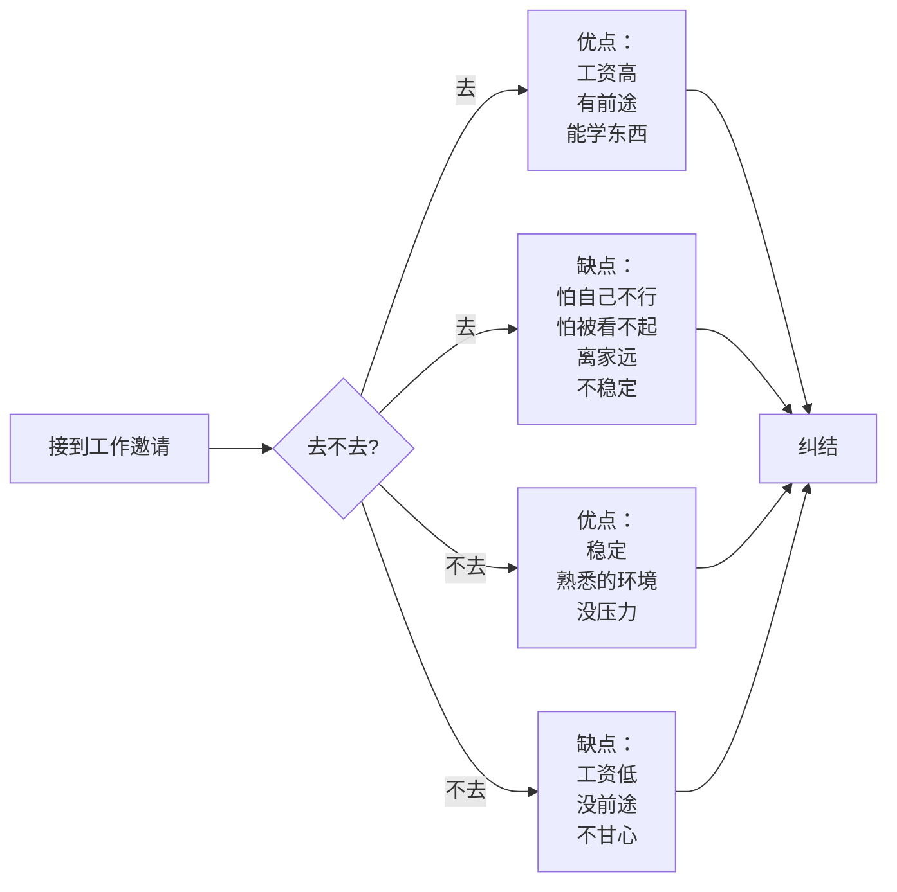

那天晚上，阿强失眠了。

他翻来覆去地想，一会儿觉得应该去闯一闯，一会儿又觉得自己肯定不行。

直到天快亮的时候，他想起了一句话，是老周跟他说过的：

> "人这一辈子，机会不多。来了，就得抓住。就算失败了，大不了再回来当网管。你才20出头，怕什么？"

是啊，怕什么？

大不了失败了，再回来当网管。

反正本来就是个网管，还能跌到哪去？

想通了这一点，阿强心里反而踏实了。

第二天一早，他给对方回了消息：

> "您好，我想去面试。请问什么时候方便？"

### 1.2 辞职

打定主意之后，阿强去找老板张哥辞职。

张哥听完，愣了一下。

"你要走？去哪啊？"

"去南方的一个城市，做网络安全。"

"网络安全？你一个初中毕业的，能做这个？别被人骗了。"

"不会的张哥，是正经公司。我挖漏洞被他们看上了。"

张哥盯着阿强看了半天，好像第一次认识他一样。

"行啊你小子，藏得挺深啊。
我就知道你不是池中之物，天天在我这当网管屈才了。
行，去吧。
要是干得不好，随时回来，我这还给你留着位置。"

阿强心里一暖。

"谢谢张哥。"

"谢啥。你在我这干了这么多年，我还能不知道你是什么人？踏实，肯干，又聪明。
出去好好干，给咱县城争口气。
以后要是混好了，别忘了哥就行。"

"嗯！"阿强用力点头。

然后阿强又给老周打了个电话。

老周听完，哈哈大笑：

"好小子！我就知道你能行！
去吧，放心大胆地去。
有什么不懂的，随时给我打电话。
混不好了，回来跟哥干。
混好了，哥替你高兴！"

挂了电话，阿强心里暖暖的。

虽然要离开熟悉的地方，但是他知道，身后有人支持他。

### 1.3 出发

一周后，阿强收拾好了行李。

其实也没什么好收拾的，就是一个行李箱，装了几件衣服，还有那台陪了他两年的二手笔记本。

网吧的同事们都来送他。

"强哥，以后发达了别忘了我们啊！"
"强哥，到了那边记得常联系！"
"强哥，你真是我们的榜样！"

阿强笑着一一答应。

坐上开往火车站的大巴，看着窗外熟悉的县城景色一点点后退，阿强心里百感交集。

这个他生活了20多年的小县城，这个他工作了好几年的网吧，就要说再见了。

前方是什么样的，他不知道。

但是他知道，他必须往前走。

> 💭 **阿强的内心独白**：
> "火车开动的那一刻，我心里既紧张又兴奋。
> 紧张的是，我不知道等待我的是什么。
> 兴奋的是，我终于要去看看外面的世界了。
> 我在心里跟自己说：阿强，你要争气。
> 就算是为了那些看好你的人，你也得混出个人样来。"

**图120-2 阿强的人生轨迹变化**

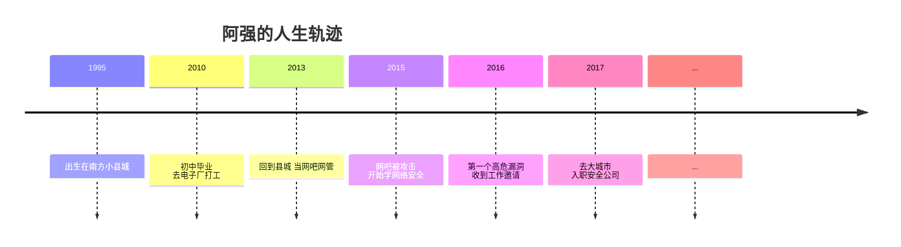

---

## 😰 初入职场：自卑与迷茫

### 2.1 面试

到了杭州（就说是杭州吧，反正是南方某大城市），阿强先找了个便宜的小旅馆住下。

第二天，按照约定的时间，去公司面试。

公司在一个科技园区里，写字楼装修得很气派。

阿强穿着他最好的一件衣服——一件洗得发白的夹克，站在写字楼门口，有点手足无措。

"这么高档的地方，我能进去吗？"

他深吸一口气，走了进去。

到了公司前台，说明来意。前台小姐姐很热情，把他领到了会议室。

等了一会儿，进来一个人。

三十多岁，戴着眼镜，穿着格子衬衫，看起来很斯文。

"你好，我叫李涛，是安全服务部的负责人。你就是阿强吧？"

"李...李经理好。"阿强有点紧张。

"别客气，叫我涛哥就行。来来来，坐。"

涛哥很随和，阿强稍微放松了一点。

面试开始了。

涛哥先问了一些技术问题：SQL注入、XSS、文件上传... 都是Web安全的基础问题。

阿强虽然基础不是特别扎实，但是这些实战的东西，他熟啊。

挖了一年多SRC，这些漏洞他闭着眼睛都能找到。

回答得还不错。

然后涛哥又问了一些挖SRC的经历，阿强如实说了。

涛哥听得很认真，时不时点点头。

聊了大概一个小时，涛哥说：

"技术方面没问题，你实战经验挺丰富的。
我之前看你提交的漏洞报告，质量也很高。
但是有个事我得跟你说清楚。
我们这行，除了技术，沟通能力、文档能力也很重要。
你得跟客户沟通，得写报告，得做汇报。
这些你可能没接触过。
但是没关系，可以学。
你愿意学吗？"

"愿意！我肯定好好学！"阿强赶紧说。

"好。那还有个事，学历的事。
我们公司大多数人都是本科以上，还有几个研究生。
但是我跟你说这些，不是为了打击你。
我就是想告诉你，不用自卑。
我们这行，技术说话。
你技术好，没人会看不起你。
你技术不行，就算是博士，也没人服你。
明白吗？"

"明白！"阿强用力点头。

心里一块石头落了地。

"那行，你回去等通知吧。人事会跟你谈薪资的。"

"好！谢谢涛哥！"

走出写字楼，阿强感觉阳光格外刺眼。

"我... 我面试过了？"

他有点不敢相信。

### 2.2 入职

三天后，阿强收到了offer。

试用期三个月，月薪12K。转正后15K起，看表现。

12K！

一万二！

阿强盯着手机屏幕，看了好半天。

他当网管的时候，一个月才2000多。

这还是试用期，就顶他半年的工资了！

"我靠... 我不是在做梦吧？"

他掐了自己一下，疼。

不是梦。

第二天，阿强就去公司报到了。

办入职手续的时候，人事小姐姐问他：

"阿强，你学历那栏怎么填的是初中啊？是不是填错了？"

阿强脸一红："没...没填错，我确实是初中毕业。"

人事小姐姐愣了一下，然后笑了笑："没事没事，我就是确认一下。我们公司看能力，不看学历。"

话是这么说，但是阿强心里还是有点不舒服。

他知道，人家嘴上不说，心里肯定会想。

到了工位，他被安排在安全服务部的开放办公区。

周围坐的都是同事，看起来都比他大，也比他有文化。

他偷偷打量了一下周围的人：
- 左边的小哥，桌子上摆着某985大学的毕业纪念杯
- 右边的女生，电脑屏保是她研究生毕业的照片
- 对面的大哥，书架上全是英文技术书

阿强又看了看自己的桌面：
一台普通的笔记本，一个水杯，什么都没有。

他突然觉得很自卑。

"我一个初中毕业的，跟这些大学生一起工作，我配吗？"

> 💔 **阿强的自卑**：
> "刚入职那阵子，我特别自卑。
> 人家都是名牌大学毕业的，张口闭口都是什么架构、算法、协议。
> 我呢？很多名词我听都听不懂。
> 开会的时候，人家都在讨论技术方案，我坐在角落里，一句话都插不上。
> 我甚至不敢大声说话，怕别人听出我没文化。
> 中午吃饭都不敢跟大家一起去，怕人家问我是哪个学校毕业的。
> 那时候我甚至有点后悔，觉得自己是不是不该来。"

### 2.3 第一周：格格不入

入职第一周，阿强过得特别煎熬。

不是因为工作难，而是因为那种格格不入的感觉。

同事们聊的话题，他很多都听不懂。

什么微服务、什么K8s、什么DevOps...
这些名词，他以前听都没听过。

大家中午一起去吃饭，他也不敢去。
总是说自己不饿，或者点外卖。

其实他是怕，怕人家问他学历，怕人家看不起他。

工作上，涛哥给了他一些文档让他先看，了解公司的项目流程和规范。

看着那些文档，阿强头都大了。

什么渗透测试方法论、什么项目交付流程、什么报告撰写规范...
一大堆流程和规范，看得他晕头转向。

他以前挖SRC，哪有什么流程啊。
找到漏洞，写个报告，提交，完事。

现在倒好，光是前期准备工作就有一大堆：
- 项目启动会
- 信息收集
- 漏洞探测
- 漏洞验证
- 报告撰写
- 报告初审
- 报告终审
- 客户汇报
- 漏洞复测
- 项目结案

**图120-3 正规渗透测试项目流程**

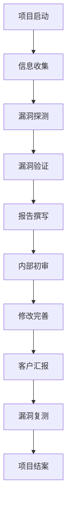

"我的妈呀，挖个漏洞而已，至于这么麻烦吗？"

阿强有点头大。

但是没办法，既然来了，就得按人家的规矩来。

他硬着头皮，一点点看，一点点学。

看不懂的，就百度。
百度也看不懂的，就先记下来，等没人的时候偷偷问旁边的同事。

日子就这么一天天过。

虽然很难，但是阿强能感觉到，自己在进步。

只是，那种自卑的感觉，一直挥之不去。

---

## 💥 第一次项目：搞砸了

### 3.1 第一个项目

入职大概半个月，涛哥找阿强：

"阿强，有个小项目，你跟着去练练手。
就一个企业官网的渗透测试，不算难。
你跟着老王一起去，他是老员工了，你多跟他学学。"

"好！谢谢涛哥！"阿强很高兴。

终于能参与真实项目了！

虽然只是个小项目，但他还是很期待。

老王，三十多岁，做安全好多年了，经验很丰富。

阿强跟着老王，一起去了客户现场。

客户是一家传统企业，要做等保测评，顺便做个渗透测试。

网站是外包做的，不复杂，就是个普通的企业官网。

老王跟客户沟通完需求，然后跟阿强说：

"这个项目不大，你先测着，我在旁边看着。
有什么不懂的问我。
就当练手了。"

"好！"阿强摩拳擦掌。

不就是个企业官网吗？
他挖SRC的时候，这种网站测过不下一百个。

这有什么难的？

阿强打开Burp Suite，开始干活。

信息收集、扫描、手动测试...
一套动作行云流水。

没用半天，他就找到了好几个漏洞：
- 1个SQL注入
- 2个XSS
- 1个文件上传
- 几个信息泄露

"怎么样老王？我找到好几个漏洞！"阿强有点得意。

老王看了看，点点头："嗯，不错，基础还可以。
但是你别光找漏洞，得注意方法论。
你得按流程来，每个漏洞都要验证清楚，写清楚复现步骤。
还有，这个网站你测全了吗？
所有页面都测过了？所有参数都试过了？"

"应该...差不多吧。"阿强不太确定。

"差不多可不行。做渗透测试，就得仔细。
一个参数都不能漏，一个页面都不能放过。
不然漏了漏洞，那就是我们的责任。"

"哦，好的。"阿强嘴上答应着，心里却有点不以为然。

"不就是个小网站吗？能有多少漏洞。
我找到的这几个，已经够了。"

### 3.2 写报告

测完之后，就是写报告了。

老王让阿强先写个初稿。

"写报告？这个我会！我挖SRC的时候经常写！"

阿强信心满满。

他按照挖SRC的格式，很快就把报告写好了。

每个漏洞写个标题，写个地址，写个复现步骤，配上截图，完事。

洋洋洒洒写了十几页。

"老王，你看看，我写好了。"

老王拿过去看了看，眉头越皱越紧。

看了半天，老王把报告放下，说：

"阿强，你这报告，不行。"

"啊？怎么不行？"阿强有点懵。

"你这是SRC的漏洞报告，不是项目交付报告。
我们给客户的报告，不能这么写。"

"那...应该怎么写？"

老王耐心地说：

"我给你讲讲，一份专业的渗透测试报告，应该包含哪些内容。

首先，得有封面、目录、项目概述。
然后，得有测试范围、测试方法、测试时间、测试人员。
然后才是漏洞详情。
漏洞详情也不能像你这么写。
每个漏洞都得有：
- 漏洞名称
- 漏洞等级
- 漏洞描述
- 影响范围
- 复现步骤（要非常详细，一步一步的，客户照着就能复现）
- 漏洞证明（截图、请求包、响应包...）
- 修复建议（要具体，不能只说'过滤用户输入'）
- 参考文献

最后，还要有整体的风险评估、加固建议、总结。

你看你写的这叫什么？
漏洞描述就一句话，修复建议就几个字。
客户拿到你的报告，知道怎么修吗？
人家要是知道怎么修，还找我们干嘛？"

阿强脸涨得通红。

"我...我以前没写过这种报告..."

"没事，第一次写，写成这样正常。
我给你个模板，你照着模板改。
有不懂的问我。
但是记住，报告是我们的脸面。
技术再好，报告写得不行，客户也不认。
明白吗？"

"明白。"

阿强低着头，心里很不是滋味。

本以为挺简单的事，没想到这么复杂。

**图120-4 专业渗透测试报告结构**

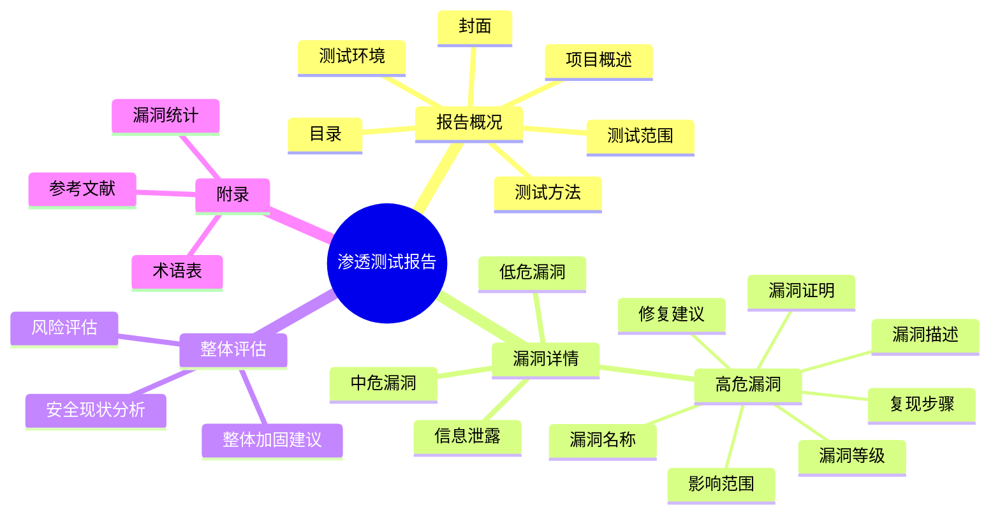

### 3.3 返工

阿强拿着老王给的模板，开始改报告。

改起来才发现，这比他想象的难多了。

就说漏洞描述吧，不能只说"存在SQL注入漏洞"，得讲清楚什么是SQL注入，这个漏洞的原理是什么，可能造成什么危害。

复现步骤也得写得特别详细，从打开浏览器开始，一步一步的，每个点击、每个输入都得写清楚。

修复建议更难，不能只说"过滤用户输入"，得说清楚用什么方法过滤，用什么函数，代码怎么写。

比如SQL注入的修复建议，得写成这样：

```
修复建议：
1. 使用预编译语句（Prepared Statement），避免SQL拼接
   示例代码（PHP PDO）：
   <?php
   $pdo = new PDO('mysql:host=localhost;dbname=test', 'user', 'pass');
   $stmt = $pdo->prepare('SELECT * FROM users WHERE id = :id');
   $stmt->bindParam(':id', $id, PDO::PARAM_INT);
   $stmt->execute();
   ?>
   
2. 对输入参数进行严格的类型校验
   - 数字类型参数，强制转换为int
   - 字符串类型参数，使用白名单过滤
   
3. 配置数据库账号最小权限
   - 业务账号不要使用root或sa等最高权限账号
   - 只授予必要的权限
   
4. 关闭数据库错误回显
   - 生产环境禁止输出数据库错误信息
   - 错误日志记录到文件，不显示到前端
```

阿强看着这些，头都大了。

"我的妈呀，写个报告比挖漏洞还累..."

但是没办法，只能硬着头皮写。

改了整整两天，改了四五版，老王才勉强说"差不多了"。

阿强松了一口气。

本以为这事就这么过去了。

没想到，更大的打击还在后面。

### 3.4 漏了高危漏洞

报告交给客户之后，过了几天，客户那边反馈回来了。

客户的安全负责人说：

"你们这报告不行啊，漏了好几个高危漏洞。
我们自己的安全团队复测的时候，又发现了两个高危：
一个是后台的越权访问，一个是命令执行。
你们怎么没测出来？"

涛哥接到客户的反馈，脸都黑了。

他把阿强和老王叫到办公室。

"怎么回事？这么明显的漏洞，怎么没测出来？
客户都自己发现了，我们的脸往哪搁？"

老王低着头："涛哥，对不起，是我的责任。
我以为阿强测过了，就没仔细复查。"

阿强也低着头，不敢说话。

涛哥转向阿强：

"阿强，你说说，怎么回事？
后台你测了吗？"

"后台... 我没找到后台地址..."阿强声音很小。

"没找到就不测了？
你不会扫吗？不会爆破吗？不会找源码泄露吗？
做渗透测试，找不到后台就完了？
那要是客户的后台有漏洞，我们没测出来，出事了谁负责？"

阿强不敢说话，脸涨得通红。

"还有那个命令执行漏洞，是在一个图片处理的功能里。
你测了吗？"

"图片处理... 我以为就是个普通的上传，就没仔细看..."

"你以为！你以为！
做安全的，最忌讳的就是'我以为'！
你以为没问题，就真的没问题了？
漏洞不会因为你以为没有就不存在！"

涛哥越说越生气。

"阿强，我知道你是挖SRC出身的，实战经验有。
但是挖SRC和做项目，是两码事。
挖SRC，你找到一个漏洞就能交差。
但是做项目，你得对客户的整个系统负责。
漏了一个漏洞，就是我们的失职。
你明白吗？"

"我...我明白..."阿强声音都在抖。

"行了，你先出去吧。老王，你留下，我们商量一下怎么跟客户解释。"

阿强低着头走出办公室，眼泪在眼眶里打转。

他回到工位，趴在桌子上，心里特别难受。

"我怎么这么没用...
连这么简单的项目都做不好...
人家会不会觉得，初中生就是不行...
我是不是真的不适合干这行..."

> 😢 **阿强的挫败感**：
> "那天我特别难受，真的。
> 不是因为被骂了难受，是因为觉得自己真的不行。
> 我以前以为自己挺厉害的，挖SRC也赚了点钱。
> 结果到了正经公司，连个最简单的项目都做不好。
> 漏洞漏了一大堆，报告也写不好。
> 我甚至想，要不就算了，回去当网管算了。
> 至少当网管，没人骂我，也没人看不起我。"

---

## 🧑‍🏫 遇到贵人：师傅带我飞

### 4.1 想放弃

被骂完之后，阿强消沉了好几天。

他甚至开始偷偷投简历，想找个别的工作，或者干脆回去当网管算了。

但是转念又想：
"就这么回去了，多丢人啊？
张哥、老周，还有网吧那帮兄弟，都知道我来大城市闯荡了。
就这么灰溜溜地回去，怎么见人？"

可是不回去，留在这，又觉得自己什么都做不好。

就在阿强纠结的时候，老王找他了。

"阿强，晚上有空吗？一起吃个饭？"

"啊？... 好。"

晚上，老王带阿强去了公司附近的一个小饭馆。

点了几个菜，两瓶啤酒。

老王给阿强倒了一杯：

"来，喝一个。
那天涛哥骂你，你别往心里去。
他就是那样的人，对事不对人。
骂你，是因为对你有期望。
要是真觉得你不行，他连理都懒得理你。"

阿强低着头，没说话。

老王继续说：

"我知道你心里不好受。
觉得自己没做好，给大家添麻烦了。
很正常，谁都是从新手过来的。
我刚入行的时候，还不如你呢。
我第一次做项目，漏了一个SQL注入，客户那边被黑了，差点赔了几十万。
那时候我也想放弃，觉得自己不是这块料。"

"真的假的？"阿强抬起头。

"当然是真的。谁还没个新手期啊？
你啊，就是挖SRC挖惯了，思维方式还没转过来。
挖SRC是'找漏洞'，找到一个是一个。
但是做渗透测试，是'全面评估'，得确保整个系统的安全。
这是两种完全不同的思维方式。
你得改。"

"那...怎么改？"

"慢慢来。我带你。
以后做项目，你跟着我。
我教你方法论，教你思维方式。
但是你自己也得努力，知道不？"

"王哥... 你愿意带我？"阿强有点不敢相信。

"当然愿意。我看你小子挺机灵的，也肯学。
就是基础差点，思维方式没转过来。
这些都可以练。
我当年带我的师傅，也是这么带我的。
现在轮到我带你了。"

阿强眼睛有点湿润。

"谢谢王哥... 谢谢你..."

"谢啥，都是同事。再说了，我看你顺眼。
不像有些大学生，眼高手低的，说什么都懂，真让他干又干不好。
你不一样，你踏实，肯干。
这就够了。"

那天晚上，阿强喝了很多。

有委屈，有感动，也有重新燃起的希望。

他知道，自己遇到贵人了。

**图120-5 阿强心态的转变**

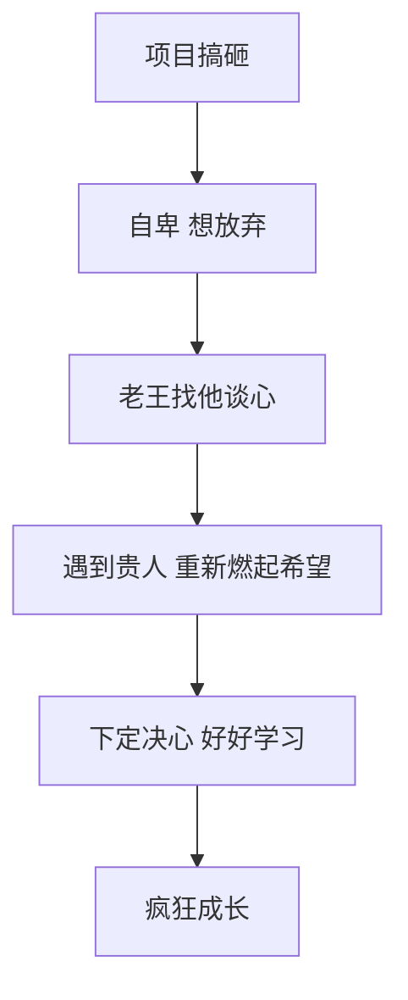

### 4.2 师傅教的第一课：方法论

从那以后，阿强就跟着老王干。

老王成了他真正意义上的师傅。

老王教他的第一课，不是什么新技术，而是方法论。

"阿强，我问你，你以前挖SRC，是怎么找漏洞的？"

"就是... 打开网站，到处点，找参数，然后试呗。
看运气，运气好就能找到。"

老王摇摇头：

"这叫瞎碰，不叫渗透测试。
真正的渗透测试，是有方法论的。
你得按流程来，一步一步的，确保每个点都测到。
这样就算没找到漏洞，你也能说清楚，哪些地方测了，怎么测的，为什么没问题。
而不是说'我没找到'。"

然后老王给他讲了渗透测试的标准流程：

```
📋 渗透测试标准流程（PTES）：

1. 前期交互（Pre-engagement Interactions）
   - 确定测试范围、测试时间、测试方法
   - 签订授权书、保密协议
   - 明确规则：哪些能测，哪些不能测

2. 情报收集（Intelligence Gathering）
   - 主动信息收集：端口扫描、服务识别、目录扫描...
   - 被动信息收集：WHOIS、DNS、子域名、搜索引擎、社工库...
   - 目标：尽可能多地了解目标

3. 威胁建模（Threat Modeling）
   - 分析目标的业务逻辑
   - 找出可能的攻击面
   - 确定测试重点和优先级

4. 漏洞分析（Vulnerability Analysis）
   - 漏洞扫描（自动化工具）
   - 手工验证（确认漏洞真实存在）
   - 漏洞分级（高危、中危、低危）

5. 漏洞利用（Exploitation）
   - 尝试利用漏洞，获取更高权限
   - 从外网打进内网
   - 扩大攻击范围

6. 后渗透（Post Exploitation）
   - 提权
   - 横向移动
   - 数据窃取
   - 权限维持

7. 报告撰写（Reporting）
   - 整理漏洞详情
   - 编写修复建议
   - 整体风险评估
   - 交付给客户
```

"看到了吗？渗透测试是一套完整的方法论。
不是上来就瞎测。
你得先收集信息，了解目标，然后有针对性地测试。
这样效率才高，也不容易漏。"

阿强听得很认真，一字不落地记在笔记本上。

"王哥，我以前真不知道有这么多讲究...
我以为就是打开网站找注入点呢..."

"所以说你是野路子嘛。
野路子也有野路子的好处，实战经验丰富，敢想敢干。
但是要想更进一步，就得系统化。
得把你的经验，整理成方法论。
这样才能稳定输出，而不是靠运气。"

"嗯！我记住了！"

### 4.3 思维方式的转变

除了方法论，老王还教了阿强很多思维方式上的东西。

"我再跟你说几个重要的思维方式，你好好体会。

第一，**攻击者思维**。
做渗透测试，你得把自己当成一个真正的攻击者。
你要想：如果我是黑客，我会怎么攻击这个系统？
我会从哪入手？我会找什么漏洞？
我会怎么绕过防护？
只有这样，你才能找到真正的漏洞。

第二，**全面性思维**。
不能只盯着一个点，得有全局观。
一个网站，有前台有后台，有PC端有移动端，有主站有子站。
你都得测。
不能测了前台就不测后台，测了主站就不测子站。
漏洞往往藏在你忽略的地方。

第三，**深度思维**。
找到一个漏洞，不能浅尝辄止。
你得深入进去，看看这个漏洞到底能造成多大危害。
比如一个SQL注入，你不能只说'存在注入'就完了。
你得看看：能拖库吗？能写文件吗？能拿shell吗？能提权吗？
危害有多大，就挖到多深。

第四，**逻辑性思维**。
很多漏洞，不是技术问题，是逻辑问题。
比如越权、比如支付漏洞、比如密码找回漏洞。
这些漏洞，技术含量不高，但是危害很大。
你得去梳理业务逻辑，找出其中的漏洞。
这个很多人都容易忽略。"

**图120-6 渗透测试的四种核心思维**

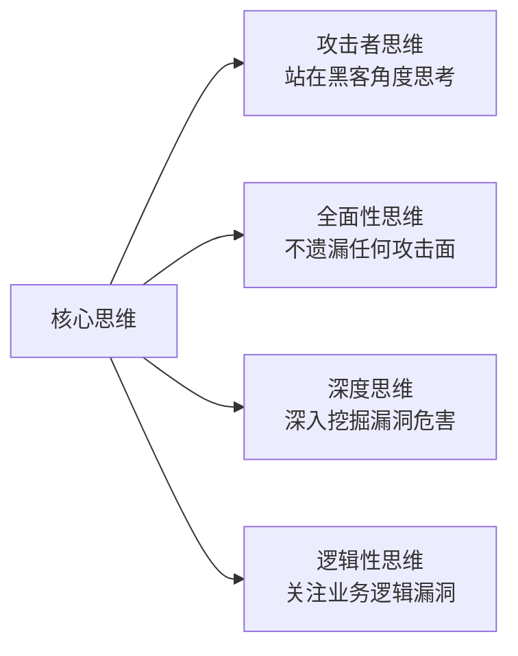

阿强听得似懂非懂，但是他都记下来了。

他知道，这些东西，比技术更重要。

技术可以学，但是思维方式，得慢慢培养。

"王哥，我以前真没想过这么多...
我以为只要技术好，能找到漏洞就行。"

"技术是基础，但是思维方式决定了你能走多远。
很多人技术学了一大堆，但是做项目就是不行。
为什么？就是思维方式不对。
你呀，基础虽然差点，但是脑子好使，人也勤奋。
把思维方式转过来，进步会很快的。"

"嗯！我一定好好学！"

从那以后，阿强就像海绵吸水一样，疯狂地学习。

跟着老王做项目，学方法论，学思维方式，学怎么写报告，怎么跟客户沟通。

进步神速。

---

## 🔥 疯狂成长：那些熬夜的日子

### 5.1 每天加班到深夜

阿强知道自己基础差，所以比任何人都努力。

每天早上，他是第一个到公司的。
每天晚上，他是最后一个走的。

同事们都下班了，他还在那学习。

学什么？

学的东西可多了：
- 补基础知识：计算机原理、网络协议、操作系统...
- 学新漏洞：越权、逻辑漏洞、SSRF、XXE、反序列化...
- 学工具：Nmap、AWVS、AppScan、Metasploit、Cobalt Strike...
- 学写报告：怎么写得专业、怎么写得清楚、怎么让客户看得懂...
- 学沟通：怎么跟客户交流、怎么汇报、怎么讲技术问题...

每天学到晚上10点多，才回出租屋。

回去之后，接着学，学到凌晨一两点。

**阿强的每日时间表：**
```
🌅 早上 7:00
- 起床，洗漱
- 吃早饭
- 看一个小时书（基础知识）

🏢 上午 9:00 - 12:00
- 上班，做项目
- 跟老王学习

🍱 中午 12:00 - 13:30
- 吃饭
- 看技术文章（公众号、博客）

🏢 下午 13:30 - 18:00
- 上班，做项目
- 整理笔记

🍜 晚上 18:00 - 19:00
- 吃饭

🔥 晚上 19:00 - 22:00
- 在公司加班
- 做靶场、学新技术、补基础

🏠 晚上 22:30 - 凌晨 1:00
- 回到出租屋
- 继续学习
- 写总结、记笔记

😴 凌晨 1:00
- 睡觉
```

每天只睡六七个小时。

很累，但是阿强觉得很充实。

因为他能感觉到自己在进步，一天比一天强。

> 💪 **阿强的感受**：
> "那段时间虽然累，但是特别充实。
> 每天都能学到新东西，每天都能感觉到自己在进步。
> 不像以前当网管，混一天是一天。
> 虽然每天只睡六七个小时，但是一点都不觉得困。
> 因为有奔头。
> 我知道，只要我足够努力，我就能在这个城市站稳脚跟。"

### 5.2 靶场狂魔

为了练技术，阿强几乎把所有能找到的靶场都做了一遍。

什么DVWA、bWAPP、Pikachu、Upload-Labs、XSS Challenges、SQLi-Labs...
这些基础靶场，他刷了一遍又一遍。

什么WebGoat、Vulhub、VulnStack、红日靶场...
这些进阶靶场，他也一个不落。

每做一个靶场，他都写详细的笔记。
漏洞原理是什么，怎么利用，怎么修复，有哪些绕过方法...
都写得清清楚楚。

光笔记，他就写了十几万字。

**图120-7 阿强的靶场学习路径**

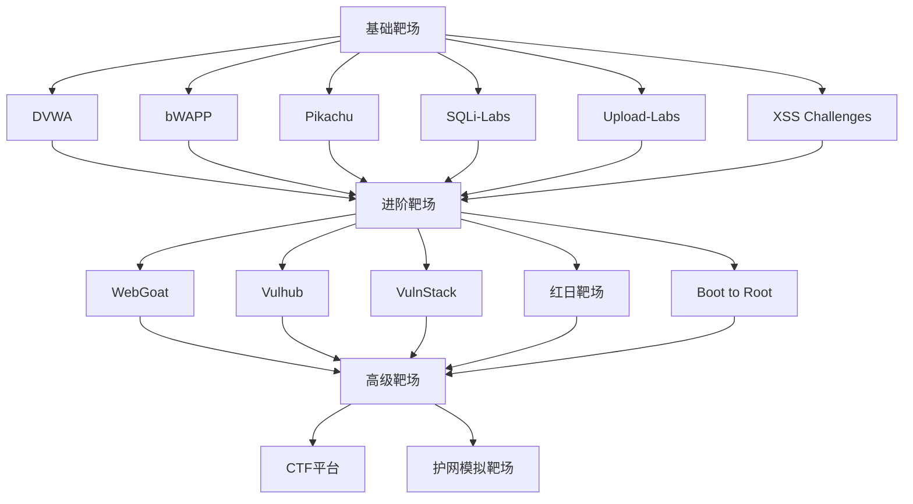

有一次，老王看到阿强的笔记，都惊呆了。

"我去，你这笔记比我还详细啊！
每个漏洞都有原理、有复现、有修复、有绕过方法。
你这是要出书啊？"

阿强不好意思地笑了笑：

"我记性不好，写下来记得牢一点。
而且以后忘了，还能翻出来看看。"

"你小子，真能拼。
我当年都没你这么努力。
你这么干，用不了一年，就能超过我。"

"哪能啊王哥，我还差得远呢。"

"真不是我夸你。
做这行，天赋重要，但是努力更重要。
你这么拼，不成功才怪。"

### 5.3 第一次独立做项目

就这样，过了大概三个月。

阿强转正了。

而且，涛哥让他独立负责一个小项目。

"阿强，这个项目不大，一个小网站的渗透测试。
你自己去，独立完成。
我相信你可以的。
有问题随时给我或者老王打电话。"

"好！涛哥你放心，我肯定做好！"

阿强既紧张又兴奋。

这是他第一次独立负责项目。

他暗暗发誓，一定要做好，不能再像上次那样了。

到了客户现场，阿强按照老王教的方法，一步一步来。

先做信息收集：
- 子域名枚举
- 端口扫描
- 目录扫描
- 指纹识别
- 搜索引擎查找敏感信息

然后做威胁建模，分析攻击面，确定测试重点。

再然后，按照测试 checklist，一个点一个点地测。

前台、后台、移动端、API接口...
每个参数、每个功能、每个入口...
都测了一遍。

**阿强的测试 checklist（部分）：**
```
✅ SQL注入
  - 数字型注入
  - 字符型注入
  - 搜索型注入
  - 联合注入
  - 报错注入
  - 布尔盲注
  - 时间盲注
  - 堆叠注入
  - 二次注入
  - 宽字节注入
  - ...

✅ XSS跨站脚本
  - 反射型XSS
  - 存储型XSS
  - DOM型XSS
  - 各种绕过技巧
  - ...

✅ 文件上传
  - 前端验证绕过
  - MIME类型绕过
  - 黑名单绕过
  - 解析漏洞
  - .htaccess
  - 双写绕过
  - 00截断
  - ...

✅ 越权访问
  - 水平越权
  - 垂直越权
  - 未授权访问
  - IDOR
  - ...

✅ 其他
  - CSRF
  - SSRF
  - XXE
  - 反序列化
  - 命令执行
  - 代码执行
  - 文件包含
  - 信息泄露
  - 逻辑漏洞
  - ...
```

测完之后，阿强又复查了一遍，确保没有遗漏。

然后写报告。

按照公司的标准模板，认认真真地写。

每个漏洞都写得清清楚楚：
- 漏洞描述
- 漏洞等级
- 影响范围
- 复现步骤（一步一步，截图+请求包+响应包）
- 漏洞证明
- 修复建议（具体、可操作）
- 参考文献

写了整整五十多页。

写完之后，自己又检查了三遍，确认没问题了，才发给涛哥。

涛哥看完，点点头：

"嗯，不错。比第一次强多了。
漏洞找得挺全的，报告写得也像那么回事了。
看来这三个月没白学。"

阿强心里悬着的石头终于落了地。

"谢谢涛哥！"

走出涛哥的办公室，阿强差点跳起来。

"我做到了！我独立完成项目了！"

那种成就感，无法形容。

**图120-8 阿强三个月的成长变化**

```mermaid
gantt
    title 阿强入职三个月成长曲线
    dateFormat X
    axisFormat 第%s周
    
    section 技术能力
    Web漏洞基础     :a1, 0, 4
    高级漏洞挖掘   :a2, 2, 6
    方法论建立     :a3, 3, 8
    独立项目能力   :a4, 6, 12
    
    section 软技能
    报告撰写       :b1, 1, 8
    客户沟通       :b2, 4, 12
    项目管理       :b3, 8, 12
    
    section 关键节点
    入职           :milestone, m1, 0, 0
    第一次项目失败 :milestone, m2, 2, 0
    拜老王为师     :milestone, m3, 3, 0
    转正           :milestone, m4, 12, 0
```

---

## ⚡ 大放异彩：挖到0day级漏洞

### 6.1 一个重要的项目

时间过得很快，转眼阿强入职快一年了。

这一年里，他成长得非常快。

从一个连报告都写不好的新手，变成了能独当一面的渗透测试工程师。

大大小小的项目做了几十个，经验越来越丰富。

老王都说："阿强，你现在技术比我都好了。再这么下去，我都没什么可教你的了。"

阿强赶紧说："哪能啊王哥，我还差得远呢。"

话是这么说，但是阿强心里知道，自己确实进步很大。

这一天，公司接了一个重要的项目。

是一家知名互联网公司的安全评估项目，预算很高，也很有挑战性。

目标是他们的一个核心业务系统，用户量很大，技术也比较新。

涛哥把这个项目交给了老王和阿强。

"这个项目很重要，也很有挑战性。
对方的安全团队实力也很强，防护做得不错。
你们两个联手，争取拿出好成绩。
要是做得好，以后还能长期合作。"

"放心吧涛哥，我们尽力！"

老王和阿强都很兴奋。

这种有挑战性的项目，最能锻炼人。

### 6.2 难啃的骨头

项目开始了。

一开始，老王和阿强就遇到了困难。

目标系统的防护做得确实不错：
- WAF配置得很严格，常见的攻击payload都被拦了
- 输入输出都做了过滤，XSS和SQL注入很难打
- 权限控制也做得不错，越权漏洞不好找
- 文件上传也做了严格的校验

两个人忙活了好几天，只找到几个中低危的漏洞。

"这系统可以啊，防护做得挺到位的。"老王说。

"是啊王哥，我测了好几天，高危的一个都没找到。
常见的漏洞点都测了，都被防住了。"

"别急，慢慢来。越是防护好的系统，越有意思。
常见漏洞肯定是没有了，我们得找那些不常见的。
比如逻辑漏洞、业务漏洞。
这些东西，自动化工具扫不出来，得靠人去挖。"

"嗯！"

两个人调整了思路，把重点从技术漏洞转向业务逻辑漏洞。

他们开始仔细梳理系统的业务流程：
- 用户注册、登录、找回密码
- 个人信息修改
- 商品浏览、下单、支付
- 消息通知
- 各种API接口
- ...

一个功能一个功能地梳理，一个逻辑一个逻辑地分析。

**图120-9 业务逻辑漏洞挖掘思路**

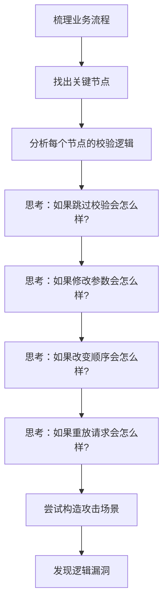

阿强负责分析用户模块和订单模块。

他把自己当成一个真实的用户，完完整整地把所有流程都走了一遍。

注册、登录、改资料、下订单、支付、退款...
每个步骤都走了好几遍。

一边走，一边想：
"这里为什么要这么设计？"
"如果我改了这个参数会怎么样？"
"如果我跳过这一步会怎么样？"

走了一遍又一遍，试了一个又一个想法。

大部分都失败了。

但是阿强不气馁。

他知道，逻辑漏洞这种东西，就是这样。
试一百次，可能九十九次都是失败的。
但是只要成功一次，就是一个高危漏洞。

### 6.3 发现一个可疑的点

这一天，阿强在测订单模块的时候，发现了一个可疑的地方。

订单详情页，有一个"下载订单凭证"的功能。

点击之后，会生成一个PDF文件，然后下载下来。

PDF里包含订单的详细信息。

这个功能看起来很正常。

但是阿强注意到，下载PDF的请求是这样的：

```
GET /api/order/download_pdf?order_id=12345&template=default HTTP/1.1
Host: xxx.com
Cookie: ...
```

有两个参数：order_id 和 template。

order_id 是订单号，这个很正常。

但是 template 是干什么的？

"template... 模板？"

阿强仔细看了看，这个参数的值是"default"。

"会不会是PDF模板的文件名？"

如果是的话，那会不会有任意文件读取漏洞？

比如把 template 改成 `../../../../etc/passwd`，会不会把系统文件读出来？

但是想了想，又觉得不太可能。

这么大的公司，应该不会犯这种低级错误。

不过，还是得试试。

阿强修改了请求：

```
GET /api/order/download_pdf?order_id=12345&template=../../../../etc/passwd HTTP/1.1
```

发送请求。

响应回来：
```json
{"code":400,"msg":"模板文件不存在"}
```

"模板文件不存在... 说明什么？
说明它确实在根据 template 参数去找文件！
只是我给的路径不对，或者被过滤了。"

阿强眼睛一亮。

有戏！

> 🎯 **任意文件读取漏洞原理**：
> 当应用程序使用用户可控的参数去拼接文件路径，读取文件内容时，如果没有对参数进行严格的校验和过滤，攻击者就可以通过构造特殊的路径（比如 `../../../`），读取到系统中的任意文件。
>
> 常见的场景：
> - 文件下载功能
> - 模板渲染功能
> - 图片查看功能
> - 文件包含功能
>
> 危害：
> - 读取系统敏感文件（/etc/passwd、/etc/shadow、配置文件...）
> - 读取源代码
> - 读取数据库配置
> - 甚至可能getshell

### 6.4 深入挖掘

阿强继续测试。

先试试相对路径行不行：
```
template=../default    → 模板文件不存在
template=default.html   → 模板文件不存在
template=default.php   → 模板文件不存在
```

看来直接读文件不行。

是不是有后缀？比如自动加了什么后缀？

再试试：
```
template=default%00.jpg  → 还是模板文件不存在
```

不行，00截断没用。

那试试绝对路径？
```
template=/etc/passwd  → 模板文件不存在
```

也不行。

"难道被过滤了？"

阿强想了想，又换了个思路。

既然这个功能是生成PDF的，那它用的是什么模板引擎呢？

如果是用的Twig、Smarty这种模板引擎，那会不会有模板注入漏洞？

或者，如果是用的HTML转PDF的工具，比如wkhtmltopdf，那会不会有SSRF或者文件读取？

"HTML转PDF... 如果我能控制模板里的内容的话..."

阿强又仔细看了看这个功能。

订单PDF里的内容，是订单的信息。
订单信息是用户可以修改的吗？

比如收货地址、收货人姓名...

"如果我把收货地址改成一段HTML代码，会不会被解析？"

阿强马上注册了一个测试账号，下了一个测试订单。

然后把收货地址改成了：
```html
<h1>test xss</h1>

```

然后下载PDF。

打开PDF一看——

<h1>test xss</h1> 这句话，真的变成了大标题！

图片虽然没加载出来，但是HTML标签被解析了！

"我靠！真的解析HTML！"

阿强激动得手都抖了。

如果能解析HTML的话，那能做的事就多了！

**图120-10 HTML转PDF漏洞利用链**


### 6.5 利用成功

阿强继续深入测试。

既然能解析HTML，那能不能读取本地文件？

他把收货地址改成了：
```html
<iframe src="file:///etc/passwd" width="800" height="600"></iframe>
```

然后下载PDF。

打开PDF一看——

真的有内容！

虽然格式有点乱，但是能看出来，就是 `/etc/passwd` 文件的内容！

"我靠！成功了！任意文件读取！"

阿强差点喊出来。

他赶紧又试了几个其他文件：
- `/etc/hosts` ✓ 能读
- `/proc/self/environ` ✓ 能读
- 应用程序的配置文件 `/var/www/html/config.php` ✓ 能读

从配置文件里，还读到了数据库的账号密码！

"这绝对是高危！不对，是严重！"

阿强赶紧把老王叫过来。

老王看了之后，也很震惊。

"可以啊阿强！这都能被你找到！
HTML转PDF的文件读取，这个漏洞挺少见的。
你怎么想到的？"

"我就是看那个 template 参数可疑，然后顺着往下挖。
结果发现订单内容会被解析成HTML...
然后就想到了file协议读文件。"

"厉害厉害！这个洞，含金量很高啊。
不仅是任意文件读取，还能SSRF，说不定还能打内网。
走，我们继续深入，看看能打到什么程度。"

两个人继续深挖。

通过任意文件读取，他们拿到了：
- 系统配置文件
- 数据库配置（账号密码）
- 应用源代码
- 其他敏感信息

然后通过这些信息，又找到了更多的漏洞。

最后，光是这个点，就挖出了三个高危漏洞：
1. 任意文件读取（严重）
2. SSRF服务器端请求伪造（高危）
3. 敏感信息泄露（高危）

**漏洞危害评估：**
```
⚠️ 漏洞危害：

1. 任意文件读取
   - 可以读取系统任意文件
   - 包括配置文件、源代码、敏感数据
   - 可以获取数据库账号密码
   - 可以获取应用的所有源代码

2. SSRF
   - 可以利用服务器发起请求
   - 可以探测内网
   - 可以攻击内网服务
   - 可以访问云平台元数据

3. 整体风险
   - 利用这些漏洞，可以进一步获取数据库权限
   - 甚至可能getshell
   - 危害极大
```

### 6.6 0day级漏洞

项目交付的时候，客户的安全团队看到这个漏洞，都震惊了。

"这个漏洞... 你们是怎么找到的？
我们自己测了好多次，都没发现。
这个功能上线快一年了，还是第一次有人发现这个漏洞。"

老王笑了笑："我们这位同事，对逻辑漏洞特别敏感。"

客户的安全负责人看向阿强，伸出手：

"厉害厉害！年轻有为啊！
这个漏洞质量很高，绝对是0day级别的。
我们之前找过好几家安全公司，都没测出来。
你们是第一个发现的。
佩服佩服！"

阿强不好意思地笑了笑："运气好，运气好。"

"运气也是实力的一部分。
再说了，这么多人测过都没发现，到你这就发现了，这能是运气吗？
这就是实力。"

项目结束后，客户特别满意，又跟公司签了好几个项目。

涛哥也很高兴，在部门大会上表扬了阿强，还给他发了奖金。

"阿强，好样的！这个项目做得很漂亮！
继续努力，前途无量！"

那一刻，阿强心里特别有成就感。

他知道，自己真正地站起来了。

不再是那个自卑的初中毕业生，不再是那个连报告都写不好的新手。

他是一名真正的安全工程师。

> ✨ **阿强的感悟**：
> "拿到奖金的那一刻，我心里特别感慨。
> 想起刚入职的时候，连个小项目都做不好，被骂得狗血淋头。
> 那时候我怎么也想不到，自己有一天能挖出0day级的漏洞，还能得到客户的认可。
> 真的，只要你肯努力，就没有什么不可能。
> 起点低怎么了？基础差怎么了？
> 笨鸟先飞，勤能补拙。
> 只要你肯拼，就一定能行。"

---

## 🛡️ 护网红队：一战成名

### 7.1 护网行动

又过了一年，阿强入职快两年了。

这两年里，他的技术越来越好，经验也越来越丰富。

从Web渗透到内网渗透，从红队到蓝队，他都有涉猎。

成了公司的技术骨干。

这一年夏天，公司要组队参加护网行动。

护网行动，阿强早就听说过，但是从来没参加过。

他一直很向往。

护网，那可是网络安全的"世界杯"啊！
能参加护网的，都是高手。

涛哥把阿强叫到办公室：

"阿强，今年护网，你跟着一起去。
你技术没问题，就是缺大型实战的经验。
去锻炼锻炼。"

"真的？！谢谢涛哥！"阿强激动坏了。

护网行动！
他居然能参加护网了！

"别高兴太早，护网可不是闹着玩的。
强度很大，压力也很大。
做好吃苦的准备。"

"放心吧涛哥，我不怕吃苦！"

接下来的一个月，阿强开始为护网做准备。

各种工具、各种payload、各种思路...
都复习了一遍又一遍。

他还专门买了好几个护网相关的课程，天天看到凌晨。

就盼着护网早点开始，大显身手。

**图120-11 护网红队备战清单**

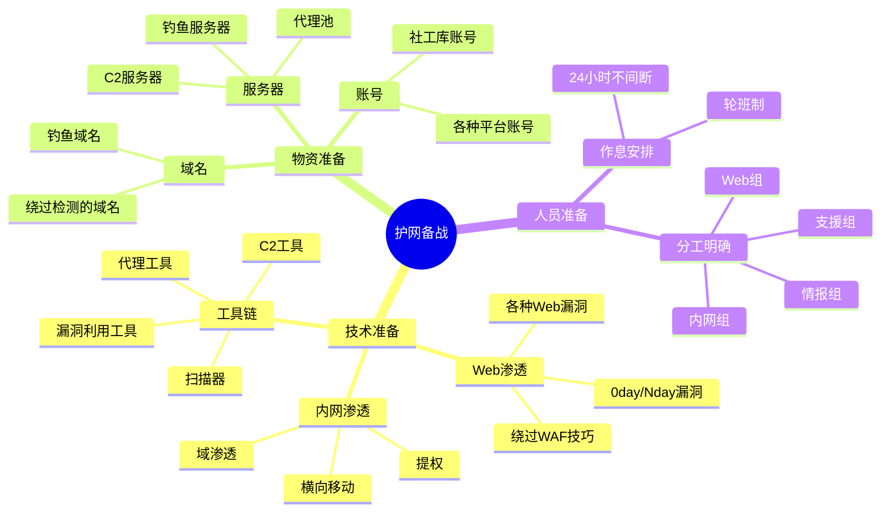

### 7.2 护网开始

终于，护网行动开始了。

红队一共八个人，分成几个小组。
阿强被分到了Web组，主要负责外围打点。

目标是一家大型国企。

第一天，大家都在紧锣密鼓地做信息收集。

子域名、端口、服务、指纹...
各种工具跑起来。

阿强也在拼命地找漏洞。

但是目标的防护做得确实不错，外围打点很不顺利。
常见的漏洞一个都没有，WAF也很严格。

第一天过去了，只拿下了两台边缘服务器，还是通过弱口令进去的。

"这目标挺硬啊。"老王说。

"是啊王哥，外围不好打。
常见的漏洞点都测了，都被防住了。"

"别急，护网嘛，哪有那么容易。
慢慢找，总能找到突破口的。"

第二天，阿强把重点放在了边缘资产和子域名上。

主站防护严，不代表所有子站都严。

很多时候，突破口都在那些没人管的边缘系统上。

阿强一个子域名一个子域名地测。

测了几十个，都没什么收获。

就在他有点失望的时候，他发现了一个看起来很不起眼的子域名：
`old-system.xxx.com`

从名字看，应该是个旧系统。

"旧系统... 这种地方通常漏洞多。"

阿强打开网站一看。

是一个很老的OA系统，界面都是十几年前的风格。

"这种老系统，肯定有漏洞！"

阿强一下子来了精神。

### 7.3 找到突破口

阿强开始仔细测试这个老OA系统。

一测之下，漏洞一大堆：
- SQL注入
- 任意文件上传
- 越权访问
- 后台弱口令

简直就是个漏洞宝库。

"我靠，这系统也太脆弱了吧...
怎么还在线上跑着呢？"

阿强没费多大劲，就通过文件上传漏洞拿到了Shell。

是一台Windows服务器，权限还不低。

"王哥王哥！快来看！
我找到一个老OA系统，漏洞特别多！
已经getshell了！"

老王过来一看，也很高兴：

"可以啊阿强！这么快就找到突破口了！
这系统一看就是没人管的，确实容易出问题。
行，这是个好的开始。
接下来，把这台机器当跳板，往内网打！"

有了第一个跳板，接下来的事情就顺利多了。

内网组通过这个跳板，进入了目标内网。
然后开始横向移动，扩大战果。

阿强也没闲着，继续在外围找漏洞。

又陆陆续续找到了好几个有漏洞的边缘系统，拿下了好几台外网服务器。

开局不错。

**图120-12 阿强的护网攻击路径**


### 7.4 关键的一跳

内网那边进展也挺顺利的。

但是打到核心区的时候，遇到了困难。

核心区防护很严，防火墙、IDS、EDR... 什么都有。
常规的攻击手法都不好使。

内网组的兄弟忙活了好几天，都没摸到核心区的边。

大家都有点着急。

这天晚上，阿强在内网的一台跳板机上翻东西。

他在一个运维的目录里，发现了一个脚本。

是一个自动备份的脚本，看起来没什么特别的。

但是阿强仔细看了看，发现这个脚本会定期去一个FTP服务器下载东西，然后执行。

"定期下载然后执行...
如果我能劫持这个FTP，或者控制那个FTP服务器的话..."

阿强眼睛一亮。

他马上查了一下这个FTP服务器的地址。

是内网的一台服务器，IP是 10.10.50.20。

"这台服务器我们能不能打到？"

阿强查了一下网络拓扑，又测试了一下连通性。

发现这台FTP服务器在另一个网段，目前还没打过去。

但是... 它和我们现在控制的这台机器，网络是通的！

而且，阿强还发现，FTP的密码，居然就写在脚本里！

"我靠！明文密码！"

阿强赶紧用这个密码登录了FTP。

居然登进去了！

"这也太粗心了吧..."

阿强进入FTP之后，看了看里面的文件。

确实有一些脚本，就是那个自动备份脚本会下载执行的。

"如果我把其中一个脚本替换成我的木马...
那等它下次自动执行的时候，不就拿到那台服务器的权限了？"

阿强越想越激动。

但是他马上冷静下来。

"不行，太鲁莽了。
我还不知道那台服务器是什么情况。
万一上面有EDR，我的马一上去就被查杀了呢？
万一动作太大，被蓝队发现了呢？"

阿强想了想，决定先观察观察。

他先看了看FTP里的文件，搞清楚了每个脚本是干什么的，什么时候执行。

然后，他选了一个不那么关键的脚本，改了一下，加了点"料"。

不是直接放木马，而是先做个试探，看看会不会触发告警。

他在脚本里加了一句，访问一个他控制的域名。

如果脚本执行了，他那边就能收到请求。

这样动静小，不容易被发现。

改好之后，阿强就开始等。

等啊等，等了大概一个小时。

终于，他的服务器收到了一个请求！

来自 10.10.50.20！

"成了！脚本真的执行了！
而且... 没被发现！"

阿强激动得差点跳起来。

但是他知道，现在还不是高兴的时候。

第一步试探成功了，接下来才是关键。

### 7.5 拿下核心区

试探成功，说明这个方法可行。

接下来，就是真正的攻击了。

阿强精心准备了一个免杀的木马。

他对免杀还是有点信心的。毕竟研究了好长时间。

他把木马上传到FTP，替换了其中一个脚本。

然后，继续等。

时间一分一秒地过去。

阿强盯着C2的界面，手心全是汗。

五分钟...
十分钟...
十五分钟...

终于，C2上线了一个新的会话！

IP地址：10.10.50.20

主机名：BACKUP-001

权限：SYSTEM！

"我靠！上线了！还是system权限！"

阿强激动得手都在抖。

这可是核心区边缘的服务器啊！

有了这台跳板，打进核心区就容易多了！

阿强赶紧把内网组的兄弟叫过来。

内网组的兄弟一看，也兴奋坏了。

"可以啊阿强！这都能被你找到！
你立大功了！"

接下来，内网组通过这台备份服务器，开始往核心区渗透。

有了这个跳板，再加上阿强找到的各种信息，进展很顺利。

虽然核心区防护很严，但是架不住他们人多思路广。

绕过来绕过去，还真让他们打进去了。

最后，在护网第五天，他们拿下了域控！

**护网战绩（部分）：**
```
🏆 部分战绩：

【外网】
- 拿下外网服务器：15台
- 发现高危漏洞：23个
- 其中0day级漏洞：2个

【内网】
- 拿下内网服务器：56台
- 拿下工作站：120+台
- 拿下域控：主备全拿
- 获取域内所有账号哈希
- 核心业务系统：全部拿下

【数据】
- 员工信息：全部获取
- 财务数据：部分获取
- 核心业务数据：大量获取
```

这个战绩，在所有参赛队伍里，都是名列前茅的。

阿强也因为找到关键突破口，立了大功。

**图120-13 护网行动攻击时间线**

```mermaid
gantt
    title 护网7天攻击时间线
    dateFormat X
    axisFormat 第%s天
    
    section 外围打点
    信息收集       :a1, 0, 1
    找到老OA系统   :a2, 1, 1
    拿下第一台跳板 :a3, 1, 1
    
    section 内网渗透
    横向移动       :b1, 2, 2
    遇到核心区防护 :b2, 3, 1
    发现备份脚本   :milestone, m1, 3, 0
    FTP劫持试探    :b3, 3, 1
    拿下备份服务器 :b4, 4, 1
    
    section 核心突破
    打进核心区     :c1, 4, 2
    拿下域控       :milestone, m2, 5, 0
    扩大战果       :c2, 5, 2
    
    section 收尾
    清理痕迹       :d1, 6, 1
    整理战果       :d2, 6, 1
    行动结束       :milestone, m3, 7, 0
```

### 7.6 一战成名

护网结束后，公司拿到了很好的名次。

庆功宴上，涛哥特意把阿强叫到身边，跟大家说：

"这次护网，阿强立了大功。
那个关键的突破口，就是他找到的。
要是没有他，我们能不能打进核心区还不好说。
来，大家敬阿强一杯！"

大家纷纷举杯。

"强哥牛逼！"
"强哥厉害！"
"以后得多向强哥学习！"

阿强脸都红了，赶紧说：

"没有没有，都是大家的功劳。
我就是运气好，碰巧发现了而已。"

"运气也是实力的一部分。
再说了，那么多人都在找，怎么就你发现了？
这就是本事。"

那天晚上，阿强喝了很多。

他想起了两年前，自己还是个县城网吧的网管。
每天的工作就是给客人开卡、泡方便面、重启电脑。

那时候的他，怎么也想不到，自己有一天能站在护网的舞台上，跟全国的高手同台竞技。
还能立下大功，得到所有人的认可。

人生，真的是太奇妙了。

> 🌟 **阿强的护网感悟**：
> "护网结束那天，我站在写字楼的天台上，看着城市的夜景，心里特别感慨。
> 两年前，我还在县城的网吧里，每天跟泡面和烟灰打交道。
> 两年后，我站在这个大城市的中心，成了一名真正的安全工程师。
> 这两年，吃了很多苦，熬了很多夜，也流过泪。
> 但是现在回头看，一切都值了。
> 真的，技术可以改变命运。
> 只要你肯努力，没有什么是不可能的。"

---

## 💰 年薪50万：生活的变化

### 8.1 升职加薪

护网之后，阿强在公司的地位不一样了。

以前，他只是一个普通的渗透测试工程师。
现在，他成了技术骨干，是公司重点培养的对象。

没过多久，涛哥就找他谈话：

"阿强，公司对你这两年的表现很满意。
尤其是这次护网，你立了大功。
公司决定，给你升职加薪。
以后你就是Web安全组的组长了，带几个人。
薪资方面，给你调到年薪30万。
你看怎么样？"

"年薪30万？！"

阿强有点不敢相信自己的耳朵。

三十万！
他以前当网管，一年才两万多。
这一下就翻了十几倍！

"怎...怎么这么多..."

"多吗？我觉得不多。
你现在的技术，绝对值这个价。
再说了，这还只是开始。
好好干，以后还会涨。"

"谢谢涛哥！我一定好好干！"

走出涛哥的办公室，阿强还有点晕乎乎的。

年薪30万...

他掏出手机，算了算：
30万一年，一个月就是两万五。
去掉税，到手也有两万多。

两万多啊！
他以前想都不敢想。

"我...我现在也是高薪人士了？"

阿强忍不住笑了。

**图120-14 阿强的收入变化曲线**


### 8.2 生活的变化

收入高了，生活自然也不一样了。

首先是住的地方。
以前阿强住的是城中村的小单间，又小又暗，还没有窗户。
现在他租了一个正规小区的一居室，有阳台，有阳光，装修也不错。
虽然房租贵了点，但是住着舒服。

然后是吃。
以前顿顿吃泡面、沙县小吃。
现在可以经常下馆子，吃点好的。
水果、牛奶、零食... 也都舍得买了。

穿着也不一样了。
以前就是几十块钱的T恤、牛仔裤。
现在也会买几件像样的衣服了。
倒不是说要攀比，而是工作需要。
见客户、做汇报，总得穿得得体一点。

还有那台笔记本电脑。
用了好多年的二手本，终于换了。
换了台最新款的MacBook Pro，一万多块。
以前想都不敢想的东西，现在说买就买了。

但是，阿强没有飘。

他还是跟以前一样，努力、踏实、低调。

每天还是早早到公司，很晚才走。
还是经常学习到凌晨。
还是不懂就问，不会就学。

他知道，能有今天不容易。
不能飘，一飘就容易摔下来。

> 💸 **阿强对钱的看法**：
> "有钱了当然好，生活质量提高了，也不用为钱发愁了。
> 但是我觉得，最重要的不是钱，是底气。
> 以前口袋里没钱，心里就没底，做什么都畏手畏脚的。
> 现在不一样了，卡里有钱，手里有技术，心里就踏实。
> 遇到什么事，都不慌。
> 这种感觉，比单纯的有钱，好太多了。"

### 8.3 年薪50万

又过了一年，阿强入职快三年了。

这一年，他的技术又上了一个台阶。
不仅Web渗透玩得溜，内网渗透、红队作战、漏洞研究... 都有涉猎。

而且，他还自己研究出了几个新的漏洞利用手法，在圈内小有名气。

有好几家大公司来挖他，开出的价码一个比一个高。
最高的开到了年薪60万。

阿强没去。

不是嫌钱少，是因为他觉得现在的公司挺好的。
涛哥对他有知遇之恩，老王是他的师傅，同事们相处得也很好。
他不想走。

涛哥知道了这件事之后，主动找他谈了一次。

"阿强，我知道有公司挖你。
我也不跟你玩虚的。
你的能力，我心里清楚。
公司决定，给你涨到年薪50万，另外还有项目奖金。
你看行不行？
要是你觉得还是少，那我也不拦你。
人往高处走，正常。"

"涛哥，你别说了。我不走。
钱不钱的无所谓。
我就是觉得，在这待着舒服。
而且，没有你和王哥，就没有我的今天。
我不能忘本。"

涛哥拍了拍他的肩膀：

"好小子，没看错你。
行，那就这么定了。
年薪50万，年底还有奖金。
好好干，以后公司不会亏待你的。"

就这样，阿强的年薪，涨到了50万。

50万。

五十万。

他当网管的时候，一年才两万多。
现在，年薪50万。

翻了二十多倍。

有时候阿强自己都不敢相信。

"我... 我年薪50万了？"

这要是在几年前，有人跟他说你以后年薪50万，他肯定觉得那人是骗子。

但是现在，这是真的。

**图120-15 阿强的能力与薪资对应关系**

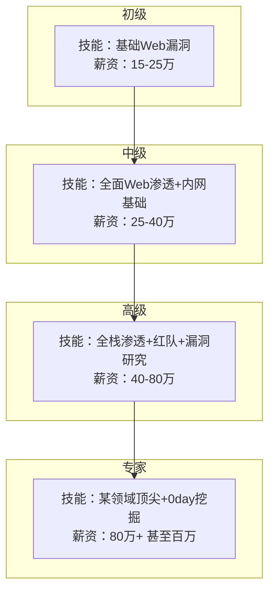

---

## 🏠 荣归故里：网吧再见

### 9.1 回去看看

年薪50万之后，阿强终于有勇气回老家了。

说"荣归故里"可能有点夸张，但是他确实想回去看看。

看看张哥，看看老周，看看网吧那帮兄弟。
也看看，那个他生活了二十多年的小县城。

他特意选了过年的时候回去。

买了高铁票，几个小时就到了。

放在以前，得坐十几个小时的绿皮火车。

出了高铁站，阿强深吸了一口气。

还是熟悉的味道。

县城变化不大，还是老样子。
街道还是那些街道，建筑还是那些建筑。

但是阿强的心境，已经完全不一样了。

他打了个车，直接去了极速网吧。

他想给张哥一个惊喜。

### 9.2 极速网吧

到了网吧门口，阿强停住了脚步。

还是熟悉的招牌，还是熟悉的门面。
只是看起来比以前旧了一些。

推门进去。

网吧里的味道还是那样：烟味、泡面味、汗味...
混合在一起，说不上好闻，但是特别熟悉。

吧台里坐着一个年轻人，阿强不认识。

应该是新来的网管。

阿强走到吧台前，问：

"你好，请问张哥在吗？"

"张哥？哦，你说老板啊？
他在里面呢，我给你叫一声？"

"不用不用，我自己进去找他就行。"

阿强往里走。

老板办公室的门开着，张哥坐在里面，正在看手机。

几年不见，张哥好像老了一点，头发都有点白了。

阿强站在门口，喊了一声：

"张哥！"

张哥抬起头，看到阿强，愣了一下。

然后眼睛一下子瞪大了：

"阿强？！
你小子！你怎么回来了？！"

张哥赶紧站起来，快步走出来，拍着阿强的肩膀：

"我靠！真是你小子！
你可想死我了！
怎么样？在外面混得不错吧？
我就知道你小子能行！"

"张哥，我挺好的。
你怎么样？网吧生意还行吗？"

"嗨，就这样吧。
现在网吧生意不如以前了，家家都有电脑，人人都有手机。
谁还来网吧啊。
也就周末还有点人，平时都冷冷清清的。
对付干呗。"

两个人聊着天，说了很多。

张哥问他在外面怎么样，做什么工作，赚多少钱。

阿强没好意思说年薪50万，就说还行，够用。

但是看他的穿着打扮，还有谈吐，张哥也能猜出来，他混得肯定不错。

"你小子，出息了。
我当年就说，你不是池中之物。
怎么样，我说对了吧？"

"还得多谢张哥你当年照顾我。
要不是你，我还不知道在哪呢。"

"谢啥，都是你自己努力的结果。
我就是给了你个网管的工作，剩下的全是你自己拼出来的。"

**图120-16 回到极速网吧的场景**


### 9.3 老周

聊了一会儿，阿强问：

"张哥，老周呢？他现在怎么样？"

"老周啊？他还在市里那个电脑公司呗。
不过现在好像自己单干了，开了个小公司，做安防和弱电。
听说干得还不错。
你要是想见他，我给他打个电话。"

"好啊好啊！我正想找他呢！"

张哥给老周打了个电话。

老周听说阿强回来了，特别高兴，说马上开车过来。

大概一个多小时后，老周来了。

几年不见，老周也变了不少。
比以前胖了，也更有老板范儿了。

但是看到阿强，还是那样哈哈大笑：

"我操！阿强！你小子可回来了！
怎么样？听说你混得不错啊！
都成大神了！"

"周哥，你就别取笑我了。
什么大神不大神的，就是个打工的。"

"打工的？骗谁呢。
我都听别人说了，你现在可是网络安全领域的大牛。
年薪好几十万呢吧？"

阿强不好意思地笑了笑："还行还行..."

"你看你看，我就说吧！
当年我第一眼看到你，就觉得你小子不一般。
怎么样？我没看错吧？"

老周还是那样，爱开玩笑。

两个人聊了很久。

从当年的网吧被攻击，聊到阿强刚开始学安全，聊到挖SRC，聊到第一次项目搞砸，聊到护网...

老周听得津津有味。

"可以啊你小子！
护网都参加过了！还立了大功！
牛逼！
没白瞎我当年教你的那点东西。"

"周哥，要不是你当年带我入门，我还不知道在干什么呢。
真的谢谢你。"

"谢啥，都是你自己努力的结果。
我就是给你指了个路，路是你自己走的。
再说了，你现在比我厉害多了，我都没什么可教你的了。
以后啊，我还得向你请教呢。"

"周哥你可别这么说... 在我心里，你永远是我师傅。"

那天晚上，三个人喝了很多酒。

聊到很晚才散。

> ❤️ **阿强的心情**：
> "那天晚上，喝着酒，聊着天，我心里特别暖。
> 这个小县城，是我长大的地方。
> 这个网吧，是我梦开始的地方。
> 张哥、老周，是我生命中的贵人。
> 没有他们，就没有我的今天。
> 人这一辈子，不能忘本。
> 不管走多远，飞多高，都不能忘了自己是从哪来的。"

### 9.4 物是人非

阿强在县城待了一个星期。

这一个星期里，他见了很多老朋友。

有的还在联系，有的已经断了音讯。

他发现，很多事情都变了。

当年一起在网吧玩游戏的兄弟，有的结婚生子了，有的去外地打工了，有的还在混日子。

极速网吧的生意，也确实大不如前了。
以前高峰期满座的景象，再也看不到了。

时代在变，很多东西都不一样了。

但是也有一些东西没变。

比如张哥的热情，老周的爽朗，还有县城里那种熟悉的味道。

阿强站在网吧门口，看着街上来来往往的人，心里感慨万千。

几年前，他就是从这里出发，去大城市闯荡。

那时候的他，忐忑不安，不知道未来会怎样。

现在的他，虽然算不上什么大人物，但是至少，他靠自己的努力，改变了自己的命运。

他没有辜负当年那个下定决心的自己。

---

## 💡 感悟与建议

### 10.1 给后来者的建议

故事讲到这里，差不多就结束了。

最后，阿强有几句话，想对正在学习网络安全的朋友们说。

这些话，都是他的亲身经历，掏心窝子的话。

**第一，不要怕起点低。**
"很多人问我，我学历低，我基础差，我能学安全吗？
我想说，当然能！
我初中毕业，还当过网吧网管，我都能学，你为什么不能？
起点低不可怕，可怕的是不敢开始。
只要你肯学，什么时候都不晚。
真的。"

**第二，兴趣是最好的老师。**
"学安全，一定要有兴趣。
如果你对这行没兴趣，只是觉得赚钱多，想来捞一笔，那我劝你还是别来了。
这行很苦，很枯燥，要学的东西很多。
没有兴趣支撑，你很难坚持下去。
但是如果你真的感兴趣，那再苦再累，你也觉得快乐。
因为你在做自己喜欢的事。"

**第三，多动手，光看书没用。**
"学安全，最重要的就是实操。
书看了再多，教程看了再多，不自己动手，都是白搭。
找个靶场，搭个环境，自己去测，去试，去踩坑。
踩的坑多了，自然就会了。
我当年就是这么过来的。"

**第四，坚持，坚持，再坚持。**
"这行门槛说高不高，说低也不低。
入门容易，但是想学好，很难。
很多人学着学着就放弃了，觉得太难了，觉得自己不是这块料。
我想说，别着急，慢慢来。
谁都是从新手过来的，谁都有过迷茫的时候。
咬咬牙，坚持下去，总能看到曙光的。
我当年挖SRC，挖了好几个月才挖到第一个有效漏洞。
我都没放弃，你急什么？"

**第五，保持敬畏之心，守好底线。**
"最后一点，也是最重要的一点。
学安全，技术是一方面，品德更重要。
你技术再高，如果用在歪路上，那就是犯罪。
记住，我们是白帽子，是保护别人的，不是搞破坏的。
永远不要触碰法律的红线。
这是底线，绝对不能破。"

**图120-17 给初学者的五点建议**


### 10.2 阿强的感悟

最后，再跟大家分享几句阿强的感悟吧。

"很多人说我逆袭，说我励志。
其实我觉得，我就是个普通人。
没什么天赋，也没什么背景。
就是认准了一件事，然后拼了命去干。

我也想过放弃，也有过怀疑自己的时候。
但是每次快撑不下去的时候，我就问自己：
你真的尽力了吗？
你甘心就这样回去吗？
答案是：不甘心。

既然不甘心，那就继续干。
干到干不动为止。

真的，我觉得大多数人，努力的程度，还轮不到拼天赋。
你只要够努力，就能超过90%的人。
剩下那10%，才是拼天赋的。
但是那又怎么样呢？
就算成不了顶尖高手，做一个优秀的工程师，也足够了。
也能生活得很好。

所以啊，别想那么多。
干就完了。

只要你真的努力了，结果不会差的。

我一个初中毕业的网吧网管都能做到，你为什么不行？
对吧？"

**图120-18 阿强的成长金字塔**

```mermaid
graph TD
    A[顶层 年薪50万+ 技术专家]
    B[第四层 年薪30-50万 技术骨干]
    C[第三层 年薪20-30万 资深工程师]
    D[第二层 年薪10-20万 初级工程师]
    E[第一层 月薪几千 网管/零基础]
    
    E -->|努力学习 坚持1-2年| D
    D -->|持续积累 实战2-3年| C
    C -->|深入研究 成为骨干| B
    B -->|技术顶尖 独当一面| A
    
    A -->|关键词：天赋+机遇+努力|
    B -->|关键词：深度+广度+方法论|
    C -->|关键词：实战+经验+思维|
    D -->|关键词：基础+实操+坚持|
    E -->|关键词：兴趣+决心+行动|
```

---

## 📝 本章小结

::: tip 下篇总结
阿强的故事到这里就讲完了。

从一个初中毕业的县城网吧网管，到年薪50万的Web渗透大神。
他用了五年时间。

这五年里，他吃了很多苦，熬了很多夜，也走过很多弯路。
但是他坚持下来了，并且做到了。

他的故事告诉我们：

1. **起点低不可怕，可怕的是不敢开始**
   - 初中毕业又怎样？网吧网管又怎样？
   - 只要肯学，什么时候都不晚

2. **真正的成长，都是被逼出来的**
   - 第一次项目搞砸，被骂得狗血淋头
   - 知耻而后勇，才能快速成长

3. **遇到贵人很重要，但更重要的是自己努力**
   - 老王的教导很重要
   - 但如果阿强自己不努力，再好的师傅也没用

4. **技术可以改变命运**
   - 从月薪1800到年薪50万
   - 技术真的可以改变一个人的人生轨迹

5. **不忘初心，方得始终**
   - 不管走多远，都不要忘了自己是从哪来的
   - 保持敬畏之心，守好底线

最后，希望阿强的故事，能给正在学习网络安全的你，带来一点力量。

加油！未来的大神！
:::

---

## 🤔 思考题

1. 你觉得阿强能成功，最重要的因素是什么？
2. 如果你是阿强，在第一次项目搞砸之后，你会选择放弃还是坚持？
3. 你身边有类似的"草根逆袭"的故事吗？分享一下。
4. 你觉得学习网络安全，最重要的是什么？天赋？努力？兴趣？
5. 你给自己定的目标是什么？你打算怎么实现它？

欢迎在评论区分享你的看法~

---

## 📚 延伸阅读

如果你也想成为像阿强一样的Web渗透工程师，可以继续学习以下章节：

- 第14-17章：入门篇，从零开始学Web安全
- 第18-29章：基础篇，SQL注入、XSS、文件上传...
- 第30-43章：进阶篇，命令执行、文件包含、CSRF、SSRF、逻辑漏洞...
- 第44-62章：高级篇，内网渗透、提权、横向移动、域渗透...
- 第63-83章：大神篇，免杀、CS、红队作战、护网行动...
- 第84-109章：靶场系列，动手实操，巩固所学知识

一步一个脚印，你也可以成为Web渗透大神！

---

> **📌 免责声明**
>
> 本章内容基于真实事件改编，仅用于学习交流。
> 文中涉及的技术细节，仅供学习参考。
> 请勿利用文中提到的技术进行非法活动。
> 未经授权测试他人网站是违法行为！
> 请遵守法律法规，做一名守法的白帽子。
